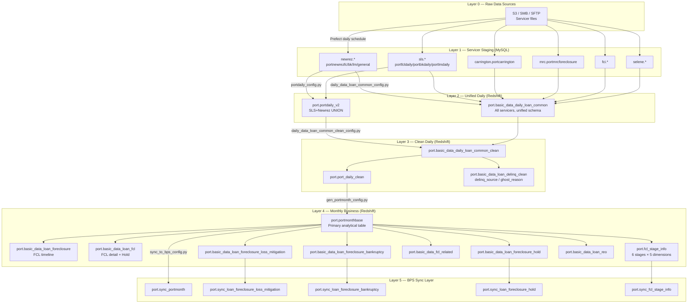
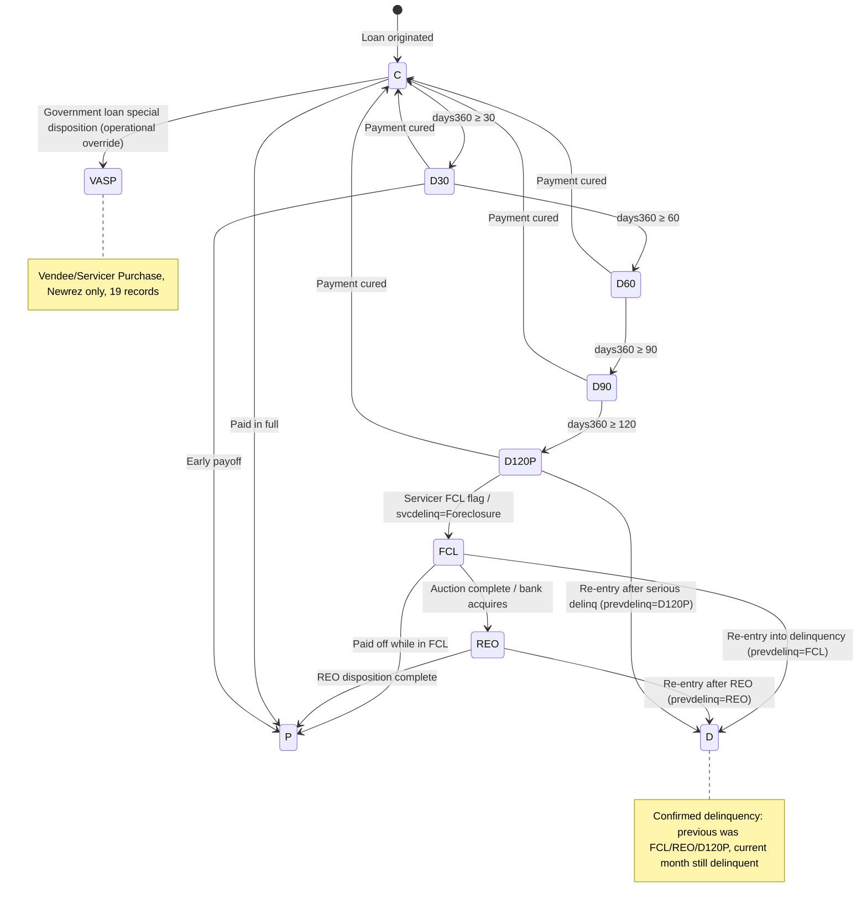
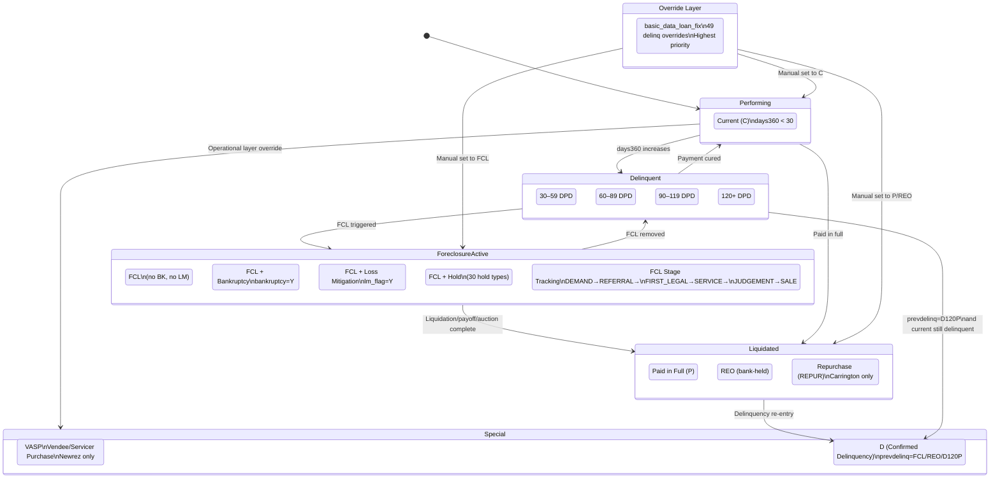
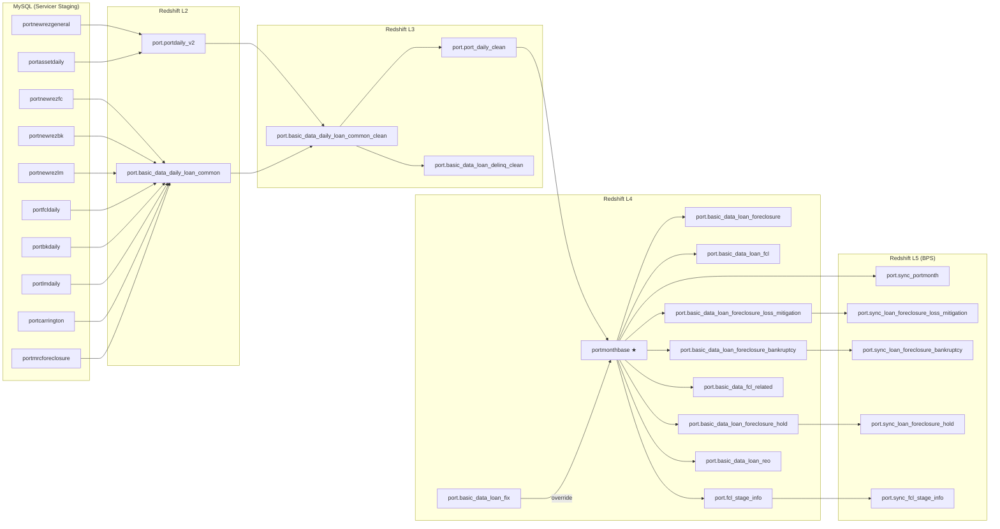
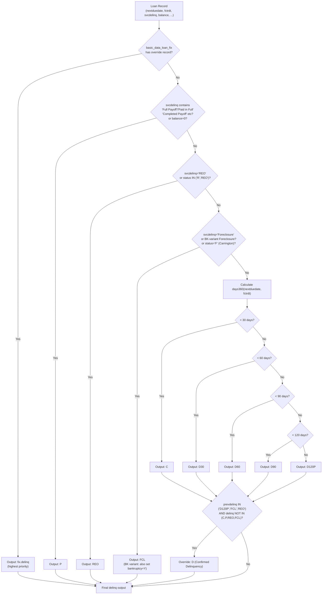
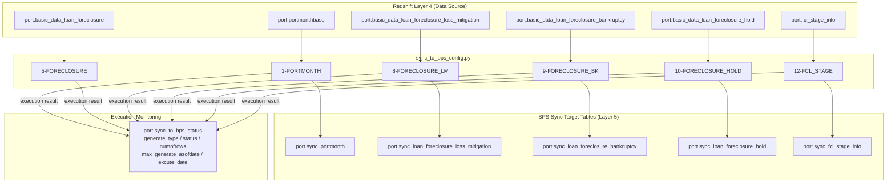

# 06 — System Diagrams

> **Naming note (2024-07-05):** the source-table prefix is now `portnewrez*` (formerly `portshellpoint*`, the Shellpoint era); the live `newrez` schema only has `portnewrez*` — authoritative now; rename history in doc 01.

---

## Document Information

| Field | Content |
|-------|---------|
| **Purpose** | Visual representation of the entire FCL status processing system's architecture, state machine, data flow, and table dependency relationships using Mermaid diagrams. |
| **Problem solved** | Textual descriptions cannot intuitively show status transition paths and inter-table dependencies. This document supplements the text docs with six visual diagram types. |
| **Scope** | High-level data flow, FCL state transition (simple), FCL state machine (detailed), table lineage, rule layers, BPS sync dependencies |
| **System** | Full system (PrefectFlow ETL pipeline) |

**Target audience:** All roles (visual reference)

**Dependencies:** `02_etl_pipeline.md` (pipeline structure), `03_fcl_status_logic.md` (status logic), `04_status_inventory.md` (status codes)

**Revision history:**

| Date | Author | Version | Changes |
|------|--------|---------|---------|
| 2026-06-05 | AI Agent (Claude Opus 4.8) | v2 | Renamed `portshellpoint*`→`portnewrez*` (DB-verified live newrez tables; renamed 2024-07-05) + naming note (DB-verified; doc 01) |
| 2026-05-21 | AI Agent (Claude Sonnet 4.6) | v1 | Initial version, six Mermaid diagram types |

---

## Diagram 1 — High-Level Data Flow (Layer 0 → Layer 5)

---

## Diagram 2 — FCL State Transition (Simple)

---

## Diagram 3 — FCL State Machine (Detailed, with Supplementary Flags)

---

## Diagram 4 — Table Lineage (Key FCL-Related Tables)

---

## Diagram 5 — Rule Layer (delinq Generation Priority)

---

## Diagram 6 — BPS Sync Dependency

---

## Chinese Version

`docs/zh/06_diagrams.md`
