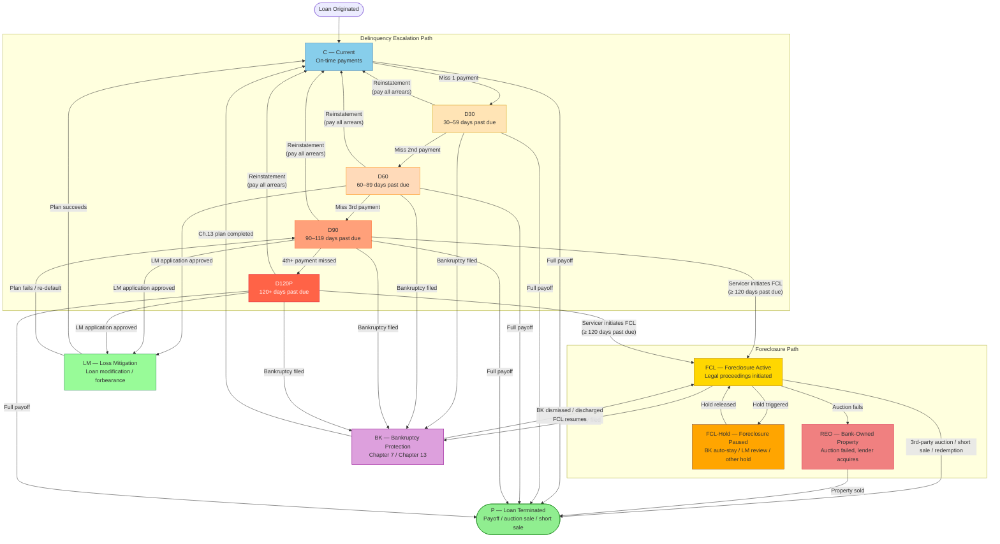
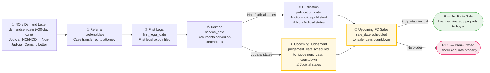

# 07 — FCL Data Lineage & Determination Rules (Per-Servicer Analysis)

---

## Document Information

| Field | Content |
|-------|---------|
| **Purpose** | Document the complete data lineage from raw servicer files (SFTP/S3/API) through to `delinq = 'FCL'` status output, per servicer. Exposes the completeness and gaps in the current system implementation. |
| **Problem solved** | FCL determination logic is scattered across multiple config files, and implementation completeness varies widely by servicer (3 complete, 5 missing or partial). New team members cannot quickly assess system state and risks. |
| **Scope** | Raw file ingestion → MySQL staging → Redshift normalization → delinq code output; covers 10 servicers |
| **System** | `PrefectFlow/flow/servicer_data/`, `flow/basic_data/transfer_daily_data_config/` |

**Target audience:** Data Product Manager (primary) · Data Engineers · Business Analysts · Validators · Future AI sessions

**Dependencies:**
- `01_source_data.md`: Raw staging table field reference
- `02_etl_pipeline.md`: Full ETL pipeline architecture
- `03_fcl_status_logic.md`: Complete delinq state machine rules

**Revision history:**

| Date | Author | Version | Changes | Related |
|------|--------|---------|---------|---------|
| 2026-05-24 | AI Agent (Claude Sonnet 4.6) | v1 | Initial version — reverse engineered from PrefectFlow source code | prompt.md |
| 2026-05-24 | AI Agent (Claude Sonnet 4.6) | v1.1 | Section 2.1: added days360 parameter reference, delinquency bucket table, FCL vs delinquency-age distinction | — |
| 2026-05-24 | AI Agent (Claude Sonnet 4.6) | v1.2 | New section 1.1: all-servicer ingestion overview table, three Excel sheet ingestion patterns, delete-then-insert strategy | — |
| 2026-05-24 | AI Agent (Claude Sonnet 4.6) | v1.3 | New section 2.4: US mortgage loan lifecycle state diagram (11-state Mermaid flowchart), full transition table, FCL sub-stages, judicial vs. non-judicial state comparison | — |
| 2026-05-24 | AI Agent (Claude Sonnet 4.6) | v1.4 | New section 2.5: Foreclosure deep dive (who/why/6-stage process/5 exit paths), Ch.7 Lien concept, Ch.7 vs Ch.13 comparison, FCL+BK concurrent state | — |
| 2026-05-25 | AI Agent (Claude Sonnet 4.6) | v1.5 | New section 1.2: basic_data_loan_fcl vs basic_data_loan_foreclosure upstream/downstream relationship, 61/62-column field group breakdown, INSERT-populated vs NULL field analysis, 3-servicer coverage note (source-code + Redshift verified) | — |
| 2026-05-26 | AI Agent (Claude Sonnet 4.6) | v2 | New section 2.4.6: BPS FCL Operational Stage Pipeline (Mermaid flowchart, 7-stage table, "Upcoming" naming rationale, design rationale analysis, comparison with theoretical model) | — |
| 2026-06-05 | AI Agent (Claude Opus 4.8) | v2.1 | §2.4.6 ① NOI/Demand Letter node: flowchart now distinguishes NOI vs Demand Letter (Judicial=NOI/NOD, Non-Judicial=Demand Letter, same field demandsentdate, ~30-day cure, pre-FCL, per doc 10 glossary); Key Fields demand_date/noi_date → demand_start_date (noi_start_date always NULL); added the data caveat (this DEMAND stage is normally 0 in agg-summary — ingestion needs fcreferraldate non-null, DEMAND needs it NULL, only pre-referral D90/D120P). Synced to doc 17 §4.6 / fcl_pipeline.html | doc 10 · doc 17 · fcl_pipeline.html |
| 2026-06-08 | AI Agent (Claude Opus 4.8) | v2.2 | Corrected §2.4 state machine: removed the wrong `BK →(debt discharged)→ P` edge (Ch.7 discharge only releases personal liability; the mortgage lien survives, the loan is NOT paid off); removed "discharge" from the P node label; §2.4.3 `BK → P` row rewritten as "no direct P" — consistent with §2.5 Ch.7 lien note and doc 17/14/fcl_pipeline.html | doc 17 · doc 14 · fcl_pipeline.html |
| 2026-06-08 | AI Agent (Claude Opus 4.8) | v2.3 | Added a "four independent dimensions" supplementary note below the §2.4 state machine (dimension table + example-combinations table + 3 clarifications). **The state diagram itself is unchanged** (text-only addition) | doc 17/14 · fcl_pipeline.html |
| 2026-06-08 | AI Agent (Claude Opus 4.8) | v2.4 | §2.5 BK deep dive: added "Official Sources & Legal Basis for BK State Transitions" — uscourts.gov Bankruptcy Basics links + per-transition Title 11 statute links (§ 362 / § 1322 / § 1328 / § 727 / § 524, Cornell LII) with verbatim excerpts; §2.4.3 pointer; clarified the system passes through servicer status (no coded BK→C trigger, 03_fcl_status_logic.md §2.1 L77–114). URLs + quotes verified via WebFetch | doc 17 · 03_fcl_status_logic.md |
| 2026-06-09 | AI Agent (Claude Opus 4.8) | v2.5 | §2.5 chapter table expanded from Ch.7/11/13 to **Ch.7/11/12/13/15 (five chapters)** (added Chapter 12 Family Farmer/Fisherman and Chapter 15 Cross-Border, enriched each chapter's core mechanism); added servicer-perspective summary; "Authoritative sources" uscourts.gov links expanded from 2 to **5** (all five chapters), URLs verified via WebFetch. **Kept consistent with doc 17 §5.4** | doc 17 · uscourts.gov |

---

## 1. End-to-End Data Lineage Architecture

```
┌──────────────────────────────────────────────────────────────────────┐
│  Step 0: Raw Files (daily / monthly)                                 │
│  SFTP → S3 (brigaws)   OR   SMB network share   OR   API            │
│  Formats: .txt / .csv / .xlsx / GraphQL                              │
└────────────────────────────┬─────────────────────────────────────────┘
                             │  PrefectFlow load_daily_*_flow.py
                             ▼
┌──────────────────────────────────────────────────────────────────────┐
│  Step 1: MySQL Staging (per-servicer schema)                         │
│  sls.*   newrez.*   carrington.*   selene.*   mrc.*                  │
│  fci.*   rocket.*   arvest.*   capecodfive.*   sps.*                 │
│  FCL-relevant fields exist here in raw, non-standardized format      │
└────────────────────────────┬─────────────────────────────────────────┘
                             │  daily_data_loan_common_config.py
                             ▼
┌──────────────────────────────────────────────────────────────────────┐
│  Step 2: Redshift port.basic_data_daily_loan_common (unified)        │
│  Common fields: delq_status (raw text), fcl_flag, lm_flag, ...      │
│  ✅ SLS / Newrez / Carrington / Selene / MRC loaded here             │
│  ❌ FCI / Rocket NOT loaded here                                      │
└────────────────────────────┬─────────────────────────────────────────┘
                             │  daily_data_loan_common_clean_config.py
                             ▼
┌──────────────────────────────────────────────────────────────────────┐
│  Step 3: Redshift port.basic_data_daily_loan_common_clean            │
│  Key output: delinq (C/D30/D60/D90/D120P/FCL/REO/P/VASP)            │
│  ✅ SLS / Newrez / Carrington / CapeCodFive: full FCL mapping         │
│  🟡 Selene / MRC: daily data NOT in this table (completely absent!)  │
│  🟡 Arvest: days360 fallback only — no FCL text matching             │
│  ❌ FCI / Rocket / SPS: no FCL mapping                               │
└────────────────────────────┬─────────────────────────────────────────┘
                             │  gen_portmonth_config.py (monthly rollup)
                             ▼
┌──────────────────────────────────────────────────────────────────────┐
│  Step 4: Redshift port.portmonthbase (primary analytical table)      │
│  delinq = 'FCL' → loan is in Foreclosure status in report month      │
└────────────────────────────┬─────────────────────────────────────────┘
                             │  sync_to_bps_config.py
                             ▼
┌──────────────────────────────────────────────────────────────────────┐
│  Step 5: BPS sync (downstream reporting system)                      │
│  5-FORECLOSURE → port.basic_data_loan_foreclosure → BPS             │
└──────────────────────────────────────────────────────────────────────┘
```

### 1.1 File Ingestion Details (Step 0 → Step 1)

#### 1.1.1 All-Servicer Ingestion Overview

Each servicer maps to exactly **one dedicated MySQL schema (database)** — strict one-to-one.

| Servicer | MySQL Schema | File Format | Transport | Frequency | Date Key Field |
|----------|-------------|-------------|-----------|-----------|----------------|
| SLS | `sls` | `.txt` (fixed-width) | SFTP → S3 | Daily + Monthly | `dataasof` |
| Newrez/Shellpoint | `newrez` | `.csv` | SFTP → S3 | Daily + Monthly | `dataasof` |
| Carrington | `carrington` | `.xlsx` / `.csv` | SFTP → S3 | Daily + Monthly | `dataasof` |
| Selene | `selene` | `.csv` | SFTP → S3 | Daily + Monthly | `as_of_date` |
| MRC | `mrc` | `.txt` (pipe-delimited) | SFTP → S3 | Daily + Monthly | `dataasof` |
| FCI | `fci` | `.xlsx` (API export) | GraphQL API → S3 | Daily | `dataasof` |
| Rocket | `rocket` | `.txt` (pipe-delimited) | SFTP → S3 | Daily + Monthly | `dataasof` |
| Arvest | `arvest` | `.xlsx` | SMB network share | **Monthly only** | `fctrdt` |
| CapeCodFive | `capecodfive` | `.xlsx` | SMB network share | **Monthly only** | `fctrdt` |
| SPS | `sps` | `.xlsx` | SMB network share | **Monthly only** | `fctrdt` |

> Config source: `flow/basic_data/load_servicer_data_config/servicer_config.py` — `MYSQL_DB_MAP`

---

#### 1.1.2 Three Excel Sheet Ingestion Patterns

Each schema contains **multiple tables** (split by file type / content). For Excel files, the sheet handling strategy differs by servicer:

---

**Pattern A: Multiple sheets merged into one table** (Carrington daily only)

Carrington's daily Excel contains two sheets (`DataMain` + `DataARM`). The system merges them via `LEFT JOIN` before writing to a **single table**:

```python
# tasks/servicer_data/daily_task.py
df_main = pd.read_excel(file, sheet_name='DataMain')
df_arm  = pd.read_excel(file, sheet_name='DataARM')
df = pd.merge(df_main, df_arm, how='left', on='Loan Number')
# → merged result written to carrington.portcarrington (1 table)
```

| Sheet | Content | Role in merge |
|-------|---------|---------------|
| `DataMain` | Core loan fields (`loan_status`, `fcl_flag`, and all other FCL-relevant fields) | Primary table |
| `DataARM` | ARM (adjustable-rate) supplement fields | LEFT JOIN on `Loan Number` |

Carrington's other report types (Delinquency / Transactions / Disaster Pipeline) each have 1 sheet and map to their own dedicated table.

---

**Pattern B: One file → one table, routed by filename keyword** (SLS / Newrez / Selene / MRC / FCI / Rocket)

A keyword in the filename determines which MySQL table receives the data, via a static `FILE_TABLE_MAP` config:

**Selene** (4 file types → 4 tables):

| Filename keyword | MySQL table | Description |
|-----------------|------------|-------------|
| `P181` | `selene.portselenebalance` | Balance data |
| `P102` | `selene.portselenedetails` | Asset details |
| `DailyExtract` | `selene.portselenemain` | Main daily report (contains FCL fields) |
| `PmtTransDaily` | `selene.portselenepmttrans` | Payment transactions |

**MRC** (18 file types → 18 tables, selected examples):

| Filename keyword | MySQL table | Description |
|-----------------|------------|-------------|
| `LOAN` | `mrc.portmrcloan` | Main loan table (contains `min_status`) |
| `FORECLOSURE` | `mrc.portmrcforeclosure` | FCL detail table (contains `fc_flag`) |
| `BANKRUPTCY` | `mrc.portmrcbankruptcy` | Bankruptcy data |
| `FORBEARANCE` | `mrc.portmrcforbearance` | Forbearance data |
| `ESCROW` | `mrc.portmrcescrow` | Escrow data |
| `ARM` | `mrc.portmrcarm` | Adjustable-rate data |
| *(18 types total)* | ... | |

**FCI special case** (60+ report types → 60+ tables):

FCI data is pulled via GraphQL API; each report type produces a single-sheet Excel file written to its own MySQL table:

| Report name | MySQL table |
|------------|------------|
| `Loan Portfolio Information` | `fci.portfciloanportfolio` |
| `Loan Details` | `fci.portfciwebloandetails` |
| `Foreclosure` | `fci.portfciwebforeclosure` |
| `Pre-Foreclosure` | `fci.portfciwebpreforclosure` |
| *(60+ types total)* | ... |

---

**Pattern C: SMB monthly report, direct write** (Arvest / CapeCodFive / SPS)

Monthly Excel files are read from an SMB network share — typically single-sheet — and written directly to their target table. **No daily ingest flow exists** for these servicers; data updates once per month.

---

#### 1.1.3 Shared Ingestion Strategy: Delete-then-Insert

All servicers use **delete-then-insert** (upsert by date key), keyed on the date field (`dataasof` / `as_of_date` / `fctrdt`):

```python
# tasks/servicer_data/daily_task.py — upload_data_to_mysql()
# Step 1: delete existing data for this date
DELETE FROM {table} WHERE {key_column} = '{key_date}'
# Step 2: append the new data
df.to_sql(table_name, conn, if_exists="append")
```

| Property | Explanation |
|----------|-------------|
| **Idempotent** | Re-running the same date's file does not create duplicate rows |
| **Self-healing** | When a bad file is corrected, just re-run — no manual cleanup needed |
| **History-safe** | Only the targeted date is deleted; prior dates are untouched |

---

## 1.2 Step 4 Core FCL Tables: basic_data_loan_fcl vs basic_data_loan_foreclosure

> **Summary**: These two tables are in an **upstream/downstream relationship**, not parallel peers. `basic_data_loan_fcl` is the raw operational data layer; `basic_data_loan_foreclosure` is the business intelligence layer built on top of it. **Only 3 Servicers** (Newrez, Carrington, CapeCodFive) feed FCL detail data into either table; the remaining 7 Servicers are not covered here.

### 1.2.1 Data Flow (Source-Verified)

Source file: `flow/basic_data/basic_data_config/basic_data_pool_config.py`

```
newrez.portnewrezfc              ─┐
carrington.portcarrington        ─┤  UNION  →  tempfc.temp_basic_data_fcl    (Line 1530)
capecodfive.portcapecodfive_      ─┘               │
  monthly_collections                              │  LEFT JOIN basic_data_loan_foreclosure_hold_detail
                                                   ↓
                             port.basic_data_loan_fcl                         (Line 1657)
                             61 cols · 1,836,086 rows · full history (daily append)
                                                   │
                                                   │  INSERT SELECT + business logic             (Line 149)
                                                   │  latest snapshot per Servicer only
                                                   ↓
                          port.basic_data_loan_foreclosure
                          62 cols · 6,150 rows · latest snapshot only (DROP + INSERT)
                                                   │
                                       ┌───────────┴──────────┐
                                       ↓                      ↓
                              BPS external system       asset_management MySQL
                         (sync_to_bps_config.py)         (downstream reporting)
```

### 1.2.2 Side-by-Side Comparison

| Dimension | `port.basic_data_loan_fcl` | `port.basic_data_loan_foreclosure` |
|-----------|---------------------------|-------------------------------------|
| **Role** | Raw operational data layer | Business intelligence layer |
| **Columns** | 61 | 62 |
| **Rows** | 1,836,086 (full history) | 6,150 (latest snapshot only) |
| **Update strategy** | Append; full history retained | DROP + INSERT; only latest date per Servicer |
| **Data source** | 3-Servicer UNION + Hold detail JOIN | INSERT SELECT from `basic_data_loan_fcl` |
| **Business logic** | None — stored as-is | CASE transforms (judicial 0/1 → text), SLA target field definitions |
| **Downstream consumers** | Internal pipeline (portmonthbase, snapshots) | BPS external system, asset_management MySQL |
| **Servicer coverage** | 3 (Newrez / Carrington / CapeCodFive) | Same |
| **Code location** | Line 1657 | Line 149 |

> **Why such a large row-count difference?** `basic_data_loan_fcl` retains full daily history (1.8M rows), while `basic_data_loan_foreclosure` keeps only the latest snapshot date per Servicer — approximately the current count of active FCL loans (6,150 rows).

### 1.2.3 port.basic_data_loan_fcl Field Groups (61 columns)

**Group 1: Key Identifiers (4 cols)**

| Field | Meaning | Newrez source | Carrington source | CapeCodFive source |
|-------|---------|--------------|-----------------|-----------------|
| `dataasof` | Snapshot date | `dataasof` | `snap_shot_date` | `fctrdt − 1 day` |
| `loanid` | Bridger loan ID | `loanid` | `loanid` | `bridger_loan_number` |
| `servicer` | Servicer name (literal) | 'Newrez' | 'Carrington' | 'Capecodfive' |
| `svc_loanid` | Servicer's own loan number | `shellpointloanid` | `carrington_ln` | `servicer_loan_number` |

**Group 2: FCL Status (5 cols)**

| Field | Meaning | Sample values | Servicers with data |
|-------|---------|--------------|---------------------|
| `activefcflag` | FCL active flag (1=yes, NULL=no) | 1 / NULL | All 3 |
| `fcstage` | Current FCL stage | DEMAND / REFERRAL / FIRST_LEGAL / SERVICE / JUDGEMENT / SALE / NULL | Newrez, Carrington (mapped from `fcl_sub_status`) |
| `fcresults` | FCL closure reason | REO / Third Party Sale / Reinstated / NULL | Newrez |
| `fcremovaldesc` | FCL exit description | 'Borrower Reinstated' / NULL | Newrez |
| `fcremovaldate` | FCL exit date | DATE / NULL | Newrez |

**Group 3: Stage Timeline (17 cols)**

| Field | Meaning | Servicers with data |
|-------|---------|---------------------|
| `noi_date` | Notice of intent date | CapeCodFive |
| `fcsetupdate` | FCL case setup date | Newrez, Carrington, CapeCodFive |
| `referral_start_date` | Attorney referral date | Newrez, Carrington, CapeCodFive |
| `demandsentdate` | Demand letter sent date | Newrez |
| `demandexpirationdate` | Demand letter expiry date | Newrez |
| `legal_start_date` | First legal action date | Newrez, CapeCodFive |
| `service_start_date` | Service completion date | Newrez, CapeCodFive |
| `fcjudgment_hearing_scheduled` | Judgment hearing scheduled date | Newrez |
| `fcjudgment_end_date` | Judgment completion date | Newrez, CapeCodFive |
| `fcscheduled_sale_date` | Scheduled sale date | Newrez, Carrington, CapeCodFive |
| `fcsale_held_date` | Actual sale date | Newrez, Carrington, CapeCodFive |
| `titleordereddate` | Title search ordered date | Newrez |
| `titlereceiveddate` | Title report received date | Newrez |
| `titlecleardate` | Title cleared date | Newrez |
| `dtdeedrecorded` | Deed recorded date | Newrez |
| `lastfcstepcompleted` | Most recent completed stage name | Newrez, CapeCodFive |
| `lastfcstepcompleteddate` | Most recent completed stage date | Newrez |

**Group 4: Duration Metrics (2 cols)**

| Field | Meaning | Calculation |
|-------|---------|------------|
| `svc_days_infc` | Servicer-reported days in FCL | Newrez: direct from `smsdaysinfc` |
| `daysinfc` | System-calculated days in FCL | `datediff(day, referral_start_date, dataasof) + 1` (Carrington / CapeCodFive) |

**Group 5: Amounts (4 cols)**

| Field | Meaning | Servicers with data |
|-------|---------|---------------------|
| `fcbidamount` | Foreclosure bid amount | Newrez |
| `fcapprbidprice` | Approved bid price | Newrez |
| `fcsaleamount` | Actual sale amount | Newrez |
| `fcl3rdpartyproceedsreceiveddate` | Third-party proceeds received date | Newrez |

**Group 6: Judicial Attributes (5 cols)**

| Field | Meaning | Values | Servicers with data |
|-------|---------|--------|---------------------|
| `judicial` | Judicial foreclosure flag | '0'=non-judicial, '1'=judicial, NULL | Newrez |
| `fcfirm` | Law firm handling FCL | String | Newrez (`fcfirm`), Carrington (`fcl_attorney_name`) |
| `fccontestedflag` | Contested litigation flag | '0' / '1' / NULL | Newrez |
| `jr_sr_lien_flag` | Junior/senior lien flag | — | Newrez |
| `activejnrlienfcflag` | Active junior lien flag | — | Newrez |

**Group 7: Hold Details (24 cols — 4 groups of 6)**

Source: LEFT JOIN `port.basic_data_loan_foreclosure_hold_detail`

| Field naming pattern (n = 1 – 4) | Meaning |
|----------------------------------|---------|
| `fchold{n}description` | Hold type (e.g., 'Bankruptcy Auto-Stay') |
| `fchold{n}startdate` | Hold start date |
| `fchold{n}enddate` | Hold end date |
| `fchold{n}projectedenddate` | Hold projected end date |
| `fchold{n}comment` | Hold comment |
| `holdmodified` / `holdmodified2–4` | Hold record last-modified timestamp |

A loan can have up to 4 concurrent active holds; hence 24 columns.

### 1.2.4 port.basic_data_loan_foreclosure Added Fields (vs basic_data_loan_fcl)

`basic_data_loan_foreclosure` has 62 columns: 4 base columns from `basic_data_loan_fcl`; the remaining 58 columns are organized in 5 prefix groups.

> **⚠️ Important**: The INSERT statement (Line 219) populates only 32 columns. The remaining 30 columns — all `target_*`, all `variance_*`, 5 `timeline_*`, 3 `bid_approval_*`, and 3 `summary_*` — **are NULL in the current implementation**. They are reserved slots for future enrichment.

**timeline_* (19 cols — 14 populated by INSERT)**

| Field | Source (basic_data_loan_fcl) | Populated |
|-------|------------------------------|-----------|
| `timeline_notice_of_intent_date` | `noi_date` | ✅ |
| `timeline_referred_to_foreclosure_date` | `referral_start_date` | ✅ |
| `timeline_title_report_received_date` | `titlereceiveddate` | ✅ |
| `timeline_preliminary_title_cleared_date` | `titlecleardate` | ✅ |
| `timeline_first_legal_date` | `legal_start_date` | ✅ |
| `timeline_service_date` | `service_start_date` | ✅ |
| `timeline_judgement_hearing_set_date` | Computed: earliest hearing date (LEFT JOIN) | ✅ |
| `timeline_judgement_date` | `fcjudgment_hearing_scheduled` | ✅ |
| `timeline_sale_date_projected_date` | `fcscheduled_sale_date` | ✅ |
| `timeline_sale_date_set_date` | Computed: earliest sale set date (LEFT JOIN) | ✅ |
| `timeline_final_title_cleared_date` | `titlecleardate` | ✅ |
| `timeline_sale_date_held_date` | `fcsale_held_date` | ✅ |
| `timeline_third_party_sold_date_date` | NULL (future extension) | ✅ (NULL) |
| `timeline_third_party_proceeds_received_date` | `fcl3rdpartyproceedsreceiveddate` | ✅ |
| `timeline_notice_of_intent_end_date` | — | ❌ NULL |
| `timeline_approved_for_referral_date` | — | ❌ NULL |
| `timeline_referred_to_attorney_date` | — | ❌ NULL |
| `timeline_publication_date` | — | ❌ NULL |
| `timeline_foreclosure_completed_date` | — | ❌ NULL |

**target_* (15 cols — all NULL)**

SLA target days, not populated by the INSERT. Defined values in column comments: `notice_of_intent`=30 days, `first_legal`=120 days, `service`=90 days, `judgement`=30 days, `sale_date_held`=0 days, etc.

**variance_* (4 cols — all NULL)**

`variance_active_bankruptcy`, `variance_completed_bankruptcy`, `variance_estimated_hold_days`, `variance_bankruptcies` — defined in CREATE TABLE but not populated.

**bid_approval_* (4 cols — 1 populated)**

| Field | Populated | Source |
|-------|-----------|--------|
| `bid_approval_bid_amount` | ✅ | `fcbidamount` |
| `bid_approval_status` | ❌ NULL | — |
| `bid_approval_sale_date` | ❌ NULL | — |
| `bid_approval_loan_resolution_holods` | ❌ NULL | — |

**summary_* (16 cols — 13 populated)**

| Field | Meaning | Populated | Logic |
|-------|---------|-----------|-------|
| `summary_foreclosure_status` | FCL status description | ✅ | `activefcflag=1` → 'Active Foreclosure'; closed → 'Closed Foreclosure:{reason}' |
| `summary_judicial_foreclosure` | Judicial flag (0/1) | ✅ | From `judicial` |
| `summary_type` | 'Judicial' / 'Non Judicial' text | ✅ | `judicial=1` → 'Judicial'; `judicial=0` → 'Non Judicial' |
| `summary_firm` | Law firm name | ✅ | From `fcfirm` |
| `summary_foreclosure_bid_amount` | FCL bid amount | ✅ | From `fcbidamount` |
| `summary_srv_fc_bid_amount` | Servicer-reported bid amount | ✅ | From `fcbidamount` |
| `summary_foreclosure_sale_amount` | Actual sale amount | ✅ | From `fcsaleamount` |
| `summary_sms_days_in_fcl` | Servicer-reported days in FCL | ✅ | From `svc_days_infc` |
| `summary_days_in_fcl` | System-calculated days in FCL | ✅ | From `daysinfc` |
| `summary_current_step` | Current FCL stage | ✅ | From `fcstage` |
| `summary_last_step_completed` | Most recent completed stage | ✅ | From `lastfcstepcompleted` |
| `summary_last_step_completed_date` | Most recent stage date | ✅ | From `lastfcstepcompleteddate` |
| `summary_contested_litigation` | Contested litigation flag | ✅ | From `fccontestedflag` |
| `summary_servicer_number` | Servicer number | ❌ NULL | — |
| `summary_completed_foreclosure` | Completed foreclosure flag | ❌ NULL | — |
| `summary_foreclosure_attorney` | Foreclosure attorney name | ❌ NULL | — |

### 1.2.5 Key Limitation: Only 3 Servicers Have FCL Detail Data

**Redshift live query (2026-05-24):**

| Servicer | `basic_data_loan_fcl` rows | Share | Note |
|----------|--------------------------|-------|------|
| Newrez | 1,524,631 | 83.0% | Daily append — full history |
| Carrington | 305,662 | 16.6% | Daily append — full history |
| CapeCodFive | 5,793 | 0.3% | Monthly report — low frequency |
| **Total** | **1,836,086** | 100% | Distinct loans = 8,656 |

`basic_data_loan_foreclosure`: **6,150 rows** (latest snapshot; distinct loans = 6,150).

**FCL Stage distribution (latest snapshot):**

| fcstage | Rows | Meaning |
|---------|------|---------|
| NULL | 5,662 | Closed or no stage data |
| JUDGEMENT | 189 | Judgment phase |
| SERVICE | 146 | Service phase |
| FIRST_LEGAL | 84 | First legal action phase |
| SALE | 56 | Sale phase |
| REFERRAL | 13 | Attorney referral phase |
| DEMAND | 0 | Demand phase (none active) |

**⚠️ The remaining 7 Servicers (SLS / Selene / MRC / FCI / Rocket / Arvest / SPS) are not in these tables.** Their foreclosure status is inferred from the `delinq` field (see Section 3), not tracked via FCL detail records.

---

## 2. US Mortgage Foreclosure Primer

### 2.1 Two FCL Determination Methods

| Method | Description | Who uses it |
|--------|-------------|-------------|
| **Servicer-reported status** | Servicer explicitly marks `status = 'Foreclosure'` in daily/monthly file | SLS, Newrez, Carrington, CapeCodFive |
| **days360 delinquency inference** | `days360(nextduedate, fctrdt) ≥ 30` → bucket D30–D120P | Fallback for all servicers |

> **Critical**: days360 inference can only produce up to `D120P`. **It can never produce `FCL`**. FCL status requires an explicit field from the servicer.

#### Understanding days360(nextduedate, fctrdt)

**Parameter definitions:**

| Parameter | Meaning | Example |
|-----------|---------|---------|
| `nextduedate` | The **next payment due date** for the borrower (the date of the next scheduled payment after the last one) | `2024-03-01` (borrower's March payment due date) |
| `fctrdt` | **Factor Date** — the report cutoff date = first day of the month following the as-of date | `2024-04-01` (April report, cutoff is April 1) |

`days360(nextduedate, fctrdt)` calculates the number of days between the two dates using the **360-day year convention** (each month = 30 days, consistent with mortgage industry / MBA standard). The result is the loan's **delinquency age in days**.

> Example: `nextduedate = 2024-01-01`, `fctrdt = 2024-04-01` → `days360 = 90` → delinq = `D90`

**Delinquency bucket mapping:**

| `days360(nextduedate, fctrdt)` value | delinq code | Meaning |
|--------------------------------------|-------------|---------|
| < 30 days | `C` | Current — borrower is up to date |
| 30 – 59 days | `D30` | 30-day delinquent |
| 60 – 89 days | `D60` | 60-day delinquent |
| 90 – 119 days | `D90` | 90-day delinquent |
| ≥ 120 days | `D120P` | 120+ day delinquent (no upper cap) |

**Why days360 can never produce `FCL`:**

FCL (Foreclosure) is a **legal process status**, not a quantified measure of delinquency severity. The two are entirely independent:

- A loan can be 200 days past due (D120P) and still **not be in FCL** — if the servicer chose a loan modification instead
- A loan can be only 60 days past due (D60) and already **be in FCL** — if the servicer filed early due to prior default history

days360 can only answer "how long has this loan been overdue?" — it cannot answer "has foreclosure legal action been initiated?" `FCL` can only be produced when the servicer **explicitly reports it** in the data file.

### 2.2 Common FCL-Related Servicer Fields

#### What Is the MBA Standard?

**MBA = Mortgage Bankers Association**, founded in 1914, is the national trade association for the US real estate finance industry. Its 2,000+ member companies include banks, servicers, and investment institutions.

The MBA publishes the **MBA Delinquency Classification Standard** — an industry-wide framework that defines how mortgage delinquency and special statuses are categorized and reported. Its purpose is to make data comparable across different servicers, investors, and regulators.

**MBA standard delinquency codes (as used in our system):**

| MBA standard description | Our system delinq code | Meaning |
|--------------------------|----------------------|---------|
| Current | `C` | On-time payments, no delinquency |
| 30 Days Delinquent | `D30` | 30–59 days past due |
| 60 Days Delinquent | `D60` | 60–89 days past due |
| 90 Days Delinquent | `D90` | 90–119 days past due |
| 120+ Days Delinquent | `D120P` | 120+ days past due |
| Foreclosure | `FCL` | Foreclosure proceedings active |
| REO | `REO` | Bank-owned property |
| Paid Off / Full Payoff | `P` | Loan fully repaid and terminated |

**Why do some fields have `_mba` in their name?**

The `_mba` suffix signals that the field's values follow MBA-defined classification vocabulary (e.g., "Foreclosure", "REO", "Current"). By contrast, some servicers (e.g., Carrington) use their own terminology (e.g., "R" for REO, "Completed Payoff" for termination) — these non-standard fields do not carry the `_mba` suffix.

> **Data engineering impact**: `_mba` fields have relatively standardized values and map to delinq codes more directly. Non-`_mba` fields require servicer-specific mapping rules (see each servicer's section in Section 3).

**Common FCL-related field types from servicers:**

| Field type | Example names | Meaning |
|-----------|--------------|---------|
| Status text (MBA standard) | `delinquency_status_mba` (Newrez), `delq_status_mba` (SLS) | MBA-vocabulary delinquency/FCL description |
| Status text (servicer custom) | `loan_status` (Carrington), `min_status` (MRC) | Servicer-defined descriptions requiring custom mapping |
| Activation flag | `fcl_flag`, `fc_flag`, `foreclosure_status_code` | Whether FCL is active (Y/N/Active/status code) |
| Timeline dates | `referral_date`, `first_legal_date`, `sale_date` | Milestone dates in the FCL process |
| Hold reasons | `fchold1description` ~ `fchold4description` | Up to 4 levels of hold reasons |

---

### 2.4 US Mortgage Loan Lifecycle State Diagram

#### 2.4.1 Full Lifecycle Flowchart



> **Four independent dimensions (supplementary note — diagram unchanged)**: the linear diagram above is good for narrative, but **FCL / LM / BK are NOT "the next state" on the delinquency axis** — they are **concurrent dimensions overlaid on the loan** and do **not** change `delinq`. **FCL-Hold is an FCL sub-state** triggered by BK automatic stay / LM review (not a 5th independent state).

| Dimension | Meaning | Values | Field |
|-----------|---------|--------|-------|
| A · Delinquency | How severe is the arrears? | Current → D30 → D60 → D90 → D120P | `delinq` (also holds FCL/REO/P) |
| B · FCL | Legal process started? | N / Y | `activefcflag` |
| C · LM | Active remediation? | N / Y | `lm_flag`(`activelmflag`) |
| D · BK | Borrower filed bankruptcy? | N / Y | `bankruptcy`(`activebkflag`) |

**A loan can sit in several dimensions at once:**

| Example | Delinquency | FCL | LM | BK | Meaning |
|---------|-------------|-----|----|----|---------|
| Typical FCL | `D120P` | Y | N | N | Severe arrears, in legal process |
| FCL + LM talks | `FCL` | Y | Y | N | In FCL but negotiating relief |
| In bankruptcy | `D90` | Y | N | Y | BK automatic stay pauses FCL |
| Normal | `Current` | N | N | N | Performing, no special status |

> Clarifications: ① **FCL-Hold is triggered by BK automatic stay / LM review** (FCL sub-state, not a 5th independent state); ② **while LM/BK/Hold are active, `delinq` is unchanged** (stays FCL or the prior bucket; code `CREATE_FCL_RELATE_ATTR` maps `Foreclosure / Perf·Non-Perf BK` → `FCL`); ③ **P/REO are A-axis disposition terminals**; Ch.7 discharge ≠ payoff (lien survives), so there is no direct `BK→P`.

#### 2.4.2 State Reference & System delinq Code Mapping

| State | System delinq code | How produced | Notes |
|-------|-------------------|-------------|-------|
| Current | `C` | `days360 < 30` | Borrower is current |
| D30 | `D30` | `30 ≤ days360 < 60` | 1 missed payment |
| D60 | `D60` | `60 ≤ days360 < 90` | 2 missed payments |
| D90 | `D90` | `90 ≤ days360 < 120` | 3 missed payments |
| D120P | `D120P` | `days360 ≥ 120` | Highest bucket; no further breakdown |
| LM | — | No independent delinq code | `lm_flag = 'Y'`; delinq still driven by days360 |
| BK | — | No independent delinq code | `bankruptcy = 'Y'`; delinq value unchanged |
| FCL | `FCL` | Servicer explicit report | **days360 can never produce FCL** |
| FCL-Hold | `FCL` | Hold does not change delinq | Hold details in `fchold1~4description` |
| REO | `REO` | Servicer explicit report | Lender holds title post-auction |
| P | `P` | Servicer reports termination | Loan exits the pool |

#### 2.4.3 State Transition Conditions

| Transition | Trigger condition | Typical timing |
|-----------|-----------------|----------------|
| C → D30 | Borrower misses 1 payment | Day 1 of delinquency |
| D30 → D60 | Not cured; misses 2nd payment | Day 31 |
| D60 → D90 | Not cured; misses 3rd payment | Day 61 |
| D90 → D120P | Not cured; 4th+ payment missed | Day 91+ |
| Dx → C | Borrower pays all arrears (reinstatement) | Any time |
| Dx → LM | Servicer approves modification or forbearance | Typically at 60–90 days |
| LM → C | Trial plan successfully completed (usually 3 payments) | After trial period |
| LM → D90 | Plan failed or borrower re-defaults | — |
| D90/D120P → FCL | Servicer submits FCL referral (CFPB requires ≥ 120 days past due + LM outreach completed) | After day 120 |
| FCL → FCL-Hold | Hold triggered: BK automatic stay / LM application pending / SCRA (military) / legal challenge | Any time during FCL |
| FCL-Hold → FCL | Hold cleared: BK dismissed / LM denied / court ruling | — |
| FCL → REO | Foreclosure auction fails; lender acquires at minimum bid | Auction date |
| FCL → P | Third-party wins auction; or short sale closes | Auction / short sale closing date |
| FCL → C | Borrower redeems by paying all arrears (rare) | Any time before auction |
| REO → P | Lender sells REO property | Months after title acquisition |
| Any → P | Voluntary full payoff / prepayment | Any time |
| Dx / FCL → BK | Borrower files for bankruptcy protection | Any time |
| BK → FCL | Bankruptcy dismissed or discharged; FCL resumes | After BK closes |
| BK → C | Ch.13 repayment plan successfully completed | 3–5 years |
| BK → (no direct P) | **Ch.7 discharge only releases the borrower's personal liability; the mortgage lien survives → the loan is NOT paid off**; foreclosure typically resumes (→ FCL → sale, see the Ch.7 lien note below). Ch.13 completion → C (reinstated to current), not P | — |

> **The legal basis and official links for each BK transition** (`Dx/FCL→BK` / `BK→FCL` / `BK→C` / `Ch.7→FCL`) are in §2.5 "Official Sources & Legal Basis for BK State Transitions" (uscourts.gov + Title 11 § 362 / § 1322 / § 1328 / § 727 / § 524).

#### 2.4.4 FCL Internal Sub-Stages

Loans with `delinq = 'FCL'` are tracked through 6 internal milestones in `port.basic_data_loan_fcl`:

```
DEMAND → REFERRAL → FIRST_LEGAL → SERVICE → JUDGEMENT → SALE
Initial    Formal      First legal    Document   Court        Auction
notice     referral    action         service    judgment     sale
```

The date fields for these milestones (`referral_date`, `first_legal_date`, `sale_date`, etc.) are the key data source for analyzing FCL timeline compliance against FNMA/FHLMC overdue-penalty guidelines.

#### 2.4.5 Judicial vs. Non-Judicial Foreclosure by State

US foreclosure law falls into two types, directly affecting how long a loan stays in `FCL` status:

| Dimension | Judicial Foreclosure | Non-Judicial (Power of Sale) |
|-----------|---------------------|------------------------------|
| Process | Must file suit → court judgment → auction; borrower has right to contest | Lender sells directly per contract's power-of-sale clause; no court required |
| Typical timeline | **12 months – 3 years** | **2 – 6 months** |
| Borrower redemption right | Most states allow statutory redemption period (borrower can redeem after auction) | Usually no redemption; title transfers immediately at auction |
| System impact | `FIRST_LEGAL → JUDGEMENT` phase spans longer; more FCL-Hold events | SALE date arrives quickly; shorter FCL record lifetime |

**Key state classifications:**

| Type | Representative states | Typical FCL duration |
|------|----------------------|----------------------|
| Judicial | Florida, New York, New Jersey, Illinois, Ohio, Pennsylvania | 12–36 months |
| Non-judicial | California, Texas, Georgia, Arizona, Nevada, Michigan | 2–5 months |
| Either path | Massachusetts, Connecticut | Depends on path chosen |

> **For the product manager**: Two loans both showing `delinq = 'FCL'` can differ dramatically — a New York loan may have been in FCL for 2 years, a California loan for 3 months. When analyzing FCL inventory, Loss Severity, or timeline compliance, **always segment by state**. `port.basic_data_loan_fcl.referral_date` and `sale_date` are the data foundation for this analysis.

#### 2.4.6 BPS FCL Operational Stage Pipeline

Section 2.4.4 introduced the 6 internal FCL milestones the system tracks (the theoretical model). This section explains how BPS translates that model into **7 operational monitoring stages** and the design rationale behind the choices.

> This section focuses on BPS agg-summary stage groupings and complements the full lifecycle diagram in 2.4.1. Section 2.4.1 shows global state transitions (D30–D120P, LM, BK, and all other states); this section zooms into the FCL portion only.

**Stage Flowchart**



> **NOI vs Demand Letter (same pre-foreclosure notice, different name by state law)**: both are the Newrez field `demandsentdate` (~30-day cure period), sent **before** foreclosure formally starts (≠ FCL started). **Judicial states** (e.g. NY/NJ/FL) call it **NOI (Notice of Intent) / NOD (Notice of Default)**; **Non-Judicial states** (e.g. CA/TX) call it **Demand Letter** (see doc 10 glossary).
>
> ⚠️ **Data caveat**: in the BPS agg-summary stage table `sync_fcl_stage_info`, this DEMAND stage is **normally 0** — ingestion requires `fcreferraldate` non-null while the DEMAND test requires `fcreferraldate IS NULL`, so only **pre-referral (Demand sent but not yet referred, D90/D120P)** loans land here; Newrez `noi_start_date` is always NULL.

**Stage Reference**

| # | BPS Stage | Tracking Mode | Applicable | Key Fields | Description |
|---|-----------|--------------|-----------|-----------|-------------|
| 1 | **NOI / Demand Letter** | Completed | Universal | `demand_start_date` (from `demandsentdate`; `noi_start_date` always NULL) | Formal pre-foreclosure notice (~30-day cure), **≠ FCL started**. **Judicial states** (NY/NJ/FL) call it **NOI (Notice of Intent) / NOD (Notice of Default)**; **Non-Judicial states** (CA/TX) call it **Demand Letter** — same field `demandsentdate`. ⚠️ In the BPS agg-summary stage table this stage is **normally 0**: ingestion needs `fcreferraldate` non-null while DEMAND needs it NULL, so only **pre-referral (D90/D120P)** loans appear |
| 2 | **Referral** | Completed | Universal | `referral_date` | Case transferred to foreclosure attorney. Non-null `fcreferraldate` is BPS's entry filter and the FCL timeline calculation start point |
| 3 | **First Legal** | Completed | Universal | `first_legal_date` | First formal legal action: Judicial = complaint filed in court; Non-Judicial = Notice of Default published. Legal clock starts here |
| 4 | **Service** | Completed | Universal | `service_date` | Legal documents served on borrower and all named defendants. Multi-defendant cases can significantly extend this stage |
| 5 | **Publication** | Completed | Non-Judicial primary | `publication_date` | Non-Judicial states only: public auction notice published (typically 21–30 days before sale). Judicial states show 0 here |
| 6 | **Upcoming Judgement** | **Pending** | Judicial states | `judgement_date`, `to_judgement_days` | Court hearing date is scheduled but has not yet occurred. `to_judgement_days` (countdown) is the key operational metric |
| 7 | **Upcoming FC Sales** | **Pending** | Universal | `sale_date`, `to_sale_days` | Auction date is scheduled but has not yet occurred. `to_sale_days` (countdown) is the key metric. Loan exits FCL at sale (→ P or REO) |

**Why "Upcoming" (Not "Judgement" / "FC Sales")**

Stages 1–5 are named for the most recently *completed* event. Stages 6–7 use the "Upcoming" prefix for the following reasons:

1. **A specific future date is already scheduled**: When a loan enters "Upcoming Judgement", the court has set a specific hearing date. When it enters "Upcoming FC Sales", the auction date is confirmed. Both are known future events.

2. **Field evidence**: `to_judgement_days` (days until judgment date) and `to_sale_days` (days until sale date) are **countdown fields** (future date − today). They only have meaning before the event occurs. The existence of these fields confirms the stage is tracking a **not-yet-occurred event**.

3. **No "Completed" monitoring group is needed after these events**:
   - After judgment (Judicial): loan immediately moves to scheduling the auction → advances to "Upcoming FC Sales"
   - After the auction: loan exits FCL entirely (→ P or REO) — no further FCL monitoring is required
   - Therefore, there is no need for a "Judgement (Completed)" or "FC Sales (Completed)" monitoring group

4. **Eliminates ambiguity**: "Judgement" without a prefix could mean "waiting for judgment" or "judgment has already been entered." "Upcoming" unambiguously means "date is set, event has not yet occurred."

**Design Rationale**

The BPS 7-stage pipeline is a sound design, reflecting the following engineering principles:

1. **Complete coverage**: All meaningful FCL monitoring windows are covered with no large unmonitored gaps.

2. **Publication stage is necessary**: Non-Judicial states (California, Texas, Georgia, Nevada, Arizona, etc.) account for the majority of US FCL volume. Without a Publication stage, there would be no visibility between Service completion and the auction date for these loans.

3. **No "completed" tail group needed**: Loans exit FCL at auction, eliminating any need for a "completed auction" monitoring cohort. The pipeline ends at "Upcoming FC Sales" by intentional design.

4. **Operations-first naming**: Stages are named for the *next pending event*, letting the operations team instantly identify what requires attention without decoding ambiguous status labels.

**Comparison with the Section 2.4.4 Theoretical Model**

| 2.4.4 Model Stage | BPS Pipeline Stage | Change |
|------------------|-------------------|--------|
| DEMAND | ① NOI / Demand Letter | Renamed to business terminology (NOI / Demand Letter); meaning unchanged |
| REFERRAL | ② Referral | Unchanged |
| FIRST_LEGAL | ③ First Legal | Unchanged |
| SERVICE | ④ Service | Unchanged |
| *(no equivalent in model)* | ⑤ Publication | **BPS addition**: covers the Non-Judicial auction notice publication window |
| JUDGEMENT | ⑥ Upcoming Judgement | Semantic shift: from "judgment has occurred" to "judgment is scheduled and pending" |
| SALE | ⑦ Upcoming FC Sales | Semantic shift: from "sale has occurred" to "sale is scheduled and pending" |

---

### 2.5 Foreclosure & Bankruptcy Deep Dive

#### 2.5.1 What Is Foreclosure?

**Definition**: Foreclosure is the legal process by which a lender, acting under the mortgage contract, **forces the sale of the mortgaged property** to recover the outstanding loan balance after a borrower persistently fails to make payments.

**Who initiates it**: The **lender (or its Servicer acting as agent)** — not the borrower. In our company's context:
- We (the Asset Manager) hold investment positions in MBS or loan pools — we are the economic lender
- Servicers (SLS, Newrez, Carrington, etc.) are our agents: they manage loans, collect payments, and initiate foreclosure on our behalf
- So "Servicer initiates FCL" is effectively the Servicer protecting our investment interests

**Why it is initiated**:
- Borrower has failed to make payments for an extended period (typically ≥ 120 days, per CFPB rules)
- All Loss Mitigation options (forbearance, modification) have failed or the borrower has refused to cooperate
- The lender needs to liquidate the collateral (the property) to recover principal and reduce investment losses

---

#### 2.5.2 The Foreclosure Process (6 Stages)

These map directly to the 6 milestones tracked in `port.basic_data_loan_fcl`:

| Stage | System field | Description |
|-------|-------------|-------------|
| **1. Demand (DEMAND)** | `demand_date` | Lender sends formal breach/default letter requiring payment or action |
| **2. Referral (REFERRAL)** | `referral_date` | Servicer transfers case to foreclosure attorney; formal legal proceedings begin |
| **3. First Legal (FIRST_LEGAL)** | `first_legal_date` | Judicial states: complaint filed in court. Non-judicial states: Notice of Default published |
| **4. Service (SERVICE)** | `service_date` | Legal documents formally served on borrower; statutory deadlines begin |
| **5. Judgment (JUDGEMENT)** | `judgement_date` | Court rules in lender's favor, authorizing property sale (judicial states only) |
| **6. Sale (SALE)** | `sale_date` | Property auctioned publicly; title transfers to highest bidder |

---

#### 2.5.3 How Foreclosure Ends (5 Exit Paths)

| Exit path | Description | delinq change | Who drives it |
|-----------|-------------|--------------|---------------|
| **3rd Party Sale** | A bidder wins the auction above the minimum bid | FCL → `P` | Market |
| **REO (Bank-Owned)** | No bidders; lender acquires title at minimum bid | FCL → `REO` | Lender |
| **Reinstatement** | Borrower pays all arrears + fees before the sale date | FCL → `C` | Borrower |
| **Short Sale** | Borrower sells below loan balance with lender's written approval to forgive the shortfall | FCL → `P` | Borrower + Lender |
| **Deed in Lieu** | Borrower voluntarily transfers title to lender; both agree to terminate the loan | FCL → `P` | Borrower + Lender |

> **After REO**: The lender manages the property as an asset (listing, repairs, etc.). Once sold, delinq → `P` and the loan exits the pool.

---

#### 2.5.4 Bankruptcy Deep Dive

##### Who files, and why

**The borrower (homeowner)** files for bankruptcy — it is a defensive action initiated by the borrower, not the lender.

**Reasons**:
- Immediately triggers an **Automatic Stay (11 U.S.C. § 362)** — federal law that instantly halts all collection actions including foreclosure
- Buys time to reorganize finances and avoid immediate loss of the home
- Chapter 13 specifically: propose a repayment plan to cure mortgage arrears and ultimately keep the house

---

##### What Are the Bankruptcy Chapters?

These names come from the **US Bankruptcy Code** (formally: Title 11 of the United States Code), the federal law governing all bankruptcy proceedings. The Code is organized into **chapters**, and the chapter number indicates the type of bankruptcy filing:

| Chapter | Who it applies to | Type & core mechanism |
|---------|------------------|-----------------------|
| **Chapter 7** | Individuals or businesses (the most common consumer bankruptcy) | **Liquidation**: a trustee sells the debtor's non-exempt assets to repay creditors; remaining eligible debts are discharged. Typically **3–6 months**. For a secured mortgage, if the debtor cannot keep paying, the bank may initiate foreclosure. |
| **Chapter 11** | Primarily businesses (also individuals with large debts) | **Reorganization**: the debtor proposes a court-supervised reorganization plan, continuing to operate while repaying debt over time; complex and lengthy, common for large corporations. |
| **Chapter 12** | Family farmers / fishermen | **Family Farmer / Fisherman reorganization**: a **3–5 year** repayment plan while continuing to operate; eligibility and terms are more flexible than Chapter 13. |
| **Chapter 13** | Individuals with regular income (Wage Earner's Plan) | **Personal reorganization**: a **3–5 year** repayment plan that lets the borrower keep property while paying down arrears (including mortgage arrears). For mortgage servicers, the borrower is often still paying (a **"Performing Bankruptcy"**). |
| **Chapter 15** | Cross-border insolvency cases | **Cross-Border Insolvency**: coordinates bankruptcy proceedings across multiple countries, usually alongside a foreign main proceeding; rare in loan portfolios (added by the 2005 BAPCPA). |

> **From a mortgage servicer's perspective**: **Chapter 13 is the most common** — the borrower can cure arrears via a repayment plan and keep the home; **Chapter 7 often signals a possible foreclosure**. So in the mortgage context, only **Chapter 7** and **Chapter 13** are relevant. "Filed Chapter 7 / Chapter 13" has become standard American legal shorthand — the chapter number directly names the procedure type.
>
> Official authoritative descriptions (U.S. Courts — Bankruptcy Basics) for each chapter are linked under "Authoritative sources" below.

##### Chapter 7 vs Chapter 13

| Dimension | Chapter 7 (Liquidation) | Chapter 13 (Reorganization) |
|-----------|------------------------|---------------------------|
| Nickname | Personal bankruptcy liquidation | Wage-earner's plan |
| Core mechanism | Discharge personal debts | 3–5 year repayment plan that includes curing mortgage arrears |
| Can borrower keep the house? | **Usually no** (unless they voluntarily resume payments and lender agrees) | **Usually yes** (if repayment plan is successfully completed) |
| Duration | 3–6 months | 3–5 years |
| FCL outcome | Auto-stay pauses FCL; lender typically resumes FCL after BK closes | Auto-stay pauses FCL; upon plan completion FCL is withdrawn, delinq → `C` |

---

##### Ch.7: Why Does the Lien Survive Discharge?

This is the most commonly misunderstood concept in US bankruptcy. **The key: a mortgage loan creates two distinct legal rights, and bankruptcy can only eliminate one of them.**

```
Your mortgage = two-layer structure

Layer 1: Personal Liability
  — You personally owe the lender money; they can sue you to collect
  — Ch.7 bankruptcy CAN discharge this layer ✅
    (you are no longer personally responsible for the debt amount)

Layer 2: Mortgage Lien (Security Interest on the property)
  — The lender holds a secured interest in the property itself
  — Ch.7 bankruptcy CANNOT eliminate this layer ❌
    (the lien attaches to the property, not to the person)
```

**Plain-language analogy**:

You borrowed $300K to buy a house, pledging it as collateral. You file Ch.7 bankruptcy:
- Court says: you no longer owe the $300K personally ✅
- But: the bank's lien on the house still exists ❌
- Result: if you stay in the house without making payments, the bank can still foreclose — it just **cannot sue you personally for any shortfall** after the sale

**"But if the debt is discharged, can't the borrower release the mortgage lien?"**

The confusion here is between *discharge* and *payoff*:
- **Payoff** = borrower actually repays all the money → bank receives funds → lien is released → property is clear
- **Discharge** = court forgives the personal obligation → bank receives nothing → lien remains → property is **not** clear

Ch.7 is a discharge, not a payoff. The bank never got its money back, so its security interest in the property survives.

**Practical impact comparison**:

| Scenario | Loan balance | Auction price | Deficiency (shortfall) | Can lender pursue borrower for deficiency? |
|----------|-------------|--------------|----------------------|------------------------------------------|
| No BK | $300,000 | $250,000 | $50,000 | ✅ Yes (subject to state law; some states prohibit) |
| After Ch.7 discharge | $300,000 | $250,000 | $50,000 | ❌ No (personal liability was discharged) |

**Bottom line**: Ch.7 protects the **borrower's person** (no personal debt pursuit), but does not protect the **borrower's property** (house can still be foreclosed).

---

##### FCL + BK Concurrent State in the System

When a borrower files bankruptcy while their loan is already in FCL:

| System field | Value | Meaning |
|-------------|-------|---------|
| `delinq` | `FCL` (unchanged) | FCL status does not revert to D120P; the loan remains in foreclosure |
| `bankruptcy` | `Y` | Marks that borrower is under bankruptcy protection |
| `fchold1description` | `Bankruptcy` / `BK Auto-Stay` etc. | Hold reason: automatic stay from bankruptcy filing |

This explains why Newrez's raw `delq_status` field includes these two combined values (see Section 3.2):

| Newrez raw delq_status | Meaning | System delinq |
|------------------------|---------|--------------|
| `Foreclosure / Non-Perf BK` | FCL active + borrower in BK but **NOT following** the Ch.13 repayment plan | `FCL` |
| `Foreclosure / Perf BK` | FCL active + borrower in BK and **actively performing** Ch.13 repayment plan | `FCL` |

Both map to `delinq = 'FCL'`. The difference is the BK compliance status, which affects how long the Hold is expected to last and which exit path is likely.

##### Official Sources & Legal Basis for BK State Transitions

> ⚠️ **These transitions are legal/business reality under the U.S. Bankruptcy Code — not rules this system computes.** The ETL does **not** auto-compute `BK→C` etc.: each month it **passes through** the servicer-reported `delinquency_status_mba`; `Foreclosure / Perf BK` and `Foreclosure / Non-Perf BK` are both mapped to `FCL` by `CREATE_FCL_RELATE_ATTR`, and the loan stays `FCL` until the servicer re-reports `Current` (see `docs/en/03_fcl_status_logic.md` §2.1 lines 77–114 — there is no coded "Ch.13 completed → delinq=C" trigger).

**Authoritative sources (U.S. Courts — Bankruptcy Basics, official per-chapter pages)**

- Chapter 7 (Liquidation): <https://www.uscourts.gov/court-programs/bankruptcy/bankruptcy-basics/chapter-7-bankruptcy-basics>
- Chapter 11 (Business reorganization): <https://www.uscourts.gov/court-programs/bankruptcy/bankruptcy-basics/chapter-11-bankruptcy-basics>
- Chapter 12 (Family Farmer / Fisherman): <https://www.uscourts.gov/court-programs/bankruptcy/bankruptcy-basics/chapter-12-bankruptcy-basics>
- Chapter 13 (Wage Earner's repayment plan): <https://www.uscourts.gov/court-programs/bankruptcy/bankruptcy-basics/chapter-13-bankruptcy-basics>
- Chapter 15 (Cross-Border Insolvency): <https://www.uscourts.gov/court-programs/bankruptcy/bankruptcy-basics/chapter-15-bankruptcy-basics>

**Per-transition statutory basis (Title 11 U.S. Code; links to Cornell LII official text)**

| Transition | Statutory basis | Official link | Key statutory text (excerpt) |
|------------|-----------------|---------------|------------------------------|
| `Dx/FCL → BK` (borrower files BK; FCL pauses) | **11 U.S.C. § 362(a)** automatic stay | <https://www.law.cornell.edu/uscode/text/11/362> | filing *"operates as a stay"* on *"any act to … enforce any lien against property of the estate"* / *"any act to collect … a claim against the debtor"* |
| `BK → FCL` (lender resumes FCL) | **11 U.S.C. § 362(d)** relief from stay (Motion for Relief); or BK dismissed/discharged | <https://www.law.cornell.edu/uscode/text/11/362> | court *"shall grant relief from the stay … such as by terminating, annulling, modifying, or conditioning such stay"*, *"for cause, including the lack of adequate protection"* |
| `BK → C` (Ch.13 plan completed → current) | **11 U.S.C. § 1322(b)(5)** cure arrears + maintain payments; **§ 1328(a)** discharge on completion | <https://www.law.cornell.edu/uscode/text/11/1322> · <https://www.law.cornell.edu/uscode/text/11/1328> | § 1322(b)(5): *"provide for the curing of any default within a reasonable time and maintenance of payments while the case is pending …"*; § 1328(a): discharge *"as soon as practicable after completion by the debtor of all payments under the plan"* |
| `Ch.7 → FCL` (no direct `BK→P`: discharge ≠ payoff, lien survives) | **11 U.S.C. § 727** Ch.7 discharge of personal liability; **§ 524(a)(2)** injunction limited to personal liability | <https://www.law.cornell.edu/uscode/text/11/727> · <https://www.law.cornell.edu/uscode/text/11/524> | § 524(a)(2): discharge *"operates as an injunction against … an action … to collect … any such debt **as a personal liability of the debtor**"* → in rem lien survives (cf. *Dewsnup v. Timm*, 502 U.S. 410) |

---

## 3. Per-Servicer Lineage & Determination Rules

### 3.1 SLS ✅ Fully Implemented

**File source:** SFTP → S3 (`sls_raccoon/`) → MySQL  
**Format:** `.txt` (16 file types)  
**Key staging tables:** `sls.portassetdaily` (contains `delq_status_mba`), `sls.portfcldaily`

**Step 2 field mapping:**
```
sls.portassetdaily.delq_status_mba → basic_data_daily_loan_common.delq_status
fcl_flag → null (SLS does not provide this field)
```

**Step 3 FCL rule** (`daily_data_loan_common_clean_config.py` lines 180–191):

> **Alias note:** `s` = `port.basic_data_daily_loan_common` (subquery alias `WHERE servicer = 'SLS'`, source lines 319–321)

```sql
-- s = port.basic_data_daily_loan_common WHERE servicer='SLS' (source lines 319–321)
CASE
  WHEN s.delq_status = 'Foreclosure'  THEN 'FCL'
  WHEN s.delq_status = 'Paid in Full' THEN 'P'
  WHEN s.delq_status = 'REO'          THEN 'REO'
  ELSE [days360 fallback C/D30/D60/D90/D120P]
END
```

**Note:** SLS → Newrez handover date is `2024-07-05`.

---

### 3.2 Newrez / Shellpoint ✅ Fully Implemented

**File source:** SFTP → S3 (`shellpoint_new/`) → MySQL  
**Format:** `.csv` (20+ file types)  
**Key staging tables:** `newrez.portnewrezgeneral` (contains `delinquency_status_mba`), `newrez.portnewrezfc`, `newrez.portnewrezlm`

**Step 2 field mapping:**
```
newrez.portnewrezgeneral.delinquency_status_mba → basic_data_daily_loan_common.delq_status
newrez.portnewrezlm.activelmflag ('1' → 'Y')    → basic_data_daily_loan_common.lm_flag
fcl_flag → null
```

**Step 3 FCL rule** (`daily_data_loan_common_clean_config.py` lines 355–366):

> **Alias note:** `p` = `port.basic_data_daily_loan_common` (subquery alias `WHERE servicer = 'Newrez'`, source lines 481–483)

```sql
-- p = port.basic_data_daily_loan_common WHERE servicer='Newrez' (source lines 481–483)
CASE
  WHEN p.delq_status = 'Full Payoff'                         THEN 'P'
  WHEN p.delq_status = 'REO'                                 THEN 'REO'
  WHEN p.delq_status IN (
    'Foreclosure',
    'Foreclosure / Non-Perf BK',
    'Foreclosure / Perf BK'
  )                                                          THEN 'FCL'
  ELSE [days360 fallback]
END
```

**Special:** VASP deal loans are hard-coded as `delinq = 'VASP'` (lines 493–640).

---

### 3.3 Carrington ✅ Fully Implemented (dual-field check)

**File source:** SFTP → S3 (`carrington_new/`) → MySQL  
**Format:** `.xlsx` or `.csv`  
**Key staging table:** `carrington.portcarrington` (contains both `loan_status` AND `fcl_flag`)

**Step 2 field mapping:**
```
carrington.portcarrington.loan_status  → basic_data_daily_loan_common.delq_status
carrington.portcarrington.fcl_flag     → basic_data_daily_loan_common.fcl_flag  ★ used!
carrington.portcarrington.lm_flag ('Active' → 'Y') → basic_data_daily_loan_common.lm_flag
```

**Step 3 FCL rule** (`daily_data_loan_common_clean_config.py` lines 670–681):

> **Alias note:** `c` = `port.basic_data_daily_loan_common` (subquery alias `WHERE servicer = 'Carrington'`)

```sql
-- c = port.basic_data_daily_loan_common WHERE servicer='Carrington'
-- ★ Only servicer that checks BOTH delq_status AND fcl_flag
CASE
  WHEN c.delq_status = 'Foreclosure' OR c.fcl_flag = 'Active'           THEN 'FCL'
  WHEN c.delq_status IN ('R', 'REO')                                     THEN 'REO'
  WHEN c.delq_status IN (
    'Completed Payoff', 'Completed Short Sale', 'Completed REO Sale'
  )                                                                      THEN 'P'
  ELSE [days360 fallback]
END
```

> **Design strength**: The `OR c.fcl_flag = 'Active'` provides a backup safety net — even if `loan_status` doesn't explicitly say 'Foreclosure', an active FCL flag still triggers classification. **This dual-field protection is missing for other servicers.**

---

### 3.4 Selene 🟡 Field Captured, delinq Mapping Missing

**File source:** SFTP → S3 (`selene_new/`) → MySQL  
**Format:** `.csv` (P181, P102, DailyExtract, PmtTransDaily)  
**Key staging table:** `selene.portselenemain`

**Step 2 field mapping** (`daily_data_loan_common_config.py` lines 421, 478):
```python
c.loan_status               AS delq_status     -- delinquency status text
c.foreclosure_status_code   AS fcl_flag        -- FCL activation code (captured but NOT used!)
CASE WHEN c.lm_setup_date IS NOT NULL THEN 'Y' ELSE 'N' END AS lm_flag
```

**Step 3 status: ❌ MISSING**

`daily_data_loan_common_clean_config.py` has no `GEN_BASIC_DATA_DAILY_LOAN_COMMON_CLEAN_SELENE` variable. Selene's daily data exists in Step 2 but is **never processed into the clean table (Step 3)**. Selene loans have no daily-path delinq status in `portmonthbase`.

**Recommended fix:**
```sql
CASE
  WHEN fcl_flag NOT IN ('Completed', 'Closed') AND fcl_flag IS NOT NULL THEN 'FCL'
  WHEN delq_status LIKE '%Foreclosure%'                                  THEN 'FCL'
  WHEN delq_status LIKE '%REO%'                                          THEN 'REO'
  WHEN delq_status LIKE '%Paid%'                                         THEN 'P'
  ELSE [days360 fallback]
END
```
> **Required first**: Query `selene.portselenemain.foreclosure_status_code` distinct values to confirm which values indicate active FCL.

---

### 3.5 MRC 🟡 Field Captured, delinq Mapping Missing

**File source:** SFTP → S3 (`mrc_new/`) → MySQL  
**Format:** `.txt` fixed-width (`LDF_BRIDGER_INVESTMENT_<TYPE>_D_YYYYMMDD.txt`)  
**Key staging tables:** `mrc.portmrcloan` + `mrc.portmrcforeclosure` (separate FCL table via LEFT JOIN)

**Step 2 field mapping** (`daily_data_loan_common_config.py` lines 508–584):
```python
# Main loan table LEFT JOIN dedicated FCL table
FROM mrc.portmrcloan l
LEFT JOIN mrc.portmrcforeclosure fc ON l.loanid = fc.loanid AND l.dataasof = fc.dataasof

l.min_status   AS delq_status   -- minimum status (delinquency text)
fc.fc_flag     AS fcl_flag      -- FCL activation flag (captured but NOT used!)
```

**Step 3 status: ❌ MISSING** — same as Selene. MRC daily data never enters the clean table.

**Recommended fix:**
```sql
CASE
  WHEN fc.fc_flag IN ('Y', 'Active', '1')  THEN 'FCL'
  WHEN l.min_status LIKE '%Foreclosure%'   THEN 'FCL'
  WHEN l.min_status LIKE '%REO%'           THEN 'REO'
  WHEN l.min_status LIKE '%Paid%'          THEN 'P'
  ELSE [days360 fallback]
END
```

---

### 3.6 Arvest 🟡 Monthly Only, days360 Fallback Only

**File source:** SMB share → MySQL (monthly only, no daily data)  
**Format:** `.xlsx` (multiple Excel files merged)  
**Key staging tables:** `arvest.portarvestremit`, `arvest.portarvestremitmonthlystatement`

**Step 3 FCL rule** (`daily_data_loan_common_clean_config.py` lines 898–905):

> **Alias note:** `r` = `d.tmparvestremitadvprevbal` (Redshift temp table built from `arvest.portarvestremit` + `arvest.portarvestremitmonthlystatement`, source line 1000)

```sql
-- r = d.tmparvestremitadvprevbal (Arvest monthly temp table, source line 1000)
-- ⚠️ days360 only — no 'Foreclosure' text matching
CASE
  WHEN days360(r.nextduedate, r.fctrdt) < 30  THEN 'C'
  WHEN days360(r.nextduedate, r.fctrdt) < 60  THEN 'D30'
  WHEN days360(r.nextduedate, r.fctrdt) < 90  THEN 'D60'
  WHEN days360(r.nextduedate, r.fctrdt) < 120 THEN 'D90'
  ELSE 'D120P'
END
```

> **Key issue**: `delinq = 'FCL'` can **never** be produced for Arvest loans. Foreclosure loans will be misclassified as `D120P`. Need to confirm whether `portarvestremitmonthlystatement` contains a loan status field.

---

### 3.7 CapeCodFive 🟡 Monthly Only, Basic FCL Text Matching

**File source:** SMB share → MySQL (monthly only)  
**Key staging table:** `capecodfive.portcapecodfive_monthly_servicing` (contains `mba_delinquency_status`)

**Step 3 FCL rule** (`daily_data_loan_common_clean_config.py` lines 1090–1102):

> **Alias note:** `r` = `d.tmpportalicgeneralprevbal` (Redshift temp table built from `capecodfive.portcapecodfive_monthly_servicing` + `portcapecodfive_remit_report`, source line 1193)

```sql
-- r = d.tmpportalicgeneralprevbal (CapeCodFive monthly temp table, source line 1193)
CASE
  WHEN svcdelinq = 'Foreclosure'      THEN 'FCL'
  WHEN svcdelinq IN ('R', 'REO')      THEN 'REO'
  WHEN svcdelinq = 'Completed Payoff' THEN 'P'
  WHEN r.nextduedate IS NULL          THEN NULL
  ELSE [days360 fallback]
END
```

> **Limitation**: 100% dependent on `mba_delinquency_status` text. No FCL activation flag available as fallback.

---

### 3.8 FCI ❌ FCL Logic Not Implemented

**File source:** GraphQL API → S3 (`fci_new/`) → MySQL (60+ report types, 3 token modes)

**Staging tables exist but are unused for delinq:**
- `fci.portfciwebforeclosure` (FCL report, loaded ✅)
- `fci.portfciwebpreforclosure` (pre-FCL report, loaded ✅)

**Status**: Both `daily_data_loan_common_config.py` and `daily_data_loan_common_clean_config.py` have **no FCI processing logic**. FCI loans have no delinq status in `portmonthbase`.

---

### 3.9 Rocket ❌ FCL Logic Not Implemented

**File source:** SFTP → S3 (`rocket_new/`) → MySQL  
**Staging tables exist but unused:** `rocket.portrocketforeclosure`, `rocket.portrocketloan`  
**Status:** No processing logic. Same gap as FCI.

---

### 3.10 SPS ❌ FCL Logic Not Implemented

**Data type:** Monthly only  
**Status:** Referenced only for remittance adjustments in `daily_data_loan_common_clean_config_v2.py`; no FCL logic.

---

## 4. Gap Analysis

### 4.1 Implementation Status Matrix

| Servicer | Ingest | Step 2 | Step 3 delinq | FCL text match | FCL flag used |
|----------|--------|--------|---------------|----------------|---------------|
| SLS | ✅ | ✅ | ✅ | ✅ | ➖ no field |
| Newrez | ✅ | ✅ | ✅ | ✅ | ➖ null |
| Carrington | ✅ | ✅ | ✅ | ✅ | ✅ fcl_flag |
| CapeCodFive | ✅ monthly | ✅ | ✅ | ✅ | ➖ no field |
| Selene | ✅ | ✅ | ❌ **absent** | ❌ | ⚠️ captured, unused |
| MRC | ✅ | ✅ | ❌ **absent** | ❌ | ⚠️ captured, unused |
| Arvest | ✅ monthly | ✅ | ✅ days360 only | ❌ | ➖ no field |
| FCI | ✅ | ❌ **absent** | ❌ | ❌ | ❌ table exists, unused |
| Rocket | ✅ | ❌ **absent** | ❌ | ❌ | ❌ table exists, unused |
| SPS | ✅ monthly | partial | ❌ | ❌ | ➖ unknown |

### 4.2 Risk Levels

| Risk | Impact | Servicers |
|------|--------|-----------|
| 🔴 **High**: FCL loans not recognized | delinq shows D120P instead of FCL | Selene (daily), MRC (daily) |
| 🔴 **High**: Servicer data never reaches analytics table | All status missing | FCI, Rocket |
| 🟡 **Medium**: FCL depends solely on text match, no flag backup | Miss if servicer misreports | SLS, Newrez, CapeCodFive |
| 🟡 **Medium**: Monthly data delay (T+1 month) | Status lags | Arvest, CapeCodFive |
| 🟢 **Low**: Complete implementation | — | SLS, Newrez, Carrington |

---

## 5. Recommended Universal FCL Rule Framework

### 5.1 Priority Stack

```
Priority 1 (highest): Manual override
  Record in port.basic_data_loan_fix → use corrected delinq

Priority 2: FCL activation flag (use when available)
  fcl_flag NOT IN ('Completed', 'Closed', NULL) → FCL
  or fcl_flag IN ('Active', 'Y', '1', 'Pending') → FCL

Priority 3: Status text matching
  status_field LIKE '%Foreclosure%'              → FCL
  status_field LIKE '%REO%'                      → REO
  status_field LIKE '%Paid%' OR 'Full Payoff'    → P
  status_field LIKE '%Bankruptcy%'               → bankruptcy = 'Y'

Priority 4: days360 fallback (when servicer reports no status)
  days360(nextduedate, fctrdt) < 30              → C
  30~60                                          → D30
  60~90                                          → D60
  90~120                                         → D90
  >= 120                                         → D120P
  (Note: this path NEVER produces FCL)
```

### 5.2 SQL Template for New Servicer Onboarding

```sql
CASE
  -- Priority 2: FCL activation flag
  WHEN COALESCE(fcl_flag, '') NOT IN ('Completed', 'Closed', '')
    AND fcl_flag IS NOT NULL                          THEN 'FCL'
  -- Priority 3a: Status text → FCL
  WHEN delq_status LIKE '%Foreclosure%'              THEN 'FCL'
  -- Priority 3b: Status text → REO
  WHEN delq_status IN ('REO', 'R', 'Real Estate Owned') THEN 'REO'
  -- Priority 3c: Status text → Paid off
  WHEN delq_status LIKE '%Paid%'
    OR delq_status LIKE '%Payoff%'
    OR delq_status LIKE '%Completed%'                THEN 'P'
  -- Priority 4: days360 fallback
  ELSE
    CASE
      WHEN nextduedate IS NULL                        THEN NULL
      WHEN days360(nextduedate, fctrdt) < 30          THEN 'C'
      WHEN days360(nextduedate, fctrdt) < 60          THEN 'D30'
      WHEN days360(nextduedate, fctrdt) < 90          THEN 'D60'
      WHEN days360(nextduedate, fctrdt) < 120         THEN 'D90'
      ELSE 'D120P'
    END
END AS delinq
```

### 5.3 Key Implementation Notes

1. **FCL + Bankruptcy co-existence**: A loan can simultaneously be in FCL and Bankruptcy (Newrez's `'Foreclosure / Non-Perf BK'` is this case). `delinq = 'FCL'` and `bankruptcy = 'Y'` can both be true.

2. **VASP exception**: Certain deal structures (VASP) require loans to be labeled `'VASP'` regardless of actual delinquency — this is a contractual requirement, not a servicer data issue.

3. **days360 vs calendar days**: The system uses `days360(nextduedate, fctrdt)` (30-day months, 360-day year), consistent with MBA standards.

4. **FCL irreversibility**: Once a loan enters FCL, it should not fall back to D120P via days360 recalculation. FCL exit requires explicit servicer reporting (Completed/Closed). Currently handled via `basic_data_loan_fix` manual overrides.

---

## 6. Recommended Next Actions

| Priority | Action | Servicer | Work required |
|----------|--------|----------|---------------|
| P0 | Add Selene clean logic to `daily_data_loan_common_clean_config.py` | Selene | Query `foreclosure_status_code` values, write SQL |
| P0 | Add MRC clean logic | MRC | Query `fc_flag` values, write SQL |
| P1 | Add FCI to `basic_data_daily_loan_common` | FCI | Write `daily_data_loan_common_config.py` FCI section |
| P1 | Add Rocket to pipeline | Rocket | Same as FCI |
| P2 | Add FCL text matching for Arvest | Arvest | Confirm monthly report loan status field name |
| P2 | Adopt dual-field `fcl_flag` check for SLS/Newrez | SLS, Newrez | Reference Carrington pattern |
