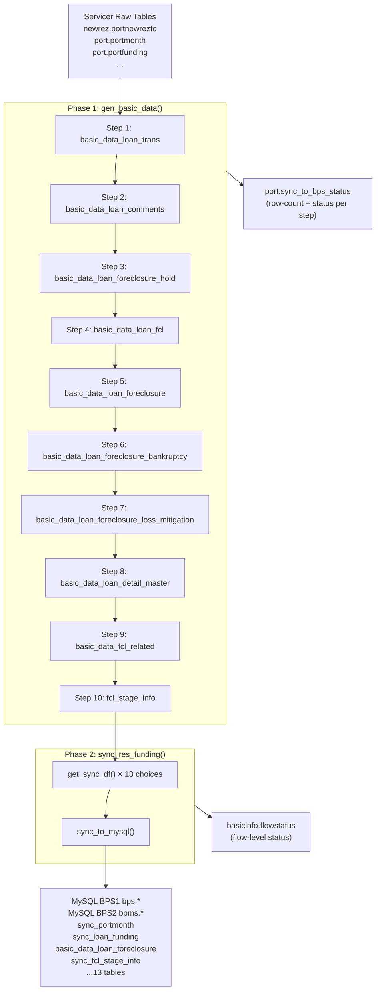

# doc 12 — sync_asset_management.py: Code Investigation & Reference

---

## Document Purpose

- **Why this document exists**: `sync_asset_management.py` is the core daily ETL orchestration flow in PrefectFlow that drives all asset management data into the BPS application databases. It is complex, touches 23+ tables, and has no standalone documentation.
- **Problem solved**: Without this document, developers must trace through 5+ config files and 1,300+ lines of SQL to understand what the flow does, in what order, and why.
- **Scope**: Full code-level investigation of `flow/bps/sync_asset_management.py` — all functions, data flows, parameters, DB tables read/written, environment behavior, status tracking, and one identified code issue.
- **Not covered**: SQL logic inside config files (see foreclosure_data_dictionary.md and docs 01–11 for business rules); BPS application consumption of sync tables.
- **System fit**: This file is the **trigger point** for the entire Redshift → MySQL BPS sync pipeline. It sits between the raw servicer data (docs 01–07) and the BPS front-end. The data it produces feeds the FCL status fields documented in docs 08–11.

## Target Audience

Primary: ETL developers · Data engineers building the new system  
Secondary: System architects · Operations / on-call engineers · Future AI sessions

## Revision History

| Date | Author | Version | Changes | Related |
|------|--------|---------|---------|---------|
| 2026-05-26 | AI Agent (Claude Sonnet 4.6) | v1 | Initial investigation and documentation — Sections 1–12: architecture, imports, parameters, 5 functions, 10-step Redshift build, 13-choice BPS sync, environment/tenant support, dead-code issue, status tracking, related files, DB table reference | docs 08, 09, 11 |
| 2026-05-26 | AI Agent (Claude Sonnet 4.6) | v2 | Added Section 13: FCL field inventory — complete field-level trace of all 5 FCL-related sync choices; 127 FCL fields across 5 BPS MySQL tables (`basic_data_loan_foreclosure` / `sync_loan_foreclosure_loss_mitigation` / `sync_loan_foreclosure_bankruptcy` / `sync_loan_foreclosure_hold` / `sync_fcl_stage_info`); includes data transformation notes (unpivot, real-time recalculation) | `asset_managment_config.py`, `basic_data_pool_config.py` |
| 2026-05-26 | AI Agent (Claude Sonnet 4.6) | v3 | All MySQL target table names updated to `schema.table` format; confirmed via MCP: `sync_*` tables → `bpms` schema, `basic_data_loan_foreclosure` → MySQL `port` schema | — |
| 2026-05-26 | AI Agent (Claude Sonnet 4.6) | v4 | Added Section 14: Complete BPS MySQL FCL table structures (bpms_dev, MCP-verified) — all 5 tables with full column names/types/defaults; first documentation of `bpms_dev.sync_loan_foreclosure` (72 cols, the primary BPS FCL application table, absent from SYNC_TABLE_MAP); Section 12 supplementary note; Section 13 summary annotation | doc 13 v2 |
| 2026-05-28 | AI Agent (Claude Sonnet 4.6) | v5 | Added Section 15: four fields in `port.basic_data_loan_fcl` that are normalized and stored but not consumed by any downstream BPS ETL (`fcjudgment_end_date` / `titleordereddate` / `jr_sr_lien_flag` / `activejnrlienfcflag`) with design intent; based on ETL code in `basic_data_pool_config.py` lines 1539–1570 | doc 13 v21 |
| 2026-05-28 | AI Agent (Claude Sonnet 4.6) | v6 | Section 14.0 fully corrected: two-step write mechanism (`sync_to_mysql` + `update_to_mysql(UPDATE_FORECLOSURE)`) documented; corrects prior "independent mechanisms" misdiagnosis — both tables are intermediate and final stages of the same `5-FORECLOSURE` pipeline; MCP field divergence reinterpreted as ETL staleness in dev env; `create_time`/`update_time` NULL explained by ON DUPLICATE KEY UPDATE clause omitting those columns | `df_db_util.py:675,702`, `asset_managment_config.py:647,746` |

## Dependencies

| File | Role |
|------|------|
| `flow/bps/bps_config/asset_managment_config.py` | 14 SQL query templates for sync data extraction |
| `flow/bps/bps_config/sync_to_bps_config.py` | `SYNC_TABLE_MAP` — maps sync choice IDs to MySQL table names |
| `flow/bps/bps_config/sync_generate_status_config.py` | Status-tracking SQL for each `gen_basic_data` step |
| `flow/basic_data/basic_data_config/basic_data_pool_config.py` | 10 CREATE/INSERT SQL templates for Redshift staging build |
| `util/df_db_util.py` | Core DB utilities: `execute_sql`, `get_df_from_db`, `sync_to_mysql` |
| `util/decorator_flow_info.py` | `@record_flow_status` decorator |
| `src/util/logger.py` | `get_prefect_compatible_logger` |

## Known Limitations

- SQL logic inside config files is not analyzed here; refer to those files for query details
- `gen_basic_data()` steps execute in a fixed hard-coded order; failures in early steps may silently corrupt later steps
- One dead-code path found in `get_sync_df()` — see [Section 9](#9-code-issue-get_sync_df-0-all-path-is-dead-code)

---

## Section 1: Overview

| Property | Value |
|----------|-------|
| **File** | `C:\Users\jli\MyData\Copilot\PrefectFlow\flow\bps\sync_asset_management.py` |
| **Lines** | 191 |
| **Prefect flow name** | `sync_asset_management_flow` |
| **Production schedule** | Daily at **4:35 AM ET** |
| **Production status** | Active |

**Business purpose**: This flow is the nightly data refresh that keeps the BPS (Business Process System) application databases current. It:

1. **Generates 10 Redshift staging tables** from raw servicer data — the "basic data" layer
2. **Syncs 13 data categories** from Redshift → MySQL BPS databases

**Two-phase architecture**:

```
Phase 1: gen_basic_data()
  Raw servicer tables (Redshift)
      ↓  10 sequential SQL steps
  port.basic_data_* staging tables (Redshift)

Phase 2: sync_res_funding()
  port.basic_data_* + port.portmonth + other Redshift sources
      ↓  13 sync choices, via get_sync_df()
  MySQL BPS1 (bps) and/or BPS2 (bpms) — sync_* tables
      ↓
  BPS application / downstream consumers
```

---

## Section 2: Architecture Diagram



---

## Section 3: Imports & Dependencies

### External Libraries
| Library | Usage |
|---------|-------|
| `datetime` | Date arithmetic (e.g. 30-day lookback for servicer comments) |
| `pytz` | New York timezone for foreclosure date calculations |
| `prefect` | `@flow` decorator, `get_run_logger()` |
| `pandas` | DataFrame manipulation, `pd.Timedelta` |
| `typing.Literal` | Type aliases for Prefect UI parameter dropdowns |

### Internal Utilities
| Import | Module | Purpose |
|--------|--------|---------|
| `get_prefect_compatible_logger` | `src.util.logger` | Logger that works inside and outside Prefect runtime |
| `record_flow_status` | `util.decorator_flow_info` | Decorator: logs flow start/success/failure to `basicinfo.flowstatus` |
| `execute_sql` | `util.df_db_util` | Execute a SQL string against Redshift or MySQL; optionally logs status |
| `get_df_from_db` | `util.df_db_util` | Run a SELECT query and return a pandas DataFrame |
| `sync_to_mysql` | `util.df_db_util` | Sync a DataFrame to a MySQL table (delete + insert, or upsert) |
| `redshift_cred` | `cred.db_cred` | Redshift credentials (Prefect vault-backed) |
| `BUILDENV`, `DbTypeEnum` | `cred.settings` | Runtime environment flag and DB type enum |

### Config Modules
| Import | Module | Content |
|--------|--------|---------|
| `CREATE_BASIC_DATA_TRANS`, `CREATE_BASIC_COMMENTS`, `CREATE_BASIC_DATA_FCL_HOLD`, `CREATE_BASIC_FCL`, `GEN_FCL_DETAIL`, `CREATE_BASIC_DATA_FCL_BANKRUPTCY`, `CREATE_BASIC_DATA_FCL_LM`, `CREATE_BASIC_DATA_LOAN_MASTER`, `CREATE_FCL_RELATE_ATTR`, `GEN_FCL_STAGE` | `flow.basic_data.basic_data_config.basic_data_pool_config` | 10 SQL templates for staging table creation |
| `GEN_SYNC_PORT_MONTH`, `GEN_LOAN_FUNDING`, `GEN_LOAN_FUNDING_SCHEDULE`, `GEN_LOAN_SUMMARY_RISK`, `GEN_FORECLOSURE`, `GEN_SERVICER_COMMENTS`, `GEN_TRANSACTION_FROM_SERVICER`, `GEN_FORECLOSURE_LM`, `GEN_FORECLOSURE_BK`, `GEN_FORECLOSURE_HOLD`, `GEN_LOAN_MASTER`, `GET_FCL_STAGE_DATA`, `GET_LOAN_TENANT_ID`, `GET_PLT_ZIPCODE_DATA` | `flow.bps.bps_config.asset_managment_config` | 14 SELECT SQL templates for BPS sync data extraction |
| `GENERATE_SQL_STATUS_CONFIG` | `flow.bps.bps_config.sync_generate_status_config` | Dict of success/failure status INSERT SQLs keyed by step name |
| `SYNC_TABLE_MAP` | `flow.bps.bps_config.sync_to_bps_config` | Dict mapping sync choice IDs → MySQL table name + metadata |

---

## Section 4: Runtime Parameters (Literal Type Aliases)

These types define the dropdown values visible in the Prefect UI when triggering the flow manually:

### `SyncChoices` — Which data category to sync

| Value | Data | Redshift Source → MySQL Target |
|-------|------|-------------------------------|
| `0-ALL` | All 13 categories | (loops all below) |
| `1-PORTMONTH` | Monthly portfolio snapshot | `port.basic_data_monthly_portfolio` → `bpms.sync_portmonth` |
| `2-LOAN_FUNDING` | Loan funding details | `port.basic_data_loan_funding` → `bpms.sync_loan_funding` |
| `3-LOAN_FUNDING_SCHEDULE` | Funding schedule | `port.portfunding` → `bpms.sync_loan_funding_schedule` |
| `4-LOAN_SUMMARY_RISK` | Risk/mark summary | `port.portmark` + `port.portfunding` → `bpms.sync_loan_summary_risk` |
| `5-FORECLOSURE` | Foreclosure timeline | `port.basic_data_loan_foreclosure` → `port.basic_data_loan_foreclosure` |
| `6-SERVICER_COMMENTS` | Servicer comments (incremental) | `port.basic_data_loan_comments` → `bpms.sync_loan_servicer_comments` |
| `7-TRANSACTION_FROM_SERVICER` | Loan transactions | `port.basic_data_loan_trans` → `bpms.sync_loan_transaction_from_servicer` |
| `8-FORECLOSURE_LM` | Loss mitigation | `port.basic_data_loan_foreclosure_loss_mitigation` → `bpms.sync_loan_foreclosure_loss_mitigation` |
| `9-FORECLOSURE_BK` | Bankruptcy | `port.basic_data_loan_foreclosure_bankruptcy` → `bpms.sync_loan_foreclosure_bankruptcy` |
| `10-FORECLOSURE_HOLD` | FCL holds | `port.basic_data_loan_foreclosure_hold` → `bpms.sync_loan_foreclosure_hold` |
| `11-LOAN_MASTER` | Loan master attributes | `port.basic_data_loan_detail_master` → `bpms.sync_loan_master` |
| `12-FCL_STAGE` | Foreclosure stage | `port.fcl_stage_info` → `bpms.sync_fcl_stage_info` |
| `13-PLT_ZIPCODE` | Niche zipcode/location | `niche.plt_zipcode` → `bpms.sync_niche_grade` |

### `SYNC_DB` — Target MySQL database(s)

| Value | Target |
|-------|--------|
| `BPS1 ONLY` | `bps` (or `bps_dev` / `bps_test` / `bps_uat`) |
| `BPS2 ONLY` | `bpms` (or `bpms_dev` / `bpms_test` / `bpms_uat`) |
| `ALL` | Both BPS1 and BPS2 |

### `SYNC_ENV` — Database environment suffix

| Value | DB Name Suffix | When available |
|-------|---------------|----------------|
| `auto` | none (production) | Always |
| `dev` | `_dev` | UAT build only |
| `test` | `_test` | UAT build only |
| `uat` | `_uat` | UAT build only |

> `SYNC_ENV` is controlled by `BUILDENV` setting: in production build, only `auto` is exposed.

### `TENANT_MODE` — Tenant ID handling

| Value | Behavior |
|-------|----------|
| `0-NO TENANT` | Remove `tenant_id` column from output (default) |
| `TENANT DEFAULT` | Set all rows' `tenant_id` to `000000` |
| `TENANT TRUST` | Merge `tenant_id` from `port.basic_data_trust_funding` by `loanid`; fill missing with `000000` |

---

## Section 5: Function Reference

### `get_max_daily_date() → str`

| Property | Value |
|----------|-------|
| **Purpose** | Get the most recent data-as-of date from Newrez portfolio data |
| **DB read** | `SELECT MAX(dataasof) FROM newrez.portnewrezfc` (Redshift) |
| **Returns** | Date string (e.g. `"2026-05-25"`) |
| **Called by** | `gen_basic_data()` when `asofdate` parameter is `None` |
| **Note** | Uses Newrez as the reference servicer for the "current" date — implies Newrez data freshness governs the FCL stage calculation |

---

### `get_tenant_df(df, tenant_mode, tenant_df) → pd.DataFrame`

| Property | Value |
|----------|-------|
| **Purpose** | Apply tenant ID logic to a DataFrame before syncing to MySQL |
| **Inputs** | `df` — loan data DataFrame; `tenant_mode` — one of the 3 TENANT_MODE values; `tenant_df` — optional DataFrame with `loanid → tenant_id` mapping |

**Logic table:**

| tenant_mode | Action |
|-------------|--------|
| `'0-NO TENANT'` | Drop `tenant_id` column if present |
| `'TENANT DEFAULT'` | Merge `tenant_df` on `loanid` if available; set `tenant_id = '000000'` |
| `'TENANT TRUST'` | Merge `tenant_df` on `loanid` (left join); fill unmatched with `'000000'` |

---

### `get_sync_df(sync_choice, comment_from_date, tenant_mode, tenant_df) → pd.DataFrame`

| Property | Value |
|----------|-------|
| **Purpose** | Fetch a single data category from Redshift for a given `sync_choice` |
| **Inputs** | `sync_choice` — one of the 14 SyncChoices; `comment_from_date` — date filter for choice `6-SERVICER_COMMENTS`; `tenant_mode`, `tenant_df` — passed to `get_tenant_df()` |
| **Returns** | pandas DataFrame (tenant-filtered), or `None` if no match |

**Special behaviors:**
- **`5-FORECLOSURE`**: Injects New York timezone current date (`pytz.timezone('America/New_York')`) into the SQL query via `.format(input_curr_date=curr_date)`
- **`6-SERVICER_COMMENTS`**: Appends `WHERE servicer_comments_date >= '{comment_from_date}'` to the base SQL — only runs if `comment_from_date is not None`
- **`0-ALL`**: ⚠️ See [Section 9](#9-code-issue-get_sync_df-0-all-path-is-dead-code) for a known code issue

---

### `gen_basic_data(asofdate=None)`

| Property | Value |
|----------|-------|
| **Purpose** | Execute 10 sequential SQL statements to build all Redshift staging ("basic data") tables |
| **Inputs** | `asofdate` — optional override date; if `None`, calls `get_max_daily_date()` |
| **Returns** | None |
| **Side effects** | Creates/replaces 10 Redshift tables; writes status rows to `port.sync_to_bps_status`; emits Prefect-compatible log messages |

All 10 SQL executions use:
```python
execute_sql(exe_sql, DbTypeEnum.REDSHIFT.value, redshift_cred.DATABASE_NAME.get_secret_value(),
            run_decorator=True, statis_config=GENERATE_SQL_STATUS_CONFIG['<KEY>'])
```
The `run_decorator=True` flag causes `execute_sql` to write a success or failure row to `port.sync_to_bps_status` after each step.

---

### `sync_res_funding(sync_db, sync_choice, sync_env, comment_from_date, tenant_mode)`

| Property | Value |
|----------|-------|
| **Purpose** | Coordinate the Redshift → MySQL sync for one or all data categories |
| **Inputs** | `sync_db` — BPS target(s); `sync_choice` — data category; `sync_env` — environment suffix; `comment_from_date`, `tenant_mode` |
| **Returns** | None |
| **Side effects** | Writes to MySQL BPS databases; reads tenant mapping from Redshift |

**Logic:**
1. Determine `db_pres` list: `['bps']` / `['bpms']` / `['bps', 'bpms']`
2. Fetch tenant mapping once: `get_df_from_db(GET_LOAN_TENANT_ID)`
3. If `sync_choice == '0-ALL'`: iterate `SYNC_TABLE_MAP.items()` → call `get_sync_df(choice, ...)` + `sync_to_mysql(...)` per choice per DB
4. Otherwise: look up single `table_name` from `SYNC_TABLE_MAP`, fetch once, sync to each `db_pre`

---

### `sync_asset_management_flow(...)` *(main @flow entrypoint)*

```python
@flow(name='sync_asset_management_flow')
@record_flow_status(flow_name='sync_asset_management_flow')
def sync_asset_management_flow(
    sync_db: SYNC_DB = 'BPS1 ONLY',
    sync_choice: SyncChoices = '0-ALL',
    sync_env: SYNC_ENV = 'auto',
    asofdate = None,
    comment_from_date: datetime.date = None,
    tenant_mode: TENANT_MODE = '0-NO TENANT'
)
```

**Default behavior** (production daily run):
- `sync_db = 'BPS1 ONLY'` — syncs only to BPS1 (`bps`)
- `sync_choice = '0-ALL'` — all 13 data categories
- `sync_env = 'auto'` — production database names
- `comment_from_date` auto-set to **30 days ago** when syncing `0-ALL` or `6-SERVICER_COMMENTS`
- `tenant_mode = '0-NO TENANT'` — no tenant column

**Execution sequence:**
1. Set `comment_from_date = today - 30 days` (if None and servicer comments are in scope)
2. `gen_basic_data(asofdate)` — Phase 1
3. `sync_res_funding(...)` — Phase 2

---

## Section 6: Data Flow — gen_basic_data() Step-by-Step

Steps execute **sequentially**. Later steps may depend on earlier steps' output.

| Step | SQL Constant | Target Table (Redshift) | Notes |
|------|-------------|------------------------|-------|
| 1 | `CREATE_BASIC_DATA_TRANS` | `port.basic_data_loan_trans` | Loan transactions from all servicers |
| 2 | `CREATE_BASIC_COMMENTS` | `port.basic_data_loan_comments` | Servicer comments / notes |
| 3 | `CREATE_BASIC_DATA_FCL_HOLD` | `port.basic_data_loan_foreclosure_hold` | FCL holds; code comment notes CC5 only has 2 hold fields and is monthly data — a current limitation |
| 4 | `CREATE_BASIC_FCL` | `port.basic_data_loan_fcl` | Basic FCL flag table (prerequisite for step 5) |
| 5 | `GEN_FCL_DETAIL` | `port.basic_data_loan_foreclosure` | Full foreclosure timeline detail; depends on step 4 |
| 6 | `CREATE_BASIC_DATA_FCL_BANKRUPTCY` | `port.basic_data_loan_foreclosure_bankruptcy` | Bankruptcy tracking; comment: "structure unchanged, just adds servicer data" |
| 7 | `CREATE_BASIC_DATA_FCL_LM` | `port.basic_data_loan_foreclosure_loss_mitigation` | Loss mitigation / forbearance / modification |
| 8 | `CREATE_BASIC_DATA_LOAN_MASTER` | `port.basic_data_loan_detail_master` | Loan master attributes |
| 9 | `CREATE_FCL_RELATE_ATTR` | `port.basic_data_fcl_related` | FCL-related loan attributes |
| 10 | `GEN_FCL_STAGE` | `port.fcl_stage_info` | FCL stage progression; requires `asofdate` + NY timezone `curr_date` as format parameters |

**Status tracking**: after each step, `execute_sql(run_decorator=True, statis_config=...)` inserts a row into `port.sync_to_bps_status` with: `generate_type`, `opt_type='create'`, `excute_date`, `servicer`, `max_generate_asofdate`, `numofrows`, `status` ('success'/'failure'), `create_time`.

---

## Section 7: Data Flow — sync_res_funding() Sync Table Map

Full `SYNC_TABLE_MAP` from `sync_to_bps_config.py`:

| Choice | Redshift Source (via SQL template) | MySQL Target Table | group_by | max_date_col |
|--------|----------------------------------|-------------------|----------|-------------|
| `1-PORTMONTH` | `port.basic_data_monthly_portfolio` | `bpms.sync_portmonth` | `servicer` | `fctrdt` |
| `2-LOAN_FUNDING` | `port.basic_data_loan_funding` | `bpms.sync_loan_funding` | — | `settledate` |
| `3-LOAN_FUNDING_SCHEDULE` | `port.portfunding` | `bpms.sync_loan_funding_schedule` | — | `settledate` |
| `4-LOAN_SUMMARY_RISK` | `port.portmark` + `port.portfunding` | `bpms.sync_loan_summary_risk` | — | `fctrdt` |
| `5-FORECLOSURE` | `port.basic_data_loan_foreclosure` | `port.basic_data_loan_foreclosure` ⚠️ | `servicer` | — |
| `6-SERVICER_COMMENTS` | `port.basic_data_loan_comments` | `bpms.sync_loan_servicer_comments` | `servicer` | `fctrdt` |
| `7-TRANSACTION_FROM_SERVICER` | `port.basic_data_loan_trans` | `bpms.sync_loan_transaction_from_servicer` | `servicer` | `fctrdt` |
| `8-FORECLOSURE_LM` | `port.basic_data_loan_foreclosure_loss_mitigation` | `bpms.sync_loan_foreclosure_loss_mitigation` | — | `fctrdt` |
| `9-FORECLOSURE_BK` | `port.basic_data_loan_foreclosure_bankruptcy` | `bpms.sync_loan_foreclosure_bankruptcy` | — | `fctrdt` |
| `10-FORECLOSURE_HOLD` | `port.basic_data_loan_foreclosure_hold` | `bpms.sync_loan_foreclosure_hold` | — | `fctrdt` |
| `11-LOAN_MASTER` | `port.basic_data_loan_detail_master` | `bpms.sync_loan_master` | `servicer` | `fctrdt` |
| `12-FCL_STAGE` | `port.fcl_stage_info` | `bpms.sync_fcl_stage_info` | `servicer` | `fctrdt` |
| `13-PLT_ZIPCODE` | `niche.plt_zipcode` | `bpms.sync_niche_grade` | — | — |

> ⚠️ `5-FORECLOSURE` writes to `port.basic_data_loan_foreclosure` — note: **no `sync_` prefix** and the target schema is MySQL `port` (not `bpms`), different from all other sync choices. This table likely uses **upsert** logic rather than delete+insert; confirm in `sync_to_mysql()` implementation.

---

## Section 8: Multi-Environment & Multi-Tenant Support

### Environment-aware database naming

```python
# db_pre examples: 'bps', 'bpms'
# sync_env: 'auto', 'dev', 'test', 'uat'

if sync_env == 'auto':
    target_db = db_pre               # → 'bps' or 'bpms'  (production)
else:
    target_db = f"{db_pre}_{sync_env}"  # → 'bps_dev', 'bpms_test', etc.
```

### Tenant modes

| Mode | When to use | `tenant_id` in output |
|------|------------|----------------------|
| `0-NO TENANT` | Standard single-tenant BPS1 production run | Column removed |
| `TENANT DEFAULT` | Load to shared DB, all loans belong to default tenant | Fixed `000000` |
| `TENANT TRUST` | Multi-trust deployment — each loan maps to its trust's tenant | Per-loan from `port.basic_data_trust_funding` |

---

## Section 9: ⚠️ Code Issue — `get_sync_df()` `'0-ALL'` Path is Dead Code

### The problem

In `get_sync_df()`, all 13 `if` blocks are written as independent `if` (not `elif`):

```python
def get_sync_df(sync_choice='0-ALL', ...):
    df = None
    if sync_choice == '0-ALL' or sync_choice == '1-PORTMONTH':
        df = get_df_from_db(GEN_SYNC_PORT_MONTH)   # df overwritten
    if sync_choice == '0-ALL' or sync_choice == '2-LOAN_FUNDING':
        df = get_df_from_db(GEN_LOAN_FUNDING)       # df overwritten again
    # ... 11 more blocks, each overwriting df ...
    if sync_choice == '0-ALL' or sync_choice == '13-PLT_ZIPCODE':
        df = get_df_from_db(GET_PLT_ZIPCODE_DATA)   # ONLY THIS IS RETURNED
    return get_tenant_df(df, ...)
```

If `'0-ALL'` is passed, **all 13 queries run** but only the last (`13-PLT_ZIPCODE`) result is returned.

### Why it doesn't break production

`sync_res_funding()` **never passes `'0-ALL'` to `get_sync_df()`**:

```python
if sync_choice == '0-ALL':
    for choices, tabel_name_info in SYNC_TABLE_MAP.items():  # iterates '1-PORTMONTH', '2-LOAN_FUNDING', ...
        df = get_sync_df(choices, ...)   # each choice is specific, never '0-ALL'
```

### Impact
- **Production**: None — the `'0-ALL'` path in `get_sync_df` is unreachable from the flow
- **Trap for developers**: Anyone calling `get_sync_df('0-ALL')` directly (e.g. in tests or scripts) would get unexpected results — 13 queries fire, only PLT_ZIPCODE data returned

### Recommendation
Replace all `if sync_choice == '0-ALL' or sync_choice == 'N-...'` with `elif`, or guard:

```python
def get_sync_df(sync_choice='0-ALL', ...):
    if sync_choice == '0-ALL':
        raise ValueError("'0-ALL' is not valid for get_sync_df(); iterate sync choices in the caller.")
    elif sync_choice == '1-PORTMONTH':
        df = get_df_from_db(GEN_SYNC_PORT_MONTH)
    elif sync_choice == '2-LOAN_FUNDING':
        ...
```

---

## Section 10: Status Tracking & Observability

### `port.sync_to_bps_status` (Redshift)

One row inserted per `gen_basic_data()` step per servicer, recording:

| Column | Description |
|--------|-------------|
| `generate_type` | Step name (e.g. `'CREATE_BASIC_DATA_TRANS'`) |
| `opt_type` | Always `'create'` |
| `excute_date` | `CURRENT_DATE` at time of run |
| `servicer` | Servicer name (or NULL on failure) |
| `max_generate_asofdate` | Max data date in the generated table |
| `numofrows` | Row count in generated table |
| `status` | `'success'` or `'failure'` |
| `create_time` | `CURRENT_TIMESTAMP` |

### `basicinfo.flowstatus` (MySQL)

Flow-level record via `@record_flow_status` decorator. Captures overall flow success/failure, not per-step.

### Prefect logging

`gen_basic_data()` emits `logger.info("===<STEP_NAME> start==="` / `end===")` around each step for Prefect UI log visibility.

---

## Section 11: Related Files

| File | Lines | Purpose |
|------|-------|---------|
| `flow/bps/bps_config/asset_managment_config.py` | 1,147 | 14 SELECT SQL templates for sync extraction |
| `flow/bps/bps_config/sync_to_bps_config.py` | 30 | `SYNC_TABLE_MAP` and `SYNC_PROFORMA_TABLE_MAP` |
| `flow/bps/bps_config/sync_generate_status_config.py` | 401 | `GENERATE_SQL_STATUS_CONFIG`: success/failure INSERT SQLs for all 10 gen steps |
| `flow/basic_data/basic_data_config/basic_data_pool_config.py` | — | 10 CREATE/INSERT SQL templates (`CREATE_BASIC_*`, `GEN_FCL_*`) |
| `flow/bps/sync_pro_forma.py` | 122 | Sibling flow for pro forma data sync (separate `SYNC_PROFORMA_TABLE_MAP`) |
| `util/df_db_util.py` | 727 | Core DB utilities: `execute_sql`, `get_df_from_db`, `sync_to_mysql` |
| `util/decorator_flow_info.py` | — | `@record_flow_status` decorator definition |
| `src/util/logger.py` | — | `get_prefect_compatible_logger()` implementation |

---

## Section 12: Quick Reference — All DB Tables

### Redshift — Tables Read (Phase 2 sync sources)

| Table | Schema | Description |
|-------|--------|-------------|
| `newrez.portnewrezfc` | newrez | Newrez portfolio monthly data — used as date reference |
| `port.portmonth` | port | Monthly portfolio data |
| `port.portfunding` | port | Loan funding/deal data |
| `port.portmark` | port | Loan pricing/risk marks |
| `port.basic_data_loan_foreclosure` | port | FCL timeline (generated by step 5) |
| `port.basic_data_loan_comments` | port | Servicer comments (generated by step 2) |
| `port.basic_data_loan_trans` | port | Loan transactions (generated by step 1) |
| `port.basic_data_loan_foreclosure_loss_mitigation` | port | LM detail (generated by step 7) |
| `port.basic_data_loan_foreclosure_bankruptcy` | port | BK detail (generated by step 6) |
| `port.basic_data_loan_foreclosure_hold` | port | FCL holds (generated by step 3) |
| `port.basic_data_loan_detail_master` | port | Loan master (generated by step 8) |
| `port.fcl_stage_info` | port | FCL stage (generated by step 10) |
| `port.basic_data_trust_funding` | port | Loan → tenant mapping |
| `niche.plt_zipcode` | niche | Niche zipcode/location demographics |

### Redshift — Tables Written (Phase 1 staging build)

| Table | Schema | Populated by |
|-------|--------|-------------|
| `port.basic_data_loan_trans` | port | Step 1 |
| `port.basic_data_loan_comments` | port | Step 2 |
| `port.basic_data_loan_foreclosure_hold` | port | Step 3 |
| `port.basic_data_loan_fcl` | port | Step 4 |
| `port.basic_data_loan_foreclosure` | port | Step 5 |
| `port.basic_data_loan_foreclosure_bankruptcy` | port | Step 6 |
| `port.basic_data_loan_foreclosure_loss_mitigation` | port | Step 7 |
| `port.basic_data_loan_detail_master` | port | Step 8 |
| `port.basic_data_fcl_related` | port | Step 9 |
| `port.fcl_stage_info` | port | Step 10 |
| `port.sync_to_bps_status` | port | Status tracking after each step |

### MySQL — Tables Written (Phase 2 sync targets)

| Table | Database | Maps to sync choice |
|-------|----------|---------------------|
| `bpms.sync_portmonth` | bpms | `1-PORTMONTH` |
| `bpms.sync_loan_funding` | bpms | `2-LOAN_FUNDING` |
| `bpms.sync_loan_funding_schedule` | bpms | `3-LOAN_FUNDING_SCHEDULE` |
| `bpms.sync_loan_summary_risk` | bpms | `4-LOAN_SUMMARY_RISK` |
| `port.basic_data_loan_foreclosure` | port | `5-FORECLOSURE` |
| `bpms.sync_loan_servicer_comments` | bpms | `6-SERVICER_COMMENTS` |
| `bpms.sync_loan_transaction_from_servicer` | bpms | `7-TRANSACTION_FROM_SERVICER` |
| `bpms.sync_loan_foreclosure_loss_mitigation` | bpms | `8-FORECLOSURE_LM` |
| `bpms.sync_loan_foreclosure_bankruptcy` | bpms | `9-FORECLOSURE_BK` |
| `bpms.sync_loan_foreclosure_hold` | bpms | `10-FORECLOSURE_HOLD` |
| `bpms.sync_loan_master` | bpms | `11-LOAN_MASTER` |
| `bpms.sync_fcl_stage_info` | bpms | `12-FCL_STAGE` |
| `bpms.sync_niche_grade` | bpms | `13-PLT_ZIPCODE` |
| `basicinfo.flowstatus` | basicinfo | Flow-level status |

> **Note: BPS Application FCL Table (not in SYNC_TABLE_MAP)**
>
> `bpms_dev.sync_loan_foreclosure` (72 columns) is the primary data table backing the BPS Foreclosure interface — it drives the Milestone / Target Days / Variance / Bid Approval / Summary panels. However, it does **not appear in `sync_to_bps_config.py`'s SYNC_TABLE_MAP** and is therefore not directly written by `sync_asset_management.py`. Its actual sync source is unknown (may be a separate Flow or the BPS application layer). Full column structure in [Section 14](#section-14-complete-bps-mysql-fcl-table-structures-bpms_dev-mcp-verified).

---

## Section 13: FCL Fields Written to BPS — Complete Field Inventory

> **Focus**: Of the 13 sync choices in `sync_asset_management.py`, 5 are directly FCL-related. This section lists every field synced to BPS MySQL for those 5 choices.

### Summary

```
5-FORECLOSURE    → port.basic_data_loan_foreclosure            47 fields  (timeline + bid + summary)
8-FORECLOSURE_LM → bpms.sync_loan_foreclosure_loss_mitigation  13 fields  (LM cycle data)
9-FORECLOSURE_BK → bpms.sync_loan_foreclosure_bankruptcy       13 fields  (bankruptcy status/dates)
10-FORECLOSURE_HOLD → bpms.sync_loan_foreclosure_hold           6 fields  (holds, unpivoted 3→long)
12-FCL_STAGE     → bpms.sync_fcl_stage_info                    48 fields  (per-stage timeline analysis)
─────────────────────────────────────────────────────────────────────────────────────
Total                                                          127 FCL fields across 5 BPS tables
```

> **Note**: The field counts above reflect the **business columns in the ETL SELECT statements** — they exclude system/admin columns such as id, create_user, create_dept, create_time, update_user, update_time, status, is_deleted, tenant_id. For MCP-verified actual column counts of the `bpms_dev` tables, see Section 14.  
> Also: `bpms_dev.sync_loan_foreclosure` (72 cols, the primary BPS FCL application table) is **not covered by any of the 5 sync choices above** and is documented separately in Section 14.

In addition, `bpms.sync_portmonth` (`1-PORTMONTH`) carries a `delinq` column that can hold the value `'FCL'` as part of the MBA delinquency status — but it is not a dedicated FCL detail table.

---

### Table 1 — `port.basic_data_loan_foreclosure` (47 fields)

**Sync choice**: `5-FORECLOSURE` | **SQL**: `GEN_FORECLOSURE` (asset_managment_config.py:535–608)  
**Redshift source**: `port.basic_data_loan_foreclosure` JOIN `port.portfunding`  
**Row filter**: `timeline_referred_to_foreclosure_date IS NOT NULL` (only loans with FCL referral)

> ⚠️ Two fields are **recalculated at every sync** using `datediff(day, dataasof, current_date_new_york)`:
> `summary_sms_days_in_fcl` and `summary_days_in_fcl` — they always reflect days-in-FCL as of *today*, not as of the data date.

| Group | Field | Type / Notes |
|-------|-------|--------------|
| **Identifier** | `bid_id` | From `portfunding.dealid` |
| | `funding_id` | From `portfunding.fundingid` |
| | `loanid` | Primary loan key |
| | `svcloanid` | Servicer's loan number |
| | `servicer` | Servicer name |
| **Timeline** | `timeline_notice_of_intent_date` | NOI issued date |
| | `timeline_notice_of_intent_end_date` | NOI expiry |
| | `timeline_approved_for_referral_date` | Referral approval |
| | `timeline_referred_to_attorney_date` | Attorney referral |
| | `timeline_referred_to_foreclosure_date` | **FCL referral date** (required — filter field) |
| | `timeline_title_report_received_date` | Title report |
| | `timeline_preliminary_title_cleared_date` | Title cleared |
| | `timeline_first_legal_date` | First legal action |
| | `timeline_service_date` | Service of process |
| | `timeline_judgement_hearing_set_date` | Hearing scheduled |
| | `timeline_judgement_date` | Judgement date |
| | `timeline_sale_date_projected_date` | Projected sale |
| | `timeline_sale_date_set_date` | Sale date set |
| | `timeline_final_title_cleared_date` | Final title clear |
| | `timeline_sale_date_held_date` | Sale held |
| | `timeline_foreclosure_completed_date` | FCL completed |
| | `timeline_third_party_sold_date_date` | 3rd party sale |
| | `timeline_third_party_proceeds_received_date` | Proceeds received |
| **Variance** | `variance_active_bankruptcy` | Active BK variance flag |
| | `variance_completed_bankruptcy` | Completed BK |
| | `variance_estimated_hold_days` | Estimated hold impact |
| | `variance_bankruptcies` | BK count |
| **Bid Approval** | `bid_approval_status` | Bid status |
| | `bid_approval_sale_date` | Approved sale date |
| | `bid_approval_bid_amount` | Bid amount |
| | `bid_approval_loan_resolution_holods` | Resolution holds |
| **Summary** | `summary_servicer_number` | Servicer's reference number |
| | `summary_foreclosure_status` | Active/completed/removed status (CASE WHEN from activefcflag + fcremovaldesc) |
| | `summary_completed_foreclosure` | Completion flag |
| | `summary_foreclosure_bid_amount` | Our bid amount |
| | `summary_srv_fc_bid_amount` | Servicer's bid amount |
| | `summary_foreclosure_sale_amount` | Actual sale amount |
| | `summary_judicial_foreclosure` | Judicial flag (decimal) |
| | `summary_foreclosure_attorney` | Attorney name |
| | `summary_contested_litigation` | Contested flag (decimal) |
| | `summary_firm` | Law firm |
| | `summary_type` | Judicial / Non Judicial (from `judicial` flag) |
| | `summary_sms_days_in_fcl` | ⚡ **Real-time recalculated** days in FCL (SMS system) |
| | `summary_days_in_fcl` | ⚡ **Real-time recalculated** days in FCL (our system) |
| | `summary_current_step` | Current FCL process step |
| | `summary_last_step_completed` | Last completed step name |
| | `summary_last_step_completed_date` | Last completed step date |

---

### Table 2 — `bpms.sync_loan_foreclosure_loss_mitigation` (13 fields)

**Sync choice**: `8-FORECLOSURE_LM` | **SQL**: `GEN_FORECLOSURE_LM` (asset_managment_config.py:799–819)  
**Redshift source**: `port.basic_data_loan_foreclosure_loss_mitigation` JOIN `port.portfunding`

| Field | Description |
|-------|-------------|
| `loanid` | Primary loan key |
| `svcloanid` | Servicer's loan number |
| `fctrdt` | Report cutoff date |
| `deal` | Deal name |
| `program` | LM program type (e.g. forbearance, modification) |
| `lmc_status` | Loss mitigation cycle status |
| `cycle_opened_date` | When this LM cycle started |
| `cycle_closed_date` | When this LM cycle ended |
| `final_disposition` | Final outcome of the LM cycle |
| `denialreason` | Reason for denial (if rejected) |
| `borrower_intentions` | Borrower's stated intention |
| `imminent_default` | Imminent default flag |
| `single_point_of_contact` | SPOC assigned to loan |

---

### Table 3 — `bpms.sync_loan_foreclosure_bankruptcy` (13 fields)

**Sync choice**: `9-FORECLOSURE_BK` | **SQL**: `GEN_FORECLOSURE_BK` (asset_managment_config.py:822–843)  
**Redshift source**: `port.basic_data_loan_foreclosure_bankruptcy` JOIN `port.portfunding`

| Field | Description |
|-------|-------------|
| `loanid` | Primary loan key |
| `svcloanid` | Servicer's loan number |
| `fctrdt` | Report cutoff date |
| `bankruptcy_status` | Current BK status |
| `legal_status` | Legal proceeding status |
| `status_date` | As-of date for status |
| `chapter` | BK chapter (7, 11, 13, etc.) |
| `lien_status` | Lien position status |
| `mfr_status` | Motion for Relief status |
| `mfr_filed_date` | Date MFR was filed |
| `claim_status` | Proof of claim status |
| `proof_of_claim_date` | Date PoC filed |
| `post_petition_due_date` | Post-petition payment due |

---

### Table 4 — `bpms.sync_loan_foreclosure_hold` (6 fields)

**Sync choice**: `10-FORECLOSURE_HOLD` | **SQL**: `GEN_FORECLOSURE_HOLD` (asset_managment_config.py:847–894)  
**Redshift source**: `port.basic_data_loan_foreclosure_hold` JOIN `port.portfunding`

> **Data transformation**: The source table stores up to 3 hold records in **wide format** (columns: `description1`, `description1_start_date`, `description1_end_date`, `description2`, …, `description3_end_date`).
> The SQL **unpivots** these 3 slots into **long format** (one row per hold) via a CTE with `UNION ALL`.
> Only non-null hold entries are included. `fctrdt` is aggregated as `MIN`, `description_end_date` as `MAX`.

| Field | Description |
|-------|-------------|
| `loanid` | Primary loan key |
| `svcloanid` | Servicer's loan number |
| `fctrdt` | Earliest hold report date (`MIN`) |
| `description` | Hold reason / description text |
| `description_start_date` | When this hold started |
| `description_end_date` | When this hold ended (`MAX`) |

---

### Table 5 — `bpms.sync_fcl_stage_info` (48 fields)

**Sync choice**: `12-FCL_STAGE` | **SQL**: `GET_FCL_STAGE_DATA` → `SELECT a.* FROM port.fcl_stage_info`  
**Redshift source**: `port.fcl_stage_info` JOIN `port.portfunding` (all columns pass through)

Column list from `GEN_FCL_STAGE` INSERT statement:

| Group | Fields |
|-------|--------|
| **Header** | `fctrdt`, `loanid`, `group` (delinq_status), `servicer`, `state`, `judicial` |
| **Demand stage** | `demand_start_date`, `demand_end_date`, `demand_stage_days`, `demand_in_lm_days`, `demand_on_hold_days` |
| **NOI stage** | `noi_start_date`, `noi_end_date`, `noi_stage_days`, `noi_in_lm_days`, `noi_on_hold_days` |
| **Referral stage** | `referral_start_date`, `referral_end_date`, `referral_stage_days`, `referral_in_lm_days`, `referral_on_hold_days` |
| **First Legal stage** | `first_legal_start_date`, `first_legal_end_date`, `first_legal_stage_days`, `first_legal_in_lm_days`, `first_legal_on_hold_days`, `first_legal_date_history` |
| **Service stage** | `service_start_date`, `service_end_date`, `service_stage_days`, `service_in_lm_days`, `service_on_hold_days` |
| **Publication stage** | `publication_start_date`, `publication_end_date`, `publication_stage_days`, `publication_in_lm_days`, `publication_on_hold_days` |
| **Judgement** | `judgement_start_date`, `judgement_end_date`, `to_judgement_days` ⚡, `judgement_in_lm_days`, `judgement_on_hold_days` |
| **Sale** | `sale_start_date`, `sale_end_date`, `to_sale_days` ⚡, `sale_in_lm_days`, `sale_on_hold_days` |
| **Current state** | `stage` (which stage the loan is currently in) |

> ⚡ `to_judgement_days` and `to_sale_days` are **future-looking**: calculated as `datediff(day, current_date_new_york, projected_date)` — how many days until projected judgement/sale.

---

### FCL Flag in `bpms.sync_portmonth` (`delinq` column)

Not a dedicated FCL table, but the monthly portfolio snapshot includes:

| Field | Possible values | FCL relevance |
|-------|----------------|---------------|
| `delinq` | `C / D30 / D60 / D90 / D120P / FCL / REO / P / REPUR` | `FCL` = loan is in foreclosure at the monthly snapshot |
| `ots_delinq` | Same set | OTS-basis delinquency classification |

These are computed with CASE WHEN logic that handles `REPUR` (repurchase) based on the prior period status.

---

## Section 14: Complete BPS MySQL FCL Table Structures (bpms_dev, MCP-Verified)

> **Relationship to Section 13**: Section 13 documents the business columns output by the ETL SELECT statements. This section documents the **complete column structure** of the `bpms_dev` tables — including admin columns — plus `sync_loan_foreclosure`, which Section 13 does not cover.

### 14.0 Five-Table Summary

| BPS Table | Schema | MCP-Confirmed Cols | BPS UI Panel | ETL Sync (Section 13) |
|-----------|--------|-------------------|--------------|----------------------|
| `sync_loan_foreclosure` | bpms_dev | **72** | Milestone / Target Days / Variance / Bid Approval / Summary | ⚠️ **Not in SYNC_TABLE_MAP** |
| `sync_loan_foreclosure_hold` | bpms_dev | 15 | Hold History | choice 10 (6 business cols) |
| `sync_loan_foreclosure_loss_mitigation` | bpms_dev | 22 | LM Cycle | choice 8 (13 business cols) |
| `sync_loan_foreclosure_bankruptcy` | bpms_dev | 22 | Bankruptcy | choice 9 (13 business cols) |
| `sync_fcl_stage_info` | bpms_dev | 57 | Days in Stage / LM / Hold | choice 12 (48 business cols) |

> **Write mechanism (code-verified)**: `bpms_dev.sync_loan_foreclosure` is the **final destination** of the `5-FORECLOSURE` sync, written via a two-step process (`df_db_util.py:664–726`):
> 1. `sync_to_mysql()` — clears then appends the Redshift query result into **MySQL `port.basic_data_loan_foreclosure`** (intermediate staging; line 675 hard-codes `database='port'`)
> 2. `update_to_mysql()` — immediately executes the `UPDATE_FORECLOSURE` SQL (`asset_managment_config.py:644`): `INSERT INTO bpms_dev.sync_loan_foreclosure ... SELECT FROM port.basic_data_loan_foreclosure ... ON DUPLICATE KEY UPDATE`
>
> Full chain: **Redshift `port.basic_data_loan_foreclosure` → MySQL `port.basic_data_loan_foreclosure` (staging) → `bpms_dev.sync_loan_foreclosure` (BPS final)**

> **Why `create_time`/`update_time` are always NULL**: The `ON DUPLICATE KEY UPDATE` clause in `UPDATE_FORECLOSURE` only lists business columns (bid_id through tenant_id). `create_time` and `update_time` are excluded — so if they were NULL at first INSERT, they remain NULL forever after each update.

> **Why MCP field values diverge (fcl_status 86.9%, first_legal_date 50%, judgement_date 9.5%)**: This reflects **data staleness**, not independent maintenance. `port.basic_data_loan_foreclosure` (MySQL staging) is cleared and re-appended on every ETL run; `bpms_dev.sync_loan_foreclosure` is updated via ON DUPLICATE KEY UPDATE only when the full ETL pipeline runs successfully. In the dev environment, an incomplete ETL run leaves the two tables at different points in time. This is an **operational freshness issue**, not an architectural design flaw.

---

### 14.1 bpms_dev.sync_loan_foreclosure (72 columns, MCP column-by-column confirmed)

**UI Panels**: Milestone / Target Days / Actual Days / Variance / Bid Approval / Summary  
**Associated VIEW**: `bpms_dev.biz_data_view_loan_details_foreclosure` (104 cols) is built from this table. The VIEW dynamically computes `actual_*_days` (DATEDIFF logic) and `var_*_days` (actual minus target). **These two column groups are not stored in this table.**

| Pos | Column | Type | Default | Notes |
|-----|--------|------|---------|-------|
| **Identifiers (6 cols)** | | | | |
| 1 | `id` | bigint | AUTO_INCREMENT | Primary key |
| 2 | `bid_id` | varchar(64) | | Deal ID (from portfunding.dealid) |
| 3 | `funding_id` | varchar(256) | | Funding ID |
| 4 | `loanid` | bigint | | Primary loan key |
| 5 | `svcloanid` | varchar(64) | | Servicer loan number |
| 6 | `servicer` | varchar(128) | | Servicer name |
| **Timeline Dates (19 cols)** | | | | |
| 7 | `timeline_notice_of_intent_date` | date | | NOI issued date |
| 8 | `timeline_notice_of_intent_end_date` | date | | NOI expiry date |
| 9 | `timeline_approved_for_referral_date` | date | | FCL referral approval date |
| 10 | `timeline_referred_to_attorney_date` | date | | Attorney referral date |
| 11 | `timeline_referred_to_foreclosure_date` | date | | **FCL referral date** (required — row filter condition) |
| 12 | `timeline_title_report_received_date` | date | | Title report received |
| 13 | `timeline_preliminary_title_cleared_date` | date | | Preliminary title cleared |
| 14 | `timeline_first_legal_date` | date | | First legal action date |
| 15 | `timeline_service_date` | date | | Service of process date |
| 16 | `timeline_publication_date` | date | | Publication date |
| 17 | `timeline_judgement_hearing_set_date` | date | | Judgement hearing scheduled |
| 18 | `timeline_judgement_date` | date | | Judgement date |
| 19 | `timeline_sale_date_projected_date` | date | | Projected sale date |
| 20 | `timeline_sale_date_set_date` | date | | Sale date set |
| 21 | `timeline_final_title_cleared_date` | date | | Final title cleared |
| 22 | `timeline_sale_date_held_date` | date | | Actual sale date held |
| 23 | `timeline_foreclosure_completed_date` | date | | FCL completed date |
| 24 | `timeline_third_party_sold_date_date` | date | | Third-party buyer sale date |
| 25 | `timeline_third_party_proceeds_received_date` | date | | Third-party proceeds received |
| **Target Days (15 cols — all with hard-coded defaults)** | | | | |
| 26 | `target_notice_of_intent_days` | int | **30** | Target days for NOI issuance stage |
| 27 | `target_notice_of_intent_expired_days` | int | **90** | Target days for NOI expiry stage |
| 28 | `target_approved_for_referral_days` | int | **30** | Target days for referral approval stage |
| 29 | `target_referred_to_attorney_days` | int | **1** | Target days for attorney referral stage |
| 30 | `target_referred_to_foreclosure_days` | int | **1** | Target days for FCL referral stage |
| 31 | `target_title_report_received_days` | int | **30** | Target days for title report receipt |
| 32 | `target_preliminary_title_cleared_days` | int | **30** | Target days for preliminary title clearance |
| 33 | `target_first_legal_days` | int | **120** | Target days for first legal action |
| 34 | `target_service_days` | int | **90** | Target days for service of process |
| 35 | `target_publication_days` | int | **30** | Target days for publication |
| 36 | `target_judgement_hearing_set_days` | int | **120** | Target days for judgement hearing |
| 37 | `target_judgement_days` | int | **30** | Target days for judgement |
| 38 | `target_sale_date_set_days` | int | **30** | Target days for sale date setting |
| 39 | `target_final_title_cleared_days` | int | **5** | Target days for final title clearance |
| 40 | `target_sale_date_held_days` | int | **0** | Target days for sale held stage |
| **Variance (4 cols)** | | | | |
| 41 | `variance_active_bankruptcy` | int | | Active bankruptcy day impact |
| 42 | `variance_completed_bankruptcy` | int | | Completed bankruptcy day impact |
| 43 | `variance_estimated_hold_days` | int | | Estimated hold days (from portnewrezfc hold slot projected_end_dates) |
| 44 | `variance_bankruptcies` | int | | Bankruptcy count |
| **Bid Approval (4 cols)** | | | | |
| 45 | `bid_approval_status` | varchar(128) | | Bid approval status |
| 46 | `bid_approval_sale_date` | date | | Approved sale date |
| 47 | `bid_approval_bid_amount` | decimal(32,16) | | Bid amount |
| 48 | `bid_approval_loan_resolution_holods` | text | | Resolution holds (note: original typo in column name) |
| **Summary (16 cols)** | | | | |
| 49 | `summary_servicer_number` | varchar(64) | | Servicer's reference number |
| 50 | `summary_foreclosure_status` | varchar(64) | | FCL status (CASE WHEN derived) |
| 51 | `summary_completed_foreclosure` | int | | FCL completion flag |
| 52 | `summary_foreclosure_bid_amount` | decimal(32,16) | | Our bid amount |
| 53 | `summary_srv_fc_bid_amount` | decimal(32,16) | | Servicer's bid amount |
| 54 | `summary_foreclosure_sale_amount` | decimal(32,16) | | Actual sale amount |
| 55 | `summary_judicial_foreclosure` | int | | Judicial FCL flag |
| 56 | `summary_foreclosure_attorney` | varchar(256) | | Attorney name |
| 57 | `summary_contested_litigation` | int | | Contested litigation flag |
| 58 | `summary_firm` | varchar(256) | | Law firm |
| 59 | `summary_type` | varchar(128) | | "Judicial" / "Non Judicial" |
| 60 | `summary_sms_days_in_fcl` | int | | ⚡ Real-time calculated at ETL sync (SMS system days-in-FCL) |
| 61 | `summary_days_in_fcl` | int | | ⚡ Real-time calculated at ETL sync (internal system days-in-FCL) |
| 62 | `summary_current_step` | varchar(128) | | Current FCL process step |
| 63 | `summary_last_step_completed` | varchar(256) | | Last completed step name |
| 64 | `summary_last_step_completed_date` | date | | Last completed step date |
| **Admin Columns (8 cols)** | | | | |
| 65 | `create_user` | bigint | | Creating user ID |
| 66 | `create_dept` | bigint | | Creating department ID |
| 67 | `create_time` | datetime | | Record creation timestamp |
| 68 | `update_user` | bigint | | Last updating user ID |
| 69 | `update_time` | datetime | | Last update timestamp |
| 70 | `status` | int | 0 | Record status flag (0 = active) |
| 71 | `is_deleted` | int | 0 | Soft-delete flag (0 = active, 1 = deleted) |
| 72 | `tenant_id` | varchar(12) | | Tenant ID |

---

### 14.2 Actual Column Counts for the Other 4 BPS FCL Tables (bpms_dev, MCP-Confirmed)

> These 4 tables are already documented in Section 13 (business columns only). The extra columns beyond the business fields are uniform admin columns identical in structure to `sync_loan_foreclosure`: id (AUTO_INCREMENT) + create_user / create_dept / create_time / update_user / update_time / status / is_deleted / tenant_id (8 admin cols).

| Table | MCP-Confirmed Cols | Section 13 Business Cols | Extra Admin/System Cols |
|-------|--------------------|--------------------------|------------------------|
| `bpms_dev.sync_loan_foreclosure_hold` | 15 | 6 | 9 (id + 8 admin) |
| `bpms_dev.sync_loan_foreclosure_loss_mitigation` | 22 | 13 | 9 (id + 8 admin) |
| `bpms_dev.sync_loan_foreclosure_bankruptcy` | 22 | 13 | 9 (id + 8 admin) |
| `bpms_dev.sync_fcl_stage_info` | 57 | 48 | 9 (id + 8 admin) |

> The `id` column (bigint, AUTO_INCREMENT primary key) is present in all 4 sub-tables and is not included in the ETL SELECT output documented in Section 13.

---

## Section 15: ETL Intermediate Table `port.basic_data_loan_fcl` — Normalized Fields Not Yet in BPS

> **Background**: `port.basic_data_loan_fcl` is the Redshift FCL cross-servicer normalized intermediate table — a UNION of all servicers' daily FCL snapshot data with a unified column schema. Section 13 documents the fields that ultimately flow into BPS MySQL. This section documents **fields stored in the intermediate table but not currently consumed by any downstream ETL query**, along with their design intent.
>
> **Source code**: `basic_data_pool_config.py` (Newrez UNION branch, lines 1539–1570)
>
> **Related**: For detailed architecture gap analysis, see doc 13 Section 8 Q12.

| Intermediate Table Field | Newrez Raw Field | Capecodfive Raw Field | Type | Design Intent / Future Use | Current Status |
|---|---|---|---|---|---|
| `fcjudgment_end_date` | `fcjudgmententered` | `foreclosure_judgement_date` | DATE | Date the court formally entered the judgment (Judgment stage end date). Naming follows the intermediate table's start/end convention (`fcjudgment_hearing_scheduled` = start, `fcjudgment_end_date` = end) — semantically correct; cross-servicer normalization confirmed (both Newrez and Capecodfive map to this column). Reserved for future: `actual_judgement_hearing_set_days` = `fcjudgment_end_date` − `fcjudgment_hearing_scheduled` | 🔮 Stored in intermediate table; does not flow to BPS (see doc 13 Q12) |
| `titleordereddate` | `titleordereddate` | — | DATE | Title search order date — the starting point of the title tracking chain (ordered → received → preliminary cleared → final cleared). BPS currently tracks only the later steps (`titlereceiveddate` / `titlecleardate`); this field is reserved for full chain completeness | 🔮 Stored in intermediate table; does not flow to BPS |
| `jr_sr_lien_flag` | `jr_sr_lien_flag` | — | VARCHAR/CHAR | Junior/senior lien priority flag — used for lien risk assessment. When a junior lien exists, the FCL disposition process is more complex and may affect foreclosure outcomes | 🔮 Stored in intermediate table; does not flow to BPS |
| `activejnrlienfcflag` | `activejnrlienfcflag` | — | TINYINT | Active junior lien FCL status flag — indicates whether multiple concurrent FCL proceedings exist, which affects disposition priority analysis | 🔮 Stored in intermediate table; does not flow to BPS |

> **Note**: These 4 fields are fully stored in the Redshift intermediate table and have no impact on current BPS display. If future loan state tracking analytics are needed, they can be read directly from the intermediate table without re-engaging the servicer data pipeline.

---

## Appendix: Annotated Source (Key Lines)

```python
# Line 31 — SYNC_ENV Literal is conditional on build environment
SYNC_ENV = Literal['auto','dev','test','uat'] if BUILDENV =='uat' else Literal['auto']
# → In production build, the Prefect UI only shows 'auto'

# Lines 45-49 — NY timezone injected into foreclosure query
ny_tz = pytz.timezone('America/New_York')
curr_date = str(datetime.datetime.now(ny_tz).date())
exe_sql = GEN_FORECLOSURE.format(input_curr_date=curr_date)

# Lines 51-54 — Incremental servicer comments (only if date provided)
if comment_from_date is not None:
    comment_from_date_str = comment_from_date.strftime('%Y-%m-%d')
    exe_sql = GEN_SERVICER_COMMENTS + f" where servicer_comments_date >= '{comment_from_date_str}'; "

# Lines 145-146 — asofdate fallback to Newrez max date
if asofdate is None:
    asofdate = get_max_daily_date()   # → max(dataasof) from newrez.portnewrezfc

# Lines 184-185 — Auto-set comment_from_date to 30 days ago
if comment_from_date is None and (sync_choice == '0-ALL' or sync_choice == '6-SERVICER_COMMENTS'):
    comment_from_date = datetime.datetime.now().date() - pd.Timedelta(days=30)

# Line 192 — Local dev run example in __main__
sync_asset_management_flow('BPS2 ONLY','0-ALL', 'test', tenant_mode='TENANT DEFAULT')
```
