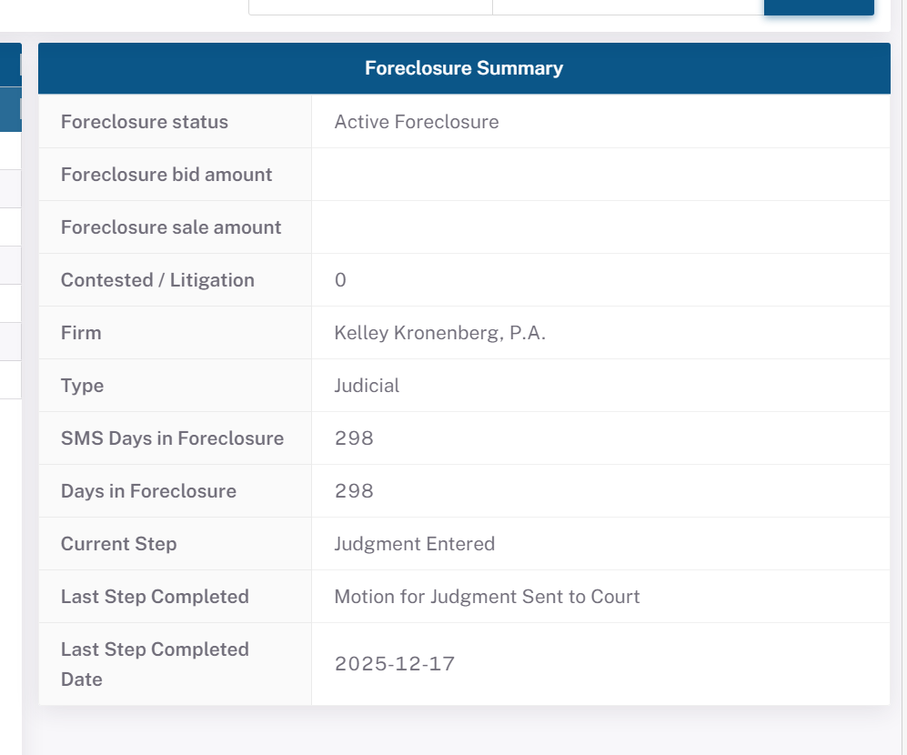

# doc 16 — BPS Foreclosure Panel Quick Reference

> <!-- CODEGLOSS_PTR -->🔧 **code legend**: `pool`=ETL build/SQL code `basic_data_pool_config.py` · `asset`=BPS sync SQL `asset_managment_config.py` · `view`=BPS view definition; number after the colon = **line number** in that file (GitLab commit 32a750a3, clickable).

---

## Document Purpose

- **Why this document exists**: doc 13 is the comprehensive field reverse-mapping document (grouped by field type prefix, 22+ subsections). This document is its "quick-lookup entry point" — organized by BPS UI panel, with screenshots and compact 3-column mapping tables, so operations/development staff can immediately locate the source data for any anomalous field without reading through all of doc 13.
- **Problem solved**: BPS UI screenshot → Newrez source field direct mapping; field name and mapping rule visible in a single view.
- **Scope**: 6 panels on the BPS Foreclosure loan detail page + aggregation overview page; Newrez Servicer only; detailed logic is in doc 13.
- **System fit**: This document is the compact quick-reference version of doc 13. Use this document to locate the panel/field when an anomaly is noticed, then jump to the corresponding doc 13 section for deeper analysis.

## Target Audience

Primary: Operations analysts · BPS system acceptance testers · Data quality engineers  
Secondary: New team members · Future AI sessions

## Revision History

| Date | Author | Version | Changes | Related |
|------|--------|---------|---------|---------|
| 2026-06-04 | AI Agent (Claude Opus 4.8) | v3 | Corrected the Foreclosure Summary quickref "Foreclosure status" row (code + DB): the old `activefcflag=1 → use fcstage; =0 → fcresults or fcremovaldesc` was wrong → `activefcflag=1` fixed text `'Active Foreclosure'`; `=0` and fcremovaldesc non-empty → `'Closed Foreclosure:'+fcremovaldesc`; else NULL (fcstage→summary_current_step); Type/Current Step and the screenshot-verification line expanded/corrected | [basic_data_pool_config.py:273](https://gitlab.bridgerinvestment.com/jli/prefectflow/-/blob/32a750a39c7eda989de991c47467979043e3d209/flow/basic_data/basic_data_config/basic_data_pool_config.py#L273) · doc 13 v35 · doc 14 v33 |
| 2026-06-03 | AI Agent (Claude Opus 4.8) | v2 | SMS Days / Days in Foreclosure rows: added start-date basis (code + DB verified): SMS Days from fcsetupdate (servicer setup), Days from fcreferraldate (referral), hence SMS Days ≤ Days; synced with doc 13/14/16-xlsx/fcl_pipeline.html | doc 13 v34 · doc 14 v31 |
| 2026-05-28 | AI Agent (Claude Sonnet 4.6) | v1 | Initial draft: 6-panel quick reference tables + screenshot; content derived from doc 13 MCP live measurements | doc 13 |

## Related Documents

| Document | Description |
|----------|-------------|
| doc 13 | Newrez FCL complete reverse field mapping (source of this document's data) |
| doc 14 | BPS-driven Servicer data interface specification |

---

## How to Use

1. Find the **panel name** where the anomalous BPS field appears and jump to the corresponding Section
2. Locate the **UI label** in the table; review the Newrez source field and Mapping Rule
3. For full business meaning, fill rates, and verification SQL, jump to the corresponding doc 13 section

---

## Section 1: Foreclosure Summary Panel

> **BPS database source**: `bpms_dev.sync_loan_foreclosure` (`summary_*` fields)  
> **Newrez source table**: `newrez.portnewrezfc`  
> **doc 13 reference**: Section 3.7

### UI Screenshot

### Field Mapping

| UI Label | Newrez Source Field | Mapping Rule |
|---|---|---|
| Foreclosure status | `activefcflag`, `fcremovaldesc` | if `activefcflag=1`, then = fixed text `'Active Foreclosure'`; if `activefcflag=0` and `fcremovaldesc` non-empty, then = `'Closed Foreclosure:'`+`fcremovaldesc`; otherwise `NULL` (note: `fcstage` is not used here — it goes to `summary_current_step`) |
| Foreclosure bid amount | `fcbidamount` | Direct (~9% fill rate in active FCL) |
| Foreclosure sale amount | `fcsaleamount` | Direct (4.7%; ⚠️ exceeds sale-held rate of 2.1%, see doc 13 Q9) |
| Contested / Litigation | `fccontestedflag` | Direct (1=contested / 0=not) |
| Firm | `fcfirm` | Direct (attorney firm full name) |
| Type | `judicial` | if `judicial=1`, then = `'Judicial'`; if `judicial=0`, then = `'Non Judicial'`; if `NULL`/empty, then = `NULL` |
| SMS Days in Foreclosure | `smsdaysinfc`(=svc_days_infc) + `dataasof` | Servicer (SMS=Shellpoint) basis, counted from the **setup date fcsetupdate** (Newrez native, passed through); **Real-time recalculation**: `smsdaysinfc + DATEDIFF(today NY, dataasof)`; ≤ Days in Foreclosure |
| Days in Foreclosure | `daysinfc` + `dataasof` | Investor/full-timeline basis, counted from the **referral date fcreferraldate**; **Real-time recalculation**: `daysinfc + DATEDIFF(today NY, dataasof)`; ≥ SMS Days |
| Current Step | `fcstage` | **= `fcstage` direct passthrough** (`basic_data_pool_config.py:282`). `currentmilestone` exists but is **referenced nowhere in the ETL / unused** (corrected 2026-06-10, see doc 13 Q13) |
| Last Step Completed | `lastfcstepcompleted` | Direct (99.5% fill rate) |
| Last Step Completed Date | `lastfcstepcompleteddate` | Direct |

> **Screenshot verification (loanid=7727000088)**:  
> "Active Foreclosure" ← fixed text (`activefcflag=1`, not `fcstage`); "Kelley Kronenberg, P.A." ← `fcfirm`; "Judicial" ← `judicial=1`; "298" ← `smsdaysinfc + DATEDIFF(screenshot date, dataasof)`; "Judgment Entered" ← `fcstage` (summary_current_step is a direct passthrough of fcstage; `currentmilestone` is unused by ETL); "Motion for Judgment Sent to Court" ← `lastfcstepcompleted`

---

## Section 2: FCL Milestone Timeline Panel

> **BPS database source**: `bpms_dev.sync_loan_foreclosure` (`timeline_*` fields)  
> **Newrez source table**: `newrez.portnewrezfc`  
> **doc 13 reference**: Section 3.1

### Field Mapping

| UI Label | Newrez Source Field | Mapping Rule |
|---|---|---|
| Notice of Intent Date | `demandsentdate` | Direct (NOI/Demand Letter sent date; 85.9% fill) |
| Notice of Intent End Date | `demandexpirationdate` | Direct (NOI expiration date; 85.7%) |
| Approved for Referral Date | `fcsetupdate` | Direct (BPS case open date; Newrez typically same as referral date) |
| Referred to Attorney Date | `fcreferraldate` | Direct |
| Referred to Foreclosure Date | `fcreferraldate` | Direct (**BPS entry core condition**; same field as above) |
| Title Report Received Date | `titlereceiveddate` | Direct (❌ Newrez does not provide; always null) |
| Preliminary Title Cleared Date | `titlecleardate` | Direct (❌ Newrez does not provide; always null) |
| First Legal Date | `firstlegaldate` | Direct (57.6%; typically null in Non-Judicial states) |
| Service Date | `servicecompletedate` | Direct (28.9%) |
| Publication Date | *(no corresponding field)* | ❌ Newrez does not provide; always null |
| Judgement Hearing Set Date | `fcjudgmenthearingscheduled` | Direct (11.9%; Judicial states only; hearing **scheduled date**) |
| Judgement Date | `fcjudgmententered` | Direct (7.9%; court **formally entered** judgment date; ≠ above) |
| Projected Sale Date | `fcscheduledsaledate` | Direct (18.2%; latest projected auction date) |
| Sale Date Set | `fcscheduledsaledate` | Direct (same field; BPS distinguishes by business state) |
| Final Title Cleared Date | `titlecleardate` | Direct (❌ Newrez does not provide; always null) |
| Sale Date Held | `fcsalehelddate` | Direct (2.1%; actual auction date) |
| Foreclosure Completed Date | `dtdeedrecorded` / `fcremovaldate` | `COALESCE(dtdeedrecorded, fcremovaldate)` (deed recording date first; FCL removal date as fallback) |
| Third Party Sold Date | `fcsalehelddate` | Used when `fcresults='3rd Party'` |
| Third Party Proceeds Received Date | `fcl3rdpartyproceedsreceiveddate` | Direct (very rarely populated) |

---

## Section 3: Hold Panel

> **BPS database source**: `bpms_dev.sync_loan_foreclosure_hold` (15 columns)  
> **Newrez source table**: `newrez.portnewrezfc` (3 hold slots, 4 fields each)  
> **doc 13 reference**: Section 4

### Field Mapping

| UI Label | Newrez Source Field | Mapping Rule |
|---|---|---|
| Description | `fchold1/2/3description` | Direct (hold reason text, e.g., "Court Delay") |
| Start Date | `fchold1/2/3startdate` | Direct |
| End Date | `fchold1/2/3enddate` | Direct (NULL = still active) |

> **Architecture note**: Newrez's 3 slots are a **current snapshot**. BPS detects daily changes and appends new rows, accumulating the complete history (e.g., loanid=7727000088 has 7 historical records while Newrez shows only 1 active slot).  
> **BPS entry filter**: `fchold1startdate IS NOT NULL` (slot 1 must have a start date); each slot is unpivoted and a row is created if any of description/dates is non-null.

---

## Section 4: Loss Mitigation Cycle Panel

> **BPS database source**: `bpms_dev.sync_loan_foreclosure_loss_mitigation` (22 columns)  
> **Newrez source table**: `newrez.portnewrezlm`  
> **doc 13 reference**: Section 5

### Field Mapping

| UI Label | Newrez Source Field | Mapping Rule |
|---|---|---|
| Deal | `lmdeal` (int) | ETL-decoded to text (e.g., `7`→`"DIL"`; `1`→`"Evaluation"`) |
| Program | `lmprogram` (int) | ETL-decoded (e.g., `10`→`"Deed-in-Lieu"`; `"Bridger mod"`) |
| Status | `lmstatus` (int) | ETL-decoded (e.g., `"Pending Financials"` / `"Workout Denial"`) |
| Cycle Opened Date | `dealstartdate` | Direct (LM cycle start date) |
| Cycle Closed Date | `lmremovaldate` | Direct (NULL = still active) |
| Final Disposition | `lmdecision` (int) | ETL-decoded (e.g., `"Referral to FC"` / `"Pending"`) |
| Denial / Reason | `denialreason` (int) | ETL-decoded; empty string when no denial |
| Borrower Intentions | `borrowerintention` (int) | ETL-decoded; Newrez always NULL (not provided) |
| Imminent Default | *(no field)* | Newrez does not provide; always NULL |
| Single Point of Contact | *(no field)* | Newrez does not provide; always NULL |

> **BPS entry filter**: `dealstartdate IS NOT NULL`; dedup: `PARTITION BY (loanid, dealstartdate) ORDER BY dataasof DESC` (one row per LM cycle, latest snapshot retained).

---

## Section 5: Bankruptcy Panel

> **BPS database source**: `bpms_dev.sync_loan_foreclosure_bankruptcy` (22 columns)  
> **Newrez source table**: `newrez.portnewrezbk` + `newrez.portnewrezgeneral` (legal_status)  
> **doc 13 reference**: Section 6

### Field Mapping

| UI Label | Newrez Source Field | Mapping Rule |
|---|---|---|
| Status | `bkstatus` (int) | Decode behavior TBD (see doc 13 Q7) |
| Legal Status | `bkstage` (int) | Same as above |
| Status Date | `bkrcurrentstatusdate` | Direct |
| Chapter | `bkchapter` | Direct (7 / 11 / 13) |
| Lien Status | *(TBD)* | Possibly from `portnewrezgeneral.legalstatus` |
| MFR Status | `mfrhearingresults` (int) | Numeric code (decode TBD) |
| MFR Filed Date | `mfrfileddate` | Direct |
| Claim Status | *(TBD)* | Possibly from POC-related fields |
| Proof of Claim Date | `pocfileddate` | Direct |
| Post Petition Due Date | `bkpostpetitionduedate` | Direct |

> **BPS entry filter**: `LENGTH(TRIM(bkstatus)) > 0`; dedup: `PARTITION BY (loanid, bkfileddate) ORDER BY dataasof DESC`.  
> loanid=7727000088 has no bankruptcy records; panel shows "No Rows To Show" (MCP-confirmed).

---

## Section 6: Aggregate Overview Page

> **BPS database source**: `bpms_dev.sync_fcl_stage_info` (57 columns)  
> **Newrez source table**: `newrez.portnewrezfc`  
> **doc 13 reference**: Section 7  
> **⚠️ Active FCL only**: `activefcflag=1 AND fcremovaldate IS NULL` (completed loans excluded)

### Stage Tab — Stage Day Fields

| UI Column | BPS Field | Source / Logic |
|---|---|---|
| Days in Stage | `{stage}_stage_days` | Current stage start date → today |
| Days in LM | `{stage}_in_lm_days` | Days overlapping with LM cycles during current stage |
| Days on Hold | `{stage}_on_hold_days` | Days overlapping with Hold periods during current stage |
| Days to Sale | `to_sale_days` | SALE stage only: `fcscheduledsaledate − today` |
| Days to Judgement | `to_judgement_days` | JUDGEMENT stage only |

### Stage Classification Rules (Waterfall Priority)

| Priority | Stage | Newrez Trigger Condition |
|---|---|---|
| 1 | `SALE` | `fcscheduledsaledate IS NOT NULL` |
| 2 | `JUDGEMENT` | `fcjudgmenthearingscheduled IS NOT NULL` AND SALE not triggered |
| 3 | `PUBLICATION` | `publication_date IS NOT NULL` (Newrez always null) |
| 4 | `SERVICE` | `servicecompletedate IS NOT NULL` |
| 5 | `FIRST_LEGAL` | `firstlegaldate IS NOT NULL` AND SERVICE not triggered |
| 6 | `REFERRAL` | `fcreferraldate IS NOT NULL` AND FIRST_LEGAL not triggered |
| 7 | `DEMAND` | `demandsentdate IS NOT NULL` AND REFERRAL not triggered |

### Time Line Tab — Milestone Date Fields

| UI Column (No.) | BPS Field | Newrez Source Field | Notes |
|---|---|---|---|
| NOI Date 1 | `noi_start_date` | *(no field)* | Always NULL for Newrez (see doc 13 Q11) |
| Referral Date 2 | `referral_start_date` | `fcreferraldate` | 100% (BPS entry prerequisite) |
| First Legal Date 3 | `first_legal_start_date` | `firstlegaldate` | — |
| Service Date 4 | `service_start_date` | `servicecompletedate` | 28.9% |
| Publication Date 5 | `publication_start_date` | *(no field)* | Always NULL for Newrez |
| Judgement Date 6 | `judgement_start_date` | `fcjudgmenthearingscheduled` | Hearing **scheduled date** (not court entry date) |
| Sale Date 7 | `sale_start_date` | `fcscheduledsaledate` | 18.2% |

---

## Appendix: Quick Troubleshooting Path

| Symptom | First Check | Then Check |
|---|---|---|
| Foreclosure Summary field shows unexpected value | Section 1 — find UI label → confirm Newrez source field | doc 13 Section 3.7 + Appendix B SQL-4 |
| Timeline date missing or wrong | Section 2 — find UI label | doc 13 Section 3.1 |
| Hold panel data missing or duplicated | Section 3 architecture note | doc 13 Section 4 + Appendix B SQL-5 |
| LM panel shows numeric codes instead of text | Section 4 Mapping Rule (ETL decode) | doc 13 Section 5 + Section 3.2 ETL decode note |
| BK panel field verification | Section 5 | doc 13 Section 6 + Q7 |
| Aggregation page stage classification wrong | Section 6 stage classification rules | doc 13 Section 7 + Appendix B SQL-9/10 |
| Days in Stage / LM / Hold calculation anomaly | Section 6 Stage Tab field explanation | doc 13 Section 7 |
