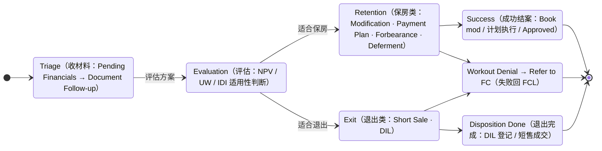
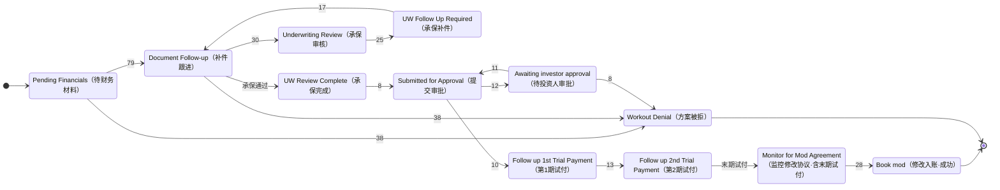
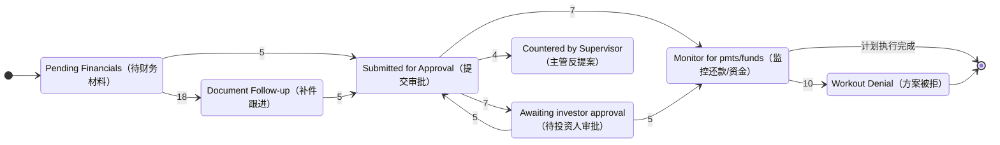
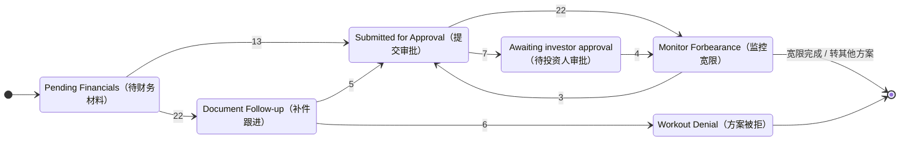
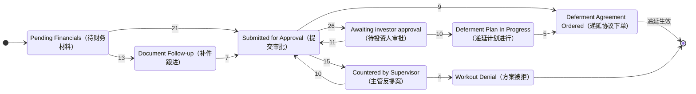
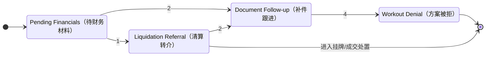
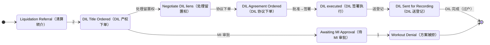

# Loss Mitigation (LM) Business Primer and Solution Guide

---

## Document Purpose

| Item | Content |
|------|------|
| **Document Purpose** | Consolidate the LM (Loss Mitigation) explanations scattered across the project into a single standalone primer, covering LM's business meaning, common solutions, BPS/Newrez field meanings, and the relationship between LM and Foreclosure. |
| **Target Audience** | Data product managers, business analysts, operations/asset-management teams, new members, future AI sessions |
| **Scope** | LM fundamentals, the six common solution types, the meaning of Deal/Program/Status/Final Disposition in Newrez/BPS, LM's impact on FCL, and an index of related project documents |
| **Out of Scope** | State-specific legal details, investor/Agency-specific approval rules, full field-gap analysis for each Servicer |
| **Dependencies** | doc 10 consolidated glossary; doc 08 Servicer FCL field mapping; doc 09 Servicer data interface standard; doc 13 Newrez BPS display mapping; doc 15 Newrez field gap analysis; doc 16 BPS panel quick reference |

**Revision History:**

| Date | Author | Version | Changes |
|------|------|------|---------|
| 2026-06-03 | AI Agent (Claude Opus 4.8) | v2 (en) | Added §0 "Abbreviations (Full Names)" table (LM/FCL/DIL/SS/TPP/MI/NPV/UW/IDI/DPD/BK/REO/CFK/GSE); §4.5 DIL heading already carries the full name | = zh doc 18 v5 |
| 2026-06-03 | AI Agent (Claude Opus 4.8) | v1 (en) | Initial English version — full mirror of zh doc 18 (incl. §4.5 bilingual LM Status state diagrams + node/edge tables) | = zh doc 18 |
| 2026-05-29 | AI Agent | v1 | Initial version; consolidated from existing LM-related documents into a standalone sharing/reference document |
| 2026-06-03 | AI Agent (Claude Opus 4.8) | v3 | §4.3 Status table expanded from 6 examples to **22 actually observed** (incl. business meaning / stage / common Deal; noting the full dictionary domain is ~150 codes); added §4.5 "LM Status state-transition diagrams (by Deal category)": overview + Modification/Payment Plan/Forbearance/Deferment/Short Sale/DIL, 6 Mermaid stateDiagrams in total, with edges annotated by observed `portnewrezlm` time-series transition frequencies (547 cycles). Synced doc 14 lm_status value-range column to all 22 | DB measured (portnewrezlm time-series) · Redshift portnewrezdatadic · doc 14 v30 |
| 2026-06-03 | AI Agent (Claude Opus 4.8) | v2 | §4.1 Deal table corrected against DB: `Repayment Plan`→`Payment Plan` (deal; Repayment Plan is actually its program), added `Deferment`/`Payoff` (8 total, plus a note on the 5 dictionary codes not appearing in data); §3 "six types" business concept retained with an added "correspondence to Newrez data deal" note (TPP is at the program layer, Repayment↔Payment Plan, Newrez also has Evaluation/Deferment/Payoff). Consistent with doc 14 lm_type/lm_deal, doc 13 §5, Redshift portnewrezdatadic | DB measured · doc 14 v27 · doc 13 v33 |

---

## 0. Abbreviations (Full Names)

Full names of the professional abbreviations used in this doc (and in the state diagrams):

| Abbr. | Full name (English) | 中文 (zh) |
|---|---|---|
| **LM** | Loss Mitigation | 损失缓解 |
| **FCL** | Foreclosure | 止赎 |
| **DIL** | Deed-in-Lieu (of Foreclosure) | 以房抵债（自愿交还房产抵偿贷款） |
| **SS** | Short Sale | 短售 |
| **TPP** | Trial Period Plan | 试行期计划（永久修改前的试还期） |
| **MI** | Mortgage Insurance (incl. PMI = Private MI) | 贷款保险 |
| **NPV** | Net Present Value | 净现值（LM 评估测算模型） |
| **UW** | Underwriting | 承保 / 核保 |
| **IDI** | Imminent Default (Indicator) | 即将违约（评估流程） |
| **DPD** | Days Past Due | 逾期天数 |
| **BK** | Bankruptcy | 破产 |
| **REO** | Real Estate Owned | 贷款方持有房产（止赎完成无人出价的结果） |
| **CFK** | Cash for Keys | 现金换交房 |
| **GSE** | Government-Sponsored Enterprise | 政府支持企业（Fannie Mae / Freddie Mac） |

---

## 1. What LM Is

**LM = Loss Mitigation**.

It is not a separate foreclosure stage, but a set of alternative resolution options that the lender or Servicer offers to avoid foreclosure losses and help the borrower resolve delinquency.

Put simply:

| Problem | What LM does |
|------|-----------|
| Borrower is delinquent but still has the ability to recover payments | Offer a temporary forbearance, repayment plan, or loan modification |
| Borrower cannot resume normal payments but is willing to cooperate in exiting the property | Offer a Short Sale or Deed-in-Lieu |
| Foreclosure has already started, but the borrower submits documents requesting relief | Enter LM Evaluation; FCL may be put on Hold / Pause |

LM is an **independent business dimension** that can coexist with FCL. For example: a loan is already in Foreclosure but also has an active LM cycle, meaning the Servicer is still evaluating the borrower's relief options while the foreclosure process advances or is paused.

---

## 2. The Relationship Between LM and Foreclosure

LM's core goal is: **to find a lower-loss resolution path before foreclosure completes**.

| Relationship | Explanation |
|------|------|
| LM is not FCL | LM is a relief/alternative option; FCL is the legal foreclosure process |
| LM can occur before FCL | After becoming delinquent, the borrower first tries a repayment plan, loan modification, etc. |
| LM can occur during FCL | After FCL starts the borrower can still apply for LM, which may trigger a Hold |
| Successful LM may terminate FCL | After a successful Modification/Repayment the loan returns to performing; after a successful Short Sale/DIL the loan is closed |
| Failed LM usually returns to FCL | After Denied, Withdrawn, Request Incomplete, or Referral to FC, FCL continues to advance |

In data modeling, LM should not simply be crammed into `delinquency_status`. A more sensible design uses independent fields, for example:

| Field | Meaning |
|------|------|
| `lm_flag` | Whether an active LM exists |
| `lm_type` / `deal` | LM solution category |
| `lm_program` | Specific execution program |
| `lm_status` | Current processing status |
| `lm_start_date` / `lm_end_date` | Start/end dates of this LM cycle |
| `lm_final_disposition` | Final conclusion of this LM cycle |

---

## 3. The Six Common LM Solution Types

The project's existing documents summarize LM solutions into six types. They can be understood along a spectrum from "retain the property" to "exit the property".

| Solution | English | Borrower goal | Business meaning | Typical outcome |
|------|------|------------|----------|----------|
| Forbearance | Forbearance | Temporarily retain the property | Suspend or reduce monthly payments for a period, then catch up or transition to another solution at the end | Temporary relief; may return to normal, transition to Modification, or fail |
| Loan Modification | Loan Modification | Long-term retain the property | Permanently modify loan terms such as rate, term, principal balance, or payment structure | After success the loan returns to performing |
| Repayment Plan | Repayment Plan | Retain the property | Catch up on past-due amounts in installments while resuming normal monthly payments | Applicable when short-term hardship has been resolved |
| Trial Period Plan | Trial Period Plan / TPP | Trial-run before a permanent modification | Before the permanent Modification takes effect, the borrower first makes the new payment amount for several consecutive periods | After passing, transition to Permanent Modification; on failure, LM denied |
| Short Sale | Short Sale | Proactively sell the property | The lender allows the property to be sold below the loan balance and resolves the shortfall | Loan closed, usually avoiding a full FCL auction |
| Deed-in-Lieu | Deed-in-Lieu / DIL | Proactively return the property | The borrower voluntarily transfers title to the lender in exchange for resolving the loan debt | Loan closed, avoiding a public foreclosure auction |

### 3.1 Grouping by Business Direction

| Group | Included solutions | Business direction |
|------|----------|----------|
| Retention type | Forbearance, Loan Modification, Repayment Plan, Trial Period Plan | Borrower continues to hold the property; loan returns to performing |
| Exit type | Short Sale, Deed-in-Lieu | Borrower no longer retains the property but avoids or reduces foreclosure loss |
| Evaluation stage | Evaluation | Not a final solution, but the Servicer evaluating which type of LM the borrower is suited for |

> **Correspondence to Newrez data `deal` (important)**: The "six types" above are a **business-teaching classification** and do not map one-to-one to the actual Newrez `deal` data enumeration (see §4.1):
> - **Trial Period Plan (TPP)** is **not a standalone deal** in Newrez, but a `program`/status under Modification (the trial stage before a permanent modification);
> - The business term **Repayment Plan** corresponds to the Newrez deal `Payment Plan` (Repayment Plan is its program); **Loan Modification = `Modification`**, **Deed-in-Lieu = `DIL`**;
> - Present in Newrez data but not separately listed in the "six types": **`Evaluation` (evaluation stage), `Deferment`, `Payoff`** — where Deferment is also a common retention-type solution (fairly frequent in the data).
> Therefore Newrez has **8** actually observed `deal` values (§4.1), consistent with doc 14 `lm_type`/`lm_deal`.

In doc 13's Newrez/BPS context, the LM Cycle panel does not just show "whether there is LM", but displays the full lifecycle of each LM round.

### 4.1 Deal: LM Solution Category

`Deal` indicates the overall direction of this LM round.

> **Deal values follow the Newrez `lmdeal` decode** (Redshift dictionary table `newrez.portnewrezdatadic` field_name='LMDeal'; code [`basic_data_pool_config.py:835`](https://gitlab.bridgerinvestment.com/jli/prefectflow/-/blob/32a750a39c7eda989de991c47467979043e3d209/flow/basic_data/basic_data_config/basic_data_pool_config.py#L835)). The dictionary defines 13 codes, of which **8 are actually observed in data** (table below). Note: the deal is `Payment Plan` (not `Repayment Plan` — the latter is its `program`).

| Deal value | Business meaning | Borrower outcome |
|---------|----------|------------|
| `Evaluation` | Initial evaluation, confirming the borrower's documents and applicable solution | Not yet determined |
| `Modification` | Loan modification | Retain the property |
| `Forbearance` | Temporary forbearance | Temporary relief |
| `Payment Plan` | Repayment plan (program named Repayment Plan) | Retain the property |
| `Deferment` | Deferment: move the past-due amount to the end of the loan | Retain the property |
| `Short Sale` | Short sale | Sell the property |
| `DIL` | Deed-in-Lieu | Surrender the property |
| `Payoff` | Pay off / settle | Exit (paid off) |

> 5 codes the dictionary also defines but that do not currently appear in data: `3 Reinstatement`, `8 Loan Sale`, `10 Settlement`, `12 CFK`, `13 Consent Judgement`.

### 4.2 Program: Specific Execution Solution

`Program` is the more specific execution solution under a Deal. It may be a standard name, or a Newrez or investor internal code.

| Program example | Belongs to Deal | Meaning |
|--------------|-----------|------|
| `Evaluation` | Evaluation | Generic evaluation flow |
| `Bridger mod` | Modification | Bridger/Newrez proprietary modification solution |
| `496.0` | Modification | Newrez/investor internal solution code; confirm exact meaning against the config table |
| `Short Sale` | Short Sale | Standard short-sale flow |
| `Deed-in-Lieu` | DIL | Standard deed-in-lieu flow |

### 4.3 Status: Current Processing Status

`Status` (Newrez `lmstatus` decode) indicates how far this LM round has progressed. **The dictionary defines ~150 status codes in full** (Pre-underwrite/NPV/UW/various Trial/DIL/Short Sale/Deferment/Assumption/Commercial… through Closed), but for this loan set **only 22 are actually observed in data** (table below, descending by frequency). For the full code→text mapping see the data dictionary / Redshift `newrez.portnewrezdatadic` (field_name='LMStatus').

> **Belongs to stage**: Document intake/Triage (collect documents, initial assessment) · Evaluation & underwriting (NPV/UW review) · Trial (Trial Payment) · Approval (submission/investor/MI approval) · Execution (agreement order/signing/monitoring) · Resolution (successful booking / denial / refer to FC). See §4.5 state diagrams for each Deal's status flow.

| Status (observed) | Business meaning | Belongs to stage | Common in Deal |
|---|---|---|---|
| `Workout Denial` | This round's workout / LM solution is denied, terminated | Resolution (denial) | All |
| `Pending Financials` | Waiting for the borrower to submit financial documents | Document intake / Triage | All (esp. Evaluation) |
| `Document Follow-up` | Documents incomplete, continue follow-up | Document intake | All |
| `Monitor Forbearance` | Forbearance plan in execution, monitoring payments | Execution / monitoring | Forbearance |
| `Book mod` | Permanent modification formally booked (successful closure) | Resolution (success) | Modification |
| `Deferment Agreement Ordered` | Deferment agreement has been ordered | Execution | Deferment |
| `Deferment Plan In Progress` | Deferment plan in progress | Execution | Deferment |
| `Monitor for pmts/funds` | Monitoring payments / fund receipt | Execution / monitoring | Payment Plan |
| `Liquidation Referral` | Referral to liquidation (short sale / DIL and other exit-disposition referrals) | Exit referral | Short Sale / DIL / Payoff |
| `Follow up for 1st Trial Payment` | Follow up on 1st trial payment | Trial | Modification |
| `Solicitation Offered` | LM solicitation has been offered to the borrower | Solicitation / Triage | Evaluation / Modification |
| `Monitor for Mod Agreement` | Monitoring modification-agreement signing/return | Execution | Modification |
| `Follow up for 2nd Trial Payment` | Follow up on 2nd trial payment | Trial | Modification |
| `Countered by Supervisor` | Supervisor returns / counter-proposes | Approval | Deferment / Payment Plan / Forbearance / DIL |
| `Monitor for Mod Agreement – Final Trial Payment Due` | Monitor modification agreement (final trial payment due) | Trial → Execution | Modification |
| `Awaiting MI Approval` | Awaiting MI (mortgage insurance) approval | Approval | DIL |
| `DIL Sent for Recording` | DIL deed sent for recording | Execution (DIL) | DIL |
| `Negotiate DIL liens` | Handle other liens / debts | Execution (DIL) | DIL |
| `DIL Title Ordered` | DIL-stage title search ordered | Execution (DIL) | DIL |
| `Submitted for Approval` | Submitted for approval | Approval | Payment Plan / Forbearance / Deferment / DIL |
| `Not Assigned` | No handler assigned | Triage | Evaluation |
| `Awaiting investor approval` | Awaiting investor approval | Approval | All |

### 4.4 Final Disposition: Final Disposition Result

`Final Disposition` indicates the conclusion when this LM round closes.

| Final Disposition | Business meaning | Impact on FCL |
|-------------------|----------|---------------|
| `Approved` | LM solution approved | FCL is usually withdrawn or remains paused |
| `Denied` | Denied after full evaluation | FCL continues to advance |
| `Request Incomplete` | Borrower's documents incomplete or application not completed | FCL continues to advance |
| `Referral to FC` | LM failed and is referred back to Foreclosure | FCL continues to advance |
| `Withdrawn` | Borrower proactively withdrew the application | FCL continues to advance |
| `Pending` | Still in processing | FCL may be on Hold |
| `LMS Opened in Error` | Record opened in error by the system | Usually handled as an administrative error |

---

## 4.5 LM Status State-Transition Diagrams (by Deal Category)

`lm_status` is the **current working status of this LM round**; different Deal categories follow different status-transition paths. The state diagrams below:
- **Node = status**, with labels in **English（中文）bilingual** form, arranged left to right by business stage (Document intake/Triage → Evaluation & underwriting → Trial → Approval → Execution → Resolution);
- **Edge = status transition**, with the skeleton based on business logic and **numbers on edges being observed frequencies** (from `newrez.portnewrezlm`, computed over `(loanid, dealstartdate)` time-series adjacent `lmstatus` changes, 2026-06-03, 547 LM cycles total; decode source Redshift `portnewrezdatadic`);
- Each diagram is **followed by two tables, "Node descriptions" and "Transition (edge) descriptions"**, explaining each node's business meaning and each edge's business action;
- Terminal states: `Book mod`/`Approved`/plan executed (success), `Workout Denial`→`Refer to FC` (failure back to FCL), exit-disposition complete (DIL/short sale).
- ⚠️ The observed sample is limited; low-frequency/rare edges are not all drawn; the diagrams are for **understanding status relationships**, not exhaustive enumeration.

> Maintenance note: all are Mermaid `stateDiagram-v2` fenced blocks (node IDs use ASCII, bilingual only in labels); the diagrams and the description tables below share the same source, easy to render to HTML later.

### Overview (Deal Routing + Common Stages)

**Node descriptions**

| Status (English) | 中文 (zh) | Business meaning / stage |
|---|---|---|
| Triage | 收材料 / 初判 | Collect the borrower's financial documents, make an initial assessment (Pending Financials → Document Follow-up) |
| Evaluation | 评估 | Use NPV / underwriting / IDI etc. to evaluate which solution type the borrower is suited for |
| Retention | 保房类 | Solution family where the borrower retains the property (Modification / Payment Plan / Forbearance / Deferment) |
| Exit | 退出类 | Solution family where the borrower exits the property (Short Sale / DIL) |
| Success | 成功结案 | Solution succeeds (modification booked / plan executed / approved) |
| Workout Denial | 失败 | LM is denied/terminated, referred back to Foreclosure to advance |
| Disposition Done | 退出完成 | DIL title transfer/recording / short-sale closing complete |

**Transition (edge) descriptions**

| Transition | Business action / meaning |
|---|---|
| Triage → Evaluation | After documents are complete, enter solution evaluation |
| Evaluation → Retention | Evaluation determines a retention solution is suitable |
| Evaluation → Exit | Evaluation determines only exiting the property is possible |
| Retention → Success / Denial | Retention solution succeeds / is denied |
| Exit → Disposition Done / Denial | Exit solution completes / is denied |

---

### Modification (Loan Modification)

Observed main path: `Pending Financials → Document Follow-up → underwriting (UW) → approval → trial (1st/2nd Trial) → monitor mod agreement → Book mod`; if any step fails evaluation → `Workout Denial`.

**Node descriptions**

| Status (English) | 中文 (zh) | Business meaning / what this status is doing |
|---|---|---|
| Pending Financials | 待财务材料 | Waiting for the borrower to submit income/financial documents |
| Document Follow-up | 补件跟进 | Documents incomplete, continue to chase the missing items |
| Underwriting Review | 承保审核 | Enter underwriting/credit review |
| UW Follow Up Required | 承保补件 | Additional documents required during underwriting (returned for follow-up) |
| UW Review Complete | 承保完成 | Underwriting review passed, can proceed to approval |
| Submitted for Approval | 提交审批 | Solution submitted for internal/investor approval |
| Awaiting investor approval | 待投资人审批 | Awaiting investor/Agency approval |
| Follow up 1st/2nd Trial Payment | 第1/2期试付 | Follow-up on trial payments before the permanent modification (TPP) |
| Monitor for Mod Agreement | 监控修改协议 | Monitor modification-agreement sending/signing (incl. final trial payment due) |
| Book mod | 修改入账 | Permanent modification formally booked, **successful closure** |
| Workout Denial | 方案被拒 | Modification denied/terminated → back to FCL |

**Transition (edge) descriptions**

| Transition | Business action / meaning | Observed count |
|---|---|---|
| Pending Financials → Document Follow-up | Documents incomplete, send follow-up letter | 79 |
| Pending Financials → Workout Denial | Documents missing/unqualified, deny directly | 38 |
| Document Follow-up → Workout Denial | Follow-up failed, denied | 38 |
| Document Follow-up → Underwriting Review | Documents complete, send to underwriting | 30 |
| Underwriting Review → UW Follow Up Required | Underwriting requests more documents | 25 |
| UW Follow Up Required → Document Follow-up | Returned to continue follow-up | 17 |
| Document Follow-up → UW Review Complete | Underwriting passed | Process linkage |
| UW Review Complete → Submitted for Approval | Submit for approval | 8 |
| Submitted for Approval → Awaiting investor approval | Report to investor | 12 |
| Awaiting investor approval → Submitted for Approval | Investor returns, re-report | 11 |
| Awaiting investor approval → Workout Denial | Investor denies approval | 8 |
| Submitted for Approval → 1st Trial Payment | Approved, start trial payments | 10 |
| 1st → 2nd Trial Payment | Trial payment progresses | 13 |
| 2nd Trial Payment → Monitor for Mod Agreement | Final trial payment, transition to monitoring agreement | Process linkage |
| Monitor for Mod Agreement → Book mod | Agreement signed, modification booked | 28 |

---

### Payment Plan (Repayment Plan)

Observed main path: `Pending Financials → Document Follow-up → submit for approval (↔ investor) → Monitor for pmts/funds (monitor payments)`; default during monitoring → `Workout Denial`.

**Node descriptions**

| Status (English) | 中文 (zh) | Business meaning |
|---|---|---|
| Pending Financials | 待财务材料 | Waiting for the borrower to submit documents |
| Document Follow-up | 补件跟进 | Document follow-up |
| Submitted for Approval | 提交审批 | Repayment plan submitted for approval |
| Awaiting investor approval | 待投资人审批 | Awaiting investor approval |
| Countered by Supervisor | 主管反提案 | Supervisor returns/adjusts terms |
| Monitor for pmts/funds | 监控还款/资金 | After the plan takes effect, monitor receipt of installment payments |
| Workout Denial | 方案被拒 | Plan denied or default during execution → back to FCL |

**Transition (edge) descriptions**

| Transition | Business action / meaning | Observed count |
|---|---|---|
| Pending Financials → Document Follow-up | Document follow-up | 18 |
| Pending Financials → Submitted for Approval | Documents complete, submit directly | 5 |
| Document Follow-up → Submitted for Approval | Submit after follow-up | 5 |
| Submitted for Approval → Awaiting investor approval | Report to investor | 7 |
| Awaiting investor approval → Submitted for Approval | Return, re-report | 5 |
| Submitted for Approval → Countered by Supervisor | Supervisor counter-proposes | 4 |
| Submitted for Approval → Monitor for pmts/funds | Approved, enter monitoring | 7 |
| Awaiting investor approval → Monitor for pmts/funds | Approved, enter monitoring | 5 |
| Monitor for pmts/funds → Workout Denial | Default during monitoring, terminated | 10 |
| Monitor for pmts/funds → [complete] | Plan execution complete | Terminal state |

---

### Forbearance

Observed main path: `Pending Financials → Document Follow-up → submit for approval → Monitor Forbearance (monitor forbearance-period payments)`; not recovered by end → `Workout Denial`.

**Node descriptions**

| Status (English) | 中文 (zh) | Business meaning |
|---|---|---|
| Pending Financials | 待财务材料 | Waiting for documents |
| Document Follow-up | 补件跟进 | Document follow-up |
| Submitted for Approval | 提交审批 | Forbearance solution submitted for approval |
| Awaiting investor approval | 待投资人审批 | Awaiting investor approval |
| Monitor Forbearance | 监控宽限 | Monitor during the forbearance period (suspended/reduced payments) |
| Workout Denial | 方案被拒 | Forbearance denied or not recovered by end → back to FCL |

**Transition (edge) descriptions**

| Transition | Business action / meaning | Observed count |
|---|---|---|
| Pending Financials → Document Follow-up | Document follow-up | 22 |
| Pending Financials → Submitted for Approval | Documents complete, submit directly | 13 |
| Document Follow-up → Submitted for Approval | Submit after follow-up | 5 |
| Submitted for Approval → Awaiting investor approval | Report to investor | 7 |
| Submitted for Approval → Monitor Forbearance | Approved, enter monitoring | 22 |
| Awaiting investor approval → Monitor Forbearance | Approved, enter monitoring | 4 |
| Monitor Forbearance → Submitted for Approval | Re-propose during forbearance (extension/switch solution) | 3 |
| Document Follow-up → Workout Denial | Follow-up failed, denied | 6 |
| Monitor Forbearance → [complete] | Forbearance complete / switch to another solution | Terminal state |

---

### Deferment

Observed main path: `Pending Financials → submit for approval (↔ investor / supervisor counter) → Deferment Plan In Progress → Deferment Agreement Ordered`; approval denied → `Workout Denial`.

**Node descriptions**

| Status (English) | 中文 (zh) | Business meaning |
|---|---|---|
| Pending Financials | 待财务材料 | Waiting for documents |
| Document Follow-up | 补件跟进 | Document follow-up |
| Submitted for Approval | 提交审批 | Deferment solution submitted for approval |
| Awaiting investor approval | 待投资人审批 | Awaiting investor approval |
| Countered by Supervisor | 主管反提案 | Supervisor returns/adjusts |
| Deferment Plan In Progress | 递延计划进行 | Deferment plan in execution |
| Deferment Agreement Ordered | 递延协议下单 | Deferment agreement ordered (about to take effect) |
| Workout Denial | 方案被拒 | Deferment denied → back to FCL |

**Transition (edge) descriptions**

| Transition | Business action / meaning | Observed count |
|---|---|---|
| Pending Financials → Submitted for Approval | Documents complete, submit directly | 21 |
| Pending Financials → Document Follow-up | Document follow-up | 13 |
| Document Follow-up → Submitted for Approval | Submit after follow-up | 7 |
| Submitted for Approval → Awaiting investor approval | Report to investor | 26 |
| Awaiting investor approval → Submitted for Approval | Return, re-report | 11 |
| Submitted for Approval → Countered by Supervisor | Supervisor counter-proposes | 15 |
| Countered by Supervisor → Submitted for Approval | Re-report after adjustment | 10 |
| Awaiting investor approval → Deferment Plan In Progress | Approved, plan execution | 10 |
| Submitted for Approval → Deferment Agreement Ordered | Approved, order agreement | 9 |
| Deferment Plan In Progress → Deferment Agreement Ordered | Plan → order agreement | 5 |
| Countered by Supervisor → Workout Denial | Still denied after counter-proposal | 4 |
| Deferment Agreement Ordered → [effective] | Deferment agreement takes effect | Terminal state |

---

### Short Sale

Limited observed sample (9 cycles). Main path: `Pending Financials / Document Follow-up → Liquidation Referral (refer to liquidation/listing disposition)`; evaluation fails → `Workout Denial`.

**Node descriptions**

| Status (English) | 中文 (zh) | Business meaning |
|---|---|---|
| Pending Financials | 待财务材料 | Waiting for documents |
| Document Follow-up | 补件跟进 | Document follow-up |
| Liquidation Referral | 清算转介 | Refer into the liquidation/listing disposition flow (short-sale execution) |
| Workout Denial | 方案被拒 | Short sale denied → back to FCL |

**Transition (edge) descriptions**

| Transition | Business action / meaning | Observed count |
|---|---|---|
| Pending Financials → Document Follow-up | Document follow-up | 2 |
| Pending Financials → Liquidation Referral | Refer directly to liquidation disposition | 1 |
| Liquidation Referral → Document Follow-up | Re-collect documents during disposition | 2 |
| Document Follow-up → Workout Denial | Follow-up failed, denied | 4 |
| Liquidation Referral → [disposition] | Enter listing/closing disposition | Terminal state |

---

### DIL (Deed-in-Lieu)

Limited observed sample (10 cycles). Main path: `Liquidation Referral → DIL Title Ordered → Negotiate DIL liens → DIL agreement (order/approval/signing) → DIL executed → DIL Sent for Recording`; rejected midway → `Workout Denial`.

**Node descriptions**

| Status (English) | 中文 (zh) | Business meaning |
|---|---|---|
| Liquidation Referral | 清算转介 | Refer into exit/liquidation disposition (DIL execution starting point) |
| DIL Title Ordered | DIL 产权下单 | Order title search |
| Negotiate DIL liens | 处理留置权 | Handle other liens/debts (clear title) |
| DIL Agreement Ordered | DIL 协议下单 | Order the DIL agreement (sign after approval) |
| Awaiting MI Approval | 待 MI 审批 | Awaiting mortgage insurance (MI) approval |
| DIL executed | DIL 签署执行 | DIL agreement signing complete |
| DIL Sent for Recording | DIL 送登记 | Deed sent to the county/jurisdiction for recording (title transfer) |
| Workout Denial | 方案被拒 | DIL rejected → back to FCL |

**Transition (edge) descriptions**

| Transition | Business action / meaning | Observed count |
|---|---|---|
| Liquidation Referral → DIL Title Ordered | Start title search | 2 |
| DIL Title Ordered → Negotiate DIL liens | Clear liens | Process linkage |
| Negotiate DIL liens → DIL Agreement Ordered | Order agreement after liens cleared | Process linkage |
| DIL Agreement Ordered → DIL executed | Approve and sign the agreement | Process linkage |
| DIL executed → DIL Sent for Recording | Send for recording after signing | Process linkage |
| DIL Title Ordered → Awaiting MI Approval | Branch requiring MI approval | Process linkage |
| Awaiting MI Approval → Workout Denial | MI not approved, rejected | 1 |
| DIL Sent for Recording → [complete] | DIL complete (title transfer recorded) | Terminal state |

---

## 5. Why the Same Loan Can Have Multiple LM Rounds

The same loan can have multiple LM cycles; this does not mean the data is duplicated. Common reasons:

| Reason | Explanation |
|------|------|
| Regulatory requirement | The Servicer must evaluate the borrower's available LM options before foreclosure |
| Solution escalation | After Evaluation fails it may enter Modification; after Modification fails it may enter Short Sale or DIL |
| Solution change | A different Program may be substituted under the same category, e.g. different investor solutions |
| Repeated document re-submission | The borrower submits multiple times, incompletely, follows up, or re-applies |
| Operational error | The system opens an LM cycle in error, possibly closed as `LMS Opened in Error` |

Therefore, when analyzing LM, look at the full chain by `loanid + cycle start/end + deal/program/status/disposition`, not just a single row.

---

## 6. Where to Look Up LM in the Current Project

| What you want to find | Recommended document |
|------------|----------|
| A one-line definition of LM | `docs/zh/10_glossary.md` category A |
| Explanation of the six LM solution types | `docs/zh/10_glossary.md` category D; this doc Section 3 |
| Which LM fields to request from the Servicer | `docs/zh/08_servicer_fcl_field_mapping.md`, `docs/zh/09_servicer_data_interface_standard.md` |
| How LM Cycle fields map on the BPS interface | `docs/zh/13_newrez_fcl_bps_display_mapping.md` Section 5 |
| Newrez's current LM field gaps | `docs/zh/15_newrez_servicer_fcl_gap_analysis.md` Section 4.5 |
| Quickly view BPS panel fields | `docs/zh/16_bps_panel_quickref.md` Section 4 |
| Leads to LM raw/intermediate tables | `docs/zh/01_source_data.md`, sections related to `portnewrezlm`, `portlmdaily` |

---

## 7. Recommendations for Subsequent Analysis

For subsequent LM / FCL lineage analysis, the recommended order is:

1. First read the code and config to confirm how fields such as `lmdeal`, `lmprogram`, `lmstatus`, `lmdecision` are decoded from raw codes into text.
2. Then use read-only database queries to verify the current data distribution, e.g. distinct values per Deal/Program/Status, null rate, active cycle count.
3. For each Servicer separately, confirm whether `lm_flag`, `lm_type`, `lm_start_date`, `lm_end_date`, `lm_status` are provided.
4. In the interface standard, treat LM as an independent field group; do not rely on `delinquency_status` to infer LM indirectly.

---

## 8. Quick Recap

LM is the "set of loss-mitigation/relief solutions" before or during foreclosure.

The six common solution types:

1. Forbearance: catch your breath first.
2. Loan Modification: permanently change the loan terms.
3. Repayment Plan: normal payments plus installment catch-up of arrears.
4. Trial Period Plan: trial-run a few payments before the formal modification.
5. Short Sale: sell the house below the loan balance.
6. Deed-in-Lieu: proactively hand over the house to settle the debt.

In BPS/Newrez, focus on four fields:

| Field | Quick meaning |
|------|----------|
| Deal | Solution category |
| Program | Specific solution |
| Status | Current progress |
| Final Disposition | Final result of this round |
