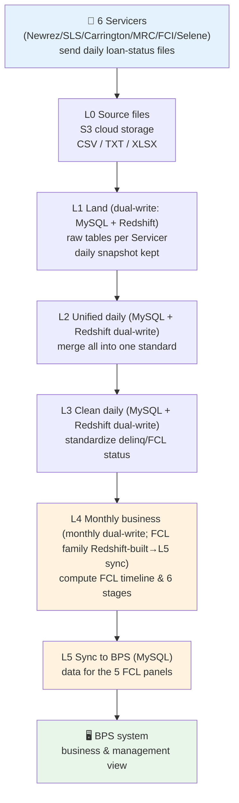
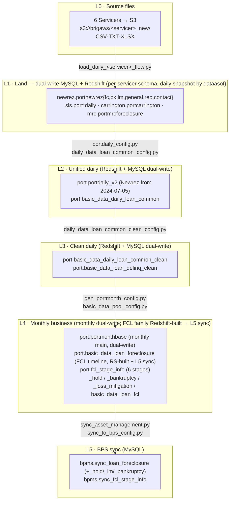

# 20 · Foreclosure End-to-End Data Walkthrough (Source Servicer Files → BPS System)

---

## Document Information

| Field | Content |
|-------|---------|
| **Purpose** | A top-level walkthrough that connects the foreclosure (FCL) data journey from **source Servicer files** to **the BPS system** into one storyline; and explains, **from a business angle, WHY the data is modeled/processed the way it is** (e.g. why one foreclosure has multiple Hold records). Meant to help you **walk colleagues through the whole data flow** — giving both the big picture and the **business rationale** behind each processing decision. |
| **Problem solved** | The existing doc library (doc 01–19) dissects every layer, but there was no single piece tying the five ETL layers together **and explaining the processing motivation in business terms**. This doc fills that gap and is the **recommended first read** of the library. |
| **Scope** | ✅ End-to-end five-layer flow (L0 source files → L5 BPS sync): panorama, per-layer role, responsible code files, verification; ✅ **"why the data is processed this way" business rationale** (§A.6) + narration script + Q&A. ❌ Does not repeat field-level detail (→ doc 25–30); ❌ no internal BPS logic. |
| **System** | `C:\Users\jli\MyData\Copilot\PrefectFlow` (Prefect 2.x mortgage loan servicing ETL system). This ForeclosureRule2 repo is the reverse-engineering documentation of that system. |

**Target audience:** Primary — data engineers and anyone who needs to **walk colleagues through the whole data flow**; Secondary — onboarding engineers, future AI sessions.

**Revision history:**

| Date | Author | Version | Changes | Related |
|------|--------|---------|---------|---------|
| 2026-06-06 | AI Agent (Claude Opus 4.8) | v1 | Initial: five-layer panorama + narration script + concept bridge + code map + sample-loan walk | doc 01/02/12/13/17/18/19 |
| 2026-06-06 | AI Agent (Claude Opus 4.8) | v2 | Code-verified L2/L3 corrections (fcl_flag not unified, days360 basis, observed delinq set, ghost-cols location, 4:35 schedule not in code); fixed sample-SQL column names + added verified values; concept bridge marked "for your ramp-up only, skip in a formal walkthrough", narration de-China-banked; linked doc 21 | PrefectFlow source · doc 21 |
| 2026-06-06 | AI Agent (Claude Opus 4.8) | v3 | Re-framed audience to **walking colleagues through the data flow**; re-framed Part A; **added §A.6 "why the data is processed this way (business rationale)"** (10 rows, multi-Hold first, per doc 17/18/10) | doc 17/18/10 · doc 21 |
| 2026-06-06 | AI Agent (Claude Opus 4.8) | v4 | **Corrected storage to MySQL+Redshift dual-write** (was "MySQL"): updated A.1/A.2/B.1 panorama & per-layer B.2 with "target DB", **added §B.6 per-layer storage-target evidence table**; L1–L4 mostly dual-write, FCL family Redshift-built + L5 sync — all with PrefectFlow file:line + MCP checks | PrefectFlow source · mysql_prod/redshift |

**Dependencies:** This is an "index + narration" piece — authoritative detail lives in:
doc 01 (sources) · 02 (ETL 5 layers) · 03 (status logic) · 10 (glossary) · 12 (BPS sync code) · 13 (BPS UI field mapping) · 17 (FCL primer) · 18 (LM primer) · 19 (sample-loan raw dump).

**Glossary quick ref:** FCL=Foreclosure · BK=Bankruptcy · LM=Loss Mitigation · REO=Real Estate Owned · delinq=delinquency status code · Servicer=loan servicer · BPS=Business Planning System. Full definitions in [doc 10](10_glossary.md).

---
---

# Part A — Business view: why the data is produced & modeled this way

> For walking colleagues through it: use FCL/LM/BK/REO terms directly; focus on the **whole picture** and the **business rationale behind each processing decision**. A.1–A.2 give the panorama; **A.6 is the core** — a line-by-line "why the data is processed this way" (including the "one FCL, many Holds" example).

## A.1 One-sentence overview

> **Every day, the Servicers who handle our loans package each loan's latest status into files and send them to us; we clean and standardize these files — which arrive from different Servicers in different formats — compute each loan's foreclosure progress (which stage it's at, how long delinquent, whether in bankruptcy or negotiating a workout), and push the result into the BPS system for business and management to view. The whole process runs automatically every day.**

Put even more plainly: the source data comes in many different formats, and our job is to **align it to one common standard**, compute each loan's "foreclosure resolution progress," and load it into the downstream business system for viewing.

## A.2 Panorama (one page)



**Minimal version (just remember 5 boxes):**

```
Source files  →  Land & unify  →  Clean/standardize  →  Compute FCL progress  →  Push to BPS
 (Servicer)       (L1-L2)            (L3)                  (L4)                    (L5)
```

## A.3 Concept bridge (⚠️ for your own ramp-up only; **skip in a formal walkthrough**)

> If your audience isn't familiar with Chinese banking, **don't bring it up when presenting.** The "China banking ↔ US mortgage" table below is **just a private aid** (for someone familiar with Chinese bank loans) to map concepts quickly; in a formal setting, just use the US mortgage terms (FCL/BK/LM/REO, defined in [doc 10](10_glossary.md)).

| Familiar (Chinese banking) | Here (US mortgage) | Note |
|---|---|---|
| Delinquency buckets (M1/M2/M3…) | **delinquency codes**: C (current) / D30 / D60 / D90 / D120P (120+ days) | MBA (Mortgage Bankers Association) convention, bucketed by days past due; 120+ = severe |
| NPL into judicial disposal | **FCL = Foreclosure** | The legal process of repossessing & auctioning the mortgaged property |
| Repossessed/foreclosed assets | **REO = Real Estate Owned** | After the foreclosure sale, the property is owned by the creditor |
| Rollover, restructuring, relief | **LM = Loss Mitigation** | Modifications, forbearance, short sale — alternatives to foreclosure |
| Borrower bankruptcy protection | **BK = Bankruptcy** | US Chapter 7 / Chapter 13; pauses foreclosure |
| Litigation vs non-litigation disposal | **Judicial vs non-judicial states** | Judicial = via courts (slow); non-judicial = sale per contract (fast) |
| Actual days / 360-day convention | **days360** | Day count between dates using the 30/360 convention |
| Outsourced collection/servicing firm | **Servicer** | The firm doing day-to-day loan servicing & collection for the investor |
| Head-office reporting system | **BPS = Business Planning System** | Our downstream business/management system |

> Go deeper: foreclosure → [doc 17](17_foreclosure_business_primer.md), loss mitigation → [doc 18](18_loss_mitigation_business_primer.md), terms → [doc 10](10_glossary.md).

## A.4 10–15 minute narration script

> A talking skeleton (for walking colleagues through it); each block maps to one part of the panorama; use the terms directly. When you hit "why it's processed this way," drill into A.6.

**① Opening (30s)**
> "We're an asset management firm holding a book of US residential mortgages. Day-to-day servicing and collection is outsourced to several Servicers. What I'll walk through is how the **foreclosure-related data** for these loans flows every day from the Servicers all the way to our BPS system. It's five layers, and it runs automatically every night."

**② Source: Servicer files (1–2 min)**
> "The source is 6 Servicers — Newrez (formerly Shellpoint), SLS, Carrington, MRC, FCI, Selene. Each exports its loans' latest status to files (CSV/TXT/Excel) daily and uploads them to our S3 cloud storage. The challenge: every Servicer's format differs — to say 'this loan is in foreclosure,' Newrez uses a 0/1 flag, SLS uses Y/N, Carrington writes 'Active.' So we can't use them directly; we must align them first."

**③ Land + unify (2 min)**
> "Step one: load each Servicer's files as-is, one set of tables per Servicer, **keeping a daily snapshot** so history is traceable. Note: this is a **dual-write** — the same data lands in **both MySQL and Redshift** (Redshift for analytics, MySQL for the app/BPS to query). Step two: merge all 6 Servicers into one unified daily table (again built in both Redshift and MySQL) — at this point 'foreclosure flag,' 'delinquency status,' etc., get translated into our single internal convention."

**④ Clean/standardize (2 min)**
> "Next, cleaning: each Servicer's varied delinquency text is standardized into standard delinquency codes — current, 30/60/90/120+ days past due, foreclosure, REO, paid off, etc. Apart from the direct foreclosure/REO/paid-off cases, every other loan is bucketed automatically via days360 (the 30/360 day-count convention) on 'next-due-date to report-date.' This layer guarantees 'one status, one company-wide definition.'"

**⑤ Compute foreclosure progress (3 min, the key layer)**
> "This is the highest-business-value layer. We snapshot every loan monthly and, for foreclosure loans specifically, compute a **full timeline**: which stage it reached, how long each stage took, and whether it paused for loss mitigation or a court delay. Foreclosure is broken into 6 stages — Demand → Referral → First Legal → Service → Judgement → Sale. We also organize **bankruptcy, loss mitigation, and Holds (pauses)** into companion tables. This is how business can answer 'why is this loan stuck so long.'"

**⑥ Push to BPS (1–2 min)**
> "Finally, we sync the computed results from the warehouse into the BPS system's database. The foreclosure module in BPS has 5 panels — main timeline, Hold history, loss-mitigation cycles, bankruptcy records, stage summary — each backed by one sync table. This runs automatically around 4:35 AM Eastern daily, recording sync status for troubleshooting."

**⑦ Wrap-up (30s)**
> "The whole chain is automatic, runs once daily, and is verifiable at every step. The source data keeps daily snapshots traceable to any given day; what you see in BPS is the latest result. If a loan looks wrong, we can trace from BPS all the way back to the Servicer's raw file for that day."

## A.5 Common questions (Q&A)

| Might be asked | Short answer |
|---|---|
| **How fresh is the data?** | Updated automatically every night; BPS shows the latest batch result (finishing ~4:35 AM ET). |
| **Is it accurate / trustworthy?** | Every layer is checkable via read-only queries. We can take one specific loan and compare its value across "source file → cleaned → BPS" (see Part B sample walk). |
| **Can we trace history?** | The **source** (Servicer raw tables) keeps daily snapshots — any day is reproducible. But the **BPS sync tables are overwrite-refreshed** — they only reflect the latest run; historical snapshots aren't in BPS. For history, go back to the source layer. |
| **Why is a loan shown in foreclosure / stuck?** | Look at the L4 foreclosure timeline and 6-stage table: it shows the stuck stage and whether it's paused by Hold/LM/bankruptcy. |
| **Why do dev and prod differ?** | The test DB lags (may be months behind); external reporting always uses prod. |
| **Did we build this or buy it?** | Built in-house on Prefect orchestration (the PrefectFlow codebase); all cleaning/computation logic is our own code — controllable and changeable. |
| **Is onboarding a new Servicer hard?** | The main work is writing a "field alignment" mapping for the new Servicer at L1/L2; L3–L5 are the unified standard and largely reused. |

---

## A.6 Why the data is processed this way (business rationale) ⭐ Core

> This section explains not "how" but "**why it's modeled/processed this way**." Each row = **a data fact / processing decision ← the business reason behind it** (per doc 17/18/10), pointing to the table/field. **Row 1 is the common "one FCL, many Holds" question.**

| # | Data fact / processing decision | Business reason (why it must be so) | Where (table/field) |
|---|---|---|---|
| 1 | **One foreclosure has multiple Hold records** (1:N, wide 4 slots → long rows) | After launch a foreclosure is **repeatedly paused and resumed** for bankruptcy automatic stay, LM review, court delay, HUD/COVID, military protection (SCRA); each pause is an independent fact that must be recorded separately with full history, not merged (doc17 §4.2/4.3/5.4) | `portnewrezfc.fchold1..4*` → `_hold` → `bpms.sync_loan_foreclosure_hold` (long); doc21 §0.3 |
| 2 | **Stage days deduct `in_lm_days` / `on_hold_days`** | The compliance clock (FNMA/FHLMC overage penalties) only counts **lender-controllable** delay; while paused for BK / LM the foreclosure is **legally not progressing**, so that time can't count or you'd wrongly flag overage (Target/Actual/Var, doc10) | `fcl_stage_info.{stage}_in_lm_days/_on_hold_days` (interval overlap) |
| 3 | **One loan has multiple LM cycles** (1:N) | Regulators (CFPB 12 CFR 1024.41) require evaluating workouts before foreclosure; plans **escalate/switch** (Evaluation→Modification→Short Sale/DIL) with re-submissions — each round is its own cycle (doc18 §5) | `portnewrezlm` → `_loss_mitigation` (by `(loanid,dealstartdate)`) |
| 4 | **Delinquency standardized to MBA codes (C/D30/…/D120P) + days360** | Servicers/investors/regulators use different conventions; aligning to the **MBA industry standard** makes them comparable; `days360` (30/360 convention) is the industry day-count ensuring cross-institution consistency (doc17 §2/§3) | L3 `…_clean.delinq` (CASE+days360) |
| 5 | **FCL must NOT be derived from days past due (days360 never outputs FCL)** | FCL is a **legal-process state**, orthogonal to "how long overdue": 200 days late (D120P) may **not** be in FCL (Mod in progress); 60 days (D60) may **already** be FCL (filed early). So FCL must be **explicitly flagged** by the servicer (doc17 §2) | FCL in `delinq` comes only from servicer flag, not days360 |
| 6 | **FCL / LM / BK modeled as separate coexisting dimensions** (flags, not one status enum) | They are **concurrent** processes: "FCL active + DIL under negotiation," or "FCL paused by BK"; and in MBA delinquency, Bankruptcy and Foreclosure are **mutually exclusive**, so an independent `bankruptcy_flag` is needed to express coexistence (doc18 §1 / doc10) | `delinq` / `activefcflag` / `lm_flag` / `bankruptcy` (4 dims) |
| 7 | **BK pauses foreclosure, MFR resumes it; BK can recur** | The bankruptcy **automatic stay** (11 USC §362) federally halts all collection incl. foreclosure → FCL goes on Hold; the creditor files an **MFR** to lift it and resume; a borrower can re-file after dismissal (doc17 §5.4 / doc10) | `_bankruptcy` (multiple→rows); `fchold='Bankruptcy'` |
| 8 | **Foreclosure timelines segregated by judicial vs non-judicial state** | Duration differs ≈6×: judicial 12 mo–3 yr vs non-judicial 2–6 mo, with different redemption rights. Same `FCL`, NY may be 2 yrs and CA 3 mo — inventory/Loss Severity/compliance aging **must be by state** (doc17 §4.5) | `fcl_stage_info.judicial`/`state`, `summary_judicial_foreclosure` |
| 9 | **Exit reasons coded distinctly** (Reinstated / LM / Paid in Full / Process Complete / Deed in Lieu / REO / 3rd-Party) | Each exit has **different loss & downstream process**: reinstatement=zero loss, short sale=forgiven shortfall, REO=long-term hold/operate, DIL=surrender without auction — must distinguish for loss & ops analysis (doc17 §5.3) | `summary_foreclosure_status` (=`Closed Foreclosure:<fcremovaldesc>`) |
| 10 | **Daily snapshots at source vs overwrite-refresh in BPS** | The source keeps **daily snapshots** to trace any day (source data occasionally back-flips, must be reproducible) and to drive `to_sale_days` countdowns; BPS only needs the **latest state** so it overwrite-refreshes; multiple attempts use `(loanid, deal_start)` as the episode key (doc17 §1 / doc18 §5) | L1 `dataasof` snapshots; `bpms.sync_*` (overwrite) |

> In one line: **foreclosure data isn't a single status — it's a multidimensional record of several concurrent business processes (delinquency measurement / foreclosure legal action / loss-mitigation negotiation / bankruptcy intervention)** — which is exactly why there are multiple Holds/LM cycles/BK filings, why paused days are deducted, why it's segregated by state, and why FCL isn't derived from days. Grain/ERD detail in [doc 25–30](25_fcl_lineage_overview.md) §0.3–0.5; business source text in [doc 17](17_foreclosure_business_primer.md)/[doc 18](18_loss_mitigation_business_primer.md).

---
---

# Part B — The Deep-Dive Version (for You)

> For you (and the data team): for each layer, **which code**, **which output table**, and **how to verify yourself**. Code paths point to the PrefectFlow repo (`C:\Users\jli\MyData\Copilot\PrefectFlow`).

## B.1 Detailed panorama (platform / main tables / code)



## B.2 Layer-by-layer walkthrough

> Each layer has 5 fixed items: **what · input · output tables · responsible code · how to verify**.

### L0 — Source files (Servicer → S3)
- **What**: 6 Servicers export each loan's latest status to files daily and upload to S3; formats/conventions differ per Servicer.
- **Input**: Servicer business-system exports.
- **Output**: S3 objects, paths like `s3://brigaws/<servicer>_new/` (e.g. `shellpoint_new/`, `sls_new/`).
- **Code**: `flow/basic_data/load_daily_data_flow/load_daily_{shellpoint,sls,carrington,mrc,fci,selene}_flow.py`.
- **Verify**: file types/fields per Servicer in [doc 01](01_source_data.md); S3 filenames/download via the project's `check_s3*.ipynb` / `download_from_s3.ipynb`.

### L1 — Land (**dual-write MySQL + Redshift**, raw layer, daily snapshots)
- **What**: write each Servicer's files as-is into its own schema's raw tables, **keeping a daily snapshot by `dataasof`** (traceable).
- **Target DB (code-proven)**: **both**. Each servicer has two load flows — `update_<svc>_daily_to_mysql(save_to_new=True)`→MySQL and `_to_redshift(save_to_new=False)`→Redshift ([`flow/basic_data/load_daily_data_flow/load_daily_shellpoint_flow.py:9-47`](https://gitlab.bridgerinvestment.com/jli/prefectflow/-/blob/32a750a39c7eda989de991c47467979043e3d209/flow/basic_data/load_daily_data_flow/load_daily_shellpoint_flow.py#L9-47)); branch at [`tasks/servicer_data/servicer_task.py:158-163`](https://gitlab.bridgerinvestment.com/jli/prefectflow/-/blob/32a750a39c7eda989de991c47467979043e3d209/tasks/servicer_data/servicer_task.py#L158-163) (`if save_to_new: upload_data_to_mysql else: upload_data_to_redshift`); actual writes in `tasks/servicer_data/daily_task.py` (`upload_data_to_mysql` :923-942 / `upload_data_to_redshift`→`dml_redshift` :960-983); MySQL schema map `MYSQL_DB_MAP` ([`servicer_config.py:374-387`](https://gitlab.bridgerinvestment.com/jli/prefectflow/-/blob/32a750a39c7eda989de991c47467979043e3d209/flow/basic_data/load_servicer_data_config/servicer_config.py#L374-387), shellpoint→`newrez`). **MCP-verified: `newrez.portnewrezfc` exists in both mysql_prod and redshift.**
- **Input**: L0 S3 files.
- **Output tables (FCL-relevant)**:
  - Newrez: `newrez.portnewrezfc` (FCL milestones/Holds/removal reason), `portnewrezbk` (bankruptcy), `portnewrezlm` (loss mitigation), `portnewrezgeneral` (MBA delinquency, key field `delinquency_status_mba`), `portnewrezreo`, `portnewrezcontact`.
  - SLS: `sls.portassetdaily / portfcldaily / portbkdaily / portlmdaily`.
  - Carrington: `carrington.portcarrington` (single wide table); MRC: `mrc.portmrcforeclosure`.
- **Code**: per-servicer load flows + DDL (`statistics_script/*_daily.sql`).
- **Verify (read-only SQL, mysql_prod)**:
  ```sql
  -- one loan's raw snapshot (a doc 19 sample)
  SELECT loanid, dataasof, activefcflag, fcreferraldate, fcscheduledsaledate
  FROM newrez.portnewrezfc WHERE loanid='7727000088' ORDER BY dataasof DESC LIMIT 5;
  ```
  > ⚠️ Naming history: Newrez tables were formerly `portshellpoint*`, renamed `portnewrez*` on 2024-07-05 (see doc 01).

### L2 — Unified daily (**dual-write Redshift + MySQL**, merge all into one standard)
- **Target DB (code-proven)**: **both**. plain config→Redshift `port.basic_data_daily_loan_common` ([`daily_data_loan_common_config.py:1,5,97`](https://gitlab.bridgerinvestment.com/jli/prefectflow/-/blob/32a750a39c7eda989de991c47467979043e3d209/flow/basic_data/transfer_daily_data_config/daily_data_loan_common_config.py#L1), Redshift syntax `ENCODE az64/DISTSTYLE`); `mysql_` config→MySQL `port.basic_data_daily_loan_common` ([`mysql_daily_data_loan_common_config.py:5,94`](https://gitlab.bridgerinvestment.com/jli/prefectflow/-/blob/32a750a39c7eda989de991c47467979043e3d209/flow/basic_data/transfer_daily_data_config/mysql_daily_data_loan_common_config.py#L5), MySQL syntax `PERIOD_DIFF/TIMESTAMPDIFF`); two flows in `gen_daily_data_loan_common_flow.py` (Redshift :17-48 / MySQL :52-84). **MCP-verified: table exists in both.**
- **What**: `UNION ALL` the staging tables into one unified daily table, aligning delinquency text, `lm_flag`, `bankruptcy`, etc. into unified fields.
  > ⚠️ **Code-verified correction**: the `fcl_flag` column here is **pass-through, NOT cross-servicer normalized** — it is `NULL` for Newrez/SLS and carries the native value for Carrington/Selene/MRC. The foreclosure determination actually happens in the **L3 `delinq` CASE** (`'Foreclosure'/'Foreclosure / *BK'`→`FCL`; Carrington also checks `fcl_flag='Active'`). The true cross-servicer unification of `activefcflag` (Newrez 0/1) etc. lives on a separate **FCL business-family branch** (L4 `basic_data_pool_config.py`, see doc 21), not in this unified daily table.
- **Input**: all L1 staging tables.
- **Output tables**: `port.portdaily_v2` (Newrez from 2024-07-05, SLS before), `port.basic_data_daily_loan_common` (all 6 unified).
- **Code**: `flow/.../portdaily_config.py`, `flow/.../transfer_daily_data_config/daily_data_loan_common_config.py`.
- **Verify**: L2 section of [doc 02](02_etl_pipeline.md); query `fcl_flag/lm_flag/delq_status` on `port.basic_data_daily_loan_common` in redshift_dev. Field-level lineage in [doc 25–30](25_fcl_lineage_overview.md).

### L3 — Clean daily (**dual-write Redshift + MySQL**, status standardization)
- **Target DB (code-proven)**: **both**. Redshift `port.basic_data_daily_loan_common_clean` (`daily_data_loan_common_clean_config.py`) + MySQL same name (`mysql_daily_data_loan_common_clean_config.py`); two flows in `gen_daily_data_loan_common_clean_flow.py` (Redshift :78-139 / MySQL :186-243). **MCP-verified: table exists in both.**
- **What**: map varied delinquency text → standard `delinq` codes. One CASE per servicer: `'Foreclosure*'`→`FCL`, `'REO'`→`REO`, `'Full Payoff/Paid in Full/Completed*'`→`P`, and **everything else is bucketed by `days360(nextduedate, fctrdt)`** (`<30`→`C`, `<60`→`D30`, `<90`→`D60`, `<120`→`D90`, `≥120`→`D120P`).
  - **DB-observed `delinq` values**: `C / D30 / D60 / D90 / D120P / FCL / REO / P / VASP` (`VASP` is a one-off backfill; no `REPUR`/standalone `D`; full enumeration in doc 04).
  - `bankruptcy` (Y/N) is derived here from `delq_status` text containing `Bankruptcy`; `lm_flag` comes from L2.
- **Input**: `port.basic_data_daily_loan_common`.
- **Output tables**: `port.basic_data_daily_loan_common_clean` (holds `delinq/svcdelinq/bankruptcy/monthindelinq`); also `port.basic_data_loan_delinq_clean` (delinquency-detail table, DB-verified to contain `delinq_source / is_ghost_payoff / ghost_reason / ots_delinq / prevdelinq`, produced by another piece of code on this branch).
- **Code**: `flow/.../transfer_daily_data_config/daily_data_loan_common_clean_config.py` (`days360` is a Redshift built-in, called directly).
- **Verify**: rules in [doc 03](03_fcl_status_logic.md) / enumeration in [doc 04](04_status_inventory.md); `delinq` definitions in [doc 10](10_glossary.md); field-level lineage in [doc 25–30](25_fcl_lineage_overview.md).

### L4 — Monthly business (compute FCL progress) ⭐ business core
- **Target DB (code-proven, two cases)**:
  - **Monthly common / portmonthbase = dual-write**: `monthly_data_loan_common_config.py`(Redshift) + `mysql_monthly_data_loan_common_config.py`(MySQL), flow [`gen_monthly_data_loan_common_flow.py:24-30(RS)/78-84(MySQL)`](https://gitlab.bridgerinvestment.com/jli/prefectflow/-/blob/32a750a39c7eda989de991c47467979043e3d209/flow/basic_data/transfer_monthly_data_flow/gen_monthly_data_loan_common_flow.py#L24-30); portmonthbase via [`gen_portmonth_v4.py:45-46`](https://gitlab.bridgerinvestment.com/jli/prefectflow/-/blob/32a750a39c7eda989de991c47467979043e3d209/flow/servicer_business/gen_portmonth_v4.py#L45-46)(RS) + [`gen_portmonth_mysql.py:42-43`](https://gitlab.bridgerinvestment.com/jli/prefectflow/-/blob/32a750a39c7eda989de991c47467979043e3d209/flow/servicer_business/gen_portmonth_mysql.py#L42-43)(MySQL).
  - **FCL business family (`basic_data_loan_foreclosure`/`fcl_stage_info`/`_hold`/`_loss_mitigation`/`_bankruptcy`) = built in Redshift only** (`basic_data_pool_config.py`, target `{REDSHIFT_PORT}.`); its **MySQL copy is produced by the L5 sync** (no `mysql_` pool config). **MCP-verified: `port.basic_data_loan_foreclosure` exists in both** (Redshift-built, MySQL via L5).
- **What**: monthly snapshot per loan (`port.portmonthbase`); build the **FCL business family** — timeline, 6 stages, Hold/BK/LM companion tables.
  - **6 stages**: DEMAND → REFERRAL → FIRST_LEGAL → SERVICE → JUDGEMENT → SALE, each with `start/end/stage_days/in_lm_days/on_hold_days` (LM/Hold periods are deducted from stage duration).
- **Input**: L3 clean daily + monthly remit, etc.
- **Output tables**:
  - `port.portmonthbase` (monthly main analytical table)
  - `port.basic_data_loan_foreclosure` (FCL timeline / 23 milestone dates / removal reason)
  - `port.fcl_stage_info` (6-stage progress)
  - `port.basic_data_loan_foreclosure_hold / _bankruptcy / _loss_mitigation`, `basic_data_loan_fcl`, `basic_data_fcl_related`, `basic_data_loan_reo`
- **Code**: `flow/.../gen_portmonth_config.py` (monthly main), **`flow/basic_data/basic_data_config/basic_data_pool_config.py`** (core of all FCL business tables, 2400+ lines).
- **Verify**: FCL field mapping/rules in [doc 13](13_newrez_fcl_bps_display_mapping.md); stage definitions in doc 13 §7 and [doc 16](16_bps_panel_quickref.md).

### L5 — Sync to BPS (Redshift → MySQL)
- **What**: `sync_asset_management.py`, two phases —
  1. `gen_basic_data()`: ~10 SQL steps build the FCL intermediate tables in Redshift;
  2. `sync_res_funding()`: per `SYNC_TABLE_MAP` (13 sync keys) write results into BPS.
- **Input**: L4 Redshift business tables.
- **Output tables (5 FCL panels, with entry filters)**:

  | sync key | BPS table | Entry filter (which loans) | Source |
  |---|---|---|---|
  | 5-FORECLOSURE | `bpms.sync_loan_foreclosure` (main timeline) | `fcreferraldate IS NOT NULL` | `port.basic_data_loan_foreclosure` |
  | 10-FORECLOSURE_HOLD | `bpms.sync_loan_foreclosure_hold` | `fchold1startdate IS NOT NULL` | `_hold` |
  | 8-FORECLOSURE_LM | `bpms.sync_loan_foreclosure_loss_mitigation` | `dealstartdate IS NOT NULL` | `_loss_mitigation` |
  | 9-FORECLOSURE_BK | `bpms.sync_loan_foreclosure_bankruptcy` | `bkstatus` non-empty | `_bankruptcy` |
  | 12-FCL_STAGE | `bpms.sync_fcl_stage_info` (stage summary) | `activefcflag=1 AND fcremovaldate IS NULL` | `port.basic_data_loan_fcl` |

  > 5-FORECLOSURE is a two-step write: first clear+insert into the MySQL transit table `port.basic_data_loan_foreclosure`, then `INSERT … ON DUPLICATE KEY UPDATE` into `bpms.sync_loan_foreclosure` (see `df_db_util.py`).
- **Schedule/status**: runs daily on a schedule (ops cadence ~**4:35 AM ET** — but the schedule is configured on the Prefect server, **not in version-controlled code**, so treat ops as the source of truth); status written to `port.sync_to_bps_status` (servicer / record count / max asofdate) by the `df_db_util.py` status decorator on each success/failure.
- **Code**: `sync_asset_management.py`, `flow/bps/bps_config/sync_to_bps_config.py` (`SYNC_TABLE_MAP`), `asset_managment_config.py` (extract SELECTs + `UPDATE_FORECLOSURE` upsert), `df_db_util.py` (`sync_to_mysql` / `update_to_mysql`).
- **Verify**: code walkthrough in [doc 12](12_sync_asset_management.md); BPS UI ↔ field mapping in [doc 13](13_newrez_fcl_bps_display_mapping.md) / [doc 16](16_bps_panel_quickref.md); field-level lineage + transform rules in [doc 25–30](25_fcl_lineage_overview.md).
  > ⚠️ **BPS sync tables are overwrite-refreshed**: `fctrdt` is the latest batch's refresh date; historical snapshots are not reproducible in BPS. For history, return to the L1 source tables.

## B.3 Code location map (layer → code → doc → verify)

| Layer | PrefectFlow key file / function | Doc that explains it | Verify (read-only) |
|---|---|---|---|
| L0 | `load_daily_data_flow/load_daily_*_flow.py` | doc 01 | S3 `check_s3*.ipynb` |
| L1 | per-servicer load + `*_daily.sql` DDL | doc 01 | mysql_prod: `newrez.portnewrez*` etc. |
| L2 | `portdaily_config.py`, `daily_data_loan_common_config.py` | doc 02 | redshift_dev: `port.basic_data_daily_loan_common` |
| L3 | `daily_data_loan_common_clean_config.py` | doc 03 / 04 / 10 | redshift_dev: `*_clean` table `delinq` |
| L4 | `gen_portmonth_config.py`, **`basic_data_pool_config.py`** | doc 13 / 16 | redshift_dev: `port.fcl_stage_info`, `basic_data_loan_foreclosure` |
| L5 | `sync_asset_management.py`, `sync_to_bps_config.py`, `asset_managment_config.py`, `df_db_util.py` | doc 12 / 13 | mysql_prod: `bpms.sync_loan_foreclosure*` |

## B.4 Reading path (order to learn from scratch)

```
Big picture:        20 (this doc) → 02
Business background: 17 (FCL) → 18 (LM) → 10 (glossary)
How data is made:    01 (sources) → 02 (pipeline) → 03 (status logic) → 04 (status inventory)
FCL into BPS:        12 (sync code) → 13 (UI field mapping) → 16 (panel quickref)
See it for real:     19 (sample loan raw dump) → 14 (interface spec)
```

## B.5 Walk one sample loan through (see it for real)

doc 19 provides a per-field raw dump for 5 representative sample loans:

| Sample | loanid | Profile |
|---|---|---|
| Loan 1 | `7727000088` | Judicial (FL) · JUDGEMENT stage · Hold×7 · LM×9 (most complex) |
| Loan 2 | `7727000672` | Non-judicial (MI) · REFERRAL stage |
| Loan 3 | `7727004200` | Judicial (IL) · SALE stage |
| Loan 4 | `7727000065` | Bankruptcy + Hold×4 + closed REO |
| Loan 5 | `7727000010` | Chapter 13 active BK (not in the FCL pipeline) |

**Demo: one loan, what each layer shows (Loan 1 `7727000088`)**

```sql
-- L1 source (MySQL, snapshot by day): latest-day raw FCL fields
SELECT t.loanid, t.dataasof, t.activefcflag, t.fcreferraldate, t.fcscheduledsaledate
FROM newrez.portnewrezfc t
JOIN (SELECT loanid, MAX(dataasof) md FROM newrez.portnewrezfc
      WHERE loanid='7727000088' GROUP BY loanid) m
  ON t.loanid=m.loanid AND t.dataasof=m.md;

-- L4 business (Redshift): computed 6-stage progress (monthly snapshot, latest month)
SELECT loanid, fctrdt, demand_start_date, referral_start_date, first_legal_start_date,
       service_start_date, judgement_start_date, sale_start_date
FROM port.fcl_stage_info WHERE loanid='7727000088' ORDER BY fctrdt DESC LIMIT 1;

-- L5 BPS (MySQL, overwrite-refreshed): the final value business sees in BPS
SELECT loanid, timeline_referred_to_foreclosure_date, summary_foreclosure_status,
       summary_judicial_foreclosure
FROM bpms.sync_loan_foreclosure WHERE loanid='7727000088';
```

**Verified result (2026-06-06, prod, the chain lines up):**

| Layer | Key values |
|---|---|
| L1 `newrez.portnewrezfc` | `fcreferraldate=2025-05-23` · `activefcflag=0` · `fcscheduledsaledate=NULL` |
| L4 `port.fcl_stage_info` | `referral_start_date=2025-05-22` · demand/first_legal/service/judgement dates all present · `sale_start_date=NULL` (not yet sold) |
| L5 `bpms.sync_loan_foreclosure` | `timeline_referred_to_foreclosure_date=2025-05-23` · `summary_foreclosure_status="Closed Foreclosure:Process Complete"` · `summary_judicial_foreclosure=1` (FL judicial ✓) |

> **Source (5-23 referral) → computation (6-stage timeline) → BPS (closed foreclosure) all agree** — the most direct evidence chain for the "is it accurate / traceable" question. The per-field comparison (full portnewrezfc/bk/lm/general fields) is in [doc 19](19_fcl_sample_loan_raw_dump.md).

---

## B.6 Per-layer storage target: MySQL vs Redshift (code evidence) ⭐

> Correcting a common misconception: **it's not MySQL-only.** L1–L4 are mostly **dual-write to MySQL + Redshift** (Redshift for analytics, MySQL for the app/BPS to query directly); only the **FCL business family** is Redshift-built and then synced to MySQL by L5. Every conclusion below is from **reading PrefectFlow source** (file:line), cross-checked by **read-only MCP** that the table exists in both DBs.

| Layer | MySQL? | Redshift? | Code evidence (file:line) | MCP check |
|---|---|---|---|---|
| **L1 raw land** | ✅ | ✅ | two flows `load_daily_<svc>_flow.py:9-47`; branch [`servicer_task.py:158-163`](https://gitlab.bridgerinvestment.com/jli/prefectflow/-/blob/32a750a39c7eda989de991c47467979043e3d209/tasks/servicer_data/servicer_task.py#L158-163); writes [`daily_task.py:923-942`](https://gitlab.bridgerinvestment.com/jli/prefectflow/-/blob/32a750a39c7eda989de991c47467979043e3d209/tasks/servicer_data/daily_task.py#L923-942)(MySQL)/`:960-983`(RS); `MYSQL_DB_MAP servicer_config.py:374-387` | `newrez.portnewrezfc` in both |
| **L2 unified daily** | ✅ | ✅ | plain→RS [`daily_data_loan_common_config.py:5,97`](https://gitlab.bridgerinvestment.com/jli/prefectflow/-/blob/32a750a39c7eda989de991c47467979043e3d209/flow/basic_data/transfer_daily_data_config/daily_data_loan_common_config.py#L5); `mysql_…config.py:5,94`; flow [`gen_daily_data_loan_common_flow.py:17-48(RS)/52-84(MySQL)`](https://gitlab.bridgerinvestment.com/jli/prefectflow/-/blob/32a750a39c7eda989de991c47467979043e3d209/flow/basic_data/transfer_daily_data_flow/gen_daily_data_loan_common_flow.py#L17-48) | `port.basic_data_daily_loan_common` in both |
| **L3 clean daily** | ✅ | ✅ | `daily_data_loan_common_clean_config.py`(RS) / `mysql_…clean_config.py`(MySQL); flow [`gen_daily_data_loan_common_clean_flow.py:78-139(RS)/186-243(MySQL)`](https://gitlab.bridgerinvestment.com/jli/prefectflow/-/blob/32a750a39c7eda989de991c47467979043e3d209/flow/basic_data/transfer_daily_data_flow/gen_daily_data_loan_common_clean_flow.py#L78-139) | `port.basic_data_daily_loan_common_clean` in both |
| **L4 monthly common / portmonthbase** | ✅ | ✅ | `monthly_data_loan_common_config.py`(RS)/`mysql_monthly_…config.py`(MySQL); [`gen_monthly_data_loan_common_flow.py:24-30/78-84`](https://gitlab.bridgerinvestment.com/jli/prefectflow/-/blob/32a750a39c7eda989de991c47467979043e3d209/flow/basic_data/transfer_monthly_data_flow/gen_monthly_data_loan_common_flow.py#L24-30); portmonthbase [`gen_portmonth_v4.py:45-46`](https://gitlab.bridgerinvestment.com/jli/prefectflow/-/blob/32a750a39c7eda989de991c47467979043e3d209/flow/servicer_business/gen_portmonth_v4.py#L45-46)(RS)+[`gen_portmonth_mysql.py:42-43`](https://gitlab.bridgerinvestment.com/jli/prefectflow/-/blob/32a750a39c7eda989de991c47467979043e3d209/flow/servicer_business/gen_portmonth_mysql.py#L42-43)(MySQL) | RS has `portmonthbase`; MySQL has `basic_data_monthly_loan_common` |
| **L4 FCL business family** (foreclosure/stage/hold/lm/bk) | ⛔ (via L5 sync) | ✅ (built) | `basic_data_pool_config.py` (target `{REDSHIFT_PORT}.`, Redshift only; no `mysql_` pool config) | `port.basic_data_loan_foreclosure` in both (MySQL via L5) |
| **L5 BPS sync** | ✅ (write) | ✅ (read) | reads RS [`df_db_util.py:117-137 get_df_from_db`](https://gitlab.bridgerinvestment.com/jli/prefectflow/-/blob/32a750a39c7eda989de991c47467979043e3d209/util/df_db_util.py#L117-137); writes MySQL `:665-699 sync_to_mysql`/`:702-726 update_to_mysql`; `sync_asset_management.py` | `bpms.sync_*`, `port.basic_data_loan_foreclosure` (transit) |

> **How to tell the engine**: `config/db_conn.py` — MySQL=`pymysql.connect` (:15-25), Redshift=`redshift_connector.connect` (:26-34); the single entry `execute_sql(sql, DbTypeEnum.{MYSQL|REDSHIFT}.value, db)` picks the DB ([`flow/__init__.py:19 REDSHIFT_PORT="port"`](https://gitlab.bridgerinvestment.com/jli/prefectflow/-/blob/32a750a39c7eda989de991c47467979043e3d209/flow/__init__.py#L19)). **Why dual-write (inferred)**: Redshift runs heavy analytical SQL; MySQL serves low-latency BPS/app reads; same table names, one copy in each.

---

## Appendix: relationship to existing docs

This doc doesn't repeat detail — it threads the docs together. To dive into a layer, jump per B.3 / B.4:

- Source detail → doc 01; pipeline layers → doc 02; status logic/inventory → doc 03/04
- Business concepts → doc 10/17/18; FCL into BPS → doc 12/13/16; interface spec → doc 09/14
- See-it-for-real samples → doc 19; interactive explorer → `outputs/fcl_pipeline.html`

> Chinese version: `docs/zh/20_end_to_end_walkthrough.md`.
