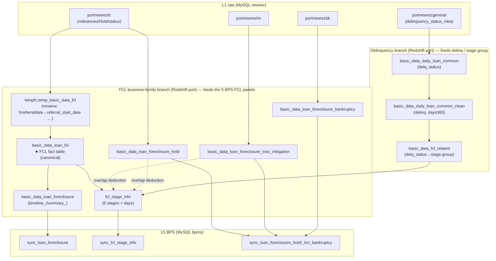

# 21 · Foreclosure Core Field-Level Data Lineage (source field → intermediate tables → transform rules → BPS field)

> ⚠️ **Superseded** — replaced by **doc 25 (lineage hub) + doc 26–30 (per-BPS-table field lineage)**.
> The new version is organized as one-doc-per-table, one-row-per-field, fixed hop columns + per-hop rule + code reference, generated from `outputs/fcl_lineage_source.json` (`python - < scripts/gen_fcl_lineage.py`) and schema-verified column-by-column against prod (redshift_prod / mysql_prod). Use doc 25–30; this file is kept for history only.

---

## Document Information

| Field | Content |
|-------|---------|
| **Purpose** | Trace each core foreclosure field from its **raw Servicer column** all the way to its **BPS system column**, listing — **field by field** — the **intermediate tables** it passes through and the **transform rule at every hop** (SQL/CASE/decode/date-diff). Every rule is taken from **reading the PrefectFlow source** (Code-First); every `table.column` is checked via **read-only MCP** against the live DB. |
| **Problem solved** | doc 20 is the overview; doc 13 leans toward BPS-UI mapping. This is the **end-to-end, code-level, reconcilable** field lineage — it answers "where exactly does this field come from and how is it transformed." |
| **Scope** | ✅ ~30 core FCL fields: foreclosure milestone dates / FCL status & flags / 6 stages & day-counts / Hold / Loss Mitigation / Bankruptcy / delinquency code. Each field gets its L1→L5 chain + transform rule + code location + MCP-verified value. ❌ Non-FCL funding/valuation fields; ❌ internal BPS display logic. |
| **System** | `C:\Users\jli\MyData\Copilot\PrefectFlow`. Source files referenced in §7. |

**Target audience:** Primary — data engineers and team members who need a field-by-field walkthrough or reconciliation. Secondary — onboarding engineers, future AI sessions.

**Revision history:**

| Date | Author | Version | Changes | Related |
|------|--------|---------|---------|---------|
| 2026-06-06 | AI Agent (Claude Opus 4.8) | v1 | Initial: ~30 core fields L0→L5 lineage + transform rules (code-read + MCP-verified) | doc 20/13/12/02/19; PrefectFlow source |
| 2026-06-06 | AI Agent (Claude Opus 4.8) | v2 | Added §0.3 data grain/one-to-many (Hold/LM/BK=1:N, MCP-verified row counts) + §1.1 per-field business meaning + per-group "📖 Business meaning" (aligned to doc 17/18/10) | doc 17/18/10 |
| 2026-06-06 | AI Agent (Claude Opus 4.8) | v3 | §0.3 added many-to-one N:1 (deal→2461 loans) and many-to-many N:N (stage↔Hold/LM, loan 7727000672 one Hold spans 4 stages) + confirmed loan↔funding=1:1 / main table 1 row per loan; all MCP-verified | MCP-verified |
| 2026-06-06 | AI Agent (Claude Opus 4.8) | v4 | Added Entity-Relationship Diagram (Mermaid ERD, now §0.5): 18 FCL tables with PK/logical-grain keys (MCP-verified) + key business/transform fields + 1:1/1:N/N:N relationships + PK quick-ref table | MCP-verified |
| 2026-06-06 | AI Agent (Claude Opus 4.8) | v5 | Added §0.4 "why the data is modeled/processed this way (business rationale)" (10 rows, same as doc 20 §A.6); ERD renumbered to §0.5; audience wording neutralized | doc 17/18/10 · doc 20 |
| 2026-06-06 | AI Agent (Claude Opus 4.8) | v6 | **Carrington deep-dive + DB test (synced from zh)**: added §1.2 fill-rate/DB-verification matrix (prod) · §6 Carrington line (milestones/status/days/Hold/BK rules + line refs + prod test) · §7 cross-servicer comparison (FCL detection / milestone source / delinq·bankruptcy CASE) · §8 one field's full SQL path (Newrez+Carrington); old §6/§7 renumbered to §9/§10; §9 #7 updated (`basic_data_loan_delinq_clean` producing code not in repo, grep-proven) + Carrington traps; all `table.column` information_schema-verified, Carrington sample `7727000858` L1→L4→L5 verified | mysql_prod / redshift_prod; PrefectFlow source |
| 2026-06-06 | AI Agent (Claude Opus 4.8) | v7 | §0.2 added "Storage DB: MySQL+Redshift dual-write" note (L1–L4 mostly dual-write, FCL family Redshift-built + L5 sync); code-evidence table in doc 20 §B.6 | PrefectFlow source · doc 20 |
| 2026-06-08 | AI Agent (Claude Opus 4.8) | v8 | Added a "Terminology" note under the §0.3 N:N table defining **FCL stage** (6 main stages + 8 buckets + 15 sub-stages) and **FCL episode** (one foreclosure experience, keyed `(loanid,deal_start)`, N:N rationale with BK) at point of use; §3 note on NOI/PUBLICATION buckets; matching glossary entries added to doc 10 | doc 10 · doc 13 · doc 17/18 |
| 2026-06-08 | AI Agent (Claude Opus 4.8) | v9 | §0.1 note: `basic_data_monthly_loan_clean_data_delinq` is on the portmonth/delinquency line, **not on either FCL branch**; FCL's `group/delq_status` is built by `basic_data_fcl_related` directly from raw servicer tables (`basic_data_pool_config.py`/`flow/bps/` have 0 refs, verified) | PrefectFlow source-verified · doc 02 |

**Dependencies:** [doc 20](20_end_to_end_walkthrough.md) (5-layer overview) · [doc 13](13_newrez_fcl_bps_display_mapping.md) (BPS UI mapping) · [doc 12](12_sync_asset_management.md) (sync code) · [doc 19](19_fcl_sample_loan_raw_dump.md) (sample dump).

**Key limitations (read §9 first):** some BPS columns are **pass-through** (the real transform is one layer up); a couple of raw columns are **reused twice**; some "set dates" are inferred `min(dataasof)` from snapshot history; foreclosure-status text has **no decode table** (it concatenates raw `fcremovaldesc`); the 4:35 ET schedule is **not in code**; **Carrington has no judicial/first_legal/judgement mapping (all NULL in prod, see §6/§7)**.

---

## 0 · How to read this + pipeline shape (intermediate tables)

### 0.1 Two parallel branches (key!)

FCL data is **not** a single straight line — **two branches** feed BPS:



- **FCL business-family branch** (feeds the BPS FCL panels): `portnewrezfc/lm/bk` → temp `tempfc.temp_basic_data_fcl` (**raw-column → unified-column rename happens here**) → **`port.basic_data_loan_fcl` (canonical FCL fact table — the source of everything)** → `basic_data_loan_foreclosure` / `fcl_stage_info` / `_hold` / `_loss_mitigation` / `_bankruptcy` → `bpms.sync_*`.
- **Delinquency branch**: `portnewrezgeneral.delinquency_status_mba` → `basic_data_daily_loan_common.delq_status` → `basic_data_daily_loan_common_clean.delinq` (CASE + days360); the stage table's `group` comes from `basic_data_fcl_related.delq_status`.

> ⚠️ So **foreclosure milestone/status fields take the FCL business-family branch — read directly from `portnewrezfc`, NOT through `basic_data_daily_loan_common`**. doc 20's L2/L3 mostly describe the delinquency branch.

> ⚠️ **Easily-confused table name**: `port.basic_data_monthly_loan_clean_data_delinq` is **NOT on either FCL branch above** — it belongs to the **monthly portfolio / delinquency (portmonth) line**: `…clean_data_base → …clean_data_delinq → basic_data_monthly_loan_clean_data → portmonth → bpms.sync_portmonth` (feeds the BPS "Delinquency" view and the `prevdelinqchar` decoding). The FCL tables' `group/delq_status` is computed by `basic_data_fcl_related` **directly from the raw servicer tables** (`CREATE_FCL_RELATE_ATTR`, `basic_data_pool_config.py:1695-1771`) and reads **no** monthly-clean table — verified: `basic_data_pool_config.py` and `flow/bps/` have **0 references** to `…monthly_loan_clean_data*`.

### 0.2 Intermediate-table inventory (DB-verified)

| Intermediate table | Layer | Role |
|---|---|---|
| `tempfc.temp_basic_data_fcl` | pre-L4 | UNION of 3 servicers + **raw-column → unified-column rename** |
| `port.basic_data_loan_fcl` | L4 | **Canonical FCL fact table**; both `basic_data_loan_foreclosure` & `fcl_stage_info` read it |
| `port.basic_data_loan_foreclosure` | L4 | FCL timeline + summary; also the MySQL **transit table** for 5-FORECLOSURE |
| `port.fcl_stage_info` | L4 | 6 stages + day-counts (LM/Hold overlap deduction) |
| `port.basic_data_loan_foreclosure_hold/_loss_mitigation/_bankruptcy` | L4 | Hold/LM/BK detail (with datadic decode) |
| `port.basic_data_fcl_related` | L4 | Supplies `delq_status` (→stage.group), `propertystate` |
| `port.basic_data_daily_loan_common` / `_clean` | L2 / L3 | Delinquency branch: `delq_status` → `delinq` |
| `port.basic_data_loan_delinq_clean` | L3 | Delinquency detail (`delinq_source/is_ghost_payoff/ghost_reason/ots_delinq/prevdelinq`; prod-verified to exist; **producing code NOT in the PrefectFlow repo**, see §9#7) |

> ⚠️ **Storage DB (MySQL + Redshift dual-write, code-proven)**: most `port.*` above (and raw `newrez.*`) exist in **both Redshift and MySQL** — L2/L3 daily and L4 monthly tables are built by paired plain(→Redshift) and `mysql_`(→MySQL) configs/flows; the **FCL business family** (`basic_data_loan_foreclosure`/`fcl_stage_info`/`_hold`/`_loss_mitigation`/`_bankruptcy`) is **built in Redshift only** (`basic_data_pool_config.py`), its MySQL copy produced by the **L5 sync**. Per-layer code evidence (file:line) + MCP checks in [doc 20](20_end_to_end_walkthrough.md) §B.6. This lineage is organized by "intermediate table" and **does not distinguish MySQL/Redshift** (same table names, corresponding contents).

### 0.3 Data grain & one-to-many relationships (important)

> The question raised earlier — "**one foreclosure has multiple Hold records**" — lives here: one loan's single foreclosure has **many** child records. To read this data you **must first know each table's grain (what one row represents)**, or you'll mistake multiple rows for duplicates or miss history.

| Relationship | Cardinality | How the data shows it | Verified (sample loan) |
|---|---|---|---|
| loan : FCL episode | **1:1** (typical) | one loan has one active foreclosure at a time; after a cure it can re-enter | — |
| FCL : **Hold** | **1:N** | Newrez raw uses `fchold1..4` (wide, up to 4 slots); in BPS `sync_loan_foreclosure_hold` it's **unpivoted to long, one Hold per row** | `7727000088` → **9 Hold rows** |
| loan : **LM cycle** | **1:N** | each loss-mitigation evaluation/execution round = one cycle, keyed by `(loanid, dealstartdate)`; one cycle per row in `sync_loan_foreclosure_loss_mitigation` | `7727000088` → **9 LM cycles** |
| LM cycle : status flow | **1:N** | a cycle moves through many statuses (eval→underwrite→approve→trial→booking…) | — |
| loan : **BK filing** | **1:N** | a borrower can file multiple times; keyed by `(loanid, bkfileddate)`; one filing per row | `7727000010` → **2 BK filings** |

**Why multiple rows (business explanation):**
- **Hold (pause)**: a launched foreclosure is often **temporarily halted** — bankruptcy automatic stay, borrower in loss-mitigation review, HUD/COVID requirements, court directive, military protection (SCRA), etc.; one foreclosure can **cycle in and out of Hold multiple times**, so one loan has multiple Hold rows (doc 17 §4.3). BPS **unpivots** Newrez's 4 Hold slots into multiple rows, and the stage table **deducts** open-Hold overlap days from stage durations (§3).
- **Multiple LM rounds**: regulators require evaluation before foreclosure, plan upgrades (Evaluation fail→Modification→Short Sale/DIL), plan switches, repeated document submissions, operational errors — each spawns a new cycle (doc 18 §5). **Analyze by `loanid + cycle start/end + deal/program/status/disposition`, the full chain, not a single row.**
- **Multiple BK filings**: bankruptcy can be dismissed/discharged then **re-filed**, one row each (sample `7727000010` shows 2 filings).

> ⚠️ **Talking-point**: when reviewing a loan, the **Hold/LM/BK panels are naturally multi-row** (one-to-many), not data duplication; only the main timeline `sync_loan_foreclosure` and the stage table `sync_fcl_stage_info` are **one row per loan** (current snapshot).

**Beyond one-to-many, there are also many-to-one (N:1) and many-to-many (N:N):**

| Type | Example | Note / verified |
|---|---|---|
| **N:1** | many loans → one deal/pool (`bid_id`=`portfunding.dealid`) | verified `ARVEST001` holds **2461 loans** (MUTUALBANC001=310, WFL001=266…). Also: many loans → one servicer. |
| **N:1** | many **snapshot rows** → one loan | `fcl_stage_info` by `fctrdt`, source tables by `dataasof` — one loan, many rows (one per day/month). Every 1:N viewed in reverse is N:1: each Hold/LM/BK row → one loan. |
| **N:N** | **FCL stage ↔ Hold** | one Hold can **span multiple stages**, and one stage can be covered by multiple Holds. Verified loan `7727000672` at one fctrdt has **one Hold spanning 4 stages** (4 `*_on_hold_days`>0). The ETL uses an interval-overlap join (`greatest/least`) + per-stage pivot into `{stage}_on_hold_days`. |
| **N:N** | **FCL stage ↔ LM cycle** | same → `{stage}_in_lm_days`. |
| **N:N** (conceptual) | **FCL episode ↔ BK** | one BK automatic stay can span multiple stages; one loan can also have multiple BK filings. |

> ⚠️ **N:N caveat**: `{stage}_in_lm_days/_on_hold_days` **only count "open" (not-yet-ended) LM/Hold** (`cycle_closed_date is null` / `hold_end_dt is null`), so a **cured** loan shows all NULLs there (e.g. `7727000088`), but **the relationship is still N:N** — stage days are **apportioned/deducted by overlapping intervals**, not a simple subtraction.
>
> **Confirmed NOT many-to-many / no fan-out** (to avoid confusion): loan ↔ `portfunding` is verified **1:1** (≤1 row per loan), so the BPS extract join does not multiply a loan into multiple rows; the main timeline `bpms.sync_loan_foreclosure` and the stage current-snapshot are both **one row per loan** (verified, no duplicate loanids).

> **Terminology (the two terms in the table above):**
> - **FCL stage** = a legal milestone one foreclosure case advances through. Standard **6 stages**: `DEMAND` → `REFERRAL`(to attorney) → `FIRST_LEGAL` → `SERVICE` → `JUDGEMENT`(court ruling) → `SALE`(auction) (see §3). The physical `fcl_stage_info` table also carries `NOI` and `PUBLICATION` buckets (usually NULL for Newrez), 8 in total; the BPS target/actual view splits these into 15 sub-stages (doc 13).
> - **FCL episode** = one continuous foreclosure experience for a loan: from entering foreclosure to exiting it (cured/paid, or auction→REO). After a cure a loan can **re-enter** = a **new episode** (keyed `(loanid, deal_start)`; typically `loan : episode = 1:1`, at most one active at a time). The BK row uses **episode** rather than **stage** because a bankruptcy stay freezes the **whole foreclosure** (across all stages, not one stage), and a loan can file BK **multiple times**.

### 0.4 Why the data is modeled/processed this way (business rationale)

> Field lineage answers "where from, how transformed"; this section answers "**why modeled/processed this way**." Each row = **a data fact / processing decision ← the business reason behind it** (per doc 17/18/10). **Row 1 is the common "one FCL, many Holds" question.** (Same content as [doc 20](20_end_to_end_walkthrough.md) §A.6.)

| # | Data fact / processing decision | Business reason (why it must be so) | Where (table/field) |
|---|---|---|---|
| 1 | **One foreclosure, multiple Hold records** (1:N, wide 4 slots → long rows) | After launch a foreclosure is **repeatedly paused/resumed** for bankruptcy automatic stay, LM review, court delay, HUD/COVID, military protection (SCRA); each pause is an independent fact, recorded separately with full history (doc17 §4.2/4.3/5.4) | `portnewrezfc.fchold1..4*` → `_hold` → `sync_loan_foreclosure_hold` (long); §0.3 |
| 2 | **Stage days deduct `in_lm_days`/`on_hold_days`** | The compliance clock (FNMA/FHLMC penalties) only counts **lender-controllable** delay; while paused for BK/LM the foreclosure isn't legally progressing, so it can't count (Target/Actual/Var, doc10) | `fcl_stage_info.{stage}_in_lm_days/_on_hold_days` (interval overlap) |
| 3 | **One loan, multiple LM cycles** (1:N) | Regulators (CFPB 12 CFR 1024.41) require pre-foreclosure evaluation; plans **escalate/switch** (Eval→Mod→Short Sale/DIL) with re-submissions — each round its own cycle (doc18 §5) | `portnewrezlm` → `_loss_mitigation` (by `(loanid,dealstartdate)`) |
| 4 | **Delinquency standardized to MBA codes + days360** | Servicers differ; aligning to the **MBA industry standard** makes them comparable; `days360` (30/360) is the industry day-count for cross-institution consistency (doc17 §2/§3) | L3 `…_clean.delinq` (CASE+days360) |
| 5 | **FCL not derived from days past due (days360 never outputs FCL)** | FCL is a **legal-process state**, orthogonal to "how long overdue": D120P may not be FCL (Mod in progress); D60 may already be FCL (filed early); must be **explicitly flagged** by the servicer (doc17 §2) | FCL in `delinq` comes only from a servicer flag |
| 6 | **FCL/LM/BK modeled as separate coexisting dimensions** | They are **concurrent** processes (FCL+DIL under negotiation; FCL paused by BK); in MBA delinquency, BK and FCL are mutually exclusive → need an independent `bankruptcy_flag` (doc18 §1 / doc10) | `delinq`/`activefcflag`/`lm_flag`/`bankruptcy` (4 dims) |
| 7 | **BK pauses foreclosure, MFR resumes; can recur** | The automatic stay (11 USC §362) federally halts all collection incl. foreclosure → FCL on Hold; the creditor files an **MFR** to resume; can re-file after dismissal (doc17 §5.4 / doc10) | `_bankruptcy` (multiple→rows); `fchold='Bankruptcy'` |
| 8 | **Segregated by judicial vs non-judicial state** | Duration differs ≈6× (judicial 12 mo–3 yr vs non-judicial 2–6 mo), different redemption rights; inventory/Loss Severity/aging **must be by state** (doc17 §4.5) | `fcl_stage_info.judicial`/`state`, `summary_judicial_foreclosure` |
| 9 | **Exit reasons coded distinctly** (Reinstated/LM/Paid/Process Complete/DIL/REO/3rd-Party) | Each exit has **different loss & downstream process** (reinstatement=zero loss, short sale=forgiven shortfall, REO=hold/operate, DIL=surrender without auction) (doc17 §5.3) | `summary_foreclosure_status` (=`Closed Foreclosure:<fcremovaldesc>`) |
| 10 | **Daily snapshots at source vs overwrite-refresh in BPS** | Source keeps daily snapshots to trace any day (source data occasionally back-flips) + drive `to_sale_days`; BPS needs only the latest state so it overwrite-refreshes; attempts keyed by `(loanid, deal_start)` (doc17 §1 / doc18 §5) | L1 `dataasof` snapshots; `sync_*` (overwrite) |

> In one line: **foreclosure data isn't a single status — it's a multidimensional record of concurrent business processes (delinquency measurement / foreclosure legal action / loss-mitigation negotiation / bankruptcy intervention)** — which is why there are multiple Holds/LM cycles/BK filings, why paused days are deducted, why it's segregated by state, and why FCL isn't derived from days.

---

### 0.5 Entity-Relationship Diagram (ERD: primary keys + key business fields + transform-rule fields)

> **Legend**: `PK` = primary key; MySQL tables (newrez/bpms) actually key on a surrogate **`id`**, with the **business/logical grain key** noted separately; **Redshift `port.*` enforces no PK** (verified — no declared PK), so its `PK` mark here is the **logical/grain key**. In attribute comments: `milestone`/`status`/`rule` = key business or transform-rule fields. Relationship labels = that hop's transform SQL/rule. `||--||`=1:1, `||--o{`=1:N, `}o--o{`=N:N.

```mermaid
erDiagram
    %% ===== L1 source (MySQL newrez); PK=id, grain=loanid+dataasof =====
    portnewrezfc {
        bigint id PK
        string loanid "grain(+dataasof)"
        date   dataasof "snapshot day"
        int    activefcflag "rule: status/stage filter"
        date   fcreferraldate "milestone->referral"
        date   firstlegaldate "milestone->first_legal"
        date   servicecompletedate "milestone->service"
        date   fcjudgmenthearingscheduled "milestone->judgement"
        date   fcscheduledsaledate "milestone->sale"
        string fcremovaldesc "rule: exit reason->status"
        string judicial "rule: judicial flag"
        string fchold1description "Hold(4 slots)"
    }
    portnewrezlm {
        bigint id PK
        string loanid "grain(+dealstartdate)"
        date   dataasof "snapshot day"
        string lmdeal "rule: datadic decode->deal"
        string lmprogram "rule: decode->program"
        string lmstatus "rule: decode->lmc_status"
        date   dealstartdate "cycle open(LK)"
        date   lmremovaldate "cycle close"
        string lmdecision "rule: decode->final_disposition"
    }
    portnewrezbk {
        bigint id PK
        string loanid "grain(+bkfileddate)"
        date   dataasof "snapshot day"
        string bkstatus "rule: decode->bankruptcy_status"
        int    bkchapter "Ch7/Ch13"
        date   bkfileddate "filing date(LK)"
        date   pocfileddate "POC date"
    }
    portnewrezgeneral {
        bigint id PK
        string loanid "grain(+dataasof)"
        string delinquency_status_mba "rule->delinq"
        date   nextduedate "rule: days360 input"
        string legalstatus "->legal_status"
    }
    portnewrezdatadic {
        string field_name "logical key"
        string code "logical key(join on concat(code,'.0'))"
        string description "decoded text"
    }

    %% ===== L4 business (Redshift port); no enforced PK, logical key shown =====
    basic_data_loan_fcl {
        string loanid PK "logical key(+dataasof)"
        date   dataasof PK "snapshot day"
        date   referral_start_date "=fcreferraldate"
        date   legal_start_date "=firstlegaldate"
        date   service_start_date "=servicecompletedate"
        date   fcscheduled_sale_date "=fcscheduledsaledate"
        int    activefcflag "status/filter"
        string judicial "judicial"
        string fcremovaldesc "exit reason"
    }
    basic_data_loan_foreclosure {
        string loanid PK "logical key(1 row/loan, latest snapshot)"
        date   timeline_referred_to_foreclosure_date "pass-through->BPS"
        date   timeline_first_legal_date "pass-through->BPS"
        date   timeline_judgement_date "pass-through->BPS"
        string summary_foreclosure_status "CASE:Active/Closed:<removaldesc>"
        int    summary_judicial_foreclosure "CAST(judicial)"
    }
    fcl_stage_info {
        string loanid PK "logical key(+fctrdt)"
        date   fctrdt PK "report date(monthly)"
        date   demand_start_date "stage start"
        date   referral_start_date "stage start"
        date   sale_start_date "stage start"
        int    referral_stage_days "datediff+1"
        int    referral_in_lm_days "N:N: LM overlap deduction"
        int    referral_on_hold_days "N:N: Hold overlap deduction"
        string group "=delq_status"
        string judicial "Y/N+state fallback"
    }
    basic_data_loan_foreclosure_hold {
        string loanid PK "logical key(+description1_start_date)"
        string description1 "Hold reason(4 slots)"
        date   description1_start_date "Hold start"
        date   description1_end_date "Hold end"
    }
    basic_data_loan_foreclosure_loss_mitigation {
        string loanid PK "logical key(+cycle_opened_date)"
        string deal "decoded"
        string program "decoded"
        string lmc_status "decoded"
        date   cycle_opened_date "cycle open"
        date   cycle_closed_date "cycle close(null=open)"
        string final_disposition "final disposition"
    }
    basic_data_loan_foreclosure_bankruptcy {
        string loanid PK "logical key(+status_date)"
        string bankruptcy_status "decoded"
        int    chapter "Ch7/Ch13"
        date   status_date "=bkfileddate"
        date   mfr_filed_date "Carrington only"
    }
    basic_data_fcl_related {
        string loanid PK "logical key"
        string delq_status "->stage.group"
        string propertystate "->judicial state fallback"
    }
    portfunding {
        string loanid PK "1:1/loan"
        string dealid "=bid_id"
        string fundingid "=funding_id"
    }
    deal_pool {
        string dealid PK "deal/pool"
    }

    %% ===== L5 BPS (MySQL bpms); PK=id =====
    sync_loan_foreclosure {
        bigint id PK
        string loanid "1 row/loan"
        date   timeline_referred_to_foreclosure_date
        string summary_foreclosure_status
        int    summary_judicial_foreclosure
    }
    sync_fcl_stage_info {
        bigint id PK
        string loanid "(+fctrdt)"
        date   fctrdt
        date   referral_start_date
    }
    sync_loan_foreclosure_hold {
        bigint id PK
        string loanid "1:N"
        string description "long(one Hold per row)"
        date   description_start_date
        date   description_end_date
    }
    sync_loan_foreclosure_loss_mitigation {
        bigint id PK
        string loanid "1:N"
        string deal
        date   cycle_opened_date
    }
    sync_loan_foreclosure_bankruptcy {
        bigint id PK
        string loanid "1:N"
        string bankruptcy_status
        date   status_date
    }

    %% ===== relationships =====
    portnewrezfc      ||--|| basic_data_loan_fcl : "rename/UNION->canonical fact"
    portnewrezgeneral ||--o{ basic_data_fcl_related : "delinq branch"
    basic_data_loan_fcl ||--|| basic_data_loan_foreclosure : "GEN_FCL_DETAIL(latest,1 row/loan)"
    basic_data_loan_fcl ||--o{ fcl_stage_info : "GEN_FCL_STAGE(by fctrdt)"
    portnewrezfc ||--o{ basic_data_loan_foreclosure_hold : "fchold1..4 (1:N)"
    portnewrezlm ||--o{ basic_data_loan_foreclosure_loss_mitigation : "multiple cycles (1:N)"
    portnewrezbk ||--o{ basic_data_loan_foreclosure_bankruptcy : "multiple filings (1:N)"
    portnewrezdatadic ||--o{ basic_data_loan_foreclosure_loss_mitigation : "decode deal/program/status"
    portnewrezdatadic ||--o{ basic_data_loan_foreclosure_bankruptcy : "decode bkstatus"
    deal_pool ||--o{ portfunding : "one deal holds many loans (N:1)"
    portfunding ||--|| basic_data_loan_foreclosure : "join adds bid_id/funding_id (1:1)"
    basic_data_fcl_related ||--o{ fcl_stage_info : "group=delq_status"
    fcl_stage_info }o--o{ basic_data_loan_foreclosure_loss_mitigation : "N:N interval overlap->in_lm_days"
    fcl_stage_info }o--o{ basic_data_loan_foreclosure_hold : "N:N interval overlap->on_hold_days"
    basic_data_loan_foreclosure ||--|| sync_loan_foreclosure : "GEN_FORECLOSURE pass-through(1:1)"
    fcl_stage_info ||--|| sync_fcl_stage_info : "GET_FCL_STAGE_DATA"
    basic_data_loan_foreclosure_hold ||--o{ sync_loan_foreclosure_hold : "wide->long unpivot (1:N)"
    basic_data_loan_foreclosure_loss_mitigation ||--|| sync_loan_foreclosure_loss_mitigation : "GEN_FORECLOSURE_LM"
    basic_data_loan_foreclosure_bankruptcy ||--|| sync_loan_foreclosure_bankruptcy : "GEN_FORECLOSURE_BK"
```



**Primary / grain key quick-ref (verified):**

| Table | Layer·schema | PK | Business/logical grain key (what one row is) |
|---|---|---|---|
| `portnewrezfc/lm/bk/general` | L1·newrez | `id` (surrogate) | `loanid`+`dataasof` (one row per loan per day, snapshot) |
| `portnewrezdatadic` | L1·newrez | (no id) | `field_name`+`code` (decode dictionary) |
| `basic_data_loan_fcl` | L4·port | none (Redshift) | `loanid`+`dataasof` |
| `basic_data_loan_foreclosure` | L4·port | none | `loanid` (latest snapshot, 1 row/loan) |
| `fcl_stage_info` | L4·port | none | `loanid`+`fctrdt` (one row per loan per report date) |
| `_hold` / `_loss_mitigation` / `_bankruptcy` | L4·port | none | `loanid`+`(hold start/dealstart/bkfiled)` (one-to-many detail) |
| `portfunding` | L4·port | none | `loanid` (1:1) |
| `sync_loan_foreclosure` / `sync_fcl_stage_info` | L5·bpms | `id` (surrogate) | `loanid`(+`fctrdt`) (main/stage = 1 row/loan) |
| `sync_loan_foreclosure_hold/_lm/_bankruptcy` | L5·bpms | `id` (surrogate) | `loanid`+detail key (one-to-many) |

> Read the diagram in one line: **solid arrows = data flow + transform rule**; `||--o{` = one-to-many (Hold/LM/BK); `}o--o{` = many-to-many (stage ↔ Hold/LM, via interval overlap producing `in_lm_days/on_hold_days`); `deal_pool ||--o{ portfunding` = many-to-one (one pool holds many loans).

---

## 1 · Master lineage table (core fields at a glance)

> Columns: **L1 source** = Servicer raw `table.column`; **unified@fact** = renamed column in `basic_data_loan_fcl`; **L4 business col**; **L5 BPS col** = `bpms.*`; **rule** = key transform. Full rules + code locations in §2–§5.

| # | Field (business name) | L1 source (newrez) | unified @ `basic_data_loan_fcl` | L4 business col | L5 BPS col | Rule summary |
|---|---|---|---|---|---|---|
| 1 | Demand sent | `portnewrezfc.demandsentdate` | `demandsentdate` | `fcl_stage_info.demand_start_date` | `sync_fcl_stage_info.demand_start_date` | pass-through; not a timeline col |
| 2 | Referral | `portnewrezfc.fcreferraldate` | `referral_start_date` | `basic_data_loan_foreclosure.timeline_referred_to_foreclosure_date` · `fcl_stage_info.referral_start_date` | `sync_loan_foreclosure.timeline_referred_to_foreclosure_date` | rename pass-through; **also the 5-FORECLOSURE entry filter** |
| 3 | First Legal | `portnewrezfc.firstlegaldate` | `legal_start_date` | `…timeline_first_legal_date` · `fcl_stage_info.first_legal_start_date` | `sync_loan_foreclosure.timeline_first_legal_date` | rename pass-through |
| 4 | Service | `portnewrezfc.servicecompletedate` | `service_start_date` | `…timeline_service_date` · `fcl_stage_info.service_start_date` | `…timeline_service_date` | rename pass-through |
| 5 | Judgement | `portnewrezfc.fcjudgmenthearingscheduled` | `fcjudgment_hearing_scheduled` | `…timeline_judgement_date` (current) + `…timeline_judgement_hearing_set_date` (`min(dataasof)` first-seen) · `fcl_stage_info.judgement_start_date` (`max(dataasof)` rnk=1) | `…timeline_judgement_date` | **same raw col reused**; set-date is snapshot-inferred |
| 6 | Sale | `portnewrezfc.fcscheduledsaledate` | `fcscheduled_sale_date` | `…timeline_sale_date_projected_date` + `…timeline_sale_date_set_date` (`min(dataasof)`) · `fcl_stage_info.sale_start_date` | `…timeline_sale_date_projected_date` | same |
| 7 | Sale Held | `portnewrezfc.fcsalehelddate` | `fcsale_held_date` | `…timeline_sale_date_held_date` | `…timeline_sale_date_held_date` | rename pass-through |
| 8 | Removal date | `portnewrezfc.fcremovaldate` | `fcremovaldate` | (filter only) | — | not written to timeline; used in status/stage entry filter |
| 9 | FC setup date | `portnewrezfc.fcsetupdate` | `fcsetupdate` | (Newrez dead-end, no timeline col) | — | ⚠️ Newrez column never reaches BPS (see §6) |
| 10 | FCL status | `portnewrezfc.activefcflag`+`fcremovaldesc` | `activefcflag`,`fcremovaldesc` | `basic_data_loan_foreclosure.summary_foreclosure_status` | `sync_loan_foreclosure.summary_foreclosure_status` | CASE: see §2 |
| 11 | Judicial | `portnewrezfc.judicial` | `judicial` | `…summary_judicial_foreclosure`(decimal) · `…summary_type`(label) · `fcl_stage_info.judicial`(Y/N+state fallback) | `…summary_judicial_foreclosure` | CAST + label + state fallback |
| 12 | Stage day-counts | (computed) | — | `fcl_stage_info.{stage}_stage_days/_in_lm_days/_on_hold_days/to_*_days` | `sync_fcl_stage_info.*` | datediff+1, LM/Hold overlap deduction; see §3 |
| 13 | Hold | `portnewrezfc.fchold1..4{description,startdate,enddate}` | (own table) | `basic_data_loan_foreclosure_hold.description1..4{,_start_date,_end_date}` (wide, latest snapshot) | `sync_loan_foreclosure_hold.{description,description_start_date,description_end_date}` (**long**, unpivot) | wide→long unpivot; see §4 |
| 14 | LM cycle | `portnewrezlm.{lmdeal,lmprogram,lmstatus,dealstartdate,lmremovaldate,lmdecision}` | (own table) | `…_loss_mitigation.{deal,program,lmc_status,cycle_opened_date,cycle_closed_date,final_disposition}` | `sync_loan_foreclosure_loss_mitigation.*` | **datadic decode** `COALESCE(desc, raw)`; see §5 |
| 15 | Bankruptcy | `portnewrezbk.{bkstatus,bkchapter,bkfileddate,pocfileddate}`+`general.legalstatus` | (own table) | `…_bankruptcy.{bankruptcy_status,chapter,status_date,proof_of_claim_date,legal_status,mfr_filed_date(NULL)}` | `sync_loan_foreclosure_bankruptcy.*` | bkstatus decode; MFR only Carrington; see §5 |
| 16 | delinq code | `portnewrezgeneral.delinquency_status_mba`,`nextduedate` | (delinquency branch) | `basic_data_daily_loan_common.delq_status` → `…_clean.delinq` | (via stage group / monthly table, not directly into sync_loan_foreclosure) | CASE + `days360(nextduedate,fctrdt)`; see §5.4 |

### 1.1 Per-field business meaning (one-liner, to pair with the pipeline)

| Field | Business meaning (one line) |
|---|---|
| Demand | formal demand to the borrower (judicial=NOI/NOD, non-judicial=Demand Letter), ~30 days, the final notice **before foreclosure launches** |
| Referral | case handed to the foreclosure attorney, formal entry into legal process — **the start of the foreclosure timeline** |
| First Legal | judicial=file complaint with court; non-judicial=publish Notice of Default |
| Service | legal documents formally served on the borrower; statutory clock starts |
| Judgement | court rules for the creditor, permits sale (**judicial states only**) |
| Sale | property auctioned; outcome = 3rd-party buyer or no-bid → REO |
| Sale Held | the day the auction was actually held |
| Removal date (fcremovaldate) | the date this foreclosure ended (cured/completed) |
| FC setup date (fcsetupdate) | servicer's internal foreclosure-setup date (⚠️ Newrez doesn't reach BPS) |
| FCL status (summary_foreclosure_status) | whether it's "Active" or "Closed:<reason>" |
| Judicial | via court (1) or contractual direct sale (0) — **drives duration; segregate by state** |
| Stage days (stage_days/in_lm/on_hold) | time per stage; minus LM/Hold gives **actionable time** (for KPI/compliance aging) |
| Hold | reason & dates a foreclosure was paused (**many per loan**) |
| LM cycle | one workout round's deal/program/status/outcome (**many per loan**) |
| BK | borrower's bankruptcy chapter/status/filing date; BK pauses foreclosure (**can recur**) |
| delinq | delinquency severity bucket (C/D30/D60/D90/D120P) or legal/terminal state (FCL/REO/P) |

### 1.2 Fill-rate / DB-verification matrix (prod, 2026-06-06)

> **Source**: `bpms.sync_loan_foreclosure` (mysql_prod, the FCL main table, **only loans with non-null `timeline_referred…`** i.e. active/referred — that day: 77 Newrez + 12 Carrington = 89 rows, one row per loan). Fill-rate = non-null rows for that column / total rows for that servicer. **All `table.column` were verified in one `information_schema.columns` pass (Schema-Verify)** — no missing columns.

| BPS field (`sync_loan_foreclosure`) | Newrez fill-rate | Carrington fill-rate | Note (corroborates the code rule) |
|---|---|---|---|
| `timeline_referred_to_foreclosure_date` | 77/77 = **100%** | 12/12 = **100%** | entry filter key, both servicers always have it |
| `timeline_first_legal_date` | 47/77 ≈ **61%** | **0/12 = 0%** | ⚠️ Carrington has no first_legal mapping → all NULL |
| `timeline_judgement_date` | 10/77 ≈ **13%** | **0/12 = 0%** | only judicial states have judgement; Carrington lacks the column |
| `summary_foreclosure_status` | 77/77 = **100%** | 10/12 ≈ **83%** | 2 Carrington loans have empty status |
| `summary_judicial_foreclosure` | 77/77 = **100%** | **0/12 = 0%** | ⚠️ Carrington has no judicial field → all NULL; stage table falls back by state |

> **Takeaway**: the *same* BPS field can be **fully populated for Newrez yet entirely NULL for Carrington** — because each servicer's raw file supplies different fields (see §6/§7). Always qualify a field's "availability" **by servicer**. `DB-verified`: the 5 fields above + §6 Carrington chain were prod-tested (sample `7727000858` in §8).

> 📊 **Filterable Excel version**: [`docs/21_fcl_field_lineage_matrix.xlsx`](../21_fcl_field_lineage_matrix.xlsx) — one row per field × per-layer source / transform rule / servicer scope / fill-rate / DB-verify / code location (file:line). Generated by `scripts/build_fcl_field_lineage_xlsx.py` (re-runnable, header-located, protects 「人工」/manual columns + comments).

---

## 2 · FCL milestone dates + status (FORE / `basic_data_loan_foreclosure`)

**Two hops:** ① raw→`basic_data_loan_fcl` (rename in `temp_basic_data_fcl`, `basic_data_pool_config.py` ~L1538–1565); ② `basic_data_loan_fcl`→`basic_data_loan_foreclosure` (`GEN_FCL_DETAIL` SELECT, L253–305). ③ L4→L5 via `GEN_FORECLOSURE` (`asset_managment_config.py` L535–608) is **pass-through** (except `dealid→bid_id`, `fundingid→funding_id`), so BPS timeline_/summary_ cols = the same-named Redshift cols.

**Milestone mapping (quoted from GEN_FCL_DETAIL):**
```sql
fc.referral_start_date          AS timeline_referred_to_foreclosure_date  -- L259  (src fcreferraldate, renamed L1544)
fc.legal_start_date             AS timeline_first_legal_date              -- L262  (src firstlegaldate, L1549)
fc.service_start_date           AS timeline_service_date                  -- L263  (src servicecompletedate, L1550)
fc.fcjudgment_hearing_scheduled AS timeline_judgement_date                -- L265  (src fcjudgmenthearingscheduled)
ju.jd_set_date                  AS timeline_judgement_hearing_set_date    -- L264  = min(dataasof) first-seen (subquery L295)
fc.fcscheduled_sale_date        AS timeline_sale_date_projected_date      -- L266  (src fcscheduledsaledate, L1553)
sa.sa_set_date                  AS timeline_sale_date_set_date            -- L267  = min(dataasof) first-seen (L300)
fc.fcsale_held_date             AS timeline_sale_date_held_date           -- L269  (src fcsalehelddate, L1554)
```
> Newrez has no NOI: `timeline_notice_of_intent_date = null` (L258). Source rows take **each servicer's latest snapshot** (`MAX(dataasof)` subquery, L286–293).

**FCL status `summary_foreclosure_status` (CASE, L273):**
```sql
case when fc.activefcflag=1 then 'Active Foreclosure'
     when fc.activefcflag=0 and fc.fcremovaldesc is not null and fc.fcremovaldesc!=''
          then CONCAT('Closed Foreclosure:', fc.fcremovaldesc)
     else null end AS summary_foreclosure_status
```
> ⚠️ **No decode table**: `Reinstated / Loss Mitigation / Paid in Full / Process Complete / Deed in Lieu` etc. are the **raw `fcremovaldesc` text** concatenated after `Closed Foreclosure:` — not a mapping in code.
>
> **MCP-observed values** (`port.basic_data_loan_foreclosure`): `Active Foreclosure`(40) · `Closed Foreclosure:Reinstated`(28) · `:Loss Mitigation`(16) · `:Paid in Full`(11) · `:Process Complete`(9) · `:Deed in Lieu Cmplte`(1) · NULL(6047). Exactly matches the CASE.

**Judicial flag (L277/279):**
```sql
cast(case when length(fc.judicial)=0 then null else fc.judicial end as decimal) AS summary_judicial_foreclosure
case when ... when =0 'Non Judicial' when =1 'Judicial' end AS summary_type
```

### 📖 Business meaning
- **Milestone dates**: pin a foreclosure's key nodes from demand to sale onto a timeline — `Referral`(handed to attorney, timeline start) → `First Legal` → `Service` → `Judgement`(judicial only) → `Sale`. Business uses these to see "where it is, how long stuck."
- **`summary_foreclosure_status` (5 closure reasons, business meaning)**: status is `Active Foreclosure` or `Closed Foreclosure:<reason>` —
  - `Reinstated`: borrower pays all arrears+fees before sale, loan returns to current (FCL→C, borrower-driven).
  - `Loss Mitigation`: a workout succeeded (Mod/forbearance/DIL/short sale), foreclosure withdrawn (FCL→C or P).
  - `Paid in Full`: full payoff (FCL→P).
  - `Process Complete`: foreclosure sale done, deed recorded (auction result, FCL→P or REO).
  - `Deed in Lieu Cmplte`: borrower surrenders the property via deed-in-lieu, avoiding auction (FCL→P).
- **Judicial vs non-judicial (`judicial`/`summary_type`)**: judicial = court, slow (12 months–3 yrs); non-judicial = contractual direct sale, fast (2–6 months). **Same FCL status, but NY could be 2 yrs and CA 3 months — segregate inventory/aging by state** (doc 17 §4.5).

---

## 3 · 6 stages + day-counts (STG / `fcl_stage_info`, `GEN_FCL_STAGE` L1774–2440)

**Entry filter (who enters the stage table):**
- Active-FCL branch: `activefcflag=1 AND fcremovaldate is null AND (fcremovaldesc is null or ='')` (L1787–1791).
- Pre-FCL demand branch: `activefcflag!=1 AND demandsentdate is not null AND referral_start_date is null`, and the loan is `basic_data_fcl_related.delq_status ∈ ('D90','D120P')` (L1796–1818).

**Per-stage start dates (from `basic_data_loan_fcl`):**
| Stage col | Source | Rule |
|---|---|---|
| `demand_start_date` | `demandsentdate` | take if not null (L2037→alias L2354) |
| `referral_start_date` | `referral_start_date`(=`fcreferraldate`) | take if not null (L2048) |
| `first_legal_start_date` | `legal_start_date`(=`firstlegaldate`) | L2058 |
| `service_start_date` | `service_start_date`(=`servicecompletedate`) | L2068 |
| `judgement_start_date` | `fcjudgment_hearing_scheduled` | `max(dataasof)` rnk=1 (L1948–1958) |
| `sale_start_date` | `fcscheduled_sale_date` | `max(dataasof)` rnk=1 (L1964–1974) |

**Stage days (datediff+1; open stage runs to NY `curr_date`), referral example (L2053–2056):**
```sql
case when referral_start_date is not null and referral_end_date is not null
       then datediff(day, referral_start_date, referral_end_date) + 1
     when referral_start_date is not null and referral_end_date is null
       then datediff(day, referral_start_date, curr_date) + 1
     else null end AS referral_stage_days
```
> Each stage's `end_date = next stage's start_date` (referral_end=legal_start L2049; first_legal_end=service_start L2059; service_end=judgment_available L2069).

**`in_lm_days` (overlap with open LM cycle, L2235–2266) / `on_hold_days` (overlap with open Hold, L2204–2231):**
```sql
greatest(stage_start_dt, cycle_opened_date) , least(stage_end_dt, lm_end_dt)
datediff(day, in_lm_start_dt, in_lm_end_dt) + 1 AS in_lm_days   -- only cycle_closed_date is null (open LM)
-- on_hold_days same shape, only hold_end_dt is null (open Hold)
```
**`to_judgement_days/to_sale_days` (forward-looking, not elapsed, L2085–2093):** `when fcjudgment_start_date>=curr_date then datediff(curr_date, that_date) else 0`.

**Stage extras:** `group = basic_data_fcl_related.delq_status` (L2348); `state = propertystate` (L2350); `judicial`: 1→'Y'/0→'N'/else look up `basic_data_judicial_config` by state (L2351–2353/2432); each run does `delete ... where fctrdt=asofdate` first (L2341, idempotent).

### 📖 Business meaning
- **The 6 stages** = the standard progression of one foreclosure: `DEMAND` → `REFERRAL`(to attorney) → `FIRST_LEGAL` → `SERVICE` → `JUDGEMENT`(court ruling) → `SALE`. The stage table **places each loan at its current stage** and computes time per stage — used to track progress, spot abnormal stalls, and monitor compliance aging.
  > Note: the physical `fcl_stage_info` table also has `NOI` (between Demand↔Referral) and `PUBLICATION` (between Service↔Judgement) buckets (with `*_start_date/_end_date/_stage_days` columns), usually NULL for Newrez — so only the 6 main stages are listed here; "listing 6" does not mean the table has only 6. The BPS target/actual view splits stages into 15 sub-stages (doc 13).
- **Why deduct `in_lm_days`/`on_hold_days`**: time spent in loss-mitigation talks or under a Hold shouldn't count as attorney/process inaction. Removing this **non-actionable time** yields the true **actionable duration**, making KPIs and compliance-aging fair and accurate.
- **`to_judgement_days/to_sale_days`** are **forward-looking** (days until the next milestone), not elapsed.

---

## 4 · Hold (`basic_data_loan_foreclosure_hold`, build L466–768)

- **Newrez stays wide (NOT unpivoted in this table)**: `_hold_detail` straight-copies the 4 hold blocks `where fchold1startdate is not null` (L632–695); `fchold1description→hold1_description` etc.; **block4 is hard-NULL for Newrez** (L687–692).
- `_hold` takes the latest snapshot per `(loanid, hold1_start_date)`: `ROW_NUMBER() OVER (PARTITION BY loanid, hold1_start_date ORDER BY dataasof desc)=1` (L765), mapping `hold1_*→description1/description1_start_date/description1_end_date … hold4_*→description4_*` (L744–761).
- **L4→L5: `GEN_FORECLOSURE_HOLD` (`asset_managment_config.py` L~857) unpivots the wide 4 slots into long format**, filtered to `(description1 not null OR start/end not null)` ×3.
- **MCP-verified**: `bpms.sync_loan_foreclosure_hold` is **long-format** cols `description / description_start_date / description_end_date` (+`fctrdt`), confirming wide→long.

### 📖 Business meaning
- **Hold = the foreclosure is "temporarily halted"**: the process is legally launched (FCL=Y) but operationally paused. Common reasons: bankruptcy automatic stay, borrower in loss-mitigation review, HUD special requirements, COVID forbearance, court directive, military protection (SCRA), legal challenge (doc 17 §4.3).
- **Many Holds per loan (1:N)**: one foreclosure can enter/exit Hold multiple times; Newrez records up to 4 slots (`fchold1..4`), BPS unpivots to multiple history rows. **Multiple Hold rows for one loan are normal, not duplicates.** Hold durations are deducted in the stage table (§3).
- Verified: sample `7727000088` has **9 Hold rows**.

---

## 5 · LM / BK / delinquency

### 5.1 LM (`basic_data_loan_foreclosure_loss_mitigation`, Newrez INSERT L799–843)
Source `portnewrezlm`, latest snapshot per `(loanid, dealstartdate)` (rn=1), `where dealstartdate is not null`. **Coded columns decoded via `newrez.portnewrezdatadic`** (join key `concat(code,'.0')`, since raw values are float-strings):

| L4 col | Source | Rule |
|---|---|---|
| `deal` | `lmdeal` | `COALESCE(t1.description, lmdeal)`, datadic `field_name='LMDeal'` (L821/835) |
| `program` | `lmprogram` | `COALESCE(t2.description, lmprogram)`, `LMProgram` (L822/836) |
| `lmc_status` | `lmstatus` | `COALESCE(t3.description, lmstatus)`, `LMStatus` (L823/837) |
| `cycle_opened_date` | `dealstartdate` | pass-through (L824) |
| `cycle_closed_date` | `lmremovaldate` | pass-through (L825) |
| `final_disposition` | `lmdecision` | `COALESCE(t4.description, lmdecision)`, `LMDecision` (L826/838) |

> The `cycle_opened_date/cycle_closed_date` here are exactly the open-LM interval used for §3 `in_lm_days` overlap deduction. L4→L5 `GEN_FORECLOSURE_LM` passes through to `bpms.sync_loan_foreclosure_loss_mitigation`.

#### 📖 Business meaning
- **LM (loss mitigation) = alternatives to foreclosure**, an independent dimension that coexists with FCL. One cycle = a full "deal/program/status/outcome" lifecycle. Common deals (8 in the DB): Forbearance, Modification, Payment Plan, Deferment, Short Sale, DIL (deed-in-lieu), Evaluation, Payoff.
- **Many LM rounds per loan (1:N)**: pre-foreclosure evaluation requirements, plan upgrades/switches, repeated document submissions, operational errors all open new cycles (doc 18 §5). **Read by `loanid + cycle start/end + deal/program/status/outcome`, the full chain.** Verified: `7727000088` has **9 LM cycles**.

### 5.2 BK (`basic_data_loan_foreclosure_bankruptcy`, Newrez INSERT L331–370)
Source `portnewrezbk` JOIN `portnewrezgeneral`, latest snapshot per `(loanid, bkfileddate)`, `where length(trim(bkstatus))>0`.

| L4 col | Source | Rule |
|---|---|---|
| `bankruptcy_status` | `bkstatus` | `COALESCE(description, bkstatus)`, datadic `BKStatus` (L354/367) |
| `chapter` | `bkchapter` | `cast(bkchapter as DECIMAL(10,0))` (L357) |
| `status_date` | `bkfileddate` | pass-through (L356) |
| `proof_of_claim_date` | `pocfileddate` | pass-through (L362) |
| `legal_status` | `general.legalstatus` | pass-through (L355) |
| `mfr_filed_date` | — | **NULL for Newrez** (L360); **only Carrington** `bk_mfr_filed_date` (L403) |

#### 📖 Business meaning
- **Chapter 7 (liquidation)**: discharges personal debt, usually loses the house, 3–6 months (fastest); **Chapter 13 (reorganization)**: a 3–5 year plan that repays arrears, usually keeps the house.
- **Automatic Stay**: triggered the moment the borrower files BK; federal law halts all collection including foreclosure — the foreclosure goes into Hold.
- **MFR (Motion for Relief from stay)**: the creditor asks the bankruptcy court to lift the stay so foreclosure can resume; once granted, FCL comes off Hold (`mfr_filed_date`; Newrez has none, only Carrington).
- **Multiple BK filings per loan (1:N)**: bankruptcy can be dismissed/discharged then re-filed, one row each by `(loanid, bkfileddate)`. Verified: `7727000010` has **2 BK filings**.

### 5.3 datadic decode table
`newrez.portnewrezdatadic` (MCP-verified to have `field_name/code/description`). All LM/BK coded columns do `LEFT JOIN (SELECT concat(code,'.0') code, description FROM portnewrezdatadic WHERE field_name='<X>')` then `COALESCE(description, raw)`.

### 5.4 delinq code (delinquency branch, `daily_data_loan_common_clean_config.py`)
Source `portnewrezgeneral.delinquency_status_mba` → L2 `basic_data_daily_loan_common.delq_status` (L217) → L3 `delinq` (Newrez CASE L355–366):
```sql
case when delq_status='Full Payoff' then 'P'
     when delq_status='REO' then 'REO'
     when delq_status in ('Foreclosure','Foreclosure / Non-Perf BK','Foreclosure / Perf BK') then 'FCL'
     else case when days360(nextduedate, fctrdt_) < 30  then 'C'
               when days360(nextduedate, fctrdt_) < 60  then 'D30'
               when days360(nextduedate, fctrdt_) < 90  then 'D60'
               when days360(nextduedate, fctrdt_) < 120 then 'D90'
               else 'D120P' end end AS delinq
```
- `days360` is a **Redshift built-in**; args `nextduedate → fctrdt` (report date = `trunc(dateadd(day,1,last_day(asofdate)))`), **NOT "last-payment → dataasof".**
- `bankruptcy`: `case when delq_status like '%Bankruptcy%' then 'Y' else 'N' end` (L368).
- **MCP-observed `delinq` values**: C(121437)·P(5197)·D30(3122)·D60(738)·FCL(599)·D120P(583)·D90(306)·REO(52)·VASP(24)·NULL(394). No `REPUR`/standalone `D`.

#### 📖 Business meaning
- **Delinquency severity buckets**: `C`(current,<30d) · `D30`(30–59) · `D60`(60–89) · `D90`(90–119) · `D120P`(120+, worst).
- **Legal/terminal states**: `FCL`(foreclosure in progress) · `REO`(foreclosure complete, no bidder, lender-owned) · `P`(paid off / loan terminated).
- **Key distinction**: **FCL is a legal-process state, not a delinquency magnitude** — the two are independent; `days360` **can never produce `FCL`**, which only comes from an explicit servicer flag (doc 17 §2).

---

## 6 · Carrington line (milestones/status/days/Hold/BK, rule per hop)

> §1–§5 used **Newrez** as the main line (largest servicer). **Carrington runs the same business-family branch but with different raw field names and rules** — the easiest place to get caught out under field-by-field questioning. This section mirrors §2/§4/§5 for Carrington: per-hop rule + code location + prod test.
>
> **Two hops, same as Newrez**: ① `carrington.portcarrington` (snapshot by `snap_shot_date`) → `basic_data_loan_fcl` (Carrington UNION block, `basic_data_pool_config.py` ~L1574–1614, **where Carrington columns are renamed/derived into the unified columns**); ② `basic_data_loan_fcl` → `basic_data_loan_foreclosure` via the **same** `GEN_FCL_DETAIL` (shared with Newrez, so the downstream timeline_/summary_ names are identical).

### 6.1 Milestones / status / days (L1 carrington → unified columns)

| Unified col @ `basic_data_loan_fcl` | Carrington source col | Rule | vs Newrez |
|---|---|---|---|
| `activefcflag` | `fcl_flag` | `CASE WHEN fcl_flag='Active' THEN 1 ELSE NULL END` | Newrez has a native 0/1 column; Carrington derives from text |
| `referral_start_date` | `fcl_referral_date` | rename pass-through | same as Newrez (different source name) |
| `legal_start_date` | — (no source col) | **NULL** | ⚠️ Carrington provides no first_legal → downstream `timeline_first_legal_date` all NULL |
| `daysinfc` | (computed) | `CASE WHEN fcl_flag='Active' THEN DATEDIFF(day, fcl_referral_date, snap_shot_date)+1 END` **computed dynamically** | Newrez takes source `daysinfc`; Carrington computes it |
| `fcstage` | `fcl_sub_status` | pass-through (e.g. `Pending First Legal`) | Newrez uses `fcstage` |
| `fcfirm` | `fcl_attorney_name` | pass-through (e.g. `LOGS Legal Group LLP`) | synonymous |
| `fcscheduled_sale_date` | `fcl_scheduled_sale_date` | rename pass-through | synonymous |
| `fcsale_held_date` | `fcl_sale_held_date` | rename pass-through | synonymous |
| `judicial` | — (no source col) | **NULL** | ⚠️ Carrington has no judicial → `summary_judicial_foreclosure` all NULL; stage table `judicial` falls back to state config (§3) |

> **Status `summary_foreclosure_status`**: same CASE (§2). Carrington `fcl_flag='Active'`→`activefcflag=1`→`Active Foreclosure`; exit reason from `fcremovaldesc` (mostly empty for Carrington, hence §1.2 shows 2/12 NULL status).

### 6.2 Hold (Carrington multiple Holds → 4 slots)

- Carrington raw splits Hold across `fcl_active_hold`, `fcl_latest_hold_start_date`, `fcl_latest_hold_end_date`, `fcl_latest_hold_reason`; `basic_data_pool_config.py` ~L504–629 uses `ROW_NUMBER() OVER (PARTITION BY loanid, s_date ORDER BY hold_start_date DESC)` to **rank multiple Holds into the `fchold1..4` four slots**, `hold_end = MAX(snap_shot_date)`, then through the **same** `_hold` wide table as Newrez → L5 unpivot to long (§4).
- Contrast: Newrez raw is already `fchold1..4` wide slots (straight copy); Carrington must rank-then-slot.

### 6.3 BK (bankruptcy) — Carrington-only MFR

| `_bankruptcy` col | Carrington source col | Rule | vs Newrez |
|---|---|---|---|
| `status_date` | `bk_filed_date` | pass-through | Newrez=`bkfileddate` |
| `chapter` | `bk_chapter` | cast | synonymous |
| `proof_of_claim_date` | `bk_poc_filed_date` | pass-through | Newrez=`pocfileddate` |
| `mfr_filed_date` | `bk_mfr_filed_date` | pass-through | ⚠️ **Carrington only**; Newrez always NULL (§5.2 L360/403) |

### 6.4 delinq (delinquency branch, Carrington CASE, `daily_data_loan_common_clean_config.py` ~L670–683)

Carrington's `delq_status` comes from raw `loan_status` (L2 pass-through). The L3 CASE differs from Newrez:
```sql
case when c.delq_status='Foreclosure' OR c.fcl_flag='Active' then 'FCL'   -- adds fcl_flag fallback
     when c.delq_status in ('R','REO') then 'REO'
     when c.delq_status in ('Completed Payoff','Completed Short Sale','Completed REO Sale') then 'P'
     else case when days360(c.nextduedate, fctrdt_) < 30 then 'C' ... else 'D120P' end end AS delinq   -- L670–681
-- bankruptcy: case when c.delq_status='Bankruptcy - Performing' then 'Y' else 'N' end                 -- L683
```
> vs Newrez (§5.4): Newrez `FCL` only checks `delinquency_status_mba IN ('Foreclosure','Foreclosure / *BK')`, **no fcl_flag**; `bankruptcy` uses `LIKE '%Bankruptcy%'`. Different text/codes per servicer → different CASE branches.

### 6.5 Carrington end-to-end test (sample `7727000858`, 2026-06-06)

| Layer | Key values (prod) |
|---|---|
| **L1** `carrington.portcarrington` (`snap_shot_date=2026-06-03`) | `fcl_flag=Active` · `fcl_referral_date=2026-05-26` · `fcl_sub_status=Pending First Legal` · `fcl_attorney_name=LOGS Legal Group LLP` · `fcl_active_hold=No` · `loan_status=Loss Mitigation` · `lm_flag=Active` · `bk_mfr_filed_date=NULL` |
| **L4** `port.basic_data_loan_fcl` (`dataasof=2026-06-03`) | `activefcflag=1`(←`fcl_flag='Active'`) · `referral_start_date=2026-05-26` · `legal_start_date=NULL` · `daysinfc=9`(=DATEDIFF(5-26,6-3)+1, dynamic) · `fcstage=Pending First Legal` · `fcfirm=LOGS Legal Group LLP` · `judicial=NULL` |
| **L5** `bpms.sync_loan_foreclosure` | `timeline_referred_to_foreclosure_date=2026-05-26` · `timeline_first_legal_date=NULL` · `summary_foreclosure_status=Active Foreclosure` · `summary_judicial_foreclosure=NULL` · `summary_days_in_fcl=11`(=9 + the 6-3→6-6 two days, confirms the dynamic day-count formula) |

> This chain shows all Carrington differences at a glance: `activefcflag` derived from `fcl_flag`, `daysinfc` computed live, `first_legal/judicial` NULL because there are no source columns.

---

## 7 · Cross-servicer comparison (FCL detection / milestone source / delinq·bankruptcy)

> If asked "how does **another servicer** get this field," these three tables answer it. Newrez/Carrington are prod-tested; SLS/Selene/Cape Cod Five rules come from source (`portdaily_config.py`/`daily_data_loan_common_config.py`/`daily_data_loan_common_clean_config.py`/`basic_data_pool_config.py`); MRC/FCI have a **thin/absent FCL business-family branch** in the code read — they appear only in the delinquency branch.

### 7.1 How each servicer detects FCL ("entered foreclosure")

| Servicer | Detection field / value | Has its own fcl_flag? | Enters FCL business-family branch? |
|---|---|---|---|
| **Newrez** | `delinquency_status_mba IN ('Foreclosure','Foreclosure / Non-Perf BK','Foreclosure / Perf BK')`; the family separately uses `activefcflag`(0/1) | No (L2 `fcl_flag`=NULL) | ✅ Yes (`portnewrezfc`) |
| **Carrington** | `loan_status='Foreclosure'` **or** `fcl_flag='Active'` | ✅ Yes (pass-through L2) | ✅ Yes (`portcarrington`) |
| **SLS** | `delq_status_mba='Foreclosure'` | No | mainly delinquency branch |
| **Selene** | derived from `foreclosure_status_code` | uses that code | mainly delinquency branch |
| **Cape Cod Five** | monthly-table `foreclosure_*` date columns; `dataasof=fctrdt-1` | No | ✅ Yes (monthly, 3rd UNION member) |
| **MRC / FCI** | only delinquency/status codes | — | ⚠️ business-family branch thin/absent in code |

### 7.2 Milestone-date source field per servicer

| Unified col | Newrez | Carrington | Cape Cod Five |
|---|---|---|---|
| referral | `fcreferraldate` | `fcl_referral_date` | `foreclosure_date_refrd_atty` |
| first_legal | `firstlegaldate` | **none → NULL** | `foreclosure_first_legal_date` |
| service | `servicecompletedate` | (none) | `foreclosure_service_date` |
| judgement | `fcjudgmenthearingscheduled` | **none → NULL** | (none) |
| sale(projected) | `fcscheduledsaledate` | `fcl_scheduled_sale_date` | (monthly col) |
| sale_held | `fcsalehelddate` | `fcl_sale_held_date` | (monthly col) |
| judicial | `judicial`(0/1) | **none → NULL (state fallback)** | **none → NULL (state fallback)** |

### 7.3 delinq / bankruptcy CASE differences per servicer (`daily_data_loan_common_clean_config.py`)

| Servicer | `FCL` test | `P` (terminal) test | `bankruptcy`=Y test | Lines |
|---|---|---|---|---|
| Newrez | `delq_status IN ('Foreclosure','Foreclosure / Non-Perf BK','Foreclosure / Perf BK')` | `='Full Payoff'` | `LIKE '%Bankruptcy%'` | L355–368 |
| SLS | `='Foreclosure'` | `='Paid in Full'` | `='Bankruptcy'` | L180–193 |
| Carrington | `='Foreclosure' OR fcl_flag='Active'` | `IN('Completed Payoff','Completed Short Sale','Completed REO Sale')` | `='Bankruptcy - Performing'` | L670–683 |

> All three **share** the same `days360(nextduedate, fctrdt)` thresholds for the delinquency buckets (C/D30/D60/D90/D120P); only the FCL/REO/P/BK text tests differ.

---

## 8 · One field's full SQL path (reconcilable, Newrez + Carrington)

> For "I want to follow it all the way down": the **real SQL at every hop** for **one field**, L1 source → L5 BPS, copy-pasteable hop by hop. Two of the most-asked fields.

### 8.1 `timeline_referred_to_foreclosure_date` (referral date)

**Newrez:**
```text
L1  newrez.portnewrezfc.fcreferraldate                         (snapshot by loanid+dataasof)
 │  ① temp rename (basic_data_pool_config.py ~L1544):  fcreferraldate AS referral_start_date
L4a port.basic_data_loan_fcl.referral_start_date
 │  ② GEN_FCL_DETAIL (L259, takes each servicer's MAX(dataasof) latest snapshot):
 │     fc.referral_start_date AS timeline_referred_to_foreclosure_date
L4b port.basic_data_loan_foreclosure.timeline_referred_to_foreclosure_date
 │  ③ GEN_FORECLOSURE (asset_managment_config.py L535–608) pass-through + UPDATE_FORECLOSURE upsert
L5  bpms.sync_loan_foreclosure.timeline_referred_to_foreclosure_date
```

**Carrington:** only the ① rename differs, ②③ **share the same SQL** with Newrez:
```text
L1  carrington.portcarrington.fcl_referral_date                (snapshot by loanid+snap_shot_date)
 │  ① Carrington UNION block (~L1574–1614):  fcl_referral_date AS referral_start_date, snap_shot_date AS dataasof
L4a port.basic_data_loan_fcl.referral_start_date   →  ②③ as above  →  L5 same column
```

### 8.2 `summary_foreclosure_status` (FCL status)

```text
Newrez:     L1 portnewrezfc.activefcflag + fcremovaldesc
Carrington: L1 portcarrington.fcl_flag(→activefcflag) + fcremovaldesc(mostly empty)
 │  ① unified columns activefcflag / fcremovaldesc into basic_data_loan_fcl
 │  ② GEN_FCL_DETAIL CASE (L273):
 │       activefcflag=1                          → 'Active Foreclosure'
 │       activefcflag=0 and fcremovaldesc non-empty → CONCAT('Closed Foreclosure:', fcremovaldesc)
 │       else → NULL
L4 basic_data_loan_foreclosure.summary_foreclosure_status
 │  ③ GEN_FORECLOSURE pass-through → upsert
L5 bpms.sync_loan_foreclosure.summary_foreclosure_status
```
> Test corroboration: Carrington `7727000858` `fcl_flag=Active`→`activefcflag=1`→`Active Foreclosure` (§6.5). Newrez observed value distribution in §2 (`Closed Foreclosure:<reason>` etc.).

---

## 9 · Known traps / limitations (state proactively)

1. **`summary_foreclosure_status` has no decode table** — closed-status text = raw `fcremovaldesc` concatenation (MCP-confirmed in §2).
2. **Reused raw columns**: `fcjudgmenthearingscheduled` feeds both `timeline_judgement_date` (current) and `timeline_judgement_hearing_set_date` (first-seen `min(dataasof)`); `titlecleardate` feeds both preliminary and final title-cleared.
3. **`fcsetupdate` dead-ends**: for Newrez it enters `basic_data_loan_fcl` but is **never written** to any `basic_data_loan_foreclosure` timeline column.
4. **Set-dates are inferred**: `timeline_judgement_hearing_set_date`, `timeline_sale_date_set_date` come from the `min(dataasof)` "first-seen" date in snapshot history, not a raw servicer column.
5. **Pass-through layer**: `timeline_referred_to_foreclosure_date / summary_foreclosure_status / summary_judicial_foreclosure` are pass-through at L4→L5; the real derivation is at L3→L4 in `GEN_FCL_DETAIL`.
6. **4:35 ET schedule not in the repo**: `deployment.py`'s `build_from_flow` has no `schedule=`; the schedule is configured on the Prefect server → treat ops as truth.
7. **`basic_data_loan_delinq_clean` (`delinq_source/is_ghost_payoff/ghost_reason/ots_delinq/prevdelinq`)**: prod-tested **the columns exist and hold data**, but a full-repo grep in PrefectFlow finds **no reference at all** (`basic_data_loan_delinq_clean`/`is_ghost_payoff`/`ghost_payoff`/`delinq_clean` all 0 hits, 2026-06-06) — **its producing code is NOT in this repo** (likely maintained by another repo/manual process). State this honestly when asked: the rule isn't in version-controlled code; don't assume.
8. **Delinquency vs business-family branches**: foreclosure milestones/status take the FCL business-family branch (read `portnewrezfc`/`portcarrington` directly); `delinq` takes the delinquency branch. They meet at `fcl_stage_info` (`group=delq_status`).
9. **Carrington whole-column gaps (prod-tested, §1.2)**: `timeline_first_legal_date`, `timeline_judgement_date`, `summary_judicial_foreclosure` are **all NULL for Carrington** — because `portcarrington` has no matching source columns. Not an ETL bug; the upstream simply doesn't provide them; qualify field availability by servicer.
10. **Carrington derivation differences**: `activefcflag` is derived from `fcl_flag='Active'` (not a native 0/1); `daysinfc` is `DATEDIFF(referral, snap_shot_date)+1` **computed live** (not a source column); `mfr_filed_date` is Carrington-only. Don't apply Newrez assumptions to Carrington.

---

## 10 · How to verify yourself (read-only MCP templates) + source locations

**Source (PrefectFlow):**
| File | Key content |
|---|---|
| `flow/basic_data/basic_data_config/basic_data_pool_config.py` | Newrez temp rename L1538–1565; **Carrington UNION block ~L1574–1614 (`fcl_flag`→`activefcflag`, `fcl_referral_date`→`referral_start_date`, `daysinfc` computed live)**; GEN_FCL_DETAIL L253–305; status CASE L273; judicial L277/279; GEN_FCL_STAGE L1774–2440; Hold L466–768 (**Carrington multi-Hold rank→4 slots ~L504–629**); LM L799–843; BK L331–370 (Carrington MFR L403) |
| `flow/bps/bps_config/asset_managment_config.py` | GEN_FORECLOSURE L535–608 (pass-through); UPDATE_FORECLOSURE upsert L644–796; GEN_FORECLOSURE_HOLD/_LM/_BK L799–894 |
| `flow/bps/bps_config/sync_to_bps_config.py` | `SYNC_TABLE_MAP` L1–15 |
| `util/df_db_util.py` | `sync_to_mysql` L665–699; `update_to_mysql` (two-step upsert) L702–726; status decorator→`port.sync_to_bps_status` L635–661 |
| `flow/.../daily_data_loan_common_clean_config.py` | delinq CASE (Newrez L355–366 / SLS L180–191 / Carrington L670–681); bankruptcy L368 |

**MCP verify templates (read-only; sample loan `7727000088`):**
```sql
-- ① L1 raw (mysql_prod, snapshot by day)
SELECT loanid,dataasof,fcreferraldate,firstlegaldate,servicecompletedate,
       fcjudgmenthearingscheduled,fcscheduledsaledate,fcremovaldesc,activefcflag,judicial
FROM newrez.portnewrezfc WHERE loanid='7727000088' ORDER BY dataasof DESC LIMIT 1;

-- ② L4 canonical fact + business tables (redshift_prod)
SELECT loanid,referral_start_date,legal_start_date,service_start_date,activefcflag,judicial
FROM port.basic_data_loan_fcl WHERE loanid='7727000088' ORDER BY dataasof DESC LIMIT 1;
SELECT loanid,fctrdt,demand_start_date,referral_start_date,first_legal_start_date,
       service_start_date,judgement_start_date,sale_start_date,referral_stage_days,
       referral_in_lm_days,referral_on_hold_days
FROM port.fcl_stage_info WHERE loanid='7727000088' ORDER BY fctrdt DESC LIMIT 1;

-- ③ L5 BPS (mysql_prod, overwrite-refreshed)
SELECT loanid,timeline_referred_to_foreclosure_date,timeline_first_legal_date,
       summary_foreclosure_status,summary_judicial_foreclosure,summary_type
FROM bpms.sync_loan_foreclosure WHERE loanid='7727000088';
```
> Full per-field dump (5 sample loans) in [doc 19](19_fcl_sample_loan_raw_dump.md).

> Chinese version: `docs/zh/21_fcl_field_lineage.md`.
