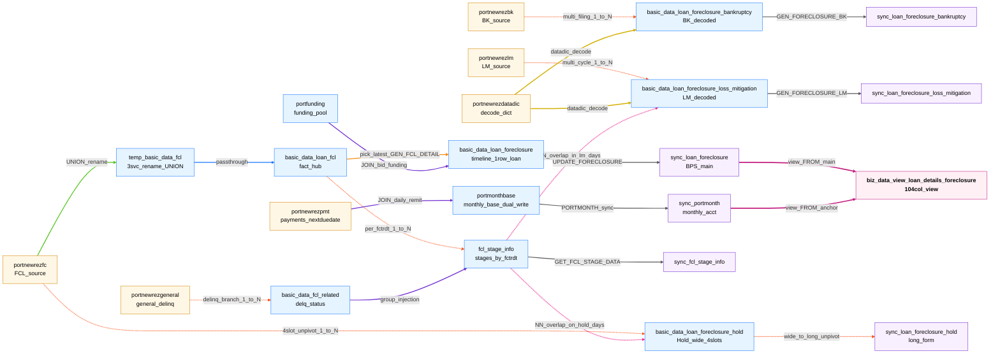
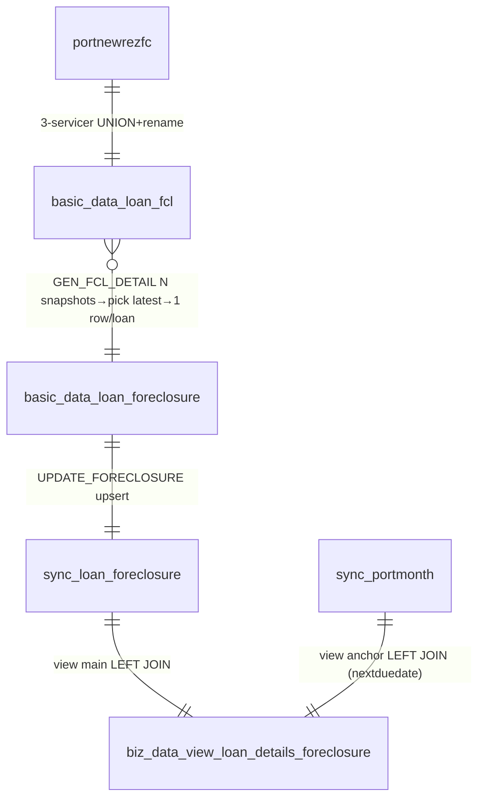
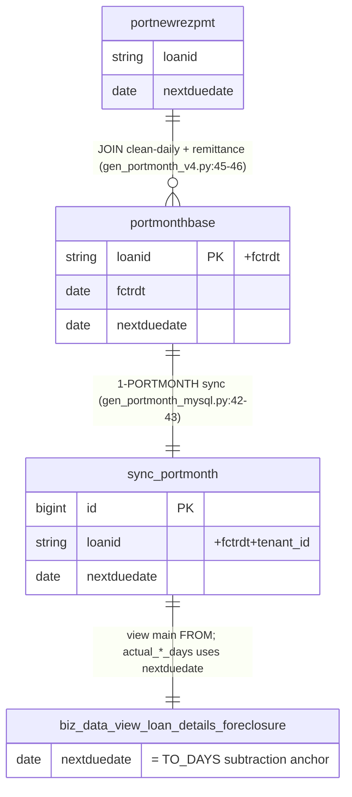
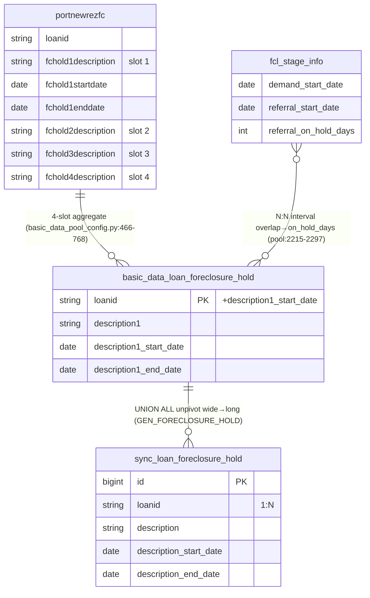
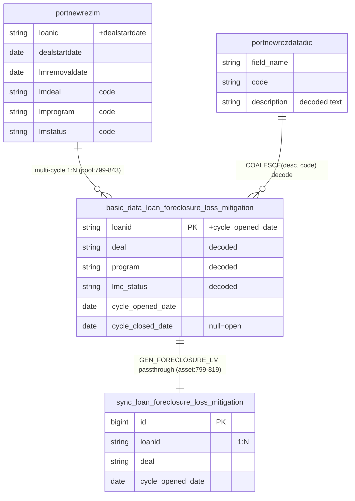
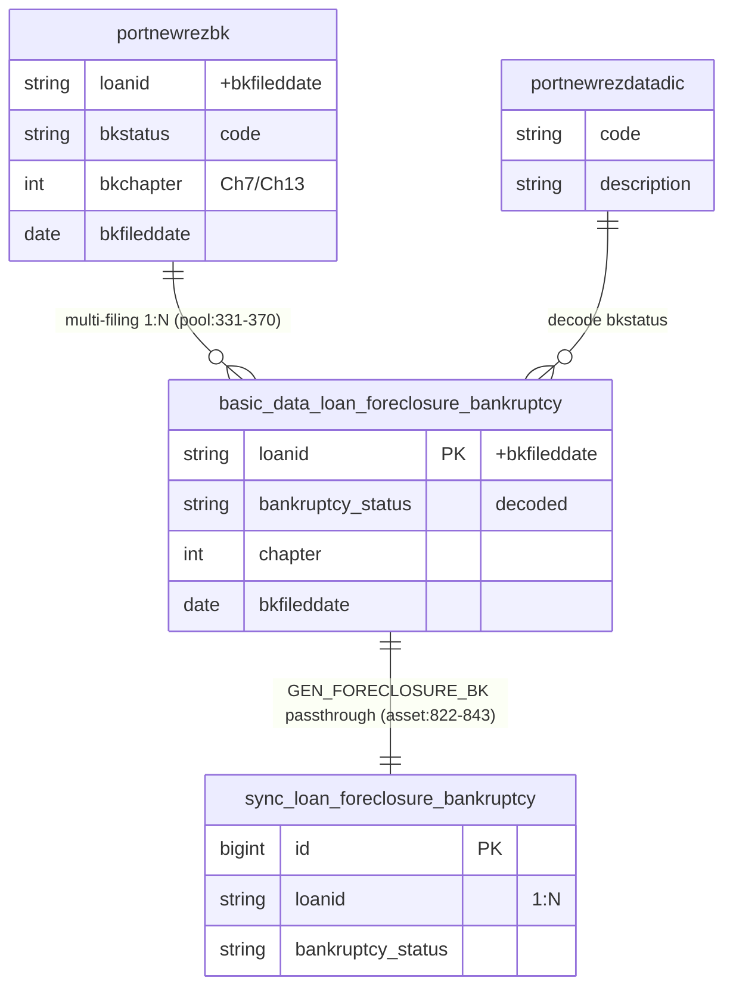

# doc 33 — FCL Table Entity-Relationship Diagram (ERD: PK / grain / 1:N / N:N)

## Document Purpose

- **Why it exists**: FCL-related tables span 3 database schemas (`newrez.*` L1 sources · `port.*` L4 Redshift business family · `bpms.*` L5 BPS sync layer + 1 view), totalling **~22 tables**. Their **entity relationships** (PK / FK / 1:N / N:N) were previously scattered across doc 02 (pipeline diagram), doc 19 (sample-dump diagrams), doc 21 §0.5 (the archived ERD), with no single entry point. The ER diagram is the most direct way to answer questions like "why does sync_loan_foreclosure_hold have multiple rows per loan?", "how does sync_portmonth join with sync_loan_foreclosure?", or "which tables actually feed the FCL view?".
- **What it solves**: a single consolidated doc (1 master diagram + 5 sub-diagrams + PK cheat-sheet + common JOIN templates + cardinality notes) that answers "how tables relate" — orthogonal to doc 25-30 ("how fields flow").
- **Scope**:
  - **In**: PK / grain key / 1:N relationships for all FCL-family-related tables (L1 sources 5 + Newrez payments 1 + L4 Redshift 8 + L4 portmonth 1 + L5 BPS sync 6 + L5 BPS view 1 ≈ 22 tables); common JOIN templates; business rationale for 1:N.
  - **Out**: per-field hop-by-hop lineage (see doc 25-30); stage-window formulas (see doc 31); BPS UI mapping (see doc 13/16); ETL flow orchestration (see doc 02/12).
- **System fit**: the **only entry point for table-level relationships**; orthogonally complements doc 02 (pipeline/layers), doc 25-30 (field lineage), and doc 31 (stage windows).

## Target Audience

data engineers · business analysts · validators · onboarding engineers · new team members · future AI sessions

## Revision History

| Date | Author | Version | Changes | Related |
|------|--------|---------|---------|---------|
| 2026-06-11 | AI Agent (Claude Opus 4.7 1M) | v1 | Initial draft — consolidates doc 21 §0.5 ERD + adds portmonth anchor chain (sync_portmonth/portmonthbase/portnewrezpmt) + explicitly draws the BPS view node (only 2 tables feed in) + 5 sub-diagrams + PK cheat-sheet + common JOIN templates | doc 21 §0.5 (archived) · doc 19 mermaid · doc 02 |
| 2026-06-11 | AI Agent (Claude Opus 4.7 1M) | v2 | §2 cardinality fix `}o--||` (fcl→foreclosure many-snapshots→1-row) + mermaid layout-artifact note; **added §2.5 Data Flow Colored Diagram** (mermaid flowchart + linkStyle, 9 categories: UNION/passthrough/pick-latest/1:N/JOIN/decode/N:N/sync/view FROM), complementary to §2 erDiagram | mermaid linkStyle |
| 2026-06-11 | AI Agent (Claude Opus 4.7 1M) | v3 | Mermaid 11.13 compatibility fix (drop quotes + spaces in pipe-form edge labels; replace `()` in node labels); **added §2.5.1** explaining the orange "pick-latest" edge's two distinct rules (pick-latest vs first-seen tracking), with Loan 7727003984 worked example (12 reschedules, MCP-verified) + 3-date comparison table (projected 2026-06-30 / set 2026-05-22 / last_step_completed 2025-07-16) | MCP-verified prod 2026-06-11 |
| 2026-06-11 | AI Agent (Claude Opus 4.7 1M) | v4 | §2.5.1 Code-First correction: read local PrefectFlow `basic_data_pool_config.py` L253-305 directly — `last_step_completed_date` is actually pool:284 **direct passthrough** of Newrez `lastfcstepcompleteddate` (NOT the v3-misclassified "first-event tracking"); reschedules don't count as "completions" so the field never updates. §2.5.1 appendix: Code-First SQL verification block (real SQL for all 4 rules) | Local PrefectFlow code (recorded in CLAUDE.md) |
| 2026-06-11 | AI Agent (Claude Opus 4.7 1M) | v5 | §2.5.1 `last_step_completed_date` meaning re-corrected: v4 wrongly described 7727003984's last_step as "first sale schedule day" — MCP-verified the pair field `lastfcstepcompleted = "NOS Sent for Recording"` (NOS submission event, **semantically independent from the sale schedule date, just same-day by coincidence**); added "multi-loan distribution" sub-section — 7 measured loans + 21+ distinct sub-step values + granularity comparison table (Newrez 21+ custom sub-steps vs BPS 6-stage, orthogonal dimensions) + 3 business-usage points | MCP-verified prod 2026-06-11 |

## Dependencies

- `port.*` tables do **not enforce PK constraints** (Redshift typically does not declare PK); `PK` in the diagrams below denotes the **business/logical primary key** (the grain key that determines "what a row represents"), enforced by ETL.
- MySQL (newrez / bpms) tables PK = surrogate `id`; the business grain key is noted separately.
- The view `bpms.biz_data_view_loan_details_foreclosure`'s actual FROM was MCP-verified on 2026-06-10: it **only LEFT JOINs `sync_loan_foreclosure` + `sync_portmonth`** — the old doc 19 mermaid claiming "5 sync tables → view" is incorrect.

## Known Limitations

- `port.*` has no enforced PK; the "logical PK" relies on ETL — if upstream writes 2 rows for the same (loanid, dataasof), this diagram cannot prevent downstream anomalies.
- Hold's 4 slots (fchold1..4) sit on a single loan-row in `basic_data_loan_foreclosure_hold` before unpivot; the "1:N" label applies **after** unpivot.

---

## 1. Overview: 4 branches + 1 anchor

```
                                                ┌─────────────────────────────────────┐
                                                │ BPS Foreclosure Detail Page (5 tabs)│
                                                │ Foreclosure / Hold / LM / BK / Stage│
                                                └─────────────────────────────────────┘
                                                          ▲   ▲  ▲  ▲  ▲
                                  ┌─────────────────────┐ │   │  │  │  │
                                  │  biz_data_view_*    │─┘   │  │  │  │
                                  │   (104-col view)    │     │  │  │  │
                                  └─────────────────────┘     │  │  │  │
                                  ▲ (JOINs 2 tables)          │  │  │  │
              ┌───────────────────┤                           │  │  │  │
              │                   │                           │  │  │  │
   ┌──────────┴──────┐    ┌───────┴────────┐    ┌─────────────┴──┴──┴──┴────────────┐
   │ sync_portmonth  │    │ sync_loan_     │    │ sync_*  (hold / lm / bk / stage)  │
   │  (monthly acct) │    │  foreclosure   │    │  ←─ feed their own panels direct, │
   │  ┌nextduedate┐  │    │   (main table) │    │       NOT via the view            │
   └──────▲──────────┘    └───────▲────────┘    └─────────────▲─────────────────────┘
          │                       │                            │
          │ L5 sync                │ L5 sync                    │ L5 sync
          │                       │                            │
   ┌──────┴──────────┐    ┌───────┴─────────────────┐  ┌───────┴─────────────────────┐
   │ port.portmonth- │    │ port.basic_data_loan_   │  │ port.basic_data_loan_       │
   │  base (monthly  │    │  foreclosure (timeline) │  │  foreclosure_{hold,lm,bk}   │
   │   primary)      │    └───────▲─────────────────┘  │  port.fcl_stage_info        │
   └──────▲──────────┘            │                    └───────▲─────────────────────┘
          │                       │ port.basic_data_loan_fcl (L4 fact hub)
          │                       │ ◀ 3-servicer UNION from tempfc.temp_basic_data_fcl ◀ L1 sources
          │
   ┌──────┴──────────┐
   │ newrez.port-    │
   │  newrezpmt      │
   │  (payments)     │
   └─────────────────┘
```

**4 branches (business families)**:
1. **FCL main**: `portnewrezfc` → `temp_basic_data_fcl` (3-servicer UNION) → `basic_data_loan_fcl` (**fact hub**) → { `basic_data_loan_foreclosure` / `fcl_stage_info` / `_hold` / `_lm` / `_bk` / `fcl_related` }
2. **portmonth anchor chain** (needed by view's day-diff): `newrez.portnewrezpmt` → `port.portmonthbase` → `bpms.sync_portmonth` (**only for view's nextduedate**)
3. **delinquency branch**: `portnewrezgeneral` → `daily_loan_common` → `..._clean` → `basic_data_fcl_related.delq_status` → fed into `fcl_stage_info.group`
4. **decode dictionary**: `portnewrezdatadic` → provides text for LM cycle / BK status / hold codes

**Key correction (vs old doc)**:
- ⚠️ The BPS view `biz_data_view_loan_details_foreclosure` actually **only LEFT JOINs `sync_loan_foreclosure` + `sync_portmonth`** — pre-v9 doc 19 mermaid labelling "5 sync tables → view" was wrong (MCP-verified via `information_schema.views.view_definition`). The other 4 sync_* (hold / lm / bk / fcl_stage_info) do **NOT** feed the view; they feed their respective BPS panels directly.

---

## 2. Master ERD (Mermaid erDiagram)

> See all ~22 tables in one diagram. Each table box lists **PK + grain key + key business fields + key transform fields**. Edge labels = the transform SQL or ETL function for that hop.
>
> Legend: `||--||` = 1:1; `||--o{` = 1:N; `}o--o{` = N:N (interval overlap); `}o--||` = N:1 (many snapshots → latest only).
>
> ⚠️ **Mermaid layout artifact**: when two tables are close and each has multiple in/out edges, **a third-party edge may route through the space between them**, visually appearing as an extra edge — **there is always only ONE relationship declaration between any two tables**. If ambiguous, trace edge endpoints (don't count lines). Example: between `basic_data_loan_fcl ↔ basic_data_loan_foreclosure`, mermaid often routes the `portfunding → basic_data_loan_foreclosure` edge through this region, looking like 2 edges — there is only the GEN_FCL_DETAIL edge.

```mermaid
erDiagram
    %% ===== L1 sources (MySQL newrez) =====
    portnewrezfc {
        bigint id PK
        string loanid "grain(+dataasof)"
        date   dataasof "snapshot day"
        int    activefcflag "status filter"
        date   demandsentdate "→demand_start"
        date   demandexpirationdate "→demand_end"
        date   fcreferraldate "→referral_start"
        date   firstlegaldate "→first_legal_start"
        date   servicecompletedate "→service_start ⚠counter-intuitive"
        date   fcjudgmenthearingscheduled "→judgement_start"
        date   fcscheduledsaledate "→sale_start"
        string fcremovaldesc "exit reason→status"
        string judicial
        string fchold1description "Hold (4 slots)"
    }
    portnewrezlm {
        bigint id PK
        string loanid "grain(+dealstartdate)"
        date   dataasof
        string lmdeal "datadic→deal"
        string lmprogram "datadic→program"
        string lmstatus "datadic→lmc_status"
        date   dealstartdate "cycle start"
        date   lmremovaldate "cycle end"
    }
    portnewrezbk {
        bigint id PK
        string loanid "grain(+bkfileddate)"
        date   dataasof
        string bkstatus "datadic→bankruptcy_status"
        int    bkchapter "Ch7/Ch13"
        date   bkfileddate
    }
    portnewrezgeneral {
        bigint id PK
        string loanid "grain(+dataasof)"
        string delinquency_status_mba "→delinq"
        string legalstatus
    }
    portnewrezpmt {
        bigint id PK
        string loanid "grain(+dataasof)"
        date   nextduedate "⚠view day-diff anchor"
    }
    portnewrezdatadic {
        string field_name "logical key"
        string code "join key (+'.0')"
        string description "decoded text"
    }

    %% ===== L4 business (Redshift port) =====
    temp_basic_data_fcl {
        string loanid "grain(+dataasof)"
        date   dataasof
        string servicer_tag "Newrez/Carrington/Capecodfive"
    }
    basic_data_loan_fcl {
        string loanid PK "logical(+dataasof)"
        date   dataasof PK
        date   referral_start_date
        date   legal_start_date
        date   service_start_date
        date   fcscheduled_sale_date
        int    activefcflag
        string judicial
        string fcremovaldesc
    }
    basic_data_loan_foreclosure {
        string loanid PK "1 row/loan, latest snapshot"
        date   timeline_referred_to_foreclosure_date
        date   timeline_first_legal_date
        date   timeline_judgement_date
        string summary_foreclosure_status "CASE on removaldesc"
        int    summary_judicial_foreclosure
    }
    fcl_stage_info {
        string loanid PK "logical(+fctrdt)"
        date   fctrdt PK
        date   demand_start_date
        date   referral_start_date
        date   service_start_date
        int    referral_stage_days
        int    service_in_lm_days
        int    service_on_hold_days
        string group "=delq_status"
        string judicial
    }
    basic_data_loan_foreclosure_hold {
        string loanid PK "logical(+description1_start_date)"
        string description1 "Hold reason (4 slots)"
        date   description1_start_date
        date   description1_end_date
    }
    basic_data_loan_foreclosure_loss_mitigation {
        string loanid PK "logical(+cycle_opened_date)"
        string deal "decoded"
        string program
        string lmc_status
        date   cycle_opened_date "cycle start"
        date   cycle_closed_date "null=open"
    }
    basic_data_loan_foreclosure_bankruptcy {
        string loanid PK "logical(+bkfileddate)"
        string bankruptcy_status "decoded"
        int    chapter
        date   bkfileddate
    }
    basic_data_fcl_related {
        string loanid PK "+dataasof"
        string delq_status "→stage.group"
        string propertystate "→judicial state fallback"
    }
    portmonthbase {
        string loanid PK "+fctrdt"
        date   fctrdt PK
        date   nextduedate "anchor source"
    }
    portfunding {
        string loanid PK "1:1/loan"
        string dealid "=bid_id"
        string fundingid
    }

    %% ===== L5 BPS (MySQL bpms) =====
    sync_loan_foreclosure {
        bigint id PK
        string loanid "1 row/loan"
        int    tenant_id
        date   timeline_referred_to_foreclosure_date
        string summary_foreclosure_status
        int    summary_judicial_foreclosure
    }
    sync_fcl_stage_info {
        bigint id PK
        string loanid "+fctrdt"
        date   fctrdt
        date   referral_start_date
        int    service_in_lm_days
    }
    sync_loan_foreclosure_hold {
        bigint id PK
        string loanid "1:N"
        string description
        date   description_start_date
        date   description_end_date
    }
    sync_loan_foreclosure_loss_mitigation {
        bigint id PK
        string loanid "1:N"
        string deal
        date   cycle_opened_date
    }
    sync_loan_foreclosure_bankruptcy {
        bigint id PK
        string loanid "1:N"
        string bankruptcy_status
        date   bkfileddate
    }
    sync_portmonth {
        bigint id PK
        string loanid "+fctrdt"
        int    tenant_id
        date   fctrdt
        date   nextduedate "⚠view anchor"
    }
    biz_data_view_loan_details_foreclosure {
        string loanid "+tenant_id"
        date   nextduedate "from sync_portmonth"
        date   timeline_first_legal_date "from sync_loan_foreclosure"
        int    actual_first_legal_days "=TO_DAYS diff"
        int    var_first_legal_days "=actual−Σtarget"
    }

    %% ===== Relationships =====
    portnewrezfc      ||--|| temp_basic_data_fcl    : "3-servicer UNION+rename (CREATE_BASIC_FCL pool:1531-1654)"
    temp_basic_data_fcl ||--|| basic_data_loan_fcl   : "fidelity passthrough"
    basic_data_loan_fcl }o--|| basic_data_loan_foreclosure : "GEN_FCL_DETAIL pool:253-305 N snapshots→pick latest→1 row/loan"
    basic_data_loan_fcl ||--o{ fcl_stage_info        : "GEN_FCL_STAGE pool:1774-2440 per fctrdt"
    portnewrezfc      ||--o{ basic_data_loan_foreclosure_hold : "fchold1..4 unpivot 1:N"
    portnewrezlm      ||--o{ basic_data_loan_foreclosure_loss_mitigation : "multi-cycle 1:N"
    portnewrezbk      ||--o{ basic_data_loan_foreclosure_bankruptcy : "multi-filing 1:N"
    portnewrezgeneral ||--o{ basic_data_fcl_related  : "delinq branch"
    portnewrezpmt     ||--o{ portmonthbase           : "JOIN clean-daily + remittance (gen_portmonth_v4.py)"
    portnewrezdatadic ||--o{ basic_data_loan_foreclosure_loss_mitigation : "decode deal/program/status"
    portnewrezdatadic ||--o{ basic_data_loan_foreclosure_bankruptcy : "decode bkstatus"
    basic_data_fcl_related ||--o{ fcl_stage_info     : "group=delq_status"
    portfunding       ||--|| basic_data_loan_foreclosure : "JOIN bid/funding_id 1:1"

    fcl_stage_info }o--o{ basic_data_loan_foreclosure_loss_mitigation : "N:N interval overlap→in_lm_days (rnk=1 most-recent open)"
    fcl_stage_info }o--o{ basic_data_loan_foreclosure_hold : "N:N interval overlap→on_hold_days (rnk=1)"

    basic_data_loan_foreclosure ||--|| sync_loan_foreclosure : "UPDATE_FORECLOSURE upsert 1:1"
    fcl_stage_info    ||--|| sync_fcl_stage_info    : "GET_FCL_STAGE_DATA sync 1:1"
    basic_data_loan_foreclosure_hold ||--o{ sync_loan_foreclosure_hold : "wide→long unpivot 1:N"
    basic_data_loan_foreclosure_loss_mitigation ||--|| sync_loan_foreclosure_loss_mitigation : "GEN_FORECLOSURE_LM"
    basic_data_loan_foreclosure_bankruptcy ||--|| sync_loan_foreclosure_bankruptcy : "GEN_FORECLOSURE_BK"
    portmonthbase     ||--|| sync_portmonth         : "1-PORTMONTH sync"

    sync_loan_foreclosure ||--|| biz_data_view_loan_details_foreclosure : "view FROM (loan_fcl)"
    sync_portmonth    ||--|| biz_data_view_loan_details_foreclosure : "view FROM (monthly, ⚠nextduedate anchor)"
```



> **One-line read**: arrows = data flow direction; `||--o{` 1:N = child table = long-form (Hold/LM/BK); `}o--o{` N:N = interval overlap (Stage window × LM/Hold intervals) → derives `in_lm_days / on_hold_days`; the view node connects to only 2 tables (verified), NOT 5.

---

## 2.5 Data Flow Colored Diagram (colored by transform type)

§2's erDiagram captures the 22-table cardinality (PK / grain / 1:1·1:N·N:N) precisely, but mermaid `erDiagram` **does not support per-edge custom colors** — when 23 edges cross among 22 tables, "which edge is which transform" can only be read by hovering labels. This section adds a **same-22-tables-and-23-edges mermaid `flowchart`** colored by **transform type** in 9 categories, complementary to §2:

- **§2 erDiagram**: cardinality formal standard (rigorous PK / grain / multiplicity notation)
- **§2.5 flowchart**: transform-semantic visualization (color = which kind: UNION / passthrough / pick-latest / 1:N / JOIN / decode / N:N / sync / view FROM)

### Color legend (9 categories)

| Color | Line | Relationship | Typical example |
|---|---|---|---|
| 🟢 green `#52c41a` | solid | **UNION + rename** (3-servicer merge into fact table) | `portnewrezfc → temp_basic_data_fcl` (CREATE_BASIC_FCL pool:1531-1654) |
| 🔵 blue `#1677ff` | solid | **Fidelity passthrough** (1:1 mapping, no transform) | `temp → basic_data_loan_fcl` |
| 🟠 orange `#fa8c16` | solid | **Pick-latest derive** (N snapshots → 1 row/loan) | `fcl → basic_data_loan_foreclosure` (GEN_FCL_DETAIL, picks dataasof=MAX) |
| 🔴 red `#fa541c` | dashed | **1:N child explosion** (unpivot / multi-cycle / multi-filing / multi-fctrdt) | `portnewrezfc → _hold` · `lm → lm4` · `bk → bk4` · `fcl → fcl_stage_info` · `gen → fcl_related` · `_hold → sync_hold` |
| 🟣 purple `#722ed1` | solid | **JOIN** (cross-entity horizontal join on key) | `portnewrezpmt → portmonthbase` (JOIN clean-daily + remittance) · `portfunding → foreclosure` (JOIN bid/funding_id) · `fcl_related → fcl_stage_info` (group injection) |
| 🟡 dark yellow `#d4b106` | thick solid | **datadic decode** (code → text) | `portnewrezdatadic → lm4` · `→ bk4` |
| 🩷 pink `#eb2f96` | dashed | **N:N interval overlap** (Stage window × LM/Hold interval → overlap days) | `fcl_stage_info × loss_mitigation` (→ `in_lm_days`) · `× hold` (→ `on_hold_days`) |
| ⬛ grey `#595959` | solid | **BPS cross-DB sync** (L4 Redshift → L5 MySQL, transport only, no business transform) | `fclo → sync_loan_foreclosure` (UPDATE_FORECLOSURE upsert) · `stage → sync_stage` · `lm4 → sync_lm` · `bk4 → sync_bk` · `portmonthbase → sync_portmonth` |
| 🟪 deep pink `#c41d7f` | thick solid | **View FROM** (final consumption · the view's 2 FROM tables) | `sync_loan_foreclosure → biz_data_view` (main LEFT JOIN) · `sync_portmonth → biz_data_view` (⚠ nextduedate anchor LEFT JOIN) |

### Colored data-flow diagram



> **How to read this diagram**: first scan **color** — same color = same transform type, easy to group across the diagram; **dashed** = 1:N or N:N (multi-row / interval overlap), **solid** = single-row mapping or sync transport; when edges cross, **trace endpoint nodes** rather than count lines. **§2 + §2.5 combined usage**: use §2.5 to find the color family you care about (e.g. "which edges are sync? — only look at the grey ones"), then go back to §2 to read that edge's precise cardinality marker.

### 2.5.1 The orange "pick-latest" edge actually carries TWO different rules

§2.5 labels the `fcl → basic_data_loan_foreclosure` edge as 🟠 orange "pick-latest GEN_FCL_DETAIL", but this edge actually carries **two distinct semantics** — most fields really do "just pick the latest row", but a small number of `*_set_date` "**first-seen tracking**" fields require scanning the entire dataasof history to compute.

#### Two rule categories

| Category | Field examples | Computation rule | Code-First |
|---|---|---|---|
| **a. Pick-latest (default, ~95% of fields)** | `timeline_*_date` (incl. sale_date_projected) · `summary_*` · `target_*` etc. — vast majority | `value = field value of the max-fctrdt row` (snapshot-dimension "current state") | pool:253-305 |
| **b. First-seen tracking (exception, 2 fields)** | `timeline_sale_date_set_date` · `timeline_judgement_hearing_set_date` | `value = min(dataasof WHERE upstream = max-fctrdt row's value)` (scan full fcl history, find "when did the current value first appear") | [pool:300-303 sale_set](https://gitlab.bridgerinvestment.com/jli/prefectflow/-/blob/32a750a39c7eda989de991c47467979043e3d209/flow/basic_data/basic_data_config/basic_data_pool_config.py#L300-303) · [pool:295-298 judgement_set](https://gitlab.bridgerinvestment.com/jli/prefectflow/-/blob/32a750a39c7eda989de991c47467979043e3d209/flow/basic_data/basic_data_config/basic_data_pool_config.py#L295-298) |

#### Worked example: Loan 7727003984 (12 reschedules · MCP-verified 2026-06-11)

This loan's sale date was **rescheduled 12 times** — MCP query on `port.basic_data_loan_fcl` aggregated by distinct `fcscheduled_sale_date` + min(dataasof) returns all 12 values (first scheduled 2025-07-16, last pushed to 2026-06-30):

| # | dataasof (date the new value first appears) | fcscheduled_sale_date (new sale date) | Held days |
|---|---|---|---|
| 1 | 2025-07-16 | 2025-08-13 (**first scheduled**) | 27 |
| 2 | 2025-08-12 | 2025-09-17 | 29 |
| 3 | 2025-09-10 | 2025-10-17 | 36 |
| 4 | 2025-10-17 | 2025-10-24 | 3 |
| 5 | 2025-10-20 | 2025-11-25 | 30 |
| 6 | 2025-11-19 | 2025-12-30 | 37 |
| 7 | 2025-12-26 | 2026-01-30 | 31 |
| 8 | 2026-01-26 | 2026-02-27 | 32 |
| 9 | 2026-02-27 | 2026-03-27 | 20 |
| 10 | 2026-03-20 | 2026-04-28 | 34 |
| 11 | 2026-04-23 | 2026-05-29 | 29 |
| **12** | **2026-05-22** | **2026-06-30 (current value, last reschedule)** | 18 |

The ETL applies the two rules at the latest snapshot (dataasof=MAX), producing (MCP-verified against `port.basic_data_loan_foreclosure`):

- **a. Pick-latest →** `timeline_sale_date_projected_date = `**`2026-06-30`** ← the `fcscheduled_sale_date` value at the max-fctrdt row
- **b. First-seen tracking →** `timeline_sale_date_set_date = `**`2026-05-22`** ← scan full fcl history for "earliest dataasof where value=2026-06-30" = row 12's dataasof

The BPS sync table `bpms.sync_loan_foreclosure` MCP measures: `timeline_sale_date_projected_date=2026-06-30 / timeline_sale_date_set_date=2026-05-22` — exact match. **The BPS UI's Sale Date Projected/Set surface these two values**.

#### Three different dates for "sale scheduled" — same loan, ALL MCP-verified

On this single loan, "the sale was scheduled" spawns 3 different date fields — don't confuse them:

| BPS field | Value | Meaning | Rule |
|---|---|---|---|
| `timeline_sale_date_projected_date` | **2026-06-30** | The **current** scheduled sale date (the value itself) | **a Pick-latest** |
| `timeline_sale_date_set_date` | **2026-05-22** | When the **current** sale date **first appeared** (the last reschedule day) | **b First-seen tracking** |
| `summary_last_step_completed_date` | **2025-07-16** | servicer-reported "date of last completed FCL **sub-step** event" — for this loan, the pair field `lastfcstepcompleted = "NOS Sent for Recording"` (Notice of Sale submission; coincidentally also the first sale-schedule day on 2025-07-16). **NOT "first sale schedule day" semantics** (old doc misreading, corrected; see "multi-loan distribution" sub-section below) | **c Direct passthrough** (pool:284, no transform) `fc.lastfcstepcompleteddate AS summary_last_step_completed_date` |

⚠️ All three are real data on different facets — **NOT interchangeable**:
- "When is the sale scheduled now?" → projected 2026-06-30
- "Is this date freshly set, or has it been stable for months?" → set 2026-05-22 (only 18 days before today 2026-06-09 — just rescheduled!)
- "What's the servicer's last completed **sub-step** date?" → last_step_completed 2025-07-16 (**sub-step name = pair field `lastfcstepcompleted` = "NOS Sent for Recording"**, the Notice-of-Sale submission day; coincidentally equal to the first sale schedule day but semantically independent — see "multi-loan distribution" sub-section below for the 21 distinct sub-step values)

#### `last_step_completed_date` multi-loan distribution (clarifying it's not a bug · response to user's questions)

**Q&A**:
1. **Is this a Prefect bug? — No, not a bug**. pool:284 is a **direct passthrough** of Newrez's self-reported `lastfcstepcompleteddate`, zero transformation; ETL does not make decisions.
2. **Is it the completion time of one specific stage (NOI / Demand / Referral / First Legal / Service / Publication / Judgement / Sale)? — No**. `lastfcstepcompleted` is Newrez's **self-defined sub-step event text** (MCP-verified 21+ distinct values), **orthogonal** to the BPS 6-stage model (DEMAND/REFERRAL/FIRST_LEGAL/SERVICE/JUDGEMENT/SALE):
   - `fcstage` = "**Currently** which stage the loan is in" (also from Newrez's own fcstage column)
   - `lastfcstepcompleted` + `_date` = "the **most recent** servicer-defined fine-grained sub-step completed + its date"
3. **The previous wording for 7727003984 was wrong**: the old doc described it as "first sale schedule day". Actually the pair field `lastfcstepcompleted = "NOS Sent for Recording"` (Notice of Sale **submission day** ≠ sale **schedule day**). The subsequent 12 reschedules changed `fcscheduledsaledate`, but "NOS submission" happened only once (2025-07-16), so this field never updated. The **coincidental same-day** is because the servicer did both events on the same day; semantically the two fields are independent.

**MCP-measured 7-loan distribution** (latest dataasof, 2026-06-11):

| loanid | `lastfcstepcompleted` (servicer's own sub-step text) | `lastfcstepcompleteddate` | `fcstage` (current stage) |
|---|---|---|---|
| 7727000088 | Post Sale Review (SCRA and PACER Check) | 2026-05-26 | Post Sale Review (SCRA and PACER Check) |
| 7727000131 | NOS Recorded | 2025-12-23 | Pre-Sale Review 1 (SCRA and PACER Check) |
| 7727000357 | Presale Redemption Will Expire On | 2026-04-07 | Sale Scheduled For |
| 7727000569 | Answer Period Will Expire On | 2025-04-13 | Order Of Reference Sent |
| **7727003984** | **NOS Sent for Recording** | **2025-07-16** | Pre-Sale Review 1 (SCRA and PACER Check) |
| 7727004200 | Sale Scheduled For | 2026-05-19 | Pre-Sale Review 1 (SCRA and PACER Check) |
| 7727004408 | Motion for Judgment Sent to Court | 2026-05-13 | Judgment Hearing Scheduled For |

**21+ distinct `lastfcstepcompleted` values (sample)**: NOS Recorded · NOS Sent for Recording · NOTS Recorded · Complaint Sent for Filing · Complaint Submitted for Service · Complaint Sent For Service · Submitted for Service · Service Complete · Answer Period Will Expire On · Order Of Reference Sent · Motion for Judgment Sent to Court · Are We Proceeding with a Consent Judgment · Order Authorizing Sale Received · Sale Scheduled For · Presale Redemption Will Expire On · Post Sale Review · First Publication · NOD Filed · Praecipe Filed · Preliminary Title Clear · Title Report Received · 10 Day Letter Sent · File Received By Attorney …

**Granularity comparison — the key insight**:

| Dimension | Field | # values | Granularity |
|---|---|---|---|
| BPS 6-stage model | `port.fcl_stage_info.stage` | 6 | **Business macro-phases**: DEMAND / REFERRAL / FIRST_LEGAL / SERVICE / JUDGEMENT / SALE |
| Newrez self-defined sub-steps | `lastfcstepcompleted` | **21+** | **Legal document-level events**: each stage may contain 3-5 fine-grained sub-steps |

Example: within **FIRST_LEGAL stage**, a loan may pass through these sub-steps in order (each refreshes last_step_completed):
`Complaint Sent for Filing` → `Complaint Sent For Service` → `Answer Period Will Expire On` → `Order Of Reference Sent` → `Motion for Judgment Sent to Court` → … → before entering the JUDGEMENT stage.

**Business usage**:
- ① See the servicer's **finest-grained timeline point** ("when did the last specific step complete") — the BPS 6-stage model cannot answer this; it only tells you "this loan is currently in FIRST_LEGAL stage".
- ② Combined with `fcstage` to judge "**how deep into this stage**" the loan is. Example loan 7727004408: fcstage = "Judgment Hearing Scheduled For" (about to enter JUDGEMENT stage), last step = "Motion for Judgment Sent to Court" (motion already submitted) → interpretation: just filed motion, awaiting hearing.
- ③ ⚠️ Servicer-self-defined text, **NOT directly comparable across servicers** (this Newrez vocabulary may not apply to Carrington / Capecodfive; per CREATE_BASIC_FCL pool:1602-1644, carrington/capecodfive often set `lastfcstepcompleted` to `null` or `most_recent_foreclosure_stage`, differing from Newrez).

#### Code-First verification (read locally from PrefectFlow `basic_data_pool_config.py`)

```sql
-- pool:266 — pick-latest (default rule a):
fc.fcscheduled_sale_date AS timeline_sale_date_projected_date
  -- fc = port.basic_data_loan_fcl WHERE dataasof = MAX(dataasof) per servicer (pool:288-293)

-- pool:267 + pool:300-303 — first-seen tracking (rule b):
sa.sa_set_date AS timeline_sale_date_set_date
  -- sa = LEFT JOIN (
  --   select loanid, fcscheduled_sale_date, min(dataasof) as sa_set_date
  --   from port.basic_data_loan_fcl where fcscheduled_sale_date is not null
  --   group by loanid, fcscheduled_sale_date) sa
  -- on fc.loanid=sa.loanid AND fc.fcscheduled_sale_date=sa.fcscheduled_sale_date
  -- Effectively: take the latest row's fcscheduled_sale_date value, find min(dataasof) of that value across full history

-- pool:264 + pool:295-298 — same pattern for timeline_judgement_hearing_set_date:
ju.jd_set_date AS timeline_judgement_hearing_set_date
  -- subquery does the same min(dataasof) GROUP BY value on fcjudgment_hearing_scheduled

-- pool:284 — direct passthrough (rule c):
fc.lastfcstepcompleteddate AS summary_last_step_completed_date
  -- No aggregation/computation; just the current-snapshot value of fc.lastfcstepcompleteddate (from Newrez raw)
```

#### Key insights

1. **`set_date` is NOT "the date first ever scheduled"**: the first scheduling was 2025-07-16, but set_date = 2026-05-22. Reason: every reschedule introduces a new value, refreshing the "first-seen" date → for the current value 2026-06-30, the first-seen date is 2026-05-22 (the last reschedule day).
2. **`set_date` is NOT the same as latest projected**: projected = 2026-06-30, set = 2026-05-22 — two different dates.
3. **A single-day snapshot cannot compute b**: only taking the max-fctrdt row gives projected = 2026-06-30, but **cannot** compute set = 2026-05-22; only the full dataasof history retained in fcl (many rows per loan) makes this scan possible. **This is one of the reasons fcl MUST preserve full history by (loanid, dataasof).**
4. **Two business questions**: ① "**What's the currently scheduled sale date?**" → projected_date (pick-latest); ② "**When was this sale date scheduled? Just set or stable for months?**" → set_date (first-seen tracking). The latter helps servicers detect "was it just pushed back again?" — if set_date is close to dataasof, the schedule just changed.

#### Relationship to §2 erDiagram

§2 labels `basic_data_loan_fcl }o--|| basic_data_loan_foreclosure` as N:1 (many snapshots → 1 row), which is correct for cardinality — but "how to compute 1 row from N dataasof rows" actually has two algorithms:
- **N → 1 (pick-latest)**: sort N rows, take max, discard others → 1 row
- **N → 1 (first-seen tracking)**: filter N rows by "value = max-fctrdt row's value", then take min(dataasof) → 1 row

Both fit the N:1 cardinality label, but they execute different code paths. Readers need to check specific fields to know which one applies.

#### Field inventory

| BPS field | Upstream fcl field | Category | Meaning |
|---|---|---|---|
| `timeline_sale_date_projected_date` | `fcscheduled_sale_date` current | a pick-latest | Currently scheduled sale date |
| **`timeline_sale_date_set_date`** | `fcscheduled_sale_date` first-seen | **b first-seen tracking** | When was the current sale date scheduled |
| `timeline_judgement_date` | `fcjudgmenthearingscheduled` current | a pick-latest | Current judgement hearing date |
| **`timeline_judgement_hearing_set_date`** | `fcjudgmenthearingscheduled` first-seen | **b first-seen tracking** | When was the current judgement hearing scheduled |
| `first_legal_date_history` (doc 27 §18) | `firstlegaldate` first-seen | b same mechanism | ETL tracking of first legal date (prod-measured all NULL — design only) |

---

## 3. Sub-diagrams (focused, smaller)

### 3.1 FCL Main (fact hub → timeline → BPS main table → view)



**Key point**: FCL main is 5 hops; the view node connects to **only 2 tables** (sync_loan_foreclosure + sync_portmonth), **not 5** (corrects pre-v9 doc 19 mermaid).

### 3.2 portmonth anchor chain (needed for the view's day-diff)



**Key point**: portmonth is a **separate branch** (not part of the FCL business family), but the view's `actual_*_days` formula `TO_DAYS(timeline_*_date) − TO_DAYS(nextduedate)` depends on it. See [doc 31 §5](31_fcl_stage_window_rules.md).

### 3.3 Hold (wide→long unpivot · 1 loan, multiple holds)



**Key point**: Newrez `portnewrezfc` stores Hold in 4 slots (fchold1..4); the ETL converts to long form (1 Hold = 1 row) in 2 hops.

### 3.4 LM cycle (decode + multi-cycle per loan)



**Key point**: LM fields are **codes** at Newrez (e.g. `lmstatus='03'`); decoded via JOIN to `portnewrezdatadic` to business text (e.g. 'Approved'). Multiple cycles per loan is normal (multiple applications + decisions over time).

### 3.5 BK bankruptcy (decode + multi-filing per loan)



**Key point**: A single loan can file BK multiple times (Ch.7 dismissed → re-file Ch.13, etc.); one row per filing; `bkfileddate` is the logical key.

---

## 4. PK / Grain Key Cheat-sheet

| Layer | Table | Physical PK | Business/logical grain (what a row represents) | Volume (prod measured) |
|---|---|---|---|---|
| L1 | `newrez.portnewrezfc` | `id` (surrogate) | `loanid` + `dataasof` | ~6,200 loan-days |
| L1 | `newrez.portnewrezlm` | `id` | `loanid` + `dealstartdate` | multi-cycle/loan |
| L1 | `newrez.portnewrezbk` | `id` | `loanid` + `bkfileddate` | multi-filing/loan |
| L1 | `newrez.portnewrezgeneral` | `id` | `loanid` + `dataasof` | ~6,200 loan-days |
| L1 | `newrez.portnewrezpmt` | `id` | `loanid` + `dataasof` | ~6,200 loan-days |
| L1 | `newrez.portnewrezdatadic` | (none) | `field_name` + `code` | decode dictionary |
| L4 | `port.basic_data_loan_fcl` | (none) | `loanid` + `dataasof` | multi-snapshot |
| L4 | `port.basic_data_loan_foreclosure` | (none) | `loanid` (latest snapshot, 1 row/loan) | ~6,152 |
| L4 | `port.fcl_stage_info` | (none) | `loanid` + `fctrdt` | multi-snapshot (302 fctrdt's, ~9,587 cumulative rows) |
| L4 | `port.basic_data_loan_foreclosure_hold` | (none) | `loanid` + `description1_start_date` | 1 row/loan (wide table, 4 slots) |
| L4 | `port.basic_data_loan_foreclosure_loss_mitigation` | (none) | `loanid` + `cycle_opened_date` | multi-cycle/loan |
| L4 | `port.basic_data_loan_foreclosure_bankruptcy` | (none) | `loanid` + `bkfileddate` | multi-filing/loan |
| L4 | `port.basic_data_fcl_related` | (none) | `loanid` + `dataasof` | multi-snapshot |
| L4 | `port.portmonthbase` | (none) | `loanid` + `fctrdt` | multi-month |
| L4 | `port.portfunding` | (none) | `loanid` (1:1) | 1 row/loan |
| L5 | `bpms.sync_loan_foreclosure` | `id` | `loanid` + `tenant_id` (1 row/loan) | ~89 current |
| L5 | `bpms.sync_fcl_stage_info` | `id` | `loanid` + `fctrdt` (multi-snapshot) | cumulative |
| L5 | `bpms.sync_loan_foreclosure_hold` | `id` | `loanid` + detail key (1:N long table) | multi-Hold/loan |
| L5 | `bpms.sync_loan_foreclosure_loss_mitigation` | `id` | `loanid` + `cycle_opened_date` (1:N) | multi-cycle/loan |
| L5 | `bpms.sync_loan_foreclosure_bankruptcy` | `id` | `loanid` + `bkfileddate` (1:N) | multi-filing/loan |
| L5 | `bpms.sync_portmonth` | `id` | `loanid` + `fctrdt` + `tenant_id` | multi-month |
| L5 view | `bpms.biz_data_view_loan_details_foreclosure` | (view) | `loanid` + `tenant_id` (1 row/loan, latest fctrdt) | ~89 |

---

## 5. Common JOIN Cheat-sheet (typical reconciliation scenarios)

### 5.1 Most common: pull sync main + view fields for one loan

```sql
-- BPS app perspective: 1 row = 1 loan, with timeline / actual_days / var_days
SELECT v.loanid, v.tenant_id,
       v.timeline_first_legal_date, v.actual_first_legal_days, v.var_first_legal_days,
       v.summary_foreclosure_status
FROM bpms.biz_data_view_loan_details_foreclosure v
WHERE v.loanid = '7727000357';
-- Note: the view internally LEFT JOINs sync_loan_foreclosure + sync_portmonth; joining those again externally duplicates.
```

### 5.2 Troubleshoot "1 loan, multiple Holds"

```sql
SELECT loanid, description, description_start_date, description_end_date
FROM bpms.sync_loan_foreclosure_hold
WHERE loanid = '7727000088'
ORDER BY description_start_date;
-- Multiple rows: one row per Hold.
```

### 5.3 Troubleshoot "1 loan, multiple LM cycles"

```sql
SELECT loanid, deal, program, lmc_status, cycle_opened_date, cycle_closed_date
FROM bpms.sync_loan_foreclosure_loss_mitigation
WHERE loanid = '7727000131'
ORDER BY cycle_opened_date;
-- Multiple rows: one per cycle; cycle_closed_date IS NULL means OPEN.
```

### 5.4 Trace the view's nextduedate anchor end-to-end

```sql
-- current (used by the BPS view)
SELECT loanid, fctrdt, nextduedate
FROM bpms.sync_portmonth
WHERE loanid = '7727000131'
ORDER BY fctrdt DESC LIMIT 1;
-- L4 upstream
SELECT loanid, fctrdt, nextduedate
FROM port.portmonthbase
WHERE loanid = '7727000131'
ORDER BY fctrdt DESC LIMIT 1;
-- L1 Newrez source
SELECT loanid, dataasof, nextduedate
FROM newrez.portnewrezpmt
WHERE loanid = '7727000131'
ORDER BY dataasof DESC LIMIT 1;
```

### 5.5 Join fcl_stage_info with sync_loan_foreclosure (same loan)

```sql
SELECT f.loanid, f.fctrdt, f.referral_start_date, f.first_legal_start_date, f.service_start_date,
       s.summary_foreclosure_status, s.timeline_referred_to_foreclosure_date
FROM bpms.sync_fcl_stage_info f
LEFT JOIN bpms.sync_loan_foreclosure s ON s.loanid = f.loanid AND s.tenant_id = f.tenant_id
WHERE f.loanid = '7727000357'
  AND f.fctrdt = (SELECT MAX(fctrdt) FROM bpms.sync_fcl_stage_info WHERE loanid = f.loanid);
```

### 5.6 Verify the view's actual FROM (Code-First MCP via information_schema)

```sql
SELECT view_definition
FROM information_schema.views
WHERE table_schema='bpms' AND table_name='biz_data_view_loan_details_foreclosure';
-- Confirms: FROM bpms.sync_portmonth monthly LEFT JOIN bpms.sync_loan_foreclosure loan_fcl
--          ON loan_fcl.loanid = monthly.loanid AND loan_fcl.tenant_id = monthly.tenant_id
--          LEFT JOIN (subquery for MAX fctrdt) max_fctdt ...
-- Only 2 tables (NOT 5).
```

---

## 6. Cardinality & 1:N (business rationale)

| Relationship | Business reason | Data shape |
|---|---|---|
| **portnewrezfc → basic_data_loan_foreclosure_hold (1:N)** | A loan may enter Hold multiple times during FCL (BK / LM / attorney comms stack as overlapping pause events); Newrez encodes up to 4 slots (fchold1..4), ETL unpivots to a long table with no limit | Newrez side: 1 loan × 4 slots (max 4 concurrent Holds). Redshift side: long table, 1 Hold = 1 row |
| **portnewrezlm → basic_data_loan_foreclosure_loss_mitigation (1:N)** | A loan can apply for LM multiple times (denied then retry, different programs in sequence); each attempt = a cycle | 1 cycle = 1 row; `cycle_opened_date` is the business key; `cycle_closed_date IS NULL` indicates an active cycle |
| **portnewrezbk → basic_data_loan_foreclosure_bankruptcy (1:N)** | A loan can file BK multiple times (Ch.7 dismissed → re-file Ch.13; reaffirmation failed → re-file) | 1 filing = 1 row; `bkfileddate` is the business key |
| **basic_data_loan_fcl → fcl_stage_info (1:N)** | The same loan emits one stage row per fctrdt (monthly reporting date) for historical traceback | 1 loan × N fctrdt's (prod ≈302 snapshots covering 2025-06 to 2026-06) |
| **fcl_stage_info × LM/Hold (N:N, interval overlap)** | Computing in_lm_days / on_hold_days requires overlapping the stage window with LM/Hold intervals | No physical join column — this is a **computed relationship**: rnk=1 picks the most-recent OPEN (see [doc 31 §5](31_fcl_stage_window_rules.md)) |
| **deal_pool ↔ portfunding (N:1)** | A deal pool holds multiple loans | `dealid` is the key |
| **sync_loan_foreclosure → biz_data_view (1:1)** | View LEFT JOINs by loanid+tenant_id | 1 row in, 1 row out |

**Why is sync_portmonth N:1 into the view?** — The view joins by `loanid + tenant_id` and uses a `max_fctdt` subquery to pick the **max fctrdt** row → effectively 1 sync_portmonth row per loan enters the view.

---

## 7. Code-First References

| Topic | Code location |
|---|---|
| `temp_basic_data_fcl` UNION construction | [pool:1531-1654](https://gitlab.bridgerinvestment.com/jli/prefectflow/-/blob/32a750a39c7eda989de991c47467979043e3d209/flow/basic_data/basic_data_config/basic_data_pool_config.py#L1531-1654) (CREATE_BASIC_FCL) |
| `basic_data_loan_foreclosure` build | [pool:253-305](https://gitlab.bridgerinvestment.com/jli/prefectflow/-/blob/32a750a39c7eda989de991c47467979043e3d209/flow/basic_data/basic_data_config/basic_data_pool_config.py#L253-305) (GEN_FCL_DETAIL) |
| `fcl_stage_info` build | [pool:1774-2440](https://gitlab.bridgerinvestment.com/jli/prefectflow/-/blob/32a750a39c7eda989de991c47467979043e3d209/flow/basic_data/basic_data_config/basic_data_pool_config.py#L1774-2440) (GEN_FCL_STAGE) |
| Hold slot expansion | [pool:466-768](https://gitlab.bridgerinvestment.com/jli/prefectflow/-/blob/32a750a39c7eda989de991c47467979043e3d209/flow/basic_data/basic_data_config/basic_data_pool_config.py#L466-768) |
| LM INSERT + datadic decode | [pool:799-843](https://gitlab.bridgerinvestment.com/jli/prefectflow/-/blob/32a750a39c7eda989de991c47467979043e3d209/flow/basic_data/basic_data_config/basic_data_pool_config.py#L799-843) |
| BK INSERT + datadic decode | [pool:331-370](https://gitlab.bridgerinvestment.com/jli/prefectflow/-/blob/32a750a39c7eda989de991c47467979043e3d209/flow/basic_data/basic_data_config/basic_data_pool_config.py#L331-370) |
| in_lm/on_hold N:N interval overlap | [pool:2215-2330](https://gitlab.bridgerinvestment.com/jli/prefectflow/-/blob/32a750a39c7eda989de991c47467979043e3d209/flow/basic_data/basic_data_config/basic_data_pool_config.py#L2215-2330) |
| BPS sync upsert (UPDATE_FORECLOSURE / GEN_FORECLOSURE_* / GET_FCL_STAGE_DATA / 1-PORTMONTH) | [asset_managment_config.py](https://gitlab.bridgerinvestment.com/jli/prefectflow/-/blob/32a750a39c7eda989de991c47467979043e3d209/flow/bps/bps_config/asset_managment_config.py) |
| portmonth dual-write | `gen_portmonth_v4.py:45-46` (Redshift) + `gen_portmonth_mysql.py:42-43` (MySQL) |
| View `biz_data_view_loan_details_foreclosure` | MySQL VIEW (`SHOW CREATE VIEW bpms.biz_data_view_loan_details_foreclosure`) — verified FROM `sync_portmonth monthly` LEFT JOIN `sync_loan_foreclosure loan_fcl` |

---

## 8. Open Questions

- **Is `portfunding` still active?** doc 21 §0.5 noted the deal_pool ↔ portfunding ↔ basic_data_loan_foreclosure join; kept in this diagram but not MCP-revalidated this round.
- **Is `fcl_related.propertystate` still derived from `portnewrezprop.propertystate`?** This diagram labels portnewrezgeneral → fcl_related; need to recheck if `prop` contributes separately.
- **JUDGEMENT / PUBLICATION / SALE — no independent tables?** All sit inline in `fcl_stage_info` rows (null_in_build), no dedicated detail tables (see doc 27/31).

---

## 9. Related Documents

- **[doc 02 — ETL pipeline](02_etl_pipeline.md)**: table-level 5-layer pipeline (horizontal); this doc is **table relationships** (vertical).
- **[doc 25 — FCL field lineage hub](25_fcl_lineage_overview.md)** + **doc 26-30**: field-level lineage (per hop: which column, what rule).
- **[doc 31 — FCL stage window rules](31_fcl_stage_window_rules.md)**: stage_days / in_lm / on_hold formulas (depends on the N:N interval-overlap relationships in this diagram).
- **[doc 13 — Newrez FCL BPS display mapping](13_newrez_fcl_bps_display_mapping.md)**: BPS UI → Newrez source (5 panels).
- **[doc 19 — FCL sample-loan raw dump](19_fcl_sample_loan_raw_dump.md)**: sample data for all tables in this diagram (5 loans × 23 tables).
- **[doc 20 §A.6 — Why the data is processed this way](20_end_to_end_walkthrough.md)**: business rationale (incl. "why a loan has multiple Holds/LM/BK").
