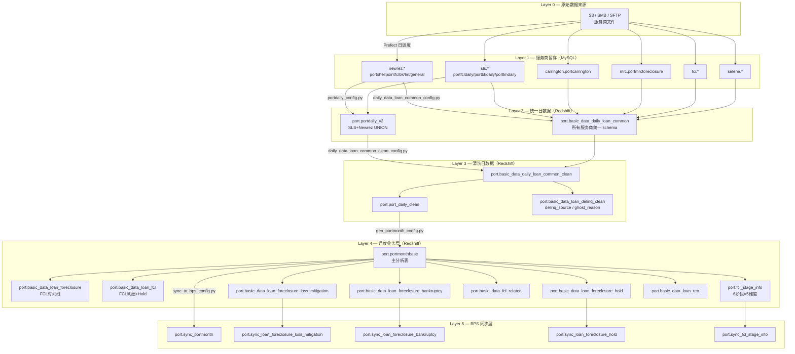
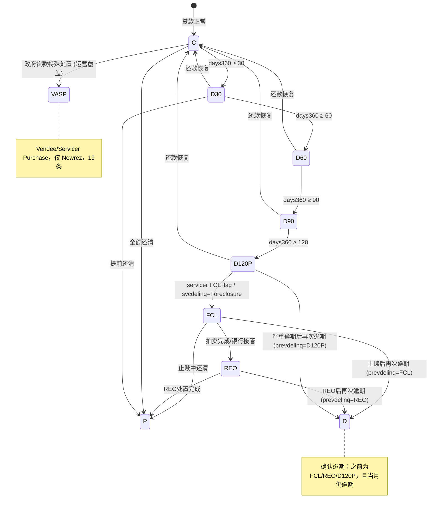
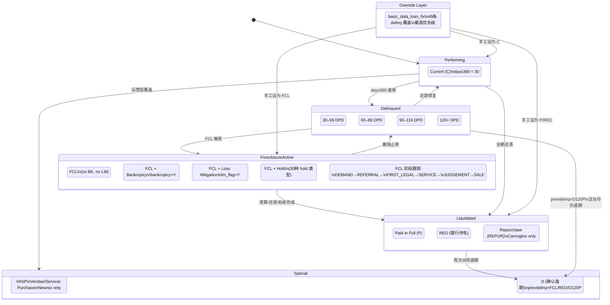
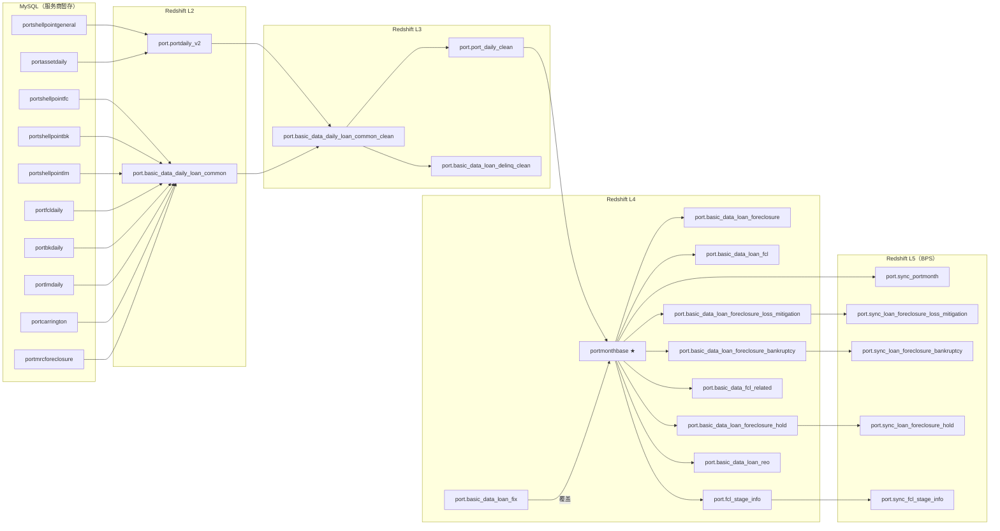
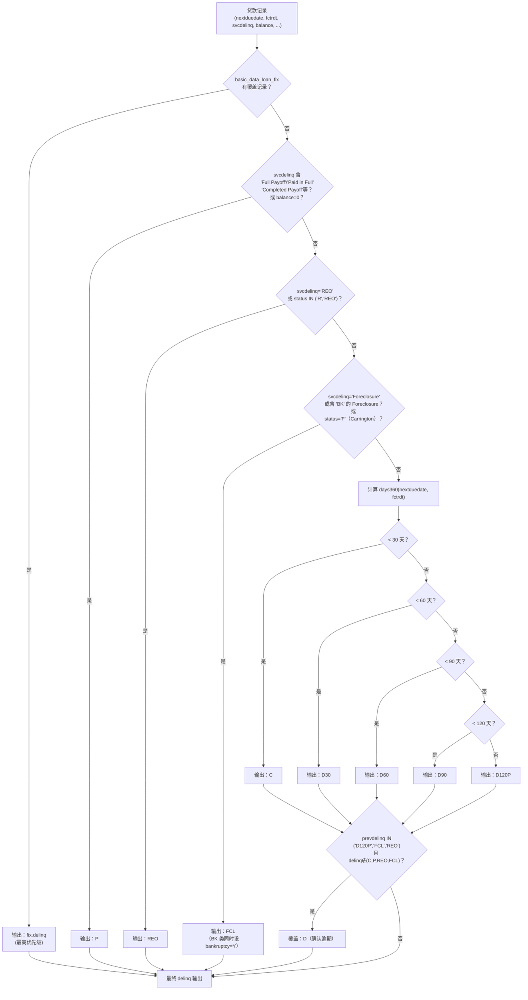
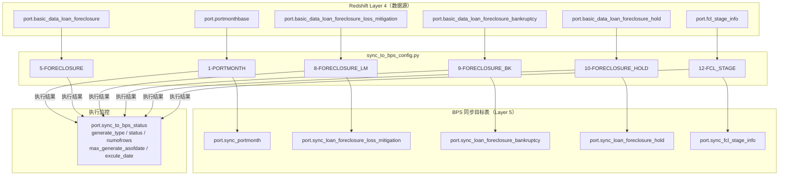

# 06 — 系统图表汇总

---

## 文档信息

| 项目 | 内容 |
|------|------|
| **文档目的** | 以 Mermaid 图表形式直观呈现整个止赎状态处理系统的架构、状态机、数据流向和表依赖关系。 |
| **解决的问题** | 文字描述难以直观展示状态转换路径和表间依赖，本文档通过六类图补充视觉化理解。 |
| **覆盖范围** | 高层数据流、FCL 状态转换（简）、FCL 状态机（详）、表血缘、规则层次、BPS 同步依赖 |
| **系统归属** | 全系统（PrefectFlow ETL pipeline） |

**目标读者：** 所有角色（可视化参考）

**依赖文档：** `02_etl_pipeline.md`（管道结构）、`03_fcl_status_logic.md`（状态逻辑）、`04_status_inventory.md`（状态代码）

**修订历史：**

| 日期 | 作者 | 版本 | 变更内容 |
|------|------|------|---------|
| 2026-05-21 | AI Agent (Claude Sonnet 4.6) | v1 | 初始版本，六类 Mermaid 图 |

---

## 图 1 — 高层数据流（Layer 0 → Layer 5）

---

## 图 2 — FCL 状态转换（简版）

---

## 图 3 — FCL 状态机（详版，含辅助标志）

---

## 图 4 — 表血缘关系（主要 FCL 相关表）

---

## 图 5 — 规则层次（delinq 生成优先级）

---

## 图 6 — BPS 同步依赖关系

---

## 对应英文版

英文版：`docs/en/06_diagrams.md`
