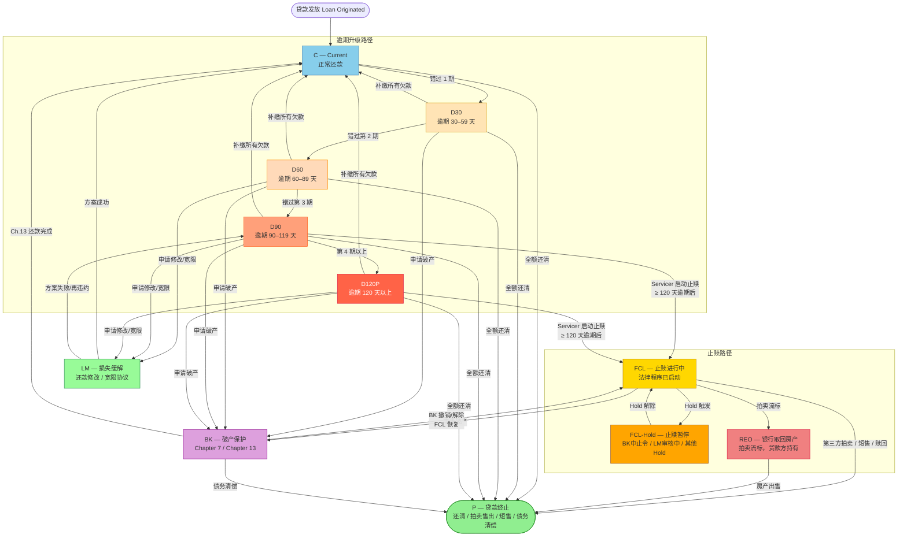
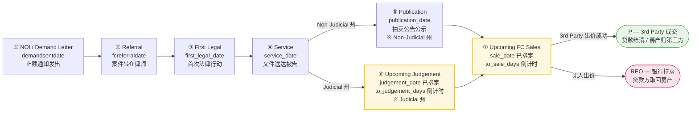

# 07 — FCL 数据血缘与判断规则（per-Servicer 完整分析）

---

## 文档信息

| 项目 | 内容 |
|------|------|
| **文档目的** | 从原始文件（SFTP/S3/API）到最终 `delinq = 'FCL'` 状态，完整记录每个 Servicer 的数据血缘链条和判断规则，揭示当前系统实现的完整性与差距。 |
| **解决的问题** | FCL 判断逻辑分散在多个配置文件中，且各 Servicer 实现程度不一（3个完整实现，5个缺失或不完整），新成员无法快速理解整体现状和风险。 |
| **覆盖范围** | 原始文件摄入 → MySQL Staging → Redshift 归一化 → delinq 标准码输出；覆盖 10 个 Servicer |
| **系统归属** | `PrefectFlow/flow/servicer_data/`、`flow/basic_data/transfer_daily_data_config/`、`flow/basic_data/transfer_daily_data_flow/` |

**目标读者：** 数据产品经理（主要） · 数据工程师 · 业务分析师 · 验证工程师 · 未来 AI session

**依赖文档：**
- `01_source_data.md`：原始 staging 表字段说明
- `02_etl_pipeline.md`：整体 ETL 管道架构
- `03_fcl_status_logic.md`：delinq 状态机完整规则

**修订历史：**

| 日期 | 作者 | 版本 | 变更内容 | 相关 |
|------|------|------|---------|------|
| 2026-05-24 | AI Agent (Claude Sonnet 4.6) | v1 | 初始版本，基于 PrefectFlow 源码逆向分析 | prompt.md |
| 2026-05-24 | AI Agent (Claude Sonnet 4.6) | v1.1 | 2.2 节补充 days360 参数详解、逾期档位表、FCL vs 逾期天数区别说明 | — |
| 2026-05-24 | AI Agent (Claude Sonnet 4.6) | v1.2 | 新增 1.1 节：Servicer 摄入总览表、Excel Sheet 三种入库模式、Delete-then-Insert 策略 | — |
| 2026-05-24 | AI Agent (Claude Sonnet 4.6) | v1.3 | 新增 2.4 节：美国贷款生命周期状态图（11 状态 Mermaid 图）、转换条件详表、FCL 子阶段、司法/非司法止赎差异 | — |
| 2026-05-24 | AI Agent (Claude Sonnet 4.6) | v1.4 | 新增 2.5 节：Foreclosure 深度解析（发起方/6阶段过程/5种结束方式）、Ch.7 Lien 概念、Ch.7 vs Ch.13 对比、FCL+BK 并存状态说明 | — |
| 2026-05-25 | AI Agent (Claude Sonnet 4.6) | v1.5 | 新增 1.2 节：basic_data_loan_fcl vs basic_data_loan_foreclosure 上下游关系、61/62列字段分组详解、INSERT实际填充vs NULL分析、3 Servicer覆盖说明（源码+Redshift实证） | — |
| 2026-05-26 | AI Agent (Claude Sonnet 4.6) | v2 | 新增 Section 2.4.6：BPS FCL 运营阶段管道（含 Mermaid 流程图、7阶段说明、Upcoming 命名逻辑、设计合理性分析、与理论模型对应关系） | — |

---

## 1. 整体数据血缘架构

```
┌─────────────────────────────────────────────────────────────────────────┐
│  Step 0：原始文件（每日/每月）                                            │
│  SFTP 服务器 → S3 Bucket (brigaws)   或   共享盘 (SMB)   或   API        │
│  格式：.txt / .csv / .xlsx / GraphQL                                     │
└──────────────────────────────┬──────────────────────────────────────────┘
                               │  PrefectFlow load_daily_*_flow.py
                               ▼
┌─────────────────────────────────────────────────────────────────────────┐
│  Step 1：MySQL Staging（按 Servicer 独立 Schema）                        │
│  sls.*    newrez.*    carrington.*    selene.*    mrc.*                  │
│  fci.*    rocket.*    arvest.*    capecodfive.*    sps.*                 │
│  关键 FCL 字段在此已存在（原始格式，未标准化）                            │
└──────────────────────────────┬──────────────────────────────────────────┘
                               │  daily_data_loan_common_config.py
                               ▼
┌─────────────────────────────────────────────────────────────────────────┐
│  Step 2：Redshift port.basic_data_daily_loan_common（多 Servicer 合并） │
│  统一字段：delq_status（原始文本），fcl_flag，lm_flag，nextduedate ...   │
│  ✅ SLS / Newrez / Carrington / Selene / MRC 已接入                      │
│  ❌ FCI / Rocket 未接入此表                                               │
└──────────────────────────────┬──────────────────────────────────────────┘
                               │  daily_data_loan_common_clean_config.py
                               ▼
┌─────────────────────────────────────────────────────────────────────────┐
│  Step 3：Redshift port.basic_data_daily_loan_common_clean（标准化）      │
│  核心字段：delinq（标准码：C/D30/D60/D90/D120P/FCL/REO/P/VASP）         │
│  ✅ SLS / Newrez / Carrington / CapeCodFive 有完整 FCL 映射              │
│  🟡 Selene / MRC：daily 数据 NOT IN 此表（完全缺失！）                   │
│  🟡 Arvest：仅 days360 兜底，无 FCL 文本匹配                             │
│  ❌ FCI / Rocket / SPS：无任何 FCL 映射                                  │
└──────────────────────────────┬──────────────────────────────────────────┘
                               │  gen_portmonth_config.py（月度聚合）
                               ▼
┌─────────────────────────────────────────────────────────────────────────┐
│  Step 4：Redshift port.portmonthbase（主分析表）                         │
│  delinq = 'FCL' → 该贷款在报告月处于 Foreclosure 状态                   │
│  同时生成：port.basic_data_loan_foreclosure / fcl / hold / bk / lm 等   │
└─────────────────────────────────────────────────────────────────────────┘
                               │  sync_to_bps_config.py
                               ▼
┌─────────────────────────────────────────────────────────────────────────┐
│  Step 5：BPS 同步（下游报告系统）                                        │
│  5-FORECLOSURE → port.basic_data_loan_foreclosure → BPS                │
└─────────────────────────────────────────────────────────────────────────┘
```

### 1.1 文件摄入机制详解（Step 0 → Step 1）

#### 1.1.1 各 Servicer 摄入总览

每个 Servicer 对应一个独立的 **MySQL Schema（数据库）**，严格一对一。

| Servicer | MySQL Schema | 文件格式 | 传输渠道 | 报告频率 | MySQL 日期键字段 |
|----------|-------------|---------|---------|---------|----------------|
| SLS | `sls` | `.txt`（固定格式） | SFTP → S3 | 日报 + 月报 | `dataasof` |
| Newrez/Shellpoint | `newrez` | `.csv` | SFTP → S3 | 日报 + 月报 | `dataasof` |
| Carrington | `carrington` | `.xlsx` / `.csv` | SFTP → S3 | 日报 + 月报 | `dataasof` |
| Selene | `selene` | `.csv` | SFTP → S3 | 日报 + 月报 | `as_of_date` |
| MRC | `mrc` | `.txt`（管道符分隔） | SFTP → S3 | 日报 + 月报 | `dataasof` |
| FCI | `fci` | `.xlsx`（API 导出） | GraphQL API → S3 | 日报 | `dataasof` |
| Rocket | `rocket` | `.txt`（管道符分隔） | SFTP → S3 | 日报 + 月报 | `dataasof` |
| Arvest | `arvest` | `.xlsx` | SMB 共享盘 | **月报 only** | `fctrdt` |
| CapeCodFive | `capecodfive` | `.xlsx` | SMB 共享盘 | **月报 only** | `fctrdt` |
| SPS | `sps` | `.xlsx` | SMB 共享盘 | **月报 only** | `fctrdt` |

> 配置来源：`flow/basic_data/load_servicer_data_config/servicer_config.py` — 变量 `MYSQL_DB_MAP`

---

#### 1.1.2 Excel Sheet 入库的三种模式

每个 Schema 下会有**多张表**（按文件类型 / 内容拆分）。对于 Excel 格式，各 Servicer 的 Sheet 处理方式分三种：

---

**模式 A：多 Sheet 合并成一张表**（仅 Carrington 日报）

Carrington 日报 Excel 包含两个 Sheet（`DataMain` + `DataARM`），系统通过 `LEFT JOIN` 合并后写入**同一张表**：

```python
# tasks/servicer_data/daily_task.py
df_main = pd.read_excel(file, sheet_name='DataMain')
df_arm  = pd.read_excel(file, sheet_name='DataARM')
df = pd.merge(df_main, df_arm, how='left', on='Loan Number')
# → 合并结果写入 carrington.portcarrington（1张表）
```

| Sheet 名 | 内容 | 合并角色 |
|---------|------|---------|
| `DataMain` | 主贷款字段（`loan_status`, `fcl_flag` 等 FCL 关键字段均在此） | 主表 |
| `DataARM` | ARM（可调利率）附加字段 | LEFT JOIN on `Loan Number` |

Carrington 其他报表（Delinquency / Transactions / Disaster Pipeline）各自只有 1 个 Sheet，分别对应独立表。

---

**模式 B：一个文件一张表，按文件名路由**（SLS / Newrez / Selene / MRC / FCI / Rocket）

文件名中的关键字决定写入哪张 MySQL 表，通过 `FILE_TABLE_MAP` 配置静态路由：

**Selene**（4 种文件 → 4 张表）：

| 文件名关键字 | MySQL 表 | 说明 |
|------------|---------|------|
| `P181` | `selene.portselenebalance` | 余额数据 |
| `P102` | `selene.portselenedetails` | 资产详情 |
| `DailyExtract` | `selene.portselenemain` | 主日报（含 FCL 字段） |
| `PmtTransDaily` | `selene.portselenepmttrans` | 还款交易 |

**MRC**（18 种文件 → 18 张表，部分示例）：

| 文件名关键字 | MySQL 表 | 说明 |
|------------|---------|------|
| `LOAN` | `mrc.portmrcloan` | 主贷款表（含 `min_status`） |
| `FORECLOSURE` | `mrc.portmrcforeclosure` | FCL 专项（含 `fc_flag`） |
| `BANKRUPTCY` | `mrc.portmrcbankruptcy` | 破产数据 |
| `FORBEARANCE` | `mrc.portmrcforbearance` | 宽限数据 |
| `ESCROW` | `mrc.portmrcescrow` | 托管数据 |
| `ARM` | `mrc.portmrcarm` | 可调利率数据 |
| ...（共 18 种） | ... | |

**FCI 特殊情况**（60+ 种报表 → 60+ 张表）：

FCI 通过 GraphQL API 拉取，每种报表为独立的 Excel 文件（单 Sheet），写入各自 MySQL 表：

| 报表名称 | MySQL 表 |
|---------|---------|
| `Loan Portfolio Information` | `fci.portfciloanportfolio` |
| `Loan Details` | `fci.portfciwebloandetails` |
| `Foreclosure` | `fci.portfciwebforeclosure` |
| `Pre-Foreclosure` | `fci.portfciwebpreforclosure` |
| ...（共 60+ 种） | ... |

---

**模式 C：SMB 月报直接写入**（Arvest / CapeCodFive / SPS）

从 SMB 共享盘读取月报 Excel，通常为单 Sheet，直接写入对应表。**无日报流程**，更新频率为每月一次。

---

#### 1.1.3 统一入库策略：Delete-then-Insert

所有 Servicer 统一使用**先删后插**模式，以日期键字段为粒度：

```python
# tasks/servicer_data/daily_task.py — upload_data_to_mysql()
# Step 1: 删除该日期的已有数据
DELETE FROM {table} WHERE {key_column} = '{key_date}'
# Step 2: 追加插入新数据
df.to_sql(table_name, conn, if_exists="append")
```

| 特性 | 说明 |
|------|------|
| **幂等性** | 同一天的文件重跑不会产生重复记录 |
| **自修复** | 发现问题后重新拉取文件重跑即可覆盖，无需手动清理 |
| **历史保留** | 仅删除当天数据，不影响其他日期的历史记录 |

---

## 1.2 Step 4 核心 FCL 表详解：basic_data_loan_fcl vs basic_data_loan_foreclosure

> **摘要**：两表是**上下游关系**，不是并列关系。`basic_data_loan_fcl` 是原始运营数据层，`basic_data_loan_foreclosure` 是在此基础上加工的业务智能层。**只有 Newrez、Carrington、CapeCodFive 3 个 Servicer** 的 FCL 详情进入这两张表，其余 7 个 Servicer 不在范围内。

### 1.2.1 数据流（源码实证）

源码文件：`flow/basic_data/basic_data_config/basic_data_pool_config.py`

```
newrez.portnewrezfc              ─┐
carrington.portcarrington        ─┤  UNION  →  tempfc.temp_basic_data_fcl    (Line 1530)
capecodfive.portcapecodfive_      ─┘               │
  monthly_collections                              │  LEFT JOIN basic_data_loan_foreclosure_hold_detail
                                                   ↓
                             port.basic_data_loan_fcl                         (Line 1657)
                             61列 · 1,836,086行 · 全历史快照（每日追加）
                                                   │
                                                   │  INSERT SELECT + 业务逻辑转换             (Line 149)
                                                   │  仅取各 Servicer 最新日期快照
                                                   ↓
                          port.basic_data_loan_foreclosure
                          62列 · 6,150行 · 仅保留最新快照（DROP + INSERT）
                                                   │
                                       ┌───────────┴──────────┐
                                       ↓                      ↓
                              BPS 外部系统              asset_management MySQL
                         (sync_to_bps_config.py)         （下游报告系统）
```

### 1.2.2 两表结构对比

| 维度 | `port.basic_data_loan_fcl` | `port.basic_data_loan_foreclosure` |
|------|---------------------------|-------------------------------------|
| **定位** | 原始运营数据层 | 业务智能层（加工后） |
| **列数** | 61列 | 62列 |
| **行数** | 1,836,086（全历史） | 6,150（仅最新快照） |
| **更新策略** | 每次追加，保留全历史 | DROP + INSERT，只保留各 Servicer 最新日期 |
| **数据来源** | 3个Servicer原始表 UNION + Hold详情 JOIN | 从 `basic_data_loan_fcl` INSERT SELECT |
| **业务转换** | 无，原样保存 | CASE转换（judicial 0/1→文字）、SLA目标字段定义 |
| **下游消费** | 内部管道（portmonthbase、快照等） | BPS外部系统、asset_management MySQL |
| **Servicer覆盖** | 3个（Newrez / Carrington / CapeCodFive） | 同上 |
| **代码位置** | Line 1657 | Line 149 |

> **行数悬殊的原因**：`basic_data_loan_fcl` 保留每日全量历史（1.8M行），而 `basic_data_loan_foreclosure` 只取各 Servicer 的最新快照日期，所以只有 6,150 行（约等于当前活跃 FCL 贷款数）。

### 1.2.3 port.basic_data_loan_fcl 字段分组（共61列）

**Group 1：基础标识（4列）**

| 字段名 | 含义 | Newrez来源字段 | Carrington来源字段 | CapeCodFive来源字段 |
|--------|------|--------------|-----------------|-----------------|
| `dataasof` | 数据快照日期 | `dataasof` | `snap_shot_date` | `fctrdt - 1天` |
| `loanid` | Bridger贷款ID | `loanid` | `loanid` | `bridger_loan_number` |
| `servicer` | 服务商名称（固定值） | 'Newrez' | 'Carrington' | 'Capecodfive' |
| `svc_loanid` | Servicer自有贷款号 | `shellpointloanid` | `carrington_ln` | `servicer_loan_number` |

**Group 2：FCL 状态（5列）**

| 字段名 | 含义 | 取值示例 | 有数据的Servicer |
|--------|------|---------|----------------|
| `activefcflag` | FCL是否激活（1=是，NULL=否） | 1 / NULL | 全部3个 |
| `fcstage` | FCL当前阶段 | DEMAND / REFERRAL / FIRST_LEGAL / SERVICE / JUDGEMENT / SALE / NULL | Newrez, Carrington（映射自`fcl_sub_status`） |
| `fcresults` | FCL结案原因 | REO / Third Party Sale / Reinstated / NULL | Newrez |
| `fcremovaldesc` | 退出FCL说明 | 'Borrower Reinstated' / NULL | Newrez |
| `fcremovaldate` | 退出FCL日期 | DATE / NULL | Newrez |

**Group 3：阶段时间线（17列）**

| 字段名 | 业务含义 | 有数据的Servicer |
|--------|---------|----------------|
| `noi_date` | 意向通知日 | CapeCodFive |
| `fcsetupdate` | FCL立案日 | Newrez, Carrington, CapeCodFive |
| `referral_start_date` | 转交律师日 | Newrez, Carrington, CapeCodFive |
| `demandsentdate` | 催款函发出日 | Newrez |
| `demandexpirationdate` | 催款函到期日 | Newrez |
| `legal_start_date` | 初次法律行动日 | Newrez, CapeCodFive |
| `service_start_date` | 送达完成日 | Newrez, CapeCodFive |
| `fcjudgment_hearing_scheduled` | 判决听证会计划日 | Newrez |
| `fcjudgment_end_date` | 判决完成日 | Newrez, CapeCodFive |
| `fcscheduled_sale_date` | 计划拍卖日 | Newrez, Carrington, CapeCodFive |
| `fcsale_held_date` | 实际拍卖日 | Newrez, Carrington, CapeCodFive |
| `titleordereddate` | 产权调查委托日 | Newrez |
| `titlereceiveddate` | 产权报告收到日 | Newrez |
| `titlecleardate` | 产权清理完成日 | Newrez |
| `dtdeedrecorded` | 契约登记日 | Newrez |
| `lastfcstepcompleted` | 最近完成阶段名称 | Newrez, CapeCodFive |
| `lastfcstepcompleteddate` | 最近完成阶段日期 | Newrez |

**Group 4：耗时计算（2列）**

| 字段名 | 含义 | 计算逻辑 |
|--------|------|---------|
| `svc_days_infc` | Servicer自报FCL天数 | Newrez直接取 `smsdaysinfc` |
| `daysinfc` | 系统计算FCL天数 | `datediff(day, referral_start_date, dataasof) + 1`（Carrington/CapeCodFive） |

**Group 5：金额（4列）**

| 字段名 | 含义 | 有数据的Servicer |
|--------|------|----------------|
| `fcbidamount` | 止赎竞价金额 | Newrez |
| `fcapprbidprice` | 批准竞价价格 | Newrez |
| `fcsaleamount` | 实际成交金额 | Newrez |
| `fcl3rdpartyproceedsreceiveddate` | 第三方收益到账日 | Newrez |

**Group 6：司法属性（5列）**

| 字段名 | 含义 | 取值 | 有数据的Servicer |
|--------|------|------|----------------|
| `judicial` | 是否司法止赎 | '0'=非司法，'1'=司法，NULL | Newrez |
| `fcfirm` | 承办律师事务所 | 字符串 | Newrez（`fcfirm`），Carrington（`fcl_attorney_name`） |
| `fccontestedflag` | 是否有异议诉讼 | '0' / '1' / NULL | Newrez |
| `jr_sr_lien_flag` | 初级/高级留置权标志 | — | Newrez |
| `activejnrlienfcflag` | 活跃次级留置权标志 | — | Newrez |

**Group 7：Hold 详情（24列，4组各6列）**

来源：LEFT JOIN `port.basic_data_loan_foreclosure_hold_detail`

| 字段命名规律（n = 1 ~ 4） | 业务含义 |
|------------------------|---------|
| `fchold{n}description` | Hold类型名称（如 'Bankruptcy Auto-Stay'） |
| `fchold{n}startdate` | Hold开始日期 |
| `fchold{n}enddate` | Hold结束日期 |
| `fchold{n}projectedenddate` | Hold预计结束日期 |
| `fchold{n}comment` | Hold备注 |
| `holdmodified` / `holdmodified2~4` | Hold记录最后修改时间 |

一笔贷款最多同时有 4 个活跃 Hold，共 24列。

### 1.2.4 port.basic_data_loan_foreclosure 新增字段（vs basic_data_loan_fcl）

`basic_data_loan_foreclosure` 共 62列：4列基础字段来自 `basic_data_loan_fcl`，其余 58列分5类前缀。

> **⚠️ 重要**：INSERT语句（Line 219）仅填充 32列，其余 30列（全部 `target_*`、全部 `variance_*`、部分 `timeline_*`、部分 `bid_approval_*`、部分 `summary_*`）**当前实现中均为 NULL**，是预留的数据扩展槽位。

**timeline_*（19列，INSERT实际填充14列）**

| 字段名 | 来源（basic_data_loan_fcl） | 已填充 |
|-------|----------------------------|--------|
| `timeline_notice_of_intent_date` | `noi_date` | ✅ |
| `timeline_referred_to_foreclosure_date` | `referral_start_date` | ✅ |
| `timeline_title_report_received_date` | `titlereceiveddate` | ✅ |
| `timeline_preliminary_title_cleared_date` | `titlecleardate` | ✅ |
| `timeline_first_legal_date` | `legal_start_date` | ✅ |
| `timeline_service_date` | `service_start_date` | ✅ |
| `timeline_judgement_hearing_set_date` | 计算：最早 hearing 日期（LEFT JOIN） | ✅ |
| `timeline_judgement_date` | `fcjudgment_hearing_scheduled` | ✅ |
| `timeline_sale_date_projected_date` | `fcscheduled_sale_date` | ✅ |
| `timeline_sale_date_set_date` | 计算：最早拍卖设定日（LEFT JOIN） | ✅ |
| `timeline_final_title_cleared_date` | `titlecleardate` | ✅ |
| `timeline_sale_date_held_date` | `fcsale_held_date` | ✅ |
| `timeline_third_party_sold_date_date` | NULL（未来扩展） | ✅（值为NULL） |
| `timeline_third_party_proceeds_received_date` | `fcl3rdpartyproceedsreceiveddate` | ✅ |
| `timeline_notice_of_intent_end_date` | — | ❌ NULL |
| `timeline_approved_for_referral_date` | — | ❌ NULL |
| `timeline_referred_to_attorney_date` | — | ❌ NULL |
| `timeline_publication_date` | — | ❌ NULL |
| `timeline_foreclosure_completed_date` | — | ❌ NULL |

**target_*（15列，全部为 NULL）**

SLA目标天数，INSERT未填充，均为 NULL。字段定义值（COMMENT中标注）：`notice_of_intent`=30天、`first_legal`=120天、`service`=90天、`judgement`=30天、`sale_date_held`=0天等。

**variance_*（4列，全部为 NULL）**

`variance_active_bankruptcy`（当前活跃破产）、`variance_completed_bankruptcy`（已完成破产）、`variance_estimated_hold_days`（预计Hold天数）、`variance_bankruptcies`（历史破产次数）—— 当前未填充。

**bid_approval_*（4列，INSERT填充1列）**

| 字段名 | 已填充 | 来源 |
|--------|--------|------|
| `bid_approval_bid_amount` | ✅ | `fcbidamount` |
| `bid_approval_status` | ❌ NULL | — |
| `bid_approval_sale_date` | ❌ NULL | — |
| `bid_approval_loan_resolution_holods` | ❌ NULL | — |

**summary_*（16列，INSERT填充13列）**

| 字段名 | 业务含义 | 已填充 | 计算逻辑 |
|--------|---------|--------|---------|
| `summary_foreclosure_status` | FCL状态描述 | ✅ | `activefcflag=1` → 'Active Foreclosure'；关闭 → 'Closed Foreclosure:{原因}' |
| `summary_judicial_foreclosure` | 是否司法止赎（0/1） | ✅ | 来自 `judicial` |
| `summary_type` | 司法/非司法文字 | ✅ | `judicial=1` → 'Judicial'；`judicial=0` → 'Non Judicial' |
| `summary_firm` | 律师事务所 | ✅ | 来自 `fcfirm` |
| `summary_foreclosure_bid_amount` | 竞价金额 | ✅ | 来自 `fcbidamount` |
| `summary_srv_fc_bid_amount` | Servicer自报竞价金额 | ✅ | 来自 `fcbidamount` |
| `summary_foreclosure_sale_amount` | 实际成交金额 | ✅ | 来自 `fcsaleamount` |
| `summary_sms_days_in_fcl` | Servicer自报FCL天数 | ✅ | 来自 `svc_days_infc` |
| `summary_days_in_fcl` | 系统计算FCL天数 | ✅ | 来自 `daysinfc` |
| `summary_current_step` | 当前FCL阶段 | ✅ | 来自 `fcstage` |
| `summary_last_step_completed` | 最近完成阶段 | ✅ | 来自 `lastfcstepcompleted` |
| `summary_last_step_completed_date` | 最近完成阶段日期 | ✅ | 来自 `lastfcstepcompleteddate` |
| `summary_contested_litigation` | 是否争议诉讼 | ✅ | 来自 `fccontestedflag` |
| `summary_servicer_number` | 服务商编号 | ❌ NULL | — |
| `summary_completed_foreclosure` | 是否完成止赎标志 | ❌ NULL | — |
| `summary_foreclosure_attorney` | 止赎律师 | ❌ NULL | — |

### 1.2.5 重要限制：只有 3 个 Servicer 有 FCL 详情数据

**Redshift 实测（2026-05-24）：**

| Servicer | `basic_data_loan_fcl` 行数 | 占比 | 说明 |
|----------|--------------------------|------|------|
| Newrez | 1,524,631 | 83.0% | 日报追加，全历史 |
| Carrington | 305,662 | 16.6% | 日报追加，全历史 |
| CapeCodFive | 5,793 | 0.3% | 月报，更新频率低 |
| **合计** | **1,836,086** | 100% | Distinct Loans = 8,656 |

`basic_data_loan_foreclosure`：**6,150 行**（最新快照，Distinct Loans = 6,150）。

**FCL Stage 分布（最新快照）：**

| fcstage | 行数 | 说明 |
|---------|------|------|
| NULL | 5,662 | 已关闭或无阶段信息 |
| JUDGEMENT | 189 | 判决阶段 |
| SERVICE | 146 | 送达阶段 |
| FIRST_LEGAL | 84 | 初次法律行动阶段 |
| SALE | 56 | 拍卖阶段 |
| REFERRAL | 13 | 转交律师阶段 |
| DEMAND | 0 | 催款阶段（当前无活跃） |

**⚠️ 其余 7 个 Servicer（SLS / Selene / MRC / FCI / Rocket / Arvest / SPS）的 FCL 详情不在此范围**，其止赎状态通过 `delinq` 字段推断（见 Section 3），而非通过 FCL 详情追踪。

---

## 2. 美国贷款 Foreclosure 业务入门

### 2.1 为什么需要 Foreclosure 判断？

作为 Asset Manager，我们持有的 MBS（Mortgage-Backed Securities）或贷款池中，每笔贷款的 delinquency 状态直接影响：
- **投资人报告**：BPS 系统展示的 FCL 率、逾期分布
- **IRR 计算**：FCL 贷款的现金流预测与损失估算
- **合规监控**：FCL 时间线是否符合 FNMA/FHLMC 规定（超期处罚）
- **Loss Severity 分析**：FCL 结果（3rd Party Sale / REO）对损失率的影响

### 2.2 FCL 判断的两种依据

| 判断方式 | 说明 | 谁用 |
|---------|------|------|
| **Servicer 直接申报** | Servicer 在日报/月报中明确标注 `status = 'Foreclosure'` | SLS, Newrez, Carrington, CapeCodFive |
| **Days360 逾期天数推断** | `days360(nextduedate, fctrdt) ≥ 30` 则按档位 D30~D120P | 兜底逻辑（所有 Servicer） |

> **重要**：Days360 推断最多只能得到 `D120P`（120天以上逾期），**永远不会产生 `FCL` 状态**。`FCL` 状态必须来自 Servicer 的显式字段。

#### days360(nextduedate, fctrdt) 详解

**参数含义：**

| 参数 | 含义 | 示例 |
|------|------|------|
| `nextduedate` | 借款人**下一次应还款的日期**（即上次还款到期后的下一期） | `2024-03-01`（借款人3月1日应还款） |
| `fctrdt` | **Factor Date**，报告截止日 = as-of date 所在月的下月第一天 | `2024-04-01`（4月报，截止日为4月1日） |

`days360(nextduedate, fctrdt)` 使用 **360天/年惯例**（每月按30天计算）计算两个日期之间的天数差，结果即为该贷款的**逾期天数**。

> 例：`nextduedate = 2024-01-01`，`fctrdt = 2024-04-01` → `days360 = 90` → delinq = `D90`

**逾期档位划分规则：**

| `days360(nextduedate, fctrdt)` 的值 | delinq 状态码 | 含义 |
|-------------------------------------|--------------|------|
| < 30 天 | `C` | Current，正常还款 |
| 30 – 59 天 | `D30` | 逾期 30 天 |
| 60 – 89 天 | `D60` | 逾期 60 天 |
| 90 – 119 天 | `D90` | 逾期 90 天 |
| ≥ 120 天 | `D120P` | 逾期 120 天以上（最高档，无上限） |

**为什么 days360 永远不会产生 `FCL`：**

FCL（止赎）是一个**法律程序状态**，不是逾期严重程度的量化指标。两者完全独立：

- 一笔贷款可能逾期 200 天（D120P），但 Servicer 选择了还款修改方案 → **不进入 FCL**
- 一笔贷款可能仅逾期 60 天（D60），但 Servicer 已提交止赎申请 → **已是 FCL**

因此，days360 只能告知"欠款多久了"，无法告知"是否已启动止赎法律程序"。`FCL` 必须由 Servicer 在报表中**显式标注**才能产生。

### 2.3 Servicer 常见 Foreclosure 相关字段

#### MBA 标准是什么？

**MBA = Mortgage Bankers Association**（美国抵押贷款银行家协会），成立于 1914 年，是美国住宅和商业地产金融行业的全国性权威行业协会，会员包括银行、Servicer、投资机构等 2,000+ 家机构。

MBA 制定了一套**全行业通用的贷款逾期分类标准（MBA Delinquency Classification Standard）**，明确规定了各种逾期和特殊状态如何定义和报告。主要目的是让不同 Servicer、投资人、监管机构之间的数据口径一致、可以互相比较。

**MBA 标准逾期码体系（我们系统使用的）：**

| MBA 标准描述 | 我们系统的 delinq 码 | 含义 |
|------------|------------------|------|
| Current | `C` | 正常还款，无逾期 |
| 30 Days Delinquent | `D30` | 逾期 30–59 天 |
| 60 Days Delinquent | `D60` | 逾期 60–89 天 |
| 90 Days Delinquent | `D90` | 逾期 90–119 天 |
| 120+ Days Delinquent | `D120P` | 逾期 120 天以上 |
| Foreclosure | `FCL` | 止赎进行中 |
| REO | `REO` | 银行取回房产 |
| Paid Off / Full Payoff | `P` | 贷款已结清 |

**为什么 Servicer 的字段叫 `delinquency_status_mba`？**

表示该字段的取值遵循 MBA 定义的标准分类词汇（如"Foreclosure"、"REO"、"Current"）。相比之下，有些 Servicer（如 Carrington）使用自己定义的术语（如"R"代表 REO、"Completed Payoff"代表结清），这些非标准字段不带 `_mba` 后缀。

> **对数据工程的影响**：`_mba` 字段取值相对规范，映射到 delinq 标准码较直接；非 `_mba` 字段则需要 Servicer 专项的映射规则（见 Section 3 各 Servicer 部分）。

**Servicer 常见 FCL 相关字段类型：**

| 字段类型 | 示例字段名 | 含义 |
|---------|-----------|------|
| 状态文本（MBA 标准） | `delinquency_status_mba`（Newrez）, `delq_status_mba`（SLS） | 遵循 MBA 分类词汇的逾期/FCL 状态描述 |
| 状态文本（Servicer 自定义） | `loan_status`（Carrington）, `min_status`（MRC） | 各 Servicer 自己定义的状态描述，需专项映射 |
| 激活标志 | `fcl_flag`, `fc_flag`, `foreclosure_status_code` | FCL 是否激活（Y/N/Active/状态码） |
| 时间线日期 | `referral_date`, `first_legal_date`, `sale_date` | FCL 各里程碑节点日期 |
| Hold 原因 | `fchold1description~fchold4description` | 暂停原因（最多4级） |

---

### 2.4 美国贷款生命周期状态图

#### 2.4.1 完整生命周期流程图



#### 2.4.2 状态说明与系统 delinq 码对应

| 状态 | 系统 delinq 码 | 产生方式 | 备注 |
|------|-------------|---------|------|
| Current | `C` | `days360 < 30` | 正常还款 |
| D30 | `D30` | `30 ≤ days360 < 60` | 逾期 1 期 |
| D60 | `D60` | `60 ≤ days360 < 90` | 逾期 2 期 |
| D90 | `D90` | `90 ≤ days360 < 120` | 逾期 3 期 |
| D120P | `D120P` | `days360 ≥ 120` | 最高档，不再细分 |
| LM | — | 不产生独立 delinq | `lm_flag = 'Y'`，delinq 仍按逾期天数 |
| BK | — | 不产生独立 delinq | `bankruptcy = 'Y'`，delinq 仍保持原值 |
| FCL | `FCL` | Servicer 显式申报 | **days360 永远不能产生 FCL** |
| FCL-Hold | `FCL` | Hold 不改变 delinq 值 | hold 信息存于 `fchold1~4description` |
| REO | `REO` | Servicer 申报 | 拍卖后银行持有产权 |
| P | `P` | Servicer 申报终止 | 贷款从组合中退出 |

#### 2.4.3 关键转换条件详表

| 转换 | 触发条件 | 典型时点 |
|------|---------|---------|
| C → D30 | 借款人错过 1 期还款 | 逾期第 1 天 |
| D30 → D60 | 未补缴，错过第 2 期 | 逾期第 31 天 |
| D60 → D90 | 未补缴，错过第 3 期 | 逾期第 61 天 |
| D90 → D120P | 未补缴，第 4 期以上 | 逾期第 91 天起 |
| Dx → C | 借款人补缴所有欠款（再续） | 随时 |
| Dx → LM | Servicer 批准宽限 / 还款修改申请 | 通常 60–90 天时 |
| LM → C | 修改方案试用成功（通常 3 期不违约） | 试用期后 |
| LM → D90 | 方案失败 / 再次违约 | — |
| D90/D120P → FCL | Servicer 提交止赎申请（CFPB 规定：≥ 120 天逾期 + 完成 LM 告知义务后方可启动） | 逾期 120 天后 |
| FCL → FCL-Hold | Hold 触发：BK 自动中止令 / LM 审核中 / 军人保护法（SCRA）/ 法律挑战 | 止赎期间随时 |
| FCL-Hold → FCL | Hold 消除：BK 解除 / LM 被拒 / 法院裁决 | — |
| FCL → REO | 止赎拍卖流标，银行以底价取得产权 | 拍卖日 |
| FCL → P | 第三方拍卖成功；或借款人完成短售 | 拍卖日 / 短售交割日 |
| FCL → C | 借款人还清全部欠款赎回（Redemption，极少见） | 拍卖前任意时点 |
| REO → P | 银行将 REO 房产出售 | 取得产权后数月 |
| 任意 → P | 自愿全额还清 / 提前还款 | 随时 |
| Dx / FCL → BK | 借款人申请破产保护 | 随时 |
| BK → FCL | 破产撤销 / 解除，止赎程序恢复 | BK 结案后 |
| BK → C | Ch.13 还款计划顺利完成 | 3–5 年后 |
| BK → P | Ch.7 债务清偿，或 Ch.13 完成后清偿 | — |

#### 2.4.4 FCL 内部子阶段

处于 `delinq = 'FCL'` 的贷款，系统在 `port.basic_data_loan_fcl` 表中跟踪 6 个内部里程碑：

```
DEMAND → REFERRAL → FIRST_LEGAL → SERVICE → JUDGEMENT → SALE
需求通知   正式转介     首次法律行动    文件送达     法院裁决      拍卖出售
```

这 6 个阶段的日期字段（`referral_date`, `first_legal_date`, `sale_date` 等）是分析 FCL 时长合规性（FNMA/FHLMC 超期处罚规定）的数据基础。

#### 2.4.5 各州司法 vs 非司法止赎差异

美国止赎法律分两类，直接影响 FCL 的持续时长和系统记录的时间跨度：

| 维度 | 司法止赎（Judicial Foreclosure） | 非司法止赎（Non-Judicial / Power of Sale） |
|------|--------------------------------|------------------------------------------|
| 流程 | 须经法院起诉 → 裁决 → 拍卖，借款人有权答辩 | 依据合同中"权力出售条款"直接拍卖，无需法院 |
| 典型时长 | **12 个月 ~ 3 年** | **2 ~ 6 个月** |
| 借款人赎回权 | 多数州有法定赎回期（拍卖后仍可赎回） | 通常无赎回期，拍卖后产权立即转移 |
| 系统影响 | `FIRST_LEGAL → JUDGEMENT` 阶段跨度长，FCL-Hold 频率更高 | SALE 日期到来快，FCL 记录生命周期短 |

**主要州分类：**

| 类型 | 代表州 | 典型 FCL 时长 |
|------|--------|-------------|
| 司法止赎 | Florida, New York, New Jersey, Illinois, Ohio, Pennsylvania | 12–36 个月 |
| 非司法止赎 | California, Texas, Georgia, Arizona, Nevada, Michigan | 2–5 个月 |
| 两种均适用 | Massachusetts, Connecticut | 视选择路径而定 |

> **对产品经理的含义**：同样是 `delinq = 'FCL'` 的贷款，纽约的贷款可能已持续 2 年，加州的只有 3 个月。分析 FCL 存量、Loss Severity 或合规超期时，**必须按州区分**。`port.basic_data_loan_fcl` 的 `referral_date` 和 `sale_date` 字段是计算这一差异的数据基础。

#### 2.4.6 BPS FCL 运营阶段管道

上文 2.4.4 介绍了系统内部跟踪的 6 个 FCL 里程碑（理论模型）。本节说明 BPS 报告系统如何将这一理论模型落地为 **7 个运营监控阶段**，以及设计背后的逻辑。

> 本节聚焦 BPS agg-summary 页面的 FCL 阶段划分，与上方【2.4.1 完整生命周期流程图】互为补充：2.4.1 展示全局状态扭转（含 D30~D120P、LM、BK 等所有状态），本节仅聚焦 FCL 内部分段。

**阶段流程图**



**阶段说明**

| # | BPS 阶段 | 监控口径 | 适用类型 | 核心字段 | 说明 |
|---|---------|---------|---------|---------|-----|
| 1 | **NOI / Demand Letter** | 已完成 | 通用 | `demand_date`, `noi_date` | 止赎正式启动前的法律通知。Judicial 州称 NOI（Notice of Intent）；Non-Judicial 州称 Demand Letter。Newrez 原始字段：`demandsentdate` |
| 2 | **Referral** | 已完成 | 通用 | `referral_date` | 案件移交止赎律师。`fcreferraldate` 非空是 BPS 收录的入库条件，同时是 FCL 时间线计算起点 |
| 3 | **First Legal** | 已完成 | 通用 | `first_legal_date` | 第一次正式法律行动：Judicial 州 = 向法院提交起诉状；Non-Judicial 州 = 首次公告。法律时钟开始计时 |
| 4 | **Service** | 已完成 | 通用 | `service_date` | 法律文件送达借款人及相关被告。多被告案件可显著延长此阶段 |
| 5 | **Publication** | 已完成 | Non-Judicial 为主 | `publication_date` | Non-Judicial 州专属：拍卖公告公示（通常在拍卖日前 21–30 天）。Judicial 州此阶段通常为 0 |
| 6 | **Upcoming Judgement** | **待发生** | Judicial 州 | `judgement_date`, `to_judgement_days` | 法院审判日期已排定但尚未到来。`to_judgement_days`（倒计时天数）是该阶段核心指标 |
| 7 | **Upcoming FC Sales** | **待发生** | 通用 | `sale_date`, `to_sale_days` | 拍卖日期已排定但尚未完成。`to_sale_days`（倒计时天数）是核心指标。拍卖完成后贷款退出 FCL（→ P 或 REO） |

**"Upcoming" 命名逻辑**

阶段 1–5 以"最近完成的事件"命名（事件已发生，贷款处于等待下一步的状态）。阶段 6–7 采用"Upcoming"前缀，原因如下：

1. **有明确排期日期**：贷款进入"Upcoming Judgement"阶段时，法院已排定具体庭审日期；进入"Upcoming FC Sales"时，拍卖日期已确定。两者都是已知的未来事件。

2. **字段证据**：`to_judgement_days`（倒计时至判决日）和 `to_sale_days`（倒计时至拍卖日）是**倒计时字段**（未来日期 − 今日）。这两个字段仅在事件未发生时有意义，其存在本身即证明该阶段描述的是**尚未发生的事**。

3. **事件发生后无需"已完成"监控组**：
   - 判决完成后（Judicial 州）：贷款立即进入拍卖排期 → 流转到"Upcoming FC Sales"
   - 拍卖完成后：贷款退出 FCL（→ P 或 REO），不再需要 FCL 监控
   - 因此没有设立"Judgement（已完成）"或"FC Sales（已完成）"监控组的必要

4. **消除歧义**：若使用"Judgement"（无前缀），含义模糊——可能是"等待判决"，也可能是"判决已完成"。"Upcoming"前缀明确表达"日期已排定、事件尚未发生"，运营人员一目了然。

**设计合理性分析**

BPS 7 阶段管道设计合理，体现了以下工程考量：

1. **完整覆盖**：覆盖 FCL 生命周期内所有有意义的监控窗口，无跨度过大的空白区间。

2. **Publication 阶段必要**：Non-Judicial 州（加州、得州、佐治亚州等）占美国 FCL 量的多数。若无 Publication 阶段，Service 之后、拍卖之前将有数周至数月的监控盲区。

3. **无需"已完成"尾组**：贷款在拍卖后退出 FCL，不存在需要持续监控的"已完成拍卖"状态。管道以"Upcoming FC Sales"收尾，设计上自洽。

4. **运营导向命名**：阶段以"下一个待处理事件"命名，运营团队打开看板即知每笔贷款的当前等待项，无需额外解码。

**与 2.4.4 理论模型的对应关系**

| 2.4.4 模型阶段 | BPS 管道阶段 | 变化说明 |
|--------------|------------|---------|
| DEMAND | ① NOI / Demand Letter | 命名改为业务术语（NOI / Demand Letter），含义不变 |
| REFERRAL | ② Referral | 一致 |
| FIRST_LEGAL | ③ First Legal | 一致 |
| SERVICE | ④ Service | 一致 |
| *（理论模型无此阶段）* | ⑤ Publication | **BPS 新增**：覆盖 Non-Judicial 州拍卖公告期 |
| JUDGEMENT | ⑥ Upcoming Judgement | 语义转变：由"已完成的判决阶段"改为"已排期、等待发生的判决" |
| SALE | ⑦ Upcoming FC Sales | 语义转变：由"已完成的拍卖阶段"改为"已排期、等待发生的拍卖" |

---

### 2.5 Foreclosure 与 Bankruptcy 深度解析

#### 2.5.1 什么是 Foreclosure（止赎）？

**定义**：Foreclosure 是贷款方依据抵押合同，在借款人持续违约后，通过法律程序**强制出售抵押房产**以收回欠款的过程。

**谁发起**：**贷款方（或其代理 Servicer）**，不是借款人。在我们公司的背景下：
- 我们公司（Asset Manager）持有 MBS 或贷款池中的投资份额，是真正的贷款方
- Servicer（SLS、Newrez、Carrington 等）是我们的代理人，负责日常管理贷款、收款，并在必要时代表我们发起止赎
- 因此"Servicer 申请 FCL"实质上是在代表我们这样的投资人保护权益

**为何发起**：
- 借款人持续不还款（通常 ≥ 120 天逾期，且 CFPB 规定完成 LM 告知义务后方可启动）
- 损失缓解方案（宽限、还款修改）均已失败或借款人拒绝配合
- 贷款方需要通过变现房产收回本金，降低投资损失

---

#### 2.5.2 Foreclosure 的完整过程（6 个阶段）

与系统 `port.basic_data_loan_fcl` 跟踪的 6 个里程碑一一对应：

| 阶段 | 系统字段 | 说明 |
|------|---------|------|
| **1. 需求通知 (DEMAND)** | `demand_date` | 贷款方向借款人发出正式违约通知函，要求还款或采取措施 |
| **2. 正式转介 (REFERRAL)** | `referral_date` | Servicer 将案件移交止赎律师，正式进入法律程序 |
| **3. 首次法律行动 (FIRST_LEGAL)** | `first_legal_date` | 司法州：向法院提起诉讼；非司法州：发布违约通知（Notice of Default） |
| **4. 文件送达 (SERVICE)** | `service_date` | 起诉文件正式送达借款人，法定期限开始计算 |
| **5. 法院裁决 (JUDGEMENT)** | `judgement_date` | 法院裁决贷款方胜诉，获准出售房产（仅司法州有此阶段） |
| **6. 拍卖出售 (SALE)** | `sale_date` | 房产公开拍卖，最高出价者获得产权 |

---

#### 2.5.3 Foreclosure 如何结束（5 种出口）

| 结束方式 | 说明 | delinq 变化 | 谁主导 |
|---------|------|------------|--------|
| **第三方拍卖 (3rd Party Sale)** | 拍卖有买家出价高于底价，成交 | FCL → `P` | 市场竞价 |
| **REO（银行取回）** | 拍卖无人出价，贷款方以底价取得房产产权 | FCL → `REO` | 贷款方 |
| **赎回 (Reinstatement)** | 借款人在拍卖前一次性还清所有欠款及滞纳金费用 | FCL → `C` | 借款人 |
| **短售 (Short Sale)** | 借款人以低于贷款余额的价格出售房产，贷款方书面同意豁免差额 | FCL → `P` | 借款人 + 贷款方 |
| **以房抵债 (Deed in Lieu)** | 借款人主动将房产产权转让给贷款方，双方协议终止贷款 | FCL → `P` | 借款人 + 贷款方 |

> **REO 之后**：贷款方取得房产后，会以独立资产运营（挂牌出售、修缮等），出售后 delinq → `P`，贷款从组合中退出。

---

#### 2.5.4 破产保护（Bankruptcy）深度解析

##### 谁发起，为何发起

**发起方**：**借款人（房主）**，是借款人主动申请，不是贷款方。

**目的**：
- 立即触发**"自动中止令（Automatic Stay，11 U.S.C. § 362）"**，联邦法律强制要求停止所有催收行为，包括止赎
- 为自己争取时间重组财务，避免立即失去房产
- Chapter 13：通过制定还款计划来补缴欠款，最终保住房子

---

##### Chapter 7 / Chapter 13 是什么？

这两个名称来自美国联邦破产法典 **US Bankruptcy Code**（正式名称：美国法典第 11 编，Title 11 of the United States Code）。该法典按**章（Chapter）**组织不同类型的破产程序，Chapter 编号即对应章节号：

| 章节 | 适用对象 | 类型 |
|------|---------|------|
| **Chapter 7** | 个人 / 企业均可 | **清算型**：变卖资产偿债，剩余债务豁免 |
| **Chapter 11** | 主要是企业 | **企业重组**：继续运营并制定债务重组计划（常见于大公司破产保护） |
| **Chapter 13** | 有固定收入的个人 | **个人重组**：制定 3–5 年还款计划逐步清偿，可保留房产 |

在抵押贷款语境中，我们只关注 **Chapter 7** 和 **Chapter 13**。"Filed Chapter 7 / Chapter 13" 已成为美国日常法律用语，直接用章节号代指整个破产程序类型。

##### Chapter 7 vs Chapter 13 对比

| 维度 | Chapter 7（清算型） | Chapter 13（重组型） |
|------|-------------------|-------------------|
| 俗称 | 个人破产清算 | 工薪族破产 / 重组型破产 |
| 核心机制 | 清除个人债务（Debt Discharge） | 制定 3–5 年还款计划，逐步补缴欠款 |
| 房子能保住吗 | **通常不能**（除非主动继续还款，贷款方同意） | **通常能**（还款计划顺利完成后） |
| 持续时间 | 3–6 个月 | 3–5 年 |
| FCL 结果 | 自动中止令暂停 FCL；BK 结束后贷款方通常恢复止赎 | 自动中止令暂停 FCL；还款计划成功完成后 FCL 撤销，delinq → `C` |

---

##### Ch.7 中"Lien 不随债务清除而消失"是什么意思？

这是美国破产法中最容易被误解的概念。**关键在于：一笔抵押贷款包含两种法律权利，破产只能清除其中一种。**

```
抵押贷款 = 两层结构

Layer 1：个人还款责任（Personal Liability）
  ─ 含义：借款人欠贷款方钱，贷款方可以起诉借款人本人追偿
  ─ Ch.7 破产可以清除这一层 ✅（借款人不再对欠款金额承担个人法律责任）

Layer 2：房产抵押权（Mortgage Lien）
  ─ 含义：贷款方对房产本身享有安全担保权益（Security Interest）
  ─ Ch.7 破产无法清除这一层 ❌（Lien 依附于房产，不依附于人）
```

**通俗比喻**：

你向银行借了 30 万买了一套房，房子作为抵押物。之后你申请了 Ch.7 破产：
- 法院说：你不需要再还这 30 万了（个人还款责任消除）✅
- 但是：银行在这套房子上的抵押权依然存在 ❌
- 结果：如果你继续住在这套房子里但不还款，银行仍然可以申请止赎、拍卖这套房产——只是**拍卖后的差额（Deficiency）不能再向你个人追偿**

**"贷款结清了，不是应该能解押吗？"**

这是一个好问题。关键在于 Ch.7 **并没有真正还清贷款**：
- "结清"债务 = 借款人还清了所有欠款 → 这时银行才会解除抵押权，房产解押
- "破产清除债务" = 法律豁免借款人的个人还款责任，但银行实际上**并没有收到钱** → 抵押权不消失

**实际影响对比**：

| 情景 | 房贷余额 | 拍卖成交价 | 差额（Deficiency） | 贷款方能向借款人追偿差额吗？ |
|------|---------|-----------|------------------|--------------------------|
| 无 BK | $300,000 | $250,000 | $50,000 | ✅ 可追偿（视州法律，部分州禁止） |
| Ch.7 破产后 | $300,000 | $250,000 | $50,000 | ❌ 不可追偿（个人债务已清除） |

**结论**：Ch.7 保护了借款人的"人"（不再被追债），但没有保护借款人的"房产"（房子还是可能被拍卖）。

---

##### FCL + BK 并存时系统如何表达

FCL 期间借款人申请破产，系统的表达方式：

| 系统字段 | 值 | 说明 |
|---------|---|------|
| `delinq` | `FCL`（保持不变） | 止赎状态不因 BK 退回到 D120P，FCL 仍在 |
| `bankruptcy` | `Y` | 标注借款人处于破产保护状态 |
| `fchold1description` | `Bankruptcy` / `BK Auto-Stay` 等 | Hold 原因：破产自动中止令 |

这解释了为什么 Newrez 的原始状态描述中有以下两种组合（见 Section 3.2）：

| Newrez 原始 delq_status | 含义 | 系统 delinq |
|------------------------|------|------------|
| `Foreclosure / Non-Perf BK` | 止赎中 + 借款人破产但**未按** Ch.13 还款计划执行 | `FCL` |
| `Foreclosure / Perf BK` | 止赎中 + 借款人破产且**正在按** Ch.13 还款计划执行 | `FCL` |

两者 delinq 均为 `FCL`，区别在于 BK 的履约状态，影响 Hold 的预期持续时间和最终走向。

---

## 3. Per-Servicer 数据血缘与判断规则

### 3.1 SLS ✅ 完整实现

#### 3.1.1 文件来源
| 属性 | 值 |
|------|-----|
| 传输方式 | SFTP → S3 (`s3://brigaws/sls_raccoon/`) |
| 文件格式 | `.txt`（固定格式或分隔符） |
| 文件命名 | `Asset_Oversight_Daily.txt`, `FCL_Daily.txt` 等（16种文件类型） |
| 频率 | 每日 |
| 摄入 Flow | `flow/servicer_data/load_daily_sls_flow.py` |

#### 3.1.2 FCL 相关 Staging 表
| MySQL 表 | 说明 |
|---------|------|
| `sls.portassetdaily` | 主日报表，含 `delq_status_mba`（MBA 标准逾期码） |
| `sls.portfcldaily` | FCL 专项表（法律时间线，23个里程碑日期） |
| `sls.portbkdaily` | 破产数据 |
| `sls.portlmdaily` | Loss Mitigation 数据 |

#### 3.1.3 数据血缘（Step 2：归一化到 basic_data_daily_loan_common）

```
sls.portassetdaily.delq_status_mba  → basic_data_daily_loan_common.delq_status
sls.portassetdaily.forbearance_flag → basic_data_daily_loan_common.forbearance
（fcl_flag 映射为 null，SLS 不提供此字段）
```

#### 3.1.4 FCL 判断规则（Step 3：delinq 标准码）

**源码文件**：`flow/basic_data/transfer_daily_data_config/daily_data_loan_common_clean_config.py` 第 180–191 行

> **表别名说明**：`s` = `port.basic_data_daily_loan_common`（`WHERE servicer = 'SLS'` 子查询的别名，源码第 319–321 行）

```sql
-- 变量 GEN_BASIC_DATA_DAILY_LOAN_COMMON_CLEAN_SLS
-- s = port.basic_data_daily_loan_common WHERE servicer='SLS'（源码第 319–321 行）
CASE
  WHEN s.delq_status = 'Foreclosure'  THEN 'FCL'
  WHEN s.delq_status = 'Paid in Full' THEN 'P'
  WHEN s.delq_status = 'REO'          THEN 'REO'
  ELSE
    CASE
      WHEN days360(s.nextduedate, fctrdt_) < 30  THEN 'C'
      WHEN days360(s.nextduedate, fctrdt_) < 60  THEN 'D30'
      WHEN days360(s.nextduedate, fctrdt_) < 90  THEN 'D60'
      WHEN days360(s.nextduedate, fctrdt_) < 120 THEN 'D90'
      ELSE 'D120P'
    END
END AS delinq
```

**破产判断**：`CASE WHEN s.delq_status = 'Bankruptcy' THEN 'Y' ELSE 'N' END`

#### 3.1.5 已知问题
- `fcl_flag` 字段在 SLS 路径中为 `null`，FCL 判断完全依赖 `delq_status_mba` 文本
- SLS → Newrez 切换日期：`2024-07-05`（该日期后 SLS 数据停止更新）

---

### 3.2 Newrez / Shellpoint ✅ 完整实现

#### 3.2.1 文件来源
| 属性 | 值 |
|------|-----|
| 传输方式 | SFTP → S3 (`s3://brigaws/shellpoint_new/`) |
| 文件格式 | `.csv` |
| 主要文件 | `Foreclosure.csv`, `General.csv`, `Bankruptcy.csv` 等（20+种） |
| 频率 | 每日 |
| 摄入 Flow | `flow/servicer_data/load_daily_shellpoint_flow.py` |

#### 3.2.2 FCL 相关 Staging 表
| MySQL 表 | 说明 |
|---------|------|
| `newrez.portnewrezgeneral` | 主表，含 `delinquency_status_mba`（MBA 标准逾期码） |
| `newrez.portnewrezfc` | FCL 专项（`portshellpointfc` 迁移后改名） |
| `newrez.portnewrezbk` | 破产数据 |
| `newrez.portnewrezlm` | Loss Mitigation，含 `activelmflag` |

#### 3.2.3 数据血缘（Step 2）

```
newrez.portnewrezgeneral.delinquency_status_mba → basic_data_daily_loan_common.delq_status
newrez.portnewrezlm.activelmflag ('1' → 'Y')     → basic_data_daily_loan_common.lm_flag
（fcl_flag 映射为 null，Newrez 日报中不提供此字段）
```


-- newrez.portnewrezgeneral.delinquency_status_mba 统计信息：

**SELECT**

​    delinquency_status_mba,

​    **COUNT**(*) **AS** *cnt*

**FROM** newrez.portnewrezgeneral

**GROUP** **BY** delinquency_status_mba

**ORDER** **BY** *cnt* **DESC**;

--  执行结果：

delinquency_status_mba    cnt

Current	1067425
1-29 DPD	250529
Full Payoff	146395
30-59 DPD	21317
Foreclosure	12387
60-89 DPD	8090
180+ DPD	3938
90-119 DPD	3833
Performing Bankruptcy	2823
120-149 DPD	2251
Non-Performing Bankruptcy	1679
150-179 DPD	1308
Service Release	754
REO	694
Foreclosure / Non-Perf BK	498
Foreclosure / Perf BK	343
REO Sale	227
3rd Party Sale	130


#### 3.2.4 FCL 判断规则（Step 3）

**源码文件**：`daily_data_loan_common_clean_config.py` 第 355–366 行

> **表别名说明**：`p` = `port.basic_data_daily_loan_common`（`WHERE servicer = 'Newrez'` 子查询的别名，源码第 481–483 行）

```sql
-- 变量 GEN_BASIC_DATA_DAILY_LOAN_COMMON_CLEAN_NEWREZ
-- p = port.basic_data_daily_loan_common WHERE servicer='Newrez'（源码第 481–483 行）
CASE
  WHEN p.delq_status = 'Full Payoff'                         THEN 'P'
  WHEN p.delq_status = 'REO'                                 THEN 'REO'
  WHEN p.delq_status IN (
    'Foreclosure',
    'Foreclosure / Non-Perf BK',
    'Foreclosure / Perf BK'
  )                                                          THEN 'FCL'
  ELSE
    CASE
      WHEN days360(p.nextduedate, fctrdt_) < 30  THEN 'C'
      WHEN days360(p.nextduedate, fctrdt_) < 60  THEN 'D30'
      WHEN days360(p.nextduedate, fctrdt_) < 90  THEN 'D60'
      WHEN days360(p.nextduedate, fctrdt_) < 120 THEN 'D90'
      ELSE 'D120P'
    END
END AS delinq
```

**破产判断**：`CASE WHEN p.delq_status LIKE '%Bankruptcy%' THEN 'Y' ELSE 'N' END`

**特殊情况**：特定 deal（VASP deal）贷款强制标为 `delinq = 'VASP'`（源码第 493–640 行）

---

### 3.3 Carrington ✅ 完整实现（双字段校验）

#### 3.3.1 文件来源
| 属性 | 值 |
|------|-----|
| 传输方式 | SFTP → S3 (`s3://brigaws/carrington_new/`) |
| 文件格式 | `.xlsx` 或 `.csv`（双格式支持） |
| 主要文件 | Daily 主报 + Bi-Weekly Delinquency + Transactions 文件 |
| 频率 | 每日（主报）+ 双周（逾期报）|
| 摄入 Flow | `flow/servicer_data/load_daily_carrington_flow.py` |

#### 3.3.2 FCL 相关 Staging 表
| MySQL 表 | 说明 |
|---------|------|
| `carrington.portcarrington` | 综合日报（含 `loan_status` + `fcl_flag`，**两个字段都有 FCL 信息**） |
| `carrington.portcarringtondelinq` | 逾期专项报 |
| `carrington.portcarringtonfcl` | FCL 专项（另一张表） |

#### 3.3.3 数据血缘（Step 2）

```
carrington.portcarrington.loan_status  → basic_data_daily_loan_common.delq_status
carrington.portcarrington.fcl_flag     → basic_data_daily_loan_common.fcl_flag
carrington.portcarrington.lm_flag ('Active' → 'Y') → basic_data_daily_loan_common.lm_flag
```

#### 3.3.4 FCL 判断规则（Step 3）

**源码文件**：`daily_data_loan_common_clean_config.py` 第 670–681 行

> **表别名说明**：`c` = `port.basic_data_daily_loan_common`（`WHERE servicer = 'Carrington'` 子查询的别名）

```sql
-- 变量 GEN_BASIC_DATA_DAILY_LOAN_COMMON_CLEAN_CARRINGTON
-- c = port.basic_data_daily_loan_common WHERE servicer='Carrington'
-- ★ Carrington 是唯一同时检查 delq_status 和 fcl_flag 的 Servicer
CASE
  WHEN c.delq_status = 'Foreclosure' OR c.fcl_flag = 'Active'           THEN 'FCL'
  WHEN c.delq_status IN ('R', 'REO')                                     THEN 'REO'
  WHEN c.delq_status IN (
    'Completed Payoff', 'Completed Short Sale', 'Completed REO Sale'
  )                                                                      THEN 'P'
  ELSE
    CASE
      WHEN days360(c.nextduedate, fctrdt_) < 30  THEN 'C'
      WHEN days360(c.nextduedate, fctrdt_) < 60  THEN 'D30'
      WHEN days360(c.nextduedate, fctrdt_) < 90  THEN 'D60'
      WHEN days360(c.nextduedate, fctrdt_) < 120 THEN 'D90'
      ELSE 'D120P'
    END
END AS delinq
```

**破产判断**：`CASE WHEN c.delq_status = 'Bankruptcy - Performing' THEN 'Y' ELSE 'N' END`

> **设计亮点**：`OR c.fcl_flag = 'Active'` 提供了双重保障——即使 `loan_status` 没有明确写 'Foreclosure'，只要 FCL 标志为 Active 也会被识别，**这是其他 Servicer 缺失的保护机制**。

---

### 3.4 Selene 🟡 字段已采集，但 delinq 映射缺失

#### 3.4.1 文件来源
| 属性 | 值 |
|------|-----|
| 传输方式 | SFTP → S3 (`s3://brigaws/selene_new/`) |
| 文件格式 | `.csv` |
| 主要文件 | `P181`（主数据）, `P102`（资产数据）, `DailyExtract`, `PmtTransDaily` |
| 频率 | 每日（约 08:00 ET） |
| 摄入 Flow | `flow/servicer_data/load_daily_selene_flow.py` |

#### 3.4.2 FCL 相关 Staging 表
| MySQL 表 | 说明 |
|---------|------|
| `selene.portselenemain` | 主日报，含 `loan_status`（逾期状态）+ `foreclosure_status_code`（FCL 激活状态） |

#### 3.4.3 数据血缘（Step 2）

**源码文件**：`daily_data_loan_common_config.py` 第 421、478–480 行

```python
# daily_data_loan_common_config.py
c.loan_status                AS delq_status        -- 逾期状态文本
c.foreclosure_status_code    AS fcl_flag            -- FCL 激活状态码（重要！）
CASE WHEN c.lm_setup_date IS NOT NULL THEN 'Y' ELSE 'N' END AS lm_flag
```

#### 3.4.4 FCL 判断规则（Step 3）

**⚠️ 致命问题**：`daily_data_loan_common_clean_config.py` 中**不存在** `GEN_BASIC_DATA_DAILY_LOAN_COMMON_CLEAN_SELENE` 变量。

这意味着：
- Selene 的日报数据进入了 `basic_data_daily_loan_common`（Step 2 ✅）
- **但从未被处理成 `basic_data_daily_loan_common_clean`（Step 3 ❌）**
- Selene 贷款在 `portmonthbase` 中 **完全没有通过日报路径生成的 delinq 状态**

Selene 贷款仅通过 `daily_data_loan_common_clean_config_v2.py` 的月报路径覆盖部分 deal（Alic2、Treaty Ash 信托）。

#### 3.4.5 推荐补全规则

基于 `foreclosure_status_code` 字段的已知取值（Active、Completed、Closed、null），推荐：

```sql
-- 需要确认 foreclosure_status_code 的实际取值列表
CASE
  WHEN fcl_flag NOT IN ('Completed', 'Closed') AND fcl_flag IS NOT NULL THEN 'FCL'
  WHEN delq_status LIKE '%Foreclosure%'                                  THEN 'FCL'
  WHEN delq_status LIKE '%REO%'                                          THEN 'REO'
  WHEN delq_status LIKE '%Paid%'                                         THEN 'P'
  ELSE [days360 逻辑]
END
```

> **优先行动**：需要 DBA 查询 `selene.portselenemain` 的 `foreclosure_status_code` 实际分布，确认哪些值表示"激活中的 FCL"。

---

### 3.5 MRC 🟡 字段已采集，但 delinq 映射缺失

#### 3.5.1 文件来源
| 属性 | 值 |
|------|-----|
| 传输方式 | SFTP → S3 (`s3://brigaws/mrc_new/`) |
| 文件格式 | `.txt`（固定格式） |
| 文件命名 | `LDF_BRIDGER_INVESTMENT_<TYPE>_D_YYYYMMDD.txt`（18种类型） |
| 频率 | 每日 |
| 摄入 Flow | `flow/servicer_data/load_daily_mrc_flow.py` |

#### 3.5.2 FCL 相关 Staging 表
| MySQL 表 | 说明 |
|---------|------|
| `mrc.portmrcloan` | 主日报，含 `min_status`（逾期状态） |
| `mrc.portmrcforeclosure` | FCL 专项表，含 `fc_flag`（FCL 激活标志） |

#### 3.5.3 数据血缘（Step 2）

**源码文件**：`daily_data_loan_common_config.py` 第 508–570 行

```python
# 主贷款表 LEFT JOIN FCL 专项表
FROM mrc.portmrcloan l
LEFT JOIN mrc.portmrcforeclosure fc ON l.loanid = fc.loanid AND l.dataasof = fc.dataasof

l.min_status    AS delq_status   -- 逾期状态（最低状态）
fc.fc_flag      AS fcl_flag      -- FCL 激活标志（来自独立 FCL 表）
```

#### 3.5.4 FCL 判断规则（Step 3）

**⚠️ 同 Selene**：`daily_data_loan_common_clean_config.py` 中**不存在** MRC 的处理逻辑。

- MRC 日报进入了 `basic_data_daily_loan_common`（Step 2 ✅）
- **但从未被标准化（Step 3 ❌）**
- 尽管 MRC 有独立的 `portmrcforeclosure` 表（含精细 FCL 数据），这些数据**对 delinq 输出无任何贡献**

#### 3.5.5 推荐补全规则

```sql
CASE
  WHEN fc.fc_flag IN ('Y', 'Active', '1')      THEN 'FCL'
  WHEN l.min_status LIKE '%Foreclosure%'        THEN 'FCL'
  WHEN l.min_status LIKE '%REO%'                THEN 'REO'
  WHEN l.min_status LIKE '%Paid%'               THEN 'P'
  ELSE [days360 逻辑]
END
```

> **优先行动**：查询 `mrc.portmrcforeclosure.fc_flag` 的实际取值，确认激活状态的标志值。

---

### 3.6 Arvest 🟡 月报接入，仅 days360（无 FCL 文本匹配）

#### 3.6.1 文件来源
| 属性 | 值 |
|------|-----|
| 传输方式 | SMB 共享盘 → MySQL |
| 文件格式 | `.xlsx`（多个单独文件合并为一个多 Sheet 工作簿） |
| 数据类型 | **月报 only**（无日报） |
| 摄入 Flow | `flow/servicer_data/` 中月报相关 flow |

#### 3.6.2 FCL 相关 Staging 表
| MySQL 表 | 说明 |
|---------|------|
| `arvest.portarvestremit` | 月度还款数据（principal, interest, service_fee） |
| `arvest.portarvestremitmonthlystatement` | 月度贷款报表（due_date, principal_balance 等） |

#### 3.6.3 FCL 判断规则（Step 3）

**源码文件**：`daily_data_loan_common_clean_config.py` 第 898–905 行

> **表别名说明**：`r` = `d.tmparvestremitadvprevbal`（由 `arvest.portarvestremit` + `arvest.portarvestremitmonthlystatement` 构建的 Redshift 临时表，源码第 1000 行）

```sql
-- GEN_BASIC_DATA_DAILY_LOAN_COMMON_CLEAN_ARVEST
-- r = d.tmparvestremitadvprevbal（Arvest 月报临时表，源码第 1000 行）
-- ⚠️ 注意：仅有 days360 逻辑，无 'Foreclosure' 文本匹配
CASE
  WHEN days360(r.nextduedate, r.fctrdt) < 30  THEN 'C'
  WHEN days360(r.nextduedate, r.fctrdt) < 60  THEN 'D30'
  WHEN days360(r.nextduedate, r.fctrdt) < 90  THEN 'D60'
  WHEN days360(r.nextduedate, r.fctrdt) < 120 THEN 'D90'
  ELSE 'D120P'
END AS delinq
```

> **核心问题**：`delinq = 'FCL'` 在 Arvest 路径中**永远无法产生**。处于 Foreclosure 的 Arvest 贷款将被错误分类为 `D120P`。  
> Arvest 月报中是否包含 `loan_status` 或等效字段，需进一步确认。

---

### 3.7 CapeCodFive 🟡 月报接入，有基础 FCL 文本匹配

#### 3.7.1 文件来源
| 属性 | 值 |
|------|-----|
| 传输方式 | SMB 共享盘 → MySQL |
| 文件格式 | `.xlsx`（自定义格式，需专门解析） |
| 数据类型 | **月报 only**（无日报） |
| 摄入 Flow | 月报摄入 flow |

#### 3.7.2 FCL 相关 Staging 表
| MySQL 表 | 说明 |
|---------|------|
| `capecodfive.portcapecodfive_monthly_servicing` | 月度服务报告，含 `mba_delinquency_status`（MBA 标准逾期状态） |
| `capecodfive.portcapecodfive_remit_report` | 还款报告 |

#### 3.7.3 数据血缘（Step 2 → Step 3）

```
capecodfive.portcapecodfive_monthly_servicing.mba_delinquency_status → svcdelinq
```

#### 3.7.4 FCL 判断规则（Step 3）

**源码文件**：`daily_data_loan_common_clean_config.py` 第 1090–1102 行

> **表别名说明**：`r` = `d.tmpportalicgeneralprevbal`（由 `capecodfive.portcapecodfive_monthly_servicing` + `portcapecodfive_remit_report` 构建的 Redshift 临时表，源码第 1193 行）

```sql
-- GEN_BASIC_DATA_DAILY_LOAN_COMMON_CLEAN_CCFIVE
-- r = d.tmpportalicgeneralprevbal（CapeCodFive 月报临时表，源码第 1193 行）
CASE
  WHEN svcdelinq = 'Foreclosure'    THEN 'FCL'
  WHEN svcdelinq IN ('R', 'REO')    THEN 'REO'
  WHEN svcdelinq = 'Completed Payoff' THEN 'P'
  WHEN r.nextduedate IS NULL        THEN NULL
  ELSE
    CASE
      WHEN days360(r.nextduedate, r.fctrdt) < 30  THEN 'C'
      WHEN days360(r.nextduedate, r.fctrdt) < 60  THEN 'D30'
      WHEN days360(r.nextduedate, r.fctrdt) < 90  THEN 'D60'
      WHEN days360(r.nextduedate, r.fctrdt) < 120 THEN 'D90'
      ELSE 'D120P'
    END
END AS delinq
```

> **限制**：CapeCodFive 没有独立的 FCL 激活字段，FCL 判断 100% 依赖 `mba_delinquency_status` 文本。如果 Servicer 漏报或延迟申报 FCL 状态，系统无法兜底检测。

---

### 3.8 FCI ❌ 未实现 FCL 判断

#### 3.8.1 文件来源
| 属性 | 值 |
|------|-----|
| 传输方式 | **GraphQL API** → S3 (`fci_new/`) → MySQL |
| 文件格式 | `.xlsx`（API 导出） |
| 账号模式 | 3种 token 模式（default, house_max, churchill） |
| 频率 | 每日（60+ 报告类型） |
| 摄入 Flow | `flow/servicer_data/load_daily_fci_flow.py` |

#### 3.8.2 FCL 相关 Staging 表（已存在但未使用）
| MySQL 表 | 说明 |
|---------|------|
| `fci.portfciwebforeclosure` | FCL 专项报告（已摄入） |
| `fci.portfciwebpreforclosure` | Pre-FCL 数据（已摄入） |
| `fci.portfciwebloanportfolio` | 主贷款组合数据 |

#### 3.8.3 FCL 判断状态

- **staging 表存在 ✅**：FCI 的 FCL 数据已通过 API 摄入 MySQL
- **delinq 映射 ❌**：`daily_data_loan_common_config.py` 和 `daily_data_loan_common_clean_config.py` 中均无 FCI 处理逻辑
- **结果**：FCI 贷款在 `portmonthbase` 中**完全没有 delinq 状态**

#### 3.8.4 推荐补全规则

需先查询 `fci.portfciwebforeclosure` 和 `fci.portfciwebloanportfolio` 的字段，推荐规则框架：
```sql
CASE
  WHEN [fci FCL 激活字段] = 'Active' OR [fci FCL 激活字段] = 'Y' THEN 'FCL'
  WHEN [fci status 字段] LIKE '%REO%'                              THEN 'REO'
  WHEN [fci status 字段] LIKE '%Paid%'                             THEN 'P'
  ELSE [days360 逻辑]
END
```

---

### 3.9 Rocket ❌ 未实现 FCL 判断

#### 3.9.1 文件来源
| 属性 | 值 |
|------|-----|
| 传输方式 | SFTP → S3 (`rocket_new/`) → MySQL |
| 文件格式 | `.txt`（固定格式，命名规则同 MRC）|
| 文件命名 | `LDF_BRIDGER INVESTMENTS PARTNERS_<TYPE>_D_YYYYMMDD.txt` |
| 频率 | 每日 + 月报（各 19 种文件类型） |
| 摄入 Flow | `flow/servicer_data/load_daily_rocket_flow.py` |

#### 3.9.2 FCL 相关 Staging 表（已存在但未使用）
| MySQL 表 | 说明 |
|---------|------|
| `rocket.portrocketforeclosure` | FCL 专项表（已摄入） |
| `rocket.portrocketloan` | 主贷款表 |

#### 3.9.3 FCL 判断状态

- **staging 表存在 ✅**：Rocket FCL 数据已摄入
- **delinq 映射 ❌**：无任何处理逻辑
- **结果**：同 FCI，Rocket 贷款在系统中**无 delinq 状态**

---

### 3.10 SPS ❌ 未实现 FCL 判断

- **数据类型**：月报 only
- **参考位置**：`daily_data_loan_common_clean_config_v2.py` 第 1375 行（仅用于特定信托的月报补充）
- **FCL 映射**：无

---

## 4. 差距分析汇总

### 4.1 实现状态总览

| Servicer | 摄入状态 | Step 2 接入 | Step 3 delinq 映射 | FCL 文本匹配 | FCL 激活字段利用 |
|----------|---------|------------|-------------------|------------|----------------|
| SLS | ✅ | ✅ | ✅ | ✅ | ➖ 无此字段 |
| Newrez | ✅ | ✅ | ✅ | ✅ | ➖ null |
| Carrington | ✅ | ✅ | ✅ | ✅ | ✅ fcl_flag |
| CapeCodFive | ✅ 月报 | ✅ | ✅ | ✅ | ➖ 无此字段 |
| Selene | ✅ | ✅ | ❌ **未接入** | ❌ | ⚠️ 采集未用 |
| MRC | ✅ | ✅ | ❌ **未接入** | ❌ | ⚠️ 采集未用 |
| Arvest | ✅ 月报 | ✅ | ✅ 仅 days360 | ❌ | ➖ 无此字段 |
| FCI | ✅ | ❌ **未接入** | ❌ | ❌ | ❌ 有表未用 |
| Rocket | ✅ | ❌ **未接入** | ❌ | ❌ | ❌ 有表未用 |
| SPS | ✅ 月报 | 部分 | ❌ | ❌ | ➖ 未知 |

### 4.2 风险评级

| 风险 | 影响 | Servicer |
|------|------|---------|
| 🔴 **高**：FCL 贷款完全不识别 | delinq 显示 D120P 而非 FCL | Selene（日报路径）、MRC（日报路径） |
| 🔴 **高**：Servicer 数据根本未进入分析表 | 所有状态缺失 | FCI、Rocket |
| 🟡 **中**：FCL 识别依赖文本，无激活字段保障 | Servicer 漏报时无兜底 | SLS、Newrez、CapeCodFive |
| 🟡 **中**：月报覆盖延迟（T+1月） | 状态滞后 | Arvest、CapeCodFive |
| 🟢 **低**：实现完整 | — | SLS、Newrez、Carrington |

---

## 5. 合理的通用 FCL 判断规则框架

基于行业实践和当前系统实现的经验，推荐以下通用判断框架，适用于新 Servicer 接入或现有 Servicer 补全：

### 5.1 判断优先级（Priority Stack）

```
Priority 1（最高）：手工修正
  port.basic_data_loan_fix 表中有记录 → 使用修正后的 delinq

Priority 2：FCL 激活字段（有则优先使用）
  fcl_flag NOT IN ('Completed', 'Closed', NULL) → FCL
  或 fcl_flag IN ('Active', 'Y', '1', 'Pending') → FCL

Priority 3：状态文本匹配
  status_field LIKE '%Foreclosure%'              → FCL
  status_field LIKE '%REO%'                      → REO
  status_field LIKE '%Paid%' OR 'Full Payoff'    → P
  status_field LIKE '%Bankruptcy%'               → bankruptcy = 'Y'（非 FCL）

Priority 4：days360 兜底（当 Servicer 未申报状态时）
  days360(nextduedate, fctrdt) < 30              → C
  30 ~ 60                                        → D30
  60 ~ 90                                        → D60
  90 ~ 120                                       → D90
  >= 120                                         → D120P
  （注意：此路径永远不产生 FCL）
```

### 5.2 推荐 FCL 判断 SQL 模板（新 Servicer 接入时使用）

```sql
CASE
  -- Priority 2: FCL 激活字段
  WHEN COALESCE(fcl_flag, '') NOT IN ('Completed', 'Closed', '')
    AND fcl_flag IS NOT NULL                          THEN 'FCL'
  -- Priority 3a: 状态文本 → FCL
  WHEN delq_status LIKE '%Foreclosure%'              THEN 'FCL'
  -- Priority 3b: 状态文本 → REO
  WHEN delq_status IN ('REO', 'R', 'Real Estate Owned') THEN 'REO'
  -- Priority 3c: 状态文本 → Paid
  WHEN delq_status LIKE '%Paid%'
    OR delq_status LIKE '%Payoff%'
    OR delq_status LIKE '%Completed%'                THEN 'P'
  -- Priority 4: days360 兜底
  ELSE
    CASE
      WHEN nextduedate IS NULL                        THEN NULL
      WHEN days360(nextduedate, fctrdt) < 30          THEN 'C'
      WHEN days360(nextduedate, fctrdt) < 60          THEN 'D30'
      WHEN days360(nextduedate, fctrdt) < 90          THEN 'D60'
      WHEN days360(nextduedate, fctrdt) < 120         THEN 'D90'
      ELSE 'D120P'
    END
END AS delinq
```

### 5.3 关键注意事项

1. **Foreclosure + Bankruptcy 共存**：贷款可以同时处于 FCL 和 BK 状态（Newrez 的 `'Foreclosure / Non-Perf BK'` 就是这种情况）。系统中 `delinq = 'FCL'` 和 `bankruptcy = 'Y'` 可以同时为真。

2. **VASP 特殊处理**：特定投资结构（VASP deal）的贷款即使逾期也应标为 `'VASP'` 而非标准逾期码，这是合同层面的特殊要求，非 Servicer 数据问题。

3. **Days360 vs 自然日**：系统统一使用 `days360(nextduedate, fctrdt)` 而非自然日计算逾期天数。`days360` 假设每月30天（360天/年），与 MBA 标准一致。

4. **FCL 状态不可逆原则**：一旦贷款进入 FCL，不应因为 `days360` 重新计算而退回 D120P，需要 Servicer 明确申报 FCL 结束（Completed/Closed）才能出 FCL。当前系统中此逻辑由 `basic_data_loan_fix` 手工修正补充。

---

## 6. 下一步行动建议

| 优先级 | 行动 | 影响 Servicer | 所需工作 |
|--------|------|-------------|---------|
| P0 | 补全 Selene clean 逻辑，加入 `daily_data_loan_common_clean_config.py` | Selene | 查询 `foreclosure_status_code` 取值，写 SQL |
| P0 | 补全 MRC clean 逻辑 | MRC | 查询 `fc_flag` 取值，写 SQL |
| P1 | 将 FCI 日报数据接入 `basic_data_daily_loan_common` | FCI | 写 `daily_data_loan_common_config.py` FCI 段 |
| P1 | 将 Rocket 数据接入 | Rocket | 同上 |
| P2 | 为 Arvest 增加 FCL 文本匹配 | Arvest | 确认月报中的逾期状态字段名 |
| P2 | 统一 `fcl_flag` 利用逻辑 | SLS/Newrez | 参考 Carrington 双字段模式 |
