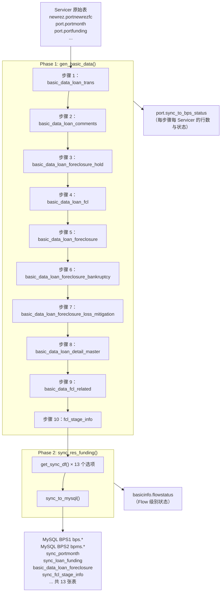

# doc 12 — sync_asset_management.py：代码调研与参考文档

---

## 文档说明

- **文档存在的原因**：`sync_asset_management.py` 是 PrefectFlow 中每日运行的核心 ETL 编排流，负责将所有资产管理数据推入 BPS 应用数据库。该文件逻辑复杂，涉及 23+ 张表，但没有任何独立文档。
- **解决的问题**：如果没有本文档，开发者必须翻阅 5+ 个配置文件和 1,300+ 行 SQL 才能理解该流做了什么、执行顺序如何、以及为什么这样设计。
- **范围**：对 `flow/bps/sync_asset_management.py` 的全面代码级调研——所有函数、数据流、参数、读/写的 DB 表、环境行为、状态追踪，以及一个已发现的代码问题。
- **不涵盖**：配置文件内部的 SQL 逻辑（见 foreclosure_data_dictionary.md 及 doc 01–11 中的业务规则）；BPS 应用对 sync 表的消费逻辑。
- **在系统中的位置**：本文件是整个 Redshift → MySQL BPS 同步管道的**触发点**，位于原始 Servicer 数据（doc 01–07）与 BPS 前端之间。其产出数据是 doc 08–11 中文档化的 FCL 状态字段的最终来源。

## 目标读者

主要：新系统 ETL 开发者 · 数据工程师  
次要：系统架构师 · 运维/on-call 工程师 · 未来 AI 会话

## 修订历史

| 日期 | 作者 | 版本 | 变更 | 关联 |
|------|------|------|------|------|
| 2026-05-26 | AI Agent（Claude Sonnet 4.6） | v1 | 初始调研与文档化——Section 1–12：架构、Import、参数、5 个函数、10 步 Redshift 构建、13 类 BPS 同步、环境/租户支持、死代码问题、状态追踪、相关文件、DB 表速查 | doc 08、09、11 |
| 2026-05-26 | AI Agent（Claude Sonnet 4.6） | v2 | 新增 Section 13：FCL 字段清单——对全部 5 个 FCL 同步选项的字段级完整追踪；127 个 FCL 字段分布于 5 张 BPS MySQL 表（`basic_data_loan_foreclosure` / `sync_loan_foreclosure_loss_mitigation` / `sync_loan_foreclosure_bankruptcy` / `sync_loan_foreclosure_hold` / `sync_fcl_stage_info`）；含数据转换说明（逆透视、实时重算） | `asset_managment_config.py`、`basic_data_pool_config.py` |
| 2026-05-26 | AI Agent（Claude Sonnet 4.6） | v3 | 所有 MySQL 目标表名统一改为 `schema.table` 格式；经 MCP 确认：`sync_*` 表 → `bpms` schema，`basic_data_loan_foreclosure` → MySQL `port` schema | — |
| 2026-05-26 | AI Agent（Claude Sonnet 4.6） | v4 | 新增 Section 14：BPS MySQL FCL 表完整结构（bpms_dev，MCP 实测）——含 5 张表全部列名/类型/默认值；首次文档化 `bpms_dev.sync_loan_foreclosure`（72 列，BPS 主 FCL 应用表，不在 SYNC_TABLE_MAP 中）；Section 12 新增补充说明；Section 13 汇总补注 | doc 13 v2 |
| 2026-05-28 | AI Agent（Claude Sonnet 4.6） | v5 | 新增 Section 15：`port.basic_data_loan_fcl` 中已归一化但未进 BPS 的 4 个字段（`fcjudgment_end_date` / `titleordereddate` / `jr_sr_lien_flag` / `activejnrlienfcflag`）及其设计意图；以 ETL 代码（`basic_data_pool_config.py` 第 1539–1570 行）为依据 | doc 13 v21 |
| 2026-05-28 | AI Agent（Claude Sonnet 4.6） | v6 | Section 14.0 全面更正：补全两步写入机制（`sync_to_mysql` + `update_to_mysql(UPDATE_FORECLOSURE)`）；纠正"独立机制"错误推断——两张表是同一 `5-FORECLOSURE` 管道的中转层与落地层；字段级 MCP 差异原因重新解释为数据刷新延迟；`create_time`/`update_time` NULL 原因确认为 ON DUPLICATE KEY UPDATE 子句未包含这两列 | [`df_db_util.py:675,702`](https://gitlab.bridgerinvestment.com/jli/prefectflow/-/blob/32a750a39c7eda989de991c47467979043e3d209/util/df_db_util.py#L675)、[`asset_managment_config.py:647,746`](https://gitlab.bridgerinvestment.com/jli/prefectflow/-/blob/32a750a39c7eda989de991c47467979043e3d209/flow/bps/bps_config/asset_managment_config.py#L647) |

## 依赖文件

| 文件 | 作用 |
|------|------|
| `flow/bps/bps_config/asset_managment_config.py` | 14 个同步数据提取 SQL 查询模板 |
| `flow/bps/bps_config/sync_to_bps_config.py` | `SYNC_TABLE_MAP`：同步选项 ID → MySQL 表名映射 |
| `flow/bps/bps_config/sync_generate_status_config.py` | 各 `gen_basic_data` 步骤的状态追踪 SQL |
| `flow/basic_data/basic_data_config/basic_data_pool_config.py` | 10 个 Redshift staging 构建 SQL 模板 |
| `util/df_db_util.py` | 核心 DB 工具：`execute_sql`、`get_df_from_db`、`sync_to_mysql` |
| `util/decorator_flow_info.py` | `@record_flow_status` 装饰器 |
| `src/util/logger.py` | `get_prefect_compatible_logger` |

## 已知局限

- 未分析配置文件内部的 SQL 逻辑，详见对应配置文件
- `gen_basic_data()` 各步骤以固定硬编码顺序执行；早期步骤失败可能静默地影响后续步骤
- `get_sync_df()` 中发现一个死代码路径——见 [Section 9](#section-9-代码问题-get_sync_df-0-all-路径为死代码)

---

## Section 1：概览

| 属性 | 值 |
|------|-----|
| **文件路径** | `C:\Users\jli\MyData\Copilot\PrefectFlow\flow\bps\sync_asset_management.py` |
| **代码行数** | 191 |
| **Prefect flow 名称** | `sync_asset_management_flow` |
| **生产调度** | 每天 **美东时间 4:35 AM** |
| **生产状态** | Active（活跃） |

**业务目的**：该流是每晚数据刷新的核心，确保 BPS（Business Process System）应用数据库保持最新。它执行两个阶段：

1. **生成 10 张 Redshift 中间表**（从原始 Servicer 数据构建 basic_data 层）
2. **将 13 类数据**从 Redshift 同步到 MySQL BPS 数据库

**两阶段架构**：

```
Phase 1：gen_basic_data()
  原始 Servicer 表（Redshift）
      ↓  10 步顺序执行 SQL
  port.basic_data_* 中间表（Redshift）

Phase 2：sync_res_funding()
  port.basic_data_* + port.portmonth 等 Redshift 表
      ↓  13 个同步选项，通过 get_sync_df()
  MySQL BPS1（bps）和/或 BPS2（bpms）— sync_* 表
      ↓
  BPS 应用 / 下游消费者
```

---

## Section 2：架构图



---

## Section 3：Import 与依赖

### 外部库

| 库 | 用途 |
|----|------|
| `datetime` | 日期运算（如服务商评论 30 天回溯） |
| `pytz` | 纽约时区用于 FCL 日期计算 |
| `prefect` | `@flow` 装饰器、`get_run_logger()` |
| `pandas` | DataFrame 操作，`pd.Timedelta` |
| `typing.Literal` | Prefect UI 参数下拉框的类型别名 |

### 内部工具

| Import | 模块 | 用途 |
|--------|------|------|
| `get_prefect_compatible_logger` | `src.util.logger` | 在 Prefect 运行时内外均可用的 Logger |
| `record_flow_status` | `util.decorator_flow_info` | 装饰器：将 flow 启动/成功/失败记录到 `basicinfo.flowstatus` |
| `execute_sql` | `util.df_db_util` | 对 Redshift 或 MySQL 执行 SQL；可选状态记录 |
| `get_df_from_db` | `util.df_db_util` | 执行 SELECT 查询并返回 pandas DataFrame |
| `sync_to_mysql` | `util.df_db_util` | 将 DataFrame 同步到 MySQL（delete+insert 或 upsert） |
| `redshift_cred` | `cred.db_cred` | Redshift 凭据（由 Prefect vault 管理） |
| `BUILDENV`、`DbTypeEnum` | `cred.settings` | 运行时环境标志和 DB 类型枚举 |

### 配置模块

| Import | 模块 | 内容 |
|--------|------|------|
| `CREATE_BASIC_DATA_TRANS` 等 10 个 | `flow.basic_data.basic_data_config.basic_data_pool_config` | 10 个 staging 表创建 SQL 模板 |
| `GEN_SYNC_PORT_MONTH` 等 14 个 | `flow.bps.bps_config.asset_managment_config` | 14 个 BPS 同步数据提取 SELECT SQL 模板 |
| `GENERATE_SQL_STATUS_CONFIG` | `flow.bps.bps_config.sync_generate_status_config` | 按步骤名称索引的成功/失败状态 INSERT SQL 字典 |
| `SYNC_TABLE_MAP` | `flow.bps.bps_config.sync_to_bps_config` | 同步选项 ID → MySQL 表名 + 元数据的映射字典 |

---

## Section 4：运行时参数（Literal 类型别名）

以下类型定义了手动触发 Flow 时 Prefect UI 中显示的下拉选项：

### `SyncChoices` — 同步哪类数据

| 值 | 数据 | Redshift 源 → MySQL 目标 |
|----|------|--------------------------|
| `0-ALL` | 全部 13 类 | （逐类循环执行） |
| `1-PORTMONTH` | 月度组合快照 | `port.basic_data_monthly_portfolio` → `bpms.sync_portmonth` |
| `2-LOAN_FUNDING` | 贷款资金明细 | `port.basic_data_loan_funding` → `bpms.sync_loan_funding` |
| `3-LOAN_FUNDING_SCHEDULE` | 资金计划 | `port.portfunding` → `bpms.sync_loan_funding_schedule` |
| `4-LOAN_SUMMARY_RISK` | 风险/定价摘要 | `port.portmark` + `port.portfunding` → `bpms.sync_loan_summary_risk` |
| `5-FORECLOSURE` | FCL 时间线 | `port.basic_data_loan_foreclosure` → `port.basic_data_loan_foreclosure` |
| `6-SERVICER_COMMENTS` | Servicer 备注（增量） | `port.basic_data_loan_comments` → `bpms.sync_loan_servicer_comments` |
| `7-TRANSACTION_FROM_SERVICER` | 贷款交易记录 | `port.basic_data_loan_trans` → `bpms.sync_loan_transaction_from_servicer` |
| `8-FORECLOSURE_LM` | 损失缓解 | `port.basic_data_loan_foreclosure_loss_mitigation` → `bpms.sync_loan_foreclosure_loss_mitigation` |
| `9-FORECLOSURE_BK` | 破产 | `port.basic_data_loan_foreclosure_bankruptcy` → `bpms.sync_loan_foreclosure_bankruptcy` |
| `10-FORECLOSURE_HOLD` | FCL 暂停 | `port.basic_data_loan_foreclosure_hold` → `bpms.sync_loan_foreclosure_hold` |
| `11-LOAN_MASTER` | 贷款主属性 | `port.basic_data_loan_detail_master` → `bpms.sync_loan_master` |
| `12-FCL_STAGE` | FCL 阶段 | `port.fcl_stage_info` → `bpms.sync_fcl_stage_info` |
| `13-PLT_ZIPCODE` | Niche 邮编/地理 | `niche.plt_zipcode` → `bpms.sync_niche_grade` |

### `SYNC_DB` — 目标 MySQL 数据库

| 值 | 目标 |
|----|------|
| `BPS1 ONLY` | `bps`（或 `bps_dev` / `bps_test` / `bps_uat`） |
| `BPS2 ONLY` | `bpms`（或 `bpms_dev` / `bpms_test` / `bpms_uat`） |
| `ALL` | BPS1 和 BPS2 均同步 |

### `SYNC_ENV` — 数据库环境后缀

| 值 | DB 名称后缀 | 何时可用 |
|----|------------|---------|
| `auto` | 无（生产环境） | 始终可用 |
| `dev` | `_dev` | 仅 UAT 构建 |
| `test` | `_test` | 仅 UAT 构建 |
| `uat` | `_uat` | 仅 UAT 构建 |

> `SYNC_ENV` 由 `BUILDENV` 设置控制：在生产构建中，Prefect UI 只展示 `auto`。

### `TENANT_MODE` — 租户 ID 处理方式

| 值 | 行为 |
|----|------|
| `0-NO TENANT` | 从输出中移除 `tenant_id` 列（默认） |
| `TENANT DEFAULT` | 所有行的 `tenant_id` 设为 `000000` |
| `TENANT TRUST` | 从 `port.basic_data_trust_funding` 按 `loanid` 合并 `tenant_id`；无匹配则填 `000000` |

---

## Section 5：函数说明

### `get_max_daily_date() → str`

| 属性 | 说明 |
|------|------|
| **用途** | 获取 Newrez 组合数据中最新的数据截止日期 |
| **DB 读取** | `SELECT MAX(dataasof) FROM newrez.portnewrezfc`（Redshift） |
| **返回值** | 日期字符串（如 `"2026-05-25"`） |
| **调用者** | `gen_basic_data()`，当 `asofdate` 参数为 `None` 时调用 |
| **注意** | 以 Newrez 作为"当前日期"的参考 Servicer——意味着 Newrez 数据的新鲜度决定了 FCL stage 的计算基准 |

---

### `get_tenant_df(df, tenant_mode, tenant_df) → pd.DataFrame`

| 属性 | 说明 |
|------|------|
| **用途** | 在同步到 MySQL 前对 DataFrame 应用租户 ID 逻辑 |
| **输入** | `df`——贷款数据 DataFrame；`tenant_mode`——3 种 TENANT_MODE 之一；`tenant_df`——可选的 `loanid → tenant_id` 映射 DataFrame |

**逻辑表：**

| tenant_mode | 操作 |
|-------------|------|
| `'0-NO TENANT'` | 如有则删除 `tenant_id` 列 |
| `'TENANT DEFAULT'` | 若有 `tenant_df` 则按 `loanid` 合并；将 `tenant_id` 统一设为 `000000` |
| `'TENANT TRUST'` | 按 `loanid` 左连接 `tenant_df`；未匹配行填 `000000` |

---

### `get_sync_df(sync_choice, comment_from_date, tenant_mode, tenant_df) → pd.DataFrame`

| 属性 | 说明 |
|------|------|
| **用途** | 按给定 `sync_choice` 从 Redshift 获取单类数据 |
| **输入** | `sync_choice`——14 个 SyncChoices 之一；`comment_from_date`——`6-SERVICER_COMMENTS` 的日期过滤；`tenant_mode`、`tenant_df`——传给 `get_tenant_df()` |
| **返回值** | 经租户过滤的 pandas DataFrame，或 `None` |

**特殊行为：**
- **`5-FORECLOSURE`**：通过 `.format(input_curr_date=curr_date)` 将纽约时区当前日期注入 SQL
- **`6-SERVICER_COMMENTS`**：在基础 SQL 末尾追加 `WHERE servicer_comments_date >= '{comment_from_date}'`——仅在 `comment_from_date is not None` 时执行
- **`0-ALL`**：⚠️ 见 [Section 9](#section-9-代码问题-get_sync_df-0-all-路径为死代码) 中发现的代码问题

---

### `gen_basic_data(asofdate=None)`

| 属性 | 说明 |
|------|------|
| **用途** | 顺序执行 10 条 SQL，构建所有 Redshift 中间（basic data）表 |
| **输入** | `asofdate`——可选日期覆盖；如为 `None`，调用 `get_max_daily_date()` |
| **返回值** | None |
| **副作用** | 创建/替换 10 张 Redshift 表；向 `port.sync_to_bps_status` 写入状态行；输出 Prefect 兼容日志 |

所有 10 个 SQL 执行均使用：
```python
execute_sql(exe_sql, DbTypeEnum.REDSHIFT.value, redshift_cred.DATABASE_NAME.get_secret_value(),
            run_decorator=True, statis_config=GENERATE_SQL_STATUS_CONFIG['<KEY>'])
```
`run_decorator=True` 会在每步成功或失败后向 `port.sync_to_bps_status` 写入一行记录。

---

### `sync_res_funding(sync_db, sync_choice, sync_env, comment_from_date, tenant_mode)`

| 属性 | 说明 |
|------|------|
| **用途** | 协调一类或全部数据从 Redshift → MySQL 的同步 |
| **输入** | `sync_db`——目标 BPS 数据库；`sync_choice`——数据类别；`sync_env`——环境后缀；`comment_from_date`、`tenant_mode` |
| **返回值** | None |
| **副作用** | 写入 MySQL BPS 数据库；从 Redshift 读取租户映射 |

**逻辑：**
1. 根据 `sync_db` 确定 `db_pres` 列表：`['bps']` / `['bpms']` / `['bps', 'bpms']`
2. 一次性获取租户映射：`get_df_from_db(GET_LOAN_TENANT_ID)`
3. 若 `sync_choice == '0-ALL'`：遍历 `SYNC_TABLE_MAP.items()` → 对每个选项调用 `get_sync_df(choice, ...)` + `sync_to_mysql(...)`
4. 否则：从 `SYNC_TABLE_MAP` 查单个表名，获取一次，同步到每个 `db_pre`

---

### `sync_asset_management_flow(...)` *（主 @flow 入口）*

```python
@flow(name='sync_asset_management_flow')
@record_flow_status(flow_name='sync_asset_management_flow')
def sync_asset_management_flow(
    sync_db: SYNC_DB = 'BPS1 ONLY',
    sync_choice: SyncChoices = '0-ALL',
    sync_env: SYNC_ENV = 'auto',
    asofdate = None,
    comment_from_date: datetime.date = None,
    tenant_mode: TENANT_MODE = '0-NO TENANT'
)
```

**默认行为**（生产每日运行）：
- `sync_db = 'BPS1 ONLY'`——仅同步到 BPS1（`bps`）
- `sync_choice = '0-ALL'`——全部 13 类数据
- `sync_env = 'auto'`——生产数据库名
- `comment_from_date` 自动设为**30 天前**（当同步 `0-ALL` 或 `6-SERVICER_COMMENTS` 时）
- `tenant_mode = '0-NO TENANT'`——不含租户列

**执行顺序：**
1. 若服务商备注在范围内且 `comment_from_date` 为 None：设为今天 - 30 天
2. `gen_basic_data(asofdate)` — Phase 1
3. `sync_res_funding(...)` — Phase 2

---

## Section 6：数据流 — gen_basic_data() 步骤详解

步骤**顺序执行**，后续步骤可能依赖前续步骤的输出。

| 步骤 | SQL 常量 | 目标表（Redshift） | 备注 |
|------|---------|-------------------|------|
| 1 | `CREATE_BASIC_DATA_TRANS` | `port.basic_data_loan_trans` | 所有 Servicer 的贷款交易记录 |
| 2 | `CREATE_BASIC_COMMENTS` | `port.basic_data_loan_comments` | Servicer 备注/评论 |
| 3 | `CREATE_BASIC_DATA_FCL_HOLD` | `port.basic_data_loan_foreclosure_hold` | FCL 暂停；代码注释说明 CC5 只有 2 个 hold 字段且为月度数据——当前局限 |
| 4 | `CREATE_BASIC_FCL` | `port.basic_data_loan_fcl` | 基本 FCL 标志表（步骤 5 的前提） |
| 5 | `GEN_FCL_DETAIL` | `port.basic_data_loan_foreclosure` | 完整 FCL 时间线详情；依赖步骤 4 |
| 6 | `CREATE_BASIC_DATA_FCL_BANKRUPTCY` | `port.basic_data_loan_foreclosure_bankruptcy` | 破产追踪；注释："结构不改，只增加 servicer 数据" |
| 7 | `CREATE_BASIC_DATA_FCL_LM` | `port.basic_data_loan_foreclosure_loss_mitigation` | 损失缓解 / 宽限期 / 修改 |
| 8 | `CREATE_BASIC_DATA_LOAN_MASTER` | `port.basic_data_loan_detail_master` | 贷款主属性 |
| 9 | `CREATE_FCL_RELATE_ATTR` | `port.basic_data_fcl_related` | FCL 相关贷款属性 |
| 10 | `GEN_FCL_STAGE` | `port.fcl_stage_info` | FCL 阶段进展；需要 `asofdate` + 纽约时区 `curr_date` 作为 format 参数 |

**状态追踪**：每步完成后，`execute_sql(run_decorator=True, statis_config=...)` 向 `port.sync_to_bps_status` 插入一行，记录：`generate_type`、`opt_type='create'`、`excute_date`、`servicer`、`max_generate_asofdate`、`numofrows`、`status`（'success'/'failure'）、`create_time`。

---

## Section 7：数据流 — sync_res_funding() 同步表映射

`sync_to_bps_config.py` 中完整的 `SYNC_TABLE_MAP`：

| 选项 | Redshift 源（通过 SQL 模板） | MySQL 目标表 | group_by | max_date 列 |
|------|---------------------------|-------------|----------|------------|
| `1-PORTMONTH` | `port.basic_data_monthly_portfolio` | `bpms.sync_portmonth` | `servicer` | `fctrdt` |
| `2-LOAN_FUNDING` | `port.basic_data_loan_funding` | `bpms.sync_loan_funding` | — | `settledate` |
| `3-LOAN_FUNDING_SCHEDULE` | `port.portfunding` | `bpms.sync_loan_funding_schedule` | — | `settledate` |
| `4-LOAN_SUMMARY_RISK` | `port.portmark` + `port.portfunding` | `bpms.sync_loan_summary_risk` | — | `fctrdt` |
| `5-FORECLOSURE` | `port.basic_data_loan_foreclosure` | `port.basic_data_loan_foreclosure` ⚠️ | `servicer` | — |
| `6-SERVICER_COMMENTS` | `port.basic_data_loan_comments` | `bpms.sync_loan_servicer_comments` | `servicer` | `fctrdt` |
| `7-TRANSACTION_FROM_SERVICER` | `port.basic_data_loan_trans` | `bpms.sync_loan_transaction_from_servicer` | `servicer` | `fctrdt` |
| `8-FORECLOSURE_LM` | `port.basic_data_loan_foreclosure_loss_mitigation` | `bpms.sync_loan_foreclosure_loss_mitigation` | — | `fctrdt` |
| `9-FORECLOSURE_BK` | `port.basic_data_loan_foreclosure_bankruptcy` | `bpms.sync_loan_foreclosure_bankruptcy` | — | `fctrdt` |
| `10-FORECLOSURE_HOLD` | `port.basic_data_loan_foreclosure_hold` | `bpms.sync_loan_foreclosure_hold` | — | `fctrdt` |
| `11-LOAN_MASTER` | `port.basic_data_loan_detail_master` | `bpms.sync_loan_master` | `servicer` | `fctrdt` |
| `12-FCL_STAGE` | `port.fcl_stage_info` | `bpms.sync_fcl_stage_info` | `servicer` | `fctrdt` |
| `13-PLT_ZIPCODE` | `niche.plt_zipcode` | `bpms.sync_niche_grade` | — | — |

> ⚠️ `5-FORECLOSURE` 写入 `port.basic_data_loan_foreclosure`——注意：**无 `sync_` 前缀**，且目标库为 MySQL `port` schema（而非 `bpms`），与其他所有同步选项的命名惯例不同。该表可能使用 **upsert** 逻辑而非 delete+insert；请在 `sync_to_mysql()` 实现中确认。

---

## Section 8：多环境与多租户支持

### 环境感知数据库命名

```python
# db_pre 示例：'bps'、'bpms'
# sync_env：'auto'、'dev'、'test'、'uat'

if sync_env == 'auto':
    target_db = db_pre                  # → 'bps' 或 'bpms'（生产）
else:
    target_db = f"{db_pre}_{sync_env}"  # → 'bps_dev'、'bpms_test' 等
```

### 租户模式

| 模式 | 使用场景 | 输出中的 `tenant_id` |
|------|---------|---------------------|
| `0-NO TENANT` | 标准单租户 BPS1 生产运行 | 列被移除 |
| `TENANT DEFAULT` | 加载到共享 DB，所有贷款归属默认租户 | 固定 `000000` |
| `TENANT TRUST` | 多 trust 部署——每笔贷款映射到其 trust 的租户 | 来自 `port.basic_data_trust_funding` 的每笔贷款对应值 |

---

## Section 9：⚠️ 代码问题 — `get_sync_df()` `'0-ALL'` 路径为死代码

### 问题描述

在 `get_sync_df()` 中，所有 13 个 `if` 块都写成独立的 `if`（而非 `elif`）：

```python
def get_sync_df(sync_choice='0-ALL', ...):
    df = None
    if sync_choice == '0-ALL' or sync_choice == '1-PORTMONTH':
        df = get_df_from_db(GEN_SYNC_PORT_MONTH)   # df 被覆盖
    if sync_choice == '0-ALL' or sync_choice == '2-LOAN_FUNDING':
        df = get_df_from_db(GEN_LOAN_FUNDING)       # df 再次被覆盖
    # ... 还有 11 个 block，每个都覆盖 df ...
    if sync_choice == '0-ALL' or sync_choice == '13-PLT_ZIPCODE':
        df = get_df_from_db(GET_PLT_ZIPCODE_DATA)   # 只有这个被返回
    return get_tenant_df(df, ...)
```

若传入 `'0-ALL'`，**13 个查询全部执行**，但只有最后一个（`13-PLT_ZIPCODE`）的结果被返回。

### 为什么生产未受影响

`sync_res_funding()` **从不向 `get_sync_df()` 传 `'0-ALL'`**：

```python
if sync_choice == '0-ALL':
    for choices, tabel_name_info in SYNC_TABLE_MAP.items():  # 遍历 '1-PORTMONTH'、'2-LOAN_FUNDING'...
        df = get_sync_df(choices, ...)   # 每次传具体选项，永远不是 '0-ALL'
```

### 影响

- **生产**：无——`get_sync_df` 中的 `'0-ALL'` 路径在 flow 中不可达
- **开发陷阱**：若有人直接调用 `get_sync_df('0-ALL')`（如在测试或脚本中），将得到意外结果——13 个查询全部触发，但只返回 PLT_ZIPCODE 数据

### 建议修复

将所有 `if sync_choice == '0-ALL' or sync_choice == 'N-...'` 改为 `elif`，或添加 guard：

```python
def get_sync_df(sync_choice='0-ALL', ...):
    if sync_choice == '0-ALL':
        raise ValueError("'0-ALL' 不可直接传给 get_sync_df()；请在调用方遍历各同步选项。")
    elif sync_choice == '1-PORTMONTH':
        df = get_df_from_db(GEN_SYNC_PORT_MONTH)
    elif sync_choice == '2-LOAN_FUNDING':
        ...
```

---

## Section 10：状态追踪与可观测性

### `port.sync_to_bps_status`（Redshift）

每个 `gen_basic_data()` 步骤、每个 Servicer 插入一行：

| 字段 | 说明 |
|------|------|
| `generate_type` | 步骤名称（如 `'CREATE_BASIC_DATA_TRANS'`） |
| `opt_type` | 始终为 `'create'` |
| `excute_date` | 运行时的 `CURRENT_DATE` |
| `servicer` | Servicer 名称（失败时为 NULL） |
| `max_generate_asofdate` | 生成表中的最新数据日期 |
| `numofrows` | 生成表的行数 |
| `status` | `'success'` 或 `'failure'` |
| `create_time` | `CURRENT_TIMESTAMP` |

### `basicinfo.flowstatus`（MySQL）

由 `@record_flow_status` 装饰器写入的 Flow 级别记录。捕获整体 flow 的成功/失败，而非逐步骤。

### Prefect 日志

`gen_basic_data()` 在每个步骤前后输出 `logger.info("===<步骤名> start==="` / `end===")` 日志，可在 Prefect UI 的日志视图中查看。

---

## Section 11：相关文件

| 文件 | 行数 | 用途 |
|------|------|------|
| `flow/bps/bps_config/asset_managment_config.py` | 1,147 | 14 个同步提取 SELECT SQL 模板 |
| `flow/bps/bps_config/sync_to_bps_config.py` | 30 | `SYNC_TABLE_MAP` 和 `SYNC_PROFORMA_TABLE_MAP` |
| `flow/bps/bps_config/sync_generate_status_config.py` | 401 | `GENERATE_SQL_STATUS_CONFIG`：全部 10 步骤的成功/失败 INSERT SQL |
| `flow/basic_data/basic_data_config/basic_data_pool_config.py` | — | 10 个 CREATE/INSERT SQL 模板 |
| `flow/bps/sync_pro_forma.py` | 122 | 兄弟 flow：pro forma 数据同步 |
| `util/df_db_util.py` | 727 | 核心 DB 工具：`execute_sql`、`get_df_from_db`、`sync_to_mysql` |
| `util/decorator_flow_info.py` | — | `@record_flow_status` 装饰器定义 |
| `src/util/logger.py` | — | `get_prefect_compatible_logger()` 实现 |

---

## Section 12：所有 DB 表速查表

### Redshift — 读取表（Phase 2 同步来源）

| 表 | Schema | 描述 |
|----|--------|------|
| `newrez.portnewrezfc` | newrez | Newrez 月度组合数据——用作日期参考 |
| `port.portmonth` | port | 月度组合数据 |
| `port.portfunding` | port | 贷款资金/交易数据 |
| `port.portmark` | port | 贷款定价/风险标记 |
| `port.basic_data_loan_foreclosure` | port | FCL 时间线（步骤 5 生成） |
| `port.basic_data_loan_comments` | port | Servicer 备注（步骤 2 生成） |
| `port.basic_data_loan_trans` | port | 贷款交易记录（步骤 1 生成） |
| `port.basic_data_loan_foreclosure_loss_mitigation` | port | 损失缓解详情（步骤 7 生成） |
| `port.basic_data_loan_foreclosure_bankruptcy` | port | 破产详情（步骤 6 生成） |
| `port.basic_data_loan_foreclosure_hold` | port | FCL 暂停（步骤 3 生成） |
| `port.basic_data_loan_detail_master` | port | 贷款主属性（步骤 8 生成） |
| `port.fcl_stage_info` | port | FCL 阶段（步骤 10 生成） |
| `port.basic_data_trust_funding` | port | 贷款 → 租户映射 |
| `niche.plt_zipcode` | niche | Niche 邮编/地理人口数据 |

### Redshift — 写入表（Phase 1 中间层构建）

| 表 | Schema | 由哪步写入 |
|----|--------|----------|
| `port.basic_data_loan_trans` | port | 步骤 1 |
| `port.basic_data_loan_comments` | port | 步骤 2 |
| `port.basic_data_loan_foreclosure_hold` | port | 步骤 3 |
| `port.basic_data_loan_fcl` | port | 步骤 4 |
| `port.basic_data_loan_foreclosure` | port | 步骤 5 |
| `port.basic_data_loan_foreclosure_bankruptcy` | port | 步骤 6 |
| `port.basic_data_loan_foreclosure_loss_mitigation` | port | 步骤 7 |
| `port.basic_data_loan_detail_master` | port | 步骤 8 |
| `port.basic_data_fcl_related` | port | 步骤 9 |
| `port.fcl_stage_info` | port | 步骤 10 |
| `port.sync_to_bps_status` | port | 每步状态追踪 |

### MySQL — 写入表（Phase 2 同步目标）

| 表 | 数据库 | 对应同步选项 |
|----|--------|------------|
| `bpms.sync_portmonth` | bpms | `1-PORTMONTH` |
| `bpms.sync_loan_funding` | bpms | `2-LOAN_FUNDING` |
| `bpms.sync_loan_funding_schedule` | bpms | `3-LOAN_FUNDING_SCHEDULE` |
| `bpms.sync_loan_summary_risk` | bpms | `4-LOAN_SUMMARY_RISK` |
| `port.basic_data_loan_foreclosure` | port | `5-FORECLOSURE` |
| `bpms.sync_loan_servicer_comments` | bpms | `6-SERVICER_COMMENTS` |
| `bpms.sync_loan_transaction_from_servicer` | bpms | `7-TRANSACTION_FROM_SERVICER` |
| `bpms.sync_loan_foreclosure_loss_mitigation` | bpms | `8-FORECLOSURE_LM` |
| `bpms.sync_loan_foreclosure_bankruptcy` | bpms | `9-FORECLOSURE_BK` |
| `bpms.sync_loan_foreclosure_hold` | bpms | `10-FORECLOSURE_HOLD` |
| `bpms.sync_loan_master` | bpms | `11-LOAN_MASTER` |
| `bpms.sync_fcl_stage_info` | bpms | `12-FCL_STAGE` |
| `bpms.sync_niche_grade` | bpms | `13-PLT_ZIPCODE` |
| `basicinfo.flowstatus` | basicinfo | Flow 级别状态 |

> **补充：BPS 应用 FCL 表（不在 SYNC_TABLE_MAP 中）**
>
> `bpms_dev.sync_loan_foreclosure`（72 列）是 BPS Foreclosure 界面的主数据表，驱动 Milestone / Target Days / Variance / Bid Approval / Summary 五个面板，但**未出现在 `sync_to_bps_config.py` 的 SYNC_TABLE_MAP 中**，因此不由 `sync_asset_management.py` 直接写入。其实际同步来源待进一步确认（可能由独立 Flow 或 BPS 应用层维护）。完整表结构见 [Section 14](#section-14bps-mysql-fcl-表完整结构bpms_devmcp-实测)。

---

## Section 13：FCL 字段写入 BPS — 完整字段清单

> **聚焦点**：`sync_asset_management.py` 的 13 个同步选项中，5 个直接与 FCL 相关。本节列出这 5 个选项同步到 BPS MySQL 的每一个字段。

### 汇总

```
5-FORECLOSURE    → port.basic_data_loan_foreclosure            47 个字段（时间线 + 竞标 + 摘要）
8-FORECLOSURE_LM → bpms.sync_loan_foreclosure_loss_mitigation  13 个字段（损失缓解周期数据）
9-FORECLOSURE_BK → bpms.sync_loan_foreclosure_bankruptcy       13 个字段（破产状态/日期）
10-FORECLOSURE_HOLD → bpms.sync_loan_foreclosure_hold           6 个字段（hold 记录，3列转长格式）
12-FCL_STAGE     → bpms.sync_fcl_stage_info                    48 个字段（各阶段时间线分析）
──────────────────────────────────────────────────────────────────────────────
合计                                                           127 个 FCL 字段 / 5 张 BPS 表
```

> **注**：以上字段数为 ETL **SELECT 语句中的业务字段**数量，不含 id、create_user、create_dept、create_time、update_user、update_time、status、is_deleted、tenant_id 等管理列。bpms_dev 中各表 MCP 实测列数见 Section 14。  
> 另：`bpms_dev.sync_loan_foreclosure`（72 列，BPS 主 FCL 应用表）**不在上述 5 个同步选项中**，独立记录于 Section 14。

此外，`bpms.sync_portmonth`（`1-PORTMONTH`）中包含 `delinq` 字段，其值可以是 `'FCL'`，是 MBA 逾期状态的一部分——但它不是专属 FCL 详细信息表。

---

### 表 1 — `port.basic_data_loan_foreclosure`（47 个字段）

**同步选项**：`5-FORECLOSURE` | **SQL**：`GEN_FORECLOSURE`（[asset_managment_config.py:535](https://gitlab.bridgerinvestment.com/jli/prefectflow/-/blob/32a750a39c7eda989de991c47467979043e3d209/flow/bps/bps_config/asset_managment_config.py#L535)–608）  
**Redshift 来源**：`port.basic_data_loan_foreclosure` JOIN `port.portfunding`  
**行过滤**：`timeline_referred_to_foreclosure_date IS NOT NULL`（仅已进入 FCL 转介的贷款）

> ⚠️ 每次同步时有 **2 个字段实时重算**，使用 `datediff(day, dataasof, current_date_new_york)`：
> `summary_sms_days_in_fcl` 和 `summary_days_in_fcl` — 反映的是**今天**为止在 FCL 中的天数，而非数据截止日当天的值。

| 分组 | 字段 | 类型 / 说明 |
|------|------|------------|
| **标识符** | `bid_id` | 来自 `portfunding.dealid` |
| | `funding_id` | 来自 `portfunding.fundingid` |
| | `loanid` | 主贷款键 |
| | `svcloanid` | Servicer 贷款号 |
| | `servicer` | Servicer 名称 |
| **时间线** | `timeline_notice_of_intent_date` | 意向通知（NOI）发出日期 |
| | `timeline_notice_of_intent_end_date` | NOI 到期日 |
| | `timeline_approved_for_referral_date` | FCL 转介批准日 |
| | `timeline_referred_to_attorney_date` | 委托律师日 |
| | `timeline_referred_to_foreclosure_date` | **FCL 转介日**（过滤字段，必填） |
| | `timeline_title_report_received_date` | 产权报告收到日 |
| | `timeline_preliminary_title_cleared_date` | 初步产权清查完成日 |
| | `timeline_first_legal_date` | 首次法律行动日 |
| | `timeline_service_date` | 送达日期 |
| | `timeline_judgement_hearing_set_date` | 判决听证预定日 |
| | `timeline_judgement_date` | 判决日 |
| | `timeline_sale_date_projected_date` | 预计拍卖日 |
| | `timeline_sale_date_set_date` | 已排定拍卖日 |
| | `timeline_final_title_cleared_date` | 最终产权清查日 |
| | `timeline_sale_date_held_date` | 实际拍卖日 |
| | `timeline_foreclosure_completed_date` | FCL 完成日 |
| | `timeline_third_party_sold_date_date` | 第三方买家成交日 |
| | `timeline_third_party_proceeds_received_date` | 收到第三方款项日 |
| **差异分析** | `variance_active_bankruptcy` | 活跃破产差异标志 |
| | `variance_completed_bankruptcy` | 已完成破产 |
| | `variance_estimated_hold_days` | 预计 hold 影响天数 |
| | `variance_bankruptcies` | 破产次数 |
| **竞标审批** | `bid_approval_status` | 竞标状态 |
| | `bid_approval_sale_date` | 批准拍卖日 |
| | `bid_approval_bid_amount` | 竞标金额 |
| | `bid_approval_loan_resolution_holods` | 解决方案 hold 记录 |
| **摘要** | `summary_servicer_number` | Servicer 参考编号 |
| | `summary_foreclosure_status` | FCL 状态（CASE WHEN 从 activefcflag + fcremovaldesc 推导） |
| | `summary_completed_foreclosure` | 已完成 FCL 标志 |
| | `summary_foreclosure_bid_amount` | 我方竞标金额 |
| | `summary_srv_fc_bid_amount` | Servicer 竞标金额 |
| | `summary_foreclosure_sale_amount` | 实际成交金额 |
| | `summary_judicial_foreclosure` | 司法 FCL 标志（decimal） |
| | `summary_foreclosure_attorney` | 律师名称 |
| | `summary_contested_litigation` | 争议诉讼标志（decimal） |
| | `summary_firm` | 律所名称 |
| | `summary_type` | Judicial / Non Judicial（由 judicial 字段转换） |
| | `summary_sms_days_in_fcl` | ⚡ **实时重算** 在 FCL 中的天数（SMS 系统口径） |
| | `summary_days_in_fcl` | ⚡ **实时重算** 在 FCL 中的天数（自有系统口径） |
| | `summary_current_step` | 当前 FCL 流程步骤 |
| | `summary_last_step_completed` | 最后完成的步骤名称 |
| | `summary_last_step_completed_date` | 最后完成步骤的日期 |

---

### 表 2 — `bpms.sync_loan_foreclosure_loss_mitigation`（13 个字段）

**同步选项**：`8-FORECLOSURE_LM` | **SQL**：`GEN_FORECLOSURE_LM`（[asset_managment_config.py:799](https://gitlab.bridgerinvestment.com/jli/prefectflow/-/blob/32a750a39c7eda989de991c47467979043e3d209/flow/bps/bps_config/asset_managment_config.py#L799)–819）  
**Redshift 来源**：`port.basic_data_loan_foreclosure_loss_mitigation` JOIN `port.portfunding`

| 字段 | 说明 |
|------|------|
| `loanid` | 主贷款键 |
| `svcloanid` | Servicer 贷款号 |
| `fctrdt` | 报告截止日 |
| `deal` | 交易名称 |
| `program` | LM 方案类型（宽限期、修改还款等） |
| `lmc_status` | 损失缓解周期状态 |
| `cycle_opened_date` | 本 LM 周期开始日 |
| `cycle_closed_date` | 本 LM 周期结束日 |
| `final_disposition` | 最终处理结果 |
| `denialreason` | 拒绝原因（如被拒） |
| `borrower_intentions` | 借款人意向说明 |
| `imminent_default` | 即将违约标志 |
| `single_point_of_contact` | 分配的单一联系人（SPOC） |

---

### 表 3 — `bpms.sync_loan_foreclosure_bankruptcy`（13 个字段）

**同步选项**：`9-FORECLOSURE_BK` | **SQL**：`GEN_FORECLOSURE_BK`（[asset_managment_config.py:822](https://gitlab.bridgerinvestment.com/jli/prefectflow/-/blob/32a750a39c7eda989de991c47467979043e3d209/flow/bps/bps_config/asset_managment_config.py#L822)–843）  
**Redshift 来源**：`port.basic_data_loan_foreclosure_bankruptcy` JOIN `port.portfunding`

| 字段 | 说明 |
|------|------|
| `loanid` | 主贷款键 |
| `svcloanid` | Servicer 贷款号 |
| `fctrdt` | 报告截止日 |
| `bankruptcy_status` | 当前破产状态 |
| `legal_status` | 法律程序状态 |
| `status_date` | 状态截止日 |
| `chapter` | 破产章节（Chapter 7、11、13 等） |
| `lien_status` | 留置权状态 |
| `mfr_status` | 解除留置动议（MFR）状态 |
| `mfr_filed_date` | MFR 提交日期 |
| `claim_status` | 债权申报状态 |
| `proof_of_claim_date` | 债权申报日期 |
| `post_petition_due_date` | 申请破产后的还款到期日 |

---

### 表 4 — `bpms.sync_loan_foreclosure_hold`（6 个字段）

**同步选项**：`10-FORECLOSURE_HOLD` | **SQL**：`GEN_FORECLOSURE_HOLD`（[asset_managment_config.py:847](https://gitlab.bridgerinvestment.com/jli/prefectflow/-/blob/32a750a39c7eda989de991c47467979043e3d209/flow/bps/bps_config/asset_managment_config.py#L847)–894）  
**Redshift 来源**：`port.basic_data_loan_foreclosure_hold` JOIN `port.portfunding`

> **数据转换**：源表以**宽格式**存储最多 3 条 hold 记录（列名：`description1`、`description1_start_date`、`description1_end_date`、`description2`、…、`description3_end_date`）。
> SQL 通过带 `UNION ALL` 的 CTE **逆透视（unpivot）**为**长格式**（每条 hold 一行）。
> 仅包含非空 hold 条目。`fctrdt` 聚合为 `MIN`，`description_end_date` 聚合为 `MAX`。

| 字段 | 说明 |
|------|------|
| `loanid` | 主贷款键 |
| `svcloanid` | Servicer 贷款号 |
| `fctrdt` | 最早 hold 报告日（`MIN`） |
| `description` | Hold 原因 / 描述文本 |
| `description_start_date` | 本 hold 开始日 |
| `description_end_date` | 本 hold 结束日（`MAX`） |

---

### 表 5 — `bpms.sync_fcl_stage_info`（48 个字段）

**同步选项**：`12-FCL_STAGE` | **SQL**：`GET_FCL_STAGE_DATA` → `SELECT a.* FROM port.fcl_stage_info`  
**Redshift 来源**：`port.fcl_stage_info` JOIN `port.portfunding`（全部字段直接透传）

字段列表来自 `GEN_FCL_STAGE` INSERT 语句：

| 分组 | 字段 |
|------|------|
| **头部** | `fctrdt`、`loanid`、`group`（delinq_status）、`servicer`、`state`、`judicial` |
| **Demand 阶段** | `demand_start_date`、`demand_end_date`、`demand_stage_days`、`demand_in_lm_days`、`demand_on_hold_days` |
| **NOI 阶段** | `noi_start_date`、`noi_end_date`、`noi_stage_days`、`noi_in_lm_days`、`noi_on_hold_days` |
| **Referral 阶段** | `referral_start_date`、`referral_end_date`、`referral_stage_days`、`referral_in_lm_days`、`referral_on_hold_days` |
| **First Legal 阶段** | `first_legal_start_date`、`first_legal_end_date`、`first_legal_stage_days`、`first_legal_in_lm_days`、`first_legal_on_hold_days`、`first_legal_date_history` |
| **Service 阶段** | `service_start_date`、`service_end_date`、`service_stage_days`、`service_in_lm_days`、`service_on_hold_days` |
| **Publication 阶段** | `publication_start_date`、`publication_end_date`、`publication_stage_days`、`publication_in_lm_days`、`publication_on_hold_days` |
| **Judgement** | `judgement_start_date`、`judgement_end_date`、`to_judgement_days` ⚡、`judgement_in_lm_days`、`judgement_on_hold_days` |
| **Sale** | `sale_start_date`、`sale_end_date`、`to_sale_days` ⚡、`sale_in_lm_days`、`sale_on_hold_days` |
| **当前状态** | `stage`（贷款当前所处阶段） |

> ⚡ `to_judgement_days` 和 `to_sale_days` 是**前瞻性**字段：计算方式为 `datediff(day, current_date_new_york, 预计日期)`，即距离预计判决/拍卖还有多少天。

---

### `bpms.sync_portmonth` 中的 FCL 标志（`delinq` 字段）

这不是专属 FCL 详情表，但月度组合快照中包含：

| 字段 | 可能取值 | FCL 相关性 |
|------|---------|-----------|
| `delinq` | `C / D30 / D60 / D90 / D120P / FCL / REO / P / REPUR` | `FCL` = 月度快照时贷款处于止赎状态 |
| `ots_delinq` | 同上 | OTS 口径的逾期分类 |

这两个字段通过 CASE WHEN 逻辑计算，对 `REPUR`（回购）情形基于上期状态进行特殊处理。

---

## Section 14：BPS MySQL FCL 表完整结构（bpms_dev，MCP 实测）

> **与 Section 13 的关系**：Section 13 记录的是 ETL SELECT 语句输出的业务字段；本节记录 `bpms_dev` 中各表的**完整列结构**，包含管理字段，以及 Section 13 未覆盖的主 BPS FCL 应用表 `sync_loan_foreclosure`。

### 14.0 五表汇总

| BPS 表 | Schema | MCP 实测列数 | BPS UI 面板 | ETL 同步（Section 13） |
|--------|--------|-------------|------------|----------------------|
| `sync_loan_foreclosure` | bpms_dev | **72** | Milestone / Target Days / Variance / Bid Approval / Summary | ⚠️ **不在 SYNC_TABLE_MAP 中** |
| `sync_loan_foreclosure_hold` | bpms_dev | 15 | Hold 历史 | choice 10（6 业务列） |
| `sync_loan_foreclosure_loss_mitigation` | bpms_dev | 22 | LM Cycle | choice 8（13 业务列） |
| `sync_loan_foreclosure_bankruptcy` | bpms_dev | 22 | Bankruptcy | choice 9（13 业务列） |
| `sync_fcl_stage_info` | bpms_dev | 57 | Days in Stage / LM / Hold | choice 12（48 业务列） |

> **写入机制（代码实证）**：`bpms_dev.sync_loan_foreclosure` 是 `5-FORECLOSURE` 同步的**最终落地表**，经由两步写入（[`df_db_util.py:664–726`](https://gitlab.bridgerinvestment.com/jli/prefectflow/-/blob/32a750a39c7eda989de991c47467979043e3d209/util/df_db_util.py#L664)）：
> 1. `sync_to_mysql()` — 将 Redshift 查询结果 clear + append 写入 **MySQL `port.basic_data_loan_foreclosure`**（中转层，line 675 强制指定 `database='port'`）
> 2. `update_to_mysql()` — 立即执行 `UPDATE_FORECLOSURE` SQL（[`asset_managment_config.py:644`](https://gitlab.bridgerinvestment.com/jli/prefectflow/-/blob/32a750a39c7eda989de991c47467979043e3d209/flow/bps/bps_config/asset_managment_config.py#L644)）：`INSERT INTO bpms_dev.sync_loan_foreclosure ... SELECT FROM port.basic_data_loan_foreclosure ... ON DUPLICATE KEY UPDATE`
>
> 因此完整链路为：**Redshift `port.basic_data_loan_foreclosure` → MySQL `port.basic_data_loan_foreclosure`（中转）→ `bpms_dev.sync_loan_foreclosure`（落地）**

> **`create_time`/`update_time` 全为 NULL 的原因**：`UPDATE_FORECLOSURE` 的 `ON DUPLICATE KEY UPDATE` 子句仅列出业务字段（bid_id 至 tenant_id），未包含 `create_time`/`update_time`——这两列在初次 INSERT 时若为 NULL，之后每次更新也不会被覆盖，永久保持 NULL。

> **MCP 字段级差异的解释（fcl_status 86.9%、first_legal_date 50%、judgement_date 9.5%）**：这反映的是**数据刷新延迟**，而非两套独立机制。`port.basic_data_loan_foreclosure`（中转）在每次 ETL 运行时 delete + append 刷新；`bpms_dev.sync_loan_foreclosure` 通过 ON DUPLICATE KEY UPDATE 更新，若 ETL 未完整运行（如 dev 环境），两表就会产生版本差异。这是**运维侧的数据新鲜度问题**，不是架构设计缺陷。

---

### 14.1 bpms_dev.sync_loan_foreclosure（72 列，MCP 逐列确认）

**UI 面板**：Milestone / Target Days / Actual Days / Variance / Bid Approval / Summary  
**关联 VIEW**：`bpms_dev.biz_data_view_loan_details_foreclosure`（104 列）从本表构建，VIEW 动态计算 `actual_*_days`（DATEDIFF 逻辑）和 `var_*_days`（actual 减 target），**这两类列不在本表中存储**。

| 位 | 字段名 | 类型 | 默认值 | 说明 |
|---|--------|------|--------|------|
| **标识符（6列）** | | | | |
| 1 | `id` | bigint | AUTO_INCREMENT | 主键 |
| 2 | `bid_id` | varchar(64) | | 竞标 ID（来自 portfunding.dealid） |
| 3 | `funding_id` | varchar(256) | | 资金 ID |
| 4 | `loanid` | bigint | | 贷款主键 |
| 5 | `svcloanid` | varchar(64) | | Servicer 贷款号 |
| 6 | `servicer` | varchar(128) | | Servicer 名称 |
| **时间线（19列）** | | | | |
| 7 | `timeline_notice_of_intent_date` | date | | NOI 发出日期 |
| 8 | `timeline_notice_of_intent_end_date` | date | | NOI 到期日 |
| 9 | `timeline_approved_for_referral_date` | date | | FCL 转介批准日 |
| 10 | `timeline_referred_to_attorney_date` | date | | 委托律师日 |
| 11 | `timeline_referred_to_foreclosure_date` | date | | **FCL 转介日**（过滤条件，必填） |
| 12 | `timeline_title_report_received_date` | date | | 产权报告收到日 |
| 13 | `timeline_preliminary_title_cleared_date` | date | | 初步产权清查日 |
| 14 | `timeline_first_legal_date` | date | | 首次法律行动日 |
| 15 | `timeline_service_date` | date | | 送达日 |
| 16 | `timeline_publication_date` | date | | 公告日 |
| 17 | `timeline_judgement_hearing_set_date` | date | | 判决听证预定日 |
| 18 | `timeline_judgement_date` | date | | 判决日 |
| 19 | `timeline_sale_date_projected_date` | date | | 预计拍卖日 |
| 20 | `timeline_sale_date_set_date` | date | | 已排定拍卖日 |
| 21 | `timeline_final_title_cleared_date` | date | | 最终产权清查日 |
| 22 | `timeline_sale_date_held_date` | date | | 实际拍卖日 |
| 23 | `timeline_foreclosure_completed_date` | date | | FCL 完成日 |
| 24 | `timeline_third_party_sold_date_date` | date | | 第三方买家成交日 |
| 25 | `timeline_third_party_proceeds_received_date` | date | | 第三方款项收到日 |
| **目标天数（15列，均有硬编码默认值）** | | | | |
| 26 | `target_notice_of_intent_days` | int | **30** | NOI 发出阶段目标天数 |
| 27 | `target_notice_of_intent_expired_days` | int | **90** | NOI 到期阶段目标天数 |
| 28 | `target_approved_for_referral_days` | int | **30** | 转介批准阶段目标天数 |
| 29 | `target_referred_to_attorney_days` | int | **1** | 委托律师阶段目标天数 |
| 30 | `target_referred_to_foreclosure_days` | int | **1** | FCL 转介阶段目标天数 |
| 31 | `target_title_report_received_days` | int | **30** | 产权报告收到目标天数 |
| 32 | `target_preliminary_title_cleared_days` | int | **30** | 初步产权清查目标天数 |
| 33 | `target_first_legal_days` | int | **120** | 首次法律行动目标天数 |
| 34 | `target_service_days` | int | **90** | 送达目标天数 |
| 35 | `target_publication_days` | int | **30** | 公告目标天数 |
| 36 | `target_judgement_hearing_set_days` | int | **120** | 判决听证目标天数 |
| 37 | `target_judgement_days` | int | **30** | 判决目标天数 |
| 38 | `target_sale_date_set_days` | int | **30** | 拍卖排定目标天数 |
| 39 | `target_final_title_cleared_days` | int | **5** | 最终产权清查目标天数 |
| 40 | `target_sale_date_held_days` | int | **0** | 实际拍卖目标天数 |
| **差异分析（4列）** | | | | |
| 41 | `variance_active_bankruptcy` | int | | 活跃破产影响天数差异 |
| 42 | `variance_completed_bankruptcy` | int | | 已完成破产影响天数差异 |
| 43 | `variance_estimated_hold_days` | int | | 预计 Hold 天数（来自 portnewrezfc 三个 hold 槽的 projected_end_date） |
| 44 | `variance_bankruptcies` | int | | 破产次数 |
| **竞标审批（4列）** | | | | |
| 45 | `bid_approval_status` | varchar(128) | | 竞标审批状态 |
| 46 | `bid_approval_sale_date` | date | | 批准拍卖日 |
| 47 | `bid_approval_bid_amount` | decimal(32,16) | | 竞标金额 |
| 48 | `bid_approval_loan_resolution_holods` | text | | 贷款解决方案 hold 记录（注：原始拼写含 typo） |
| **摘要（16列）** | | | | |
| 49 | `summary_servicer_number` | varchar(64) | | Servicer 参考编号 |
| 50 | `summary_foreclosure_status` | varchar(64) | | FCL 状态（CASE WHEN 推导） |
| 51 | `summary_completed_foreclosure` | int | | 已完成 FCL 标志 |
| 52 | `summary_foreclosure_bid_amount` | decimal(32,16) | | 我方竞标金额 |
| 53 | `summary_srv_fc_bid_amount` | decimal(32,16) | | Servicer 竞标金额 |
| 54 | `summary_foreclosure_sale_amount` | decimal(32,16) | | 实际成交金额 |
| 55 | `summary_judicial_foreclosure` | int | | 司法 FCL 标志 |
| 56 | `summary_foreclosure_attorney` | varchar(256) | | 律师名称 |
| 57 | `summary_contested_litigation` | int | | 争议诉讼标志 |
| 58 | `summary_firm` | varchar(256) | | 律所名称 |
| 59 | `summary_type` | varchar(128) | | Judicial / Non Judicial |
| 60 | `summary_sms_days_in_fcl` | int | | ⚡ ETL 同步时实时计算（SMS 口径在 FCL 天数） |
| 61 | `summary_days_in_fcl` | int | | ⚡ ETL 同步时实时计算（自有口径在 FCL 天数） |
| 62 | `summary_current_step` | varchar(128) | | 当前 FCL 流程步骤 |
| 63 | `summary_last_step_completed` | varchar(256) | | 最后完成步骤名 |
| 64 | `summary_last_step_completed_date` | date | | 最后完成步骤日期 |
| **管理字段（8列）** | | | | |
| 65 | `create_user` | bigint | | 创建用户 ID |
| 66 | `create_dept` | bigint | | 创建部门 ID |
| 67 | `create_time` | datetime | | 记录创建时间 |
| 68 | `update_user` | bigint | | 最后更新用户 ID |
| 69 | `update_time` | datetime | | 最后更新时间 |
| 70 | `status` | int | 0 | 记录状态（0=正常） |
| 71 | `is_deleted` | int | 0 | 逻辑删除标志（0=有效，1=已删除） |
| 72 | `tenant_id` | varchar(12) | | 租户 ID |

---

### 14.2 其余 4 张 BPS FCL 表的实际列数（bpms_dev，MCP 确认）

> 以下 4 张表在 Section 13 中已有业务字段记录。本节补充：实际 MySQL 表比 Section 13 描述多出的列均为管理字段，结构与 `sync_loan_foreclosure` 相同（create_user / create_dept / create_time / update_user / update_time / status / is_deleted / tenant_id）。

| 表名 | MCP 实测列数 | Section 13 业务列数 | 额外管理/系统列 |
|------|------------|-------------------|----------------|
| `bpms_dev.sync_loan_foreclosure_hold` | 15 | 6 | 9（id + 8 管理列） |
| `bpms_dev.sync_loan_foreclosure_loss_mitigation` | 22 | 13 | 9（id + 8 管理列） |
| `bpms_dev.sync_loan_foreclosure_bankruptcy` | 22 | 13 | 9（id + 8 管理列） |
| `bpms_dev.sync_fcl_stage_info` | 57 | 48 | 9（id + 8 管理列） |

> **`id` 列说明**：以上 4 张子表各含 1 个 AUTO_INCREMENT 主键 `id`（bigint），与 8 个管理字段合计 9 列超出 Section 13 的业务字段数。

---

## Section 15：ETL 中间表 `port.basic_data_loan_fcl` — 已归一化但未进 BPS 的字段

> **背景**：`port.basic_data_loan_fcl` 是 Redshift 中的 FCL 跨 Servicer 归一化中间表（将所有 Servicer 的 FCL 日快照数据 UNION 合并，统一列名）。Section 13 记录了最终经 ETL 写入 BPS MySQL 的字段。本节补充记录：**存储在中间表但当前未被任何下游 ETL 查询消费的字段**，以及其保留的设计意图。
>
> **来源代码**：`basic_data_pool_config.py`（Newrez UNION branch，第 1539–1570 行）
>
> **关联**：详细架构缺口分析见 doc 13 Section 8 Q12。

| 中间表字段名 | Newrez 原始字段 | Capecodfive 原始字段 | 类型 | 设计意图 / 未来用途 | 当前状态 |
|---|---|---|---|---|---|
| `fcjudgment_end_date` | `fcjudgmententered` | `foreclosure_judgement_date` | DATE | 法院正式录入判决的日期（Judgment 阶段结束日期）。命名遵循中间表阶段起/止惯例（`fcjudgment_hearing_scheduled`=起，`fcjudgment_end_date`=止），语义正确；跨 Servicer 归一化已确认（Newrez + Capecodfive 均映射至此列）。未来可用于计算：`actual_judgement_hearing_set_days` = `fcjudgment_end_date` − `fcjudgment_hearing_scheduled` | 🔮 存储于中间表；不流向 BPS（见 doc 13 Q12） |
| `titleordereddate` | `titleordereddate` | — | DATE | 产权调查订购日（产权追踪链条的起点：订购→收到→初步清查→最终清查）。目前 BPS 仅追踪后续步骤（`titlereceiveddate` → `titlecleardate`），本字段为链条完整性预留 | 🔮 存储于中间表；不流向 BPS |
| `jr_sr_lien_flag` | `jr_sr_lien_flag` | — | VARCHAR/CHAR | 次级/优先留置权标志，用于留置权风险评估（次级留置权存在时 FCL 处置流程更复杂，可能影响止赎结果） | 🔮 存储于中间表；不流向 BPS |
| `activejnrlienfcflag` | `activejnrlienfcflag` | — | TINYINT | 活跃次级留置权 FCL 状态标志，用于判断是否同时存在多重 FCL 程序（影响处置优先级分析） | 🔮 存储于中间表；不流向 BPS |

> **说明**：以上 4 个字段在 Redshift 中间表中完整存储，当前不影响 BPS 展示；若未来需要扩展贷款状态追踪分析功能，这些字段可直接从中间表读取，无需重新对接 Servicer 原始数据。

---

## 附录：关键代码行注解

```python
# 第 31 行 — SYNC_ENV Literal 受构建环境控制
SYNC_ENV = Literal['auto','dev','test','uat'] if BUILDENV =='uat' else Literal['auto']
# → 在生产构建中，Prefect UI 只显示 'auto'

# 第 45–49 行 — 纽约时区注入 FCL 查询
ny_tz = pytz.timezone('America/New_York')
curr_date = str(datetime.datetime.now(ny_tz).date())
exe_sql = GEN_FORECLOSURE.format(input_curr_date=curr_date)

# 第 51–54 行 — 增量 Servicer 备注（仅当提供日期时）
if comment_from_date is not None:
    comment_from_date_str = comment_from_date.strftime('%Y-%m-%d')
    exe_sql = GEN_SERVICER_COMMENTS + f" where servicer_comments_date >= '{comment_from_date_str}'; "

# 第 145–146 行 — asofdate 回退到 Newrez 最大日期
if asofdate is None:
    asofdate = get_max_daily_date()   # → max(dataasof) from newrez.portnewrezfc

# 第 184–185 行 — 自动将 comment_from_date 设为 30 天前
if comment_from_date is None and (sync_choice == '0-ALL' or sync_choice == '6-SERVICER_COMMENTS'):
    comment_from_date = datetime.datetime.now().date() - pd.Timedelta(days=30)

# 第 192 行 — __main__ 本地开发运行示例
sync_asset_management_flow('BPS2 ONLY','0-ALL', 'test', tenant_mode='TENANT DEFAULT')
```
