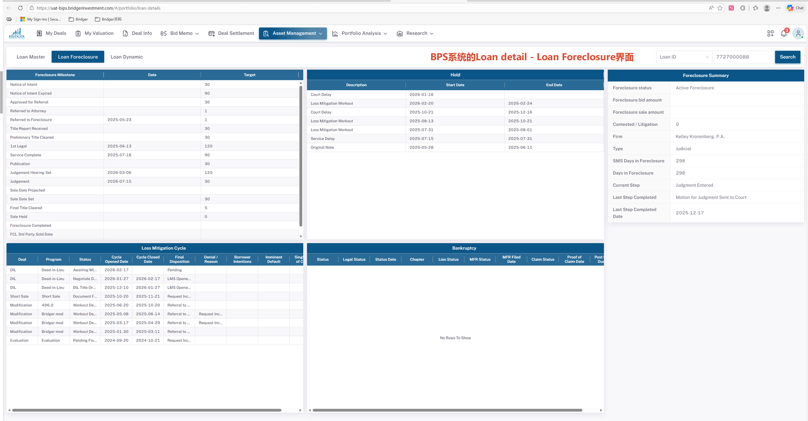
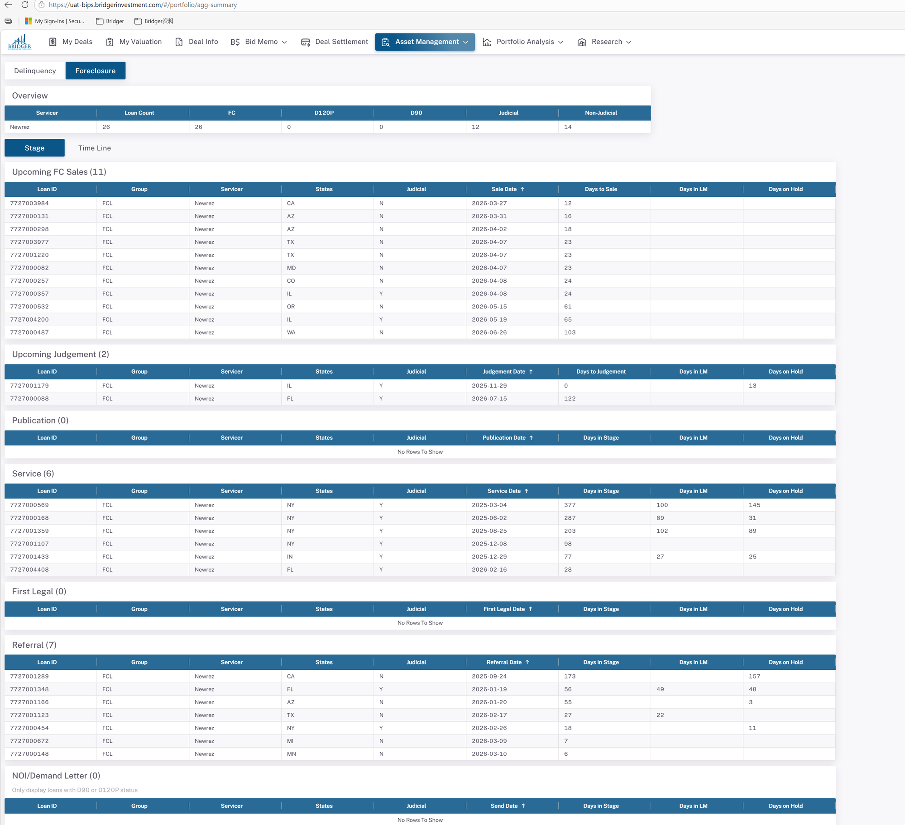
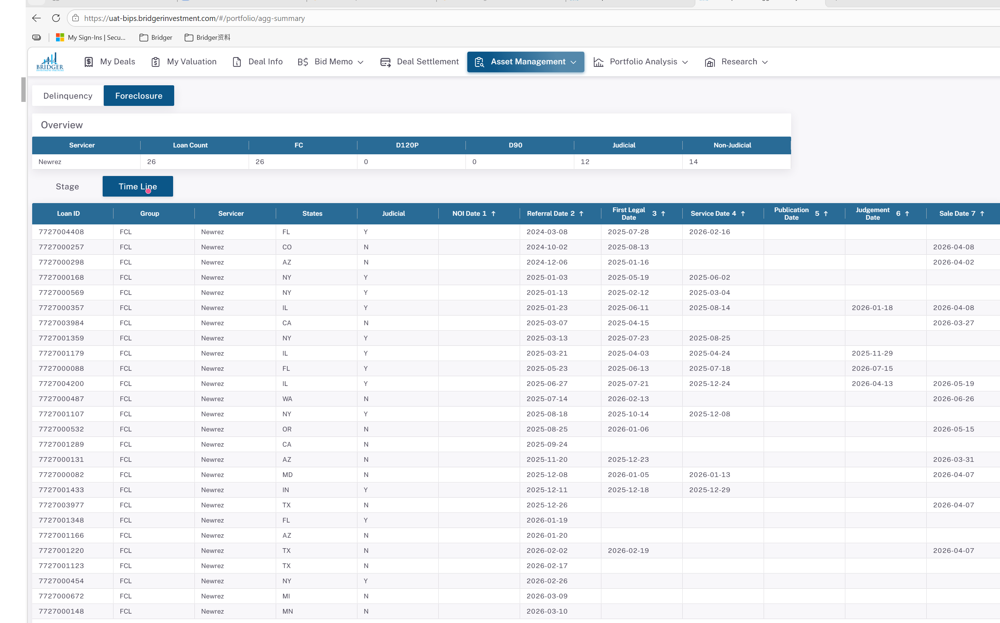
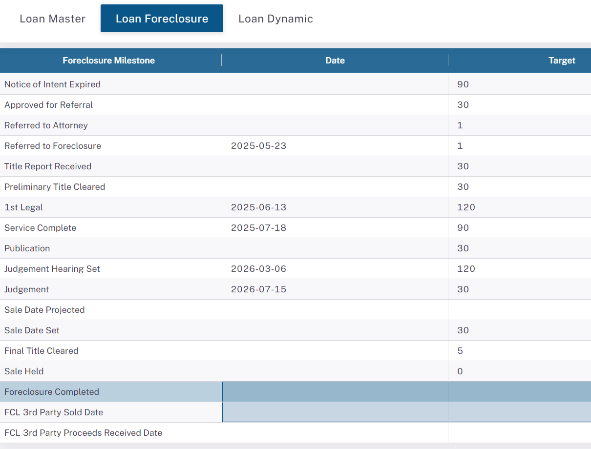
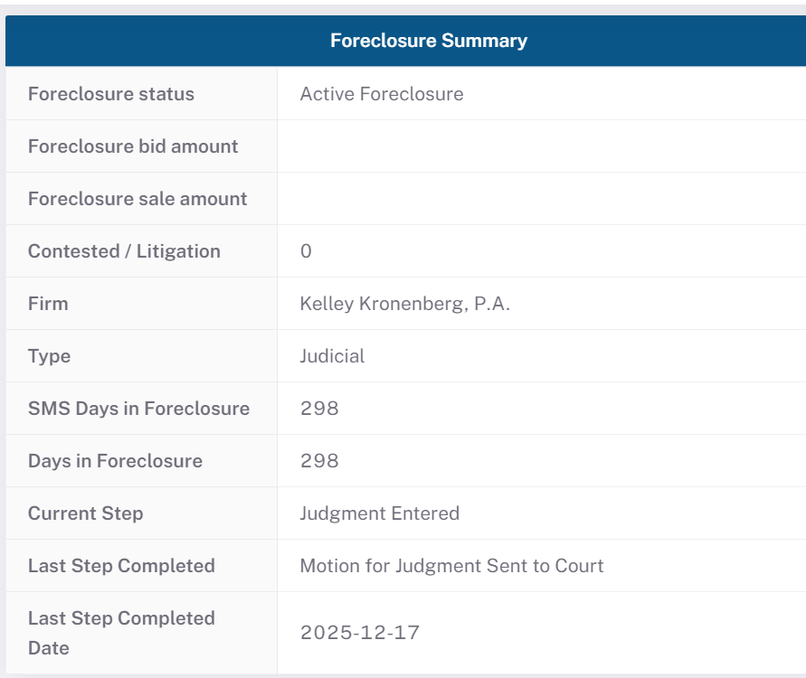
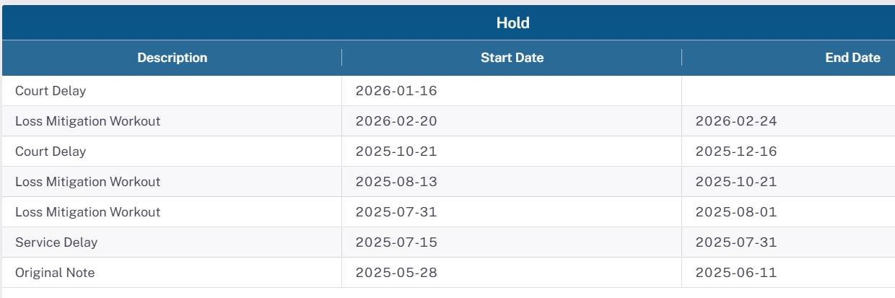
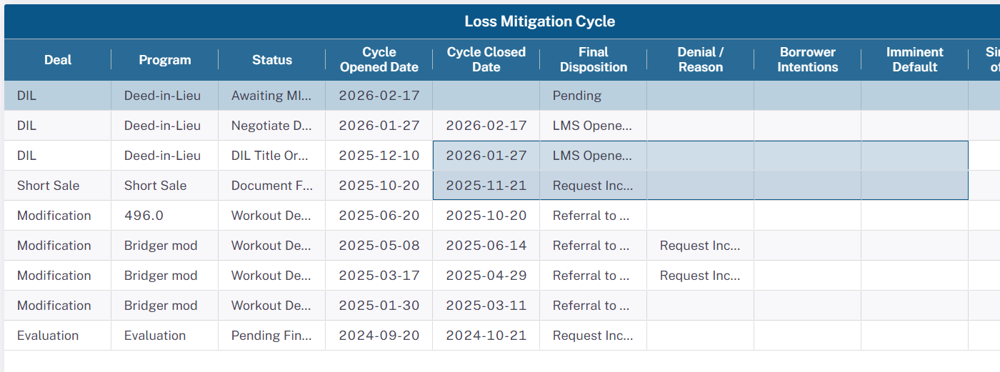
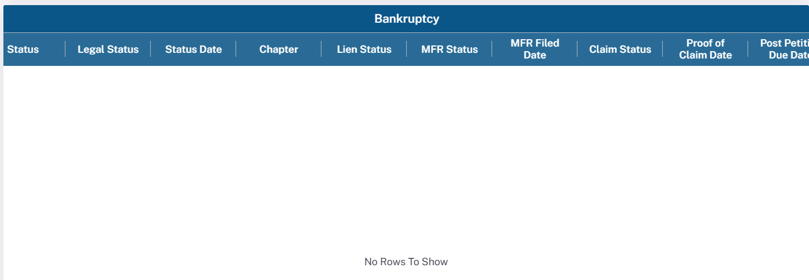
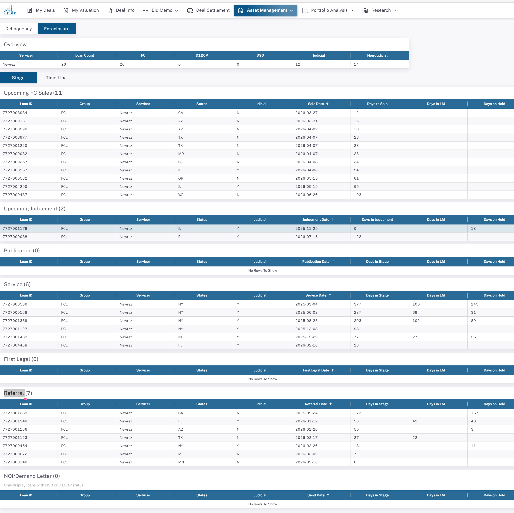

# doc 13 — Newrez FCL 字段逆向映射规则：BPS 展示字段 → Newrez 原始数据

---

## 文档说明

- **文档存在的原因**：之前的 doc 08/09/11 以行业通用标准为出发点，定义 Servicer "应当"提供什么字段。本文转换视角——以 BPS Asset Management 系统 Foreclosure 界面的实际展示字段为终点，逆向还原每个展示字段来自哪张 Newrez 原始表、哪个字段，以及经过了什么计算规则。
- **解决的问题**：当 BPS 界面上某个 FCL 字段显示异常时，运营/数据团队需要立刻知道"原始数据在哪里"。本文提供直接从 Newrez 原始字段到 BPS 展示字段的完整映射，无需翻阅 ETL 代码。
- **范围**：仅覆盖 Newrez（最大 Servicer，13,321 笔活跃 FCL）；仅覆盖 Foreclosure 相关字段；**不包含**中间 ETL 代码、Redshift 中间表、同步流程细节（见 doc 12）。
- **在系统中的位置**：本文是 doc 08（字段映射现状）的结果导向补充，也是 doc 12（ETL 流程）的业务含义注解。

## 目标读者

主要：运营分析师 · 数据质量工程师 · BPS 系统业务验收人员  
次要：新系统 ETL 开发者 · FCL 数据治理团队 · 未来 AI 会话

## 修订历史

| 日期 | 作者 | 版本 | 变更 | 关联 |
|------|------|------|------|------|
| 2026-06-04 | AI Agent（Claude Opus 4.8） | v35 | **改正 §3.7 `summary_foreclosure_status` 映射规则**（代码+DB 核实）：原作 `activefcflag=1 → 取 fcstage；=0 → fcresults 或 fcremovaldesc` 系**错误**。真实逻辑（basic_data_pool_config.py:273 GEN_FCL_DETAIL）：`activefcflag=1` → 固定文本 `'Active Foreclosure'`；`activefcflag=0` 且 `fcremovaldesc` 非空 → `'Closed Foreclosure:'+fcremovaldesc`；否则 NULL。`fcstage` 实际填 `summary_current_step`、`fcresults` 不参与。同步：业务含义、§3 头注、附录 A/A.B 两处来源注（标注 dev 陈旧样本）、Type/Current Step/Completed Foreclosure 箭头简写写全为「如果…则…」。DB 实测 Active 43/Closed 50/NULL 1 全符合；另 4 行陈旧脏数据已注明。同步 doc 16/14 | 代码 basic_data_pool_config.py:273 · doc 14 v33 · doc 16 v3 |
| 2026-06-03 | AI Agent（Claude Opus 4.8） | v34 | §3.7 脚注补 `summary_sms_days_in_fcl` vs `summary_days_in_fcl` 起算基准（代码+DB 核实）：days←`fcreferraldate`(datediff+1, :1628)=投资人全程；sms←Newrez 原生 `smsdaysinfc`(svc_days_infc, :280/:1545)实测自 `fcsetupdate`=servicer/SMS 口径 → sms≤days（91 笔仅 2 笔不等）；BPS 两者 +DATEDIFF 实时修正(:597-598)。同步 doc 14 v31 | 代码 basic_data_pool_config.py · doc 14 v31 |
| 2026-06-03 | AI Agent（Claude Opus 4.8） | v33 | §5 数值解码补充机制溯源（代码+DB 验证）：lmdeal/lmprogram/lmstatus/lmdecision/borrowerintention/denialreason 解码源 = **Redshift 字典表 `newrez.portnewrezdatadic`**（dev MySQL 无），解码 JOIN 在 `basic_data_pool_config.py:835-840`（BK 在 :367），非硬编码；LMDeal 字典 13 码、实测 8 码；并说明跨表 join 偶见 lmdeal=1→Evaluation 系快照时点伪差 | basic_data_pool_config.py:835-840；Redshift portnewrezdatadic；doc 数据字典 |
| 2026-06-03 | AI Agent（Claude Opus 4.8） | v32 | 【可读性】把值/枚举列表的中点 `·` 分隔符统一改为 `\|`（与 doc 14 一致）：currentmilestone / fchold 描述 / stage 输出字段 / bk 解码 / Q7 等 13 处；保留「X 阶段 · 子含义」结构标签、读者行、环境标注、跨文档引用、修订史里的 `·` | doc 14 v24 |
| 2026-06-03 | AI Agent（Claude Opus 4.8） | v31 | 【术语更正】`activefcflag=0` 原多处误称"已完结"，实为**当前不处于活跃止赎流程**——DB 实测（曾转介 FCL 且 activefcflag=0）：Reinstated 26 / Loss Mitigation 16 / Paid in Full 11（中止退出，未完成）vs REO·3rd·DiL 共 10（真正完成）；BPS 统称 Closed Foreclosure≠Completed。更正 Section 1 入库表、Section 3.7 summary_completed_foreclosure、Section 7 人口框架、Section 8 Q3、activefcflag 字段定义；同步 doc 16/doc 14 | DB 实测 2026-06-03 |
| 2026-06-02 | AI Agent（Claude Opus 4.8） | v30 | 【ETL 代码 + DB 实测核实后更正 Section 6 破产面板映射】对照 `basic_data_pool_config.py:349-363` 逐字段核实：① `status_date` 实为 `bkfileddate`（破产申请日），非 `bkrcurrentstatusdate`；② `lien_status`/`mfr_status`/`claim_status`/`mfr_filed_date` 在 Newrez 提取链路**硬编码 NULL**（非 `mfrhearingresults`/`mfrfileddate`），DB 实测 0/64（mfr_filed_date 3/64 疑非提取链路）；③ `bankruptcy_status` = `COALESCE(datadic[BKStatus]解码, bkstatus)`，实测含 Completed/Cancelled 等（早前 1→Active…5 映射不完整）。同步更正 doc 16 ⑤ 块A/块B | ETL 代码 basic_data_pool_config.py:349-363；doc 16 |
| 2026-06-01 | AI Agent（Claude Sonnet 4.6） | v29 | Section 2 全三个子表新增取值样例：2.1 新增独立附属表「2.1-B 取值样例」（42 字段，含日期范围、枚举值，数据来自 MCP Redshift 实测）；2.2 和 2.3 各增第 4 列「取值样例/范围」；中英文版本同步更新 | — |
| 2026-05-26 | AI Agent（Claude Sonnet 4.6） | v1 | 初始版本——全量 BPS FCL 展示字段逆向映射；经 MCP 实测验证 | doc 08、doc 12 |
| 2026-05-26 | AI Agent（Claude Sonnet 4.6） | v2 | 依据 BPS UI 实际截图重新核对：①修正主 BPS 表名（sync_loan_foreclosure）；②修正视图列数（104列）；③重写 Hold 章节（全历史模型）；④新增 Loss Mitigation Cycle、Bankruptcy、聚合视图三个面板的完整映射；⑤修正 LM 字段编码描述（BPS 存储解码文本，非数字码）；⑥更新附录（7727000088 多面板验证） | doc 08、doc 12 |
| 2026-05-26 | AI Agent（Claude Sonnet 4.6） | v3 | Section 3.1–3.7 表结构全面升级：①新增首列"BPS 界面标签"（面板 > 字段显示文字，来源：BPS UI + MCP COLUMN_COMMENT）；②"Newrez 原始字段"与"来源表"合并为含完整路径的单列（`newrez.schema.table.field`）；③新增末列"业务含义"（来源：MCP COLUMN_COMMENT + 已有备注内容）；④BPS 字段完整路径通过各小节表头说明；⑤Section 3.4 由纯文字转换为结构化表格 | MCP COLUMN_COMMENT |
| 2026-05-26 | AI Agent（Claude Sonnet 4.6） | v4 | 新增"术语说明"章节（12 条关键术语快速参考：NOI/Demand Letter 区分、Target/Actual/Var Days 框架、dataasof、SMS/Shellpoint、MFR、POC、3rd Party Sale 等），位于截图参考与 Section 1 之间；完整定义同步至 doc 10 v2 | doc 10 v2 |
| 2026-05-26 | AI Agent（Claude Sonnet 4.6） | v5 | 方案 A：优化表格宽度——将各小节"Newrez 字段"列的 `newrez.portnewrezfc.` 前缀提取至小节表头说明，单元格仅保留字段名；Section 3.5（混合来源）保留 `portnewrezbk.` / `portnewrezfc.` 短前缀以区分来源；同步更新各小节列标题与表头注释 | — |
| 2026-05-27 | AI Agent（Claude Sonnet 4.6） | v6 | MCP 实测填充率补全：补测 Section 3.1 全部 `—` 字段（共 13,360 笔活跃 FCL）；关键发现：`titlereceiveddate`/`titlecleardate`=0%（Newrez 不提供）、`servicecompletedate`=28.9%、`fcjudgmententered`=7.9%；Section 3.7 补充实测值（`shellpointloanid`/`fcfirm`=100%，`lastfcstepcompleted`=99.5%，`fcsaleamount`=4.7%⚠️）；Section 8 新增 Q8/Q9（产权字段空缺 + 成交金额异常） | — |
| 2026-05-27 | AI Agent（Claude Sonnet 4.6） | v7 | 列顺序调整：将「业务含义」列移至 Section 3.x 所有表格第 2 列（3.1–3.7 全部调整），便于初学者优先理解业务语义，再看技术字段 | — |
| 2026-05-27 | AI Agent（Claude Sonnet 4.6） | v8 | 澄清两处歧义：①Section 3 开头新增「映射规则」列语义说明（数据流向 Newrez→BPS，与文档读取方向 BPS→Newrez 的关系）；②Section 3.4 头注补充公式操作数（actual_*/target_*）的 schema.table（均为 bpms_dev.sync_loan_foreclosure，全程不涉及 Newrez） | — |
| 2026-05-27 | AI Agent（Claude Sonnet 4.6） | v9 | 新增附录 B：数据验证 SQL（SQL-1 至 SQL-7），覆盖文档中所有 MCP 查询衍生数据——字段填充率（SQL-1）、fcresults 分布（SQL-2）、Q9 异常验证（SQL-3）、指定贷款原始字段（SQL-4）、Hold 历史（SQL-5）、LM 历史（SQL-6）、破产核查（SQL-7）；Section 2.1 / 3.1 / 附录 A 各新增 SQL 引用说明 | — |
| 2026-05-27 | AI Agent（Claude Sonnet 4.6） | v10 | 澄清映射规则列第三处歧义：Section 3 开头注释块新增第 4 条要点，明确映射规则表达式中引用的字段名（如 `activefcflag`、`judicial`）均属于该小节"Newrez 来源表"所指定的 Newrez 表，不涉及任何 BPS 字段 | — |
| 2026-05-27 | AI Agent（Claude Sonnet 4.6） | v11 | 附录 B SQL 全面覆盖：①新增 SQL-8（查询 `bpms_dev.sync_loan_foreclosure` 的 target_*/actual_*/var_* 三组字段，覆盖 Section 3.2/3.3/3.4）；②补全 Section 3.2～3.7、Section 4、Section 5、Section 8 的「验证 SQL」头注引用 | — |
| 2026-05-27 | AI Agent（Claude Sonnet 4.6） | v12 | 全面补充各页面数据范围说明：Section 7（聚合概览页）新增入库条件/贷款总量/来源表头注；Section 4/5/6 新增「单贷款视图」数据范围说明；附录 B 新增 SQL-9（`sync_fcl_stage_info` 阶段分布汇总，复现聚合概览页统计） | — |
| 2026-05-27 | AI Agent（Claude Sonnet 4.6） | v13 | Section 7 新增「阶段划分判断逻辑」子节：瀑布式优先级判断表（7级）、各阶段判断条件（Newrez `portnewrezfc` 字段）、关键要点说明、截图数据一致性验证；附录 B 新增 SQL-10（JOIN `portnewrezfc` 验证阶段字段条件） | — |
| 2026-05-27 | AI Agent（Claude Sonnet 4.6） | v14 | Section 5 新增两个子节：①「LM 字段取值与业务含义」（Deal / Program / Status / Final Disposition 四张说明表）；②「为什么 LM 会有多轮次？」（4 条原因 + loanid=7727000088 的 9 轮时间线分析）；附录 B 新增 SQL-11（全量 LM 取值分布查询） | — |
| 2026-05-27 | AI Agent（Claude Sonnet 4.6） | v15 | Section 7「阶段划分判断逻辑」表新增第四列「BPS 输出字段（`sync_fcl_stage_info`）」，明确 Newrez 判断条件 → BPS 存储字段的完整映射；补充关键要点（ETL 写入字段 + BPS 页面显示 = BPS 存储数据）；SQL-10 同步扩展 SELECT，新增各阶段 BPS 日期/天数输出字段，实现跨管道完整验证 | — |
| 2026-05-27 | AI Agent（Claude Sonnet 4.6） | v16 | MCP 实测发现三项 SQL-10 Bug：①两库 collation 不一致导致 [1267] 报错；②两表均为每日快照表（`fctrdt`/`dataasof`），仅 loanid JOIN 产生笛卡尔积；③未过滤当前快照日。全部修复并实测验证通过（26 行，无重复）。更正「阶段划分判断逻辑」表 `stage` 列值为 DB 实际存储代码（全大写，如 `SALE`/`REFERRAL`）；新增 stage 代码 → BPS 页面显示名映射表；补充关键要点（snapshot 表说明 + collation / 笛卡尔积处理方法） | — |
| 2026-05-27 | AI Agent（Claude Sonnet 4.6） | v17 | Section 5 BPS 表结构映射表后新增「UI 列业务含义」子节：对 10 个 UI 列（Deal/Program/Status/Cycle Opened Date/Cycle Closed Date/Final Disposition/Denial Reason/Borrower Intentions/Imminent Default/Single Point of Contact）逐一说明其在 LM 处置流程中的业务角色，含 CFPB Reg X 依据 | — |
| 2026-05-27 | AI Agent（Claude Sonnet 4.6） | v18 | 术语说明新增「Upcoming FC Sales」词条：BPS 阶段代码 `SALE`；触发条件 `fcscheduledsaledate IS NOT NULL`；优先级 1（最高）；同时覆盖 Judicial 州（判决后）和 Non-Judicial 州（Service/Publication 后）；关联 BPS 输出字段 `sale_start_date`/`to_sale_days` | — |
| 2026-05-27 | AI Agent（Claude Sonnet 4.6） | v19 | Section 7 扩展为双视图（Stage Tab + Time Line Tab）：①标题更新；②新增「Time Line Tab」子节，含 12 列字段映射表（MCP JOIN 实测验证）、Group 字段含义（FCL/REO/D120P）、NOI Date vs Demand Date 区别、Judgement Date ~11天差异说明、3 笔样本贷款数据；③附录 B 新增 SQL-12（复现 Time Line Tab 视图，含 demand_start_date 对比列）；④Section 8 新增 Q10（judgement_start_date 约11天差异）和 Q11（noi_start_date 恒NULL / demand_start_date 不映射到 NOI Date 列） | — |
| 2026-05-27 | AI Agent（Claude Sonnet 4.6） | v20 | 【ETL 代码验证后更正】Time Line Tab 字段映射表 Judgement Date 6 行：Newrez 源字段由 `fcjudgmententered` 更正为 `fcjudgmenthearingscheduled`；注 4 完全重写（两字段含义不同：听证会排期日 vs 法院录入日，不是ETL处理延迟）；Section 8 Q10 全面更正（删除"延迟"说法，补充 ETL 代码出处及字段业务含义对比） | ETL代码 basic_data_pool_config.py 第264行实测验证 |
| 2026-05-28 | AI Agent（Claude Sonnet 4.6） | v21 | Section 8 新增 Q12：`port.basic_data_loan_fcl.fcjudgment_end_date` 存储于 Redshift ETL 中间表但未被任何下游 BPS ETL 消费；记录架构缺口与设计意图（跨 Servicer 标准化命名 + `actual_judgement_hearing_set_days` 计算预留字段） | doc 12 Section 15 |
| 2026-05-28 | AI Agent（Claude Sonnet 4.6） | v22 | Section 8 Q3 扩展：在 Q 表后新增「Q3 技术详解」子节，完整记录 `activefcflag` NULL-safe 处理的背景原因、SQL 正确写法（OR NULL / COALESCE）、业务逻辑（完结有多重证据，NULL 保守视为进行中）及影响范围 | doc 08 · doc 14 Section 2.1 |
| 2026-05-28 | AI Agent（Claude Sonnet 4.6） | v23 | 补充全部 5 张 BPS FCL 表的源数据筛选条件（ETL 代码验证）：Section 3.1 补充主 FCL 表代码来源；Section 4（Hold）补充两层筛选条件 + GROUP BY 去重 + 与主表独立性说明；Section 5（LM）补充 `dealstartdate IS NOT NULL` + 去重逻辑 + 数值解码说明；Section 6（BK）补充 `LENGTH(TRIM(bkstatus)) > 0` + 去重 + 额外 JOIN 说明；Section 7（聚合概览页）更正入库筛选为 `activefcflag=1 AND fcremovaldate IS NULL` + 补充 D90/D120P 次筛选 | ETL代码 asset_managment_config.py · basic_data_pool_config.py |
| 2026-05-29 | LiJiawen | v24 | 统一整理 BPS UI 截图：为所有手工补充截图添加 Figure 13-x 官方标题，改用相对路径，移除绝对 Windows 路径；同步英文版同位置截图标题 | docs/en/13 |
| 2026-06-01 | AI Agent（Claude Sonnet 4.6） | v30 | Section 5 LM 字段取值与业务含义全面修正（MCP SQL-D1/D2/D3 CTE JOIN 实测）：① Deal 表新增 `Deferment`（lmdeal=11）和 `Payoff`（lmdeal=9），将 `Repayment Plan` 更正为 `Payment Plan`（lmdeal=4），新增 Newrez 编码列；② Program 表从 5 条扩充到 20 条（含 Bridger mod、VA 系列、FHA 系列、Deferment 等）；③ Status 表从 6 条扩充到 20 条；④ BPS 表描述修正两处错误：`lmstatus=112` 由 "Awaiting MI Approval"→"Workout Denial"，`lmdecision=6` 由 "LMS Opened in Error"→"Referral to FC"；⑤ UI 列业务含义 Deal 描述同步更新 | SQL-D1/D2/D3 CTE JOIN 实测 |
| 2026-06-02 | AI Agent（Claude Sonnet 4.6） | v31 | 附录 B 验证 SQL 加快照日过滤（修正快照表计数膨胀）：SQL-1/2/3 查询 `newrez.portnewrezfc`（日快照表，891快照日×~7.6K贷款）补 `AND dataasof=(SELECT MAX(dataasof)...)`；SQL-9 查询 `bpms_dev.sync_fcl_stage_info`（日快照表）主查询+分母补 `fctrdt=(SELECT MAX(fctrdt)...)`。未改：SQL-5/6/7/8/11/13（bpms 事件/周期表，非日快照，~1-4行/贷款，无需过滤）、SQL-10/12（已含 fctrdt 过滤）。数据字典验证SQL（SQL-D1~D6）已用最新快照 CTE，无需改 | DB 实测 2026-06-02 |
| 2026-05-29 | LiJiawen | v25 | 将 doc 13 引用的 9 张截图文件重命名为有业务含义的英文 slug 文件名，并同步更新中英文引用路径 | docs/en/13 |
| 2026-05-29 | AI Agent（Claude Sonnet 4.6） | v26 | 附录 B 新增 SQL-13（Q7 验证：`bankruptcy_status`/`legal_status` 数值编码 vs 解码文本，含列类型查询 + 枚举值分布 + Newrez 数据字典对照）；Section 6 注意事项及 Section 8 Q7 同步新增 SQL-13 引用 | Section 8 Q7 |
| 2026-05-29 | AI Agent（Claude Sonnet 4.6） | v28 | Section 7 全面补充字段血缘路径：筛选条件字段追溯至 `newrez.portnewrezfc.field`（经 Redshift `port.basic_data_loan_fcl`）；阶段判断表头及7行条件列全部加全路径；Time Line Tab 表头更新；Newrez 数据来源小节全路径；ETL 代码验证（basic_data_pool_config.py lines 1789-1791）| — |
| 2026-05-29 | AI Agent（Claude Sonnet 4.6） | v27 | Section 3.1 三处映射错误修正（ETL 代码 `basic_data_pool_config.py` 实测验证）：① `timeline_judgement_date` 源字段由 `fcjudgmententered`（错）改为 `fcjudgmenthearingscheduled`（直接取值，填充率 7.9%→11.9%）；② `timeline_judgement_hearing_set_date` 映射规则由「直接取值」改为「ETL 追踪：MIN(dataasof WHERE 当前值)」；③ `timeline_sale_date_set_date` 同②模式；Section 3.1 脚注更新；Section 3.3 `actual_judgement_hearing_set_days` 公式修正为视图层公式 | ETL 代码 basic_data_pool_config.py 第264-265、295-303行 |

## 依赖

| 资源 | 说明 |
|------|------|
| `newrez.portnewrezfc` | Newrez FCL 主数据（MCP 实测，57列） |
| `newrez.portnewrezbk` | Newrez 破产数据（MCP 实测，60列） |
| `newrez.portnewrezlm` | Newrez 损失缓解数据（MCP 实测，56列） |
| `bpms_dev.sync_loan_foreclosure` | BPS FCL 主表（MCP 实测，86列） |
| `bpms_dev.sync_loan_foreclosure_hold` | BPS Hold 历史记录表（MCP 实测，15列） |
| `bpms_dev.sync_loan_foreclosure_loss_mitigation` | BPS LM 周期表（MCP 实测，22列） |
| `bpms_dev.sync_loan_foreclosure_bankruptcy` | BPS 破产记录表（MCP 实测，22列） |
| `bpms_dev.sync_fcl_stage_info` | BPS 阶段统计表（MCP 实测，57列） |
| `bpms_dev.biz_data_view_loan_details_foreclosure` | BPS 展示视图（MCP 实测，**104列**） |
| doc 12 | ETL 流程与中间表细节 |

## 已知限制

- `timeline_publication_date` 在 Newrez 原始表中无对应字段，BPS 中该字段通常为空
- 约 14.1% 的活跃 FCL 贷款 `demandsentdate` 为空（无 NOI 记录）
- `imminent_default` 和 `single_point_of_contact` 在 LM 同步表中对 Newrez 贷款均为 NULL（Newrez 不提供此类字段）
- ~~BPS Bankruptcy 面板中 `lien_status`、`claim_status` 的 Newrez 原始字段映射待进一步确认~~ **（2026-06-02 已核实）**：`lien_status` / `claim_status` / `mfr_status` / `mfr_filed_date` 在 ETL 提取层（basic_data_pool_config.py:349-363）**硬编码为 `NULL`**，未映射任何 Newrez 字段。详见 Section 6

---

## BPS 系统界面参考截图

**Figure 13-1 — Loan Foreclosure 详情页（Loan ID: 7727000088）**

包含：Foreclosure Milestone 时间线面板、Hold 面板、Foreclosure Summary 面板、Loss Mitigation Cycle 面板、Bankruptcy 面板。



**Figure 13-2 — Foreclosure 聚合概览页：Stage Tab（/agg-summary）**

包含：Overview 汇总表、按阶段分组的贷款列表（含 Days in Stage / Days in LM / Days on Hold 列）。



**Figure 13-3 — Foreclosure 聚合概览页：Time Line Tab（/agg-summary）**

包含：按贷款展示的 NOI Date、Referral Date、First Legal Date、Service Date、Publication Date、Judgement Date、Sale Date 七段时间线字段。



## 术语说明

> 以下为本文特有或高频出现的关键术语快速参考。项目通用术语（FCL、REO、LM、BK、Judicial/Non-Judicial、First Legal、Sale 等）的完整定义详见 **[doc 10 — ForeclosureRule2 综合术语清单](10_glossary.md)**。

| 术语 / 缩写 | 全称 | 说明 |
|---|---|---|
| **NOI** | Notice of Intent（止赎意向通知） | 止赎启动前向借款人发出的法律通知函（Judicial 州）。要求借款人在指定期限内（通常 30 天）还清欠款，否则启动止赎。见下条 Demand Letter。 |
| **Demand Letter** | 催款函 / 违约通知函 | NOI 的别称（Non-Judicial 州惯用名）。Newrez 字段命名为 `demandsentdate`，因此本文以"NOI / Demand"统称，对应 BPS 字段 `timeline_notice_of_intent_date`。 |
| **Referral Date** | FCL 转介日 | 贷款方将案件移交止赎律师的日期（Newrez：`fcreferraldate`）。是 BPS 入库筛选条件（非空才收录）和时间线计算起点。 |
| **FCL Hold** | 止赎暂停 | FCL 已启动但暂时中止的状态。常见原因：破产 Automatic Stay、LM 谈判进行中、法院延迟。BPS 在 Hold 面板（Section 4）记录完整历史。 |
| **Target Days** | 目标天数 | 系统按州/司法类型预设的各阶段合规基准天数（配置常量，非 Newrez 数据）。BPS 字段前缀 `target_*`，见 Section 3.2。 |
| **Actual Days** | 实际天数 | 各阶段两端 timeline 日期相减（`DATEDIFF`）得出的实际天数。BPS 字段前缀 `actual_*`，见 Section 3.3。 |
| **Var Days** | 差异天数（Variance Days） | `Actual Days − Target Days`。正数=超期落后，负数=提前，0=达标。BPS 字段前缀 `var_*`，见 Section 3.4。 |
| **dataasof** | 数据截止日 | Newrez 数据快照日期（通常滞后当天 1–2 天）。BPS 展示 FCL 天数时用 `DATEDIFF(今日, dataasof)` 补偿延迟，以反映当日真实天数。 |
| **SMS / Shellpoint** | Shellpoint Mortgage Servicing | Newrez 的旧品牌名（运营子品牌）。`smsdaysinfc`（"SMS 报告的 FCL 天数"）中的"SMS"即来源于此，对应投资者口径的 `daysinfc`。 |
| **MFR** | Motion for Relief (from Automatic Stay) | 贷款方向破产法院申请解除自动中止令的动议，批准后 FCL 可恢复推进。影响 BPS 破产面板 `mfr_filed_date`、`mfr_status` 字段（Section 6）。 |
| **POC** | Proof of Claim（债权申报书） | 贷款方在破产程序中向法院正式登记债权金额的文件。影响 BPS 破产面板 `proof_of_claim_date` 字段（Section 6）。 |
| **3rd Party Sale** | 第三方拍卖成交 | 拍卖中有外部买家出价成功，房产归第三方所有（相对于 REO：无人出价归贷款方）。通过 Newrez `fcresults` 字段判断，影响 `timeline_third_party_sold_date_date` 取值逻辑（Section 3.1）。 |
| **Upcoming FC Sales** | 即将到来的止赎拍卖（BPS 阶段：`SALE`） | BPS 阶段划分优先级最高（优先级 1）。触发条件：Newrez `fcscheduledsaledate IS NOT NULL`（止赎拍卖日期已正式排定）。一旦排期，无论 Judicial 州（判决后）还是 Non-Judicial 州（Service/Publication 后排期），贷款均归入此阶段。BPS 输出字段：`sale_start_date`（拍卖日）、`to_sale_days`（距拍卖剩余天数）。DB 存储代码：`SALE`（见 Section 7 stage 代码映射表）。 |

---

## Section 1：映射架构概述

本文关注 Newrez 原始数据与 BPS 展示界面两端的直接对应关系；中间的 Redshift 处理层已抽象略去（详见 doc 12）：

```
Newrez 原始数据 (MySQL newrez schema)
├── portnewrezfc   ← FCL 主表（时间线、阶段、Hold 槽位、竞价）
├── portnewrezbk   ← 破产数据（60列）
└── portnewrezlm   ← 损失缓解数据（56列）
          │
          │  ╔══════════════════════════════════════════╗
          │  ║  中间层（本文略去，详见 doc 12）          ║
          │  ║  Redshift 中间表 → BPS MySQL (bpms_dev) ║
          │  ╚══════════════════════════════════════════╝
          │
          ▼
BPS MySQL (bpms_dev schema) — 5张核心表
├── sync_loan_foreclosure (86列)          → Milestone 时间线、Summary、Bid Approval 面板
├── sync_loan_foreclosure_hold (15列)     → Hold 面板（全历史记录）
├── sync_loan_foreclosure_loss_mitigation (22列) → Loss Mitigation Cycle 面板
├── sync_loan_foreclosure_bankruptcy (22列)      → Bankruptcy 面板
└── sync_fcl_stage_info (57列)            → 聚合概览页各阶段 Days in Stage/LM/Hold
          │
          ▼
biz_data_view_loan_details_foreclosure（104列 VIEW）
（仅覆盖 sync_loan_foreclosure 的字段；Hold/LM/BK 面板数据由前端独立查询各自表）
```

**BPS 展示字段分组**（依次对应下文 Section 3.x）：

| 组 | 字段前缀 | 数量 | 含义 | 来源 BPS 表 |
|---|---|---|---|---|
| 1 | `timeline_*` | 19个 | FCL 时间线关键日期 | sync_loan_foreclosure |
| 2 | `target_*` | 16个 | 各阶段目标天数（配置常量） | sync_loan_foreclosure |
| 3 | `actual_*` | 16个 | 各阶段实际天数（计算值） | sync_loan_foreclosure |
| 4 | `var_*` | 16个 | 各阶段差异天数（计算值） | sync_loan_foreclosure |
| 5 | `variance_*` | 4个 | 破产/Hold 差异指标 | sync_loan_foreclosure |
| 6 | `bid_approval_*` | 4个 | 竞拍审批信息 | sync_loan_foreclosure |
| 7 | `summary_*` | 16个 | FCL 汇总状态 | sync_loan_foreclosure |
| — | Hold 面板 | 3列/行 | 历史 Hold 记录 | sync_loan_foreclosure_hold |
| — | LM Cycle 面板 | 10列/行 | LM 周期历史记录 | sync_loan_foreclosure_loss_mitigation |
| — | Bankruptcy 面板 | 10列/行 | 破产记录 | sync_loan_foreclosure_bankruptcy |
| — | 聚合视图 | 4列/行 | 阶段天数统计 | sync_fcl_stage_info |

### 5 张 BPS FCL 表源数据筛选条件汇总

> **ETL 代码验证来源**：`flow/basic_data/basic_data_config/basic_data_pool_config.py`（Newrez→Redshift 提取层）+ `flow/bps/bps_config/asset_managment_config.py`（Redshift→MySQL 同步层）

| BPS 表 | Newrez 源表 | 提取层筛选条件 | 同步层筛选条件 | 去重逻辑 | 含非活跃贷款(activefcflag=0)？ |
|---|---|---|---|---|---|
| `sync_loan_foreclosure` | `portnewrezfc` | 无（全量进 Redshift） | `fcreferraldate IS NOT NULL` + JOIN portfunding | 无 | ✅ 含（activefcflag=0：当前不处于活跃止赎，含完成/撤销/复议/付清） |
| `sync_loan_foreclosure_hold` | `portnewrezfc` | `fchold1startdate IS NOT NULL` | 各槽 description/dates 有一非空 + JOIN portfunding | GROUP BY (loanid, description, start_date) | ✅ 含 |
| `sync_loan_foreclosure_loss_mitigation` | `portnewrezlm` | `dealstartdate IS NOT NULL` | 无（全量）+ JOIN portfunding | ROW_NUMBER PARTITION BY (loanid, dealstartdate) | ✅ 含 |
| `sync_loan_foreclosure_bankruptcy` | `portnewrezbk` | `LENGTH(TRIM(bkstatus)) > 0` | 无（全量）+ JOIN portfunding | ROW_NUMBER PARTITION BY (loanid, bkfileddate) | ✅ 含 |
| `sync_fcl_stage_info` | `basic_data_loan_fcl`（多 Servicer 合并） | `activefcflag=1 AND fcremovaldate IS NULL`（主）；D90/D120P + demandsentdate 非空（次） | 无（全量）+ JOIN portfunding | CTE 多层计算 | ❌ 仅活跃 FCL |

> **关键差异**：`sync_fcl_stage_info` 是唯一**排除非活跃贷款（activefcflag=0）**的表——聚合概览页仅反映当前处于活跃止赎流程的 FCL，与其他 4 张表（含 activefcflag=0 的非活跃/历史贷款）的人口不同，不应直接比较数量。注：activefcflag=0 表示**当前不处于活跃止赎流程**（含已完成与已撤销/复议/付清），并非都是"已完结"。  
> **所有表均通过** `JOIN port.portfunding ON loanid` 确保贷款在融资池中。

---

## Section 2：Newrez FCL 原始表速查

### 2.1 newrez.portnewrezfc（FCL 主表）

> 数据规模：活跃 FCL（activefcflag=1）共 **13,321 笔**（dataasof 截至 2026-05-24）  
> **验证 SQL**：本表填充率来自 附录 B — SQL-1（可直接复制到 MySQL 运行）  
> **取值样例**：见下方 **2.1-B 取值样例**（含字段取值范围与枚举值，来自 MCP 实测）

| 原始字段 | 类型 | 业务含义 | 活跃FCL填充率 |
|---|---|---|---|
| `fcsetupdate` | date | FCL 开案日期（BPS 内部建档日） | 100% |
| `fcreferraldate` | date | 转介律师日期 | 100% |
| `demandsentdate` | date | Demand 信函发出日（NOI 发出） | 85.9% |
| `demandexpirationdate` | date | Demand 到期日（NOI 结束） | 85.7% |
| `firstlegaldate` | date | 首次法律行动日 | 57.6% |
| `servicecompletedate` | date | 法律文书送达完成日 | — |
| `titlereceiveddate` | date | 产权报告收到日 | — |
| `titlecleardate` | date | 产权清查完成日 | — |
| `fcjudgmenthearingscheduled` | date | 判决听证预定日（Judicial 州） | 11.9% |
| `fcjudgmententered` | date | 判决发布日 | — |
| `fcscheduledsaledate` | date | 排定/预计拍卖日 | 18.2% |
| `fcsalehelddate` | date | 实际拍卖日 | 2.1% |
| `fcremovaldate` | date | FCL 撤销/完成日 | — |
| `dtdeedrecorded` | date | 产权过户登记日 | — |
| `fcl3rdpartyproceedsreceiveddate` | date | 第三方拍卖款到账日 | — |
| `fcstage` | varchar | FCL 当前流程阶段（文本，来自 Newrez 系统） | — |
| `currentmilestone` | varchar | BPS 当前里程碑标签 | 62.7% |
| `lastfcstepcompleted` | varchar | 最近已完成步骤描述 | — |
| `lastfcstepcompleteddate` | date | 最近已完成步骤的日期 | — |
| `fcresults` | varchar | FCL 最终处置结果（已完结贷款） | — |
| `fcremovaldesc` | varchar | FCL 撤销原因说明 | — |
| `activefcflag` | int | FCL 是否处于活跃止赎流程（1=活跃止赎中 / 0=当前不处于活跃止赎，含完成/撤销/复议/付清） | 100% |
| `fccontestedflag` | int | 是否存在争议诉讼（1=是 / 0=否） | 100% |
| `judicial` | int | 是否司法止赎（1=Judicial / 0=Non-Judicial） | 100% |
| `fcfirm` | varchar | 止赎律师事务所名称 | — |
| `fcbidamount` | decimal | Servicer 报告竞拍出价金额 | 9.0% |
| `fcapprbidprice` | decimal | 批准竞拍出价金额 | 8.9% |
| `fcsaleamount` | decimal | 实际拍卖成交金额 | — |
| `smsdaysinfc` | int | Servicer 报告的 FCL 天数（截至 dataasof） | 100% |
| `daysinfc` | int | 投资者口径的 FCL 天数（截至 dataasof） | 100% |
| `fchold1description` | varchar | Hold 1 当前原因描述 | 89.6% |
| `fchold1startdate` | date | Hold 1 开始日 | — |
| `fchold1enddate` | date | Hold 1 结束日（为空表示仍在持续） | — |
| `fchold1projectedenddate` | date | Hold 1 预计结束日 | — |
| `fchold2description` | varchar | Hold 2 当前原因描述 | 69.8% |
| `fchold2startdate` | date | Hold 2 开始日 | — |
| `fchold2enddate` | date | Hold 2 结束日 | — |
| `fchold2projectedenddate` | date | Hold 2 预计结束日 | — |
| `fchold3description` | varchar | Hold 3 当前原因描述 | 52.6% |
| `fchold3startdate` | date | Hold 3 开始日 | — |
| `fchold3enddate` | date | Hold 3 结束日 | — |
| `fchold3projectedenddate` | date | Hold 3 预计结束日 | — |

> ⚠️ **Hold 槽位说明**：`portnewrezfc` 中的 3 个 Hold 槽位（fchold1/2/3）记录的是 **Newrez 当前时刻**的活跃/最近 Hold 状态。BPS 每日同步时，会将每次状态变化作为新行追加至 `sync_loan_foreclosure_hold`，从而保存完整的 Hold 历史（见 Section 4）。


#### 2.1-B 取值样例 / Value Examples

> 以下取值范围与枚举样例来自 MCP Redshift 实测（`newrez.portnewrezfc`，截至 2026-06-01）。日期格式均为 YYYY-MM-DD。

| 原始字段 | 类型 | 取值范围 / 取值样例 |
|---|---|---|
| `fcsetupdate` | date | `2024-02-07` ～ `2026-05-26` |
| `fcreferraldate` | date | `2024-02-07` ～ `2026-05-26`（通常与 `fcsetupdate` 相同） |
| `demandsentdate` | date | `2021-10-18` ～ `2026-04-20` |
| `demandexpirationdate` | date | 通常为 `demandsentdate + 30天` |
| `firstlegaldate` | date | 格式 YYYY-MM-DD；Non-Judicial 州多为空（活跃 FCL 57.6% 填充） |
| `servicecompletedate` | date | 格式 YYYY-MM-DD；活跃 FCL 28.9% 填充 |
| `titlereceiveddate` | date | Newrez 不提供，活跃 FCL 0% 填充 |
| `titlecleardate` | date | Newrez 不提供，活跃 FCL 0% 填充 |
| `fcjudgmenthearingscheduled` | date | 格式 YYYY-MM-DD；仅 Judicial 州（11.9% 填充） |
| `fcjudgmententered` | date | 格式 YYYY-MM-DD；仅 Judicial 州（法院录入日） |
| `fcscheduledsaledate` | date | `2025-04-17` ～ `2026-08-06`（18.2% 填充） |
| `fcsalehelddate` | date | `2025-05-27` ～ `2026-05-22`（2.1% 填充，仅完结贷款） |
| `fcremovaldate` | date | 格式 YYYY-MM-DD；FCL 完结时填充 |
| `dtdeedrecorded` | date | 格式 YYYY-MM-DD；活跃 FCL ~0% 填充 |
| `fcl3rdpartyproceedsreceiveddate` | date | 格式 YYYY-MM-DD；极少数完结贷款 |
| `fcstage` | varchar | Newrez 系统阶段文本，不标准化，填充率低 |
| `currentmilestone` | varchar | `'Closed'` \| `'First Legal'` \| `'Judgment Entered'` \| `'Sale Held'` \| `'Sold'` \| `'Service Complete'` \| `'Sale Scheduled'`（62.7% 填充） |
| `lastfcstepcompleted` | varchar | Newrez 系统自由文本，如 `'FC Referral'`、`'Sale Held'` |
| `lastfcstepcompleteddate` | date | 格式 YYYY-MM-DD |
| `fcresults` | varchar | `'REO'`（贷款方取得房产）/ `'3rd Party'`（第三方买家成交）/ 空（进行中 FCL） |
| `fcremovaldesc` | varchar | 自由文本，如 `'Foreclosure Completed'` |
| `activefcflag` | int | `1`（活跃止赎中）/ `0`（当前不处于活跃止赎流程；含完成/撤销/复议/付清） |
| `fccontestedflag` | int | `1`（有争议诉讼）/ `0`（无） |
| `judicial` | int | `1`（Judicial 州，如 NY/NJ/FL）/ `0`（Non-Judicial 州，如 CA/TX） |
| `fcfirm` | varchar | 律师事务所名称，自由文本 |
| `fcbidamount` | decimal | `$90,000` ～ `$543,305.96`（活跃 FCL，9.0% 填充） |
| `fcapprbidprice` | decimal | 与 `fcbidamount` 同量级（批准出价，8.9% 填充） |
| `fcsaleamount` | decimal | 格式 NNNNNN.NN；仅拍卖成交时有值 |
| `smsdaysinfc` | int | `1` ～ `606` 天（Shellpoint/SMS 口径） |
| `daysinfc` | int | `1` ～ `814` 天（投资者口径） |
| `fchold1description` | varchar | `'Loss Mitigation Workout'` \| `'Awaiting Funds to Post'` \| `'Service Delay'` \| `'Court Delay'` \| `'Hearing Set'` \| `'Client Document Execution'` \| `'Original Note'` \| `'Delinquency Review'` \| `'Bankruptcy Filed'` \| `'Moratorium'` \| `'Awaiting Escrow Analysis'` \| `'Title Resolution'`（89.6% 填充） |
| `fchold1startdate` | date | 格式 YYYY-MM-DD |
| `fchold1enddate` | date | 格式 YYYY-MM-DD；空 = Hold 仍持续 |
| `fchold1projectedenddate` | date | 格式 YYYY-MM-DD |
| `fchold2description` | varchar | 同 `fchold1description` 枚举值（69.8% 填充） |
| `fchold2startdate` | date | 格式 YYYY-MM-DD |
| `fchold2enddate` | date | 格式 YYYY-MM-DD |
| `fchold2projectedenddate` | date | 格式 YYYY-MM-DD |
| `fchold3description` | varchar | 同 `fchold1description` 枚举值（52.6% 填充） |
| `fchold3startdate` | date | 格式 YYYY-MM-DD |
| `fchold3enddate` | date | 格式 YYYY-MM-DD |
| `fchold3projectedenddate` | date | 格式 YYYY-MM-DD |

### 2.2 newrez.portnewrezbk（破产数据，60列）

以下为 BPS Bankruptcy 面板展示的主要原始字段：

| 原始字段 | 类型 | 业务含义 | 取值样例/范围 |
|---|---|---|---|
| `activebkflag` | int | 是否在破产保护中（1=是 / 0=否） | `1`（破产中）/ `0`（已终止） |
| `bkchapter` | int | 破产章节（7 / 11 / 13 等） | `7`（清算）/ `11`（重组）/ `13`（个人还款计划） |
| `bkfileddate` | date | 破产申请日 | `2008-06-16` ～ `2026-04-27` |
| `bkstatus` | int | 破产状态（数值编码） | `1`～`5`（Newrez 内部码；BPS 端**已解码为文本** Active/Discharged/Dismissed/Closed/ReliefGranted，见 Section 6 / Q7） |
| `bkstage` | int | 破产阶段（数值编码） | `0`～`22`（常见：`8`/`21`/`1`/`4`）。注：BPS `legal_status` 实际取自 `portnewrezgeneral.legalstatus` 文本，**不取自本字段**（见 Section 6 / Q7） |
| `bkrcurrentstatusdate` | date | 当前状态生效日期 | 格式 YYYY-MM-DD |
| `bkremovaldate` | date | 破产程序终止日 | `2009-09-18` ～ `2026-04-14` |
| `bkremovalcode` | int | 破产终止原因（数值编码） | `1`（Dismissed）/ `2`（Discharged）/ `3` / `4` |
| `mfrfileddate` | date | 解除留置动议（MFR）提交日 | `2025-06-10` ～ `2026-04-29` |
| `mfrhearingdate` | date | MFR 听证日 | 格式 YYYY-MM-DD |
| `mfrgranteddate` | date | MFR 批准日 | 格式 YYYY-MM-DD |
| `mfrhearingresults` | int | MFR 听证结果（数值编码） | `0`（无结果/待定）/ `3` / `4` / `5` / `6` |
| `pocfileddate` | date | 债权申报（POC）提交日 | `2001-01-01` ～ `2026-05-04` |
| `bkpostpetitionduedate` | date | 破产申请后贷款应付日 | 格式 YYYY-MM-DD |
| `bkcasenumber` | varchar | 破产案件编号 | 如 `'1:23-bk-12345'`（格式随法院） |
| `bkfirm` | varchar | 破产律师事务所名称 | 自由文本，如 `'Robertson Anschutz...'` |
| `debtorintention` | int | 债务人意向（数值编码） | `1`（最常见）/ `2` / `0` |

### 2.3 newrez.portnewrezlm（损失缓解数据，56列）

以下为 BPS Loss Mitigation Cycle 面板展示的主要原始字段：

| 原始字段 | 类型 | 业务含义 | 取值样例/范围 |
|---|---|---|---|
| `activelmflag` | int | 是否在 LM 方案中（1=是 / 0=否） | `1`（LM 进行中）/ `0`（未在 LM 或已结束） |
| `lmdeal` | int | LM 交易类型（数值编码，ETL 解码为文本） | 实测值：`1`/`2`/`4`/`5`/`6`/`7`/`9`/`11`；解码→ `Evaluation`/`Modification`/`Forbearance`/`Short Sale`/`DIL` 等（详见 Section 5） |
| `lmprogram` | int | LM 方案名称（数值编码，ETL 解码为文本） | 实测 15+ 种（`10`→Deed-in-Lieu、`21`→Evaluation、`73`/`396`/`496` 等）；解码见 Section 5 |
| `lmstatus` | int | LM 当前状态（数值编码，ETL 解码为文本） | 实测 15+ 种（`5`/`20`/`112`/`113`/`166` 等）；解码→ `Pending Financials`/`Workout Denial` 等（见 Section 5） |
| `dealstartdate` | date | LM 周期开始日 | `2020-08-17` ～ `2026-05-29` |
| `lmremovaldate` | date | LM 周期结束日 | `2020-09-22` ～ `2026-05-29`；空 = 周期仍进行中 |
| `lmdecision` | int | LM 审批结论（数值编码，ETL 解码为文本） | 实测值：`1`/`4`/`5`/`6`/`7`/`10`/`11`/`14`/`17`/`99`；解码→ `Approved`/`Denied`/`Referral to FC`/`Pending` 等（见 Section 5） |
| `denialreason` | int | 拒绝原因（数值编码，ETL 解码为文本） | 实测 10+ 种（`4`/`6`/`76`/`109` 等）；无拒绝时为空 |
| `borrowerintention` | int | 借款人意向（数值编码，ETL 解码为文本） | `1`/`2`/`3`；Newrez 贷款通常为空 |
| `hardshiptype` | int | 困境类型（数值编码） | 实测 10+ 种（`7`/`8`/`11`/`12`/`19`/`20`/`21`/`33`/`35` 等） |
| `daysindeal` | int | 在当前 LM 交易中的天数 | `0` ～ `991` 天 |
| `daysinstatus` | int | 在当前状态中的天数 | `0` ～ `991` 天 |

> **重要**：Newrez `portnewrezlm` 存储数值编码（`lmdeal`、`lmprogram` 等均为 int）。ETL 在写入 BPS 的 `sync_loan_foreclosure_loss_mitigation` 时会**自动解码为业务文本**（如 `lmdeal=7` → `"DIL"`，`lmprogram=10` → `"Deed-in-Lieu"`）。

---

## Section 3：BPS 展示字段完整映射表

> **「Newrez字段 → BPS展示字段」列说明**：该列记录 ETL 将 Newrez 原始字段值转换写入 BPS 展示字段时所用的具体规则。常见规则值：
> - `直接取值`：ETL 将 Newrez 字段值原样复制到 BPS，不做任何转换
> - `COALESCE(A, B)`：取 A、B 中第一个非空值写入 BPS
> - `当 fcresults='xxx' 时取...`：条件赋值，根据另一字段值决定写入内容
> - `如果 …，则 = …；否则 …`：完整条件赋值（已避免纯箭头简写）。⚠️ 注意输出值可能是**固定文本常量**（如 `'Active Foreclosure'`），并非条件字段本身的值——例如 `summary_foreclosure_status` 用 `activefcflag` 作判断，但写入的是常量而非 `activefcflag` 的值；`fcstage` 也不写入此字段（它去的是 `summary_current_step`）。
> - **条件字段说明**：规则表达式里出现的所有字段名（如 `activefcflag`、`judicial`、`currentmilestone`）均属于该小节"Newrez 来源表"所指定的 Newrez 表（通常为 `newrez.portnewrezfc`）。ETL 在 Newrez 侧读取这些字段完成条件判断，**不涉及任何 BPS 字段**。

### 3.1 FCL 时间线日期（timeline_*）

> **入库筛选条件**：`bpms_dev.sync_loan_foreclosure.timeline_referred_to_foreclosure_date IS NOT NULL`（来源字段：`newrez.portnewrezfc.fcreferraldate`；仅已转介 FCL 的贷款才有数据）  
> **ETL 代码来源**：筛选在 `asset_managment_config.py` `GEN_FORECLOSURE` SQL 末尾执行（`WHERE a.timeline_referred_to_foreclosure_date IS NOT NULL`）；同时须 `JOIN port.portfunding ON loanid`（贷款须在融资池中）。`newrez.portnewrezfc` 全量进入 Redshift 中间表 `port.basic_data_loan_fcl`，过滤在 Redshift→MySQL 同步层发生。  
> **BPS 数据库路径**：以下字段均位于 `bpms_dev.sync_loan_foreclosure`，完整路径为 `bpms_dev.sync_loan_foreclosure.{BPS展示字段}`  
> **Newrez 来源表**：以下"Newrez 字段"列的字段均来自 `newrez.portnewrezfc`（已省略前缀，完整路径格式为 `newrez.portnewrezfc.{字段名}`）  
> **验证 SQL**：「实测填充率」列来自 附录 B — SQL-1；`fcresults` 分布（266笔 3rd Party 注释）来自 SQL-2
>
**Figure 13-4 — Loan Foreclosure 详情页：Foreclosure Milestone 时间线面板**



| BPS 界面标签 | 业务含义 | BPS 展示字段 | Newrez 字段 | Newrez字段 → BPS展示字段 | 实测填充率 |
|---|---|---|---|---|---|
| Milestone > Notice of Intent Date | NOI / Demand 信函发出日。约 14.1% 活跃 FCL 贷款为空（Newrez 未记录 Demand 信函发出事件） | `timeline_notice_of_intent_date` | `demandsentdate` | 直接取值 | 85.9% |
| Milestone > Notice of Intent End Date | NOI 到期日，通常为发出日 +30 天 | `timeline_notice_of_intent_end_date` | `demandexpirationdate` | 直接取值 | 85.7% |
| Milestone > Approved for Referral Date | FCL 内部批准开案日（BPS 建档日）。实测与 attorney referral 日通常相同 ⚠️ | `timeline_approved_for_referral_date` | `fcsetupdate` | 直接取值 | 100% |
| Milestone > Referred to Attorney Date | 转介律师日。Newrez 中 `fcreferraldate` 与 `fcsetupdate` 通常为同一日期 ⚠️ | `timeline_referred_to_attorney_date` | `fcreferraldate` | 直接取值 | 100% |
| Milestone > Referred to Foreclosure Date | **BPS 入库过滤字段**：非空才收录。与律师转介来自同一 Newrez 字段 `fcreferraldate` ⚠️ | `timeline_referred_to_foreclosure_date` | `fcreferraldate` | 直接取值 | 100% |
| Milestone > Title Report Received Date | 产权报告收到日 ⚠️ Newrez 实测不填充此字段（活跃 FCL 全部为空） | `timeline_title_report_received_date` | `titlereceiveddate` | 直接取值 | 0.0% |
| Milestone > Preliminary Title Cleared Date | 初步产权清查完成日 ⚠️ Newrez 实测不填充此字段，与 Final Title 来自同一字段 `titlecleardate` | `timeline_preliminary_title_cleared_date` | `titlecleardate` | 直接取值（初步清查） | 0.0% |
| Milestone > First Legal Date | 首次法律行动日（Filing）。Non-Judicial 州通常为空（无需诉诸法院） | `timeline_first_legal_date` | `firstlegaldate` | 直接取值 | 57.6% |
| Milestone > Service Date | 法律文书送达完成日 | `timeline_service_date` | `servicecompletedate` | 直接取值 | 28.9% |
| Milestone > Publication Date | ⚠️ Newrez 不报告止赎公告日；此字段在 BPS 中通常为空，相关 actual/var 也为空 | `timeline_publication_date` | *(Newrez 无对应字段)* | Newrez 未提供，BPS 中始终为空 | 0% |
| Milestone > Judgement Hearing Set Date | **当前听证日期值在 Newrez 快照中首次出现的日期**（ETL 追踪字段，非直接取值）。每次改期后，此值更新为新排期日首次出现的 `dataasof`。仅 Judicial 州适用 ⚠️ | `timeline_judgement_hearing_set_date` | `fcjudgmenthearingscheduled` | **ETL 追踪**：`MIN(dataasof WHERE fcjudgmenthearingscheduled = 当前值)`（代码：`basic_data_pool_config.py` 第 295–298 行） | 11.9% |
| Milestone > Judgement Date | **当前排定的判决听证会日期**（`fcjudgmenthearingscheduled` 的直接当前值）。Judicial 州专用 ⚠️ 源字段为 `fcjudgmenthearingscheduled`（听证排定日），**不是** `fcjudgmententered`（法院录入日） | `timeline_judgement_date` | `fcjudgmenthearingscheduled` | 直接取值（代码：`basic_data_pool_config.py` 第 265 行） | 11.9% |
| Milestone > Projected Sale Date | 最新预计/排定拍卖日（动态更新） | `timeline_sale_date_projected_date` | `fcscheduledsaledate` | 直接取值 | 18.2% |
| Milestone > Sale Date Set | **当前排定拍卖日期值在 Newrez 快照中首次出现的日期**（ETL 追踪字段，与 Judgement Hearing Set Date 逻辑相同）。每次改期后，此值更新为新拍卖日首次出现的 `dataasof` ⚠️ | `timeline_sale_date_set_date` | `fcscheduledsaledate` | **ETL 追踪**：`MIN(dataasof WHERE fcscheduled_sale_date = 当前值)`（代码：`basic_data_pool_config.py` 第 300–303 行） | 18.2% |
| Milestone > Final Title Cleared Date | 最终产权清查完成日 ⚠️ Newrez 实测不填充此字段，与 Preliminary Title 来自同一字段 `titlecleardate` | `timeline_final_title_cleared_date` | `titlecleardate` | 直接取值（最终清查） | 0.0% |
| Milestone > Sale Date Held | 实际拍卖举行日。大多数活跃 FCL 贷款尚未到达此阶段 | `timeline_sale_date_held_date` | `fcsalehelddate` | 直接取值 | 2.1% |
| Milestone > Foreclosure Completed Date | FCL 最终完成标志日。产权过户登记日优先；为空则取 FCL 撤销/完结日（实测：`dtdeedrecorded`=0%，`fcremovaldate`=2.0%，COALESCE 结果 2.0%） | `timeline_foreclosure_completed_date` | `dtdeedrecorded` / `fcremovaldate` | `COALESCE(dtdeedrecorded, fcremovaldate)` | 2.0% |
| Milestone > FCL 3rd Party Sold Date | 第三方买家成交日（活跃 FCL 中 266 笔 `fcresults='3rd Party'`）。需联合 `fcresults` 字段判断是否为第三方购买 ⚠️ | `timeline_third_party_sold_date_date` | `fcsalehelddate` | 当 `fcresults='3rd Party'` 时取 `fcsalehelddate` | 2.0% |
| Milestone > FCL 3rd Party Proceeds Received Date | 第三方拍卖款到账日（活跃 FCL 均未到达款项到账阶段） | `timeline_third_party_proceeds_received_date` | `fcl3rdpartyproceedsreceiveddate` | 直接取值 | 0.0% |

> ⚠️ **Newrez 特殊性说明**：
> - `fcsetupdate` 与 `fcreferraldate` 通常为同一日期（实测样本验证），因此 `timeline_approved_for_referral_date` 与 `timeline_referred_to_attorney_date` 往往相同。
> - `timeline_sale_date_projected_date` = `fcscheduledsaledate` 当前值（直接）；`timeline_sale_date_set_date` = 当前拍卖日值**首次出现的 `dataasof`**（ETL MIN 追踪）。来源字段相同但语义不同：前者是"拍卖排定在哪天"，后者是"该日期首次出现于 Newrez 的日期"。
> - `timeline_preliminary_title_cleared_date` 与 `timeline_final_title_cleared_date` 来自同一字段 `titlecleardate`，BPS 在不同阶段分别记录。

---

### 3.2 各阶段目标天数（target_*）

> **数据来源：系统配置常量，与 Newrez 无关**  
> **BPS 数据库路径**：以下字段均位于 `bpms_dev.sync_loan_foreclosure`，完整路径为 `bpms_dev.sync_loan_foreclosure.{BPS展示字段}`  
> **验证 SQL**：可通过 附录 B — SQL-8 查询样本贷款的 target_* 实测存储值（与 actual_*/var_* 同表输出，便于对比）

这些字段不来自 Newrez 原始数据，而是由 BPS 系统按 state / judicial / servicer 预设的合规目标值。

| BPS 界面标签 | 业务含义 | BPS 展示字段 | 来源 | 默认值 |
|---|---|---|---|---|
| Target Days > Notice of Intent | NOI 发出 → 到期的标准天数 | `target_notice_of_intent_days` | 系统配置 | 30天 |
| Target Days > Notice of Intent Expiration | NOI 到期 → 批准转介的标准天数 | `target_notice_of_intent_expired_days` | 系统配置 | 90天 |
| Target Days > Approved for Referral | 批准转介 → 正式转介的标准天数 | `target_approved_for_referral_days` | 系统配置 | 30天 |
| Target Days > Referred to Attorney | 转介律师 → 正式转介 FCL 的标准天数 | `target_referred_to_attorney_days` | 系统配置 | 1天 |
| Target Days > Referred to Foreclosure | 正式转介 → 首次法律行动的标准天数 | `target_referred_to_foreclosure_days` | 系统配置 | 1天 |
| Target Days > Title Report Received | 转介 → 收到产权报告的标准天数 | `target_title_report_received_days` | 系统配置 | 30天 |
| Target Days > Preliminary Title Cleared | 收到产权报告 → 初步清查完成的标准天数 | `target_preliminary_title_cleared_days` | 系统配置 | 30天 |
| Target Days > First Legal | 首次法律行动 → 送达的标准天数 | `target_first_legal_days` | 系统配置 | 120天 |
| Target Days > Service | 送达 → 判决听证的标准天数 | `target_service_days` | 系统配置 | 90天 |
| Target Days > Publication | 公告阶段标准天数 | `target_publication_days` | 系统配置 | 30天 |
| Target Days > Judgement Hearing Set | 判决听证 → 判决发布的标准天数（Judicial） | `target_judgement_hearing_set_days` | 系统配置 | 120天 |
| Target Days > Judgement | 判决 → 拍卖排定的标准天数 | `target_judgement_days` | 系统配置 | 30天 |
| Target Days > Sale Date Set | 拍卖排定 → 实际拍卖的标准天数 | `target_sale_date_set_days` | 系统配置 | 30天 |
| Target Days > Final Title Cleared | 最终产权清查标准天数 | `target_final_title_cleared_days` | 系统配置 | 5天 |
| Target Days > Sale Date Held | 拍卖举行 → 完结的标准天数 | `target_sale_date_held_days` | 系统配置 | 0天 |
| Target Days > Total | FCL 全程总目标天数 | `target_total` | 计算值 | = 以上之和 |

---

### 3.3 各阶段实际天数（actual_*）

> **数据来源：从 timeline_* 日期计算，非 Newrez 直接字段**  
> **BPS 数据库路径**：以下字段均位于 `bpms_dev.sync_loan_foreclosure`，完整路径为 `bpms_dev.sync_loan_foreclosure.{BPS展示字段}`  
> **端点字段说明**："计算公式"列中的 Newrez 端点字段均来自 `newrez.portnewrezfc`（已省略前缀）  
> **验证 SQL**：可通过 附录 B — SQL-8 查询样本贷款的 actual_* 计算结果（计算已由 BPS ETL 完成并存入表中，端点原始字段可用 SQL-4 查询）

公式：`actual_{阶段}_days = DATEDIFF(本阶段结束 timeline 日, 本阶段开始 timeline 日)`（仅两端均有日期时非空）

| BPS 界面标签 | 业务含义 | BPS 展示字段 | 计算公式（端点字段来自 portnewrezfc） |
|---|---|---|---|
| Actual Days > Notice of Intent | NOI 有效期天数（发出至到期） | `actual_notice_of_intent_days` | `demandexpirationdate` − `demandsentdate` |
| Actual Days > Notice of Intent Expiration | NOI 到期至批准转介的等待天数 | `actual_notice_of_intent_expire_days` | `fcsetupdate` − `demandexpirationdate` |
| Actual Days > Approved for Referral | 批准开案至正式转介律师的天数（Newrez 两字段通常同日，结果为 0） ⚠️ | `actual_approved_for_referral_days` | `fcreferraldate` − `fcsetupdate` |
| Actual Days > Referred to Attorney | 同字段相减，通常为 0 ⚠️ | `actual_referred_to_attorney_days` | `fcreferraldate` − `fcreferraldate` |
| Actual Days > Referred to Foreclosure | 转介至首次法律行动（Filing）的天数 | `actual_referred_to_foreclosure_days` | `firstlegaldate` − `fcreferraldate` |
| Actual Days > Title Report Received | 转介至收到产权报告的天数 | `actual_title_report_received_days` | `titlereceiveddate` − `fcreferraldate` |
| Actual Days > Preliminary Title Cleared | 收到产权报告至初步产权清查完成的天数 | `actual_preliminary_title_cleared_days` | `titlecleardate` − `titlereceiveddate` |
| Actual Days > First Legal | 首次法律行动至法律文书送达完成的天数 | `actual_first_legal_days` | `servicecompletedate` − `firstlegaldate` |
| Actual Days > Service | 送达完成至判决听证预定的天数 | `actual_service_days` | `fcjudgmenthearingscheduled` − `servicecompletedate` |
| Actual Days > Publication | 公告阶段实际天数（Newrez 无数据，通常为空） ⚠️ | `actual_publication_days` | 依赖 `timeline_publication_date`（Newrez 无此字段，始终为空） |
| Actual Days > Judgement Hearing Set | 从贷款下次还款到期日（DPD 参考锚）到**判决听证首次排定日**的累计天数（Judicial 州专用）⚠️ 公式由 BPS 视图层计算，与 Newrez 两端日期无直接关系 | `actual_judgement_hearing_set_days` | `TO_DAYS(timeline_judgement_hearing_set_date) − TO_DAYS(next_payment_due_date)`（BPS 视图 `biz_data_view_loan_details_foreclosure` 第 264 行；见 doc 14 SQL-C3 及「仍需确认」表） |
| Actual Days > Judgement | 判决至拍卖排定的天数 | `actual_judgement_days` | `fcscheduledsaledate` − `fcjudgmententered` |
| Actual Days > Sale Date Set | 拍卖排定至实际拍卖举行的天数 | `actual_sale_date_set_days` | `fcsalehelddate` − `fcscheduledsaledate` |
| Actual Days > Final Title Cleared | 拍卖举行至最终产权清查完成的天数 | `actual_final_title_cleared_days` | `fcsalehelddate` − `titlecleardate` |
| Actual Days > Sale Date Held | 拍卖举行至 FCL 完结的天数 | `actual_sale_date_held_days` | `fcremovaldate` − `fcsalehelddate` |
| Actual Days > Total | FCL 全程实际总天数 | `actual_total` | = 以上所有 actual_*_days 之和 |

---

### 3.4 各阶段差异天数（var_*）

> **纯计算字段，无原始数据来源**  
> **BPS 数据库路径**：以下字段均位于 `bpms_dev.sync_loan_foreclosure`，完整路径为 `bpms_dev.sync_loan_foreclosure.{BPS展示字段}`  
> **公式操作数来源**：计算公式中引用的 `actual_*_days`（来自 Section 3.3）和 `target_*_days`（来自 Section 3.2）均位于同一表 `bpms_dev.sync_loan_foreclosure`；三组字段（target / actual / var）全部同表，所有计算在 BPS 内部完成，**不涉及 Newrez 原始数据**。  
> **验证 SQL**：附录 B — SQL-8 同时输出 target_*/actual_*/var_* 三组字段，可直观对比计算关系（正数=落后目标；负数=提前完成）

计算公式：`var_{阶段}_days = actual_{阶段}_days − target_{阶段}_days`（正数=落后目标 / 负数=提前完成 / 0=恰好达标）

| BPS 界面标签 | 业务含义 | BPS 展示字段 | 计算公式 |
|---|---|---|---|
| Var Days > Notice of Intent | NOI 阶段实际 vs 目标偏差天数 | `var_notice_of_intent_days` | `actual_notice_of_intent_days` − `target_notice_of_intent_days` |
| Var Days > Notice of Intent Expiration | NOI 到期等待阶段偏差天数 | `var_notice_of_intent_expire_days` | `actual_notice_of_intent_expire_days` − `target_notice_of_intent_expired_days` |
| Var Days > Approved for Referral | 批准转介阶段偏差天数（因 actual 通常为 0，结果通常为 0 − 30 = −30） ⚠️ | `var_approved_for_referral_days` | `actual_approved_for_referral_days` − `target_approved_for_referral_days` |
| Var Days > Referred to Attorney | 转介律师阶段偏差天数（因 actual 通常为 0，结果通常为 0 − 1 = −1） ⚠️ | `var_referred_to_attorney_days` | `actual_referred_to_attorney_days` − `target_referred_to_attorney_days` |
| Var Days > Referred to Foreclosure | 正式转介至首次法律行动的偏差天数 | `var_referred_to_foreclosure_days` | `actual_referred_to_foreclosure_days` − `target_referred_to_foreclosure_days` |
| Var Days > Title Report Received | 产权报告收到阶段偏差天数 | `var_title_report_received_days` | `actual_title_report_received_days` − `target_title_report_received_days` |
| Var Days > Preliminary Title Cleared | 初步产权清查阶段偏差天数 | `var_preliminary_title_cleared_days` | `actual_preliminary_title_cleared_days` − `target_preliminary_title_cleared_days` |
| Var Days > First Legal | 首次法律行动阶段偏差天数 | `var_first_legal_days` | `actual_first_legal_days` − `target_first_legal_days` |
| Var Days > Service | 送达阶段偏差天数 | `var_service_days` | `actual_service_days` − `target_service_days` |
| Var Days > Publication | 公告阶段偏差天数（因 publication_date 通常为空，此值通常也为空） ⚠️ | `var_publication_days` | `actual_publication_days` − `target_publication_days` |
| Var Days > Judgement Hearing Set | 判决听证阶段偏差天数（Judicial 州专用） | `var_judgement_hearing_set_days` | `actual_judgement_hearing_set_days` − `target_judgement_hearing_set_days` |
| Var Days > Judgement | 判决至拍卖排定阶段偏差天数 | `var_judgement_days` | `actual_judgement_days` − `target_judgement_days` |
| Var Days > Sale Date Set | 拍卖排定阶段偏差天数 | `var_sale_date_set_days` | `actual_sale_date_set_days` − `target_sale_date_set_days` |
| Var Days > Final Title Cleared | 最终产权清查阶段偏差天数 | `var_final_title_cleared_days` | `actual_final_title_cleared_days` − `target_final_title_cleared_days` |
| Var Days > Sale Date Held | 拍卖举行至完结阶段偏差天数 | `var_sale_date_held_days` | `actual_sale_date_held_days` − `target_sale_date_held_days` |
| Var Days > Total | FCL 全程总偏差天数 | `var_total` | `actual_total` − `target_total` |

---

### 3.5 差异指标（variance_*）

> **BPS 数据库路径**：以下字段均位于 `bpms_dev.sync_loan_foreclosure`，完整路径为 `bpms_dev.sync_loan_foreclosure.{BPS展示字段}`  
> **Newrez 来源表（混合）**：前三行来自 `newrez.portnewrezbk`，第四行（Estimated Hold Days）来自 `newrez.portnewrezfc`；字段列已保留表名前缀（`portnewrezbk.` / `portnewrezfc.`）以区分混合来源  
> **验证 SQL**：`variance_estimated_hold_days` 的输入字段（`fchold*projectedenddate`）可通过 附录 B — SQL-4 查询（来自 `newrez.portnewrezfc`）；`portnewrezbk` 字段当前未在附录 B 中覆盖

| BPS 界面标签 | 业务含义 | BPS 展示字段 | Newrez 字段 | Newrez字段 → BPS展示字段 |
|---|---|---|---|---|
| Variance > Active Bankruptcy | 标记贷款当前是否处于活跃破产保护状态 | `variance_active_bankruptcy` | `portnewrezbk.activebkflag` | 直接取值（1=当前在破产保护中 / 0=否） |
| Variance > Completed Bankruptcy | 标记贷款历史上是否曾完成过破产程序 | `variance_completed_bankruptcy` | `portnewrezbk.activebkflag`, `portnewrezbk.bkremovaldate` | `activebkflag = 0 AND bkremovaldate IS NOT NULL` → 1（已完结破产）；否则 0 |
| Variance > Bankruptcies | 该贷款历史上的 BK 申请总次数（包含所有章节） | `variance_bankruptcies` | `portnewrezbk.loanid`（关联记录数） | `COUNT(*)` 按 loanid 分组 |
| Variance > Estimated Hold Days | 预估剩余 Hold 天数（基于 Newrez projected 字段，而非 Hold 历史表） ⚠️ | `variance_estimated_hold_days` | `portnewrezfc.fchold1projectedenddate`, `portnewrezfc.fchold2projectedenddate`, `portnewrezfc.fchold3projectedenddate` | `MAX(非空 projectedenddate) − current_date(纽约时间)` |

> **注**：`variance_estimated_hold_days` 来自 `newrez.portnewrezfc` 的 projected 字段（而非 `sync_loan_foreclosure_hold` 表，后者不存储预计结束日）。

---

### 3.6 竞拍审批字段（bid_approval_*）

> **BPS 数据库路径**：以下字段均位于 `bpms_dev.sync_loan_foreclosure`，完整路径为 `bpms_dev.sync_loan_foreclosure.{BPS展示字段}`  
> **Newrez 来源表**：以下"Newrez 字段"列的字段均来自 `newrez.portnewrezfc`（已省略前缀）  
> **验证 SQL**：`fcbidamount`/`fcapprbidprice` 的活跃 FCL 填充率来自 附录 B — SQL-1；样本贷款字段值可通过 SQL-4 查询

| BPS 界面标签 | 业务含义 | BPS 展示字段 | Newrez 字段 | Newrez字段 → BPS展示字段 |
|---|---|---|---|---|
| Bid Approval > Approval Status | 竞拍出价的审批状态（BPS 内部流程字段，不同步自 Newrez） | `bid_approval_status` | *(BPS 内部工作流)* | **非 Newrez 来源**；由 BPS 内部竞拍审批流程写入 |
| Bid Approval > Sale Date | 竞拍对应的排定拍卖日期（与 `timeline_sale_date_projected_date` 同源） | `bid_approval_sale_date` | `fcscheduledsaledate` | 直接取值 |
| Bid Approval > Bid Amount | BPS 批准的竞拍出价金额（活跃 FCL 填充率 8.9%） | `bid_approval_bid_amount` | `fcapprbidprice` | 直接取值 |
| Bid Approval > Loan Resolution Holds | 当前阻碍放款决议的 Hold 原因列表（字段名有拼写错误 "holods"，为原始字段名）⚠️ | `bid_approval_loan_resolution_holods` | `fchold1description`, `fchold2description`, `fchold3description` | 拼接所有非空 hold 描述，用 `;` 分隔 |

---

### 3.7 FCL 汇总字段（summary_*）

> **BPS 数据库路径**：以下字段均位于 `bpms_dev.sync_loan_foreclosure`，完整路径为 `bpms_dev.sync_loan_foreclosure.{BPS展示字段}`  
> **Newrez 来源表**：以下"Newrez 字段"列的字段均来自 `newrez.portnewrezfc`（已省略前缀）  
> **验证 SQL**：各字段填充率来自 附录 B — SQL-1；样本贷款字段值（含 `smsdaysinfc`/`dataasof`）来自 SQL-4
>
**Figure 13-5 — Loan Foreclosure 详情页：Foreclosure Summary 面板**



| BPS 界面标签 | 业务含义 | BPS 展示字段 | Newrez 字段 | Newrez字段 → BPS展示字段 |
|---|---|---|---|---|
| Summary > Foreclosure Status | FCL 状态文本：活跃时为固定文本 `Active Foreclosure`；非活跃且有撤销原因时为 `Closed Foreclosure:` + 撤销原因（`fcremovaldesc` 填充率 2.0%）；否则为空 | `summary_foreclosure_status` | `activefcflag`, `fcremovaldesc` | 如果 `activefcflag=1`，则 `summary_foreclosure_status` = 固定文本 `'Active Foreclosure'`；如果 `activefcflag=0` 且 `fcremovaldesc` 非空，则 = `'Closed Foreclosure:'` + `fcremovaldesc`；否则 = `NULL`。<br>（注：`fcstage` **不**参与本字段——它填充的是 `summary_current_step`；`fcresults` 也不用于本字段。代码 `basic_data_pool_config.py:273` GEN_FCL_DETAIL） |
| Summary > Foreclosure Bid Amount | Servicer 报告的竞拍出价金额（活跃 FCL 填充率约 9%） | `summary_foreclosure_bid_amount` | `fcbidamount` | 直接取值 |
| Summary > Foreclosure Sale Amount | 拍卖实际成交金额（活跃 FCL 填充率 4.7%，高于拍卖完成率 2.1%，存在数据滞后问题）⚠️ | `summary_foreclosure_sale_amount` | `fcsaleamount` | 直接取值 |
| Summary > Contested Litigation | 是否存在争议诉讼（1=是 / 0=否） | `summary_contested_litigation` | `fccontestedflag` | 直接取值 |
| Summary > Firm | 止赎律师事务所名称（与 Foreclosure Attorney 同源，BPS 界面重复展示） | `summary_firm` | `fcfirm` | 同 `summary_foreclosure_attorney`（两字段显示同源数据，用途略有侧重） |
| Summary > Type | 止赎类型文本（将布尔值 judicial 转换为可读文本） | `summary_type` | `judicial` | 如果 `judicial=1`，则 `summary_type` = `'Judicial'`；如果 `judicial=0`，则 = `'Non Judicial'`；如果 `judicial` 为 `NULL`/空，则 = `NULL` |
| Summary > SMS Days in FCL | Servicer（Newrez/SMS=Shellpoint）口径的 FCL 在途天数（自 servicer **建案日 fcsetupdate** 起算；消除数据截止日延迟） | `summary_sms_days_in_fcl` | `smsdaysinfc`(svc_days_infc), `dataasof` | **实时重算**：`smsdaysinfc + DATEDIFF(当天纽约时间, dataasof)`；基准=fcsetupdate，≤ Days in FCL（详见下方脚注） |
| Summary > Days in FCL | 投资者/全程口径的 FCL 在途天数（自**转介日 fcreferraldate** 起算；消除数据截止日延迟） | `summary_days_in_fcl` | `daysinfc`, `dataasof` | **实时重算**：`daysinfc + DATEDIFF(当天纽约时间, dataasof)`；基准=fcreferraldate，≥ SMS Days in FCL |
| Summary > Current Step | FCL 当前进行步骤（BPS 里程碑标签优先，其次为 Newrez 阶段描述） | `summary_current_step` | `currentmilestone` / `fcstage` | 如果 `currentmilestone` 非空，则 `summary_current_step` = `currentmilestone`；否则 = `fcstage`（此处即 Newrez 阶段文本的去处） |
| Summary > Last Step Completed | 最近已完成的 FCL 处理步骤文本描述（填充率 99.5%） | `summary_last_step_completed` | `lastfcstepcompleted` | 直接取值 |
| Summary > Last Step Completed Date | 最近已完成步骤的完成日期（填充率 99.5%） | `summary_last_step_completed_date` | `lastfcstepcompleteddate` | 直接取值 |
| Summary > Servicer Number | Newrez/Shellpoint 内部贷款编号（与投资者 loanid 区分；填充率 100%） | `summary_servicer_number` | `shellpointloanid` | 直接取值 |
| Summary > Completed Foreclosure | 标记 FCL 是否不再活跃（布尔值；⚠️ 字段名为 "Completed" 但实为"不再活跃"标志） | `summary_completed_foreclosure` | `activefcflag` | 如果 `activefcflag=0`，则 `summary_completed_foreclosure` = 1；如果 `activefcflag=1`，则 = 0（即对 `activefcflag` 取反）。⚠️ activefcflag=0 = **当前不处于活跃止赎**（实测含 Reinstated 26 / Loss Mitigation 16 / Paid in Full 11 / 真正完成 REO \| 3rd \| DiL 10），**并非都已完成** |
| Summary > Servicer FC Bid Amount | Servicer 口径的 FCL 竞拍出价（与 Bid Approval 面板的 `fcapprbidprice` 字段区分） | `summary_srv_fc_bid_amount` | `fcbidamount` | 同 `summary_foreclosure_bid_amount`（Servicer 视角，与 BPS 批准出价 `fcapprbidprice` 区分） |
| Summary > Judicial Foreclosure | 是否司法止赎（原始布尔值；`Type` 字段是其可读文本版本） | `summary_judicial_foreclosure` | `judicial` | 直接取值 |
| Summary > Foreclosure Attorney | 负责止赎程序的律师事务所全称（`Firm` 字段同源） | `summary_foreclosure_attorney` | `fcfirm` | 直接取值 |

> ⚠️ **`summary_sms_days_in_fcl` 与 `summary_days_in_fcl` 实测说明**：
> 样本贷款（loanid=7727000672）：`smsdaysinfc = 77`，`dataasof = 2026-05-24`，今日为 2026-05-26。
> 则 BPS 展示值 = 77 + 2 = **79天**（反映今日为止的天数，而非 Newrez 数据截止日当天的值）。
>
> **两者的核心区别 = 起算基准不同（代码+DB 核实 2026-06-03）**：
> - `summary_days_in_fcl` ← `daysinfc`：ETL 按**转介日 `fcreferraldate`** 重算 `datediff(referral_start_date, snapshot)+1`（仅 Active；`basic_data_pool_config.py:1628`）——**投资人/全程**口径。
> - `summary_sms_days_in_fcl` ← Newrez 原生 `smsdaysinfc`（ETL 别名 `svc_days_infc`=servicer days in FC，直接透传；`:280/:1545`），实测自 **servicer 建案日 `fcsetupdate`** 起算——**当前 servicer（SMS=Shellpoint）** 口径。
> - 因 `fcsetupdate ≥ fcreferraldate`，故 **`servicer_days_in_fcl ≤ days_in_fcl`**（doc 14 标准接口字段名；BPS 列为 `summary_sms_days_in_fcl`）；最新快照 91 笔仅 2 笔不等（如 7727004408：days=816 / sms=586，差 230 天=referral→setup 延迟）。多数 referral=setup → 两者相等。
> - BPS 两者都做实时修正 `+ DATEDIFF(今日纽约, dataasof)`（`asset_managment_config.py:597-598`）。

---

## Section 4：Hold 面板 — 全历史记录模型

> **验证 SQL**：Hold 全历史记录见 附录 B — SQL-5（查询 `bpms_dev.sync_loan_foreclosure_hold`，可替换 loanid 查询任意贷款）
> **数据范围**：Hold 面板是**单贷款视图**，展示所选贷款在整个 FCL 生命周期内的完整 Hold 历史（非当前活跃快照）。数据来自 `bpms_dev.sync_loan_foreclosure_hold`，每次 Hold 变更均追加一行，不覆盖历史记录。只要该贷款在 Hold 表中有记录即全部展示（无记录时界面显示"No Rows To Show"）。
>
> **源数据筛选条件（ETL 代码验证）**：
> - **层 1（Newrez→Redshift 提取，`basic_data_pool_config.py`）**：`WHERE fchold1startdate IS NOT NULL`——只有 Hold 槽 1 有开始日的贷款才进入 Redshift 中间表 `port.basic_data_loan_foreclosure_hold`。
> - **层 2（Redshift→MySQL 同步，`asset_managment_config.py` `GEN_FORECLOSURE_HOLD`）**：3 个 Hold 槽各自展开（UNPIVOT），各槽条件：`(description IS NOT NULL AND description != '') OR start_date IS NOT NULL OR end_date IS NOT NULL`（三者有其一即入）；最终 `JOIN port.portfunding ON loanid`（贷款须在融资池中）；`GROUP BY loanid, svcloanid, description, description_start_date` 去重（合并同一 Hold 事件在多个每日快照中的重复行）。
> - **与主 FCL 表独立**：Hold 表筛选链路独立——**不要求** `fcreferraldate IS NOT NULL`；即使贷款未进入主 FCL 表，只要有 Hold 记录且在融资池中即可入库。
> - **写入策略**：DELETE（按 tenant_id 全量清除）+ INSERT（全量重写）。

**Figure 13-6 — Loan Foreclosure 详情页：Hold 面板**



### BPS 表结构

**BPS 存储表**：`bpms_dev.sync_loan_foreclosure_hold`（15列）

| BPS 字段 | 类型 | 含义 |
|---|---|---|
| `loanid` | bigint | 贷款 ID |
| `svcloanid` | varchar | Servicer 内部贷款号 |
| `fctrdt` | date | 数据来源批次日期 |
| `description` | varchar(256) | Hold 原因描述（文本） |
| `description_start_date` | date | Hold 开始日 |
| `description_end_date` | date | Hold 结束日（NULL = 仍在持续） |

### Newrez 原始字段 → BPS Hold 表映射

| UI 列 | BPS 字段 | Newrez 原始字段 | 来源表 |
|---|---|---|---|
| Description | `description` | `fchold1/2/3description` | portnewrezfc |
| Start Date | `description_start_date` | `fchold1/2/3startdate` | portnewrezfc |
| End Date | `description_end_date` | `fchold1/2/3enddate` | portnewrezfc |

### 关键架构说明

Newrez `portnewrezfc` 的 3 个 Hold 槽位（fchold1/2/3）记录的是**当前快照**状态。BPS 每日同步时：
- 若某个 Hold 的描述、起止日期与前次不同，则写入新行
- 若 Hold 已结束（enddate 非空且与前次不同），也写入新行

因此，`sync_loan_foreclosure_hold` 累积了该贷款的**完整 Hold 历史**，远多于当前活跃的 3 个槽位。

**实测验证**（MCP 查询，loanid=7727000088）：
该贷款在 BPS 中有 7 条 Hold 记录（spanning 2025-05-28 至今），而 Newrez 当前仅展示 1 个活跃 Hold 槽位：

| Description | Start Date | End Date |
|---|---|---|
| Original Note | 2025-05-28 | 2025-06-11 |
| Service Delay | 2025-07-15 | 2025-07-31 |
| Loss Mitigation Workout | 2025-07-31 | 2025-08-01 |
| Loss Mitigation Workout | 2025-08-13 | 2025-10-21 |
| Loss Mitigation Workout | 2025-10-21 | 2025-12-16 |
| Court Delay | 2025-10-21 | 2025-12-16 |
| Court Delay | 2026-01-16 | NULL（进行中） |

### variance_estimated_hold_days 特别说明

此字段存储于 `sync_loan_foreclosure`（主表），计算公式为：
```
MAX(fchold1projectedenddate, fchold2projectedenddate, fchold3projectedenddate) − current_date(纽约时间)
```
**来源是 `portnewrezfc` 的 projected 字段**，而非 `sync_loan_foreclosure_hold`（该表不存储预计结束日）。

---

## Section 5：Loss Mitigation Cycle 面板

> **验证 SQL**：LM Cycle 全历史记录见 附录 B — SQL-6（查询 `bpms_dev.sync_loan_foreclosure_loss_mitigation`，可替换 loanid 查询任意贷款）
> **数据范围**：LM 面板是**单贷款视图**，展示所选贷款的完整 Loss Mitigation 周期历史（每个 LM 周期一行）。数据来自 `bpms_dev.sync_loan_foreclosure_loss_mitigation`，每个周期以 `deal` + `cycle_opened_date` 唯一标识。该贷款所有 LM 周期均展示，包括历史已关闭周期。
>
> **源数据筛选条件（ETL 代码验证）**：
> - **提取层（Newrez→Redshift，`basic_data_pool_config.py`）**：`newrez.portnewrezlm` 筛选条件：`WHERE dealstartdate IS NOT NULL`（LM 周期必须有开始日）；去重：`ROW_NUMBER() OVER (PARTITION BY loanid, dealstartdate ORDER BY dataasof DESC) = 1`（每个 LM 周期保留最新快照一行）。
> - **数值解码**：`lmdeal`/`lmprogram`/`lmstatus`/`lmdecision`/`denialreason`/`borrowerintention` 等 6 个整型编码在 Redshift 提取层通过 `LEFT JOIN newrez.portnewrezdatadic` 解码为业务文本后写入 BPS（与 Hold 面板直接存储文本描述不同）。
>   - **映射数据在数据库字典表、解码逻辑在代码**（非硬编码）：字典表 `newrez.portnewrezdatadic`（长表 `field_name | code | description`，仅存于 **Redshift**，dev MySQL 无此表）；解码 JOIN 在 `basic_data_pool_config.py:835-840`（`:835 LMDeal→deal` `:836 LMProgram→program` `:837 LMStatus→lmc_status` `:838 LMDecision→final_disposition` `:839 BorrowerIntention` `:840 DenialReason`；BK 在 `:367 BKStatus`）。`concat(code,'.0')` 用于对齐 `lmdeal` 的小数串存法（如 `'7.0'`）。
>   - **LMDeal 字典定义 13 码**：`1 Modification | 2 Evaluation | 3 Reinstatement | 4 Payment Plan | 5 Forbearance | 6 Short Sale | 7 DIL | 8 Loan Sale | 9 Payoff | 10 Settlement | 11 Deferment | 12 CFK | 13 Consent Judgement`；**当前数据实测仅 8 码**（1/2/4/5/6/7/9/11；无 3/8/10/12/13）。注：用「newrez 最新快照 lmdeal × BPS deal」跨表 join 时可能见极少数错位（如 `lmdeal=1` 对到 `Evaluation` 2 笔），系两侧解码时点不同（同一 `cycle_opened_date` 下 deal 由 Evaluation 演进为 Modification）的快照伪差，字典本身严格 1:1。
> - **同步层（Redshift→MySQL，`asset_managment_config.py` `GEN_FORECLOSURE_LM`）**：无额外 WHERE 过滤（全量）；`JOIN port.portfunding ON loanid`（贷款须在融资池中）。
> - **多 Servicer**：Redshift 中间表合并 Newrez（`portnewrezlm`）+ Carrington + Capecodfive 三个 Servicer 的 LM 数据。

**Figure 13-7 — Loan Foreclosure 详情页：Loss Mitigation Cycle 面板**



### BPS 表结构

**BPS 存储表**：`bpms_dev.sync_loan_foreclosure_loss_mitigation`（22列）

| UI 列 | BPS 字段 | 类型 | Newrez 原始字段 | 来源表 | Newrez字段 → BPS字段 |
|---|---|---|---|---|---|
| Deal | `deal` | varchar(256) | `lmdeal`（int） | portnewrezlm | ETL 将数值编码解码为文本（如 `7` → `"DIL"`） |
| Program | `program` | varchar(256) | `lmprogram`（int） | portnewrezlm | ETL 解码为文本（如 `10` → `"Deed-in-Lieu"`） |
| Status | `lmc_status` | varchar(256) | `lmstatus`（int） | portnewrezlm | ETL 解码为文本（如 `112` → `"Workout Denial"`，`166` → `"Pending Financials"`） |
| Cycle Opened Date | `cycle_opened_date` | date | `dealstartdate` | portnewrezlm | 直接取值（LM 周期开始日） |
| Cycle Closed Date | `cycle_closed_date` | date | `lmremovaldate` | portnewrezlm | 直接取值（LM 周期结束日；NULL = 进行中） |
| Final Disposition | `final_disposition` | varchar(256) | `lmdecision`（int） | portnewrezlm | ETL 解码为文本（如 `6` → `"Referral to FC"`，`11` → `"LMS Opened in Error"`，`99` → `"Pending"`） |
| Denial / Reason | `denialreason` | varchar(256) | `denialreason`（int） | portnewrezlm | ETL 解码为文本；无拒绝时为空字符串 |
| Borrower Intentions | `borrower_intentions` | varchar(256) | `borrowerintention`（int） | portnewrezlm | ETL 解码为文本；Newrez 中通常为空 |
| Imminent Default | `imminent_default` | varchar(256) | *(Newrez 无对应字段)* | — | 对 Newrez 贷款均为 NULL |
| Single Point of Contact | `single_point_of_contact` | varchar(256) | *(Newrez 无对应字段)* | — | 对 Newrez 贷款均为 NULL |

### UI 列业务含义

BPS LM Cycle 面板各列对用户展示的信息及其在 Loss Mitigation 处置流程中的角色：

| UI 列 | 业务角色 | 补充说明 |
|---|---|---|
| **Deal** | LM 大类（策略方向） | 标识本轮止赎救济的整体路径：Evaluation（初始评估）→ 保房方案（Modification / Forbearance / Payment Plan / Deferment）→ 退出方案（Short Sale / DIL）→ 终止（Payoff）；详见下方「LM 字段取值与业务含义 — Deal」 |
| **Program** | 具体执行方案 | Deal 大类下的特定投资人项目或自有方案 ID（如 Bridger mod、496.0、Deed-in-Lieu）；比 Deal 更细化，直接对应合规和审批路径 |
| **Status** | 当前工作状态 | 反映本 LM 周期内的当前进展节点（如等待借款人提交材料、已被拒绝、正在谈判留置权）；随处置进展实时更新 |
| **Cycle Opened Date** | 周期开始日 | Servicer 正式开立本次 workout 尝试的日期（对应 Newrez `dealstartdate`） |
| **Cycle Closed Date** | 周期结束日 | 本轮 LM 周期关闭的日期；**NULL = 本周期仍在进行中**；结合 Opened Date 可计算周期历时 |
| **Final Disposition** | 最终处置结论 | 周期关闭时的总结性结论，直接决定 FCL 是否恢复推进：`Referral to FC` / `Request Incomplete` → FCL 继续；`Approved` → FCL 暂停；`Pending` → 进行中 |
| **Denial / Reason** | 拒绝原因 | LM 被拒绝时记录的具体原因（如收入不满足阈值、文件不完整等）；无拒绝时为**空字符串**（非 NULL） |
| **Borrower Intentions** | 借款人意向 | 借款人明确声明希望如何解决违约（保留房产 / 短售 / DIL 等）；**Newrez 贷款通常为空**（Newrez 不提供 `borrowerintention` 数据） |
| **Imminent Default** | 即将违约标识 | CFPB Reg X 规定：Servicer 须对"即将违约"（尚未实际拖欠但面临可预见还款困难）的借款人提供 LM 评估；此字段标识该触发状态。**Newrez 贷款恒为 NULL**（Newrez 不上报此数据） |
| **Single Point of Contact** | 专属联系人 | CFPB Reg X 12 CFR 1024.40 要求：Servicer 须为每位处于 LM 流程的借款人指定一名专属服务联系人；此字段记录该联系人姓名或工号。**Newrez 贷款恒为 NULL** |

### 关键特性

- **多行存储**：每个 LM 周期（以 `lmdeal` + `dealstartdate` 唯一标识）存为独立一行，记录该贷款的完整 LM 历史。
- **解码后存储**：BPS 存储的是业务文本，不是 Newrez 原始数值码（这与 Hold 字段不同，Hold 字段直接存储 Newrez 文本描述）。
- **数据量**：loanid=7727000088 有 9 条 LM 历史记录（2024-09 至 2026-02，均已在 MCP 实测验证）。

**实测数据（loanid=7727000088，MCP 验证）**：

| Deal | Program | Status | Cycle Opened | Cycle Closed | Final Disposition |
|---|---|---|---|---|---|
| Evaluation | Evaluation | Pending Financials | 2024-09-20 | 2024-10-21 | Request Incomplete |
| Modification | Bridger mod | Workout Denial | 2025-01-30 | 2025-03-11 | Referral to FC |
| Modification | Bridger mod | Workout Denial | 2025-03-17 | 2025-04-29 | Referral to FC |
| Modification | Bridger mod | Workout Denial | 2025-05-08 | 2025-06-14 | Referral to FC |
| Modification | 496.0 | Workout Denial | 2025-06-20 | 2025-10-20 | Referral to FC |
| Short Sale | Short Sale | Document Follow-up | 2025-10-20 | 2025-11-21 | Request Incomplete |
| DIL | Deed-in-Lieu | DIL Title Ordered | 2025-12-10 | 2026-01-27 | LMS Opened in Error |
| DIL | Deed-in-Lieu | Negotiate DIL liens | 2026-01-27 | 2026-02-17 | LMS Opened in Error |
| DIL | Deed-in-Lieu | Awaiting MI Approval | 2026-02-17 | NULL（进行中） | Pending |

### LM 字段取值与业务含义

> 以下枚举值来自 Newrez ETL 解码表（`lmdeal`/`lmprogram`/`lmstatus`/`lmdecision` 整型编码 → 文本）。完整取值分布可通过 附录 B — SQL-11 查询验证。

#### Deal（LM 大类）

`deal` 字段标记本轮 LM 的方向，从"保留房子"到"放弃房子"形成自然升级序列：

> MCP 实测（SQL-D1，CTE 最新快照 JOIN）确认的完整枚举值：`lmdeal` 编码 → BPS `deal` 文本。

| `deal` 值 | `lmdeal` 编码 | 业务含义 | 借款人结果 | 典型顺序 |
|---|---|---|---|---|
| `Evaluation` | 2 | 初始评估：汇总借款人财务信息，确认适用 LM 类型，尚未承诺具体方案 | 不确定 | 第 1 步 |
| `Modification` | 1 | 贷款修改：永久变更利率 / 期限 / 本金，借款人继续持有房产 | 保留房产 | 第 2 步 |
| `Forbearance` | 5 | 临时宽限：暂缓还款 3~12 个月（监管要求 COVID 期间提供） | 暂时宽限 | 第 2 步（临时）|
| `Payment Plan` | 4 | 还款计划：分期偿还欠款，不修改贷款条款 | 保留房产 | 第 2 步（轻度）|
| `Deferment` | 11 | 递延：将部分欠款延期至贷款末期一次性偿还，不修改利率/期限 | 保留房产 | 第 2 步（特殊）|
| `Short Sale` | 6 | 短售：以低于贷款余额的价格出售房产，贷款方书面豁免差额 | 出售房产 | 第 3 步 |
| `DIL` | 7 | 以房抵债（Deed-in-Lieu）：借款人主动将产权转让给贷款方，协议终止贷款 | 放弃房产 | 第 4 步（最终）|
| `Payoff` | 9 | 借款人全额还清贷款（含欠款/罚息），FCL 终止 | 还清贷款 | 随时可发生 |

> ⚠️ **原文档错误修正**：`Repayment Plan` 为旧版表述，MCP 实测 BPS 实际存储文本为 `Payment Plan`（lmdeal=4）；同时补充了 `Deferment`（lmdeal=11）和 `Payoff`（lmdeal=9）两个此前遗漏的大类。

#### Program（具体方案）

`program` 字段是 `deal` 大类下的具体执行方案，来源于 Newrez `lmprogram`（int）经 ETL 解码：

> MCP 实测（SQL-D2，CTE 最新快照 JOIN）确认的完整枚举值，按 Deal 大类分组：

| `program` 值 | `lmprogram` 编码 | 所属 Deal | 业务含义 |
|---|---|---|---|
| `Evaluation` | 21 | Evaluation | 通用评估流程（无特定方案） |
| `Deferment` | 73 | Deferment | 标准递延方案 |
| `Repayment Plan` | 29 | Payment Plan | 分期还款计划 |
| `Short-term Forbearance` | 12 | Forbearance | 短期宽限（通常 3~6 个月） |
| `Disaster Forbearance` | 151 | Forbearance | 自然灾害触发的宽限 |
| `Unemployment Forbearance` | 14 | Forbearance | 失业触发的宽限 |
| `Short-term FB COVID` *(RETIRED 2023-11-01)* | 215 | Forbearance | COVID 宽限（已停用） |
| `Bridger mod` | 419 | Modification | Bridger/Newrez 自有修改方案（非 GSE 标准） |
| `SLS Standard Mod` | 240 | Modification | SLS 标准修改方案 |
| `Standard Proprietary Modification` | 273 | Modification | 通用自有修改方案 |
| `FHA Recovery SAPC` | 348 | Modification | FHA 还款能力修改（SAPC） |
| `FHA Recovery Mod (40yr)` | 346 | Modification | FHA 40 年期修改方案 |
| `SLS Non-Standard Mod` | 358 | Modification | SLS 非标准修改方案 |
| `VA Traditional` | 396 | Modification | VA 传统修改方案 |
| `VA 30 Year Modification` | 364 | Modification | VA 30 年期修改 |
| `VA 40 Year Modification` | 365 | Modification | VA 40 年期修改 |
| `VASP No Trial` | 405 | Modification | VA VASP 方案（无试用期） |
| `Short Sale` | 8 | Short Sale | 标准短售流程 |
| `Deed-in-Lieu` | 10 | DIL | 标准以房抵债流程 |
| `Payoff` | 25 | Payoff | 全额还清 |

> 注：`program` 取值随投资人指南变化而增减，以上为 MCP 实测出现过的有效方案；编码 `496` / `498` 在实测中映射不稳定，以实际 BPS 记录为准。

#### Status（本轮 LM 当前工作状态）

`lmc_status` 来源于 Newrez `lmstatus`（int）解码，反映 LM 周期中的进展节点：

> MCP 实测（SQL-D3，CTE 最新快照 JOIN）确认的完整枚举值（`lmstatus` 编码 → BPS `lmc_status` 文本）：

| `lmc_status` 值 | `lmstatus` 编码 | 业务含义 |
|---|---|---|
| `Pending Financials` | 166 | 等待借款人提交财务材料（收入证明、银行账单等） |
| `Workout Denial` | 112 | 本轮 LM 已被拒绝（借款人不符合条件或拒绝配合） |
| `Document Follow-up` | 5 | 已收到部分材料，跟进补充缺失文件 |
| `Book mod` | 20 | 贷款修改正式记账中（修改协议已签署，ETL 写入系统） |
| `Monitor Forbearance` | 113 | 监控宽限期执行情况（借款人是否按约定暂停还款） |
| `Deferment Agreement Ordered` | 140 | 递延协议已下单/签署 |
| `Deferment Plan In Progress` | 139 | 递延计划执行中 |
| `Monitor for pmts/funds` | 25 | 监控借款人是否正常还款/资金到位 |
| `Follow up for 1st Trial Payment` | 13 | 跟进首期试验期还款（Trial Plan 启动阶段） |
| `Liquidation Referral` | 172 | 清算/处置转介（方案失败，移交清算流程） |
| `Not Assigned` | 116 | 未分配处理人/状态 |
| `Countered by Supervisor` | 45 | 主管已反驳/调整方案（内部审核环节） |
| `Monitor for Mod Agreement` | 47 | 监控修改协议执行情况 |
| `DIL Title Ordered` | 126 | 以房抵债程序中，产权调查已下单（确认无其他留置权） |
| `Negotiate DIL liens` | 127 | 与次级留置权方（二抵贷款、HOA 欠款等）协商清偿条款 |
| `DIL Sent for Recording` | 135 | 以房抵债文件已提交产权登记 |
| `Awaiting investor approval` | 24 | 等待投资人（如 Fannie Mae / VA）审批本 LM 方案 |
| `Awaiting MI Approval` | — | 等待抵押保险公司审批（见 loanid=7727000088 实测记录） |
| `Solicitation Offered` | 187 | 已向借款人发出方案邀约，等待回复 |
| `Submitted for Approval` | — | 已提交审批，等待结果 |

#### Final Disposition（本轮 LM 最终处置结果）

`final_disposition` 来源于 Newrez `lmdecision`（int）解码，为 LM 周期关闭时的结论：

| `final_disposition` 值 | 业务含义 | 对 FCL 进程的影响 |
|---|---|---|
| `Request Incomplete` | 借款人未完成申请（文件缺失 / 停止响应 / 放弃申请） | FCL 继续推进 |
| `Referral to FC` | LM 明确失败，正式转回止赎程序 | FCL 继续推进 |
| `LMS Opened in Error` | 本轮 LM 系统记录因操作错误开立（非正式评估），应忽略 | 无影响（管理性错误）|
| `Pending` | 周期仍在进行中，尚未有最终结论 | FCL 暂停（Hold 中）|
| `Approved` | LM 方案被批准执行 | FCL 撤销或暂停 |
| `Denied` | LM 方案经完整评估后被拒绝 | FCL 继续推进 |
| `Withdrawn` | 借款人主动撤回申请 | FCL 继续推进 |

---

### 为什么 LM 会有多轮次？

同一贷款出现多条 LM 记录（如 loanid=7727000088 的 9 轮）有以下四类原因：

1. **监管强制要求**：CFPB Reg X（12 CFR 1024.41）要求 Servicer 在推进止赎前必须评估借款人所有可用的 LM 选项。每次 LM 失败后 FCL 短暂恢复，但只要借款人满足再次申请条件，即可开启新一轮。
2. **方案升级序列**：借款人通常从"保留房子"方案开始（Evaluation → Modification），失败后逐步升级到"退出"方案（Short Sale → DIL），每次升级开启新周期。
3. **方案变更**：同一 Deal 类型下，若投资人指南变化或出现新的合规方案，可在原方案拒绝后开启新 Program（如 Bridger mod → 496.0），产生多个 Modification 周期。
4. **操作性错误**：系统操作失误导致 LM 记录被错误创建，以 `LMS Opened in Error` 关闭后需重新开启正确周期。

#### loanid=7727000088 完整轮次时间线（9 轮成因）

| 轮次 | Deal / Program | 状态结果 | 时间区间 | 成因分析 |
|---|---|---|---|---|
| 1 | Evaluation / Evaluation | Request Incomplete | 2024-09-20 → 2024-10-21 | 监管要求初始评估；借款人未提交材料 → FCL 继续 |
| 2 | Modification / Bridger mod | Referral to FC | 2025-01-30 → 2025-03-11 | 首次尝试修改方案；Workout Denial → 正式转回 FCL |
| 3 | Modification / Bridger mod | Referral to FC | 2025-03-17 → 2025-04-29 | 同方案第 2 次申请；再次 Workout Denial → Referral to FC |
| 4 | Modification / Bridger mod | Referral to FC | 2025-05-08 → 2025-06-14 | 同方案第 3 次申请；再次 Workout Denial → Referral to FC |
| 5 | Modification / 496.0 | Referral to FC | 2025-06-20 → 2025-10-20 | 换用新投资人方案（496.0）重试；Workout Denial → Referral to FC |
| 6 | Short Sale / Short Sale | Request Incomplete | 2025-10-20 → 2025-11-21 | 修改方案全部失败后升级为短售；借款人未完成申请 |
| 7 | DIL / Deed-in-Lieu | LMS Opened in Error | 2025-12-10 → 2026-01-27 | 短售失败升级 DIL；系统操作错误，记录作废 |
| 8 | DIL / Deed-in-Lieu | LMS Opened in Error | 2026-01-27 → 2026-02-17 | 再次操作错误，记录再次作废 |
| 9 | DIL / Deed-in-Lieu | Pending（进行中） | 2026-02-17 → NULL | 正式 DIL 流程，等待抵押保险公司（MI）审批 |

---

## Section 6：Bankruptcy 面板

> **数据范围**：Bankruptcy 面板是**单贷款视图**，展示所选贷款的破产申请记录。数据来自 `bpms_dev.sync_loan_foreclosure_bankruptcy`。如该贷款无破产记录，面板显示"No Rows To Show"（loanid=7727000088 MCP 实测确认）。破产记录来自 Newrez `portnewrezbk` 表，独立于主 FCL 表。
>
> **源数据筛选条件（ETL 代码验证）**：
> - **提取层（Newrez→Redshift，`basic_data_pool_config.py`）**：`newrez.portnewrezbk` 筛选条件：`WHERE LENGTH(TRIM(bkstatus)) > 0`（破产状态码必须有值，排除空白行）；去重：`ROW_NUMBER() OVER (PARTITION BY loanid, bkfileddate ORDER BY dataasof DESC) = 1`（每次破产申请保留最新快照一行）。
> - **额外 JOIN**：`LEFT JOIN newrez.portnewrezgeneral ON (loanid, dataasof)` 获取 `legalstatus`（法律状态）；`LEFT JOIN newrez.portnewrezdatadic ON field_name='BKStatus'` 解码破产状态。
> - **同步层（Redshift→MySQL，`asset_managment_config.py` `GEN_FORECLOSURE_BK`）**：无额外 WHERE 过滤（全量）；`JOIN port.portfunding ON loanid`（贷款须在融资池中）。
> - **多 Servicer**：Redshift 中间表合并 Newrez（`portnewrezbk`）+ Carrington（`bk_flag` 非空）+ Capecodfive（`bankruptcy_flag != 'N'`）三个 Servicer 的破产数据。
> **验证 SQL**：见 附录 B — SQL-7（确认指定贷款有无破产记录）；SQL-13（验证 `bankruptcy_status`/`legal_status` 是否为数值编码）

**Figure 13-8 — Loan Foreclosure 详情页：Bankruptcy 面板**



### BPS 表结构

**BPS 存储表**：`bpms_dev.sync_loan_foreclosure_bankruptcy`（22列）

| UI 列 | BPS 字段 | Newrez 原始字段 | 来源表 | Newrez字段 → BPS字段（ETL 代码核实 basic_data_pool_config.py:349-363） |
|---|---|---|---|---|
| Status | `bankruptcy_status` | `bkstatus`（int）+ datadic | portnewrezbk | **`COALESCE(portnewrezdatadic[BKStatus].description, bkstatus)`**——解码文本，未匹配则回退原始码。实测解码值：Completed/Cancelled \| Discharged \| Active \| Dismissed \| ReliefGranted \| Closed（偶见未解码原始码如 `3.0`） |
| Legal Status | `legal_status` | `legalstatus`（文本） | **portnewrezgeneral** | **直接取文本**（DB 实测：FCBU/BK13/BK7/BK11/.../REO，31/64 非空）；实际源为 `portnewrezgeneral.legalstatus`，非 `bkstage` 数字码解码 |
| Status Date | `status_date` | **`bkfileddate`** | portnewrezbk | ⚠️ **直接取破产【申请日】 `bkfileddate`**（代码核实更正——**非** `bkrcurrentstatusdate`；后者 dev 实测多为 NULL） |
| Chapter | `chapter` | `bkchapter`（int） | portnewrezbk | `CAST(bkchapter AS DECIMAL)`（7 / 11 / 13） |
| Lien Status | `lien_status` | *(无)* | — | ⚠️ **ETL 硬编码 `NULL`**（`null as lien_status`，未映射任何 Newrez 字段）；全表 0/64 |
| MFR Status | `mfr_status` | *(无)* | — | ⚠️ **ETL 硬编码 `NULL`**（`null as mfr_status`，**非** `mfrhearingresults`）；全表 0/64 |
| MFR Filed Date | `mfr_filed_date` | *(无)* | — | ⚠️ **Newrez 链路硬编码 `NULL`**（`null as mfr_filed_date`，**非** `mfrfileddate`）；全表仅 3/64 非空，疑由 BPS 内部/历史写入 |
| Claim Status | `claim_status` | *(无)* | — | ⚠️ **ETL 硬编码 `NULL`**（`null as claim_status`）；全表 0/64 |
| Proof of Claim Date | `proof_of_claim_date` | `pocfileddate` | portnewrezbk | 直接取值（24/64 非空） |
| Post Petition Due Date | `post_petition_due_date` | `bkpostpetitionduedate` | portnewrezbk | 直接取值（22/64 非空，破产申请后贷款应付日） |

### 注意事项

- 本面板仅在贷款有破产申请记录时才有数据。UI 截图中 loanid=7727000088 显示 "No Rows To Show"（经 MCP 确认，该贷款在 `sync_loan_foreclosure_bankruptcy` 中无记录）。
- **（已核实，2026-06-02 ETL 代码 + DB 实测）** 经 `basic_data_pool_config.py:349-363`（BK 提取层）逐字段核实并更正：
  - `bankruptcy_status` = `COALESCE(portnewrezdatadic[BKStatus].description, bkstatus)`——先解码为文本，未匹配则回退原始码（实测含 `3.0` 等未解码值）；实测解码文本：Completed/Cancelled(31) | Discharged(15) | Active(13) | Dismissed(2) | ReliefGranted(1) | Closed(1)。早前"1→Active…5→ReliefGranted"的 5 值映射不完整，已更正。
  - `legal_status` **直接取自 `newrez.portnewrezgeneral.legalstatus`**（文本 FCBU/BK13/BK7…，31/64 非空），非 `bkstage` 数字码解码。
  - ⚠️ `status_date` 实为 **`bkfileddate`（破产申请日）**，**非** `bkrcurrentstatusdate`（代码核实更正；后者 dev 多为 NULL）。
  - ⚠️ `lien_status` / `mfr_status` / `claim_status` / `mfr_filed_date` 在 Newrez 提取链路中**硬编码为 `NULL`**（代码 `null as ...`）；DB 实测全表 lien/mfr/claim = 0/64 非空，`mfr_filed_date` 仅 3/64 非空（且对应 loanid 疑由 BPS 内部/历史写入，非当前提取链路）。早前"`mfr_status` ← `mfrhearingresults` / `mfr_filed_date` ← `mfrfileddate` / lien·claim 待确认"的说法已据此更正。
  - 写入策略：sync 层 `GEN_FORECLOSURE_BK`（`asset_managment_config.py`）无额外 WHERE，`JOIN port.portfunding`。验证见 附录 B — SQL-13。

---

## Section 7：聚合概览页（Stage Tab + Time Line Tab）

> 聚合概览页包含两个视图 Tab，均使用同一数据源 `bpms_dev.sync_fcl_stage_info`：**Stage Tab** 按当前阶段分组显示天数统计；**Time Line Tab** 展示每笔贷款的 FCL 里程碑日期时间线（详见本节末尾 `### Time Line Tab` 子节）。
> **数据范围**：本页展示所有满足入库条件的活跃 FCL 贷款，约 **13,321 笔**（dataasof 2026-05-24，更完整数据集/生产口径）。每笔贷款按当前 BPS 阶段（`stage` 字段）归入对应分组，单行显示该阶段的天数统计。
> **⚠️ 口径核实（2026-06-02，本 dev 环境实测）**：当前 dev `bpms_dev.sync_fcl_stage_info` 最新 `fctrdt=2026-03-13` 仅 **26 笔**（全部 Newrez/group=FCL）；与上述 13,321 不在同一数据集/快照。相关源表口径：`newrez.portnewrezfc` 最新快照（2026-05-31）`activefcflag=1`=**36 笔**、`activefcflag=0`=5016 笔（共 5052）；主 FCL 表 `bpms_dev.sync_loan_foreclosure`（`fcreferraldate` 非空、含 activefcflag=0 非活跃贷款）=**98 笔**。三套人口（活跃聚合 / 真正活跃源 / 含非活跃主表）不可直接比较。（activefcflag=0=当前不处于活跃止赎，含完成/撤销/复议/付清）
>
> **源数据筛选条件（ETL 代码验证，与 Section 3.1 主 FCL 表独立）**：
> - **主筛选（进行中 FCL，`basic_data_pool_config.py` `GEN_FCL_STAGE` lines 1789-1791）**：`newrez.portnewrezfc.activefcflag = 1 AND newrez.portnewrezfc.fcremovaldate IS NULL AND (newrez.portnewrezfc.fcremovaldesc IS NULL OR newrez.portnewrezfc.fcremovaldesc = '')`（Redshift 层作用于 `port.basic_data_loan_fcl`）——仅进行中且未撤销的活跃 FCL 贷款入库。⚠️ **非活跃贷款（`activefcflag=0`：当前不处于活跃止赎，含完成/撤销/复议/付清）不在本表中**，与主 FCL 表（`bpms_dev.sync_loan_foreclosure` 包含 activefcflag=0 非活跃贷款）行为不同。
> - **次筛选（预 FCL 贷款，lines 1809-1818）**：`newrez.portnewrezfc.activefcflag != 1 AND newrez.portnewrezfc.demandsentdate IS NOT NULL AND port.basic_data_loan_fcl.referral_start_date IS NULL AND port.basic_data_loan_fcl.delinquency_status IN ('D90', 'D120P')`（Redshift 层作用于 `port.basic_data_loan_fcl`）——有 Demand Letter 但尚未转介的 90天+ 逾期贷款也包含（`DEMAND` 阶段）。
> - **同步层（Redshift→MySQL，`asset_managment_config.py` `GET_FCL_STAGE_DATA` lines 925-929）**：`SELECT a.* FROM port.fcl_stage_info a JOIN port.portfunding p ON a.loanid = p.loanid`（无额外 WHERE，全量同步）。
> - **与 Section 3.1 的差异**：主 FCL 表入库条件为 `newrez.portnewrezfc.fcreferraldate IS NOT NULL`（含 activefcflag=0 历史非活跃贷款）；聚合概览页条件为 `newrez.portnewrezfc.activefcflag=1 AND newrez.portnewrezfc.fcremovaldate IS NULL`（仅当前活跃，更严格）。两者人口不同，数量不应直接对比。
> **来源表**：`bpms_dev.sync_fcl_stage_info`（每笔活跃 FCL 贷款一行，共 57 列）
> **验证 SQL**：各阶段贷款分布可通过 附录 B — SQL-9 查询（按 `stage` 分组汇总，可复现聚合概览页的贷款总量分布）

**Figure 13-9 — Foreclosure 聚合概览页：Stage Tab 分组明细**



### BPS 表结构

**BPS 存储表**：`bpms_dev.sync_fcl_stage_info`（57列）

聚合概览页（`/agg-summary` → Foreclosure 标签页）按当前阶段分组展示贷款，每行显示：

| UI 列 | BPS 字段 | 说明 |
|---|---|---|
| [阶段]日期（如 Referral Date） | `{stage}_start_date` | 该阶段开始日期 |
| Days to Sale | `to_sale_days` | 距拍卖日的剩余天数（Upcoming FC Sales 组） |
| Days to Judgement | `to_judgement_days` | 距判决日的剩余天数（Upcoming Judgement 组） |
| Days in Stage | `{stage}_stage_days` | 在当前阶段已经历的天数（其他阶段组） |
| Days in LM | `{stage}_in_lm_days` | 在当前阶段期间处于 LM 状态的天数 |
| Days on Hold | `{stage}_on_hold_days` | 在当前阶段期间处于 Hold 状态的天数 |

### sync_fcl_stage_info 各阶段字段前缀

| 阶段（BPS 分组标题） | 字段前缀 | 日期字段 | 天数字段 |
|---|---|---|---|
| NOI/Demand Letter | `demand_` | `demand_start_date`, `demand_end_date` | `demand_stage_days`, `demand_in_lm_days`, `demand_on_hold_days` |
| NOI（Approved for Referral） | `noi_` | `noi_start_date`, `noi_end_date` | `noi_stage_days`, `noi_in_lm_days`, `noi_on_hold_days` |
| Referral | `referral_` | `referral_start_date`, `referral_end_date` | `referral_stage_days`, `referral_in_lm_days`, `referral_on_hold_days` |
| First Legal | `first_legal_` | `first_legal_start_date`, `first_legal_end_date` | `first_legal_stage_days`, `first_legal_in_lm_days`, `first_legal_on_hold_days` |
| Service | `service_` | `service_start_date`, `service_end_date` | `service_stage_days`, `service_in_lm_days`, `service_on_hold_days` |
| Publication | `publication_` | `publication_start_date`, `publication_end_date` | `publication_stage_days`, `publication_in_lm_days`, `publication_on_hold_days` |
| Upcoming Judgement | `judgement_` | `judgement_start_date`, `judgement_end_date` | `to_judgement_days`, `judgement_in_lm_days`, `judgement_on_hold_days` |
| Upcoming FC Sales | `sale_` | `sale_start_date`, `sale_end_date` | `to_sale_days`, `sale_in_lm_days`, `sale_on_hold_days` |

> **说明**：`sync_fcl_stage_info` 还包含 `stage`（当前阶段名称）、`group`、`servicer`、`state`、`judicial` 等字段，用于聚合页的分组和过滤。`first_legal_date_history` 字段记录首次法律行动日期变更历史。

### Newrez 数据来源

`bpms_dev.sync_fcl_stage_info` 中的日期字段来自 `newrez.portnewrezfc` 对应的 timeline 字段（同 Section 3.1，经 Redshift 中间表 `port.basic_data_loan_fcl` 传递）；天数字段由 BPS 系统在每日同步时计算。各 `*_in_lm_days` 和 `*_on_hold_days` 由系统结合 `newrez.portnewrezlm.activelmflag`、Hold 状态综合计算。

### 阶段划分判断逻辑

BPS 使用**瀑布式优先级判断**为每笔贷款确定当前 `stage` 值：优先检查是否有排定的未来事件（"Upcoming"阶段），再按已完成里程碑从高到低倒序确认。各条件**互斥且完整覆盖**所有活跃 FCL 贷款。ETL 将分类结果写入 `sync_fcl_stage_info.stage` 字段；**BPS 聚合概览页直接读取该表的各阶段字段展示，无额外转换**（BPS 页面显示 = BPS 存储数据）。

| 优先级 | `bpms_dev.sync_fcl_stage_info.stage` 存储值（DB 全大写代码） | 判断条件（`newrez.portnewrezfc` 字段，经 Redshift `port.basic_data_loan_fcl` 传递） | BPS 输出字段（`bpms_dev.sync_fcl_stage_info`） |
|--------|-------------------------------|--------------------------------------|--------------------------------------|
| 1 | `SALE` | `newrez.portnewrezfc.fcscheduledsaledate IS NOT NULL` | `sale_start_date` \| `to_sale_days` \| `sale_in_lm_days` \| `sale_on_hold_days` |
| 2 | `JUDGEMENT` | `newrez.portnewrezfc.fcjudgmenthearingscheduled IS NOT NULL` AND `newrez.portnewrezfc.fcscheduledsaledate IS NULL` | `judgement_start_date` \| `to_judgement_days` \| `judgement_in_lm_days` \| `judgement_on_hold_days` |
| 3 | `PUBLICATION` | `newrez.portnewrezfc.publication_date IS NOT NULL`（Newrez 贷款实测恒为 0，见 Section 8 Q1） | `publication_start_date` \| `publication_stage_days` \| `publication_in_lm_days` \| `publication_on_hold_days` |
| 4 | `SERVICE` | `newrez.portnewrezfc.servicecompletedate IS NOT NULL` AND 优先级 1～3 均未命中 | `service_start_date` \| `service_stage_days` \| `service_in_lm_days` \| `service_on_hold_days` |
| 5 | `FIRST_LEGAL` | `newrez.portnewrezfc.firstlegaldate IS NOT NULL` AND `newrez.portnewrezfc.servicecompletedate IS NULL` | `first_legal_start_date` \| `first_legal_stage_days` \| `first_legal_in_lm_days` \| `first_legal_on_hold_days` |
| 6 | `REFERRAL` | `newrez.portnewrezfc.fcreferraldate IS NOT NULL` AND `newrez.portnewrezfc.firstlegaldate IS NULL` | `referral_start_date` \| `referral_stage_days` \| `referral_in_lm_days` \| `referral_on_hold_days` |
| 7 | `DEMAND` | `newrez.portnewrezfc.demandsentdate IS NOT NULL` AND `newrez.portnewrezfc.fcreferraldate IS NULL`（入库后不应出现，实测 0%） | `demand_start_date` \| `demand_stage_days` \| `demand_in_lm_days` \| `demand_on_hold_days` |

#### stage 代码 → BPS 页面显示名映射

`stage` 字段存储全大写短代码；BPS 聚合页面前端将代码映射为展示名称（不做额外存储，仅展示层转换）：

| `stage` DB 存储值 | BPS Foreclosure Summary 页面显示名 |
|---|---|
| `SALE` | Upcoming FC Sales |
| `JUDGEMENT` | Upcoming Judgement |
| `PUBLICATION` | Publication |
| `SERVICE` | Service |
| `FIRST_LEGAL` | First Legal |
| `REFERRAL` | Referral |
| `DEMAND` | NOI/Demand Letter |

> 查询时须使用 DB 存储代码过滤，例如：`WHERE stage = 'REFERRAL'`（不能用 "Referral"）

> **关键要点**：
> - 判断使用的字段全部来自 `newrez.portnewrezfc`，经 Redshift 中间表 `port.basic_data_loan_fcl` 传递，ETL 代码 `basic_data_pool_config.py` GEN_FCL_STAGE 执行筛选（同 Section 3.1 的 Newrez 来源表）
> - `newrez.portnewrezfc.fcscheduledsaledate` 是最高优先级——有拍卖日则直接归入 `SALE`，不论 judicial/non-judicial
> - `SALE` 同时覆盖 Judicial 州（判决后→拍卖排期）和 Non-Judicial 州（Service/Publication 后→拍卖排期）
> - `PUBLICATION` 在 Newrez 贷款中恒为 0（Newrez 不提供 `publication_date` 字段，详见 Section 8 Q1）
> - `DEMAND` 在入库贷款中恒为 0（入库条件已要求 `fcreferraldate IS NOT NULL`，满足此条件的贷款必然超过第 7 级）
> - **ETL 写入字段**：分类结果写入 `sync_fcl_stage_info.stage`；BPS 页面直接读取该表各阶段字段，无额外转换（**BPS 页面显示 = BPS 存储数据**）
> - **`stage` 字段存储值为全大写代码**（`SALE`/`JUDGEMENT`/`SERVICE`/`FIRST_LEGAL`/`REFERRAL`/`DEMAND`/`PUBLICATION`）；BPS 页面前端做展示层映射；SQL 过滤须使用代码值
> - **`sync_fcl_stage_info` 为每日快照表**（`fctrdt` = 快照日，每贷款每天一行）：查询当前状态须加 `fctrdt = MAX(fctrdt)`；JOIN `portnewrezfc` 须同时加 `COLLATE utf8mb4_general_ci`（collation 不一致）及 `p.dataasof = s.fctrdt`（防止笛卡尔积）
> - **验证 SQL**：附录 B — SQL-10 已修复以上三项，MCP 实测验证通过（Newrez 当前快照 26 行，无重复）

### Time Line Tab（时间线视图）

> **数据来源**：与 Stage Tab 相同——`bpms_dev.sync_fcl_stage_info`（每日快照，当前状态筛选：`fctrdt = MAX(fctrdt)`）。当前 Newrez 快照（2026-03-13）共 26 条，全部为 `group = FCL`。
> **验证 SQL**：附录 B — SQL-12

Time Line Tab 以**每行一笔贷款**的方式，横向展示各 FCL 里程碑日期（序号 1～7 代表 FCL 阶段的**时间顺序**，非优先级）。与 Stage Tab 展示天数统计不同，本视图直接显示各阶段实际发生日期，方便追溯完整历史进展。

#### 字段映射（MCP JOIN 实测验证）

**BPS 存储表**：`bpms_dev.sync_fcl_stage_info`（与 Stage Tab 相同）

| UI 列 | 序号 | BPS 字段（`bpms_dev.sync_fcl_stage_info`） | Newrez 原始字段（`newrez.portnewrezfc`） | Newrez 填充率 / 说明 |
|---|---|---|---|---|
| Loan ID | — | `loanid` | `loanid` | 100% |
| Group | — | `group` | 派生字段（ETL 写入） | FCL / REO / D120P（见注 1） |
| Servicer | — | `servicer` | 静态 "Newrez" | — |
| States | — | `state` | `state` | 100% |
| Judicial | — | `judicial` | `judicial` | 100%；Y=司法州 / N=非司法州 |
| NOI Date | 1 | `noi_start_date` | `demandsentdate`* | Newrez 恒 NULL（见注 2）⚠️ |
| Referral Date | 2 | `referral_start_date` | `fcreferraldate` | 100%（FCL 入库前提条件）✅ |
| First Legal Date | 3 | `first_legal_start_date` | `firstlegaldate` | ✅ |
| Service Date | 4 | `service_start_date` | `servicecompletedate` | 28.9% ✅ |
| Publication Date | 5 | `publication_start_date` | 无对应字段 | Newrez 恒 NULL（见注 3）⚠️ |
| Judgement Date | 6 | `judgement_start_date` | `fcjudgmenthearingscheduled` | Judicial 州独有；注意与 `fcjudgmententered`（法院录入日）的业务含义差异（见注 4）⚠️ |
| Sale Date | 7 | `sale_start_date` | `fcscheduledsaledate` | ✅ |

#### MCP 实测验证样本（与 Image #12 截图比对）

| loanid | Group | Judicial | Referral Date 2 | First Legal Date 3 | Service Date 4 | Judgement Date 6 | Sale Date 7 |
|---|---|---|---|---|---|---|---|
| 7727000357 | FCL | Y（IL） | 2025-01-23 | 2025-06-11 | 2025-08-14 | 2026-01-18 | 2026-04-08 |
| 7727000088 | FCL | Y（FL） | 2025-05-23 | 2025-06-13 | 2025-07-18 | 2026-07-15 | NULL |
| 7727004200 | FCL | Y | 2025-06-27 | 2025-07-21 | 2025-12-24 | 2026-04-13 | 2026-05-19 |

#### 关键要点

> - **注 1 — Group 字段含义**：`group` 为 ETL 写入的派生分类字段，非直接来自 Newrez 原始数据。三种取值：`FCL`（活跃止赎，贷款在 FCL 流程中）、`REO`（贷款方取得房产，拍卖无人出价）、`D120P`（120天以上逾期，尚未进入 FCL 流程）。当前快照（2026-03-13）Newrez 全部 26 条均为 FCL。
> - **注 2 — NOI Date 1 与 Demand Date 的区别（重要）**：
>   - `noi_start_date`（Time Line Tab "NOI Date 1"列的数据源）：Newrez 恒为 NULL——Newrez 不在此字段上报 NOI 数据，因此该 UI 列对所有 Newrez 贷款始终显示空白。
>   - `demand_start_date`（**Time Line Tab 不显示此字段**）：Newrez `demandsentdate` → BPS `demand_start_date`，当前快照 24/26 笔有值。此字段仅用于 Stage Tab 的阶段天数计算，不映射到 Time Line Tab 的"NOI Date"列。
> - **注 3 — Publication Date 5**：`publication_start_date` 对 Newrez 贷款恒为 NULL（Newrez 不提供 publication_date，详见 Section 8 Q1）。
> - **注 4 — Judgement Date 两字段业务含义（重要更正）**：BPS `judgement_start_date` 映射的是 `fcjudgmenthearingscheduled`（听证会/出售确认听证会的**排定日期**，未来计划事件），而非 `fcjudgmententered`（法院**正式录入**判决的日期，已完成的法律事实）。实测 loan 7727000357：`fcjudgmenthearingscheduled`=2026-01-18（= BPS `judgement_start_date`）；`fcjudgmententered`=2026-01-07（法院录入日，BPS 用于阶段天数计算，不直接映射到 Time Line Tab）。ETL 代码确认：`fc.fcjudgment_hearing_scheduled AS timeline_judgement_date`（基于 ETL 代码 basic_data_pool_config.py 实测）。
> - **时间线序号 1～7**：序号代表 FCL 阶段的**时间顺序**（Demand/NOI→Referral→First Legal→Service→Publication→Judgement→Sale），不代表优先级（优先级见 Stage Tab 中阶段划分判断逻辑）。
> - **Stage Tab vs Time Line Tab**：Stage Tab 以当前 `stage` 为分组维度，显示各阶段天数统计；Time Line Tab 以贷款为行单位，横向显示完整里程碑日期序列，方便追溯各阶段历史进展。
> - **验证 SQL**：附录 B — SQL-12（可直接复现 Time Line Tab 视图，含 `demand_start_date` 对比列）

---

## Section 8：已知数据质量问题（Newrez 专项）

> **验证 SQL**：Q8（产权字段 0% 填充率）来自 附录 B — SQL-1；Q9（fcsaleamount 异常）来自 SQL-3

| 问题编号 | 问题描述 | 影响的 BPS 字段 | 现状 |
|---|---|---|---|
| Q1 | `timeline_publication_date` — Newrez `portnewrezfc` 中无对应字段 | `timeline_publication_date`, `actual_publication_days` | BPS 中该字段通常为空；相关 actual/var 也为空 |
| Q2 | `fcsetupdate` 与 `fcreferraldate` 通常为同一天，导致 `actual_approved_for_referral_days` 和 `actual_referred_to_attorney_days` 几乎总为 0 | `actual_approved_for_referral_days`, `actual_referred_to_attorney_days` | 正常现象（Newrez 在同一时间完成批准和转介） |
| Q3 | `activefcflag` 历史上曾出现 NULL 值（已于 doc 08 记录为 P0 问题） | `summary_completed_foreclosure` | 需 NULL SAFE 处理：`activefcflag IS NULL` 视为进行中 |
| Q4 | `currentmilestone` 与 `fcstage` 含义不同：`fcstage` 是 Newrez 内部当前工作步骤，`currentmilestone` 是 BPS 里程碑标签（有时提前设置） | `summary_current_step` | 当两者不一致时，`summary_current_step` 以 `currentmilestone` 为准，可能产生混淆 |
| Q5 | `demandsentdate` 填充率 85.9%，约 14.1% 的活跃 FCL 贷款无 NOI 记录 | `timeline_notice_of_intent_date`, `actual_notice_of_intent_days` | 无 NOI 数据的贷款仍可进入 FCL（以 `fcreferraldate` 为过滤字段） |
| Q6 | LM 面板中 `imminent_default` 和 `single_point_of_contact` 字段对 Newrez 贷款均为 NULL | LM Cycle 面板对应两列 | Newrez 不提供这两个字段；BPS 中始终为空 |
| Q7 | BK 面板的 `bankruptcy_status`、`legal_status` 是否为解码文本 | Bankruptcy 面板 Status/Legal Status 列 | ✅ **已解决（2026-06-02 DB 实测）**：`bankruptcy_status` = ETL 将 `bkstatus`(int 1~5) 解码为文本（1→Active \| 2→Discharged \| 3→Dismissed \| 4→Closed \| 5→ReliefGranted）；`legal_status` 直接取自 `newrez.portnewrezgeneral.legalstatus`（文本 FCBU/BK13/BK7…），非 `bkstage` 解码。均为文本，非数字码 |
| Q8 | `titlereceiveddate` 和 `titlecleardate` 在活跃 FCL 中填充率均为 **0.0%**（MCP 实测）——Newrez 实际不提供产权相关日期 | `timeline_title_report_received_date`、`timeline_preliminary_title_cleared_date`、`timeline_final_title_cleared_date`；及相关 `actual_*`、`var_*` 字段 | 这三个 BPS timeline 字段对 Newrez 贷款将**始终为空**。与 Q1（Publication）性质相同，属于 Newrez 不提供的字段 |
| Q9 | `fcsaleamount` 活跃 FCL 填充率为 **4.7%**，高于拍卖完成率（`fcsalehelddate` 仅 2.1%）——即有 4.7% 的贷款记录了成交金额但未记录拍卖日期 | `summary_foreclosure_sale_amount` | 疑为 Newrez 字段更新时序问题（金额先到，拍卖日滞后）。使用 `fcsaleamount` 时应同步核查 `fcsalehelddate` 是否非空 ⚠️ |
| Q10 | **【已更正】** `sync_fcl_stage_info.judgement_start_date` 映射的是 `fcjudgmenthearingscheduled`（听证会排期日），**不是** `fcjudgmententered`（法院录入日）——两者含义不同、测量不同时间点：`fcjudgmenthearingscheduled`（2026-01-18）= 止赎相关听证会的排定日（未来计划事件）；`fcjudgmententered`（2026-01-07）= 法院正式录入判决的日期（已发生的法律事实）。ETL 代码确认：`fc.fcjudgment_hearing_scheduled AS timeline_judgement_date`。 | Time Line Tab「Judgement Date 6」列；`sync_fcl_stage_info.judgement_start_date`；`sync_loan_foreclosure.timeline_judgement_date` | 两字段度量不同时间点，差值不代表延迟。使用判决相关日期时需明确区分：`fcjudgmenthearingscheduled`（BPS Stage/Timeline来源） vs `fcjudgmententered`（法院录入日，用于阶段天数计算） ⚠️ |
| Q11 | Time Line Tab「NOI Date 1」列（`noi_start_date`）对 Newrez 贷款**恒为 NULL**；Newrez 的 `demandsentdate` 实际存入 `demand_start_date`（24/26 有值），但该字段不映射到 Time Line Tab 的 NOI Date 列 | Time Line Tab「NOI Date 1」列；`sync_fcl_stage_info.noi_start_date` | `noi_start_date` 对 Newrez 恒空。需要 Demand Letter 日期时应查 `demand_start_date`（Stage Tab 天数计算来源），不能依赖 Time Line Tab 的 NOI Date 列 ⚠️ |
| Q12 | `port.basic_data_loan_fcl.fcjudgment_end_date`（对应 Newrez `fcjudgmententered` / Capecodfive `foreclosure_judgement_date`）存储在 Redshift ETL 中间表，但**未被任何下游 ETL 查询引用**，不流入任何 BPS MySQL 字段。`bpms_dev.sync_loan_foreclosure.actual_judgement_hearing_set_days`（判决阶段历时天数）的 ETL 来源此前不明，推测在 BPS 应用层计算 | `timeline_judgement_date`（已连接 `fcjudgment_hearing_scheduled`，正常）；`actual_judgement_hearing_set_days`（见当前状态）；所有 `var_*/target_*` 判决天数字段 | **✅ 已解决（doc 14 SQL-C3 MCP 视图定义验证，2026-05-29）**：`actual_judgement_hearing_set_days` 由 BPS 视图 `biz_data_view_loan_details_foreclosure` 实时计算：`TO_DAYS(timeline_judgement_hearing_set_date) - TO_DAYS(nextduedate)`（判决听证排定日 − 贷款下次还款到期日），不存储于基表 `sync_loan_foreclosure`，与 Redshift `fcjudgment_end_date` 无关。所有 `actual_*` 字段均采用同一视图层公式。`fcjudgment_end_date` 仍为 ETL 预留字段（Newrez 目前不填充），详见 doc 12 Section 15 |

### Q3 技术详解：`activefcflag` NULL-safe 处理

#### 背景

`portnewrezfc.activefcflag` 是 BPS 入库的 **P0 级别字段**，理想取值：

| 值 | 含义 |
|----|------|
| `1` | FCL 活跃止赎中（Active Foreclosure） |
| `0` | FCL 当前不处于活跃止赎流程（Closed / Removed：含已完成，也含已撤销/复议/付清等退出） |
| `NULL` | ⚠️ 历史遗留问题（见下） |

**问题**：Newrez 历史数据中存在一批贷款 `activefcflag IS NULL`，但这些贷款实际上仍处于活跃止赎流程中，**并未退出**。Newrez 在这批历史记录中漏填了 `1`，字段留空。

#### 为什么 NULL 应视为"活跃止赎中"而非"不再活跃"？

在 BPS 的数据架构中，FCL **退出活跃止赎**有明确的多重证据：

- `fcremovaldate` 有值 → 明确的退出日期
- `fcremovaldesc` 有值 → 明确的退出原因（如 `'Borrower Reinstated'`、`'Loss Mitigation'`、`'Paid in Full'`、`'Process Complete'`）

> 注：`activefcflag=0` 表示**当前不处于活跃止赎流程**，其退出原因绝大多数是**复议/转损缓/付清（中止退出，未完成止赎）**，仅少数是 REO/3rd Party/DiL（真正完成）；所以 `activefcflag=0` ≠ "已完结"。

因此：**如果一笔贷款已退出活跃止赎，会有明确的退出证据——不会只靠 `activefcflag = 0` 来标识**。

反之，若 `activefcflag IS NULL` 且 `fcremovaldate` 也为空，保守处理应视为"仍在活跃止赎流程中"。

> 风险不对称性：**漏掉一笔在途的活跃 FCL 贷款（误判为不再活跃）**，比**多追踪一笔已退出贷款（误判为活跃）**风险更大——前者会导致 BPS 展示缺口，后者最多多展示一行历史记录。

#### ETL / 查询的正确写法

```sql
-- ❌ 不安全写法：会把 activefcflag IS NULL 的历史贷款全部排除
WHERE activefcflag = 1

-- ✅ 方式一：显式 OR NULL（推荐，语义最清晰）
WHERE activefcflag = 1 OR activefcflag IS NULL

-- ✅ 方式二：COALESCE 替换（适合嵌入复杂表达式）
WHERE COALESCE(activefcflag, 1) = 1
```

> **注**：MySQL 的 `<=>` 运算符（NULL-safe equal）仅将两个 NULL 互视为相等（`NULL <=> NULL` = TRUE），但 `activefcflag <=> 1` 仍会将 NULL 排除（`NULL <=> 1` = FALSE）。因此 `<=>` **不适用于本场景**。

#### 影响范围一览

| 维度 | 说明 |
|------|------|
| **受影响数据** | Newrez 历史存量 FCL 记录（具体数量见 doc 08 P0 问题记录） |
| **当前新数据** | Newrez 当前上报已规范，`activefcflag = 1` 正常填充，无新增 NULL |
| **主要受影响的 BPS 字段** | `summary_completed_foreclosure`（入库条件依赖此字段区分进行中 vs 完结） |
| **修复建议** | ETL 入库查询统一改用 `COALESCE(activefcflag, 1) = 1`；接入新 Servicer 时优先验证该字段填充率 |
| **跨文档参考** | doc 08 P0 问题记录 · doc 14 Section 2.1 P0 字段表 · doc 14 附录 B |

---

## 附录 A：两笔贷款的完整链路验证

> 以下数据通过 MCP 实测（直连 MySQL 数据库查询）。复现用 SQL 见附录 B（SQL-4 查询 Newrez 字段；SQL-5 查询 Hold 历史；SQL-6 查询 LM 历史；SQL-7 查询 Bankruptcy 记录）。

### A. loanid=7727000672（Non-Judicial，进行中，Referral 阶段）

| BPS 展示字段 | 计算值 | 来源 |
|---|---|---|
| `timeline_notice_of_intent_date` | 2025-11-17 | `demandsentdate` |
| `timeline_notice_of_intent_end_date` | 2025-12-22 | `demandexpirationdate` |
| `timeline_approved_for_referral_date` | 2026-03-09 | `fcsetupdate` |
| `timeline_referred_to_foreclosure_date` | 2026-03-09 | `fcreferraldate` |
| `timeline_first_legal_date` | 2026-03-25 | `firstlegaldate` |
| `timeline_sale_date_projected_date` | 2026-08-06 | `fcscheduledsaledate` |
| `summary_judicial_foreclosure` | 0（Non-Judicial） | `judicial` |
| `summary_firm` | Orlans Law Group PLLC | `fcfirm` |
| `summary_foreclosure_status` | Pre-Sale Review 1 (SCRA and PACER Check) | ⚠️ 截图时点显示的是 `fcstage` 文本（旧 ETL 口径/陈旧样本）。**现行规则**：`activefcflag=1` → 固定文本 `'Active Foreclosure'`；此处的 `fcstage` 文本现归入 `summary_current_step`（见 §3.7） |
| `summary_last_step_completed` | First Publication | `lastfcstepcompleted` |
| `summary_last_step_completed_date` | 2026-03-25 | `lastfcstepcompleteddate` |
| `summary_sms_days_in_fcl` | **79天** | `smsdaysinfc(77) + DATEDIFF(2026-05-26, 2026-05-24)` |
| `actual_notice_of_intent_days` | 35天 | 2025-12-22 − 2025-11-17 |
| `actual_referred_to_foreclosure_days` | 16天 | 2026-03-25 − 2026-03-09 |
| Hold 记录 | 无（`sync_loan_foreclosure_hold` 无该贷款记录） | — |
| `variance_estimated_hold_days` | 需查 portnewrezfc.fchold*projectedenddate | — |

### B. loanid=7727000088（Judicial，已完结，多面板数据验证）

> 注：UI 截图拍摄时该贷款仍为进行中（Judgment Entered 阶段）；MCP 最新数据显示已于 2026-05-22 完成拍卖（REO，成交价 $200,100）。以下数据以 UI 截图时点为准。

**Foreclosure Summary 面板**：

| BPS 展示字段 | UI 显示值 | Newrez 来源 |
|---|---|---|
| Foreclosure status | Active Foreclosure | `activefcflag=1` → 固定文本 `'Active Foreclosure'`（非 `fcstage`；`fcstage` 现入 `summary_current_step`） |
| Foreclosure bid amount | （空） | `fcbidamount`（未填充） |
| Foreclosure sale amount | （空） | `fcsaleamount`（未完成） |
| Contested / Litigation | 0 | `fccontestedflag` |
| Firm | Kelley Kronenberg, P.A. | `fcfirm` |
| Type | Judicial | `judicial=1` |
| SMS Days in Foreclosure | 298 | `smsdaysinfc + DATEDIFF(截图日, dataasof)` |
| Days in Foreclosure | 298 | `daysinfc + DATEDIFF(截图日, dataasof)` |
| Current Step | Judgment Entered | `currentmilestone` 或 `fcstage` |
| Last Step Completed | Motion for Judgment Sent to Court | `lastfcstepcompleted` |
| Last Step Completed Date | 2025-12-17 | `lastfcstepcompleteddate` |

**Hold 面板**（MCP 实测，sync_loan_foreclosure_hold，7条记录）：

| Description | Start Date | End Date | 来源 Newrez 字段 |
|---|---|---|---|
| Original Note | 2025-05-28 | 2025-06-11 | fchold*description/startdate/enddate |
| Service Delay | 2025-07-15 | 2025-07-31 | 同上 |
| Loss Mitigation Workout | 2025-07-31 | 2025-08-01 | 同上 |
| Loss Mitigation Workout | 2025-08-13 | 2025-10-21 | 同上 |
| Court Delay | 2025-10-21 | 2025-12-16 | 同上 |
| Loss Mitigation Workout | 2026-02-20 | 2026-02-24 | 同上 |
| Court Delay | 2026-01-16 | NULL（进行中） | 同上 |

**Loss Mitigation Cycle 面板**（MCP 实测，sync_loan_foreclosure_loss_mitigation，9条记录）：

| Deal | Program | Status | Cycle Opened | Cycle Closed |
|---|---|---|---|---|
| Evaluation | Evaluation | Pending Financials | 2024-09-20 | 2024-10-21 |
| Modification | Bridger mod | Workout Denial | 2025-01-30 | 2025-03-11 |
| ... | ... | ... | ... | ... |
| DIL | Deed-in-Lieu | Awaiting MI Approval | 2026-02-17 | NULL |

**Bankruptcy 面板**：No Rows To Show（MCP 确认 sync_loan_foreclosure_bankruptcy 无该贷款记录）。

---

## 附录 B：数据验证 SQL

> 本附录收录 13 条可直接在 MySQL 中运行的 SQL（SQL-4 含 Redshift 补充查询），覆盖文档中所有通过 MCP 数据库查询所得的数值、分布及样本数据。
> 连接方式：`newrez` 和 `bpms_dev` 两个 schema 均位于同一 MySQL 实例（dev 环境），以下 SQL 均为只读查询。

### B.1 全量统计类

用于复现文档中所有 **百分比数值与分布**，理解整体 FCL 数据分布规律。

---

#### SQL-1 — 活跃 FCL 字段填充率总览

> **覆盖文档位置**：Section 2.1 填充率列、Section 3.1 实测填充率列、Section 3.7 summary 字段业务含义、Section 8 Q8  
> **来源表**：`newrez.portnewrezfc`（`activefcflag=1`，约 13,321 笔活跃 FCL）

```sql
-- ============================================================
-- SQL-1: 活跃 FCL 字段填充率总览
-- 来源表: newrez.portnewrezfc
-- 产出: Section 2.1 fill rate 列 / Section 3.1 实测填充率列
--       Section 3.7 summary 字段填充率 / Section 8 Q8
-- ============================================================
SELECT
  COUNT(*) AS total_active_fcl,

  -- ── 时间线日期（对应 Section 3.1 timeline_* 字段） ──────────
  ROUND(SUM(demandsentdate             IS NOT NULL)/COUNT(*)*100,1) AS demandsentdate_pct,
  ROUND(SUM(demandexpirationdate       IS NOT NULL)/COUNT(*)*100,1) AS demandexpirationdate_pct,
  ROUND(SUM(fcsetupdate                IS NOT NULL)/COUNT(*)*100,1) AS fcsetupdate_pct,
  ROUND(SUM(fcreferraldate             IS NOT NULL)/COUNT(*)*100,1) AS fcreferraldate_pct,
  ROUND(SUM(firstlegaldate             IS NOT NULL)/COUNT(*)*100,1) AS firstlegaldate_pct,
  ROUND(SUM(servicecompletedate        IS NOT NULL)/COUNT(*)*100,1) AS servicecompletedate_pct,
  ROUND(SUM(titlereceiveddate          IS NOT NULL)/COUNT(*)*100,1) AS titlereceiveddate_pct,       -- Q8: 预期 0%
  ROUND(SUM(titlecleardate             IS NOT NULL)/COUNT(*)*100,1) AS titlecleardate_pct,          -- Q8: 预期 0%
  ROUND(SUM(fcjudgmenthearingscheduled IS NOT NULL)/COUNT(*)*100,1) AS fcjudgmenthearingscheduled_pct,
  ROUND(SUM(fcjudgmententered          IS NOT NULL)/COUNT(*)*100,1) AS fcjudgmententered_pct,
  ROUND(SUM(fcscheduledsaledate        IS NOT NULL)/COUNT(*)*100,1) AS fcscheduledsaledate_pct,
  ROUND(SUM(fcsalehelddate             IS NOT NULL)/COUNT(*)*100,1) AS fcsalehelddate_pct,
  ROUND(SUM(dtdeedrecorded             IS NOT NULL)/COUNT(*)*100,1) AS dtdeedrecorded_pct,
  ROUND(SUM(fcremovaldate              IS NOT NULL)/COUNT(*)*100,1) AS fcremovaldate_pct,
  ROUND(SUM(COALESCE(dtdeedrecorded, fcremovaldate) IS NOT NULL)/COUNT(*)*100,1) AS fcl_completed_coalesce_pct,
  ROUND(SUM(fcl3rdpartyproceedsreceiveddate IS NOT NULL)/COUNT(*)*100,1) AS thirdparty_proceeds_pct,

  -- ── 状态文本字段 ─────────────────────────────────────────────
  ROUND(SUM(fcstage       IS NOT NULL AND fcstage       != '')/COUNT(*)*100,1) AS fcstage_pct,
  ROUND(SUM(currentmilestone IS NOT NULL AND currentmilestone != '')/COUNT(*)*100,1) AS currentmilestone_pct,
  ROUND(SUM(fcresults     IS NOT NULL AND fcresults     != '')/COUNT(*)*100,1) AS fcresults_pct,
  ROUND(SUM(fcremovaldesc IS NOT NULL AND fcremovaldesc != '')/COUNT(*)*100,1) AS fcremovaldesc_pct,
  ROUND(SUM(lastfcstepcompleted     IS NOT NULL AND lastfcstepcompleted     != '')/COUNT(*)*100,1) AS lastfcstepcompleted_pct,
  ROUND(SUM(lastfcstepcompleteddate IS NOT NULL)/COUNT(*)*100,1) AS lastfcstepcompleteddate_pct,

  -- ── 竞拍 / 金额字段（Section 3.6 / 3.7） ─────────────────────
  ROUND(SUM(fcbidamount    IS NOT NULL)/COUNT(*)*100,1) AS fcbidamount_pct,
  ROUND(SUM(fcapprbidprice IS NOT NULL)/COUNT(*)*100,1) AS fcapprbidprice_pct,
  ROUND(SUM(fcsaleamount   IS NOT NULL)/COUNT(*)*100,1) AS fcsaleamount_pct,   -- Q9: 预期高于 fcsalehelddate

  -- ── 标识 / 律师字段（Section 3.7） ───────────────────────────
  ROUND(SUM(shellpointloanid IS NOT NULL AND shellpointloanid != '')/COUNT(*)*100,1) AS shellpointloanid_pct,
  ROUND(SUM(fcfirm           IS NOT NULL AND fcfirm           != '')/COUNT(*)*100,1) AS fcfirm_pct,

  -- ── Hold 槽位（Section 3.5 / Section 4） ─────────────────────
  ROUND(SUM(fchold1description IS NOT NULL)/COUNT(*)*100,1) AS fchold1description_pct,
  ROUND(SUM(fchold2description IS NOT NULL)/COUNT(*)*100,1) AS fchold2description_pct,
  ROUND(SUM(fchold3description IS NOT NULL)/COUNT(*)*100,1) AS fchold3description_pct

FROM newrez.portnewrezfc
WHERE activefcflag = 1
  AND dataasof = (SELECT MAX(dataasof) FROM newrez.portnewrezfc);
```

---

#### SQL-2 — fcresults 分布（拍卖结果明细）

> **覆盖文档位置**：Section 3.1 注释「266笔 fcresults='3rd Party'」  
> **来源表**：`newrez.portnewrezfc`

```sql
-- ============================================================
-- SQL-2: fcresults 分布
-- 来源表: newrez.portnewrezfc
-- 产出: Section 3.1 "266笔 fcresults='3rd Party'" 注释
-- ============================================================
SELECT
  fcresults,
  COUNT(*)                                       AS loan_count,
  ROUND(COUNT(*) * 100.0 /
    (SELECT COUNT(*) FROM newrez.portnewrezfc WHERE activefcflag = 1
       AND dataasof = (SELECT MAX(dataasof) FROM newrez.portnewrezfc)), 1
  )                                              AS pct_of_active_fcl
FROM newrez.portnewrezfc
WHERE activefcflag = 1
  AND dataasof = (SELECT MAX(dataasof) FROM newrez.portnewrezfc)
  AND fcresults IS NOT NULL
  AND fcresults != ''
GROUP BY fcresults
ORDER BY loan_count DESC;
```

---

#### SQL-3 — Q9 数据质量异常验证（fcsaleamount > fcsalehelddate）

> **覆盖文档位置**：Section 8 Q9  
> **来源表**：`newrez.portnewrezfc`

```sql
-- ============================================================
-- SQL-3: 验证 Q9 — fcsaleamount 填充率高于 fcsalehelddate 异常
-- 来源表: newrez.portnewrezfc
-- 产出: Section 8 Q9 分析数据
-- ============================================================
SELECT
  SUM(fcsaleamount IS NOT NULL)                                     AS has_sale_amount,
  SUM(fcsalehelddate IS NOT NULL)                                   AS has_held_date,
  -- 有金额但无拍卖日：异常核心
  SUM(fcsaleamount IS NOT NULL AND fcsalehelddate IS NULL)          AS amount_without_held_date,
  -- 两者都有：正常完结
  SUM(fcsaleamount IS NOT NULL AND fcsalehelddate IS NOT NULL)      AS both_present,
  -- 进一步查看 fcresults
  SUM(fcsaleamount IS NOT NULL AND fcresults IS NOT NULL AND fcresults != '') AS amount_with_results
FROM newrez.portnewrezfc
WHERE activefcflag = 1
  AND dataasof = (SELECT MAX(dataasof) FROM newrez.portnewrezfc);
```

---

### B.2 样本贷款类

用于验证 **字段映射逻辑与单笔贷款完整链路**。修改 `loanid` 可查询任意贷款。

---

#### SQL-4 — 查询指定贷款的 Newrez 原始字段

> **覆盖文档位置**：附录 A.A（loanid=7727000672）、附录 A.B Newrez 侧字段（loanid=7727000088）、Section 3.7 SMS Days 实测验证  
> **来源表**：`newrez.portnewrezfc`  
> 修改 `WHERE loanid IN (...)` 可查询任意贷款

```sql
-- ============================================================
-- SQL-4: 查询指定贷款的 Newrez FCL 字段（可替换 loanid）
-- 来源表: newrez.portnewrezfc
-- 产出: 附录 A.A (loanid=7727000672) / A.B Newrez 侧字段
--       Section 3.7 SMS Days 实时计算验证
-- ── 将下方 loanid 替换为你想查询的贷款 ───────────────────────
-- ============================================================
SELECT
  loanid,
  -- 时间线日期
  demandsentdate, demandexpirationdate,
  fcsetupdate, fcreferraldate,
  firstlegaldate, servicecompletedate,
  fcjudgmenthearingscheduled, fcjudgmententered,
  fcscheduledsaledate, fcsalehelddate,
  dtdeedrecorded, fcremovaldate,
  -- 状态 / 结果
  fcstage, currentmilestone, activefcflag,
  fcresults, fcremovaldesc,
  lastfcstepcompleted, lastfcstepcompleteddate,
  -- 标识 / 律师
  shellpointloanid, fcfirm, judicial, fccontestedflag,
  -- 竞拍 / 金额
  fcbidamount, fcapprbidprice, fcsaleamount,
  -- FCL 天数（配合 dataasof 验证实时重算逻辑）
  smsdaysinfc, daysinfc, dataasof,
  -- Hold 槽位（当前快照，3个槽位）
  fchold1description, fchold1startdate, fchold1enddate, fchold1projectedenddate,
  fchold2description, fchold2startdate, fchold2enddate, fchold2projectedenddate,
  fchold3description, fchold3startdate, fchold3enddate, fchold3projectedenddate
FROM newrez.portnewrezfc
WHERE loanid IN (7727000672, 7727000088);   -- 可添加或替换为其他 loanid
```

---

#### SQL-5 — BPS Hold 历史记录

> **覆盖文档位置**：Section 4 Hold 历史架构说明、附录 A.B Hold 面板（7条记录）  
> **来源表**：`bpms_dev.sync_loan_foreclosure_hold`  
> 每次 Hold 变化追加一行（不覆盖），体现与 Newrez 3个 Hold 槽位的架构差异

```sql
-- ============================================================
-- SQL-5: BPS Hold 全历史（每次变化追加一行，不覆盖）
-- 来源表: bpms_dev.sync_loan_foreclosure_hold
-- 产出: Section 4 实测验证 / 附录 A.B Hold 面板 7条记录
-- ── 体现 Newrez 3个 Hold 槽位 vs BPS 完整历史的架构差异 ─────
-- ============================================================
SELECT
  loanid,
  description,
  description_start_date,
  description_end_date       -- NULL 表示该 Hold 仍在生效
FROM bpms_dev.sync_loan_foreclosure_hold
WHERE loanid = 7727000088    -- 替换为任意 loanid
ORDER BY description_start_date;
```

---

#### SQL-6 — BPS Loss Mitigation 历史

> **覆盖文档位置**：Section 5 LM 面板数据说明、附录 A.B LM 面板（9条记录）  
> **来源表**：`bpms_dev.sync_loan_foreclosure_loss_mitigation`  
> Newrez 数字编码（lmdeal, lmprogram 等）已由 ETL 解码为文本写入此表

```sql
-- ============================================================
-- SQL-6: BPS LM Cycle 全历史（每个周期一行）
-- 来源表: bpms_dev.sync_loan_foreclosure_loss_mitigation
-- 产出: Section 5 实测数据 / 附录 A.B LM 面板 9条记录
-- ── Newrez 数字编码（lmdeal, lmprogram 等）已由 ETL 解码为文本 ──
-- ============================================================
SELECT
  loanid,
  deal, program, lmc_status,
  cycle_opened_date,
  cycle_closed_date,         -- NULL 表示该 LM 周期仍活跃
  final_disposition,
  denialreason
FROM bpms_dev.sync_loan_foreclosure_loss_mitigation
WHERE loanid = 7727000088    -- 替换为任意 loanid
ORDER BY cycle_opened_date;
```

---

#### SQL-7 — 确认贷款无破产记录

> **覆盖文档位置**：附录 A.B Bankruptcy 面板「No Rows To Show」  
> **来源表**：`bpms_dev.sync_loan_foreclosure_bankruptcy`

```sql
-- ============================================================
-- SQL-7: 验证贷款有无破产记录
-- 来源表: bpms_dev.sync_loan_foreclosure_bankruptcy
-- 产出: 附录 A.B Bankruptcy 面板 "No Rows To Show" 确认
-- ============================================================
SELECT
  loanid,
  COUNT(*) AS bk_record_count
FROM bpms_dev.sync_loan_foreclosure_bankruptcy
WHERE loanid = 7727000088    -- 替换为任意 loanid
GROUP BY loanid;
-- 预期结果：无行（0行）表示该贷款无破产记录
```

---

#### SQL-8 — BPS sync_loan_foreclosure target/actual/var 字段

> **覆盖文档位置**：Section 3.2（target_* 目标天数）、Section 3.3（actual_* 实际天数）、Section 3.4（var_* 差异天数）  
> **来源表**：`bpms_dev.sync_loan_foreclosure`（BPS 主 FCL 表，非 Newrez 原始表）  
> 三组字段全部为 BPS 内部字段；修改 loanid 可查询任意贷款

```sql
-- ============================================================
-- SQL-8: BPS sync_loan_foreclosure — target/actual/var 字段
-- 来源表: bpms_dev.sync_loan_foreclosure
-- 产出: Section 3.2 target_* / Section 3.3 actual_* / Section 3.4 var_*
-- ── 全部为 BPS 内部字段，不涉及 Newrez 原始数据 ─────────────
-- ── 修改 loanid 可查询任意贷款 ──────────────────────────────
-- ============================================================
SELECT
  loanid,
  -- ── target_* 目标天数（Section 3.2 — 系统按 state/judicial 预设） ─
  target_notice_of_intent_days, target_notice_of_intent_expired_days,
  target_approved_for_referral_days, target_referred_to_attorney_days,
  target_referred_to_foreclosure_days, target_first_legal_days,
  target_service_days, target_publication_days,
  target_judgement_days, target_sale_date_set_days, target_total,
  -- ── actual_* 实际天数（Section 3.3 — 来自 Newrez 日期端点计算） ─
  actual_notice_of_intent_days, actual_notice_of_intent_expire_days,
  actual_approved_for_referral_days, actual_referred_to_attorney_days,
  actual_referred_to_foreclosure_days, actual_first_legal_days,
  actual_service_days, actual_publication_days,
  actual_judgement_days, actual_sale_date_set_days, actual_total,
  -- ── var_* 差异天数（Section 3.4 — actual minus target） ──────
  -- 正数 = 落后目标；负数 = 提前完成；0 = 恰好达标
  var_notice_of_intent_days, var_notice_of_intent_expire_days,
  var_approved_for_referral_days, var_referred_to_attorney_days,
  var_referred_to_foreclosure_days, var_first_legal_days,
  var_service_days, var_publication_days,
  var_judgement_days, var_sale_date_set_days, var_total
FROM bpms_dev.sync_loan_foreclosure
WHERE loanid IN (7727000672, 7727000088);   -- 可替换为任意 loanid
```

### SQL-9 — sync_fcl_stage_info 阶段分布汇总（Section 7 数据范围验证）

```sql
-- ============================================================
-- SQL-9: sync_fcl_stage_info 阶段分布汇总
-- 来源表: bpms_dev.sync_fcl_stage_info
-- 产出: Section 7 各阶段贷款数量分布（可复现聚合概览页统计）
-- ── 每行代表一笔活跃 FCL 贷款，按 stage 分组汇总总量 ──────
-- ── 总行数应与 SQL-1 的 total_active_fcl（≈13,321）一致 ──
-- ============================================================
SELECT
  stage                          AS bps_stage,
  COUNT(*)                       AS loan_count,
  ROUND(COUNT(*) * 100.0 /
    (SELECT COUNT(*) FROM bpms_dev.sync_fcl_stage_info
     WHERE fctrdt = (SELECT MAX(fctrdt) FROM bpms_dev.sync_fcl_stage_info)), 1
  )                              AS pct_of_total
FROM bpms_dev.sync_fcl_stage_info
WHERE fctrdt = (SELECT MAX(fctrdt) FROM bpms_dev.sync_fcl_stage_info)
GROUP BY stage
ORDER BY loan_count DESC;
-- 预期 stage 值：NOI/Demand Letter / NOI（Approved for Referral）/ Referral /
--               First Legal / Service / Publication /
--               Upcoming Judgement / Upcoming FC Sales
```

### SQL-10 — 验证阶段划分判断条件（完整管道验证，含三项已知修复 — MCP 实测通过）

```sql
-- ============================================================
-- SQL-10: 验证阶段划分判断条件（完整管道视图）
-- 来源表: bpms_dev.sync_fcl_stage_info + newrez.portnewrezfc
-- 产出: 当前快照日全量 Newrez 贷款的阶段状态 + 双侧字段对比
-- ── 三项 Bug 修复（MCP 实测发现）──────────────────────────────
-- ①  COLLATE utf8mb4_general_ci：bpms_dev(general_ci) ≠ newrez(0900_ai_ci)，
--     不加会报 SQL Error [1267]: Illegal mix of collations
-- ②  AND p.dataasof = s.fctrdt：两表均为每日快照；仅用 loanid JOIN 产生
--     682 × 55 = 37510 行/贷款的笛卡尔积
-- ③  fctrdt = MAX(fctrdt)：仅取当前快照日（Newrez：2026-03-13，26 笔）
-- ============================================================
SELECT
  s.loanid,
  s.stage                    AS bps_stage,        -- DB 存储全大写代码（SALE/JUDGEMENT/SERVICE 等）
  s.fctrdt                   AS snapshot_date,     -- 当前快照日期（用于确认数据时间点）
  s.servicer,
  s.state,
  s.judicial,
  -- ── BPS 输出字段（页面直接展示；按 stage 读取对应阶段的字段组）──
  s.sale_start_date,              -- SALE（Upcoming FC Sales）阶段日期
  s.to_sale_days,                 -- SALE：距拍卖剩余天数
  s.judgement_start_date,         -- JUDGEMENT（Upcoming Judgement）阶段日期
  s.to_judgement_days,            -- JUDGEMENT：距判决剩余天数
  s.service_start_date,           -- SERVICE（Service）阶段日期
  s.service_stage_days,           -- SERVICE：Days in Stage
  s.first_legal_start_date,       -- FIRST_LEGAL（First Legal）阶段日期
  s.first_legal_stage_days,       -- FIRST_LEGAL：Days in Stage
  s.referral_start_date,          -- REFERRAL（Referral）阶段日期
  s.referral_stage_days,          -- REFERRAL：Days in Stage
  -- ── Newrez 来源字段（ETL 分类判断条件，优先级从高到低）────────
  p.fcscheduledsaledate,          -- 优先级 1: IS NOT NULL → SALE
  p.fcjudgmenthearingscheduled,   -- 优先级 2: IS NOT NULL → JUDGEMENT
  p.servicecompletedate,          -- 优先级 4: IS NOT NULL → SERVICE
  p.firstlegaldate,               -- 优先级 5: IS NOT NULL → FIRST_LEGAL
  p.fcreferraldate,               -- 优先级 6: IS NOT NULL → REFERRAL
  p.demandsentdate,               -- 优先级 7: IS NOT NULL → DEMAND
  -- ── 辅助参考字段 ──────────────────────────────────────────
  p.fcsalehelddate,               -- 非空表示拍卖已举行
  p.fcjudgmententered             -- 判决已完成日期
FROM bpms_dev.sync_fcl_stage_info s
JOIN newrez.portnewrezfc p
  ON s.loanid = p.loanid COLLATE utf8mb4_general_ci  -- ① collation 修复
  AND p.dataasof = s.fctrdt                           -- ② 日期匹配，防止笛卡尔积
WHERE s.servicer = 'Newrez'                           -- 可替换为其他 servicer 或移除
  AND s.fctrdt = (                                    -- ③ 仅取最新快照日
      SELECT MAX(fctrdt)
      FROM bpms_dev.sync_fcl_stage_info
      WHERE servicer = 'Newrez'
  )
ORDER BY s.stage, s.loanid;
-- 预期验证模式（MCP 已验证，26 行，无重复）：
-- SALE 行：       fcscheduledsaledate IS NOT NULL, sale_start_date = fcscheduledsaledate ✓
-- JUDGEMENT 行：  fcjudgmenthearingscheduled IS NOT NULL, fcscheduledsaledate IS NULL ✓
-- SERVICE 行：    servicecompletedate IS NOT NULL, service_start_date = servicecompletedate ✓
-- FIRST_LEGAL 行：firstlegaldate IS NOT NULL, servicecompletedate IS NULL ✓
-- REFERRAL 行：   fcreferraldate IS NOT NULL, firstlegaldate IS NULL ✓
```

### SQL-11 — LM 字段取值分布（验证 Section 5 字段枚举值）

```sql
-- ============================================================
-- SQL-11: LM 字段取值分布（验证 Section 5 字段枚举值）
-- 来源表: bpms_dev.sync_loan_foreclosure_loss_mitigation
-- 产出: deal / program / lmc_status / final_disposition 各取值及频率
-- ── 用于确认 ETL 解码后的实际枚举值是否与文档描述一致 ────────
-- ============================================================
SELECT
  deal,
  program,
  lmc_status,
  final_disposition,
  COUNT(*)  AS cycle_count
FROM bpms_dev.sync_loan_foreclosure_loss_mitigation
GROUP BY deal, program, lmc_status, final_disposition
ORDER BY deal, COUNT(*) DESC;
```

### SQL-12 — 复现 Time Line Tab 视图（Newrez 当前快照，含 demand_start_date 对比列）

```sql
-- ============================================================
-- SQL-12: 复现 Time Line Tab 视图（Newrez 当前快照）
-- 来源表: bpms_dev.sync_fcl_stage_info
-- 产出: 12 个 UI 列 + demand_start_date 对比列
--       （对比列解释为何 NOI Date 1 对 Newrez 贷款始终为空）
-- ── MCP 实测验证通过（26 行，与 Image #12 截图一致）─────────
-- ============================================================
SELECT
  loanid,
  `group`,
  servicer,
  state,
  judicial,
  noi_start_date         AS `NOI Date 1`,            -- Newrez 恒 NULL（noi_start_date 未填充）
  demand_start_date      AS `Demand Date (BPS对比)`,  -- Newrez demandsentdate → 此字段；24/26有值但不映射到NOI Date列
  referral_start_date    AS `Referral Date 2`,
  first_legal_start_date AS `First Legal Date 3`,
  service_start_date     AS `Service Date 4`,
  publication_start_date AS `Publication Date 5`,     -- Newrez 恒 NULL
  judgement_start_date   AS `Judgement Date 6`,       -- ⚠️ 与 fcjudgmententered 有约11天差异
  sale_start_date        AS `Sale Date 7`
FROM bpms_dev.sync_fcl_stage_info
WHERE servicer = 'Newrez'
  AND fctrdt = (
      SELECT MAX(fctrdt)
      FROM bpms_dev.sync_fcl_stage_info
      WHERE servicer = 'Newrez'
  )
ORDER BY `group`, loanid;
```

### SQL-13 — Q7 验证：bankruptcy_status / legal_status 数值编码 vs 解码文本

> **覆盖文档位置**：Section 6 注意事项、Section 8 Q7  
> **目的**：确认 BPS 是直接存储 Newrez 原始整型编码（如 `1`/`2`/`3`），还是已在 ETL 中解码为文本描述。LM 面板已知为解码文本；BK 面板状态待核实。  
> **Step 1–3**：MySQL（bpms_dev）　**Step 4**：Redshift（newrez schema，仅 Step 2/3 有歧义时运行）

**Step 1 — 查列类型（MySQL · bpms_dev）**

```sql
-- ============================================================
-- SQL-13 Step 1: 查列类型（MySQL · bpms_dev）
-- 来源表: INFORMATION_SCHEMA.COLUMNS（bpms_dev）
-- 产出: bankruptcy_status / legal_status 的 DATA_TYPE 及字段注释
-- ── 若 DATA_TYPE = INT，则存的是数字编码；VARCHAR 再看 Step 2/3 ──
-- ============================================================
SELECT
    COLUMN_NAME,
    DATA_TYPE,
    CHARACTER_MAXIMUM_LENGTH,
    COLUMN_COMMENT
FROM INFORMATION_SCHEMA.COLUMNS
WHERE TABLE_SCHEMA = 'bpms_dev'
  AND TABLE_NAME   = 'sync_loan_foreclosure_bankruptcy'
  AND COLUMN_NAME IN ('bankruptcy_status', 'legal_status');
```

**Step 2 — bankruptcy_status 枚举值分布（MySQL · bpms_dev）**

```sql
-- ============================================================
-- SQL-13 Step 2: bankruptcy_status 枚举值分布
-- 来源表: bpms_dev.sync_loan_foreclosure_bankruptcy
-- 产出: 当前存储值是数字（looks_numeric=1）还是解码文本（looks_numeric=0）
-- ── 对应 Section 8 Q7 / Section 6 注意事项 ──────────────────
-- ============================================================
SELECT
    bankruptcy_status,
    COUNT(*)                              AS cnt,
    bankruptcy_status REGEXP '^[0-9]+$'  AS looks_numeric
FROM bpms_dev.sync_loan_foreclosure_bankruptcy
GROUP BY bankruptcy_status
ORDER BY cnt DESC
LIMIT 30;
```

**Step 3 — legal_status 枚举值分布（MySQL · bpms_dev）**

```sql
-- ============================================================
-- SQL-13 Step 3: legal_status 枚举值分布
-- 来源表: bpms_dev.sync_loan_foreclosure_bankruptcy
-- 产出: 同 Step 2，针对 legal_status 字段（对应 Newrez bkstage 编码）
-- ── looks_numeric=1 表示未解码；=0 表示已解码为文本 ─────────
-- ============================================================
SELECT
    legal_status,
    COUNT(*)                          AS cnt,
    legal_status REGEXP '^[0-9]+$'   AS looks_numeric
FROM bpms_dev.sync_loan_foreclosure_bankruptcy
GROUP BY legal_status
ORDER BY cnt DESC
LIMIT 30;
```

**Step 4 — Newrez 数据字典对照（Redshift · newrez schema）**

```sql
-- ============================================================
-- SQL-13 Step 4: Newrez 数据字典对照（仅 Step 2/3 显示数字时运行）
-- 来源表: newrez.portnewrezdatadic
-- 产出: BKStatus / BKStage 各数字编码对应的业务文本描述
-- ── 运行环境: Redshift（newrez schema） ──────────────────────
-- ============================================================
SELECT
    field_name,
    field_value,
    field_description
FROM newrez.portnewrezdatadic
WHERE field_name IN ('BKStatus', 'BKStage')
ORDER BY field_name, CAST(field_value AS INT);
```

**判断逻辑：**

| Step 1 列类型 | Step 2/3 看到的值 | looks_numeric | 结论 |
|---|---|---|---|
| INT / TINYINT | `1`, `2`, `3` | 1 | BPS **直接存数字**，未解码 ⚠️ |
| VARCHAR | `'1'`, `'2'`, `'3'` | 1 | 以字符串存数字，等同未解码 ⚠️ |
| VARCHAR | `'Active'`, `'Discharged'` 等文字 | 0 | ETL 已完成解码，BPS 存文本 ✅ |
