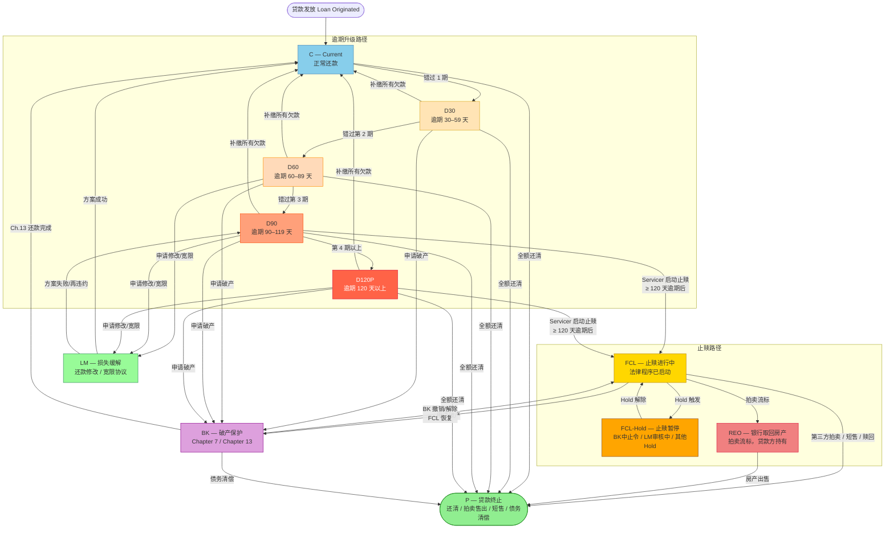
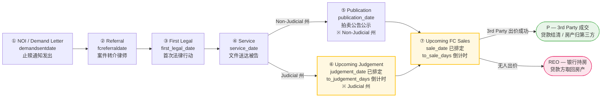

# doc 14 — BPS 驱动的 Servicer FCL 数据接口规范

---

## 文档目的

- **为什么存在**：Doc 09（行业标准视角）从 CFPB/MBA 规范出发，定义了 Servicer 应当提供哪些抽象字段。本文档从另一方向出发——以 BPS Asset Management Foreclosure 五大功能面板的**实际显示需求**为终点，逆向还原每个面板所需的 Servicer 源字段，形成 BPS 落地层的具体数据接口规范。
- **解决的问题**：当团队需要向新 Servicer 提出"你必须提供哪些数据"时，需要一份以 BPS 展示为依据、可直接作为正式字段补全请求依据的文件，而非仅凭行业规范。
- **范围**：覆盖 BPS Foreclosure 五大面板所需的全部 Servicer 字段（约 92 个）；含 doc 09 四维状态基础标志层（12 个）+ BPS 展示明细层（68 个）+ Newrez 已提供高价值增强字段层（12 个）；以 Newrez 为合规基准；不涉及 ETL 中间层代码细节（见 doc 12）。
- **系统关系**：本文是 doc 09 的 BPS 落地实施版本。Doc 09 = 行业准入标准（29 个抽象字段）；本文 = BPS 系统上线标准（约 92 个具体字段，含基础标志层、面板明细层、Newrez 增强层与合规现状）。

## 目标读者

主要读者：**数据治理团队 · 新 Servicer 对接工程师 · BPS 系统运营人员**  
次要读者：数据质量工程师 · 合规分析师 · 未来 AI Session

## 修订历史

| 日期 | 作者 | 版本 | 变更说明 | 关联文档 |
|------|------|------|---------|---------|
| 2026-05-27 | AI Agent (Claude Sonnet 4.6) | v1 | 初稿：7个Section + 附录A；以BPS五大面板为终点逆向定义约67个Servicer字段规范；Newrez合规现状基于doc 13 MCP实测（2026-05） | doc 09, doc 13 |
| 2026-05-28 | AI Agent (Claude Sonnet 4.6) | v2 | 新增附录B：ETL中间表 `port.basic_data_loan_fcl` 全字段用途分类（✅ BPS已使用 vs 🔮 ETL归一化/未进BPS）；涵盖约37个业务字段；4个预留字段（`fcjudgment_end_date`/`titleordereddate`/`jr_sr_lien_flag`/`activejnrlienfcflag`）标注未来用途与设计意图 | doc 12 v5, doc 13 v21 |
| 2026-05-28 | LiJiawen | v3 | 增加接口标准审核状态：确认 doc 14 可作为后续逐 Servicer 缺口分析的目标标准；明确字段级审核准入、冻结范围、仍需业务确认的问题 | doc 13 v21, doc 15 |
| 2026-05-28 | AI Agent (Claude Sonnet 4.6) | v4 | 全部 7 张字段规范表（Section 2.1–2.5、3.1、4.1）新增第 2 列「业务含义/计算逻辑（如有）」：覆盖全部 67 个字段的业务语义、派生公式和 Newrez 特殊说明；Section 2 格式说明同步更新 | doc 13 |
| 2026-05-28 | AI Agent (Claude Sonnet 4.6) | v5 | Section 2.3 新增 `noi_date` 字段（NOI 正式止赎意向通知与 Demand Sent Date 催款函概念分离）；更新 `demand_sent_date` 的 BPS 映射说明与业务含义；Section 5.1/5.2 字段计数同步更新（68 个，❌ 7 个 Newrez 未提供） | — |
| 2026-05-28 | AI Agent (Claude Sonnet 4.6) | v6 | 新增 Section 2.0「四维状态基础标志字段」（12 个字段：delinquency_status/next_payment_due_date/days_past_due/foreclosure_flag/lm_flag/lm_type/lm_start_date/lm_end_date/hold_flag/hold_reason/reo_flag/reo_acquisition_date）；补充 delinquency_status MBA 允许值表；文档范围更新至约 80 个字段；Section 5.1 合规矩阵新增基础状态字段行；Section 1.4 对比表更新 | doc 09 |
| 2026-05-28 | AI Agent (Claude Sonnet 4.6) | v7 | MCP 实测发现 Newrez 已提供但系统未利用的高价值字段（查询 portnewrezfc 62列 + portnewrezgeneral 100+列）；新增 Section 2.6「贷款属性与风险增强字段」（9个：investor_loan_id/lien_position/interest_paid_through_date/in_auction_flag/borrower_deceased_flag/reason_for_default/hold_1/2/3_comment）；Section 2.4 补充 hold_1/2/3_modified_date（P2）；记录零填充字段（SR Lien/SCRA/FEMA 等）为未来扩展；文档范围更新至约 92 个字段 | MCP 实测 2026-05 |
| 2026-05-29 | AI Agent (Claude Sonnet 4.6) | v8 | 「仍需业务/工程确认的问题」表新增第 4 列「验证 SQL」，为 3 个可验证问题添加 SQL 引用；新增附录 C（SQL-C1：BK 编码验证；SQL-C2：NOI vs Demand 日期映射；SQL-C3：`actual_judgement_hearing_set_days` 来源溯源，含 MySQL + Redshift 两步骤，为全文首个此问题专项 SQL） | doc 13 SQL-12, SQL-13 |
| 2026-05-29 | LiJiawen | v9 | 新增附录 D：美国贷款生命周期状态参考（完整移植自 doc 7 § 2.4，含 2 张 Mermaid 流程图和 5 张说明表：完整生命周期状态图、delinq 码对应、状态转换条件、FCL 子阶段、司法/非司法州差异、BPS 7 阶段运营管道）；Section 1 新增附录 D 交叉引用 | doc 7 § 2.4 |
| 2026-05-29 | AI Agent (Claude Sonnet 4.6) | v10 | 修复附录 C SQL-C3：Step 1 表名从 `sync_loan_foreclosure` 改为 `biz_data_view_loan_details_foreclosure`（MCP 视图定义确认：所有 `actual_*` 字段由视图实时计算 = `TO_DAYS(timeline_*) - TO_DAYS(nextduedate)`，不存于基表）；Step 1 SELECT 增加 `timeline_judgement_hearing_set_date` / `nextduedate` / `formula_verify` 三列；背景说明补充架构发现；判断矩阵完全重写消除"需代码审查"遗留项；doc 13 Q12 结论同步更新 | doc 13 Q12 |
| 2026-05-29 | AI Agent (Claude Sonnet 4.6) | v11 | 解决「仍需确认」表第 3 行：`actual_judgement_hearing_set_days` 完整公式 = `TO_DAYS(Section 2.3 · judgement_hearing_scheduled) - TO_DAYS(Section 2.0 · next_payment_due_date)`（MCP 视图定义确认）；同步修正 Section 2.3 字段规范表和业务含义表中 `judgement_entered_date` 行的错误公式描述 | doc 13 Q12, 附录 C SQL-C3 |
| 2026-05-29 | AI Agent (Claude Sonnet 4.6) | v12 | SQL-C3 重构：新增 Step 2（验证 Input 1：`timeline_judgement_hearing_set_date` ← `fcjudgmenthearingscheduled`，MySQL）和 Step 3（验证 Input 2：`sync_portmonth.nextduedate` ← `portnewrezpmt.nextduedate`，MySQL）；原 Step 2 Redshift 对比降级为「可选参考」；删除过时的旧 Step 3（手动对比）；更新背景说明 | — |
| 2026-05-29 | LiJiawen | v13 | 标准接口字段重命名：`last_step_completed` → `last_completed_step`、`last_step_completed_date` → `last_completed_step_date`（消除命名歧义：旧名 `_completed` 后缀易被误读为布尔/状态字段；BPS 内部字段 `summary_last_step_completed` 不变） | — |
| 2026-05-29 | AI Agent (Claude Sonnet 4.6) | v14 | 修复 SQL-C3 Step 2/3 JOIN 错误：`COLLATE utf8mb4_general_ci` 不适用于 BIGINT 列（`sync_loan_foreclosure.loanid` / `sync_portmonth.loanid` 均为 BIGINT，`portnewrezfc.loanid` / `portnewrezpmt.loanid` 为 VARCHAR）；改用 `CAST(p.loanid AS SIGNED)` | — |
| 2026-05-29 | AI Agent (Claude Sonnet 4.6) | v15 | SQL-C3 Step 2 完全重写：用户实际运行 SQL 后发现 `is_match=0`，查代码确认映射关系全部写反（ETL 代码 `basic_data_pool_config.py` 第264-265行）；新 Step 2 同时验证两个真实映射：① `timeline_judgement_date = fcjudgmenthearingscheduled`（直接）② `timeline_judgement_hearing_set_date = MIN(dataasof WHERE 当前值)`（ETL 追踪）；doc 13 Section 3.1 三处映射同步修正 | doc 13 v27 |
| 2026-06-02 | AI Agent (Claude Sonnet 4.6) | v16 | `delinquency_status` 允许值表补全 3 个 DB 实测真实值：`Foreclosure / Non-Perf BK`、`Foreclosure / Perf BK`（→FCL+bankruptcy='Y'）、`Settlement`（特殊处理）；表脚注明确共 19 种值，与 doc 08 及 DB 实测一致；中英文同步 | doc 08 · DB 实测 2026-06-01 |
| 2026-06-02 | AI Agent (Claude Sonnet 4.6) | v17 | 源表错误修正（information_schema 实测）：① `delinquency_status` 来源表标注 `portnewrezgeneral`（非 portnewrezfc）；② `foreclosure_flag` 删除"`portnewrezfc.fcl_flag` 存在"的错误声称——Newrez 无此列，FCL 活跃状态实为 `activefcflag`；③ `state` 来源更正为 `portnewrezprop.propertystate`（portnewrezfc 无 state 列）；同步修正 14_servicer_fcl_field_spec.xlsx Field Spec 的 col4/验证SQL（含 lm_flag→portnewrezlm、lien_position→portnewrezgeneral.lienposition）；中英文同步 | DB 实测 2026-06-02 |
| 2026-06-02 | AI Agent (Claude Sonnet 4.6) | v18 | Section 2.0 新增 `days360(nextduedate, dataasof)` 计算说明脚注（30/360 日历法公式、参数顺序、DPD 含义、C/D30/D60/D90/D120P 分档、源码 `PrefectFlow/flow/remit_validation/utils.py:14-21`）；Excel 同步加单元格批注 + 术语表 days360 词条；中英文同步 | 源码核实 PrefectFlow |
| 2026-06-02 | AI Agent (Claude Sonnet 4.6) | v20 | Section 2.0–4.1 字段表改为**每字段卡片**（竖向属性表 + 验证SQL 代码块 + 实测结果），自 `14_servicer_fcl_field_spec.xlsx` 14 列经 `scripts/sync_fieldspec_excel_to_md.py` 同步生成（含取值范围/典型取值/验证SQL/实测结果 4 列新信息）；保留各节散文（允许值表/days360脚注/Judgement说明/零填充/监管术语等）；用 FS-CARDS 标记支持重跑。仅中文版（Excel 为中文，英文版本次不动） | Excel 同步 |
| 2026-06-04 | AI Agent (Claude Opus 4.8) | v33 | 改正 `active_fcl_flag` 的「格式/计算规则」（Field Spec Excel `格式/计算规则` 列）——原仍作 `0=已完成 / 1=进行中`，与 v23 已更正的语义矛盾（0≠已完成）；改写为完整条件句（activefcflag=1→1；=0→0=当前不处于活跃止赎，BPS 统称 Closed Foreclosure；NULL→1）→ sync zh 卡片。属 doc 13/14/16 联动改正：依代码(basic_data_pool_config.py:273)+DB 改正 Foreclosure Status 映射规则（activefcflag=1→固定文本 `'Active Foreclosure'`，非 fcstage；fcstage→summary_current_step），并把 Type/Current Step/Completed Foreclosure 等箭头简写写全 | DB/代码核实 · doc 13 v35 · doc 16 v3 |
| 2026-06-04 | AI Agent (Claude Opus 4.8) | v34 | Field Spec 新增 **BPS 侧验证两列**（与 Newrez 侧对称）：`BPS验证SQL`（针对 **prod bpms** 同步表 sync_* 的取值查询）+ `BPS验证结果`（prod 只读实测，63 字段有值/29 N/A）；原 `验证SQL`/`验证结果` 两列改名为 `Newrez验证SQL`/`Newrez验证结果` 以区分。所有 bpms.表.列经 prod information_schema Schema-Verify（63 列全过）。结果带双日期 as-of：业务快照 `fctrdt≤2026-06-01`（与 Newrez 源数据日**对齐**）+ ETL 载入 `2026-06-03`（取自唯一记录 update_time 的 `sync_fcl_stage_info`；主表族 update_time 实测全 NULL=upsert 排除）。实测发现 prod 异常：`summary_completed_foreclosure`/`summary_servicer_number` 全 NULL，4 个 timeline 列 0 填充，`program`/`denialreason` 残留少量未解码数字码。sync zh 卡片（每字段加 BPS 结果行 + BPS SQL 块）；新增脚本 add_field_spec_bps_verify_sql.py / write_bps_verify_results.py / rename_verify_cols_newrez.py | mysql_prod 只读实测 2026-06-04 · 数据日 2026-06-01 |
| 2026-06-04 | AI Agent (Claude Opus 4.8) | v35 | Section 2.2 新增标准接口字段 **`fcl_removal_description`**（退出止赎原因，源 `portnewrezfc.fcremovaldesc`；紧跟 `fcl_results`，P1）——补齐 `fcl_removal_date`（退出日期）缺失的「退出原因」配对；该字段已被 BPS 消费（`summary_foreclosure_status='Closed Foreclosure:'+fcremovaldesc`），属真实接口依赖。BPS 无独立列 → BPS验证SQL/结果 = N/A 带说明（同 `fcl_results`）。DB 实测 2026-06-01（enum，仅已退出贷款）：Reinstated:26｜Loss Mitigation:16｜Paid in Full:11｜Process Complete:9｜Deed in Lieu Cmplte:1（约 1.2% 填充）。插行经「备份+按字段名比对 O/P/Q 值与批注不变」保护、解并/重并 section 表头、# 重编号 1..93；zh 卡片 + en 横表 + 两生成器 MAP/TYPE 同步 | DB 实测 2026-06-01 · mysql_dev |
| 2026-06-04 | AI Agent (Claude Opus 4.8) | v36 | Field Spec 新增列 **`Newrez → BPS 规则（doc 13/16）`**（插入到 `Newrez状态` 之前、紧跟 `BPS面板/功能`）：逐字段给出「Newrez 源值 → BPS 值」转换规则（直接取值 / `judicial=1→'Judicial'` / `COALESCE(dtdeedrecorded,fcremovaldate)` / 整数码经 `portnewrezdatadic` 解码 / 3 槽位 UNPIVOT / `COALESCE(datadic解码,原始码)` / 硬编码 NULL / N/A 等），93 字段全覆盖；规则取自 doc 13 与 doc 16（`build_bps_display_mapping_xlsx.py` 的 mapA 表），并与 `add_field_spec_bps_verify_sql.py` 的 MAP（字段→BPS列）对应。新生成器 `add_field_spec_newrez_bps_rule.py`（幂等；列插入合并安全——section 表头 A:J 在左侧；备份+按「字段名+人工列表头」比对 O/P/Q 值与批注不变否则回滚）；sync 卡片在「BPS 面板/功能」后加规则行。**en 横表整列化暂缓**（en 未卡片化，规则以 Excel/zh 卡片为单一真源） | doc 13 · doc 16 |
| 2026-06-04 | AI Agent (Claude Opus 4.8) | v37 | **en MD 卡片化**（Section 2.0–4.1 由人工横表改为 per-field 英文卡片，排版同 zh）：竖向 属性\|值 表（Newrez Raw Field · Data Type · Business Meaning · Format/Allowed Values · Typical Value · BPS Panel/Function · **Newrez → BPS Rule** · Newrez Status · Newrez/BPS Verify Result）+ Newrez/BPS Verify SQL 块，FS-CARDS 标记包裹；所有散文/子表/脚注保留（允许值表/days360/Judgement 映射/3.2 ETL 解码/监管脚注）。顺带修正 en 陈旧字段名 `sms_days_in_fcl` → **`servicer_days_in_fcl`**（v32 改名未同步到 en 规范表行）。新一次性生成器 `sync_fieldspec_en_cards.py`（合并 en 英文散文 + Excel 数据 + 内置英文 `RULE_EN` + `ZH2EN` token map；已卡片化则中止；CJK 干净）。en 业务散文（业务含义/格式/BPS面板/Newrez状态）仍在 en MD 手工维护（其来源）；验证 SQL/结果/规则来自 Excel | en 排版对齐 zh |
| 2026-06-04 | AI Agent (Claude Opus 4.8) | v38 | **BPS验证SQL 的 SELECT 增加数据日期列**——首列 `'2026-06-01' AS data_date`，读者运行查询即可从结果看到数据日（与表头「数据日 2026-06-01」一致）。⚠️ 实测发现 BPS 同步表是**覆盖式刷新**（`fctrdt`=最近 ETL 刷新日，2026-06-01 历史状态已被 06-02 刷新覆盖、不可复现；569 行中 198 行 fctrdt=2026-06-02），故**不按 fctrdt 过滤**（过滤会得错误子集 141≠207），用字面量基准日 + 全表（≈col S 实测口径）。`add_field_spec_bps_verify_sql.py` build_sql 改；col S 不变（已带日期标注）。另把 `sync_fieldspec_en_cards.py` 改为**可重跑**（已卡片化时从卡片解析英文散文 + Excel 刷新数据），并据此刷新 en 各卡片的 BPS Verify SQL 块 | prod 只读实测 2026-06-04 |
| 2026-06-03 | AI Agent (Claude Opus 4.8) | v32 | 标准接口字段 `sms_days_in_fcl` → **`servicer_days_in_fcl`**（去除单一 servicer 品牌名 SMS=Shellpoint；标准接口应 servicer-中性，与 `days_in_fcl` 配对、与 ETL 别名 svc_days_infc 一致）。保留 Newrez 列 `smsdaysinfc`/BPS 列 `summary_sms_days_in_fcl`/UI "SMS Days" 不变。改 Excel col C+业务含义+col13注释→sync zh 卡片；en 横表、doc 13 §3.7 脚注、3 生成脚本 key 同步 | DB/代码核实 · doc 13 v34 |
| 2026-06-03 | AI Agent (Claude Opus 4.8) | v31 | 明确 `sms_days_in_fcl` vs `days_in_fcl` 业务含义（代码+DB 核实）：days_in_fcl=投资人/全程，按 `fcreferraldate` 起算（ETL datediff+1）；sms_days_in_fcl=Newrez 原生 `smsdaysinfc`(svc_days_infc，servicer/SMS=Shellpoint 口径)，实测自 `fcsetupdate` 起算 → `sms ≤ days`；BPS 两者均 +DATEDIFF 实时修正。Excel+zh 卡片同步；doc 13 §3.7 同步 | 代码 basic_data_pool_config.py:280/1545/1628 · doc 13 v34 |
| 2026-06-03 | AI Agent (Claude Opus 4.8) | v30 | `lm_status` 标准接口取值范围列全**实测 22 个** lmc_status（一值一行；原为「等20+种」省略），末注字典完整域约 150 码（完整 code→text 见数据字典/Redshift portnewrezdatadic）；状态流转图见 doc 18 §4.5 | DB 实测 · doc 18 v3 |
| 2026-06-03 | AI Agent (Claude Opus 4.8) | v29 | `reo_acquisition_date` 验证SQL 头注略扩：解释 `dtdeedrecorded`=止赎契据登记日（产权过户/止赎完成点，约在 fcsalehelddate 后 2-3 周，多数→REO，近似 REO 取得日）；查询/结果不变。Excel + zh 卡片同步；术语收录 doc 10 分类C（v4） | doc 10 v4 |
| 2026-06-03 | AI Agent (Claude Opus 4.8) | v28 | `lm_type` 验证SQL/验证结果补充：原仅验 Newrez 源 `lmdeal` 码分布，改为**跨表 join**（Newrez `lmdeal` × BPS `deal`，同 lm_deal），同时验证源表与 BPS 表；结果显示 lmdeal→deal 解码映射（实测 8 deal）。生成器 add_field_spec_verify_sql.py 同步把 lm_type 归为 lm_code 类型 | DB 实测（跨库 JOIN） |
| 2026-06-03 | AI Agent (Claude Opus 4.8) | v27 | 统一 `lm_type` 取值范围 = Newrez 实际 8 个 deal（Evaluation/Modification/Forbearance/Payment Plan/Deferment/Short Sale/DIL/Payoff，与 lm_deal/DB/doc 13§5 一致），消除原 col H(6,含 TrialPlan)≠col I(5) 自相矛盾；格式规则/Newrez现状同步重写（注明 TPP 属 program 层）。同步订正 doc 18 §4.1（Payment Plan 非 Repayment Plan，补 Deferment/Payoff）+ §3 加 Newrez 对应说明；en 横表 lm_type 行同改 | DB 实测 · doc 18 v2 |
| 2026-06-03 | AI Agent (Claude Opus 4.8) | v26 | 「标准接口取值范围」格式：枚举值 ≥5 个时**一值一行**（便于阅读）。Excel 单元格用换行+wrap、前缀(如 `MBA标准文本枚举…：`)单独成行；sync 新增 `esc_ml()` 把换行渲染为 `<br>`；适用 11 字段(delinquency_status/bk_legal_status/lm_final_disposition/lm_deal/current_milestone/lm_program/lm_type/hold_reason/lm_status/lm_denial_reason/bk_status)，<5 值保持单行 | 脚本 fix_value_range_multiline.py |
| 2026-06-03 | AI Agent (Claude Opus 4.8) | v25 | `delinquency_status` 标准接口取值范围精确化：原 `1-29 / 30-59 / … / 150-179 DPD` 压缩易误读为单值，改为逐桶列全、顶层一律 `\|` 分隔的 19 个枚举值（每桶带 DPD；补全 `Foreclosure / Perf BK` 与 `Settlement`，合并项 `Performing/Non-Performing Bankruptcy` 拆开）；DB 实测最新快照 distinct=19 一致；sync zh 卡片；en 指向允许值表本就精确不变 | DB 实测 2026-06-03 |
| 2026-06-03 | AI Agent (Claude Opus 4.8) | v24 | 「标准接口取值范围」(col9) 与「Newrez状态」(col12) 的值分隔符由中点 `·` 改为 `\|`（密集时人眼难辨；与验证结果列统一）；脚本 fix_value_range_separator.py 改 Excel 26 格后 sync zh 卡片；`/`（DPD 分组/值内字符）保留；en 横表无此列不变 | DB 实测 2026-06-03 |
| 2026-06-03 | AI Agent (Claude Opus 4.8) | v23 | 更正 `active_fcl_flag` 取值语义：`activefcflag=0` 原标"已完结"，实为**当前不处于活跃止赎流程**（DB 实测含 Reinstated 26/Loss Mitigation 16/Paid in Full 11/真正完成 10；BPS 统称 Closed Foreclosure≠Completed）。改 Field Spec Excel 取值范围+业务含义并 sync zh 卡片；en 横表同改；与 doc 13/16 同步 | DB 实测 2026-06-03 |
| 2026-06-02 | AI Agent (Claude Sonnet 4.6) | v22 | 验证结果列项间分隔符由 `·` 改为 `\|`（点不易辨识；不用逗号因值内含逗号如律所名 `Korde & Associates, P.C.`）；`run_verify_sql_results.py` `format_result()` 重写后重跑 + 同步卡片（MD 单元格内转义为 `\|`）；仅影响 Excel col14 + zh 卡片，en 版无此列不受影响 | DB 实测 2026-06-02 |
| 2026-06-02 | AI Agent (Claude Sonnet 4.6) | v21 | 修正 `lm_flag` Newrez 现状：DB 实测 `activelmflag` 最新快照 100% 填充（5052/5052，0:5018·1:34，无 null），原"🟡 部分提供（标志存在，无类型/日期）"有误——标志已全量提供（应 ✅），"无类型/日期"误归（属 lm_type/lm_start_date/lm_end_date 独立字段）；Excel + MD(zh卡片/en表) 同步更正；新增「doc 14 MD⇄Excel 同步规则」入项目 CLAUDE.md | DB 实测 2026-06-02 |
| 2026-06-02 | AI Agent (Claude Sonnet 4.6) | v19 | Section 4.1 三个「⚠️ 编码确认中」BK 字段经 DB 实测确认并修正：① `bk_status` BPS 解码为文本（1→Active·2→Discharged·3→Dismissed·4→Closed·5→ReliefGranted）；② `bk_legal_status` 实际取自 `portnewrezgeneral.legalstatus` 文本（FCBU/BK13/BK7…），源字段 `bkstage` 为误标；③ `mfr_hearing_results` BPS mfr_status 列 dev 实测全空(0/64)。推翻早前"BK整数码 ETL 未解码、BPS 直接存数字"的假设；Excel + doc 13 Q7/Section6 + 数据字典同步修正 | DB 实测 2026-06-02 |
| 2026-06-02 | AI Agent (Claude Opus 4.8) | v18 | Section 3 LM 业务含义表后新增「📖 监管术语说明」脚注：解释 CFPB / Reg X / RESPA / 12 CFR 1024.40 (SPOC) / 1024.41 / Imminent Default；完整词条同步收录至 doc 10「分类 H — 监管/合规术语」；中英文同步 | doc 10 v3 |

## 依赖文档

| 文档 | 说明 |
|------|------|
| doc 09 | 行业标准视角字段规范（CFPB/MBA 29个字段），P0/P1/P2优先级定义与本文一致 |
| doc 13 | Newrez 字段反向映射实测（MCP 验证，2026-05）；Newrez 各字段填充率、数据质量问题（Q1–Q11）均来自该文档 |
| doc 12 | ETL 管道与中间表细节（本文不展开） |
| `basic_data_pool_config.py` | ETL 字段映射源码（Redshift 中间表 → BPS MySQL） |

## 已知限制

- Newrez 填充率数据基于 MCP 实测（2026-05-24，约 13,321 笔活跃 FCL 贷款），可能随时间变化
- BK 面板中 `bkstatus`/`bkstage` 数字编码的解码行为尚未完全确认（见 Q7 in doc 13）
- 其他 Servicer 的合规现状需另行实测；本文以 Newrez 为合规基准示例

## 相关文档

| 文档 | 说明 |
|------|------|
| doc 08 | Newrez 字段映射状态（整体视角） |
| doc 09 | 行业标准字段规范（本文的"上游标准"） |
| doc 10 | ForeclosureRule2 全局术语表 |
| doc 13 | Newrez BPS 展示字段反向映射（本文数据来源） |

---

## 审核状态（v3）

**结论**：本文档可以作为后续逐 Servicer 缺口分析的目标接口标准，但不是最终对外合同版本。它当前适合作为内部数据产品、数据治理、ETL 和 BPS 运营之间的统一评审基线。

### 已冻结的判断口径

| 项目 | v3 审核结论 |
|---|---|
| 字段范围 | 以 BPS Foreclosure 五大面板和两个聚合视图为终点，覆盖 FCL 主表、Hold、LM、BK、Stage/Timeline 的字段需求 |
| 优先级口径 | P0=入库前提；P1=核心展示/运营判断；P2=增强分析或合规补充 |
| Newrez 基准 | Newrez 作为第一个 benchmark Servicer；字段填充率和 Q1-Q12 问题沿用 doc 13 的 MCP 实测 |
| ETL 中间层 | 中间层字段不作为对 Servicer 的直接请求名称，但用于解释当前系统能否接收、归一化、同步到 BPS |
| 后续文档使用方式 | 每个 Servicer 独立文档必须逐项对照本文 Section 2-4 和附录 A，输出 `已提供 / 部分提供 / 未提供 / 内部可推导 / 内部 ETL 缺口` |

### 字段准入检查规则

后续新增或调整字段时，必须同时满足以下检查，才能进入本文档的正式字段清单：

| 检查项 | 要求 |
|---|---|
| BPS 需求来源 | 能指向 doc 13 的 BPS 面板、BPS sync 表、或 BPS 聚合视图字段 |
| 业务含义 | 能用业务语言说明该字段解决什么运营/合规问题 |
| 数据来源 | 至少能明确当前 Newrez benchmark 的来源字段、派生规则或缺失原因 |
| 系统链路 | 能说明该字段是否已进入 PrefectFlow ETL、中间表、BPS sync 表 |
| 缺失影响 | 能说明缺失后是拒绝入库、面板空白、计算不准，还是仅影响增强分析 |

### 仍需业务/工程确认的问题

| 问题 | 当前处理方式 | 后续动作 | 验证 SQL |
|---|---|---|---|
| BK 面板 `bkstatus` / `bkstage` 是否应在 BPS 侧解码为文本 | 保留为已知限制；不阻塞 doc 14 作为接口标准 | 在 Newrez BK 专项核对时确认解码表来源 | 附录 C — SQL-C1 |
| `noi_start_date` 与 `demand_start_date` 的 BPS 展示差异 | doc 14 按 doc 13 结论记录：Newrez `demandsentdate` 进入 `demand_start_date`，不是 Time Line Tab 的 `NOI Date 1` | 与 BPS 前端/产品确认是否需要调整显示名称 | 附录 C — SQL-C2 |
| `actual_judgement_hearing_set_days` 的最终计算来源 | ✅ **已解决**：BPS 视图层（`biz_data_view_loan_details_foreclosure`）实时计算，公式 = `TO_DAYS(judgement_hearing_scheduled) - TO_DAYS(next_payment_due_date)`（**Section 2.3 · `judgement_hearing_scheduled` · P1** 判决听证排定日 − **Section 2.0 · `next_payment_due_date` · P0** 下次还款到期日）；Servicer 只需提供这两个原始字段，无需自行计算 | **无需后续动作**（来源已确认） | 附录 C — SQL-C3（`formula_verify` 列可验证）|
| P2 字段是否必须向全部 Servicer 请求 | 默认不作为入库阻断；用于正式字段补全请求时按 Servicer 业务价值排序 | 在逐 Servicer 文档中分别给出建议 | — |

---

## Section 1：总体架构与设计原则

> **背景知识**：美国贷款生命周期状态（D30/D60/D90/FCL/REO/BK 等状态定义、转换条件、司法 vs 非司法州差异）见 → **附录 D**

### 1.1 BPS 五大面板字段需求分布

| BPS 面板 | 页面类型 | Servicer 来源表 | 主要字段组 |
|---|---|---|---|
| FCL Milestone 时间线 | 贷款详情页 | `portnewrezfc` | `timeline_*`（19个日期字段） |
| FCL Summary 摘要 | 贷款详情页 | `portnewrezfc` | `summary_*`（16个状态字段） |
| Hold 记录历史 | 贷款详情页 | `portnewrezfc` | Hold 槽位 3×4 字段 |
| Loss Mitigation Cycle | 贷款详情页 | `portnewrezlm` | LM 周期字段（10列） |
| Bankruptcy | 贷款详情页 | `portnewrezbk` | BK 字段（10+列） |
| Aggregate Stage Tab | 聚合概览页 | `portnewrezfc` | Stage 分组 + 天数统计 |
| Aggregate Time Line Tab | 聚合概览页 | `portnewrezfc` | 7个里程碑日期列（1–7） |

### 1.2 优先级定义

与 doc 09 保持一致：

| 优先级 | 含义 | 缺失后果 |
|--------|------|---------|
| **P0** | 系统入库前提条件 | 缺失则拒绝入库，BPS 无法处理该贷款 |
| **P1** | 核心面板显示字段 | 缺失则对应 BPS 面板数据异常或显示空白（降级可用） |
| **P2** | 增强型分析字段 | 可选；存在时启用对应分析功能；缺失不影响主流程 |

### 1.3 三张 Newrez 来源表与 BPS 面板的对应关系

```
Newrez 来源表                   → BPS 面板
portnewrezfc (FCL主表)          → FCL Summary / Timeline / Stage Tab /
                                   Time Line Tab / Hold 面板 / Bid Approval
portnewrezlm (LM表)             → Loss Mitigation Cycle 面板
portnewrezbk (BK表)             → Bankruptcy 面板
```

> **注**：`portnewrezfc` 是核心表，承担了 BPS 绝大多数面板的数据来源。LM 和 BK 各自独立，每张表对应一个专属面板。

### 1.4 本文与 doc 09 的差异

| 维度 | Doc 09（行业标准） | 本文（BPS 落地标准） |
|------|------------------|-------------------|
| 视角 | CFPB/MBA 行业规范出发 | BPS 五大面板显示需求出发 |
| 字段数量 | 29 个抽象字段，分 7 组 | 约 92 个具体字段（12 个基础状态标志 + 68 个 BPS 展示明细 + 12 个 Newrez 增强字段），含 Newrez 原始字段名 |
| 优先级 | P0/P1/P2（本文沿用） | 同左 |
| BPS 面板映射 | 无 | 每个字段明确标注喂入哪个 BPS 面板 |
| Newrez 现状 | 无 | 每个字段标注 Newrez 填充率 / 合规状态 |
| 用途 | 行业准入标准参考 | 向 Servicer 发出正式字段补全请求的依据 |

---

## Section 2：FCL 主数据字段规范（来源：`portnewrezfc`）

> **字段规范展示格式说明**：本节 2.0–4.1 每个字段以**卡片**呈现——竖向「属性 \| 值」表（含 Newrez 原始字段、数据类型、业务含义、格式/计算规则、标准接口取值范围、典型取值、BPS 面板/功能、Newrez 现状、验证结果）+ 一段验证 SQL 代码块（`sql`）。内容由 `docs/14_servicer_fcl_field_spec.xlsx` 经 `scripts/sync_fieldspec_excel_to_md.py` 同步生成（实测结果带数据日期）。
>
> **Newrez 现状取值**：`✅ 已提供（fill%）` / `⚠️ 部分提供（fill%）` / `❌ 未提供（0%）` / `N/A 推导字段`

### 2.0 四维状态基础标志字段（衔接 doc 09 行业标准）

> **本节定位**：来自 doc 09 Group B/D/E/F/G 的高层抽象字段，是 Servicer 数据接口的**行业标准最小集**。后续 Section 2.1–4.1 是 BPS 系统展示所需的补充明细字段。向新 Servicer 提出字段补全请求时，**必须先满足本节 P0 字段**，再谈后续明细字段。  
> **与 Section 2.1–4.1 的关系**：本节字段是"维度标志层"（告诉系统这笔贷款处于哪个状态维度）；后续各节是"明细层"（具体时间线、周期记录、金额等）。两层互补，不重复。

<!-- FS-CARDS:2.0 START -->
##### `delinquency_status` · P0 · 四维状态基础字段

| 属性 | 值 |
|---|---|
| Newrez 原始字段 | newrez.portnewrezgeneral.delinquency_status_mba |
| 数据类型 | VARCHAR ENUM |
| 业务含义 | MBA标准违约状态文本枚举；FCL/LM/BK状态识别的核心「维度A」字段；Servicer必须使用枚举文本，禁止数字格式（如'29.0'） |
| 格式/计算规则 | MBA枚举文本，如'Foreclosure'/'120-149 DPD'；禁止数字字符串 |
| 标准接口取值范围 | MBA标准文本枚举（Servicer传输层）：<br>Current<br>1-29 DPD<br>30-59 DPD<br>60-89 DPD<br>90-119 DPD<br>120-149 DPD<br>150-179 DPD<br>180+ DPD<br>Foreclosure<br>Foreclosure / Perf BK<br>Foreclosure / Non-Perf BK<br>REO<br>Performing Bankruptcy<br>Non-Performing Bankruptcy<br>Full Payoff<br>REO Sale<br>3rd Party Sale<br>Service Release<br>Settlement（共19种；禁止数字串如'29.0'；完整映射见doc 08 / doc 14 允许值表） |
| 典型取值（标准） | Foreclosure |
| BPS 面板/功能 | ETL入库过滤 / FCL状态判断 / BPS所有面板 |
| Newrez → BPS 规则 | N/A — 四维状态，不经 BPS FCL 同步表 |
| Newrez 现状 | ✅ 已提供 (12K+ active FCL行) |
| Newrez验证结果（数据日 2026-06-01｜实测 2026-06-02） | [data_date 2026-06-01] 1-29 DPD:2161 \| Current:2053 \| Full Payoff:678 \| 30-59 DPD:64 \| Foreclosure:30 \| 60-89 DPD:18 \| 90-119 DPD:10 \| 120-149 DPD:8 \| REO:5 \| Service Release:4 \| Performing Bankruptcy:4 \| Foreclosure / Non-Perf BK:3 \| 3rd Party Sale:3 \| Non-Performing Bankruptcy:3 \| Foreclosure / Perf BK:3 \| 180+ DPD:2 \| Settlement:1 \| REO Sale:1 \| 150-179 DPD:1 |
| BPS验证结果（数据日 2026-06-01｜实测 2026-06-04） | N/A — 不映射到 BPS FCL 同步表（见左侧说明） |

Newrez 验证 SQL：
```sql
-- 验证 delinquency_status 取值范围
-- 源表: newrez.portnewrezgeneral | 运行于: mysql_dev
-- 快照表：已固定 dataasof='2026-06-01' 过滤（与 BPS 数据日对齐，复跑结果不变；计数=该日真实贷款分布，非全历史快照行数）
SELECT dataasof AS data_date, delinquency_status_mba AS val, COUNT(*) AS cnt
FROM   newrez.portnewrezgeneral
WHERE  dataasof = '2026-06-01'
  AND  delinquency_status_mba IS NOT NULL AND delinquency_status_mba != ''
GROUP  BY dataasof, delinquency_status_mba ORDER BY cnt DESC LIMIT 30;
```

BPS 验证 SQL（prod 只读）：
```sql
-- N/A — BPS FCL 同步表不存逾期状态（四维状态在 BPS 他处）
```

##### `next_payment_due_date` · P0 · 四维状态基础字段

| 属性 | 值 |
|---|---|
| Newrez 原始字段 | newrez.portnewrezpmt.nextduedate |
| 数据类型 | DATE |
| 业务含义 | 下一次付款到期日；ETL通过days360(nextduedate, dataasof)计算逾期天数；当delinquency_status缺失时的备用来源 |
| 格式/计算规则 | YYYY-MM-DD |
| 标准接口取值范围 | YYYY-MM-DD |
| 典型取值（标准） | 2024-03-01 |
| BPS 面板/功能 | DPD衍生计算基础 |
| Newrez → BPS 规则 | N/A — 不入 BPS FCL 同步表 |
| Newrez 现状 | ✅ 100% (active FCL，MCP验证) |
| Newrez验证结果（数据日 2026-06-01｜实测 2026-06-02） | [data_date 2026-06-01] 2026-06-01 \| 2026-06-01 \| 2026-07-01 \| 2025-10-01 \| 2024-07-01 \| 2026-07-01 \| 2026-06-01 \| 2026-06-01 \| 2026-07-01 \| 2025-11-01（10笔） |
| BPS验证结果（数据日 2026-06-01｜实测 2026-06-04） | N/A — 不映射到 BPS FCL 同步表（见左侧说明） |

Newrez 验证 SQL：
```sql
-- 验证 next_payment_due_date 取值样例（最新快照取10笔，快速查看字段的样子）
-- 源表: newrez.portnewrezpmt | 运行于: mysql_dev
SELECT loanid, dataasof, nextduedate
FROM   newrez.portnewrezpmt
WHERE  dataasof = '2026-06-01'
  AND  nextduedate IS NOT NULL
LIMIT  10;
```

BPS 验证 SQL（prod 只读）：
```sql
-- N/A — BPS FCL 同步表无此字段
```

##### `days_past_due` · P1 · 四维状态基础字段

| 属性 | 值 |
|---|---|
| Newrez 原始字段 | — (ETL衍生) |
| 数据类型 | INTEGER |
| 业务含义 | 数字逾期天数；Newrez无原生DPD天数字段；ETL计算：days360(nextduedate, dataasof)；mbadelinquency为月数不可直接用 |
| 格式/计算规则 | ETL衍生：days360(nextduedate, dataasof)；0–999正整数 |
| 标准接口取值范围 | 0~999 正整数（ETL衍生：days360(nextduedate, dataasof)） |
| 典型取值（标准） | 215 |
| BPS 面板/功能 | 交叉验证 delinquency_status |
| Newrez → BPS 规则 | N/A — ETL 衍生 days360(nextduedate,dataasof)，不入 BPS FCL 同步表 |
| Newrez 现状 | N/A 衍生字段 |
| Newrez验证结果（数据日 2026-06-01｜实测 2026-06-02） | [data_date 2026-06-01] 2026-06-01 \| 2026-06-01 \| 2026-07-01 \| 2025-10-01 \| 2024-07-01 \| 2026-07-01 \| 2026-06-01 \| 2026-06-01 \| 2026-07-01 \| 2025-11-01（10笔） |
| BPS验证结果（数据日 2026-06-01｜实测 2026-06-04） | N/A — 不映射到 BPS FCL 同步表（见左侧说明） |

Newrez 验证 SQL：
```sql
-- N/A ETL衍生（days360(nextduedate,dataasof)）；替代验证源 nextduedate（最新快照取10笔样例）
-- 源表: newrez.portnewrezpmt | 运行于: mysql_dev
SELECT loanid, dataasof, nextduedate
FROM   newrez.portnewrezpmt
WHERE  dataasof = '2026-06-01'
  AND  nextduedate IS NOT NULL
LIMIT  10;
```

BPS 验证 SQL（prod 只读）：
```sql
-- N/A — ETL 衍生，BPS FCL 同步表无此字段
```

##### `foreclosure_flag` · P0 · 四维状态基础字段

| 属性 | 值 |
|---|---|
| Newrez 原始字段 | — (Newrez无fcl_flag列；FCL活跃状态见 activefcflag / active_fcl_flag) |
| 数据类型 | CHAR(1) |
| 业务含义 | 是否已正式启动FCL法律程序的Y/N标志；不得从days_past_due>120天推导；对应BPS active_fcl_flag |
| 格式/计算规则 | Y / N |
| 标准接口取值范围 | Y / N |
| 典型取值（标准） | Y |
| BPS 面板/功能 | FCL入库条件 / BPS active_fcl_flag |
| Newrez → BPS 规则 | N/A — 无 fcl_flag；FCL 活跃性见 active_fcl_flag→summary_completed_foreclosure |
| Newrez 现状 | 🟡 Newrez 无独立 fcl_flag 列（DB 实测）；FCL 活跃状态由 activefcflag 表达——最新快照实测 0/1 正常填充（非 null）。原"ETL 置 null"说法系针对不存在的 fcl_flag，已更正 |
| Newrez验证结果（数据日 2026-06-01｜实测 2026-06-02） | [data_date 2026-06-01] 0:5016 \| 1:36 |
| BPS验证结果（数据日 2026-06-01｜实测 2026-06-04） | N/A — 不映射到 BPS FCL 同步表（见左侧说明） |

Newrez 验证 SQL：
```sql
-- N/A Newrez无fcl_flag列；FCL活跃状态由 activefcflag 表达
-- 快照表：已固定 dataasof='2026-06-01' 过滤（与 BPS 数据日对齐，复跑结果不变；计数=该日真实贷款分布，非全历史快照行数）
-- 源表: newrez.portnewrezfc | 运行于: mysql_dev
SELECT dataasof AS data_date, activefcflag, COUNT(*) AS cnt
FROM   newrez.portnewrezfc
WHERE  dataasof = '2026-06-01'
GROUP  BY dataasof, activefcflag ORDER BY cnt DESC;
```

BPS 验证 SQL（prod 只读）：
```sql
-- N/A — 无 fcl_flag；活跃性见 active_fcl_flag→summary_completed_foreclosure
```

##### `lm_flag` · P0 · 四维状态基础字段

| 属性 | 值 |
|---|---|
| Newrez 原始字段 | newrez.portnewrezlm.activelmflag |
| 数据类型 | CHAR(1) |
| 业务含义 | 当前是否有活跃LM项目的顶层Y/N标志；ETL用此字段路由LM处理流程；独立于FCL维度 |
| 格式/计算规则 | Y / N |
| 标准接口取值范围 | Y / N |
| 典型取值（标准） | Y |
| BPS 面板/功能 | LM处理路由 / BPS LM Cycle面板路由 |
| Newrez → BPS 规则 | N/A — 无独立 flag；LM 存在性 = loss_mitigation 表是否有行 |
| Newrez 现状 | ✅ 已提供（activelmflag，最新快照 100% 填充 0/1、无 null；实测 0:5018 \| 1:34）。以 0/1 表达需映射 Y/N；为 LM 周期表层标志，类型/起止日见 lm_type / lm_start_date / lm_end_date |
| Newrez验证结果（数据日 2026-06-01｜实测 2026-06-02） | [data_date 2026-06-01] 0:5019 \| 1:33 |
| BPS验证结果（数据日 2026-06-01｜实测 2026-06-04） | N/A — 不映射到 BPS FCL 同步表（见左侧说明） |

Newrez 验证 SQL：
```sql
-- 验证 lm_flag 取值范围
-- 源表: newrez.portnewrezlm | 运行于: mysql_dev
-- 快照表：已固定 dataasof='2026-06-01' 过滤（与 BPS 数据日对齐，复跑结果不变；计数=该日真实贷款分布，非全历史快照行数）
SELECT dataasof AS data_date, activelmflag, COUNT(*) AS cnt
FROM   newrez.portnewrezlm
WHERE  dataasof = '2026-06-01'
GROUP  BY dataasof, activelmflag ORDER BY cnt DESC;
```

BPS 验证 SQL（prod 只读）：
```sql
-- N/A — 无独立 flag；LM 存在性=loss_mitigation 表是否有行
```

##### `lm_type` · P1 · 四维状态基础字段

| 属性 | 值 |
|---|---|
| Newrez 原始字段 | — (无字段；Newrez提供newrez.portnewrezlm.lmdeal数字代码) |
| 数据类型 | VARCHAR ENUM |
| 业务含义 | 标准化LM类型枚举；影响系统处理逻辑；Newrez通过lmdeal数字代码提供，需ETL解码 |
| 格式/计算规则 | Newrez lmdeal 整数码解码为 deal 大类（8）：Evaluation/Modification/Forbearance/Payment Plan/Deferment/Short Sale/DIL/Payoff；Trial Period Plan 属 program 层（Modification 试行），非独立 deal |
| 标准接口取值范围 | Evaluation<br>Modification<br>Forbearance<br>Payment Plan<br>Deferment<br>Short Sale<br>DIL<br>Payoff |
| 典型取值（标准） | Modification |
| BPS 面板/功能 | LM类型路由 |
| Newrez → BPS 规则 | 整数码 lmdeal 经 portnewrezdatadic 解码为文本（如 7→DIL）→ deal |
| Newrez 现状 | ❌ Newrez 不直接提供标准 lm_type 文本；以 lmdeal 整数码提供，ETL 解码为上述 8 个 deal（见 lm_deal 行；解码源 Redshift portnewrezdatadic） |
| Newrez验证结果（数据日 2026-06-01｜实测 2026-06-02） | 1 Modification:194 \| 1 Evaluation:2 \| 2 Evaluation:104 \| 4 Payment Plan:37 \| 5 Forbearance:51 \| 6 Short Sale:9 \| 7 DIL:10 \| 9 Payoff:1 \| 11 Deferment:50 |
| BPS验证结果（数据日 2026-06-01｜实测 2026-06-04） | [BPS prod·数据日 fctrdt≤2026-06-01·ETL载入 2026-06-03] Modification:207 \| Evaluation:115 \| ∅NULL:72 \| Forbearance:57 \| Deferment:56 \| Payment Plan:39 \| Short Sale:12 \| DIL:10 \| Payoff:1 |

Newrez 验证 SQL：
```sql
-- 验证 lm_type 取值范围（整数码 → BPS 解码文本）
-- 源表: newrez.portnewrezlm JOIN bpms_dev.sync_loan_foreclosure_loss_mitigation
-- 运行于: mysql_bpms_dev（跨库 JOIN）| 详见 doc 数据字典 SQL-D1~D6
-- 快照表：CTE 取每个 LM 周期的最新快照（latest-snapshot-per-cycle）
WITH latest_lm AS (
  SELECT loanid, dealstartdate, lmdeal,
         ROW_NUMBER() OVER (PARTITION BY loanid, dealstartdate ORDER BY dataasof DESC) AS rn
  FROM newrez.portnewrezlm WHERE lmdeal IS NOT NULL AND dataasof <= '2026-06-01'
)
SELECT l.lmdeal, b.deal, COUNT(*) AS cnt
FROM   latest_lm l
JOIN   bpms_dev.sync_loan_foreclosure_loss_mitigation b
  ON   l.loanid = b.loanid AND l.dealstartdate = b.cycle_opened_date
WHERE  l.rn = 1
  AND  b.deal IS NOT NULL AND b.deal != '' AND b.deal NOT REGEXP '^[0-9]'
GROUP  BY l.lmdeal, b.deal ORDER BY l.lmdeal, cnt DESC;
```

BPS 验证 SQL（prod 只读）：
```sql
-- 验证 BPS deal 取值（dist）— 标准 lm_type ⇐ BPS deal（lmdeal 解码文本）
-- 表: bpms.sync_loan_foreclosure_loss_mitigation | 运行于: mysql_prod（只读）
-- as-of: 业务快照 fctrdt≤2026-06-01（与 Newrez 源同日）；ETL 载入≈2026-06-03
SELECT '2026-06-01' AS data_date, `deal` AS val, COUNT(*) AS cnt
FROM   bpms.sync_loan_foreclosure_loss_mitigation
GROUP  BY `deal` ORDER BY cnt DESC;
```

##### `lm_start_date` · P1 · 四维状态基础字段

| 属性 | 值 |
|---|---|
| Newrez 原始字段 | newrez.portnewrezlm.dealstartdate |
| 数据类型 | DATE |
| 业务含义 | LM项目开始日（顶层摘要）；来源：portnewrezlm周期表的dealstartdate |
| 格式/计算规则 | YYYY-MM-DD |
| 标准接口取值范围 | YYYY-MM-DD |
| 典型取值（标准） | 2024-01-15 |
| BPS 面板/功能 | LM周期开始日 |
| Newrez → BPS 规则 | 直接取值（dealstartdate → cycle_opened_date） |
| Newrez 现状 | 🟡 周期级dealstartdate可用 |
| Newrez验证结果（数据日 2026-06-01｜实测 2026-06-02） | [data_date 2026-06-01] 2025-09-18 \| 2026-04-28 \| 2026-03-06 \| 2025-07-18 \| 2025-05-23 \| 2025-09-19 \| 2025-11-05 \| 2025-12-10 \| 2026-02-25 \| 2026-03-31（10笔） |
| BPS验证结果（数据日 2026-06-01｜实测 2026-06-04） | [BPS prod·数据日 fctrdt≤2026-06-01·ETL载入 2026-06-03] 非空 568/569 · 区间 2020-08-17~2026-06-01 |

Newrez 验证 SQL：
```sql
-- 验证 lm_start_date 取值样例（最新快照取10笔，快速查看字段的样子）
-- 源表: newrez.portnewrezlm | 运行于: mysql_dev
SELECT loanid, dataasof, dealstartdate
FROM   newrez.portnewrezlm
WHERE  dataasof = '2026-06-01'
  AND  dealstartdate IS NOT NULL
LIMIT  10;
```

BPS 验证 SQL（prod 只读）：
```sql
-- 验证 BPS cycle_opened_date 取值（date）
-- 表: bpms.sync_loan_foreclosure_loss_mitigation | 运行于: mysql_prod（只读）
-- as-of: 业务快照 fctrdt≤2026-06-01（与 Newrez 源同日）；ETL 载入≈2026-06-03
SELECT '2026-06-01' AS data_date, COUNT(*) AS total, COUNT(`cycle_opened_date`) AS non_null,
       MIN(`cycle_opened_date`) AS min_dt, MAX(`cycle_opened_date`) AS max_dt
FROM   bpms.sync_loan_foreclosure_loss_mitigation;
```

##### `lm_end_date` · P1 · 四维状态基础字段

| 属性 | 值 |
|---|---|
| Newrez 原始字段 | newrez.portnewrezlm.lmremovaldate |
| 数据类型 | DATE |
| 业务含义 | LM项目到期/结束日（顶层摘要）；到期是否续签是关键决策点 |
| 格式/计算规则 | YYYY-MM-DD |
| 标准接口取值范围 | YYYY-MM-DD（空=进行中） |
| 典型取值（标准） | 2024-06-30 |
| BPS 面板/功能 | LM周期结束日 |
| Newrez → BPS 规则 | 直接取值（lmremovaldate → cycle_closed_date；NULL=进行中） |
| Newrez 现状 | 🟡 周期级lmremovaldate可用 |
| Newrez验证结果（数据日 2026-06-01｜实测 2026-06-02） | [data_date 2026-06-01] 2025-11-07 \| 2026-05-03 \| 2026-05-08 \| 2026-05-20 \| 2025-12-03 \| 2026-05-07 \| 2026-05-01 \| 2025-09-08 \| 2025-05-27 \| 2025-09-29（10笔） |
| BPS验证结果（数据日 2026-06-01｜实测 2026-06-04） | [BPS prod·数据日 fctrdt≤2026-06-01·ETL载入 2026-06-03] 非空 511/569 · 区间 2020-09-22~2026-06-01 |

Newrez 验证 SQL：
```sql
-- 验证 lm_end_date 取值样例（最新快照取10笔，快速查看字段的样子）
-- 源表: newrez.portnewrezlm | 运行于: mysql_dev
SELECT loanid, dataasof, lmremovaldate
FROM   newrez.portnewrezlm
WHERE  dataasof = '2026-06-01'
  AND  lmremovaldate IS NOT NULL
LIMIT  10;
```

BPS 验证 SQL（prod 只读）：
```sql
-- 验证 BPS cycle_closed_date 取值（date）
-- 表: bpms.sync_loan_foreclosure_loss_mitigation | 运行于: mysql_prod（只读）
-- as-of: 业务快照 fctrdt≤2026-06-01（与 Newrez 源同日）；ETL 载入≈2026-06-03
SELECT '2026-06-01' AS data_date, COUNT(*) AS total, COUNT(`cycle_closed_date`) AS non_null,
       MIN(`cycle_closed_date`) AS min_dt, MAX(`cycle_closed_date`) AS max_dt
FROM   bpms.sync_loan_foreclosure_loss_mitigation;
```

##### `hold_flag` · P1 · 四维状态基础字段

| 属性 | 值 |
|---|---|
| Newrez 原始字段 | — (无独立顶层字段) |
| 数据类型 | CHAR(1) |
| 业务含义 | FCL是否处于暂停（Hold）状态的顶层Y/N标志；可由fchold1startdate IS NOT NULL推导，但非正式标志 |
| 格式/计算规则 | Y / N |
| 标准接口取值范围 | Y / N |
| 典型取值（标准） | Y |
| BPS 面板/功能 | Hold状态判断 |
| Newrez → BPS 规则 | N/A — 无独立 flag；Hold 存在性 = hold 表是否有行 |
| Newrez 现状 | ❌ 无独立顶层标志（可从fchold1startdate推导） |
| Newrez验证结果（数据日 2026-06-01｜实测 2026-06-02） | [data_date 2026-06-01] hold_loans=89 |
| BPS验证结果（数据日 2026-06-01｜实测 2026-06-04） | N/A — 不映射到 BPS FCL 同步表（见左侧说明） |

Newrez 验证 SQL：
```sql
-- N/A 无独立顶层 Hold flag；可从 fchold1startdate 推导（最新快照计数）
-- 快照表：已固定 dataasof='2026-06-01' 过滤（与 BPS 数据日对齐，复跑结果不变；计数=该日真实贷款分布，非全历史快照行数）
-- 源表: newrez.portnewrezfc | 运行于: mysql_dev
SELECT '2026-06-01' AS data_date, COUNT(*) AS hold_loans
FROM   newrez.portnewrezfc
WHERE  dataasof = '2026-06-01'
  AND  fchold1startdate IS NOT NULL;
```

BPS 验证 SQL（prod 只读）：
```sql
-- N/A — 无独立 flag；Hold 存在性=hold 表是否有行
```

##### `hold_reason` · P1 · 四维状态基础字段

| 属性 | 值 |
|---|---|
| Newrez 原始字段 | newrez.portnewrezfc.fchold1description |
| 数据类型 | VARCHAR ENUM |
| 业务含义 | 标准化暂停原因枚举；Newrez提供自由文本（如'Loss Mitigation Workout'/'Court Delay'），未标准化 |
| 格式/计算规则 | 枚举：BK/LM/HUD/Covid/Other |
| 标准接口取值范围 | BK<br>LM<br>HUD<br>Covid<br>Other |
| 典型取值（标准） | BK |
| BPS 面板/功能 | Hold原因标准化 |
| Newrez → BPS 规则 | 3 槽位 fchold1/2/3description UNPIVOT 合并 → description |
| Newrez 现状 | ❌ 自由文本（fchold1description：Loss Mitigation Workout \| Court Delay 等，非标准枚举） |
| Newrez验证结果（数据日 2026-06-01｜实测 2026-06-02） | [data_date 2026-06-01] Loss Mitigation Workout:21 \| Awaiting Funds to Post:16 \| Delinquency Review:12 \| Bankruptcy Filed:6 \| Hearing Set:4 \| Court Delay:4 \| Client Document Execution:4 \| Service Delay:4 \| Note Possession Confirmation:3 \| Title Resolution:3 \| Original Note:2 \| Allonge of Note:1 \| Service By Publication:1 \| Guaranty Agreement:1 \| Demand Letter Review:1 \| Awaiting Escrow Analysis:1 \| Moratorium:1 \| Mediation Hearing:1 \| FC Payment Research/Dispute:1 \| ACT(PA) Letter/Demand Letter/NOI Expiration:1 \| Original Assignment:1 |
| BPS验证结果（数据日 2026-06-01｜实测 2026-06-04） | [BPS prod·数据日 fctrdt≤2026-06-01·ETL载入 2026-06-03] Loss Mitigation Workout:63 \| Service Delay:48 \| ∅NULL:44 \| Client Document Execution:29 \| Court Delay:23 \| Awaiting Funds to Post:20 \| ACT(PA) Letter/Demand Letter/NOI Expiration:18 \| Hearing Set:17 \| Mediation Hearing:13 \| Delinquency Review:11 \| Original Note:10 \| Title Resolution:9 \| Note Possession Confirmation:8 \| Bankruptcy Filed:8 \| Copy of Power of Attorney:7 \| Copy of Payment History:5 \| Original Assignment:5 \| Demand Letter Review:4 \| Service By Publication:4 \| Copy of Periodic Statement:4 \| Pending Prior Servicer Doc(s):2 \| Awaiting Escrow Analysis:2 \| Soldiers and Sailors Relief Act:2 \| Allonge of Note:2 \| FC Payment Research/Dispute:2 \| +15 个取值各1笔:15 |

Newrez 验证 SQL：
```sql
-- 验证 hold_reason 取值范围
-- 源表: newrez.portnewrezfc | 运行于: mysql_dev
-- 快照表：已固定 dataasof='2026-06-01' 过滤（与 BPS 数据日对齐，复跑结果不变；计数=该日真实贷款分布，非全历史快照行数）
SELECT dataasof AS data_date, fchold1description AS val, COUNT(*) AS cnt
FROM   newrez.portnewrezfc
WHERE  dataasof = '2026-06-01'
  AND  fchold1description IS NOT NULL AND fchold1description != ''
GROUP  BY dataasof, fchold1description ORDER BY cnt DESC LIMIT 30;
```

BPS 验证 SQL（prod 只读）：
```sql
-- 验证 BPS description 取值（dist）— 3 槽位 UNPIVOT 合并入 description
-- 表: bpms.sync_loan_foreclosure_hold | 运行于: mysql_prod（只读）
-- as-of: 业务快照 fctrdt≤2026-06-01（与 Newrez 源同日）；ETL 载入≈2026-06-03
SELECT '2026-06-01' AS data_date, `description` AS val, COUNT(*) AS cnt
FROM   bpms.sync_loan_foreclosure_hold
GROUP  BY `description` ORDER BY cnt DESC;
```

##### `reo_flag` · P0 · 四维状态基础字段

| 属性 | 值 |
|---|---|
| Newrez 原始字段 | — (无字段) |
| 数据类型 | CHAR(1) |
| 业务含义 | FCL已完成、房产现为REO（由贷款人持有）的明确Y/N标志；Newrez缺少专用REO标志 |
| 格式/计算规则 | Y / N |
| 标准接口取值范围 | Y / N |
| 典型取值（标准） | Y |
| BPS 面板/功能 | REO状态标志 |
| Newrez → BPS 规则 | N/A — 无独立 REO flag（可由 fcresults 间接识别） |
| Newrez 现状 | ❌ 0% (未提供) |
| Newrez验证结果（数据日 2026-06-01｜实测 2026-06-02） | [data_date 2026-06-01] REO:6 |
| BPS验证结果（数据日 2026-06-01｜实测 2026-06-04） | N/A — 不映射到 BPS FCL 同步表（见左侧说明） |

Newrez 验证 SQL：
```sql
-- N/A Newrez未提供独立 REO flag；可用 fcresults 间接识别
-- 快照表：已固定 dataasof='2026-06-01' 过滤（与 BPS 数据日对齐，复跑结果不变；计数=该日真实贷款分布，非全历史快照行数）
-- 源表: newrez.portnewrezfc | 运行于: mysql_dev
SELECT dataasof AS data_date, fcresults, COUNT(*) AS cnt
FROM   newrez.portnewrezfc
WHERE  dataasof = '2026-06-01'
  AND  fcresults IN ('REO','REO Sale')
GROUP  BY dataasof, fcresults;
```

BPS 验证 SQL（prod 只读）：
```sql
-- N/A — 无独立 REO flag
```

##### `reo_acquisition_date` · P1 · 四维状态基础字段

| 属性 | 值 |
|---|---|
| Newrez 原始字段 | — (无字段) |
| 数据类型 | DATE |
| 业务含义 | 房产正式转移给贷款人成为REO的日期；影响REO持有期计算；Newrez未提供 |
| 格式/计算规则 | YYYY-MM-DD |
| 标准接口取值范围 | YYYY-MM-DD |
| 典型取值（标准） | 2024-05-01 |
| BPS 面板/功能 | REO持有期计算 |
| Newrez → BPS 规则 | N/A — 无独立 REO 取得日（可参考 dtdeedrecorded） |
| Newrez 现状 | ❌ 0% (未提供) |
| Newrez验证结果（数据日 2026-06-01｜实测 2026-06-02） | [data_date 2026-06-01] 2026-04-28 \| 2026-05-22 \| 2025-10-28 \| 2025-11-12（4笔） |
| BPS验证结果（数据日 2026-06-01｜实测 2026-06-04） | N/A — 不映射到 BPS FCL 同步表（见左侧说明） |

Newrez 验证 SQL：
```sql
-- N/A Newrez未提供独立 REO 取得日；可参考 dtdeedrecorded=止赎契据登记日（成交后产权转让契据在县登记处登记=产权过户/止赎完成点，约在拍卖 fcsalehelddate 后 2-3 周，多数→REO），近似 REO 取得日（最新快照取10笔样例）
-- 源表: newrez.portnewrezfc | 运行于: mysql_dev
SELECT loanid, dataasof, dtdeedrecorded
FROM   newrez.portnewrezfc
WHERE  dataasof = '2026-06-01'
  AND  dtdeedrecorded IS NOT NULL
LIMIT  10;
```

BPS 验证 SQL（prod 只读）：
```sql
-- N/A — 无独立 REO 取得日列
```

<!-- FS-CARDS:2.0 END -->

> **`delinquency_status` 允许值（MBA 标准，来自 doc 09 Group B）**：
>
> | 允许值 | 内部映射码 | 说明 |
> |---|---|---|
> | `Current` | `C` | 0–29 DPD，正常还款 |
> | `1-29 DPD` | `C` | 细分版本（Newrez 等使用） |
> | `30-59 DPD` | `D30` | — |
> | `60-89 DPD` | `D60` | — |
> | `90-119 DPD` | `D90` | — |
> | `120-149 DPD` | `D120P` | — |
> | `150-179 DPD` | `D120P` | — |
> | `180+ DPD` | `D120P` | — |
> | `Foreclosure` | `FCL` | FCL 法律程序已启动 |
> | `Foreclosure / Non-Perf BK` | `FCL`（同时 `bankruptcy='Y'`） | 止赎 + 非履约破产（Newrez 扩展值，DB 实测存在） |
> | `Foreclosure / Perf BK` | `FCL`（同时 `bankruptcy='Y'`） | 止赎 + 履约破产（Newrez 扩展值，DB 实测存在） |
> | `REO` | `REO` | 止赎完成，房产归贷款方 |
> | `Bankruptcy` / `Performing Bankruptcy` / `Non-Performing Bankruptcy` | 按 DPD + `bankruptcy_flag='Y'` | 破产须同时通过 `bankruptcy_flag`/`active_bk_flag` 传递 |
> | `PaidOff` / `Full Payoff` / `Paid in Full` | `P` | 已还清 |
> | `REO Sale` / `3rd Party Sale` | `P` | 处置完成 |
> | `Service Release` | 特殊处理 | 贷款服务权转让（贷款离开此 Servicer）|
> | `Settlement` | 特殊处理 | 和解结案（极少量，DB 实测存在）|
>
> ⚠️ **禁止格式**：`'29.0'`、`'30.0'`、`'90.0'` 等数字字符串（CapeCodFive 当前违反此规范，导致 FCL 永远无法被识别）
>
> 注：本表共 19 种 MBA 标准传输值，已与 doc 08「MBA 标准逾期状态原始取值范围」及 DB 实测（`newrez.portnewrezgeneral.delinquency_status_mba`，2026-06-01）完全一致。

> **`days360(nextduedate, dataasof)` 计算说明**（`days_past_due` / `next_payment_due_date` 行引用）：
>
> `days360` 是 **30/360 日历法**天数差函数——把每月按 30 天、每年按 360 天计算两个日期之间的天数：
>
> ```
> days360(start, end) = (end.年 − start.年)×360 + (end.月 − start.月)×30 + (end.日 − start.日)
> ```
>
> - **参数顺序**：`start = nextduedate`（下次应还款日），`end = dataasof`（数据快照日）。
> - **结果含义**：从应还款日到快照日的天数 = **逾期天数 DPD**；贷款逾期时为正数。
> - **ETL 分档**（生成 `delinquency_status` 内部码）：`<30 → C`、`<60 → D30`、`<90 → D60`、`<120 → D90`、`≥120 → D120P`（注意：`days360` 永远不会产生 `FCL`，止赎须由 Servicer 显式标志）。
> - **示例**：`nextduedate=2024-01-01`、`dataasof=2024-04-01` → `days360=90` → `D90`。
> - **源码**：`PrefectFlow/flow/remit_validation/utils.py:14-21`（Python 定义）；SQL 用法见 `basic_data_pool_config.py`。完整词条见 **doc 10 术语表**。

---

### 2.1 贷款识别与入库筛选字段（P0 — 必须字段）

这些字段是 BPS 入库的**前提条件**；任何一项缺失将导致整条贷款记录无法进入 BPS 系统。

<!-- FS-CARDS:2.1 START -->
##### `loan_id` · P0 · 贷款识别与入库过滤字段

| 属性 | 值 |
|---|---|
| Newrez 原始字段 | newrez.portnewrezfc.loanid |
| 数据类型 | VARCHAR |
| 业务含义 | 全局唯一数字贷款ID；BPS所有面板和表的跨系统JOIN主键 |
| 格式/计算规则 | 数字字符串；全局主键 |
| 标准接口取值范围 | 纯数字字符串 |
| 典型取值（标准） | 7727000088 |
| BPS 面板/功能 | 全部面板（全局JOIN主键） |
| Newrez → BPS 规则 | 直接取值（loanid） |
| Newrez 现状 | ✅ 100% |
| Newrez验证结果（数据日 2026-06-01｜实测 2026-06-02） | 700082700000027 \| 700082700000004 \| 700082700000014 \| 700082700000016 \| 700082700000003 \| 700082700000011 \| 700082880000126 \| 700082700000026 \| 700082700000005 \| 700082700000013（10行） |
| BPS验证结果（数据日 2026-06-01｜实测 2026-06-04） | [BPS prod·数据日 2026-06-01(主表无嵌入,同 ETL 周期 Newrez 源日)·ETL载入 2026-06-03] 样例(前5): 7727000012 \| 7727000065 \| 7727000082 \| 7727000088 \| 7727000119 |

Newrez 验证 SQL：
```sql
-- 验证 loan_id 取值样例（最新快照取10笔，快速查看字段的样子）
-- 源表: newrez.portnewrezfc | 运行于: mysql_dev
SELECT loanid, dataasof
FROM   newrez.portnewrezfc
WHERE  dataasof = '2026-06-01'
  AND  loanid IS NOT NULL AND loanid != ''
LIMIT  10;
```

BPS 验证 SQL（prod 只读）：
```sql
-- 验证 BPS loanid 取值（idtext）
-- 表: bpms.sync_loan_foreclosure | 运行于: mysql_prod（只读）
-- as-of: 主表无 dataasof/fctrdt（upsert，update_time 实测全 NULL）；ETL 载入≈2026-06-03（取自 sync_fcl_stage_info.update_time）
SELECT '2026-06-01' AS data_date, `loanid`
FROM   bpms.sync_loan_foreclosure
WHERE  `loanid` IS NOT NULL AND `loanid` != ''
LIMIT  5;
```

##### `servicer_loan_id` · P0 · 贷款识别与入库过滤字段

| 属性 | 值 |
|---|---|
| Newrez 原始字段 | newrez.portnewrezfc.shellpointloanid |
| 数据类型 | VARCHAR |
| 业务含义 | Servicer内部贷款号；与loan_id不同维度；用于双向跨系统对账 |
| 格式/计算规则 | Servicer内部编号 |
| 标准接口取值范围 | Servicer内部编号（格式随Servicer） |
| 典型取值（标准） | NR-2024-001234 |
| BPS 面板/功能 | FCL Summary > summary_servicer_number |
| Newrez → BPS 规则 | 直接取值（shellpointloanid → summary_servicer_number） |
| Newrez 现状 | ✅ 100% |
| Newrez验证结果（数据日 2026-06-01｜实测 2026-06-02） | [data_date 2026-06-01] 9799754446 \| 9798424553 \| 9796670868 \| 9796285410 \| 9792903412 \| 9787544114 \| 9779201442 \| 9776836927 \| 9776762263 \| 9770660612（10笔） |
| BPS验证结果（数据日 2026-06-01｜实测 2026-06-04） | [BPS prod·数据日 2026-06-01(主表无嵌入,同 ETL 周期 Newrez 源日)·ETL载入 2026-06-03] 全为空（prod 未填充） |

Newrez 验证 SQL：
```sql
-- 验证 servicer_loan_id 取值样例（最新快照取10笔，快速查看字段的样子）
-- 源表: newrez.portnewrezfc | 运行于: mysql_dev
SELECT loanid, dataasof, shellpointloanid
FROM   newrez.portnewrezfc
WHERE  dataasof = '2026-06-01'
  AND  shellpointloanid IS NOT NULL AND shellpointloanid != ''
LIMIT  10;
```

BPS 验证 SQL（prod 只读）：
```sql
-- 验证 BPS summary_servicer_number 取值（idtext）— =shellpointloanid
-- 表: bpms.sync_loan_foreclosure | 运行于: mysql_prod（只读）
-- as-of: 主表无 dataasof/fctrdt（upsert，update_time 实测全 NULL）；ETL 载入≈2026-06-03（取自 sync_fcl_stage_info.update_time）
SELECT '2026-06-01' AS data_date, `summary_servicer_number`
FROM   bpms.sync_loan_foreclosure
WHERE  `summary_servicer_number` IS NOT NULL AND `summary_servicer_number` != ''
LIMIT  5;
```

##### `data_as_of_date` · P0 · 贷款识别与入库过滤字段

| 属性 | 值 |
|---|---|
| Newrez 原始字段 | newrez.portnewrezfc.dataasof |
| 数据类型 | DATE |
| 业务含义 | 本批次数据快照截止日（通常比今天落后1-2天）；BPS实时修正：smsdaysinfc + DATEDIFF(今日NY, dataasof) |
| 格式/计算规则 | YYYY-MM-DD |
| 标准接口取值范围 | YYYY-MM-DD |
| 典型取值（标准） | 2026-05-27 |
| BPS 面板/功能 | 实时天数修正基础 |
| Newrez → BPS 规则 | N/A — 主表无 dataasof 列（覆盖式快照） |
| Newrez 现状 | ✅ 100% |
| Newrez验证结果（数据日 2026-06-01｜实测 2026-06-02） | 700082700000027 \| 700082700000004 \| 700082700000014 \| 700082700000016 \| 700082700000003 \| 700082700000011 \| 700082880000126 \| 700082700000026 \| 700082700000005 \| 700082700000013（10行） |
| BPS验证结果（数据日 2026-06-01｜实测 2026-06-04） | N/A — 不映射到 BPS FCL 同步表（见左侧说明） |

Newrez 验证 SQL：
```sql
-- 验证 data_as_of_date 取值样例（最新快照取10笔，快速查看字段的样子）
-- 源表: newrez.portnewrezfc | 运行于: mysql_dev
SELECT loanid, dataasof, dataasof
FROM   newrez.portnewrezfc
WHERE  dataasof = '2026-06-01'
  AND  dataasof IS NOT NULL
LIMIT  10;
```

BPS 验证 SQL（prod 只读）：
```sql
-- N/A — 主表无 dataasof 列（覆盖式快照）
```

##### `state` · P0 · 贷款识别与入库过滤字段

| 属性 | 值 |
|---|---|
| Newrez 原始字段 | newrez.portnewrezprop.propertystate |
| 数据类型 | CHAR(2) |
| 业务含义 | 房产所在州两位大写代码；决定适用的止赎法律（Judicial/Non-Judicial）及BPS各阶段目标天数配置 |
| 格式/计算规则 | 美国州代码（大写），如'CA'/'FL' |
| 标准接口取值范围 | US 2字母州代码（大写） |
| 典型取值（标准） | FL |
| BPS 面板/功能 | 阶段分类 / 目标天数配置 |
| Newrez → BPS 规则 | 直接取值（propertystate → sync_fcl_stage_info.state） |
| Newrez 现状 | ✅ 100% |
| Newrez验证结果（数据日 2026-06-01｜实测 2026-06-02） | [data_date 2026-06-01] CA:794 \| FL:617 \| TX:395 \| IL:331 \| OH:257 \| NY:210 \| AZ:181 \| NJ:167 \| PA:167 \| GA:159 \| NC:158 \| MN:137 \| MI:107 \| CO:101 \| TN:99 \| VA:97 \| MD:86 \| MO:84 \| WA:79 \| MA:77 \| NV:75 \| OR:65 \| CT:65 \| SC:65 \| UT:53 \| IN:47 \| AL:46 \| RI:38 \| HI:29 \| AR:27 |
| BPS验证结果（数据日 2026-06-01｜实测 2026-06-04） | [BPS prod·数据日 fctrdt=2026-06-01·ETL载入 2026-06-03] FL:1510 \| NY:1225 \| IL:1075 \| CA:983 \| AZ:669 \| IN:332 \| TX:324 \| CO:296 \| PA:288 \| WA:262 \| OR:221 \| MT:179 \| MD:149 \| NC:123 \| OH:118 \| MN:78 \| MI:77 \| NJ:74 \| SC:70 \| MA:68 \| RI:55 \| TN:47 \| GA:40 \| +其余州:0 |

Newrez 验证 SQL：
```sql
-- 验证 state 取值范围
-- 源表: newrez.portnewrezprop | 运行于: mysql_dev
-- 快照表：已固定 dataasof='2026-06-01' 过滤（与 BPS 数据日对齐，复跑结果不变；计数=该日真实贷款分布，非全历史快照行数）
SELECT dataasof AS data_date, propertystate AS val, COUNT(*) AS cnt
FROM   newrez.portnewrezprop
WHERE  dataasof = '2026-06-01'
  AND  propertystate IS NOT NULL AND propertystate != ''
GROUP  BY dataasof, propertystate ORDER BY cnt DESC LIMIT 30;
```

BPS 验证 SQL（prod 只读）：
```sql
-- 验证 BPS state 取值（dist）— 主表无 state；BPS state 存于 sync_fcl_stage_info
-- 表: bpms.sync_fcl_stage_info | 运行于: mysql_prod（只读）
-- as-of: sync_fcl_stage_info 最新 fctrdt=2026-06-01；ETL 载入 update_time=2026-06-03
SELECT '2026-06-01' AS data_date, `state` AS val, COUNT(*) AS cnt
FROM   bpms.sync_fcl_stage_info
GROUP  BY `state` ORDER BY cnt DESC;
```

##### `judicial_flag` · P0 · 贷款识别与入库过滤字段

| 属性 | 值 |
|---|---|
| Newrez 原始字段 | newrez.portnewrezfc.judicial |
| 数据类型 | TINYINT |
| 业务含义 | 止赎是否需要法院判决才能拍卖；影响JUDGEMENT阶段路由及Timeline字段含义 |
| 格式/计算规则 | 1=Judicial司法州 / 0=Non-Judicial非司法州 |
| 标准接口取值范围 | 1（Judicial州）/ 0（Non-Judicial州） |
| 典型取值（标准） | 1 |
| BPS 面板/功能 | FCL Summary > summary_judicial_foreclosure / JUDGEMENT阶段路由 |
| Newrez → BPS 规则 | judicial=1→'Judicial'，=0→'Non Judicial'，NULL→NULL（summary_type）；summary_judicial_foreclosure 直接取布尔 |
| Newrez 现状 | ✅ 100% |
| Newrez验证结果（数据日 2026-06-01｜实测 2026-06-02） | [data_date 2026-06-01] NULL:4953 \| 0:51 \| 1:48 |
| BPS验证结果（数据日 2026-06-01｜实测 2026-06-04） | [BPS prod·数据日 2026-06-01(主表无嵌入,同 ETL 周期 Newrez 源日)·ETL载入 2026-06-03] 0:43 \| 1:34 \| ∅NULL:12 |

Newrez 验证 SQL：
```sql
-- 验证 judicial_flag 取值范围
-- 源表: newrez.portnewrezfc | 运行于: mysql_dev
-- 快照表：已固定 dataasof='2026-06-01' 过滤（与 BPS 数据日对齐，复跑结果不变；计数=该日真实贷款分布，非全历史快照行数）
SELECT dataasof AS data_date, judicial, COUNT(*) AS cnt
FROM   newrez.portnewrezfc
WHERE  dataasof = '2026-06-01'
GROUP  BY dataasof, judicial ORDER BY cnt DESC;
```

BPS 验证 SQL（prod 只读）：
```sql
-- 验证 BPS summary_judicial_foreclosure 取值（binary）
-- 表: bpms.sync_loan_foreclosure | 运行于: mysql_prod（只读）
-- as-of: 主表无 dataasof/fctrdt（upsert，update_time 实测全 NULL）；ETL 载入≈2026-06-03（取自 sync_fcl_stage_info.update_time）
SELECT '2026-06-01' AS data_date, `summary_judicial_foreclosure` AS val, COUNT(*) AS cnt
FROM   bpms.sync_loan_foreclosure
GROUP  BY `summary_judicial_foreclosure` ORDER BY cnt DESC;
```

##### `active_fcl_flag` · P0 · 贷款识别与入库过滤字段

| 属性 | 值 |
|---|---|
| Newrez 原始字段 | newrez.portnewrezfc.activefcflag |
| 数据类型 | TINYINT |
| 业务含义 | FCL 是否处于活跃止赎流程；1=活跃止赎中，0=当前不处于活跃止赎（BPS 统称 Closed Foreclosure，含完成/撤销/复议/付清，非都已完成）；历史 NULL 须 NULL-safe 处理（保守视为 1） |
| 格式/计算规则 | 取自 Newrez activefcflag：如果 activefcflag=1 则 = 1（活跃止赎中）；如果 activefcflag=0 则 = 0（当前不处于活跃止赎流程，BPS 统称 Closed Foreclosure，含完成/撤销/复议/付清，并非都已完成）；历史 NULL 保守视为 1 |
| 标准接口取值范围 | 1（活跃止赎中）/ 0（当前不处于活跃止赎流程；含已完成 REO/3rd Party/DiL 或已退出 Reinstated/Loss Mitigation/Paid in Full）；NULL 保守视为 1 |
| 典型取值（标准） | 1 |
| BPS 面板/功能 | BPS入库条件（NULL-safe处理） |
| Newrez → BPS 规则 | summary_completed_foreclosure = activefcflag 取反（=0→1，=1→0）；prod 实测该列全 NULL |
| Newrez 现状 | ✅ 100% (含历史NULL，需NULL-safe处理) |
| Newrez验证结果（数据日 2026-06-01｜实测 2026-06-02） | [data_date 2026-06-01] 0:5016 \| 1:36 |
| BPS验证结果（数据日 2026-06-01｜实测 2026-06-04） | [BPS prod·数据日 2026-06-01(主表无嵌入,同 ETL 周期 Newrez 源日)·ETL载入 2026-06-03] ∅NULL:89 |

Newrez 验证 SQL：
```sql
-- 验证 active_fcl_flag 取值范围
-- 源表: newrez.portnewrezfc | 运行于: mysql_dev
-- 快照表：已固定 dataasof='2026-06-01' 过滤（与 BPS 数据日对齐，复跑结果不变；计数=该日真实贷款分布，非全历史快照行数）
SELECT dataasof AS data_date, activefcflag, COUNT(*) AS cnt
FROM   newrez.portnewrezfc
WHERE  dataasof = '2026-06-01'
GROUP  BY dataasof, activefcflag ORDER BY cnt DESC;
```

BPS 验证 SQL（prod 只读）：
```sql
-- 验证 BPS summary_completed_foreclosure 取值（binary）— BPS=activefcflag 取反；prod 实测全 NULL（异常，见结果）
-- 表: bpms.sync_loan_foreclosure | 运行于: mysql_prod（只读）
-- as-of: 主表无 dataasof/fctrdt（upsert，update_time 实测全 NULL）；ETL 载入≈2026-06-03（取自 sync_fcl_stage_info.update_time）
SELECT '2026-06-01' AS data_date, `summary_completed_foreclosure` AS val, COUNT(*) AS cnt
FROM   bpms.sync_loan_foreclosure
GROUP  BY `summary_completed_foreclosure` ORDER BY cnt DESC;
```

##### `fcl_referral_date` · P0 · 贷款识别与入库过滤字段

| 属性 | 值 |
|---|---|
| Newrez 原始字段 | newrez.portnewrezfc.fcreferraldate |
| 数据类型 | DATE |
| 业务含义 | 贷款人将止赎案件移交律师事务所的日期；BPS入库核心条件（非空才收录）；FCL时间轴的法律起点 |
| 格式/计算规则 | YYYY-MM-DD；非空为BPS入库前提 |
| 标准接口取值范围 | YYYY-MM-DD |
| 典型取值（标准） | 2024-01-20 |
| BPS 面板/功能 | Timeline > timeline_referred_to_foreclosure_date / BPS入库核心条件 |
| Newrez → BPS 规则 | 直接取值（fcreferraldate → timeline_referred_to_foreclosure_date；入库过滤字段） |
| Newrez 现状 | ✅ 100% |
| Newrez验证结果（数据日 2026-06-01｜实测 2026-06-02） | [data_date 2026-06-01] 2025-02-18 \| 2025-10-09 \| 2026-05-26 \| 2026-03-05 \| 2026-01-28 \| 2026-03-16 \| 2026-01-29 \| 2026-05-22 \| 2026-05-26 \| 2026-01-20（10笔） |
| BPS验证结果（数据日 2026-06-01｜实测 2026-06-04） | [BPS prod·数据日 2026-06-01(主表无嵌入,同 ETL 周期 Newrez 源日)·ETL载入 2026-06-03] 非空 89/89 · 区间 2018-08-15~2026-05-27 |

Newrez 验证 SQL：
```sql
-- 验证 fcl_referral_date 取值样例（最新快照取10笔，快速查看字段的样子）
-- 源表: newrez.portnewrezfc | 运行于: mysql_dev
SELECT loanid, dataasof, fcreferraldate
FROM   newrez.portnewrezfc
WHERE  dataasof = '2026-06-01'
  AND  fcreferraldate IS NOT NULL
LIMIT  10;
```

BPS 验证 SQL（prod 只读）：
```sql
-- 验证 BPS timeline_referred_to_foreclosure_date 取值（date）— 入库过滤字段
-- 表: bpms.sync_loan_foreclosure | 运行于: mysql_prod（只读）
-- as-of: 主表无 dataasof/fctrdt（upsert，update_time 实测全 NULL）；ETL 载入≈2026-06-03（取自 sync_fcl_stage_info.update_time）
SELECT '2026-06-01' AS data_date, COUNT(*) AS total, COUNT(`timeline_referred_to_foreclosure_date`) AS non_null,
       MIN(`timeline_referred_to_foreclosure_date`) AS min_dt, MAX(`timeline_referred_to_foreclosure_date`) AS max_dt
FROM   bpms.sync_loan_foreclosure;
```

<!-- FS-CARDS:2.1 END -->

### 2.2 FCL 状态字段（P1 — FCL Summary 面板核心）

<!-- FS-CARDS:2.2 START -->
##### `fcl_stage` · P1 · FCL状态字段

| 属性 | 值 |
|---|---|
| Newrez 原始字段 | newrez.portnewrezfc.fcstage |
| 数据类型 | VARCHAR |
| 业务含义 | Newrez内部当前工作流步骤文本（如'Pre-Sale Review'）；summary_current_step的备用显示字段 |
| 格式/计算规则 | Newrez内部阶段描述文本 |
| 标准接口取值范围 | 自由文本 |
| 典型取值（标准） | Service Complete |
| BPS 面板/功能 | FCL Summary > summary_current_step（备用，currentmilestone为空时使用） |
| Newrez → BPS 规则 | 阶段瀑布判定（按里程碑优先级），存于 sync_fcl_stage_info.stage |
| Newrez 现状 | ✅ 99.5% |
| Newrez验证结果（数据日 2026-06-01｜实测 2026-06-02） | [data_date 2026-06-01] Pre-Sale Review 1 (SCRA and PACER Check):16 \| Service Complete:12 \| Post Sale Review (SCRA and PACER Check):9 \| Sale Scheduled For:9 \| Title Report Received:7 \| NOS Sent for Recording:6 \| Complaint Sent for Filing:5 \| Preliminary Title Clear:4 \| Presale Redemption Will Expire On:3 \| Pre-Sale Review 2 (SCRA and PACER Check):3 \| Order Of Reference Sent:3 \| Complaint Prepared and Sent for Filing:2 \| Service Sent:2 \| Judgment Hearing Scheduled For:2 \| NOD Prepared and Sent for Filing :2 \| NOD Mailed and Posted:1 \| First Publication:1 \| Order Of Reference Received:1 \| Acceleration Letter Sent:1 \| Hearing Complete:1 \| TSG Report Received:1 \| Dockets Prepared and Sent for Filing:1 \| Is Home Equity/Judicial Rail Needed :1 \| Return of Service Filed:1 \| Answer Period Will Expire On:1 \| Final Title Clear:1 \| Complaint Submitted for Service:1 \| Submitted for Service:1 \| Notice … |
| BPS验证结果（数据日 2026-06-01｜实测 2026-06-04） | [BPS prod·数据日 fctrdt=2026-06-01·ETL载入 2026-06-03] REFERRAL:2738 \| SALE:2068 \| SERVICE:1528 \| FIRST_LEGAL:775 \| JUDGEMENT:732 \| DEMAND:422 |

Newrez 验证 SQL：
```sql
-- 验证 fcl_stage 取值范围
-- 源表: newrez.portnewrezfc | 运行于: mysql_dev
-- 快照表：已固定 dataasof='2026-06-01' 过滤（与 BPS 数据日对齐，复跑结果不变；计数=该日真实贷款分布，非全历史快照行数）
SELECT dataasof AS data_date, fcstage AS val, COUNT(*) AS cnt
FROM   newrez.portnewrezfc
WHERE  dataasof = '2026-06-01'
  AND  fcstage IS NOT NULL AND fcstage != ''
GROUP  BY dataasof, fcstage ORDER BY cnt DESC LIMIT 30;
```

BPS 验证 SQL（prod 只读）：
```sql
-- 验证 BPS stage 取值（dist）— BPS 阶段码存于 sync_fcl_stage_info.stage
-- 表: bpms.sync_fcl_stage_info | 运行于: mysql_prod（只读）
-- as-of: sync_fcl_stage_info 最新 fctrdt=2026-06-01；ETL 载入 update_time=2026-06-03
SELECT '2026-06-01' AS data_date, `stage` AS val, COUNT(*) AS cnt
FROM   bpms.sync_fcl_stage_info
GROUP  BY `stage` ORDER BY cnt DESC;
```

##### `current_milestone` · P1 · FCL状态字段

| 属性 | 值 |
|---|---|
| Newrez 原始字段 | newrez.portnewrezfc.currentmilestone |
| 数据类型 | VARCHAR |
| 业务含义 | BPS里程碑标签；summary_current_step的最高优先级显示字段 |
| 格式/计算规则 | BPS里程碑标签文本 |
| 标准接口取值范围 | Closed<br>First Legal<br>Judgment Entered<br>Sale Held<br>Sold<br>Service Complete<br>Sale Scheduled |
| 典型取值（标准） | First Legal |
| BPS 面板/功能 | FCL Summary > summary_current_step（最高优先级） |
| Newrez → BPS 规则 | currentmilestone 非空则取之，否则取 fcstage（→ summary_current_step） |
| Newrez 现状 | ⚠️ 62.7% (低于可接受水平，建议提升至90%+) |
| Newrez验证结果（数据日 2026-06-01｜实测 2026-06-02） | [data_date 2026-06-01] Closed:54 \| First Legal:16 \| Sold:9 \| Sale Held:7 \| Service Complete:6 \| Judgment Entered:4 \| Sale Scheduled:3 |
| BPS验证结果（数据日 2026-06-01｜实测 2026-06-04） | [BPS prod·数据日 2026-06-01(主表无嵌入,同 ETL 周期 Newrez 源日)·ETL载入 2026-06-03] Pre-Sale Review 1 (SCRA and PACER Check):13 \| Post Sale Review (SCRA and PACER Check):9 \| NOS Sent for Recording:7 \| Sale Scheduled For:7 \| Service Complete:6 \| Preliminary Title Clear:5 \| ∅NULL:4 \| Complaint Sent for Filing:3 \| Order Of Reference Sent:3 \| Pre-Sale Review 2 (SCRA and PACER Check):3 \| First Legal Action Filed:2 \| Title Summary:2 \| Presale Redemption Will Expire On:2 \| Pending First Legal:2 \| Judgment Hearing Scheduled For:2 \| NOD Prepared and Sent for Filing :2 \| Title Report Received:2 \| Return of Service Filed:1 \| Acceleration Letter Sent:1 \| Is Home Equity/Judicial Rail Needed :1 \| Order Of Reference Received:1 \| Hearing Complete:1 \| TSG Report Received:1 \| Complaint Submitted for Service:1 \| Contested / Litigation Start:1 \| Sale Deed Recorded:1 \| Dockets Prepared and Sent for Filing:1 \| Answer Period … |

Newrez 验证 SQL：
```sql
-- 验证 current_milestone 取值范围
-- 源表: newrez.portnewrezfc | 运行于: mysql_dev
-- 快照表：已固定 dataasof='2026-06-01' 过滤（与 BPS 数据日对齐，复跑结果不变；计数=该日真实贷款分布，非全历史快照行数）
SELECT dataasof AS data_date, currentmilestone AS val, COUNT(*) AS cnt
FROM   newrez.portnewrezfc
WHERE  dataasof = '2026-06-01'
  AND  currentmilestone IS NOT NULL AND currentmilestone != ''
GROUP  BY dataasof, currentmilestone ORDER BY cnt DESC LIMIT 30;
```

BPS 验证 SQL（prod 只读）：
```sql
-- 验证 BPS summary_current_step 取值（dist）— currentmilestone 否则 fcstage
-- 表: bpms.sync_loan_foreclosure | 运行于: mysql_prod（只读）
-- as-of: 主表无 dataasof/fctrdt（upsert，update_time 实测全 NULL）；ETL 载入≈2026-06-03（取自 sync_fcl_stage_info.update_time）
SELECT '2026-06-01' AS data_date, `summary_current_step` AS val, COUNT(*) AS cnt
FROM   bpms.sync_loan_foreclosure
GROUP  BY `summary_current_step` ORDER BY cnt DESC;
```

##### `last_completed_step` · P1 · FCL状态字段

| 属性 | 值 |
|---|---|
| Newrez 原始字段 | newrez.portnewrezfc.lastfcstepcompleted |
| 数据类型 | VARCHAR |
| 业务含义 | 最近完成的止赎处理步骤文本；运营人员用于追踪进度 |
| 格式/计算规则 | 步骤描述文本 |
| 标准接口取值范围 | 自由文本 |
| 典型取值（标准） | FC Referral |
| BPS 面板/功能 | FCL Summary > summary_last_step_completed |
| Newrez → BPS 规则 | 直接取值（lastfcstepcompleted → summary_last_step_completed） |
| Newrez 现状 | ✅ 99.5% |
| Newrez验证结果（数据日 2026-06-01｜实测 2026-06-02） | [data_date 2026-06-01] Preliminary Title Clear:21 \| Post Sale Review (SCRA and PACER Check):9 \| File Received By Attorney:8 \| Sale Scheduled For:6 \| Complaint Sent For Service:5 \| Title Report Received:4 \| Submitted for Service:4 \| Presale Redemption Will Expire On:3 \| NOS Recorded:3 \| Answer Period Will Expire On:3 \| Final Title Clear:3 \| NOS Posted:3 \| HUD First Action Expires:2 \| Review for Judicial Action:2 \| Motion for Judgment Sent to Court:2 \| NOS Sent for Recording:2 \| Complaint Submitted for Service:2 \| Firm Registers NOI With State:2 \| Service Complete:2 \| NOTS Recorded:1 \| Complaint Filed:1 \| File Referred To Attorney:1 \| First Publication of NOS:1 \| Order Authorizing Sale Received:1 \| Attorney Acknowledges:1 \| Praecipe Filed:1 \| Hearing Scheduled For:1 \| NOD Filed:1 \| Are We Proceeding with a Consent Judgment :1 \| Order Of Reference Sent:1 |
| BPS验证结果（数据日 2026-06-01｜实测 2026-06-04） | [BPS prod·数据日 2026-06-01(主表无嵌入,同 ETL 周期 Newrez 源日)·ETL载入 2026-06-03] Preliminary Title Clear:12 \| ∅NULL:12 \| Post Sale Review (SCRA and PACER Check):9 \| Title Report Received:5 \| Sale Scheduled For:5 \| NOS Recorded:3 \| File Received By Attorney:3 \| Submitted for Service:3 \| Final Title Clear:3 \| Answer Period Will Expire On:3 \| Presale Redemption Will Expire On:3 \| Motion for Judgment Sent to Court:2 \| NOS Sent for Recording:2 \| Review for Judicial Action:2 \| Service Complete:2 \| Complaint Sent For Service:2 \| HUD First Action Expires:2 \| NOTS Recorded:1 \| First Publication:1 \| Hearing Scheduled For:1 \| Order Of Reference Sent:1 \| NOD Filed:1 \| Praecipe Filed:1 \| Is Home Equity/Judicial Rail Needed :1 \| First Publication of NOS:1 \| Are We Proceeding with a Consent Judgment :1 \| Order Authorizing Sale Received:1 \| NOS Posted:1 \| Complaint Submitted for Service:1 \| Complaint Filed:1 \| Firm … |

Newrez 验证 SQL：
```sql
-- 验证 last_completed_step 取值范围
-- 源表: newrez.portnewrezfc | 运行于: mysql_dev
-- 快照表：已固定 dataasof='2026-06-01' 过滤（与 BPS 数据日对齐，复跑结果不变；计数=该日真实贷款分布，非全历史快照行数）
SELECT dataasof AS data_date, lastfcstepcompleted AS val, COUNT(*) AS cnt
FROM   newrez.portnewrezfc
WHERE  dataasof = '2026-06-01'
  AND  lastfcstepcompleted IS NOT NULL AND lastfcstepcompleted != ''
GROUP  BY dataasof, lastfcstepcompleted ORDER BY cnt DESC LIMIT 30;
```

BPS 验证 SQL（prod 只读）：
```sql
-- 验证 BPS summary_last_step_completed 取值（dist）
-- 表: bpms.sync_loan_foreclosure | 运行于: mysql_prod（只读）
-- as-of: 主表无 dataasof/fctrdt（upsert，update_time 实测全 NULL）；ETL 载入≈2026-06-03（取自 sync_fcl_stage_info.update_time）
SELECT '2026-06-01' AS data_date, `summary_last_step_completed` AS val, COUNT(*) AS cnt
FROM   bpms.sync_loan_foreclosure
GROUP  BY `summary_last_step_completed` ORDER BY cnt DESC;
```

##### `last_completed_step_date` · P1 · FCL状态字段

| 属性 | 值 |
|---|---|
| Newrez 原始字段 | newrez.portnewrezfc.lastfcstepcompleteddate |
| 数据类型 | DATE |
| 业务含义 | 最近完成步骤的完成日期 |
| 格式/计算规则 | YYYY-MM-DD |
| 标准接口取值范围 | YYYY-MM-DD |
| 典型取值（标准） | 2024-02-15 |
| BPS 面板/功能 | FCL Summary > summary_last_step_completed_date |
| Newrez → BPS 规则 | 直接取值（lastfcstepcompleteddate → summary_last_step_completed_date） |
| Newrez 现状 | ✅ 99.5% |
| Newrez验证结果（数据日 2026-06-01｜实测 2026-06-02） | [data_date 2026-06-01] 2025-02-26 \| 2025-11-03 \| 2026-05-26 \| 2026-04-23 \| 2026-05-05 \| 2026-04-30 \| 2026-03-03 \| 2026-05-22 \| 2026-05-26 \| 2026-03-13（10笔） |
| BPS验证结果（数据日 2026-06-01｜实测 2026-06-04） | [BPS prod·数据日 2026-06-01(主表无嵌入,同 ETL 周期 Newrez 源日)·ETL载入 2026-06-03] 非空 77/89 · 区间 2019-10-14~2026-05-26 |

Newrez 验证 SQL：
```sql
-- 验证 last_completed_step_date 取值样例（最新快照取10笔，快速查看字段的样子）
-- 源表: newrez.portnewrezfc | 运行于: mysql_dev
SELECT loanid, dataasof, lastfcstepcompleteddate
FROM   newrez.portnewrezfc
WHERE  dataasof = '2026-06-01'
  AND  lastfcstepcompleteddate IS NOT NULL
LIMIT  10;
```

BPS 验证 SQL（prod 只读）：
```sql
-- 验证 BPS summary_last_step_completed_date 取值（date）
-- 表: bpms.sync_loan_foreclosure | 运行于: mysql_prod（只读）
-- as-of: 主表无 dataasof/fctrdt（upsert，update_time 实测全 NULL）；ETL 载入≈2026-06-03（取自 sync_fcl_stage_info.update_time）
SELECT '2026-06-01' AS data_date, COUNT(*) AS total, COUNT(`summary_last_step_completed_date`) AS non_null,
       MIN(`summary_last_step_completed_date`) AS min_dt, MAX(`summary_last_step_completed_date`) AS max_dt
FROM   bpms.sync_loan_foreclosure;
```

##### `fcl_results` · P1 · FCL状态字段

| 属性 | 值 |
|---|---|
| Newrez 原始字段 | newrez.portnewrezfc.fcresults |
| 数据类型 | VARCHAR |
| 业务含义 | 最终止赎处置结果（仅完成贷款有值）；'3rd Party'触发timeline_third_party_sold_date逻辑 |
| 格式/计算规则 | 文本；典型值：3rd Party / REO |
| 标准接口取值范围 | REO \| 3rd Party（活跃FCL为空） |
| 典型取值（标准） | REO |
| BPS 面板/功能 | FCL Summary（已完成贷款）/ timeline_third_party_sold_date触发 |
| Newrez → BPS 规则 | N/A — BPS 不单独存；仅参与 fcresults='3rd Party' 的 timeline_third_party_sold 判断 |
| Newrez 现状 | ⚠️ 2.1% (仅完成贷款，部分填充属正常) |
| Newrez验证结果（数据日 2026-06-01｜实测 2026-06-02） | [data_date 2026-06-01] REO:6 \| 3rd Party:3 |
| BPS验证结果（数据日 2026-06-01｜实测 2026-06-04） | N/A — 不映射到 BPS FCL 同步表（见左侧说明） |

Newrez 验证 SQL：
```sql
-- 验证 fcl_results 取值范围
-- 源表: newrez.portnewrezfc | 运行于: mysql_dev
-- 快照表：已固定 dataasof='2026-06-01' 过滤（与 BPS 数据日对齐，复跑结果不变；计数=该日真实贷款分布，非全历史快照行数）
SELECT dataasof AS data_date, fcresults AS val, COUNT(*) AS cnt
FROM   newrez.portnewrezfc
WHERE  dataasof = '2026-06-01'
  AND  fcresults IS NOT NULL AND fcresults != ''
GROUP  BY dataasof, fcresults ORDER BY cnt DESC LIMIT 30;
```

BPS 验证 SQL（prod 只读）：
```sql
-- N/A — BPS 不单独存 fcresults（仅用于 Foreclosure Status 文本/REO 识别）
```

##### `fcl_removal_description` · P1 · FCL状态字段

| 属性 | 值 |
|---|---|
| Newrez 原始字段 | newrez.portnewrezfc.fcremovaldesc |
| 数据类型 | VARCHAR |
| 业务含义 | 退出/关闭止赎流程的原因（仅已退出 FCL 的贷款有值）；驱动 BPS Foreclosure Status 的 'Closed Foreclosure: <desc>' 后缀；与 fcl_removal_date（退出日期）配对 |
| 格式/计算规则 | 文本枚举（Newrez 直接取值 fcremovaldesc） |
| 标准接口取值范围 | Reinstated \| Loss Mitigation \| Paid in Full \| Process Complete \| Deed in Lieu Cmplte（活跃 FCL 为空） |
| 典型取值（标准） | Reinstated |
| BPS 面板/功能 | FCL Summary > summary_foreclosure_status（并入 'Closed Foreclosure:'+desc；BPS 无独立列） |
| Newrez → BPS 规则 | N/A — 不单独存；并入 summary_foreclosure_status（activefcflag=0 且非空时 = 'Closed Foreclosure:'+fcremovaldesc） |
| Newrez 现状 | ✅ ~1.2%（仅已退出 FCL 贷款；实测 2026-06-01 共 63 笔非空，5 个取值） |
| Newrez验证结果（数据日 2026-06-01｜实测 2026-06-02） | [data_date 2026-06-01] Reinstated:26 \| Loss Mitigation:16 \| Paid in Full:11 \| Process Complete:9 \| Deed in Lieu Cmplte:1 |
| BPS验证结果（数据日 2026-06-01｜实测 2026-06-04） | N/A — 不映射到 BPS FCL 同步表（见左侧说明） |

Newrez 验证 SQL：
```sql
-- 验证 fcl_removal_description 取值范围
-- 源表: newrez.portnewrezfc | 运行于: mysql_dev
-- 快照表：已固定 dataasof='2026-06-01' 过滤（与 BPS 数据日对齐，复跑结果不变；计数=该日真实贷款分布，非全历史快照行数）
SELECT dataasof AS data_date, fcremovaldesc AS val, COUNT(*) AS cnt
FROM   newrez.portnewrezfc
WHERE  dataasof = '2026-06-01'
  AND  fcremovaldesc IS NOT NULL AND fcremovaldesc != ''
GROUP  BY dataasof, fcremovaldesc ORDER BY cnt DESC LIMIT 30;
```

BPS 验证 SQL（prod 只读）：
```sql
-- N/A — BPS 不单独存；并入 summary_foreclosure_status 文本（'Closed Foreclosure:'+fcremovaldesc）
```

##### `attorney_firm` · P1 · FCL状态字段

| 属性 | 值 |
|---|---|
| Newrez 原始字段 | newrez.portnewrezfc.fcfirm |
| 数据类型 | VARCHAR |
| 业务含义 | 处理此止赎案件的律师事务所全名 |
| 格式/计算规则 | 律师事务所名称文本 |
| 标准接口取值范围 | 自由文本（律师事务所名称） |
| 典型取值（标准） | Kelley Kronenberg, P.A. |
| BPS 面板/功能 | FCL Summary > summary_foreclosure_attorney / summary_firm |
| Newrez → BPS 规则 | 直接取值（fcfirm → summary_foreclosure_attorney / summary_firm） |
| Newrez 现状 | ✅ 100% |
| Newrez验证结果（数据日 2026-06-01｜实测 2026-06-02） | [data_date 2026-06-01] Korde & Associates, P.C. \| Stern & Eisenberg, PC \| Padgett Law Group \| Clunk, Hoose Co., LPA \| Friedman Vartolo LLP  \| McCarthy & Holthus, LLP \| Friedman Vartolo LLP  \| McCarthy & Holthus, LLP \| Foundation Legal Group, LLP \| Friedman Vartolo LLP （10笔） |
| BPS验证结果（数据日 2026-06-01｜实测 2026-06-04） | [BPS prod·数据日 2026-06-01(主表无嵌入,同 ETL 周期 Newrez 源日)·ETL载入 2026-06-03] ∅NULL:85 \| Brock & Scott PLLC:1 \| McPhail Sanchez, LLC:1 \| Vylla Solutions, LLC:1 \| Lender Legal PLLC:1 |

Newrez 验证 SQL：
```sql
-- 验证 attorney_firm 取值样例（最新快照取10笔，快速查看字段的样子）
-- 源表: newrez.portnewrezfc | 运行于: mysql_dev
SELECT loanid, dataasof, fcfirm
FROM   newrez.portnewrezfc
WHERE  dataasof = '2026-06-01'
  AND  fcfirm IS NOT NULL AND fcfirm != ''
LIMIT  10;
```

BPS 验证 SQL（prod 只读）：
```sql
-- 验证 BPS summary_foreclosure_attorney 取值（dist）
-- 表: bpms.sync_loan_foreclosure | 运行于: mysql_prod（只读）
-- as-of: 主表无 dataasof/fctrdt（upsert，update_time 实测全 NULL）；ETL 载入≈2026-06-03（取自 sync_fcl_stage_info.update_time）
SELECT '2026-06-01' AS data_date, `summary_foreclosure_attorney` AS val, COUNT(*) AS cnt
FROM   bpms.sync_loan_foreclosure
GROUP  BY `summary_foreclosure_attorney` ORDER BY cnt DESC;
```

##### `contested_flag` · P1 · FCL状态字段

| 属性 | 值 |
|---|---|
| Newrez 原始字段 | newrez.portnewrezfc.fccontestedflag |
| 数据类型 | TINYINT |
| 业务含义 | 是否存在争议诉讼（借款人提出法律异议） |
| 格式/计算规则 | 0=无争议 / 1=有争议 |
| 标准接口取值范围 | 0 / 1 |
| 典型取值（标准） | 0 |
| BPS 面板/功能 | FCL Summary > summary_contested_litigation |
| Newrez → BPS 规则 | 直接取值（fccontestedflag → summary_contested_litigation） |
| Newrez 现状 | ✅ 100% |
| Newrez验证结果（数据日 2026-06-01｜实测 2026-06-02） | [data_date 2026-06-01] 0:5051 \| 1:1 |
| BPS验证结果（数据日 2026-06-01｜实测 2026-06-04） | [BPS prod·数据日 2026-06-01(主表无嵌入,同 ETL 周期 Newrez 源日)·ETL载入 2026-06-03] 0:75 \| ∅NULL:13 \| 1:1 |

Newrez 验证 SQL：
```sql
-- 验证 contested_flag 取值范围
-- 源表: newrez.portnewrezfc | 运行于: mysql_dev
-- 快照表：已固定 dataasof='2026-06-01' 过滤（与 BPS 数据日对齐，复跑结果不变；计数=该日真实贷款分布，非全历史快照行数）
SELECT dataasof AS data_date, fccontestedflag, COUNT(*) AS cnt
FROM   newrez.portnewrezfc
WHERE  dataasof = '2026-06-01'
GROUP  BY dataasof, fccontestedflag ORDER BY cnt DESC;
```

BPS 验证 SQL（prod 只读）：
```sql
-- 验证 BPS summary_contested_litigation 取值（binary）
-- 表: bpms.sync_loan_foreclosure | 运行于: mysql_prod（只读）
-- as-of: 主表无 dataasof/fctrdt（upsert，update_time 实测全 NULL）；ETL 载入≈2026-06-03（取自 sync_fcl_stage_info.update_time）
SELECT '2026-06-01' AS data_date, `summary_contested_litigation` AS val, COUNT(*) AS cnt
FROM   bpms.sync_loan_foreclosure
GROUP  BY `summary_contested_litigation` ORDER BY cnt DESC;
```

##### `servicer_days_in_fcl` · P1 · FCL状态字段

| 属性 | 值 |
|---|---|
| Newrez 原始字段 | newrez.portnewrezfc.smsdaysinfc |
| 数据类型 | INTEGER |
| 业务含义 | Servicer 口径的 FCL 在途天数（Newrez/SMS=Shellpoint Mortgage Servicing 实现为原生 smsdaysinfc / ETL 别名 svc_days_infc，透传），自 servicer 建案日 fcsetupdate 起算。BPS 实时修正：smsdaysinfc + DATEDIFF(今日纽约, dataasof)。因 setup≥referral，故 ≤ days_in_fcl（投资人全程口径）。注：标准接口字段名取 servicer-中性名 servicer_days_in_fcl；smsdaysinfc/summary_sms_days_in_fcl 为 Newrez/BPS 真实列名 |
| 格式/计算规则 | 正整数（以dataasof为基准） |
| 标准接口取值范围 | 正整数 |
| 典型取值（标准） | 128 |
| BPS 面板/功能 | FCL Summary > summary_sms_days_in_fcl |
| Newrez → BPS 规则 | 原值 smsdaysinfc + DATEDIFF(今日纽约, dataasof) 实时重算（自 fcsetupdate 起算） |
| Newrez 现状 | ✅ 100%（smsdaysinfc，1~606天） |
| Newrez验证结果（数据日 2026-06-01｜实测 2026-06-02） | [data_date 2026-06-01] 10 \| 29 \| 7 \| 67 \| 99 \| 50 \| 40 \| 11 \| 7 \| 133（10笔） |
| BPS验证结果（数据日 2026-06-01｜实测 2026-06-04） | [BPS prod·数据日 2026-06-01(主表无嵌入,同 ETL 周期 Newrez 源日)·ETL载入 2026-06-03] 非空 69/89 · 区间 9~610 · 均值 188.36 |

Newrez 验证 SQL：
```sql
-- 验证 servicer_days_in_fcl 取值样例（最新快照取10笔，快速查看字段的样子）
-- 源表: newrez.portnewrezfc | 运行于: mysql_dev
SELECT loanid, dataasof, smsdaysinfc
FROM   newrez.portnewrezfc
WHERE  dataasof = '2026-06-01'
  AND  smsdaysinfc IS NOT NULL
LIMIT  10;
```

BPS 验证 SQL（prod 只读）：
```sql
-- 验证 BPS summary_sms_days_in_fcl 取值（numeric）
-- 表: bpms.sync_loan_foreclosure | 运行于: mysql_prod（只读）
-- as-of: 主表无 dataasof/fctrdt（upsert，update_time 实测全 NULL）；ETL 载入≈2026-06-03（取自 sync_fcl_stage_info.update_time）
SELECT '2026-06-01' AS data_date, COUNT(*) AS total, COUNT(`summary_sms_days_in_fcl`) AS non_null,
       MIN(`summary_sms_days_in_fcl`) AS min_v, MAX(`summary_sms_days_in_fcl`) AS max_v, ROUND(AVG(`summary_sms_days_in_fcl`),2) AS avg_v
FROM   bpms.sync_loan_foreclosure;
```

##### `days_in_fcl` · P1 · FCL状态字段

| 属性 | 值 |
|---|---|
| Newrez 原始字段 | newrez.portnewrezfc.daysinfc |
| 数据类型 | INTEGER |
| 业务含义 | 投资人 / 全程视角的 FCL 在途天数。ETL 按 fcreferraldate（转介日）重算：datediff(referral_start_date, snapshot)+1（仅 Active；basic_data_pool_config.py:1628）。与 servicer_days_in_fcl 的区别=起算基准不同（referral vs setup），故 days_in_fcl ≥ servicer_days_in_fcl；BPS 同样 + DATEDIFF(今日纽约, dataasof) 实时修正 |
| 格式/计算规则 | 正整数（以dataasof为基准） |
| 标准接口取值范围 | 正整数 |
| 典型取值（标准） | 215 |
| BPS 面板/功能 | FCL Summary > summary_days_in_fcl |
| Newrez → BPS 规则 | 原值 daysinfc + DATEDIFF(今日纽约, dataasof) 实时重算（自 fcreferraldate 起算） |
| Newrez 现状 | ✅ 100%（daysinfc，1~814天） |
| Newrez验证结果（数据日 2026-06-01｜实测 2026-06-02） | [data_date 2026-06-01] 10 \| 29 \| 7 \| 67 \| 99 \| 50 \| 40 \| 11 \| 7 \| 133（10笔） |
| BPS验证结果（数据日 2026-06-01｜实测 2026-06-04） | [BPS prod·数据日 2026-06-01(主表无嵌入,同 ETL 周期 Newrez 源日)·ETL载入 2026-06-03] 非空 83/89 · 区间 8~818 · 均值 185.06 |

Newrez 验证 SQL：
```sql
-- 验证 days_in_fcl 取值样例（最新快照取10笔，快速查看字段的样子）
-- 源表: newrez.portnewrezfc | 运行于: mysql_dev
SELECT loanid, dataasof, daysinfc
FROM   newrez.portnewrezfc
WHERE  dataasof = '2026-06-01'
  AND  daysinfc IS NOT NULL
LIMIT  10;
```

BPS 验证 SQL（prod 只读）：
```sql
-- 验证 BPS summary_days_in_fcl 取值（numeric）
-- 表: bpms.sync_loan_foreclosure | 运行于: mysql_prod（只读）
-- as-of: 主表无 dataasof/fctrdt（upsert，update_time 实测全 NULL）；ETL 载入≈2026-06-03（取自 sync_fcl_stage_info.update_time）
SELECT '2026-06-01' AS data_date, COUNT(*) AS total, COUNT(`summary_days_in_fcl`) AS non_null,
       MIN(`summary_days_in_fcl`) AS min_v, MAX(`summary_days_in_fcl`) AS max_v, ROUND(AVG(`summary_days_in_fcl`),2) AS avg_v
FROM   bpms.sync_loan_foreclosure;
```

<!-- FS-CARDS:2.2 END -->

### 2.3 FCL 时间线字段（P0/P1/P2 — Timeline 面板 + Aggregate Time Line Tab）

> **注**：本节字段对应两个 BPS 展示位置：
> 1. **贷款详情页 FCL Milestone 时间线**：`timeline_*` 字段（19个）
> 2. **聚合概览页 Time Line Tab**：`{stage}_start_date` 字段（7列，见 Section 7）

<!-- FS-CARDS:2.3 START -->
##### `noi_date` · P1 · FCL时间轴字段

| 属性 | 值 |
|---|---|
| Newrez 原始字段 | — (Newrez以newrez.portnewrezfc.demandsentdate代替，无专用NOI字段) |
| 数据类型 | DATE |
| 业务含义 | 各州法律要求的正式止赎意向通知（NOI）日期；与demandsentdate（催款函）概念不同；Newrez将两者合并，BPS以demandsentdate临时代替 |
| 格式/计算规则 | YYYY-MM-DD；Newrez以demandsentdate临时代替 |
| 标准接口取值范围 | YYYY-MM-DD |
| 典型取值（标准） | — |
| BPS 面板/功能 | Timeline > timeline_notice_of_intent_date / Time Line Tab > noi_start_date |
| Newrez → BPS 规则 | 直接取值（demandsentdate → timeline_notice_of_intent_date） |
| Newrez 现状 | ❌ 未单独提供（BPS以demandsentdate临时代替） |
| Newrez验证结果（数据日 2026-06-01｜实测 2026-06-02） | [data_date 2026-06-01] 2024-12-05 \| 2026-04-15 \| 2025-06-16 \| 2026-04-17 \| 2026-05-29 \| 2026-04-13 \| 2026-01-22 \| 2026-05-04 \| 2025-11-24 \| 2025-12-19（10笔） |
| BPS验证结果（数据日 2026-06-01｜实测 2026-06-04） | [BPS prod·数据日 2026-06-01(主表无嵌入,同 ETL 周期 Newrez 源日)·ETL载入 2026-06-03] 非空 5/89 · 区间 2024-05-17~2025-04-22 |

Newrez 验证 SQL：
```sql
-- N/A Newrez未单独提供 NOI；BPS 以 demandsentdate 代替（最新快照取10笔样例）
-- 源表: newrez.portnewrezfc | 运行于: mysql_dev
SELECT loanid, dataasof, demandsentdate
FROM   newrez.portnewrezfc
WHERE  dataasof = '2026-06-01'
  AND  demandsentdate IS NOT NULL
LIMIT  10;
```

BPS 验证 SQL（prod 只读）：
```sql
-- 验证 BPS timeline_notice_of_intent_date 取值（date）— 源 demandsentdate
-- 表: bpms.sync_loan_foreclosure | 运行于: mysql_prod（只读）
-- as-of: 主表无 dataasof/fctrdt（upsert，update_time 实测全 NULL）；ETL 载入≈2026-06-03（取自 sync_fcl_stage_info.update_time）
SELECT '2026-06-01' AS data_date, COUNT(*) AS total, COUNT(`timeline_notice_of_intent_date`) AS non_null,
       MIN(`timeline_notice_of_intent_date`) AS min_dt, MAX(`timeline_notice_of_intent_date`) AS max_dt
FROM   bpms.sync_loan_foreclosure;
```

##### `demand_sent_date` · P1 · FCL时间轴字段

| 属性 | 值 |
|---|---|
| Newrez 原始字段 | newrez.portnewrezfc.demandsentdate |
| 数据类型 | DATE |
| 业务含义 | 止赎前催款函/违约通知发出日期；触发BPS DEMAND阶段分类 |
| 格式/计算规则 | YYYY-MM-DD |
| 标准接口取值范围 | YYYY-MM-DD |
| 典型取值（标准） | 2024-02-01 |
| BPS 面板/功能 | DEMAND阶段分类触发 / demand_start_date（聚合页） |
| Newrez → BPS 规则 | 直接取值（demandsentdate → timeline_notice_of_intent_date；同 noi_date） |
| Newrez 现状 | ✅ 85.9%（demandsentdate，2021-10-18~2026-04-20，见doc 13 Q5） |
| Newrez验证结果（数据日 2026-06-01｜实测 2026-06-02） | [data_date 2026-06-01] 2024-12-05 \| 2026-04-15 \| 2025-06-16 \| 2026-04-17 \| 2026-05-29 \| 2026-04-13 \| 2026-01-22 \| 2026-05-04 \| 2025-11-24 \| 2025-12-19（10笔） |
| BPS验证结果（数据日 2026-06-01｜实测 2026-06-04） | [BPS prod·数据日 2026-06-01(主表无嵌入,同 ETL 周期 Newrez 源日)·ETL载入 2026-06-03] 非空 5/89 · 区间 2024-05-17~2025-04-22 |

Newrez 验证 SQL：
```sql
-- 验证 demand_sent_date 取值样例（最新快照取10笔，快速查看字段的样子）
-- 源表: newrez.portnewrezfc | 运行于: mysql_dev
SELECT loanid, dataasof, demandsentdate
FROM   newrez.portnewrezfc
WHERE  dataasof = '2026-06-01'
  AND  demandsentdate IS NOT NULL
LIMIT  10;
```

BPS 验证 SQL（prod 只读）：
```sql
-- 验证 BPS timeline_notice_of_intent_date 取值（date）— 同 noi_date（源 demandsentdate）
-- 表: bpms.sync_loan_foreclosure | 运行于: mysql_prod（只读）
-- as-of: 主表无 dataasof/fctrdt（upsert，update_time 实测全 NULL）；ETL 载入≈2026-06-03（取自 sync_fcl_stage_info.update_time）
SELECT '2026-06-01' AS data_date, COUNT(*) AS total, COUNT(`timeline_notice_of_intent_date`) AS non_null,
       MIN(`timeline_notice_of_intent_date`) AS min_dt, MAX(`timeline_notice_of_intent_date`) AS max_dt
FROM   bpms.sync_loan_foreclosure;
```

##### `demand_expiration_date` · P1 · FCL时间轴字段

| 属性 | 值 |
|---|---|
| Newrez 原始字段 | newrez.portnewrezfc.demandexpirationdate |
| 数据类型 | DATE |
| 业务含义 | NOI/催款函到期日；计算：actual_notice_of_intent_days = demandexpirationdate − demandsentdate |
| 格式/计算规则 | YYYY-MM-DD |
| 标准接口取值范围 | YYYY-MM-DD |
| 典型取值（标准） | 2024-03-02 |
| BPS 面板/功能 | Timeline > timeline_notice_of_intent_end_date |
| Newrez → BPS 规则 | 直接取值（demandexpirationdate → timeline_notice_of_intent_end_date） |
| Newrez 现状 | ✅ 85.7% |
| Newrez验证结果（数据日 2026-06-01｜实测 2026-06-02） | [data_date 2026-06-01] 2025-02-08 \| 2026-05-20 \| 2025-12-19 \| 2026-05-17 \| 2026-06-13 \| 2026-04-28 \| 2026-02-21 \| 2026-05-20 \| 2025-12-19 \| 2026-01-18（10笔） |
| BPS验证结果（数据日 2026-06-01｜实测 2026-06-04） | [BPS prod·数据日 2026-06-01(主表无嵌入,同 ETL 周期 Newrez 源日)·ETL载入 2026-06-03] 非空 0/89（prod 全空） |

Newrez 验证 SQL：
```sql
-- 验证 demand_expiration_date 取值样例（最新快照取10笔，快速查看字段的样子）
-- 源表: newrez.portnewrezfc | 运行于: mysql_dev
SELECT loanid, dataasof, demandexpirationdate
FROM   newrez.portnewrezfc
WHERE  dataasof = '2026-06-01'
  AND  demandexpirationdate IS NOT NULL
LIMIT  10;
```

BPS 验证 SQL（prod 只读）：
```sql
-- 验证 BPS timeline_notice_of_intent_end_date 取值（date）
-- 表: bpms.sync_loan_foreclosure | 运行于: mysql_prod（只读）
-- as-of: 主表无 dataasof/fctrdt（upsert，update_time 实测全 NULL）；ETL 载入≈2026-06-03（取自 sync_fcl_stage_info.update_time）
SELECT '2026-06-01' AS data_date, COUNT(*) AS total, COUNT(`timeline_notice_of_intent_end_date`) AS non_null,
       MIN(`timeline_notice_of_intent_end_date`) AS min_dt, MAX(`timeline_notice_of_intent_end_date`) AS max_dt
FROM   bpms.sync_loan_foreclosure;
```

##### `fcl_setup_date` · P1 · FCL时间轴字段

| 属性 | 值 |
|---|---|
| Newrez 原始字段 | newrez.portnewrezfc.fcsetupdate |
| 数据类型 | DATE |
| 业务含义 | FCL内部开设日期（BPS系统建案日）；Newrez通常与fcreferraldate同一日期 |
| 格式/计算规则 | YYYY-MM-DD |
| 标准接口取值范围 | YYYY-MM-DD |
| 典型取值（标准） | 2024-01-10 |
| BPS 面板/功能 | Timeline > timeline_approved_for_referral_date |
| Newrez → BPS 规则 | 直接取值（fcsetupdate → timeline_approved_for_referral_date） |
| Newrez 现状 | ✅ 100%（fcsetupdate，2024-02-07~2026-05-26） |
| Newrez验证结果（数据日 2026-06-01｜实测 2026-06-02） | [data_date 2026-06-01] 2025-02-18 \| 2025-10-09 \| 2026-05-26 \| 2026-03-05 \| 2026-01-28 \| 2026-03-16 \| 2026-01-29 \| 2026-05-22 \| 2026-05-26 \| 2026-01-20（10笔） |
| BPS验证结果（数据日 2026-06-01｜实测 2026-06-04） | [BPS prod·数据日 2026-06-01(主表无嵌入,同 ETL 周期 Newrez 源日)·ETL载入 2026-06-03] 非空 0/89（prod 全空） |

Newrez 验证 SQL：
```sql
-- 验证 fcl_setup_date 取值样例（最新快照取10笔，快速查看字段的样子）
-- 源表: newrez.portnewrezfc | 运行于: mysql_dev
SELECT loanid, dataasof, fcsetupdate
FROM   newrez.portnewrezfc
WHERE  dataasof = '2026-06-01'
  AND  fcsetupdate IS NOT NULL
LIMIT  10;
```

BPS 验证 SQL（prod 只读）：
```sql
-- 验证 BPS timeline_approved_for_referral_date 取值（date）
-- 表: bpms.sync_loan_foreclosure | 运行于: mysql_prod（只读）
-- as-of: 主表无 dataasof/fctrdt（upsert，update_time 实测全 NULL）；ETL 载入≈2026-06-03（取自 sync_fcl_stage_info.update_time）
SELECT '2026-06-01' AS data_date, COUNT(*) AS total, COUNT(`timeline_approved_for_referral_date`) AS non_null,
       MIN(`timeline_approved_for_referral_date`) AS min_dt, MAX(`timeline_approved_for_referral_date`) AS max_dt
FROM   bpms.sync_loan_foreclosure;
```

##### `first_legal_date` · P1 · FCL时间轴字段

| 属性 | 值 |
|---|---|
| Newrez 原始字段 | newrez.portnewrezfc.firstlegaldate |
| 数据类型 | DATE |
| 业务含义 | 止赎诉讼首次向法院提起的日期；Non-Judicial州通常为空；触发FIRST_LEGAL阶段 |
| 格式/计算规则 | YYYY-MM-DD；Non-Judicial州可为空 |
| 标准接口取值范围 | YYYY-MM-DD |
| 典型取值（标准） | 2024-02-01 |
| BPS 面板/功能 | Timeline > timeline_first_legal_date / FIRST_LEGAL阶段 |
| Newrez → BPS 规则 | 直接取值（firstlegaldate → timeline_first_legal_date；非司法州常空） |
| Newrez 现状 | ⚠️ 57.6% (Non-Judicial州部分预期为空) |
| Newrez验证结果（数据日 2026-06-01｜实测 2026-06-02） | [data_date 2026-06-01] 2026-04-23 \| 2026-04-28 \| 2026-04-30 \| 2026-02-25 \| 2026-03-12 \| 2025-10-30 \| 2026-04-28 \| 2026-05-28 \| 2025-08-19 \| 2026-02-19（10笔） |
| BPS验证结果（数据日 2026-06-01｜实测 2026-06-04） | [BPS prod·数据日 2026-06-01(主表无嵌入,同 ETL 周期 Newrez 源日)·ETL载入 2026-06-03] 非空 47/89 · 区间 2018-10-29~2026-05-21 |

Newrez 验证 SQL：
```sql
-- 验证 first_legal_date 取值样例（最新快照取10笔，快速查看字段的样子）
-- 源表: newrez.portnewrezfc | 运行于: mysql_dev
SELECT loanid, dataasof, firstlegaldate
FROM   newrez.portnewrezfc
WHERE  dataasof = '2026-06-01'
  AND  firstlegaldate IS NOT NULL
LIMIT  10;
```

BPS 验证 SQL（prod 只读）：
```sql
-- 验证 BPS timeline_first_legal_date 取值（date）
-- 表: bpms.sync_loan_foreclosure | 运行于: mysql_prod（只读）
-- as-of: 主表无 dataasof/fctrdt（upsert，update_time 实测全 NULL）；ETL 载入≈2026-06-03（取自 sync_fcl_stage_info.update_time）
SELECT '2026-06-01' AS data_date, COUNT(*) AS total, COUNT(`timeline_first_legal_date`) AS non_null,
       MIN(`timeline_first_legal_date`) AS min_dt, MAX(`timeline_first_legal_date`) AS max_dt
FROM   bpms.sync_loan_foreclosure;
```

##### `service_complete_date` · P1 · FCL时间轴字段

| 属性 | 值 |
|---|---|
| Newrez 原始字段 | newrez.portnewrezfc.servicecompletedate |
| 数据类型 | DATE |
| 业务含义 | 法律文件成功送达借款人的日期；触发SERVICE阶段 |
| 格式/计算规则 | YYYY-MM-DD |
| 标准接口取值范围 | YYYY-MM-DD |
| 典型取值（标准） | 2024-03-10 |
| BPS 面板/功能 | Timeline > timeline_service_date / SERVICE阶段 |
| Newrez → BPS 规则 | 直接取值（servicecompletedate → timeline_service_date） |
| Newrez 现状 | ⚠️ 28.9% (早期阶段贷款预期为空) |
| Newrez验证结果（数据日 2026-06-01｜实测 2026-06-02） | [data_date 2026-06-01] 2024-11-26 \| 2025-05-23 \| 2024-04-01 \| 2025-11-19 \| 2025-03-04 \| 2025-08-14 \| 2025-06-02 \| 2025-07-18 \| 2026-01-13 \| 2025-05-03（10笔） |
| BPS验证结果（数据日 2026-06-01｜实测 2026-06-04） | [BPS prod·数据日 2026-06-01(主表无嵌入,同 ETL 周期 Newrez 源日)·ETL载入 2026-06-03] 非空 19/89 · 区间 2018-12-10~2026-02-16 |

Newrez 验证 SQL：
```sql
-- 验证 service_complete_date 取值样例（最新快照取10笔，快速查看字段的样子）
-- 源表: newrez.portnewrezfc | 运行于: mysql_dev
SELECT loanid, dataasof, servicecompletedate
FROM   newrez.portnewrezfc
WHERE  dataasof = '2026-06-01'
  AND  servicecompletedate IS NOT NULL
LIMIT  10;
```

BPS 验证 SQL（prod 只读）：
```sql
-- 验证 BPS timeline_service_date 取值（date）
-- 表: bpms.sync_loan_foreclosure | 运行于: mysql_prod（只读）
-- as-of: 主表无 dataasof/fctrdt（upsert，update_time 实测全 NULL）；ETL 载入≈2026-06-03（取自 sync_fcl_stage_info.update_time）
SELECT '2026-06-01' AS data_date, COUNT(*) AS total, COUNT(`timeline_service_date`) AS non_null,
       MIN(`timeline_service_date`) AS min_dt, MAX(`timeline_service_date`) AS max_dt
FROM   bpms.sync_loan_foreclosure;
```

##### `publication_date` · P2 · FCL时间轴字段

| 属性 | 值 |
|---|---|
| Newrez 原始字段 | — (无对应字段，Newrez未提供) |
| 数据类型 | DATE |
| 业务含义 | 止赎通知在报纸/官方渠道发布的日期（Non-Judicial州必要步骤）；Newrez不提供 |
| 格式/计算规则 | YYYY-MM-DD |
| 标准接口取值范围 | YYYY-MM-DD |
| 典型取值（标准） | — |
| BPS 面板/功能 | Timeline > timeline_publication_date / PUBLICATION阶段 |
| Newrez → BPS 规则 | Newrez 未提供，timeline_publication_date 恒空 |
| Newrez 现状 | ❌ 0% (Newrez未提供，见doc 13 Q1) |
| Newrez验证结果（数据日 2026-06-01｜实测 2026-06-02） | N/A（无可验证源） |
| BPS验证结果（数据日 2026-06-01｜实测 2026-06-04） | [BPS prod·数据日 2026-06-01(主表无嵌入,同 ETL 周期 Newrez 源日)·ETL载入 2026-06-03] 非空 0/89（prod 全空） |

Newrez 验证 SQL：
```sql
-- N/A — Newrez未提供（无可验证源）
```

BPS 验证 SQL（prod 只读）：
```sql
-- 验证 BPS timeline_publication_date 取值（date）— Newrez 未提供，预期恒空
-- 表: bpms.sync_loan_foreclosure | 运行于: mysql_prod（只读）
-- as-of: 主表无 dataasof/fctrdt（upsert，update_time 实测全 NULL）；ETL 载入≈2026-06-03（取自 sync_fcl_stage_info.update_time）
SELECT '2026-06-01' AS data_date, COUNT(*) AS total, COUNT(`timeline_publication_date`) AS non_null,
       MIN(`timeline_publication_date`) AS min_dt, MAX(`timeline_publication_date`) AS max_dt
FROM   bpms.sync_loan_foreclosure;
```

##### `title_received_date` · P2 · FCL时间轴字段

| 属性 | 值 |
|---|---|
| Newrez 原始字段 | newrez.portnewrezfc.titlereceiveddate |
| 数据类型 | DATE |
| 业务含义 | 律师事务所收到产权调查报告的日期；Newrez字段存在但始终为空 |
| 格式/计算规则 | YYYY-MM-DD |
| 标准接口取值范围 | YYYY-MM-DD |
| 典型取值（标准） | 2025-04-01 |
| BPS 面板/功能 | Timeline > timeline_title_report_received_date |
| Newrez → BPS 规则 | 直接取值（titlereceiveddate → timeline_title_report_received_date；Newrez 多为空） |
| Newrez 现状 | ❌ 0% (字段存在但始终为空，见doc 13 Q8) |
| Newrez验证结果（数据日 2026-06-01｜实测 2026-06-02） | [data_date 2026-06-01] 2026-04-26 \| 2025-12-02 \| 2025-03-24 \| 2025-12-02（4笔） |
| BPS验证结果（数据日 2026-06-01｜实测 2026-06-04） | [BPS prod·数据日 2026-06-01(主表无嵌入,同 ETL 周期 Newrez 源日)·ETL载入 2026-06-03] 非空 4/89 · 区间 2025-03-24~2026-04-26 |

Newrez 验证 SQL：
```sql
-- 验证 title_received_date 取值样例（最新快照取10笔，快速查看字段的样子）
-- 源表: newrez.portnewrezfc | 运行于: mysql_dev
SELECT loanid, dataasof, titlereceiveddate
FROM   newrez.portnewrezfc
WHERE  dataasof = '2026-06-01'
  AND  titlereceiveddate IS NOT NULL
LIMIT  10;
```

BPS 验证 SQL（prod 只读）：
```sql
-- 验证 BPS timeline_title_report_received_date 取值（date）
-- 表: bpms.sync_loan_foreclosure | 运行于: mysql_prod（只读）
-- as-of: 主表无 dataasof/fctrdt（upsert，update_time 实测全 NULL）；ETL 载入≈2026-06-03（取自 sync_fcl_stage_info.update_time）
SELECT '2026-06-01' AS data_date, COUNT(*) AS total, COUNT(`timeline_title_report_received_date`) AS non_null,
       MIN(`timeline_title_report_received_date`) AS min_dt, MAX(`timeline_title_report_received_date`) AS max_dt
FROM   bpms.sync_loan_foreclosure;
```

##### `title_clear_date` · P2 · FCL时间轴字段

| 属性 | 值 |
|---|---|
| Newrez 原始字段 | newrez.portnewrezfc.titlecleardate |
| 数据类型 | DATE |
| 业务含义 | 产权调查确认无未知留置权的日期；同时适用于初步和最终产权清除；Newrez不提供 |
| 格式/计算规则 | YYYY-MM-DD |
| 标准接口取值范围 | YYYY-MM-DD |
| 典型取值（标准） | 2025-04-15 |
| BPS 面板/功能 | Timeline > 初步/最终产权清除日期 |
| Newrez → BPS 规则 | 直接取值（titlecleardate → timeline_preliminary_title_cleared_date / final_title_cleared） |
| Newrez 现状 | ❌ 0% (字段存在但始终为空，见doc 13 Q8) |
| Newrez验证结果（数据日 2026-06-01｜实测 2026-06-02） | [data_date 2026-06-01] 2026-04-26 \| 2025-03-24 \| 2026-02-02（3笔） |
| BPS验证结果（数据日 2026-06-01｜实测 2026-06-04） | [BPS prod·数据日 2026-06-01(主表无嵌入,同 ETL 周期 Newrez 源日)·ETL载入 2026-06-03] 非空 3/89 · 区间 2025-03-24~2026-04-26 |

Newrez 验证 SQL：
```sql
-- 验证 title_clear_date 取值样例（最新快照取10笔，快速查看字段的样子）
-- 源表: newrez.portnewrezfc | 运行于: mysql_dev
SELECT loanid, dataasof, titlecleardate
FROM   newrez.portnewrezfc
WHERE  dataasof = '2026-06-01'
  AND  titlecleardate IS NOT NULL
LIMIT  10;
```

BPS 验证 SQL（prod 只读）：
```sql
-- 验证 BPS timeline_preliminary_title_cleared_date 取值（date）
-- 表: bpms.sync_loan_foreclosure | 运行于: mysql_prod（只读）
-- as-of: 主表无 dataasof/fctrdt（upsert，update_time 实测全 NULL）；ETL 载入≈2026-06-03（取自 sync_fcl_stage_info.update_time）
SELECT '2026-06-01' AS data_date, COUNT(*) AS total, COUNT(`timeline_preliminary_title_cleared_date`) AS non_null,
       MIN(`timeline_preliminary_title_cleared_date`) AS min_dt, MAX(`timeline_preliminary_title_cleared_date`) AS max_dt
FROM   bpms.sync_loan_foreclosure;
```

##### `judgement_hearing_scheduled` · P1 · FCL时间轴字段

| 属性 | 值 |
|---|---|
| Newrez 原始字段 | newrez.portnewrezfc.fcjudgmenthearingscheduled |
| 数据类型 | DATE |
| 业务含义 | 止赎判决听证会的计划日期（未来计划事件）；仅Judicial州；触发JUDGEMENT阶段（优先级2）；ETL代码确认：fcjudgment_hearing_scheduled AS timeline_judgement_date |
| 格式/计算规则 | YYYY-MM-DD；仅Judicial州 |
| 标准接口取值范围 | YYYY-MM-DD（Judicial州） |
| 典型取值（标准） | 2026-01-18 |
| BPS 面板/功能 | Timeline > timeline_judgement_date / judgement_start_date（聚合页）/ JUDGEMENT阶段 |
| Newrez → BPS 规则 | 直接取值（fcjudgmenthearingscheduled → timeline_judgement_hearing_set_date / timeline_judgement_date） |
| Newrez 现状 | ✅ 11.9% (仅Judicial州) |
| Newrez验证结果（数据日 2026-06-01｜实测 2026-06-02） | [data_date 2026-06-01] 2025-11-14 \| 2026-01-18 \| 2026-03-27 \| 2025-10-15 \| 2026-02-04 \| 2026-08-21 \| 2025-09-16 \| 2026-04-13 \| 2025-11-29 \| 2020-01-22（10笔） |
| BPS验证结果（数据日 2026-06-01｜实测 2026-06-04） | [BPS prod·数据日 2026-06-01(主表无嵌入,同 ETL 周期 Newrez 源日)·ETL载入 2026-06-03] 非空 10/89 · 区间 2023-12-14~2026-05-14 |

Newrez 验证 SQL：
```sql
-- 验证 judgement_hearing_scheduled 取值样例（最新快照取10笔，快速查看字段的样子）
-- 源表: newrez.portnewrezfc | 运行于: mysql_dev
SELECT loanid, dataasof, fcjudgmenthearingscheduled
FROM   newrez.portnewrezfc
WHERE  dataasof = '2026-06-01'
  AND  fcjudgmenthearingscheduled IS NOT NULL
LIMIT  10;
```

BPS 验证 SQL（prod 只读）：
```sql
-- 验证 BPS timeline_judgement_hearing_set_date 取值（date）
-- 表: bpms.sync_loan_foreclosure | 运行于: mysql_prod（只读）
-- as-of: 主表无 dataasof/fctrdt（upsert，update_time 实测全 NULL）；ETL 载入≈2026-06-03（取自 sync_fcl_stage_info.update_time）
SELECT '2026-06-01' AS data_date, COUNT(*) AS total, COUNT(`timeline_judgement_hearing_set_date`) AS non_null,
       MIN(`timeline_judgement_hearing_set_date`) AS min_dt, MAX(`timeline_judgement_hearing_set_date`) AS max_dt
FROM   bpms.sync_loan_foreclosure;
```

##### `judgement_entered_date` · P1 · FCL时间轴字段

| 属性 | 值 |
|---|---|
| Newrez 原始字段 | newrez.portnewrezfc.fcjudgmententered |
| 数据类型 | DATE |
| 业务含义 | 法院正式记录判决的日期（已完成法律事实）；与fcjudgmenthearingscheduled相差约11天属正常——两者测量完全不同时间点，非ETL延迟 |
| 格式/计算规则 | YYYY-MM-DD；仅Judicial州 |
| 标准接口取值范围 | YYYY-MM-DD（Judicial州） |
| 典型取值（标准） | 2026-01-07 |
| BPS 面板/功能 | ETL中间表 port.basic_data_loan_fcl.fcjudgment_end_date（非直接BPS显示字段） |
| Newrez → BPS 规则 | N/A — BPS timeline_judgement_date 实取 fcjudgmenthearingscheduled，非 fcjudgmententered |
| Newrez 现状 | ✅ 7.9% (仅Judicial州) |
| Newrez验证结果（数据日 2026-06-01｜实测 2026-06-02） | [data_date 2026-06-01] 2025-01-10 \| 2025-10-20 \| 2026-01-07 \| 2026-04-08 \| 2025-08-25 \| 2025-12-29 \| 2026-02-04 \| 2025-08-13 \| 2026-02-13 \| 2026-03-20（10笔） |
| BPS验证结果（数据日 2026-06-01｜实测 2026-06-04） | N/A — 不映射到 BPS FCL 同步表（见左侧说明） |

Newrez 验证 SQL：
```sql
-- 验证 judgement_entered_date 取值样例（最新快照取10笔，快速查看字段的样子）
-- 源表: newrez.portnewrezfc | 运行于: mysql_dev
SELECT loanid, dataasof, fcjudgmententered
FROM   newrez.portnewrezfc
WHERE  dataasof = '2026-06-01'
  AND  fcjudgmententered IS NOT NULL
LIMIT  10;
```

BPS 验证 SQL（prod 只读）：
```sql
-- N/A — BPS timeline_judgement_date 实取 hearing scheduled，非 fcjudgmententered
```

##### `scheduled_sale_date` · P1 · FCL时间轴字段

| 属性 | 值 |
|---|---|
| Newrez 原始字段 | newrez.portnewrezfc.fcscheduledsaledate |
| 数据类型 | DATE |
| 业务含义 | 止赎拍卖计划日期；任何非空值立即触发最高优先级SALE阶段；随流程推进动态更新 |
| 格式/计算规则 | YYYY-MM-DD |
| 标准接口取值范围 | YYYY-MM-DD |
| 典型取值（标准） | 2024-05-15 |
| BPS 面板/功能 | Timeline > timeline_sale_date_projected_date / sale_start_date / SALE阶段（最高优先级1） |
| Newrez → BPS 规则 | 直接取值（fcscheduledsaledate → timeline_sale_date_set_date / projected） |
| Newrez 现状 | ✅ 18.2% |
| Newrez验证结果（数据日 2026-06-01｜实测 2026-06-02） | [data_date 2026-06-01] 2026-06-02 \| 2025-09-09 \| 2025-05-16 \| 2025-08-26 \| 2026-06-26 \| 2025-06-05 \| 2026-07-08 \| 2026-06-10 \| 2026-06-30 \| 2026-07-09（10笔） |
| BPS验证结果（数据日 2026-06-01｜实测 2026-06-04） | [BPS prod·数据日 2026-06-01(主表无嵌入,同 ETL 周期 Newrez 源日)·ETL载入 2026-06-03] 非空 14/89 · 区间 2025-01-23~2026-05-22 |

Newrez 验证 SQL：
```sql
-- 验证 scheduled_sale_date 取值样例（最新快照取10笔，快速查看字段的样子）
-- 源表: newrez.portnewrezfc | 运行于: mysql_dev
SELECT loanid, dataasof, fcscheduledsaledate
FROM   newrez.portnewrezfc
WHERE  dataasof = '2026-06-01'
  AND  fcscheduledsaledate IS NOT NULL
LIMIT  10;
```

BPS 验证 SQL（prod 只读）：
```sql
-- 验证 BPS timeline_sale_date_set_date 取值（date）— 另 timeline_sale_date_projected_date
-- 表: bpms.sync_loan_foreclosure | 运行于: mysql_prod（只读）
-- as-of: 主表无 dataasof/fctrdt（upsert，update_time 实测全 NULL）；ETL 载入≈2026-06-03（取自 sync_fcl_stage_info.update_time）
SELECT '2026-06-01' AS data_date, COUNT(*) AS total, COUNT(`timeline_sale_date_set_date`) AS non_null,
       MIN(`timeline_sale_date_set_date`) AS min_dt, MAX(`timeline_sale_date_set_date`) AS max_dt
FROM   bpms.sync_loan_foreclosure;
```

##### `sale_held_date` · P1 · FCL时间轴字段

| 属性 | 值 |
|---|---|
| Newrez 原始字段 | newrez.portnewrezfc.fcsalehelddate |
| 数据类型 | DATE |
| 业务含义 | 止赎拍卖实际举行的日期；结合fcresults判断是否为第三方购买 |
| 格式/计算规则 | YYYY-MM-DD |
| 标准接口取值范围 | YYYY-MM-DD |
| 典型取值（标准） | 2024-05-15 |
| BPS 面板/功能 | Timeline > timeline_sale_date_held_date / 3rd Party Sale逻辑触发 |
| Newrez → BPS 规则 | 直接取值（fcsalehelddate → timeline_sale_date_held_date） |
| Newrez 现状 | ✅ 2.1% (仅完成贷款) |
| Newrez验证结果（数据日 2026-06-01｜实测 2026-06-02） | [data_date 2026-06-01] 2026-04-07 \| 2025-12-04 \| 2026-05-15 \| 2026-05-22 \| 2026-05-12 \| 2025-10-14 \| 2026-03-11 \| 2025-11-04 \| 2025-12-29（9笔） |
| BPS验证结果（数据日 2026-06-01｜实测 2026-06-04） | [BPS prod·数据日 2026-06-01(主表无嵌入,同 ETL 周期 Newrez 源日)·ETL载入 2026-06-03] 非空 11/89 · 区间 2025-01-23~2026-05-22 |

Newrez 验证 SQL：
```sql
-- 验证 sale_held_date 取值样例（最新快照取10笔，快速查看字段的样子）
-- 源表: newrez.portnewrezfc | 运行于: mysql_dev
SELECT loanid, dataasof, fcsalehelddate
FROM   newrez.portnewrezfc
WHERE  dataasof = '2026-06-01'
  AND  fcsalehelddate IS NOT NULL
LIMIT  10;
```

BPS 验证 SQL（prod 只读）：
```sql
-- 验证 BPS timeline_sale_date_held_date 取值（date）
-- 表: bpms.sync_loan_foreclosure | 运行于: mysql_prod（只读）
-- as-of: 主表无 dataasof/fctrdt（upsert，update_time 实测全 NULL）；ETL 载入≈2026-06-03（取自 sync_fcl_stage_info.update_time）
SELECT '2026-06-01' AS data_date, COUNT(*) AS total, COUNT(`timeline_sale_date_held_date`) AS non_null,
       MIN(`timeline_sale_date_held_date`) AS min_dt, MAX(`timeline_sale_date_held_date`) AS max_dt
FROM   bpms.sync_loan_foreclosure;
```

##### `deed_recorded_date` · P2 · FCL时间轴字段

| 属性 | 值 |
|---|---|
| Newrez 原始字段 | newrez.portnewrezfc.dtdeedrecorded |
| 数据类型 | DATE |
| 业务含义 | 产权证书登记日期（止赎法律完成标志）；COALESCE第一选项 |
| 格式/计算规则 | YYYY-MM-DD |
| 标准接口取值范围 | YYYY-MM-DD |
| 典型取值（标准） | 2024-06-01 |
| BPS 面板/功能 | Timeline > timeline_foreclosure_completed_date（COALESCE优先选项） |
| Newrez → BPS 规则 | COALESCE(dtdeedrecorded, fcremovaldate) → timeline_foreclosure_completed_date |
| Newrez 现状 | ✅ ~0% (仅完成贷款) |
| Newrez验证结果（数据日 2026-06-01｜实测 2026-06-02） | [data_date 2026-06-01] 2026-04-28 \| 2026-05-22 \| 2025-10-28 \| 2025-11-12（4笔） |
| BPS验证结果（数据日 2026-06-01｜实测 2026-06-04） | [BPS prod·数据日 2026-06-01(主表无嵌入,同 ETL 周期 Newrez 源日)·ETL载入 2026-06-03] 非空 0/89（prod 全空） |

Newrez 验证 SQL：
```sql
-- 验证 deed_recorded_date 取值样例（最新快照取10笔，快速查看字段的样子）
-- 源表: newrez.portnewrezfc | 运行于: mysql_dev
SELECT loanid, dataasof, dtdeedrecorded
FROM   newrez.portnewrezfc
WHERE  dataasof = '2026-06-01'
  AND  dtdeedrecorded IS NOT NULL
LIMIT  10;
```

BPS 验证 SQL（prod 只读）：
```sql
-- 验证 BPS timeline_foreclosure_completed_date 取值（date）— COALESCE(dtdeedrecorded,fcremovaldate)
-- 表: bpms.sync_loan_foreclosure | 运行于: mysql_prod（只读）
-- as-of: 主表无 dataasof/fctrdt（upsert，update_time 实测全 NULL）；ETL 载入≈2026-06-03（取自 sync_fcl_stage_info.update_time）
SELECT '2026-06-01' AS data_date, COUNT(*) AS total, COUNT(`timeline_foreclosure_completed_date`) AS non_null,
       MIN(`timeline_foreclosure_completed_date`) AS min_dt, MAX(`timeline_foreclosure_completed_date`) AS max_dt
FROM   bpms.sync_loan_foreclosure;
```

##### `fcl_removal_date` · P1 · FCL时间轴字段

| 属性 | 值 |
|---|---|
| Newrez 原始字段 | newrez.portnewrezfc.fcremovaldate |
| 数据类型 | DATE |
| 业务含义 | FCL流程取消或关闭的日期；COALESCE备用选项 |
| 格式/计算规则 | YYYY-MM-DD |
| 标准接口取值范围 | YYYY-MM-DD |
| 典型取值（标准） | 2024-06-01 |
| BPS 面板/功能 | Timeline > timeline_foreclosure_completed_date（COALESCE备用选项） |
| Newrez → BPS 规则 | COALESCE(dtdeedrecorded, fcremovaldate) → timeline_foreclosure_completed_date（与 deed_recorded_date 同列，作回退源） |
| Newrez 现状 | ✅ ~2.0% (仅完成贷款) |
| Newrez验证结果（数据日 2026-06-01｜实测 2026-06-02） | [data_date 2026-06-01] 2025-02-28 \| 2025-11-07 \| 2026-05-11 \| 2026-05-07 \| 2026-05-05 \| 2026-03-10 \| 2025-11-11 \| 2026-03-27 \| 2025-08-29 \| 2026-04-08（10笔） |
| BPS验证结果（数据日 2026-06-01｜实测 2026-06-04） | [BPS prod·数据日 2026-06-01(主表无嵌入,同 ETL 周期 Newrez 源日)·ETL载入 2026-06-03] 非空 0/89（prod 全空） |

Newrez 验证 SQL：
```sql
-- 验证 fcl_removal_date 取值样例（最新快照取10笔，快速查看字段的样子）
-- 源表: newrez.portnewrezfc | 运行于: mysql_dev
SELECT loanid, dataasof, fcremovaldate
FROM   newrez.portnewrezfc
WHERE  dataasof = '2026-06-01'
  AND  fcremovaldate IS NOT NULL
LIMIT  10;
```

BPS 验证 SQL（prod 只读）：
```sql
-- 验证 BPS timeline_foreclosure_completed_date 取值（date）— COALESCE(dtdeedrecorded,fcremovaldate) 的回退源；与 deed_recorded_date 同列
-- 表: bpms.sync_loan_foreclosure | 运行于: mysql_prod（只读）
-- as-of: 主表无 dataasof/fctrdt（upsert，update_time 实测全 NULL）；ETL 载入≈2026-06-03（取自 sync_fcl_stage_info.update_time）
SELECT '2026-06-01' AS data_date, COUNT(*) AS total, COUNT(`timeline_foreclosure_completed_date`) AS non_null,
       MIN(`timeline_foreclosure_completed_date`) AS min_dt, MAX(`timeline_foreclosure_completed_date`) AS max_dt
FROM   bpms.sync_loan_foreclosure;
```

##### `third_party_proceeds_date` · P2 · FCL时间轴字段

| 属性 | 值 |
|---|---|
| Newrez 原始字段 | newrez.portnewrezfc.fcl3rdpartyproceedsreceiveddate |
| 数据类型 | DATE |
| 业务含义 | 从第三方买家收到拍卖款项的日期 |
| 格式/计算规则 | YYYY-MM-DD |
| 标准接口取值范围 | YYYY-MM-DD |
| 典型取值（标准） | 2026-03-04 |
| BPS 面板/功能 | Timeline > timeline_third_party_proceeds_received_date |
| Newrez → BPS 规则 | 直接取值（fcl3rdpartyproceedsreceiveddate → timeline_third_party_proceeds_received_date） |
| Newrez 现状 | ✅ ~0% (极少数完成贷款) |
| Newrez验证结果（数据日 2026-06-01｜实测 2026-06-02） | [data_date 2026-06-01] 2026-05-27 \| 2026-04-02 \| 2026-03-05（3笔） |
| BPS验证结果（数据日 2026-06-01｜实测 2026-06-04） | [BPS prod·数据日 2026-06-01(主表无嵌入,同 ETL 周期 Newrez 源日)·ETL载入 2026-06-03] 非空 3/89 · 区间 2026-03-05~2026-05-27 |

Newrez 验证 SQL：
```sql
-- 验证 third_party_proceeds_date 取值样例（最新快照取10笔，快速查看字段的样子）
-- 源表: newrez.portnewrezfc | 运行于: mysql_dev
SELECT loanid, dataasof, fcl3rdpartyproceedsreceiveddate
FROM   newrez.portnewrezfc
WHERE  dataasof = '2026-06-01'
  AND  fcl3rdpartyproceedsreceiveddate IS NOT NULL
LIMIT  10;
```

BPS 验证 SQL（prod 只读）：
```sql
-- 验证 BPS timeline_third_party_proceeds_received_date 取值（date）
-- 表: bpms.sync_loan_foreclosure | 运行于: mysql_prod（只读）
-- as-of: 主表无 dataasof/fctrdt（upsert，update_time 实测全 NULL）；ETL 载入≈2026-06-03（取自 sync_fcl_stage_info.update_time）
SELECT '2026-06-01' AS data_date, COUNT(*) AS total, COUNT(`timeline_third_party_proceeds_received_date`) AS non_null,
       MIN(`timeline_third_party_proceeds_received_date`) AS min_dt, MAX(`timeline_third_party_proceeds_received_date`) AS max_dt
FROM   bpms.sync_loan_foreclosure;
```

<!-- FS-CARDS:2.3 END -->

> **Judgement 相关字段特别说明**（基于 ETL 代码 + MCP 数据双重验证）：
>
> | Newrez 字段 | ETL 中间表命名 | 业务含义 | BPS 去向 |
> |---|---|---|---|
> | `fcjudgmenthearingscheduled` | `fcjudgment_hearing_scheduled` | 止赎听证会/出售确认听证会的**排定日期**（未来计划事件）；BPS Stage JUDGEMENT 分类触发条件 | `judgement_start_date`（聚合页）、`timeline_judgement_date`（详情页） |
> | `fcjudgmententered` | `fcjudgment_end_date` | 法院**正式录入判决的日期**（已完成的法律事实）；两字段差约 11 天，非 ETL 延迟——两字段度量完全不同时间点 | ETL 中间表；用于 `actual_judgement_hearing_set_days` 计算 |
>
> ETL 代码确认：`fc.fcjudgment_hearing_scheduled AS timeline_judgement_date`（`basic_data_pool_config.py`）

### 2.4 Hold 槽位字段（P1 — Hold 面板历史记录）

Newrez 最多提供 3 个槽位，每槽 4 字段。BPS 每日追加变更行，积累完整 Hold 历史。

<!-- FS-CARDS:2.4 START -->
##### `hold_1_description` · P1 · Hold槽位字段

| 属性 | 值 |
|---|---|
| Newrez 原始字段 | newrez.portnewrezfc.fchold1description |
| 数据类型 | VARCHAR |
| 业务含义 | Hold槽1原因文本；自由文本；BPS每次变更追加新行累积完整历史 |
| 格式/计算规则 | 自由文本 |
| 标准接口取值范围 | BK \| LM \| Court Delay \| Service Delay 等（Newrez扩展枚举可接受） |
| 典型取值（标准） | Loss Mitigation Workout |
| BPS 面板/功能 | Hold面板 > description列（槽1） |
| Newrez → BPS 规则 | 3 槽位 UNPIVOT 合并 → description（每槽位追加一行，累积全历史） |
| Newrez 现状 | ✅ 89.6% |
| Newrez验证结果（数据日 2026-06-01｜实测 2026-06-02） | [data_date 2026-06-01] Loss Mitigation Workout:21 \| Awaiting Funds to Post:16 \| Delinquency Review:12 \| Bankruptcy Filed:6 \| Hearing Set:4 \| Court Delay:4 \| Client Document Execution:4 \| Service Delay:4 \| Note Possession Confirmation:3 \| Title Resolution:3 \| Original Note:2 \| Allonge of Note:1 \| Service By Publication:1 \| Guaranty Agreement:1 \| Demand Letter Review:1 \| Awaiting Escrow Analysis:1 \| Moratorium:1 \| Mediation Hearing:1 \| FC Payment Research/Dispute:1 \| ACT(PA) Letter/Demand Letter/NOI Expiration:1 \| Original Assignment:1 |
| BPS验证结果（数据日 2026-06-01｜实测 2026-06-04） | [BPS prod·数据日 fctrdt≤2026-06-01·ETL载入 2026-06-03] Loss Mitigation Workout:63 \| Service Delay:48 \| ∅NULL:44 \| Client Document Execution:29 \| Court Delay:23 \| Awaiting Funds to Post:20 \| ACT(PA) Letter/Demand Letter/NOI Expiration:18 \| Hearing Set:17 \| Mediation Hearing:13 \| Delinquency Review:11 \| Original Note:10 \| Title Resolution:9 \| Note Possession Confirmation:8 \| Bankruptcy Filed:8 \| Copy of Power of Attorney:7 \| Copy of Payment History:5 \| Original Assignment:5 \| Demand Letter Review:4 \| Service By Publication:4 \| Copy of Periodic Statement:4 \| Pending Prior Servicer Doc(s):2 \| Awaiting Escrow Analysis:2 \| Soldiers and Sailors Relief Act:2 \| Allonge of Note:2 \| FC Payment Research/Dispute:2 \| +15 个取值各1笔:15 |

Newrez 验证 SQL：
```sql
-- 验证 hold_1_description 取值范围
-- 源表: newrez.portnewrezfc | 运行于: mysql_dev
-- 快照表：已固定 dataasof='2026-06-01' 过滤（与 BPS 数据日对齐，复跑结果不变；计数=该日真实贷款分布，非全历史快照行数）
SELECT dataasof AS data_date, fchold1description AS val, COUNT(*) AS cnt
FROM   newrez.portnewrezfc
WHERE  dataasof = '2026-06-01'
  AND  fchold1description IS NOT NULL AND fchold1description != ''
GROUP  BY dataasof, fchold1description ORDER BY cnt DESC LIMIT 30;
```

BPS 验证 SQL（prod 只读）：
```sql
-- 验证 BPS description 取值（dist）— 3 槽位 UNPIVOT 合并→description
-- 表: bpms.sync_loan_foreclosure_hold | 运行于: mysql_prod（只读）
-- as-of: 业务快照 fctrdt≤2026-06-01（与 Newrez 源同日）；ETL 载入≈2026-06-03
SELECT '2026-06-01' AS data_date, `description` AS val, COUNT(*) AS cnt
FROM   bpms.sync_loan_foreclosure_hold
GROUP  BY `description` ORDER BY cnt DESC;
```

##### `hold_1_start_date` · P1 · Hold槽位字段

| 属性 | 值 |
|---|---|
| Newrez 原始字段 | newrez.portnewrezfc.fchold1startdate |
| 数据类型 | DATE |
| 业务含义 | Hold 1开始日期；同时是BPS提取过滤条件（fchold1startdate IS NOT NULL为入库条件） |
| 格式/计算规则 | YYYY-MM-DD |
| 标准接口取值范围 | YYYY-MM-DD |
| 典型取值（标准） | 2024-01-05 |
| BPS 面板/功能 | Hold面板 > description_start_date（槽1） |
| Newrez → BPS 规则 | 直接取值（fchold1startdate → description_start_date） |
| Newrez 现状 | ✅ (与description同步) |
| Newrez验证结果（数据日 2026-06-01｜实测 2026-06-02） | [data_date 2026-06-01] 2025-11-06 \| 2026-05-28 \| 2026-05-09 \| 2026-05-06 \| 2026-05-02 \| 2026-03-04 \| 2026-03-13 \| 2026-04-29 \| 2025-11-01 \| 2026-05-28（10笔） |
| BPS验证结果（数据日 2026-06-01｜实测 2026-06-04） | [BPS prod·数据日 fctrdt≤2026-06-01·ETL载入 2026-06-03] 非空 375/375 · 区间 2019-10-24~2026-06-01 |

Newrez 验证 SQL：
```sql
-- 验证 hold_1_start_date 取值样例（最新快照取10笔，快速查看字段的样子）
-- 源表: newrez.portnewrezfc | 运行于: mysql_dev
SELECT loanid, dataasof, fchold1startdate
FROM   newrez.portnewrezfc
WHERE  dataasof = '2026-06-01'
  AND  fchold1startdate IS NOT NULL
LIMIT  10;
```

BPS 验证 SQL（prod 只读）：
```sql
-- 验证 BPS description_start_date 取值（date）
-- 表: bpms.sync_loan_foreclosure_hold | 运行于: mysql_prod（只读）
-- as-of: 业务快照 fctrdt≤2026-06-01（与 Newrez 源同日）；ETL 载入≈2026-06-03
SELECT '2026-06-01' AS data_date, COUNT(*) AS total, COUNT(`description_start_date`) AS non_null,
       MIN(`description_start_date`) AS min_dt, MAX(`description_start_date`) AS max_dt
FROM   bpms.sync_loan_foreclosure_hold;
```

##### `hold_1_end_date` · P1 · Hold槽位字段

| 属性 | 值 |
|---|---|
| Newrez 原始字段 | newrez.portnewrezfc.fchold1enddate |
| 数据类型 | DATE |
| 业务含义 | Hold 1结束日期；NULL表示此Hold仍活跃 |
| 格式/计算规则 | YYYY-MM-DD；NULL=仍活跃 |
| 标准接口取值范围 | YYYY-MM-DD（空=Hold仍持续） |
| 典型取值（标准） | 2024-03-15 |
| BPS 面板/功能 | Hold面板 > description_end_date（槽1） |
| Newrez → BPS 规则 | 直接取值（fchold1enddate → description_end_date；NULL=仍生效） |
| Newrez 现状 | ✅ |
| Newrez验证结果（数据日 2026-06-01｜实测 2026-06-02） | [data_date 2026-06-01] 2025-11-07 \| 2026-05-11 \| 2026-05-07 \| 2026-05-05 \| 2026-03-10 \| 2025-11-11 \| 2026-05-21 \| 2026-03-27 \| 2025-08-22 \| 2025-08-14（10笔） |
| BPS验证结果（数据日 2026-06-01｜实测 2026-06-04） | [BPS prod·数据日 fctrdt≤2026-06-01·ETL载入 2026-06-03] 非空 357/375 · 区间 2019-11-15~2026-06-01 |

Newrez 验证 SQL：
```sql
-- 验证 hold_1_end_date 取值样例（最新快照取10笔，快速查看字段的样子）
-- 源表: newrez.portnewrezfc | 运行于: mysql_dev
SELECT loanid, dataasof, fchold1enddate
FROM   newrez.portnewrezfc
WHERE  dataasof = '2026-06-01'
  AND  fchold1enddate IS NOT NULL
LIMIT  10;
```

BPS 验证 SQL（prod 只读）：
```sql
-- 验证 BPS description_end_date 取值（date）— NULL=仍生效
-- 表: bpms.sync_loan_foreclosure_hold | 运行于: mysql_prod（只读）
-- as-of: 业务快照 fctrdt≤2026-06-01（与 Newrez 源同日）；ETL 载入≈2026-06-03
SELECT '2026-06-01' AS data_date, COUNT(*) AS total, COUNT(`description_end_date`) AS non_null,
       MIN(`description_end_date`) AS min_dt, MAX(`description_end_date`) AS max_dt
FROM   bpms.sync_loan_foreclosure_hold;
```

##### `hold_1_projected_end_date` · P2 · Hold槽位字段

| 属性 | 值 |
|---|---|
| Newrez 原始字段 | newrez.portnewrezfc.fchold1projectedenddate |
| 数据类型 | DATE |
| 业务含义 | Hold 1预计结束日期；variance_estimated_hold_days = MAX(槽1/2/3预计结束) − 今日NY |
| 格式/计算规则 | YYYY-MM-DD |
| 标准接口取值范围 | YYYY-MM-DD |
| 典型取值（标准） | 2024-03-20 |
| BPS 面板/功能 | bpms_dev.sync_loan_foreclosure.variance_estimated_hold_days计算（MAX三槽） |
| Newrez → BPS 规则 | N/A — BPS hold 表无 projected end 列 |
| Newrez 现状 | ✅ |
| Newrez验证结果（数据日 2026-06-01｜实测 2026-06-02） | [data_date 2026-06-01] 2026-01-05 \| 2026-07-27 \| 2026-07-08 \| 2026-07-05 \| 2026-07-01 \| 2026-05-03 \| 2026-06-05 \| 2026-06-28 \| 2025-11-08 \| 2026-06-18（10笔） |
| BPS验证结果（数据日 2026-06-01｜实测 2026-06-04） | N/A — 不映射到 BPS FCL 同步表（见左侧说明） |

Newrez 验证 SQL：
```sql
-- 验证 hold_1_projected_end_date 取值样例（最新快照取10笔，快速查看字段的样子）
-- 源表: newrez.portnewrezfc | 运行于: mysql_dev
SELECT loanid, dataasof, fchold1projectedenddate
FROM   newrez.portnewrezfc
WHERE  dataasof = '2026-06-01'
  AND  fchold1projectedenddate IS NOT NULL
LIMIT  10;
```

BPS 验证 SQL（prod 只读）：
```sql
-- N/A — BPS hold 表无 projected end 列
```

##### `hold_2_description` · P1 · Hold槽位字段

| 属性 | 值 |
|---|---|
| Newrez 原始字段 | newrez.portnewrezfc.fchold2description |
| 数据类型 | VARCHAR |
| 业务含义 | Hold槽2原因文本（同期存在多个Hold时使用） |
| 格式/计算规则 | 自由文本 |
| 标准接口取值范围 | BK \| LM \| Court Delay \| Service Delay 等（Newrez扩展枚举可接受） |
| 典型取值（标准） | Loss Mitigation Workout |
| BPS 面板/功能 | Hold面板 > description列（槽2） |
| Newrez → BPS 规则 | 3 槽位 UNPIVOT 合并 → description（同 hold_1） |
| Newrez 现状 | ✅ 69.8% |
| Newrez验证结果（数据日 2026-06-01｜实测 2026-06-02） | [data_date 2026-06-01] Loss Mitigation Workout:16 \| Client Document Execution:9 \| Court Delay:8 \| ACT(PA) Letter/Demand Letter/NOI Expiration:7 \| Awaiting Funds to Post:6 \| Delinquency Review:5 \| Service Delay:4 \| Hearing Set:4 \| Bankruptcy Filed:3 \| Original Note:2 \| Title Resolution:2 \| Copy of Payment History:2 \| Note Possession Confirmation:1 \| Copy of Periodic Statement:1 \| Mediation Hearing:1 \| Allonge of Note:1 \| FC Escrow/Corp Breakdown Needed:1 \| HAF - Homeowner Assistance Fund:1 |
| BPS验证结果（数据日 2026-06-01｜实测 2026-06-04） | [BPS prod·数据日 fctrdt≤2026-06-01·ETL载入 2026-06-03] Loss Mitigation Workout:63 \| Service Delay:48 \| ∅NULL:44 \| Client Document Execution:29 \| Court Delay:23 \| Awaiting Funds to Post:20 \| ACT(PA) Letter/Demand Letter/NOI Expiration:18 \| Hearing Set:17 \| Mediation Hearing:13 \| Delinquency Review:11 \| Original Note:10 \| Title Resolution:9 \| Note Possession Confirmation:8 \| Bankruptcy Filed:8 \| Copy of Power of Attorney:7 \| Copy of Payment History:5 \| Original Assignment:5 \| Demand Letter Review:4 \| Service By Publication:4 \| Copy of Periodic Statement:4 \| Pending Prior Servicer Doc(s):2 \| Awaiting Escrow Analysis:2 \| Soldiers and Sailors Relief Act:2 \| Allonge of Note:2 \| FC Payment Research/Dispute:2 \| +15 个取值各1笔:15 |

Newrez 验证 SQL：
```sql
-- 验证 hold_2_description 取值范围
-- 源表: newrez.portnewrezfc | 运行于: mysql_dev
-- 快照表：已固定 dataasof='2026-06-01' 过滤（与 BPS 数据日对齐，复跑结果不变；计数=该日真实贷款分布，非全历史快照行数）
SELECT dataasof AS data_date, fchold2description AS val, COUNT(*) AS cnt
FROM   newrez.portnewrezfc
WHERE  dataasof = '2026-06-01'
  AND  fchold2description IS NOT NULL AND fchold2description != ''
GROUP  BY dataasof, fchold2description ORDER BY cnt DESC LIMIT 30;
```

BPS 验证 SQL（prod 只读）：
```sql
-- 验证 BPS description 取值（dist）— 同 hold_1（合并入 description）
-- 表: bpms.sync_loan_foreclosure_hold | 运行于: mysql_prod（只读）
-- as-of: 业务快照 fctrdt≤2026-06-01（与 Newrez 源同日）；ETL 载入≈2026-06-03
SELECT '2026-06-01' AS data_date, `description` AS val, COUNT(*) AS cnt
FROM   bpms.sync_loan_foreclosure_hold
GROUP  BY `description` ORDER BY cnt DESC;
```

##### `hold_2_start_date` · P1 · Hold槽位字段

| 属性 | 值 |
|---|---|
| Newrez 原始字段 | newrez.portnewrezfc.fchold2startdate |
| 数据类型 | DATE |
| 业务含义 | Hold 2开始日期 |
| 格式/计算规则 | YYYY-MM-DD |
| 标准接口取值范围 | YYYY-MM-DD |
| 典型取值（标准） | 2024-01-05 |
| BPS 面板/功能 | Hold面板 > description_start_date（槽2） |
| Newrez → BPS 规则 | 直接取值（fchold2startdate → description_start_date） |
| Newrez 现状 | ✅ |
| Newrez验证结果（数据日 2026-06-01｜实测 2026-06-02） | [data_date 2026-06-01] 2025-11-06 \| 2026-05-28 \| 2026-05-09 \| 2026-05-06 \| 2026-05-02 \| 2026-03-04 \| 2026-03-13 \| 2026-04-28 \| 2025-10-24 \| 2026-05-04（10笔） |
| BPS验证结果（数据日 2026-06-01｜实测 2026-06-04） | [BPS prod·数据日 fctrdt≤2026-06-01·ETL载入 2026-06-03] 非空 375/375 · 区间 2019-10-24~2026-06-01 |

Newrez 验证 SQL：
```sql
-- 验证 hold_2_start_date 取值样例（最新快照取10笔，快速查看字段的样子）
-- 源表: newrez.portnewrezfc | 运行于: mysql_dev
SELECT loanid, dataasof, fchold2startdate
FROM   newrez.portnewrezfc
WHERE  dataasof = '2026-06-01'
  AND  fchold2startdate IS NOT NULL
LIMIT  10;
```

BPS 验证 SQL（prod 只读）：
```sql
-- 验证 BPS description_start_date 取值（date）— 同 hold_1
-- 表: bpms.sync_loan_foreclosure_hold | 运行于: mysql_prod（只读）
-- as-of: 业务快照 fctrdt≤2026-06-01（与 Newrez 源同日）；ETL 载入≈2026-06-03
SELECT '2026-06-01' AS data_date, COUNT(*) AS total, COUNT(`description_start_date`) AS non_null,
       MIN(`description_start_date`) AS min_dt, MAX(`description_start_date`) AS max_dt
FROM   bpms.sync_loan_foreclosure_hold;
```

##### `hold_2_end_date` · P1 · Hold槽位字段

| 属性 | 值 |
|---|---|
| Newrez 原始字段 | newrez.portnewrezfc.fchold2enddate |
| 数据类型 | DATE |
| 业务含义 | Hold 2结束日期；NULL=仍活跃 |
| 格式/计算规则 | YYYY-MM-DD；NULL=仍活跃 |
| 标准接口取值范围 | YYYY-MM-DD（空=Hold仍持续） |
| 典型取值（标准） | 2024-03-15 |
| BPS 面板/功能 | Hold面板 > description_end_date（槽2） |
| Newrez → BPS 规则 | 直接取值（fchold2enddate → description_end_date） |
| Newrez 现状 | ✅ |
| Newrez验证结果（数据日 2026-06-01｜实测 2026-06-02） | [data_date 2026-06-01] 2025-11-07 \| 2026-05-11 \| 2026-05-07 \| 2026-05-05 \| 2026-03-10 \| 2026-05-08 \| 2026-04-29 \| 2025-10-30 \| 2026-05-05 \| 2026-05-21（10笔） |
| BPS验证结果（数据日 2026-06-01｜实测 2026-06-04） | [BPS prod·数据日 fctrdt≤2026-06-01·ETL载入 2026-06-03] 非空 357/375 · 区间 2019-11-15~2026-06-01 |

Newrez 验证 SQL：
```sql
-- 验证 hold_2_end_date 取值样例（最新快照取10笔，快速查看字段的样子）
-- 源表: newrez.portnewrezfc | 运行于: mysql_dev
SELECT loanid, dataasof, fchold2enddate
FROM   newrez.portnewrezfc
WHERE  dataasof = '2026-06-01'
  AND  fchold2enddate IS NOT NULL
LIMIT  10;
```

BPS 验证 SQL（prod 只读）：
```sql
-- 验证 BPS description_end_date 取值（date）— 同 hold_1
-- 表: bpms.sync_loan_foreclosure_hold | 运行于: mysql_prod（只读）
-- as-of: 业务快照 fctrdt≤2026-06-01（与 Newrez 源同日）；ETL 载入≈2026-06-03
SELECT '2026-06-01' AS data_date, COUNT(*) AS total, COUNT(`description_end_date`) AS non_null,
       MIN(`description_end_date`) AS min_dt, MAX(`description_end_date`) AS max_dt
FROM   bpms.sync_loan_foreclosure_hold;
```

##### `hold_2_projected_end_date` · P2 · Hold槽位字段

| 属性 | 值 |
|---|---|
| Newrez 原始字段 | newrez.portnewrezfc.fchold2projectedenddate |
| 数据类型 | DATE |
| 业务含义 | Hold 2预计结束日期；参与MAX计算 |
| 格式/计算规则 | YYYY-MM-DD |
| 标准接口取值范围 | YYYY-MM-DD |
| 典型取值（标准） | 2024-03-20 |
| BPS 面板/功能 | variance_estimated_hold_days计算（与槽1/3并列） |
| Newrez → BPS 规则 | N/A — BPS hold 表无 projected end 列 |
| Newrez 现状 | ✅ |
| Newrez验证结果（数据日 2026-06-01｜实测 2026-06-02） | [data_date 2026-06-01] 2026-01-05 \| 2026-07-27 \| 2026-07-08 \| 2026-07-05 \| 2026-07-01 \| 2026-05-03 \| 2026-05-08 \| 2026-05-28 \| 2025-10-30 \| 2026-06-03（10笔） |
| BPS验证结果（数据日 2026-06-01｜实测 2026-06-04） | N/A — 不映射到 BPS FCL 同步表（见左侧说明） |

Newrez 验证 SQL：
```sql
-- 验证 hold_2_projected_end_date 取值样例（最新快照取10笔，快速查看字段的样子）
-- 源表: newrez.portnewrezfc | 运行于: mysql_dev
SELECT loanid, dataasof, fchold2projectedenddate
FROM   newrez.portnewrezfc
WHERE  dataasof = '2026-06-01'
  AND  fchold2projectedenddate IS NOT NULL
LIMIT  10;
```

BPS 验证 SQL（prod 只读）：
```sql
-- N/A — BPS hold 表无 projected end 列
```

##### `hold_3_description` · P1 · Hold槽位字段

| 属性 | 值 |
|---|---|
| Newrez 原始字段 | newrez.portnewrezfc.fchold3description |
| 数据类型 | VARCHAR |
| 业务含义 | Hold槽3原因文本（第三个并行Hold） |
| 格式/计算规则 | 自由文本 |
| 标准接口取值范围 | BK \| LM \| Court Delay \| Service Delay 等（Newrez扩展枚举可接受） |
| 典型取值（标准） | Loss Mitigation Workout |
| BPS 面板/功能 | Hold面板 > description列（槽3） |
| Newrez → BPS 规则 | 3 槽位 UNPIVOT 合并 → description（同 hold_1） |
| Newrez 现状 | ✅ 52.6% |
| Newrez验证结果（数据日 2026-06-01｜实测 2026-06-02） | [data_date 2026-06-01] Client Document Execution:8 \| Loss Mitigation Workout:6 \| Court Delay:5 \| Mediation Hearing:3 \| Original Note:3 \| Hearing Set:3 \| Service Delay:3 \| Allonge of Note:2 \| Note Possession Confirmation:2 \| Bankruptcy Filed:2 \| Title Resolution:2 \| ACT(PA) Letter/Demand Letter/NOI Expiration:2 \| Service By Publication:2 \| Copy of Payment History:1 \| Awaiting Escrow Analysis:1 \| Delinquency Review:1 \| Copy of Note:1 \| FC Payment Research/Dispute:1 \| MERS Assignment Needed:1 \| Guaranty Agreement:1 \| Awaiting Funds to Post:1 \| FEMA Hold:1 \| Copy of Power of Attorney:1 \| COVID Affected:1 \| Court Delay Mid Term (46 - 90 Days):1 |
| BPS验证结果（数据日 2026-06-01｜实测 2026-06-04） | [BPS prod·数据日 fctrdt≤2026-06-01·ETL载入 2026-06-03] Loss Mitigation Workout:63 \| Service Delay:48 \| ∅NULL:44 \| Client Document Execution:29 \| Court Delay:23 \| Awaiting Funds to Post:20 \| ACT(PA) Letter/Demand Letter/NOI Expiration:18 \| Hearing Set:17 \| Mediation Hearing:13 \| Delinquency Review:11 \| Original Note:10 \| Title Resolution:9 \| Note Possession Confirmation:8 \| Bankruptcy Filed:8 \| Copy of Power of Attorney:7 \| Copy of Payment History:5 \| Original Assignment:5 \| Demand Letter Review:4 \| Service By Publication:4 \| Copy of Periodic Statement:4 \| Pending Prior Servicer Doc(s):2 \| Awaiting Escrow Analysis:2 \| Soldiers and Sailors Relief Act:2 \| Allonge of Note:2 \| FC Payment Research/Dispute:2 \| +15 个取值各1笔:15 |

Newrez 验证 SQL：
```sql
-- 验证 hold_3_description 取值范围
-- 源表: newrez.portnewrezfc | 运行于: mysql_dev
-- 快照表：已固定 dataasof='2026-06-01' 过滤（与 BPS 数据日对齐，复跑结果不变；计数=该日真实贷款分布，非全历史快照行数）
SELECT dataasof AS data_date, fchold3description AS val, COUNT(*) AS cnt
FROM   newrez.portnewrezfc
WHERE  dataasof = '2026-06-01'
  AND  fchold3description IS NOT NULL AND fchold3description != ''
GROUP  BY dataasof, fchold3description ORDER BY cnt DESC LIMIT 30;
```

BPS 验证 SQL（prod 只读）：
```sql
-- 验证 BPS description 取值（dist）— 同 hold_1（合并入 description）
-- 表: bpms.sync_loan_foreclosure_hold | 运行于: mysql_prod（只读）
-- as-of: 业务快照 fctrdt≤2026-06-01（与 Newrez 源同日）；ETL 载入≈2026-06-03
SELECT '2026-06-01' AS data_date, `description` AS val, COUNT(*) AS cnt
FROM   bpms.sync_loan_foreclosure_hold
GROUP  BY `description` ORDER BY cnt DESC;
```

##### `hold_3_start_date` · P1 · Hold槽位字段

| 属性 | 值 |
|---|---|
| Newrez 原始字段 | newrez.portnewrezfc.fchold3startdate |
| 数据类型 | DATE |
| 业务含义 | Hold 3开始日期 |
| 格式/计算规则 | YYYY-MM-DD |
| 标准接口取值范围 | YYYY-MM-DD |
| 典型取值（标准） | 2024-01-05 |
| BPS 面板/功能 | Hold面板 > description_start_date（槽3） |
| Newrez → BPS 规则 | 直接取值（fchold3startdate → description_start_date） |
| Newrez 现状 | ✅ |
| Newrez验证结果（数据日 2026-06-01｜实测 2026-06-02） | [data_date 2026-06-01] 2026-05-26 \| 2026-04-24 \| 2026-02-03 \| 2026-04-27 \| 2026-02-20 \| 2026-01-21 \| 2026-04-27 \| 2025-10-06 \| 2026-03-27 \| 2026-02-18（10笔） |
| BPS验证结果（数据日 2026-06-01｜实测 2026-06-04） | [BPS prod·数据日 fctrdt≤2026-06-01·ETL载入 2026-06-03] 非空 375/375 · 区间 2019-10-24~2026-06-01 |

Newrez 验证 SQL：
```sql
-- 验证 hold_3_start_date 取值样例（最新快照取10笔，快速查看字段的样子）
-- 源表: newrez.portnewrezfc | 运行于: mysql_dev
SELECT loanid, dataasof, fchold3startdate
FROM   newrez.portnewrezfc
WHERE  dataasof = '2026-06-01'
  AND  fchold3startdate IS NOT NULL
LIMIT  10;
```

BPS 验证 SQL（prod 只读）：
```sql
-- 验证 BPS description_start_date 取值（date）— 同 hold_1
-- 表: bpms.sync_loan_foreclosure_hold | 运行于: mysql_prod（只读）
-- as-of: 业务快照 fctrdt≤2026-06-01（与 Newrez 源同日）；ETL 载入≈2026-06-03
SELECT '2026-06-01' AS data_date, COUNT(*) AS total, COUNT(`description_start_date`) AS non_null,
       MIN(`description_start_date`) AS min_dt, MAX(`description_start_date`) AS max_dt
FROM   bpms.sync_loan_foreclosure_hold;
```

##### `hold_3_end_date` · P1 · Hold槽位字段

| 属性 | 值 |
|---|---|
| Newrez 原始字段 | newrez.portnewrezfc.fchold3enddate |
| 数据类型 | DATE |
| 业务含义 | Hold 3结束日期；NULL=仍活跃 |
| 格式/计算规则 | YYYY-MM-DD；NULL=仍活跃 |
| 标准接口取值范围 | YYYY-MM-DD（空=Hold仍持续） |
| 典型取值（标准） | 2024-03-15 |
| BPS 面板/功能 | Hold面板 > description_end_date（槽3） |
| Newrez → BPS 规则 | 直接取值（fchold3enddate → description_end_date） |
| Newrez 现状 | ✅ |
| Newrez验证结果（数据日 2026-06-01｜实测 2026-06-02） | [data_date 2026-06-01] 2026-04-27 \| 2026-04-22 \| 2026-04-30 \| 2026-02-24 \| 2026-04-09 \| 2026-04-27 \| 2025-10-23 \| 2026-04-14 \| 2026-03-27 \| 2025-12-26（10笔） |
| BPS验证结果（数据日 2026-06-01｜实测 2026-06-04） | [BPS prod·数据日 fctrdt≤2026-06-01·ETL载入 2026-06-03] 非空 357/375 · 区间 2019-11-15~2026-06-01 |

Newrez 验证 SQL：
```sql
-- 验证 hold_3_end_date 取值样例（最新快照取10笔，快速查看字段的样子）
-- 源表: newrez.portnewrezfc | 运行于: mysql_dev
SELECT loanid, dataasof, fchold3enddate
FROM   newrez.portnewrezfc
WHERE  dataasof = '2026-06-01'
  AND  fchold3enddate IS NOT NULL
LIMIT  10;
```

BPS 验证 SQL（prod 只读）：
```sql
-- 验证 BPS description_end_date 取值（date）— 同 hold_1
-- 表: bpms.sync_loan_foreclosure_hold | 运行于: mysql_prod（只读）
-- as-of: 业务快照 fctrdt≤2026-06-01（与 Newrez 源同日）；ETL 载入≈2026-06-03
SELECT '2026-06-01' AS data_date, COUNT(*) AS total, COUNT(`description_end_date`) AS non_null,
       MIN(`description_end_date`) AS min_dt, MAX(`description_end_date`) AS max_dt
FROM   bpms.sync_loan_foreclosure_hold;
```

##### `hold_3_projected_end_date` · P2 · Hold槽位字段

| 属性 | 值 |
|---|---|
| Newrez 原始字段 | newrez.portnewrezfc.fchold3projectedenddate |
| 数据类型 | DATE |
| 业务含义 | Hold 3预计结束日期；参与MAX计算 |
| 格式/计算规则 | YYYY-MM-DD |
| 标准接口取值范围 | YYYY-MM-DD |
| 典型取值（标准） | 2024-03-20 |
| BPS 面板/功能 | variance_estimated_hold_days计算（与槽1/2并列） |
| Newrez → BPS 规则 | N/A — BPS hold 表无 projected end 列 |
| Newrez 现状 | ✅ |
| Newrez验证结果（数据日 2026-06-01｜实测 2026-06-02） | [data_date 2026-06-01] 2026-07-26 \| 2026-05-01 \| 2026-05-16 \| 2026-04-30 \| 2026-04-13 \| 2026-04-13 \| 2026-05-27 \| 2025-10-31 \| 2026-05-26 \| 2026-04-19（10笔） |
| BPS验证结果（数据日 2026-06-01｜实测 2026-06-04） | N/A — 不映射到 BPS FCL 同步表（见左侧说明） |

Newrez 验证 SQL：
```sql
-- 验证 hold_3_projected_end_date 取值样例（最新快照取10笔，快速查看字段的样子）
-- 源表: newrez.portnewrezfc | 运行于: mysql_dev
SELECT loanid, dataasof, fchold3projectedenddate
FROM   newrez.portnewrezfc
WHERE  dataasof = '2026-06-01'
  AND  fchold3projectedenddate IS NOT NULL
LIMIT  10;
```

BPS 验证 SQL（prod 只读）：
```sql
-- N/A — BPS hold 表无 projected end 列
```

##### `hold_1_modified_date` · P2 · Hold槽位字段

| 属性 | 值 |
|---|---|
| Newrez 原始字段 | newrez.portnewrezfc.holdmodified |
| 数据类型 | DATE |
| 业务含义 | Hold槽1最后修改日 |
| 格式/计算规则 | YYYY-MM-DD |
| 标准接口取值范围 | YYYY-MM-DD |
| 典型取值（标准） | 2024-02-20 |
| BPS 面板/功能 | Hold槽1修改日追踪 |
| Newrez → BPS 规则 | N/A — BPS hold 表无 modified 列 |
| Newrez 现状 | ✅ 82.1% |
| Newrez验证结果（数据日 2026-06-01｜实测 2026-06-02） | [data_date 2026-06-01] 2025-11-07 \| 2026-05-28 \| 2026-05-11 \| 2026-05-07 \| 2026-05-05 \| 2026-03-10 \| 2026-05-12 \| 2026-04-29 \| 2025-11-11 \| 2026-05-29（10笔） |
| BPS验证结果（数据日 2026-06-01｜实测 2026-06-04） | N/A — 不映射到 BPS FCL 同步表（见左侧说明） |

Newrez 验证 SQL：
```sql
-- 验证 hold_1_modified_date 取值样例（最新快照取10笔，快速查看字段的样子）
-- 源表: newrez.portnewrezfc | 运行于: mysql_dev
SELECT loanid, dataasof, holdmodified
FROM   newrez.portnewrezfc
WHERE  dataasof = '2026-06-01'
  AND  holdmodified IS NOT NULL
LIMIT  10;
```

BPS 验证 SQL（prod 只读）：
```sql
-- N/A — BPS hold 表无 modified 列
```

##### `hold_2_modified_date` · P2 · Hold槽位字段

| 属性 | 值 |
|---|---|
| Newrez 原始字段 | newrez.portnewrezfc.holdmodified2 |
| 数据类型 | DATE |
| 业务含义 | Hold槽2最后修改日 |
| 格式/计算规则 | YYYY-MM-DD |
| 标准接口取值范围 | YYYY-MM-DD |
| 典型取值（标准） | 2024-02-20 |
| BPS 面板/功能 | Hold槽2修改日追踪 |
| Newrez → BPS 规则 | N/A — BPS hold 表无 modified 列 |
| Newrez 现状 | ✅ 82.1% |
| Newrez验证结果（数据日 2026-06-01｜实测 2026-06-02） | [data_date 2026-06-01] 2025-11-07 \| 2026-05-28 \| 2026-05-11 \| 2026-05-07 \| 2026-05-05 \| 2026-03-10 \| 2026-05-08 \| 2026-04-29 \| 2025-10-30 \| 2026-05-05（10笔） |
| BPS验证结果（数据日 2026-06-01｜实测 2026-06-04） | N/A — 不映射到 BPS FCL 同步表（见左侧说明） |

Newrez 验证 SQL：
```sql
-- 验证 hold_2_modified_date 取值样例（最新快照取10笔，快速查看字段的样子）
-- 源表: newrez.portnewrezfc | 运行于: mysql_dev
SELECT loanid, dataasof, holdmodified2
FROM   newrez.portnewrezfc
WHERE  dataasof = '2026-06-01'
  AND  holdmodified2 IS NOT NULL
LIMIT  10;
```

BPS 验证 SQL（prod 只读）：
```sql
-- N/A — BPS hold 表无 modified 列
```

##### `hold_3_modified_date` · P2 · Hold槽位字段

| 属性 | 值 |
|---|---|
| Newrez 原始字段 | newrez.portnewrezfc.holdmodified3 |
| 数据类型 | DATE |
| 业务含义 | Hold槽3最后修改日 |
| 格式/计算规则 | YYYY-MM-DD |
| 标准接口取值范围 | YYYY-MM-DD |
| 典型取值（标准） | 2024-02-20 |
| BPS 面板/功能 | Hold槽3修改日追踪 |
| Newrez → BPS 规则 | N/A — BPS hold 表无 modified 列 |
| Newrez 现状 | ✅ 82.1% |
| Newrez验证结果（数据日 2026-06-01｜实测 2026-06-02） | [data_date 2026-06-01] 2026-05-27 \| 2026-04-27 \| 2026-04-22 \| 2026-04-27 \| 2026-02-26 \| 2026-04-09 \| 2026-04-27 \| 2025-10-23 \| 2026-04-14 \| 2026-03-27（10笔） |
| BPS验证结果（数据日 2026-06-01｜实测 2026-06-04） | N/A — 不映射到 BPS FCL 同步表（见左侧说明） |

Newrez 验证 SQL：
```sql
-- 验证 hold_3_modified_date 取值样例（最新快照取10笔，快速查看字段的样子）
-- 源表: newrez.portnewrezfc | 运行于: mysql_dev
SELECT loanid, dataasof, holdmodified3
FROM   newrez.portnewrezfc
WHERE  dataasof = '2026-06-01'
  AND  holdmodified3 IS NOT NULL
LIMIT  10;
```

BPS 验证 SQL（prod 只读）：
```sql
-- N/A — BPS hold 表无 modified 列
```

<!-- FS-CARDS:2.4 END -->

> **架构说明**：Newrez 3个槽位是**当前快照**。BPS 每日 Sync 时检测变更并追加新行至 `sync_loan_foreclosure_hold`，积累完整 Hold 历史（如 loanid=7727000088 有 7 条历史记录，Newrez 当前槽位仅显示 1 个活跃 Hold）。

### 2.5 竞拍与成交字段（P1/P2 — Bid Approval 面板）

<!-- FS-CARDS:2.5 START -->
##### `bid_amount` · P2 · 竞标与销售字段

| 属性 | 值 |
|---|---|
| Newrez 原始字段 | newrez.portnewrezfc.fcbidamount |
| 数据类型 | DECIMAL |
| 业务含义 | Servicer报告的止赎竞标金额；仅拍卖临近时填充（active FCL约9%填充率） |
| 格式/计算规则 | 金额（小数） |
| 标准接口取值范围 | 正数，单位 USD |
| 典型取值（标准） | 160000.00 |
| BPS 面板/功能 | Bid Approval > bid_approval_bid_amount / FCL Summary > summary_foreclosure_bid_amount |
| Newrez → BPS 规则 | 直接取值（fcbidamount → summary_foreclosure_bid_amount / summary_srv_fc_bid_amount） |
| Newrez 现状 | ✅ 9.0%（fcbidamount，$90,000~$543,305.96） |
| Newrez验证结果（数据日 2026-06-01｜实测 2026-06-02） | [data_date 2026-06-01] 288000.0000000000000000 \| 154591.0100000000000000 \| 136392.4400000000000000 \| 164738.0000000000000000 \| 250540.4900000000000000 \| 355000.0000000000000000 \| 301500.0000000000000000 \| 260555.0000000000000000 \| 390832.5000000000000000 \| 125366.7300000000000000（10笔） |
| BPS验证结果（数据日 2026-06-01｜实测 2026-06-04） | [BPS prod·数据日 2026-06-01(主表无嵌入,同 ETL 周期 Newrez 源日)·ETL载入 2026-06-03] 非空 16/89 · 区间 90000~543305.96 · 均值 265705.54 |

Newrez 验证 SQL：
```sql
-- 验证 bid_amount 取值样例（最新快照取10笔，快速查看字段的样子）
-- 源表: newrez.portnewrezfc | 运行于: mysql_dev
SELECT loanid, dataasof, fcbidamount
FROM   newrez.portnewrezfc
WHERE  dataasof = '2026-06-01'
  AND  fcbidamount IS NOT NULL
LIMIT  10;
```

BPS 验证 SQL（prod 只读）：
```sql
-- 验证 BPS summary_foreclosure_bid_amount 取值（numeric）
-- 表: bpms.sync_loan_foreclosure | 运行于: mysql_prod（只读）
-- as-of: 主表无 dataasof/fctrdt（upsert，update_time 实测全 NULL）；ETL 载入≈2026-06-03（取自 sync_fcl_stage_info.update_time）
SELECT '2026-06-01' AS data_date, COUNT(*) AS total, COUNT(`summary_foreclosure_bid_amount`) AS non_null,
       MIN(`summary_foreclosure_bid_amount`) AS min_v, MAX(`summary_foreclosure_bid_amount`) AS max_v, ROUND(AVG(`summary_foreclosure_bid_amount`),2) AS avg_v
FROM   bpms.sync_loan_foreclosure;
```

##### `approved_bid_price` · P2 · 竞标与销售字段

| 属性 | 值 |
|---|---|
| Newrez 原始字段 | newrez.portnewrezfc.fcapprbidprice |
| 数据类型 | DECIMAL |
| 业务含义 | BPS内部竞标审批流程后的已批准竞标金额；可能与fcbidamount不同 |
| 格式/计算规则 | 金额（小数） |
| 标准接口取值范围 | 正数，单位 USD |
| 典型取值（标准） | 162000.00 |
| BPS 面板/功能 | Bid Approval > bid_approval_bid_amount（审批视角） |
| Newrez → BPS 规则 | 直接取值（fcapprbidprice → bid_approval_bid_amount；Bid Approval 面板） |
| Newrez 现状 | ✅ 8.9%（fcapprbidprice，$90,000~$536,008.42） |
| Newrez验证结果（数据日 2026-06-01｜实测 2026-06-02） | [data_date 2026-06-01] 288000.0000000000000000 \| 136392.4400000000000000 \| 164738.0000000000000000 \| 250540.4900000000000000 \| 355000.0000000000000000 \| 301500.0000000000000000 \| 260555.0000000000000000 \| 390832.5000000000000000 \| 123294.5700000000000000 \| 230805.9400000000000000（10笔） |
| BPS验证结果（数据日 2026-06-01｜实测 2026-06-04） | [BPS prod·数据日 2026-06-01(主表无嵌入,同 ETL 周期 Newrez 源日)·ETL载入 2026-06-03] 非空 16/89 · 区间 90000~543305.96 · 均值 265705.54 |

Newrez 验证 SQL：
```sql
-- 验证 approved_bid_price 取值样例（最新快照取10笔，快速查看字段的样子）
-- 源表: newrez.portnewrezfc | 运行于: mysql_dev
SELECT loanid, dataasof, fcapprbidprice
FROM   newrez.portnewrezfc
WHERE  dataasof = '2026-06-01'
  AND  fcapprbidprice IS NOT NULL
LIMIT  10;
```

BPS 验证 SQL（prod 只读）：
```sql
-- 验证 BPS bid_approval_bid_amount 取值（numeric）— Bid Approval 面板
-- 表: bpms.sync_loan_foreclosure | 运行于: mysql_prod（只读）
-- as-of: 主表无 dataasof/fctrdt（upsert，update_time 实测全 NULL）；ETL 载入≈2026-06-03（取自 sync_fcl_stage_info.update_time）
SELECT '2026-06-01' AS data_date, COUNT(*) AS total, COUNT(`bid_approval_bid_amount`) AS non_null,
       MIN(`bid_approval_bid_amount`) AS min_v, MAX(`bid_approval_bid_amount`) AS max_v, ROUND(AVG(`bid_approval_bid_amount`),2) AS avg_v
FROM   bpms.sync_loan_foreclosure;
```

##### `sale_amount` · P1 · 竞标与销售字段

| 属性 | 值 |
|---|---|
| Newrez 原始字段 | newrez.portnewrezfc.fcsaleamount |
| 数据类型 | DECIMAL |
| 业务含义 | 止赎拍卖实际成交金额；填充率(4.7%)高于fcsalehelddate(2.1%)，疑似字段顺序问题（见doc 13 Q9） |
| 格式/计算规则 | 金额（小数） |
| 标准接口取值范围 | 正数，单位 USD |
| 典型取值（标准） | 170000.00 |
| BPS 面板/功能 | FCL Summary > summary_foreclosure_sale_amount |
| Newrez → BPS 规则 | 直接取值（fcsaleamount → summary_foreclosure_sale_amount） |
| Newrez 现状 | ⚠️ 4.7%（fcsaleamount，$90,001~$400,000；填充率异常，见doc 13 Q9） |
| Newrez验证结果（数据日 2026-06-01｜实测 2026-06-02） | [data_date 2026-06-01] 288000.0000000000000000 \| 165900.0000000000000000 \| 164738.0000000000000000 \| 200100.0000000000000000 \| 260555.0000000000000000 \| 357200.0000000000000000 \| 203122.0000000000000000 \| 274000.0000000000000000 \| 400000.0000000000000000 \| 90001.0000000000000000（10笔） |
| BPS验证结果（数据日 2026-06-01｜实测 2026-06-04） | [BPS prod·数据日 2026-06-01(主表无嵌入,同 ETL 周期 Newrez 源日)·ETL载入 2026-06-03] 非空 10/89 · 区间 90001~400000 · 均值 240361.60 |

Newrez 验证 SQL：
```sql
-- 验证 sale_amount 取值样例（最新快照取10笔，快速查看字段的样子）
-- 源表: newrez.portnewrezfc | 运行于: mysql_dev
SELECT loanid, dataasof, fcsaleamount
FROM   newrez.portnewrezfc
WHERE  dataasof = '2026-06-01'
  AND  fcsaleamount IS NOT NULL
LIMIT  10;
```

BPS 验证 SQL（prod 只读）：
```sql
-- 验证 BPS summary_foreclosure_sale_amount 取值（numeric）
-- 表: bpms.sync_loan_foreclosure | 运行于: mysql_prod（只读）
-- as-of: 主表无 dataasof/fctrdt（upsert，update_time 实测全 NULL）；ETL 载入≈2026-06-03（取自 sync_fcl_stage_info.update_time）
SELECT '2026-06-01' AS data_date, COUNT(*) AS total, COUNT(`summary_foreclosure_sale_amount`) AS non_null,
       MIN(`summary_foreclosure_sale_amount`) AS min_v, MAX(`summary_foreclosure_sale_amount`) AS max_v, ROUND(AVG(`summary_foreclosure_sale_amount`),2) AS avg_v
FROM   bpms.sync_loan_foreclosure;
```

<!-- FS-CARDS:2.5 END -->

---

### 2.6 贷款属性与风险增强字段（P1/P2 — Newrez 已提供但系统未利用）

> **来源**：本节字段来自 `newrez.portnewrezfc` 和 `newrez.portnewrezgeneral`，经 MCP 实测（2026-05）确认 Newrez 已提供，但当前 ETL 和 BPS 系统未读取利用。  
> **BPS 展示**：本节字段当前无直接对应的 BPS 面板展示；纳入接口标准的目的是：(1) 为新系统 ETL 重构预留数据来源；(2) 为逐 Servicer 缺口分析提供参照基准。  
> **数据依据**：填充率基于 MCP 查询活跃 FCL 最新快照（39 笔样本）。

<!-- FS-CARDS:2.6 START -->
##### `investor_loan_id` · P1 · 贷款属性与风险增强字段

| 属性 | 值 |
|---|---|
| Newrez 原始字段 | newrez.portnewrezfc.investorloanid |
| 数据类型 | VARCHAR |
| 业务含义 | 投资人（如房利美/房地美/私募基金）视角的贷款号；不同于系统loan_id和servicer_loan_id；用于投资人报告对账 |
| 格式/计算规则 | 投资人贷款号字符串 |
| 标准接口取值范围 | 投资人贷款编号 |
| 典型取值（标准） | INV-20240110-088 |
| BPS 面板/功能 | 投资人报告对账 / 跨Servicer转让追踪（当前ETL未使用） |
| Newrez → BPS 规则 | N/A — Newrez 已提供但系统尚未使用（不入 BPS 同步表） |
| Newrez 现状 | ✅ 100% |
| Newrez验证结果（数据日 2026-06-01｜实测 2026-06-02） | [data_date 2026-06-01] 5087355 \| 5084227 \| 5085432 \| 5085637 \| 5084093 \| 5085003 \| 8195317 \| 5086934 \| 5084351 \| 5085356（10笔） |
| BPS验证结果（数据日 2026-06-01｜实测 2026-06-04） | N/A — 不映射到 BPS FCL 同步表（见左侧说明） |

Newrez 验证 SQL：
```sql
-- 验证 investor_loan_id 取值样例（最新快照取10笔，快速查看字段的样子）
-- 源表: newrez.portnewrezfc | 运行于: mysql_dev
SELECT loanid, dataasof, investorloanid
FROM   newrez.portnewrezfc
WHERE  dataasof = '2026-06-01'
  AND  investorloanid IS NOT NULL AND investorloanid != ''
LIMIT  10;
```

BPS 验证 SQL（prod 只读）：
```sql
-- N/A — 系统尚未使用（不入 BPS 同步表）
```

##### `lien_position` · P1 · 贷款属性与风险增强字段

| 属性 | 值 |
|---|---|
| Newrez 原始字段 | newrez.portnewrezgeneral.lienposition（另 portnewrezfc.jr_sr_lien_flag 为顺位标志） |
| 数据类型 | INT |
| 业务含义 | 留置权优先级：1=第一顺位（高级）；2=第二顺位（次级）；次级贷款止赎必须考虑第一顺位优先索偿权，FCL策略根本不同 |
| 格式/计算规则 | 1=第一顺位(Senior) / 2=第二顺位(Junior) |
| 标准接口取值范围 | 1（First Lien）/ 2（Second Lien） |
| 典型取值（标准） | 1 |
| BPS 面板/功能 | 留置权风险分析 / Junior Lien FCL策略差异化（当前ETL未使用） |
| Newrez → BPS 规则 | N/A — Newrez 已提供但系统尚未使用（不入 BPS 同步表） |
| Newrez 现状 | ✅ 100%（lienposition，1或2，portnewrezgeneral实测） |
| Newrez验证结果（数据日 2026-06-01｜实测 2026-06-02） | [data_date 2026-06-01] 1:5025 \| 2:27 |
| BPS验证结果（数据日 2026-06-01｜实测 2026-06-04） | N/A — 不映射到 BPS FCL 同步表（见左侧说明） |

Newrez 验证 SQL：
```sql
-- 验证 lien_position 取值范围
-- 源表: newrez.portnewrezgeneral | 运行于: mysql_dev
-- 快照表：已固定 dataasof='2026-06-01' 过滤（与 BPS 数据日对齐，复跑结果不变；计数=该日真实贷款分布，非全历史快照行数）
SELECT dataasof AS data_date, lienposition AS val, COUNT(*) AS cnt
FROM   newrez.portnewrezgeneral
WHERE  dataasof = '2026-06-01'
  AND  lienposition IS NOT NULL AND lienposition != ''
GROUP  BY dataasof, lienposition ORDER BY cnt DESC LIMIT 30;
```

BPS 验证 SQL（prod 只读）：
```sql
-- N/A — 系统尚未使用（不入 BPS 同步表）
```

##### `interest_paid_through_date` · P1 · 贷款属性与风险增强字段

| 属性 | 值 |
|---|---|
| Newrez 原始字段 | newrez.portnewrezgeneral.interestpaidthroughdate |
| 数据类型 | DATE |
| 业务含义 | 借款人利息付至日期；与dataasof之差即为真实逾期天数；比nextduedate更精确直接 |
| 格式/计算规则 | YYYY-MM-DD |
| 标准接口取值范围 | YYYY-MM-DD |
| 典型取值（标准） | 2024-01-31 |
| BPS 面板/功能 | 真实逾期天数计算（当前ETL未使用） |
| Newrez → BPS 规则 | N/A — Newrez 已提供但系统尚未使用（不入 BPS 同步表） |
| Newrez 现状 | ✅ 100%（interestpaidthroughdate，2022-09-30~2026-11-30） |
| Newrez验证结果（数据日 2026-06-01｜实测 2026-06-02） | [data_date 2026-06-01] 2026-05-01 \| 2026-05-01 \| 2026-06-01 \| 2025-09-01 \| 2024-06-01 \| 2026-06-01 \| 2026-05-01 \| 2026-05-01 \| 2026-06-01 \| 2025-10-01（10笔） |
| BPS验证结果（数据日 2026-06-01｜实测 2026-06-04） | N/A — 不映射到 BPS FCL 同步表（见左侧说明） |

Newrez 验证 SQL：
```sql
-- 验证 interest_paid_through_date 取值样例（最新快照取10笔，快速查看字段的样子）
-- 源表: newrez.portnewrezgeneral | 运行于: mysql_dev
SELECT loanid, dataasof, interestpaidthroughdate
FROM   newrez.portnewrezgeneral
WHERE  dataasof = '2026-06-01'
  AND  interestpaidthroughdate IS NOT NULL
LIMIT  10;
```

BPS 验证 SQL（prod 只读）：
```sql
-- N/A — 系统尚未使用（不入 BPS 同步表）
```

##### `in_auction_flag` · P1 · 贷款属性与风险增强字段

| 属性 | 值 |
|---|---|
| Newrez 原始字段 | newrez.portnewrezgeneral.inauctionflag |
| 数据类型 | INT |
| 业务含义 | 是否当前处于拍卖程序中（1=是）；填充率低但信号强——任何有值记录均表明止赎接近完成 |
| 格式/计算规则 | 0 / 1（有值即高优先级信号） |
| 标准接口取值范围 | 0 / 1 |
| 典型取值（标准） | 0 |
| BPS 面板/功能 | 拍卖临近高优先级处理（当前ETL未使用） |
| Newrez → BPS 规则 | N/A — Newrez 已提供但系统尚未使用（不入 BPS 同步表） |
| Newrez 现状 | ✅ 7.7% (有值即高信号) |
| Newrez验证结果（数据日 2026-06-01｜实测 2026-06-02） | [data_date 2026-06-01] 0:5045 \| 1:7 |
| BPS验证结果（数据日 2026-06-01｜实测 2026-06-04） | N/A — 不映射到 BPS FCL 同步表（见左侧说明） |

Newrez 验证 SQL：
```sql
-- 验证 in_auction_flag 取值范围
-- 源表: newrez.portnewrezgeneral | 运行于: mysql_dev
-- 快照表：已固定 dataasof='2026-06-01' 过滤（与 BPS 数据日对齐，复跑结果不变；计数=该日真实贷款分布，非全历史快照行数）
SELECT dataasof AS data_date, inauctionflag, COUNT(*) AS cnt
FROM   newrez.portnewrezgeneral
WHERE  dataasof = '2026-06-01'
GROUP  BY dataasof, inauctionflag ORDER BY cnt DESC;
```

BPS 验证 SQL（prod 只读）：
```sql
-- N/A — 系统尚未使用（不入 BPS 同步表）
```

##### `borrower_deceased_flag` · P1 · 贷款属性与风险增强字段

| 属性 | 值 |
|---|---|
| Newrez 原始字段 | newrez.portnewrezgeneral.borrowerdeceasedflag |
| 数据类型 | INT |
| 业务含义 | 借款人是否已死亡（1=是）；影响止赎法律流程——需通知遗产代表；部分州需重新确认贷款归属 |
| 格式/计算规则 | 0 / 1（有值即高影响） |
| 标准接口取值范围 | 0 / 1 |
| 典型取值（标准） | 0 |
| BPS 面板/功能 | 遗产代表通知 / 合规流程调整（当前ETL未使用） |
| Newrez → BPS 规则 | N/A — Newrez 已提供但系统尚未使用（不入 BPS 同步表） |
| Newrez 现状 | ✅ 5.1% (有值即高影响) |
| Newrez验证结果（数据日 2026-06-01｜实测 2026-06-02） | [data_date 2026-06-01] 0:5036 \| 1:16 |
| BPS验证结果（数据日 2026-06-01｜实测 2026-06-04） | N/A — 不映射到 BPS FCL 同步表（见左侧说明） |

Newrez 验证 SQL：
```sql
-- 验证 borrower_deceased_flag 取值范围
-- 源表: newrez.portnewrezgeneral | 运行于: mysql_dev
-- 快照表：已固定 dataasof='2026-06-01' 过滤（与 BPS 数据日对齐，复跑结果不变；计数=该日真实贷款分布，非全历史快照行数）
SELECT dataasof AS data_date, borrowerdeceasedflag, COUNT(*) AS cnt
FROM   newrez.portnewrezgeneral
WHERE  dataasof = '2026-06-01'
GROUP  BY dataasof, borrowerdeceasedflag ORDER BY cnt DESC;
```

BPS 验证 SQL（prod 只读）：
```sql
-- N/A — 系统尚未使用（不入 BPS 同步表）
```

##### `reason_for_default` · P2 · 贷款属性与风险增强字段

| 属性 | 值 |
|---|---|
| Newrez 原始字段 | newrez.portnewrezgeneral.reasonfordefault |
| 数据类型 | VARCHAR |
| 业务含义 | 违约根本原因自由文本（如失业/收入减少/医疗支出）；LM方案选择的关键输入 |
| 格式/计算规则 | 自由文本 |
| 标准接口取值范围 | 自由文本（借款人违约原因） |
| 典型取值（标准） | Unable to Contact Borrower |
| BPS 面板/功能 | LM方案选择 / 风险分类 / 投资人报告（当前ETL未使用） |
| Newrez → BPS 规则 | N/A — Newrez 已提供但系统尚未使用（不入 BPS 同步表） |
| Newrez 现状 | ✅ 46.2%（reasonfordefault：Unable to Contact Borrower \| Reduction in Income \| Excessive Obligations 等15+种） |
| Newrez验证结果（数据日 2026-06-01｜实测 2026-06-02） | [data_date 2026-06-01] Unable to Contact Borrower:39 \| Reduction in Borrower's Income:9 \| Within Grace Period:8 \| Other/No applicable codes:6 \| Servicing Problems:3 \| Excessive Obligations:3 \| Death of Primary Borrower:3 \| Payment Dispute:2 \| Unemployment:2 \| Customer Pay Period:2 \| Illness of Borrower's Family Member:2 \| Tenant Not Paying:1 \| Overlooked:1 \| Illness of Primary Borrower:1 \| Inability to Rent Property:1 |
| BPS验证结果（数据日 2026-06-01｜实测 2026-06-04） | N/A — 不映射到 BPS FCL 同步表（见左侧说明） |

Newrez 验证 SQL：
```sql
-- 验证 reason_for_default 取值范围
-- 源表: newrez.portnewrezgeneral | 运行于: mysql_dev
-- 快照表：已固定 dataasof='2026-06-01' 过滤（与 BPS 数据日对齐，复跑结果不变；计数=该日真实贷款分布，非全历史快照行数）
SELECT dataasof AS data_date, reasonfordefault AS val, COUNT(*) AS cnt
FROM   newrez.portnewrezgeneral
WHERE  dataasof = '2026-06-01'
  AND  reasonfordefault IS NOT NULL AND reasonfordefault != ''
GROUP  BY dataasof, reasonfordefault ORDER BY cnt DESC LIMIT 30;
```

BPS 验证 SQL（prod 只读）：
```sql
-- N/A — 系统尚未使用（不入 BPS 同步表）
```

##### `hold_1_comment` · P2 · 贷款属性与风险增强字段

| 属性 | 值 |
|---|---|
| Newrez 原始字段 | newrez.portnewrezfc.fchold1comment |
| 数据类型 | VARCHAR |
| 业务含义 | Hold槽1详细备注；补充hold_1_description的具体背景（如'BK案号2026-123'/'等待LM决策'） |
| 格式/计算规则 | 自由文本 |
| 标准接口取值范围 | 自由文本 |
| 典型取值（标准） | Awaiting Bankruptcy Resolution |
| BPS 面板/功能 | Hold面板补充说明（当前ETL未使用） |
| Newrez → BPS 规则 | N/A — Newrez 已提供但系统尚未使用（不入 BPS 同步表） |
| Newrez 现状 | ✅ 82.1% |
| Newrez验证结果（数据日 2026-06-01｜实测 2026-06-02） | [data_date 2026-06-01] Funds received that could reinstate or payoff the loan:  Unapplied balance: 0.00   Due Date: 12/01/2025 \| Delinquency Review \| Funds received that could reinstate or payoff the loan:  Unapplied balance: 0.00   Due Date: 06/01/2026 \| Delinquency Review \| Delinquency Review \| Delinquency Review \| Praecipe to reinstate complaint received.  Same will be sent to the sheriff to be included with service to effectuate completion.  ETA for service completion is 3-4 weeks.  Our firm last followed up for the needed affidavits on 5/8/26.  Next update 6/5/26. \| Chapter 7 filed 04/27/2026. Case 2611770. \| Funds received that could reinstate or payoff the loan:  Unapplied balance: 0.00   Due Date: 11/01/2025 \| Service still being attempted for The Unknown Tenant in Possession, all others have been served as of 5/28. Next follow up 6/11 eta for completion 6/18（10笔） |
| BPS验证结果（数据日 2026-06-01｜实测 2026-06-04） | N/A — 不映射到 BPS FCL 同步表（见左侧说明） |

Newrez 验证 SQL：
```sql
-- 验证 hold_1_comment 取值样例（最新快照取10笔，快速查看字段的样子）
-- 源表: newrez.portnewrezfc | 运行于: mysql_dev
SELECT loanid, dataasof, fchold1comment
FROM   newrez.portnewrezfc
WHERE  dataasof = '2026-06-01'
  AND  fchold1comment IS NOT NULL AND fchold1comment != ''
LIMIT  10;
```

BPS 验证 SQL（prod 只读）：
```sql
-- N/A — 系统尚未使用（不入 BPS 同步表）
```

##### `hold_2_comment` · P2 · 贷款属性与风险增强字段

| 属性 | 值 |
|---|---|
| Newrez 原始字段 | newrez.portnewrezfc.fchold2comment |
| 数据类型 | VARCHAR |
| 业务含义 | Hold槽2详细备注 |
| 格式/计算规则 | 自由文本 |
| 标准接口取值范围 | 自由文本 |
| 典型取值（标准） | Awaiting Court Scheduling |
| BPS 面板/功能 | Hold面板补充说明（当前ETL未使用） |
| Newrez → BPS 规则 | N/A — Newrez 已提供但系统尚未使用（不入 BPS 同步表） |
| Newrez 现状 | ✅ 82.1% |
| Newrez验证结果（数据日 2026-06-01｜实测 2026-06-02） | [data_date 2026-06-01] Delinquency Review \| Funds received that could reinstate or payoff the loan:  Unapplied balance: 0.00   Due Date: 07/01/2026 \| Delinquency Review \| Funds received that could reinstate or payoff the loan:  Unapplied balance: 0.00   Due Date: 06/01/2026 \| Funds received that could reinstate or payoff the loan:  Unapplied balance: 0.00   Due Date: 06/01/2026 \| Funds received that could reinstate or payoff the loan:  Unapplied balance: 0.00   Due Date: 04/08/2026 \| Service was initiated 3/13/26. We are currently pending the return of the affidavits of service. This process may take upwards of 45-60 days. Firm last followed up regarding same on 4/10/26.  ETA for completion is 3-4 weeks. Next update 5/8/26. \| Pending signature required document to proceed with foreclosure action. \| Notice of Sale sent for filing 10/24/2025. ETA for first legal filing is 10/30/2025. Follo … |
| BPS验证结果（数据日 2026-06-01｜实测 2026-06-04） | N/A — 不映射到 BPS FCL 同步表（见左侧说明） |

Newrez 验证 SQL：
```sql
-- 验证 hold_2_comment 取值样例（最新快照取10笔，快速查看字段的样子）
-- 源表: newrez.portnewrezfc | 运行于: mysql_dev
SELECT loanid, dataasof, fchold2comment
FROM   newrez.portnewrezfc
WHERE  dataasof = '2026-06-01'
  AND  fchold2comment IS NOT NULL AND fchold2comment != ''
LIMIT  10;
```

BPS 验证 SQL（prod 只读）：
```sql
-- N/A — 系统尚未使用（不入 BPS 同步表）
```

##### `hold_3_comment` · P2 · 贷款属性与风险增强字段

| 属性 | 值 |
|---|---|
| Newrez 原始字段 | newrez.portnewrezfc.fchold3comment |
| 数据类型 | VARCHAR |
| 业务含义 | Hold槽3详细备注 |
| 格式/计算规则 | 自由文本 |
| 标准接口取值范围 | 自由文本 |
| 典型取值（标准） | — |
| BPS 面板/功能 | Hold面板补充说明（当前ETL未使用） |
| Newrez → BPS 规则 | N/A — Newrez 已提供但系统尚未使用（不入 BPS 同步表） |
| Newrez 现状 | ✅ 82.1% |
| Newrez验证结果（数据日 2026-06-01｜实测 2026-06-02） | [data_date 2026-06-01] Our firm is pending receipt of the original note to proceed with the foreclosure, once received we will be able to prepare complaint for verification. \| Delay Reason: Pending Recording, Hold Start Date: 2026-04-24, Date of Delay: 2026-04-23, Anticipated Resolution ETA: 2026-05-01 \| unable to proceed until allonge is received. RID: 862116504   \| Notice of Sale sent for filing on 4/27/2026. ETA for completion of NOS posted milestone is 4/30/2026. \| Pending signature required document to proceed with foreclosure action. \| Unable to proceed, pending Guaranty Agreement-RID: 861370088 \| Pending signature required document to proceed with foreclosure action. \| Pending receipt Note Allonge requested \| AOM Needed from Mortgage Electronic Registration Systems, Inc., as nominee for A&D Mortgage LLC, Its Successors and Assigns To: Alic Archwest Mortgage Trust, To Proceed to Fi … |
| BPS验证结果（数据日 2026-06-01｜实测 2026-06-04） | N/A — 不映射到 BPS FCL 同步表（见左侧说明） |

Newrez 验证 SQL：
```sql
-- 验证 hold_3_comment 取值样例（最新快照取10笔，快速查看字段的样子）
-- 源表: newrez.portnewrezfc | 运行于: mysql_dev
SELECT loanid, dataasof, fchold3comment
FROM   newrez.portnewrezfc
WHERE  dataasof = '2026-06-01'
  AND  fchold3comment IS NOT NULL AND fchold3comment != ''
LIMIT  10;
```

BPS 验证 SQL（prod 只读）：
```sql
-- N/A — 系统尚未使用（不入 BPS 同步表）
```

<!-- FS-CARDS:2.6 END -->

> **零填充字段（Newrez 当前样本未提供）**：以下字段在 Newrez 数据中当前填充率为 0%，暂不纳入正式字段表，作为未来扩展预留：
> - **Senior/Junior Lien 跟踪**：`srlienmonitorflag`、`srliensalescheduleddate`、`srliensalehelddate`（当 Newrez 为 Junior Lien 时，Senior Lien 的止赎进度至关重要）
> - **SCRA 军人保护**：`loanscraflag`、`loanscrastartdate`、`loanscraenddate`（SCRA 生效时止赎必须暂停；现役军人贷款须特殊处理）
> - **FEMA 灾区**：`femaarea`、`femaaffect`（灾区贷款受止赎暂停令保护）
> - **产权委托**：`titleordereddate`（产权报告委托日，早于 `titlereceiveddate`）

---

## Section 3：LM 数据字段规范（来源：`portnewrezlm`）

### 3.1 LM 周期字段（P1 — Loss Mitigation Cycle 面板）

每个 LM 周期独立一行（`lmdeal` + `dealstartdate` 唯一标识）。BPS 一对多存储，历史不覆盖。

<!-- FS-CARDS:3.1 START -->
##### `lm_deal` · P1 · LM周期字段

| 属性 | 值 |
|---|---|
| Newrez 原始字段 | newrez.portnewrezlm.lmdeal |
| 数据类型 | INT→VARCHAR |
| 业务含义 | LM策略大类（整数编码）；ETL解码为文本：Evaluation/Modification/Short Sale/DIL等；反映本次还款宽松尝试的整体方向 |
| 格式/计算规则 | 需ETL解码：int→文本（如7→'DIL'）；必须附解码映射表 |
| 标准接口取值范围 | Evaluation<br>Modification<br>Forbearance<br>Payment Plan<br>Deferment<br>Short Sale<br>DIL<br>Payoff |
| 典型取值（标准） | Modification |
| BPS 面板/功能 | bpms_dev.sync_loan_foreclosure_loss_mitigation.deal列 |
| Newrez → BPS 规则 | 整数码 lmdeal 经 portnewrezdatadic 解码为文本（如 7→DIL）→ deal |
| Newrez 现状 | ✅ 整数编码（lmdeal: 1=Modification \| 2=Evaluation \| 4=Payment Plan \| 5=Forbearance \| 6=Short Sale \| 7=DIL \| 9=Payoff \| 11=Deferment；ETL解码为文本） |
| Newrez验证结果（数据日 2026-06-01｜实测 2026-06-02） | 1 Modification:194 \| 1 Evaluation:2 \| 2 Evaluation:104 \| 4 Payment Plan:37 \| 5 Forbearance:51 \| 6 Short Sale:9 \| 7 DIL:10 \| 9 Payoff:1 \| 11 Deferment:50 |
| BPS验证结果（数据日 2026-06-01｜实测 2026-06-04） | [BPS prod·数据日 fctrdt≤2026-06-01·ETL载入 2026-06-03] Modification:207 \| Evaluation:115 \| ∅NULL:72 \| Forbearance:57 \| Deferment:56 \| Payment Plan:39 \| Short Sale:12 \| DIL:10 \| Payoff:1 |

Newrez 验证 SQL：
```sql
-- 验证 lm_deal 取值范围（整数码 → BPS 解码文本）
-- 源表: newrez.portnewrezlm JOIN bpms_dev.sync_loan_foreclosure_loss_mitigation
-- 运行于: mysql_bpms_dev（跨库 JOIN）| 详见 doc 数据字典 SQL-D1~D6
-- 快照表：CTE 取每个 LM 周期的最新快照（latest-snapshot-per-cycle）
WITH latest_lm AS (
  SELECT loanid, dealstartdate, lmdeal,
         ROW_NUMBER() OVER (PARTITION BY loanid, dealstartdate ORDER BY dataasof DESC) AS rn
  FROM newrez.portnewrezlm WHERE lmdeal IS NOT NULL AND dataasof <= '2026-06-01'
)
SELECT l.lmdeal, b.deal, COUNT(*) AS cnt
FROM   latest_lm l
JOIN   bpms_dev.sync_loan_foreclosure_loss_mitigation b
  ON   l.loanid = b.loanid AND l.dealstartdate = b.cycle_opened_date
WHERE  l.rn = 1
  AND  b.deal IS NOT NULL AND b.deal != '' AND b.deal NOT REGEXP '^[0-9]'
GROUP  BY l.lmdeal, b.deal ORDER BY l.lmdeal, cnt DESC;
```

BPS 验证 SQL（prod 只读）：
```sql
-- 验证 BPS deal 取值（dist）— lmdeal 解码文本
-- 表: bpms.sync_loan_foreclosure_loss_mitigation | 运行于: mysql_prod（只读）
-- as-of: 业务快照 fctrdt≤2026-06-01（与 Newrez 源同日）；ETL 载入≈2026-06-03
SELECT '2026-06-01' AS data_date, `deal` AS val, COUNT(*) AS cnt
FROM   bpms.sync_loan_foreclosure_loss_mitigation
GROUP  BY `deal` ORDER BY cnt DESC;
```

##### `lm_program` · P1 · LM周期字段

| 属性 | 值 |
|---|---|
| Newrez 原始字段 | newrez.portnewrezlm.lmprogram |
| 数据类型 | INT→VARCHAR |
| 业务含义 | 具体执行方案（整数编码）；Deal大类内的子方案；直接决定合规和审批路径 |
| 格式/计算规则 | 需ETL解码：int→文本（如10→'Deed-in-Lieu'）；必须附解码映射表 |
| 标准接口取值范围 | Evaluation<br>Bridger mod<br>SLS Standard Mod<br>VA Traditional<br>Deferment<br>Repayment Plan 等20+种 |
| 典型取值（标准） | Bridger mod |
| BPS 面板/功能 | bpms_dev.sync_loan_foreclosure_loss_mitigation.program列 |
| Newrez → BPS 规则 | 整数码 lmprogram 经 portnewrezdatadic 解码为文本（如 10→Deed-in-Lieu）→ program |
| Newrez 现状 | ✅ 整数编码（lmprogram: 21=Evaluation \| 73=Deferment \| 419=Bridger mod \| 396=VA Traditional 等20+种；ETL解码为文本） |
| Newrez验证结果（数据日 2026-06-01｜实测 2026-06-02） | 8 Short Sale:9 \| 10 Deed-in-Lieu:10 \| 12 Short-term Forbearance:41 \| 14 Unemployment Forbearance:6 \| 21 Evaluation:103 \| 25 Payoff:1 \| 29 Repayment Plan:37 \| 73 Deferment:50 \| 151 Disaster Forbearance:2 \| 215 Short-term FB COVID (RETIRED 2023-11-01):2 \| 240 SLS Standard Mod:26 \| 273 Standard Proprietary Modification:9 \| 346 FHA Recovery Mod (40yr):1 \| 348 FHA Recovery SAPC:16 \| 358 SLS Non-Standard Mod:1 \| 364 VA 30 Year Modification:2 \| 365 VA 40 Year Modification:2 \| 396 VA Traditional:30 \| 405 VASP No Trial:7 \| 419 Bridger mod:38 \| 496 Evaluation:2 |
| BPS验证结果（数据日 2026-06-01｜实测 2026-06-04） | [BPS prod·数据日 fctrdt≤2026-06-01·ETL载入 2026-06-03] Evaluation:114 \| ∅NULL:72 \| Deferment:56 \| 496.0:55 \| Short-term Forbearance:47 \| Repayment Plan:39 \| Bridger mod:38 \| VA Traditional:30 \| SLS Standard Mod:26 \| FHA Recovery SAPC:16 \| 498.0:14 \| Short Sale:12 \| Deed-in-Lieu:10 \| Standard Proprietary Modification:9 \| VASP No Trial:7 \| Unemployment Forbearance:6 \| 499.0:4 \| VA 40 Year Modification:2 \| VA 30 Year Modification:2 \| Disaster Forbearance:2 \| Short-term FB COVID (RETIRED 2023-11-01):2 \| +7 个取值各1笔(含 531.0/527.0/500.0 等未解码码):7 |

Newrez 验证 SQL：
```sql
-- 验证 lm_program 取值范围（整数码 → BPS 解码文本）
-- 源表: newrez.portnewrezlm JOIN bpms_dev.sync_loan_foreclosure_loss_mitigation
-- 运行于: mysql_bpms_dev（跨库 JOIN）| 详见 doc 数据字典 SQL-D1~D6
-- 快照表：CTE 取每个 LM 周期的最新快照（latest-snapshot-per-cycle）
WITH latest_lm AS (
  SELECT loanid, dealstartdate, lmprogram,
         ROW_NUMBER() OVER (PARTITION BY loanid, dealstartdate ORDER BY dataasof DESC) AS rn
  FROM newrez.portnewrezlm WHERE lmprogram IS NOT NULL AND dataasof <= '2026-06-01'
)
SELECT l.lmprogram, b.program, COUNT(*) AS cnt
FROM   latest_lm l
JOIN   bpms_dev.sync_loan_foreclosure_loss_mitigation b
  ON   l.loanid = b.loanid AND l.dealstartdate = b.cycle_opened_date
WHERE  l.rn = 1
  AND  b.program IS NOT NULL AND b.program != '' AND b.program NOT REGEXP '^[0-9]'
GROUP  BY l.lmprogram, b.program ORDER BY l.lmprogram, cnt DESC;
```

BPS 验证 SQL（prod 只读）：
```sql
-- 验证 BPS program 取值（dist）— lmprogram 解码文本
-- 表: bpms.sync_loan_foreclosure_loss_mitigation | 运行于: mysql_prod（只读）
-- as-of: 业务快照 fctrdt≤2026-06-01（与 Newrez 源同日）；ETL 载入≈2026-06-03
SELECT '2026-06-01' AS data_date, `program` AS val, COUNT(*) AS cnt
FROM   bpms.sync_loan_foreclosure_loss_mitigation
GROUP  BY `program` ORDER BY cnt DESC;
```

##### `lm_status` · P1 · LM周期字段

| 属性 | 值 |
|---|---|
| Newrez 原始字段 | newrez.portnewrezlm.lmstatus |
| 数据类型 | INT→VARCHAR |
| 业务含义 | 当前LM周期的工作流进度状态（整数编码） |
| 格式/计算规则 | 需ETL解码：int→文本（如112→'Awaiting MI Approval'）；必须附解码映射表 |
| 标准接口取值范围 | Workout Denial<br>Pending Financials<br>Document Follow-up<br>Monitor Forbearance<br>Book mod<br>Deferment Agreement Ordered<br>Deferment Plan In Progress<br>Monitor for pmts/funds<br>Liquidation Referral<br>Follow up for 1st Trial Payment<br>Solicitation Offered<br>Monitor for Mod Agreement<br>Follow up for 2nd Trial Payment<br>Countered by Supervisor<br>Monitor for Mod Agreement – Final Trial Payment Due<br>Awaiting MI Approval<br>DIL Sent for Recording<br>Negotiate DIL liens<br>DIL Title Ordered<br>Submitted for Approval<br>Not Assigned<br>Awaiting investor approval<br>（实测22种；字典完整域约150码，完整 code→text 见数据字典/Redshift portnewrezdatadic，状态流转见 doc 18 §4.5） |
| 典型取值（标准） | Pending Financials |
| BPS 面板/功能 | bpms_dev.sync_loan_foreclosure_loss_mitigation.lmc_status列 |
| Newrez → BPS 规则 | 整数码 lmstatus 经 portnewrezdatadic 解码为文本（如 112→Workout Denial）→ lmc_status |
| Newrez 现状 | ✅ 整数编码（lmstatus: 166=Pending Financials \| 112=Workout Denial \| 5=Document Follow-up 等20+种；ETL解码为文本） |
| Newrez验证结果（数据日 2026-06-01｜实测 2026-06-02） | 5 Document Follow-up:72 \| 13 Follow up for 1st Trial Payment:4 \| 13 Pending Financials :1 \| 20 Book mod:24 \| 20 Follow up for 2nd Trial Payment:2 \| 20 Follow up for 1st Trial Payment:1 \| 20 Monitor for Mod Agreement – Final Trial Payment Due:1 \| 24 Awaiting investor approval:1 \| 25 Monitor for pmts/funds:9 \| 25 Submitted for Approval:1 \| 45 Countered by Supervisor:2 \| 47 Monitor for Mod Agreement:3 \| 112 Workout Denial:144 \| 112 Document Follow-up:1 \| 112 Awaiting MI Approval:1 \| 112 Monitor for pmts/funds:1 \| 112 Pending Financials :1 \| 113 Monitor Forbearance:27 \| 116 Not Assigned:1 \| 126 DIL Title Ordered:1 \| 127 Negotiate DIL liens:1 \| 135 DIL Sent for Recording:1 \| 139 Deferment Plan In Progress:11 \| 140 Deferment Agreement Ordered:21 \| 166 Pending Financials :113 \| 172 Liquidation Referral:7 \| 186 Follow up for 1st Trial Payment:1 \| 186 Monitor for Mod Agreement – Final Trial Payme … |
| BPS验证结果（数据日 2026-06-01｜实测 2026-06-04） | [BPS prod·数据日 fctrdt≤2026-06-01·ETL载入 2026-06-03] Workout Denial:160 \| Pending Financials :127 \| Document Follow-up:74 \| ∅NULL:72 \| Monitor Forbearance:31 \| Book mod:28 \| Deferment Agreement Ordered:23 \| Deferment Plan In Progress:13 \| Monitor for pmts/funds:10 \| Liquidation Referral:8 \| Follow up for 1st Trial Payment:5 \| Solicitation Offered:4 \| Monitor for Mod Agreement:3 \| +9 个取值≤2笔:14 |

Newrez 验证 SQL：
```sql
-- 验证 lm_status 取值范围（整数码 → BPS 解码文本）
-- 源表: newrez.portnewrezlm JOIN bpms_dev.sync_loan_foreclosure_loss_mitigation
-- 运行于: mysql_bpms_dev（跨库 JOIN）| 详见 doc 数据字典 SQL-D1~D6
-- 快照表：CTE 取每个 LM 周期的最新快照（latest-snapshot-per-cycle）
WITH latest_lm AS (
  SELECT loanid, dealstartdate, lmstatus,
         ROW_NUMBER() OVER (PARTITION BY loanid, dealstartdate ORDER BY dataasof DESC) AS rn
  FROM newrez.portnewrezlm WHERE lmstatus IS NOT NULL AND dataasof <= '2026-06-01'
)
SELECT l.lmstatus, b.lmc_status, COUNT(*) AS cnt
FROM   latest_lm l
JOIN   bpms_dev.sync_loan_foreclosure_loss_mitigation b
  ON   l.loanid = b.loanid AND l.dealstartdate = b.cycle_opened_date
WHERE  l.rn = 1
  AND  b.lmc_status IS NOT NULL AND b.lmc_status != '' AND b.lmc_status NOT REGEXP '^[0-9]'
GROUP  BY l.lmstatus, b.lmc_status ORDER BY l.lmstatus, cnt DESC;
```

BPS 验证 SQL（prod 只读）：
```sql
-- 验证 BPS lmc_status 取值（dist）— lmstatus 解码文本
-- 表: bpms.sync_loan_foreclosure_loss_mitigation | 运行于: mysql_prod（只读）
-- as-of: 业务快照 fctrdt≤2026-06-01（与 Newrez 源同日）；ETL 载入≈2026-06-03
SELECT '2026-06-01' AS data_date, `lmc_status` AS val, COUNT(*) AS cnt
FROM   bpms.sync_loan_foreclosure_loss_mitigation
GROUP  BY `lmc_status` ORDER BY cnt DESC;
```

##### `lm_cycle_open_date` · P1 · LM周期字段

| 属性 | 值 |
|---|---|
| Newrez 原始字段 | newrez.portnewrezlm.dealstartdate |
| 数据类型 | DATE |
| 业务含义 | 本次LM周期开始日；与lm_deal共同构成唯一标识 |
| 格式/计算规则 | YYYY-MM-DD |
| 标准接口取值范围 | YYYY-MM-DD |
| 典型取值（标准） | 2024-01-15 |
| BPS 面板/功能 | bpms_dev.sync_loan_foreclosure_loss_mitigation.cycle_opened_date |
| Newrez → BPS 规则 | 直接取值（dealstartdate → cycle_opened_date） |
| Newrez 现状 | ✅ 已提供 |
| Newrez验证结果（数据日 2026-06-01｜实测 2026-06-02） | [data_date 2026-06-01] 2025-09-18 \| 2026-04-28 \| 2026-03-06 \| 2025-07-18 \| 2025-05-23 \| 2025-09-19 \| 2025-11-05 \| 2025-12-10 \| 2026-02-25 \| 2026-03-31（10笔） |
| BPS验证结果（数据日 2026-06-01｜实测 2026-06-04） | [BPS prod·数据日 fctrdt≤2026-06-01·ETL载入 2026-06-03] 非空 568/569 · 区间 2020-08-17~2026-06-01 |

Newrez 验证 SQL：
```sql
-- 验证 lm_cycle_open_date 取值样例（最新快照取10笔，快速查看字段的样子）
-- 源表: newrez.portnewrezlm | 运行于: mysql_dev
SELECT loanid, dataasof, dealstartdate
FROM   newrez.portnewrezlm
WHERE  dataasof = '2026-06-01'
  AND  dealstartdate IS NOT NULL
LIMIT  10;
```

BPS 验证 SQL（prod 只读）：
```sql
-- 验证 BPS cycle_opened_date 取值（date）
-- 表: bpms.sync_loan_foreclosure_loss_mitigation | 运行于: mysql_prod（只读）
-- as-of: 业务快照 fctrdt≤2026-06-01（与 Newrez 源同日）；ETL 载入≈2026-06-03
SELECT '2026-06-01' AS data_date, COUNT(*) AS total, COUNT(`cycle_opened_date`) AS non_null,
       MIN(`cycle_opened_date`) AS min_dt, MAX(`cycle_opened_date`) AS max_dt
FROM   bpms.sync_loan_foreclosure_loss_mitigation;
```

##### `lm_cycle_close_date` · P1 · LM周期字段

| 属性 | 值 |
|---|---|
| Newrez 原始字段 | newrez.portnewrezlm.lmremovaldate |
| 数据类型 | DATE |
| 业务含义 | 本次LM周期结束日；NULL=仍在进行中 |
| 格式/计算规则 | YYYY-MM-DD；NULL=仍活跃 |
| 标准接口取值范围 | YYYY-MM-DD（空=进行中） |
| 典型取值（标准） | 2024-03-15 |
| BPS 面板/功能 | bpms_dev.sync_loan_foreclosure_loss_mitigation.cycle_closed_date |
| Newrez → BPS 规则 | 直接取值（lmremovaldate → cycle_closed_date；NULL=进行中） |
| Newrez 现状 | ✅ 已提供 |
| Newrez验证结果（数据日 2026-06-01｜实测 2026-06-02） | [data_date 2026-06-01] 2025-11-07 \| 2026-05-03 \| 2026-05-08 \| 2026-05-20 \| 2025-12-03 \| 2026-05-07 \| 2026-05-01 \| 2025-09-08 \| 2025-05-27 \| 2025-09-29（10笔） |
| BPS验证结果（数据日 2026-06-01｜实测 2026-06-04） | [BPS prod·数据日 fctrdt≤2026-06-01·ETL载入 2026-06-03] 非空 511/569 · 区间 2020-09-22~2026-06-01 |

Newrez 验证 SQL：
```sql
-- 验证 lm_cycle_close_date 取值样例（最新快照取10笔，快速查看字段的样子）
-- 源表: newrez.portnewrezlm | 运行于: mysql_dev
SELECT loanid, dataasof, lmremovaldate
FROM   newrez.portnewrezlm
WHERE  dataasof = '2026-06-01'
  AND  lmremovaldate IS NOT NULL
LIMIT  10;
```

BPS 验证 SQL（prod 只读）：
```sql
-- 验证 BPS cycle_closed_date 取值（date）— NULL=进行中
-- 表: bpms.sync_loan_foreclosure_loss_mitigation | 运行于: mysql_prod（只读）
-- as-of: 业务快照 fctrdt≤2026-06-01（与 Newrez 源同日）；ETL 载入≈2026-06-03
SELECT '2026-06-01' AS data_date, COUNT(*) AS total, COUNT(`cycle_closed_date`) AS non_null,
       MIN(`cycle_closed_date`) AS min_dt, MAX(`cycle_closed_date`) AS max_dt
FROM   bpms.sync_loan_foreclosure_loss_mitigation;
```

##### `lm_final_disposition` · P1 · LM周期字段

| 属性 | 值 |
|---|---|
| Newrez 原始字段 | newrez.portnewrezlm.lmdecision |
| 数据类型 | INT→VARCHAR |
| 业务含义 | 本次LM周期最终结论；直接决定FCL走向：'Referral to FC'→FCL继续；'Approved'→FCL暂停 |
| 格式/计算规则 | 需ETL解码：int→文本；必须附解码映射表 |
| 标准接口取值范围 | Pending<br>Modification Complete<br>Referral to FC<br>Request Incomplete<br>LMS Opened in Error<br>Forbearance Complete<br>Reinstated/Current<br>Deferment Completed<br>Full Pay Off<br>DIL Complete 等 |
| 典型取值（标准） | Referral to FC |
| BPS 面板/功能 | bpms_dev.sync_loan_foreclosure_loss_mitigation.final_disposition列 |
| Newrez → BPS 规则 | 整数码 lmdecision 经 portnewrezdatadic 解码为文本（如 6→Referral to FC）→ final_disposition |
| Newrez 现状 | ✅ 整数编码（lmdecision: 99=Pending \| 6=Referral to FC \| 10=Request Incomplete \| 11=LMS Opened in Error 等；ETL解码） |
| Newrez验证结果（数据日 2026-06-01｜实测 2026-06-02） | 1 Modification Complete:15 \| 1 Pending:2 \| 3 DIL Complete:1 \| 4 Forbearance Complete:16 \| 4 Pending:2 \| 5 Reinstated/Current:32 \| 5 Pending:2 \| 5 Request Incomplete/Failed to Provide Information:1 \| 6 Referral to FC:110 \| 6 Pending:4 \| 7 Not Eligible for Loss Mitigation:7 \| 10 Request Incomplete/Failed to Provide Information:94 \| 10 Pending:4 \| 11 LMS Opened in Error:52 \| 14 Deferment Completed:30 \| 17 Full Pay Off:7 \| 18 FC Sale Held:2 \| 99 Pending:77 |
| BPS验证结果（数据日 2026-06-01｜实测 2026-06-04） | [BPS prod·数据日 fctrdt≤2026-06-01·ETL载入 2026-06-03] Referral to FC:123 \| Request Incomplete/Failed to Provide Information:102 \| Pending:97 \| ∅NULL:72 \| LMS Opened in Error:53 \| Reinstated/Current:36 \| Deferment Completed:33 \| Forbearance Complete:19 \| Modification Complete:17 \| Not Eligible for Loss Mitigation:7 \| Full Pay Off:7 \| FC Sale Held:2 \| DIL Complete:1 |

Newrez 验证 SQL：
```sql
-- 验证 lm_final_disposition 取值范围（整数码 → BPS 解码文本）
-- 源表: newrez.portnewrezlm JOIN bpms_dev.sync_loan_foreclosure_loss_mitigation
-- 运行于: mysql_bpms_dev（跨库 JOIN）| 详见 doc 数据字典 SQL-D1~D6
-- 快照表：CTE 取每个 LM 周期的最新快照（latest-snapshot-per-cycle）
WITH latest_lm AS (
  SELECT loanid, dealstartdate, lmdecision,
         ROW_NUMBER() OVER (PARTITION BY loanid, dealstartdate ORDER BY dataasof DESC) AS rn
  FROM newrez.portnewrezlm WHERE lmdecision IS NOT NULL AND dataasof <= '2026-06-01'
)
SELECT l.lmdecision, b.final_disposition, COUNT(*) AS cnt
FROM   latest_lm l
JOIN   bpms_dev.sync_loan_foreclosure_loss_mitigation b
  ON   l.loanid = b.loanid AND l.dealstartdate = b.cycle_opened_date
WHERE  l.rn = 1
  AND  b.final_disposition IS NOT NULL AND b.final_disposition != '' AND b.final_disposition NOT REGEXP '^[0-9]'
GROUP  BY l.lmdecision, b.final_disposition ORDER BY l.lmdecision, cnt DESC;
```

BPS 验证 SQL（prod 只读）：
```sql
-- 验证 BPS final_disposition 取值（dist）— lmdecision 解码文本
-- 表: bpms.sync_loan_foreclosure_loss_mitigation | 运行于: mysql_prod（只读）
-- as-of: 业务快照 fctrdt≤2026-06-01（与 Newrez 源同日）；ETL 载入≈2026-06-03
SELECT '2026-06-01' AS data_date, `final_disposition` AS val, COUNT(*) AS cnt
FROM   bpms.sync_loan_foreclosure_loss_mitigation
GROUP  BY `final_disposition` ORDER BY cnt DESC;
```

##### `lm_denial_reason` · P1 · LM周期字段

| 属性 | 值 |
|---|---|
| Newrez 原始字段 | newrez.portnewrezlm.denialreason |
| 数据类型 | INT→VARCHAR |
| 业务含义 | LM被拒绝的具体原因（整数编码）；无拒绝时为空字符串（非NULL） |
| 格式/计算规则 | 需ETL解码；无拒绝时提供空字符串 |
| 标准接口取值范围 | Loan not due 3+ months<br>Withdrawal<br>Ineligible Borrower<br>Request Incomplete<br>Failed Plan 等18种 |
| 典型取值（标准） | Withdrawal of Request/Non-Acceptance |
| BPS 面板/功能 | bpms_dev.sync_loan_foreclosure_loss_mitigation.denialreason列 |
| Newrez → BPS 规则 | 整数码 denialreason 经 portnewrezdatadic 解码为文本（无拒绝为空） |
| Newrez 现状 | ✅ 整数编码（denialreason: 109=Loan not due 3+ months \| 4=Withdrawal \| 6=Ineligible 等18种；ETL解码） |
| Newrez验证结果（数据日 2026-06-01｜实测 2026-06-02） | 2 Trial Plan Default:3 \| 4 Withdrawal of Request/Non-Acceptance:12 \| 6 Ineligible Borrower:1 \| 9 Investor Not Participating:5 \| 11 Default Not Imminent:1 \| 20 Title Exceptions:1 \| 21 Request Incomplete/Failed to Provide Documentation:22 \| 30 Failed Plan:5 \| 32 HDTI out of range:2 \| 34 Ineligible Borrower: Not a Natural Person:1 \| 50 Request Withdrawn Before Offer:1 \| 53 Prev Denial – No Chg in Circumstance:1 \| 59 Pre-Mod HDTI < 31%:1 \| 75 Declined Mod Review in favor of SS/DIL:1 \| 76 HAMP Sunset:15 \| 78 Buyer walked (SS):1 \| 86 Request Withdrawn:2 \| 95 Loan not eligible for deferment:1 \| 101 Required Payment Returned / Not Received:1 \| 108 Unable to achieve target payment:9 \| 109 Loan not due for 3 or more monthly payments:25 \| 115 Post-Mod P&I Payment > Current P&I Payment:4 \| 118 Loan not 90+ DPD :5 \| 122 DTI out of range for Deferment:1 \| 124 Hardship not resolved:6 |
| BPS验证结果（数据日 2026-06-01｜实测 2026-06-04） | [BPS prod·数据日 fctrdt≤2026-06-01·ETL载入 2026-06-03] (空串):351 \| ∅NULL:72 \| Request Incomplete/Failed to Provide Documentation:28 \| Loan not due for 3 or more monthly payments:25 \| HAMP Sunset:16 \| Withdrawal of Request/Non-Acceptance:15 \| Unable to achieve target payment:9 \| Hardship not resolved:7 \| Investor Not Participating:6 \| Failed Plan:5 \| Loan not 90+ DPD :5 \| Post-Mod P&I Payment > Current P&I Payment:4 \| Trial Plan Default:4 \| HDTI out of range:3 \| 145.0(未解码码):1 \| +18 个取值各1笔:18 |

Newrez 验证 SQL：
```sql
-- 验证 lm_denial_reason 取值范围（整数码 → BPS 解码文本）
-- 源表: newrez.portnewrezlm JOIN bpms_dev.sync_loan_foreclosure_loss_mitigation
-- 运行于: mysql_bpms_dev（跨库 JOIN）| 详见 doc 数据字典 SQL-D1~D6
-- 快照表：CTE 取每个 LM 周期的最新快照（latest-snapshot-per-cycle）
WITH latest_lm AS (
  SELECT loanid, dealstartdate, denialreason,
         ROW_NUMBER() OVER (PARTITION BY loanid, dealstartdate ORDER BY dataasof DESC) AS rn
  FROM newrez.portnewrezlm WHERE denialreason IS NOT NULL AND dataasof <= '2026-06-01'
)
SELECT l.denialreason, b.denialreason, COUNT(*) AS cnt
FROM   latest_lm l
JOIN   bpms_dev.sync_loan_foreclosure_loss_mitigation b
  ON   l.loanid = b.loanid AND l.dealstartdate = b.cycle_opened_date
WHERE  l.rn = 1 AND l.denialreason != 0
  AND  b.denialreason IS NOT NULL AND b.denialreason != '' AND b.denialreason NOT REGEXP '^[0-9]'
GROUP  BY l.denialreason, b.denialreason ORDER BY l.denialreason, cnt DESC;
```

BPS 验证 SQL（prod 只读）：
```sql
-- 验证 BPS denialreason 取值（dist）— denialreason 解码文本
-- 表: bpms.sync_loan_foreclosure_loss_mitigation | 运行于: mysql_prod（只读）
-- as-of: 业务快照 fctrdt≤2026-06-01（与 Newrez 源同日）；ETL 载入≈2026-06-03
SELECT '2026-06-01' AS data_date, `denialreason` AS val, COUNT(*) AS cnt
FROM   bpms.sync_loan_foreclosure_loss_mitigation
GROUP  BY `denialreason` ORDER BY cnt DESC;
```

##### `borrower_intentions` · P2 · LM周期字段

| 属性 | 值 |
|---|---|
| Newrez 原始字段 | newrez.portnewrezlm.borrowerintention |
| 数据类型 | INT→VARCHAR |
| 业务含义 | 借款人声明的处置意向（整数编码）；如保留房产/短售/产权代替；CFPB Reg X相关 |
| 格式/计算规则 | 需ETL解码 |
| 标准接口取值范围 | Unknown \| Retention \| Disposition |
| 典型取值（标准） | Retention |
| BPS 面板/功能 | bpms_dev.sync_loan_foreclosure_loss_mitigation.borrower_intentions（CFPB Reg X） |
| Newrez → BPS 规则 | 整数码 borrowerintention 经 portnewrezdatadic 解码为文本（Newrez 通常空） |
| Newrez 现状 | ✅ 整数编码（borrowerintention: 1=Unknown \| 2=Retention \| 3=Disposition；SQL-D6实测） |
| Newrez验证结果（数据日 2026-06-01｜实测 2026-06-02） | 1 Unknown:1 \| 2 Retention:47 \| 3 Disposition:4 |
| BPS验证结果（数据日 2026-06-01｜实测 2026-06-04） | [BPS prod·数据日 fctrdt≤2026-06-01·ETL载入 2026-06-03] (空串):442 \| ∅NULL:72 \| Retention:49 \| Disposition:5 \| Unknown:1 |

Newrez 验证 SQL：
```sql
-- 验证 borrower_intentions 取值范围（整数码 → BPS 解码文本）
-- 源表: newrez.portnewrezlm JOIN bpms_dev.sync_loan_foreclosure_loss_mitigation
-- 运行于: mysql_bpms_dev（跨库 JOIN）| 详见 doc 数据字典 SQL-D1~D6
-- 快照表：CTE 取每个 LM 周期的最新快照（latest-snapshot-per-cycle）
WITH latest_lm AS (
  SELECT loanid, dealstartdate, borrowerintention,
         ROW_NUMBER() OVER (PARTITION BY loanid, dealstartdate ORDER BY dataasof DESC) AS rn
  FROM newrez.portnewrezlm WHERE borrowerintention IS NOT NULL AND dataasof <= '2026-06-01'
)
SELECT l.borrowerintention, b.borrower_intentions, COUNT(*) AS cnt
FROM   latest_lm l
JOIN   bpms_dev.sync_loan_foreclosure_loss_mitigation b
  ON   l.loanid = b.loanid AND l.dealstartdate = b.cycle_opened_date
WHERE  l.rn = 1 AND l.borrowerintention != 0
  AND  b.borrower_intentions IS NOT NULL AND b.borrower_intentions != '' AND b.borrower_intentions NOT REGEXP '^[0-9]'
GROUP  BY l.borrowerintention, b.borrower_intentions ORDER BY l.borrowerintention, cnt DESC;
```

BPS 验证 SQL（prod 只读）：
```sql
-- 验证 BPS borrower_intentions 取值（dist）— borrowerintention 解码文本
-- 表: bpms.sync_loan_foreclosure_loss_mitigation | 运行于: mysql_prod（只读）
-- as-of: 业务快照 fctrdt≤2026-06-01（与 Newrez 源同日）；ETL 载入≈2026-06-03
SELECT '2026-06-01' AS data_date, `borrower_intentions` AS val, COUNT(*) AS cnt
FROM   bpms.sync_loan_foreclosure_loss_mitigation
GROUP  BY `borrower_intentions` ORDER BY cnt DESC;
```

##### `imminent_default` · P2 · LM周期字段

| 属性 | 值 |
|---|---|
| Newrez 原始字段 | — (无对应字段) |
| 数据类型 | VARCHAR |
| 业务含义 | CFPB Reg X 12 CFR 1024.41要求的即将违约标志；标记尚未逾期但面临可预见还款困难的借款人 |
| 格式/计算规则 | CFPB Reg X触发条件文本 |
| 标准接口取值范围 | CFPB Reg X标准值 |
| 典型取值（标准） | — |
| BPS 面板/功能 | bpms_dev.sync_loan_foreclosure_loss_mitigation.imminent_default（CFPB Reg X） |
| Newrez → BPS 规则 | N/A — 对 Newrez 恒 NULL（BPS 列存在但 Newrez 链路不填） |
| Newrez 现状 | ❌ 0% (Newrez未提供，见doc 13 Q6) |
| Newrez验证结果（数据日 2026-06-01｜实测 2026-06-02） | N/A（无可验证源） |
| BPS验证结果（数据日 2026-06-01｜实测 2026-06-04） | [BPS prod·数据日 fctrdt≤2026-06-01·ETL载入 2026-06-03] ∅NULL:569 |

Newrez 验证 SQL：
```sql
-- N/A — Newrez未提供（无可验证源）
```

BPS 验证 SQL（prod 只读）：
```sql
-- 验证 BPS imminent_default 取值（dist）— 对 Newrez 预期恒空
-- 表: bpms.sync_loan_foreclosure_loss_mitigation | 运行于: mysql_prod（只读）
-- as-of: 业务快照 fctrdt≤2026-06-01（与 Newrez 源同日）；ETL 载入≈2026-06-03
SELECT '2026-06-01' AS data_date, `imminent_default` AS val, COUNT(*) AS cnt
FROM   bpms.sync_loan_foreclosure_loss_mitigation
GROUP  BY `imminent_default` ORDER BY cnt DESC;
```

##### `single_point_of_contact` · P2 · LM周期字段

| 属性 | 值 |
|---|---|
| Newrez 原始字段 | — (无对应字段) |
| 数据类型 | VARCHAR |
| 业务含义 | CFPB Reg X 12 CFR 1024.40要求：在LM过程中贷款方必须为借款人指定唯一专属联络员 |
| 格式/计算规则 | CFPB Reg X专属联络员姓名/ID |
| 标准接口取值范围 | 联系人姓名或工号 |
| 典型取值（标准） | — |
| BPS 面板/功能 | bpms_dev.sync_loan_foreclosure_loss_mitigation.single_point_of_contact（CFPB Reg X） |
| Newrez → BPS 规则 | N/A — 对 Newrez 恒 NULL（BPS 列存在但 Newrez 链路不填） |
| Newrez 现状 | ❌ 0% (Newrez未提供，见doc 13 Q6) |
| Newrez验证结果（数据日 2026-06-01｜实测 2026-06-02） | N/A（无可验证源） |
| BPS验证结果（数据日 2026-06-01｜实测 2026-06-04） | [BPS prod·数据日 fctrdt≤2026-06-01·ETL载入 2026-06-03] ∅NULL:569 |

Newrez 验证 SQL：
```sql
-- N/A — Newrez未提供（无可验证源）
```

BPS 验证 SQL（prod 只读）：
```sql
-- 验证 BPS single_point_of_contact 取值（dist）— 对 Newrez 预期恒空
-- 表: bpms.sync_loan_foreclosure_loss_mitigation | 运行于: mysql_prod（只读）
-- as-of: 业务快照 fctrdt≤2026-06-01（与 Newrez 源同日）；ETL 载入≈2026-06-03
SELECT '2026-06-01' AS data_date, `single_point_of_contact` AS val, COUNT(*) AS cnt
FROM   bpms.sync_loan_foreclosure_loss_mitigation
GROUP  BY `single_point_of_contact` ORDER BY cnt DESC;
```

<!-- FS-CARDS:3.1 END -->

> 📖 **监管术语说明**：**CFPB** = Consumer Financial Protection Bureau（美国消费者金融保护局），美国联邦消费金融监管机构。**Reg X**（法规 X）是其实施 **RESPA**（房地产结算程序法）的细则，编于 **12 CFR Part 1024**；其中 **1024.40** 要求为违约借款人指派专属联系人（**SPOC**，对应 `single_point_of_contact`），**1024.41** 规定止赎前的 LM 评估程序。**Imminent Default（即将违约）**指尚未拖欠但面临可预见还款困难、须提前评估 LM 的借款人（对应 `imminent_default`）。完整词条见 doc 10「分类 H — 监管/合规术语」。

### 3.2 ETL 解码要求（LM 字段特殊说明）

Newrez `portnewrezlm` 中的 `lmdeal`、`lmprogram`、`lmstatus`、`lmdecision`、`denialreason` 均以**数字编码**存储（int 类型）。BPS 的 `sync_loan_foreclosure_loss_mitigation` 表存储**解码后文本**，不存储数字码。

**Servicer 交付要求**：
1. 每次数据提交时，必须同步提供字段解码映射表（int 码 → 业务文本）
2. 若解码映射发生变更，需重新同步历史数据
3. BPS 不接受仅提交数字码的 LM 记录（无法在面板正确展示）

---

## Section 4：破产数据字段规范（来源：`portnewrezbk`）

### 4.1 BK 字段（P1/P2 — Bankruptcy 面板）

BK 数据与 FCL 数据独立，每条贷款的破产记录在 BPS 中以独立行存储（若无破产记录，Bankruptcy 面板显示"No Rows To Show"）。

<!-- FS-CARDS:4.1 START -->
##### `active_bk_flag` · P1 · 破产字段

| 属性 | 值 |
|---|---|
| Newrez 原始字段 | newrez.portnewrezbk.activebkflag |
| 数据类型 | TINYINT |
| 业务含义 | 贷款是否当前处于活跃破产保护（自动中止令）下；FCL在自动中止令期间必须依法暂停 |
| 格式/计算规则 | 0 / 1 |
| 标准接口取值范围 | 0 / 1 |
| 典型取值（标准） | 1 |
| BPS 面板/功能 | bpms_dev.sync_loan_foreclosure.variance_active_bankruptcy |
| Newrez → BPS 规则 | N/A — BK 表无 active flag；破产存在性 = 有行 |
| Newrez 现状 | ✅ 已提供 |
| Newrez验证结果（数据日 2026-06-01｜实测 2026-06-02） | [data_date 2026-06-01] 0:5039 \| 1:13 |
| BPS验证结果（数据日 2026-06-01｜实测 2026-06-04） | N/A — 不映射到 BPS FCL 同步表（见左侧说明） |

Newrez 验证 SQL：
```sql
-- 验证 active_bk_flag 取值范围
-- 源表: newrez.portnewrezbk | 运行于: mysql_dev
-- 快照表：已固定 dataasof='2026-06-01' 过滤（与 BPS 数据日对齐，复跑结果不变；计数=该日真实贷款分布，非全历史快照行数）
SELECT dataasof AS data_date, activebkflag, COUNT(*) AS cnt
FROM   newrez.portnewrezbk
WHERE  dataasof = '2026-06-01'
GROUP  BY dataasof, activebkflag ORDER BY cnt DESC;
```

BPS 验证 SQL（prod 只读）：
```sql
-- N/A — BK 表无 active flag；存在性=有行
```

##### `bk_status` · P1 · 破产字段

| 属性 | 值 |
|---|---|
| Newrez 原始字段 | newrez.portnewrezbk.bkstatus |
| 数据类型 | INT/VARCHAR |
| 业务含义 | 当前破产案件状态（整数编码）；解码行为待确认 |
| 格式/计算规则 | 整数代码（解码映射待确认，见doc 13 Q7） |
| 标准接口取值范围 | BPS 解码文本：<br>Active<br>Discharged<br>Dismissed<br>Closed<br>ReliefGranted（Newrez 原始 bkstatus 1~5） |
| 典型取值（标准） | 2 |
| BPS 面板/功能 | bpms_dev.sync_loan_foreclosure_bankruptcy.bankruptcy_status |
| Newrez → BPS 规则 | COALESCE(portnewrezdatadic[BKStatus] 解码文本, bkstatus 原始码)（Active/Discharged/Dismissed/Closed/ReliefGranted） |
| Newrez 现状 | ✅ 已确认：BPS 解码为文本（1→Active \| 2→Discharged \| 3→Dismissed \| 4→Closed \| 5→ReliefGranted，DB 实测） |
| Newrez验证结果（数据日 2026-06-01｜实测 2026-06-02） | [data_date 2026-06-01] 2:14 \| 1:13 \| 3:3 \| 5:2 \| 4:1 |
| BPS验证结果（数据日 2026-06-01｜实测 2026-06-04） | [BPS prod·数据日 fctrdt≤2026-06-01·ETL载入 2026-06-03] Completed/Cancelled:32 \| Active:16 \| Discharged:15 \| Dismissed:3 \| ReliefGranted:2 \| Closed:1 |

Newrez 验证 SQL：
```sql
-- 验证 bk_status 取值范围
-- 源表: newrez.portnewrezbk | 运行于: mysql_dev
-- BK 整数编码（Newrez 原始码；BPS 端解码情况见 col12/数据字典）
-- 快照表：已固定 dataasof='2026-06-01' 过滤（与 BPS 数据日对齐，复跑结果不变；计数=该日真实贷款分布，非全历史快照行数）
SELECT dataasof AS data_date, bkstatus AS code, COUNT(*) AS cnt
FROM   newrez.portnewrezbk
WHERE  dataasof = '2026-06-01'
  AND  bkstatus IS NOT NULL AND bkstatus != ''
GROUP  BY dataasof, bkstatus ORDER BY cnt DESC;
```

BPS 验证 SQL（prod 只读）：
```sql
-- 验证 BPS bankruptcy_status 取值（dist）— bkstatus 经 datadic 解码文本
-- 表: bpms.sync_loan_foreclosure_bankruptcy | 运行于: mysql_prod（只读）
-- as-of: 业务快照 fctrdt≤2026-06-01（与 Newrez 源同日）；ETL 载入≈2026-06-03
SELECT '2026-06-01' AS data_date, `bankruptcy_status` AS val, COUNT(*) AS cnt
FROM   bpms.sync_loan_foreclosure_bankruptcy
GROUP  BY `bankruptcy_status` ORDER BY cnt DESC;
```

##### `bk_legal_status` · P1 · 破产字段

| 属性 | 值 |
|---|---|
| Newrez 原始字段 | newrez.portnewrezbk.bkstage |
| 数据类型 | INT/VARCHAR |
| 业务含义 | 破产法律程序阶段（整数编码）；与bk_status不同维度的分类 |
| 格式/计算规则 | 整数代码（解码映射待确认） |
| 标准接口取值范围 | BPS 文本：<br>FCBU<br>BK13<br>BK7<br>BK11<br>BK7DCH<br>BK11DCH<br>BK13DCH<br>BKD7LM<br>BKD13LM<br>FCSold<br>REO（取自 portnewrezgeneral.legalstatus） |
| 典型取值（标准） | 8 |
| BPS 面板/功能 | bpms_dev.sync_loan_foreclosure_bankruptcy.legal_status |
| Newrez → BPS 规则 | 直接取文本（portnewrezgeneral.legalstatus → legal_status，如 FCBU/BK13/BK7） |
| Newrez 现状 | ✅ 已确认：BPS legal_status 取自 portnewrezgeneral.legalstatus 文本（非 bkstage 数字码解码，DB 实测） |
| Newrez验证结果（数据日 2026-06-01｜实测 2026-06-02） | [data_date 2026-06-01] 8:14 \| 4:5 \| 10:3 \| 21:2 \| 7:2 \| 17:1 |
| BPS验证结果（数据日 2026-06-01｜实测 2026-06-04） | [BPS prod·数据日 fctrdt≤2026-06-01·ETL载入 2026-06-03] ∅NULL:35 \| BK13:12 \| BK11DCH:3 \| BK11:3 \| FCBU:3 \| BK7:3 \| BK7DCH:2 \| (空串):2 \| REO:2 \| BKD13LM:1 \| BKD7LM:1 \| BK13DCH:1 \| FCSold:1 |

Newrez 验证 SQL：
```sql
-- 验证 bk_legal_status 取值范围
-- 源表: newrez.portnewrezbk | 运行于: mysql_dev
-- BK 整数编码（Newrez 原始码；BPS 端解码情况见 col12/数据字典）
-- 快照表：已固定 dataasof='2026-06-01' 过滤（与 BPS 数据日对齐，复跑结果不变；计数=该日真实贷款分布，非全历史快照行数）
SELECT dataasof AS data_date, bkstage AS code, COUNT(*) AS cnt
FROM   newrez.portnewrezbk
WHERE  dataasof = '2026-06-01'
  AND  bkstage IS NOT NULL AND bkstage != ''
GROUP  BY dataasof, bkstage ORDER BY cnt DESC;
```

BPS 验证 SQL（prod 只读）：
```sql
-- 验证 BPS legal_status 取值（dist）— 取自 portnewrezgeneral.legalstatus
-- 表: bpms.sync_loan_foreclosure_bankruptcy | 运行于: mysql_prod（只读）
-- as-of: 业务快照 fctrdt≤2026-06-01（与 Newrez 源同日）；ETL 载入≈2026-06-03
SELECT '2026-06-01' AS data_date, `legal_status` AS val, COUNT(*) AS cnt
FROM   bpms.sync_loan_foreclosure_bankruptcy
GROUP  BY `legal_status` ORDER BY cnt DESC;
```

##### `bk_status_date` · P1 · 破产字段

| 属性 | 值 |
|---|---|
| Newrez 原始字段 | newrez.portnewrezbk.bkrcurrentstatusdate |
| 数据类型 | DATE |
| 业务含义 | 当前破产状态的生效日期 |
| 格式/计算规则 | YYYY-MM-DD |
| 标准接口取值范围 | YYYY-MM-DD |
| 典型取值（标准） | 2024-01-15 |
| BPS 面板/功能 | bpms_dev.sync_loan_foreclosure_bankruptcy.status_date |
| Newrez → BPS 规则 | 直接取值（bkfileddate → status_date；代码核实=破产申请日，非 bkrcurrentstatusdate） |
| Newrez 现状 | ✅ 已提供 |
| Newrez验证结果（数据日 2026-06-01｜实测 2026-06-02） | [data_date 2026-06-01] 2026-04-27 \| 2026-04-15 \| 2025-07-12 \| 2023-10-24 \| 2026-04-01 \| 2026-04-08 \| 2026-05-26 \| 2026-03-27 \| 2023-11-20 \| 2024-02-01（10笔） |
| BPS验证结果（数据日 2026-06-01｜实测 2026-06-04） | [BPS prod·数据日 fctrdt≤2026-06-01·ETL载入 2026-06-03] 非空 67/69 · 区间 2003-11-14~2026-05-29 |

Newrez 验证 SQL：
```sql
-- 验证 bk_status_date 取值样例（最新快照取10笔，快速查看字段的样子）
-- 源表: newrez.portnewrezbk | 运行于: mysql_dev
SELECT loanid, dataasof, bkrcurrentstatusdate
FROM   newrez.portnewrezbk
WHERE  dataasof = '2026-06-01'
  AND  bkrcurrentstatusdate IS NOT NULL
LIMIT  10;
```

BPS 验证 SQL（prod 只读）：
```sql
-- 验证 BPS status_date 取值（date）— 实际=bkfileddate（代码核实）
-- 表: bpms.sync_loan_foreclosure_bankruptcy | 运行于: mysql_prod（只读）
-- as-of: 业务快照 fctrdt≤2026-06-01（与 Newrez 源同日）；ETL 载入≈2026-06-03
SELECT '2026-06-01' AS data_date, COUNT(*) AS total, COUNT(`status_date`) AS non_null,
       MIN(`status_date`) AS min_dt, MAX(`status_date`) AS max_dt
FROM   bpms.sync_loan_foreclosure_bankruptcy;
```

##### `bk_chapter` · P1 · 破产字段

| 属性 | 值 |
|---|---|
| Newrez 原始字段 | newrez.portnewrezbk.bkchapter |
| 数据类型 | VARCHAR/INT |
| 业务含义 | 申请的破产章节；Chapter 7（清算）/ Chapter 13（还款计划）/ Chapter 11（重组）；影响FCL恢复策略 |
| 格式/计算规则 | 7 / 11 / 13 等 |
| 标准接口取值范围 | 7（清算）/ 11（重组）/ 13（个人还款计划） |
| 典型取值（标准） | 7 |
| BPS 面板/功能 | bpms_dev.sync_loan_foreclosure_bankruptcy.chapter |
| Newrez → BPS 规则 | CAST 为 DECIMAL（7/11/13 → chapter） |
| Newrez 现状 | ✅ 已提供 |
| Newrez验证结果（数据日 2026-06-01｜实测 2026-06-02） | [data_date 2026-06-01] 13:15 \| 7:12 \| 11:6 |
| BPS验证结果（数据日 2026-06-01｜实测 2026-06-04） | [BPS prod·数据日 fctrdt≤2026-06-01·ETL载入 2026-06-03] 13:38 \| 7:25 \| 11:6 |

Newrez 验证 SQL：
```sql
-- 验证 bk_chapter 取值范围
-- 源表: newrez.portnewrezbk | 运行于: mysql_dev
-- BK 整数编码（Newrez 原始码；BPS 端解码情况见 col12/数据字典）
-- 快照表：已固定 dataasof='2026-06-01' 过滤（与 BPS 数据日对齐，复跑结果不变；计数=该日真实贷款分布，非全历史快照行数）
SELECT dataasof AS data_date, bkchapter AS code, COUNT(*) AS cnt
FROM   newrez.portnewrezbk
WHERE  dataasof = '2026-06-01'
  AND  bkchapter IS NOT NULL AND bkchapter != ''
GROUP  BY dataasof, bkchapter ORDER BY cnt DESC;
```

BPS 验证 SQL（prod 只读）：
```sql
-- 验证 BPS chapter 取值（dist）— 7/11/13
-- 表: bpms.sync_loan_foreclosure_bankruptcy | 运行于: mysql_prod（只读）
-- as-of: 业务快照 fctrdt≤2026-06-01（与 Newrez 源同日）；ETL 载入≈2026-06-03
SELECT '2026-06-01' AS data_date, `chapter` AS val, COUNT(*) AS cnt
FROM   bpms.sync_loan_foreclosure_bankruptcy
GROUP  BY `chapter` ORDER BY cnt DESC;
```

##### `bk_filed_date` · P1 · 破产字段

| 属性 | 值 |
|---|---|
| Newrez 原始字段 | newrez.portnewrezbk.bkfileddate |
| 数据类型 | DATE |
| 业务含义 | 破产申请向法院提交的日期；BPS去重键（loanid + bkfileddate唯一标识一次破产申请） |
| 格式/计算规则 | YYYY-MM-DD |
| 标准接口取值范围 | YYYY-MM-DD |
| 典型取值（标准） | 2023-01-15 |
| BPS 面板/功能 | bpms_dev.sync_loan_foreclosure_bankruptcy（BPS去重键） |
| Newrez → BPS 规则 | 直接取值（bkfileddate → status_date；同 bk_status_date） |
| Newrez 现状 | ✅ 已提供 |
| Newrez验证结果（数据日 2026-06-01｜实测 2026-06-02） | [data_date 2026-06-01] 2026-04-27 \| 2025-12-29 \| 2025-04-02 \| 2025-05-27 \| 2022-08-18 \| 2021-03-07 \| 2018-08-29 \| 2025-07-12 \| 2023-10-24 \| 2026-04-01（10笔） |
| BPS验证结果（数据日 2026-06-01｜实测 2026-06-04） | [BPS prod·数据日 fctrdt≤2026-06-01·ETL载入 2026-06-03] 非空 67/69 · 区间 2003-11-14~2026-05-29 |

Newrez 验证 SQL：
```sql
-- 验证 bk_filed_date 取值样例（最新快照取10笔，快速查看字段的样子）
-- 源表: newrez.portnewrezbk | 运行于: mysql_dev
SELECT loanid, dataasof, bkfileddate
FROM   newrez.portnewrezbk
WHERE  dataasof = '2026-06-01'
  AND  bkfileddate IS NOT NULL
LIMIT  10;
```

BPS 验证 SQL（prod 只读）：
```sql
-- 验证 BPS status_date 取值（date）— BPS status_date 即 bkfileddate
-- 表: bpms.sync_loan_foreclosure_bankruptcy | 运行于: mysql_prod（只读）
-- as-of: 业务快照 fctrdt≤2026-06-01（与 Newrez 源同日）；ETL 载入≈2026-06-03
SELECT '2026-06-01' AS data_date, COUNT(*) AS total, COUNT(`status_date`) AS non_null,
       MIN(`status_date`) AS min_dt, MAX(`status_date`) AS max_dt
FROM   bpms.sync_loan_foreclosure_bankruptcy;
```

##### `bk_removal_date` · P1 · 破产字段

| 属性 | 值 |
|---|---|
| Newrez 原始字段 | newrez.portnewrezbk.bkremovaldate |
| 数据类型 | DATE |
| 业务含义 | 破产程序终止日期；variance_completed_bankruptcy逻辑：activebkflag=0 AND bkremovaldate IS NOT NULL |
| 格式/计算规则 | YYYY-MM-DD |
| 标准接口取值范围 | YYYY-MM-DD |
| 典型取值（标准） | 2024-06-01 |
| BPS 面板/功能 | bpms_dev.sync_loan_foreclosure.variance_completed_bankruptcy计算 |
| Newrez → BPS 规则 | N/A — BPS bankruptcy 表无 removal 列 |
| Newrez 现状 | ✅ 已提供 |
| Newrez验证结果（数据日 2026-06-01｜实测 2026-06-02） | [data_date 2026-06-01] 2025-12-08 \| 2026-01-08 \| 2023-04-20 \| 2021-06-08 \| 2022-12-30 \| 2023-06-21 \| 2026-03-25 \| 2025-07-29 \| 2024-06-24 \| 2026-04-14（10笔） |
| BPS验证结果（数据日 2026-06-01｜实测 2026-06-04） | N/A — 不映射到 BPS FCL 同步表（见左侧说明） |

Newrez 验证 SQL：
```sql
-- 验证 bk_removal_date 取值样例（最新快照取10笔，快速查看字段的样子）
-- 源表: newrez.portnewrezbk | 运行于: mysql_dev
SELECT loanid, dataasof, bkremovaldate
FROM   newrez.portnewrezbk
WHERE  dataasof = '2026-06-01'
  AND  bkremovaldate IS NOT NULL
LIMIT  10;
```

BPS 验证 SQL（prod 只读）：
```sql
-- N/A — BPS bankruptcy 表无 removal 列
```

##### `mfr_filed_date` · P1 · 破产字段

| 属性 | 值 |
|---|---|
| Newrez 原始字段 | newrez.portnewrezbk.mfrfileddate |
| 数据类型 | DATE |
| 业务含义 | 贷款方向破产法院提交解除自动中止令动议（MFR）的日期；MFR获批后可恢复止赎 |
| 格式/计算规则 | YYYY-MM-DD |
| 标准接口取值范围 | YYYY-MM-DD |
| 典型取值（标准） | 2025-08-01 |
| BPS 面板/功能 | bpms_dev.sync_loan_foreclosure_bankruptcy.mfr_filed_date |
| Newrez → BPS 规则 | BPS mfr_filed_date 列存在但 Newrez 提取链路硬编码 NULL（非取自 mfrfileddate） |
| Newrez 现状 | ✅ 已提供 |
| Newrez验证结果（数据日 2026-06-01｜实测 2026-06-02） | [data_date 2026-06-01] 2025-11-04 \| 2025-11-21 \| 2026-04-29 \| 2026-02-04 \| 2025-06-10（5笔） |
| BPS验证结果（数据日 2026-06-01｜实测 2026-06-04） | [BPS prod·数据日 fctrdt≤2026-06-01·ETL载入 2026-06-03] 非空 4/69 · 区间 2020-10-19~2026-04-10 |

Newrez 验证 SQL：
```sql
-- 验证 mfr_filed_date 取值样例（最新快照取10笔，快速查看字段的样子）
-- 源表: newrez.portnewrezbk | 运行于: mysql_dev
SELECT loanid, dataasof, mfrfileddate
FROM   newrez.portnewrezbk
WHERE  dataasof = '2026-06-01'
  AND  mfrfileddate IS NOT NULL
LIMIT  10;
```

BPS 验证 SQL（prod 只读）：
```sql
-- 验证 BPS mfr_filed_date 取值（date）
-- 表: bpms.sync_loan_foreclosure_bankruptcy | 运行于: mysql_prod（只读）
-- as-of: 业务快照 fctrdt≤2026-06-01（与 Newrez 源同日）；ETL 载入≈2026-06-03
SELECT '2026-06-01' AS data_date, COUNT(*) AS total, COUNT(`mfr_filed_date`) AS non_null,
       MIN(`mfr_filed_date`) AS min_dt, MAX(`mfr_filed_date`) AS max_dt
FROM   bpms.sync_loan_foreclosure_bankruptcy;
```

##### `mfr_hearing_results` · P1 · 破产字段

| 属性 | 值 |
|---|---|
| Newrez 原始字段 | newrez.portnewrezbk.mfrhearingresults |
| 数据类型 | INT |
| 业务含义 | MFR听证会结果（整数编码，解码待确认）；获批则可恢复止赎 |
| 格式/计算规则 | 整数代码（解码映射待确认） |
| 标准接口取值范围 | 数值编码（Newrez内部） |
| 典型取值（标准） | 0 |
| BPS 面板/功能 | bpms_dev.sync_loan_foreclosure_bankruptcy.mfr_status |
| Newrez → BPS 规则 | N/A — BPS mfr_status 硬编码 NULL（非取自 mfrhearingresults） |
| Newrez 现状 | ⚠️ Newrez 原始数字码（0/3/4/5/6 实测）；BPS mfr_status 列 dev 实测全空（0/64），下游填充/解码待确认 |
| Newrez验证结果（数据日 2026-06-01｜实测 2026-06-02） | [data_date 2026-06-01] 3:3 \| 4:1 \| 5:1 |
| BPS验证结果（数据日 2026-06-01｜实测 2026-06-04） | N/A — 不映射到 BPS FCL 同步表（见左侧说明） |

Newrez 验证 SQL：
```sql
-- 验证 mfr_hearing_results 取值范围
-- 源表: newrez.portnewrezbk | 运行于: mysql_dev
-- BK 整数编码（Newrez 原始码；BPS 端解码情况见 col12/数据字典）
-- 快照表：已固定 dataasof='2026-06-01' 过滤（与 BPS 数据日对齐，复跑结果不变；计数=该日真实贷款分布，非全历史快照行数）
SELECT dataasof AS data_date, mfrhearingresults AS code, COUNT(*) AS cnt
FROM   newrez.portnewrezbk
WHERE  dataasof = '2026-06-01'
  AND  mfrhearingresults IS NOT NULL AND mfrhearingresults != ''
GROUP  BY dataasof, mfrhearingresults ORDER BY cnt DESC;
```

BPS 验证 SQL（prod 只读）：
```sql
-- N/A — BPS mfr_status 硬编码 NULL，非来自 mfrhearingresults
```

##### `proof_of_claim_date` · P1 · 破产字段

| 属性 | 值 |
|---|---|
| Newrez 原始字段 | newrez.portnewrezbk.pocfileddate |
| 数据类型 | DATE |
| 业务含义 | 贷款方在破产法庭正式登记债权金额（Proof of Claim）的日期；破产合规必要步骤 |
| 格式/计算规则 | YYYY-MM-DD |
| 标准接口取值范围 | YYYY-MM-DD |
| 典型取值（标准） | 2023-03-01 |
| BPS 面板/功能 | bpms_dev.sync_loan_foreclosure_bankruptcy.proof_of_claim_date |
| Newrez → BPS 规则 | 直接取值（pocfileddate → proof_of_claim_date） |
| Newrez 现状 | ✅ 已提供 |
| Newrez验证结果（数据日 2026-06-01｜实测 2026-06-02） | [data_date 2026-06-01] 2025-08-05 \| 2022-10-17 \| 2025-09-22 \| 2023-11-15 \| 2023-09-30 \| 2025-06-27 \| 2001-01-01 \| 2010-06-17 \| 2010-06-17 \| 2024-03-29（10笔） |
| BPS验证结果（数据日 2026-06-01｜实测 2026-06-04） | [BPS prod·数据日 fctrdt≤2026-06-01·ETL载入 2026-06-03] 非空 24/69 · 区间 2001-01-01~2026-05-04 |

Newrez 验证 SQL：
```sql
-- 验证 proof_of_claim_date 取值样例（最新快照取10笔，快速查看字段的样子）
-- 源表: newrez.portnewrezbk | 运行于: mysql_dev
SELECT loanid, dataasof, pocfileddate
FROM   newrez.portnewrezbk
WHERE  dataasof = '2026-06-01'
  AND  pocfileddate IS NOT NULL
LIMIT  10;
```

BPS 验证 SQL（prod 只读）：
```sql
-- 验证 BPS proof_of_claim_date 取值（date）
-- 表: bpms.sync_loan_foreclosure_bankruptcy | 运行于: mysql_prod（只读）
-- as-of: 业务快照 fctrdt≤2026-06-01（与 Newrez 源同日）；ETL 载入≈2026-06-03
SELECT '2026-06-01' AS data_date, COUNT(*) AS total, COUNT(`proof_of_claim_date`) AS non_null,
       MIN(`proof_of_claim_date`) AS min_dt, MAX(`proof_of_claim_date`) AS max_dt
FROM   bpms.sync_loan_foreclosure_bankruptcy;
```

##### `post_petition_due_date` · P1 · 破产字段

| 属性 | 值 |
|---|---|
| Newrez 原始字段 | newrez.portnewrezbk.bkpostpetitionduedate |
| 数据类型 | DATE |
| 业务含义 | 破产申请后的每月贷款付款到期日；追踪借款人在自动中止令期间是否持续还款 |
| 格式/计算规则 | YYYY-MM-DD |
| 标准接口取值范围 | YYYY-MM-DD |
| 典型取值（标准） | 2024-01-01 |
| BPS 面板/功能 | bpms_dev.sync_loan_foreclosure_bankruptcy.post_petition_due_date |
| Newrez → BPS 规则 | 直接取值（bkpostpetitionduedate → post_petition_due_date） |
| Newrez 现状 | ✅ 已提供 |
| Newrez验证结果（数据日 2026-06-01｜实测 2026-06-02） | [data_date 2026-06-01] 2026-02-01 \| 2025-11-01 \| 2025-02-01 \| 2021-04-01 \| 2018-09-01 \| 2025-09-01 \| 2025-12-01 \| 2026-05-01 \| 2023-04-01 \| 2026-04-01（10笔） |
| BPS验证结果（数据日 2026-06-01｜实测 2026-06-04） | [BPS prod·数据日 fctrdt≤2026-06-01·ETL载入 2026-06-03] 非空 25/69 · 区间 2018-09-01~2026-07-01 |

Newrez 验证 SQL：
```sql
-- 验证 post_petition_due_date 取值样例（最新快照取10笔，快速查看字段的样子）
-- 源表: newrez.portnewrezbk | 运行于: mysql_dev
SELECT loanid, dataasof, bkpostpetitionduedate
FROM   newrez.portnewrezbk
WHERE  dataasof = '2026-06-01'
  AND  bkpostpetitionduedate IS NOT NULL
LIMIT  10;
```

BPS 验证 SQL（prod 只读）：
```sql
-- 验证 BPS post_petition_due_date 取值（date）
-- 表: bpms.sync_loan_foreclosure_bankruptcy | 运行于: mysql_prod（只读）
-- as-of: 业务快照 fctrdt≤2026-06-01（与 Newrez 源同日）；ETL 载入≈2026-06-03
SELECT '2026-06-01' AS data_date, COUNT(*) AS total, COUNT(`post_petition_due_date`) AS non_null,
       MIN(`post_petition_due_date`) AS min_dt, MAX(`post_petition_due_date`) AS max_dt
FROM   bpms.sync_loan_foreclosure_bankruptcy;
```

<!-- FS-CARDS:4.1 END -->

---

## Section 5：Servicer 合规现状矩阵

### 5.1 Newrez 当前合规状态汇总（基于 doc 13 MCP 实测，2026-05）

| 字段组 | Section | 总字段数 | ✅ 已提供 | ⚠️ 部分提供 | ❌ 未提供 | 合规率 |
|---|---|---|---|---|---|---|
| **四维状态基础标志** | **2.0** | **12** | **1** | **5** | **6** | **~8%** |
| 识别/入库字段 | 2.1 | 7 | 7 | 0 | 0 | **100%** |
| FCL 状态字段 | 2.2 | 9 | 7 | 2 | 0 | **88%** |
| FCL 时间线字段 | 2.3 | 16 | 9 | 2 | 4 | **~56%** |
| Hold 槽位字段 | 2.4 | 12 | 12 | 0 | 0 | **100%** |
| Bid/Sale 字段 | 2.5 | 3 | 2 | 1 | 0 | **83%** |
| 贷款属性增强字段 | 2.6 + 2.4补充 | 12 | 9 | 0 | 0 | **~75%** |
| LM 周期字段 | 3.1 | 10 | 7 | 0 | 3 | **70%** |
| BK 字段 | 4.1 | 11 | 8 | 3 | 0 | **91%** |
| **合计** | — | **92** | **62** | **13** | **13** | **~67%** |

### 5.2 Newrez 未提供字段清单（正式补全请求依据）

以下 6 个字段当前 Newrez **完全未提供**（0%），BPS 对应面板功能受影响：

| 字段名 | Newrez 未提供的原始字段 | 业务影响 | 优先级 | 受影响的 BPS 面板 |
|---|---|---|---|---|
| `noi_date` | *(无；Newrez 以 `demandsentdate` 混用)* | BPS `timeline_notice_of_intent_date` 及 Time Line Tab `noi_start_date` 当前以 `demandsentdate` 替代；正式 NOI 日期与催款函日期无法区分 | P1 | Milestone Notice of Intent Date；Time Line Tab NOI Date 1 |
| `publication_date` | *(无对应字段)* | BPS PUBLICATION 阶段始终为空；Stage 分类该层永远不触发 | P2 | Timeline Publication Date 5；Stage PUBLICATION 组 |
| `title_received_date` | `titlereceiveddate`（字段存在但全空） | 产权收到日始终为空 | P2 | Timeline `timeline_title_report_received_date` |
| `title_clear_date` | `titlecleardate`（字段存在但全空） | 产权清洁日始终为空（初步和最终两个字段均受影响） | P2 | Timeline preliminary/final title cleared |
| `borrower_intentions` | `borrowerintention`（字段存在但全空） | LM 面板借款人意向列始终为空 | P2 | LM Cycle Borrower Intentions |
| `imminent_default` | *(无对应字段)* | CFPB Reg X 紧迫违约指标始终为空 | P2 | LM Cycle Imminent Default |
| `single_point_of_contact` | *(无对应字段)* | CFPB Reg X 12 CFR 1024.40 单一联系人始终为空 | P2 | LM Cycle Single Point of Contact |

### 5.3 Newrez 部分提供字段关注点

以下字段 Newrez 已提供但存在质量问题，需关注：

| 字段 | 问题描述 | 填充率 | 优先级 |
|---|---|---|---|
| `currentmilestone` | 填充率仅 62.7%，BPS `summary_current_step` 需降级到 `fcstage` | 62.7% | P1 ⚠️ |
| `fcsaleamount` | 填充率(4.7%) > `fcsalehelddate`(2.1%)，疑有数据时序问题（金额先于 held date 到达） | 4.7% | P1 ⚠️ |
| `firstlegaldate` | 填充率 57.6%，部分非司法州贷款可能无此日期（合理） | 57.6% | P1 ⚠️ |
| `servicecompletedate` | 填充率 28.9%，仅完成 Service 阶段的贷款有值（合理） | 28.9% | P1 |

---

## Section 6：交付格式规范

### 6.1 基本交付规格

| 规格项 | 要求 | BPS 特有说明 |
|---|---|---|
| 交付频率 | **日报**（推荐）；月报仅适用于小型贷款组合 | 月报导致 FCL Stage 天数误差最大 30 天；日报可最小化数据延迟 |
| 文件格式 | CSV（UTF-8 无 BOM）或 Fixed-width TXT | 禁止 xlsx（Excel 文件）；避免 BOM 导致字段解析错误 |
| 日期格式 | **`YYYY-MM-DD`** 为唯一标准 | BPS 日期字段不容错处理非标格式（如 MM/DD/YYYY）；非标格式将导致字段解析失败 |
| NULL 值处理 | 空字符串 `''` 或 `NULL` 均可 | **禁止**：`N/A`、`NA`、`0001-01-01`（系统将误识别为有效值） |
| 文件命名 | `{servicer}_{report_type}_{YYYYMMDD}.csv` | 示例：`newrez_fcl_main_20260527.csv`、`newrez_lm_20260527.csv` |

### 6.2 数据模型结构

| 文件/批次 | 内容 | 每贷款行数 |
|---|---|---|
| FCL 主文件 | Section 2.1–2.3（识别/状态/时间线字段）+ 2.4（Hold 槽位）+ 2.5（Bid/Sale） | 1 行/贷款（快照） |
| LM 文件 | Section 3.1 LM 周期字段 | **多行/贷款**（每 LM 周期独立一行；历史不覆盖） |
| BK 文件 | Section 4.1 BK 字段 | 多行/贷款（每次破产独立记录） |
| **解码映射表**（必须） | LM 字段（deal/program/status/disposition）的 int→文本映射 | 独立文件 |

### 6.3 编码字段解码映射要求

**涉及字段**：`lmdeal`、`lmprogram`、`lmstatus`、`lmdecision`、`denialreason`（LM），以及 `bkstatus`、`bkstage`、`mfrhearingresults`（BK，待确认）

**要求**：
1. 首次提交时必须同时提交解码映射表
2. 每次解码映射变更需提前通知，BPS 侧需重新同步历史数据
3. 映射表格式示例：

```
field_name,code,text_label
lmdeal,7,DIL
lmdeal,1,Evaluation
lmprogram,10,Deed-in-Lieu
...
```

### 6.4 Hold 槽位交付特别说明

- Newrez 当前提供 3 个固定槽位（`fchold1/2/3`）；若单笔贷款超过 3 个活跃 Hold，需按时间顺序轮转（最早的 Hold 结束后新 Hold 才可进入槽位）
- BPS 侧每日追加变更行，槽位内容变化即生成新行（积累完整历史）
- Servicer 需提供每日完整快照（包含所有当前活跃 Hold），而非仅变更部分

---

## Section 7：字段补全请求优先级汇总

本节汇总向 Servicer 发出正式字段补全请求的优先级顺序。

### 7.1 P0 字段（缺失 = 拒绝入库，必须立即修复）

以下 7 个字段任何一个缺失，BPS 将无法处理该贷款：

| 字段 | Newrez 原始字段 | Newrez 现状 |
|---|---|---|
| `loan_id` | `loanid` | ✅ 100%（Newrez 合规） |
| `servicer_loan_id` | `shellpointloanid` | ✅ 100% |
| `data_as_of_date` | `dataasof` | ✅ 100% |
| `state` | `state` | ✅ 100% |
| `judicial_flag` | `judicial` | ✅ 100% |
| `active_fcl_flag` | `activefcflag` | ✅ 100%（历史 NULL 需 NULL-safe 处理） |
| `fcl_referral_date` | `fcreferraldate` | ✅ 100% |

> Newrez 当前所有 P0 字段均合规。**新 Servicer 接入时需优先验证这 7 个字段**。

### 7.2 P1 字段 — 当前 Newrez 存在问题（需关注）

| 字段 | 问题 | 优先级 |
|---|---|---|
| `currentmilestone` | 填充率 62.7%（偏低） | P1 ⚠️ 建议补全至 90%+ |
| `fcsaleamount` | 4.7% vs `fcsalehelddate` 2.1%（数据时序异常，见 Q9） | P1 ⚠️ 建议核查 |
| `firstlegaldate` | 57.6%（部分合理，但需区分"未到阶段"与"漏报"） | P1 |
| `servicecompletedate` | 28.9%（部分合理，仍在 Service 前阶段贷款为空） | P1 |

### 7.3 P2 字段 — Newrez 未提供（建议正式补全请求）

| 字段 | 影响的 BPS 功能 | 向 Servicer 请求理由 |
|---|---|---|
| `publication_date` | BPS PUBLICATION 阶段始终空 | 完整时间线；Stage 分类完整性 |
| `titlereceiveddate` | 产权收到日始终空 | Timeline 完整性 |
| `titlecleardate` | 产权清洁日始终空 | Timeline 完整性 |
| `borrowerintention` | LM 借款人意向列始终空 | LM 面板完整性 |
| `imminent_default` | CFPB Reg X 指标空 | 合规指标完整性 |
| `single_point_of_contact` | CFPB Reg X 12 CFR 1024.40 指标空 | 合规指标完整性 |

---

## 附录 A：BPS 面板 → Servicer 字段逆向快查索引

> 用途：从"BPS 展示内容"快速查到"必须提供的 Servicer 字段"。适用于 BPS 面板排查、新 Servicer 对接时按面板逐一核查字段。

| BPS 面板 | UI 关键列/功能 | 必须的 Servicer 字段 | 优先级 |
|---|---|---|---|
| **FCL Milestone 时间线** | NOI Date | `demandsentdate` | P1 |
| | Referral Date | `fcreferraldate` | P0 |
| | First Legal Date | `firstlegaldate` | P1 |
| | Service Date | `servicecompletedate` | P1 |
| | Publication Date | *(Newrez 未提供)* | P2 ❌ |
| | Judgement Date | `fcjudgmenthearingscheduled` | P1 |
| | Sale Date | `fcscheduledsaledate` | P1 |
| | Foreclosure Completed | `dtdeedrecorded` / `fcremovaldate` | P1/P2 |
| **FCL Summary 面板** | Current Step | `currentmilestone`（优先）/ `fcstage`（兜底） | P1 |
| | Attorney | `fcfirm` | P1 |
| | SMS Days / Days in FCL | `smsdaysinfc` + `dataasof` / `daysinfc` + `dataasof` | P1 |
| | Sale Amount | `fcsaleamount` | P1 |
| **Hold 面板** | Description / Start / End | `fchold{1/2/3}description` / `startdate` / `enddate` | P1 |
| | Estimated Hold Days | `fchold{1/2/3}projectedenddate` | P2 |
| **LM Cycle 面板** | Deal / Program / Status | `lmdeal`+解码 / `lmprogram`+解码 / `lmstatus`+解码 | P1 |
| | Cycle Opened/Closed | `dealstartdate` / `lmremovaldate` | P1 |
| | Final Disposition | `lmdecision`+解码 | P1 |
| | Borrower Intentions | `borrowerintention`+解码 | P2 ❌（Newrez未提供） |
| | Imminent Default | *(Newrez 未提供)* | P2 ❌ |
| **Bankruptcy 面板** | Chapter / Status / MFR | `bkchapter` / `bkstatus` / `mfrhearingresults` | P1 |
| | MFR Filed / POC Date | `mfrfileddate` / `pocfileddate` | P1 |
| | Post Petition Due Date | `bkpostpetitionduedate` | P1 |
| **Aggregate Stage Tab** | Stage 分组 | `fcreferraldate`+`firstlegaldate`+`servicecompletedate`+`fcjudgmenthearingscheduled`+`fcscheduledsaledate` | P0/P1 |
| | Days in Stage | ETL 从上述日期计算（BPS 侧） | N/A |
| **Aggregate Time Line Tab** | NOI Date 1 | `demandsentdate`（→ `demand_start_date`，非 `noi_start_date`） ⚠️ | P1 |
| | Referral Date 2 | `fcreferraldate` → `referral_start_date` | P0 |
| | First Legal Date 3 | `firstlegaldate` → `first_legal_start_date` | P1 |
| | Service Date 4 | `servicecompletedate` → `service_start_date` | P1 |
| | Publication Date 5 | *(Newrez 未提供)* → `publication_start_date` 恒NULL | P2 ❌ |
| | Judgement Date 6 | `fcjudgmenthearingscheduled` → `judgement_start_date` | P1 |
| | Sale Date 7 | `fcscheduledsaledate` → `sale_start_date` | P1 |

> **Time Line Tab NOI Date 1 特别注意**：Newrez `demandsentdate` 映射到 BPS `demand_start_date`，不映射到 `noi_start_date`；因此 Time Line Tab 的"NOI Date 1"列对 Newrez 贷款**始终为空**。若需查询 Demand Letter 日期，应查 `demand_start_date`（Stage Tab 天数计算使用此字段）。

---

## 附录 B：ETL 中间表字段用途分类 — BPS已使用 vs 未来追踪预留

> **数据来源**：`port.basic_data_loan_fcl`（Redshift ETL 中间表，跨 Servicer UNION，约 37 个业务字段 + Hold 槽位）  
> **来源代码**：`basic_data_pool_config.py`（FCL UNION 查询，第 1490–1600 行）  
> **图例**：
> - ✅ **BPS已使用**：字段流向 BPS MySQL（`bpms.basic_data_loan_foreclosure` 或 `bpms.sync_*` 表），驱动 BPS UI 展示
> - 🔮 **ETL预留/未进BPS**：字段已归一化存储于中间表，当前未被任何下游 BPS ETL 消费；Servicer 提供后可用于未来贷款状态追踪分析

| 中间表字段 | 图例 | 对应 BPS 字段（已使用时）/ 未来用途（预留时） |
|---|---|---|
| `dataasof` | ✅ | `fctrdt`（数据截止日，所有 BPS FCL 表） |
| `loanid` | ✅ | `loanid`（全部 BPS FCL 表主键） |
| `servicer` | ✅ | Servicer 标识符 |
| `svc_loanid` | ✅ | `svcloanid` |
| `activefcflag` | ✅ | `summary_foreclosure_status` 推导依据 |
| `titleordereddate` | 🔮 | 未来：产权追踪链条完整性分析（链条起点） |
| `titlereceiveddate` | ✅ | `timeline_title_report_received_date` |
| `titlecleardate` | ✅ | `timeline_preliminary_title_cleared_date` / `timeline_final_title_cleared_date` |
| `noi_date` | ✅ | `timeline_notice_of_intent_date` |
| `fcsetupdate` | ✅ | `timeline_approved_for_referral_date` |
| `referral_start_date` | ✅ | `timeline_referred_to_foreclosure_date` |
| `svc_days_infc` | ✅ | `summary_sms_days_in_fcl`（实时重算） |
| `daysinfc` | ✅ | `summary_days_in_fcl`（实时重算） |
| `demandsentdate` | ✅ | `timeline_notice_of_intent_date` + `demand_start_date` |
| `demandexpirationdate` | ✅ | `timeline_notice_of_intent_end_date` |
| `legal_start_date` | ✅ | `timeline_first_legal_date` |
| `service_start_date` | ✅ | `timeline_service_date` |
| `fcjudgment_hearing_scheduled` | ✅ | `timeline_judgement_date` / `judgement_start_date`（Stage Tab） |
| `fcjudgment_end_date` | 🔮 | 未来：`actual_judgement_hearing_set_days` = `fcjudgment_end_date` − `fcjudgment_hearing_scheduled`（见 doc 13 Q12） |
| `fcscheduled_sale_date` | ✅ | `timeline_sale_date_projected_date` / `sale_start_date` |
| `fcsale_held_date` | ✅ | `timeline_sale_date_held_date` |
| `fcbidamount` | ✅ | `bid_approval_bid_amount` |
| `fcapprbidprice` | ✅ | `bid_approval_bid_amount`（合并展示） |
| `fcsaleamount` | ✅ | `summary_foreclosure_sale_amount` |
| `fcl3rdpartyproceedsreceiveddate` | ✅ | `timeline_third_party_proceeds_received_date` |
| `fcresults` | ✅ | `summary_completed_foreclosure` 推导依据 |
| `fcstage` | ✅ | `summary_current_step`（次优先） |
| `lastfcstepcompleted` | ✅ | `summary_last_step_completed` |
| `lastfcstepcompleteddate` | ✅ | `summary_last_step_completed_date` |
| `fcremovaldesc` | ✅ | `summary_foreclosure_status` 推导依据 |
| `fcremovaldate` | ✅ | `timeline_foreclosure_completed_date` |
| `judicial` | ✅ | `summary_judicial_foreclosure` / `summary_type` |
| `fcfirm` | ✅ | `summary_foreclosure_attorney` / `summary_firm` |
| `fccontestedflag` | ✅ | `summary_contested_litigation` |
| `jr_sr_lien_flag` | 🔮 | 未来：留置权风险分析（次级留置权复杂度评估） |
| `dtdeedrecorded` | ✅ | `timeline_foreclosure_completed_date`（优先） |
| `activejnrlienfcflag` | 🔮 | 未来：活跃次级留置权 FCL 状态追踪 |
| **Hold 槽位（JOIN）**：`hold_{n}_description` / `start_date` / `end_date` / `projected_end_date` | ✅ | `bpms.sync_loan_foreclosure_hold`（Hold 历史全量表） |

> **Servicer 须知**：
> - **✅ 字段**：必须提供——缺失会导致 BPS 对应面板数据异常（P0/P1 字段）或分析功能不可用（P2 字段）；具体优先级见 Section 2–4
> - **🔮 字段**：可选提供——当前不影响 BPS 展示；若提供，我方 ETL 已可直接归一化存储，为未来贷款状态追踪功能做好数据准备

---

## 附录 C：开放问题验证 SQL

> 本附录对应「仍需业务/工程确认的问题」表中 3 个可数据验证的问题。SQL-C1 / SQL-C2 为 doc 13 Appendix B 对应查询的精简版（完整版含更多上下文，见 doc 13）；SQL-C3 为本文首次新增，doc 13 尚无对应查询。  
> **运行环境标注**：每条 SQL 标注 MySQL（bpms_dev / bpms）或 Redshift（newrez / port schema）。

---

### SQL-C1 — BK 面板编码验证（对应问题：bkstatus/bkstage 是否已解码）

> **完整版**：doc 13 附录 B — SQL-13（含 Newrez 数据字典对照，Step 4 需 Redshift）

**Step 1 — 查列类型（MySQL · bpms_dev）**

```sql
SELECT
    COLUMN_NAME,
    DATA_TYPE,
    CHARACTER_MAXIMUM_LENGTH
FROM INFORMATION_SCHEMA.COLUMNS
WHERE TABLE_SCHEMA = 'bpms_dev'
  AND TABLE_NAME   = 'sync_loan_foreclosure_bankruptcy'
  AND COLUMN_NAME IN ('bankruptcy_status', 'legal_status');
```


**SQL query results:**

```
COLUMN_NAME      |DATA_TYPE|CHARACTER_MAXIMUM_LENGTH|
-----------------+---------+------------------------+
bankruptcy_status|varchar  |                     256|
legal_status     |varchar  |                     256|
```


**Step 2 — 枚举值分布（MySQL · bpms_dev）**

```sql
SELECT
    bankruptcy_status,
    legal_status,
    COUNT(*)                              AS cnt,
    bankruptcy_status REGEXP '^[0-9]+$'  AS bk_looks_numeric,
    legal_status      REGEXP '^[0-9]+$'  AS ls_looks_numeric
FROM bpms_dev.sync_loan_foreclosure_bankruptcy
GROUP BY bankruptcy_status, legal_status
ORDER BY cnt DESC
LIMIT 30;
```

**判断逻辑**：`looks_numeric = 1` 且值为 `1`/`2`/`3` → 未解码 ⚠️；值为文字如 `Active` → 已解码 ✅

**SQL query results:**

```
bankruptcy_status  |legal_status|cnt|bk_looks_numeric|ls_looks_numeric|
-------------------+------------+---+----------------+----------------+
Completed/Cancelled|            | 31|               0|                |
Active             |BK13        |  9|               0|               0|
Discharged         |BK11DCH     |  3|               0|               0|
Discharged         |BK7DCH      |  2|               0|               0|
Dismissed          |FCBU        |  2|               0|               0|
Discharged         |BK11        |  2|               0|               0|
Discharged         |            |  2|               0|               0|
Active             |            |  2|               0|                |
Active             |BK7         |  1|               0|               0|
Discharged         |BK7         |  1|               0|               0|
Active             |BK11        |  1|               0|               0|
Discharged         |REO         |  1|               0|               0|
Discharged         |BKD13LM     |  1|               0|               0|
ReliefGranted      |BK13        |  1|               0|               0|
Discharged         |FCBU        |  1|               0|               0|
Discharged         |BKD7LM      |  1|               0|               0|
Discharged         |BK13DCH     |  1|               0|               0|
Closed             |FCSold      |  1|               0|               0|
3.0                |            |  1|               0|               0|
```


---

### SQL-C2 — NOI vs Demand 日期映射验证（对应问题：noi_start_date 与 demand_start_date 展示差异）

> **完整版**：doc 13 附录 B — SQL-12（含全部 Time Line Tab 列 + MCP 实测验证通过）

**MySQL · bpms_dev**

```sql
SELECT
    loanid,
    servicer,
    noi_start_date        AS `NOI Date 1（Time Line Tab，Newrez 恒 NULL）`,
    demand_start_date     AS `Demand Date（demandsentdate 实际存入位置）`
FROM bpms_dev.sync_fcl_stage_info
WHERE servicer = 'Newrez'
  AND fctrdt = (
      SELECT MAX(fctrdt)
      FROM bpms_dev.sync_fcl_stage_info
      WHERE servicer = 'Newrez'
  )
ORDER BY loanid;
```

**预期结果**：`NOI Date 1` 列全部为 NULL；`Demand Date` 列约 24/26 笔有值（MCP 已验证）。

**SQL query results:**

```
loanid    |servicer|NOI Date 1（Time Line Tab，Newrez 恒 NULL）|Demand Date（demandsentdate 实际存入位置）|
----------+--------+---------------------------------------+----------------------------------+
7727000082|Newrez  |                                       |                        2025-09-16|
7727000088|Newrez  |                                       |                        2025-02-18|
7727000131|Newrez  |                                       |                        2025-08-15|
7727000148|Newrez  |                                       |                        2025-12-16|
7727000168|Newrez  |                                       |                        2024-09-17|
7727000257|Newrez  |                                       |                        2025-05-20|
7727000298|Newrez  |                                       |                        2024-08-15|
7727000357|Newrez  |                                       |                        2024-11-20|
7727000454|Newrez  |                                       |                        2025-07-25|
7727000487|Newrez  |                                       |                        2025-04-04|
7727000532|Newrez  |                                       |                        2024-08-15|
7727000569|Newrez  |                                       |                        2024-09-17|
7727000672|Newrez  |                                       |                        2025-11-17|
7727001107|Newrez  |                                       |                        2024-02-09|
7727001123|Newrez  |                                       |                        2025-08-15|
7727001166|Newrez  |                                       |                                  |
7727001179|Newrez  |                                       |                        2025-02-10|
7727001220|Newrez  |                                       |                        2025-12-12|
7727001289|Newrez  |                                       |                        2025-07-03|
7727001348|Newrez  |                                       |                        2025-11-05|
7727001359|Newrez  |                                       |                        2024-11-04|
7727001433|Newrez  |                                       |                        2025-10-10|
7727003977|Newrez  |                                       |                        2026-02-04|
7727003984|Newrez  |                                       |                        2025-01-07|
7727004200|Newrez  |                                       |                        2025-05-20|
7727004408|Newrez  |                                       |                                  |
```


---

### SQL-C3 — actual_judgement_hearing_set_days 来源溯源（全文首个此问题专项 SQL）

> **背景**：doc 13 Q12 记录该字段"来源不明"——`fcjudgment_end_date` 已归一化至 Redshift 中间表 `port.basic_data_loan_fcl`，但**未流入任何 BPS MySQL 字段**；BPS 存储的 `actual_judgement_hearing_set_days` 推测由应用层计算。本 SQL 用于验证实际计算逻辑。
>
> **✅ 架构已确认（MCP 视图定义验证，2026-05-29）**：`actual_judgement_hearing_set_days` **不存储于基表 `sync_loan_foreclosure`**，由视图 `biz_data_view_loan_details_foreclosure` 实时计算：
> ```
> TO_DAYS(timeline_judgement_hearing_set_date) - TO_DAYS(nextduedate)
> ```
> （判决听证排定日 − 贷款下次还款到期日）。所有 `actual_*` 字段均采用同一模式：`TO_DAYS(各 timeline_* 日期) - TO_DAYS(nextduedate)`。**Step 2/3（新增 MySQL 验证）验证两个输入字段的 ETL 数据血缘**；原 Redshift 对比已降级为可选参考（见下方）。

**Step 1 — 查 BPS 视图层计算值（MySQL · bpms_dev）**

```sql
SELECT
    loanid,
    actual_judgement_hearing_set_days,
    timeline_judgement_hearing_set_date,              -- 公式被减数：判决听证排定日
    nextduedate,                                      -- 公式减数：下一期还款到期日（基准）
    DATEDIFF(timeline_judgement_hearing_set_date,
             nextduedate)                AS formula_verify  -- 应与 actual_judgement_hearing_set_days 完全一致
FROM bpms_dev.biz_data_view_loan_details_foreclosure
WHERE actual_judgement_hearing_set_days IS NOT NULL
ORDER BY actual_judgement_hearing_set_days DESC
LIMIT 20;
```

SQL query result:

```
loanid    |actual_judgement_hearing_set_days|timeline_judgement_hearing_set_date|nextduedate|formula_verify|
----------+---------------------------------+-----------------------------------+-----------+--------------+
7727000088|                             1129|                         2026-03-06| 2023-02-01|          1129|
7727000088|                             1070|                         2026-03-06| 2023-04-01|          1070|
7727000088|                             1040|                         2026-03-06| 2023-05-01|          1040|
7727000088|                             1009|                         2026-03-06| 2023-06-01|          1009|
7727000357|                             1001|                         2026-01-26| 2023-05-01|          1001|
7727000088|                              979|                         2026-03-06| 2023-07-01|           979|
7727000357|                              970|                         2026-01-26| 2023-06-01|           970|
7727000357|                              970|                         2026-01-26| 2023-06-01|           970|
7727000357|                              970|                         2026-01-26| 2023-06-01|           970|
7727000357|                              970|                         2026-01-26| 2023-06-01|           970|
7727000357|                              970|                         2026-01-26| 2023-06-01|           970|
7727000357|                              970|                         2026-01-26| 2023-06-01|           970|
7727000088|                              948|                         2026-03-06| 2023-08-01|           948|
7727000196|                              940|                         2025-10-27| 2023-04-01|           940|
7727000088|                              917|                         2026-03-06| 2023-09-01|           917|
7727000196|                              910|                         2025-10-27| 2023-05-01|           910|
7727000065|                              895|                         2025-07-15| 2023-02-01|           895|
7727000088|                              887|                         2026-03-06| 2023-10-01|           887|
7727000196|                              879|                         2025-10-27| 2023-06-01|           879|
7727000088|                              856|                         2026-03-06| 2023-11-01|           856|
```


**Step 2 — 验证判决相关两个字段的真实 ETL 来源（MySQL · newrez + bpms_dev）**

> **ETL 代码来源**（`basic_data_pool_config.py` 第 264–265 行、295–298 行）：
> - `timeline_judgement_date` = `fc.fcjudgment_hearing_scheduled`（**直接取值**，第 265 行）
> - `timeline_judgement_hearing_set_date` = `MIN(dataasof)` 分组自 `(loanid, fcjudgment_hearing_scheduled)`（**ETL 追踪字段**，第 264、295 行）

```sql
-- 同时验证两个映射关系：
-- ① timeline_judgement_date = fcjudgmenthearingscheduled（直接取值）→ match_direct 应全为 1
-- ② timeline_judgement_hearing_set_date = MIN(dataasof WHERE fcjudgmenthearingscheduled = 当前值）→ match_set_date 应全为 1
SELECT
    f.loanid,
    -- 关系①验证
    p.fcjudgmenthearingscheduled          AS newrez_hearing_scheduled,
    f.timeline_judgement_date             AS bps_judgement_date,
    (p.fcjudgmenthearingscheduled = f.timeline_judgement_date) AS match_direct,
    -- 关系②验证（手动复现 ETL jd_set_date 计算）
    f.timeline_judgement_hearing_set_date AS bps_hearing_set_date,
    ju.jd_set_date                        AS expected_set_date,
    (f.timeline_judgement_hearing_set_date = ju.jd_set_date) AS match_set_date
FROM newrez.portnewrezfc p
JOIN bpms_dev.sync_loan_foreclosure f
    ON f.loanid = CAST(p.loanid AS SIGNED)
JOIN (
    SELECT loanid, fcjudgmenthearingscheduled,
           MIN(dataasof) AS jd_set_date
    FROM newrez.portnewrezfc
    WHERE fcjudgmenthearingscheduled IS NOT NULL
    GROUP BY loanid, fcjudgmenthearingscheduled
) ju ON ju.loanid = p.loanid
    AND ju.fcjudgmenthearingscheduled = p.fcjudgmenthearingscheduled
WHERE p.fcjudgmenthearingscheduled IS NOT NULL
  AND p.dataasof = (SELECT MAX(dataasof) FROM newrez.portnewrezfc)
  AND f.timeline_judgement_hearing_set_date IS NOT NULL
LIMIT 10;
```

**预期结果**：`match_direct = 1`（timeline_judgement_date 直接等于 fcjudgmenthearingscheduled）；`match_set_date = 1`（timeline_judgement_hearing_set_date 等于该听证日首次出现的 dataasof）。

SQL query result（2026-05-29 实测）：

```
loanid    |newrez_hearing_scheduled|bps_judgement_date|match_direct|bps_hearing_set_date|expected_set_date|match_set_date|
----------+------------------------+------------------+------------+--------------------+-----------------+--------------+
7727001186|              2020-01-22|        2020-01-22|           1|          2023-12-14|       2023-12-14|             1|
7727004393|              2025-09-16|        2025-09-16|           1|          2025-07-03|       2025-07-03|             1|
7727000065|              2025-10-15|        2025-10-15|           1|          2025-07-15|       2025-07-15|             1|
7727000690|              2025-11-14|        2025-11-14|           1|          2025-08-06|       2025-08-06|             1|
7727000196|              2026-02-04|        2026-02-04|           1|          2025-10-27|       2025-10-27|             1|
7727001179|              2025-11-29|        2025-11-29|           1|          2025-11-17|       2025-11-17|             1|
7727000088|              2026-03-27|        2026-07-15|           0|          2026-03-06|       2025-12-17|             0|
7727000357|              2026-01-18|        2026-01-18|           1|          2026-01-26|       2026-01-26|             1|
7727004200|              2026-04-13|        2026-04-13|           1|          2026-02-13|       2026-02-13|             1|
```

**实测结论**：8/9 条贷款两个映射全部验证通过（`match_direct=match_set_date=1`）✅。  
唯一不匹配的 loanid=7727000088（**截至 2026-05-29 实测**）：Newrez（2026-05-27 快照）显示已于 2026-05-22 以 REO 完结（`activefcflag=0`、`fcsalehelddate=2026-05-22`、`fcsaleamount=$200,100`、`fcremovaldate=2026-05-26`），但 **BPS 当日同步尚未跟上**（`summary_completed_foreclosure=null`、`summary_foreclosure_status='Active Foreclosure'`），导致 BPS 中存储的仍是完结前的旧值（`timeline_judgement_date=2026-07-15`）。⚠️ **此为时点性同步滞后**：待 BPS 下次成功同步后，该行 match 将自动变为 1——**不是映射逻辑错误，不影响活跃贷款的映射准确性**。

**Step 3 — 验证 Input 2：sync_portmonth.nextduedate 来源（MySQL · newrez + bpms_dev）**

```sql
-- 验证 BPS sync_portmonth.nextduedate 与 Newrez portnewrezpmt.nextduedate 一致
SELECT
    p.loanid,
    p.nextduedate    AS newrez_raw,       -- Newrez 原始值（Section 2.0 · next_payment_due_date Servicer 提供字段）
    s.nextduedate    AS bps_portmonth,    -- BPS sync_portmonth 存储值
    (p.nextduedate = s.nextduedate)       AS is_match
FROM newrez.portnewrezpmt p
JOIN bpms_dev.sync_portmonth s
    ON s.loanid = CAST(p.loanid AS SIGNED)   -- portnewrezpmt.loanid=VARCHAR, sync_portmonth.loanid=BIGINT，用 CAST 转换
WHERE p.dataasof = (SELECT MAX(dataasof) FROM newrez.portnewrezpmt)
  AND s.fctrdt  = (SELECT MAX(fctrdt)  FROM bpms_dev.sync_portmonth)
  AND p.nextduedate IS NOT NULL
LIMIT 10;
```

**预期结果**：`is_match = 1`（全部一致），说明 ETL 正确同步 `nextduedate`。

**可选参考 — Redshift 对比（验证公式与 fcjudgment_end_date 无关）**

```sql
SELECT
    loanid,
    fcjudgment_hearing_scheduled,
    fcjudgment_end_date,
    DATEDIFF('day', fcjudgment_hearing_scheduled, fcjudgment_end_date) AS calculated_days
FROM port.basic_data_loan_fcl
WHERE servicer = 'Newrez'
  AND fcjudgment_hearing_scheduled IS NOT NULL
  AND fcjudgment_end_date          IS NOT NULL
ORDER BY loanid
LIMIT 20;
```

SQL  query result:

```
loanid    |fcjudgment_hearing_scheduled|fcjudgment_end_date|calculated_days|
----------+----------------------------+-------------------+---------------+
7727000065|                  2025-10-15|         2025-08-25|            -51|
7727000065|                  2025-10-15|         2025-08-25|            -51|
7727000065|                  2025-10-15|         2025-08-25|            -51|
7727000065|                  2025-10-15|         2025-08-25|            -51|
7727000065|                  2025-10-15|         2025-08-25|            -51|
7727000065|                  2025-10-15|         2025-08-25|            -51|
7727000065|                  2025-10-15|         2025-08-25|            -51|
7727000065|                  2025-10-15|         2025-08-25|            -51|
7727000065|                  2025-10-15|         2025-08-25|            -51|
7727000065|                  2025-10-15|         2025-08-25|            -51|
7727000065|                  2025-10-15|         2025-08-25|            -51|
7727000065|                  2025-10-15|         2025-08-25|            -51|
7727000065|                  2025-10-15|         2025-08-25|            -51|
7727000065|                  2025-10-15|         2025-08-25|            -51|
7727000065|                  2025-10-15|         2025-08-25|            -51|
7727000065|                  2025-10-15|         2025-08-25|            -51|
7727000065|                  2025-10-15|         2025-08-25|            -51|
7727000065|                  2025-10-15|         2025-08-25|            -51|
7727000065|                  2025-10-15|         2025-08-25|            -51|
7727000065|                  2025-10-15|         2025-08-25|            -51|
```


**判断矩阵：**

| 运行结果 | 含义 | 结论 |
|---|---|---|
| Step 1：`formula_verify = actual_judgement_hearing_set_days`（两列完全一致） | BPS 视图公式验证通过 | ✅ **已确认**：BPS 值由视图层实时计算，公式 = `TO_DAYS(timeline_judgement_hearing_set_date) - TO_DAYS(nextduedate)` |
| Step 1：`formula_verify ≠ actual_judgement_hearing_set_days` | 视图公式与实际存储值不符 | ⚠️ 视图定义可能已更新，需重新检查视图 DDL |
| Step 1 与 Step 2 Redshift 值**不相等** | 两者度量**不同时间段**：BPS 以 `nextduedate`（贷款还款基准日）为起点量到判决听证日；Redshift Step 2 以 `fcjudgment_hearing_scheduled`（听证排期日）为起点量到 `fcjudgment_end_date`（法院录入日） | ✅ **预期结果，不代表异常**。来源已由视图定义完全确认，与 `fcjudgment_end_date` 无关 |
| Step 2 `fcjudgment_end_date` 全 NULL | Newrez 未填充 `fcjudgment_end_date` | ✅ 符合 doc 13 Q12 记录：该字段为 ETL 预留，Newrez 目前不提供 |

---

## 附录 D：美国贷款生命周期状态参考

> 本附录完整移植自 **doc 7 § 2.4**，供在与业务人员和 Servicer 数据需求方讨论时快速查阅背景知识，无需切换文档。

### D.1 完整生命周期流程图



### D.2 状态说明与系统 delinq 码对应

| 状态 | 系统 delinq 码 | 产生方式 | 备注 |
|------|-------------|---------|------|
| Current | `C` | `days360 < 30` | 正常还款 |
| D30 | `D30` | `30 ≤ days360 < 60` | 逾期 1 期 |
| D60 | `D60` | `60 ≤ days360 < 90` | 逾期 2 期 |
| D90 | `D90` | `90 ≤ days360 < 120` | 逾期 3 期 |
| D120P | `D120P` | `days360 ≥ 120` | 最高档，不再细分 |
| LM | — | 不产生独立 delinq | `lm_flag = 'Y'`，delinq 仍按逾期天数 |
| BK | — | 不产生独立 delinq | `bankruptcy = 'Y'`，delinq 仍保持原值 |
| FCL | `FCL` | Servicer 显式申报 | **days360 永远不能产生 FCL** |
| FCL-Hold | `FCL` | Hold 不改变 delinq 值 | hold 信息存于 `fchold1~4description` |
| REO | `REO` | Servicer 申报 | 拍卖后银行持有产权 |
| P | `P` | Servicer 申报终止 | 贷款从组合中退出 |

### D.3 关键转换条件详表

| 转换 | 触发条件 | 典型时点 |
|------|---------|---------|
| C → D30 | 借款人错过 1 期还款 | 逾期第 1 天 |
| D30 → D60 | 未补缴，错过第 2 期 | 逾期第 31 天 |
| D60 → D90 | 未补缴，错过第 3 期 | 逾期第 61 天 |
| D90 → D120P | 未补缴，第 4 期以上 | 逾期第 91 天起 |
| Dx → C | 借款人补缴所有欠款（再续） | 随时 |
| Dx → LM | Servicer 批准宽限 / 还款修改申请 | 通常 60–90 天时 |
| LM → C | 修改方案试用成功（通常 3 期不违约） | 试用期后 |
| LM → D90 | 方案失败 / 再次违约 | — |
| D90/D120P → FCL | Servicer 提交止赎申请（CFPB 规定：≥ 120 天逾期 + 完成 LM 告知义务后方可启动） | 逾期 120 天后 |
| FCL → FCL-Hold | Hold 触发：BK 自动中止令 / LM 审核中 / 军人保护法（SCRA）/ 法律挑战 | 止赎期间随时 |
| FCL-Hold → FCL | Hold 消除：BK 解除 / LM 被拒 / 法院裁决 | — |
| FCL → REO | 止赎拍卖流标，银行以底价取得产权 | 拍卖日 |
| FCL → P | 第三方拍卖成功；或借款人完成短售 | 拍卖日 / 短售交割日 |
| FCL → C | 借款人还清全部欠款赎回（Redemption，极少见） | 拍卖前任意时点 |
| REO → P | 银行将 REO 房产出售 | 取得产权后数月 |
| 任意 → P | 自愿全额还清 / 提前还款 | 随时 |
| Dx / FCL → BK | 借款人申请破产保护 | 随时 |
| BK → FCL | 破产撤销 / 解除，止赎程序恢复 | BK 结案后 |
| BK → C | Ch.13 还款计划顺利完成 | 3–5 年后 |
| BK → P | Ch.7 债务清偿，或 Ch.13 完成后清偿 | — |

### D.4 FCL 内部子阶段

处于 `delinq = 'FCL'` 的贷款，系统在 `port.basic_data_loan_fcl` 表中跟踪 6 个内部里程碑：

```
DEMAND → REFERRAL → FIRST_LEGAL → SERVICE → JUDGEMENT → SALE
需求通知   正式转介     首次法律行动    文件送达     法院裁决      拍卖出售
```

这 6 个阶段的日期字段（`referral_date`, `first_legal_date`, `sale_date` 等）是分析 FCL 时长合规性（FNMA/FHLMC 超期处罚规定）的数据基础。

### D.5 各州司法 vs 非司法止赎差异

美国止赎法律分两类，直接影响 FCL 的持续时长和系统记录的时间跨度：

| 维度 | 司法止赎（Judicial Foreclosure） | 非司法止赎（Non-Judicial / Power of Sale） |
|------|--------------------------------|------------------------------------------|
| 流程 | 须经法院起诉 → 裁决 → 拍卖，借款人有权答辩 | 依据合同中"权力出售条款"直接拍卖，无需法院 |
| 典型时长 | **12 个月 ~ 3 年** | **2 ~ 6 个月** |
| 借款人赎回权 | 多数州有法定赎回期（拍卖后仍可赎回） | 通常无赎回期，拍卖后产权立即转移 |
| 系统影响 | `FIRST_LEGAL → JUDGEMENT` 阶段跨度长，FCL-Hold 频率更高 | SALE 日期到来快，FCL 记录生命周期短 |

**主要州分类：**

| 类型 | 代表州 | 典型 FCL 时长 |
|------|--------|-------------|
| 司法止赎 | Florida, New York, New Jersey, Illinois, Ohio, Pennsylvania | 12–36 个月 |
| 非司法止赎 | California, Texas, Georgia, Arizona, Nevada, Michigan | 2–5 个月 |
| 两种均适用 | Massachusetts, Connecticut | 视选择路径而定 |

> **对业务人员的含义**：同样是 `delinq = 'FCL'` 的贷款，纽约的贷款可能已持续 2 年，加州的只有 3 个月。分析 FCL 存量、Loss Severity 或合规超期时，**必须按州区分**。`port.basic_data_loan_fcl` 的 `referral_date` 和 `sale_date` 字段是计算这一差异的数据基础。

### D.6 BPS FCL 运营阶段管道

上文 D.4 介绍了系统内部跟踪的 6 个 FCL 里程碑（理论模型）。本节说明 BPS 报告系统如何将这一理论模型落地为 **7 个运营监控阶段**，以及设计背后的逻辑。

> 本节聚焦 BPS agg-summary 页面的 FCL 阶段划分，与上方【D.1 完整生命周期流程图】互为补充：D.1 展示全局状态扭转（含 D30~D120P、LM、BK 等所有状态），本节仅聚焦 FCL 内部分段。

**阶段流程图**



**阶段说明**

| # | BPS 阶段 | 监控口径 | 适用类型 | 核心字段 | 说明 |
|---|---------|---------|---------|---------|-----|
| 1 | **NOI / Demand Letter** | 已完成 | 通用 | `demand_date`, `noi_date` | 止赎正式启动前的法律通知。Judicial 州称 NOI（Notice of Intent）；Non-Judicial 州称 Demand Letter。Newrez 原始字段：`demandsentdate` |
| 2 | **Referral** | 已完成 | 通用 | `referral_date` | 案件移交止赎律师。`fcreferraldate` 非空是 BPS 收录的入库条件，同时是 FCL 时间线计算起点 |
| 3 | **First Legal** | 已完成 | 通用 | `first_legal_date` | 第一次正式法律行动：Judicial 州 = 向法院提交起诉状；Non-Judicial 州 = 首次公告。法律时钟开始计时 |
| 4 | **Service** | 已完成 | 通用 | `service_date` | 法律文件送达借款人及相关被告。多被告案件可显著延长此阶段 |
| 5 | **Publication** | 已完成 | Non-Judicial 为主 | `publication_date` | Non-Judicial 州专属：拍卖公告公示（通常在拍卖日前 21–30 天）。Judicial 州此阶段通常为 0 |
| 6 | **Upcoming Judgement** | **待发生** | Judicial 州 | `judgement_date`, `to_judgement_days` | 法院审判日期已排定但尚未到来。`to_judgement_days`（倒计时天数）是该阶段核心指标 |
| 7 | **Upcoming FC Sales** | **待发生** | 通用 | `sale_date`, `to_sale_days` | 拍卖日期已排定但尚未完成。`to_sale_days`（倒计时天数）是核心指标。拍卖完成后贷款退出 FCL（→ P 或 REO） |

**"Upcoming" 命名逻辑**

阶段 1–5 以"最近完成的事件"命名（事件已发生，贷款处于等待下一步的状态）。阶段 6–7 采用"Upcoming"前缀，原因如下：

1. **有明确排期日期**：贷款进入"Upcoming Judgement"阶段时，法院已排定具体庭审日期；进入"Upcoming FC Sales"时，拍卖日期已确定。两者都是已知的未来事件。

2. **字段证据**：`to_judgement_days`（倒计时至判决日）和 `to_sale_days`（倒计时至拍卖日）是**倒计时字段**（未来日期 − 今日）。这两个字段仅在事件未发生时有意义，其存在本身即证明该阶段描述的是**尚未发生的事**。

3. **事件发生后无需"已完成"监控组**：
   - 判决完成后（Judicial 州）：贷款立即进入拍卖排期 → 流转到"Upcoming FC Sales"
   - 拍卖完成后：贷款退出 FCL（→ P 或 REO），不再需要 FCL 监控
   - 因此没有设立"Judgement（已完成）"或"FC Sales（已完成）"监控组的必要

4. **消除歧义**：若使用"Judgement"（无前缀），含义模糊——可能是"等待判决"，也可能是"判决已完成"。"Upcoming"前缀明确表达"日期已排定、事件尚未发生"，运营人员一目了然。

**设计合理性分析**

BPS 7 阶段管道设计合理，体现了以下工程考量：

1. **完整覆盖**：覆盖 FCL 生命周期内所有有意义的监控窗口，无跨度过大的空白区间。

2. **Publication 阶段必要**：Non-Judicial 州（加州、得州、佐治亚州等）占美国 FCL 量的多数。若无 Publication 阶段，Service 之后、拍卖之前将有数周至数月的监控盲区。

3. **无需"已完成"尾组**：贷款在拍卖后退出 FCL，不存在需要持续监控的"已完成拍卖"状态。管道以"Upcoming FC Sales"收尾，设计上自洽。

4. **运营导向命名**：阶段以"下一个待处理事件"命名，运营团队打开看板即知每笔贷款的当前等待项，无需额外解码。

**与 D.4 理论模型的对应关系**

| D.4 模型阶段 | BPS 管道阶段 | 变化说明 |
|--------------|------------|---------|
| DEMAND | ① NOI / Demand Letter | 命名改为业务术语（NOI / Demand Letter），含义不变 |
| REFERRAL | ② Referral | 一致 |
| FIRST_LEGAL | ③ First Legal | 一致 |
| SERVICE | ④ Service | 一致 |
| *（理论模型无此阶段）* | ⑤ Publication | **BPS 新增**：覆盖 Non-Judicial 州拍卖公告期 |
| JUDGEMENT | ⑥ Upcoming Judgement | 语义转变：由"已完成的判决阶段"改为"已排期、等待发生的判决" |
| SALE | ⑦ Upcoming FC Sales | 语义转变：由"已完成的拍卖阶段"改为"已排期、等待发生的拍卖" |

---

*文档完 — doc 14 v15 (2026-05-29)*
