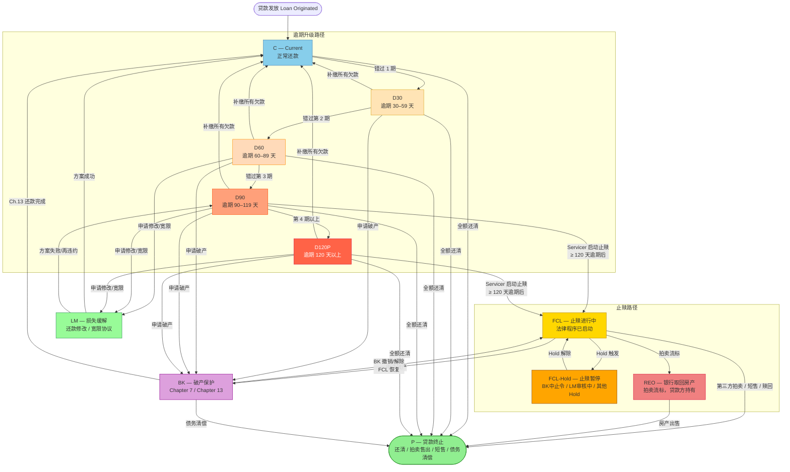
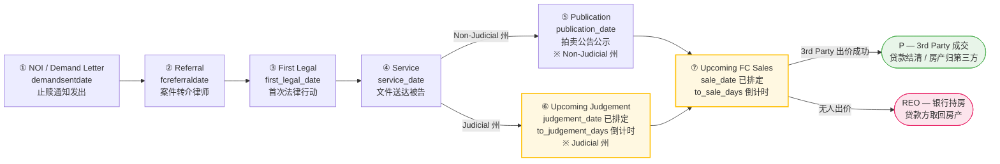

# 17 — 美国贷款 Foreclosure 业务入门

---

## 文档目的

- **为什么存在**：将 doc 7 中面向业务理解的 Foreclosure 入门章节单独提取，形成可独立分享给业务、运营、数据治理和新同事阅读的材料。
- **解决的问题**：读者不需要先理解完整 ETL 血缘，也能快速了解美国抵押贷款 Foreclosure 的业务含义、判断依据、生命周期、司法/非司法差异以及与 Bankruptcy 的关系。
- **范围**：仅覆盖 Foreclosure 业务入门知识与概念解释；不覆盖各 Servicer 的具体 ETL 实现、字段映射、数据库表结构或 BPS 展示字段细节。
- **系统关系**：本文是 `07_fcl_lineage_and_rules.md` 第 2 章的独立分享版，作为 ForeclosureRule2 文档体系中的业务背景读物。

## 目标读者

主要读者：数据产品经理 · 业务分析师 · 运营团队 · 数据治理团队 · 新入职同事  
次要读者：ETL 开发者 · 验证/对账工程师 · Reviewer · 未来 AI Session

## 修订历史

| 日期 | 作者 | 版本 | 变更说明 | 关联文档 |
|------|------|------|---------|---------|
| 2026-05-29 | AI Agent (Codex) | v1 | 从 doc 7 第 2 章提取 Foreclosure 业务入门内容，补充标准文档头，形成独立分享版 | doc 7 |

## 依赖文档

| 文档 | 用途 |
|------|------|
| `07_fcl_lineage_and_rules.md` | 原始章节来源；包含后续 Per-Servicer 数据血缘与判断规则 |
| `10_glossary.md` | 项目完整术语表，可作为本文补充阅读 |

## 已知限制

- 本文是业务背景材料，不用于替代法律意见或合规判定。
- 本文不包含具体 Servicer 字段缺口、BPS 面板映射或 ETL 写入机制；这些内容应继续查看 doc 08、doc 13、doc 14、doc 15。

---

## 美国贷款 Foreclosure 业务入门

### 1 为什么需要 Foreclosure 判断？

作为 Asset Manager，我们持有的 MBS（Mortgage-Backed Securities）或贷款池中，每笔贷款的 delinquency 状态直接影响：
- **投资人报告**：BPS 系统展示的 FCL 率、逾期分布
- **IRR 计算**：FCL 贷款的现金流预测与损失估算
- **合规监控**：FCL 时间线是否符合 FNMA/FHLMC 规定（超期处罚）
- **Loss Severity 分析**：FCL 结果（3rd Party Sale / REO）对损失率的影响

### 2 FCL 判断的两种依据

| 判断方式 | 说明 | 谁用 |
|---------|------|------|
| **Servicer 直接申报** | Servicer 在日报/月报中明确标注 `status = 'Foreclosure'` | SLS, Newrez, Carrington, CapeCodFive |
| **Days360 逾期天数推断** | `days360(nextduedate, fctrdt) ≥ 30` 则按档位 D30~D120P | 兜底逻辑（所有 Servicer） |

> **重要**：Days360 推断最多只能得到 `D120P`（120天以上逾期），**永远不会产生 `FCL` 状态**。`FCL` 状态必须来自 Servicer 的显式字段。

#### days360(nextduedate, fctrdt) 详解

**参数含义：**

| 参数 | 含义 | 示例 |
|------|------|------|
| `nextduedate` | 借款人**下一次应还款的日期**（即上次还款到期后的下一期） | `2024-03-01`（借款人3月1日应还款） |
| `fctrdt` | **Factor Date**，报告截止日 = as-of date 所在月的下月第一天 | `2024-04-01`（4月报，截止日为4月1日） |

`days360(nextduedate, fctrdt)` 使用 **360天/年惯例**（每月按30天计算）计算两个日期之间的天数差，结果即为该贷款的**逾期天数**。

> 例：`nextduedate = 2024-01-01`，`fctrdt = 2024-04-01` → `days360 = 90` → delinq = `D90`

**逾期档位划分规则：**

| `days360(nextduedate, fctrdt)` 的值 | delinq 状态码 | 含义 |
|-------------------------------------|--------------|------|
| < 30 天 | `C` | Current，正常还款 |
| 30 – 59 天 | `D30` | 逾期 30 天 |
| 60 – 89 天 | `D60` | 逾期 60 天 |
| 90 – 119 天 | `D90` | 逾期 90 天 |
| ≥ 120 天 | `D120P` | 逾期 120 天以上（最高档，无上限） |

**为什么 days360 永远不会产生 `FCL`：**

FCL（止赎）是一个**法律程序状态**，不是逾期严重程度的量化指标。两者完全独立：

- 一笔贷款可能逾期 200 天（D120P），但 Servicer 选择了还款修改方案 → **不进入 FCL**
- 一笔贷款可能仅逾期 60 天（D60），但 Servicer 已提交止赎申请 → **已是 FCL**

因此，days360 只能告知"欠款多久了"，无法告知"是否已启动止赎法律程序"。`FCL` 必须由 Servicer 在报表中**显式标注**才能产生。

### 3 Servicer 常见 Foreclosure 相关字段

#### MBA 标准是什么？

**MBA = Mortgage Bankers Association**（美国抵押贷款银行家协会），成立于 1914 年，是美国住宅和商业地产金融行业的全国性权威行业协会，会员包括银行、Servicer、投资机构等 2,000+ 家机构。

MBA 制定了一套**全行业通用的贷款逾期分类标准（MBA Delinquency Classification Standard）**，明确规定了各种逾期和特殊状态如何定义和报告。主要目的是让不同 Servicer、投资人、监管机构之间的数据口径一致、可以互相比较。

**MBA 标准逾期码体系（我们系统使用的）：**

| MBA 标准描述 | 我们系统的 delinq 码 | 含义 |
|------------|------------------|------|
| Current | `C` | 正常还款，无逾期 |
| 30 Days Delinquent | `D30` | 逾期 30–59 天 |
| 60 Days Delinquent | `D60` | 逾期 60–89 天 |
| 90 Days Delinquent | `D90` | 逾期 90–119 天 |
| 120+ Days Delinquent | `D120P` | 逾期 120 天以上 |
| Foreclosure | `FCL` | 止赎进行中 |
| REO | `REO` | 银行取回房产 |
| Paid Off / Full Payoff | `P` | 贷款已结清 |

**为什么 Servicer 的字段叫 `delinquency_status_mba`？**

表示该字段的取值遵循 MBA 定义的标准分类词汇（如"Foreclosure"、"REO"、"Current"）。相比之下，有些 Servicer（如 Carrington）使用自己定义的术语（如"R"代表 REO、"Completed Payoff"代表结清），这些非标准字段不带 `_mba` 后缀。

> **对数据工程的影响**：`_mba` 字段取值相对规范，映射到 delinq 标准码较直接；非 `_mba` 字段则需要 Servicer 专项的映射规则（见 Section 3 各 Servicer 部分）。

**Servicer 常见 FCL 相关字段类型：**

| 字段类型 | 示例字段名 | 含义 |
|---------|-----------|------|
| 状态文本（MBA 标准） | `delinquency_status_mba`（Newrez）, `delq_status_mba`（SLS） | 遵循 MBA 分类词汇的逾期/FCL 状态描述 |
| 状态文本（Servicer 自定义） | `loan_status`（Carrington）, `min_status`（MRC） | 各 Servicer 自己定义的状态描述，需专项映射 |
| 激活标志 | `fcl_flag`, `fc_flag`, `foreclosure_status_code` | FCL 是否激活（Y/N/Active/状态码） |
| 时间线日期 | `referral_date`, `first_legal_date`, `sale_date` | FCL 各里程碑节点日期 |
| Hold 原因 | `fchold1description~fchold4description` | 暂停原因（最多4级） |

---

### 4 美国贷款生命周期状态图

#### 4.1 完整生命周期流程图



#### 4.2 状态说明与系统 delinq 码对应

| 状态 | 系统 delinq 码 | 产生方式 | 备注 |
|------|-------------|---------|------|
| Current | `C` | `days360 < 30` | 正常还款 |
| D30 | `D30` | `30 ≤ days360 < 60` | 逾期 1 期 |
| D60 | `D60` | `60 ≤ days360 < 90` | 逾期 2 期 |
| D90 | `D90` | `90 ≤ days360 < 120` | 逾期 3 期 |
| D120P | `D120P` | `days360 ≥ 120` | 最高档，不再细分 |
| LM | — | 不产生独立 delinq | `lm_flag = 'Y'`，delinq 仍按逾期天数 |
| BK | — | 不产生独立 delinq | `bankruptcy = 'Y'`，delinq 仍保持原值 |
| FCL | `FCL` | Servicer 显式申报 | **days360 永远不能产生 FCL** |
| FCL-Hold | `FCL` | Hold 不改变 delinq 值 | hold 信息存于 `fchold1~4description` |
| REO | `REO` | Servicer 申报 | 拍卖后银行持有产权 |
| P | `P` | Servicer 申报终止 | 贷款从组合中退出 |

#### 4.3 关键转换条件详表

| 转换 | 触发条件 | 典型时点 |
|------|---------|---------|
| C → D30 | 借款人错过 1 期还款 | 逾期第 1 天 |
| D30 → D60 | 未补缴，错过第 2 期 | 逾期第 31 天 |
| D60 → D90 | 未补缴，错过第 3 期 | 逾期第 61 天 |
| D90 → D120P | 未补缴，第 4 期以上 | 逾期第 91 天起 |
| Dx → C | 借款人补缴所有欠款（再续） | 随时 |
| Dx → LM | Servicer 批准宽限 / 还款修改申请 | 通常 60–90 天时 |
| LM → C | 修改方案试用成功（通常 3 期不违约） | 试用期后 |
| LM → D90 | 方案失败 / 再次违约 | — |
| D90/D120P → FCL | Servicer 提交止赎申请（CFPB 规定：≥ 120 天逾期 + 完成 LM 告知义务后方可启动） | 逾期 120 天后 |
| FCL → FCL-Hold | Hold 触发：BK 自动中止令 / LM 审核中 / 军人保护法（SCRA）/ 法律挑战 | 止赎期间随时 |
| FCL-Hold → FCL | Hold 消除：BK 解除 / LM 被拒 / 法院裁决 | — |
| FCL → REO | 止赎拍卖流标，银行以底价取得产权 | 拍卖日 |
| FCL → P | 第三方拍卖成功；或借款人完成短售 | 拍卖日 / 短售交割日 |
| FCL → C | 借款人还清全部欠款赎回（Redemption，极少见） | 拍卖前任意时点 |
| REO → P | 银行将 REO 房产出售 | 取得产权后数月 |
| 任意 → P | 自愿全额还清 / 提前还款 | 随时 |
| Dx / FCL → BK | 借款人申请破产保护 | 随时 |
| BK → FCL | 破产撤销 / 解除，止赎程序恢复 | BK 结案后 |
| BK → C | Ch.13 还款计划顺利完成 | 3–5 年后 |
| BK → P | Ch.7 债务清偿，或 Ch.13 完成后清偿 | — |

#### 4.4 FCL 内部子阶段

处于 `delinq = 'FCL'` 的贷款，系统在 `port.basic_data_loan_fcl` 表中跟踪 6 个内部里程碑：

```
DEMAND → REFERRAL → FIRST_LEGAL → SERVICE → JUDGEMENT → SALE
需求通知   正式转介     首次法律行动    文件送达     法院裁决      拍卖出售
```

这 6 个阶段的日期字段（`referral_date`, `first_legal_date`, `sale_date` 等）是分析 FCL 时长合规性（FNMA/FHLMC 超期处罚规定）的数据基础。

#### 4.5 各州司法 vs 非司法止赎差异

美国止赎法律分两类，直接影响 FCL 的持续时长和系统记录的时间跨度：

| 维度 | 司法止赎（Judicial Foreclosure） | 非司法止赎（Non-Judicial / Power of Sale） |
|------|--------------------------------|------------------------------------------|
| 流程 | 须经法院起诉 → 裁决 → 拍卖，借款人有权答辩 | 依据合同中"权力出售条款"直接拍卖，无需法院 |
| 典型时长 | **12 个月 ~ 3 年** | **2 ~ 6 个月** |
| 借款人赎回权 | 多数州有法定赎回期（拍卖后仍可赎回） | 通常无赎回期，拍卖后产权立即转移 |
| 系统影响 | `FIRST_LEGAL → JUDGEMENT` 阶段跨度长，FCL-Hold 频率更高 | SALE 日期到来快，FCL 记录生命周期短 |

**主要州分类：**

| 类型 | 代表州 | 典型 FCL 时长 |
|------|--------|-------------|
| 司法止赎 | Florida, New York, New Jersey, Illinois, Ohio, Pennsylvania | 12–36 个月 |
| 非司法止赎 | California, Texas, Georgia, Arizona, Nevada, Michigan | 2–5 个月 |
| 两种均适用 | Massachusetts, Connecticut | 视选择路径而定 |

> **对产品经理的含义**：同样是 `delinq = 'FCL'` 的贷款，纽约的贷款可能已持续 2 年，加州的只有 3 个月。分析 FCL 存量、Loss Severity 或合规超期时，**必须按州区分**。`port.basic_data_loan_fcl` 的 `referral_date` 和 `sale_date` 字段是计算这一差异的数据基础。

#### 4.6 BPS FCL 运营阶段管道

上文 2.4.4 介绍了系统内部跟踪的 6 个 FCL 里程碑（理论模型）。本节说明 BPS 报告系统如何将这一理论模型落地为 **7 个运营监控阶段**，以及设计背后的逻辑。

> 本节聚焦 BPS agg-summary 页面的 FCL 阶段划分，与上方【2.4.1 完整生命周期流程图】互为补充：2.4.1 展示全局状态扭转（含 D30~D120P、LM、BK 等所有状态），本节仅聚焦 FCL 内部分段。

**阶段流程图**



**阶段说明**

| # | BPS 阶段 | 监控口径 | 适用类型 | 核心字段 | 说明 |
|---|---------|---------|---------|---------|-----|
| 1 | **NOI / Demand Letter** | 已完成 | 通用 | `demand_date`, `noi_date` | 止赎正式启动前的法律通知。Judicial 州称 NOI（Notice of Intent）；Non-Judicial 州称 Demand Letter。Newrez 原始字段：`demandsentdate` |
| 2 | **Referral** | 已完成 | 通用 | `referral_date` | 案件移交止赎律师。`fcreferraldate` 非空是 BPS 收录的入库条件，同时是 FCL 时间线计算起点 |
| 3 | **First Legal** | 已完成 | 通用 | `first_legal_date` | 第一次正式法律行动：Judicial 州 = 向法院提交起诉状；Non-Judicial 州 = 首次公告。法律时钟开始计时 |
| 4 | **Service** | 已完成 | 通用 | `service_date` | 法律文件送达借款人及相关被告。多被告案件可显著延长此阶段 |
| 5 | **Publication** | 已完成 | Non-Judicial 为主 | `publication_date` | Non-Judicial 州专属：拍卖公告公示（通常在拍卖日前 21–30 天）。Judicial 州此阶段通常为 0 |
| 6 | **Upcoming Judgement** | **待发生** | Judicial 州 | `judgement_date`, `to_judgement_days` | 法院审判日期已排定但尚未到来。`to_judgement_days`（倒计时天数）是该阶段核心指标 |
| 7 | **Upcoming FC Sales** | **待发生** | 通用 | `sale_date`, `to_sale_days` | 拍卖日期已排定但尚未完成。`to_sale_days`（倒计时天数）是核心指标。拍卖完成后贷款退出 FCL（→ P 或 REO） |

**"Upcoming" 命名逻辑**

阶段 1–5 以"最近完成的事件"命名（事件已发生，贷款处于等待下一步的状态）。阶段 6–7 采用"Upcoming"前缀，原因如下：

1. **有明确排期日期**：贷款进入"Upcoming Judgement"阶段时，法院已排定具体庭审日期；进入"Upcoming FC Sales"时，拍卖日期已确定。两者都是已知的未来事件。

2. **字段证据**：`to_judgement_days`（倒计时至判决日）和 `to_sale_days`（倒计时至拍卖日）是**倒计时字段**（未来日期 − 今日）。这两个字段仅在事件未发生时有意义，其存在本身即证明该阶段描述的是**尚未发生的事**。

3. **事件发生后无需"已完成"监控组**：
   - 判决完成后（Judicial 州）：贷款立即进入拍卖排期 → 流转到"Upcoming FC Sales"
   - 拍卖完成后：贷款退出 FCL（→ P 或 REO），不再需要 FCL 监控
   - 因此没有设立"Judgement（已完成）"或"FC Sales（已完成）"监控组的必要

4. **消除歧义**：若使用"Judgement"（无前缀），含义模糊——可能是"等待判决"，也可能是"判决已完成"。"Upcoming"前缀明确表达"日期已排定、事件尚未发生"，运营人员一目了然。

**设计合理性分析**

BPS 7 阶段管道设计合理，体现了以下工程考量：

1. **完整覆盖**：覆盖 FCL 生命周期内所有有意义的监控窗口，无跨度过大的空白区间。

2. **Publication 阶段必要**：Non-Judicial 州（加州、得州、佐治亚州等）占美国 FCL 量的多数。若无 Publication 阶段，Service 之后、拍卖之前将有数周至数月的监控盲区。

3. **无需"已完成"尾组**：贷款在拍卖后退出 FCL，不存在需要持续监控的"已完成拍卖"状态。管道以"Upcoming FC Sales"收尾，设计上自洽。

4. **运营导向命名**：阶段以"下一个待处理事件"命名，运营团队打开看板即知每笔贷款的当前等待项，无需额外解码。

**与 2.4.4 理论模型的对应关系**

| 2.4.4 模型阶段 | BPS 管道阶段 | 变化说明 |
|--------------|------------|---------|
| DEMAND | ① NOI / Demand Letter | 命名改为业务术语（NOI / Demand Letter），含义不变 |
| REFERRAL | ② Referral | 一致 |
| FIRST_LEGAL | ③ First Legal | 一致 |
| SERVICE | ④ Service | 一致 |
| *（理论模型无此阶段）* | ⑤ Publication | **BPS 新增**：覆盖 Non-Judicial 州拍卖公告期 |
| JUDGEMENT | ⑥ Upcoming Judgement | 语义转变：由"已完成的判决阶段"改为"已排期、等待发生的判决" |
| SALE | ⑦ Upcoming FC Sales | 语义转变：由"已完成的拍卖阶段"改为"已排期、等待发生的拍卖" |

---

### 5 Foreclosure 与 Bankruptcy 深度解析

#### 5.1 什么是 Foreclosure（止赎）？

**定义**：Foreclosure 是贷款方依据抵押合同，在借款人持续违约后，通过法律程序**强制出售抵押房产**以收回欠款的过程。

**谁发起**：**贷款方（或其代理 Servicer）**，不是借款人。在我们公司的背景下：
- 我们公司（Asset Manager）持有 MBS 或贷款池中的投资份额，是真正的贷款方
- Servicer（SLS、Newrez、Carrington 等）是我们的代理人，负责日常管理贷款、收款，并在必要时代表我们发起止赎
- 因此"Servicer 申请 FCL"实质上是在代表我们这样的投资人保护权益

**为何发起**：
- 借款人持续不还款（通常 ≥ 120 天逾期，且 CFPB 规定完成 LM 告知义务后方可启动）
- 损失缓解方案（宽限、还款修改）均已失败或借款人拒绝配合
- 贷款方需要通过变现房产收回本金，降低投资损失

---

#### 5.2 Foreclosure 的完整过程（6 个阶段）

与系统 `port.basic_data_loan_fcl` 跟踪的 6 个里程碑一一对应：

| 阶段 | 系统字段 | 说明 |
|------|---------|------|
| **1. 需求通知 (DEMAND)** | `demand_date` | 贷款方向借款人发出正式违约通知函，要求还款或采取措施 |
| **2. 正式转介 (REFERRAL)** | `referral_date` | Servicer 将案件移交止赎律师，正式进入法律程序 |
| **3. 首次法律行动 (FIRST_LEGAL)** | `first_legal_date` | 司法州：向法院提起诉讼；非司法州：发布违约通知（Notice of Default） |
| **4. 文件送达 (SERVICE)** | `service_date` | 起诉文件正式送达借款人，法定期限开始计算 |
| **5. 法院裁决 (JUDGEMENT)** | `judgement_date` | 法院裁决贷款方胜诉，获准出售房产（仅司法州有此阶段） |
| **6. 拍卖出售 (SALE)** | `sale_date` | 房产公开拍卖，最高出价者获得产权 |

---

#### 5.3 Foreclosure 如何结束（5 种出口）

| 结束方式 | 说明 | delinq 变化 | 谁主导 |
|---------|------|------------|--------|
| **第三方拍卖 (3rd Party Sale)** | 拍卖有买家出价高于底价，成交 | FCL → `P` | 市场竞价 |
| **REO（银行取回）** | 拍卖无人出价，贷款方以底价取得房产产权 | FCL → `REO` | 贷款方 |
| **赎回 (Reinstatement)** | 借款人在拍卖前一次性还清所有欠款及滞纳金费用 | FCL → `C` | 借款人 |
| **短售 (Short Sale)** | 借款人以低于贷款余额的价格出售房产，贷款方书面同意豁免差额 | FCL → `P` | 借款人 + 贷款方 |
| **以房抵债 (Deed in Lieu)** | 借款人主动将房产产权转让给贷款方，双方协议终止贷款 | FCL → `P` | 借款人 + 贷款方 |

> **REO 之后**：贷款方取得房产后，会以独立资产运营（挂牌出售、修缮等），出售后 delinq → `P`，贷款从组合中退出。

---

#### 5.4 破产保护（Bankruptcy）深度解析

##### 谁发起，为何发起

**发起方**：**借款人（房主）**，是借款人主动申请，不是贷款方。

**目的**：
- 立即触发**"自动中止令（Automatic Stay，11 U.S.C. § 362）"**，联邦法律强制要求停止所有催收行为，包括止赎
- 为自己争取时间重组财务，避免立即失去房产
- Chapter 13：通过制定还款计划来补缴欠款，最终保住房子

---

##### Chapter 7 / Chapter 13 是什么？

这两个名称来自美国联邦破产法典 **US Bankruptcy Code**（正式名称：美国法典第 11 编，Title 11 of the United States Code）。该法典按**章（Chapter）**组织不同类型的破产程序，Chapter 编号即对应章节号：

| 章节 | 适用对象 | 类型 |
|------|---------|------|
| **Chapter 7** | 个人 / 企业均可 | **清算型**：变卖资产偿债，剩余债务豁免 |
| **Chapter 11** | 主要是企业 | **企业重组**：继续运营并制定债务重组计划（常见于大公司破产保护） |
| **Chapter 13** | 有固定收入的个人 | **个人重组**：制定 3–5 年还款计划逐步清偿，可保留房产 |

在抵押贷款语境中，我们只关注 **Chapter 7** 和 **Chapter 13**。"Filed Chapter 7 / Chapter 13" 已成为美国日常法律用语，直接用章节号代指整个破产程序类型。

##### Chapter 7 vs Chapter 13 对比

| 维度 | Chapter 7（清算型） | Chapter 13（重组型） |
|------|-------------------|-------------------|
| 俗称 | 个人破产清算 | 工薪族破产 / 重组型破产 |
| 核心机制 | 清除个人债务（Debt Discharge） | 制定 3–5 年还款计划，逐步补缴欠款 |
| 房子能保住吗 | **通常不能**（除非主动继续还款，贷款方同意） | **通常能**（还款计划顺利完成后） |
| 持续时间 | 3–6 个月 | 3–5 年 |
| FCL 结果 | 自动中止令暂停 FCL；BK 结束后贷款方通常恢复止赎 | 自动中止令暂停 FCL；还款计划成功完成后 FCL 撤销，delinq → `C` |

---

##### Ch.7 中"Lien 不随债务清除而消失"是什么意思？

这是美国破产法中最容易被误解的概念。**关键在于：一笔抵押贷款包含两种法律权利，破产只能清除其中一种。**

```
抵押贷款 = 两层结构

Layer 1：个人还款责任（Personal Liability）
  ─ 含义：借款人欠贷款方钱，贷款方可以起诉借款人本人追偿
  ─ Ch.7 破产可以清除这一层 ✅（借款人不再对欠款金额承担个人法律责任）

Layer 2：房产抵押权（Mortgage Lien）
  ─ 含义：贷款方对房产本身享有安全担保权益（Security Interest）
  ─ Ch.7 破产无法清除这一层 ❌（Lien 依附于房产，不依附于人）
```

**通俗比喻**：

你向银行借了 30 万买了一套房，房子作为抵押物。之后你申请了 Ch.7 破产：
- 法院说：你不需要再还这 30 万了（个人还款责任消除）✅
- 但是：银行在这套房子上的抵押权依然存在 ❌
- 结果：如果你继续住在这套房子里但不还款，银行仍然可以申请止赎、拍卖这套房产——只是**拍卖后的差额（Deficiency）不能再向你个人追偿**

**"贷款结清了，不是应该能解押吗？"**

这是一个好问题。关键在于 Ch.7 **并没有真正还清贷款**：
- "结清"债务 = 借款人还清了所有欠款 → 这时银行才会解除抵押权，房产解押
- "破产清除债务" = 法律豁免借款人的个人还款责任，但银行实际上**并没有收到钱** → 抵押权不消失

**实际影响对比**：

| 情景 | 房贷余额 | 拍卖成交价 | 差额（Deficiency） | 贷款方能向借款人追偿差额吗？ |
|------|---------|-----------|------------------|--------------------------|
| 无 BK | $300,000 | $250,000 | $50,000 | ✅ 可追偿（视州法律，部分州禁止） |
| Ch.7 破产后 | $300,000 | $250,000 | $50,000 | ❌ 不可追偿（个人债务已清除） |

**结论**：Ch.7 保护了借款人的"人"（不再被追债），但没有保护借款人的"房产"（房子还是可能被拍卖）。

---

##### FCL + BK 并存时系统如何表达

FCL 期间借款人申请破产，系统的表达方式：

| 系统字段 | 值 | 说明 |
|---------|---|------|
| `delinq` | `FCL`（保持不变） | 止赎状态不因 BK 退回到 D120P，FCL 仍在 |
| `bankruptcy` | `Y` | 标注借款人处于破产保护状态 |
| `fchold1description` | `Bankruptcy` / `BK Auto-Stay` 等 | Hold 原因：破产自动中止令 |

这解释了为什么 Newrez 的原始状态描述中有以下两种组合（见 Section 3.2）：

| Newrez 原始 delq_status | 含义 | 系统 delinq |
|------------------------|------|------------|
| `Foreclosure / Non-Perf BK` | 止赎中 + 借款人破产但**未按** Ch.13 还款计划执行 | `FCL` |
| `Foreclosure / Perf BK` | 止赎中 + 借款人破产且**正在按** Ch.13 还款计划执行 | `FCL` |

两者 delinq 均为 `FCL`，区别在于 BK 的履约状态，影响 Hold 的预期持续时间和最终走向。

---


