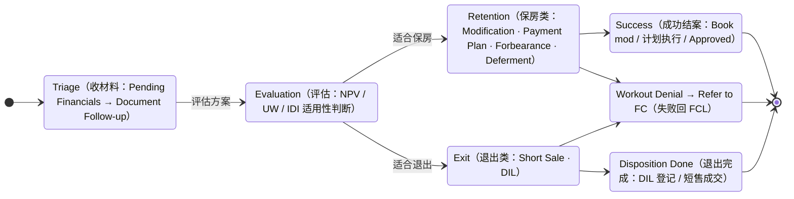
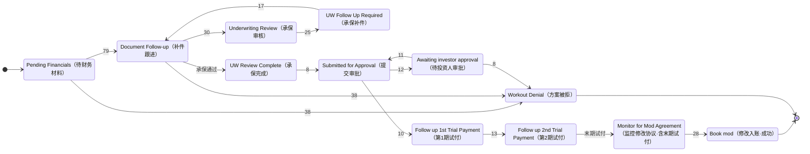
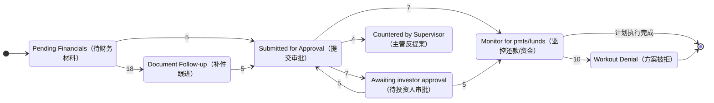
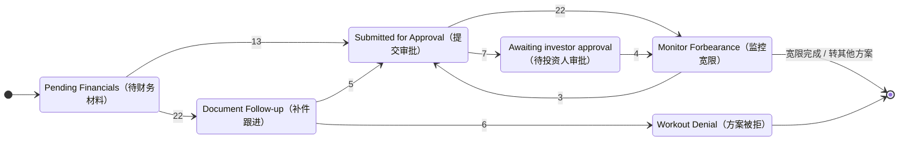
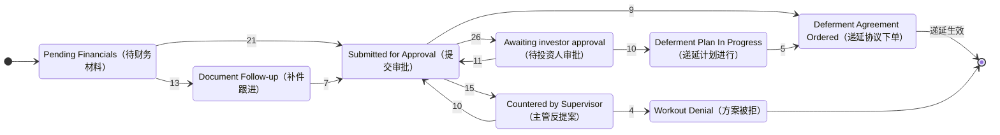
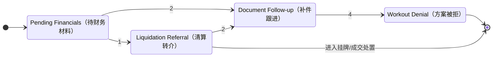
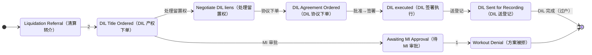

# Loss Mitigation（LM）业务入门与方案说明

---

## 文档信息

| 项目 | 内容 |
|------|------|
| **文档目的** | 将项目中分散的 LM（Loss Mitigation，损失缓解）解释整理成一个独立入门文档，说明 LM 的业务含义、常见方案、BPS/Newrez 字段含义，以及 LM 与 Foreclosure 的关系。 |
| **目标读者** | 数据产品经理、业务分析师、运营/资产管理团队、新成员、后续 AI 会话 |
| **覆盖范围** | LM 基础概念、六类常见方案、Newrez/BPS 中 Deal/Program/Status/Final Disposition 的解释、LM 对 FCL 的影响、项目内相关文档索引 |
| **不覆盖范围** | 各州法律细则、投资人/Agency 具体审批规则、每个 Servicer 的完整字段缺口分析 |
| **依赖文档** | doc 10 综合术语清单；doc 08 Servicer FCL 字段映射；doc 09 Servicer 数据接口标准；doc 13 Newrez BPS 显示映射；doc 15 Newrez 字段缺口分析；doc 16 BPS 面板速查 |

**修订历史：**

| 日期 | 作者 | 版本 | 变更内容 |
|------|------|------|---------|
| 2026-05-29 | AI Agent | v1 | 初始版本；从现有 LM 相关文档中整理为独立分享/查询文档 |
| 2026-06-03 | AI Agent (Claude Opus 4.8) | v5 | 新增 §0「术语缩写全称（Abbreviations）」对照表（LM/FCL/DIL/SS/TPP/MI/NPV/UW/IDI/DPD/BK/REO/CFK/GSE）；§4.5 DIL 标题补全称 `Deed-in-Lieu`。en 同步 | en doc 18 v2 |
| 2026-06-03 | AI Agent (Claude Opus 4.8) | v4 | §4.5 状态图节点改**中英双语**（`English（中文）`）；每张图下方新增「节点说明」「转移（边）说明」两表（逐节点/逐边业务含义+动作，频次与图对齐）。同步**新建英文版 `docs/en/18_…md`（全量镜像）**；doc 18 纳入 zh⇄en 同步 | en doc 18 v1 |
| 2026-06-03 | AI Agent (Claude Opus 4.8) | v3 | §4.3 Status 表由 6 例扩为**实测 22 个**（含业务含义/所属阶段/常见 Deal；注明字典完整域约 150 码）；新增 §4.5「LM Status 状态流转图（按 Deal 大类）」：总览 + Modification/Payment Plan/Forbearance/Deferment/Short Sale/DIL 共 6 张 Mermaid stateDiagram，边上标注 `portnewrezlm` 时序实测转移频次（547 周期）。同步 doc 14 lm_status 取值范围列全 22 | DB 实测（portnewrezlm 时序）· Redshift portnewrezdatadic · doc 14 v30 |
| 2026-06-03 | AI Agent (Claude Opus 4.8) | v2 | §4.1 Deal 表按 DB 订正：`Repayment Plan`→`Payment Plan`（deal；Repayment Plan 实为其 program），补 `Deferment`/`Payoff`（共 8，另注字典 13 码中未出现的 5 个）；§3「六类」业务概念保留并加「与 Newrez 数据 deal 的对应」说明（TPP 属 program 层、Repayment↔Payment Plan、Newrez 另有 Evaluation/Deferment/Payoff）。与 doc 14 lm_type/lm_deal、doc 13 §5、Redshift portnewrezdatadic 一致 | DB 实测 · doc 14 v27 · doc 13 v33 |

---

## 0. 术语缩写全称（Abbreviations）

本文（及状态图）中出现的专业缩写全称对照：

| 缩写 | 全称（English） | 中文 |
|---|---|---|
| **LM** | Loss Mitigation | 损失缓解 |
| **FCL** | Foreclosure | 止赎 |
| **DIL** | Deed-in-Lieu (of Foreclosure) | 以房抵债（自愿交还房产抵偿贷款） |
| **SS** | Short Sale | 短售 |
| **TPP** | Trial Period Plan | 试行期计划（永久修改前的试还期） |
| **MI** | Mortgage Insurance | 贷款保险（含 PMI 私人贷款保险） |
| **NPV** | Net Present Value | 净现值（LM 评估测算模型） |
| **UW** | Underwriting | 承保 / 核保 |
| **IDI** | Imminent Default (Indicator) | 即将违约（评估流程） |
| **DPD** | Days Past Due | 逾期天数 |
| **BK** | Bankruptcy | 破产 |
| **REO** | Real Estate Owned | 银行/贷款方持有房产（止赎完成无人出价的结果） |
| **CFK** | Cash for Keys | 现金换交房（补偿借款人腾房交钥匙） |
| **GSE** | Government-Sponsored Enterprise | 政府支持企业（如 Fannie Mae / Freddie Mac） |

---

## 1. LM 是什么

**LM = Loss Mitigation（损失缓解）**。

它不是一个单独的 foreclosure 阶段，而是贷款方或 Servicer 为了避免止赎损失、帮助借款人解决逾期问题而提供的一组替代处理方案。

简单理解：

| 问题 | LM 的作用 |
|------|-----------|
| 借款人逾期了，但还有恢复还款能力 | 给临时宽限、还款计划或贷款修改 |
| 借款人无法恢复正常还款，但愿意配合退出房产 | 给 Short Sale 或 Deed-in-Lieu |
| Foreclosure 已启动，但借款人又提交材料申请救济 | 进入 LM 评估，FCL 可能 Hold / Pause |

LM 是一个**独立业务维度**，可以和 FCL 并存。例如：一笔贷款已经处于 Foreclosure，但同时有活跃的 LM cycle，说明止赎流程在推进或暂停的同时，Servicer 仍在评估借款人的救济方案。

---

## 2. LM 与 Foreclosure 的关系

LM 的核心目标是：**在 foreclosure 完成前，尽可能找到损失更小的解决路径**。

| 关系 | 说明 |
|------|------|
| LM 不等于 FCL | LM 是救济/替代方案；FCL 是法律止赎流程 |
| LM 可发生在 FCL 前 | 借款人逾期后先尝试还款计划、修改贷款等 |
| LM 可发生在 FCL 中 | FCL 启动后借款人仍可申请 LM，可能触发 Hold |
| LM 成功可能终止 FCL | Modification/Repayment 成功后，贷款恢复履约；Short Sale/DIL 成功后贷款关闭 |
| LM 失败通常回到 FCL | Denied、Withdrawn、Request Incomplete、Referral to FC 后，FCL 继续推进 |

在数据建模上，LM 不应该只被塞进 `delinquency_status`。更合理的设计是使用独立字段，例如：

| 字段 | 含义 |
|------|------|
| `lm_flag` | 是否存在活跃 LM |
| `lm_type` / `deal` | LM 方案大类 |
| `lm_program` | 具体执行方案 |
| `lm_status` | 当前处理状态 |
| `lm_start_date` / `lm_end_date` | 本轮 LM 周期起止日期 |
| `lm_final_disposition` | 本轮 LM 最终结论 |

---

## 3. LM 六类常见方案

项目现有文档中把 LM 方案概括为六类。它们可以按“保留房产”到“退出房产”的方向理解。

| 方案 | 英文 | 借款人目标 | 业务含义 | 典型结果 |
|------|------|------------|----------|----------|
| 宽限协议 | Forbearance | 暂时保留房产 | 暂停或减少月供一段时间，到期后补缴或转入其他方案 | 临时缓解；可能恢复正常、转 Modification 或失败 |
| 贷款修改 | Loan Modification | 长期保留房产 | 永久修改贷款条款，如利率、期限、本金余额或还款结构 | 成功后贷款恢复履约 |
| 还款计划 | Repayment Plan | 保留房产 | 在恢复正常月供的同时，分期补缴历史欠款 | 短期困难已解决时适用 |
| 试行期计划 | Trial Period Plan / TPP | 先试运行再正式修改 | 永久 Modification 生效前，借款人先按新金额连续还款若干期 | 通过后转 Permanent Modification；失败则 LM 拒绝 |
| 短售 | Short Sale | 主动出售房产 | 贷款方允许以低于贷款余额的价格出售房产，并处理差额 | 贷款关闭，通常避免完整 FCL 拍卖 |
| 以房抵债 | Deed-in-Lieu / DIL | 主动交回房产 | 借款人主动把产权转给贷款方，换取贷款债务解决 | 贷款关闭，避免公开止赎拍卖 |

### 3.1 按业务方向分组

| 分组 | 包含方案 | 业务方向 |
|------|----------|----------|
| 保留房产类 | Forbearance、Loan Modification、Repayment Plan、Trial Period Plan | 借款人继续持有房产，贷款恢复履约 |
| 退出房产类 | Short Sale、Deed-in-Lieu | 借款人不再保留房产，但避免或减少 foreclosure 损失 |
| 评估阶段 | Evaluation | 不是最终方案，而是 Servicer 评估借款人适合哪一种 LM |

> **与 Newrez 数据 `deal` 的对应（重要）**：上方「六类」是**业务教学分类**，与 Newrez 实际 `deal` 数据枚举（见 §4.1）并不一一对应：
> - **Trial Period Plan (TPP)** 在 Newrez **不是独立 deal**，而是 Modification 的 `program`/状态（永久修改前的试行阶段）；
> - 业务说的 **Repayment Plan** 对应 Newrez 的 deal `Payment Plan`（Repayment Plan 是其 program）；**Loan Modification = `Modification`**、**Deed-in-Lieu = `DIL`**；
> - Newrez 数据实际有而「六类」未单列的：**`Evaluation`（评估阶段）、`Deferment`（递延）、`Payoff`（付清）**——其中 Deferment 也是常见保留房产类方案（数据中较多）。
> 因此 Newrez 实测 `deal` 共 **8 个**（§4.1），与 doc 14 `lm_type`/`lm_deal` 一致。

在 doc 13 的 Newrez/BPS 场景里，LM Cycle 面板不是只显示“是否有 LM”，而是显示每一轮 LM 的生命周期。

### 4.1 Deal：LM 方案大类

`Deal` 表示本轮 LM 的大方向。

> **Deal 值以 Newrez `lmdeal` 解码为准**（Redshift 字典表 `newrez.portnewrezdatadic` field_name='LMDeal'；代码 [`basic_data_pool_config.py:835`](https://gitlab.bridgerinvestment.com/jli/prefectflow/-/blob/32a750a39c7eda989de991c47467979043e3d209/flow/basic_data/basic_data_config/basic_data_pool_config.py#L835)）。字典定义 13 码，**数据实测出现 8 个**（下表）。注意：deal 是 `Payment Plan`（不是 `Repayment Plan`——后者是其 `program`）。

| Deal 值 | 业务含义 | 借款人结果 |
|---------|----------|------------|
| `Evaluation` | 初始评估，确认借款人材料和适用方案 | 尚不确定 |
| `Modification` | 贷款修改 | 保留房产 |
| `Forbearance` | 临时宽限 | 暂时缓解 |
| `Payment Plan` | 还款计划（program 名为 Repayment Plan） | 保留房产 |
| `Deferment` | 递延：把欠款移到贷款末期 | 保留房产 |
| `Short Sale` | 短售 | 出售房产 |
| `DIL` | Deed-in-Lieu，以房抵债 | 放弃房产 |
| `Payoff` | 付清结清 | 退出（结清）|

> 字典另定义但当前数据未出现的 5 码：`3 Reinstatement`、`8 Loan Sale`、`10 Settlement`、`12 CFK`、`13 Consent Judgement`。

### 4.2 Program：具体执行方案

`Program` 是 Deal 下面更具体的执行方案。它可能是标准名称，也可能是 Newrez 或投资人内部代码。

| Program 示例 | 所属 Deal | 含义 |
|--------------|-----------|------|
| `Evaluation` | Evaluation | 通用评估流程 |
| `Bridger mod` | Modification | Bridger/Newrez 自有修改方案 |
| `496.0` | Modification | Newrez/投资人内部方案代码，需结合配置表确认具体含义 |
| `Short Sale` | Short Sale | 标准短售流程 |
| `Deed-in-Lieu` | DIL | 标准以房抵债流程 |

### 4.3 Status：当前处理状态

`Status`（Newrez `lmstatus` 解码）表示本轮 LM 现在推进到哪里。**字典完整定义约 150 个状态码**（Pre-underwrite/NPV/UW/各类 Trial/DIL/Short Sale/Deferment/Assumption/Commercial… 直到 Closed），但本组贷款**数据里实测只出现 22 个**（下表，频次降序）。完整 code→text 见数据字典 / Redshift `newrez.portnewrezdatadic`（field_name='LMStatus'）。

> **所属阶段**：收材料/Triage（收齐材料、初判）· 评估承保（NPV/UW 审核）· 试行（Trial Payment）· 审批（提交/投资人/MI 审批）· 执行（协议下单/签署/监控）· 决议（成功入账 / 拒绝 / 转 FC）。各 Deal 的状态流转见 §4.5 状态图。

| Status（实测） | 业务含义 | 所属阶段 | 常见于 Deal |
|---|---|---|---|
| `Workout Denial` | 本轮 workout / LM 方案被拒、终止 | 决议（拒绝） | 全部 |
| `Pending Financials` | 等待借款人提交财务材料 | 收材料 / Triage | 全部（尤 Evaluation） |
| `Document Follow-up` | 材料不完整，继续补件 | 收材料 | 全部 |
| `Monitor Forbearance` | 宽限计划执行中、监控还款 | 执行 / 监控 | Forbearance |
| `Book mod` | 永久修改正式入账（成功结案） | 决议（成功） | Modification |
| `Deferment Agreement Ordered` | 递延协议已下单 | 执行 | Deferment |
| `Deferment Plan In Progress` | 递延计划进行中 | 执行 | Deferment |
| `Monitor for pmts/funds` | 监控还款 / 资金到账 | 执行 / 监控 | Payment Plan |
| `Liquidation Referral` | 转清算（短售 / DIL 等退出处置转介） | 退出转介 | Short Sale / DIL / Payoff |
| `Follow up for 1st Trial Payment` | 跟进第 1 期试行还款 | 试行 | Modification |
| `Solicitation Offered` | 已向借款人发出 LM 邀约 | 邀约 / Triage | Evaluation / Modification |
| `Monitor for Mod Agreement` | 监控修改协议签署回收 | 执行 | Modification |
| `Follow up for 2nd Trial Payment` | 跟进第 2 期试行还款 | 试行 | Modification |
| `Countered by Supervisor` | 主管退回 / 反提案 | 审批 | Deferment / Payment Plan / Forbearance / DIL |
| `Monitor for Mod Agreement – Final Trial Payment Due` | 监控修改协议（末期试付到期） | 试行 → 执行 | Modification |
| `Awaiting MI Approval` | 等待 MI（贷款保险）审批 | 审批 | DIL |
| `DIL Sent for Recording` | DIL 契据送登记 | 执行（DIL） | DIL |
| `Negotiate DIL liens` | 处理其他留置权 / 债务 | 执行（DIL） | DIL |
| `DIL Title Ordered` | DIL 阶段已下单产权调查 | 执行（DIL） | DIL |
| `Submitted for Approval` | 已提交审批 | 审批 | Payment Plan / Forbearance / Deferment / DIL |
| `Not Assigned` | 未分配处理人 | Triage | Evaluation |
| `Awaiting investor approval` | 等待投资人审批 | 审批 | 全部 |

### 4.4 Final Disposition：最终处置结果

`Final Disposition` 表示本轮 LM 关闭时的结论。

| Final Disposition | 业务含义 | 对 FCL 的影响 |
|-------------------|----------|---------------|
| `Approved` | LM 方案批准 | FCL 通常撤销或继续暂停 |
| `Denied` | 完整评估后拒绝 | FCL 继续推进 |
| `Request Incomplete` | 借款人材料不完整或未完成申请 | FCL 继续推进 |
| `Referral to FC` | LM 失败并转回 Foreclosure | FCL 继续推进 |
| `Withdrawn` | 借款人主动撤回申请 | FCL 继续推进 |
| `Pending` | 仍在处理中 | FCL 可能处于 Hold |
| `LMS Opened in Error` | 系统误开记录 | 通常应作为管理性错误处理 |

---

## 4.5 LM Status 状态流转图（按 Deal 大类）

`lm_status` 是**本轮 LM 的当前工作状态**；不同 Deal 大类的状态流转路径不同。下列状态图：
- **节点 = 状态**，标签为 **English（中文）双语**，按业务阶段从左到右排列（收材料/Triage → 评估·承保 → 试行 → 审批 → 执行 → 决议）；
- **连线 = 状态转移**，骨架为业务逻辑，**边上数字为数据实测频次**（来自 `newrez.portnewrezlm` 按 `(loanid, dealstartdate)` 时序、相邻 `lmstatus` 变化统计，2026-06-03，共 547 个 LM 周期；解码源 Redshift `portnewrezdatadic`）；
- 每张图**下方附「节点说明」与「转移（边）说明」两表**，逐一解释节点业务含义与每条边的业务动作；
- 终态：`Book mod`/`Approved`/计划执行（成功）、`Workout Denial`→`Refer to FC`（失败回 FCL）、退出处置完成（DIL/短售）。
- ⚠️ 实测样本有限，低频/稀有边未全部画出；图用于**理解状态关系**，非穷尽枚举。

> 维护说明：均为 Mermaid `stateDiagram-v2` 围栏块（节点 ID 用 ASCII，双语只在 label），图与下方说明表同源、便于后续渲染成 HTML。

### 总览（Deal 分流 + 共性阶段）

**节点说明**

| 状态 (English) | 中文 | 业务含义 / 阶段 |
|---|---|---|
| Triage | 收材料 / 初判 | 收齐借款人财务材料、初步判断（Pending Financials → Document Follow-up） |
| Evaluation | 评估 | 用 NPV / 承保 / IDI 等评估借款人适合哪类方案 |
| Retention | 保房类 | 借款人保留房产的方案族（Modification / Payment Plan / Forbearance / Deferment） |
| Exit | 退出类 | 借款人退出房产的方案族（Short Sale / DIL） |
| Success | 成功结案 | 方案成功（修改入账 / 计划执行 / 批准） |
| Workout Denial | 失败 | LM 被拒/终止，转回 Foreclosure 推进 |
| Disposition Done | 退出完成 | DIL 过户登记 / 短售成交完成 |

**转移（边）说明**

| 转移 | 业务动作 / 含义 |
|---|---|
| Triage → Evaluation | 材料齐备后进入方案评估 |
| Evaluation → Retention | 评估判定适合保房方案 |
| Evaluation → Exit | 评估判定只能退出房产 |
| Retention → Success / Denial | 保房方案成功 / 被拒 |
| Exit → Disposition Done / Denial | 退出方案完成 / 被拒 |

---

### Modification（贷款修改）

实测主路径：`Pending Financials → Document Follow-up → 承保(UW) → 审批 → 试行(1st/2nd Trial) → 监控修改协议 → Book mod`；任一环节评估不通过 → `Workout Denial`。

**节点说明**

| 状态 (English) | 中文 | 业务含义 / 该状态在做什么 |
|---|---|---|
| Pending Financials | 待财务材料 | 等待借款人提交收入/财务材料 |
| Document Follow-up | 补件跟进 | 材料不完整，继续催收补件 |
| Underwriting Review | 承保审核 | 进入核保/承保审核 |
| UW Follow Up Required | 承保补件 | 承保过程中需补充材料（退回补件） |
| UW Review Complete | 承保完成 | 承保审核通过，可进入审批 |
| Submitted for Approval | 提交审批 | 方案提交内部/投资人审批 |
| Awaiting investor approval | 待投资人审批 | 等待投资人/Agency 批复 |
| Follow up 1st/2nd Trial Payment | 第1/2期试付 | 永久修改前的试行还款（TPP）跟进 |
| Monitor for Mod Agreement | 监控修改协议 | 监控修改协议寄出/签署（含末期试付到期） |
| Book mod | 修改入账 | 永久修改正式入账，**成功结案** |
| Workout Denial | 方案被拒 | 修改被拒/终止 → 回 FCL |

**转移（边）说明**

| 转移 | 业务动作 / 含义 | 实测次数 |
|---|---|---|
| Pending Financials → Document Follow-up | 材料不全，发函补件 | 79 |
| Pending Financials → Workout Denial | 材料缺失/不合格，直接拒 | 38 |
| Document Follow-up → Workout Denial | 补件失败，拒绝 | 38 |
| Document Follow-up → Underwriting Review | 材料齐，送承保 | 30 |
| Underwriting Review → UW Follow Up Required | 承保要求补充 | 25 |
| UW Follow Up Required → Document Follow-up | 退回继续补件 | 17 |
| Document Follow-up → UW Review Complete | 承保通过 | 流程衔接 |
| UW Review Complete → Submitted for Approval | 提交审批 | 8 |
| Submitted for Approval → Awaiting investor approval | 报投资人 | 12 |
| Awaiting investor approval → Submitted for Approval | 投资人退回再报 | 11 |
| Awaiting investor approval → Workout Denial | 投资人拒批 | 8 |
| Submitted for Approval → 1st Trial Payment | 批准，启动试付 | 10 |
| 1st → 2nd Trial Payment | 试付推进 | 13 |
| 2nd Trial Payment → Monitor for Mod Agreement | 末期试付，转监控协议 | 流程衔接 |
| Monitor for Mod Agreement → Book mod | 协议签署，修改入账 | 28 |

---

### Payment Plan（还款计划）

实测主路径：`Pending Financials → Document Follow-up → 提交审批(↔投资人) → Monitor for pmts/funds（监控还款）`；监控中违约 → `Workout Denial`。

**节点说明**

| 状态 (English) | 中文 | 业务含义 |
|---|---|---|
| Pending Financials | 待财务材料 | 等待借款人提交材料 |
| Document Follow-up | 补件跟进 | 材料补件 |
| Submitted for Approval | 提交审批 | 还款计划提交审批 |
| Awaiting investor approval | 待投资人审批 | 等待投资人批复 |
| Countered by Supervisor | 主管反提案 | 主管退回/调整条款 |
| Monitor for pmts/funds | 监控还款/资金 | 计划生效后监控分期还款到账 |
| Workout Denial | 方案被拒 | 计划被拒或执行中违约 → 回 FCL |

**转移（边）说明**

| 转移 | 业务动作 / 含义 | 实测次数 |
|---|---|---|
| Pending Financials → Document Follow-up | 材料补件 | 18 |
| Pending Financials → Submitted for Approval | 材料齐直接提交 | 5 |
| Document Follow-up → Submitted for Approval | 补件后提交 | 5 |
| Submitted for Approval → Awaiting investor approval | 报投资人 | 7 |
| Awaiting investor approval → Submitted for Approval | 退回再报 | 5 |
| Submitted for Approval → Countered by Supervisor | 主管反提案 | 4 |
| Submitted for Approval → Monitor for pmts/funds | 批准，进入监控 | 7 |
| Awaiting investor approval → Monitor for pmts/funds | 批准，进入监控 | 5 |
| Monitor for pmts/funds → Workout Denial | 监控中违约，终止 | 10 |
| Monitor for pmts/funds → [完成] | 计划执行完成 | 流程终态 |

---

### Forbearance（宽限协议）

实测主路径：`Pending Financials → Document Follow-up → 提交审批 → Monitor Forbearance（监控宽限期还款）`；到期未恢复 → `Workout Denial`。

**节点说明**

| 状态 (English) | 中文 | 业务含义 |
|---|---|---|
| Pending Financials | 待财务材料 | 等待材料 |
| Document Follow-up | 补件跟进 | 材料补件 |
| Submitted for Approval | 提交审批 | 宽限方案提交审批 |
| Awaiting investor approval | 待投资人审批 | 等待投资人批复 |
| Monitor Forbearance | 监控宽限 | 宽限期内监控（暂停/减额还款） |
| Workout Denial | 方案被拒 | 宽限被拒或到期未恢复 → 回 FCL |

**转移（边）说明**

| 转移 | 业务动作 / 含义 | 实测次数 |
|---|---|---|
| Pending Financials → Document Follow-up | 材料补件 | 22 |
| Pending Financials → Submitted for Approval | 材料齐直接提交 | 13 |
| Document Follow-up → Submitted for Approval | 补件后提交 | 5 |
| Submitted for Approval → Awaiting investor approval | 报投资人 | 7 |
| Submitted for Approval → Monitor Forbearance | 批准，进入监控 | 22 |
| Awaiting investor approval → Monitor Forbearance | 批准，进入监控 | 4 |
| Monitor Forbearance → Submitted for Approval | 宽限期内再提案（续期/转方案） | 3 |
| Document Follow-up → Workout Denial | 补件失败，拒绝 | 6 |
| Monitor Forbearance → [完成] | 宽限完成 / 转其他方案 | 流程终态 |

---

### Deferment（递延）

实测主路径：`Pending Financials → 提交审批(↔投资人/主管反提案) → Deferment Plan In Progress → Deferment Agreement Ordered`；审批被拒 → `Workout Denial`。

**节点说明**

| 状态 (English) | 中文 | 业务含义 |
|---|---|---|
| Pending Financials | 待财务材料 | 等待材料 |
| Document Follow-up | 补件跟进 | 材料补件 |
| Submitted for Approval | 提交审批 | 递延方案提交审批 |
| Awaiting investor approval | 待投资人审批 | 等待投资人批复 |
| Countered by Supervisor | 主管反提案 | 主管退回/调整 |
| Deferment Plan In Progress | 递延计划进行 | 递延计划执行中 |
| Deferment Agreement Ordered | 递延协议下单 | 递延协议已下单（生效在即） |
| Workout Denial | 方案被拒 | 递延被拒 → 回 FCL |

**转移（边）说明**

| 转移 | 业务动作 / 含义 | 实测次数 |
|---|---|---|
| Pending Financials → Submitted for Approval | 材料齐，直接提交 | 21 |
| Pending Financials → Document Follow-up | 材料补件 | 13 |
| Document Follow-up → Submitted for Approval | 补件后提交 | 7 |
| Submitted for Approval → Awaiting investor approval | 报投资人 | 26 |
| Awaiting investor approval → Submitted for Approval | 退回再报 | 11 |
| Submitted for Approval → Countered by Supervisor | 主管反提案 | 15 |
| Countered by Supervisor → Submitted for Approval | 调整后再报 | 10 |
| Awaiting investor approval → Deferment Plan In Progress | 批准，计划执行 | 10 |
| Submitted for Approval → Deferment Agreement Ordered | 批准，下单协议 | 9 |
| Deferment Plan In Progress → Deferment Agreement Ordered | 计划→下单协议 | 5 |
| Countered by Supervisor → Workout Denial | 反提案后仍拒 | 4 |
| Deferment Agreement Ordered → [生效] | 递延协议生效 | 流程终态 |

---

### Short Sale（短售）

实测样本较少（9 周期）。主路径：`Pending Financials / Document Follow-up → Liquidation Referral（转清算/挂牌处置）`；评估不通过 → `Workout Denial`。

**节点说明**

| 状态 (English) | 中文 | 业务含义 |
|---|---|---|
| Pending Financials | 待财务材料 | 等待材料 |
| Document Follow-up | 补件跟进 | 材料补件 |
| Liquidation Referral | 清算转介 | 转入清算/挂牌处置流程（短售执行） |
| Workout Denial | 方案被拒 | 短售被拒 → 回 FCL |

**转移（边）说明**

| 转移 | 业务动作 / 含义 | 实测次数 |
|---|---|---|
| Pending Financials → Document Follow-up | 材料补件 | 2 |
| Pending Financials → Liquidation Referral | 直接转清算处置 | 1 |
| Liquidation Referral → Document Follow-up | 处置中回补材料 | 2 |
| Document Follow-up → Workout Denial | 补件失败，拒绝 | 4 |
| Liquidation Referral → [处置] | 进入挂牌/成交处置 | 流程终态 |

---

### DIL（Deed-in-Lieu，以房抵债）

实测样本较少（10 周期）。主路径：`Liquidation Referral → DIL Title Ordered → Negotiate DIL liens → DIL 协议(下单/批准/签署) → DIL executed → DIL Sent for Recording`；中途否决 → `Workout Denial`。

**节点说明**

| 状态 (English) | 中文 | 业务含义 |
|---|---|---|
| Liquidation Referral | 清算转介 | 转入退出/清算处置（DIL 执行起点） |
| DIL Title Ordered | DIL 产权下单 | 下单产权调查 |
| Negotiate DIL liens | 处理留置权 | 处理其他留置权/债务（清产权） |
| DIL Agreement Ordered | DIL 协议下单 | 下单 DIL 协议（批准后签署） |
| Awaiting MI Approval | 待 MI 审批 | 等待贷款保险（MI）批复 |
| DIL executed | DIL 签署执行 | DIL 协议签署完成 |
| DIL Sent for Recording | DIL 送登记 | 契据送县/郡登记（过户） |
| Workout Denial | 方案被拒 | DIL 被否决 → 回 FCL |

**转移（边）说明**

| 转移 | 业务动作 / 含义 | 实测次数 |
|---|---|---|
| Liquidation Referral → DIL Title Ordered | 启动产权调查 | 2 |
| DIL Title Ordered → Negotiate DIL liens | 清理留置权 | 流程衔接 |
| Negotiate DIL liens → DIL Agreement Ordered | 留置权清理后下单协议 | 流程衔接 |
| DIL Agreement Ordered → DIL executed | 批准并签署协议 | 流程衔接 |
| DIL executed → DIL Sent for Recording | 签署后送登记 | 流程衔接 |
| DIL Title Ordered → Awaiting MI Approval | 需 MI 审批分支 | 流程衔接 |
| Awaiting MI Approval → Workout Denial | MI 未批，否决 | 1 |
| DIL Sent for Recording → [完成] | DIL 完成（过户登记） | 流程终态 |

---

## 5. 为什么同一笔贷款会有多轮 LM

同一贷款可以有多条 LM cycle，不代表数据重复。常见原因如下：

| 原因 | 说明 |
|------|------|
| 监管要求 | Servicer 需要在止赎前评估借款人可用的 LM 选项 |
| 方案升级 | Evaluation 失败后可能进入 Modification；Modification 失败后可能进入 Short Sale 或 DIL |
| 方案变化 | 同一大类下可能更换不同 Program，例如不同投资人方案 |
| 材料反复补交 | 借款人多次提交、不完整、补件或重新申请 |
| 操作性错误 | 系统误开 LM cycle，可能以 `LMS Opened in Error` 关闭 |

因此分析 LM 时，需要按 `loanid + cycle start/end + deal/program/status/disposition` 看完整链条，而不是只看某一行。

---

## 6. 当前项目中哪里能查 LM

| 你想找什么 | 推荐文档 |
|------------|----------|
| LM 的一句话定义 | `docs/zh/10_glossary.md` 分类 A |
| LM 六类方案解释 | `docs/zh/10_glossary.md` 分类 D；本 doc Section 3 |
| 向 Servicer 请求哪些 LM 字段 | `docs/zh/08_servicer_fcl_field_mapping.md`、`docs/zh/09_servicer_data_interface_standard.md` |
| BPS 界面上 LM Cycle 字段怎么映射 | `docs/zh/13_newrez_fcl_bps_display_mapping.md` Section 5 |
| Newrez 当前 LM 字段缺口 | `docs/zh/15_newrez_servicer_fcl_gap_analysis.md` Section 4.5 |
| 快速看 BPS 面板字段 | `docs/zh/16_bps_panel_quickref.md` Section 4 |
| LM 原始/中间表线索 | `docs/zh/01_source_data.md` 中 `portnewrezlm`、`portlmdaily` 相关章节 |

---

## 7. 后续分析建议

后续做 LM / FCL 血缘分析时，建议按以下顺序：

1. 先读代码和配置，确认 `lmdeal`、`lmprogram`、`lmstatus`、`lmdecision` 等字段如何从原始代码解码成文本。
2. 再用数据库只读查询验证当前数据分布，例如每个 Deal/Program/Status 的 distinct values、空值率、活跃周期数。
3. 对每个 Servicer 单独确认是否提供 `lm_flag`、`lm_type`、`lm_start_date`、`lm_end_date`、`lm_status`。
4. 在接口标准中把 LM 作为独立字段组，不要依赖 `delinquency_status` 间接推断 LM。

---

## 8. 速记版

LM 是 foreclosure 之前或之中的“损失缓解/救济方案集合”。

六类常见方案：

1. Forbearance：先缓一缓。
2. Loan Modification：永久改贷款条款。
3. Repayment Plan：正常还款外加分期补欠款。
4. Trial Period Plan：正式修改前先试还几期。
5. Short Sale：低于贷款余额卖房。
6. Deed-in-Lieu：主动交房抵债。

BPS/Newrez 里要重点看四个字段：

| 字段 | 快速含义 |
|------|----------|
| Deal | 方案大类 |
| Program | 具体方案 |
| Status | 当前进展 |
| Final Disposition | 本轮最终结果 |

