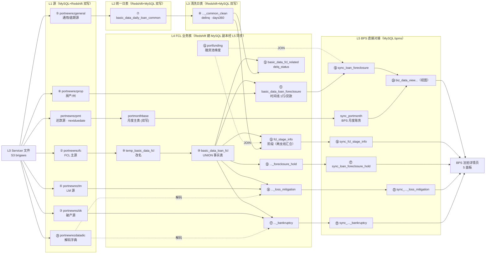

# doc 19 — 5 个样例贷款 · FCL 全链路全表全字段原始转储（Markdown 版）

> 本文件由 `scripts/build_fcl_sample_raw_dump_md.py` 自动生成，是 `docs/19_fcl_sample_loan_raw_dump.xlsx` 的 Markdown 对应版（内容一致）。

## 文档说明

- **文档目的**：把 5 个样例贷款在 FCL 全链路【所有表的全部字段】逐一列出（一节一张表），完整呈现 Newrez 源 → Redshift 中间层 → BPS 的「业务 ↔ 数据」对应关系。doc 16 仅含各面板用到的部分字段，本表是其原始数据底座。
- **数据来源**：全部 **prod**（只读）——`mysql_prod`（bpms + newrez 源）+ `redshift_prod`（port 中间层）；由 `scripts/fetch_fcl_sample_raw_dump_data.py` 预取到 `outputs/fcl_sample_raw_dump_data.json`。
- **目标读者**：数据工程师 · 业务分析师 · 验证人员 · 接入工程师 · 未来 AI 会话
- **取数口径**：全部 **prod**（`mysql_prod`/`redshift_prod`）。Newrez 源 / Redshift 快照表 `dataasof=MAX`(每贷款)；stage/视图 `fctrdt=MAX`；sync 基础表当前态；多行表(hold/lm/bk)取全历史。日期统一 `YYYY-MM-DD`；空值显示 `—`。**数据日期：样例捕获时各贷款 `dataasof≈2026-06-04`（每贷款 MAX）；业务日对齐目标 `2026-06-01`**（二者区别：前者为实际快照日、后者为口径对齐目标）。
- **如何读血缘**：每张表标题下新增「业务含义与全链路血缘」块——文字链(箭头)呈现 源文件→…→本表→…→BPS 的多级链路(每跳标 PrefectFlow 转换配置 file:line)，并列全部上游/下游表；血缘汇编自 outputs/fcl_pipeline.html + doc 21/20/02。
- **排版**：1 行/贷款的表 → 转置（字段为行 × 5 贷款列）；多行/贷款的表 → 平铺（记录为行 × 全字段列）。
- **字段业务含义**：每张表给每个字段标注「业务含义」——转置表为 `字段` 右侧的内联列；平铺表（Hold/LM/BK）在数据网格上方提供「字段说明」legend（字段 ↔ 业务含义）。含义复用 `docs/foreclosure_data_dictionary.md`（DB 实测来源），少数未收录字段补写。㉔ datadic 解码表额外给每个编码加「业务含义」（编码 → 解码 → 业务含义）。

### 修订历史

| 日期 | 作者 | 版本 | 变更 | 关联 |
|---|---|---|---|---|
| 2026-06-10 | AI Agent (Claude Opus 4.7 1M) | v10 | 修正 L1→L5 全局图：补 portmonth 链（`portnewrezpmt → portmonthbase → sync_portmonth`），并改正视图 ⑳ 上游——**MCP 实证 `information_schema.views.view_definition`：视图实际只 LEFT JOIN `sync_loan_foreclosure` + `sync_portmonth` 两张**（v9 及之前 mermaid 标的「5 张 sync_* → 视图」是错的，其余 4 张 sync_* 直接喂各自 BPS 面板，与视图是兄弟关系）。L5 清单下加 ⚠️ 注释说明真实上游与公式；HTML/JSON 同步（actual_*=TO_DAYS 减法、var_*=累计减 Σ）。 | fcl_pipeline.html, fcl_lineage_source.json |
| 2026-06-10 | AI Agent (Claude Opus 4.8) | v9 | 每表说明块 + ⓪ 总览**显式拆出 4 项业务框架**：**业务说明 / 业务目的**分列、新增 **在 pipeline 中的作用**（fcl_table_meta.json 新增 pipeline_role 字段）、原「为什么这样处理」改标签为 **为什么会有这张表**；MD 块 + Excel 各表块 + ⓪ 总览同步 | fcl_table_meta.json |
| 2026-06-08 | AI Agent (Claude Opus 4.8) | v8 | 每表「业务含义与全链路血缘」说明块**重排**：首行新增 **所处层级**（L1–L5，取自 fcl_table_meta.json），紧接 **上游链路/全部上游表** → **下游链路/全部下游表**，再业务含义/何时来查/为什么/数据粒度；MD 块 + Excel 各表块 + ⓪ 总览同步 | fcl_table_meta.json |
| 2026-06-08 | AI Agent (Claude Opus 4.8) | v7 | 每张表新增**「业务含义」列**逐字段描述（转置表=`字段` 右侧内联列；平铺表 Hold/LM/BK=数据网格上方「字段说明」legend 块）；**㉔ datadic 解码表新增「业务含义」列**（编码→解码→业务含义），并同步至数据字典表26；字段含义复用 `docs/foreclosure_data_dictionary.md`（DB 实测来源），缺口字段补写；MD+Excel 同步、幂等脚本注入 | 数据字典 表26 · 表18/19/20 |
| 2026-06-07 | AI Agent (Claude Opus 4.8) | v6 | 全表按 **L1→L5 层序重排** + 圆圈号 ②–㉔ 顺序化（MD 小节/索引、Excel 各表 sheet 与 ⓪ 总览同步）；新增 **全局 L1→L5 Pipeline 图**（MD Mermaid 流程图 + Excel ⓪b 全局Pipeline图 sheet）；与 doc 02 五层模型核对一致 | doc 02 · 20 · 21 · fcl_pipeline.html |
| 2026-06-07 | AI Agent (Claude Opus 4.8) | v5 | 每张表新增「业务含义与全链路血缘」块（业务含义/目的·何时来查·为何这样处理·数据粒度 + 文字链全链路血缘：上游/下游、每跳标 PrefectFlow file:line）；并生成 Excel ⓪ 总览 sheet 与各表 sheet 顶部说明块；血缘汇编自 outputs/fcl_pipeline.html + doc 21/20/02 | doc 21 · 20 · 02 · fcl_pipeline.html |
| 2026-06-06 | AI Agent (Claude Opus 4.8) | v4 | 补齐 doc 21 §0.1 图缺的 **逾期支线 L2/L3 + 改名临时表** 共 3 张中间表（`tempfc.temp_basic_data_fcl` / `port.basic_data_daily_loan_common`(asofdate) / `_clean`(fctrdt)）；全链路表 20→23 | doc 21 §0.1 |
| 2026-06-04 | AI Agent (Claude Opus 4.8) | v3 | 每个表新增「查询 SQL」块（prod 只读、含 5 loanid，可复制复现）；新增 ㉑ `portnewrezdatadic` 解码字典节（仅列 5 样例贷款用到的码；完整见数据字典 表26） | doc 19 xlsx · 数据字典 表26 |
| 2026-06-04 | AI Agent (Claude Opus 4.8) | v2 | 改用 **prod** 重取（替换原 dev 数据）并**新增 Redshift 中间层 8 表**（Newrez源→Redshift中间→BPS 全血缘，20 表）；数据经 mysql_prod + redshift_prod 只读预取 | doc 16 · doc 19 xlsx |
| 2026-06-03 | AI Agent | v1 | 初稿：12 节（dev 数据），与 doc 19 xlsx 一一对应 | doc 16 |

> 📌 **数据日期(as-of)如何处理、为何 BPS `sync_*` 主表无 as-of、只有 `update_time`** → 见 [doc 02 §8.1](02_etl_pipeline.md)（code + MCP 实证；真实数据示例 loan 7727000088：源 `dataasof=2026-06-04` 存储 368 天 → 主表 `+datediff=370` 天，无 as-of 列）。

<!-- PIPE:DIAGRAM START -->
## 全局 L1→L5 Pipeline 图（总览）

> 从 L0 Servicer 文件到 BPS 法拍详情页的端到端数据流；圆圈号与下方各表小节一致（②–㉔，按 L1→L5 层序）。
> 两条支线：**FCL 业务族支线**（②→⑨→⑩→{⑪/⑬/⑮/⑯/⑰}）与**逾期支线**（⑤→⑦→⑧ 的 delinq/days360），二者在 **⑬ fcl_stage_info.group** 汇合。汇编自 outputs/fcl_pipeline.html + doc 21/20/02。


<!-- PIPE:DIAGRAM END -->

## 一、表清单 / 索引（按 L1→L5 层序）

### 一、L1 源数据表（mysql_prod.newrez）

| Sheet / 表 | 用途 | 列数/字段 | 本dump行/命中 |
|---|---|---|---|
| ② newrez.portnewrezfc | FCL 主源表（时间线/状态/Hold槽/金额/律师） | 63 | 5/5 贷款 |
| ③ newrez.portnewrezbk | 破产源表 | 60 | 5/5 贷款 |
| ④ newrez.portnewrezlm | 损失缓解(LM)源表 | 56 | 5/5 贷款 |
| ⑤ newrez.portnewrezgeneral | 通用源表（legalstatus / delinquency_status_mba 等） | 125 | 5/5 贷款 |
| ⑥ newrez.portnewrezprop | 房产源表（propertystate 等） | 32 | 5/5 贷款 |

### 二、L2 逾期支线·统一日表（redshift_prod.port）

| Sheet / 表 | 用途 | 列数/字段 | 本dump行/命中 |
|---|---|---|---|
| ⑦ port.basic_data_daily_loan_common | 逾期支线 L2 统一日表（delq_status；每贷款最新 asofdate） | 78 | 5/5 贷款 |

### 三、L3 逾期支线·清洗日表（redshift_prod.port）

| Sheet / 表 | 用途 | 列数/字段 | 本dump行/命中 |
|---|---|---|---|
| ⑧ port.basic_data_daily_loan_common_clean | 逾期支线 L3 清洗日表（delinq / days360；每贷款最新 fctrdt） | 103 | 5/5 贷款 |

### 四、L4 FCL 业务族 / 中间产物（redshift_prod.port · tempfc）

| Sheet / 表 | 用途 | 列数/字段 | 本dump行/命中 |
|---|---|---|---|
| ⑨ tempfc.temp_basic_data_fcl | Redshift 改名临时表（portnewrezfc 等原始列→统一列；运行时中间产物，basic_data_loan_fcl 的上游） | 37 | 5/5 贷款 |
| ⑩ port.basic_data_loan_fcl | Redshift FCL 快照中间表（portnewrezfc 全量进此；每贷款取最新 dataasof） | 61 | 5/5 贷款 |
| ⑪ port.basic_data_loan_foreclosure | Redshift FCL 聚合表（1 行/贷款，sync_loan_foreclosure 的直接上游） | 62 | 5/5 贷款 |
| ⑫ port.basic_data_fcl_related | FCL 关联/过滤中间表（delq_status 等；每贷款最新 dataasof） | 14 | 5/5 贷款 |
| ⑬ port.fcl_stage_info | Redshift 阶段表（sync_fcl_stage_info 上游；每贷款最新 fctrdt） | 48 | 5/5 贷款 |
| ⑭ port.portfunding | 融资池表（入库 JOIN 过滤；1 行/贷款） | 57 | 5/5 贷款 |
| ⑮ port.basic_data_loan_foreclosure_hold | Redshift Hold 历史（sync_loan_foreclosure_hold 上游） | 17 | 21 行 |
| ⑯ port.basic_data_loan_foreclosure_loss_mitigation | Redshift LM 历史（上游） | 16 | 21 行 |
| ⑰ port.basic_data_loan_foreclosure_bankruptcy | Redshift 破产历史（上游） | 15 | 3 行 |

### 五、L5 BPS 直接对接表（mysql_prod.bpms）

| Sheet / 表 | 用途 | 列数/字段 | 本dump行/命中 |
|---|---|---|---|
| ⑱ bpms.sync_loan_foreclosure | Summary/Timeline/target 主表 | 72 | 4/5 贷款 |
| ⑲ bpms.sync_fcl_stage_info | 聚合 Stage/Timeline 表 | 57 | 5/5 贷款 |
| ⑳ bpms.biz_data_view_loan_details_foreclosure（视图） | 详情页视图（actual/var 天数；每贷款最新 fctrdt） | 104 | 5/5 贷款 |
| ㉑ bpms.sync_loan_foreclosure_hold | Hold 全历史（每次变更一行） | 15 | 21 行 |
| ㉒ bpms.sync_loan_foreclosure_loss_mitigation | LM 周期历史 | 22 | 21 行 |
| ㉓ bpms.sync_loan_foreclosure_bankruptcy | 破产记录 | 22 | 3 行 |

> **⚠️ 关于视图 ⑳ 的真实上游（MCP 实证 2026-06-10 `information_schema.views.view_definition`）**：
>
> 视图 `bpms.biz_data_view_loan_details_foreclosure` 真实 FROM 只接 **2 张**表，**不是**前几版 mermaid 标的 5 张 sync_*：
>
> 1. `bpms.sync_portmonth monthly` （主表，提供 `nextduedate` 应付到期日锚点）；
> 2. `bpms.sync_loan_foreclosure loan_fcl` （LEFT JOIN on loanid+tenant_id，提供 timeline_*/target_*）。
>
> 视图按 `actual_X_days = TO_DAYS(loan_fcl.timeline_X_date) − TO_DAYS(monthly.nextduedate)` 即时计算；`var_X_days = actual_X − Σ(target_i, i ≤ X)` 累计减。
>
> 其余 4 张 sync_* 表（**㉑ Hold、㉒ LM、㉓ BK、⑲ Stage**）**不喂视图**——它们各自被 BPS 详情页对应面板（Hold/LM/BK/Stage 面板）直接读取，跟视图是兄弟关系，不是上下游。
>
> 视图额外依赖的两张表（**不在本 dump 的 sheet 列表**）：
> - **`bpms.sync_portmonth`**（L5 BPS 月度账务快照表）—— 由 1-PORTMONTH sync 写入；上游 `redshift_prod.port.portmonthbase`（L4 月度主表，双写：`gen_portmonth_v4.py:45-46`(Redshift) + `gen_portmonth_mysql.py:42-43`(MySQL)）。
> - **`mysql_prod.newrez.portnewrezpmt`**（L1 Newrez 还款源）—— `nextduedate` 的最原始 Newrez 源。
>
> 完整 nextduedate 链：`newrez.portnewrezpmt.nextduedate` → `port.portmonthbase.nextduedate` → `bpms.sync_portmonth.nextduedate` → 视图 TO_DAYS 减法 → `actual_*_days`。

### 六、解码字典（mysql_prod.newrez）

| Sheet / 表 | 用途 | 列数/字段 | 本dump行/命中 |
|---|---|---|---|
| ㉔ newrez.portnewrezdatadic | FCL 解码字典（仅列 5 样例用到的码；完整见数据字典 表26） | 8 | 55 码 |

### 不纳入本转储的表

| 表 | 原因 |
|---|---|
| port.basic_data_fcl_stage | 较旧的阶段中间表（实测仅到 2025-09，已被 port.fcl_stage_info 取代） |

### 样例贷款（5）

| # | loanid —— 选取理由 |
|---|---|
| Loan 1 | 7727000088 —— Judicial(FL)·JUDGEMENT·Hold×7·LM×9 |
| Loan 2 | 7727000672 —— Non-Judicial(MI)·REFERRAL |
| Loan 3 | 7727004200 —— Judicial(IL)·SALE |
| Loan 4 | 7727000065 —— BK + Hold×4 + 完结REO |
| Loan 5 | 7727000010 —— Chapter 13 Active BK（未入 FCL 管道） |

---

## ② newrez.portnewrezfc

> FCL 主源表（时间线/状态/Hold槽/金额/律师）。全 **63** 字段 · 取数口径：dataasof=MAX(每贷款) · 命中 5/5 贷款（无行的贷款列显示 `—`）。

<!-- META:newrez.portnewrezfc START -->
> **📋 业务含义与全链路血缘**
>
> - **所处层级**：L1 源（Newrez FCL 主源）
> - **业务说明**：Newrez 每日推送的法拍(FCL)主源表——一笔贷款一行最新快照，含 FCL 时间线里程碑(setup/referral/firstlegal/judgment/sale)、当前阶段 fcstage、4 个 Hold 槽(fchold1..4)、拍卖金额、律师等。
> - **业务目的**：Newrez 法拍全流程的原始事实底座；下游所有 FCL 计算的源头。
> - **在 pipeline 中的作用**：源保真底座（L1）：Newrez 一家一张原始 FCL 落库，作为下游所有 FCL 改名/UNION/计算的共同起点。
> - **为什么会有这张表**：各 Servicer 文件格式不同，先按‘一家一张原始表’落地保真，再到 L4 统一改名/UNION，便于回溯与对账。
> - **何时来查这张表**：想看某贷款 Newrez 原始报的 FCL 里程碑/阶段/Hold 原值，或核对下游计算是否忠实于源时。
> - **上游链路**：Servicer 文件(S3, L0) → newrez.portnewrezfc  〔load_daily_newrez_flow.py；落库 daily_task.py:923-942(MySQL)/960-983(Redshift)〕
> - **全部上游表**：Servicer 文件(S3, L0)
> - **下游链路**：portnewrezfc → tempfc.temp_basic_data_fcl(改名) → port.basic_data_loan_fcl(全 servicer UNION，FCL 事实表) → { port.basic_data_loan_foreclosure〔GEN_FCL_DETAIL basic_data_pool_config.py:253-305〕 / port.fcl_stage_info〔GEN_FCL_STAGE :1774-2440〕 / port.basic_data_loan_foreclosure_hold〔Hold 拆槽 :466-768〕 } → bpms.sync_*〔asset_managment_config.py〕 → bpms.biz_data_view_loan_details_foreclosure(视图) → BPS 法拍面板
> - **全部下游表**：tempfc.temp_basic_data_fcl、port.basic_data_loan_fcl、port.basic_data_loan_foreclosure、port.fcl_stage_info、port.basic_data_loan_foreclosure_hold、bpms.sync_loan_foreclosure、bpms.sync_fcl_stage_info、bpms.sync_loan_foreclosure_hold、bpms.biz_data_view_loan_details_foreclosure
> - **数据粒度**：1 行/贷款/dataasof（每日快照）；本 dump 取 dataasof=MAX。
<!-- META:newrez.portnewrezfc END -->

查询 SQL（prod 只读）：
```sql
-- newrez.portnewrezfc · mysql_prod(只读) · 每贷款 dataasof=MAX(最新快照) · 业务日 2026-06-01
SELECT t.* FROM newrez.portnewrezfc t JOIN (SELECT loanid, MAX(dataasof) AS _md FROM newrez.portnewrezfc WHERE loanid IN ('7727000088','7727000672','7727004200','7727000065','7727000010') GROUP BY loanid) m ON t.loanid=m.loanid AND t.dataasof=m._md;
```

| 字段 | 业务含义 | 7727000088 | 7727000672 | 7727004200 | 7727000065 | 7727000010 |
|---|---|---|---|---|---|---|
| id | MySQL 自增主键 | 1750674 | 1750233 | 1751818 | 1750695 | 1750688 |
| loanid | Bridger/投资人贷款 ID | 7727000088 | 7727000672 | 7727004200 | 7727000065 | 7727000010 |
| dataasof | 数据快照日期 | 2026-06-04 | 2026-06-04 | 2026-06-04 | 2026-06-04 | 2026-06-04 |
| shellpointloanid | Newrez/Shellpoint 服务商贷款号 | 1031718838 | 1032761570 | 0688132141 | 1031718621 | 1031718692 |
| fcsetupdate | FCL 立案/设置日期 | 2025-05-23 | 2026-03-09 | 2025-06-27 | 2025-02-03 | — |
| fcreferraldate | FCL Referral / 转交律师日期 | 2025-05-23 | 2026-03-09 | 2025-06-27 | 2025-02-03 | — |
| smsdaysinfc | Servicer/SMS 口径 FCL 已历天数 | 368 | 79 | 294 | 254 | — |
| daysinfc | Newrez 自报 FCL 已历天数 | 368 | 79 | 294 | 254 | — |
| demandsentdate | Demand / NOI 发出日 | 2025-02-18 | 2025-11-17 | 2025-05-20 | 2024-08-12 | 2026-04-10 |
| demandexpirationdate | Demand / NOI 到期日 | 2025-03-25 | 2025-12-22 | 2025-06-24 | 2024-09-18 | 2026-05-15 |
| fcstage | 当前 FCL 阶段描述 | Post Sale Review (SCRA and PACER Check) | Pre-Sale Review 1 (SCRA and PACER Check) | Pre-Sale Review 1 (SCRA and PACER Check) | Post Sale Review (SCRA and PACER Check) | — |
| lastfcstepcompleted | 最近完成的 FCL 步骤 | Post Sale Review (SCRA and PACER Check) | First Publication | Sale Scheduled For | Post Sale Review (SCRA and PACER Check) | — |
| lastfcstepcompleteddate | 最近完成步骤日期 | 2026-05-26 | 2026-03-25 | 2026-05-19 | 2025-10-15 | — |
| fchold1description | Hold 1 原因描述 | Court Delay | Delinquency Review | Delinquency Review | Court Delay | — |
| fchold1startdate | Hold 1 开始日期 | 2026-04-09 | 2026-05-12 | 2026-04-17 | 2025-08-26 | — |
| fchold1enddate | Hold 1 结束日期 | 2026-04-26 | 2026-05-27 | 2026-04-17 | 2025-08-28 | — |
| fchold2description | Hold 2 原因描述 | Hearing Set | Loss Mitigation Workout | Hearing Set | Court Delay | — |
| fchold2startdate | Hold 2 开始日期 | 2026-03-16 | 2026-03-25 | 2026-01-29 | 2025-07-02 | — |
| fchold2enddate | Hold 2 结束日期 | 2026-04-07 | 2026-05-27 | 2026-02-13 | 2025-07-14 | — |
| fcjudgmenthearingscheduled | 判决听证会/出售确认听证会的**排定日期**（未来计划事件；每次改期后此值更新为最新排期日） | 2026-03-27 | — | 2026-04-13 | 2025-10-15 | — |
| fcjudgmententered | 法院**正式录入**判决的日期（已完成的法律事实；与 `fcjudgmenthearingscheduled` 含义不同：前者是排定日/计划事件，后者是录入日/已发生事实） | 2026-04-08 | — | 2026-02-13 | 2025-08-25 | — |
| fcscheduledsaledate | 计划拍卖日期 | — | — | 2026-05-19 | — | — |
| fcsalehelddate | 实际拍卖日期 | 2026-05-22 | — | — | 2025-10-14 | — |
| fcsaleamount | 实际拍卖成交金额 | 200100 | — | — | 357200 | — |
| fcresults | FCL 结果 | REO | — | — | REO | — |
| firstlegaldate | First Legal 日期 | 2025-06-13 | 2026-03-25 | 2025-07-21 | 2025-03-27 | — |
| servicecompletedate | Service complete 日期 | 2025-07-18 | — | 2025-12-24 | 2025-05-03 | — |
| titleordereddate | Title report ordered 日期 | — | — | — | 2025-11-13 | — |
| titlecleardate | Title clear 日期 | — | — | — | — | — |
| titlereceiveddate | Title report received 日期 | — | — | — | 2025-12-02 | — |
| fcremovaldesc | FCL 移除/关闭原因描述 | Process Complete | Loss Mitigation | Paid in Full | Process Complete | — |
| fcremovaldate | FCL 移除/关闭日期 | 2026-05-26 | 2026-05-27 | 2026-04-17 | 2025-10-15 | — |
| fccontestedflag | 是否 contested litigation | 0 | 0 | 0 | 0 | 0 |
| judicial | 是否 Judicial Foreclosure | 1 | 0 | 1 | 1 | — |
| fcfirm | FCL 律师事务所 | Kelley Kronenberg, P.A. | Orlans Law Group PLLC | Johnson, Blumberg & Associates, LLC | RAS (Primary) | — |
| jr_sr_lien_flag | Junior/Senior lien 标志 | 1 | 1 | 1 | 1 | — |
| fcbidamount | FCL bid amount | 301500 | — | — | 390832.5 | — |
| activefcflag | FCL 活跃标志 | 0 | 0 | 0 | 0 | 0 |
| fchold1projectedenddate | Hold 1 预计结束日期 | 2026-04-29 | 2026-07-11 | 2026-06-16 | 2025-09-15 | — |
| fchold1comment | Hold 1 备注 | Delay Reason: Pending Ruling on Judgment, Hold Start Date: 2026-04-09, Date of Delay: 2026-04-06, Anticipated Resolution ETA: 2026-04-29, Additional Detail On Delay: We are pending judge's execution of the  proposed Order | Delinquency Review | Delinquency Review | Delay Reason: Pending Judges Decision/Ruling, Hold Start Date: 2025-08-26, Date of Delay: 2025-08-13, Anticipated Resolution ETA: 2025-09-15, Additional Detail On Delay: The Final Judgment was granted at NJT held 8/25/2025. At this time firm is pending the executed final Judgment with sale date scheduled to be docketed with the court a requirement to complete the Judgment entered. | — |
| fchold2projectedenddate | Hold 2 预计结束日期 | 2026-04-06 | 2026-06-01 | 2026-02-13 | 2025-07-22 | — |
| fchold2comment | Hold 2 备注 | Hearing scheduled for 04/06/2026, Additional Detail: Plaintiff's Motion for Summary Judgment scheduled for 4.6.26. Please end court delay hold. Thanks | BRP Complete:  Complete Ack Sent:  RPP Approved: 03/24/2026 RPP Payments Due: 6 Last RPP Payment Made: 05/12/2026 Next Payment Due: 06/01/2026 | RID: 861849328; Judgment hearing scheduled for 2/13/26 | Delay Reason: Pending Judges Decision/Ruling, Hold Start Date: 2025-07-02, Date of Delay: 2025-07-01, Anticipated Resolution ETA: 2025-07-22, Additional Detail On Delay: Pending court's ruling on the Plaintiff's motion for clerk's default. | — |
| holdmodified | Hold 1 修改日期 | 2026-04-27 | 2026-05-27 | 2026-04-17 | 2025-08-29 | — |
| holdmodified2 | Hold 2 修改日期 | 2026-04-07 | 2026-05-27 | 2026-02-13 | 2025-07-15 | — |
| create_time | 记录创建时间 | 2026-06-05 19:37:56 | 2026-06-05 19:37:56 | 2026-06-05 19:37:56 | 2026-06-05 19:37:56 | 2026-06-05 19:37:56 |
| update_time | 记录更新时间 | 2026-06-05 19:37:56 | 2026-06-05 19:37:56 | 2026-06-05 19:37:56 | 2026-06-05 19:37:56 | 2026-06-05 19:37:56 |
| dtdeedrecorded | Deed recorded 日期 | — | — | — | 2025-10-28 | — |
| fcapprbidprice | 批准 bid price | 301500 | — | — | 390832.5 | — |
| fcl3rdpartyproceedsreceiveddate | 第三方购买款到账日期 | — | — | — | — | — |
| investorloanid | 投资人贷款号 | 7727000088 | 7727000672 | 7727004200 | 7727000065 | 7727000010 |
| fchold3description | Hold 3 原因描述 | Court Delay | — | Service Delay | Bankruptcy Filed | — |
| fchold3startdate | Hold 3 开始日期 | 2026-01-16 | — | 2025-12-30 | 2025-05-06 | — |
| fchold3enddate | Hold 3 结束日期 | 2026-03-16 | — | 2026-01-23 | 2025-06-27 | — |
| fchold3projectedenddate | Hold 3 预计结束日期 | 2026-03-17 | — | 2026-01-23 | 2025-07-07 | — |
| fchold3comment | Hold 3 备注 | Delay Reason: Pending Hearing Date for Judgment, Hold Start Date: 2026-01-16, Date of Delay: 2026-01-19, Anticipated Resolution ETA: 2026-03-17, Additional Detail On Delay: We have reached out to the JA for dates in April and is pending a response. The JA had advised there were only limited dates. Pending response to proceed., Actions Taken by the Firm: Called the court, Most Recent Follow-Up Date: 02/20/2026, Additional Info:  We have reached out to the JA for dates in April and is pending a response. The JA had advised there were only limited dates. Pending response to proceed. | — | Due to title identifying the incorrect HOA, the new correct HOA had to be served.  The HOA was served 12/24/25 and the time period for the correct HOA to file their Answer does not expire until 1-23-2026.  See Step 9.  We cannot proceed to judgment until after 1-23-2026. | CaseNumber: 2500228 Chapter: 7 Filed Date: 04/30/2025 POC Bar Date:  Post-Petition Due Date:  MFR Referral Date: 05/15/2025 MFR Filed Date: 06/10/2025 MFR Granted Date:  Dismissal Date: | — |
| holdmodified3 | Hold 3 修改日期 | 2026-03-17 | — | 2026-01-23 | 2025-06-27 | — |
| activejnrlienfcflag | 活跃 junior lien FCL 标志 | 0 | 0 | 0 | 0 | 0 |
| currentmilestone | 当前 FCL milestone | Sold | Closed | Closed | Sold | — |
| srlienmonitorflag | Senior lien monitoring 标志 | — | — | — | — | — |
| srliensalescheduleddate | Senior lien sale scheduled date | — | — | — | — | — |
| srliensalehelddate | Senior lien sale held date | — | — | — | — | — |
| srliensaleresult | Senior lien sale result | — | — | — | — | — |
| srliensaledate | Senior lien sale date | — | — | — | — | — |

---

## ③ newrez.portnewrezbk

> 破产源表。全 **60** 字段 · 取数口径：dataasof=MAX(每贷款) · 命中 5/5 贷款（无行的贷款列显示 `—`）。

<!-- META:newrez.portnewrezbk START -->
> **📋 业务含义与全链路血缘**
>
> - **所处层级**：L1 源（Newrez 破产源）
> - **业务说明**：Newrez 破产(BK)源表，按贷款×破产申请记录，含 bkstatus/bkchapter/bkfileddate 等编码字段。
> - **业务目的**：BK 事实底座；为 FCL 提供‘是否在破产保护(暂停法拍)’的判断。
> - **在 pipeline 中的作用**：破产支线起点（L1）：BK 原始落库，为 FCL 提供「是否在破产保护、需暂停法拍」的判断起点。
> - **为什么会有这张表**：破产是法拍的暂停因素，需单列保真；编码值经 datadic 解码成业务文案。
> - **何时来查这张表**：查某贷款原始破产章节/状态/申请日，或核对 BPS 破产面板。
> - **上游链路**：Servicer 文件(S3, L0) → newrez.portnewrezbk
> - **全部上游表**：Servicer 文件(S3, L0)
> - **下游链路**：portnewrezbk → port.basic_data_loan_foreclosure_bankruptcy〔解码 bkstatus，basic_data_pool_config.py:331-370，JOIN newrez.portnewrezdatadic〕 → bpms.sync_loan_foreclosure_bankruptcy〔asset_managment_config.py:822-843〕 → bpms.biz_data_view_loan_details_foreclosure(视图) → BPS 破产面板
> - **全部下游表**：port.basic_data_loan_foreclosure_bankruptcy、bpms.sync_loan_foreclosure_bankruptcy、bpms.biz_data_view_loan_details_foreclosure
> - **数据粒度**：1 行/贷款/破产申请(bkfileddate)；多次申请多行。
<!-- META:newrez.portnewrezbk END -->

查询 SQL（prod 只读）：
```sql
-- newrez.portnewrezbk · mysql_prod(只读) · 每贷款 dataasof=MAX(最新快照) · 业务日 2026-06-01
SELECT t.* FROM newrez.portnewrezbk t JOIN (SELECT loanid, MAX(dataasof) AS _md FROM newrez.portnewrezbk WHERE loanid IN ('7727000088','7727000672','7727004200','7727000065','7727000010') GROUP BY loanid) m ON t.loanid=m.loanid AND t.dataasof=m._md;
```

| 字段 | 业务含义 | 7727000088 | 7727000672 | 7727004200 | 7727000065 | 7727000010 |
|---|---|---|---|---|---|---|
| id | MySQL 自增主键 | 1750674 | 1750233 | 1751818 | 1750695 | 1750688 |
| loanid | Bridger/投资人贷款 ID | 7727000088 | 7727000672 | 7727004200 | 7727000065 | 7727000010 |
| dataasof | 数据快照日期 | 2026-06-04 | 2026-06-04 | 2026-06-04 | 2026-06-04 | 2026-06-04 |
| shellpointloanid | Newrez/Shellpoint 服务商贷款号 | 1031718838 | 1032761570 | 0688132141 | 1031718621 | 1031718692 |
| bkfileddate | 破产申请日 | — | — | — | 2025-04-30 | 2024-02-06 |
| bkstatus | 破产状态编码（Newrez 内部数值码） | — | — | — | 2 | 1 |
| bkremovalcode | 破产终止原因编码（1=Dismissed/2=Discharged 等） | — | — | — | 1 | — |
| bkremovaldate | 破产程序终止日 | — | — | — | 2025-07-29 | — |
| bkchapter | 破产章节（7=清算/11=重组/13=个人还款） | — | — | — | 7 | 13 |
| bkcasenumber | 破产案件编号 | — | — | — | 2500228 | 2310152 |
| bkpostpetitionduedate | 破产申请后贷款应付日 | — | — | — | — | 2026-06-01 |
| prepetitionduedate | 破产申请前贷款应付日 | 2025-01-01 | 2026-02-01 | 2024-12-01 | 2024-03-01 | 2026-04-01 |
| pocfileddate | 债权申报（POC）提交日 | — | — | — | — | 2023-09-30 |
| dischargeddate | 债务免责（Discharge）日 | — | — | — | 2025-07-29 | — |
| dismisseddate | 破产驳回（Dismiss）日 | — | — | — | — | — |
| mfrfileddate | 解除自动中止动议（MFR）提交日 | — | — | — | 2025-06-10 | — |
| mfrhearingdate | MFR 听证日 | — | — | — | 2025-06-24 | — |
| mfrgranteddate | MFR 批准日（批准后可推进 FCL） | — | — | — | 2025-06-25 | — |
| trusteeassetflag | 受托人资产标志（1=有可分配资产） | — | — | — | 0 | 0 |
| trusteeassetdate | 受托人资产认定日 | — | — | — | 2025-06-01 | — |
| planconfirmationdate | 还款计划确认日（Ch13 Plan Confirmed） | — | — | — | — | 2024-07-11 |
| bkstage | 破产阶段编码（Newrez 内部数值码） | — | — | — | 8 | 4 |
| bkfirm | 破产律师事务所名称 | — | — | — | — | Aldridge Pite, LLP |
| reaffirmationdate | 重申债务确认（Reaffirmation）日 | — | — | — | — | — |
| trusteeabandonmentdate | 受托人放弃资产日 | — | — | — | — | — |
| pocreferreddate | POC 转介日 | — | — | — | — | — |
| pocbardate | POC 申报截止日（Bar Date） | — | — | — | — | 2024-04-16 |
| mfrreferred | MFR 转介日 | — | — | — | 2025-05-15 | 2025-11-10 |
| mfrhearingresults | MFR 听证结果编码 | — | — | — | 3 | 0 |
| cramdowndatereferred | Cramdown 转介日 | — | — | — | — | — |
| cramdownobjectionfileddate | Cramdown 异议提交日 | — | — | — | — | — |
| cramdownresultdate | Cramdown 结果日 | — | — | — | — | — |
| cramdownhearingresults | Cramdown 听证结果编码 | — | — | — | 0 | 0 |
| adversarialactionfileddate | 对抗性诉讼（Adversary）提交日 | — | — | — | — | — |
| adversarialhearingdate | 对抗性诉讼听证日 | — | — | — | — | — |
| adversarialresultdate | 对抗性诉讼结果日 | — | — | — | — | — |
| adversarialresults | 对抗性诉讼结果编码 | — | — | — | 0 | 0 |
| cramdownflag | Cramdown 标志（1=存在 cramdown） | — | — | — | 0 | 0 |
| bankruptcypaymenttype | 破产还款类型编码 | — | — | — | — | 1 |
| debtorintention | 债务人意向编码（保留/放弃房产） | — | — | — | — | 1 |
| jointfilerflag | 是否共同申请人（1=joint） | — | — | — | — | 0 |
| activebkflag | 是否在破产保护中（1=是/0=否） | 0 | 0 | 0 | 0 | 1 |
| apocfileddate | 修订债权申报（APOC）提交日 | — | — | — | — | — |
| apocreferraldate | APOC 转介日 | — | — | — | — | — |
| reasonforapoc | APOC 原因（文本） | — | — | — | — | — |
| attorney | 受理律师/律所名称 | — | — | — | — | — |
| create_time | 记录创建时间 | 2026-06-05 19:37:17 | 2026-06-05 19:37:17 | 2026-06-05 19:37:17 | 2026-06-05 19:37:17 | 2026-06-05 19:37:17 |
| update_time | 记录更新时间 | 2026-06-05 19:37:17 | 2026-06-05 19:37:17 | 2026-06-05 19:37:17 | 2026-06-05 19:37:17 | 2026-06-05 19:37:17 |
| bkrepayplanpaymentcount | 破产还款计划期数 | — | — | — | — | 60 |
| bksourceoffundscode | 资金来源编码 | — | — | — | — | — |
| bkpoccourtreceiveddate | POC 法院收到日 | — | — | — | — | — |
| bkrcurrentstatusdate | 当前破产状态生效日期 | — | — | — | — | 2026-05-26 |
| bkborrowerintent | 借款人破产意向编码 | — | — | — | — | 1 |
| bkpostpetitionpaymentcurrent | 破产后应付款当前额 | — | — | — | — | 2192 |
| bkcramdownpercent | Cramdown 比例（本金削减%） | — | — | — | — | — |
| bkpostsuspensebalance | 破产后暂记款（suspense）余额 | — | — | — | — | — |
| bkpresuspensebalance | 破产前暂记款余额 | — | — | — | — | — |
| investorloanid | 投资人贷款号 | 7727000088 | 7727000672 | 7727004200 | 7727000065 | 7727000010 |
| bkfilingstate | 破产申请州 | — | — | — | WV | FL |
| bkfilingregion | 破产申请法院辖区（含 Division） | — | — | — | Northern District of WV (Martinsburg) | Northern District of Florida, Gainesville Division |

---

## ④ newrez.portnewrezlm

> 损失缓解(LM)源表。全 **56** 字段 · 取数口径：dataasof=MAX(每贷款) · 命中 5/5 贷款（无行的贷款列显示 `—`）。

<!-- META:newrez.portnewrezlm START -->
> **📋 业务含义与全链路血缘**
>
> - **所处层级**：L1 源（Newrez 损失缓解 LM 源）
> - **业务说明**：Newrez 损失缓解(LM)源表，按贷款×LM 周期(dealstartdate)，含 lmdeal/lmprogram/lmstatus/lmdecision 等编码。
> - **业务目的**：LM 事实底座；提供‘是否在协商还款方案(暂停/替代法拍)’。
> - **在 pipeline 中的作用**：LM 支线起点（L1）：损失缓解原始落库，为 FCL 提供「协商还款方案、暂停/替代法拍」的判断起点。
> - **为什么会有这张表**：LM 是法拍的替代/暂停路径，需单列保真；编码经 datadic 解码。
> - **何时来查这张表**：查某贷款 LM 周期/项目/决定原值，或核对 BPS LM 面板。
> - **上游链路**：Servicer 文件(S3, L0) → newrez.portnewrezlm
> - **全部上游表**：Servicer 文件(S3, L0)
> - **下游链路**：portnewrezlm → port.basic_data_loan_foreclosure_loss_mitigation〔basic_data_pool_config.py:799-843，JOIN newrez.portnewrezdatadic〕 → bpms.sync_loan_foreclosure_loss_mitigation〔asset_managment_config.py:799-819〕 → bpms.biz_data_view_loan_details_foreclosure(视图) → BPS LM 面板
> - **全部下游表**：port.basic_data_loan_foreclosure_loss_mitigation、bpms.sync_loan_foreclosure_loss_mitigation、bpms.biz_data_view_loan_details_foreclosure
> - **数据粒度**：1 行/贷款/LM 周期(dealstartdate)；多周期多行。
<!-- META:newrez.portnewrezlm END -->

查询 SQL（prod 只读）：
```sql
-- newrez.portnewrezlm · mysql_prod(只读) · 每贷款 dataasof=MAX(最新快照) · 业务日 2026-06-01
SELECT t.* FROM newrez.portnewrezlm t JOIN (SELECT loanid, MAX(dataasof) AS _md FROM newrez.portnewrezlm WHERE loanid IN ('7727000088','7727000672','7727004200','7727000065','7727000010') GROUP BY loanid) m ON t.loanid=m.loanid AND t.dataasof=m._md;
```

| 字段 | 业务含义 | 7727000088 | 7727000672 | 7727004200 | 7727000065 | 7727000010 |
|---|---|---|---|---|---|---|
| id | MySQL 自增主键 | 1747370 | 1746929 | 1748514 | 1747391 | 1747384 |
| loanid | Bridger/投资人贷款 ID | 7727000088 | 7727000672 | 7727004200 | 7727000065 | 7727000010 |
| dataasof | 数据快照日期 | 2026-06-04 | 2026-06-04 | 2026-06-04 | 2026-06-04 | 2026-06-04 |
| shellpointloanid | Newrez/Shellpoint 服务商贷款号 | 1031718838 | 1032761570 | 0688132141 | 1031718621 | 1031718692 |
| hardshiptype | Hardship 类型编码 | 11 | 11 | 20 | 11 | 12 |
| borrowerintention | Borrower intention 编码 | — | — | — | — | — |
| lmdeal | LM Deal 大类编码 | 7 | 4 | 1 | 2 | 1 |
| dealstartdate | 本轮 LM cycle 打开日期 | 2026-02-17 | 2026-02-25 | 2026-01-06 | 2025-07-01 | 2026-04-16 |
| daysindeal | 本轮 Deal 已持续天数 | 66 | 99 | 27 | 0 | 12 |
| lmstatus | LM 当前状态编码 | 112 | 25 | 5 | 166 | 112 |
| statusstartdate | 当前 LM status 开始日期 | 2026-04-22 | 2026-03-24 | 2026-01-14 | 2024-11-26 | 2026-04-23 |
| daysinstatus | 当前 LM status 已持续天数 | 2 | 72 | 19 | 217 | 5 |
| lmprogram | LM Program 编码 | 10 | 29 | 496 | 21 | 498 |
| lmdecision | LM 最终决策编码 | 6 | 99 | 10 | 11 | 6 |
| lmremovaldate | LM cycle 关闭/移除日期 | 2026-04-24 | — | 2026-02-02 | 2025-07-01 | 2026-04-28 |
| denialreason | LM 拒绝原因编码 | 40 | — | — | — | 124 |
| forbearanceagreementdate | Forbearance 协议日期 | — | — | 2025-02-01 | — | — |
| forbearancedatecompleted | Forbearance 完成日期 | — | — | 2025-05-01 | — | — |
| forbearancebeginningduedate | Forbearance 起始 due date | — | — | 2025-02-01 | — | — |
| forbearanceendingduedate | Forbearance 结束 due date | — | — | 2025-04-30 | — | — |
| forbearancenumberofmonths | Forbearance 月数 | — | — | 3 | — | — |
| forbearancestatus | Forbearance 状态编码 | — | — | 4 | — | — |
| forbearancetype | Forbearance 类型编码 | — | — | 61 | — | — |
| trialagreementdate | Trial Period 协议日期 | — | — | — | — | — |
| trialdatecompleted | Trial Period 完成日期 | — | — | — | — | — |
| trialbeginningduedate | Trial 起始 due date | — | — | — | — | — |
| trialendingduedate | Trial 结束 due date | — | — | — | — | — |
| trialnumberofmonths | Trial 期数 / 月数 | — | — | — | — | — |
| trialstatus | Trial 状态编码 | — | — | — | — | — |
| repaymentagreementdate | Repayment Plan 协议日期 | — | 2026-03-24 | — | — | — |
| repaymentstartdate | Repayment Plan 开始日期 | — | 2026-05-01 | — | — | — |
| repaymentenddate | Repayment Plan 结束日期 | — | 2026-10-31 | — | — | — |
| repaymenttype | Repayment 类型编码 | — | 4 | — | — | — |
| repaymentstatus | Repayment 状态编码 | — | 1 | — | — | — |
| repaymentplandownpmt | Repayment Plan down payment 金额 | — | 9000 | — | — | — |
| repaymentplandownpmtdate | Repayment Plan down payment 日期 | — | 2026-04-24 | — | — | — |
| pradate1 | PRA 日期 1 | — | — | — | — | — |
| praamount1 | PRA 金额 1 | — | — | — | — | — |
| pradate2 | PRA 日期 2 | — | — | — | — | — |
| praamount2 | PRA 金额 2 | — | — | — | — | — |
| pradate3 | PRA 日期 3 | — | — | — | — | — |
| praamount3 | PRA 金额 3 | — | — | — | — | — |
| activelmflag | LM 活跃标志 | 0 | 1 | 0 | 0 | 0 |
| create_time | 记录创建时间 | 2026-06-05 19:38:36 | 2026-06-05 19:38:36 | 2026-06-05 19:38:36 | 2026-06-05 19:38:36 | 2026-06-05 19:38:36 |
| update_time | 记录更新时间 | 2026-06-05 19:38:36 | 2026-06-05 19:38:36 | 2026-06-05 19:38:36 | 2026-06-05 19:38:36 | 2026-06-05 19:38:36 |
| lossmitmodtermsmodifiedtermextensionmonths | Loss Mitigation modification term extension months | — | — | — | — | — |
| deferment_flag | Deferment 标志 | — | — | — | — | — |
| deferment_amount | Deferment 金额 | — | — | — | — | — |
| number_pi_payments_deferred | 递延的 PI payment 数量 | — | — | — | — | — |
| shortsalenetproceedsamount | Short Sale net proceeds 金额 | — | — | — | — | — |
| shortsalecontractofferamount | Short Sale contract offer 金额 | — | — | — | — | — |
| appealperiodexpirationdate | Appeal period expiration date | — | — | — | — | 2026-05-11 |
| lossmitmodpreviouslydeferredcapitalizedamount | 贷款修改中以前递延并资本化的金额 | — | — | — | — | — |
| deferment_date | Deferment 日期 | — | — | — | — | — |
| denialletterdate | Denial letter 日期 | 2026-04-23 | 2025-08-12 | — | — | 2026-04-27 |
| investorloanid | 投资人贷款号 | 7727000088 | 7727000672 | 7727004200 | 7727000065 | 7727000010 |

---

## ⑤ newrez.portnewrezgeneral

> 通用源表（legalstatus / delinquency_status_mba 等）。全 **125** 字段 · 取数口径：dataasof=MAX(每贷款) · 命中 5/5 贷款（无行的贷款列显示 `—`）。

<!-- META:newrez.portnewrezgeneral START -->
> **📋 业务含义与全链路血缘**
>
> - **所处层级**：L1 源（Newrez 通用源）
> - **业务说明**：Newrez 通用源表(125 列)，含 legalstatus、delinquency_status_mba(MBA 逾期分类)、nextduedate 等账户层属性。
> - **业务目的**：逾期(delinquency)支线的源头；提供 delq_status 原值。
> - **在 pipeline 中的作用**：逾期支线起点（L1）：提供 delq_status 等账户原值，喂入 L2 逾期统一日表。
> - **为什么会有这张表**：逾期与 FCL 是两条支线——逾期来自 general 表经 days360 归一，FCL 来自 portnewrezfc 显式标志；二者在 L4 汇合。FCL 码绝不由 days360 推导。
> - **何时来查这张表**：查某贷款原始逾期分类/法律状态/下次到期日。
> - **上游链路**：Servicer 文件(S3, L0) → newrez.portnewrezgeneral
> - **全部上游表**：Servicer 文件(S3, L0)
> - **下游链路**：portnewrezgeneral.delinquency_status_mba → port.portdaily_v2〔portdaily_config.py〕 → port.basic_data_daily_loan_common.delq_status(逾期支线 L2，daily_data_loan_common_config.py) → port.basic_data_daily_loan_common_clean.delinq(L3，daily_data_loan_common_clean_config.py，CASE+days360) → { port.basic_data_fcl_related.delq_status / port.fcl_stage_info.group / port.portmonthbase } → BPS
> - **全部下游表**：port.portdaily_v2、port.basic_data_daily_loan_common、port.basic_data_daily_loan_common_clean、port.basic_data_fcl_related、port.fcl_stage_info、port.portmonthbase、bpms.sync_fcl_stage_info
> - **数据粒度**：1 行/贷款/dataasof。
<!-- META:newrez.portnewrezgeneral END -->

查询 SQL（prod 只读）：
```sql
-- newrez.portnewrezgeneral · mysql_prod(只读) · 每贷款 dataasof=MAX(最新快照) · 业务日 2026-06-01
SELECT t.* FROM newrez.portnewrezgeneral t JOIN (SELECT loanid, MAX(dataasof) AS _md FROM newrez.portnewrezgeneral WHERE loanid IN ('7727000088','7727000672','7727004200','7727000065','7727000010') GROUP BY loanid) m ON t.loanid=m.loanid AND t.dataasof=m._md;
```

| 字段 | 业务含义 | 7727000088 | 7727000672 | 7727004200 | 7727000065 | 7727000010 |
|---|---|---|---|---|---|---|
| id | 主键，自增 ID | 1749124 | 1748683 | 1750268 | 1749145 | 1749138 |
| loanid | 投资人贷款ID（跨 Servicer 的统一标识） | 7727000088 | 7727000672 | 7727004200 | 7727000065 | 7727000010 |
| dataasof | 数据快照日期 | 2026-06-04 | 2026-06-04 | 2026-06-04 | 2026-06-04 | 2026-06-04 |
| shellpointloanid | Newrez/Shellpoint 服务商贷款号 | 1031718838 | 1032761570 | 0688132141 | 1031718621 | 1031718692 |
| investorid | 投资人/资方编码（如 BI2726） | BI2726 | BI2725 | BIRTT1 | TT1REO | BI2726 |
| investorloanid | 投资人贷款号 | 7727000088 | 7727000672 | 7727004200 | 7727000065 | 7727000010 |
| priorservicerloannumber | 前服务商贷款号 | 9010021155 | 32288235 | 3260057082 | 9014327961 | 9014059868 |
| boarddate | 贷款上线(boarding)到本服务商之日 | 2024-07-04 | 2024-07-04 | 2024-02-07 | 2024-07-04 | 2024-07-04 |
| acquisitiondate | 资产收购日 | 2024-07-02 | 2024-07-02 | 2024-02-01 | 2024-07-02 | 2024-07-02 |
| acquisitionbalance | 收购时本金余额 | 318856.09 | 421270.39 | 455612.06 | 470399.51 | 271997.47 |
| mbadelinquency | MBA 逾期分类编码 | 14 | 6 | 15 | 14 | 9 |
| delinqstatatboarding | 上线时逾期状态码 | 3 | 4 | 3 | 6 | 10 |
| lienposition | 留置权顺位（1=第一顺位） | 1 | 1 | 1 | 1 | 1 |
| loantype | 贷款类型编码 | 0 | 0 | 0 | 2 | 2 |
| loanpurpose | 贷款用途编码（购房/再融资等） | 1 | 1 | 1 | 3 | 3 |
| documentationtype | 文档类型编码 | 0 | 0 | 0 | 0 | 0 |
| dateinactive | 贷款转为非活跃之日 | — | — | 2026-04-16 | — | — |
| currentinterestrate | 当前利率 | 0.06625 | 0.09875 | 0.0275 | 0.0425 | 0.03625 |
| originalterm | 原始期限（月） | 360 | 360 | 360 | 360 | 360 |
| originalnotedate | 原始借据(Note)日期 | 2022-09-20 | 2022-09-15 | 2017-05-16 | 2022-05-24 | 2022-02-17 |
| originalmaturitydate | 原始到期日 | 2052-10-01 | 2052-10-01 | 2047-06-01 | 2052-06-01 | 2052-03-01 |
| originalamt | 原始贷款金额 | 324900 | 425000 | 532000 | 484200 | 282335 |
| currentmaturitydate | 当前到期日 | 2052-10-01 | 2052-10-01 | 2047-06-01 | 2052-06-01 | 2052-03-01 |
| amortizationterm | 摊还期限（月） | 360 | 360 | 360 | 360 | 360 |
| remainingterm | 剩余期限（月） | 334 | 321 | 0 | 340 | 312 |
| otherliens | 其他留置权 | — | — | — | — | — |
| otherliensbalance | 其他留置权余额 | — | — | — | — | — |
| legalstatus | 法律状态（如 REO/FCBU/BK13） | REO | — | FCBU | REO | BK13 |
| warningstatus | 预警状态标记 | — | — | AttyCons | ICC-REO | — |
| isattorneyrepresented | 借款人是否有律师代理（0/1） | 0 | 0 | 0 | 0 | 0 |
| issoldiersandsailors | 是否适用《军人民事救济法》(SCRA)（0/1） | 0 | 0 | 0 | 0 | 0 |
| isloanlitigated | 贷款是否处于诉讼中（0/1） | 0 | 0 | 0 | 0 | 0 |
| isescrowed | 是否设有托管账户(escrow)（0/1） | 1 | 1 | 1 | 1 | 1 |
| femaarea | 是否处于 FEMA 灾区（0/1） | 0 | 0 | 0 | 0 | 0 |
| femaaffect | 是否受 FEMA 灾害影响（0/1） | 0 | 0 | 0 | 0 | 0 |
| balloonflag | 是否气球贷（到期一次性还本）（0/1） | 0 | 0 | 0 | 0 | 0 |
| balloondate | 气球贷到期日 | — | — | — | — | — |
| prepaymentpenaltyflag | 是否有提前还款罚金（0/1） | 0 | 0 | 0 | 0 | 0 |
| prepaymentpenaltyterm | 提前还款罚金期限 | 0 | 0 | 0 | 0 | 0 |
| prepaymentpenaltyfee | 提前还款罚金金额 | 0 | 0 | 0 | 0 | 0 |
| chargeoff | 是否核销（0/1） | 0 | 0 | 0 | 0 | 0 |
| chargeoffdate | 核销日期 | — | — | — | — | — |
| chargeoffamount | 核销金额 | — | — | — | — | — |
| payoffrequested | 是否已申请结清报价（0/1） | 0 | 0 | 1 | 0 | 0 |
| payoffrequestdate | 结清报价申请日 | — | — | 2026-03-23 | — | — |
| mersid | MERS 登记号 | 101229710000033408 | 100859730000132976 | — | 100661190012111072 | 100661190011370480 |
| servicefeepercent | 服务费率（%） | 0 | 0 | 0 | 0 | 0 |
| servicefeedollars | 服务费金额 | 0 | 0 | 0 | 0 | 0 |
| interestmethod | 计息方式编码 | 0 | 0 | 0 | 0 | 0 |
| negamflag | 是否负摊还(negative amortization)（0/1） | 0 | 0 | 0 | 0 | 0 |
| borrowerdeceasedflag | 借款人是否已故（0/1） | 0 | 0 | 0 | 0 | 0 |
| coborrowerdeceasedflag | 共同借款人是否已故（0/1） | 0 | — | — | — | — |
| priorservicer | 前服务商名称 | Specialized Loan Servicing | Specialized Loan Servicing | Associated Bank | Specialized Loan Servicing | Specialized Loan Servicing |
| foreignnationalflag | 借款人是否外国国籍（0/1） | 0 | 0 | 0 | 0 | 0 |
| min_status | MERS MIN 状态 | 1 | 1 | — | 1 | 1 |
| origorgid | 发起机构编码 | 1012297 | 1008597 |  | 1006611 | 1006611 |
| origorgname | 发起机构名称 | Approved Mortgage Source, LLC | IMPAC Mortgage Corp. | — | Home Point Financial Corporation | — |
| servicerorgid | 服务机构编码 | 1007544 | 1007544 |  | 1007544 | 1003225 |
| subservorgid | 次级服务机构编码 |  |  |  |  |  |
| ppc1_id | PPC1 编码（内部） | — | — | — | — | — |
| investorname | 投资人名称 | TRESTLE TITLING TRUST-1 (TRUSTEE) | TRESTLE TITLING TRUST -1 | Trustee for Trestle Titling Trust-1 | Trestle Titling Trust-1 | TRESTLE TITLING TRUST-1 (TRUSTEE) |
| min_number | MERS MIN 号 | 1.012297100000334e17 | 1.0085973000013298e17 | — | 1.0066119001211107e17 | 1.0066119001137048e17 |
| registerstatus | MERS 登记状态 | Assigned For Default or BK | Assigned For Default or BK | — | Assigned For Default or BK | Inactive |
| deactreason | 停用/退出原因（如 FC-BK） | FC-BK | FC-BK | — | FC-BK | — |
| securitization | 证券化标记 | — | — | — | N | — |
| poolnumber | 资产池编号 | 0 | 0 | 0 | 0 | 0 |
| investororgid | 投资人机构编码 | 1012111 | 1012111 |  | 1012111 | 1012111 |
| is_hpml | 是否高价房贷(HPML)（0/1） | 0 | 0 | 0 | 0 | 0 |
| investmentproperty | 是否投资性房产（0/1） | 0 | 0 | 0 | 0 | 0 |
| hasadditionalcollateral | 是否有额外抵押物（0/1） | 0 | 0 | 0 | 0 | 0 |
| creditorname | 债权人名称 | WILMINGTON SAVINGS FUND SOCIETY, FSB, not in its individual capacity, but solely as Trustee for Trestle Titling Trust-1 | TRESTLE TITLING TRUST -1 | WILMINGTON SAVINGS FUND SOCIETY, FSB, not in its individual capacity, but solely as Trustee for Trestle Titling Trust-1 | Trestle Titling Trust-1 | WILMINGTON SAVINGS FUND SOCIETY, FSB, not in its individual capacity, but solely as Trustee for Trestle Titling Trust-1 |
| vestingname | 产权登记名义人 | TRESTLE REO- 1 LLC | TRESTLE REO- 1 LLC | TRESTLE REO- 1 LLC | TRESTLE REO- 1 LLC | TRESTLE REO- 1 LLC |
| memberid | 成员编码 | — | — | — | — | — |
| welcomeletter | 欢迎信发送日 | — | — | 2024-02-12 | — | — |
| tilanotice | TILA 告知发送日 | — | — | 2024-07-17 | — | — |
| debenturerate | 债券利率（FHA 理赔用） | 3.25 | 3.25 | 2.75 | 1.875 | 1.875 |
| reasonfordefault | 借款人违约原因描述 | Reduction in Borrower's Income | — | — | Unable to Contact Borrower | — |
| custodianname | 文件保管机构名称 | DC-WT | DC-WT | DC-WT | DC-WT | DC-WT |
| custodiancollateralid | 保管机构抵押物编码 | 8001883579 | 3111022026 | 7727004200 | 7001810280 | 6001690164 |
| delinquency_status_mba | MBA 逾期状态文案（如 REO/120-149 DPD） | REO | 120-149 DPD | Full Payoff | REO | Performing Bankruptcy |
| create_time | 记录创建时间 | 2026-06-05 19:37:58 | 2026-06-05 19:37:58 | 2026-06-05 19:37:58 | 2026-06-05 19:37:58 | 2026-06-05 19:37:58 |
| update_time | 最后更新时间 | 2026-06-05 19:37:58 | 2026-06-05 19:37:58 | 2026-06-05 19:37:58 | 2026-06-05 19:37:58 | 2026-06-05 19:37:58 |
| eoy_1099c_cancelled_date_reported | 年末 1099-C 债务免除报告日 | — | — | — | — | — |
| loanscraflag | SCRA 标记 | — | — | — | — | — |
| srlienstatuscode | 优先留置权状态码 | — | — | — | — | — |
| srlienname | 优先留置权人名称 | — | — | — | — | — |
| srlienduedate | 优先留置权到期日 | — | — | — | — | — |
| srlienstatusdesc | 优先留置权状态描述 | — | — | — | — | — |
| prepaypenaltyenddate | 提前还款罚金截止日 | — | — | — | — | — |
| loanscrapaymenteffectivedate | SCRA 还款生效日 | — | — | — | — | — |
| cdfi | 是否 CDFI 相关（0/1） | 0 | 0 | 0 | 0 | 0 |
| investorchargeoff | 投资人核销标记（0/1） | 0 | 0 | 0 | 0 | 0 |
| eoy_1099c_flag | 年末 1099-C 标记 | — | — | — | — | — |
| disasterdesignationdate | 灾害认定日 | — | — | — | — | — |
| inauctionflag | 是否在拍卖中（0/1） | 0 | 0 | 0 | 1 | 0 |
| fhavapmicasenumber | FHA/VA/PMI 案件号 | — | — | 1000201256 | 171762357107 | 171762373396 |
| loanscraenddate | SCRA 结束日 | — | — | — | — | — |
| borrowerprimarymilitarystatuscode | 借款人主军籍状态码 | 0 | 0 | 0 | 0 | 0 |
| borrowerprimarymilitarystatuscodedesc | 借款人主军籍状态描述 | Not Maintained | Not Maintained | Not Maintained | Not Maintained | Not Maintained |
| dscr | 债务偿还覆盖率（商业贷款） | 0 | 0 | 0 | 0 | 0 |
| loanscrastartdate | SCRA 起始日 | — | — | — | — | — |
| disastername | 灾害名称 | — | — | — | — | — |
| bridgeloan | 是否过桥贷款（0/1） | 0 | 0 | 0 | 0 | 0 |
| secondhome | 是否第二套住房（0/1） | 0 | 0 | 0 | 0 | 0 |
| priorservicername | 前服务商名称 | Specialized Loan Servicing | Specialized Loan Servicing | Associated Bank | Specialized Loan Servicing | Specialized Loan Servicing |
| disasterimpactcreateddate | 灾害影响记录创建日 | — | — | — | — | — |
| investorchargeoffdate | 投资人核销日 | — | — | — | — | — |
| disasterdeclarationnumber | 灾害声明编号 | — | — | — | — | — |
| lienseniorbalanceprincipalcurrent | 优先留置权当前本金余额 | — | — | — | — | — |
| loanscrainterestrate | SCRA 利率 | — | — | — | — | — |
| loanscrapipayment | SCRA 本息月供 | — | — | — | — | — |
| eoy_1099c_cancelled_amount_reported | 年末 1099-C 免除金额 | — | — | — | — | — |
| otsdelinquency | OTS 逾期分类文案 | REO | 120-149 DPD | Full Payoff | REO | Performing Bankruptcy |
| leadbilldays | 账单提前天数 | — | — | — | — | — |
| guarantyfeepercent | 担保费率（%） | 0 | 0 | 0 | 0 | 0 |
| acquiredduedate | 收购时的应还到期日 | 2024-07-01 | 2024-05-01 | 2024-01-01 | 2024-03-01 | 2024-03-01 |
| interestpaidthroughdate | 利息已付至日期 | 2024-12-01 | 2026-01-01 | 2024-11-01 | 2024-02-01 | 2026-03-01 |
| srstatus | 优先留置权状态 | — | — | — | — | — |
| enoteflag | 是否电子借据(eNote)（0/1） | 0 | 0 | 0 | 0 | 0 |
| billingstatementdate | 账单日 | 2026-05-18 | 2026-05-18 | 2026-03-18 | 2025-07-21 | 2026-05-18 |
| vrmflag | 是否可调利率(VRM)（0/1） | 0 | 0 | 0 | 0 | 0 |
| pendinginvestoridtransfer | 待转投资人编码 | 0 | 0 | 0 | 0 | 0 |
| newinvestorid | 新投资人编码 | — | — | — | — | — |
| amltype | AML 类型 | 0 | 0 | 0 | 0 | 0 |
| successorservicer | 后继服务商 | — | — | — | — | — |

---

## ⑥ newrez.portnewrezprop

> 房产源表（propertystate 等）。全 **32** 字段 · 取数口径：dataasof=MAX(每贷款) · 命中 5/5 贷款（无行的贷款列显示 `—`）。

<!-- META:newrez.portnewrezprop START -->
> **📋 业务含义与全链路血缘**
>
> - **所处层级**：L1 源（Newrez 房产源）
> - **业务说明**：Newrez 房产源表(32 列)，含 propertystate(州，定司法/非司法)、LTV、occupancy 等。
> - **业务目的**：提供物业/州属性；州决定 FCL 走司法(judicial)还是非司法路径。
> - **在 pipeline 中的作用**：维度源（L1）：提供物业州等属性，决定 FCL 走司法/非司法路径与时长口径。
> - **为什么会有这张表**：司法/非司法影响 FCL 时长与阶段口径，需物业州维度（实测 state 取自 portnewrezprop.propertystate）。
> - **何时来查这张表**：查某贷款物业州/LTV/占用情况。
> - **上游链路**：Servicer 文件(S3, L0) → newrez.portnewrezprop
> - **全部上游表**：Servicer 文件(S3, L0)
> - **下游链路**：portnewrezprop.propertystate → port.basic_data_daily_loan_common(州维度) / port.basic_data_loan_foreclosure(summary_judicial_foreclosure 司法标志) → bpms.sync_loan_foreclosure → BPS
> - **全部下游表**：port.basic_data_daily_loan_common、port.basic_data_loan_foreclosure、bpms.sync_loan_foreclosure
> - **数据粒度**：1 行/贷款/dataasof。
<!-- META:newrez.portnewrezprop END -->

查询 SQL（prod 只读）：
```sql
-- newrez.portnewrezprop · mysql_prod(只读) · 每贷款 dataasof=MAX(最新快照) · 业务日 2026-06-01
SELECT t.* FROM newrez.portnewrezprop t JOIN (SELECT loanid, MAX(dataasof) AS _md FROM newrez.portnewrezprop WHERE loanid IN ('7727000088','7727000672','7727004200','7727000065','7727000010') GROUP BY loanid) m ON t.loanid=m.loanid AND t.dataasof=m._md;
```

| 字段 | 业务含义 | 7727000088 | 7727000672 | 7727004200 | 7727000065 | 7727000010 |
|---|---|---|---|---|---|---|
| id | 主键，自增 ID | 1747370 | 1746929 | 1748514 | 1747391 | 1747384 |
| loanid | 投资人贷款ID（跨 Servicer 的统一标识） | 7727000088 | 7727000672 | 7727004200 | 7727000065 | 7727000010 |
| dataasof | 数据快照日期 | 2026-06-04 | 2026-06-04 | 2026-06-04 | 2026-06-04 | 2026-06-04 |
| shellpointloanid | Newrez/Shellpoint 服务商贷款号 | 1031718838 | 1032761570 | 0688132141 | 1031718621 | 1031718692 |
| propertyaddressline1 | 房产地址行1 | 21 LK CHARLES LN | W 3120 SCHLOSSER RD | 13977 W EMMA LN | 2331 SW FREEMAN ST | 19801 OLD BELLAMY RD |
| propertyaddressline2 | 房产地址行2 | — | — | — | — | — |
| propertycity | 房产城市 | PALM COAST | MORAN | METTAWA | PORT SAINT LUCIE | ALACHUA |
| propertystate | 房产所在州（决定司法/非司法法拍路径） | FL | MI | IL | FL | FL |
| propertyzip | 房产邮编 | 32137 | 49760 | 60045 | 34953 | 32615 |
| propertycounty | 房产所在县 | FLAGLER | MACKINAC | LAKE | ST. LUCIE | ALACHUA |
| propertytype | 房产类型 | 20 | 20 | 39 | 20 | 20 |
| currentoccupancy | 当前占用状态 | 2 | 0 | 0 | 2 | 0 |
| currentoccupancydate | 当前占用状态日期 | 2026-05-26 | — | — | 2026-05-23 | 2026-01-28 |
| mostrecentvalue | 最新估值 | 287753 | 350000 | 855000 | 455900 | 320750 |
| mostrecentvaluedate | 最新估值日期 | 2026-06-01 | 2026-04-29 | 2026-03-05 | 2026-03-30 | 2022-12-06 |
| valuationmethod | 估值方法 | 2 | 4 | 2 | 2 | 2 |
| bpoprovider | BPO 估值提供方 | — | — | 10 | — | — |
| originalpropertyvalue | 原始房产价值 | 343000 | 508000 | 563000 | 538000 | 325000 |
| originalpropertyvaluedate | 原始估值日期 | 2022-08-01 | 2022-05-01 | — | 2022-05-01 | 2022-02-01 |
| vacancyflag | 是否空置（0/1） | 1 | 0 | 0 | 1 | 0 |
| originalltv | 原始贷款价值比(LTV) | 0.9472 | 0.8366 | 0.9449 | 0.9 | 0.8687 |
| currentltv | 当前 LTV | 1.1013 | 1.189 | 0 | 1.0318 | 0.8103 |
| numberofunits | 单元数 | 1 | 1 | 1 | 1 | 1 |
| mostrecentbpovalue | 最新 BPO 估值 | 287753 | 539900 | 855000 | 455900 | 320750 |
| mostrecentbpovaluedate | 最新 BPO 估值日期 | 2026-06-01 | 2026-04-25 | 2026-03-05 | 2026-03-30 | 2022-12-06 |
| taxservice | 税务服务机构 | First American Tax Service | First American Tax Service | First American Tax Service | First American Tax Service | First American Tax Service |
| datesenttotaxoutsource | 税务外包发送日 | 2024-07-11 | 2024-07-23 | 2024-02-14 | 2024-07-11 | 2024-07-11 |
| create_time | 记录创建时间 | 2026-06-05 19:38:50 | 2026-06-05 19:38:49 | 2026-06-05 19:38:50 | 2026-06-05 19:38:50 | 2026-06-05 19:38:50 |
| update_time | 最后更新时间 | 2026-06-05 19:38:50 | 2026-06-05 19:38:49 | 2026-06-05 19:38:50 | 2026-06-05 19:38:50 | 2026-06-05 19:38:50 |
| originaloccupancy | 原始占用状态 | Primary Residence | Primary Residence | Primary Residence | Primary Residence | Primary Residence |
| investorloanid | 投资人贷款号 | 7727000088 | 7727000672 | 7727004200 | 7727000065 | 7727000010 |
| countycode | 县编码 | 35 | 97 | 97 | 111 | 1 |

---

## ⑦ port.basic_data_daily_loan_common

> 逾期支线 L2 统一日表（delq_status；每贷款最新 asofdate）。全 **78** 字段 · 取数口径：asofdate=MAX(每贷款) · 命中 5/5 贷款（无行的贷款列显示 `—`）。

<!-- META:port.basic_data_daily_loan_common START -->
> **📋 业务含义与全链路血缘**
>
> - **所处层级**：L2 逾期支线 统一日表（Redshift）
> - **业务说明**：逾期支线 L2 统一日表(78 列)——全 servicer UNION 后的标准日表，含 delq_status、fcl_flag、lm_flag 等(asofdate)。
> - **业务目的**：逾期/状态归一的统一入口；L3 清洗的上游。
> - **在 pipeline 中的作用**：逾期支线归一入口（L2）：全 servicer UNION 成统一日表，承接各家差异，喂 L3 清洗。
> - **为什么会有这张表**：各家逾期/状态字段名与取值不同，先 UNION 成统一日表；注意 fcl_flag 在此并未真正归一(Newrez/SLS 为 NULL)，真正归一在 L4 FCL 业务族。
> - **何时来查这张表**：查‘统一后的每日逾期/状态原值’、对账各家归一。
> - **上游链路**：Servicer 文件(L0) → newrez.portnewrezgeneral(等各家) → port.portdaily_v2〔portdaily_config.py〕 → port.basic_data_daily_loan_common〔daily_data_loan_common_config.py〕
> - **全部上游表**：Servicer 文件(L0)、newrez.portnewrezgeneral、newrez.portnewrezfc、port.portdaily_v2
> - **下游链路**：→ port.basic_data_daily_loan_common_clean(L3) → { port.portmonthbase / port.basic_data_fcl_related.delq_status / port.fcl_stage_info.group } → BPS
> - **全部下游表**：port.basic_data_daily_loan_common_clean、port.basic_data_fcl_related、port.fcl_stage_info、port.portmonthbase
> - **数据粒度**：1 行/贷款/asofdate。
> - **备注**：fcl_flag 在 L2 未归一（直传，Newrez/SLS NULL）；真正归一在 L4 FCL 业务族。
<!-- META:port.basic_data_daily_loan_common END -->

查询 SQL（prod 只读）：
```sql
-- port.basic_data_daily_loan_common · redshift_prod(只读) · 每贷款 asofdate=MAX(最新快照) · 业务日 2026-06-01
SELECT t.* FROM port.basic_data_daily_loan_common t JOIN (SELECT loanid, MAX(asofdate) AS _md FROM port.basic_data_daily_loan_common WHERE loanid IN ('7727000088','7727000672','7727004200','7727000065','7727000010') GROUP BY loanid) m ON t.loanid=m.loanid AND t.asofdate=m._md;
```

| 字段 | 业务含义 | 7727000088 | 7727000672 | 7727004200 | 7727000065 | 7727000010 |
|---|---|---|---|---|---|---|
| asofdate | 数据观察日期（Servicer 上报数据的截止日） | 2026-06-04 | 2026-06-04 | 2026-06-04 | 2026-06-04 | 2026-06-04 |
| loanid | 投资人贷款ID（跨 Servicer 的统一标识） | 7727000088 | 7727000672 | 7727004200 | 7727000065 | 7727000010 |
| svcloanid | Servicer 内部贷款号 | 1031718838 | 1032761570 | 0688132141 | 1031718621 | 1031718692 |
| servicer | 当前服务商名称（hardcoded） | Newrez | Newrez | Newrez | Newrez | Newrez |
| nextduedate | 下一个应还款日，即借款人下一笔到期付款的日期 | 2025-01-01 | 2026-02-01 | 2024-12-01 | 2024-03-01 | 2026-04-01 |
| principalbalance | 当前未偿还本金余额 (UPB) | 316909.28 | 416163.45 | 0 | 470399.51 | 259917 |
| deferredprincipalbalance | 递延本金余额（通常来自 COVID 修改） | 0 | 0 | 0 | 0 | 0 |
| deferredinterestbalance | 递延利息余额 | 0 | 0 | 0 | 0 | 0 |
| schedule_pandi_daily | 计划本息(日表) | 2080.37 | 3690.48 | 2195.33 | 2381.97 | 1287.59 |
| principalpaidmtd | 本月已付本金 | 0 | 0 | 0 | 0 | 1498.21 |
| interestpaidmtd | 本月已付利息 | 0 | 0 | 0 | 0 | 2364.56 |
| interest_rate | 利率 | 6.625 | 9.875 | 2.75 | 4.25 | 3.625 |
| bal_prin_original | 原始本金余额 | 324900 | 425000 | 532000 | 484200 | 282335 |
| delq_status | Servicer 原始逾期状态描述（未标准化） | REO | 120-149 DPD | Full Payoff | REO | Performing Bankruptcy |
| originalterm | 原始期限（月） | 360 | 360 | 360 | 360 | 360 |
| escrowbalance | 托管账户余额 | -15023.97 | -4631.78 | 0 | -12520.46 | -5261.99 |
| escrow_advance_balance | 托管垫款余额 | 15023.97 | 4631.78 | 0 | 12520.46 | 5261.99 |
| reccorpadvance | 可回收公司垫款 | -10593.28 | -922.04 | -30 | -16073.44 | 0 |
| nonrecovadvance | 不可回收垫款 | -1605.75 | -3240.8 | -2170.3 | 93480 | -2020.63 |
| agency | 贷款担保机构类型 | Conventional | Conventional | Conventional | VA | VA |
| purpose | 贷款用途 | Purchase | Purchase | Purchase | Refinance-Cash | Refinance-Cash |
| proptype | 房产类型 | SingleFamilyDetached | SingleFamilyDetached | PUD | SingleFamilyDetached | SingleFamilyDetached |
| occupancy | 入住状态 | Vacant | Owner Occupied | Owner Occupied | Vacant | Owner Occupied |
| doctype | 贷款文件类型 | Full | Full | Full | Full | Full |
| zipcode | 邮政编码 | 32137 | 49760 | 60045 | 34953 | 32615 |
| propaddress | 房产地址 | 21 LK CHARLES LN | W 3120 SCHLOSSER RD | 13977 W EMMA LN | 2331 SW FREEMAN ST | 19801 OLD BELLAMY RD |
| city | 城市 | PALM COAST | MORAN | METTAWA | PORT SAINT LUCIE | ALACHUA |
| state | 州代码 | FL | MI | IL | FL | FL |
| modi | 是否有贷款修改 Y/N | N | N | N | N | N |
| moditype | 贷款修改类型 |  |  |  |  |  |
| modidate | 贷款修改生效日 | — | — | 2021-09-23 | — | — |
| origdate | 贷款起始日（签约日） | — | — | — | — | — |
| origmaturitydate | 原始到期日 | 2052-10-01 | 2052-10-01 | 2047-06-01 | 2052-06-01 | 2052-03-01 |
| maturitydate_ | 到期日 | 2052-10-01 | 2052-10-01 | 2047-06-01 | 2052-06-01 | 2052-03-01 |
| svcremterm | Servicer报告的剩余期限（月数） | 334 | 321 | 0 | 340 | 312 |
| firstpaymentdate | 首次还款日 | 2022-11-01 | 2022-11-01 | 2017-07-01 | 2022-07-01 | 2022-04-01 |
| paymthist | 还款历史串 | 000001100000010010012345555555555555 | XXXXXXX11222300000001233321112224455 | XXXXXXX01000000000122344445555555550 | XXXXXXX00123444444444555555554666666 | 000123444444443434333333444444444444 |
| origrate_daily | 原始利率(日表) | — | — | — | — | — |
| fico | 原始信用评分 | — | — | — | — | — |
| currfico | 当前信用评分 | — | — | — | — | — |
| oltv | 原始LTV（贷款价值比） | 0.9472 | 0.8366 | 0.9449 | 0.9 | 0.8687 |
| origbpo | 原始经纪人价值评估 | 343000 | 508000 | 563000 | 538000 | 325000 |
| origbpodate | 原始BPO评估日期 | 2022-08-01 | 2022-05-01 | — | 2022-05-01 | 2022-02-01 |
| bpo | 最新BPO（经纪人房产估值） | 287753 | 350000 | 855000 | 455900 | 320750 |
| bpodate | 最新BPO评估日期 | 2026-06-01 | 2026-04-29 | 2026-03-05 | 2026-03-30 | 2022-12-06 |
| amorttype | 摊还类型（固定/浮动/IO） | — | — | — | — | — |
| amortizeterm | 当前摊还期（月数） | 360 | 360 | 360 | 360 | 360 |
| forbearance | Forbearance（宽限期）状态 |  |  | 4.0 |  |  |
| lien | 留置权顺位 | 1 | 1 | 1 | 1 | 1 |
| balloon | 是否气球贷款（Y/N） | 0 | 0 | 0 | 0 | 0 |
| pmiflag | 是否有私人抵押保险（Y/N） | 1 | 0 | 0 | 0 | 0 |
| mitype | 抵押保险(MI)类型 | 100.0 |  | 100.0 |  |  |
| pmilevel | PMI保费率 | 0.3 | 0 | 0.3 | 0 | 0 |
| indextype | 利率指数类型（ARM） | — | — | — | — | — |
| margin | 浮动利率基差（ARM贷款） | — | — | 0.0275 | — | — |
| liferatefloor | 利率下限 | — | — | 0.0275 | — | — |
| liferatecap | 利率上限 | — | — | — | — | — |
| lifechgfloor | 利率变动下限 | — | — | — | — | — |
| lifechgcap | 利率变动上限 | — | — | — | — | — |
| firstcap | 首次调整上限 | — | — | 0 | — | — |
| periodiccap | 周期调整上限 | — | — | — | — | — |
| monthtofirstreset | 距首次重置月数 | — | — | — | — | — |
| firstresetdate | 首次重置日期 | — | — | — | — | — |
| prepaypenalty | 是否有提前还款罚金（Y/N） | 0 | 0 | 0 | 0 | 0 |
| prepaypenaltyterm | 提前还款罚金期（月数） | 0 | 0 | 0 | 0 | 0 |
| io | 是否为只付利息贷款（Y/N） | 0 | 0 | 0 | 0 | 0 |
| iomonth | IO期剩余月数 | 0 | 0 | 0 | 0 | 0 |
| tiamount | 税险(T&I)金额 | 786.1 | 1111.95 | 1990.72 | 438.01 | 904.41 |
| piti | 月度PITI（含本息税险保险） | 2866.47 | 4802.43 | 4186.05 | 2819.98 | 2192 |
| fcl_flag | Foreclosure 激活标志（各 Servicer 含义不一致） | — | — | — | — | — |
| lm_flag | Loss Mitigation 激活标志 | N | Y | N | N | N |
| lastcontactdate | 服务商最后一次成功联系借款人的日期 | 2026-04-28 | 2026-04-20 | 2026-02-27 | — | 2026-05-05 |
| reasonfordefault | 借款人违约原因描述 | Reduction in Borrower's Income |  |  | Unable to Contact Borrower |  |
| pmicanceldt | PMI取消日期 | — | — | 2026-04-16 | — | — |
| pmicancel | PMI是否已取消（Y/N） | — | — | Y | — | — |
| pmiexpirationdt | PMI到期日期 | 2034-09-01 | — | 2025-09-01 | — | — |
| balloondate | 气球贷到期日 | — | — | — | — | — |
| balloonterm | 气球贷款期限（月） | — | — | — | — | — |

---

## ⑧ port.basic_data_daily_loan_common_clean

> 逾期支线 L3 清洗日表（delinq / days360；每贷款最新 fctrdt）。全 **103** 字段 · 取数口径：fctrdt=MAX(每贷款) · 命中 5/5 贷款（无行的贷款列显示 `—`）。

<!-- META:port.basic_data_daily_loan_common_clean START -->
> **📋 业务含义与全链路血缘**
>
> - **所处层级**：L3 逾期支线 清洗日表（Redshift）
> - **业务说明**：逾期支线 L3 清洗日表(103 列)——把 delq_status 经 CASE 归一成标准 delinq 码(C/D30/D60/D90/D120P/FCL/REO/P)，并用 days360(nextduedate,fctrdt) 分桶(fctrdt)。
> - **业务目的**：标准逾期码的单一来源；喂 portmonthbase 与 FCL 业务族(stage 分组)。
> - **在 pipeline 中的作用**：标准逾期码单一来源（L3）：CASE+days360 把 delq_status 归一为标准 delinq 码，喂 portmonthbase 与 FCL stage 分组。
> - **为什么会有这张表**：业务要统一的 MBA 逾期码；文本状态(Foreclosure*/REO/Paid*)直接映射，其余按 days360 天数分桶。注意：FCL 码只来自 servicer 显式法拍状态，绝不由 days360 推导。
> - **何时来查这张表**：查‘标准化后的逾期码/天数桶口径’、核对 days360 计算。
> - **上游链路**：… → port.basic_data_daily_loan_common → port.basic_data_daily_loan_common_clean〔daily_data_loan_common_clean_config.py，CASE + days360〕
> - **全部上游表**：port.basic_data_daily_loan_common、port.portdaily_v2、newrez.portnewrezgeneral
> - **下游链路**：→ { port.portmonthbase / port.basic_data_fcl_related.delq_status / port.fcl_stage_info.group } → BPS。另：旁支 port.basic_data_loan_delinq_clean(含 is_ghost_payoff 等)实测存在，但其生成代码不在 PrefectFlow 仓库(grep 0 命中，开放问题)。
> - **全部下游表**：port.basic_data_fcl_related、port.fcl_stage_info、port.portmonthbase
> - **数据粒度**：1 行/贷款/fctrdt。
> - **备注**：旁支 port.basic_data_loan_delinq_clean 生成代码不在仓库（grep 0 命中，开放问题），未列为确定下游。
<!-- META:port.basic_data_daily_loan_common_clean END -->

查询 SQL（prod 只读）：
```sql
-- port.basic_data_daily_loan_common_clean · redshift_prod(只读) · 每贷款 fctrdt=MAX(最新快照) · 业务日 2026-06-01
SELECT t.* FROM port.basic_data_daily_loan_common_clean t JOIN (SELECT loanid, MAX(fctrdt) AS _md FROM port.basic_data_daily_loan_common_clean WHERE loanid IN ('7727000088','7727000672','7727004200','7727000065','7727000010') GROUP BY loanid) m ON t.loanid=m.loanid AND t.fctrdt=m._md;
```

| 字段 | 业务含义 | 7727000088 | 7727000672 | 7727004200 | 7727000065 | 7727000010 |
|---|---|---|---|---|---|---|
| fctrdt | Factor Date，月度报告日期（每月1日，代表上月末数据） | 2026-07-01 | 2026-07-01 | 2026-07-01 | 2026-07-01 | 2026-07-01 |
| dealid | Deal 编号（投资交易标识） | HMP002 | IMPAC001 | BOA002 | HMP002 | HMP002 |
| fundingid | Funding 编号（资金来源标识） | HMP002 | IMPAC001 | BOA002 | HMP002 | HMP002 |
| loanid | 投资人贷款ID | 7727000088 | 7727000672 | 7727004200 | 7727000065 | 7727000010 |
| svcloanid | Servicer 内部贷款号 | 1031718838 | 1032761570 | 0688132141 | 1031718621 | 1031718692 |
| servicer | 服务商名称 | Newrez | Newrez | Newrez | Newrez | Newrez |
| agency | 贷款担保机构类型 | Conventional | Conventional | Conventional | VA | VA |
| channel | 贷款发放渠道 | broker | broker | retail | broker | retail |
| purpose | 贷款用途 | Purchase | Purchase | Purchase | Refinance-Cash | Refinance-Cash |
| proptype | 房产类型 | SingleFamilyDetached | SingleFamilyDetached | PUD | SingleFamilyDetached | SingleFamilyDetached |
| occupancy | 入住状态 | Vacant | Owner Occupied | Owner Occupied | Vacant | Owner Occupied |
| doctype | 贷款文件类型 | Full | Full | Full | Full | Full |
| zipcode | 邮政编码 | 32137 | 49760 | 60045 | 34953 | 32615 |
| propaddress | 房产地址 | 21 LK CHARLES LN | W 3120 SCHLOSSER RD | 13977 W EMMA LN | 2331 SW FREEMAN ST | 19801 OLD BELLAMY RD |
| city | 城市 | PALM COAST | MORAN | METTAWA | PORT SAINT LUCIE | ALACHUA |
| state | 州代码 | FL | MI | IL | FL | FL |
| msa | 都市统计区代码 | Deltona-Daytona Beach-Ormond Beach, FL Metropolitan Statistical Area | — | Chicago-Naperville-Elgin, IL-IN-WI Metropolitan Statistical Area | Port St. Lucie, FL Metropolitan Statistical Area | Gainesville, FL Metropolitan Statistical Area |
| nextduedate | 下一应还款日 | 2025-01-01 | 2026-02-01 | 2024-12-01 | 2024-03-01 | 2026-04-01 |
| svcdelinq | Servicer 原始逾期状态码（未标准化） | REO | 120-149 DPD | Full Payoff | REO | Performing Bankruptcy |
| delinq | **标准化逾期状态码（全系统核心字段）** | REO | D120P | P | REO | D90 |
| ots_delinq | OTS 逾期分类（清洗后） | REO | D120P | P | REO | D60 |
| monthindelinq | 逾期月数（整数） | 18 | 5 | 19 | 28 | 3 |
| bankruptcy | 破产标志 Y/N | N | N | N | N | Y |
| modi | 是否有贷款修改 | N | N | N | N | N |
| moditype | 贷款修改类型 |  |  |  |  |  |
| modidate | 贷款修改生效日 | — | — | 2021-09-23 | — | — |
| origdate | 贷款起始日（签约日） | 2022-08-08 | 2022-09-15 | 2017-05-16 | 2022-04-26 | 2022-01-13 |
| origmaturitydate | 原始到期日 | 2052-10-01 | 2052-10-01 | 2047-06-01 | 2052-06-01 | 2052-03-01 |
| maturitydate | 当前到期日（改期后可能调整） | 2052-10-01 | 2052-10-01 | 2047-06-01 | 2052-06-01 | 2052-03-01 |
| origterm | 贷款原始期限（月数） | 360 | 360 | 360 | 360 | 360 |
| svcremterm | Servicer报告的剩余期限（月数） | 334 | 321 | 0 | 340 | 312 |
| remterm | 系统计算剩余期限（月数） | 315 | 315 | 251 | 311 | 308 |
| loanage | 贷款已存续月数 | 45 | 45 | 109 | 49 | 52 |
| firstpaymtdt | 首次还款日 | 2022-11-01 | 2022-11-01 | 2017-07-01 | 2022-07-01 | 2022-04-01 |
| svcpaymthist | Servicer提供的还款历史字符串 | 000001100000010010012345555555555555 | XXXXXXX11222300000001233321112224455 | XXXXXXX01000000000122344445555555550 | XXXXXXX00123444444444555555554666666 | 000123444444443434333333444444444444 |
| origrate | 原始利率 | 6.625 | 9.875 | 3.5 | 4.25 | 3.625 |
| intrate | 当前利率 | 6.625 | 9.875 | 2.75 | 4.25 | 3.625 |
| fico | 原始信用评分 | 629 | 613 | 647 | 662 | 655 |
| currfico | 当前信用评分 | — | — | — | — | — |
| oltv | 原始LTV（贷款价值比） | 94.72 | 83.66 | 94.49 | 90 | 86.87 |
| combltv | 综合LTV（含次级留置权） | 95 | 85 | 95 | 90 | 86.872 |
| dti | 债务收入比 | 46.705 | 29.011 | 47 | 44.301 | 42.883 |
| origbpo | 原始经纪人价值评估 | 343000 | 508000 | 563000 | 538000 | 325000 |
| origbpodate | 原始BPO评估日期 | 2022-08-01 | 2022-05-01 | — | 2022-05-01 | 2022-02-01 |
| bpo | 最新BPO（经纪人房产估值） | 287753 | 350000 | 855000 | 455900 | 320750 |
| bpodate | 最新BPO评估日期 | 2026-06-01 | 2026-04-29 | 2026-03-05 | 2026-03-30 | 2022-12-06 |
| salesprice | 原始购买价格 | 342000 | 500000 | — | — | — |
| amorttype | 摊还类型（固定/浮动/IO） | FIX | FIX | ARM | FIX | FIX |
| origamortizeterm | 原始摊还期（月数） | 360 | 360 | 360 | 360 | 360 |
| amortizeterm | 当前摊还期（月数） | 360 | 360 | 360 | 360 | 360 |
| forbearance | Forbearance 状态 |  |  | Satisfied |  |  |
| lien | 留置权顺位 | 1 | 1 | 1 | 1 | 1 |
| dpa | 首付援助（Down Payment Assistance） | — | — | — | — | — |
| fthb | 首次购房者（First-Time Home Buyer） | — | N | — | — | — |
| balloon | 是否气球贷款（Y/N） | N | N | N | N | N |
| balloonterm | 气球贷款期限（月） | — | — | 0 | — | — |
| buydown | 利率买入点（Y/N） | — | — | N | — | — |
| pmiflag | 是否有私人抵押保险（Y/N） | Y | N | N | N | N |
| pmitype | PMI类型 | PMI | — | PMI | — | — |
| pmilevel | PMI保费率 | 30 | 0 | 30 | 0 | 0 |
| pmileveladj | 调整后PMI保费率 | — | 0 | — | — | — |
| pmicancel | PMI是否已取消（Y/N） | — | — | Y | — | — |
| pmicanceldt | PMI取消日期 | — | — | 2026-04-16 | — | — |
| pmiexpirationdt | PMI到期日期 | 2034-09-01 | — | 2025-09-01 | — | — |
| pminotes | PMI备注 | — | — | — | — | — |
| partialclaim | 部分求偿金额（HUD部分偿还） | — | — | — | — | — |
| moreunits | 房产单元数（多单元住宅） | 1 | 1 | 1 | 1 | 1 |
| indextype | 利率指数类型（ARM） | — | — | CMT1Y | — | — |
| margin | 浮动利率基差（ARM贷款） | — | — | 2.75 | — | — |
| liferatefloor | 利率下限 | — | — | 2.75 | — | — |
| liferatecap | 利率上限 | — | — | 7.75 | — | — |
| lifechgfloor | 利率变动下限 | — | — | — | — | — |
| lifechgcap | 利率变动上限 | — | — | — | — | — |
| firstcap | 首次调整上限 | — | — | 5 | — | — |
| periodiccap | 周期调整上限 | — | — | 2 | — | — |
| monthtofirstreset | 距首次重置月数 | — | — | 137 | — | — |
| firstresetdate | 首次重置日期 | — | — | 2028-11-01 | — | — |
| resetfreq | 重置频率（月） | — | — | 12 | — | — |
| piw | 免罚款窗口期（Y/N） | — | — | — | — | — |
| prepaypenalty | 是否有提前还款罚金（Y/N） | N | N | N | N | N |
| prepaypenaltyterm | 提前还款罚金期（月数） | 0 | 0 | 0 | 0 | 0 |
| prepaypenaltytype | 提前还款罚金类型 | — | — | — | — | — |
| io | 是否为只付利息贷款（Y/N） | N | N | N | N | N |
| iomonth | IO期剩余月数 | 0 | 0 | 0 | 0 | 0 |
| dscr | 债务偿还覆盖率（商业贷款） | — | — | — | — | — |
| origbal | 原始贷款金额 | 324900 | 425000 | 532000 | 484200 | 282335 |
| prevbal | 上期期末余额 | — | — | — | — | — |
| balance | 当前未偿还本金余额 | 316909.28 | 416163.45 | 0 | 470399.51 | 259917 |
| deferredprin | 递延本金余额 | 0 | 0 | 0 | 0 | 0 |
| deferredint | 递延利息余额 | 0 | 0 | 0 | 0 | 0 |
| pandi | 月度本利合计（P&I，Scheduled Principal and Interest） | 2080.37 | 3690.48 | 2195.33 | 2381.97 | 1287.59 |
| tandi | 月度本息税险应还（T&I，含税险） | 786.1 | 1111.95 | 1990.72 | 438.01 | 904.41 |
| piti | 月度PITI（含本息税险保险） | 2866.47 | 4802.43 | 4186.05 | 2819.98 | 2192 |
| escrowbal | 托管账户余额 | 0 | 0 | 0 | 0 | 0 |
| escrowadv | 累计托管垫付金额 | 15023.97 | 4631.78 | 0 | 12520.46 | 5261.99 |
| corpadvrec | 可回收公司垫付款（Recoverable Corporate Advance） | 10593.28 | 922.04 | 30 | 16073.44 | 0 |
| corpadvnonrec | 不可追偿企业垫付 | 1605.75 | 3240.8 | 2170.3 | -93577.26 | 2020.63 |
| corpadvtotal | 企业垫付合计 | 12199.03 | 4162.84 | 2200.3 | -77503.82 | 2020.63 |
| invbal | 投资人账面余额（actual） | 316909.28 | 416163.45 | 0 | 470399.51 | 259917 |
| invbalsched | 投资人应还账面余额（scheduled） | — | — | — | — | — |
| lm_flag | Loss Mitigation 激活标志 Y/N | N | Y | N | N | N |
| lastcontactdate | 最后联系日期 | 2026-04-28 | 2026-04-20 | 2026-02-27 | — | 2026-05-05 |
| reasonfordefault | 违约原因 | Reduction in Borrower's Income |  |  | Unable to Contact Borrower |  |

---

## ⑨ tempfc.temp_basic_data_fcl

> Redshift 改名临时表（portnewrezfc 等原始列→统一列；运行时中间产物，basic_data_loan_fcl 的上游）。全 **37** 字段 · 取数口径：dataasof=MAX(每贷款) · 命中 5/5 贷款（无行的贷款列显示 `—`）。

<!-- META:tempfc.temp_basic_data_fcl START -->
> **📋 业务含义与全链路血缘**
>
> - **所处层级**：L4 改名临时表（Redshift 运行时中间产物）
> - **业务说明**：Redshift 运行时改名临时表(37 列)——把各 servicer 原始列(如 fcreferraldate)改成统一列(referral_start_date)的中间产物。
> - **业务目的**：port.basic_data_loan_fcl 的直接上游；承接‘改名’这一步。
> - **在 pipeline 中的作用**：列名统一中间产物（L4）：承接「改名」这一步，连接 L1 各家源与 L4 UNION 事实表。
> - **为什么会有这张表**：UNION 前必须先统一列名；单列一张临时表做改名，逻辑清晰、便于调试；运行时产物。
> - **何时来查这张表**：排查‘统一列名 ↔ 源列名’映射、定位改名是否正确。
> - **上游链路**：newrez.portnewrezfc(各家源) → tempfc.temp_basic_data_fcl〔改名 basic_data_pool_config.py ~:1538-1565〕
> - **全部上游表**：newrez.portnewrezfc、Servicer 文件(L0)
> - **下游链路**：→ port.basic_data_loan_fcl(UNION) → FCL 业务族(foreclosure/stage/hold/lm/bk) → bpms.sync_* → BPS
> - **全部下游表**：port.basic_data_loan_fcl、port.basic_data_loan_foreclosure、port.fcl_stage_info、port.basic_data_loan_foreclosure_hold、port.basic_data_loan_foreclosure_loss_mitigation、port.basic_data_loan_foreclosure_bankruptcy
> - **数据粒度**：1 行/贷款/dataasof。
<!-- META:tempfc.temp_basic_data_fcl END -->

查询 SQL（prod 只读）：
```sql
-- tempfc.temp_basic_data_fcl · redshift_prod(只读) · 每贷款 dataasof=MAX(最新快照) · 业务日 2026-06-01
SELECT t.* FROM tempfc.temp_basic_data_fcl t JOIN (SELECT loanid, MAX(dataasof) AS _md FROM tempfc.temp_basic_data_fcl WHERE loanid IN ('7727000088','7727000672','7727004200','7727000065','7727000010') GROUP BY loanid) m ON t.loanid=m.loanid AND t.dataasof=m._md;
```

| 字段 | 业务含义 | 7727000088 | 7727000672 | 7727004200 | 7727000065 | 7727000010 |
|---|---|---|---|---|---|---|
| dataasof | 数据快照日期 | 2026-06-04 | 2026-06-04 | 2026-06-04 | 2026-06-04 | 2026-06-04 |
| loanid | 投资人贷款ID（跨 Servicer 的统一标识） | 7727000088 | 7727000672 | 7727004200 | 7727000065 | 7727000010 |
| servicer | 当前服务商名称（hardcoded） | Newrez | Newrez | Newrez | Newrez | Newrez |
| svc_loanid | Servicer 自有贷款号 | 1031718838 | 1032761570 | 0688132141 | 1031718621 | 1031718692 |
| activefcflag | 法拍激活标志（整数） | 0 | 0 | 0 | 0 | 0 |
| titleordereddate | 产权报告委托日期 | — | — | — | 2025-11-13 | — |
| titlereceiveddate | 产权报告收到日期 | — | — | — | 2025-12-02 | — |
| titlecleardate | 产权清晰确认日期 | — | — | — | — | — |
| noi_date | 意向通知日（Notice of Intent，正式告知借款人即将进入止赎流程） | — | — | — | — | — |
| fcsetupdate | 法拍案件建立日期 | 2025-05-23 | 2026-03-09 | 2025-06-27 | 2025-02-03 | — |
| referral_start_date | FCL 转交律师日期（止赎时间线正式起点） | 2025-05-23 | 2026-03-09 | 2025-06-27 | 2025-02-03 | — |
| svc_days_infc | Servicer 自报的 FCL 持续天数 | 368 | 79 | 294 | 254 | — |
| daysinfc | 法拍已历天数（另一口径） | 368 | 79 | 294 | 254 | — |
| demandsentdate | 催款函（Demand Letter）发出日期 | 2025-02-18 | 2025-11-17 | 2025-05-20 | 2024-08-12 | 2026-04-10 |
| demandexpirationdate | 催款函到期日期（到期仍未还款则推进止赎） | 2025-03-25 | 2025-12-22 | 2025-06-24 | 2024-09-18 | 2026-05-15 |
| legal_start_date | 初次法律行动日期（First Legal Action，司法止赎中为法院立案日） | 2025-06-13 | 2026-03-25 | 2025-07-21 | 2025-03-27 | — |
| service_start_date | 法律文件送达完成日期（借款人被正式告知诉状） | 2025-07-18 | — | 2025-12-24 | 2025-05-03 | — |
| fcjudgment_hearing_scheduled | 判决听证会计划日期 | 2026-03-27 | — | 2026-04-13 | 2025-10-15 | — |
| fcjudgment_end_date | 判决完成日期（法院裁定止赎） | 2026-04-08 | — | 2026-02-13 | 2025-08-25 | — |
| fcscheduled_sale_date | 计划拍卖日期（Auction/Sale Date） | — | — | 2026-05-19 | — | — |
| fcsale_held_date | 实际拍卖执行日期 | 2026-05-22 | — | — | 2025-10-14 | — |
| fcbidamount | 投资人出价 | 301500 | — | — | 390832.5 | — |
| fcapprbidprice | 批准的竞价价格 | 301500 | — | — | 390832.5 | — |
| fcsaleamount | 拍卖成交价 | 200100 | — | — | 357200 | — |
| fcl3rdpartyproceedsreceiveddate | 第三方购买收益到账日期 | — | — | — | — | — |
| fcresults | 法拍结果描述 | REO |  |  | REO |  |
| fcstage | 法拍当前阶段描述 | Post Sale Review (SCRA and PACER Check) | Pre-Sale Review 1 (SCRA and PACER Check) | Pre-Sale Review 1 (SCRA and PACER Check) | Post Sale Review (SCRA and PACER Check) |  |
| lastfcstepcompleted | 最后完成的法拍步骤 | Post Sale Review (SCRA and PACER Check) | First Publication | Sale Scheduled For | Post Sale Review (SCRA and PACER Check) |  |
| lastfcstepcompleteddate | 最后完成步骤的日期 | 2026-05-26 | 2026-03-25 | 2026-05-19 | 2025-10-15 | — |
| fcremovaldesc | 退出 FCL 流程的文字说明 | Process Complete | Loss Mitigation | Paid in Full | Process Complete |  |
| fcremovaldate | 退出 FCL 流程的日期 | 2026-05-26 | 2026-05-27 | 2026-04-17 | 2025-10-15 | — |
| judicial | 是否为 Judicial 州（法拍需法院程序） | 1.0 | 0.0 | 1.0 | 1.0 |  |
| fcfirm | 承办律师事务所名称 | Kelley Kronenberg, P.A. | Orlans Law Group PLLC | Johnson, Blumberg & Associates, LLC | RAS (Primary) |  |
| fccontestedflag | 是否有争议的法拍（借款人提出法律挑战） | 0 | 0 | 0 | 0 | 0 |
| jr_sr_lien_flag | 初级/高级留置权标志 | 1.0 | 1.0 | 1.0 | 1.0 |  |
| dtdeedrecorded | 产权契约（Deed）登记日期（REO转移后在政府登记） | — | — | — | 2025-10-28 | — |
| activejnrlienfcflag | 活跃次级留置权 FCL 标志 | 0 | 0 | 0 | 0 | 0 |

---

## ⑩ port.basic_data_loan_fcl

> Redshift FCL 快照中间表（portnewrezfc 全量进此；每贷款取最新 dataasof）。全 **61** 字段 · 取数口径：dataasof=MAX(每贷款) · 命中 5/5 贷款（无行的贷款列显示 `—`）。

<!-- META:port.basic_data_loan_fcl START -->
> **📋 业务含义与全链路血缘**
>
> - **所处层级**：L4 FCL 事实表（Redshift 快照中间）
> - **业务说明**：Redshift FCL 事实表——portnewrezfc 等经改名后 UNION 全 6 家 servicer 的统一列宽表(每贷款最新 dataasof)。
> - **业务目的**：FCL 计算的统一入口；屏蔽各 servicer 列名差异。
> - **在 pipeline 中的作用**：全 servicer UNION 事实入口（L4）：屏蔽各家列名差异，作为所有 FCL 业务子表的共同上游。
> - **为什么会有这张表**：各家列名不同，先改名(tempfc.temp_basic_data_fcl)再 UNION 成一张统一事实表，下游只面对一套列名。
> - **何时来查这张表**：查‘统一列名后的 FCL 字段值’，或定位某下游字段来自哪根统一列。
> - **上游链路**：Servicer 文件(L0) → newrez.portnewrezfc(+各家对应表) → tempfc.temp_basic_data_fcl(改名) → port.basic_data_loan_fcl〔UNION，basic_data_pool_config.py〕
> - **全部上游表**：Servicer 文件(L0)、newrez.portnewrezfc、(sls/carrington/mrc/fci/selene 对应源表)、tempfc.temp_basic_data_fcl
> - **下游链路**：basic_data_loan_fcl → { port.basic_data_loan_foreclosure〔GEN_FCL_DETAIL :253-305〕 / port.fcl_stage_info〔GEN_FCL_STAGE :1774-2440〕 / port.basic_data_loan_foreclosure_hold〔:466-768〕 / port.basic_data_loan_foreclosure_loss_mitigation〔:799-843〕 / port.basic_data_loan_foreclosure_bankruptcy〔:331-370〕 } → bpms.sync_* → 视图 → BPS
> - **全部下游表**：port.basic_data_loan_foreclosure、port.fcl_stage_info、port.basic_data_loan_foreclosure_hold、port.basic_data_loan_foreclosure_loss_mitigation、port.basic_data_loan_foreclosure_bankruptcy、bpms.sync_loan_foreclosure、bpms.sync_fcl_stage_info、bpms.sync_loan_foreclosure_hold、bpms.sync_loan_foreclosure_loss_mitigation、bpms.sync_loan_foreclosure_bankruptcy、bpms.biz_data_view_loan_details_foreclosure
> - **数据粒度**：1 行/贷款（每贷款最新 dataasof）。
<!-- META:port.basic_data_loan_fcl END -->

查询 SQL（prod 只读）：
```sql
-- port.basic_data_loan_fcl · redshift_prod(只读) · 每贷款 dataasof=MAX(最新快照) · 业务日 2026-06-01
SELECT t.* FROM port.basic_data_loan_fcl t JOIN (SELECT loanid, MAX(dataasof) AS _md FROM port.basic_data_loan_fcl WHERE loanid IN ('7727000088','7727000672','7727004200','7727000065','7727000010') GROUP BY loanid) m ON t.loanid=m.loanid AND t.dataasof=m._md;
```

| 字段 | 业务含义 | 7727000088 | 7727000672 | 7727004200 | 7727000065 | 7727000010 |
|---|---|---|---|---|---|---|
| dataasof | 数据快照日期 | 2026-06-04 | 2026-06-04 | 2026-06-04 | 2026-06-04 | 2026-06-04 |
| loanid | Bridger贷款ID | 7727000088 | 7727000672 | 7727004200 | 7727000065 | 7727000010 |
| servicer | 服务商名称（固定字符串） | Newrez | Newrez | Newrez | Newrez | Newrez |
| svc_loanid | Servicer 自有贷款号 | 1031718838 | 1032761570 | 0688132141 | 1031718621 | 1031718692 |
| activefcflag | FCL 激活标志（1=激活，NULL=未激活） | 0 | 0 | 0 | 0 | 0 |
| titleordereddate | 产权调查委托日期（拍卖前对房产产权进行调查） | — | — | — | 2025-11-13 | — |
| titlereceiveddate | 产权报告收到日期 | — | — | — | 2025-12-02 | — |
| titlecleardate | 产权清理完成日期（产权无争议后可推进拍卖） | — | — | — | — | — |
| noi_date | 意向通知日（Notice of Intent，正式告知借款人即将进入止赎流程） | — | — | — | — | — |
| fcsetupdate | FCL 立案/受理日期 | 2025-05-23 | 2026-03-09 | 2025-06-27 | 2025-02-03 | — |
| referral_start_date | FCL 转交律师日期（止赎时间线正式起点） | 2025-05-23 | 2026-03-09 | 2025-06-27 | 2025-02-03 | — |
| svc_days_infc | Servicer 自报的 FCL 持续天数 | 368 | 79 | 294 | 254 | — |
| daysinfc | 系统计算的 FCL 持续天数 | 368 | 79 | 294 | 254 | — |
| demandsentdate | 催款函（Demand Letter）发出日期 | 2025-02-18 | 2025-11-17 | 2025-05-20 | 2024-08-12 | 2026-04-10 |
| demandexpirationdate | 催款函到期日期（到期仍未还款则推进止赎） | 2025-03-25 | 2025-12-22 | 2025-06-24 | 2024-09-18 | 2026-05-15 |
| legal_start_date | 初次法律行动日期（First Legal Action，司法止赎中为法院立案日） | 2025-06-13 | 2026-03-25 | 2025-07-21 | 2025-03-27 | — |
| service_start_date | 法律文件送达完成日期（借款人被正式告知诉状） | 2025-07-18 | — | 2025-12-24 | 2025-05-03 | — |
| fcjudgment_hearing_scheduled | 判决听证会计划日期 | 2026-03-27 | — | 2026-04-13 | 2025-10-15 | — |
| fcjudgment_end_date | 判决完成日期（法院裁定止赎） | 2026-04-08 | — | 2026-02-13 | 2025-08-25 | — |
| fcscheduled_sale_date | 计划拍卖日期（Auction/Sale Date） | — | — | 2026-05-19 | — | — |
| fcsale_held_date | 实际拍卖执行日期 | 2026-05-22 | — | — | 2025-10-14 | — |
| fcbidamount | 止赎拍卖出价/底价金额 | 301500 | — | — | 390832.5 | — |
| fcapprbidprice | 批准的竞价价格 | 301500 | — | — | 390832.5 | — |
| fcsaleamount | 实际拍卖成交金额 | 200100 | — | — | 357200 | — |
| fcl3rdpartyproceedsreceiveddate | 第三方购买收益到账日期 | — | — | — | — | — |
| fcresults | FCL 结案原因描述 | REO |  |  | REO |  |
| fcstage | FCL 当前阶段描述 | Post Sale Review (SCRA and PACER Check) | Pre-Sale Review 1 (SCRA and PACER Check) | Pre-Sale Review 1 (SCRA and PACER Check) | Post Sale Review (SCRA and PACER Check) |  |
| lastfcstepcompleted | 最近完成的 FCL 阶段名称（文字描述） | Post Sale Review (SCRA and PACER Check) | First Publication | Sale Scheduled For | Post Sale Review (SCRA and PACER Check) |  |
| lastfcstepcompleteddate | 最近完成阶段的日期 | 2026-05-26 | 2026-03-25 | 2026-05-19 | 2025-10-15 | — |
| fcremovaldesc | 退出 FCL 流程的文字说明 | Process Complete | Loss Mitigation | Paid in Full | Process Complete |  |
| fcremovaldate | 退出 FCL 流程的日期 | 2026-05-26 | 2026-05-27 | 2026-04-17 | 2025-10-15 | — |
| judicial | 是否为司法止赎（需法院程序） | 1.0 | 0.0 | 1.0 | 1.0 |  |
| fcfirm | 承办律师事务所名称 | Kelley Kronenberg, P.A. | Orlans Law Group PLLC | Johnson, Blumberg & Associates, LLC | RAS (Primary) |  |
| fccontestedflag | 是否有借款人争议诉讼标志 | 0 | 0 | 0 | 0 | 0 |
| jr_sr_lien_flag | 初级/高级留置权标志 | 1.0 | 1.0 | 1.0 | 1.0 |  |
| dtdeedrecorded | 产权契约（Deed）登记日期（REO转移后在政府登记） | — | — | — | 2025-10-28 | — |
| activejnrlienfcflag | 活跃次级留置权 FCL 标志 | 0 | 0 | 0 | 0 | 0 |
| fchold1description | Hold #1 类型名称（止赎暂停的具体原因） | Court Delay | Delinquency Review | Delinquency Review | Court Delay | — |
| fchold1startdate | Hold #1 开始日期 | 2026-04-09 | 2026-05-12 | 2026-04-17 | 2025-08-26 | — |
| fchold1enddate | Hold #1 结束日期（NULL = Hold仍活跃） | 2026-04-26 | 2026-05-27 | 2026-04-17 | 2025-08-28 | — |
| fchold1projectedenddate | Hold #1 预计结束日期 | 2026-04-29 | 2026-07-11 | 2026-06-16 | 2025-09-15 | — |
| fchold1comment | Hold #1 备注说明（自由文本） | Delay Reason: Pending Ruling on Judgment, Hold Start Date: 2026-04-09, Date of Delay: 2026-04-06, Anticipated Resolution ETA: 2026-04-29, Additional Detail On Delay: We are pending judge's execution of the  proposed Order | Delinquency Review | Delinquency Review | Delay Reason: Pending Judges Decision/Ruling, Hold Start Date: 2025-08-26, Date of Delay: 2025-08-13, Anticipated Resolution ETA: 2025-09-15, Additional Detail On Delay: The Final Judgment was granted at NJT held 8/25/2025. At this time firm is pending the executed final Judgment with sale date scheduled to be docketed with the court a requirement to complete the Judgment entered. | — |
| holdmodified | Hold #1 记录最后修改日期 | 2026-04-27 | 2026-05-27 | 2026-04-17 | 2025-08-29 | — |
| fchold2description | Hold #2 类型名称 | Hearing Set | Loss Mitigation Workout | Hearing Set | Court Delay | — |
| fchold2startdate | Hold #2 开始日期 | 2026-03-16 | 2026-03-25 | 2026-01-29 | 2025-07-02 | — |
| fchold2enddate | Hold #2 结束日期 | 2026-04-07 | 2026-05-27 | 2026-02-13 | 2025-07-14 | — |
| fchold2projectedenddate | Hold #2 预计结束日期 | 2026-04-06 | 2026-06-01 | 2026-02-13 | 2025-07-22 | — |
| fchold2comment | Hold #2 备注 | Hearing scheduled for 04/06/2026, Additional Detail: Plaintiff's Motion for Summary Judgment scheduled for 4.6.26. Please end court delay hold. Thanks | BRP Complete:  Complete Ack Sent:  RPP Approved: 03/24/2026 RPP Payments Due: 6 Last RPP Payment Made: 05/12/2026 Next Payment Due: 06/01/2026 | RID: 861849328; Judgment hearing scheduled for 2/13/26 | Delay Reason: Pending Judges Decision/Ruling, Hold Start Date: 2025-07-02, Date of Delay: 2025-07-01, Anticipated Resolution ETA: 2025-07-22, Additional Detail On Delay: Pending court's ruling on the Plaintiff's motion for clerk's default. | — |
| holdmodified2 | Hold #2 记录最后修改日期 | 2026-04-07 | 2026-05-27 | 2026-02-13 | 2025-07-15 | — |
| fchold3description | Hold #3 类型名称 | Court Delay |  | Service Delay | Bankruptcy Filed | — |
| fchold3startdate | Hold #3 开始日期 | 2026-01-16 | — | 2025-12-30 | 2025-05-06 | — |
| fchold3enddate | Hold #3 结束日期 | 2026-03-16 | — | 2026-01-23 | 2025-06-27 | — |
| fchold3projectedenddate | Hold #3 预计结束日期 | 2026-03-17 | — | 2026-01-23 | 2025-07-07 | — |
| fchold3comment | Hold #3 备注 | Delay Reason: Pending Hearing Date for Judgment, Hold Start Date: 2026-01-16, Date of Delay: 2026-01-19, Anticipated Resolution ETA: 2026-03-17, Additional Detail On Delay: We have reached out to the JA for dates in April and is pending a response. The JA had advised there were only limited dates. Pending response to proceed., Actions Taken by the Firm: Called the court, Most Recent Follow-Up Date: 02/20/2026, Additional Info:  We have reached out to the JA for dates in April and is pending a response. The JA had advised there were only limited dates. Pending response to proceed. |  | Due to title identifying the incorrect HOA, the new correct HOA had to be served.  The HOA was served 12/24/25 and the time period for the correct HOA to file their Answer does not expire until 1-23-2026.  See Step 9.  We cannot proceed to judgment until after 1-23-2026. | CaseNumber: 2500228 Chapter: 7 Filed Date: 04/30/2025 POC Bar Date:  Post-Petition Due Date:  MFR Referral Date: 05/15/2025 MFR Filed Date: 06/10/2025 MFR Granted Date:  Dismissal Date: | — |
| holdmodified3 | Hold #3 记录最后修改日期 | 2026-03-17 | — | 2026-01-23 | 2025-06-27 | — |
| fchold4description | Hold #4 类型名称 | — | — | — | — | — |
| fchold4startdate | Hold #4 开始日期 | — | — | — | — | — |
| fchold4enddate | Hold #4 结束日期 | — | — | — | — | — |
| fchold4projectedenddate | Hold #4 预计结束日期 | — | — | — | — | — |
| fchold4comment | Hold #4 备注 | — | — | — | — | — |
| holdmodified4 | Hold #4 记录最后修改日期 | — | — | — | — | — |

---

## ⑪ port.basic_data_loan_foreclosure

> Redshift FCL 聚合表（1 行/贷款，sync_loan_foreclosure 的直接上游）。全 **62** 字段 · 取数口径：dataasof=MAX(每贷款) · 命中 5/5 贷款（无行的贷款列显示 `—`）。

<!-- META:port.basic_data_loan_foreclosure START -->
> **📋 业务含义与全链路血缘**
>
> - **所处层级**：L4 FCL 聚合（时间线，1 行/贷款）
> - **业务说明**：Redshift FCL 聚合表(1 行/贷款)——一笔贷款端到端法拍时间线：各里程碑日期、当前状态(summary_foreclosure_status)、司法标志、在法拍天数(summary_days_in_fcl)。
> - **业务目的**：bpms.sync_loan_foreclosure(BPS 主表)的直接上游；法拍主视图的数据底座。
> - **在 pipeline 中的作用**：时间线收敛点（L4）：把散落里程碑/状态收敛成 1 行/贷款的可读时间线，作 BPS 主表直接上游。
> - **为什么会有这张表**：把事实表里散落的里程碑/状态按业务规则(GEN_FCL_DETAIL CASE)收敛成 1 行/贷款的可读时间线；退出原因直接取 servicer 的 fcremovaldesc(无解码表)。
> - **何时来查这张表**：查某贷款法拍‘何时进入各里程碑/当前状态/在法拍多少天/为何退出’。
> - **上游链路**：… → port.basic_data_loan_fcl → port.basic_data_loan_foreclosure〔GEN_FCL_DETAIL basic_data_pool_config.py:253-305；状态 CASE :273；司法 :277-279；在法拍天数 :1628〕
> - **全部上游表**：port.basic_data_loan_fcl、tempfc.temp_basic_data_fcl、newrez.portnewrezfc、Servicer 文件(L0)
> - **下游链路**：basic_data_loan_foreclosure → (Redshift→MySQL 同步 df_db_util.py:665-699 sync_to_mysql / 702-726 update_to_mysql) → bpms.sync_loan_foreclosure〔GEN_FORECLOSURE asset_managment_config.py:535-608；实时天数校正 :597-598〕 → bpms.biz_data_view_loan_details_foreclosure(视图) → BPS Summary/Timeline 面板
> - **全部下游表**：bpms.sync_loan_foreclosure、bpms.biz_data_view_loan_details_foreclosure
> - **数据粒度**：1 行/贷款（含在途 + 已结）。
<!-- META:port.basic_data_loan_foreclosure END -->

查询 SQL（prod 只读）：
```sql
-- port.basic_data_loan_foreclosure · redshift_prod(只读) · 每贷款 dataasof=MAX(最新快照) · 业务日 2026-06-01
SELECT t.* FROM port.basic_data_loan_foreclosure t JOIN (SELECT loanid, MAX(dataasof) AS _md FROM port.basic_data_loan_foreclosure WHERE loanid IN ('7727000088','7727000672','7727004200','7727000065','7727000010') GROUP BY loanid) m ON t.loanid=m.loanid AND t.dataasof=m._md;
```

| 字段 | 业务含义 | 7727000088 | 7727000672 | 7727004200 | 7727000065 | 7727000010 |
|---|---|---|---|---|---|---|
| dataasof | 数据快照日期 | 2026-06-04 | 2026-06-04 | 2026-06-04 | 2026-06-04 | 2026-06-04 |
| loanid | Bridger 贷款 ID | 7727000088 | 7727000672 | 7727004200 | 7727000065 | 7727000010 |
| svcloanid | Servicer 自有贷款号 | 1031718838 | 1032761570 | 0688132141 | 1031718621 | 1031718692 |
| servicer | 服务商名称 | Newrez | Newrez | Newrez | Newrez | Newrez |
| timeline_notice_of_intent_date | 意向通知日 | — | — | — | — | — |
| timeline_notice_of_intent_end_date | 意向通知截止日 | — | — | — | — | — |
| timeline_approved_for_referral_date | 批准转交日 | — | — | — | — | — |
| timeline_referred_to_attorney_date | 转交律师日 | — | — | — | — | — |
| timeline_referred_to_foreclosure_date | FCL 转交日（Referral 起点） | 2025-05-23 | 2026-03-09 | 2025-06-27 | 2025-02-03 | — |
| timeline_title_report_received_date | 产权报告收到日 | — | — | — | 2025-12-02 | — |
| timeline_preliminary_title_cleared_date | 初步产权清理完成日 | — | — | — | — | — |
| timeline_first_legal_date | 初次法律行动日 | 2025-06-13 | 2026-03-25 | 2025-07-21 | 2025-03-27 | — |
| timeline_service_date | 法律文件送达完成日 | 2025-07-18 | — | 2025-12-24 | 2025-05-03 | — |
| timeline_publication_date | 止赎公告发布日 | — | — | — | — | — |
| timeline_judgement_hearing_set_date | 判决听证会设定日 | 2025-12-17 | — | 2026-02-13 | 2025-07-15 | — |
| timeline_judgement_date | 判决日期 | 2026-03-27 | — | 2026-04-13 | 2025-10-15 | — |
| timeline_sale_date_projected_date | 预计拍卖日 | — | — | 2026-05-19 | — | — |
| timeline_sale_date_set_date | 拍卖日设定日（首次出现日期） | — | — | 2026-02-19 | — | — |
| timeline_final_title_cleared_date | 最终产权清理完成日 | — | — | — | — | — |
| timeline_sale_date_held_date | 实际拍卖完成日 | 2026-05-22 | — | — | 2025-10-14 | — |
| timeline_foreclosure_completed_date | 止赎完成日 | — | — | — | — | — |
| timeline_third_party_sold_date_date | 第三方购买完成日 | — | — | — | — | — |
| timeline_third_party_proceeds_received_date | 第三方收益到账日 | — | — | — | — | — |
| target_notice_of_intent_days | 意向通知完成目标天数 | — | — | — | — | — |
| target_notice_of_intent_expired_days | 意向通知有效期目标天数 | — | — | — | — | — |
| target_approved_for_referral_days | 批准转交目标天数 | — | — | — | — | — |
| target_referred_to_attorney_days | 转交律师目标天数 | — | — | — | — | — |
| target_referred_to_foreclosure_days | 转交止赎目标天数 | — | — | — | — | — |
| target_title_report_received_days | 产权报告收到目标天数 | — | — | — | — | — |
| target_preliminary_title_cleared_days | 初步产权清理目标天数 | — | — | — | — | — |
| target_first_legal_days | 初次法律行动目标天数（通常为 FNMA 合规基准） | — | — | — | — | — |
| target_service_days | 送达完成目标天数 | — | — | — | — | — |
| target_publication_days | 公告发布目标天数 | — | — | — | — | — |
| target_judgement_hearing_set_days | 判决听证会设定目标天数 | — | — | — | — | — |
| target_judgement_days | 判决发布目标天数 | — | — | — | — | — |
| target_sale_date_set_days | 拍卖日设定目标天数 | — | — | — | — | — |
| target_final_title_cleared_days | 最终产权清理目标天数 | — | — | — | — | — |
| target_sale_date_held_days | 实际拍卖目标天数 | — | — | — | — | — |
| variance_active_bankruptcy | 当前是否有活跃破产（1=是，0=否） | — | — | — | — | — |
| variance_completed_bankruptcy | 是否有已完成破产记录（1=是，0=否） | — | — | — | — | — |
| variance_estimated_hold_days | 预计剩余 Hold 天数 | — | — | — | — | — |
| variance_bankruptcies | 历史破产申请总次数 | — | — | — | — | — |
| bid_approval_status | 竞价审批状态 | — | — | — | — | — |
| bid_approval_sale_date | 竞价对应的拍卖日期 | — | — | — | — | — |
| bid_approval_bid_amount | 竞价金额 | 301500 | — | — | 390832.5 | — |
| bid_approval_loan_resolution_holods | 贷款处置 Hold 说明（长文本；注意字段名 'holods' 疑为拼写错误，应为 'holds'） | — | — | — | — | — |
| summary_servicer_number | 服务商编号标识 | — | — | — | — | — |
| summary_foreclosure_status | FCL 状态文字描述（BPS 主要消费字段） | Closed Foreclosure:Process Complete | Closed Foreclosure:Loss Mitigation | Closed Foreclosure:Paid in Full | Closed Foreclosure:Process Complete | — |
| summary_completed_foreclosure | 是否完成止赎标志 | — | — | — | — | — |
| summary_foreclosure_bid_amount | 止赎竞价金额 | 301500 | — | — | 390832.5 | — |
| summary_srv_fc_bid_amount | Servicer 自报竞价金额（与上字段同源） | 301500 | — | — | 390832.5 | — |
| summary_foreclosure_sale_amount | 实际拍卖成交金额 | 200100 | — | — | 357200 | — |
| summary_judicial_foreclosure | 是否司法止赎（0=非司法，1=司法，NULL=未知） | 1 | 0 | 1 | 1 | — |
| summary_foreclosure_attorney | 止赎律师姓名 | — | — | — | — | — |
| summary_contested_litigation | 是否有借款人争议诉讼（0=无，1=有） | 0 | 0 | 0 | 0 | 0 |
| summary_firm | 承办律师事务所名称 | Kelley Kronenberg, P.A. | Orlans Law Group PLLC | Johnson, Blumberg & Associates, LLC | RAS (Primary) |  |
| summary_type | 司法/非司法止赎类型文字 | Judicial | Non Judicial | Judicial | Judicial | — |
| summary_sms_days_in_fcl | Servicer 自报 FCL 持续天数 | 368 | 79 | 294 | 254 | — |
| summary_days_in_fcl | 系统计算 FCL 持续天数 | 368 | 79 | 294 | 254 | — |
| summary_current_step | 当前 FCL 阶段 | Post Sale Review (SCRA and PACER Check) | Pre-Sale Review 1 (SCRA and PACER Check) | Pre-Sale Review 1 (SCRA and PACER Check) | Post Sale Review (SCRA and PACER Check) |  |
| summary_last_step_completed | 最近完成的 FCL 阶段名称 | Post Sale Review (SCRA and PACER Check) | First Publication | Sale Scheduled For | Post Sale Review (SCRA and PACER Check) |  |
| summary_last_step_completed_date | 最近完成阶段的日期 | 2026-05-26 | 2026-03-25 | 2026-05-19 | 2025-10-15 | — |

---

## ⑫ port.basic_data_fcl_related

> FCL 关联/过滤中间表（delq_status 等；每贷款最新 dataasof）。全 **14** 字段 · 取数口径：dataasof=MAX(每贷款) · 命中 5/5 贷款（无行的贷款列显示 `—`）。

<!-- META:port.basic_data_fcl_related START -->
> **📋 业务含义与全链路血缘**
>
> - **所处层级**：L4 FCL 关联/过滤中间表
> - **业务说明**：FCL 关联属性中间表(14 列)——诉讼标志、清算类型、BK 标志、违约原因、delq_status 等。
> - **业务目的**：给 stage 计算与过滤提供‘关联属性/分组键’(delq_status → stage group)。
> - **在 pipeline 中的作用**：分组键提供者（L4）：合并逾期码与 FCL 属性，为 stage 计算提供分组键（delq_status→group）。
> - **为什么会有这张表**：stage 计算需把逾期支线的 delq_status 与 FCL 属性合并；单列一张关联表承接，避免主时间线表过宽。
> - **何时来查这张表**：查某贷款 stage 分组依据、关联诉讼/清算/违约属性。
> - **上游链路**：{ port.basic_data_loan_fcl(FCL 属性) + port.basic_data_daily_loan_common_clean.delinq(逾期码) } → port.basic_data_fcl_related〔basic_data_pool_config.py〕
> - **全部上游表**：port.basic_data_loan_fcl、port.basic_data_daily_loan_common_clean
> - **下游链路**：basic_data_fcl_related.delq_status → port.fcl_stage_info.group(stage 分组) → bpms.sync_fcl_stage_info → 视图 → BPS Stage 面板
> - **全部下游表**：port.fcl_stage_info、bpms.sync_fcl_stage_info、bpms.biz_data_view_loan_details_foreclosure
> - **数据粒度**：1 行/贷款（最新 dataasof）。
<!-- META:port.basic_data_fcl_related END -->

查询 SQL（prod 只读）：
```sql
-- port.basic_data_fcl_related · redshift_prod(只读) · 每贷款 dataasof=MAX(最新快照) · 业务日 2026-06-01
SELECT t.* FROM port.basic_data_fcl_related t JOIN (SELECT loanid, MAX(dataasof) AS _md FROM port.basic_data_fcl_related WHERE loanid IN ('7727000088','7727000672','7727004200','7727000065','7727000010') GROUP BY loanid) m ON t.loanid=m.loanid AND t.dataasof=m._md;
```

| 字段 | 业务含义 | 7727000088 | 7727000672 | 7727004200 | 7727000065 | 7727000010 |
|---|---|---|---|---|---|---|
| dataasof | 数据快照日期 | 2026-06-04 | 2026-06-04 | 2026-06-04 | 2026-06-04 | 2026-06-04 |
| loanid | 投资人贷款ID（跨 Servicer 的统一标识） | 7727000088 | 7727000672 | 7727004200 | 7727000065 | 7727000010 |
| servicer | 当前服务商名称（hardcoded） | Newrez | Newrez | Newrez | Newrez | Newrez |
| delq_status | Servicer 原始逾期状态描述（未标准化） | REO | D120P | P | REO | D60 |
| isloanlitigated | 贷款是否处于诉讼中（0/1） | 0 | 0 | 0 | 0 | 0 |
| deactreason | 停用/退出原因（如 FC-BK） | FC-BK | FC-BK |  | FC-BK |  |
| reasonfordefault | 借款人违约原因描述 | Reduction in Borrower's Income |  |  | Unable to Contact Borrower |  |
| inauctionflag | 是否在拍卖中（0/1） | 0 | 0 | 0 | 1 | 0 |
| liquidationdate | 清算/处置日 | — | — | 2026-04-16 | — | — |
| liquidationtype | 清算/处置类型 |  |  | 3.0 |  |  |
| liquidationproceeds | 清算/处置回收款 |  |  | 503557.98 |  |  |
| pmt | 月供 | 0 | 0 | 0 | 0 | 6339.72 |
| bk_flag | 是否破产标记（0/1） | 0 | 0 | 0 | 0 | 1 |
| propertystate | 房产所在州（决定司法/非司法法拍路径） | FL | MI | IL | FL | FL |

---

## ⑬ port.fcl_stage_info

> Redshift 阶段表（sync_fcl_stage_info 上游；每贷款最新 fctrdt）。全 **48** 字段 · 取数口径：fctrdt=MAX(每贷款) · 命中 5/5 贷款（无行的贷款列显示 `—`）。

<!-- META:port.fcl_stage_info START -->
> **📋 业务含义与全链路血缘**
>
> - **所处层级**：L4 阶段表（Redshift）
> - **业务说明**：Redshift 阶段表(48 列)——把法拍拆成 6 大阶段，每阶段 5 维(开始/天数/扣除 LM-Hold 重叠等)，每贷款最新 fctrdt。
> - **业务目的**：bpms.sync_fcl_stage_info(BPS 聚合 Stage/Timeline)的上游；面板‘各阶段停留天数’的底座。
> - **在 pipeline 中的作用**：阶段量化点（L4）：把法拍拆 6 阶段算停留天数（扣 LM/Hold 重叠），作 BPS Stage 面板上游。
> - **为什么会有这张表**：业务关心‘卡在哪一步多久’；阶段口径复杂(N:N 扣 LM/Hold 重叠)，单列一张表算清，并 JOIN portfunding 取 funding 维。
> - **何时来查这张表**：查某贷款‘在每个阶段停留多久、扣除 LM/Hold 后净时长、当前在哪个阶段组’。
> - **上游链路**：{ port.basic_data_loan_fcl + port.basic_data_fcl_related(delq_status 分组) + port.portfunding(JOIN) } → port.fcl_stage_info〔GEN_FCL_STAGE basic_data_pool_config.py:1774-2440〕
> - **全部上游表**：port.basic_data_loan_fcl、port.basic_data_fcl_related、port.basic_data_daily_loan_common_clean、port.portfunding
> - **下游链路**：fcl_stage_info → bpms.sync_fcl_stage_info〔GET_FCL_STAGE_DATA asset_managment_config.py:925-929，JOIN port.portfunding〕 → 视图 → BPS Stage 面板
> - **全部下游表**：bpms.sync_fcl_stage_info、bpms.biz_data_view_loan_details_foreclosure
> - **数据粒度**：1 行/贷款/fctrdt。
<!-- META:port.fcl_stage_info END -->

查询 SQL（prod 只读）：
```sql
-- port.fcl_stage_info · redshift_prod(只读) · 每贷款 fctrdt=MAX(最新快照) · 业务日 2026-06-01
SELECT t.* FROM port.fcl_stage_info t JOIN (SELECT loanid, MAX(fctrdt) AS _md FROM port.fcl_stage_info WHERE loanid IN ('7727000088','7727000672','7727004200','7727000065','7727000010') GROUP BY loanid) m ON t.loanid=m.loanid AND t.fctrdt=m._md;
```

| 字段 | 业务含义 | 7727000088 | 7727000672 | 7727004200 | 7727000065 | 7727000010 |
|---|---|---|---|---|---|---|
| fctrdt | 数据快照日（每贷款每天一行） | 2026-05-25 | 2026-05-26 | 2026-04-15 | 2025-10-14 | 2026-05-31 |
| loanid | 系统贷款 ID | 7727000088 | 7727000672 | 7727004200 | 7727000065 | 7727000010 |
| group | 派生分类（FCL/REO/D120P/D90） | REO | FCL | FCL | REO | D120P |
| servicer | Servicer 名称 | Newrez | Newrez | Newrez | Newrez | Newrez |
| state | 物业所在州 | FL | MI | IL | FL | FL |
| judicial | 是否司法州（Y/N） | Y | N | Y | Y | Y |
| demand_start_date | NOI/Demand Letter 阶段 · 阶段开始日 | 2025-02-18 | 2025-11-17 | 2025-05-20 | 2024-08-12 | 2026-04-10 |
| demand_end_date | NOI/Demand Letter 阶段 · 阶段结束日 | 2025-03-25 | 2025-12-22 | 2025-06-24 | 2024-09-18 | 2026-05-15 |
| demand_stage_days | NOI/Demand Letter 阶段 · 在该阶段已历天数 | 464 | 193 | 333 | 431 | 54 |
| demand_in_lm_days | NOI/Demand Letter 阶段 · 该阶段内处于 LM 的天数 | — | 93 | 197 | — | — |
| demand_on_hold_days | NOI/Demand Letter 阶段 · 该阶段内处于 Hold 的天数 | — | 17 | — | — | — |
| noi_start_date | NOI(Approved for Referral) 阶段 · 阶段开始日 | — | — | — | — | — |
| noi_end_date | NOI(Approved for Referral) 阶段 · 阶段结束日 | — | — | — | — | — |
| noi_stage_days | NOI(Approved for Referral) 阶段 · 在该阶段已历天数 | — | — | — | — | — |
| noi_in_lm_days | NOI(Approved for Referral) 阶段 · 该阶段内处于 LM 的天数 | — | — | — | — | — |
| noi_on_hold_days | NOI(Approved for Referral) 阶段 · 该阶段内处于 Hold 的天数 | — | — | — | — | — |
| referral_start_date | Referral 阶段 · 阶段开始日 | 2025-05-23 | 2026-03-09 | 2025-06-27 | 2025-02-03 | — |
| referral_end_date | Referral 阶段 · 阶段结束日 | 2025-06-13 | 2026-03-25 | 2025-07-21 | 2025-03-27 | — |
| referral_stage_days | Referral 阶段 · 在该阶段已历天数 | 22 | 17 | 25 | 53 | — |
| referral_in_lm_days | Referral 阶段 · 该阶段内处于 LM 的天数 | — | — | — | — | — |
| referral_on_hold_days | Referral 阶段 · 该阶段内处于 Hold 的天数 | — | 1 | — | — | — |
| first_legal_start_date | First Legal 阶段 · 阶段开始日 | 2025-06-13 | 2026-03-25 | 2025-07-21 | 2025-03-27 | — |
| first_legal_end_date | First Legal 阶段 · 阶段结束日 | 2025-07-18 | — | 2025-12-24 | 2025-05-03 | — |
| first_legal_stage_days | First Legal 阶段 · 在该阶段已历天数 | 36 | 65 | 157 | 38 | — |
| first_legal_in_lm_days | First Legal 阶段 · 该阶段内处于 LM 的天数 | — | — | 83 | — | — |
| first_legal_on_hold_days | First Legal 阶段 · 该阶段内处于 Hold 的天数 | — | 17 | — | — | — |
| first_legal_date_history | 首次法律行动日变更历史 | — | — | — | — | — |
| service_start_date | Service 阶段 · 阶段开始日 | 2025-07-18 | — | 2025-12-24 | 2025-05-03 | — |
| service_end_date | Service 阶段 · 阶段结束日 | 2025-12-17 | — | 2026-02-13 | 2025-07-15 | — |
| service_stage_days | Service 阶段 · 在该阶段已历天数 | 153 | — | 52 | 74 | — |
| service_in_lm_days | Service 阶段 · 该阶段内处于 LM 的天数 | — | — | — | — | — |
| service_on_hold_days | Service 阶段 · 该阶段内处于 Hold 的天数 | — | — | — | — | — |
| publication_start_date | Publication 阶段 · 阶段开始日 | — | — | — | — | — |
| publication_end_date | Publication 阶段 · 阶段结束日 | — | — | — | — | — |
| publication_stage_days | Publication 阶段 · 在该阶段已历天数 | — | — | — | — | — |
| publication_in_lm_days | Publication 阶段 · 该阶段内处于 LM 的天数 | — | — | — | — | — |
| publication_on_hold_days | Publication 阶段 · 该阶段内处于 Hold 的天数 | — | — | — | — | — |
| judgement_start_date | Upcoming Judgement 阶段 · 阶段开始日 | 2026-03-27 | — | 2026-04-13 | 2025-10-15 | — |
| judgement_end_date | Upcoming Judgement 阶段 · 阶段结束日 | — | — | — | — | — |
| to_judgement_days | 距判决日剩余天数 | 0 | — | 0 | 0 | — |
| judgement_in_lm_days | Upcoming Judgement 阶段 · 该阶段内处于 LM 的天数 | — | — | — | — | — |
| judgement_on_hold_days | Upcoming Judgement 阶段 · 该阶段内处于 Hold 的天数 | — | — | — | — | — |
| sale_start_date | Upcoming FC Sales 阶段 · 阶段开始日 | — | 2026-08-06 | 2026-05-19 | — | — |
| sale_end_date | Upcoming FC Sales 阶段 · 阶段结束日 | — | — | — | — | — |
| to_sale_days | 距拍卖日剩余天数 | — | 70 | 32 | — | — |
| sale_in_lm_days | Upcoming FC Sales 阶段 · 该阶段内处于 LM 的天数 | — | — | — | — | — |
| sale_on_hold_days | Upcoming FC Sales 阶段 · 该阶段内处于 Hold 的天数 | — | — | — | — | — |
| stage | 当前 FCL 阶段代码（全大写） | JUDGEMENT | SALE | SALE | JUDGEMENT | DEMAND |

---

## ⑭ port.portfunding

> 融资池表（入库 JOIN 过滤；1 行/贷款）。全 **57** 字段 · 取数口径：当前态(1行/贷款) · 命中 5/5 贷款（无行的贷款列显示 `—`）。

<!-- META:port.portfunding START -->
> **📋 业务含义与全链路血缘**
>
> - **所处层级**：L4 维度（融资池）
> - **业务说明**：融资池表(57 列，1 行/贷款)——funding/deal 标识(fundingid/dealid)与池属性。
> - **业务目的**：作为 JOIN 维度为 FCL 输出补 funding_id/bid_id，并做入库过滤。
> - **在 pipeline 中的作用**：JOIN 维度（L4）：运行时为 FCL 输出补 funding_id/bid_id，并做入库过滤（按融资池/deal）。
> - **为什么会有这张表**：BPS 需按 funding/bid 维展示与归集；FCL 表本身不含，运行时 JOIN portfunding 补齐(dealid→bid_id, fundingid→funding_id)。
> - **何时来查这张表**：查某贷款属于哪个融资池/deal，或为何被 sync 过滤进/出。
> - **上游链路**：投资/融资域(非 servicer FCL 文件) → port.portfunding
> - **全部上游表**：投资/融资域来源（非 FCL servicer 文件）
> - **下游链路**：portfunding ⋈ { port.fcl_stage_info / GEN_FORECLOSURE(asset_managment_config.py:535-608) } → bpms.sync_fcl_stage_info / bpms.sync_loan_foreclosure → 视图 → BPS
> - **全部下游表**：port.fcl_stage_info、bpms.sync_fcl_stage_info、bpms.sync_loan_foreclosure、bpms.biz_data_view_loan_details_foreclosure
> - **数据粒度**：1 行/贷款（当前态）。
<!-- META:port.portfunding END -->

查询 SQL（prod 只读）：
```sql
-- port.portfunding · redshift_prod(只读) · 当前态 1 行/贷款 · 业务日 2026-06-01
SELECT * FROM port.portfunding WHERE loanid IN ('7727000088','7727000672','7727004200','7727000065','7727000010') ORDER BY loanid;
```

| 字段 | 业务含义 | 7727000088 | 7727000672 | 7727004200 | 7727000065 | 7727000010 |
|---|---|---|---|---|---|---|
| fundingid | Funding 编号（资金来源标识） | HMP002 | IMPAC001 | BOA002 | HMP002 | HMP002 |
| dealid | Deal 编号（投资交易标识） | HMP002 | IMPAC001 | BOA002 | HMP002 | HMP002 |
| cutoffdate | 融资池切分日 | 2023-01-25 | 2023-07-05 | 2024-06-01 | 2023-01-25 | 2023-01-25 |
| settledate | 交割日 | 2023-01-31 | 2023-07-18 | 2024-06-26 | 2023-01-31 | 2023-01-31 |
| wal | 加权平均存续期(WAL) | 8.03 | 8.06 | 5.66 | 8.03 | 8.03 |
| hurdlespread | 门槛利差 | 415 | 408 | 332 | 415 | 415 |
| hurdleyield | 门槛收益率 | 7.57 | 7.54 | 7.36 | 7.57 | 7.57 |
| loanid | 投资人贷款ID（跨 Servicer 的统一标识） | 7727000088 | 7727000672 | 7727004200 | 7727000065 | 7727000010 |
| sellerloanid | 卖方贷款号 | 9010021155 | 3111022026 | 3260057082 | 9014327961 | 9014059868 |
| interestbearingupb | 计息未偿本金(UPB) | 324035.29 | 423410.11 | 449829.52 | 479480.42 | 277928.4 |
| deferredprin | 递延本金余额 | 0 | 0 | 14062.83 | 0 | 0 |
| deferredint | 递延利息余额 | 0 | 0 | 8753.85 | 0 | 0 |
| netpurchasepriceinterestbearingupb | 计息 UPB 净购买价 | 82.5613812225759 | 101.540001016981 | 88.78 | 72.37 | 72.7996399257241 |
| netpurchasepricedeferredprin | 递延本金净购买价 | — | — | 88.78 | — | — |
| netpurchasepricedeferredint | 递延利息净购买价 | — | — | 88.78 | — | — |
| interestbearingupbmv | 计息 UPB 市值 | — | — | 399358.647856 | — | — |
| deferredprinbought | 买入递延本金 | — | — | 12484.980474 | — | — |
| deferredintbought | 买入递延利息 | — | — | 7771.66803 | — | — |
| sellercredit | 卖方让利 | — | — | 0 | — | — |
| netmvtoseller | 给卖方的净市值 | 267528.011072579 | 429930.63 | 419615.29636 | 346999.979954 | 202330.874451326 |
| netpurchaseprice | 净购买价 | 82.5613812225759 | 101.540001016981 | 88.78 | 72.37 | 72.7996399257241 |
| intrate | 当前利率 | 6.625 | 9.875 | 2.75 | 4.25 | 3.625 |
| lastpaydt | 最近还款日 | 2023-01-01 | 2023-06-01 | 2024-05-01 | 2023-01-01 | 2023-01-01 |
| nextduedate | 下一个应还款日，即借款人下一笔到期付款的日期 | 2023-02-01 | 2023-07-01 | 2024-06-01 | 2023-02-01 | 2023-02-01 |
| escrowadvancebought | 买入托管垫款 | 0 | 0 | 0 | 0 | 0 |
| corporateadvancerecoverablebought | 买入可回收公司垫款 | 0 | 0 | 0 | 0 | 0 |
| thirdpartyadvancebought | 买入第三方垫款 | 0 | 0 | 0 | 0 | 0 |
| daysaccrued | 计息天数 | 30 | 47 | 55 | 30 | 30 |
| interestaccrued | 应计利息 | 1788.94483020833 | 5458.76 | 1889.90874722222 | 1698.15982083333 | 839.575375 |
| totadv | 垫款合计 | 0 | 0 | 0 | 0 | 0 |
| duetoseller | 应付卖方金额 | 269316.955902788 | 435389.39 | 421505.208747222 | 348698.139774833 | 203170.449826326 |
| brokerfeepct | 经纪费率(%) | 0.5 | 0.5 | 0 | 0.5 | 0.5 |
| brokerfee | 经纪费 | 1620.17645 | 2117.05055 | 0 | 2397.4021 | 1389.642 |
| ddcost | 尽调成本 | 629.56155 | 707.27 | 333.44 | 629.56155 | 629.56155 |
| sourcingfeefactor | 寻源费系数 | — | — | 0.9942 | — | — |
| sourcingfeepct | 寻源费率(%) | — | — | 0.25 | — | — |
| sourcingfee | 寻源费 | 674.98 | 1089.18 | 1048.48 | 874.21 | 510 |
| totaldiscount | 折让合计 | 53582.56 | -10434.02 | 26942.39 | 128579.27 | 73068.32 |
| discountpct | 折让率(%) | 0.165360260606183 | -0.0246428220620429 | 0.0598946685402061 | 0.268163755258244 | 0.262903395262953 |
| managementfeefactor | 管理费系数 | — | — | 0.9942 | — | — |
| managementfeepct | 管理费率(%) | — | — | 0.375 | — | — |
| managementfee | 管理费 | 84.5820850606723 | 136.485916807753 | 131.385744812653 | 109.548199189678 | 63.9083110583573 |
| escrowadvance | 托管垫款 | 0 | 0 | 0 | 0 | 0 |
| corporateadvancerecoverable | 可回收公司垫款 | 0 | 0 | 0 | 0 | 0 |
| thirdpartyadvance | 第三方垫款 | 0 | 0 | 0 | 0 | 0 |
| nonrecoverableadvance | 不可回收垫款 | 0 | 0 | 0 | 0 | 0 |
| purchase_net_price | 购买净价 | 82.5613812226 | 101.540001017 | 88.78 | 72.37 | 72.7996399257 |
| internal_net_price | 内部净价 | 83.0372862717 | 101.152267885 | 79.0130389449069 | 74.7014579014 | 71.4849405604 |
| gross_irr | 毛内部收益率(IRR) | 8.8781698585 | 8.1359041454 | 7.9526963823298 | 8.8781698585 | 8.8781698585 |
| actddcost | 实际尽调成本 | — | 744.758076923077 | — | — | — |
| trust | 信托/资产池 | Trestle | Trestle | Trestle | Trestle | Trestle |
| semiannual | 是否半年付息 | first_semi_annual | second_semi_annual | third_semi_annual | first_semi_annual | first_semi_annual |
| servicing_retained | 是否保留服务权 | N | N | N | N | N |
| net_mv_to_seller_internal | 给卖方净市值(内部) | 269070.111378633 | 428288.928719373 | 373452.126077623 | 358178.864091756 | 198676.951540471 |
| sourcingfee_internal | 寻源费(内部) | 678.811908006076 | 1085.09972903903 | 933.741392677152 | 901.997861086816 | 500.917058071928 |
| managementfee_internal | 管理费(内部) | 85.0623868754281 | 135.974593051944 | 117.007775863581 | 113.029972096318 | 62.7702609274707 |
| pool | 资产池 | A | A | A | A | A |

---

## ⑮ port.basic_data_loan_foreclosure_hold

> Redshift Hold 历史（sync_loan_foreclosure_hold 上游）。全 **17** 字段 · 多行/贷款（全历史） · 共 **21** 行 · 各贷款行数：{'7727000065': 4, '7727000088': 9, '7727000672': 2, '7727004200': 6}。

<!-- META:port.basic_data_loan_foreclosure_hold START -->
> **📋 业务含义与全链路血缘**
>
> - **所处层级**：L4 Hold 历史（Redshift 长表）
> - **业务说明**：Redshift Hold 历史(长表，1 行/Hold)——把源表 4 个 Hold 槽(fchold1..4)拆成长格式；Carrington 多 Hold 先排名压进 4 槽。
> - **业务目的**：bpms.sync_loan_foreclosure_hold(BPS Hold 全历史)的上游；支撑‘一笔法拍多个 Hold’。
> - **在 pipeline 中的作用**：拆槽长表（L4）：把源表 4 个 Hold 宽槽 unpivot 成 1 行/Hold 的全历史，作 BPS Hold 面板上游。
> - **为什么会有这张表**：源表把 Hold 压成 4 个宽槽，业务要全历史，需拆槽(unpivot)成 1 行/Hold；一笔 FCL 多 Hold 是常态(非数据错误)。
> - **何时来查这张表**：查某贷款全部 Hold 的起止/原因/历史。
> - **上游链路**：newrez.portnewrezfc(fchold1..4) → port.basic_data_loan_fcl → port.basic_data_loan_foreclosure_hold〔拆槽 basic_data_pool_config.py:466-768；Carrington 排名 :504-629〕
> - **全部上游表**：newrez.portnewrezfc、port.basic_data_loan_fcl
> - **下游链路**：→ bpms.sync_loan_foreclosure_hold〔GEN_FORECLOSURE_HOLD asset_managment_config.py:847-894〕 → 视图 → BPS Hold 面板
> - **全部下游表**：bpms.sync_loan_foreclosure_hold、bpms.biz_data_view_loan_details_foreclosure
> - **数据粒度**：1 行/贷款/Hold 段。
<!-- META:port.basic_data_loan_foreclosure_hold END -->

查询 SQL（prod 只读）：
```sql
-- port.basic_data_loan_foreclosure_hold · redshift_prod(只读) · 多行/贷款（全历史） · 业务日 2026-06-01
SELECT * FROM port.basic_data_loan_foreclosure_hold WHERE loanid IN ('7727000088','7727000672','7727004200','7727000065','7727000010') ORDER BY loanid, fctrdt;
```

<!-- FIELDLEGEND:port.basic_data_loan_foreclosure_hold START -->
**字段说明**

| 字段 | 业务含义 |
|---|---|
| dataasof | 数据快照日期 |
| servicer | 当前服务商名称（hardcoded） |
| loanid | 系统贷款 ID |
| svcloanid | Servicer 内部贷款号 |
| fctrdt | 数据来源批次日期 |
| description1 | Hold 槽1 原因描述 |
| description1_start_date | Hold 槽1 开始日 |
| description1_end_date | Hold 槽1 结束日 |
| description2 | Hold 槽2 原因描述 |
| description2_start_date | Hold 槽2 开始日 |
| description2_end_date | Hold 槽2 结束日 |
| description3 | Hold 槽3 原因描述 |
| description3_start_date | Hold 槽3 开始日 |
| description3_end_date | Hold 槽3 结束日 |
| description4 | Hold 槽4 原因描述 |
| description4_start_date | Hold 槽4 开始日 |
| description4_end_date | Hold 槽4 结束日 |
<!-- FIELDLEGEND:port.basic_data_loan_foreclosure_hold END -->

| dataasof | servicer | loanid | svcloanid | fctrdt | description1 | description1_start_date | description1_end_date | description2 | description2_start_date | description2_end_date | description3 | description3_start_date | description3_end_date | description4 | description4_start_date | description4_end_date |
|---|---|---|---|---|---|---|---|---|---|---|---|---|---|---|---|---|
| 2025-05-05 | Newrez | 7727000065 | 1031718621 | 2025-05-05 | Original Note | 2025-02-06 | 2025-03-10 |  | — | — |  | — | — | — | — | — |
| 2025-07-02 | Newrez | 7727000065 | 1031718621 | 2025-07-02 | Bankruptcy Filed | 2025-05-06 | 2025-06-27 | Original Note | 2025-02-06 | 2025-03-10 |  | — | — | — | — | — |
| 2025-08-26 | Newrez | 7727000065 | 1031718621 | 2025-08-26 | Court Delay | 2025-07-02 | 2025-07-14 | Bankruptcy Filed | 2025-05-06 | 2025-06-27 | Original Note | 2025-02-06 | 2025-03-10 | — | — | — |
| 2026-06-04 | Newrez | 7727000065 | 1031718621 | 2026-06-04 | Court Delay | 2025-08-26 | 2025-08-28 | Court Delay | 2025-07-02 | 2025-07-14 | Bankruptcy Filed | 2025-05-06 | 2025-06-27 | — | — | — |
| 2025-07-15 | Newrez | 7727000088 | 1031718838 | 2025-07-15 | Original Note | 2025-05-28 | 2025-06-11 |  | — | — |  | — | — | — | — | — |
| 2025-07-30 | Newrez | 7727000088 | 1031718838 | 2025-07-30 | Service Delay | 2025-07-15 | — | Original Note | 2025-05-28 | 2025-06-11 |  | — | — | — | — | — |
| 2025-08-12 | Newrez | 7727000088 | 1031718838 | 2025-08-12 | Loss Mitigation Workout | 2025-07-31 | 2025-08-01 | Service Delay | 2025-07-15 | 2025-07-31 | Original Note | 2025-05-28 | 2025-06-11 | — | — | — |
| 2025-10-21 | Newrez | 7727000088 | 1031718838 | 2025-10-21 | Loss Mitigation Workout | 2025-08-13 | 2025-10-21 | Loss Mitigation Workout | 2025-07-31 | 2025-08-01 | Service Delay | 2025-07-15 | 2025-07-31 | — | — | — |
| 2026-01-18 | Newrez | 7727000088 | 1031718838 | 2026-01-18 | Court Delay | 2025-10-21 | 2025-12-16 | Loss Mitigation Workout | 2025-08-13 | 2025-10-21 | Loss Mitigation Workout | 2025-07-31 | 2025-08-01 | — | — | — |
| 2026-02-23 | Newrez | 7727000088 | 1031718838 | 2026-02-23 | Loss Mitigation Workout | 2026-02-20 | — | Court Delay | 2026-01-16 | — | Court Delay | 2025-10-21 | 2025-12-16 | — | — | — |
| 2026-03-16 | Newrez | 7727000088 | 1031718838 | 2026-03-16 | Court Delay | 2026-01-16 | — | Loss Mitigation Workout | 2026-02-20 | 2026-02-24 | Court Delay | 2025-10-21 | 2025-12-16 | — | — | — |
| 2026-04-09 | Newrez | 7727000088 | 1031718838 | 2026-04-09 | Hearing Set | 2026-03-16 | 2026-04-07 | Court Delay | 2026-01-16 | 2026-03-16 | Loss Mitigation Workout | 2026-02-20 | 2026-02-24 | — | — | — |
| 2026-06-04 | Newrez | 7727000088 | 1031718838 | 2026-06-04 | Court Delay | 2026-04-09 | 2026-04-26 | Hearing Set | 2026-03-16 | 2026-04-07 | Court Delay | 2026-01-16 | 2026-03-16 | — | — | — |
| 2026-05-11 | Newrez | 7727000672 | 1032761570 | 2026-05-11 | Loss Mitigation Workout | 2026-03-25 | — |  | — | — |  | — | — | — | — | — |
| 2026-06-04 | Newrez | 7727000672 | 1032761570 | 2026-06-04 | Delinquency Review | 2026-05-12 | 2026-05-27 | Loss Mitigation Workout | 2026-03-25 | 2026-05-27 |  | — | — | — | — | — |
| 2025-09-03 | Newrez | 7727004200 | 0688132141 | 2025-09-03 | Client Document Execution | 2025-07-08 | 2025-07-09 |  | — | — |  | — | — | — | — | — |
| 2025-11-20 | Newrez | 7727004200 | 0688132141 | 2025-11-20 | Court Delay | 2025-09-03 | — | Client Document Execution | 2025-07-08 | 2025-07-09 |  | — | — | — | — | — |
| 2025-12-30 | Newrez | 7727004200 | 0688132141 | 2025-12-30 | Hearing Set | 2025-11-21 | 2025-12-11 | Court Delay | 2025-09-03 | 2025-11-20 | Client Document Execution | 2025-07-08 | 2025-07-09 | — | — | — |
| 2026-01-28 | Newrez | 7727004200 | 0688132141 | 2026-01-28 | Service Delay | 2025-12-30 | 2026-01-23 | Hearing Set | 2025-11-21 | 2025-12-11 | Court Delay | 2025-09-03 | 2025-11-20 | — | — | — |
| 2026-04-16 | Newrez | 7727004200 | 0688132141 | 2026-04-16 | Hearing Set | 2026-01-29 | 2026-02-13 | Service Delay | 2025-12-30 | 2026-01-23 | Hearing Set | 2025-11-21 | 2025-12-11 | — | — | — |
| 2026-06-04 | Newrez | 7727004200 | 0688132141 | 2026-06-04 | Delinquency Review | 2026-04-17 | 2026-04-17 | Hearing Set | 2026-01-29 | 2026-02-13 | Service Delay | 2025-12-30 | 2026-01-23 | — | — | — |

---

## ⑯ port.basic_data_loan_foreclosure_loss_mitigation

> Redshift LM 历史（上游）。全 **16** 字段 · 多行/贷款（全历史） · 共 **21** 行 · 各贷款行数：{'7727000010': 2, '7727000065': 2, '7727000088': 9, '7727000672': 2, '7727004200': 6}。

<!-- META:port.basic_data_loan_foreclosure_loss_mitigation START -->
> **📋 业务含义与全链路血缘**
>
> - **所处层级**：L4 LM 历史（Redshift）
> - **业务说明**：Redshift LM 历史(1 行/LM 周期)——按 (loanid, dealstartdate)，datadic 解码 lmdeal/lmprogram/lmstatus/lmdecision。
> - **业务目的**：bpms.sync_loan_foreclosure_loss_mitigation 的上游；支撑‘一笔贷款多 LM 周期’。
> - **在 pipeline 中的作用**：解码历史表（L4）：按 LM 周期经 datadic 解码 lmdeal/lmprogram/lmstatus/lmdecision，作 BPS LM 面板上游。
> - **为什么会有这张表**：LM 多周期是常态；编码需经 datadic 解码成业务文案(JOIN key 拼 code+'.0')。
> - **何时来查这张表**：查某贷款全部 LM 周期/项目/决定(已解码)。
> - **上游链路**：{ newrez.portnewrezlm + newrez.portnewrezdatadic } → port.basic_data_loan_fcl 体系 → port.basic_data_loan_foreclosure_loss_mitigation〔basic_data_pool_config.py:799-843〕
> - **全部上游表**：newrez.portnewrezlm、newrez.portnewrezdatadic、port.basic_data_loan_fcl
> - **下游链路**：→ bpms.sync_loan_foreclosure_loss_mitigation〔asset_managment_config.py:799-819〕 → 视图 → BPS LM 面板
> - **全部下游表**：bpms.sync_loan_foreclosure_loss_mitigation、bpms.biz_data_view_loan_details_foreclosure
> - **数据粒度**：1 行/贷款/LM 周期。
<!-- META:port.basic_data_loan_foreclosure_loss_mitigation END -->

查询 SQL（prod 只读）：
```sql
-- port.basic_data_loan_foreclosure_loss_mitigation · redshift_prod(只读) · 多行/贷款（全历史） · 业务日 2026-06-01
SELECT * FROM port.basic_data_loan_foreclosure_loss_mitigation WHERE loanid IN ('7727000088','7727000672','7727004200','7727000065','7727000010') ORDER BY loanid, fctrdt;
```

<!-- FIELDLEGEND:port.basic_data_loan_foreclosure_loss_mitigation START -->
**字段说明**

| 字段 | 业务含义 |
|---|---|
| dataasof | 数据快照日期 |
| servicer | 当前服务商名称（hardcoded） |
| loanid | 系统贷款 ID |
| svcloanid | Servicer 内部贷款号 |
| fctrdt | 数据来源批次日期 |
| deal | LM 大类（解码文本） |
| program | LM 具体方案（解码文本） |
| lmc_status | LM 当前状态（解码文本） |
| cycle_opened_date | LM 周期开始日 |
| cycle_closed_date | LM 周期结束日（NULL=进行中） |
| final_disposition | 最终处置结论（解码文本） |
| improgram | LM 项目(program)编码——经 portnewrezdatadic 解码为项目名称（疑似 lmprogram） |
| denialreason | 拒绝原因（解码文本，无则空串） |
| borrower_intentions | 借款人意向（解码文本） |
| imminent_default | 即将违约标识（CFPB Reg X） |
| single_point_of_contact | 专属联系人（CFPB 12 CFR 1024.40） |
<!-- FIELDLEGEND:port.basic_data_loan_foreclosure_loss_mitigation END -->

| dataasof | servicer | loanid | svcloanid | fctrdt | deal | program | lmc_status | cycle_opened_date | cycle_closed_date | final_disposition | improgram | denialreason | borrower_intentions | imminent_default | single_point_of_contact |
|---|---|---|---|---|---|---|---|---|---|---|---|---|---|---|---|
| 2026-04-15 | Newrez | 7727000010 | 1031718692 | 2026-04-15 | Evaluation | Evaluation | Pending Financials  | 2024-11-26 | 2024-12-23 | Request Incomplete/Failed to Provide Information | 21.0 |  |  | — | — |
| 2026-06-04 | Newrez | 7727000010 | 1031718692 | 2026-06-04 | Modification | 498.0 | Workout Denial | 2026-04-16 | 2026-04-28 | Referral to FC | 498.0 | Hardship not resolved |  | — | — |
| 2025-06-30 | Newrez | 7727000065 | 1031718621 | 2025-06-30 | Evaluation | Evaluation | Pending Financials  | 2024-11-26 | 2024-12-23 | Request Incomplete/Failed to Provide Information | 21.0 |  |  | — | — |
| 2026-06-04 | Newrez | 7727000065 | 1031718621 | 2026-06-04 | Evaluation | Evaluation | Pending Financials  | 2025-07-01 | 2025-07-01 | LMS Opened in Error | 21.0 |  |  | — | — |
| 2025-01-29 | Newrez | 7727000088 | 1031718838 | 2025-01-29 | Evaluation | Evaluation | Pending Financials  | 2024-09-20 | 2024-10-21 | Request Incomplete/Failed to Provide Information | 21.0 |  |  | — | — |
| 2025-03-16 | Newrez | 7727000088 | 1031718838 | 2025-03-16 | Modification | Bridger mod | Workout Denial | 2025-01-30 | 2025-03-11 | Referral to FC | 419.0 |  |  | — | — |
| 2025-05-07 | Newrez | 7727000088 | 1031718838 | 2025-05-07 | Modification | Bridger mod | Workout Denial | 2025-03-17 | 2025-04-29 | Referral to FC | 419.0 | Request Incomplete/Failed to Provide Documentation |  | — | — |
| 2025-06-19 | Newrez | 7727000088 | 1031718838 | 2025-06-19 | Modification | Bridger mod | Workout Denial | 2025-05-08 | 2025-06-14 | Referral to FC | 419.0 | Request Incomplete/Failed to Provide Documentation |  | — | — |
| 2025-10-20 | Newrez | 7727000088 | 1031718838 | 2025-10-20 | Modification | 496.0 | Workout Denial | 2025-06-20 | 2025-10-20 | Referral to FC | 496.0 |  |  | — | — |
| 2025-12-09 | Newrez | 7727000088 | 1031718838 | 2025-12-09 | Short Sale | Short Sale | Document Follow-up | 2025-10-20 | 2025-11-21 | Request Incomplete/Failed to Provide Information | 8.0 |  |  | — | — |
| 2026-01-27 | Newrez | 7727000088 | 1031718838 | 2026-01-27 | DIL | Deed-in-Lieu | DIL Title Ordered | 2025-12-10 | 2026-01-27 | LMS Opened in Error | 10.0 |  |  | — | — |
| 2026-02-17 | Newrez | 7727000088 | 1031718838 | 2026-02-17 | DIL | Deed-in-Lieu | Negotiate DIL liens | 2026-01-27 | 2026-02-17 | LMS Opened in Error | 10.0 |  |  | — | — |
| 2026-06-04 | Newrez | 7727000088 | 1031718838 | 2026-06-04 | DIL | Deed-in-Lieu | Workout Denial | 2026-02-17 | 2026-04-24 | Referral to FC | 10.0 | PMI Company Decline |  | — | — |
| 2026-02-24 | Newrez | 7727000672 | 1032761570 | 2026-02-24 | Payment Plan | Repayment Plan | Workout Denial | 2025-04-11 | 2025-08-14 | Referral to FC | 29.0 | Trial Plan Default | Retention | — | — |
| 2026-06-04 | Newrez | 7727000672 | 1032761570 | 2026-06-04 | Payment Plan | Repayment Plan | Monitor for pmts/funds | 2026-02-25 | — | Pending | 29.0 |  |  | — | — |
| 2025-05-06 | Newrez | 7727004200 | 0688132141 | 2025-05-06 | Forbearance | Unemployment Forbearance | Monitor Forbearance | 2025-01-24 | 2025-05-02 | Forbearance Complete | 14.0 |  |  | — | — |
| 2025-07-26 | Newrez | 7727004200 | 0688132141 | 2025-07-26 | Evaluation | Evaluation | Document Follow-up | 2025-05-07 | 2025-05-30 | LMS Opened in Error | 21.0 |  |  | — | — |
| 2025-10-02 | Newrez | 7727004200 | 0688132141 | 2025-10-02 | Modification | 496.0 | Workout Denial | 2025-07-27 | 2025-09-19 | Referral to FC | 496.0 |  |  | — | — |
| 2025-11-16 | Newrez | 7727004200 | 0688132141 | 2025-11-16 | Modification | 496.0 | Workout Denial | 2025-10-03 | — | Pending | 496.0 |  |  | — | — |
| 2026-01-05 | Newrez | 7727004200 | 0688132141 | 2026-01-05 | Modification | 496.0 | Workout Denial | 2025-11-17 | 2026-01-02 | Referral to FC | 496.0 |  |  | — | — |
| 2026-06-04 | Newrez | 7727004200 | 0688132141 | 2026-06-04 | Modification | 496.0 | Document Follow-up | 2026-01-06 | 2026-02-02 | Request Incomplete/Failed to Provide Information | 496.0 |  |  | — | — |

---

## ⑰ port.basic_data_loan_foreclosure_bankruptcy

> Redshift 破产历史（上游）。全 **15** 字段 · 多行/贷款（全历史） · 共 **3** 行 · 各贷款行数：{'7727000010': 2, '7727000065': 1}。

<!-- META:port.basic_data_loan_foreclosure_bankruptcy START -->
> **📋 业务含义与全链路血缘**
>
> - **所处层级**：L4 破产历史（Redshift）
> - **业务说明**：Redshift 破产历史(1 行/破产申请)——datadic 解码 bkstatus；Carrington 专有 mfr_filed_date(Newrez 为 NULL)。
> - **业务目的**：bpms.sync_loan_foreclosure_bankruptcy 的上游。
> - **在 pipeline 中的作用**：解码历史表（L4）：按破产申请经 datadic 解码 bkstatus，作 BPS 破产面板上游。
> - **为什么会有这张表**：破产可多次申请；编码经 datadic 解码。
> - **何时来查这张表**：查某贷款全部破产申请/章节/状态(已解码)。
> - **上游链路**：{ newrez.portnewrezbk + newrez.portnewrezdatadic } → port.basic_data_loan_foreclosure_bankruptcy〔basic_data_pool_config.py:331-370〕
> - **全部上游表**：newrez.portnewrezbk、newrez.portnewrezdatadic、port.basic_data_loan_fcl
> - **下游链路**：→ bpms.sync_loan_foreclosure_bankruptcy〔asset_managment_config.py:822-843〕 → 视图 → BPS 破产面板
> - **全部下游表**：bpms.sync_loan_foreclosure_bankruptcy、bpms.biz_data_view_loan_details_foreclosure
> - **数据粒度**：1 行/贷款/破产申请。
<!-- META:port.basic_data_loan_foreclosure_bankruptcy END -->

查询 SQL（prod 只读）：
```sql
-- port.basic_data_loan_foreclosure_bankruptcy · redshift_prod(只读) · 多行/贷款（全历史） · 业务日 2026-06-01
SELECT * FROM port.basic_data_loan_foreclosure_bankruptcy WHERE loanid IN ('7727000088','7727000672','7727004200','7727000065','7727000010') ORDER BY loanid, fctrdt;
```

<!-- FIELDLEGEND:port.basic_data_loan_foreclosure_bankruptcy START -->
**字段说明**

| 字段 | 业务含义 |
|---|---|
| dataasof | 数据快照日期 |
| servicer | 当前服务商名称（hardcoded） |
| loanid | 系统贷款 ID |
| svcloanid | Servicer 内部贷款号 |
| fctrdt | 数据来源批次日期 |
| bankruptcy_status | 破产状态（解码文本） |
| legal_status | 法律程序状态 |
| status_date | 破产申请日（作状态日期用） |
| chapter | 破产章节（7/11/13） |
| lien_status | 留置权状态 |
| mfr_status | MFR 状态 |
| mfr_filed_date | MFR 提交日 |
| claim_status | 债权状态 |
| proof_of_claim_date | 债权申报（POC）日 |
| post_petition_due_date | 破产申请后应付日 |
<!-- FIELDLEGEND:port.basic_data_loan_foreclosure_bankruptcy END -->

| dataasof | servicer | loanid | svcloanid | fctrdt | bankruptcy_status | legal_status | status_date | chapter | lien_status | mfr_status | mfr_filed_date | claim_status | proof_of_claim_date | post_petition_due_date |
|---|---|---|---|---|---|---|---|---|---|---|---|---|---|---|
| 2024-07-24 | Newrez | 7727000010 | 1031718692 | 2024-07-24 | Active | BK13 | 2023-08-23 | 13 | — | — | — | — | 2023-09-30 | 2023-09-01 |
| 2026-06-04 | Newrez | 7727000010 | 1031718692 | 2026-06-04 | Active | BK13 | 2024-02-06 | 13 | — | — | — | — | 2023-09-30 | 2026-06-01 |
| 2026-06-04 | Newrez | 7727000065 | 1031718621 | 2026-06-04 | Discharged | REO | 2025-04-30 | 7 | — | — | — | — | — | — |

---

## ⑱ bpms.sync_loan_foreclosure

> Summary/Timeline/target 主表。全 **72** 字段 · 取数口径：当前态(1行/贷款) · 命中 4/5 贷款（无行的贷款列显示 `—`）。

<!-- META:bpms.sync_loan_foreclosure START -->
> **📋 业务含义与全链路血缘**
>
> - **所处层级**：L5 BPS 直接对接（主表）
> - **业务说明**：BPS 法拍主表(72 列，当前态)——Summary/Timeline/target 主面板的数据源。
> - **业务目的**：BPS 直接对接表；法拍主面板。
> - **在 pipeline 中的作用**：L4→MySQL 落库对接（L5）：法拍主面板数据源；覆盖更新并对天数做当日实时校正。
> - **为什么会有这张表**：L4 算好后同步到 MySQL 供 BPS 读；采用覆盖更新(coverage upsert)，并对天数做 NY 当日实时校正(+DATEDIFF)。
> - **何时来查这张表**：查 BPS 主面板某字段的落库值、排查面板与 Redshift 是否一致。
> - **上游链路**：… → port.basic_data_loan_foreclosure(Redshift) → (sync_to_mysql/update_to_mysql df_db_util.py:665-726) → bpms.sync_loan_foreclosure〔GEN_FORECLOSURE asset_managment_config.py:535-608〕（JOIN port.portfunding 取 funding_id/bid_id）
> - **全部上游表**：port.basic_data_loan_foreclosure、port.portfunding、port.basic_data_loan_fcl
> - **下游链路**：→ bpms.biz_data_view_loan_details_foreclosure(视图) → BPS 法拍详情/主面板
> - **全部下游表**：bpms.biz_data_view_loan_details_foreclosure
> - **数据粒度**：1 行/贷款（过滤 timeline_referred… IS NOT NULL，即已进入法拍）。
> - **备注**：样例 Loan5(纯 Chapter 13 BK，未进法拍)不在本表，故本 dump 命中 4/5。
<!-- META:bpms.sync_loan_foreclosure END -->

查询 SQL（prod 只读）：
```sql
-- bpms.sync_loan_foreclosure · mysql_prod(只读) · 当前态 1 行/贷款 · 业务日 2026-06-01
SELECT * FROM bpms.sync_loan_foreclosure WHERE loanid IN (7727000088,7727000672,7727004200,7727000065,7727000010) ORDER BY loanid;
```

| 字段 | 业务含义 | 7727000088 | 7727000672 | 7727004200 | 7727000065 | 7727000010 |
|---|---|---|---|---|---|---|
| id | 主键，自增 ID | 217 | 530 | 257 | 82 | — |
| bid_id | Bid/资产业务编号（非自增，文本代码） | HMP002 | IMPAC001 | BOA002 | HMP002 | — |
| funding_id | Fund / Funding 编号 | HMP002 | IMPAC001 | BOA002 | HMP002 | — |
| loanid | 系统贷款 ID（跨 Servicer 统一标识） | 7727000088 | 7727000672 | 7727004200 | 7727000065 | — |
| svcloanid | Servicer 内部贷款号 | 1031718838 | 1032761570 | 0688132141 | 1031718621 | — |
| servicer | Servicer 名称 | Newrez | Newrez | Newrez | Newrez | — |
| timeline_notice_of_intent_date | NOI / Demand 信函发出日 | — | — | — | — | — |
| timeline_notice_of_intent_end_date | NOI 到期日（通常发出+30天） | — | — | — | — | — |
| timeline_approved_for_referral_date | 批准转案/开案日（BPS 建档日） | — | — | — | — | — |
| timeline_referred_to_attorney_date | 转介律师日 | — | — | — | — | — |
| timeline_referred_to_foreclosure_date | 正式转 FCL 日期 | 2025-05-23 | 2026-03-09 | 2025-06-27 | 2025-02-03 | — |
| timeline_title_report_received_date | 产权报告收到日 | — | — | — | 2025-12-02 | — |
| timeline_preliminary_title_cleared_date | 初步产权清查日 | — | — | — | — | — |
| timeline_first_legal_date | 第一次法律行动日（Filing） | 2025-06-13 | 2026-03-25 | 2025-07-21 | 2025-03-27 | — |
| timeline_service_date | 法律文书送达完成日 | 2025-07-18 | — | 2025-12-24 | 2025-05-03 | — |
| timeline_publication_date | 拍卖公告发布日 | — | — | — | — | — |
| timeline_judgement_hearing_set_date | 当前听证日首次出现日（ETL 追踪） | 2025-12-17 | — | 2026-02-13 | 2025-07-15 | — |
| timeline_judgement_date | 当前排定的判决听证会日期 | 2026-03-27 | — | 2026-04-13 | 2025-10-15 | — |
| timeline_sale_date_projected_date | 最新预计/排定拍卖日 | — | — | 2026-05-19 | — | — |
| timeline_sale_date_set_date | 当前拍卖日首次出现日（ETL 追踪） | — | — | 2026-02-19 | — | — |
| timeline_final_title_cleared_date | 最终产权清查日 | — | — | — | — | — |
| timeline_sale_date_held_date | 实际拍卖举行日 | 2026-05-22 | — | — | 2025-10-14 | — |
| timeline_foreclosure_completed_date | FCL 流程完结日 | — | — | — | — | — |
| timeline_third_party_sold_date_date | 第三方买家成交日 | — | — | — | — | — |
| timeline_third_party_proceeds_received_date | 第三方拍卖款到账日 | — | — | — | — | — |
| target_notice_of_intent_days | NOI 阶段目标天数 | 30 | 30 | 30 | 30 | — |
| target_notice_of_intent_expired_days | NOI 到期等待目标天数 | 90 | 90 | 90 | 90 | — |
| target_approved_for_referral_days | 批准转案目标天数 | 30 | 30 | 30 | 30 | — |
| target_referred_to_attorney_days | 转案至律师接案目标天数 | 1 | 1 | 1 | 1 | — |
| target_referred_to_foreclosure_days | 转案至正式启动FCL目标天数 | 1 | 1 | 1 | 1 | — |
| target_title_report_received_days | 产权报告到位目标天数 | 30 | 30 | 30 | 30 | — |
| target_preliminary_title_cleared_days | 初步产权确认目标天数 | 30 | 30 | 30 | 30 | — |
| target_first_legal_days | 第一次法律行动目标天数 | 120 | 120 | 120 | 120 | — |
| target_service_days | 送达完成目标天数 | 90 | 90 | 90 | 90 | — |
| target_publication_days | 公告发布目标天数 | 30 | 30 | 30 | 30 | — |
| target_judgement_hearing_set_days | Judgment Hearing 安排目标天数 | 120 | 120 | 120 | 120 | — |
| target_judgement_days | Judgment 完成目标天数 | 30 | 30 | 30 | 30 | — |
| target_sale_date_set_days | 拍卖日期确定目标天数 | 30 | 30 | 30 | 30 | — |
| target_final_title_cleared_days | 最终产权确认目标天数 | 5 | 5 | 5 | 5 | — |
| target_sale_date_held_days | 拍卖完成目标天数 | 0 | 0 | 0 | 0 | — |
| variance_active_bankruptcy | 当前是否处于活跃破产保护（1/0） | — | — | — | — | — |
| variance_completed_bankruptcy | 历史上是否曾完结破产（1/0） | — | — | — | — | — |
| variance_estimated_hold_days | 预计 Hold 调整天数合计 | — | — | — | — | — |
| variance_bankruptcies | 该贷款历史 BK 申请总次数 | — | — | — | — | — |
| bid_approval_status | 竞拍审批状态 | — | — | — | — | — |
| bid_approval_sale_date | 竞拍关联的拍卖日期 | — | — | — | — | — |
| bid_approval_bid_amount | 竞拍出价金额 | 301500 | — | — | 390832.5 | — |
| bid_approval_loan_resolution_holods | **贷款处置 Hold 原因** | — | — | — | — | — |
| summary_servicer_number | Servicer 内部编号 | — | — | — | — | — |
| summary_foreclosure_status | **FCL 当前状态**（Servicer 状态描述） | Closed Foreclosure:Process Complete | Closed Foreclosure:Loss Mitigation | Closed Foreclosure:Paid in Full | Closed Foreclosure:Process Complete | — |
| summary_completed_foreclosure | FCL 是否已完结 | — | — | — | — | — |
| summary_foreclosure_bid_amount | FCL 出价金额（投资人口径） | 301500 | — | — | 390832.5 | — |
| summary_srv_fc_bid_amount | Servicer 上报的 FCL 出价金额 | 301500 | — | — | 390832.5 | — |
| summary_foreclosure_sale_amount | 实际拍卖成交金额 | 200100 | — | — | 357200 | — |
| summary_judicial_foreclosure | 是否司法 FCL（1=司法） | 1 | 0 | 1 | 1 | — |
| summary_foreclosure_attorney | FCL 律师名称 | — | — | — | — | — |
| summary_contested_litigation | 是否有争议诉讼（1=有） | 0 | 0 | 0 | 0 | — |
| summary_firm | 律师事务所名称 | Kelley Kronenberg, P.A. | Orlans Law Group PLLC | Johnson, Blumberg & Associates, LLC | RAS (Primary) | — |
| summary_type | FCL 类型文本（与 judicial 配合） | Judicial | Non Judicial | Judicial | Judicial | — |
| summary_sms_days_in_fcl | SMS系统统计的 FCL 历时天数（Servicer口径） | 370 | 81 | 296 | 256 | — |
| summary_days_in_fcl | 投资人口径 FCL 历时天数 | 370 | 81 | 296 | 256 | — |
| summary_current_step | 当前 FCL 步骤 | Post Sale Review (SCRA and PACER Check) | Pre-Sale Review 1 (SCRA and PACER Check) | Pre-Sale Review 1 (SCRA and PACER Check) | Post Sale Review (SCRA and PACER Check) | — |
| summary_last_step_completed | 最近完成的 FCL 步骤 | Post Sale Review (SCRA and PACER Check) | First Publication | Sale Scheduled For | Post Sale Review (SCRA and PACER Check) | — |
| summary_last_step_completed_date | 最近完成步骤的日期 | 2026-05-26 | 2026-03-25 | 2026-05-19 | 2025-10-15 | — |
| create_user | 记录创建用户 | — | — | — | — | — |
| create_dept | 记录创建部门 | — | — | — | — | — |
| create_time | 记录创建时间 | — | — | — | — | — |
| update_user | 最后更新用户 | — | — | — | — | — |
| update_time | 最后更新时间 | — | — | — | — | — |
| status | 记录状态（0=正常） | 0 | 0 | 0 | 0 | — |
| is_deleted | 是否软删除（0=未删） | 0 | 0 | 0 | 0 | — |
| tenant_id | 租户 ID（多租户架构） | 000000 | 000000 | 000000 | 000000 | — |

---

## ⑲ bpms.sync_fcl_stage_info

> 聚合 Stage/Timeline 表。全 **57** 字段 · 取数口径：fctrdt=MAX(每贷款) · 命中 5/5 贷款（无行的贷款列显示 `—`）。

<!-- META:bpms.sync_fcl_stage_info START -->
> **📋 业务含义与全链路血缘**
>
> - **所处层级**：L5 BPS 直接对接（阶段聚合）
> - **业务说明**：BPS 聚合 Stage/Timeline 表(57 列)——各阶段停留天数/时间线。
> - **业务目的**：BPS Stage 面板数据源。
> - **在 pipeline 中的作用**：L4→MySQL 落库对接（L5）：BPS Stage/Timeline 面板数据源（JOIN portfunding 带 funding 维）。
> - **为什么会有这张表**：阶段口径在 Redshift 算清后同步；JOIN portfunding 带 funding 维。
> - **何时来查这张表**：查 BPS 各阶段天数落库值。
> - **上游链路**：port.fcl_stage_info(⋈ port.portfunding) → bpms.sync_fcl_stage_info〔GET_FCL_STAGE_DATA asset_managment_config.py:925-929〕
> - **全部上游表**：port.fcl_stage_info、port.portfunding
> - **下游链路**：→ bpms.biz_data_view_loan_details_foreclosure(视图) → BPS Stage 面板
> - **全部下游表**：bpms.biz_data_view_loan_details_foreclosure
> - **数据粒度**：1 行/贷款/fctrdt（过滤 activefcflag=1 且 fcremovaldate IS NULL）。
<!-- META:bpms.sync_fcl_stage_info END -->

查询 SQL（prod 只读）：
```sql
-- bpms.sync_fcl_stage_info · mysql_prod(只读) · 每贷款 fctrdt=MAX(最新快照) · 业务日 2026-06-01
SELECT t.* FROM bpms.sync_fcl_stage_info t JOIN (SELECT loanid, MAX(fctrdt) AS _md FROM bpms.sync_fcl_stage_info WHERE loanid IN (7727000088,7727000672,7727004200,7727000065,7727000010) GROUP BY loanid) m ON t.loanid=m.loanid AND t.fctrdt=m._md;
```

| 字段 | 业务含义 | 7727000088 | 7727000672 | 7727004200 | 7727000065 | 7727000010 |
|---|---|---|---|---|---|---|
| id | 自增主键 | 1550100 | 1549886 | 1545354 | 1544054 | 1548985 |
| stage | 当前 FCL 阶段代码（全大写） | JUDGEMENT | SALE | SALE | JUDGEMENT | DEMAND |
| fctrdt | 数据快照日（每贷款每天一行） | 2026-05-25 | 2026-05-26 | 2026-04-15 | 2025-10-14 | 2026-05-31 |
| loanid | 系统贷款 ID | 7727000088 | 7727000672 | 7727004200 | 7727000065 | 7727000010 |
| group | 派生分类（FCL/REO/D120P/D90） | REO | FCL | FCL | REO | D120P |
| servicer | Servicer 名称 | Newrez | Newrez | Newrez | Newrez | Newrez |
| state | 物业所在州 | FL | MI | IL | FL | FL |
| judicial | 是否司法州（Y/N） | Y | N | Y | Y | Y |
| demand_start_date | NOI/Demand Letter 阶段 · 阶段开始日 | 2025-02-18 | 2025-11-17 | 2025-05-20 | 2024-08-12 | 2026-04-10 |
| demand_end_date | NOI/Demand Letter 阶段 · 阶段结束日 | 2025-03-25 | 2025-12-22 | 2025-06-24 | 2024-09-18 | 2026-05-15 |
| demand_stage_days | NOI/Demand Letter 阶段 · 在该阶段已历天数 | 464 | 193 | 333 | 431 | 54 |
| demand_in_lm_days | NOI/Demand Letter 阶段 · 该阶段内处于 LM 的天数 | — | 93 | 197 | — | — |
| demand_on_hold_days | NOI/Demand Letter 阶段 · 该阶段内处于 Hold 的天数 | — | 17 | — | — | — |
| noi_start_date | NOI(Approved for Referral) 阶段 · 阶段开始日 | — | — | — | — | — |
| noi_end_date | NOI(Approved for Referral) 阶段 · 阶段结束日 | — | — | — | — | — |
| noi_stage_days | NOI(Approved for Referral) 阶段 · 在该阶段已历天数 | — | — | — | — | — |
| noi_in_lm_days | NOI(Approved for Referral) 阶段 · 该阶段内处于 LM 的天数 | — | — | — | — | — |
| noi_on_hold_days | NOI(Approved for Referral) 阶段 · 该阶段内处于 Hold 的天数 | — | — | — | — | — |
| referral_start_date | Referral 阶段 · 阶段开始日 | 2025-05-23 | 2026-03-09 | 2025-06-27 | 2025-02-03 | — |
| referral_end_date | Referral 阶段 · 阶段结束日 | 2025-06-13 | 2026-03-25 | 2025-07-21 | 2025-03-27 | — |
| referral_stage_days | Referral 阶段 · 在该阶段已历天数 | 22 | 17 | 25 | 53 | — |
| referral_in_lm_days | Referral 阶段 · 该阶段内处于 LM 的天数 | — | — | — | — | — |
| referral_on_hold_days | Referral 阶段 · 该阶段内处于 Hold 的天数 | — | 1 | — | — | — |
| first_legal_start_date | First Legal 阶段 · 阶段开始日 | 2025-06-13 | 2026-03-25 | 2025-07-21 | 2025-03-27 | — |
| first_legal_end_date | First Legal 阶段 · 阶段结束日 | 2025-07-18 | — | 2025-12-24 | 2025-05-03 | — |
| first_legal_stage_days | First Legal 阶段 · 在该阶段已历天数 | 36 | 65 | 157 | 38 | — |
| first_legal_in_lm_days | First Legal 阶段 · 该阶段内处于 LM 的天数 | — | — | 83 | — | — |
| first_legal_on_hold_days | First Legal 阶段 · 该阶段内处于 Hold 的天数 | — | 17 | — | — | — |
| first_legal_date_history | 首次法律行动日变更历史 | — | — | — | — | — |
| service_start_date | Service 阶段 · 阶段开始日 | 2025-07-18 | — | 2025-12-24 | 2025-05-03 | — |
| service_end_date | Service 阶段 · 阶段结束日 | 2025-12-17 | — | 2026-02-13 | 2025-07-15 | — |
| service_stage_days | Service 阶段 · 在该阶段已历天数 | 153 | — | 52 | 74 | — |
| service_in_lm_days | Service 阶段 · 该阶段内处于 LM 的天数 | — | — | — | — | — |
| service_on_hold_days | Service 阶段 · 该阶段内处于 Hold 的天数 | — | — | — | — | — |
| publication_start_date | Publication 阶段 · 阶段开始日 | — | — | — | — | — |
| publication_end_date | Publication 阶段 · 阶段结束日 | — | — | — | — | — |
| publication_stage_days | Publication 阶段 · 在该阶段已历天数 | — | — | — | — | — |
| publication_in_lm_days | Publication 阶段 · 该阶段内处于 LM 的天数 | — | — | — | — | — |
| publication_on_hold_days | Publication 阶段 · 该阶段内处于 Hold 的天数 | — | — | — | — | — |
| judgement_start_date | Upcoming Judgement 阶段 · 阶段开始日 | 2026-03-27 | — | 2026-04-13 | 2025-10-15 | — |
| judgement_end_date | Upcoming Judgement 阶段 · 阶段结束日 | — | — | — | — | — |
| to_judgement_days | 距判决日剩余天数 | 0 | — | 0 | 0 | — |
| judgement_in_lm_days | Upcoming Judgement 阶段 · 该阶段内处于 LM 的天数 | — | — | — | — | — |
| judgement_on_hold_days | Upcoming Judgement 阶段 · 该阶段内处于 Hold 的天数 | — | — | — | — | — |
| sale_start_date | Upcoming FC Sales 阶段 · 阶段开始日 | — | 2026-08-06 | 2026-05-19 | — | — |
| sale_end_date | Upcoming FC Sales 阶段 · 阶段结束日 | — | — | — | — | — |
| to_sale_days | 距拍卖日剩余天数 | — | 70 | 32 | — | — |
| sale_in_lm_days | Upcoming FC Sales 阶段 · 该阶段内处于 LM 的天数 | — | — | — | — | — |
| sale_on_hold_days | Upcoming FC Sales 阶段 · 该阶段内处于 Hold 的天数 | — | — | — | — | — |
| create_time | 记录创建时间 | 2026-06-06 08:52:45 | 2026-06-06 08:52:45 | 2026-06-06 08:52:45 | 2026-06-06 08:52:45 | 2026-06-06 08:52:45 |
| update_time | 记录更新时间 | 2026-06-06 08:52:45 | 2026-06-06 08:52:45 | 2026-06-06 08:52:45 | 2026-06-06 08:52:45 | 2026-06-06 08:52:45 |
| create_user | 记录创建用户 | — | — | — | — | — |
| create_dept | 记录创建部门 | — | — | — | — | — |
| update_user | 最后更新用户 | — | — | — | — | — |
| status | 记录状态（0=正常） | 0 | 0 | 0 | 0 | 0 |
| is_deleted | 是否软删除（0=未删） | 0 | 0 | 0 | 0 | 0 |
| tenant_id | 租户 ID | 000000 | 000000 | 000000 | 000000 | 000000 |

---

## ⑳ bpms.biz_data_view_loan_details_foreclosure

> 详情页视图（actual/var 天数；每贷款最新 fctrdt）。全 **104** 字段 · 取数口径：每贷款 fctrdt 最新一行 · 命中 5/5 贷款（无行的贷款列显示 `—`）。

<!-- META:bpms.biz_data_view_loan_details_foreclosure START -->
> **📋 业务含义与全链路血缘**
>
> - **所处层级**：L5 BPS 详情页视图
> - **业务说明**：BPS 法拍详情页视图(104 列)——把主表 + stage + hold + lm + bk 用 LEFT JOIN 拼成详情页；含 actual/var 天数。
> - **业务目的**：BPS 详情页的‘一站式’读取视图。
> - **在 pipeline 中的作用**：一站式聚合视图（L5）：LEFT JOIN 主表+stage+hold+lm+bk 共 5 张 sync 表，供详情页一次性读取。
> - **为什么会有这张表**：详情页要跨 5 张面板表聚合，用视图免去前端多次查询。
> - **何时来查这张表**：查详情页某列从哪几张 sync 表拼来、actual vs target 差异。
> - **上游链路**：{ bpms.sync_loan_foreclosure + bpms.sync_fcl_stage_info + bpms.sync_loan_foreclosure_hold + bpms.sync_loan_foreclosure_loss_mitigation + bpms.sync_loan_foreclosure_bankruptcy } → 视图(LEFT JOIN，104 列)
> - **全部上游表**：bpms.sync_loan_foreclosure、bpms.sync_fcl_stage_info、bpms.sync_loan_foreclosure_hold、bpms.sync_loan_foreclosure_loss_mitigation、bpms.sync_loan_foreclosure_bankruptcy
> - **下游链路**：→ BPS 法拍详情页 UI（5 面板）
> - **全部下游表**：BPS 法拍详情页 UI
> - **数据粒度**：1 行/贷款/fctrdt（取最新）。
<!-- META:bpms.biz_data_view_loan_details_foreclosure END -->

查询 SQL（prod 只读）：
```sql
-- bpms.biz_data_view_loan_details_foreclosure · mysql_prod(只读) · 每贷款 fctrdt=MAX(最新快照) · 业务日 2026-06-01
SELECT t.* FROM bpms.biz_data_view_loan_details_foreclosure t JOIN (SELECT loanid, MAX(fctrdt) AS _md FROM bpms.biz_data_view_loan_details_foreclosure WHERE loanid IN (7727000088,7727000672,7727004200,7727000065,7727000010) GROUP BY loanid) m ON t.loanid=m.loanid AND t.fctrdt=m._md;
```

| 字段 | 业务含义 | 7727000088 | 7727000672 | 7727004200 | 7727000065 | 7727000010 |
|---|---|---|---|---|---|---|
| id | FCL 记录 ID（来自 loan_fcl） | 217 | 530 | 257 | 82 | — |
| loanid | 系统贷款 ID | 7727000088 | 7727000672 | 7727004200 | 7727000065 | 7727000010 |
| svcloanid | Servicer 内部贷款号 | 1031718838 | 1032761570 | 0688132141 | 1031718621 | 1031718692 |
| fctrdt | 数据快照日（月度） | 2026-06-01 | 2026-06-01 | 2026-06-01 | 2026-06-01 | 2026-06-01 |
| nextduedate | 下次应还款日（DPD/历时计算锚点） | 2025-01-01 | 2026-02-01 | 2024-12-01 | 2024-03-01 | 2026-01-01 |
| timeline_notice_of_intent_date | FCL 里程碑日期（同表17 `timeline_notice_of_intent_date`） | — | — | — | — | — |
| timeline_notice_of_intent_end_date | FCL 里程碑日期（同表17 `timeline_notice_of_intent_end_date`） | — | — | — | — | — |
| timeline_approved_for_referral_date | FCL 里程碑日期（同表17 `timeline_approved_for_referral_date`） | — | — | — | — | — |
| timeline_referred_to_attorney_date | FCL 里程碑日期（同表17 `timeline_referred_to_attorney_date`） | — | — | — | — | — |
| timeline_referred_to_foreclosure_date | FCL 里程碑日期（同表17 `timeline_referred_to_foreclosure_date`） | 2025-05-23 | 2026-03-09 | 2025-06-27 | 2025-02-03 | — |
| timeline_title_report_received_date | FCL 里程碑日期（同表17 `timeline_title_report_received_date`） | — | — | — | 2025-12-02 | — |
| timeline_preliminary_title_cleared_date | FCL 里程碑日期（同表17 `timeline_preliminary_title_cleared_date`） | — | — | — | — | — |
| timeline_first_legal_date | FCL 里程碑日期（同表17 `timeline_first_legal_date`） | 2025-06-13 | 2026-03-25 | 2025-07-21 | 2025-03-27 | — |
| timeline_service_date | FCL 里程碑日期（同表17 `timeline_service_date`） | 2025-07-18 | — | 2025-12-24 | 2025-05-03 | — |
| timeline_publication_date | FCL 里程碑日期（同表17 `timeline_publication_date`） | — | — | — | — | — |
| timeline_judgement_hearing_set_date | FCL 里程碑日期（同表17 `timeline_judgement_hearing_set_date`） | 2025-12-17 | — | 2026-02-13 | 2025-07-15 | — |
| timeline_judgement_date | FCL 里程碑日期（同表17 `timeline_judgement_date`） | 2026-03-27 | — | 2026-04-13 | 2025-10-15 | — |
| timeline_sale_date_projected_date | FCL 里程碑日期（同表17 `timeline_sale_date_projected_date`） | — | — | 2026-05-19 | — | — |
| timeline_sale_date_set_date | FCL 里程碑日期（同表17 `timeline_sale_date_set_date`） | — | — | 2026-02-19 | — | — |
| timeline_final_title_cleared_date | FCL 里程碑日期（同表17 `timeline_final_title_cleared_date`） | — | — | — | — | — |
| timeline_sale_date_held_date | FCL 里程碑日期（同表17 `timeline_sale_date_held_date`） | 2026-05-22 | — | — | 2025-10-14 | — |
| timeline_foreclosure_completed_date | FCL 里程碑日期（同表17 `timeline_foreclosure_completed_date`） | — | — | — | — | — |
| timeline_third_party_sold_date_date | FCL 里程碑日期（同表17 `timeline_third_party_sold_date_date`） | — | — | — | — | — |
| timeline_third_party_proceeds_received_date | FCL 里程碑日期（同表17 `timeline_third_party_proceeds_received_date`） | — | — | — | — | — |
| target_notice_of_intent_days | SLA 目标天数（同表17 `target_notice_of_intent_days`） | 30 | 30 | 30 | 30 | 30 |
| target_notice_of_intent_expired_days | SLA 目标天数（同表17 `target_notice_of_intent_expired_days`） | 90 | 90 | 90 | 90 | 90 |
| target_approved_for_referral_days | SLA 目标天数（同表17 `target_approved_for_referral_days`） | 30 | 30 | 30 | 30 | 30 |
| target_referred_to_attorney_days | SLA 目标天数（同表17 `target_referred_to_attorney_days`） | 1 | 1 | 1 | 1 | 1 |
| target_referred_to_foreclosure_days | SLA 目标天数（同表17 `target_referred_to_foreclosure_days`） | 1 | 1 | 1 | 1 | 1 |
| target_title_report_received_days | SLA 目标天数（同表17 `target_title_report_received_days`） | 30 | 30 | 30 | 30 | 30 |
| target_preliminary_title_cleared_days | SLA 目标天数（同表17 `target_preliminary_title_cleared_days`） | 30 | 30 | 30 | 30 | 30 |
| target_first_legal_days | SLA 目标天数（同表17 `target_first_legal_days`） | 120 | 120 | 120 | 120 | 120 |
| target_service_days | SLA 目标天数（同表17 `target_service_days`） | 90 | 90 | 90 | 90 | 90 |
| target_publication_days | SLA 目标天数（同表17 `target_publication_days`） | 30 | 30 | 30 | 30 | 30 |
| target_judgement_hearing_set_days | SLA 目标天数（同表17 `target_judgement_hearing_set_days`） | 120 | 120 | 120 | 120 | 120 |
| target_judgement_days | SLA 目标天数（同表17 `target_judgement_days`） | 30 | 30 | 30 | 30 | 30 |
| target_sale_date_set_days | SLA 目标天数（同表17 `target_sale_date_set_days`） | 30 | 30 | 30 | 30 | 30 |
| target_final_title_cleared_days | SLA 目标天数（同表17 `target_final_title_cleared_days`） | 5 | 5 | 5 | 5 | 5 |
| target_sale_date_held_days | SLA 目标天数（同表17 `target_sale_date_held_days`） | 0 | 0 | 0 | 0 | 0 |
| actual_notice_of_intent_days | 实际历时天数（notice_of_intent） | — | — | — | — | — |
| actual_notice_of_intent_expire_days | 实际历时天数（notice_of_intent_expire） | — | — | — | — | — |
| actual_approved_for_referral_days | 实际历时天数（approved_for_referral） | — | — | — | — | — |
| actual_referred_to_attorney_days | 实际历时天数（referred_to_attorney） | — | — | — | — | — |
| actual_referred_to_foreclosure_days | 实际历时天数（referred_to_foreclosure） | 142 | 36 | 208 | 339 | — |
| actual_title_report_received_days | 实际历时天数（title_report_received） | — | — | — | 641 | — |
| actual_preliminary_title_cleared_days | 实际历时天数（preliminary_title_cleared） | — | — | — | — | — |
| actual_first_legal_days | 实际历时天数（first_legal） | 163 | 52 | 232 | 391 | — |
| actual_service_days | 实际历时天数（service） | 198 | — | 388 | 428 | — |
| actual_publication_days | 实际历时天数（publication） | — | — | — | — | — |
| actual_judgement_hearing_set_days | 实际历时天数（judgement_hearing_set） | 350 | — | 439 | 501 | — |
| actual_judgement_days | 实际历时天数（judgement） | 450 | — | 498 | 593 | — |
| actual_sale_date_set_days | 实际历时天数（sale_date_set） | — | — | 445 | — | — |
| actual_final_title_cleared_days | 实际历时天数（final_title_cleared） | — | — | — | — | — |
| actual_sale_date_held_days | 实际历时天数（sale_date_held） | 506 | — | — | 592 | — |
| variance_active_bankruptcy | 同表17 `variance_active_bankruptcy | — | — | — | — | — |
| variance_completed_bankruptcy | 同表17 `variance_completed_bankruptcy | — | — | — | — | — |
| variance_estimated_hold_days | 同表17 `variance_estimated_hold_days | — | — | — | — | — |
| variance_bankruptcies | 同表17 `variance_bankruptcies | — | — | — | — | — |
| bid_approval_status | 同表17 `bid_approval_status | — | — | — | — | — |
| bid_approval_sale_date | 同表17 `bid_approval_sale_date | — | — | — | — | — |
| bid_approval_bid_amount | 同表17 `bid_approval_bid_amount | 301500 | — | — | 390832.5 | — |
| bid_approval_loan_resolution_holods | 同表17 `bid_approval_loan_resolution_holods | — | — | — | — | — |
| summary_servicer_number | 同表17 `summary_servicer_number | — | — | — | — | — |
| summary_foreclosure_status | 同表17 `summary_foreclosure_status | Closed Foreclosure:Process Complete | Closed Foreclosure:Loss Mitigation | Closed Foreclosure:Paid in Full | Closed Foreclosure:Process Complete | — |
| summary_completed_foreclosure | 同表17 `summary_completed_foreclosure | — | — | — | — | — |
| summary_foreclosure_bid_amount | 同表17 `summary_foreclosure_bid_amount | 301500 | — | — | 390832.5 | — |
| summary_srv_fc_bid_amount | 同表17 `summary_srv_fc_bid_amount | 301500 | — | — | 390832.5 | — |
| summary_foreclosure_sale_amount | 同表17 `summary_foreclosure_sale_amount | 200100 | — | — | 357200 | — |
| summary_judicial_foreclosure | 同表17 `summary_judicial_foreclosure | 1 | 0 | 1 | 1 | — |
| summary_foreclosure_attorney | 同表17 `summary_foreclosure_attorney | — | — | — | — | — |
| summary_contested_litigation | 同表17 `summary_contested_litigation | 0 | 0 | 0 | 0 | — |
| summary_firm | 同表17 `summary_firm | Kelley Kronenberg, P.A. | Orlans Law Group PLLC | Johnson, Blumberg & Associates, LLC | RAS (Primary) | — |
| summary_type | 同表17 `summary_type | Judicial | Non Judicial | Judicial | Judicial | — |
| summary_sms_days_in_fcl | 同表17 `summary_sms_days_in_fcl | 370 | 81 | 296 | 256 | — |
| summary_days_in_fcl | 同表17 `summary_days_in_fcl | 370 | 81 | 296 | 256 | — |
| summary_current_step | 同表17 `summary_current_step | Post Sale Review (SCRA and PACER Check) | Pre-Sale Review 1 (SCRA and PACER Check) | Pre-Sale Review 1 (SCRA and PACER Check) | Post Sale Review (SCRA and PACER Check) | — |
| summary_last_step_completed | 同表17 `summary_last_step_completed | Post Sale Review (SCRA and PACER Check) | First Publication | Sale Scheduled For | Post Sale Review (SCRA and PACER Check) | — |
| summary_last_step_completed_date | 同表17 `summary_last_step_completed_date | 2026-05-26 | 2026-03-25 | 2026-05-19 | 2025-10-15 | — |
| create_user | 管理字段（同表17 `create_user`） | — | — | — | — | — |
| create_dept | 管理字段（同表17 `create_dept`） | — | — | — | — | — |
| create_time | 管理字段（同表17 `create_time`） | — | — | — | — | — |
| update_user | 管理字段（同表17 `update_user`） | — | — | — | — | — |
| update_time | 管理字段（同表17 `update_time`） | — | — | — | — | — |
| status | 管理字段（同表17 `status`） | 0 | 0 | 0 | 0 | — |
| is_deleted | 是否软删除 | 0 | 0 | 0 | 0 | 0 |
| tenant_id | 管理字段（同表17 `tenant_id`） | 000000 | 000000 | 000000 | 000000 | — |
| var_notice_of_intent_days | SLA 偏差天数（notice_of_intent；正=超期） | — | — | — | — | — |
| var_notice_of_intent_expire_days | SLA 偏差天数（notice_of_intent_expire；正=超期） | — | — | — | — | — |
| var_approved_for_referral_days | SLA 偏差天数（approved_for_referral；正=超期） | — | — | — | — | — |
| var_referred_to_attorney_days | SLA 偏差天数（referred_to_attorney；正=超期） | — | — | — | — | — |
| var_referred_to_foreclosure_days | SLA 偏差天数（referred_to_foreclosure；正=超期） | -10 | -116 | 56 | 187 | — |
| var_title_report_received_days | SLA 偏差天数（title_report_received；正=超期） | — | — | — | 459 | — |
| var_preliminary_title_cleared_days | SLA 偏差天数（preliminary_title_cleared；正=超期） | — | — | — | — | — |
| var_first_legal_days | SLA 偏差天数（first_legal；正=超期） | -169 | -280 | -100 | 59 | — |
| var_service_days | SLA 偏差天数（service；正=超期） | -224 | — | -34 | 6 | — |
| var_publication_days | SLA 偏差天数（publication；正=超期） | — | — | — | — | — |
| var_judgement_hearing_set_days | SLA 偏差天数（judgement_hearing_set；正=超期） | -222 | — | -133 | -71 | — |
| var_judgement_days | SLA 偏差天数（judgement；正=超期） | -152 | — | -104 | -9 | — |
| var_sale_date_set_days | SLA 偏差天数（sale_date_set；正=超期） | — | — | -187 | — | — |
| var_final_title_cleared_days | SLA 偏差天数（final_title_cleared；正=超期） | — | — | — | — | — |
| var_sale_date_held_days | SLA 偏差天数（sale_date_held；正=超期） | -131 | — | — | -45 | — |
| var_total | 总偏差合计 | — | — | — | — | — |
| target_total | 目标天数合计 | 637 | 637 | 637 | 637 | 637 |
| actual_total | 实际历时合计 | — | — | — | — | — |

---

## ㉑ bpms.sync_loan_foreclosure_hold

> Hold 全历史（每次变更一行）。全 **15** 字段 · 多行/贷款（全历史） · 共 **21** 行 · 各贷款行数：{'7727000065': 4, '7727000088': 9, '7727000672': 2, '7727004200': 6}。

<!-- META:bpms.sync_loan_foreclosure_hold START -->
> **📋 业务含义与全链路血缘**
>
> - **所处层级**：L5 BPS 直接对接（Hold 历史）
> - **业务说明**：BPS Hold 全历史(每次变更一行)。
> - **业务目的**：BPS Hold 面板。
> - **在 pipeline 中的作用**：L4→MySQL 落库对接（L5）：BPS Hold 面板数据源（每次 Hold 变更一行）。
> - **为什么会有这张表**：见 ⑫；L4 拆槽后同步覆盖更新。
> - **何时来查这张表**：查 BPS 上某贷款全部 Hold 落库记录。
> - **上游链路**：port.basic_data_loan_foreclosure_hold → bpms.sync_loan_foreclosure_hold〔asset_managment_config.py:847-894〕
> - **全部上游表**：port.basic_data_loan_foreclosure_hold
> - **下游链路**：→ bpms.biz_data_view_loan_details_foreclosure(视图) → BPS Hold 面板
> - **全部下游表**：bpms.biz_data_view_loan_details_foreclosure
> - **数据粒度**：1 行/Hold 段。
<!-- META:bpms.sync_loan_foreclosure_hold END -->

查询 SQL（prod 只读）：
```sql
-- bpms.sync_loan_foreclosure_hold · mysql_prod(只读) · 多行/贷款（全历史） · 业务日 2026-06-01
SELECT * FROM bpms.sync_loan_foreclosure_hold WHERE loanid IN (7727000088,7727000672,7727004200,7727000065,7727000010) ORDER BY loanid, description_start_date;
```

<!-- FIELDLEGEND:bpms.sync_loan_foreclosure_hold START -->
**字段说明**

| 字段 | 业务含义 |
|---|---|
| id | 自增主键 |
| loanid | 系统贷款 ID |
| svcloanid | Servicer 内部贷款号 |
| fctrdt | 数据来源批次日期 |
| description | Hold 原因描述（文本） |
| description_start_date | Hold 开始日 |
| description_end_date | Hold 结束日（NULL=仍持续） |
| create_user | 记录创建用户 |
| create_dept | 记录创建部门 |
| create_time | 记录创建时间 |
| update_user | 最后更新用户 |
| update_time | 最后更新时间 |
| status | 记录状态（0=正常） |
| is_deleted | 是否软删除（0=未删） |
| tenant_id | 租户 ID |
<!-- FIELDLEGEND:bpms.sync_loan_foreclosure_hold END -->

| id | loanid | svcloanid | fctrdt | description | description_start_date | description_end_date | create_user | create_dept | create_time | update_user | update_time | status | is_deleted | tenant_id |
|---|---|---|---|---|---|---|---|---|---|---|---|---|---|---|
| 100379 | 7727000065 | 1031718621 | 2025-05-05 | Original Note | 2025-02-06 | 2025-03-10 | — | — | — | — | — | 0 | 0 | 000000 |
| 100320 | 7727000065 | 1031718621 | 2025-07-02 | Bankruptcy Filed | 2025-05-06 | 2025-06-27 | — | — | — | — | — | 0 | 0 | 000000 |
| 100311 | 7727000065 | 1031718621 | 2025-08-26 | Court Delay | 2025-07-02 | 2025-07-14 | — | — | — | — | — | 0 | 0 | 000000 |
| 100290 | 7727000065 | 1031718621 | 2026-06-04 | Court Delay | 2025-08-26 | 2025-08-28 | — | — | — | — | — | 0 | 0 | 000000 |
| 100325 | 7727000088 | 1031718838 | 2025-07-15 | Original Note | 2025-05-28 | 2025-06-11 | — | — | — | — | — | 0 | 0 | 000000 |
| 100306 | 7727000088 | 1031718838 | 2025-07-30 | Service Delay | 2025-07-15 | 2025-07-31 | — | — | — | — | — | 0 | 0 | 000000 |
| 100305 | 7727000088 | 1031718838 | 2025-08-12 | Loss Mitigation Workout | 2025-07-31 | 2025-08-01 | — | — | — | — | — | 0 | 0 | 000000 |
| 100256 | 7727000088 | 1031718838 | 2025-10-21 | Loss Mitigation Workout | 2025-08-13 | 2025-10-21 | — | — | — | — | — | 0 | 0 | 000000 |
| 100226 | 7727000088 | 1031718838 | 2026-01-18 | Court Delay | 2025-10-21 | 2025-12-16 | — | — | — | — | — | 0 | 0 | 000000 |
| 100169 | 7727000088 | 1031718838 | 2026-02-23 | Court Delay | 2026-01-16 | 2026-03-16 | — | — | — | — | — | 0 | 0 | 000000 |
| 100176 | 7727000088 | 1031718838 | 2026-02-23 | Loss Mitigation Workout | 2026-02-20 | 2026-02-24 | — | — | — | — | — | 0 | 0 | 000000 |
| 100149 | 7727000088 | 1031718838 | 2026-04-09 | Hearing Set | 2026-03-16 | 2026-04-07 | — | — | — | — | — | 0 | 0 | 000000 |
| 100140 | 7727000088 | 1031718838 | 2026-06-04 | Court Delay | 2026-04-09 | 2026-04-26 | — | — | — | — | — | 0 | 0 | 000000 |
| 100122 | 7727000672 | 1032761570 | 2026-05-11 | Loss Mitigation Workout | 2026-03-25 | 2026-05-27 | — | — | — | — | — | 0 | 0 | 000000 |
| 100121 | 7727000672 | 1032761570 | 2026-06-04 | Delinquency Review | 2026-05-12 | 2026-05-27 | — | — | — | — | — | 0 | 0 | 000000 |
| 100315 | 7727004200 | 0688132141 | 2025-09-03 | Client Document Execution | 2025-07-08 | 2025-07-09 | — | — | — | — | — | 0 | 0 | 000000 |
| 100239 | 7727004200 | 0688132141 | 2025-11-20 | Court Delay | 2025-09-03 | 2025-11-20 | — | — | — | — | — | 0 | 0 | 000000 |
| 100231 | 7727004200 | 0688132141 | 2025-12-30 | Hearing Set | 2025-11-21 | 2025-12-11 | — | — | — | — | — | 0 | 0 | 000000 |
| 100198 | 7727004200 | 0688132141 | 2026-01-28 | Service Delay | 2025-12-30 | 2026-01-23 | — | — | — | — | — | 0 | 0 | 000000 |
| 100180 | 7727004200 | 0688132141 | 2026-04-16 | Hearing Set | 2026-01-29 | 2026-02-13 | — | — | — | — | — | 0 | 0 | 000000 |
| 100143 | 7727004200 | 0688132141 | 2026-06-04 | Delinquency Review | 2026-04-17 | 2026-04-17 | — | — | — | — | — | 0 | 0 | 000000 |

---

## ㉒ bpms.sync_loan_foreclosure_loss_mitigation

> LM 周期历史。全 **22** 字段 · 多行/贷款（全历史） · 共 **21** 行 · 各贷款行数：{'7727000010': 2, '7727000065': 2, '7727000088': 9, '7727000672': 2, '7727004200': 6}。

<!-- META:bpms.sync_loan_foreclosure_loss_mitigation START -->
> **📋 业务含义与全链路血缘**
>
> - **所处层级**：L5 BPS 直接对接（LM 周期历史）
> - **业务说明**：BPS LM 周期历史(1 行/LM 周期，已解码)。
> - **业务目的**：BPS LM 面板。
> - **在 pipeline 中的作用**：L4→MySQL 落库对接（L5）：BPS LM 面板数据源（1 行/LM 周期，已解码）。
> - **为什么会有这张表**：见 ⑬；L4 解码后同步覆盖更新。
> - **何时来查这张表**：查 BPS 上某贷款全部 LM 周期落库记录。
> - **上游链路**：port.basic_data_loan_foreclosure_loss_mitigation → bpms.sync_loan_foreclosure_loss_mitigation〔asset_managment_config.py:799-819〕
> - **全部上游表**：port.basic_data_loan_foreclosure_loss_mitigation
> - **下游链路**：→ bpms.biz_data_view_loan_details_foreclosure(视图) → BPS LM 面板
> - **全部下游表**：bpms.biz_data_view_loan_details_foreclosure
> - **数据粒度**：1 行/LM 周期。
<!-- META:bpms.sync_loan_foreclosure_loss_mitigation END -->

查询 SQL（prod 只读）：
```sql
-- bpms.sync_loan_foreclosure_loss_mitigation · mysql_prod(只读) · 多行/贷款（全历史） · 业务日 2026-06-01
SELECT * FROM bpms.sync_loan_foreclosure_loss_mitigation WHERE loanid IN (7727000088,7727000672,7727004200,7727000065,7727000010) ORDER BY loanid, cycle_opened_date;
```

<!-- FIELDLEGEND:bpms.sync_loan_foreclosure_loss_mitigation START -->
**字段说明**

| 字段 | 业务含义 |
|---|---|
| id | 自增主键 |
| loanid | 系统贷款 ID |
| svcloanid | Servicer 内部贷款号 |
| fctrdt | 数据来源批次日期 |
| deal | LM 大类（解码文本） |
| program | LM 具体方案（解码文本） |
| lmc_status | LM 当前状态（解码文本） |
| cycle_opened_date | LM 周期开始日 |
| cycle_closed_date | LM 周期结束日（NULL=进行中） |
| final_disposition | 最终处置结论（解码文本） |
| denialreason | 拒绝原因（解码文本，无则空串） |
| borrower_intentions | 借款人意向（解码文本） |
| imminent_default | 即将违约标识（CFPB Reg X） |
| single_point_of_contact | 专属联系人（CFPB 12 CFR 1024.40） |
| create_user | 记录创建用户 |
| create_dept | 记录创建部门 |
| create_time | 记录创建时间 |
| update_user | 最后更新用户 |
| update_time | 最后更新时间 |
| status | 记录状态（0=正常） |
| is_deleted | 是否软删除（0=未删） |
| tenant_id | 租户 ID |
<!-- FIELDLEGEND:bpms.sync_loan_foreclosure_loss_mitigation END -->

| id | loanid | svcloanid | fctrdt | deal | program | lmc_status | cycle_opened_date | cycle_closed_date | final_disposition | denialreason | borrower_intentions | imminent_default | single_point_of_contact | create_user | create_dept | create_time | update_user | update_time | status | is_deleted | tenant_id |
|---|---|---|---|---|---|---|---|---|---|---|---|---|---|---|---|---|---|---|---|---|---|
| 183363 | 7727000010 | 1031718692 | 2026-04-15 | Evaluation | Evaluation | Pending Financials  | 2024-11-26 | 2024-12-23 | Request Incomplete/Failed to Provide Information |  |  | — | — | — | — | — | — | — | 0 | 0 | 000000 |
| 183364 | 7727000010 | 1031718692 | 2026-06-04 | Modification | 498.0 | Workout Denial | 2026-04-16 | 2026-04-28 | Referral to FC | Hardship not resolved |  | — | — | — | — | — | — | — | 0 | 0 | 000000 |
| 183370 | 7727000065 | 1031718621 | 2025-06-30 | Evaluation | Evaluation | Pending Financials  | 2024-11-26 | 2024-12-23 | Request Incomplete/Failed to Provide Information |  |  | — | — | — | — | — | — | — | 0 | 0 | 000000 |
| 183371 | 7727000065 | 1031718621 | 2026-06-04 | Evaluation | Evaluation | Pending Financials  | 2025-07-01 | 2025-07-01 | LMS Opened in Error |  |  | — | — | — | — | — | — | — | 0 | 0 | 000000 |
| 183380 | 7727000088 | 1031718838 | 2025-01-29 | Evaluation | Evaluation | Pending Financials  | 2024-09-20 | 2024-10-21 | Request Incomplete/Failed to Provide Information |  |  | — | — | — | — | — | — | — | 0 | 0 | 000000 |
| 183381 | 7727000088 | 1031718838 | 2025-03-16 | Modification | Bridger mod | Workout Denial | 2025-01-30 | 2025-03-11 | Referral to FC |  |  | — | — | — | — | — | — | — | 0 | 0 | 000000 |
| 183382 | 7727000088 | 1031718838 | 2025-05-07 | Modification | Bridger mod | Workout Denial | 2025-03-17 | 2025-04-29 | Referral to FC | Request Incomplete/Failed to Provide Documentation |  | — | — | — | — | — | — | — | 0 | 0 | 000000 |
| 183383 | 7727000088 | 1031718838 | 2025-06-19 | Modification | Bridger mod | Workout Denial | 2025-05-08 | 2025-06-14 | Referral to FC | Request Incomplete/Failed to Provide Documentation |  | — | — | — | — | — | — | — | 0 | 0 | 000000 |
| 183384 | 7727000088 | 1031718838 | 2025-10-20 | Modification | 496.0 | Workout Denial | 2025-06-20 | 2025-10-20 | Referral to FC |  |  | — | — | — | — | — | — | — | 0 | 0 | 000000 |
| 183385 | 7727000088 | 1031718838 | 2025-12-09 | Short Sale | Short Sale | Document Follow-up | 2025-10-20 | 2025-11-21 | Request Incomplete/Failed to Provide Information |  |  | — | — | — | — | — | — | — | 0 | 0 | 000000 |
| 183386 | 7727000088 | 1031718838 | 2026-01-27 | DIL | Deed-in-Lieu | DIL Title Ordered | 2025-12-10 | 2026-01-27 | LMS Opened in Error |  |  | — | — | — | — | — | — | — | 0 | 0 | 000000 |
| 183387 | 7727000088 | 1031718838 | 2026-02-17 | DIL | Deed-in-Lieu | Negotiate DIL liens | 2026-01-27 | 2026-02-17 | LMS Opened in Error |  |  | — | — | — | — | — | — | — | 0 | 0 | 000000 |
| 183388 | 7727000088 | 1031718838 | 2026-06-04 | DIL | Deed-in-Lieu | Workout Denial | 2026-02-17 | 2026-04-24 | Referral to FC | PMI Company Decline |  | — | — | — | — | — | — | — | 0 | 0 | 000000 |
| 183595 | 7727000672 | 1032761570 | 2026-02-24 | Payment Plan | Repayment Plan | Workout Denial | 2025-04-11 | 2025-08-14 | Referral to FC | Trial Plan Default | Retention | — | — | — | — | — | — | — | 0 | 0 | 000000 |
| 183596 | 7727000672 | 1032761570 | 2026-06-04 | Payment Plan | Repayment Plan | Monitor for pmts/funds | 2026-02-25 | — | Pending |  |  | — | — | — | — | — | — | — | 0 | 0 | 000000 |
| 183870 | 7727004200 | 0688132141 | 2025-05-06 | Forbearance | Unemployment Forbearance | Monitor Forbearance | 2025-01-24 | 2025-05-02 | Forbearance Complete |  |  | — | — | — | — | — | — | — | 0 | 0 | 000000 |
| 183871 | 7727004200 | 0688132141 | 2025-07-26 | Evaluation | Evaluation | Document Follow-up | 2025-05-07 | 2025-05-30 | LMS Opened in Error |  |  | — | — | — | — | — | — | — | 0 | 0 | 000000 |
| 183872 | 7727004200 | 0688132141 | 2025-10-02 | Modification | 496.0 | Workout Denial | 2025-07-27 | 2025-09-19 | Referral to FC |  |  | — | — | — | — | — | — | — | 0 | 0 | 000000 |
| 183873 | 7727004200 | 0688132141 | 2025-11-16 | Modification | 496.0 | Workout Denial | 2025-10-03 | — | Pending |  |  | — | — | — | — | — | — | — | 0 | 0 | 000000 |
| 183874 | 7727004200 | 0688132141 | 2026-01-05 | Modification | 496.0 | Workout Denial | 2025-11-17 | 2026-01-02 | Referral to FC |  |  | — | — | — | — | — | — | — | 0 | 0 | 000000 |
| 183875 | 7727004200 | 0688132141 | 2026-06-04 | Modification | 496.0 | Document Follow-up | 2026-01-06 | 2026-02-02 | Request Incomplete/Failed to Provide Information |  |  | — | — | — | — | — | — | — | 0 | 0 | 000000 |

---

## ㉓ bpms.sync_loan_foreclosure_bankruptcy

> 破产记录。全 **22** 字段 · 多行/贷款（全历史） · 共 **3** 行 · 各贷款行数：{'7727000010': 2, '7727000065': 1}。

<!-- META:bpms.sync_loan_foreclosure_bankruptcy START -->
> **📋 业务含义与全链路血缘**
>
> - **所处层级**：L5 BPS 直接对接（破产记录）
> - **业务说明**：BPS 破产记录(1 行/破产申请，已解码)。
> - **业务目的**：BPS 破产面板。
> - **在 pipeline 中的作用**：L4→MySQL 落库对接（L5）：BPS 破产面板数据源（1 行/破产申请，已解码）。
> - **为什么会有这张表**：见 ⑭；L4 解码后同步覆盖更新。
> - **何时来查这张表**：查 BPS 上某贷款全部破产记录落库值。
> - **上游链路**：port.basic_data_loan_foreclosure_bankruptcy → bpms.sync_loan_foreclosure_bankruptcy〔asset_managment_config.py:822-843〕
> - **全部上游表**：port.basic_data_loan_foreclosure_bankruptcy
> - **下游链路**：→ bpms.biz_data_view_loan_details_foreclosure(视图) → BPS 破产面板
> - **全部下游表**：bpms.biz_data_view_loan_details_foreclosure
> - **数据粒度**：1 行/破产申请。
<!-- META:bpms.sync_loan_foreclosure_bankruptcy END -->

查询 SQL（prod 只读）：
```sql
-- bpms.sync_loan_foreclosure_bankruptcy · mysql_prod(只读) · 多行/贷款（全历史） · 业务日 2026-06-01
SELECT * FROM bpms.sync_loan_foreclosure_bankruptcy WHERE loanid IN (7727000088,7727000672,7727004200,7727000065,7727000010) ORDER BY loanid, status_date;
```

<!-- FIELDLEGEND:bpms.sync_loan_foreclosure_bankruptcy START -->
**字段说明**

| 字段 | 业务含义 |
|---|---|
| id | 自增主键 |
| loanid | 系统贷款 ID |
| svcloanid | Servicer 内部贷款号 |
| fctrdt | 数据来源批次日期 |
| bankruptcy_status | 破产状态（解码文本） |
| legal_status | 法律程序状态 |
| status_date | 破产申请日（作状态日期用） |
| chapter | 破产章节（7/11/13） |
| lien_status | 留置权状态 |
| mfr_status | MFR 状态 |
| mfr_filed_date | MFR 提交日 |
| claim_status | 债权状态 |
| proof_of_claim_date | 债权申报（POC）日 |
| post_petition_due_date | 破产申请后应付日 |
| create_user | 记录创建用户 |
| create_dept | 记录创建部门 |
| create_time | 记录创建时间 |
| update_user | 最后更新用户 |
| update_time | 最后更新时间 |
| status | 记录状态（0=正常） |
| is_deleted | 是否软删除（0=未删） |
| tenant_id | 租户 ID |
<!-- FIELDLEGEND:bpms.sync_loan_foreclosure_bankruptcy END -->

| id | loanid | svcloanid | fctrdt | bankruptcy_status | legal_status | status_date | chapter | lien_status | mfr_status | mfr_filed_date | claim_status | proof_of_claim_date | post_petition_due_date | create_user | create_dept | create_time | update_user | update_time | status | is_deleted | tenant_id |
|---|---|---|---|---|---|---|---|---|---|---|---|---|---|---|---|---|---|---|---|---|---|
| 20797 | 7727000010 | 1031718692 | 2024-07-24 | Active | BK13 | 2023-08-23 | 13 | — | — | — | — | 2023-09-30 | 2023-09-01 | — | — | — | — | — | 0 | 0 | 000000 |
| 20798 | 7727000010 | 1031718692 | 2026-06-04 | Active | BK13 | 2024-02-06 | 13 | — | — | — | — | 2023-09-30 | 2026-06-01 | — | — | — | — | — | 0 | 0 | 000000 |
| 20800 | 7727000065 | 1031718621 | 2026-06-04 | Discharged | REO | 2025-04-30 | 7 | — | — | — | — | — | — | — | — | — | — | — | 0 | 0 | 000000 |

---

## ㉔ newrez.portnewrezdatadic — FCL 解码字典

> 字典在 `redshift_prod.newrez.portnewrezdatadic`（列 `package/module_name/appendix/field_name/code/description`）。本节只列 **5 样例贷款实际出现的码**（其原始整数码见各 Newrez 源表）；各字段完整字典见 `docs/foreclosure_data_dictionary.md` 表26。解码 JOIN：[`basic_data_pool_config.py:835-840`](https://gitlab.bridgerinvestment.com/jli/prefectflow/-/blob/32a750a39c7eda989de991c47467979043e3d209/flow/basic_data/basic_data_config/basic_data_pool_config.py#L835-840)(LM) / `:367`(BK)。

<!-- META:newrez.portnewrezdatadic START -->
> **📋 业务含义与全链路血缘**
>
> - **所处层级**：字典（Newrez 解码字典）
> - **业务说明**：Newrez FCL 解码字典(8 列)——把 LM/BK 等编码(LMDeal/LMProgram/LMStatus/LMDecision/BKStatus 等)映射成业务文案。
> - **业务目的**：给 LM/BK 等表的编码解码提供查找表。
> - **在 pipeline 中的作用**：解码字典维度：被 LM/BK 等表 JOIN，提供编码→业务文案的查找（COALESCE 解码）。
> - **为什么会有这张表**：源表存编码省空间，展示需文案；统一一张字典 JOIN 解码(COALESCE(dict_desc, raw_code))。
> - **何时来查这张表**：查某编码的业务含义、核对解码是否正确。
> - **上游链路**：Servicer(Newrez) 文件(L0) → newrez.portnewrezdatadic
> - **全部上游表**：Servicer 文件(S3, L0)
> - **下游链路**：⋈ basic_data_pool_config.py(LM :835-840 / BK :367) → port.basic_data_loan_foreclosure_loss_mitigation / _bankruptcy(解码列) → bpms.sync_loan_foreclosure_loss_mitigation / _bankruptcy → 视图 → BPS
> - **全部下游表**：port.basic_data_loan_foreclosure_loss_mitigation、port.basic_data_loan_foreclosure_bankruptcy、bpms.sync_loan_foreclosure_loss_mitigation、bpms.sync_loan_foreclosure_bankruptcy
> - **数据粒度**：1 行/(field_name, code)。
<!-- META:newrez.portnewrezdatadic END -->

查询 SQL（prod 只读）：
```sql
-- redshift_prod.newrez.portnewrezdatadic（FCL 解码字段）
SELECT field_name, code, description FROM newrez.portnewrezdatadic
WHERE (module_name='LossMitigation' AND field_name IN
       ('LMDeal','LMProgram','LMStatus','LMDecision','DenialReason','BorrowerIntention'))
   OR (module_name='Bankruptcy' AND field_name IN ('BKStatus','BKStage'));
```

### LMDeal ← `newrez.portnewrezlm.lmdeal`（LossMitigation；字典 13 码 · prod 8 码 · 本5贷款 6 码）

| 编码 | 解码（description） | 业务含义 |
|---|---|---|
| 1 | Modification | 永久性修改贷款条款，把月供降到可负担水平 |
| 2 | Evaluation | LM 评估期——收材料、判定适用方案 |
| 4 | Payment Plan | 还款计划——正常月供外分期补缴欠款 |
| 5 | Forbearance | 暂缓/减少月供，到期后补缴(Forbearance，临时性) |
| 6 | Short Sale | 短售——低于欠款价售房，贷方免除差额 |
| 7 | DIL | 自愿移交房产所有权(Deed-in-Lieu)抵债 |

### LMProgram ← `newrez.portnewrezlm.lmprogram`（LossMitigation；字典 388 码 · prod 22 码 · 本5贷款 9 码）

| 编码 | 解码（description） | 业务含义 |
|---|---|---|
| 8 | Short Sale | 短售项目 |
| 10 | Deed-in-Lieu | 以房抵债(DIL)项目 |
| 12 | Short-term Forbearance | 短期暂缓还款 |
| 14 | Unemployment Forbearance | 失业暂缓还款 |
| 21 | Evaluation | 方案评估 |
| 29 | Repayment Plan | 还款计划 |
| 419 | Bridger mod | Bridger 自有修改方案 |
| 496 | （字典无此码） | 项目码在字典中无对应文案（需向 Newrez 核对） |
| 498 | （字典无此码） | 项目码在字典中无对应文案（需向 Newrez 核对） |

### LMStatus ← `newrez.portnewrezlm.lmstatus`（LossMitigation；字典 149 码 · prod 16 码 · 本5贷款 18 码）

| 编码 | 解码（description） | 业务含义 |
|---|---|---|
| 5 | Document Follow-up | 催收/跟进所需材料 |
| 10 | Underwriting Review | 承保审核中 |
| 11 | Underwriting Review Complete | 承保审核完成 |
| 13 | Follow up for 1st Trial Payment | 跟进首笔试用期还款 |
| 24 | Awaiting investor approval | 等待投资人审批 |
| 25 | Monitor for pmts/funds | 监控还款/资金到账 |
| 44 | Submitted for Approval | 已提交审批 |
| 45 | Countered by Supervisor | 主管提出还价/修改条件 |
| 48 | Underwriting Follow Up Required | 需承保补充跟进 |
| 101 | Resubmitted to Underwriting | 重新提交承保审核 |
| 104 | Awaiting MI Approval | 等待抵押保险(MI)审批 |
| 112 | Workout Denial | 方案被拒(Workout Denial) |
| 113 | Monitor Forbearance | 监控暂缓还款执行 |
| 126 | DIL Title Ordered | 已订购 DIL 产权报告 |
| 127 | Negotiate DIL liens | 协商 DIL 留置权 |
| 128 | DIL Agreement Ordered | 已下单 DIL 协议 |
| 166 | Pending Financials | 待借款人财务资料 |
| 172 | Liquidation Referral | 转清算(短售/DIL/法拍) |

### LMDecision ← `newrez.portnewrezlm.lmdecision`（LossMitigation；字典 23 码 · prod 13 码 · 本5贷款 5 码）

| 编码 | 解码（description） | 业务含义 |
|---|---|---|
| 4 | Forbearance Complete | 暂缓还款期满结束 |
| 6 | Referral to FC | 转法拍(Referral to FC)——LM 未成功 |
| 10 | Request Incomplete/Failed to Provide Information | 资料不全/未按时提供 |
| 11 | LMS Opened in Error | 误开 LM 工单 |
| 99 | Pending | 处理中/待决 |

### DenialReason ← `newrez.portnewrezlm.denialreason`（LossMitigation；字典 130 码 · prod 19 码 · 本5贷款 6 码）

| 编码 | 解码（description） | 业务含义 |
|---|---|---|
| 2 | Trial Plan Default | 此前试用期计划违约 |
| 4 | Withdrawal of Request/Non-Acceptance | 借款人撤回申请/不接受方案 |
| 21 | Request Incomplete/Failed to Provide Documentation | 资料不全/未提供文件 |
| 40 | PMI Company Decline | 抵押保险(PMI)公司拒绝 |
| 76 | HAMP Sunset | HAMP 项目已到期终止 |
| 124 | Hardship not resolved | 困难未解决 |

### BorrowerIntention ← `newrez.portnewrezlm.borrowerintention`（LossMitigation；字典 3 码 · prod 2 码 · 本5贷款 1 码）

| 编码 | 解码（description） | 业务含义 |
|---|---|---|
| 2 | Retention | 保留房产（争取留房方案） |

### BKStatus ← `newrez.portnewrezbk.bkstatus`（Bankruptcy；字典 5 码 · prod 5 码 · 本5贷款 4 码）

| 编码 | 解码（description） | 业务含义 |
|---|---|---|
| 1 | Active | 破产案进行中——自动暂停(Automatic Stay)保护，法拍暂停 |
| 2 | Discharged | 债务已免除（借款人个人债务责任解除） |
| 4 | Closed | 破产案结案 |
| 5 | ReliefGranted | 已批准解除自动暂停——债权人可推进法拍/MFR 获准 |

### BKStage ← `newrez.portnewrezbk.bkstage`（Bankruptcy；字典 22 码 · prod 6 码 · 本5贷款 6 码）

| 编码 | 解码（description） | 业务含义 |
|---|---|---|
| 1 | Received | 已收到破产通知 |
| 4 | Confirmation | 还款计划获法院确认(Confirmation) |
| 8 | Discharged | 债务已免除(Discharged) |
| 13 | Transfer of Claim | 债权转让 |
| 17 | Termination | 终止 |
| 21 | Motion to Determine Final Cure | 申请认定最终补缴是否完成 |
