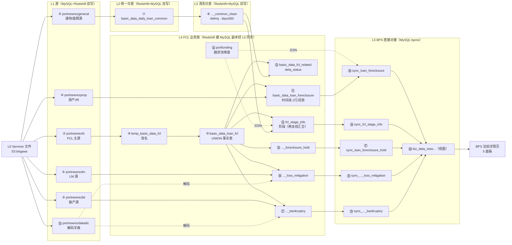

# doc 19 — 5 个样例贷款 · FCL 全链路全表全字段原始转储（Markdown 版）

> 本文件由 `scripts/build_fcl_sample_raw_dump_md.py` 自动生成，是 `docs/19_fcl_sample_loan_raw_dump.xlsx` 的 Markdown 对应版（内容一致）。

## 文档说明

- **文档目的**：把 5 个样例贷款在 FCL 全链路【所有表的全部字段】逐一列出（一节一张表），完整呈现 Newrez 源 → Redshift 中间层 → BPS 的「业务 ↔ 数据」对应关系。doc 16 仅含各面板用到的部分字段，本表是其原始数据底座。
- **数据来源**：全部 **prod**（只读）——`mysql_prod`（bpms + newrez 源）+ `redshift_prod`（port 中间层）；由 `scripts/fetch_fcl_sample_raw_dump_data.py` 预取到 `outputs/fcl_sample_raw_dump_data.json`。
- **目标读者**：数据工程师 · 业务分析师 · 验证人员 · 接入工程师 · 未来 AI 会话
- **取数口径**：Newrez 源 / Redshift 快照表 `dataasof=MAX`(每贷款)；stage/视图 `fctrdt=MAX`；sync 基础表当前态；多行表(hold/lm/bk)取全历史。日期统一 `YYYY-MM-DD`；空值显示 `—`。业务日对齐 `2026-06-01`。
- **如何读血缘**：每张表标题下新增「业务含义与全链路血缘」块——文字链(箭头)呈现 源文件→…→本表→…→BPS 的多级链路(每跳标 PrefectFlow 转换配置 file:line)，并列全部上游/下游表；血缘汇编自 outputs/fcl_pipeline.html + doc 21/20/02。
- **排版**：1 行/贷款的表 → 转置（字段为行 × 5 贷款列）；多行/贷款的表 → 平铺（记录为行 × 全字段列）。

### 修订历史

| 日期 | 作者 | 版本 | 变更 | 关联 |
|---|---|---|---|---|
| 2026-06-07 | AI Agent (Claude Opus 4.8) | v6 | 全表按 **L1→L5 层序重排** + 圆圈号 ②–㉔ 顺序化（MD 小节/索引、Excel 各表 sheet 与 ⓪ 总览同步）；新增 **全局 L1→L5 Pipeline 图**（MD Mermaid 流程图 + Excel ⓪b 全局Pipeline图 sheet）；与 doc 02 五层模型核对一致 | doc 02 · 20 · 21 · fcl_pipeline.html |
| 2026-06-07 | AI Agent (Claude Opus 4.8) | v5 | 每张表新增「业务含义与全链路血缘」块（业务含义/目的·何时来查·为何这样处理·数据粒度 + 文字链全链路血缘：上游/下游、每跳标 PrefectFlow file:line）；并生成 Excel ⓪ 总览 sheet 与各表 sheet 顶部说明块；血缘汇编自 outputs/fcl_pipeline.html + doc 21/20/02 | doc 21 · 20 · 02 · fcl_pipeline.html |
| 2026-06-06 | AI Agent (Claude Opus 4.8) | v4 | 补齐 doc 21 §0.1 图缺的 **逾期支线 L2/L3 + 改名临时表** 共 3 张中间表（`tempfc.temp_basic_data_fcl` / `port.basic_data_daily_loan_common`(asofdate) / `_clean`(fctrdt)）；全链路表 20→23 | doc 21 §0.1 |
| 2026-06-04 | AI Agent (Claude Opus 4.8) | v3 | 每个表新增「查询 SQL」块（prod 只读、含 5 loanid，可复制复现）；新增 ㉑ `portnewrezdatadic` 解码字典节（仅列 5 样例贷款用到的码；完整见数据字典 表26） | doc 19 xlsx · 数据字典 表26 |
| 2026-06-04 | AI Agent (Claude Opus 4.8) | v2 | 改用 **prod** 重取（替换原 dev 数据）并**新增 Redshift 中间层 8 表**（Newrez源→Redshift中间→BPS 全血缘，20 表）；数据经 mysql_prod + redshift_prod 只读预取 | doc 16 · doc 19 xlsx |
| 2026-06-03 | AI Agent | v1 | 初稿：12 节（dev 数据），与 doc 19 xlsx 一一对应 | doc 16 |

> 📌 **数据日期(as-of)如何处理、为何 BPS `sync_*` 主表无 as-of、只有 `update_time`** → 见 [doc 02 §8.1](02_etl_pipeline.md)（code + MCP 实证；真实数据示例 loan 7727000088：源 `dataasof=2026-06-04` 存储 368 天 → 主表 `+datediff=370` 天，无 as-of 列）。

<!-- PIPE:DIAGRAM START -->
## 全局 L1→L5 Pipeline 图（总览）

> 从 L0 Servicer 文件到 BPS 法拍详情页的端到端数据流；圆圈号与下方各表小节一致（②–㉔，按 L1→L5 层序）。
> 两条支线：**FCL 业务族支线**（②→⑨→⑩→{⑪/⑬/⑮/⑯/⑰}）与**逾期支线**（⑤→⑦→⑧ 的 delinq/days360），二者在 **⑬ fcl_stage_info.group** 汇合。汇编自 outputs/fcl_pipeline.html + doc 21/20/02。


<!-- PIPE:DIAGRAM END -->

## 一、表清单 / 索引（按 L1→L5 层序）

### 一、L1 源数据表（mysql_prod.newrez）

| Sheet / 表 | 用途 | 列数/字段 | 本dump行/命中 |
|---|---|---|---|
| ② newrez.portnewrezfc | FCL 主源表（时间线/状态/Hold槽/金额/律师） | 63 | 5/5 贷款 |
| ③ newrez.portnewrezbk | 破产源表 | 60 | 5/5 贷款 |
| ④ newrez.portnewrezlm | 损失缓解(LM)源表 | 56 | 5/5 贷款 |
| ⑤ newrez.portnewrezgeneral | 通用源表（legalstatus / delinquency_status_mba 等） | 125 | 5/5 贷款 |
| ⑥ newrez.portnewrezprop | 房产源表（propertystate 等） | 32 | 5/5 贷款 |

### 二、L2 逾期支线·统一日表（redshift_prod.port）

| Sheet / 表 | 用途 | 列数/字段 | 本dump行/命中 |
|---|---|---|---|
| ⑦ port.basic_data_daily_loan_common | 逾期支线 L2 统一日表（delq_status；每贷款最新 asofdate） | 78 | 5/5 贷款 |

### 三、L3 逾期支线·清洗日表（redshift_prod.port）

| Sheet / 表 | 用途 | 列数/字段 | 本dump行/命中 |
|---|---|---|---|
| ⑧ port.basic_data_daily_loan_common_clean | 逾期支线 L3 清洗日表（delinq / days360；每贷款最新 fctrdt） | 103 | 5/5 贷款 |

### 四、L4 FCL 业务族 / 中间产物（redshift_prod.port · tempfc）

| Sheet / 表 | 用途 | 列数/字段 | 本dump行/命中 |
|---|---|---|---|
| ⑨ tempfc.temp_basic_data_fcl | Redshift 改名临时表（portnewrezfc 等原始列→统一列；运行时中间产物，basic_data_loan_fcl 的上游） | 37 | 5/5 贷款 |
| ⑩ port.basic_data_loan_fcl | Redshift FCL 快照中间表（portnewrezfc 全量进此；每贷款取最新 dataasof） | 61 | 5/5 贷款 |
| ⑪ port.basic_data_loan_foreclosure | Redshift FCL 聚合表（1 行/贷款，sync_loan_foreclosure 的直接上游） | 62 | 5/5 贷款 |
| ⑫ port.basic_data_fcl_related | FCL 关联/过滤中间表（delq_status 等；每贷款最新 dataasof） | 14 | 5/5 贷款 |
| ⑬ port.fcl_stage_info | Redshift 阶段表（sync_fcl_stage_info 上游；每贷款最新 fctrdt） | 48 | 5/5 贷款 |
| ⑭ port.portfunding | 融资池表（入库 JOIN 过滤；1 行/贷款） | 57 | 5/5 贷款 |
| ⑮ port.basic_data_loan_foreclosure_hold | Redshift Hold 历史（sync_loan_foreclosure_hold 上游） | 17 | 21 行 |
| ⑯ port.basic_data_loan_foreclosure_loss_mitigation | Redshift LM 历史（上游） | 16 | 21 行 |
| ⑰ port.basic_data_loan_foreclosure_bankruptcy | Redshift 破产历史（上游） | 15 | 3 行 |

### 五、L5 BPS 直接对接表（mysql_prod.bpms）

| Sheet / 表 | 用途 | 列数/字段 | 本dump行/命中 |
|---|---|---|---|
| ⑱ bpms.sync_loan_foreclosure | Summary/Timeline/target 主表 | 72 | 4/5 贷款 |
| ⑲ bpms.sync_fcl_stage_info | 聚合 Stage/Timeline 表 | 57 | 5/5 贷款 |
| ⑳ bpms.biz_data_view_loan_details_foreclosure（视图） | 详情页视图（actual/var 天数；每贷款最新 fctrdt） | 104 | 5/5 贷款 |
| ㉑ bpms.sync_loan_foreclosure_hold | Hold 全历史（每次变更一行） | 15 | 21 行 |
| ㉒ bpms.sync_loan_foreclosure_loss_mitigation | LM 周期历史 | 22 | 21 行 |
| ㉓ bpms.sync_loan_foreclosure_bankruptcy | 破产记录 | 22 | 3 行 |

### 六、解码字典（mysql_prod.newrez）

| Sheet / 表 | 用途 | 列数/字段 | 本dump行/命中 |
|---|---|---|---|
| ㉔ newrez.portnewrezdatadic | FCL 解码字典（仅列 5 样例用到的码；完整见数据字典 表26） | 8 | 55 码 |

### 不纳入本转储的表

| 表 | 原因 |
|---|---|
| port.basic_data_fcl_stage | 较旧的阶段中间表（实测仅到 2025-09，已被 port.fcl_stage_info 取代） |

### 样例贷款（5）

| # | loanid —— 选取理由 |
|---|---|
| Loan 1 | 7727000088 —— Judicial(FL)·JUDGEMENT·Hold×7·LM×9 |
| Loan 2 | 7727000672 —— Non-Judicial(MI)·REFERRAL |
| Loan 3 | 7727004200 —— Judicial(IL)·SALE |
| Loan 4 | 7727000065 —— BK + Hold×4 + 完结REO |
| Loan 5 | 7727000010 —— Chapter 13 Active BK（未入 FCL 管道） |

---

## ② newrez.portnewrezfc

> FCL 主源表（时间线/状态/Hold槽/金额/律师）。全 **63** 字段 · 取数口径：dataasof=MAX(每贷款) · 命中 5/5 贷款（无行的贷款列显示 `—`）。

<!-- META:newrez.portnewrezfc START -->
> **📋 业务含义与全链路血缘**
>
> - **业务含义/目的**：Newrez 每日推送的法拍(FCL)主源表——一笔贷款一行最新快照，含 FCL 时间线里程碑(setup/referral/firstlegal/judgment/sale)、当前阶段 fcstage、4 个 Hold 槽(fchold1..4)、拍卖金额、律师等。 Newrez 法拍全流程的原始事实底座；下游所有 FCL 计算的源头。
> - **何时来查这张表**：想看某贷款 Newrez 原始报的 FCL 里程碑/阶段/Hold 原值，或核对下游计算是否忠实于源时。
> - **为什么 pipeline 这样处理**：各 Servicer 文件格式不同，先按‘一家一张原始表’落地保真，再到 L4 统一改名/UNION，便于回溯与对账。
> - **数据粒度**：1 行/贷款/dataasof（每日快照）；本 dump 取 dataasof=MAX。
> - **上游链路**：Servicer 文件(S3, L0) → newrez.portnewrezfc  〔load_daily_newrez_flow.py；落库 daily_task.py:923-942(MySQL)/960-983(Redshift)〕
> - **全部上游表**：Servicer 文件(S3, L0)
> - **下游链路**：portnewrezfc → tempfc.temp_basic_data_fcl(改名) → port.basic_data_loan_fcl(全 servicer UNION，FCL 事实表) → { port.basic_data_loan_foreclosure〔GEN_FCL_DETAIL basic_data_pool_config.py:253-305〕 / port.fcl_stage_info〔GEN_FCL_STAGE :1774-2440〕 / port.basic_data_loan_foreclosure_hold〔Hold 拆槽 :466-768〕 } → bpms.sync_*〔asset_managment_config.py〕 → bpms.biz_data_view_loan_details_foreclosure(视图) → BPS 法拍面板
> - **全部下游表**：tempfc.temp_basic_data_fcl、port.basic_data_loan_fcl、port.basic_data_loan_foreclosure、port.fcl_stage_info、port.basic_data_loan_foreclosure_hold、bpms.sync_loan_foreclosure、bpms.sync_fcl_stage_info、bpms.sync_loan_foreclosure_hold、bpms.biz_data_view_loan_details_foreclosure
<!-- META:newrez.portnewrezfc END -->

查询 SQL（prod 只读）：
```sql
-- newrez.portnewrezfc · mysql_prod(只读) · 每贷款 dataasof=MAX(最新快照) · 业务日 2026-06-01
SELECT t.* FROM newrez.portnewrezfc t JOIN (SELECT loanid, MAX(dataasof) AS _md FROM newrez.portnewrezfc WHERE loanid IN ('7727000088','7727000672','7727004200','7727000065','7727000010') GROUP BY loanid) m ON t.loanid=m.loanid AND t.dataasof=m._md;
```

| 字段 | 7727000088 | 7727000672 | 7727004200 | 7727000065 | 7727000010 |
|---|---|---|---|---|---|
| id | 1750674 | 1750233 | 1751818 | 1750695 | 1750688 |
| loanid | 7727000088 | 7727000672 | 7727004200 | 7727000065 | 7727000010 |
| dataasof | 2026-06-04 | 2026-06-04 | 2026-06-04 | 2026-06-04 | 2026-06-04 |
| shellpointloanid | 1031718838 | 1032761570 | 0688132141 | 1031718621 | 1031718692 |
| fcsetupdate | 2025-05-23 | 2026-03-09 | 2025-06-27 | 2025-02-03 | — |
| fcreferraldate | 2025-05-23 | 2026-03-09 | 2025-06-27 | 2025-02-03 | — |
| smsdaysinfc | 368 | 79 | 294 | 254 | — |
| daysinfc | 368 | 79 | 294 | 254 | — |
| demandsentdate | 2025-02-18 | 2025-11-17 | 2025-05-20 | 2024-08-12 | 2026-04-10 |
| demandexpirationdate | 2025-03-25 | 2025-12-22 | 2025-06-24 | 2024-09-18 | 2026-05-15 |
| fcstage | Post Sale Review (SCRA and PACER Check) | Pre-Sale Review 1 (SCRA and PACER Check) | Pre-Sale Review 1 (SCRA and PACER Check) | Post Sale Review (SCRA and PACER Check) | — |
| lastfcstepcompleted | Post Sale Review (SCRA and PACER Check) | First Publication | Sale Scheduled For | Post Sale Review (SCRA and PACER Check) | — |
| lastfcstepcompleteddate | 2026-05-26 | 2026-03-25 | 2026-05-19 | 2025-10-15 | — |
| fchold1description | Court Delay | Delinquency Review | Delinquency Review | Court Delay | — |
| fchold1startdate | 2026-04-09 | 2026-05-12 | 2026-04-17 | 2025-08-26 | — |
| fchold1enddate | 2026-04-26 | 2026-05-27 | 2026-04-17 | 2025-08-28 | — |
| fchold2description | Hearing Set | Loss Mitigation Workout | Hearing Set | Court Delay | — |
| fchold2startdate | 2026-03-16 | 2026-03-25 | 2026-01-29 | 2025-07-02 | — |
| fchold2enddate | 2026-04-07 | 2026-05-27 | 2026-02-13 | 2025-07-14 | — |
| fcjudgmenthearingscheduled | 2026-03-27 | — | 2026-04-13 | 2025-10-15 | — |
| fcjudgmententered | 2026-04-08 | — | 2026-02-13 | 2025-08-25 | — |
| fcscheduledsaledate | — | — | 2026-05-19 | — | — |
| fcsalehelddate | 2026-05-22 | — | — | 2025-10-14 | — |
| fcsaleamount | 200100 | — | — | 357200 | — |
| fcresults | REO | — | — | REO | — |
| firstlegaldate | 2025-06-13 | 2026-03-25 | 2025-07-21 | 2025-03-27 | — |
| servicecompletedate | 2025-07-18 | — | 2025-12-24 | 2025-05-03 | — |
| titleordereddate | — | — | — | 2025-11-13 | — |
| titlecleardate | — | — | — | — | — |
| titlereceiveddate | — | — | — | 2025-12-02 | — |
| fcremovaldesc | Process Complete | Loss Mitigation | Paid in Full | Process Complete | — |
| fcremovaldate | 2026-05-26 | 2026-05-27 | 2026-04-17 | 2025-10-15 | — |
| fccontestedflag | 0 | 0 | 0 | 0 | 0 |
| judicial | 1 | 0 | 1 | 1 | — |
| fcfirm | Kelley Kronenberg, P.A. | Orlans Law Group PLLC | Johnson, Blumberg & Associates, LLC | RAS (Primary) | — |
| jr_sr_lien_flag | 1 | 1 | 1 | 1 | — |
| fcbidamount | 301500 | — | — | 390832.5 | — |
| activefcflag | 0 | 0 | 0 | 0 | 0 |
| fchold1projectedenddate | 2026-04-29 | 2026-07-11 | 2026-06-16 | 2025-09-15 | — |
| fchold1comment | Delay Reason: Pending Ruling on Judgment, Hold Start Date: 2026-04-09, Date of Delay: 2026-04-06, Anticipated Resolution ETA: 2026-04-29, Additional Detail On Delay: We are pending judge's execution of the  proposed Order | Delinquency Review | Delinquency Review | Delay Reason: Pending Judges Decision/Ruling, Hold Start Date: 2025-08-26, Date of Delay: 2025-08-13, Anticipated Resolution ETA: 2025-09-15, Additional Detail On Delay: The Final Judgment was granted at NJT held 8/25/2025. At this time firm is pending the executed final Judgment with sale date scheduled to be docketed with the court a requirement to complete the Judgment entered.  | — |
| fchold2projectedenddate | 2026-04-06 | 2026-06-01 | 2026-02-13 | 2025-07-22 | — |
| fchold2comment | Hearing scheduled for 04/06/2026, Additional Detail: Plaintiff's Motion for Summary Judgment scheduled for 4.6.26. Please end court delay hold. Thanks | BRP Complete:  Complete Ack Sent:  RPP Approved: 03/24/2026 RPP Payments Due: 6 Last RPP Payment Made: 05/12/2026 Next Payment Due: 06/01/2026 | RID: 861849328; Judgment hearing scheduled for 2/13/26 | Delay Reason: Pending Judges Decision/Ruling, Hold Start Date: 2025-07-02, Date of Delay: 2025-07-01, Anticipated Resolution ETA: 2025-07-22, Additional Detail On Delay: Pending court's ruling on the Plaintiff's motion for clerk's default.  | — |
| holdmodified | 2026-04-27 | 2026-05-27 | 2026-04-17 | 2025-08-29 | — |
| holdmodified2 | 2026-04-07 | 2026-05-27 | 2026-02-13 | 2025-07-15 | — |
| create_time | 2026-06-05 19:37:56 | 2026-06-05 19:37:56 | 2026-06-05 19:37:56 | 2026-06-05 19:37:56 | 2026-06-05 19:37:56 |
| update_time | 2026-06-05 19:37:56 | 2026-06-05 19:37:56 | 2026-06-05 19:37:56 | 2026-06-05 19:37:56 | 2026-06-05 19:37:56 |
| dtdeedrecorded | — | — | — | 2025-10-28 | — |
| fcapprbidprice | 301500 | — | — | 390832.5 | — |
| fcl3rdpartyproceedsreceiveddate | — | — | — | — | — |
| investorloanid | 7727000088 | 7727000672 | 7727004200 | 7727000065 | 7727000010 |
| fchold3description | Court Delay | — | Service Delay | Bankruptcy Filed | — |
| fchold3startdate | 2026-01-16 | — | 2025-12-30 | 2025-05-06 | — |
| fchold3enddate | 2026-03-16 | — | 2026-01-23 | 2025-06-27 | — |
| fchold3projectedenddate | 2026-03-17 | — | 2026-01-23 | 2025-07-07 | — |
| fchold3comment | Delay Reason: Pending Hearing Date for Judgment, Hold Start Date: 2026-01-16, Date of Delay: 2026-01-19, Anticipated Resolution ETA: 2026-03-17, Additional Detail On Delay: We have reached out to the JA for dates in April and is pending a response. The JA had advised there were only limited dates. Pending response to proceed., Actions Taken by the Firm: Called the court, Most Recent Follow-Up Date: 02/20/2026, Additional Info:  We have reached out to the JA for dates in April and is pending a response. The JA had advised there were only limited dates. Pending response to proceed. | — | Due to title identifying the incorrect HOA, the new correct HOA had to be served.  The HOA was served 12/24/25 and the time period for the correct HOA to file their Answer does not expire until 1-23-2026.  See Step 9.  We cannot proceed to judgment until after 1-23-2026.   | CaseNumber: 2500228 Chapter: 7 Filed Date: 04/30/2025 POC Bar Date:  Post-Petition Due Date:  MFR Referral Date: 05/15/2025 MFR Filed Date: 06/10/2025 MFR Granted Date:  Dismissal Date: | — |
| holdmodified3 | 2026-03-17 | — | 2026-01-23 | 2025-06-27 | — |
| activejnrlienfcflag | 0 | 0 | 0 | 0 | 0 |
| currentmilestone | Sold | Closed | Closed | Sold | — |
| srlienmonitorflag | — | — | — | — | — |
| srliensalescheduleddate | — | — | — | — | — |
| srliensalehelddate | — | — | — | — | — |
| srliensaleresult | — | — | — | — | — |
| srliensaledate | — | — | — | — | — |

---

## ③ newrez.portnewrezbk

> 破产源表。全 **60** 字段 · 取数口径：dataasof=MAX(每贷款) · 命中 5/5 贷款（无行的贷款列显示 `—`）。

<!-- META:newrez.portnewrezbk START -->
> **📋 业务含义与全链路血缘**
>
> - **业务含义/目的**：Newrez 破产(BK)源表，按贷款×破产申请记录，含 bkstatus/bkchapter/bkfileddate 等编码字段。 BK 事实底座；为 FCL 提供‘是否在破产保护(暂停法拍)’的判断。
> - **何时来查这张表**：查某贷款原始破产章节/状态/申请日，或核对 BPS 破产面板。
> - **为什么 pipeline 这样处理**：破产是法拍的暂停因素，需单列保真；编码值经 datadic 解码成业务文案。
> - **数据粒度**：1 行/贷款/破产申请(bkfileddate)；多次申请多行。
> - **上游链路**：Servicer 文件(S3, L0) → newrez.portnewrezbk
> - **全部上游表**：Servicer 文件(S3, L0)
> - **下游链路**：portnewrezbk → port.basic_data_loan_foreclosure_bankruptcy〔解码 bkstatus，basic_data_pool_config.py:331-370，JOIN newrez.portnewrezdatadic〕 → bpms.sync_loan_foreclosure_bankruptcy〔asset_managment_config.py:822-843〕 → bpms.biz_data_view_loan_details_foreclosure(视图) → BPS 破产面板
> - **全部下游表**：port.basic_data_loan_foreclosure_bankruptcy、bpms.sync_loan_foreclosure_bankruptcy、bpms.biz_data_view_loan_details_foreclosure
<!-- META:newrez.portnewrezbk END -->

查询 SQL（prod 只读）：
```sql
-- newrez.portnewrezbk · mysql_prod(只读) · 每贷款 dataasof=MAX(最新快照) · 业务日 2026-06-01
SELECT t.* FROM newrez.portnewrezbk t JOIN (SELECT loanid, MAX(dataasof) AS _md FROM newrez.portnewrezbk WHERE loanid IN ('7727000088','7727000672','7727004200','7727000065','7727000010') GROUP BY loanid) m ON t.loanid=m.loanid AND t.dataasof=m._md;
```

| 字段 | 7727000088 | 7727000672 | 7727004200 | 7727000065 | 7727000010 |
|---|---|---|---|---|---|
| id | 1750674 | 1750233 | 1751818 | 1750695 | 1750688 |
| loanid | 7727000088 | 7727000672 | 7727004200 | 7727000065 | 7727000010 |
| dataasof | 2026-06-04 | 2026-06-04 | 2026-06-04 | 2026-06-04 | 2026-06-04 |
| shellpointloanid | 1031718838 | 1032761570 | 0688132141 | 1031718621 | 1031718692 |
| bkfileddate | — | — | — | 2025-04-30 | 2024-02-06 |
| bkstatus | — | — | — | 2 | 1 |
| bkremovalcode | — | — | — | 1 | — |
| bkremovaldate | — | — | — | 2025-07-29 | — |
| bkchapter | — | — | — | 7 | 13 |
| bkcasenumber | — | — | — | 2500228 | 2310152 |
| bkpostpetitionduedate | — | — | — | — | 2026-06-01 |
| prepetitionduedate | 2025-01-01 | 2026-02-01 | 2024-12-01 | 2024-03-01 | 2026-04-01 |
| pocfileddate | — | — | — | — | 2023-09-30 |
| dischargeddate | — | — | — | 2025-07-29 | — |
| dismisseddate | — | — | — | — | — |
| mfrfileddate | — | — | — | 2025-06-10 | — |
| mfrhearingdate | — | — | — | 2025-06-24 | — |
| mfrgranteddate | — | — | — | 2025-06-25 | — |
| trusteeassetflag | — | — | — | 0 | 0 |
| trusteeassetdate | — | — | — | 2025-06-01 | — |
| planconfirmationdate | — | — | — | — | 2024-07-11 |
| bkstage | — | — | — | 8 | 4 |
| bkfirm | — | — | — | — | Aldridge Pite, LLP |
| reaffirmationdate | — | — | — | — | — |
| trusteeabandonmentdate | — | — | — | — | — |
| pocreferreddate | — | — | — | — | — |
| pocbardate | — | — | — | — | 2024-04-16 |
| mfrreferred | — | — | — | 2025-05-15 | 2025-11-10 |
| mfrhearingresults | — | — | — | 3 | 0 |
| cramdowndatereferred | — | — | — | — | — |
| cramdownobjectionfileddate | — | — | — | — | — |
| cramdownresultdate | — | — | — | — | — |
| cramdownhearingresults | — | — | — | 0 | 0 |
| adversarialactionfileddate | — | — | — | — | — |
| adversarialhearingdate | — | — | — | — | — |
| adversarialresultdate | — | — | — | — | — |
| adversarialresults | — | — | — | 0 | 0 |
| cramdownflag | — | — | — | 0 | 0 |
| bankruptcypaymenttype | — | — | — | — | 1 |
| debtorintention | — | — | — | — | 1 |
| jointfilerflag | — | — | — | — | 0 |
| activebkflag | 0 | 0 | 0 | 0 | 1 |
| apocfileddate | — | — | — | — | — |
| apocreferraldate | — | — | — | — | — |
| reasonforapoc | — | — | — | — | — |
| attorney | — | — | — | — | — |
| create_time | 2026-06-05 19:37:17 | 2026-06-05 19:37:17 | 2026-06-05 19:37:17 | 2026-06-05 19:37:17 | 2026-06-05 19:37:17 |
| update_time | 2026-06-05 19:37:17 | 2026-06-05 19:37:17 | 2026-06-05 19:37:17 | 2026-06-05 19:37:17 | 2026-06-05 19:37:17 |
| bkrepayplanpaymentcount | — | — | — | — | 60 |
| bksourceoffundscode | — | — | — | — | — |
| bkpoccourtreceiveddate | — | — | — | — | — |
| bkrcurrentstatusdate | — | — | — | — | 2026-05-26 |
| bkborrowerintent | — | — | — | — | 1 |
| bkpostpetitionpaymentcurrent | — | — | — | — | 2192 |
| bkcramdownpercent | — | — | — | — | — |
| bkpostsuspensebalance | — | — | — | — | — |
| bkpresuspensebalance | — | — | — | — | — |
| investorloanid | 7727000088 | 7727000672 | 7727004200 | 7727000065 | 7727000010 |
| bkfilingstate | — | — | — | WV | FL |
| bkfilingregion | — | — | — | Northern District of WV (Martinsburg) | Northern District of Florida, Gainesville Division                     |

---

## ④ newrez.portnewrezlm

> 损失缓解(LM)源表。全 **56** 字段 · 取数口径：dataasof=MAX(每贷款) · 命中 5/5 贷款（无行的贷款列显示 `—`）。

<!-- META:newrez.portnewrezlm START -->
> **📋 业务含义与全链路血缘**
>
> - **业务含义/目的**：Newrez 损失缓解(LM)源表，按贷款×LM 周期(dealstartdate)，含 lmdeal/lmprogram/lmstatus/lmdecision 等编码。 LM 事实底座；提供‘是否在协商还款方案(暂停/替代法拍)’。
> - **何时来查这张表**：查某贷款 LM 周期/项目/决定原值，或核对 BPS LM 面板。
> - **为什么 pipeline 这样处理**：LM 是法拍的替代/暂停路径，需单列保真；编码经 datadic 解码。
> - **数据粒度**：1 行/贷款/LM 周期(dealstartdate)；多周期多行。
> - **上游链路**：Servicer 文件(S3, L0) → newrez.portnewrezlm
> - **全部上游表**：Servicer 文件(S3, L0)
> - **下游链路**：portnewrezlm → port.basic_data_loan_foreclosure_loss_mitigation〔basic_data_pool_config.py:799-843，JOIN newrez.portnewrezdatadic〕 → bpms.sync_loan_foreclosure_loss_mitigation〔asset_managment_config.py:799-819〕 → bpms.biz_data_view_loan_details_foreclosure(视图) → BPS LM 面板
> - **全部下游表**：port.basic_data_loan_foreclosure_loss_mitigation、bpms.sync_loan_foreclosure_loss_mitigation、bpms.biz_data_view_loan_details_foreclosure
<!-- META:newrez.portnewrezlm END -->

查询 SQL（prod 只读）：
```sql
-- newrez.portnewrezlm · mysql_prod(只读) · 每贷款 dataasof=MAX(最新快照) · 业务日 2026-06-01
SELECT t.* FROM newrez.portnewrezlm t JOIN (SELECT loanid, MAX(dataasof) AS _md FROM newrez.portnewrezlm WHERE loanid IN ('7727000088','7727000672','7727004200','7727000065','7727000010') GROUP BY loanid) m ON t.loanid=m.loanid AND t.dataasof=m._md;
```

| 字段 | 7727000088 | 7727000672 | 7727004200 | 7727000065 | 7727000010 |
|---|---|---|---|---|---|
| id | 1747370 | 1746929 | 1748514 | 1747391 | 1747384 |
| loanid | 7727000088 | 7727000672 | 7727004200 | 7727000065 | 7727000010 |
| dataasof | 2026-06-04 | 2026-06-04 | 2026-06-04 | 2026-06-04 | 2026-06-04 |
| shellpointloanid | 1031718838 | 1032761570 | 0688132141 | 1031718621 | 1031718692 |
| hardshiptype | 11 | 11 | 20 | 11 | 12 |
| borrowerintention | — | — | — | — | — |
| lmdeal | 7 | 4 | 1 | 2 | 1 |
| dealstartdate | 2026-02-17 | 2026-02-25 | 2026-01-06 | 2025-07-01 | 2026-04-16 |
| daysindeal | 66 | 99 | 27 | 0 | 12 |
| lmstatus | 112 | 25 | 5 | 166 | 112 |
| statusstartdate | 2026-04-22 | 2026-03-24 | 2026-01-14 | 2024-11-26 | 2026-04-23 |
| daysinstatus | 2 | 72 | 19 | 217 | 5 |
| lmprogram | 10 | 29 | 496 | 21 | 498 |
| lmdecision | 6 | 99 | 10 | 11 | 6 |
| lmremovaldate | 2026-04-24 | — | 2026-02-02 | 2025-07-01 | 2026-04-28 |
| denialreason | 40 | — | — | — | 124 |
| forbearanceagreementdate | — | — | 2025-02-01 | — | — |
| forbearancedatecompleted | — | — | 2025-05-01 | — | — |
| forbearancebeginningduedate | — | — | 2025-02-01 | — | — |
| forbearanceendingduedate | — | — | 2025-04-30 | — | — |
| forbearancenumberofmonths | — | — | 3 | — | — |
| forbearancestatus | — | — | 4 | — | — |
| forbearancetype | — | — | 61 | — | — |
| trialagreementdate | — | — | — | — | — |
| trialdatecompleted | — | — | — | — | — |
| trialbeginningduedate | — | — | — | — | — |
| trialendingduedate | — | — | — | — | — |
| trialnumberofmonths | — | — | — | — | — |
| trialstatus | — | — | — | — | — |
| repaymentagreementdate | — | 2026-03-24 | — | — | — |
| repaymentstartdate | — | 2026-05-01 | — | — | — |
| repaymentenddate | — | 2026-10-31 | — | — | — |
| repaymenttype | — | 4 | — | — | — |
| repaymentstatus | — | 1 | — | — | — |
| repaymentplandownpmt | — | 9000 | — | — | — |
| repaymentplandownpmtdate | — | 2026-04-24 | — | — | — |
| pradate1 | — | — | — | — | — |
| praamount1 | — | — | — | — | — |
| pradate2 | — | — | — | — | — |
| praamount2 | — | — | — | — | — |
| pradate3 | — | — | — | — | — |
| praamount3 | — | — | — | — | — |
| activelmflag | 0 | 1 | 0 | 0 | 0 |
| create_time | 2026-06-05 19:38:36 | 2026-06-05 19:38:36 | 2026-06-05 19:38:36 | 2026-06-05 19:38:36 | 2026-06-05 19:38:36 |
| update_time | 2026-06-05 19:38:36 | 2026-06-05 19:38:36 | 2026-06-05 19:38:36 | 2026-06-05 19:38:36 | 2026-06-05 19:38:36 |
| lossmitmodtermsmodifiedtermextensionmonths | — | — | — | — | — |
| deferment_flag | — | — | — | — | — |
| deferment_amount | — | — | — | — | — |
| number_pi_payments_deferred | — | — | — | — | — |
| shortsalenetproceedsamount | — | — | — | — | — |
| shortsalecontractofferamount | — | — | — | — | — |
| appealperiodexpirationdate | — | — | — | — | 2026-05-11 |
| lossmitmodpreviouslydeferredcapitalizedamount | — | — | — | — | — |
| deferment_date | — | — | — | — | — |
| denialletterdate | 2026-04-23 | 2025-08-12 | — | — | 2026-04-27 |
| investorloanid | 7727000088 | 7727000672 | 7727004200 | 7727000065 | 7727000010 |

---

## ⑤ newrez.portnewrezgeneral

> 通用源表（legalstatus / delinquency_status_mba 等）。全 **125** 字段 · 取数口径：dataasof=MAX(每贷款) · 命中 5/5 贷款（无行的贷款列显示 `—`）。

<!-- META:newrez.portnewrezgeneral START -->
> **📋 业务含义与全链路血缘**
>
> - **业务含义/目的**：Newrez 通用源表(125 列)，含 legalstatus、delinquency_status_mba(MBA 逾期分类)、nextduedate 等账户层属性。 逾期(delinquency)支线的源头；提供 delq_status 原值。
> - **何时来查这张表**：查某贷款原始逾期分类/法律状态/下次到期日。
> - **为什么 pipeline 这样处理**：逾期与 FCL 是两条支线——逾期来自 general 表经 days360 归一，FCL 来自 portnewrezfc 显式标志；二者在 L4 汇合。FCL 码绝不由 days360 推导。
> - **数据粒度**：1 行/贷款/dataasof。
> - **上游链路**：Servicer 文件(S3, L0) → newrez.portnewrezgeneral
> - **全部上游表**：Servicer 文件(S3, L0)
> - **下游链路**：portnewrezgeneral.delinquency_status_mba → port.portdaily_v2〔portdaily_config.py〕 → port.basic_data_daily_loan_common.delq_status(逾期支线 L2，daily_data_loan_common_config.py) → port.basic_data_daily_loan_common_clean.delinq(L3，daily_data_loan_common_clean_config.py，CASE+days360) → { port.basic_data_fcl_related.delq_status / port.fcl_stage_info.group / port.portmonthbase } → BPS
> - **全部下游表**：port.portdaily_v2、port.basic_data_daily_loan_common、port.basic_data_daily_loan_common_clean、port.basic_data_fcl_related、port.fcl_stage_info、port.portmonthbase、bpms.sync_fcl_stage_info
<!-- META:newrez.portnewrezgeneral END -->

查询 SQL（prod 只读）：
```sql
-- newrez.portnewrezgeneral · mysql_prod(只读) · 每贷款 dataasof=MAX(最新快照) · 业务日 2026-06-01
SELECT t.* FROM newrez.portnewrezgeneral t JOIN (SELECT loanid, MAX(dataasof) AS _md FROM newrez.portnewrezgeneral WHERE loanid IN ('7727000088','7727000672','7727004200','7727000065','7727000010') GROUP BY loanid) m ON t.loanid=m.loanid AND t.dataasof=m._md;
```

| 字段 | 7727000088 | 7727000672 | 7727004200 | 7727000065 | 7727000010 |
|---|---|---|---|---|---|
| id | 1749124 | 1748683 | 1750268 | 1749145 | 1749138 |
| loanid | 7727000088 | 7727000672 | 7727004200 | 7727000065 | 7727000010 |
| dataasof | 2026-06-04 | 2026-06-04 | 2026-06-04 | 2026-06-04 | 2026-06-04 |
| shellpointloanid | 1031718838 | 1032761570 | 0688132141 | 1031718621 | 1031718692 |
| investorid | BI2726 | BI2725 | BIRTT1 | TT1REO | BI2726 |
| investorloanid | 7727000088 | 7727000672 | 7727004200 | 7727000065 | 7727000010 |
| priorservicerloannumber | 9010021155 | 32288235 | 3260057082 | 9014327961 | 9014059868 |
| boarddate | 2024-07-04 | 2024-07-04 | 2024-02-07 | 2024-07-04 | 2024-07-04 |
| acquisitiondate | 2024-07-02 | 2024-07-02 | 2024-02-01 | 2024-07-02 | 2024-07-02 |
| acquisitionbalance | 318856.09 | 421270.39 | 455612.06 | 470399.51 | 271997.47 |
| mbadelinquency | 14 | 6 | 15 | 14 | 9 |
| delinqstatatboarding | 3 | 4 | 3 | 6 | 10 |
| lienposition | 1 | 1 | 1 | 1 | 1 |
| loantype | 0 | 0 | 0 | 2 | 2 |
| loanpurpose | 1 | 1 | 1 | 3 | 3 |
| documentationtype | 0 | 0 | 0 | 0 | 0 |
| dateinactive | — | — | 2026-04-16 | — | — |
| currentinterestrate | 0.06625 | 0.09875 | 0.0275 | 0.0425 | 0.03625 |
| originalterm | 360 | 360 | 360 | 360 | 360 |
| originalnotedate | 2022-09-20 | 2022-09-15 | 2017-05-16 | 2022-05-24 | 2022-02-17 |
| originalmaturitydate | 2052-10-01 | 2052-10-01 | 2047-06-01 | 2052-06-01 | 2052-03-01 |
| originalamt | 324900 | 425000 | 532000 | 484200 | 282335 |
| currentmaturitydate | 2052-10-01 | 2052-10-01 | 2047-06-01 | 2052-06-01 | 2052-03-01 |
| amortizationterm | 360 | 360 | 360 | 360 | 360 |
| remainingterm | 334 | 321 | 0 | 340 | 312 |
| otherliens | — | — | — | — | — |
| otherliensbalance | — | — | — | — | — |
| legalstatus | REO | — | FCBU | REO | BK13 |
| warningstatus | — | — | AttyCons | ICC-REO | — |
| isattorneyrepresented | 0 | 0 | 0 | 0 | 0 |
| issoldiersandsailors | 0 | 0 | 0 | 0 | 0 |
| isloanlitigated | 0 | 0 | 0 | 0 | 0 |
| isescrowed | 1 | 1 | 1 | 1 | 1 |
| femaarea | 0 | 0 | 0 | 0 | 0 |
| femaaffect | 0 | 0 | 0 | 0 | 0 |
| balloonflag | 0 | 0 | 0 | 0 | 0 |
| balloondate | — | — | — | — | — |
| prepaymentpenaltyflag | 0 | 0 | 0 | 0 | 0 |
| prepaymentpenaltyterm | 0 | 0 | 0 | 0 | 0 |
| prepaymentpenaltyfee | 0 | 0 | 0 | 0 | 0 |
| chargeoff | 0 | 0 | 0 | 0 | 0 |
| chargeoffdate | — | — | — | — | — |
| chargeoffamount | — | — | — | — | — |
| payoffrequested | 0 | 0 | 1 | 0 | 0 |
| payoffrequestdate | — | — | 2026-03-23 | — | — |
| mersid | 101229710000033408 | 100859730000132976 | — | 100661190012111072 | 100661190011370480 |
| servicefeepercent | 0 | 0 | 0 | 0 | 0 |
| servicefeedollars | 0 | 0 | 0 | 0 | 0 |
| interestmethod | 0 | 0 | 0 | 0 | 0 |
| negamflag | 0 | 0 | 0 | 0 | 0 |
| borrowerdeceasedflag | 0 | 0 | 0 | 0 | 0 |
| coborrowerdeceasedflag | 0 | — | — | — | — |
| priorservicer | Specialized Loan Servicing | Specialized Loan Servicing | Associated Bank | Specialized Loan Servicing | Specialized Loan Servicing |
| foreignnationalflag | 0 | 0 | 0 | 0 | 0 |
| min_status | 1 | 1 | — | 1 | 1 |
| origorgid | 1012297 | 1008597 |  | 1006611 | 1006611 |
| origorgname | Approved Mortgage Source, LLC | IMPAC Mortgage Corp. | — | Home Point Financial Corporation | — |
| servicerorgid | 1007544 | 1007544 |  | 1007544 | 1003225 |
| subservorgid |  |  |  |  |  |
| ppc1_id | — | — | — | — | — |
| investorname | TRESTLE TITLING TRUST-1 (TRUSTEE) | TRESTLE TITLING TRUST -1 | Trustee for Trestle Titling Trust-1 | Trestle Titling Trust-1 | TRESTLE TITLING TRUST-1 (TRUSTEE) |
| min_number | 1.012297100000334e17 | 1.0085973000013298e17 | — | 1.0066119001211107e17 | 1.0066119001137048e17 |
| registerstatus | Assigned For Default or BK | Assigned For Default or BK | — | Assigned For Default or BK | Inactive |
| deactreason | FC-BK | FC-BK | — | FC-BK | — |
| securitization | — | — | — | 	N | — |
| poolnumber | 0 | 0 | 0 | 0 | 0 |
| investororgid | 1012111 | 1012111 |  | 1012111 | 1012111 |
| is_hpml | 0 | 0 | 0 | 0 | 0 |
| investmentproperty | 0 | 0 | 0 | 0 | 0 |
| hasadditionalcollateral | 0 | 0 | 0 | 0 | 0 |
| creditorname | WILMINGTON SAVINGS FUND SOCIETY, FSB, not in its individual capacity, but solely as Trustee for Trestle Titling Trust-1 | TRESTLE TITLING TRUST -1 | WILMINGTON SAVINGS FUND SOCIETY, FSB, not in its individual capacity, but solely as Trustee for Trestle Titling Trust-1 | Trestle Titling Trust-1 | WILMINGTON SAVINGS FUND SOCIETY, FSB, not in its individual capacity, but solely as Trustee for Trestle Titling Trust-1 |
| vestingname | TRESTLE REO- 1 LLC | TRESTLE REO- 1 LLC | TRESTLE REO- 1 LLC | TRESTLE REO- 1 LLC | TRESTLE REO- 1 LLC |
| memberid | — | — | — | — | — |
| welcomeletter | — | — | 2024-02-12 | — | — |
| tilanotice | — | — | 2024-07-17 | — | — |
| debenturerate | 3.25 | 3.25 | 2.75 | 1.875 | 1.875 |
| reasonfordefault | Reduction in Borrower's Income | — | — | Unable to Contact Borrower | — |
| custodianname | DC-WT | DC-WT | DC-WT | DC-WT | DC-WT |
| custodiancollateralid | 8001883579 | 3111022026 | 7727004200 | 7001810280 | 6001690164 |
| delinquency_status_mba | REO | 120-149 DPD | Full Payoff | REO | Performing Bankruptcy |
| create_time | 2026-06-05 19:37:58 | 2026-06-05 19:37:58 | 2026-06-05 19:37:58 | 2026-06-05 19:37:58 | 2026-06-05 19:37:58 |
| update_time | 2026-06-05 19:37:58 | 2026-06-05 19:37:58 | 2026-06-05 19:37:58 | 2026-06-05 19:37:58 | 2026-06-05 19:37:58 |
| eoy_1099c_cancelled_date_reported | — | — | — | — | — |
| loanscraflag | — | — | — | — | — |
| srlienstatuscode | — | — | — | — | — |
| srlienname | — | — | — | — | — |
| srlienduedate | — | — | — | — | — |
| srlienstatusdesc | — | — | — | — | — |
| prepaypenaltyenddate | — | — | — | — | — |
| loanscrapaymenteffectivedate | — | — | — | — | — |
| cdfi | 0 | 0 | 0 | 0 | 0 |
| investorchargeoff | 0 | 0 | 0 | 0 | 0 |
| eoy_1099c_flag | — | — | — | — | — |
| disasterdesignationdate | — | — | — | — | — |
| inauctionflag | 0 | 0 | 0 | 1 | 0 |
| fhavapmicasenumber | — | — | 1000201256 | 171762357107 | 171762373396 |
| loanscraenddate | — | — | — | — | — |
| borrowerprimarymilitarystatuscode | 0 | 0 | 0 | 0 | 0 |
| borrowerprimarymilitarystatuscodedesc | Not Maintained | Not Maintained | Not Maintained | Not Maintained | Not Maintained |
| dscr | 0 | 0 | 0 | 0 | 0 |
| loanscrastartdate | — | — | — | — | — |
| disastername | — | — | — | — | — |
| bridgeloan | 0 | 0 | 0 | 0 | 0 |
| secondhome | 0 | 0 | 0 | 0 | 0 |
| priorservicername | Specialized Loan Servicing | Specialized Loan Servicing | Associated Bank | Specialized Loan Servicing | Specialized Loan Servicing |
| disasterimpactcreateddate | — | — | — | — | — |
| investorchargeoffdate | — | — | — | — | — |
| disasterdeclarationnumber | — | — | — | — | — |
| lienseniorbalanceprincipalcurrent | — | — | — | — | — |
| loanscrainterestrate | — | — | — | — | — |
| loanscrapipayment | — | — | — | — | — |
| eoy_1099c_cancelled_amount_reported | — | — | — | — | — |
| otsdelinquency | REO | 120-149 DPD | Full Payoff | REO | Performing Bankruptcy |
| leadbilldays | — | — | — | — | — |
| guarantyfeepercent | 0 | 0 | 0 | 0 | 0 |
| acquiredduedate | 2024-07-01 | 2024-05-01 | 2024-01-01 | 2024-03-01 | 2024-03-01 |
| interestpaidthroughdate | 2024-12-01 | 2026-01-01 | 2024-11-01 | 2024-02-01 | 2026-03-01 |
| srstatus | — | — | — | — | — |
| enoteflag | 0 | 0 | 0 | 0 | 0 |
| billingstatementdate | 2026-05-18 | 2026-05-18 | 2026-03-18 | 2025-07-21 | 2026-05-18 |
| vrmflag | 0 | 0 | 0 | 0 | 0 |
| pendinginvestoridtransfer | 0 | 0 | 0 | 0 | 0 |
| newinvestorid | — | — | — | — | — |
| amltype | 0 | 0 | 0 | 0 | 0 |
| successorservicer | — | — | — | — | — |

---

## ⑥ newrez.portnewrezprop

> 房产源表（propertystate 等）。全 **32** 字段 · 取数口径：dataasof=MAX(每贷款) · 命中 5/5 贷款（无行的贷款列显示 `—`）。

<!-- META:newrez.portnewrezprop START -->
> **📋 业务含义与全链路血缘**
>
> - **业务含义/目的**：Newrez 房产源表(32 列)，含 propertystate(州，定司法/非司法)、LTV、occupancy 等。 提供物业/州属性；州决定 FCL 走司法(judicial)还是非司法路径。
> - **何时来查这张表**：查某贷款物业州/LTV/占用情况。
> - **为什么 pipeline 这样处理**：司法/非司法影响 FCL 时长与阶段口径，需物业州维度（实测 state 取自 portnewrezprop.propertystate）。
> - **数据粒度**：1 行/贷款/dataasof。
> - **上游链路**：Servicer 文件(S3, L0) → newrez.portnewrezprop
> - **全部上游表**：Servicer 文件(S3, L0)
> - **下游链路**：portnewrezprop.propertystate → port.basic_data_daily_loan_common(州维度) / port.basic_data_loan_foreclosure(summary_judicial_foreclosure 司法标志) → bpms.sync_loan_foreclosure → BPS
> - **全部下游表**：port.basic_data_daily_loan_common、port.basic_data_loan_foreclosure、bpms.sync_loan_foreclosure
<!-- META:newrez.portnewrezprop END -->

查询 SQL（prod 只读）：
```sql
-- newrez.portnewrezprop · mysql_prod(只读) · 每贷款 dataasof=MAX(最新快照) · 业务日 2026-06-01
SELECT t.* FROM newrez.portnewrezprop t JOIN (SELECT loanid, MAX(dataasof) AS _md FROM newrez.portnewrezprop WHERE loanid IN ('7727000088','7727000672','7727004200','7727000065','7727000010') GROUP BY loanid) m ON t.loanid=m.loanid AND t.dataasof=m._md;
```

| 字段 | 7727000088 | 7727000672 | 7727004200 | 7727000065 | 7727000010 |
|---|---|---|---|---|---|
| id | 1747370 | 1746929 | 1748514 | 1747391 | 1747384 |
| loanid | 7727000088 | 7727000672 | 7727004200 | 7727000065 | 7727000010 |
| dataasof | 2026-06-04 | 2026-06-04 | 2026-06-04 | 2026-06-04 | 2026-06-04 |
| shellpointloanid | 1031718838 | 1032761570 | 0688132141 | 1031718621 | 1031718692 |
| propertyaddressline1 | 21 LK CHARLES LN | W 3120 SCHLOSSER RD | 13977 W EMMA LN | 2331 SW FREEMAN ST | 19801 OLD BELLAMY RD |
| propertyaddressline2 | — | — | — | — | — |
| propertycity | PALM COAST | MORAN | METTAWA | PORT SAINT LUCIE | ALACHUA |
| propertystate | FL | MI | IL | FL | FL |
| propertyzip | 32137 | 49760 | 60045 | 34953 | 32615 |
| propertycounty | FLAGLER | MACKINAC | LAKE | ST. LUCIE | ALACHUA |
| propertytype | 20 | 20 | 39 | 20 | 20 |
| currentoccupancy | 2 | 0 | 0 | 2 | 0 |
| currentoccupancydate | 2026-05-26 | — | — | 2026-05-23 | 2026-01-28 |
| mostrecentvalue | 287753 | 350000 | 855000 | 455900 | 320750 |
| mostrecentvaluedate | 2026-06-01 | 2026-04-29 | 2026-03-05 | 2026-03-30 | 2022-12-06 |
| valuationmethod | 2 | 4 | 2 | 2 | 2 |
| bpoprovider | — | — | 10 | — | — |
| originalpropertyvalue | 343000 | 508000 | 563000 | 538000 | 325000 |
| originalpropertyvaluedate | 2022-08-01 | 2022-05-01 | — | 2022-05-01 | 2022-02-01 |
| vacancyflag | 1 | 0 | 0 | 1 | 0 |
| originalltv | 0.9472 | 0.8366 | 0.9449 | 0.9 | 0.8687 |
| currentltv | 1.1013 | 1.189 | 0 | 1.0318 | 0.8103 |
| numberofunits | 1 | 1 | 1 | 1 | 1 |
| mostrecentbpovalue | 287753 | 539900 | 855000 | 455900 | 320750 |
| mostrecentbpovaluedate | 2026-06-01 | 2026-04-25 | 2026-03-05 | 2026-03-30 | 2022-12-06 |
| taxservice | First American Tax Service | First American Tax Service | First American Tax Service | First American Tax Service | First American Tax Service |
| datesenttotaxoutsource | 2024-07-11 | 2024-07-23 | 2024-02-14 | 2024-07-11 | 2024-07-11 |
| create_time | 2026-06-05 19:38:50 | 2026-06-05 19:38:49 | 2026-06-05 19:38:50 | 2026-06-05 19:38:50 | 2026-06-05 19:38:50 |
| update_time | 2026-06-05 19:38:50 | 2026-06-05 19:38:49 | 2026-06-05 19:38:50 | 2026-06-05 19:38:50 | 2026-06-05 19:38:50 |
| originaloccupancy | Primary Residence | Primary Residence | Primary Residence | Primary Residence | Primary Residence |
| investorloanid | 7727000088 | 7727000672 | 7727004200 | 7727000065 | 7727000010 |
| countycode | 35 | 97 | 97 | 111 | 1 |

---

## ⑦ port.basic_data_daily_loan_common

> 逾期支线 L2 统一日表（delq_status；每贷款最新 asofdate）。全 **78** 字段 · 取数口径：asofdate=MAX(每贷款) · 命中 5/5 贷款（无行的贷款列显示 `—`）。

<!-- META:port.basic_data_daily_loan_common START -->
> **📋 业务含义与全链路血缘**
>
> - **业务含义/目的**：逾期支线 L2 统一日表(78 列)——全 servicer UNION 后的标准日表，含 delq_status、fcl_flag、lm_flag 等(asofdate)。 逾期/状态归一的统一入口；L3 清洗的上游。
> - **何时来查这张表**：查‘统一后的每日逾期/状态原值’、对账各家归一。
> - **为什么 pipeline 这样处理**：各家逾期/状态字段名与取值不同，先 UNION 成统一日表；注意 fcl_flag 在此并未真正归一(Newrez/SLS 为 NULL)，真正归一在 L4 FCL 业务族。
> - **数据粒度**：1 行/贷款/asofdate。
> - **上游链路**：Servicer 文件(L0) → newrez.portnewrezgeneral(等各家) → port.portdaily_v2〔portdaily_config.py〕 → port.basic_data_daily_loan_common〔daily_data_loan_common_config.py〕
> - **全部上游表**：Servicer 文件(L0)、newrez.portnewrezgeneral、newrez.portnewrezfc、port.portdaily_v2
> - **下游链路**：→ port.basic_data_daily_loan_common_clean(L3) → { port.portmonthbase / port.basic_data_fcl_related.delq_status / port.fcl_stage_info.group } → BPS
> - **全部下游表**：port.basic_data_daily_loan_common_clean、port.basic_data_fcl_related、port.fcl_stage_info、port.portmonthbase
> - **备注**：fcl_flag 在 L2 未归一（直传，Newrez/SLS NULL）；真正归一在 L4 FCL 业务族。
<!-- META:port.basic_data_daily_loan_common END -->

查询 SQL（prod 只读）：
```sql
-- port.basic_data_daily_loan_common · redshift_prod(只读) · 每贷款 asofdate=MAX(最新快照) · 业务日 2026-06-01
SELECT t.* FROM port.basic_data_daily_loan_common t JOIN (SELECT loanid, MAX(asofdate) AS _md FROM port.basic_data_daily_loan_common WHERE loanid IN ('7727000088','7727000672','7727004200','7727000065','7727000010') GROUP BY loanid) m ON t.loanid=m.loanid AND t.asofdate=m._md;
```

| 字段 | 7727000088 | 7727000672 | 7727004200 | 7727000065 | 7727000010 |
|---|---|---|---|---|---|
| asofdate | 2026-06-04 | 2026-06-04 | 2026-06-04 | 2026-06-04 | 2026-06-04 |
| loanid | 7727000088 | 7727000672 | 7727004200 | 7727000065 | 7727000010 |
| svcloanid | 1031718838 | 1032761570 | 0688132141 | 1031718621 | 1031718692 |
| servicer | Newrez | Newrez | Newrez | Newrez | Newrez |
| nextduedate | 2025-01-01 | 2026-02-01 | 2024-12-01 | 2024-03-01 | 2026-04-01 |
| principalbalance | 316909.28 | 416163.45 | 0 | 470399.51 | 259917 |
| deferredprincipalbalance | 0 | 0 | 0 | 0 | 0 |
| deferredinterestbalance | 0 | 0 | 0 | 0 | 0 |
| schedule_pandi_daily | 2080.37 | 3690.48 | 2195.33 | 2381.97 | 1287.59 |
| principalpaidmtd | 0 | 0 | 0 | 0 | 1498.21 |
| interestpaidmtd | 0 | 0 | 0 | 0 | 2364.56 |
| interest_rate | 6.625 | 9.875 | 2.75 | 4.25 | 3.625 |
| bal_prin_original | 324900 | 425000 | 532000 | 484200 | 282335 |
| delq_status | REO | 120-149 DPD | Full Payoff | REO | Performing Bankruptcy |
| originalterm | 360 | 360 | 360 | 360 | 360 |
| escrowbalance | -15023.97 | -4631.78 | 0 | -12520.46 | -5261.99 |
| escrow_advance_balance | 15023.97 | 4631.78 | 0 | 12520.46 | 5261.99 |
| reccorpadvance | -10593.28 | -922.04 | -30 | -16073.44 | 0 |
| nonrecovadvance | -1605.75 | -3240.8 | -2170.3 | 93480 | -2020.63 |
| agency | Conventional | Conventional | Conventional | VA | VA |
| purpose | Purchase | Purchase | Purchase | Refinance-Cash | Refinance-Cash |
| proptype | SingleFamilyDetached | SingleFamilyDetached | PUD | SingleFamilyDetached | SingleFamilyDetached |
| occupancy | Vacant | Owner Occupied | Owner Occupied | Vacant | Owner Occupied |
| doctype | Full | Full | Full | Full | Full |
| zipcode | 32137 | 49760 | 60045 | 34953 | 32615 |
| propaddress | 21 LK CHARLES LN | W 3120 SCHLOSSER RD | 13977 W EMMA LN | 2331 SW FREEMAN ST | 19801 OLD BELLAMY RD |
| city | PALM COAST | MORAN | METTAWA | PORT SAINT LUCIE | ALACHUA |
| state | FL | MI | IL | FL | FL |
| modi | N | N | N | N | N |
| moditype |  |  |  |  |  |
| modidate | — | — | 2021-09-23 | — | — |
| origdate | — | — | — | — | — |
| origmaturitydate | 2052-10-01 | 2052-10-01 | 2047-06-01 | 2052-06-01 | 2052-03-01 |
| maturitydate_ | 2052-10-01 | 2052-10-01 | 2047-06-01 | 2052-06-01 | 2052-03-01 |
| svcremterm | 334 | 321 | 0 | 340 | 312 |
| firstpaymentdate | 2022-11-01 | 2022-11-01 | 2017-07-01 | 2022-07-01 | 2022-04-01 |
| paymthist | 000001100000010010012345555555555555 | XXXXXXX11222300000001233321112224455 | XXXXXXX01000000000122344445555555550 | XXXXXXX00123444444444555555554666666 | 000123444444443434333333444444444444 |
| origrate_daily | — | — | — | — | — |
| fico | — | — | — | — | — |
| currfico | — | — | — | — | — |
| oltv | 0.9472 | 0.8366 | 0.9449 | 0.9 | 0.8687 |
| origbpo | 343000 | 508000 | 563000 | 538000 | 325000 |
| origbpodate | 2022-08-01 | 2022-05-01 | — | 2022-05-01 | 2022-02-01 |
| bpo | 287753 | 350000 | 855000 | 455900 | 320750 |
| bpodate | 2026-06-01 | 2026-04-29 | 2026-03-05 | 2026-03-30 | 2022-12-06 |
| amorttype | — | — | — | — | — |
| amortizeterm | 360 | 360 | 360 | 360 | 360 |
| forbearance |  |  | 4.0 |  |  |
| lien | 1 | 1 | 1 | 1 | 1 |
| balloon | 0 | 0 | 0 | 0 | 0 |
| pmiflag | 1 | 0 | 0 | 0 | 0 |
| mitype | 100.0 |  | 100.0 |  |  |
| pmilevel | 0.3 | 0 | 0.3 | 0 | 0 |
| indextype | — | — | — | — | — |
| margin | — | — | 0.0275 | — | — |
| liferatefloor | — | — | 0.0275 | — | — |
| liferatecap | — | — | — | — | — |
| lifechgfloor | — | — | — | — | — |
| lifechgcap | — | — | — | — | — |
| firstcap | — | — | 0 | — | — |
| periodiccap | — | — | — | — | — |
| monthtofirstreset | — | — | — | — | — |
| firstresetdate | — | — | — | — | — |
| prepaypenalty | 0 | 0 | 0 | 0 | 0 |
| prepaypenaltyterm | 0 | 0 | 0 | 0 | 0 |
| io | 0 | 0 | 0 | 0 | 0 |
| iomonth | 0 | 0 | 0 | 0 | 0 |
| tiamount | 786.1 | 1111.95 | 1990.72 | 438.01 | 904.41 |
| piti | 2866.47 | 4802.43 | 4186.05 | 2819.98 | 2192 |
| fcl_flag | — | — | — | — | — |
| lm_flag | N | Y | N | N | N |
| lastcontactdate | 2026-04-28 | 2026-04-20 | 2026-02-27 | — | 2026-05-05 |
| reasonfordefault | Reduction in Borrower's Income |  |  | Unable to Contact Borrower |  |
| pmicanceldt | — | — | 2026-04-16 | — | — |
| pmicancel | — | — | Y | — | — |
| pmiexpirationdt | 2034-09-01 | — | 2025-09-01 | — | — |
| balloondate | — | — | — | — | — |
| balloonterm | — | — | — | — | — |

---

## ⑧ port.basic_data_daily_loan_common_clean

> 逾期支线 L3 清洗日表（delinq / days360；每贷款最新 fctrdt）。全 **103** 字段 · 取数口径：fctrdt=MAX(每贷款) · 命中 5/5 贷款（无行的贷款列显示 `—`）。

<!-- META:port.basic_data_daily_loan_common_clean START -->
> **📋 业务含义与全链路血缘**
>
> - **业务含义/目的**：逾期支线 L3 清洗日表(103 列)——把 delq_status 经 CASE 归一成标准 delinq 码(C/D30/D60/D90/D120P/FCL/REO/P)，并用 days360(nextduedate,fctrdt) 分桶(fctrdt)。 标准逾期码的单一来源；喂 portmonthbase 与 FCL 业务族(stage 分组)。
> - **何时来查这张表**：查‘标准化后的逾期码/天数桶口径’、核对 days360 计算。
> - **为什么 pipeline 这样处理**：业务要统一的 MBA 逾期码；文本状态(Foreclosure*/REO/Paid*)直接映射，其余按 days360 天数分桶。注意：FCL 码只来自 servicer 显式法拍状态，绝不由 days360 推导。
> - **数据粒度**：1 行/贷款/fctrdt。
> - **上游链路**：… → port.basic_data_daily_loan_common → port.basic_data_daily_loan_common_clean〔daily_data_loan_common_clean_config.py，CASE + days360〕
> - **全部上游表**：port.basic_data_daily_loan_common、port.portdaily_v2、newrez.portnewrezgeneral
> - **下游链路**：→ { port.portmonthbase / port.basic_data_fcl_related.delq_status / port.fcl_stage_info.group } → BPS。另：旁支 port.basic_data_loan_delinq_clean(含 is_ghost_payoff 等)实测存在，但其生成代码不在 PrefectFlow 仓库(grep 0 命中，开放问题)。
> - **全部下游表**：port.basic_data_fcl_related、port.fcl_stage_info、port.portmonthbase
> - **备注**：旁支 port.basic_data_loan_delinq_clean 生成代码不在仓库（grep 0 命中，开放问题），未列为确定下游。
<!-- META:port.basic_data_daily_loan_common_clean END -->

查询 SQL（prod 只读）：
```sql
-- port.basic_data_daily_loan_common_clean · redshift_prod(只读) · 每贷款 fctrdt=MAX(最新快照) · 业务日 2026-06-01
SELECT t.* FROM port.basic_data_daily_loan_common_clean t JOIN (SELECT loanid, MAX(fctrdt) AS _md FROM port.basic_data_daily_loan_common_clean WHERE loanid IN ('7727000088','7727000672','7727004200','7727000065','7727000010') GROUP BY loanid) m ON t.loanid=m.loanid AND t.fctrdt=m._md;
```

| 字段 | 7727000088 | 7727000672 | 7727004200 | 7727000065 | 7727000010 |
|---|---|---|---|---|---|
| fctrdt | 2026-07-01 | 2026-07-01 | 2026-07-01 | 2026-07-01 | 2026-07-01 |
| dealid | HMP002 | IMPAC001 | BOA002 | HMP002 | HMP002 |
| fundingid | HMP002 | IMPAC001 | BOA002 | HMP002 | HMP002 |
| loanid | 7727000088 | 7727000672 | 7727004200 | 7727000065 | 7727000010 |
| svcloanid | 1031718838 | 1032761570 | 0688132141 | 1031718621 | 1031718692 |
| servicer | Newrez | Newrez | Newrez | Newrez | Newrez |
| agency | Conventional | Conventional | Conventional | VA | VA |
| channel | broker | broker | retail | broker | retail |
| purpose | Purchase | Purchase | Purchase | Refinance-Cash | Refinance-Cash |
| proptype | SingleFamilyDetached | SingleFamilyDetached | PUD | SingleFamilyDetached | SingleFamilyDetached |
| occupancy | Vacant | Owner Occupied | Owner Occupied | Vacant | Owner Occupied |
| doctype | Full | Full | Full | Full | Full |
| zipcode | 32137 | 49760 | 60045 | 34953 | 32615 |
| propaddress | 21 LK CHARLES LN | W 3120 SCHLOSSER RD | 13977 W EMMA LN | 2331 SW FREEMAN ST | 19801 OLD BELLAMY RD |
| city | PALM COAST | MORAN | METTAWA | PORT SAINT LUCIE | ALACHUA |
| state | FL | MI | IL | FL | FL |
| msa | Deltona-Daytona Beach-Ormond Beach, FL Metropolitan Statistical Area | — | Chicago-Naperville-Elgin, IL-IN-WI Metropolitan Statistical Area | Port St. Lucie, FL Metropolitan Statistical Area | Gainesville, FL Metropolitan Statistical Area |
| nextduedate | 2025-01-01 | 2026-02-01 | 2024-12-01 | 2024-03-01 | 2026-04-01 |
| svcdelinq | REO | 120-149 DPD | Full Payoff | REO | Performing Bankruptcy |
| delinq | REO | D120P | P | REO | D90 |
| ots_delinq | REO | D120P | P | REO | D60 |
| monthindelinq | 18 | 5 | 19 | 28 | 3 |
| bankruptcy | N | N | N | N | Y |
| modi | N | N | N | N | N |
| moditype |  |  |  |  |  |
| modidate | — | — | 2021-09-23 | — | — |
| origdate | 2022-08-08 | 2022-09-15 | 2017-05-16 | 2022-04-26 | 2022-01-13 |
| origmaturitydate | 2052-10-01 | 2052-10-01 | 2047-06-01 | 2052-06-01 | 2052-03-01 |
| maturitydate | 2052-10-01 | 2052-10-01 | 2047-06-01 | 2052-06-01 | 2052-03-01 |
| origterm | 360 | 360 | 360 | 360 | 360 |
| svcremterm | 334 | 321 | 0 | 340 | 312 |
| remterm | 315 | 315 | 251 | 311 | 308 |
| loanage | 45 | 45 | 109 | 49 | 52 |
| firstpaymtdt | 2022-11-01 | 2022-11-01 | 2017-07-01 | 2022-07-01 | 2022-04-01 |
| svcpaymthist | 000001100000010010012345555555555555 | XXXXXXX11222300000001233321112224455 | XXXXXXX01000000000122344445555555550 | XXXXXXX00123444444444555555554666666 | 000123444444443434333333444444444444 |
| origrate | 6.625 | 9.875 | 3.5 | 4.25 | 3.625 |
| intrate | 6.625 | 9.875 | 2.75 | 4.25 | 3.625 |
| fico | 629 | 613 | 647 | 662 | 655 |
| currfico | — | — | — | — | — |
| oltv | 94.72 | 83.66 | 94.49 | 90 | 86.87 |
| combltv | 95 | 85 | 95 | 90 | 86.872 |
| dti | 46.705 | 29.011 | 47 | 44.301 | 42.883 |
| origbpo | 343000 | 508000 | 563000 | 538000 | 325000 |
| origbpodate | 2022-08-01 | 2022-05-01 | — | 2022-05-01 | 2022-02-01 |
| bpo | 287753 | 350000 | 855000 | 455900 | 320750 |
| bpodate | 2026-06-01 | 2026-04-29 | 2026-03-05 | 2026-03-30 | 2022-12-06 |
| salesprice | 342000 | 500000 | — | — | — |
| amorttype | FIX | FIX | ARM | FIX | FIX |
| origamortizeterm | 360 | 360 | 360 | 360 | 360 |
| amortizeterm | 360 | 360 | 360 | 360 | 360 |
| forbearance |  |  | Satisfied |  |  |
| lien | 1 | 1 | 1 | 1 | 1 |
| dpa | — | — | — | — | — |
| fthb | — | N | — | — | — |
| balloon | N | N | N | N | N |
| balloonterm | — | — | 0 | — | — |
| buydown | — | — | N | — | — |
| pmiflag | Y | N | N | N | N |
| pmitype | PMI | — | PMI | — | — |
| pmilevel | 30 | 0 | 30 | 0 | 0 |
| pmileveladj | — | 0 | — | — | — |
| pmicancel | — | — | Y | — | — |
| pmicanceldt | — | — | 2026-04-16 | — | — |
| pmiexpirationdt | 2034-09-01 | — | 2025-09-01 | — | — |
| pminotes | — | — | — | — | — |
| partialclaim | — | — | — | — | — |
| moreunits | 1 | 1 | 1 | 1 | 1 |
| indextype | — | — | CMT1Y | — | — |
| margin | — | — | 2.75 | — | — |
| liferatefloor | — | — | 2.75 | — | — |
| liferatecap | — | — | 7.75 | — | — |
| lifechgfloor | — | — | — | — | — |
| lifechgcap | — | — | — | — | — |
| firstcap | — | — | 5 | — | — |
| periodiccap | — | — | 2 | — | — |
| monthtofirstreset | — | — | 137 | — | — |
| firstresetdate | — | — | 2028-11-01 | — | — |
| resetfreq | — | — | 12 | — | — |
| piw | — | — | — | — | — |
| prepaypenalty | N | N | N | N | N |
| prepaypenaltyterm | 0 | 0 | 0 | 0 | 0 |
| prepaypenaltytype | — | — | — | — | — |
| io | N | N | N | N | N |
| iomonth | 0 | 0 | 0 | 0 | 0 |
| dscr | — | — | — | — | — |
| origbal | 324900 | 425000 | 532000 | 484200 | 282335 |
| prevbal | — | — | — | — | — |
| balance | 316909.28 | 416163.45 | 0 | 470399.51 | 259917 |
| deferredprin | 0 | 0 | 0 | 0 | 0 |
| deferredint | 0 | 0 | 0 | 0 | 0 |
| pandi | 2080.37 | 3690.48 | 2195.33 | 2381.97 | 1287.59 |
| tandi | 786.1 | 1111.95 | 1990.72 | 438.01 | 904.41 |
| piti | 2866.47 | 4802.43 | 4186.05 | 2819.98 | 2192 |
| escrowbal | 0 | 0 | 0 | 0 | 0 |
| escrowadv | 15023.97 | 4631.78 | 0 | 12520.46 | 5261.99 |
| corpadvrec | 10593.28 | 922.04 | 30 | 16073.44 | 0 |
| corpadvnonrec | 1605.75 | 3240.8 | 2170.3 | -93577.26 | 2020.63 |
| corpadvtotal | 12199.03 | 4162.84 | 2200.3 | -77503.82 | 2020.63 |
| invbal | 316909.28 | 416163.45 | 0 | 470399.51 | 259917 |
| invbalsched | — | — | — | — | — |
| lm_flag | N | Y | N | N | N |
| lastcontactdate | 2026-04-28 | 2026-04-20 | 2026-02-27 | — | 2026-05-05 |
| reasonfordefault | Reduction in Borrower's Income |  |  | Unable to Contact Borrower |  |

---

## ⑨ tempfc.temp_basic_data_fcl

> Redshift 改名临时表（portnewrezfc 等原始列→统一列；运行时中间产物，basic_data_loan_fcl 的上游）。全 **37** 字段 · 取数口径：dataasof=MAX(每贷款) · 命中 5/5 贷款（无行的贷款列显示 `—`）。

<!-- META:tempfc.temp_basic_data_fcl START -->
> **📋 业务含义与全链路血缘**
>
> - **业务含义/目的**：Redshift 运行时改名临时表(37 列)——把各 servicer 原始列(如 fcreferraldate)改成统一列(referral_start_date)的中间产物。 port.basic_data_loan_fcl 的直接上游；承接‘改名’这一步。
> - **何时来查这张表**：排查‘统一列名 ↔ 源列名’映射、定位改名是否正确。
> - **为什么 pipeline 这样处理**：UNION 前必须先统一列名；单列一张临时表做改名，逻辑清晰、便于调试；运行时产物。
> - **数据粒度**：1 行/贷款/dataasof。
> - **上游链路**：newrez.portnewrezfc(各家源) → tempfc.temp_basic_data_fcl〔改名 basic_data_pool_config.py ~:1538-1565〕
> - **全部上游表**：newrez.portnewrezfc、Servicer 文件(L0)
> - **下游链路**：→ port.basic_data_loan_fcl(UNION) → FCL 业务族(foreclosure/stage/hold/lm/bk) → bpms.sync_* → BPS
> - **全部下游表**：port.basic_data_loan_fcl、port.basic_data_loan_foreclosure、port.fcl_stage_info、port.basic_data_loan_foreclosure_hold、port.basic_data_loan_foreclosure_loss_mitigation、port.basic_data_loan_foreclosure_bankruptcy
<!-- META:tempfc.temp_basic_data_fcl END -->

查询 SQL（prod 只读）：
```sql
-- tempfc.temp_basic_data_fcl · redshift_prod(只读) · 每贷款 dataasof=MAX(最新快照) · 业务日 2026-06-01
SELECT t.* FROM tempfc.temp_basic_data_fcl t JOIN (SELECT loanid, MAX(dataasof) AS _md FROM tempfc.temp_basic_data_fcl WHERE loanid IN ('7727000088','7727000672','7727004200','7727000065','7727000010') GROUP BY loanid) m ON t.loanid=m.loanid AND t.dataasof=m._md;
```

| 字段 | 7727000088 | 7727000672 | 7727004200 | 7727000065 | 7727000010 |
|---|---|---|---|---|---|
| dataasof | 2026-06-04 | 2026-06-04 | 2026-06-04 | 2026-06-04 | 2026-06-04 |
| loanid | 7727000088 | 7727000672 | 7727004200 | 7727000065 | 7727000010 |
| servicer | Newrez | Newrez | Newrez | Newrez | Newrez |
| svc_loanid | 1031718838 | 1032761570 | 0688132141 | 1031718621 | 1031718692 |
| activefcflag | 0 | 0 | 0 | 0 | 0 |
| titleordereddate | — | — | — | 2025-11-13 | — |
| titlereceiveddate | — | — | — | 2025-12-02 | — |
| titlecleardate | — | — | — | — | — |
| noi_date | — | — | — | — | — |
| fcsetupdate | 2025-05-23 | 2026-03-09 | 2025-06-27 | 2025-02-03 | — |
| referral_start_date | 2025-05-23 | 2026-03-09 | 2025-06-27 | 2025-02-03 | — |
| svc_days_infc | 368 | 79 | 294 | 254 | — |
| daysinfc | 368 | 79 | 294 | 254 | — |
| demandsentdate | 2025-02-18 | 2025-11-17 | 2025-05-20 | 2024-08-12 | 2026-04-10 |
| demandexpirationdate | 2025-03-25 | 2025-12-22 | 2025-06-24 | 2024-09-18 | 2026-05-15 |
| legal_start_date | 2025-06-13 | 2026-03-25 | 2025-07-21 | 2025-03-27 | — |
| service_start_date | 2025-07-18 | — | 2025-12-24 | 2025-05-03 | — |
| fcjudgment_hearing_scheduled | 2026-03-27 | — | 2026-04-13 | 2025-10-15 | — |
| fcjudgment_end_date | 2026-04-08 | — | 2026-02-13 | 2025-08-25 | — |
| fcscheduled_sale_date | — | — | 2026-05-19 | — | — |
| fcsale_held_date | 2026-05-22 | — | — | 2025-10-14 | — |
| fcbidamount | 301500 | — | — | 390832.5 | — |
| fcapprbidprice | 301500 | — | — | 390832.5 | — |
| fcsaleamount | 200100 | — | — | 357200 | — |
| fcl3rdpartyproceedsreceiveddate | — | — | — | — | — |
| fcresults | REO |  |  | REO |  |
| fcstage | Post Sale Review (SCRA and PACER Check) | Pre-Sale Review 1 (SCRA and PACER Check) | Pre-Sale Review 1 (SCRA and PACER Check) | Post Sale Review (SCRA and PACER Check) |  |
| lastfcstepcompleted | Post Sale Review (SCRA and PACER Check) | First Publication | Sale Scheduled For | Post Sale Review (SCRA and PACER Check) |  |
| lastfcstepcompleteddate | 2026-05-26 | 2026-03-25 | 2026-05-19 | 2025-10-15 | — |
| fcremovaldesc | Process Complete | Loss Mitigation | Paid in Full | Process Complete |  |
| fcremovaldate | 2026-05-26 | 2026-05-27 | 2026-04-17 | 2025-10-15 | — |
| judicial | 1.0 | 0.0 | 1.0 | 1.0 |  |
| fcfirm | Kelley Kronenberg, P.A. | Orlans Law Group PLLC | Johnson, Blumberg & Associates, LLC | RAS (Primary) |  |
| fccontestedflag | 0 | 0 | 0 | 0 | 0 |
| jr_sr_lien_flag | 1.0 | 1.0 | 1.0 | 1.0 |  |
| dtdeedrecorded | — | — | — | 2025-10-28 | — |
| activejnrlienfcflag | 0 | 0 | 0 | 0 | 0 |

---

## ⑩ port.basic_data_loan_fcl

> Redshift FCL 快照中间表（portnewrezfc 全量进此；每贷款取最新 dataasof）。全 **61** 字段 · 取数口径：dataasof=MAX(每贷款) · 命中 5/5 贷款（无行的贷款列显示 `—`）。

<!-- META:port.basic_data_loan_fcl START -->
> **📋 业务含义与全链路血缘**
>
> - **业务含义/目的**：Redshift FCL 事实表——portnewrezfc 等经改名后 UNION 全 6 家 servicer 的统一列宽表(每贷款最新 dataasof)。 FCL 计算的统一入口；屏蔽各 servicer 列名差异。
> - **何时来查这张表**：查‘统一列名后的 FCL 字段值’，或定位某下游字段来自哪根统一列。
> - **为什么 pipeline 这样处理**：各家列名不同，先改名(tempfc.temp_basic_data_fcl)再 UNION 成一张统一事实表，下游只面对一套列名。
> - **数据粒度**：1 行/贷款（每贷款最新 dataasof）。
> - **上游链路**：Servicer 文件(L0) → newrez.portnewrezfc(+各家对应表) → tempfc.temp_basic_data_fcl(改名) → port.basic_data_loan_fcl〔UNION，basic_data_pool_config.py〕
> - **全部上游表**：Servicer 文件(L0)、newrez.portnewrezfc、(sls/carrington/mrc/fci/selene 对应源表)、tempfc.temp_basic_data_fcl
> - **下游链路**：basic_data_loan_fcl → { port.basic_data_loan_foreclosure〔GEN_FCL_DETAIL :253-305〕 / port.fcl_stage_info〔GEN_FCL_STAGE :1774-2440〕 / port.basic_data_loan_foreclosure_hold〔:466-768〕 / port.basic_data_loan_foreclosure_loss_mitigation〔:799-843〕 / port.basic_data_loan_foreclosure_bankruptcy〔:331-370〕 } → bpms.sync_* → 视图 → BPS
> - **全部下游表**：port.basic_data_loan_foreclosure、port.fcl_stage_info、port.basic_data_loan_foreclosure_hold、port.basic_data_loan_foreclosure_loss_mitigation、port.basic_data_loan_foreclosure_bankruptcy、bpms.sync_loan_foreclosure、bpms.sync_fcl_stage_info、bpms.sync_loan_foreclosure_hold、bpms.sync_loan_foreclosure_loss_mitigation、bpms.sync_loan_foreclosure_bankruptcy、bpms.biz_data_view_loan_details_foreclosure
<!-- META:port.basic_data_loan_fcl END -->

查询 SQL（prod 只读）：
```sql
-- port.basic_data_loan_fcl · redshift_prod(只读) · 每贷款 dataasof=MAX(最新快照) · 业务日 2026-06-01
SELECT t.* FROM port.basic_data_loan_fcl t JOIN (SELECT loanid, MAX(dataasof) AS _md FROM port.basic_data_loan_fcl WHERE loanid IN ('7727000088','7727000672','7727004200','7727000065','7727000010') GROUP BY loanid) m ON t.loanid=m.loanid AND t.dataasof=m._md;
```

| 字段 | 7727000088 | 7727000672 | 7727004200 | 7727000065 | 7727000010 |
|---|---|---|---|---|---|
| dataasof | 2026-06-04 | 2026-06-04 | 2026-06-04 | 2026-06-04 | 2026-06-04 |
| loanid | 7727000088 | 7727000672 | 7727004200 | 7727000065 | 7727000010 |
| servicer | Newrez | Newrez | Newrez | Newrez | Newrez |
| svc_loanid | 1031718838 | 1032761570 | 0688132141 | 1031718621 | 1031718692 |
| activefcflag | 0 | 0 | 0 | 0 | 0 |
| titleordereddate | — | — | — | 2025-11-13 | — |
| titlereceiveddate | — | — | — | 2025-12-02 | — |
| titlecleardate | — | — | — | — | — |
| noi_date | — | — | — | — | — |
| fcsetupdate | 2025-05-23 | 2026-03-09 | 2025-06-27 | 2025-02-03 | — |
| referral_start_date | 2025-05-23 | 2026-03-09 | 2025-06-27 | 2025-02-03 | — |
| svc_days_infc | 368 | 79 | 294 | 254 | — |
| daysinfc | 368 | 79 | 294 | 254 | — |
| demandsentdate | 2025-02-18 | 2025-11-17 | 2025-05-20 | 2024-08-12 | 2026-04-10 |
| demandexpirationdate | 2025-03-25 | 2025-12-22 | 2025-06-24 | 2024-09-18 | 2026-05-15 |
| legal_start_date | 2025-06-13 | 2026-03-25 | 2025-07-21 | 2025-03-27 | — |
| service_start_date | 2025-07-18 | — | 2025-12-24 | 2025-05-03 | — |
| fcjudgment_hearing_scheduled | 2026-03-27 | — | 2026-04-13 | 2025-10-15 | — |
| fcjudgment_end_date | 2026-04-08 | — | 2026-02-13 | 2025-08-25 | — |
| fcscheduled_sale_date | — | — | 2026-05-19 | — | — |
| fcsale_held_date | 2026-05-22 | — | — | 2025-10-14 | — |
| fcbidamount | 301500 | — | — | 390832.5 | — |
| fcapprbidprice | 301500 | — | — | 390832.5 | — |
| fcsaleamount | 200100 | — | — | 357200 | — |
| fcl3rdpartyproceedsreceiveddate | — | — | — | — | — |
| fcresults | REO |  |  | REO |  |
| fcstage | Post Sale Review (SCRA and PACER Check) | Pre-Sale Review 1 (SCRA and PACER Check) | Pre-Sale Review 1 (SCRA and PACER Check) | Post Sale Review (SCRA and PACER Check) |  |
| lastfcstepcompleted | Post Sale Review (SCRA and PACER Check) | First Publication | Sale Scheduled For | Post Sale Review (SCRA and PACER Check) |  |
| lastfcstepcompleteddate | 2026-05-26 | 2026-03-25 | 2026-05-19 | 2025-10-15 | — |
| fcremovaldesc | Process Complete | Loss Mitigation | Paid in Full | Process Complete |  |
| fcremovaldate | 2026-05-26 | 2026-05-27 | 2026-04-17 | 2025-10-15 | — |
| judicial | 1.0 | 0.0 | 1.0 | 1.0 |  |
| fcfirm | Kelley Kronenberg, P.A. | Orlans Law Group PLLC | Johnson, Blumberg & Associates, LLC | RAS (Primary) |  |
| fccontestedflag | 0 | 0 | 0 | 0 | 0 |
| jr_sr_lien_flag | 1.0 | 1.0 | 1.0 | 1.0 |  |
| dtdeedrecorded | — | — | — | 2025-10-28 | — |
| activejnrlienfcflag | 0 | 0 | 0 | 0 | 0 |
| fchold1description | Court Delay | Delinquency Review | Delinquency Review | Court Delay | — |
| fchold1startdate | 2026-04-09 | 2026-05-12 | 2026-04-17 | 2025-08-26 | — |
| fchold1enddate | 2026-04-26 | 2026-05-27 | 2026-04-17 | 2025-08-28 | — |
| fchold1projectedenddate | 2026-04-29 | 2026-07-11 | 2026-06-16 | 2025-09-15 | — |
| fchold1comment | Delay Reason: Pending Ruling on Judgment, Hold Start Date: 2026-04-09, Date of Delay: 2026-04-06, Anticipated Resolution ETA: 2026-04-29, Additional Detail On Delay: We are pending judge's execution of the  proposed Order | Delinquency Review | Delinquency Review | Delay Reason: Pending Judges Decision/Ruling, Hold Start Date: 2025-08-26, Date of Delay: 2025-08-13, Anticipated Resolution ETA: 2025-09-15, Additional Detail On Delay: The Final Judgment was granted at NJT held 8/25/2025. At this time firm is pending the executed final Judgment with sale date scheduled to be docketed with the court a requirement to complete the Judgment entered.  | — |
| holdmodified | 2026-04-27 | 2026-05-27 | 2026-04-17 | 2025-08-29 | — |
| fchold2description | Hearing Set | Loss Mitigation Workout | Hearing Set | Court Delay | — |
| fchold2startdate | 2026-03-16 | 2026-03-25 | 2026-01-29 | 2025-07-02 | — |
| fchold2enddate | 2026-04-07 | 2026-05-27 | 2026-02-13 | 2025-07-14 | — |
| fchold2projectedenddate | 2026-04-06 | 2026-06-01 | 2026-02-13 | 2025-07-22 | — |
| fchold2comment | Hearing scheduled for 04/06/2026, Additional Detail: Plaintiff's Motion for Summary Judgment scheduled for 4.6.26. Please end court delay hold. Thanks | BRP Complete:  Complete Ack Sent:  RPP Approved: 03/24/2026 RPP Payments Due: 6 Last RPP Payment Made: 05/12/2026 Next Payment Due: 06/01/2026 | RID: 861849328; Judgment hearing scheduled for 2/13/26 | Delay Reason: Pending Judges Decision/Ruling, Hold Start Date: 2025-07-02, Date of Delay: 2025-07-01, Anticipated Resolution ETA: 2025-07-22, Additional Detail On Delay: Pending court's ruling on the Plaintiff's motion for clerk's default.  | — |
| holdmodified2 | 2026-04-07 | 2026-05-27 | 2026-02-13 | 2025-07-15 | — |
| fchold3description | Court Delay |  | Service Delay | Bankruptcy Filed | — |
| fchold3startdate | 2026-01-16 | — | 2025-12-30 | 2025-05-06 | — |
| fchold3enddate | 2026-03-16 | — | 2026-01-23 | 2025-06-27 | — |
| fchold3projectedenddate | 2026-03-17 | — | 2026-01-23 | 2025-07-07 | — |
| fchold3comment | Delay Reason: Pending Hearing Date for Judgment, Hold Start Date: 2026-01-16, Date of Delay: 2026-01-19, Anticipated Resolution ETA: 2026-03-17, Additional Detail On Delay: We have reached out to the JA for dates in April and is pending a response. The JA had advised there were only limited dates. Pending response to proceed., Actions Taken by the Firm: Called the court, Most Recent Follow-Up Date: 02/20/2026, Additional Info:  We have reached out to the JA for dates in April and is pending a response. The JA had advised there were only limited dates. Pending response to proceed. |  | Due to title identifying the incorrect HOA, the new correct HOA had to be served.  The HOA was served 12/24/25 and the time period for the correct HOA to file their Answer does not expire until 1-23-2026.  See Step 9.  We cannot proceed to judgment until after 1-23-2026.   | CaseNumber: 2500228 Chapter: 7 Filed Date: 04/30/2025 POC Bar Date:  Post-Petition Due Date:  MFR Referral Date: 05/15/2025 MFR Filed Date: 06/10/2025 MFR Granted Date:  Dismissal Date: | — |
| holdmodified3 | 2026-03-17 | — | 2026-01-23 | 2025-06-27 | — |
| fchold4description | — | — | — | — | — |
| fchold4startdate | — | — | — | — | — |
| fchold4enddate | — | — | — | — | — |
| fchold4projectedenddate | — | — | — | — | — |
| fchold4comment | — | — | — | — | — |
| holdmodified4 | — | — | — | — | — |

---

## ⑪ port.basic_data_loan_foreclosure

> Redshift FCL 聚合表（1 行/贷款，sync_loan_foreclosure 的直接上游）。全 **62** 字段 · 取数口径：dataasof=MAX(每贷款) · 命中 5/5 贷款（无行的贷款列显示 `—`）。

<!-- META:port.basic_data_loan_foreclosure START -->
> **📋 业务含义与全链路血缘**
>
> - **业务含义/目的**：Redshift FCL 聚合表(1 行/贷款)——一笔贷款端到端法拍时间线：各里程碑日期、当前状态(summary_foreclosure_status)、司法标志、在法拍天数(summary_days_in_fcl)。 bpms.sync_loan_foreclosure(BPS 主表)的直接上游；法拍主视图的数据底座。
> - **何时来查这张表**：查某贷款法拍‘何时进入各里程碑/当前状态/在法拍多少天/为何退出’。
> - **为什么 pipeline 这样处理**：把事实表里散落的里程碑/状态按业务规则(GEN_FCL_DETAIL CASE)收敛成 1 行/贷款的可读时间线；退出原因直接取 servicer 的 fcremovaldesc(无解码表)。
> - **数据粒度**：1 行/贷款（含在途 + 已结）。
> - **上游链路**：… → port.basic_data_loan_fcl → port.basic_data_loan_foreclosure〔GEN_FCL_DETAIL basic_data_pool_config.py:253-305；状态 CASE :273；司法 :277-279；在法拍天数 :1628〕
> - **全部上游表**：port.basic_data_loan_fcl、tempfc.temp_basic_data_fcl、newrez.portnewrezfc、Servicer 文件(L0)
> - **下游链路**：basic_data_loan_foreclosure → (Redshift→MySQL 同步 df_db_util.py:665-699 sync_to_mysql / 702-726 update_to_mysql) → bpms.sync_loan_foreclosure〔GEN_FORECLOSURE asset_managment_config.py:535-608；实时天数校正 :597-598〕 → bpms.biz_data_view_loan_details_foreclosure(视图) → BPS Summary/Timeline 面板
> - **全部下游表**：bpms.sync_loan_foreclosure、bpms.biz_data_view_loan_details_foreclosure
<!-- META:port.basic_data_loan_foreclosure END -->

查询 SQL（prod 只读）：
```sql
-- port.basic_data_loan_foreclosure · redshift_prod(只读) · 每贷款 dataasof=MAX(最新快照) · 业务日 2026-06-01
SELECT t.* FROM port.basic_data_loan_foreclosure t JOIN (SELECT loanid, MAX(dataasof) AS _md FROM port.basic_data_loan_foreclosure WHERE loanid IN ('7727000088','7727000672','7727004200','7727000065','7727000010') GROUP BY loanid) m ON t.loanid=m.loanid AND t.dataasof=m._md;
```

| 字段 | 7727000088 | 7727000672 | 7727004200 | 7727000065 | 7727000010 |
|---|---|---|---|---|---|
| dataasof | 2026-06-04 | 2026-06-04 | 2026-06-04 | 2026-06-04 | 2026-06-04 |
| loanid | 7727000088 | 7727000672 | 7727004200 | 7727000065 | 7727000010 |
| svcloanid | 1031718838 | 1032761570 | 0688132141 | 1031718621 | 1031718692 |
| servicer | Newrez | Newrez | Newrez | Newrez | Newrez |
| timeline_notice_of_intent_date | — | — | — | — | — |
| timeline_notice_of_intent_end_date | — | — | — | — | — |
| timeline_approved_for_referral_date | — | — | — | — | — |
| timeline_referred_to_attorney_date | — | — | — | — | — |
| timeline_referred_to_foreclosure_date | 2025-05-23 | 2026-03-09 | 2025-06-27 | 2025-02-03 | — |
| timeline_title_report_received_date | — | — | — | 2025-12-02 | — |
| timeline_preliminary_title_cleared_date | — | — | — | — | — |
| timeline_first_legal_date | 2025-06-13 | 2026-03-25 | 2025-07-21 | 2025-03-27 | — |
| timeline_service_date | 2025-07-18 | — | 2025-12-24 | 2025-05-03 | — |
| timeline_publication_date | — | — | — | — | — |
| timeline_judgement_hearing_set_date | 2025-12-17 | — | 2026-02-13 | 2025-07-15 | — |
| timeline_judgement_date | 2026-03-27 | — | 2026-04-13 | 2025-10-15 | — |
| timeline_sale_date_projected_date | — | — | 2026-05-19 | — | — |
| timeline_sale_date_set_date | — | — | 2026-02-19 | — | — |
| timeline_final_title_cleared_date | — | — | — | — | — |
| timeline_sale_date_held_date | 2026-05-22 | — | — | 2025-10-14 | — |
| timeline_foreclosure_completed_date | — | — | — | — | — |
| timeline_third_party_sold_date_date | — | — | — | — | — |
| timeline_third_party_proceeds_received_date | — | — | — | — | — |
| target_notice_of_intent_days | — | — | — | — | — |
| target_notice_of_intent_expired_days | — | — | — | — | — |
| target_approved_for_referral_days | — | — | — | — | — |
| target_referred_to_attorney_days | — | — | — | — | — |
| target_referred_to_foreclosure_days | — | — | — | — | — |
| target_title_report_received_days | — | — | — | — | — |
| target_preliminary_title_cleared_days | — | — | — | — | — |
| target_first_legal_days | — | — | — | — | — |
| target_service_days | — | — | — | — | — |
| target_publication_days | — | — | — | — | — |
| target_judgement_hearing_set_days | — | — | — | — | — |
| target_judgement_days | — | — | — | — | — |
| target_sale_date_set_days | — | — | — | — | — |
| target_final_title_cleared_days | — | — | — | — | — |
| target_sale_date_held_days | — | — | — | — | — |
| variance_active_bankruptcy | — | — | — | — | — |
| variance_completed_bankruptcy | — | — | — | — | — |
| variance_estimated_hold_days | — | — | — | — | — |
| variance_bankruptcies | — | — | — | — | — |
| bid_approval_status | — | — | — | — | — |
| bid_approval_sale_date | — | — | — | — | — |
| bid_approval_bid_amount | 301500 | — | — | 390832.5 | — |
| bid_approval_loan_resolution_holods | — | — | — | — | — |
| summary_servicer_number | — | — | — | — | — |
| summary_foreclosure_status | Closed Foreclosure:Process Complete | Closed Foreclosure:Loss Mitigation | Closed Foreclosure:Paid in Full | Closed Foreclosure:Process Complete | — |
| summary_completed_foreclosure | — | — | — | — | — |
| summary_foreclosure_bid_amount | 301500 | — | — | 390832.5 | — |
| summary_srv_fc_bid_amount | 301500 | — | — | 390832.5 | — |
| summary_foreclosure_sale_amount | 200100 | — | — | 357200 | — |
| summary_judicial_foreclosure | 1 | 0 | 1 | 1 | — |
| summary_foreclosure_attorney | — | — | — | — | — |
| summary_contested_litigation | 0 | 0 | 0 | 0 | 0 |
| summary_firm | Kelley Kronenberg, P.A. | Orlans Law Group PLLC | Johnson, Blumberg & Associates, LLC | RAS (Primary) |  |
| summary_type | Judicial | Non Judicial | Judicial | Judicial | — |
| summary_sms_days_in_fcl | 368 | 79 | 294 | 254 | — |
| summary_days_in_fcl | 368 | 79 | 294 | 254 | — |
| summary_current_step | Post Sale Review (SCRA and PACER Check) | Pre-Sale Review 1 (SCRA and PACER Check) | Pre-Sale Review 1 (SCRA and PACER Check) | Post Sale Review (SCRA and PACER Check) |  |
| summary_last_step_completed | Post Sale Review (SCRA and PACER Check) | First Publication | Sale Scheduled For | Post Sale Review (SCRA and PACER Check) |  |
| summary_last_step_completed_date | 2026-05-26 | 2026-03-25 | 2026-05-19 | 2025-10-15 | — |

---

## ⑫ port.basic_data_fcl_related

> FCL 关联/过滤中间表（delq_status 等；每贷款最新 dataasof）。全 **14** 字段 · 取数口径：dataasof=MAX(每贷款) · 命中 5/5 贷款（无行的贷款列显示 `—`）。

<!-- META:port.basic_data_fcl_related START -->
> **📋 业务含义与全链路血缘**
>
> - **业务含义/目的**：FCL 关联属性中间表(14 列)——诉讼标志、清算类型、BK 标志、违约原因、delq_status 等。 给 stage 计算与过滤提供‘关联属性/分组键’(delq_status → stage group)。
> - **何时来查这张表**：查某贷款 stage 分组依据、关联诉讼/清算/违约属性。
> - **为什么 pipeline 这样处理**：stage 计算需把逾期支线的 delq_status 与 FCL 属性合并；单列一张关联表承接，避免主时间线表过宽。
> - **数据粒度**：1 行/贷款（最新 dataasof）。
> - **上游链路**：{ port.basic_data_loan_fcl(FCL 属性) + port.basic_data_daily_loan_common_clean.delinq(逾期码) } → port.basic_data_fcl_related〔basic_data_pool_config.py〕
> - **全部上游表**：port.basic_data_loan_fcl、port.basic_data_daily_loan_common_clean
> - **下游链路**：basic_data_fcl_related.delq_status → port.fcl_stage_info.group(stage 分组) → bpms.sync_fcl_stage_info → 视图 → BPS Stage 面板
> - **全部下游表**：port.fcl_stage_info、bpms.sync_fcl_stage_info、bpms.biz_data_view_loan_details_foreclosure
<!-- META:port.basic_data_fcl_related END -->

查询 SQL（prod 只读）：
```sql
-- port.basic_data_fcl_related · redshift_prod(只读) · 每贷款 dataasof=MAX(最新快照) · 业务日 2026-06-01
SELECT t.* FROM port.basic_data_fcl_related t JOIN (SELECT loanid, MAX(dataasof) AS _md FROM port.basic_data_fcl_related WHERE loanid IN ('7727000088','7727000672','7727004200','7727000065','7727000010') GROUP BY loanid) m ON t.loanid=m.loanid AND t.dataasof=m._md;
```

| 字段 | 7727000088 | 7727000672 | 7727004200 | 7727000065 | 7727000010 |
|---|---|---|---|---|---|
| dataasof | 2026-06-04 | 2026-06-04 | 2026-06-04 | 2026-06-04 | 2026-06-04 |
| loanid | 7727000088 | 7727000672 | 7727004200 | 7727000065 | 7727000010 |
| servicer | Newrez | Newrez | Newrez | Newrez | Newrez |
| delq_status | REO | D120P | P | REO | D60 |
| isloanlitigated | 0 | 0 | 0 | 0 | 0 |
| deactreason | FC-BK | FC-BK |  | FC-BK |  |
| reasonfordefault | Reduction in Borrower's Income |  |  | Unable to Contact Borrower |  |
| inauctionflag | 0 | 0 | 0 | 1 | 0 |
| liquidationdate | — | — | 2026-04-16 | — | — |
| liquidationtype |  |  | 3.0 |  |  |
| liquidationproceeds |  |  | 503557.98 |  |  |
| pmt | 0 | 0 | 0 | 0 | 6339.72 |
| bk_flag | 0 | 0 | 0 | 0 | 1 |
| propertystate | FL | MI | IL | FL | FL |

---

## ⑬ port.fcl_stage_info

> Redshift 阶段表（sync_fcl_stage_info 上游；每贷款最新 fctrdt）。全 **48** 字段 · 取数口径：fctrdt=MAX(每贷款) · 命中 5/5 贷款（无行的贷款列显示 `—`）。

<!-- META:port.fcl_stage_info START -->
> **📋 业务含义与全链路血缘**
>
> - **业务含义/目的**：Redshift 阶段表(48 列)——把法拍拆成 6 大阶段，每阶段 5 维(开始/天数/扣除 LM-Hold 重叠等)，每贷款最新 fctrdt。 bpms.sync_fcl_stage_info(BPS 聚合 Stage/Timeline)的上游；面板‘各阶段停留天数’的底座。
> - **何时来查这张表**：查某贷款‘在每个阶段停留多久、扣除 LM/Hold 后净时长、当前在哪个阶段组’。
> - **为什么 pipeline 这样处理**：业务关心‘卡在哪一步多久’；阶段口径复杂(N:N 扣 LM/Hold 重叠)，单列一张表算清，并 JOIN portfunding 取 funding 维。
> - **数据粒度**：1 行/贷款/fctrdt。
> - **上游链路**：{ port.basic_data_loan_fcl + port.basic_data_fcl_related(delq_status 分组) + port.portfunding(JOIN) } → port.fcl_stage_info〔GEN_FCL_STAGE basic_data_pool_config.py:1774-2440〕
> - **全部上游表**：port.basic_data_loan_fcl、port.basic_data_fcl_related、port.basic_data_daily_loan_common_clean、port.portfunding
> - **下游链路**：fcl_stage_info → bpms.sync_fcl_stage_info〔GET_FCL_STAGE_DATA asset_managment_config.py:925-929，JOIN port.portfunding〕 → 视图 → BPS Stage 面板
> - **全部下游表**：bpms.sync_fcl_stage_info、bpms.biz_data_view_loan_details_foreclosure
<!-- META:port.fcl_stage_info END -->

查询 SQL（prod 只读）：
```sql
-- port.fcl_stage_info · redshift_prod(只读) · 每贷款 fctrdt=MAX(最新快照) · 业务日 2026-06-01
SELECT t.* FROM port.fcl_stage_info t JOIN (SELECT loanid, MAX(fctrdt) AS _md FROM port.fcl_stage_info WHERE loanid IN ('7727000088','7727000672','7727004200','7727000065','7727000010') GROUP BY loanid) m ON t.loanid=m.loanid AND t.fctrdt=m._md;
```

| 字段 | 7727000088 | 7727000672 | 7727004200 | 7727000065 | 7727000010 |
|---|---|---|---|---|---|
| fctrdt | 2026-05-25 | 2026-05-26 | 2026-04-15 | 2025-10-14 | 2026-05-31 |
| loanid | 7727000088 | 7727000672 | 7727004200 | 7727000065 | 7727000010 |
| group | REO | FCL | FCL | REO | D120P |
| servicer | Newrez | Newrez | Newrez | Newrez | Newrez |
| state | FL | MI | IL | FL | FL |
| judicial | Y | N | Y | Y | Y |
| demand_start_date | 2025-02-18 | 2025-11-17 | 2025-05-20 | 2024-08-12 | 2026-04-10 |
| demand_end_date | 2025-03-25 | 2025-12-22 | 2025-06-24 | 2024-09-18 | 2026-05-15 |
| demand_stage_days | 464 | 193 | 333 | 431 | 54 |
| demand_in_lm_days | — | 93 | 197 | — | — |
| demand_on_hold_days | — | 17 | — | — | — |
| noi_start_date | — | — | — | — | — |
| noi_end_date | — | — | — | — | — |
| noi_stage_days | — | — | — | — | — |
| noi_in_lm_days | — | — | — | — | — |
| noi_on_hold_days | — | — | — | — | — |
| referral_start_date | 2025-05-23 | 2026-03-09 | 2025-06-27 | 2025-02-03 | — |
| referral_end_date | 2025-06-13 | 2026-03-25 | 2025-07-21 | 2025-03-27 | — |
| referral_stage_days | 22 | 17 | 25 | 53 | — |
| referral_in_lm_days | — | — | — | — | — |
| referral_on_hold_days | — | 1 | — | — | — |
| first_legal_start_date | 2025-06-13 | 2026-03-25 | 2025-07-21 | 2025-03-27 | — |
| first_legal_end_date | 2025-07-18 | — | 2025-12-24 | 2025-05-03 | — |
| first_legal_stage_days | 36 | 65 | 157 | 38 | — |
| first_legal_in_lm_days | — | — | 83 | — | — |
| first_legal_on_hold_days | — | 17 | — | — | — |
| first_legal_date_history | — | — | — | — | — |
| service_start_date | 2025-07-18 | — | 2025-12-24 | 2025-05-03 | — |
| service_end_date | 2025-12-17 | — | 2026-02-13 | 2025-07-15 | — |
| service_stage_days | 153 | — | 52 | 74 | — |
| service_in_lm_days | — | — | — | — | — |
| service_on_hold_days | — | — | — | — | — |
| publication_start_date | — | — | — | — | — |
| publication_end_date | — | — | — | — | — |
| publication_stage_days | — | — | — | — | — |
| publication_in_lm_days | — | — | — | — | — |
| publication_on_hold_days | — | — | — | — | — |
| judgement_start_date | 2026-03-27 | — | 2026-04-13 | 2025-10-15 | — |
| judgement_end_date | — | — | — | — | — |
| to_judgement_days | 0 | — | 0 | 0 | — |
| judgement_in_lm_days | — | — | — | — | — |
| judgement_on_hold_days | — | — | — | — | — |
| sale_start_date | — | 2026-08-06 | 2026-05-19 | — | — |
| sale_end_date | — | — | — | — | — |
| to_sale_days | — | 70 | 32 | — | — |
| sale_in_lm_days | — | — | — | — | — |
| sale_on_hold_days | — | — | — | — | — |
| stage | JUDGEMENT | SALE | SALE | JUDGEMENT | DEMAND |

---

## ⑭ port.portfunding

> 融资池表（入库 JOIN 过滤；1 行/贷款）。全 **57** 字段 · 取数口径：当前态(1行/贷款) · 命中 5/5 贷款（无行的贷款列显示 `—`）。

<!-- META:port.portfunding START -->
> **📋 业务含义与全链路血缘**
>
> - **业务含义/目的**：融资池表(57 列，1 行/贷款)——funding/deal 标识(fundingid/dealid)与池属性。 作为 JOIN 维度为 FCL 输出补 funding_id/bid_id，并做入库过滤。
> - **何时来查这张表**：查某贷款属于哪个融资池/deal，或为何被 sync 过滤进/出。
> - **为什么 pipeline 这样处理**：BPS 需按 funding/bid 维展示与归集；FCL 表本身不含，运行时 JOIN portfunding 补齐(dealid→bid_id, fundingid→funding_id)。
> - **数据粒度**：1 行/贷款（当前态）。
> - **上游链路**：投资/融资域(非 servicer FCL 文件) → port.portfunding
> - **全部上游表**：投资/融资域来源（非 FCL servicer 文件）
> - **下游链路**：portfunding ⋈ { port.fcl_stage_info / GEN_FORECLOSURE(asset_managment_config.py:535-608) } → bpms.sync_fcl_stage_info / bpms.sync_loan_foreclosure → 视图 → BPS
> - **全部下游表**：port.fcl_stage_info、bpms.sync_fcl_stage_info、bpms.sync_loan_foreclosure、bpms.biz_data_view_loan_details_foreclosure
<!-- META:port.portfunding END -->

查询 SQL（prod 只读）：
```sql
-- port.portfunding · redshift_prod(只读) · 当前态 1 行/贷款 · 业务日 2026-06-01
SELECT * FROM port.portfunding WHERE loanid IN ('7727000088','7727000672','7727004200','7727000065','7727000010') ORDER BY loanid;
```

| 字段 | 7727000088 | 7727000672 | 7727004200 | 7727000065 | 7727000010 |
|---|---|---|---|---|---|
| fundingid | HMP002 | IMPAC001 | BOA002 | HMP002 | HMP002 |
| dealid | HMP002 | IMPAC001 | BOA002 | HMP002 | HMP002 |
| cutoffdate | 2023-01-25 | 2023-07-05 | 2024-06-01 | 2023-01-25 | 2023-01-25 |
| settledate | 2023-01-31 | 2023-07-18 | 2024-06-26 | 2023-01-31 | 2023-01-31 |
| wal | 8.03 | 8.06 | 5.66 | 8.03 | 8.03 |
| hurdlespread | 415 | 408 | 332 | 415 | 415 |
| hurdleyield | 7.57 | 7.54 | 7.36 | 7.57 | 7.57 |
| loanid | 7727000088 | 7727000672 | 7727004200 | 7727000065 | 7727000010 |
| sellerloanid | 9010021155 | 3111022026 | 3260057082 | 9014327961 | 9014059868 |
| interestbearingupb | 324035.29 | 423410.11 | 449829.52 | 479480.42 | 277928.4 |
| deferredprin | 0 | 0 | 14062.83 | 0 | 0 |
| deferredint | 0 | 0 | 8753.85 | 0 | 0 |
| netpurchasepriceinterestbearingupb | 82.5613812225759 | 101.540001016981 | 88.78 | 72.37 | 72.7996399257241 |
| netpurchasepricedeferredprin | — | — | 88.78 | — | — |
| netpurchasepricedeferredint | — | — | 88.78 | — | — |
| interestbearingupbmv | — | — | 399358.647856 | — | — |
| deferredprinbought | — | — | 12484.980474 | — | — |
| deferredintbought | — | — | 7771.66803 | — | — |
| sellercredit | — | — | 0 | — | — |
| netmvtoseller | 267528.011072579 | 429930.63 | 419615.29636 | 346999.979954 | 202330.874451326 |
| netpurchaseprice | 82.5613812225759 | 101.540001016981 | 88.78 | 72.37 | 72.7996399257241 |
| intrate | 6.625 | 9.875 | 2.75 | 4.25 | 3.625 |
| lastpaydt | 2023-01-01 | 2023-06-01 | 2024-05-01 | 2023-01-01 | 2023-01-01 |
| nextduedate | 2023-02-01 | 2023-07-01 | 2024-06-01 | 2023-02-01 | 2023-02-01 |
| escrowadvancebought | 0 | 0 | 0 | 0 | 0 |
| corporateadvancerecoverablebought | 0 | 0 | 0 | 0 | 0 |
| thirdpartyadvancebought | 0 | 0 | 0 | 0 | 0 |
| daysaccrued | 30 | 47 | 55 | 30 | 30 |
| interestaccrued | 1788.94483020833 | 5458.76 | 1889.90874722222 | 1698.15982083333 | 839.575375 |
| totadv | 0 | 0 | 0 | 0 | 0 |
| duetoseller | 269316.955902788 | 435389.39 | 421505.208747222 | 348698.139774833 | 203170.449826326 |
| brokerfeepct | 0.5 | 0.5 | 0 | 0.5 | 0.5 |
| brokerfee | 1620.17645 | 2117.05055 | 0 | 2397.4021 | 1389.642 |
| ddcost | 629.56155 | 707.27 | 333.44 | 629.56155 | 629.56155 |
| sourcingfeefactor | — | — | 0.9942 | — | — |
| sourcingfeepct | — | — | 0.25 | — | — |
| sourcingfee | 674.98 | 1089.18 | 1048.48 | 874.21 | 510 |
| totaldiscount | 53582.56 | -10434.02 | 26942.39 | 128579.27 | 73068.32 |
| discountpct | 0.165360260606183 | -0.0246428220620429 | 0.0598946685402061 | 0.268163755258244 | 0.262903395262953 |
| managementfeefactor | — | — | 0.9942 | — | — |
| managementfeepct | — | — | 0.375 | — | — |
| managementfee | 84.5820850606723 | 136.485916807753 | 131.385744812653 | 109.548199189678 | 63.9083110583573 |
| escrowadvance | 0 | 0 | 0 | 0 | 0 |
| corporateadvancerecoverable | 0 | 0 | 0 | 0 | 0 |
| thirdpartyadvance | 0 | 0 | 0 | 0 | 0 |
| nonrecoverableadvance | 0 | 0 | 0 | 0 | 0 |
| purchase_net_price | 82.5613812226 | 101.540001017 | 88.78 | 72.37 | 72.7996399257 |
| internal_net_price | 83.0372862717 | 101.152267885 | 79.0130389449069 | 74.7014579014 | 71.4849405604 |
| gross_irr | 8.8781698585 | 8.1359041454 | 7.9526963823298 | 8.8781698585 | 8.8781698585 |
| actddcost | — | 744.758076923077 | — | — | — |
| trust | Trestle | Trestle | Trestle | Trestle | Trestle |
| semiannual | first_semi_annual | second_semi_annual | third_semi_annual | first_semi_annual | first_semi_annual |
| servicing_retained | N | N | N | N | N |
| net_mv_to_seller_internal | 269070.111378633 | 428288.928719373 | 373452.126077623 | 358178.864091756 | 198676.951540471 |
| sourcingfee_internal | 678.811908006076 | 1085.09972903903 | 933.741392677152 | 901.997861086816 | 500.917058071928 |
| managementfee_internal | 85.0623868754281 | 135.974593051944 | 117.007775863581 | 113.029972096318 | 62.7702609274707 |
| pool | A | A | A | A | A |

---

## ⑮ port.basic_data_loan_foreclosure_hold

> Redshift Hold 历史（sync_loan_foreclosure_hold 上游）。全 **17** 字段 · 多行/贷款（全历史） · 共 **21** 行 · 各贷款行数：{'7727000065': 4, '7727000088': 9, '7727000672': 2, '7727004200': 6}。

<!-- META:port.basic_data_loan_foreclosure_hold START -->
> **📋 业务含义与全链路血缘**
>
> - **业务含义/目的**：Redshift Hold 历史(长表，1 行/Hold)——把源表 4 个 Hold 槽(fchold1..4)拆成长格式；Carrington 多 Hold 先排名压进 4 槽。 bpms.sync_loan_foreclosure_hold(BPS Hold 全历史)的上游；支撑‘一笔法拍多个 Hold’。
> - **何时来查这张表**：查某贷款全部 Hold 的起止/原因/历史。
> - **为什么 pipeline 这样处理**：源表把 Hold 压成 4 个宽槽，业务要全历史，需拆槽(unpivot)成 1 行/Hold；一笔 FCL 多 Hold 是常态(非数据错误)。
> - **数据粒度**：1 行/贷款/Hold 段。
> - **上游链路**：newrez.portnewrezfc(fchold1..4) → port.basic_data_loan_fcl → port.basic_data_loan_foreclosure_hold〔拆槽 basic_data_pool_config.py:466-768；Carrington 排名 :504-629〕
> - **全部上游表**：newrez.portnewrezfc、port.basic_data_loan_fcl
> - **下游链路**：→ bpms.sync_loan_foreclosure_hold〔GEN_FORECLOSURE_HOLD asset_managment_config.py:847-894〕 → 视图 → BPS Hold 面板
> - **全部下游表**：bpms.sync_loan_foreclosure_hold、bpms.biz_data_view_loan_details_foreclosure
<!-- META:port.basic_data_loan_foreclosure_hold END -->

查询 SQL（prod 只读）：
```sql
-- port.basic_data_loan_foreclosure_hold · redshift_prod(只读) · 多行/贷款（全历史） · 业务日 2026-06-01
SELECT * FROM port.basic_data_loan_foreclosure_hold WHERE loanid IN ('7727000088','7727000672','7727004200','7727000065','7727000010') ORDER BY loanid, fctrdt;
```

| dataasof | servicer | loanid | svcloanid | fctrdt | description1 | description1_start_date | description1_end_date | description2 | description2_start_date | description2_end_date | description3 | description3_start_date | description3_end_date | description4 | description4_start_date | description4_end_date |
|---|---|---|---|---|---|---|---|---|---|---|---|---|---|---|---|---|
| 2025-05-05 | Newrez | 7727000065 | 1031718621 | 2025-05-05 | Original Note | 2025-02-06 | 2025-03-10 |  | — | — |  | — | — | — | — | — |
| 2025-07-02 | Newrez | 7727000065 | 1031718621 | 2025-07-02 | Bankruptcy Filed | 2025-05-06 | 2025-06-27 | Original Note | 2025-02-06 | 2025-03-10 |  | — | — | — | — | — |
| 2025-08-26 | Newrez | 7727000065 | 1031718621 | 2025-08-26 | Court Delay | 2025-07-02 | 2025-07-14 | Bankruptcy Filed | 2025-05-06 | 2025-06-27 | Original Note | 2025-02-06 | 2025-03-10 | — | — | — |
| 2026-06-04 | Newrez | 7727000065 | 1031718621 | 2026-06-04 | Court Delay | 2025-08-26 | 2025-08-28 | Court Delay | 2025-07-02 | 2025-07-14 | Bankruptcy Filed | 2025-05-06 | 2025-06-27 | — | — | — |
| 2025-07-15 | Newrez | 7727000088 | 1031718838 | 2025-07-15 | Original Note | 2025-05-28 | 2025-06-11 |  | — | — |  | — | — | — | — | — |
| 2025-07-30 | Newrez | 7727000088 | 1031718838 | 2025-07-30 | Service Delay | 2025-07-15 | — | Original Note | 2025-05-28 | 2025-06-11 |  | — | — | — | — | — |
| 2025-08-12 | Newrez | 7727000088 | 1031718838 | 2025-08-12 | Loss Mitigation Workout | 2025-07-31 | 2025-08-01 | Service Delay | 2025-07-15 | 2025-07-31 | Original Note | 2025-05-28 | 2025-06-11 | — | — | — |
| 2025-10-21 | Newrez | 7727000088 | 1031718838 | 2025-10-21 | Loss Mitigation Workout | 2025-08-13 | 2025-10-21 | Loss Mitigation Workout | 2025-07-31 | 2025-08-01 | Service Delay | 2025-07-15 | 2025-07-31 | — | — | — |
| 2026-01-18 | Newrez | 7727000088 | 1031718838 | 2026-01-18 | Court Delay | 2025-10-21 | 2025-12-16 | Loss Mitigation Workout | 2025-08-13 | 2025-10-21 | Loss Mitigation Workout | 2025-07-31 | 2025-08-01 | — | — | — |
| 2026-02-23 | Newrez | 7727000088 | 1031718838 | 2026-02-23 | Loss Mitigation Workout | 2026-02-20 | — | Court Delay | 2026-01-16 | — | Court Delay | 2025-10-21 | 2025-12-16 | — | — | — |
| 2026-03-16 | Newrez | 7727000088 | 1031718838 | 2026-03-16 | Court Delay | 2026-01-16 | — | Loss Mitigation Workout | 2026-02-20 | 2026-02-24 | Court Delay | 2025-10-21 | 2025-12-16 | — | — | — |
| 2026-04-09 | Newrez | 7727000088 | 1031718838 | 2026-04-09 | Hearing Set | 2026-03-16 | 2026-04-07 | Court Delay | 2026-01-16 | 2026-03-16 | Loss Mitigation Workout | 2026-02-20 | 2026-02-24 | — | — | — |
| 2026-06-04 | Newrez | 7727000088 | 1031718838 | 2026-06-04 | Court Delay | 2026-04-09 | 2026-04-26 | Hearing Set | 2026-03-16 | 2026-04-07 | Court Delay | 2026-01-16 | 2026-03-16 | — | — | — |
| 2026-05-11 | Newrez | 7727000672 | 1032761570 | 2026-05-11 | Loss Mitigation Workout | 2026-03-25 | — |  | — | — |  | — | — | — | — | — |
| 2026-06-04 | Newrez | 7727000672 | 1032761570 | 2026-06-04 | Delinquency Review | 2026-05-12 | 2026-05-27 | Loss Mitigation Workout | 2026-03-25 | 2026-05-27 |  | — | — | — | — | — |
| 2025-09-03 | Newrez | 7727004200 | 0688132141 | 2025-09-03 | Client Document Execution | 2025-07-08 | 2025-07-09 |  | — | — |  | — | — | — | — | — |
| 2025-11-20 | Newrez | 7727004200 | 0688132141 | 2025-11-20 | Court Delay | 2025-09-03 | — | Client Document Execution | 2025-07-08 | 2025-07-09 |  | — | — | — | — | — |
| 2025-12-30 | Newrez | 7727004200 | 0688132141 | 2025-12-30 | Hearing Set | 2025-11-21 | 2025-12-11 | Court Delay | 2025-09-03 | 2025-11-20 | Client Document Execution | 2025-07-08 | 2025-07-09 | — | — | — |
| 2026-01-28 | Newrez | 7727004200 | 0688132141 | 2026-01-28 | Service Delay | 2025-12-30 | 2026-01-23 | Hearing Set | 2025-11-21 | 2025-12-11 | Court Delay | 2025-09-03 | 2025-11-20 | — | — | — |
| 2026-04-16 | Newrez | 7727004200 | 0688132141 | 2026-04-16 | Hearing Set | 2026-01-29 | 2026-02-13 | Service Delay | 2025-12-30 | 2026-01-23 | Hearing Set | 2025-11-21 | 2025-12-11 | — | — | — |
| 2026-06-04 | Newrez | 7727004200 | 0688132141 | 2026-06-04 | Delinquency Review | 2026-04-17 | 2026-04-17 | Hearing Set | 2026-01-29 | 2026-02-13 | Service Delay | 2025-12-30 | 2026-01-23 | — | — | — |

---

## ⑯ port.basic_data_loan_foreclosure_loss_mitigation

> Redshift LM 历史（上游）。全 **16** 字段 · 多行/贷款（全历史） · 共 **21** 行 · 各贷款行数：{'7727000010': 2, '7727000065': 2, '7727000088': 9, '7727000672': 2, '7727004200': 6}。

<!-- META:port.basic_data_loan_foreclosure_loss_mitigation START -->
> **📋 业务含义与全链路血缘**
>
> - **业务含义/目的**：Redshift LM 历史(1 行/LM 周期)——按 (loanid, dealstartdate)，datadic 解码 lmdeal/lmprogram/lmstatus/lmdecision。 bpms.sync_loan_foreclosure_loss_mitigation 的上游；支撑‘一笔贷款多 LM 周期’。
> - **何时来查这张表**：查某贷款全部 LM 周期/项目/决定(已解码)。
> - **为什么 pipeline 这样处理**：LM 多周期是常态；编码需经 datadic 解码成业务文案(JOIN key 拼 code+'.0')。
> - **数据粒度**：1 行/贷款/LM 周期。
> - **上游链路**：{ newrez.portnewrezlm + newrez.portnewrezdatadic } → port.basic_data_loan_fcl 体系 → port.basic_data_loan_foreclosure_loss_mitigation〔basic_data_pool_config.py:799-843〕
> - **全部上游表**：newrez.portnewrezlm、newrez.portnewrezdatadic、port.basic_data_loan_fcl
> - **下游链路**：→ bpms.sync_loan_foreclosure_loss_mitigation〔asset_managment_config.py:799-819〕 → 视图 → BPS LM 面板
> - **全部下游表**：bpms.sync_loan_foreclosure_loss_mitigation、bpms.biz_data_view_loan_details_foreclosure
<!-- META:port.basic_data_loan_foreclosure_loss_mitigation END -->

查询 SQL（prod 只读）：
```sql
-- port.basic_data_loan_foreclosure_loss_mitigation · redshift_prod(只读) · 多行/贷款（全历史） · 业务日 2026-06-01
SELECT * FROM port.basic_data_loan_foreclosure_loss_mitigation WHERE loanid IN ('7727000088','7727000672','7727004200','7727000065','7727000010') ORDER BY loanid, fctrdt;
```

| dataasof | servicer | loanid | svcloanid | fctrdt | deal | program | lmc_status | cycle_opened_date | cycle_closed_date | final_disposition | improgram | denialreason | borrower_intentions | imminent_default | single_point_of_contact |
|---|---|---|---|---|---|---|---|---|---|---|---|---|---|---|---|
| 2026-04-15 | Newrez | 7727000010 | 1031718692 | 2026-04-15 | Evaluation | Evaluation | Pending Financials  | 2024-11-26 | 2024-12-23 | Request Incomplete/Failed to Provide Information | 21.0 |  |  | — | — |
| 2026-06-04 | Newrez | 7727000010 | 1031718692 | 2026-06-04 | Modification | 498.0 | Workout Denial | 2026-04-16 | 2026-04-28 | Referral to FC | 498.0 | Hardship not resolved |  | — | — |
| 2025-06-30 | Newrez | 7727000065 | 1031718621 | 2025-06-30 | Evaluation | Evaluation | Pending Financials  | 2024-11-26 | 2024-12-23 | Request Incomplete/Failed to Provide Information | 21.0 |  |  | — | — |
| 2026-06-04 | Newrez | 7727000065 | 1031718621 | 2026-06-04 | Evaluation | Evaluation | Pending Financials  | 2025-07-01 | 2025-07-01 | LMS Opened in Error | 21.0 |  |  | — | — |
| 2025-01-29 | Newrez | 7727000088 | 1031718838 | 2025-01-29 | Evaluation | Evaluation | Pending Financials  | 2024-09-20 | 2024-10-21 | Request Incomplete/Failed to Provide Information | 21.0 |  |  | — | — |
| 2025-03-16 | Newrez | 7727000088 | 1031718838 | 2025-03-16 | Modification | Bridger mod | Workout Denial | 2025-01-30 | 2025-03-11 | Referral to FC | 419.0 |  |  | — | — |
| 2025-05-07 | Newrez | 7727000088 | 1031718838 | 2025-05-07 | Modification | Bridger mod | Workout Denial | 2025-03-17 | 2025-04-29 | Referral to FC | 419.0 | Request Incomplete/Failed to Provide Documentation |  | — | — |
| 2025-06-19 | Newrez | 7727000088 | 1031718838 | 2025-06-19 | Modification | Bridger mod | Workout Denial | 2025-05-08 | 2025-06-14 | Referral to FC | 419.0 | Request Incomplete/Failed to Provide Documentation |  | — | — |
| 2025-10-20 | Newrez | 7727000088 | 1031718838 | 2025-10-20 | Modification | 496.0 | Workout Denial | 2025-06-20 | 2025-10-20 | Referral to FC | 496.0 |  |  | — | — |
| 2025-12-09 | Newrez | 7727000088 | 1031718838 | 2025-12-09 | Short Sale | Short Sale | Document Follow-up | 2025-10-20 | 2025-11-21 | Request Incomplete/Failed to Provide Information | 8.0 |  |  | — | — |
| 2026-01-27 | Newrez | 7727000088 | 1031718838 | 2026-01-27 | DIL | Deed-in-Lieu | DIL Title Ordered | 2025-12-10 | 2026-01-27 | LMS Opened in Error | 10.0 |  |  | — | — |
| 2026-02-17 | Newrez | 7727000088 | 1031718838 | 2026-02-17 | DIL | Deed-in-Lieu | Negotiate DIL liens | 2026-01-27 | 2026-02-17 | LMS Opened in Error | 10.0 |  |  | — | — |
| 2026-06-04 | Newrez | 7727000088 | 1031718838 | 2026-06-04 | DIL | Deed-in-Lieu | Workout Denial | 2026-02-17 | 2026-04-24 | Referral to FC | 10.0 | PMI Company Decline |  | — | — |
| 2026-02-24 | Newrez | 7727000672 | 1032761570 | 2026-02-24 | Payment Plan | Repayment Plan | Workout Denial | 2025-04-11 | 2025-08-14 | Referral to FC | 29.0 | Trial Plan Default | Retention | — | — |
| 2026-06-04 | Newrez | 7727000672 | 1032761570 | 2026-06-04 | Payment Plan | Repayment Plan | Monitor for pmts/funds | 2026-02-25 | — | Pending | 29.0 |  |  | — | — |
| 2025-05-06 | Newrez | 7727004200 | 0688132141 | 2025-05-06 | Forbearance | Unemployment Forbearance | Monitor Forbearance | 2025-01-24 | 2025-05-02 | Forbearance Complete | 14.0 |  |  | — | — |
| 2025-07-26 | Newrez | 7727004200 | 0688132141 | 2025-07-26 | Evaluation | Evaluation | Document Follow-up | 2025-05-07 | 2025-05-30 | LMS Opened in Error | 21.0 |  |  | — | — |
| 2025-10-02 | Newrez | 7727004200 | 0688132141 | 2025-10-02 | Modification | 496.0 | Workout Denial | 2025-07-27 | 2025-09-19 | Referral to FC | 496.0 |  |  | — | — |
| 2025-11-16 | Newrez | 7727004200 | 0688132141 | 2025-11-16 | Modification | 496.0 | Workout Denial | 2025-10-03 | — | Pending | 496.0 |  |  | — | — |
| 2026-01-05 | Newrez | 7727004200 | 0688132141 | 2026-01-05 | Modification | 496.0 | Workout Denial | 2025-11-17 | 2026-01-02 | Referral to FC | 496.0 |  |  | — | — |
| 2026-06-04 | Newrez | 7727004200 | 0688132141 | 2026-06-04 | Modification | 496.0 | Document Follow-up | 2026-01-06 | 2026-02-02 | Request Incomplete/Failed to Provide Information | 496.0 |  |  | — | — |

---

## ⑰ port.basic_data_loan_foreclosure_bankruptcy

> Redshift 破产历史（上游）。全 **15** 字段 · 多行/贷款（全历史） · 共 **3** 行 · 各贷款行数：{'7727000010': 2, '7727000065': 1}。

<!-- META:port.basic_data_loan_foreclosure_bankruptcy START -->
> **📋 业务含义与全链路血缘**
>
> - **业务含义/目的**：Redshift 破产历史(1 行/破产申请)——datadic 解码 bkstatus；Carrington 专有 mfr_filed_date(Newrez 为 NULL)。 bpms.sync_loan_foreclosure_bankruptcy 的上游。
> - **何时来查这张表**：查某贷款全部破产申请/章节/状态(已解码)。
> - **为什么 pipeline 这样处理**：破产可多次申请；编码经 datadic 解码。
> - **数据粒度**：1 行/贷款/破产申请。
> - **上游链路**：{ newrez.portnewrezbk + newrez.portnewrezdatadic } → port.basic_data_loan_foreclosure_bankruptcy〔basic_data_pool_config.py:331-370〕
> - **全部上游表**：newrez.portnewrezbk、newrez.portnewrezdatadic、port.basic_data_loan_fcl
> - **下游链路**：→ bpms.sync_loan_foreclosure_bankruptcy〔asset_managment_config.py:822-843〕 → 视图 → BPS 破产面板
> - **全部下游表**：bpms.sync_loan_foreclosure_bankruptcy、bpms.biz_data_view_loan_details_foreclosure
<!-- META:port.basic_data_loan_foreclosure_bankruptcy END -->

查询 SQL（prod 只读）：
```sql
-- port.basic_data_loan_foreclosure_bankruptcy · redshift_prod(只读) · 多行/贷款（全历史） · 业务日 2026-06-01
SELECT * FROM port.basic_data_loan_foreclosure_bankruptcy WHERE loanid IN ('7727000088','7727000672','7727004200','7727000065','7727000010') ORDER BY loanid, fctrdt;
```

| dataasof | servicer | loanid | svcloanid | fctrdt | bankruptcy_status | legal_status | status_date | chapter | lien_status | mfr_status | mfr_filed_date | claim_status | proof_of_claim_date | post_petition_due_date |
|---|---|---|---|---|---|---|---|---|---|---|---|---|---|---|
| 2024-07-24 | Newrez | 7727000010 | 1031718692 | 2024-07-24 | Active | BK13 | 2023-08-23 | 13 | — | — | — | — | 2023-09-30 | 2023-09-01 |
| 2026-06-04 | Newrez | 7727000010 | 1031718692 | 2026-06-04 | Active | BK13 | 2024-02-06 | 13 | — | — | — | — | 2023-09-30 | 2026-06-01 |
| 2026-06-04 | Newrez | 7727000065 | 1031718621 | 2026-06-04 | Discharged | REO | 2025-04-30 | 7 | — | — | — | — | — | — |

---

## ⑱ bpms.sync_loan_foreclosure

> Summary/Timeline/target 主表。全 **72** 字段 · 取数口径：当前态(1行/贷款) · 命中 4/5 贷款（无行的贷款列显示 `—`）。

<!-- META:bpms.sync_loan_foreclosure START -->
> **📋 业务含义与全链路血缘**
>
> - **业务含义/目的**：BPS 法拍主表(72 列，当前态)——Summary/Timeline/target 主面板的数据源。 BPS 直接对接表；法拍主面板。
> - **何时来查这张表**：查 BPS 主面板某字段的落库值、排查面板与 Redshift 是否一致。
> - **为什么 pipeline 这样处理**：L4 算好后同步到 MySQL 供 BPS 读；采用覆盖更新(coverage upsert)，并对天数做 NY 当日实时校正(+DATEDIFF)。
> - **数据粒度**：1 行/贷款（过滤 timeline_referred… IS NOT NULL，即已进入法拍）。
> - **上游链路**：… → port.basic_data_loan_foreclosure(Redshift) → (sync_to_mysql/update_to_mysql df_db_util.py:665-726) → bpms.sync_loan_foreclosure〔GEN_FORECLOSURE asset_managment_config.py:535-608〕（JOIN port.portfunding 取 funding_id/bid_id）
> - **全部上游表**：port.basic_data_loan_foreclosure、port.portfunding、port.basic_data_loan_fcl
> - **下游链路**：→ bpms.biz_data_view_loan_details_foreclosure(视图) → BPS 法拍详情/主面板
> - **全部下游表**：bpms.biz_data_view_loan_details_foreclosure
> - **备注**：样例 Loan5(纯 Chapter 13 BK，未进法拍)不在本表，故本 dump 命中 4/5。
<!-- META:bpms.sync_loan_foreclosure END -->

查询 SQL（prod 只读）：
```sql
-- bpms.sync_loan_foreclosure · mysql_prod(只读) · 当前态 1 行/贷款 · 业务日 2026-06-01
SELECT * FROM bpms.sync_loan_foreclosure WHERE loanid IN (7727000088,7727000672,7727004200,7727000065,7727000010) ORDER BY loanid;
```

| 字段 | 7727000088 | 7727000672 | 7727004200 | 7727000065 | 7727000010 |
|---|---|---|---|---|---|
| id | 217 | 530 | 257 | 82 | — |
| bid_id | HMP002 | IMPAC001 | BOA002 | HMP002 | — |
| funding_id | HMP002 | IMPAC001 | BOA002 | HMP002 | — |
| loanid | 7727000088 | 7727000672 | 7727004200 | 7727000065 | — |
| svcloanid | 1031718838 | 1032761570 | 0688132141 | 1031718621 | — |
| servicer | Newrez | Newrez | Newrez | Newrez | — |
| timeline_notice_of_intent_date | — | — | — | — | — |
| timeline_notice_of_intent_end_date | — | — | — | — | — |
| timeline_approved_for_referral_date | — | — | — | — | — |
| timeline_referred_to_attorney_date | — | — | — | — | — |
| timeline_referred_to_foreclosure_date | 2025-05-23 | 2026-03-09 | 2025-06-27 | 2025-02-03 | — |
| timeline_title_report_received_date | — | — | — | 2025-12-02 | — |
| timeline_preliminary_title_cleared_date | — | — | — | — | — |
| timeline_first_legal_date | 2025-06-13 | 2026-03-25 | 2025-07-21 | 2025-03-27 | — |
| timeline_service_date | 2025-07-18 | — | 2025-12-24 | 2025-05-03 | — |
| timeline_publication_date | — | — | — | — | — |
| timeline_judgement_hearing_set_date | 2025-12-17 | — | 2026-02-13 | 2025-07-15 | — |
| timeline_judgement_date | 2026-03-27 | — | 2026-04-13 | 2025-10-15 | — |
| timeline_sale_date_projected_date | — | — | 2026-05-19 | — | — |
| timeline_sale_date_set_date | — | — | 2026-02-19 | — | — |
| timeline_final_title_cleared_date | — | — | — | — | — |
| timeline_sale_date_held_date | 2026-05-22 | — | — | 2025-10-14 | — |
| timeline_foreclosure_completed_date | — | — | — | — | — |
| timeline_third_party_sold_date_date | — | — | — | — | — |
| timeline_third_party_proceeds_received_date | — | — | — | — | — |
| target_notice_of_intent_days | 30 | 30 | 30 | 30 | — |
| target_notice_of_intent_expired_days | 90 | 90 | 90 | 90 | — |
| target_approved_for_referral_days | 30 | 30 | 30 | 30 | — |
| target_referred_to_attorney_days | 1 | 1 | 1 | 1 | — |
| target_referred_to_foreclosure_days | 1 | 1 | 1 | 1 | — |
| target_title_report_received_days | 30 | 30 | 30 | 30 | — |
| target_preliminary_title_cleared_days | 30 | 30 | 30 | 30 | — |
| target_first_legal_days | 120 | 120 | 120 | 120 | — |
| target_service_days | 90 | 90 | 90 | 90 | — |
| target_publication_days | 30 | 30 | 30 | 30 | — |
| target_judgement_hearing_set_days | 120 | 120 | 120 | 120 | — |
| target_judgement_days | 30 | 30 | 30 | 30 | — |
| target_sale_date_set_days | 30 | 30 | 30 | 30 | — |
| target_final_title_cleared_days | 5 | 5 | 5 | 5 | — |
| target_sale_date_held_days | 0 | 0 | 0 | 0 | — |
| variance_active_bankruptcy | — | — | — | — | — |
| variance_completed_bankruptcy | — | — | — | — | — |
| variance_estimated_hold_days | — | — | — | — | — |
| variance_bankruptcies | — | — | — | — | — |
| bid_approval_status | — | — | — | — | — |
| bid_approval_sale_date | — | — | — | — | — |
| bid_approval_bid_amount | 301500 | — | — | 390832.5 | — |
| bid_approval_loan_resolution_holods | — | — | — | — | — |
| summary_servicer_number | — | — | — | — | — |
| summary_foreclosure_status | Closed Foreclosure:Process Complete | Closed Foreclosure:Loss Mitigation | Closed Foreclosure:Paid in Full | Closed Foreclosure:Process Complete | — |
| summary_completed_foreclosure | — | — | — | — | — |
| summary_foreclosure_bid_amount | 301500 | — | — | 390832.5 | — |
| summary_srv_fc_bid_amount | 301500 | — | — | 390832.5 | — |
| summary_foreclosure_sale_amount | 200100 | — | — | 357200 | — |
| summary_judicial_foreclosure | 1 | 0 | 1 | 1 | — |
| summary_foreclosure_attorney | — | — | — | — | — |
| summary_contested_litigation | 0 | 0 | 0 | 0 | — |
| summary_firm | Kelley Kronenberg, P.A. | Orlans Law Group PLLC | Johnson, Blumberg & Associates, LLC | RAS (Primary) | — |
| summary_type | Judicial | Non Judicial | Judicial | Judicial | — |
| summary_sms_days_in_fcl | 370 | 81 | 296 | 256 | — |
| summary_days_in_fcl | 370 | 81 | 296 | 256 | — |
| summary_current_step | Post Sale Review (SCRA and PACER Check) | Pre-Sale Review 1 (SCRA and PACER Check) | Pre-Sale Review 1 (SCRA and PACER Check) | Post Sale Review (SCRA and PACER Check) | — |
| summary_last_step_completed | Post Sale Review (SCRA and PACER Check) | First Publication | Sale Scheduled For | Post Sale Review (SCRA and PACER Check) | — |
| summary_last_step_completed_date | 2026-05-26 | 2026-03-25 | 2026-05-19 | 2025-10-15 | — |
| create_user | — | — | — | — | — |
| create_dept | — | — | — | — | — |
| create_time | — | — | — | — | — |
| update_user | — | — | — | — | — |
| update_time | — | — | — | — | — |
| status | 0 | 0 | 0 | 0 | — |
| is_deleted | 0 | 0 | 0 | 0 | — |
| tenant_id | 000000 | 000000 | 000000 | 000000 | — |

---

## ⑲ bpms.sync_fcl_stage_info

> 聚合 Stage/Timeline 表。全 **57** 字段 · 取数口径：fctrdt=MAX(每贷款) · 命中 5/5 贷款（无行的贷款列显示 `—`）。

<!-- META:bpms.sync_fcl_stage_info START -->
> **📋 业务含义与全链路血缘**
>
> - **业务含义/目的**：BPS 聚合 Stage/Timeline 表(57 列)——各阶段停留天数/时间线。 BPS Stage 面板数据源。
> - **何时来查这张表**：查 BPS 各阶段天数落库值。
> - **为什么 pipeline 这样处理**：阶段口径在 Redshift 算清后同步；JOIN portfunding 带 funding 维。
> - **数据粒度**：1 行/贷款/fctrdt（过滤 activefcflag=1 且 fcremovaldate IS NULL）。
> - **上游链路**：port.fcl_stage_info(⋈ port.portfunding) → bpms.sync_fcl_stage_info〔GET_FCL_STAGE_DATA asset_managment_config.py:925-929〕
> - **全部上游表**：port.fcl_stage_info、port.portfunding
> - **下游链路**：→ bpms.biz_data_view_loan_details_foreclosure(视图) → BPS Stage 面板
> - **全部下游表**：bpms.biz_data_view_loan_details_foreclosure
<!-- META:bpms.sync_fcl_stage_info END -->

查询 SQL（prod 只读）：
```sql
-- bpms.sync_fcl_stage_info · mysql_prod(只读) · 每贷款 fctrdt=MAX(最新快照) · 业务日 2026-06-01
SELECT t.* FROM bpms.sync_fcl_stage_info t JOIN (SELECT loanid, MAX(fctrdt) AS _md FROM bpms.sync_fcl_stage_info WHERE loanid IN (7727000088,7727000672,7727004200,7727000065,7727000010) GROUP BY loanid) m ON t.loanid=m.loanid AND t.fctrdt=m._md;
```

| 字段 | 7727000088 | 7727000672 | 7727004200 | 7727000065 | 7727000010 |
|---|---|---|---|---|---|
| id | 1550100 | 1549886 | 1545354 | 1544054 | 1548985 |
| stage | JUDGEMENT | SALE | SALE | JUDGEMENT | DEMAND |
| fctrdt | 2026-05-25 | 2026-05-26 | 2026-04-15 | 2025-10-14 | 2026-05-31 |
| loanid | 7727000088 | 7727000672 | 7727004200 | 7727000065 | 7727000010 |
| group | REO | FCL | FCL | REO | D120P |
| servicer | Newrez | Newrez | Newrez | Newrez | Newrez |
| state | FL | MI | IL | FL | FL |
| judicial | Y | N | Y | Y | Y |
| demand_start_date | 2025-02-18 | 2025-11-17 | 2025-05-20 | 2024-08-12 | 2026-04-10 |
| demand_end_date | 2025-03-25 | 2025-12-22 | 2025-06-24 | 2024-09-18 | 2026-05-15 |
| demand_stage_days | 464 | 193 | 333 | 431 | 54 |
| demand_in_lm_days | — | 93 | 197 | — | — |
| demand_on_hold_days | — | 17 | — | — | — |
| noi_start_date | — | — | — | — | — |
| noi_end_date | — | — | — | — | — |
| noi_stage_days | — | — | — | — | — |
| noi_in_lm_days | — | — | — | — | — |
| noi_on_hold_days | — | — | — | — | — |
| referral_start_date | 2025-05-23 | 2026-03-09 | 2025-06-27 | 2025-02-03 | — |
| referral_end_date | 2025-06-13 | 2026-03-25 | 2025-07-21 | 2025-03-27 | — |
| referral_stage_days | 22 | 17 | 25 | 53 | — |
| referral_in_lm_days | — | — | — | — | — |
| referral_on_hold_days | — | 1 | — | — | — |
| first_legal_start_date | 2025-06-13 | 2026-03-25 | 2025-07-21 | 2025-03-27 | — |
| first_legal_end_date | 2025-07-18 | — | 2025-12-24 | 2025-05-03 | — |
| first_legal_stage_days | 36 | 65 | 157 | 38 | — |
| first_legal_in_lm_days | — | — | 83 | — | — |
| first_legal_on_hold_days | — | 17 | — | — | — |
| first_legal_date_history | — | — | — | — | — |
| service_start_date | 2025-07-18 | — | 2025-12-24 | 2025-05-03 | — |
| service_end_date | 2025-12-17 | — | 2026-02-13 | 2025-07-15 | — |
| service_stage_days | 153 | — | 52 | 74 | — |
| service_in_lm_days | — | — | — | — | — |
| service_on_hold_days | — | — | — | — | — |
| publication_start_date | — | — | — | — | — |
| publication_end_date | — | — | — | — | — |
| publication_stage_days | — | — | — | — | — |
| publication_in_lm_days | — | — | — | — | — |
| publication_on_hold_days | — | — | — | — | — |
| judgement_start_date | 2026-03-27 | — | 2026-04-13 | 2025-10-15 | — |
| judgement_end_date | — | — | — | — | — |
| to_judgement_days | 0 | — | 0 | 0 | — |
| judgement_in_lm_days | — | — | — | — | — |
| judgement_on_hold_days | — | — | — | — | — |
| sale_start_date | — | 2026-08-06 | 2026-05-19 | — | — |
| sale_end_date | — | — | — | — | — |
| to_sale_days | — | 70 | 32 | — | — |
| sale_in_lm_days | — | — | — | — | — |
| sale_on_hold_days | — | — | — | — | — |
| create_time | 2026-06-06 08:52:45 | 2026-06-06 08:52:45 | 2026-06-06 08:52:45 | 2026-06-06 08:52:45 | 2026-06-06 08:52:45 |
| update_time | 2026-06-06 08:52:45 | 2026-06-06 08:52:45 | 2026-06-06 08:52:45 | 2026-06-06 08:52:45 | 2026-06-06 08:52:45 |
| create_user | — | — | — | — | — |
| create_dept | — | — | — | — | — |
| update_user | — | — | — | — | — |
| status | 0 | 0 | 0 | 0 | 0 |
| is_deleted | 0 | 0 | 0 | 0 | 0 |
| tenant_id | 000000 | 000000 | 000000 | 000000 | 000000 |

---

## ⑳ bpms.biz_data_view_loan_details_foreclosure

> 详情页视图（actual/var 天数；每贷款最新 fctrdt）。全 **104** 字段 · 取数口径：每贷款 fctrdt 最新一行 · 命中 5/5 贷款（无行的贷款列显示 `—`）。

<!-- META:bpms.biz_data_view_loan_details_foreclosure START -->
> **📋 业务含义与全链路血缘**
>
> - **业务含义/目的**：BPS 法拍详情页视图(104 列)——把主表 + stage + hold + lm + bk 用 LEFT JOIN 拼成详情页；含 actual/var 天数。 BPS 详情页的‘一站式’读取视图。
> - **何时来查这张表**：查详情页某列从哪几张 sync 表拼来、actual vs target 差异。
> - **为什么 pipeline 这样处理**：详情页要跨 5 张面板表聚合，用视图免去前端多次查询。
> - **数据粒度**：1 行/贷款/fctrdt（取最新）。
> - **上游链路**：{ bpms.sync_loan_foreclosure + bpms.sync_fcl_stage_info + bpms.sync_loan_foreclosure_hold + bpms.sync_loan_foreclosure_loss_mitigation + bpms.sync_loan_foreclosure_bankruptcy } → 视图(LEFT JOIN，104 列)
> - **全部上游表**：bpms.sync_loan_foreclosure、bpms.sync_fcl_stage_info、bpms.sync_loan_foreclosure_hold、bpms.sync_loan_foreclosure_loss_mitigation、bpms.sync_loan_foreclosure_bankruptcy
> - **下游链路**：→ BPS 法拍详情页 UI（5 面板）
> - **全部下游表**：BPS 法拍详情页 UI
<!-- META:bpms.biz_data_view_loan_details_foreclosure END -->

查询 SQL（prod 只读）：
```sql
-- bpms.biz_data_view_loan_details_foreclosure · mysql_prod(只读) · 每贷款 fctrdt=MAX(最新快照) · 业务日 2026-06-01
SELECT t.* FROM bpms.biz_data_view_loan_details_foreclosure t JOIN (SELECT loanid, MAX(fctrdt) AS _md FROM bpms.biz_data_view_loan_details_foreclosure WHERE loanid IN (7727000088,7727000672,7727004200,7727000065,7727000010) GROUP BY loanid) m ON t.loanid=m.loanid AND t.fctrdt=m._md;
```

| 字段 | 7727000088 | 7727000672 | 7727004200 | 7727000065 | 7727000010 |
|---|---|---|---|---|---|
| id | 217 | 530 | 257 | 82 | — |
| loanid | 7727000088 | 7727000672 | 7727004200 | 7727000065 | 7727000010 |
| svcloanid | 1031718838 | 1032761570 | 0688132141 | 1031718621 | 1031718692 |
| fctrdt | 2026-06-01 | 2026-06-01 | 2026-06-01 | 2026-06-01 | 2026-06-01 |
| nextduedate | 2025-01-01 | 2026-02-01 | 2024-12-01 | 2024-03-01 | 2026-01-01 |
| timeline_notice_of_intent_date | — | — | — | — | — |
| timeline_notice_of_intent_end_date | — | — | — | — | — |
| timeline_approved_for_referral_date | — | — | — | — | — |
| timeline_referred_to_attorney_date | — | — | — | — | — |
| timeline_referred_to_foreclosure_date | 2025-05-23 | 2026-03-09 | 2025-06-27 | 2025-02-03 | — |
| timeline_title_report_received_date | — | — | — | 2025-12-02 | — |
| timeline_preliminary_title_cleared_date | — | — | — | — | — |
| timeline_first_legal_date | 2025-06-13 | 2026-03-25 | 2025-07-21 | 2025-03-27 | — |
| timeline_service_date | 2025-07-18 | — | 2025-12-24 | 2025-05-03 | — |
| timeline_publication_date | — | — | — | — | — |
| timeline_judgement_hearing_set_date | 2025-12-17 | — | 2026-02-13 | 2025-07-15 | — |
| timeline_judgement_date | 2026-03-27 | — | 2026-04-13 | 2025-10-15 | — |
| timeline_sale_date_projected_date | — | — | 2026-05-19 | — | — |
| timeline_sale_date_set_date | — | — | 2026-02-19 | — | — |
| timeline_final_title_cleared_date | — | — | — | — | — |
| timeline_sale_date_held_date | 2026-05-22 | — | — | 2025-10-14 | — |
| timeline_foreclosure_completed_date | — | — | — | — | — |
| timeline_third_party_sold_date_date | — | — | — | — | — |
| timeline_third_party_proceeds_received_date | — | — | — | — | — |
| target_notice_of_intent_days | 30 | 30 | 30 | 30 | 30 |
| target_notice_of_intent_expired_days | 90 | 90 | 90 | 90 | 90 |
| target_approved_for_referral_days | 30 | 30 | 30 | 30 | 30 |
| target_referred_to_attorney_days | 1 | 1 | 1 | 1 | 1 |
| target_referred_to_foreclosure_days | 1 | 1 | 1 | 1 | 1 |
| target_title_report_received_days | 30 | 30 | 30 | 30 | 30 |
| target_preliminary_title_cleared_days | 30 | 30 | 30 | 30 | 30 |
| target_first_legal_days | 120 | 120 | 120 | 120 | 120 |
| target_service_days | 90 | 90 | 90 | 90 | 90 |
| target_publication_days | 30 | 30 | 30 | 30 | 30 |
| target_judgement_hearing_set_days | 120 | 120 | 120 | 120 | 120 |
| target_judgement_days | 30 | 30 | 30 | 30 | 30 |
| target_sale_date_set_days | 30 | 30 | 30 | 30 | 30 |
| target_final_title_cleared_days | 5 | 5 | 5 | 5 | 5 |
| target_sale_date_held_days | 0 | 0 | 0 | 0 | 0 |
| actual_notice_of_intent_days | — | — | — | — | — |
| actual_notice_of_intent_expire_days | — | — | — | — | — |
| actual_approved_for_referral_days | — | — | — | — | — |
| actual_referred_to_attorney_days | — | — | — | — | — |
| actual_referred_to_foreclosure_days | 142 | 36 | 208 | 339 | — |
| actual_title_report_received_days | — | — | — | 641 | — |
| actual_preliminary_title_cleared_days | — | — | — | — | — |
| actual_first_legal_days | 163 | 52 | 232 | 391 | — |
| actual_service_days | 198 | — | 388 | 428 | — |
| actual_publication_days | — | — | — | — | — |
| actual_judgement_hearing_set_days | 350 | — | 439 | 501 | — |
| actual_judgement_days | 450 | — | 498 | 593 | — |
| actual_sale_date_set_days | — | — | 445 | — | — |
| actual_final_title_cleared_days | — | — | — | — | — |
| actual_sale_date_held_days | 506 | — | — | 592 | — |
| variance_active_bankruptcy | — | — | — | — | — |
| variance_completed_bankruptcy | — | — | — | — | — |
| variance_estimated_hold_days | — | — | — | — | — |
| variance_bankruptcies | — | — | — | — | — |
| bid_approval_status | — | — | — | — | — |
| bid_approval_sale_date | — | — | — | — | — |
| bid_approval_bid_amount | 301500 | — | — | 390832.5 | — |
| bid_approval_loan_resolution_holods | — | — | — | — | — |
| summary_servicer_number | — | — | — | — | — |
| summary_foreclosure_status | Closed Foreclosure:Process Complete | Closed Foreclosure:Loss Mitigation | Closed Foreclosure:Paid in Full | Closed Foreclosure:Process Complete | — |
| summary_completed_foreclosure | — | — | — | — | — |
| summary_foreclosure_bid_amount | 301500 | — | — | 390832.5 | — |
| summary_srv_fc_bid_amount | 301500 | — | — | 390832.5 | — |
| summary_foreclosure_sale_amount | 200100 | — | — | 357200 | — |
| summary_judicial_foreclosure | 1 | 0 | 1 | 1 | — |
| summary_foreclosure_attorney | — | — | — | — | — |
| summary_contested_litigation | 0 | 0 | 0 | 0 | — |
| summary_firm | Kelley Kronenberg, P.A. | Orlans Law Group PLLC | Johnson, Blumberg & Associates, LLC | RAS (Primary) | — |
| summary_type | Judicial | Non Judicial | Judicial | Judicial | — |
| summary_sms_days_in_fcl | 370 | 81 | 296 | 256 | — |
| summary_days_in_fcl | 370 | 81 | 296 | 256 | — |
| summary_current_step | Post Sale Review (SCRA and PACER Check) | Pre-Sale Review 1 (SCRA and PACER Check) | Pre-Sale Review 1 (SCRA and PACER Check) | Post Sale Review (SCRA and PACER Check) | — |
| summary_last_step_completed | Post Sale Review (SCRA and PACER Check) | First Publication | Sale Scheduled For | Post Sale Review (SCRA and PACER Check) | — |
| summary_last_step_completed_date | 2026-05-26 | 2026-03-25 | 2026-05-19 | 2025-10-15 | — |
| create_user | — | — | — | — | — |
| create_dept | — | — | — | — | — |
| create_time | — | — | — | — | — |
| update_user | — | — | — | — | — |
| update_time | — | — | — | — | — |
| status | 0 | 0 | 0 | 0 | — |
| is_deleted | 0 | 0 | 0 | 0 | 0 |
| tenant_id | 000000 | 000000 | 000000 | 000000 | — |
| var_notice_of_intent_days | — | — | — | — | — |
| var_notice_of_intent_expire_days | — | — | — | — | — |
| var_approved_for_referral_days | — | — | — | — | — |
| var_referred_to_attorney_days | — | — | — | — | — |
| var_referred_to_foreclosure_days | -10 | -116 | 56 | 187 | — |
| var_title_report_received_days | — | — | — | 459 | — |
| var_preliminary_title_cleared_days | — | — | — | — | — |
| var_first_legal_days | -169 | -280 | -100 | 59 | — |
| var_service_days | -224 | — | -34 | 6 | — |
| var_publication_days | — | — | — | — | — |
| var_judgement_hearing_set_days | -222 | — | -133 | -71 | — |
| var_judgement_days | -152 | — | -104 | -9 | — |
| var_sale_date_set_days | — | — | -187 | — | — |
| var_final_title_cleared_days | — | — | — | — | — |
| var_sale_date_held_days | -131 | — | — | -45 | — |
| var_total | — | — | — | — | — |
| target_total | 637 | 637 | 637 | 637 | 637 |
| actual_total | — | — | — | — | — |

---

## ㉑ bpms.sync_loan_foreclosure_hold

> Hold 全历史（每次变更一行）。全 **15** 字段 · 多行/贷款（全历史） · 共 **21** 行 · 各贷款行数：{'7727000065': 4, '7727000088': 9, '7727000672': 2, '7727004200': 6}。

<!-- META:bpms.sync_loan_foreclosure_hold START -->
> **📋 业务含义与全链路血缘**
>
> - **业务含义/目的**：BPS Hold 全历史(每次变更一行)。 BPS Hold 面板。
> - **何时来查这张表**：查 BPS 上某贷款全部 Hold 落库记录。
> - **为什么 pipeline 这样处理**：见 ⑫；L4 拆槽后同步覆盖更新。
> - **数据粒度**：1 行/Hold 段。
> - **上游链路**：port.basic_data_loan_foreclosure_hold → bpms.sync_loan_foreclosure_hold〔asset_managment_config.py:847-894〕
> - **全部上游表**：port.basic_data_loan_foreclosure_hold
> - **下游链路**：→ bpms.biz_data_view_loan_details_foreclosure(视图) → BPS Hold 面板
> - **全部下游表**：bpms.biz_data_view_loan_details_foreclosure
<!-- META:bpms.sync_loan_foreclosure_hold END -->

查询 SQL（prod 只读）：
```sql
-- bpms.sync_loan_foreclosure_hold · mysql_prod(只读) · 多行/贷款（全历史） · 业务日 2026-06-01
SELECT * FROM bpms.sync_loan_foreclosure_hold WHERE loanid IN (7727000088,7727000672,7727004200,7727000065,7727000010) ORDER BY loanid, description_start_date;
```

| id | loanid | svcloanid | fctrdt | description | description_start_date | description_end_date | create_user | create_dept | create_time | update_user | update_time | status | is_deleted | tenant_id |
|---|---|---|---|---|---|---|---|---|---|---|---|---|---|---|
| 100379 | 7727000065 | 1031718621 | 2025-05-05 | Original Note | 2025-02-06 | 2025-03-10 | — | — | — | — | — | 0 | 0 | 000000 |
| 100320 | 7727000065 | 1031718621 | 2025-07-02 | Bankruptcy Filed | 2025-05-06 | 2025-06-27 | — | — | — | — | — | 0 | 0 | 000000 |
| 100311 | 7727000065 | 1031718621 | 2025-08-26 | Court Delay | 2025-07-02 | 2025-07-14 | — | — | — | — | — | 0 | 0 | 000000 |
| 100290 | 7727000065 | 1031718621 | 2026-06-04 | Court Delay | 2025-08-26 | 2025-08-28 | — | — | — | — | — | 0 | 0 | 000000 |
| 100325 | 7727000088 | 1031718838 | 2025-07-15 | Original Note | 2025-05-28 | 2025-06-11 | — | — | — | — | — | 0 | 0 | 000000 |
| 100306 | 7727000088 | 1031718838 | 2025-07-30 | Service Delay | 2025-07-15 | 2025-07-31 | — | — | — | — | — | 0 | 0 | 000000 |
| 100305 | 7727000088 | 1031718838 | 2025-08-12 | Loss Mitigation Workout | 2025-07-31 | 2025-08-01 | — | — | — | — | — | 0 | 0 | 000000 |
| 100256 | 7727000088 | 1031718838 | 2025-10-21 | Loss Mitigation Workout | 2025-08-13 | 2025-10-21 | — | — | — | — | — | 0 | 0 | 000000 |
| 100226 | 7727000088 | 1031718838 | 2026-01-18 | Court Delay | 2025-10-21 | 2025-12-16 | — | — | — | — | — | 0 | 0 | 000000 |
| 100169 | 7727000088 | 1031718838 | 2026-02-23 | Court Delay | 2026-01-16 | 2026-03-16 | — | — | — | — | — | 0 | 0 | 000000 |
| 100176 | 7727000088 | 1031718838 | 2026-02-23 | Loss Mitigation Workout | 2026-02-20 | 2026-02-24 | — | — | — | — | — | 0 | 0 | 000000 |
| 100149 | 7727000088 | 1031718838 | 2026-04-09 | Hearing Set | 2026-03-16 | 2026-04-07 | — | — | — | — | — | 0 | 0 | 000000 |
| 100140 | 7727000088 | 1031718838 | 2026-06-04 | Court Delay | 2026-04-09 | 2026-04-26 | — | — | — | — | — | 0 | 0 | 000000 |
| 100122 | 7727000672 | 1032761570 | 2026-05-11 | Loss Mitigation Workout | 2026-03-25 | 2026-05-27 | — | — | — | — | — | 0 | 0 | 000000 |
| 100121 | 7727000672 | 1032761570 | 2026-06-04 | Delinquency Review | 2026-05-12 | 2026-05-27 | — | — | — | — | — | 0 | 0 | 000000 |
| 100315 | 7727004200 | 0688132141 | 2025-09-03 | Client Document Execution | 2025-07-08 | 2025-07-09 | — | — | — | — | — | 0 | 0 | 000000 |
| 100239 | 7727004200 | 0688132141 | 2025-11-20 | Court Delay | 2025-09-03 | 2025-11-20 | — | — | — | — | — | 0 | 0 | 000000 |
| 100231 | 7727004200 | 0688132141 | 2025-12-30 | Hearing Set | 2025-11-21 | 2025-12-11 | — | — | — | — | — | 0 | 0 | 000000 |
| 100198 | 7727004200 | 0688132141 | 2026-01-28 | Service Delay | 2025-12-30 | 2026-01-23 | — | — | — | — | — | 0 | 0 | 000000 |
| 100180 | 7727004200 | 0688132141 | 2026-04-16 | Hearing Set | 2026-01-29 | 2026-02-13 | — | — | — | — | — | 0 | 0 | 000000 |
| 100143 | 7727004200 | 0688132141 | 2026-06-04 | Delinquency Review | 2026-04-17 | 2026-04-17 | — | — | — | — | — | 0 | 0 | 000000 |

---

## ㉒ bpms.sync_loan_foreclosure_loss_mitigation

> LM 周期历史。全 **22** 字段 · 多行/贷款（全历史） · 共 **21** 行 · 各贷款行数：{'7727000010': 2, '7727000065': 2, '7727000088': 9, '7727000672': 2, '7727004200': 6}。

<!-- META:bpms.sync_loan_foreclosure_loss_mitigation START -->
> **📋 业务含义与全链路血缘**
>
> - **业务含义/目的**：BPS LM 周期历史(1 行/LM 周期，已解码)。 BPS LM 面板。
> - **何时来查这张表**：查 BPS 上某贷款全部 LM 周期落库记录。
> - **为什么 pipeline 这样处理**：见 ⑬；L4 解码后同步覆盖更新。
> - **数据粒度**：1 行/LM 周期。
> - **上游链路**：port.basic_data_loan_foreclosure_loss_mitigation → bpms.sync_loan_foreclosure_loss_mitigation〔asset_managment_config.py:799-819〕
> - **全部上游表**：port.basic_data_loan_foreclosure_loss_mitigation
> - **下游链路**：→ bpms.biz_data_view_loan_details_foreclosure(视图) → BPS LM 面板
> - **全部下游表**：bpms.biz_data_view_loan_details_foreclosure
<!-- META:bpms.sync_loan_foreclosure_loss_mitigation END -->

查询 SQL（prod 只读）：
```sql
-- bpms.sync_loan_foreclosure_loss_mitigation · mysql_prod(只读) · 多行/贷款（全历史） · 业务日 2026-06-01
SELECT * FROM bpms.sync_loan_foreclosure_loss_mitigation WHERE loanid IN (7727000088,7727000672,7727004200,7727000065,7727000010) ORDER BY loanid, cycle_opened_date;
```

| id | loanid | svcloanid | fctrdt | deal | program | lmc_status | cycle_opened_date | cycle_closed_date | final_disposition | denialreason | borrower_intentions | imminent_default | single_point_of_contact | create_user | create_dept | create_time | update_user | update_time | status | is_deleted | tenant_id |
|---|---|---|---|---|---|---|---|---|---|---|---|---|---|---|---|---|---|---|---|---|---|
| 183363 | 7727000010 | 1031718692 | 2026-04-15 | Evaluation | Evaluation | Pending Financials  | 2024-11-26 | 2024-12-23 | Request Incomplete/Failed to Provide Information |  |  | — | — | — | — | — | — | — | 0 | 0 | 000000 |
| 183364 | 7727000010 | 1031718692 | 2026-06-04 | Modification | 498.0 | Workout Denial | 2026-04-16 | 2026-04-28 | Referral to FC | Hardship not resolved |  | — | — | — | — | — | — | — | 0 | 0 | 000000 |
| 183370 | 7727000065 | 1031718621 | 2025-06-30 | Evaluation | Evaluation | Pending Financials  | 2024-11-26 | 2024-12-23 | Request Incomplete/Failed to Provide Information |  |  | — | — | — | — | — | — | — | 0 | 0 | 000000 |
| 183371 | 7727000065 | 1031718621 | 2026-06-04 | Evaluation | Evaluation | Pending Financials  | 2025-07-01 | 2025-07-01 | LMS Opened in Error |  |  | — | — | — | — | — | — | — | 0 | 0 | 000000 |
| 183380 | 7727000088 | 1031718838 | 2025-01-29 | Evaluation | Evaluation | Pending Financials  | 2024-09-20 | 2024-10-21 | Request Incomplete/Failed to Provide Information |  |  | — | — | — | — | — | — | — | 0 | 0 | 000000 |
| 183381 | 7727000088 | 1031718838 | 2025-03-16 | Modification | Bridger mod | Workout Denial | 2025-01-30 | 2025-03-11 | Referral to FC |  |  | — | — | — | — | — | — | — | 0 | 0 | 000000 |
| 183382 | 7727000088 | 1031718838 | 2025-05-07 | Modification | Bridger mod | Workout Denial | 2025-03-17 | 2025-04-29 | Referral to FC | Request Incomplete/Failed to Provide Documentation |  | — | — | — | — | — | — | — | 0 | 0 | 000000 |
| 183383 | 7727000088 | 1031718838 | 2025-06-19 | Modification | Bridger mod | Workout Denial | 2025-05-08 | 2025-06-14 | Referral to FC | Request Incomplete/Failed to Provide Documentation |  | — | — | — | — | — | — | — | 0 | 0 | 000000 |
| 183384 | 7727000088 | 1031718838 | 2025-10-20 | Modification | 496.0 | Workout Denial | 2025-06-20 | 2025-10-20 | Referral to FC |  |  | — | — | — | — | — | — | — | 0 | 0 | 000000 |
| 183385 | 7727000088 | 1031718838 | 2025-12-09 | Short Sale | Short Sale | Document Follow-up | 2025-10-20 | 2025-11-21 | Request Incomplete/Failed to Provide Information |  |  | — | — | — | — | — | — | — | 0 | 0 | 000000 |
| 183386 | 7727000088 | 1031718838 | 2026-01-27 | DIL | Deed-in-Lieu | DIL Title Ordered | 2025-12-10 | 2026-01-27 | LMS Opened in Error |  |  | — | — | — | — | — | — | — | 0 | 0 | 000000 |
| 183387 | 7727000088 | 1031718838 | 2026-02-17 | DIL | Deed-in-Lieu | Negotiate DIL liens | 2026-01-27 | 2026-02-17 | LMS Opened in Error |  |  | — | — | — | — | — | — | — | 0 | 0 | 000000 |
| 183388 | 7727000088 | 1031718838 | 2026-06-04 | DIL | Deed-in-Lieu | Workout Denial | 2026-02-17 | 2026-04-24 | Referral to FC | PMI Company Decline |  | — | — | — | — | — | — | — | 0 | 0 | 000000 |
| 183595 | 7727000672 | 1032761570 | 2026-02-24 | Payment Plan | Repayment Plan | Workout Denial | 2025-04-11 | 2025-08-14 | Referral to FC | Trial Plan Default | Retention | — | — | — | — | — | — | — | 0 | 0 | 000000 |
| 183596 | 7727000672 | 1032761570 | 2026-06-04 | Payment Plan | Repayment Plan | Monitor for pmts/funds | 2026-02-25 | — | Pending |  |  | — | — | — | — | — | — | — | 0 | 0 | 000000 |
| 183870 | 7727004200 | 0688132141 | 2025-05-06 | Forbearance | Unemployment Forbearance | Monitor Forbearance | 2025-01-24 | 2025-05-02 | Forbearance Complete |  |  | — | — | — | — | — | — | — | 0 | 0 | 000000 |
| 183871 | 7727004200 | 0688132141 | 2025-07-26 | Evaluation | Evaluation | Document Follow-up | 2025-05-07 | 2025-05-30 | LMS Opened in Error |  |  | — | — | — | — | — | — | — | 0 | 0 | 000000 |
| 183872 | 7727004200 | 0688132141 | 2025-10-02 | Modification | 496.0 | Workout Denial | 2025-07-27 | 2025-09-19 | Referral to FC |  |  | — | — | — | — | — | — | — | 0 | 0 | 000000 |
| 183873 | 7727004200 | 0688132141 | 2025-11-16 | Modification | 496.0 | Workout Denial | 2025-10-03 | — | Pending |  |  | — | — | — | — | — | — | — | 0 | 0 | 000000 |
| 183874 | 7727004200 | 0688132141 | 2026-01-05 | Modification | 496.0 | Workout Denial | 2025-11-17 | 2026-01-02 | Referral to FC |  |  | — | — | — | — | — | — | — | 0 | 0 | 000000 |
| 183875 | 7727004200 | 0688132141 | 2026-06-04 | Modification | 496.0 | Document Follow-up | 2026-01-06 | 2026-02-02 | Request Incomplete/Failed to Provide Information |  |  | — | — | — | — | — | — | — | 0 | 0 | 000000 |

---

## ㉓ bpms.sync_loan_foreclosure_bankruptcy

> 破产记录。全 **22** 字段 · 多行/贷款（全历史） · 共 **3** 行 · 各贷款行数：{'7727000010': 2, '7727000065': 1}。

<!-- META:bpms.sync_loan_foreclosure_bankruptcy START -->
> **📋 业务含义与全链路血缘**
>
> - **业务含义/目的**：BPS 破产记录(1 行/破产申请，已解码)。 BPS 破产面板。
> - **何时来查这张表**：查 BPS 上某贷款全部破产记录落库值。
> - **为什么 pipeline 这样处理**：见 ⑭；L4 解码后同步覆盖更新。
> - **数据粒度**：1 行/破产申请。
> - **上游链路**：port.basic_data_loan_foreclosure_bankruptcy → bpms.sync_loan_foreclosure_bankruptcy〔asset_managment_config.py:822-843〕
> - **全部上游表**：port.basic_data_loan_foreclosure_bankruptcy
> - **下游链路**：→ bpms.biz_data_view_loan_details_foreclosure(视图) → BPS 破产面板
> - **全部下游表**：bpms.biz_data_view_loan_details_foreclosure
<!-- META:bpms.sync_loan_foreclosure_bankruptcy END -->

查询 SQL（prod 只读）：
```sql
-- bpms.sync_loan_foreclosure_bankruptcy · mysql_prod(只读) · 多行/贷款（全历史） · 业务日 2026-06-01
SELECT * FROM bpms.sync_loan_foreclosure_bankruptcy WHERE loanid IN (7727000088,7727000672,7727004200,7727000065,7727000010) ORDER BY loanid, status_date;
```

| id | loanid | svcloanid | fctrdt | bankruptcy_status | legal_status | status_date | chapter | lien_status | mfr_status | mfr_filed_date | claim_status | proof_of_claim_date | post_petition_due_date | create_user | create_dept | create_time | update_user | update_time | status | is_deleted | tenant_id |
|---|---|---|---|---|---|---|---|---|---|---|---|---|---|---|---|---|---|---|---|---|---|
| 20797 | 7727000010 | 1031718692 | 2024-07-24 | Active | BK13 | 2023-08-23 | 13 | — | — | — | — | 2023-09-30 | 2023-09-01 | — | — | — | — | — | 0 | 0 | 000000 |
| 20798 | 7727000010 | 1031718692 | 2026-06-04 | Active | BK13 | 2024-02-06 | 13 | — | — | — | — | 2023-09-30 | 2026-06-01 | — | — | — | — | — | 0 | 0 | 000000 |
| 20800 | 7727000065 | 1031718621 | 2026-06-04 | Discharged | REO | 2025-04-30 | 7 | — | — | — | — | — | — | — | — | — | — | — | 0 | 0 | 000000 |

---

## ㉔ newrez.portnewrezdatadic — FCL 解码字典

> 字典在 `redshift_prod.newrez.portnewrezdatadic`（列 `package/module_name/appendix/field_name/code/description`）。本节只列 **5 样例贷款实际出现的码**（其原始整数码见各 Newrez 源表）；各字段完整字典见 `docs/foreclosure_data_dictionary.md` 表26。解码 JOIN：`basic_data_pool_config.py:835-840`(LM) / `:367`(BK)。

<!-- META:newrez.portnewrezdatadic START -->
> **📋 业务含义与全链路血缘**
>
> - **业务含义/目的**：Newrez FCL 解码字典(8 列)——把 LM/BK 等编码(LMDeal/LMProgram/LMStatus/LMDecision/BKStatus 等)映射成业务文案。 给 LM/BK 等表的编码解码提供查找表。
> - **何时来查这张表**：查某编码的业务含义、核对解码是否正确。
> - **为什么 pipeline 这样处理**：源表存编码省空间，展示需文案；统一一张字典 JOIN 解码(COALESCE(dict_desc, raw_code))。
> - **数据粒度**：1 行/(field_name, code)。
> - **上游链路**：Servicer(Newrez) 文件(L0) → newrez.portnewrezdatadic
> - **全部上游表**：Servicer 文件(S3, L0)
> - **下游链路**：⋈ basic_data_pool_config.py(LM :835-840 / BK :367) → port.basic_data_loan_foreclosure_loss_mitigation / _bankruptcy(解码列) → bpms.sync_loan_foreclosure_loss_mitigation / _bankruptcy → 视图 → BPS
> - **全部下游表**：port.basic_data_loan_foreclosure_loss_mitigation、port.basic_data_loan_foreclosure_bankruptcy、bpms.sync_loan_foreclosure_loss_mitigation、bpms.sync_loan_foreclosure_bankruptcy
<!-- META:newrez.portnewrezdatadic END -->

查询 SQL（prod 只读）：
```sql
-- redshift_prod.newrez.portnewrezdatadic（FCL 解码字段）
SELECT field_name, code, description FROM newrez.portnewrezdatadic
WHERE (module_name='LossMitigation' AND field_name IN
       ('LMDeal','LMProgram','LMStatus','LMDecision','DenialReason','BorrowerIntention'))
   OR (module_name='Bankruptcy' AND field_name IN ('BKStatus','BKStage'));
```

### LMDeal ← `newrez.portnewrezlm.lmdeal`（LossMitigation；字典 13 码 · prod 8 码 · 本5贷款 6 码）

| 编码 | 解码（description） |
|---|---|
| 1 | Modification |
| 2 | Evaluation |
| 4 | Payment Plan |
| 5 | Forbearance |
| 6 | Short Sale |
| 7 | DIL |

### LMProgram ← `newrez.portnewrezlm.lmprogram`（LossMitigation；字典 388 码 · prod 22 码 · 本5贷款 9 码）

| 编码 | 解码（description） |
|---|---|
| 8 | Short Sale |
| 10 | Deed-in-Lieu |
| 12 | Short-term Forbearance |
| 14 | Unemployment Forbearance |
| 21 | Evaluation |
| 29 | Repayment Plan |
| 419 | Bridger mod |
| 496 | （字典无此码） |
| 498 | （字典无此码） |

### LMStatus ← `newrez.portnewrezlm.lmstatus`（LossMitigation；字典 149 码 · prod 16 码 · 本5贷款 18 码）

| 编码 | 解码（description） |
|---|---|
| 5 | Document Follow-up |
| 10 | Underwriting Review |
| 11 | Underwriting Review Complete |
| 13 | Follow up for 1st Trial Payment |
| 24 | Awaiting investor approval |
| 25 | Monitor for pmts/funds |
| 44 | Submitted for Approval |
| 45 | Countered by Supervisor |
| 48 | Underwriting Follow Up Required |
| 101 | Resubmitted to Underwriting |
| 104 | Awaiting MI Approval |
| 112 | Workout Denial |
| 113 | Monitor Forbearance |
| 126 | DIL Title Ordered |
| 127 | Negotiate DIL liens |
| 128 | DIL Agreement Ordered |
| 166 | Pending Financials  |
| 172 | Liquidation Referral |

### LMDecision ← `newrez.portnewrezlm.lmdecision`（LossMitigation；字典 23 码 · prod 13 码 · 本5贷款 5 码）

| 编码 | 解码（description） |
|---|---|
| 4 | Forbearance Complete |
| 6 | Referral to FC |
| 10 | Request Incomplete/Failed to Provide Information |
| 11 | LMS Opened in Error |
| 99 | Pending |

### DenialReason ← `newrez.portnewrezlm.denialreason`（LossMitigation；字典 130 码 · prod 19 码 · 本5贷款 6 码）

| 编码 | 解码（description） |
|---|---|
| 2 | Trial Plan Default |
| 4 | Withdrawal of Request/Non-Acceptance |
| 21 | Request Incomplete/Failed to Provide Documentation |
| 40 | PMI Company Decline |
| 76 | HAMP Sunset |
| 124 | Hardship not resolved |

### BorrowerIntention ← `newrez.portnewrezlm.borrowerintention`（LossMitigation；字典 3 码 · prod 2 码 · 本5贷款 1 码）

| 编码 | 解码（description） |
|---|---|
| 2 | Retention |

### BKStatus ← `newrez.portnewrezbk.bkstatus`（Bankruptcy；字典 5 码 · prod 5 码 · 本5贷款 4 码）

| 编码 | 解码（description） |
|---|---|
| 1 | Active |
| 2 | Discharged |
| 4 | Closed |
| 5 | ReliefGranted |

### BKStage ← `newrez.portnewrezbk.bkstage`（Bankruptcy；字典 22 码 · prod 6 码 · 本5贷款 6 码）

| 编码 | 解码（description） |
|---|---|
| 1 | Received |
| 4 | Confirmation |
| 8 | Discharged |
| 13 | Transfer of Claim |
| 17 | Termination |
| 21 | Motion to Determine Final Cure |
