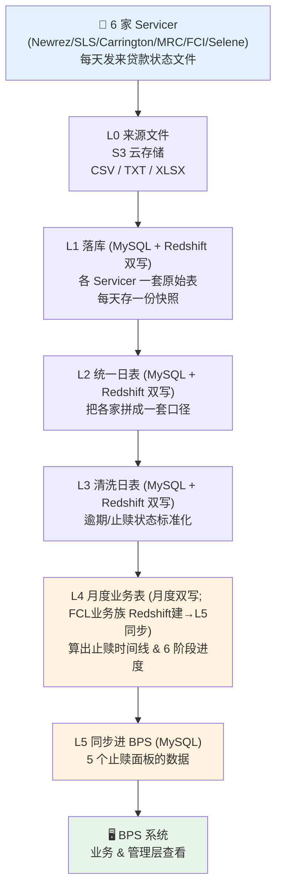
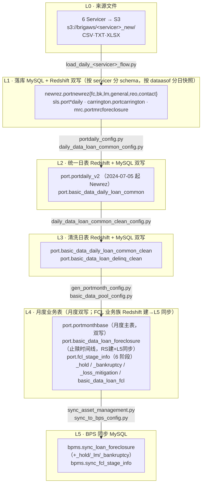

# 20 · Foreclosure 数据流总览 + 讲解稿（来源 Servicer 文件 → BPS 系统）

---

## 文档信息

| 项目 | 内容 |
|------|------|
| **文档目的** | 站在最上层把 foreclosure（止赎）数据从**来源 Servicer 文件**到**最终进入 BPS 系统**的完整生产过程串成一条线；并**从业务角度解释「数据为什么这样建模/处理」**（如：一个 foreclosure 为何会有多条 Hold 记录）。便于**向同事讲解整个数据流**，既给全貌，也给每个处理决策背后的**业务理由**。 |
| **解决的问题** | 既有文档库（doc 01–19）把每一层拆得很细，但缺一篇把五层 ETL 串起来、并**用业务逻辑解释处理动机**的总览。本文填补这个空白，是整个文档库的**推荐第一篇**。 |
| **覆盖范围** | ✅ 端到端数据流五层（L0 来源文件 → L5 BPS 同步）的全景、每层职责、负责代码文件、验证方法；✅ **「数据为什么这样处理」业务理由**（§A.6）+ 讲解脚本 + Q&A。❌ 不重复各层字段级细节（→ doc 21）；❌ 不含 BPS 系统内部逻辑。 |
| **系统归属** | `C:\Users\jli\MyData\Copilot\PrefectFlow`（Prefect 2.x 抵押贷款服务 ETL 系统）。本仓库 ForeclosureRule2 是对该系统的逆向工程文档。 |

**目标读者：** 主要——数据工程师，以及需要**向同事讲解整个数据流**的成员；次要——新成员、未来 AI 会话。

**修订历史：**

| 日期 | 作者 | 版本 | 变更内容 | 关联 |
|------|------|------|---------|------|
| 2026-06-06 | AI Agent (Claude Opus 4.8) | v1 | 初版：五层总览 + 讲解脚本 + 概念桥 + 代码定位地图 + 样本 loan 走查 | doc 01/02/12/13/17/18/19 |
| 2026-06-06 | AI Agent (Claude Opus 4.8) | v2 | 代码实读修正 L2/L3（fcl_flag 非归一、days360 口径、delinq 实测集、ghost 列位置、4:35 调度不在码内）；样本 SQL 列名修正并加实测值；概念桥改为"仅供个人理解、正式讲解跳过"、口播去中国银行；接入 doc 21 | PrefectFlow 源码 · doc 21 |
| 2026-06-06 | AI Agent (Claude Opus 4.8) | v3 | 读者定位改为**面向同事讲解**；Part A 重定基调；**新增 §A.6「数据为什么这样处理（业务理由）」**（10 条，多 Hold 打头，依据 doc 17/18/10） | doc 17/18/10 · doc 21 |
| 2026-06-06 | AI Agent (Claude Opus 4.8) | v4 | **更正落库为 MySQL+Redshift 双写**（原写"MySQL"不准）：A.1/A.2/B.1 全景与 B.2 各层补"落库 DB"，**新增 §B.6 每层落库目标代码证据表**；L1–L4 多数双写、FCL 业务族 Redshift 建+L5 同步——均带 PrefectFlow file:line + MCP 实测 | PrefectFlow 源码 · mysql_prod/redshift 实测 |

**依赖文档：** 本文是「索引 + 串讲」，结论性细节以下列文档为准——
doc 01（源表）· 02（ETL 五层）· 03（状态逻辑）· 10（术语）· 12（BPS 同步代码）· 13（BPS 界面字段映射）· 17（FCL 业务入门）· 18（LM 业务入门）· 19（样本 loan 原始 dump）。

**术语速查：** FCL=Foreclosure 止赎 · BK=Bankruptcy 破产 · LM=Loss Mitigation 损失缓解 · REO=Real Estate Owned 已收回房产 · delinq=逾期状态码 · Servicer=贷款服务商 · BPS=Business Planning System 下游业务系统。完整定义见 [doc 10](10_glossary.md)。

---
---

# Part A — 业务视角：数据为什么这样生产与建模

> 给同事讲解时用：直接用 FCL/LM/BK/REO 等术语，重点讲**全貌**与**每个处理决策的业务理由**。先看 A.1–A.2 拿到全景，**A.6 是核心**——逐条回答"数据为什么这样处理"（含"一个 FCL 多条 Hold"这类问题）。

## A.1 一句话总览

> **每天，给我们做贷款催收/服务的 Servicer（服务商）把贷款最新状态打包成文件发过来；我们把这些来自不同 Servicer、格式各异的文件逐层清洗、标准化，算出每一笔贷款的止赎进展（走到哪一步、欠多久、有没有破产或在谈减损方案），最后推送到 BPS 系统，供业务和管理层查看。整个过程每天自动跑一遍。**

再说白一点：来源数据口径五花八门，我们做的就是把它们**对齐成一套统一口径**、算出每笔贷款的「止赎处置进度」，再录入下游业务系统供查看。

## A.2 全景图（一页看懂）



**极简版（只记 5 个框）：**

```
来源文件  →  落库&统一  →  清洗标准化  →  算止赎进度  →  推送 BPS
 (Servicer)   (L1-L2)        (L3)          (L4)          (L5)
```

## A.3 概念对照表（⚠️ 仅供个人理解；正式讲解时**跳过本节**）

> 若讲解对象不熟悉中国银行业务，**讲解时不要提中国银行**。下面这张「中国银行 ↔ 美国房贷」对照表**只是个人辅助**（给熟悉中国银行存贷款的人）快速迁移概念用；正式场合直接用美国房贷术语即可（FCL/BK/LM/REO 等，定义见 [doc 10](10_glossary.md)）。

| 你熟悉的（中国银行） | 这里的（美国房贷） | 说明 |
|---|---|---|
| 逾期天数分档（M1/M2/M3…） | **delinquency 逾期码**：C（正常）/ D30 / D60 / D90 / D120P（120 天以上） | 我们用 MBA（美国抵押银行协会）口径，按逾期天数分档；超过 120 天进入重度逾期 |
| 不良贷款进入司法处置 | **FCL = Foreclosure 止赎** | 银行依法收回并拍卖抵押房产的法律程序 |
| 抵债资产 / 已收回资产 | **REO = Real Estate Owned** | 止赎拍卖后房子归到债权人名下 |
| 展期、重组、减免 | **LM = Loss Mitigation 损失缓解** | 还款修改、宽限、短售等避免止赎的方案 |
| 借款人破产保护 | **BK = Bankruptcy 破产** | 美国 Chapter 7 / Chapter 13；会暂停止赎 |
| 诉讼 vs 非诉处置 | **司法州 vs 非司法州止赎** | 司法州走法院（慢）；非司法州按合同直接拍卖（快） |
| 实际天数 / 360 天计息惯例 | **days360** | 按 30/360 惯例算两个日期间隔的天数 |
| 外包催收/资产服务公司 | **Servicer 服务商** | 替投资方做日常贷款服务与催收的公司 |
| 总行管理报表系统 | **BPS = Business Planning System** | 我们的下游业务/管理系统 |

> 想深入这些业务概念：止赎看 [doc 17](17_foreclosure_business_primer.md)，减损看 [doc 18](18_loss_mitigation_business_primer.md)，术语看 [doc 10](10_glossary.md)。

## A.4 10–15 分钟讲解脚本（逐段要点）

> 讲解骨架（用于给同事讲解），每段对应全景图一段；术语直接用。讲到"为什么这样处理"时下钻 A.6。

**① 开场（30 秒）**
> "我们公司是资产管理公司，手里管着一批美国住房抵押贷款。日常的贷款服务和催收外包给了几家 Servicer。我要讲的，是这些贷款的**止赎相关数据**每天怎么从 Servicer 一路流到我们的 BPS 系统。整个流程分五层，每天凌晨自动跑一遍。"

**② 来源：Servicer 文件（1–2 分钟）**
> "源头是 6 家 Servicer——Newrez（前身 Shellpoint）、SLS、Carrington、MRC、FCI、Selene。它们每天把贷款最新状态导成文件（CSV/TXT/Excel），上传到我们的 S3 云存储。难点是：每家口径都不一样——同样表示『这笔在止赎中』，Newrez 用一个 0/1 标志，SLS 用 Y/N，Carrington 写 'Active'。所以不能直接用，必须先对齐。"

**③ 落库 + 统一（2 分钟）**
> "第一步，把每家的文件原样落库，每家一套自己的表，而且**每天存一份快照**，这样历史可追溯。注意：我们是**双写**——同一份数据**同时落进 MySQL 和 Redshift 两套库**（Redshift 供分析，MySQL 供应用/BPS 查询）。第二步，把 6 家的表拼成一套统一口径的日表（同样在 Redshift 与 MySQL 各建一份）——这时『止赎标志』『逾期状态』这些字段就被翻译成了我们内部统一的写法。"

**④ 清洗标准化（2 分钟）**
> "接着做清洗：把各家五花八门的逾期描述，统一成标准逾期码——正常、逾期 30/60/90/120 天以上、止赎、REO、已还清等。除了止赎/REO/已还清这几类直接判定外，其余贷款一律用 days360（30/360 天数惯例）按『下次应还款日到报告日』的天数自动分档。这一层保证『同一个状态，全公司一个口径』。"

**⑤ 算止赎进度（3 分钟，重点）**
> "这是业务含金量最高的一层。我们按月对每笔贷款拍快照，并专门为止赎贷款算出**完整时间线**：它走到了哪个阶段、每个阶段花了多久、中间有没有因为减损或法院延期而暂停。止赎被拆成 6 个阶段——催告(Demand) → 移交律师(Referral) → 首次法律行动(First Legal) → 文书送达(Service) → 法院判决(Judgement) → 拍卖(Sale)。同时还把**破产、减损、Hold（暂停）**这些关联信息整理成配套的表。这样业务就能回答『这笔为什么卡这么久』。"

**⑥ 推送 BPS（1–2 分钟）**
> "最后一步，把算好的结果从数据仓库同步进 BPS 系统的数据库。BPS 上的止赎模块有 5 个面板——主时间线、Hold 历史、减损周期、破产记录、阶段汇总——每个面板对应一张同步表。这一步每天凌晨约 4:35（美东时间）自动跑，并记录同步状态以便排查。"

**⑦ 收尾（30 秒）**
> "整条链路全自动、每天一遍、每步可验证。源头数据我们留了每日快照能追溯到任意一天；BPS 上看到的是最新结果。如果某笔贷款显示异常，我们能从 BPS 一路倒查回 Servicer 的原始文件那一天的值。"

## A.5 常见问题（Q&A）

| 可能被问到 | 简短回答 |
|---|---|
| **数据多新？** | 每天凌晨自动更新一次；BPS 上看到的是最近一次跑批的结果（约美东 4:35 完成）。 |
| **准不准、可信吗？** | 每层都可用数据库只读查询核对。我们能拿一笔具体贷款，把它在「源文件 → 清洗后 → BPS」三处的值逐一比对（见 Part B 样本走查）。 |
| **能追溯历史吗？** | **源头**（Servicer 原始表）保留每日快照，可复现任意一天的原始值。但 **BPS 同步表是覆盖刷新**——只反映最新一次，历史快照不在 BPS 里。要看历史得回到源头层。 |
| **某笔为什么显示在止赎/卡住？** | 看 L4 的止赎时间线和 6 阶段表：能看出卡在哪个阶段、是否因 Hold/减损/破产而暂停。 |
| **dev 和 prod 数据为什么不一样？** | 测试库数据会滞后（可能停在几个月前）；对外口径一律以 prod 为准。 |
| **这套是我们自己建的还是买的？** | 自建，基于 Prefect 编排（PrefectFlow 代码库），所有清洗/计算逻辑都在我们代码里、可控可改。 |
| **换一家新 Servicer 难吗？** | 主要工作是在 L1/L2 为新家写一套「字段对齐」映射；后面 L3–L5 是统一口径，基本复用。 |

---

## A.6 数据为什么这样处理（业务理由）⭐ 核心

> 本节解释的不是"怎么做"，而是"**为什么这样建模/处理**"。下表每行＝**一个数据事实/处理决策 ← 背后的业务原因**（依据 doc 17/18/10），并指到对应表/字段。**第 1 行就是常被问到的"一个 FCL 多条 Hold"。**

| # | 数据事实 / 处理决策 | 业务理由（为什么必须这样） | 落到哪（表/字段） |
|---|---|---|---|
| 1 | **一个 foreclosure 有多条 Hold 记录**（1:N，宽表 4 槽→长表多行） | 止赎启动后会因**破产自动中止、在谈减损、法院延期、HUD/COVID、军人保护(SCRA)**等**反复暂停又恢复**；每个暂停是一段独立事实，必须各记一条、留全历史，不能合并（doc17 §4.2/4.3/5.4） | `portnewrezfc.fchold1..4*` → `_hold` → `bpms.sync_loan_foreclosure_hold`（长表）；doc21 §0.3 |
| 2 | **阶段天数要扣 `in_lm_days` / `on_hold_days`** | 合规时钟（FNMA/FHLMC 超期处罚）只追究**贷款方可控**的拖延；借款人引起的暂停（BK/在谈 LM）期间止赎**法律上没在推进**，不能算进耗时，否则会被错误判超期（Target/Actual/Var，doc10） | `fcl_stage_info.{stage}_in_lm_days/_on_hold_days`（区间重叠分摊） |
| 3 | **一笔贷款有多轮 LM cycle**（1:N） | 监管（CFPB 12 CFR 1024.41）要求止赎前评估救济；且方案会**升级/切换**（Evaluation→Modification→Short Sale/DIL）、反复补件重申——每一轮是独立 cycle（doc18 §5） | `portnewrezlm` → `_loss_mitigation`（按 `(loanid,dealstartdate)`） |
| 4 | **逾期统一成 MBA 码（C/D30/…/D120P）+ days360** | 不同 servicer/投资人/监管口径不一，必须对齐到 **MBA 行业标准**才可比；`days360`（30/360 惯例）是行业通用天数算法，保证跨机构一致（doc17 §2/§3） | L3 `…_clean.delinq`（CASE+days360） |
| 5 | **FCL 不能由逾期天数推导（days360 永不产 FCL）** | FCL 是**法律程序状态**，与"欠多久"正交：欠 200 天(D120P)若在谈 Mod 可**不进 FCL**；仅欠 60 天(D60)若已申请止赎则**已是 FCL**。故 FCL 必须由 servicer **显式标注**（doc17 §2） | `delinq` 的 FCL 仅来自 servicer 标志，非 days360 |
| 6 | **FCL / LM / BK 建成并存的独立维度**（多标志，非单一状态枚举） | 它们是**并发**的业务过程：可"FCL 进行中 + 在谈 DIL"，也可"FCL 被 BK 暂停"；且 MBA delinquency 里 Bankruptcy 与 Foreclosure **互斥**，必须独立 `bankruptcy_flag` 才能表达并存（doc18 §1 / doc10） | `delinq` / `activefcflag` / `lm_flag` / `bankruptcy` 四维并存 |
| 7 | **BK 暂停止赎、MFR 恢复；BK 可多次** | 破产**自动中止令**(11 USC §362)联邦强制停止一切催收含止赎→止赎进 Hold；债权人提 **MFR** 解除后才恢复；借款人可被驳回后**再申请**（doc17 §5.4 / doc10） | `_bankruptcy`（多次→多行）；`fchold='Bankruptcy'` |
| 8 | **止赎时间线必须按州区分司法/非司法** | 时长差≈6 倍：司法州 12 月–3 年、非司法 2–6 月，且赎回期不同。同是 `FCL`，纽约可能 2 年、加州 3 月——存量/Loss Severity/合规超期**必须按州**（doc17 §4.5） | `fcl_stage_info.judicial`/`state`、`summary_judicial_foreclosure` |
| 9 | **退出原因要独立编码**（Reinstated / LM / Paid in Full / Process Complete / Deed in Lieu / REO / 3rd-Party） | 每种退出的**损失与后续流程不同**：复权=零损失、短售=豁免差额损失、REO=需长期持有运营、DIL=免拍卖交房——必须区分以做损失与运营分析（doc17 §5.3） | `summary_foreclosure_status`（=`Closed Foreclosure:<fcremovaldesc>`） |
| 10 | **源每日快照、BPS 覆盖刷新** | 源留**每日快照**可追溯任意一天（源数据偶有回跳，需可复现）并支持 `to_sale_days` 倒计时；BPS 只需展示**最新态**故覆盖刷新；多轮尝试用 `(loanid, deal_start)` 作 episode 键区分（doc17 §1 / doc18 §5） | L1 `dataasof` 快照；`bpms.sync_*`（覆盖） |

> 一句话总括：**foreclosure 数据不是单一状态，而是几条并发业务过程（逾期度量 / 止赎法律程序 / 减损谈判 / 破产介入）的多维记录**——这就是为什么有多条 Hold/多轮 LM/多次 BK、为什么要扣暂停天数、为什么按州区分、为什么 FCL 不由天数算。详细粒度/ERD 见 [doc 21](21_fcl_field_lineage.md) §0.3–0.5；业务原文见 [doc 17](17_foreclosure_business_primer.md)/[doc 18](18_loss_mitigation_business_primer.md)。

---
---

# Part B — 你自己的深入版

> 这一部分给你（和数据团队）：每层在**哪段代码**、产出**哪张表**、怎么**自己核实**。代码路径指向 PrefectFlow 仓库（`C:\Users\jli\MyData\Copilot\PrefectFlow`）。

## B.1 详细全景图（带平台 / 主表 / 代码）



## B.2 逐层 walkthrough

> 每层固定 5 项：**做什么 · 输入 · 输出表 · 负责代码 · 怎么自己核实**。

### L0 — 来源文件（Servicer → S3）
- **做什么**：6 家 Servicer 每天把贷款最新状态导成文件上传 S3；不同家格式/口径不同。
- **输入**：Servicer 业务系统导出。
- **输出**：S3 对象，路径形如 `s3://brigaws/<servicer>_new/`（如 `shellpoint_new/`、`sls_new/`）。
- **负责代码**：`flow/basic_data/load_daily_data_flow/load_daily_{shellpoint,sls,carrington,mrc,fci,selene}_flow.py`。
- **怎么核实**：见 [doc 01](01_source_data.md) 各家文件类型与字段；S3 文件名/下载用项目里的 `check_s3*.ipynb` / `download_from_s3.ipynb`（prompt.md 有用例）。

### L1 — 落库（**MySQL + Redshift 双写**，原始分层，按日快照）
- **做什么**：把每家文件原样写入各自 schema 的原始表，**按 `dataasof` 保留每日快照**（可追溯）。
- **落库 DB（代码实证）**：**两套库都写**。每家有两条 load flow——`update_<svc>_daily_to_mysql(save_to_new=True)`→MySQL、`update_<svc>_daily_to_redshift(save_to_new=False)`→Redshift（`flow/basic_data/load_daily_data_flow/load_daily_shellpoint_flow.py:9-47`）；分流在 `tasks/servicer_data/servicer_task.py:158-163`（`if save_to_new: upload_data_to_mysql else: upload_data_to_redshift`）；实际写库 `tasks/servicer_data/daily_task.py`（`upload_data_to_mysql` :923-942 用 `to_sql` / `upload_data_to_redshift`→`dml_redshift` :960-983 用 redshift_uploader）。MySQL 目标 schema 见 `MYSQL_DB_MAP`（`servicer_config.py:374-387`：shellpoint→`newrez`）。**MCP 实测：`newrez.portnewrezfc` 在 mysql_prod 与 redshift 均存在。**
- **输入**：L0 的 S3 文件。
- **输出表（FCL 相关；MySQL 与 Redshift 同名各一份）**：
  - Newrez：`newrez.portnewrezfc`（止赎里程碑/Hold/退出原因）、`portnewrezbk`（破产）、`portnewrezlm`（减损）、`portnewrezgeneral`（MBA 逾期状态，关键字段 `delinquency_status_mba`）、`portnewrezreo`、`portnewrezcontact`。
  - SLS：`sls.portassetdaily / portfcldaily / portbkdaily / portlmdaily`。
  - Carrington：`carrington.portcarrington`（单宽表）；MRC：`mrc.portmrcforeclosure`。
- **负责代码**：各家 load flow + 建表 DDL（`statistics_script/*_daily.sql`）。
- **怎么核实（只读 SQL，mysql_prod）**：
  ```sql
  -- 看某 loan 的源始快照（doc 19 用的样本之一）
  SELECT loanid, dataasof, activefcflag, fcreferraldate, fcscheduledsaledate
  FROM newrez.portnewrezfc WHERE loanid='7727000088' ORDER BY dataasof DESC LIMIT 5;
  ```
  > ⚠️ 历史命名：Newrez 表前身为 `portshellpoint*`，2024-07-05 改名为 `portnewrez*`（见 doc 01）。

### L2 — 统一日表（**Redshift + MySQL 双写**，把各家拼成一套口径）
- **落库 DB（代码实证）**：**双写**。plain 配置→Redshift `port.basic_data_daily_loan_common`（`transfer_daily_data_config/daily_data_loan_common_config.py:1,5,97`，含 `ENCODE az64/DISTSTYLE` Redshift 语法）；`mysql_` 配置→MySQL `port.basic_data_daily_loan_common`（`mysql_daily_data_loan_common_config.py:5,94`，MySQL 语法 `PERIOD_DIFF/TIMESTAMPDIFF`）。两条 flow：`transfer_daily_data_flow/gen_daily_data_loan_common_flow.py`（Redshift :17-48 `execute_sql(...,REDSHIFT,...)`；MySQL :52-84 `execute_sql(...,MYSQL,'port')`）。**MCP 实测：两库均存在该表。**
- **做什么**：`UNION ALL` 各家 staging 成一套统一日表，把逾期描述、`lm_flag`、`bankruptcy` 等对齐成统一字段。
  > ⚠️ **代码实测更正**：本层的 `fcl_flag` 列是**直传、未做跨 servicer 归一**——Newrez/SLS 该列恒为 `NULL`，Carrington/Selene/MRC 直传各自原值。止赎口径其实是在 **L3 的 `delinq` CASE** 里判定（`'Foreclosure'/'Foreclosure / *BK'`→`FCL`；Carrington 还看 `fcl_flag='Active'`）。真正把 `activefcflag`(Newrez 0/1) 等跨家归一的，是另一条 **FCL 业务族支线**（L4 `basic_data_pool_config.py`，见 doc 21），不在这张统一日表里。
- **输入**：L1 全部 staging 表。
- **输出表**：`port.portdaily_v2`（2024-07-05 起取 Newrez，之前取 SLS）、`port.basic_data_daily_loan_common`（6 家统一）。
- **负责代码**：`flow/.../portdaily_config.py`、`flow/.../transfer_daily_data_config/daily_data_loan_common_config.py`。
- **怎么核实**：见 [doc 02](02_etl_pipeline.md) L2 节；redshift_dev 查 `port.basic_data_daily_loan_common` 的 `fcl_flag/lm_flag/delq_status` 列。字段级血缘见 [doc 21](21_fcl_field_lineage.md)。

### L3 — 清洗日表（**Redshift + MySQL 双写**，状态标准化）
- **落库 DB（代码实证）**：**双写**。Redshift `port.basic_data_daily_loan_common_clean`（`daily_data_loan_common_clean_config.py`）+ MySQL 同名（`mysql_daily_data_loan_common_clean_config.py`）；两条 flow `gen_daily_data_loan_common_clean_flow.py`（Redshift :78-139 / MySQL :186-243）。**MCP 实测：两库均存在该表。**
- **做什么**：把各家逾期文字描述 → 标准 `delinq` 码。逐家一个 CASE：`'Foreclosure*'`→`FCL`、`'REO'`→`REO`、`'Full Payoff/Paid in Full/Completed*'`→`P`，**其余一律走 `days360(nextduedate, fctrdt)` 分档**（`<30`→`C`、`<60`→`D30`、`<90`→`D60`、`<120`→`D90`、`≥120`→`D120P`）。
  - **DB 实测现存 `delinq` 值**：`C / D30 / D60 / D90 / D120P / FCL / REO / P / VASP`（`VASP` 为一次性回填，无 `REPUR`/独立 `D`；完整枚举见 doc 04）。
  - `bankruptcy`（Y/N）在本层按 `delq_status` 文本含 `Bankruptcy` 派生；`lm_flag` 来自 L2。
- **输入**：`port.basic_data_daily_loan_common`。
- **输出表**：`port.basic_data_daily_loan_common_clean`（含 `delinq/svcdelinq/bankruptcy/monthindelinq`）；另有 `port.basic_data_loan_delinq_clean`（逾期细节表，DB 实测含 `delinq_source / is_ghost_payoff / ghost_reason / ots_delinq / prevdelinq`，由本支线另一段代码生成）。
- **负责代码**：`flow/.../transfer_daily_data_config/daily_data_loan_common_clean_config.py`（`days360` 为 Redshift 内置函数，直接调用）。
- **怎么核实**：标准化规则见 [doc 03](03_fcl_status_logic.md) / 状态枚举见 [doc 04](04_status_inventory.md)；`delinq` 码定义见 [doc 10](10_glossary.md)；字段级血缘见 [doc 21](21_fcl_field_lineage.md)。

### L4 — 月度业务表（算止赎进度）⭐ 业务核心
- **落库 DB（代码实证，分两类）**：
  - **月度通用表 / portmonthbase = 双写**：`monthly_data_loan_common_config.py`(Redshift) + `mysql_monthly_data_loan_common_config.py`(MySQL)，flow `gen_monthly_data_loan_common_flow.py:24-30(RS)/78-84(MySQL)`；portmonthbase 由 `gen_portmonth_v4.py:45-46`(RS) + `gen_portmonth_mysql.py:42-43`(MySQL) 分别建。
  - **FCL 业务族（`basic_data_loan_foreclosure`/`fcl_stage_info`/`_hold`/`_loss_mitigation`/`_bankruptcy`）= 仅在 Redshift 构建**（`basic_data_pool_config.py`，目标 `{REDSHIFT_PORT}.`）；**其 MySQL 副本由 L5 同步产生**（无 `mysql_` 池配置）。**MCP 实测：`port.basic_data_loan_foreclosure` 在两库都有**（Redshift 建、MySQL 经 L5 同步）。
- **做什么**：按月对每笔贷款拍快照（`port.portmonthbase`）；并构建 **FCL 业务族**——止赎时间线、6 阶段、Hold/破产/减损配套表。
  - **6 阶段**：DEMAND → REFERRAL → FIRST_LEGAL → SERVICE → JUDGEMENT → SALE，每阶段算 `start/end/stage_days/in_lm_days/on_hold_days`（减损/Hold 期间会从阶段耗时里扣除）。
- **输入**：L3 清洗日表 + 月度 remit 等。
- **输出表**：
  - `port.portmonthbase`（月度主分析表）
  - `port.basic_data_loan_foreclosure`（止赎时间线 / 23 里程碑日期 / 退出原因）
  - `port.fcl_stage_info`（6 阶段进度）
  - `port.basic_data_loan_foreclosure_hold / _bankruptcy / _loss_mitigation`、`basic_data_loan_fcl`、`basic_data_fcl_related`、`basic_data_loan_reo`
- **负责代码**：`flow/.../gen_portmonth_config.py`（月度主表）、**`flow/basic_data/basic_data_config/basic_data_pool_config.py`**（FCL 全部业务表的核心，2400+ 行）。
- **怎么核实**：止赎字段映射/计算规则见 [doc 13](13_newrez_fcl_bps_display_mapping.md)；阶段口径见 doc 13 §7 与 [doc 16](16_bps_panel_quickref.md)。

### L5 — 同步进 BPS（Redshift → MySQL）
- **做什么**：`sync_asset_management.py` 两阶段——
  1. `gen_basic_data()`：跑 ~10 步 SQL 在 Redshift 建好 FCL 中间表；
  2. `sync_res_funding()`：按 `SYNC_TABLE_MAP`（13 个 sync key）把结果写进 BPS。
- **输入**：L4 的 Redshift 业务表。
- **输出表（FCL 5 面板，及各自入库过滤条件）**：

  | sync key | BPS 表 | 入库过滤（哪些 loan 进） | 源 |
  |---|---|---|---|
  | 5-FORECLOSURE | `bpms.sync_loan_foreclosure`（主时间线） | `fcreferraldate IS NOT NULL` | `port.basic_data_loan_foreclosure` |
  | 10-FORECLOSURE_HOLD | `bpms.sync_loan_foreclosure_hold` | `fchold1startdate IS NOT NULL` | `_hold` |
  | 8-FORECLOSURE_LM | `bpms.sync_loan_foreclosure_loss_mitigation` | `dealstartdate IS NOT NULL` | `_loss_mitigation` |
  | 9-FORECLOSURE_BK | `bpms.sync_loan_foreclosure_bankruptcy` | `bkstatus` 非空 | `_bankruptcy` |
  | 12-FCL_STAGE | `bpms.sync_fcl_stage_info`（阶段汇总） | `activefcflag=1 AND fcremovaldate IS NULL` | `port.basic_data_loan_fcl` |

  > 5-FORECLOSURE 是两步写：先清+插到 MySQL 中转表 `port.basic_data_loan_foreclosure`，再 `INSERT … ON DUPLICATE KEY UPDATE` 进 `bpms.sync_loan_foreclosure`（见 `df_db_util.py`）。
- **调度/状态**：每日定时跑（运维口径约 **4:35 ET**——但调度配置在 Prefect 服务端，**不在版本库代码内**，故以运维为准）；状态写 `port.sync_to_bps_status`（servicer / 记录数 / 最大 asofdate），由 `df_db_util.py` 的状态装饰器在每次同步成功/失败时落记。
- **负责代码**：`sync_asset_management.py`、`flow/bps/bps_config/sync_to_bps_config.py`（`SYNC_TABLE_MAP`）、`asset_managment_config.py`（取数 SELECT + `UPDATE_FORECLOSURE` upsert）、`df_db_util.py`（`sync_to_mysql` / `update_to_mysql`）。
- **怎么核实**：代码逐段解读见 [doc 12](12_sync_asset_management.md)；BPS 界面 ↔ 字段映射见 [doc 13](13_newrez_fcl_bps_display_mapping.md) / [doc 16](16_bps_panel_quickref.md)；字段级血缘+转换规则见 [doc 21](21_fcl_field_lineage.md)。
  > ⚠️ **BPS 同步表是覆盖刷新**：`fctrdt` 是最近一次跑批的刷新日，历史快照不可在 BPS 复现。要历史回 L1 源表。

## B.3 代码定位地图（层 → 代码 → 文档 → 验证）

| 层 | PrefectFlow 关键文件 / 函数 | 解释它的本仓库 doc | 验证方式（只读） |
|---|---|---|---|
| L0 | `load_daily_data_flow/load_daily_*_flow.py` | doc 01 | S3 `check_s3*.ipynb` |
| L1 | 各家 load + `*_daily.sql` 建表 | doc 01 | mysql_prod 查 `newrez.portnewrez*` 等 |
| L2 | `portdaily_config.py`、`daily_data_loan_common_config.py` | doc 02 | redshift_dev 查 `port.basic_data_daily_loan_common` |
| L3 | `daily_data_loan_common_clean_config.py` | doc 03 / 04 / 10 | redshift_dev 查 `*_clean` 表的 `delinq` |
| L4 | `gen_portmonth_config.py`、**`basic_data_pool_config.py`** | doc 13 / 16 | redshift_dev 查 `port.fcl_stage_info`、`basic_data_loan_foreclosure` |
| L5 | `sync_asset_management.py`、`sync_to_bps_config.py`、`asset_managment_config.py`、`df_db_util.py` | doc 12 / 13 | mysql_prod 查 `bpms.sync_loan_foreclosure*` |

## B.4 跟读路径（想从零读懂的顺序）

```
全貌入门：     20（本文）→ 02
业务背景：     17（止赎）→ 18（减损）→ 10（术语）
数据如何生产： 01（源）→ 02（管道）→ 03（状态逻辑）→ 04（状态枚举）
止赎进 BPS：   12（同步代码）→ 13（界面字段映射）→ 16（面板速查）
眼见为实：     19（样本 loan 原始 dump）→ 14（接口规范）
```

## B.5 用一笔样本贷款走一遍（眼见为实）

doc 19 准备了 5 笔典型样本贷款的逐字段原始 dump：

| 样本 | loanid | 特征 |
|---|---|---|
| Loan 1 | `7727000088` | 司法州(FL) · JUDGEMENT 阶段 · Hold×7 · LM×9（最复杂） |
| Loan 2 | `7727000672` | 非司法州(MI) · REFERRAL 阶段 |
| Loan 3 | `7727004200` | 司法州(IL) · SALE 阶段 |
| Loan 4 | `7727000065` | 破产 + Hold×4 + 已完结 REO |
| Loan 5 | `7727000010` | Chapter 13 活跃破产（未进 FCL 管道） |

**演示：同一笔贷款，在三层各看到什么（以 Loan 1 `7727000088` 为例）**

```sql
-- L1 源（MySQL，可按日快照）：最新一天的止赎原始字段
SELECT t.loanid, t.dataasof, t.activefcflag, t.fcreferraldate, t.fcscheduledsaledate
FROM newrez.portnewrezfc t
JOIN (SELECT loanid, MAX(dataasof) md FROM newrez.portnewrezfc
      WHERE loanid='7727000088' GROUP BY loanid) m
  ON t.loanid=m.loanid AND t.dataasof=m.md;

-- L4 业务（Redshift）：算好的 6 阶段进度（月度快照，取最新一月）
SELECT loanid, fctrdt, demand_start_date, referral_start_date, first_legal_start_date,
       service_start_date, judgement_start_date, sale_start_date
FROM port.fcl_stage_info WHERE loanid='7727000088' ORDER BY fctrdt DESC LIMIT 1;

-- L5 BPS（MySQL，覆盖刷新）：业务在 BPS 看到的最终值
SELECT loanid, timeline_referred_to_foreclosure_date, summary_foreclosure_status,
       summary_judicial_foreclosure
FROM bpms.sync_loan_foreclosure WHERE loanid='7727000088';
```

**实测结果（2026-06-06，prod 库，证据链对得上）：**

| 层 | 关键值 |
|---|---|
| L1 `newrez.portnewrezfc` | `fcreferraldate=2025-05-23` · `activefcflag=0` · `fcscheduledsaledate=NULL` |
| L4 `port.fcl_stage_info` | `referral_start_date=2025-05-22` · demand/first_legal/service/judgement 各阶段日期齐全 · `sale_start_date=NULL`（未拍卖） |
| L5 `bpms.sync_loan_foreclosure` | `timeline_referred_to_foreclosure_date=2025-05-23` · `summary_foreclosure_status="Closed Foreclosure:Process Complete"` · `summary_judicial_foreclosure=1`（FL 司法州 ✓） |

> **源（5-23 移交）→ 计算（6 阶段时间线）→ BPS（已完结止赎）三处一致**——这就是回答「准不准、能不能追溯」最直接的证据链。逐字段对照（含 portnewrezfc/bk/lm/general 全字段）见 [doc 19](19_fcl_sample_loan_raw_dump.md)。

---

## B.6 每层落库目标：MySQL vs Redshift（代码证据）⭐

> 纠正常见误解：**不是只落 MySQL**。L1–L4 多数是 **MySQL + Redshift 双写**（Redshift 供分析、MySQL 供应用/BPS 直查）；只有 **FCL 业务族**是 Redshift 单建、再由 L5 同步到 MySQL。下表每条结论均**读 PrefectFlow 源码**得到（file:line），并经 **MCP 只读实测**对照两库表是否都存在。

| 层 | 落 MySQL? | 落 Redshift? | 代码证据（file:line） | MCP 实测 |
|---|---|---|---|---|
| **L1 原始落库** | ✅ | ✅ | 双 flow `load_daily_<svc>_flow.py:9-47`；分流 `servicer_task.py:158-163`；写库 `daily_task.py:923-942`(MySQL)/`:960-983`(RS)；`MYSQL_DB_MAP servicer_config.py:374-387` | `newrez.portnewrezfc` 两库都在 |
| **L2 统一日表** | ✅ | ✅ | plain→RS `daily_data_loan_common_config.py:5,97`；`mysql_…config.py:5,94`；flow `gen_daily_data_loan_common_flow.py:17-48(RS)/52-84(MySQL)` | `port.basic_data_daily_loan_common` 两库都在 |
| **L3 清洗日表** | ✅ | ✅ | `daily_data_loan_common_clean_config.py`(RS) / `mysql_…clean_config.py`(MySQL)；flow `gen_daily_data_loan_common_clean_flow.py:78-139(RS)/186-243(MySQL)` | `port.basic_data_daily_loan_common_clean` 两库都在 |
| **L4 月度通用 / portmonthbase** | ✅ | ✅ | `monthly_data_loan_common_config.py`(RS)/`mysql_monthly_…config.py`(MySQL)；`gen_monthly_data_loan_common_flow.py:24-30/78-84`；portmonthbase `gen_portmonth_v4.py:45-46`(RS)+`gen_portmonth_mysql.py:42-43`(MySQL) | RS 有 `portmonthbase`；MySQL 有 `basic_data_monthly_loan_common` |
| **L4 FCL 业务族**（foreclosure/stage/hold/lm/bk） | ⛔（由 L5 同步） | ✅（单建） | `basic_data_pool_config.py`（目标 `{REDSHIFT_PORT}.`，仅 Redshift；无 `mysql_` 池配置） | `port.basic_data_loan_foreclosure` 两库都在（MySQL 经 L5） |
| **L5 BPS 同步** | ✅（写） | ✅（读） | 读 RS `df_db_util.py:117-137 get_df_from_db`；写 MySQL `:665-699 sync_to_mysql`/`:702-726 update_to_mysql`；`sync_asset_management.py` | `bpms.sync_*`、`port.basic_data_loan_foreclosure`(中转) |

> **连接层判据**：`config/db_conn.py` 里 MySQL=`pymysql.connect`(:15-25)、Redshift=`redshift_connector.connect`(:26-34)；统一入口 `execute_sql(sql, DbTypeEnum.{MYSQL|REDSHIFT}.value, db)` 决定落哪库（`flow/__init__.py:19 REDSHIFT_PORT="port"`）。**为什么双写（观察推断）**：Redshift 跑重分析 SQL，MySQL 供 BPS/应用低延迟直查；二者表名相同、各存一份。

---

## 附：本文与既有文档的关系

本文不重复细节，只把它们串起来。需要钻进某一层时，按 B.3 / B.4 跳转：

- 源数据细节 → doc 01；管道分层 → doc 02；状态逻辑/枚举 → doc 03/04
- 业务概念 → doc 10/17/18；止赎进 BPS → doc 12/13/16；接口规范 → doc 09/14
- 眼见为实样本 → doc 19；可视化探索器 → `outputs/fcl_pipeline.html`

> 对应英文版：`docs/en/20_end_to_end_walkthrough.md`。
