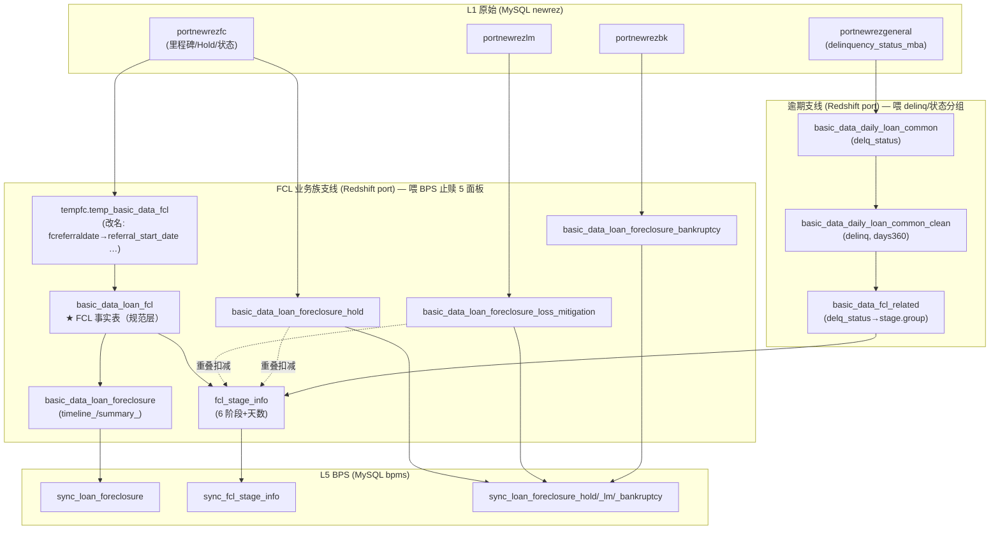

# 21 · Foreclosure 核心字段级数据血缘（来源字段 → 中间表 → 转换规则 → BPS 字段）

> ⚠️ **已弃用（superseded）** —— 本文档由 **doc 25（血缘总览/hub）+ doc 26–30（各 BPS sync 表逐字段血缘）** 取代。
> 新版按「一表一文档、一字段一行、固定跳列 + 每跳规则 + 代码出处」组织，由 `outputs/fcl_lineage_source.json` 生成（`python - < scripts/gen_fcl_lineage.py`），并对 prod（redshift_prod / mysql_prod）逐列核验。请改用 doc 25–30；本文档仅作历史保留。

---

## 文档信息

| 项目 | 内容 |
|------|------|
| **文档目的** | 把 foreclosure 核心字段从**来源 Servicer 原始列**一路追到 **BPS 系统列**，**逐字段**列出经过的**中间表**和**每一跳的转换规则**（SQL/CASE/decode/日期差）。所有规则均**读 PrefectFlow 源码**得到（Code-First），所有 `表.列` 均经 **MCP 只读实测**核验。 |
| **解决的问题** | doc 20 是总览、doc 13 偏 BPS 界面映射；本文是**端到端、代码级、可对账**的字段血缘，回答「这个字段到底从哪来、中间怎么变的」。 |
| **覆盖范围** | ✅ 约 30 个核心 FCL 字段：止赎里程碑日期 / 止赎状态与标志 / 6 阶段与天数 / Hold / Loss Mitigation / Bankruptcy / 逾期码。每字段给 L1→L5 全链路 + 转换规则 + 代码位置 + MCP 实测值。❌ 非 FCL 的资金/估值字段；❌ BPS 系统内部展示逻辑。 |
| **系统归属** | `C:\Users\jli\MyData\Copilot\PrefectFlow`。本文规则引用的源码文件见 §10。 |

**目标读者：** 主要——需要逐字段讲解/对账的数据工程师与数据团队成员；次要——新成员、未来 AI 会话。

> **📅 数据日期（统一声明）**：本文实测**均取自 prod**（`redshift_prod`/`mysql_prod`），无 dev。填充率/计数为**单一最新快照**口径：FCL 主表/阶段 as-of **2026-06-07**、Newrez 源 as-of **2026-06-08**（各表 as-of 见 doc 02 头部「数据日期」声明；统计块就近标注）。

**修订历史：**

| 日期 | 作者 | 版本 | 变更内容 | 关联 |
|------|------|------|---------|------|
| 2026-06-06 | AI Agent (Claude Opus 4.8) | v1 | 初版：~30 核心字段 L0→L5 血缘 + 转换规则（代码实读 + MCP 实测） | doc 20/13/12/02/19；PrefectFlow 源码 |
| 2026-06-06 | AI Agent (Claude Opus 4.8) | v2 | 增 §0.3 业务粒度/一对多（Hold/LM/BK=1:N，MCP 实测行数）+ §1.1 字段业务含义速查 + 各组「📖 业务含义」（口径对齐 doc 17/18/10） | doc 17/18/10 |
| 2026-06-06 | AI Agent (Claude Opus 4.8) | v3 | §0.3 补多对一 N:1（deal→2461 loan）与多对多 N:N（阶段↔Hold/LM，loan 7727000672 一 Hold 跨 4 阶段）+ 确认 loan↔funding=1:1/主表 1 行每贷款；均 MCP 实测 | MCP 实测 |
| 2026-06-06 | AI Agent (Claude Opus 4.8) | v4 | 新增实体关系图（Mermaid ERD，现 §0.5）：18 张 FCL 表，标 PK/逻辑粒度键（MCP 实测）+ 关键业务/转换字段 + 1:1/1:N/N:N 关系 + 主键速查表 | MCP 实测 |
| 2026-06-06 | AI Agent (Claude Opus 4.8) | v5 | 新增 §0.4「数据为什么这样建模/处理（业务理由）」（10 条，与 doc 20 §A.6 同源）；ERD 顺延 §0.5；读者措辞中性化 | doc 17/18/10 · doc 20 |
| 2026-06-06 | AI Agent (Claude Opus 4.8) | v6 | **双家做深 + DB 实测**：新增 §1.2 填充率/DB验证矩阵（prod 实测）· §6 Carrington 专线（里程碑/状态/天数/Hold/BK 各跳规则+行号+实测）· §7 跨 Servicer 对比（FCL 识别 / 里程碑来源 / delinq·bankruptcy CASE）· §8 一个字段的完整 SQL 路径（Newrez+Carrington 可对账）；原 §6/§7 顺延为 §9/§10；§9 填回 OQ#7（`basic_data_loan_delinq_clean` 生成代码**不在 PrefectFlow 版本库**，grep 实证）+ Carrington 特有坑；全部 `表.列` 经 information_schema 全量核验、Carrington 样本 `7727000858` L1→L4→L5 实测贯通 | mysql_prod / redshift_prod 实测；PrefectFlow 源码 |
| 2026-06-06 | AI Agent (Claude Opus 4.8) | v7 | §0.2 补「落库 DB：MySQL+Redshift 双写」说明（L1–L4 多数双写、FCL 业务族 Redshift 建+L5 同步）；代码证据表见 doc 20 §B.6 | PrefectFlow 源码 · doc 20 |
| 2026-06-08 | AI Agent (Claude Opus 4.8) | v8 | 用词正式化：§7 引导句改为「本节三张表回答的问题：…」式表述、§6 引导句去除口语化措辞，统一为正式、目的导向的语言 | — |
| 2026-06-08 | AI Agent (Claude Opus 4.8) | v9 | 在 §0.3 N:N 表下新增「术语」说明，于使用处定义 **FCL 阶段**（6 主阶段+8 桶+15 子阶段）与 **FCL episode**（一段止赎、`(loanid,deal_start)` 键、与 BK 的 N:N 理由）；§3 补 NOI/PUBLICATION 两桶说明；术语条目同步入 doc 10 | doc 10 · doc 13 · doc 17/18 |
| 2026-06-08 | AI Agent (Claude Opus 4.8) | v10 | §0.1 加注：`basic_data_monthly_loan_clean_data_delinq` 属 portmonth/逾期线、**不在任一 FCL 支线**；FCL 的 `group/delq_status` 由 `basic_data_fcl_related` 直接取原始 servicer 表（`basic_data_pool_config.py`/`flow/bps/` 0 引用，实测） | PrefectFlow 源码实测 · doc 02 |

**依赖：** [doc 20](20_end_to_end_walkthrough.md)（五层总览）· [doc 13](13_newrez_fcl_bps_display_mapping.md)（BPS 界面映射）· [doc 12](12_sync_asset_management.md)（同步代码）· [doc 19](19_fcl_sample_loan_raw_dump.md)（样本 dump）。

**关键限制（务必先读 §9）：** 部分 BPS 列是**直传**（真正转换在上一层）；个别原始列被**复用两次**；某些"set 日期"是从快照历史推断的 `min(dataasof)`；止赎状态文案无 decode 表（直接拼 `fcremovaldesc`）；4:35 ET 调度不在代码内；**Carrington 无 judicial/first_legal/judgement 映射（prod 实测全 NULL，见 §6/§7）**。

---

## 0 · 怎么读这张血缘 + 管道形状（中间表）

### 0.1 两条并行支线（关键！）

FCL 数据**不是**单一直线，而是**两条支线**汇入 BPS：



- **FCL 业务族支线**（喂 BPS 止赎面板）：`portnewrezfc/lm/bk` → 临时表 `tempfc.temp_basic_data_fcl`（**这里完成原始列→统一列改名**）→ **`port.basic_data_loan_fcl`（FCL 规范事实表，一切的源）** → `basic_data_loan_foreclosure` / `fcl_stage_info` / `_hold` / `_loss_mitigation` / `_bankruptcy` → `bpms.sync_*`。
- **逾期支线**：`portnewrezgeneral.delinquency_status_mba` → `basic_data_daily_loan_common.delq_status` → `basic_data_daily_loan_common_clean.delinq`（CASE + days360）；阶段表的 `group` 来自 `basic_data_fcl_related.delq_status`。

> ⚠️ 所以**止赎里程碑/状态字段走 FCL 业务族支线，直接从 `portnewrezfc` 取，不经 `basic_data_daily_loan_common`**。doc 20 的 L2/L3 主要描述逾期支线。

> ⚠️ **易混表名澄清**：`port.basic_data_monthly_loan_clean_data_delinq` **不属于以上任一 FCL 支线**，而是**月度组合/逾期分析线（portmonth）**上的表：`…clean_data_base → …clean_data_delinq → basic_data_monthly_loan_clean_data → portmonth → bpms.sync_portmonth`（喂 BPS「Delinquency」视图、`prevdelinqchar` 字符解码）。FCL 表的 `group/delq_status` 由 `basic_data_fcl_related` **直接取原始 servicer 表**算得（`CREATE_FCL_RELATE_ATTR`，`basic_data_pool_config.py:1695-1771`），**不读**任何月度 clean 表——实测 `basic_data_pool_config.py` 与 `flow/bps/` 对 `…monthly_loan_clean_data*` 均 **0 引用**。

### 0.2 中间表清单（DB 实测存在）

| 中间表 | 层 | 角色 |
|---|---|---|
| `tempfc.temp_basic_data_fcl` | L4 前置 | 3 家 servicer UNION + **原始列→统一列改名** |
| `port.basic_data_loan_fcl` | L4 | **FCL 规范事实表**；`basic_data_loan_foreclosure`/`fcl_stage_info` 都读它 |
| `port.basic_data_loan_foreclosure` | L4 | 止赎时间线 + summary；也是 5-FORECLOSURE 的 MySQL **中转表** |
| `port.fcl_stage_info` | L4 | 6 阶段 + 天数（LM/Hold 重叠扣减） |
| `port.basic_data_loan_foreclosure_hold/_loss_mitigation/_bankruptcy` | L4 | Hold/LM/BK 明细（含 datadic 解码） |
| `port.basic_data_fcl_related` | L4 | 提供 `delq_status`(→stage.group)、`propertystate` |
| `port.basic_data_daily_loan_common` / `_clean` | L2 / L3 | 逾期支线：`delq_status` → `delinq` |
| `port.basic_data_loan_delinq_clean` | L3 | 逾期细节（`delinq_source/is_ghost_payoff/ghost_reason/ots_delinq/prevdelinq`，prod 实测存在；**生成代码不在 PrefectFlow 版本库**，见 §9#7） |

> ⚠️ **落库 DB（MySQL + Redshift 双写，代码实证）**：上表 `port.*`（及原始 `newrez.*`）大多在 **Redshift 与 MySQL 两套库各存一份**——L2/L3 日表、L4 月度表由 plain(→Redshift) 与 `mysql_`(→MySQL) 两套配置/flow 分别构建；**FCL 业务族**（`basic_data_loan_foreclosure`/`fcl_stage_info`/`_hold`/`_loss_mitigation`/`_bankruptcy`）**仅在 Redshift 构建**（`basic_data_pool_config.py`），其 MySQL 副本由 **L5 同步**产生。逐层代码证据（file:line）+ MCP 实测见 [doc 20](20_end_to_end_walkthrough.md) §B.6。本文血缘按"中间表"展开，**不区分 MySQL/Redshift**（二者表名相同、内容对应）。

### 0.3 业务粒度与一对多关系（很重要）

> 前面提到的「**一个 foreclosure 有多条 Hold 记录**」就在这里——同一笔贷款的同一次止赎，会有**多条**子记录。读这套数据**必须先搞清每张表的粒度（一行代表什么）**，否则会把多行误当重复、或漏掉历史。

| 关系 | 基数 | 数据里怎么体现 | 实测（样本 loan） |
|---|---|---|---|
| 贷款 loan : 止赎 FCL episode | **1:1**（典型） | 一笔贷款同一时点只有一段活跃止赎；被治愈后理论上可再次进入 | — |
| 止赎 : **Hold 暂停** | **1:N** | Newrez 原始用 `fchold1..4`（宽，最多 4 槽）；到 BPS `sync_loan_foreclosure_hold` **拆成长表、一条 Hold 一行** | `7727000088` → **9 条 Hold** |
| 贷款 : **LM 周期 cycle** | **1:N** | 每一轮减损评估/执行＝一个 cycle，按 `(loanid, dealstartdate)` 区分；BPS `sync_loan_foreclosure_loss_mitigation` 一 cycle 一行 | `7727000088` → **9 个 LM 周期** |
| LM 周期 : 状态流转 | **1:N** | 一个 cycle 内部会经历多个 status（评估→审核→批准→试付→入账…） | — |
| 贷款 : **BK 破产申请** | **1:N** | 借款人可多次申请；按 `(loanid, bkfileddate)` 区分；`sync_loan_foreclosure_bankruptcy` 一次申请一行 | `7727000010` → **2 次 BK 申请** |

**为什么是多条（业务解释）：**
- **Hold（暂停）**：止赎启动后常被**临时叫停**——破产自动中止令、借款人在谈减损、HUD/COVID 要求、法院指令、军人保护(SCRA)等；一次止赎期间可**多次进出 Hold**，故一笔贷款会有多条 Hold（doc 17 §4.3）。BPS 把 Newrez 的 4 个 Hold 槽**展开成多行**，并在阶段表里按"开放 Hold 重叠天数"从阶段耗时中**扣减**（§3）。
- **LM（减损）多轮**：监管要求止赎前先评估、方案升级（Evaluation 失败→Modification→Short Sale/DIL）、换方案、反复补件、操作误开等，都会产生新一轮 cycle（doc 18 §5）。**分析时必须按 `loanid + cycle 起止 + deal/program/status/disposition` 看完整链条，而非只看一行。**
- **BK 多次**：借款人破产可被驳回/解除后**再次申请**，每次一行（样本 `7727000010` 实测 2 次）。

> ⚠️ **讲解口径**：查看某笔贷款时，**Hold/LM/BK 面板天然是多行**（一对多），不是数据重复；主时间线 `sync_loan_foreclosure` 与阶段表 `sync_fcl_stage_info` 才是**一笔贷款一行**（当前快照）。

**除了一对多，还有多对一 (N:1) 和多对多 (N:N)：**

| 关系类型 | 例子 | 说明 / 实测 |
|---|---|---|
| **多对一 N:1** | 多笔 loan → 一个 deal/资产池（`bid_id`=`portfunding.dealid`） | 实测 `ARVEST001` 含 **2461 笔 loan**（MUTUALBANC001=310、WFL001=266…）。亦：多笔 loan → 一个 servicer。 |
| **多对一 N:1** | 多个**快照行** → 一笔 loan | `fcl_stage_info` 按 `fctrdt`、源表按 `dataasof`，同一 loan 多行（每天/每月一行）。所有 1:N 反看即 N:1：每条 Hold/LM/BK → 一笔 loan。 |
| **多对多 N:N** | **FCL 阶段 ↔ Hold** | 一个 Hold 可**横跨多个阶段**、一个阶段也可被多个 Hold 覆盖。实测 loan `7727000672` 某 fctrdt **一个 Hold 横跨 4 个阶段**（4 个 `*_on_hold_days`>0）。ETL 用区间重叠 join（`greatest/least`）+ 按阶段 pivot 成 `{stage}_on_hold_days`。 |
| **多对多 N:N** | **FCL 阶段 ↔ LM 周期** | 同理 → `{stage}_in_lm_days`。 |
| **多对多 N:N**（概念） | **FCL episode ↔ BK** | 一次 BK 自动中止可跨多个阶段；一笔贷款又可多次 BK。 |

> ⚠️ **N:N 口径**：`{stage}_in_lm_days/_on_hold_days` **只统计"开放(未结束)"的 LM/Hold**（`cycle_closed_date is null` / `hold_end_dt is null`），所以**已结清**贷款这些列会全 NULL（如 `7727000088`），但**关系本身仍是 N:N**——阶段天数是按重叠区间**分摊扣减**，不是简单相减。
>
> **确认"不是多对多 / 不放大"**（防误解）：loan ↔ `portfunding` 实测 **1:1**（每 loan ≤1 行），故 BPS 取数 join 不会把一笔贷款放大成多行；主时间线 `bpms.sync_loan_foreclosure` 与阶段表当前快照均 **1 行/贷款**（实测无重复 loanid）。

> **术语（上表两词的含义）：**
> - **FCL 阶段（FCL stage）**＝一次止赎案推进所经过的法律里程碑。标准 **6 阶段**：`DEMAND`(催告) → `REFERRAL`(移交律师) → `FIRST_LEGAL`(首次法律行动) → `SERVICE`(文书送达) → `JUDGEMENT`(法院判决) → `SALE`(拍卖)（详见 §3）。物理阶段表 `fcl_stage_info` 另含 `NOI`、`PUBLICATION` 两个桶（对 Newrez 通常为空），故共 8 桶；BPS target/actual 视图再细分为 15 子阶段（doc 13）。
> - **FCL episode（一段止赎 / 一次止赎经历）**＝一笔贷款"一次完整的止赎经历"：从进入止赎到退出（被复权/减损治愈/还清，或走到拍卖→REO 完结）。被治愈后可**再次进入**止赎，即一个**新的 episode**（用 `(loanid, deal_start)` 区分；典型 `loan : episode = 1:1`，同一时点至多一段活跃止赎）。BK 行用 **episode** 而非 **阶段**，因为破产**自动中止**冻结的是**整段止赎**（跨所有阶段，不属某一个阶段），且一笔贷款可**多次**申请 BK，故关系定在 episode 层级。

### 0.4 数据为什么这样建模/处理（业务理由）

> 字段血缘解决"从哪来、怎么变"；本节解决"**为什么这样建模/处理**"。每行＝**一个数据事实/处理决策 ← 背后的业务原因**（依据 doc 17/18/10）。**第 1 行就是常被问到的"一个 FCL 多条 Hold"。**（与 [doc 20](20_end_to_end_walkthrough.md) §A.6 同源。）

| # | 数据事实 / 处理决策 | 业务理由（为什么必须这样） | 落到哪（表/字段） |
|---|---|---|---|
| 1 | **一个 foreclosure 多条 Hold**（1:N，宽表 4 槽→长表多行） | 止赎启动后会因**破产自动中止、在谈减损、法院延期、HUD/COVID、军人保护(SCRA)**等**反复暂停又恢复**；每个暂停是独立事实，须各记一条、留全历史（doc17 §4.2/4.3/5.4） | `portnewrezfc.fchold1..4*` → `_hold` → `sync_loan_foreclosure_hold`（长表）；§0.3 |
| 2 | **阶段天数扣 `in_lm_days`/`on_hold_days`** | 合规时钟（FNMA/FHLMC 超期处罚）只追究**贷款方可控**的拖延；借款人引起的暂停期间止赎法律上没在推进，不能计入（Target/Actual/Var，doc10） | `fcl_stage_info.{stage}_in_lm_days/_on_hold_days`（区间重叠分摊） |
| 3 | **一笔贷款多轮 LM cycle**（1:N） | 监管(CFPB 12 CFR 1024.41)要求止赎前评估救济；方案**升级/切换**(Eval→Mod→Short Sale/DIL)、反复补件重申——每轮独立 cycle（doc18 §5） | `portnewrezlm` → `_loss_mitigation`（按 `(loanid,dealstartdate)`） |
| 4 | **逾期统一 MBA 码 + days360** | 各家口径不一，须对齐 **MBA 行业标准**才可比；`days360`(30/360)为行业通用天数算法，保证跨机构一致（doc17 §2/§3） | L3 `…_clean.delinq`（CASE+days360） |
| 5 | **FCL 不由天数推导（days360 永不产 FCL）** | FCL 是**法律程序状态**，与"欠多久"正交：D120P 可不进 FCL（在谈 Mod）、D60 可已是 FCL（提前申请）；须 servicer **显式标注**（doc17 §2） | `delinq` 的 FCL 仅来自 servicer 标志 |
| 6 | **FCL/LM/BK 建成并存的独立维度** | 它们是**并发**业务过程（FCL+在谈 DIL、FCL+BK 暂停）；MBA delinquency 里 BK 与 FCL 互斥→需独立 `bankruptcy_flag`（doc18 §1 / doc10） | `delinq`/`activefcflag`/`lm_flag`/`bankruptcy` 四维并存 |
| 7 | **BK 暂停止赎、MFR 恢复；可多次** | 破产**自动中止令**(11 USC §362)强制停一切催收含止赎→进 Hold；债权人 **MFR** 解除后恢复；可被驳回后**再申请**（doc17 §5.4 / doc10） | `_bankruptcy`（多次→多行）；`fchold='Bankruptcy'` |
| 8 | **按州区分司法/非司法** | 时长差≈6 倍（司法 12 月–3 年 vs 非司法 2–6 月）、赎回期不同；存量/Loss Severity/合规超期**必须按州**（doc17 §4.5） | `fcl_stage_info.judicial`/`state`、`summary_judicial_foreclosure` |
| 9 | **退出原因独立编码**（Reinstated/LM/Paid/Process Complete/DIL/REO/3rd-Party） | 每种退出**损失与后续流程不同**（复权=零损失、短售=豁免差额、REO=需持有运营、DIL=免拍卖交房）（doc17 §5.3） | `summary_foreclosure_status`(=`Closed Foreclosure:<fcremovaldesc>`) |
| 10 | **源每日快照 vs BPS 覆盖刷新** | 源留每日快照可追溯任意一天（源数据偶有回跳，需可复现）+支持 `to_sale_days` 倒计时；BPS 只需最新态故覆盖；多轮尝试用 `(loanid, deal_start)` 作 episode 键（doc17 §1 / doc18 §5） | L1 `dataasof` 快照；`sync_*`（覆盖） |

> 一句话总括：**foreclosure 数据不是单一状态，而是几条并发业务过程（逾期度量 / 止赎法律程序 / 减损谈判 / 破产介入）的多维记录**——这就是为什么有多条 Hold/多轮 LM/多次 BK、为什么扣暂停天数、为什么按州区分、为什么 FCL 不由天数算。

---

### 0.5 实体关系图（ERD：主键 + 关键业务字段 + 转换规则字段）

> **图例**：`PK`＝主键；MySQL 表（newrez/bpms）实际主键是代理键 **`id`**，**业务/逻辑粒度键**（决定"一行代表什么"）另注；**Redshift `port.*` 不强制 PK**（实测无声明 PK），图中其 `PK` 标的是**逻辑主键/粒度键**。字段注释里：`里程碑`/`状态`/`规则`＝与业务或转换规则相关的关键字段。关系标签＝该跳的转换 SQL/规则。`||--||`=1:1，`||--o{`=1:N，`}o--o{`=N:N。

```mermaid
erDiagram
    %% ===== L1 来源 (MySQL newrez)；PK=id，粒度键=loanid+dataasof =====
    portnewrezfc {
        bigint id PK
        string loanid "粒度键(+dataasof)"
        date   dataasof "快照日"
        int    activefcflag "规则:状态/阶段过滤"
        date   fcreferraldate "里程碑→referral"
        date   firstlegaldate "里程碑→first_legal"
        date   servicecompletedate "里程碑→service"
        date   fcjudgmenthearingscheduled "里程碑→judgement"
        date   fcscheduledsaledate "里程碑→sale"
        string fcremovaldesc "规则:退出原因→status"
        string judicial "规则:司法标志"
        string fchold1description "Hold(共4槽)"
    }
    portnewrezlm {
        bigint id PK
        string loanid "粒度键(+dealstartdate)"
        date   dataasof "快照日"
        string lmdeal "规则:datadic解码→deal"
        string lmprogram "规则:解码→program"
        string lmstatus "规则:解码→lmc_status"
        date   dealstartdate "cycle起(LK)"
        date   lmremovaldate "cycle止"
        string lmdecision "规则:解码→final_disposition"
    }
    portnewrezbk {
        bigint id PK
        string loanid "粒度键(+bkfileddate)"
        date   dataasof "快照日"
        string bkstatus "规则:解码→bankruptcy_status"
        int    bkchapter "Ch7/Ch13"
        date   bkfileddate "申请日(LK)"
        date   pocfileddate "POC日"
    }
    portnewrezgeneral {
        bigint id PK
        string loanid "粒度键(+dataasof)"
        string delinquency_status_mba "规则→delinq"
        date   nextduedate "规则:days360入参"
        string legalstatus "→legal_status"
    }
    portnewrezdatadic {
        string field_name "逻辑键"
        string code "逻辑键(join用concat(code,'.0'))"
        string description "解码后文案"
    }

    %% ===== L4 业务 (Redshift port)；无强制PK，标的是逻辑主键 =====
    basic_data_loan_fcl {
        string loanid PK "逻辑键(+dataasof)"
        date   dataasof PK "快照日"
        date   referral_start_date "=fcreferraldate"
        date   legal_start_date "=firstlegaldate"
        date   service_start_date "=servicecompletedate"
        date   fcscheduled_sale_date "=fcscheduledsaledate"
        int    activefcflag "状态/过滤"
        string judicial "司法"
        string fcremovaldesc "退出原因"
    }
    basic_data_loan_foreclosure {
        string loanid PK "逻辑键(1行/loan,最新快照)"
        date   timeline_referred_to_foreclosure_date "直传→BPS"
        date   timeline_first_legal_date "直传→BPS"
        date   timeline_judgement_date "直传→BPS"
        string summary_foreclosure_status "CASE:Active/Closed:<removaldesc>"
        int    summary_judicial_foreclosure "CAST(judicial)"
    }
    fcl_stage_info {
        string loanid PK "逻辑键(+fctrdt)"
        date   fctrdt PK "报告日(月度)"
        date   demand_start_date "阶段起"
        date   referral_start_date "阶段起"
        date   sale_start_date "阶段起"
        int    referral_stage_days "datediff+1"
        int    referral_in_lm_days "N:N: LM重叠扣减"
        int    referral_on_hold_days "N:N: Hold重叠扣减"
        string group "=delq_status"
        string judicial "Y/N+州兜底"
    }
    basic_data_loan_foreclosure_hold {
        string loanid PK "逻辑键(+description1_start_date)"
        string description1 "Hold原因(共4槽)"
        date   description1_start_date "Hold起"
        date   description1_end_date "Hold止"
    }
    basic_data_loan_foreclosure_loss_mitigation {
        string loanid PK "逻辑键(+cycle_opened_date)"
        string deal "解码后"
        string program "解码后"
        string lmc_status "解码后"
        date   cycle_opened_date "周期起"
        date   cycle_closed_date "周期止(null=开放)"
        string final_disposition "最终处置"
    }
    basic_data_loan_foreclosure_bankruptcy {
        string loanid PK "逻辑键(+status_date)"
        string bankruptcy_status "解码后"
        int    chapter "Ch7/Ch13"
        date   status_date "=bkfileddate"
        date   mfr_filed_date "仅Carrington有"
    }
    basic_data_fcl_related {
        string loanid PK "逻辑键"
        string delq_status "→stage.group"
        string propertystate "→judicial州兜底"
    }
    portfunding {
        string loanid PK "1:1/loan"
        string dealid "=bid_id"
        string fundingid "=funding_id"
    }
    deal_pool {
        string dealid PK "资产池/deal"
    }

    %% ===== L5 BPS (MySQL bpms)；PK=id =====
    sync_loan_foreclosure {
        bigint id PK
        string loanid "1行/loan"
        date   timeline_referred_to_foreclosure_date
        string summary_foreclosure_status
        int    summary_judicial_foreclosure
    }
    sync_fcl_stage_info {
        bigint id PK
        string loanid "(+fctrdt)"
        date   fctrdt
        date   referral_start_date
    }
    sync_loan_foreclosure_hold {
        bigint id PK
        string loanid "1:N"
        string description "长表(一Hold一行)"
        date   description_start_date
        date   description_end_date
    }
    sync_loan_foreclosure_loss_mitigation {
        bigint id PK
        string loanid "1:N"
        string deal
        date   cycle_opened_date
    }
    sync_loan_foreclosure_bankruptcy {
        bigint id PK
        string loanid "1:N"
        string bankruptcy_status
        date   status_date
    }

    %% ===== 关系 =====
    portnewrezfc      ||--|| basic_data_loan_fcl : "改名/UNION→规范事实表"
    portnewrezgeneral ||--o{ basic_data_fcl_related : "delinq支线"
    basic_data_loan_fcl ||--|| basic_data_loan_foreclosure : "GEN_FCL_DETAIL(最新快照,1行/loan)"
    basic_data_loan_fcl ||--o{ fcl_stage_info : "GEN_FCL_STAGE(按fctrdt)"
    portnewrezfc ||--o{ basic_data_loan_foreclosure_hold : "fchold1..4 (1:N)"
    portnewrezlm ||--o{ basic_data_loan_foreclosure_loss_mitigation : "多轮cycle (1:N)"
    portnewrezbk ||--o{ basic_data_loan_foreclosure_bankruptcy : "多次申请 (1:N)"
    portnewrezdatadic ||--o{ basic_data_loan_foreclosure_loss_mitigation : "decode deal/program/status"
    portnewrezdatadic ||--o{ basic_data_loan_foreclosure_bankruptcy : "decode bkstatus"
    deal_pool ||--o{ portfunding : "一个deal含多loan (N:1)"
    portfunding ||--|| basic_data_loan_foreclosure : "join补bid_id/funding_id (1:1)"
    basic_data_fcl_related ||--o{ fcl_stage_info : "group=delq_status"
    fcl_stage_info }o--o{ basic_data_loan_foreclosure_loss_mitigation : "N:N 区间重叠→in_lm_days"
    fcl_stage_info }o--o{ basic_data_loan_foreclosure_hold : "N:N 区间重叠→on_hold_days"
    basic_data_loan_foreclosure ||--|| sync_loan_foreclosure : "GEN_FORECLOSURE 直传(1:1)"
    fcl_stage_info ||--|| sync_fcl_stage_info : "GET_FCL_STAGE_DATA"
    basic_data_loan_foreclosure_hold ||--o{ sync_loan_foreclosure_hold : "宽→长unpivot (1:N)"
    basic_data_loan_foreclosure_loss_mitigation ||--|| sync_loan_foreclosure_loss_mitigation : "GEN_FORECLOSURE_LM"
    basic_data_loan_foreclosure_bankruptcy ||--|| sync_loan_foreclosure_bankruptcy : "GEN_FORECLOSURE_BK"
```



**主键 / 粒度键速查（实测）：**

| 表 | 层·schema | 主键(PK) | 业务/逻辑粒度键（一行=什么） |
|---|---|---|---|
| `portnewrezfc/lm/bk/general` | L1·newrez | `id`（代理键） | `loanid`+`dataasof`（每贷款每日一行快照） |
| `portnewrezdatadic` | L1·newrez | （无 id） | `field_name`+`code`（解码字典） |
| `basic_data_loan_fcl` | L4·port | 无（Redshift 不强制） | `loanid`+`dataasof` |
| `basic_data_loan_foreclosure` | L4·port | 无 | `loanid`（最新快照，1 行/贷款） |
| `fcl_stage_info` | L4·port | 无 | `loanid`+`fctrdt`（每贷款每报告日一行） |
| `_hold` / `_loss_mitigation` / `_bankruptcy` | L4·port | 无 | `loanid`+`(hold起/dealstart/bkfiled)`（一对多明细） |
| `portfunding` | L4·port | 无 | `loanid`（1:1） |
| `sync_loan_foreclosure` / `sync_fcl_stage_info` | L5·bpms | `id`（代理键） | `loanid`(+`fctrdt`)（主表/阶段=1 行/贷款） |
| `sync_loan_foreclosure_hold/_lm/_bankruptcy` | L5·bpms | `id`（代理键） | `loanid`+明细键（一对多） |

> 一句话读图：**实线箭头=数据流向+转换规则**；`||--o{`=一对多（Hold/LM/BK）；`}o--o{`=多对多（阶段↔Hold/LM，靠区间重叠算 `in_lm_days/on_hold_days`）；`deal_pool ||--o{ portfunding`=多对一（一个资产池含多笔贷款）。

---

## 1 · 主血缘表（核心字段一览）

> 列含义：**L1 源** = Servicer 原始 `表.列`；**统一列@事实表** = `basic_data_loan_fcl` 改名后列；**L4 业务列** = 业务表.列；**L5 BPS 列** = `bpms.*`；**规则** = 关键转换。详细规则与代码位置见 §2–§5。

| # | 字段（业务名） | L1 源 (newrez) | 统一列 @ `basic_data_loan_fcl` | L4 业务列 | L5 BPS 列 | 规则摘要 |
|---|---|---|---|---|---|---|
| 1 | 催告发出日 Demand | `portnewrezfc.demandsentdate` | `demandsentdate` | `fcl_stage_info.demand_start_date` | `sync_fcl_stage_info.demand_start_date` | 直传；非 timeline 列 |
| 2 | 移交止赎日 Referral | `portnewrezfc.fcreferraldate` | `referral_start_date` | `basic_data_loan_foreclosure.timeline_referred_to_foreclosure_date` · `fcl_stage_info.referral_start_date` | `sync_loan_foreclosure.timeline_referred_to_foreclosure_date` | 改名直传；**也是 5-FORECLOSURE 入库过滤键** |
| 3 | 首次法律行动 First Legal | `portnewrezfc.firstlegaldate` | `legal_start_date` | `…timeline_first_legal_date` · `fcl_stage_info.first_legal_start_date` | `sync_loan_foreclosure.timeline_first_legal_date` | 改名直传 |
| 4 | 文书送达 Service | `portnewrezfc.servicecompletedate` | `service_start_date` | `…timeline_service_date` · `fcl_stage_info.service_start_date` | `…timeline_service_date` | 改名直传 |
| 5 | 判决听证 Judgement | `portnewrezfc.fcjudgmenthearingscheduled` | `fcjudgment_hearing_scheduled` | `…timeline_judgement_date`（当前值）+ `…timeline_judgement_hearing_set_date`（`min(dataasof)` 首见）· `fcl_stage_info.judgement_start_date`（`max(dataasof)` rnk=1） | `…timeline_judgement_date` | **同一原始列复用**；set 日期为快照推断 |
| 6 | 拍卖排期 Sale | `portnewrezfc.fcscheduledsaledate` | `fcscheduled_sale_date` | `…timeline_sale_date_projected_date` + `…timeline_sale_date_set_date`（`min(dataasof)`）· `fcl_stage_info.sale_start_date` | `…timeline_sale_date_projected_date` | 同上 |
| 7 | 拍卖举行 Sale Held | `portnewrezfc.fcsalehelddate` | `fcsale_held_date` | `…timeline_sale_date_held_date` | `…timeline_sale_date_held_date` | 改名直传 |
| 8 | 退出止赎日 | `portnewrezfc.fcremovaldate` | `fcremovaldate` | （仅作过滤） | — | 不写 timeline；用于状态/阶段入库过滤 |
| 9 | 止赎设立日 | `portnewrezfc.fcsetupdate` | `fcsetupdate` | （Newrez 断头，未写任何 timeline 列） | — | ⚠️ Newrez 该列不落 BPS（见 §9） |
| 10 | 止赎状态 | `portnewrezfc.activefcflag`+`fcremovaldesc` | `activefcflag`,`fcremovaldesc` | `basic_data_loan_foreclosure.summary_foreclosure_status` | `sync_loan_foreclosure.summary_foreclosure_status` | CASE：见 §2 |
| 11 | 司法/非司法 | `portnewrezfc.judicial` | `judicial` | `…summary_judicial_foreclosure`(decimal) · `…summary_type`(标签) · `fcl_stage_info.judicial`(Y/N+州配置兜底) | `…summary_judicial_foreclosure` | CAST + 标签 + 州兜底 |
| 12 | 阶段天数 | （计算） | — | `fcl_stage_info.{stage}_stage_days/_in_lm_days/_on_hold_days/to_*_days` | `sync_fcl_stage_info.*` | datediff+1，LM/Hold 重叠扣减；见 §3 |
| 13 | Hold 暂停 | `portnewrezfc.fchold1..4{description,startdate,enddate}` | （专表） | `basic_data_loan_foreclosure_hold.description1..4{,_start_date,_end_date}`（宽，取最新快照） | `sync_loan_foreclosure_hold.{description,description_start_date,description_end_date}`（**长**，unpivot） | 宽→长 unpivot；见 §4 |
| 14 | LM 周期 | `portnewrezlm.{lmdeal,lmprogram,lmstatus,dealstartdate,lmremovaldate,lmdecision}` | （专表） | `…_loss_mitigation.{deal,program,lmc_status,cycle_opened_date,cycle_closed_date,final_disposition}` | `sync_loan_foreclosure_loss_mitigation.*` | **datadic 解码** `COALESCE(desc, 原值)`；见 §5 |
| 15 | BK 破产 | `portnewrezbk.{bkstatus,bkchapter,bkfileddate,pocfileddate}`+`general.legalstatus` | （专表） | `…_bankruptcy.{bankruptcy_status,chapter,status_date,proof_of_claim_date,legal_status,mfr_filed_date(NULL)}` | `sync_loan_foreclosure_bankruptcy.*` | bkstatus 解码；MFR 仅 Carrington 有；见 §5 |
| 16 | 逾期码 delinq | `portnewrezgeneral.delinquency_status_mba`,`nextduedate` | （逾期支线） | `basic_data_daily_loan_common.delq_status` → `…_clean.delinq` | （经阶段 group / 月度表，不直进 sync_loan_foreclosure） | CASE + `days360(nextduedate,fctrdt)`；见 §5.4 |

### 1.1 字段业务含义速查（每字段一句话，配 pipeline 用）

| 字段 | 业务含义（一句话） |
|---|---|
| Demand 催告日 | 正式催告借款人（司法州=NOI/NOD，非司法州=Demand Letter），约 30 天，**止赎启动前**的最后通牒 |
| Referral 移交日 | 案件移交止赎律师、正式进入法律程序——**止赎时间线的起点** |
| First Legal 首次法律行动 | 司法州=向法院递交诉状；非司法州=登报违约通知（Notice of Default） |
| Service 文书送达 | 法律文书正式送达借款人，法定时限开始计时 |
| Judgement 判决 | 法院判债权人胜诉、准予拍卖（**仅司法州**） |
| Sale 拍卖 | 房产公开拍卖；结果＝第三方买走 或 流拍转 REO |
| Sale Held 拍卖举行日 | 实际举行拍卖那天 |
| 退出止赎日 fcremovaldate | 本次止赎结束（被治愈/完成）的日期 |
| 止赎设立日 fcsetupdate | Servicer 内部设立止赎案的日期（⚠️ Newrez 不落 BPS） |
| 止赎状态 summary_foreclosure_status | 当前是「进行中」还是「已结束:<退出原因>」 |
| 司法 judicial | 走法院(1)还是合同直拍(0)——**直接决定时长，必须按州区分** |
| 阶段天数 stage_days/in_lm/on_hold | 各阶段耗时；扣掉减损/Hold 期间得到**可操作时长**(KPI/合规超期用) |
| Hold 暂停 | 止赎被临时叫停的原因与起止（**一笔多条**） |
| LM 周期 | 一轮减损方案的 deal/program/status/结果（**一笔多轮**） |
| BK 破产 | 借款人破产章节/状态/申请日；破产暂停止赎（**可多次**） |
| 逾期码 delinq | 逾期严重度分档（C/D30/D60/D90/D120P）或法律/终止状态（FCL/REO/P） |

### 1.2 填充率 / DB 验证矩阵（prod 实测，2026-06-06）

> **数据源**：`bpms.sync_loan_foreclosure`（mysql_prod，止赎主表，**仅含 `timeline_referred…` 非空的活跃/已转入贷款**——**单一最新快照实测（as-of 2026-06-07，fctrdt=MAX）** Newrez 77 笔 + Carrington 12 笔 = 89 行，每 loan 1 行）。填充率＝该列非空行数 / 该 servicer 总行数（同一最新快照口径）。**所有 `表.列` 已用 `information_schema.columns` 一次性全量核验存在（Schema-Verify）**，无缺列。

| BPS 字段（`sync_loan_foreclosure`） | Newrez 填充率 | Carrington 填充率 | 说明（与代码规则印证） |
|---|---|---|---|
| `timeline_referred_to_foreclosure_date` | 77/77 = **100%** | 12/12 = **100%** | 入库过滤键，两家必有 |
| `timeline_first_legal_date` | 47/77 ≈ **61%** | **0/12 = 0%** | ⚠️ Carrington 无 first_legal 映射 → 全 NULL |
| `timeline_judgement_date` | 10/77 ≈ **13%** | **0/12 = 0%** | 仅司法州有判决；Carrington 无该列 |
| `summary_foreclosure_status` | 77/77 = **100%** | 10/12 ≈ **83%** | Carrington 2 笔状态为空 |
| `summary_judicial_foreclosure` | 77/77 = **100%** | **0/12 = 0%** | ⚠️ Carrington 无 judicial 字段 → 全 NULL，阶段表按州兜底 |

> **给提问者的结论**：同一个 BPS 字段，**Newrez 填得满、Carrington 可能整列空**——根因是各 servicer 原始文件提供的字段不同（见 §6/§7）。引用某字段"可用性"时务必**按 servicer 区分**，不能一概而论。`DB验证`：上述 5 字段 + §6 Carrington 链路均已 prod 实测（样本 `7727000858` 见 §8）。

> 📊 **可筛选 Excel 版**：[`docs/21_fcl_field_lineage_matrix.xlsx`](../21_fcl_field_lineage_matrix.xlsx)——一行一字段 × 各层来源/转换规则/Servicer适用/填充率/DB验证/代码位置（file:line）。由 `scripts/build_fcl_field_lineage_xlsx.py` 生成（可重跑、按表头定位、保护「人工」列与批注）。

---

## 2 · 止赎里程碑日期 + 状态（FORE / `basic_data_loan_foreclosure`）

**两跳：** ① 原始→`basic_data_loan_fcl`（在 `temp_basic_data_fcl` 改名，`basic_data_pool_config.py` ~L1538–1565）；② `basic_data_loan_fcl`→`basic_data_loan_foreclosure`（`GEN_FCL_DETAIL` SELECT，L253–305）。③ L4→L5 由 `GEN_FORECLOSURE`（`asset_managment_config.py` L535–608）**直传**（除 `dealid→bid_id`、`fundingid→funding_id`），故 BPS timeline_/summary_ 列＝Redshift 同名列。

**里程碑映射（quote 自 GEN_FCL_DETAIL）：**
```sql
fc.referral_start_date          AS timeline_referred_to_foreclosure_date  -- L259  (源 fcreferraldate, 改名 L1544)
fc.legal_start_date             AS timeline_first_legal_date              -- L262  (源 firstlegaldate, L1549)
fc.service_start_date           AS timeline_service_date                  -- L263  (源 servicecompletedate, L1550)
fc.fcjudgment_hearing_scheduled AS timeline_judgement_date                -- L265  (源 fcjudgmenthearingscheduled)
ju.jd_set_date                  AS timeline_judgement_hearing_set_date    -- L264  = min(dataasof) 首见 (子查询 L295)
fc.fcscheduled_sale_date        AS timeline_sale_date_projected_date      -- L266  (源 fcscheduledsaledate, L1553)
sa.sa_set_date                  AS timeline_sale_date_set_date            -- L267  = min(dataasof) 首见 (L300)
fc.fcsale_held_date             AS timeline_sale_date_held_date           -- L269  (源 fcsalehelddate, L1554)
```
> Newrez 无 NOI：`timeline_notice_of_intent_date = null`（L258）。取数只取**各 servicer 最新快照**（`MAX(dataasof)` 子查询，L286–293）。

**止赎状态 `summary_foreclosure_status`（CASE，L273）：**
```sql
case when fc.activefcflag=1 then 'Active Foreclosure'
     when fc.activefcflag=0 and fc.fcremovaldesc is not null and fc.fcremovaldesc!=''
          then CONCAT('Closed Foreclosure:', fc.fcremovaldesc)
     else null end AS summary_foreclosure_status
```
> ⚠️ **无 decode 表**：`Reinstated / Loss Mitigation / Paid in Full / Process Complete / Deed in Lieu` 等是 `fcremovaldesc` **原始文案**直接拼在 `Closed Foreclosure:` 后，不是代码里的映射。
>
> **MCP 实测现存值**（`port.basic_data_loan_foreclosure`）：`Active Foreclosure`(40) · `Closed Foreclosure:Reinstated`(28) · `:Loss Mitigation`(16) · `:Paid in Full`(11) · `:Process Complete`(9) · `:Deed in Lieu Cmplte`(1) · NULL(6047)。与 CASE 完全吻合。

**司法标志（L277/279）：**
```sql
cast(case when length(fc.judicial)=0 then null else fc.judicial end as decimal) AS summary_judicial_foreclosure
case when fc.judicial in (...) ... when =0 'Non Judicial' when =1 'Judicial' end AS summary_type
```

### 📖 业务含义
- **里程碑日期**：把一次止赎从催告到拍卖的关键节点钉在时间轴上——`Referral`(移交律师，时间线起点) → `First Legal`(首次法律行动) → `Service`(文书送达) → `Judgement`(法院判决，仅司法州) → `Sale`(拍卖)。业务据此看「走到哪了、卡多久」。
- **`summary_foreclosure_status`（5 种退出原因，业务含义）**：状态为 `Active Foreclosure`（进行中）或 `Closed Foreclosure:<原因>`——
  - `Reinstated`：借款人在拍卖前补清欠款+费用，贷款恢复正常（FCL→C，借款人主导）。
  - `Loss Mitigation`：减损方案成功（Mod/宽限/DIL/短售），止赎撤销（FCL→C 或 P）。
  - `Paid in Full`：贷款全额结清（FCL→P）。
  - `Process Complete`：止赎拍卖完成、产权过户（拍卖结果，FCL→P 或 REO）。
  - `Deed in Lieu Cmplte`：借款人以"代物清偿"主动交房，免去拍卖（FCL→P）。
- **司法 vs 非司法（`judicial`/`summary_type`）**：司法州走法院、慢（12 个月～3 年）；非司法州凭合同直拍、快（2～6 个月）。**同样是 FCL，纽约可能已 2 年、加州才 3 个月——分析存量/超期必须按州区分**（doc 17 §4.5）。

---

## 3 · 6 阶段 + 天数（STG / `fcl_stage_info`，`GEN_FCL_STAGE` L1774–2440）

**入库过滤（谁进阶段表）：**
- 活跃止赎支：`activefcflag=1 AND fcremovaldate is null AND (fcremovaldesc is null or ='')`（L1787–1791）。
- pre-FCL 催告支：`activefcflag!=1 AND demandsentdate is not null AND referral_start_date is null` 且该 loan 在 `basic_data_fcl_related.delq_status ∈ ('D90','D120P')`（L1796–1818）。

**各阶段起始日（源自 `basic_data_loan_fcl`）：**
| 阶段列 | 源 | 规则 |
|---|---|---|
| `demand_start_date` | `demandsentdate` | 非空即取（L2037→别名 L2354） |
| `referral_start_date` | `referral_start_date`(=`fcreferraldate`) | 非空即取（L2048） |
| `first_legal_start_date` | `legal_start_date`(=`firstlegaldate`) | L2058 |
| `service_start_date` | `service_start_date`(=`servicecompletedate`) | L2068 |
| `judgement_start_date` | `fcjudgment_hearing_scheduled` | `max(dataasof)` rnk=1（L1948–1958） |
| `sale_start_date` | `fcscheduled_sale_date` | `max(dataasof)` rnk=1（L1964–1974） |

**阶段天数（datediff+1，未结束则算到 NY `curr_date`），以 referral 为例（L2053–2056）：**
```sql
case when referral_start_date is not null and referral_end_date is not null
       then datediff(day, referral_start_date, referral_end_date) + 1
     when referral_start_date is not null and referral_end_date is null
       then datediff(day, referral_start_date, curr_date) + 1
     else null end AS referral_stage_days
```
> 各阶段 `end_date = 下一阶段 start_date`（referral_end=legal_start L2049；first_legal_end=service_start L2059；service_end=judgment_available L2069）。

**`in_lm_days`（与未结束 LM 周期重叠，L2235–2266）/ `on_hold_days`（与未结束 Hold 重叠，L2204–2231）：**
```sql
greatest(stage_start_dt, cycle_opened_date) , least(stage_end_dt, lm_end_dt)
datediff(day, in_lm_start_dt, in_lm_end_dt) + 1 AS in_lm_days   -- 仅 cycle_closed_date is null（开放 LM）
-- on_hold_days 同形，仅 hold_end_dt is null（开放 Hold）
```
**`to_judgement_days/to_sale_days`（前瞻，非已耗时，L2085–2093）：** `fcjudgment_start_date>=curr_date 时 = datediff(curr_date, 该日)`，否则 0。

**阶段表附加列：** `group = basic_data_fcl_related.delq_status`（L2348）；`state = propertystate`（L2350）；`judicial`：1→'Y'/0→'N'/否则查 `basic_data_judicial_config` 按州兜底（L2351–2353/2432）；每个 `fctrdt` 跑前先 `delete ... where fctrdt=asofdate`（L2341，幂等）。

### 📖 业务含义
- **6 阶段** = 一次止赎的标准推进顺序：`DEMAND`(催告) → `REFERRAL`(移交律师) → `FIRST_LEGAL`(首次法律行动) → `SERVICE`(文书送达) → `JUDGEMENT`(法院判决) → `SALE`(拍卖)。阶段表把每笔贷款**定位到当前阶段**并算各阶段耗时，业务用来盯进度、识别异常滞留、做合规超期监控。
  > 注：物理阶段表 `fcl_stage_info` 实际还有 `NOI`（Demand↔Referral 之间）与 `PUBLICATION`（Service↔Judgement 之间）两个桶（含 `*_start_date/_end_date/_stage_days` 等列），对 Newrez 通常为空，故此处只列 6 个主阶段——"列 6 个"不代表表里只有 6 个。BPS 合规 target/actual 视图再细分为 15 子阶段（doc 13）。
- **为什么要扣 `in_lm_days`/`on_hold_days`**：止赎期间若在谈减损或被 Hold，时间不该算作"律所/流程不作为"。扣除这些**非可控时间**后得到的才是**可操作时长**，KPI 与合规超期判断才公平准确。
- **`to_judgement_days/to_sale_days`** 是**前瞻**（距下个里程碑还有几天），非已耗时。

---

## 4 · Hold（`basic_data_loan_foreclosure_hold`，build L466–768）

- **Newrez 是宽表保留（不在本表 unpivot）**：`_hold_detail` 直拷 4 个 hold 块，`where fchold1startdate is not null`（L632–695）；`fchold1description→hold1_description` 等；**block4 对 Newrez 恒 NULL**（L687–692）。
- `_hold` 取每 `(loanid, hold1_start_date)` 最新快照：`ROW_NUMBER() OVER (PARTITION BY loanid, hold1_start_date ORDER BY dataasof desc)=1`（L765），映射 `hold1_*→description1/description1_start_date/description1_end_date … hold4_*→description4_*`（L744–761）。
- **L4→L5：`GEN_FORECLOSURE_HOLD`（`asset_managment_config.py` L~857）把宽 4 槽 unpivot 成长格式**，过滤 `(description1 非空 OR start/end 非空)`×3。
- **MCP 实测**：`bpms.sync_loan_foreclosure_hold` 为**长格式**列 `description / description_start_date / description_end_date`（+`fctrdt`），印证宽→长。

### 📖 业务含义
- **Hold = 止赎被"临时叫停"**：止赎程序已合法启动（FCL=Y），但因故操作性暂停。常见原因：破产自动中止令(Automatic Stay)、借款人在谈减损、HUD 特殊要求、COVID 宽限、法院指令、军人保护(SCRA)、法律抗辩等（doc 17 §4.3）。
- **一笔贷款多条 Hold（1:N）**：一次止赎期间可多次进出 Hold；Newrez 用 `fchold1..4` 最多 4 槽记录，BPS 展开成多行历史。**一笔贷款有多条 Hold 是正常的、不是重复**。Hold 的起止天数会在阶段表里被扣减（见 §3）。
- 实测：样本 `7727000088` 有 **9 条 Hold** 记录。

---

## 5 · LM / BK / 逾期

### 5.1 LM（`basic_data_loan_foreclosure_loss_mitigation`，Newrez INSERT L799–843）
源 `portnewrezlm`，按 `(loanid, dealstartdate)` 取最新快照（rn=1），`where dealstartdate is not null`。**编码列经 `newrez.portnewrezdatadic` 解码**（join 键 `concat(code,'.0')`，因原值为 float 串）：

| L4 列 | 源 | 规则 |
|---|---|---|
| `deal` | `lmdeal` | `COALESCE(t1.description, lmdeal)`，datadic `field_name='LMDeal'`（L821/835） |
| `program` | `lmprogram` | `COALESCE(t2.description, lmprogram)`，`LMProgram`（L822/836） |
| `lmc_status` | `lmstatus` | `COALESCE(t3.description, lmstatus)`，`LMStatus`（L823/837） |
| `cycle_opened_date` | `dealstartdate` | 直传（L824） |
| `cycle_closed_date` | `lmremovaldate` | 直传（L825） |
| `final_disposition` | `lmdecision` | `COALESCE(t4.description, lmdecision)`，`LMDecision`（L826/838） |

> 该 `cycle_opened_date/cycle_closed_date` 正是 §3 `in_lm_days` 重叠扣减用的开放 LM 区间。L4→L5 `GEN_FORECLOSURE_LM` 直传到 `bpms.sync_loan_foreclosure_loss_mitigation`。

#### 📖 业务含义
- **LM（损失缓解）= 避免止赎的方案**，是与 FCL 并存的独立维度。一个 cycle ＝ 一轮「deal/program/status/结果」的完整生命周期。常见 deal（DB 实测 8 类）：Forbearance(宽限)、Modification(永久改贷)、Payment Plan(补缴计划)、Deferment(欠款挪到期末)、Short Sale(短售)、DIL(代物清偿)、Evaluation(评估)、Payoff(结清)。
- **一笔贷款多轮 LM（1:N）**：监管要求止赎前先评估、方案升级/切换、反复补件、操作误开等都会新开 cycle（doc 18 §5）。**必须按 `loanid + cycle 起止 + deal/program/status/结果` 看完整链条**。实测：`7727000088` 有 **9 个 LM 周期**。

### 5.2 BK（`basic_data_loan_foreclosure_bankruptcy`，Newrez INSERT L331–370）
源 `portnewrezbk` JOIN `portnewrezgeneral`，按 `(loanid, bkfileddate)` 取最新快照，`where length(trim(bkstatus))>0`。

| L4 列 | 源 | 规则 |
|---|---|---|
| `bankruptcy_status` | `bkstatus` | `COALESCE(description, bkstatus)`，datadic `BKStatus`（L354/367） |
| `chapter` | `bkchapter` | `cast(bkchapter as DECIMAL(10,0))`（L357） |
| `status_date` | `bkfileddate` | 直传（L356） |
| `proof_of_claim_date` | `pocfileddate` | 直传（L362） |
| `legal_status` | `general.legalstatus` | 直传（L355） |
| `mfr_filed_date` | — | **Newrez 恒 NULL**（L360）；**仅 Carrington** `bk_mfr_filed_date`（L403） |

#### 📖 业务含义
- **Chapter 7（清算型）**：清偿个人债务，通常房子保不住，3–6 个月最快；**Chapter 13（重组型）**：3–5 年还款计划逐步补欠款，通常能保房。
- **Automatic Stay（自动中止令）**：借款人一申请破产即触发，联邦法律强制停止一切催收含止赎——止赎进入 Hold。
- **MFR（Motion for Relief，解除中止动议）**：债权人向破产法院申请解除中止令以恢复止赎；法院批准后 FCL 从 Hold 恢复推进（`mfr_filed_date`，Newrez 无、仅 Carrington 有）。
- **一笔贷款多次 BK（1:N）**：破产可被驳回/解除后再次申请，按 `(loanid, bkfileddate)` 各算一行。实测：`7727000010` 有 **2 次 BK 申请**。

### 5.3 datadic 解码表
`newrez.portnewrezdatadic`（MCP 实测含 `field_name/code/description`）。所有 LM/BK 编码列均 `LEFT JOIN (SELECT concat(code,'.0') code, description FROM portnewrezdatadic WHERE field_name='<X>')` 后 `COALESCE(description, 原值)`。

### 5.4 逾期码 delinq（逾期支线，`daily_data_loan_common_clean_config.py`）
源 `portnewrezgeneral.delinquency_status_mba` → L2 `basic_data_daily_loan_common.delq_status`（L217）→ L3 `delinq`（Newrez CASE L355–366）：
```sql
case when delq_status='Full Payoff' then 'P'
     when delq_status='REO' then 'REO'
     when delq_status in ('Foreclosure','Foreclosure / Non-Perf BK','Foreclosure / Perf BK') then 'FCL'
     else case when days360(nextduedate, fctrdt_) < 30  then 'C'
               when days360(nextduedate, fctrdt_) < 60  then 'D30'
               when days360(nextduedate, fctrdt_) < 90  then 'D60'
               when days360(nextduedate, fctrdt_) < 120 then 'D90'
               else 'D120P' end end AS delinq
```
- `days360` 为 **Redshift 内置**；入参 `nextduedate → fctrdt`（报告日 = `trunc(dateadd(day,1,last_day(asofdate)))`），**非"末次还款→dataasof"**。
- `bankruptcy`：`case when delq_status like '%Bankruptcy%' then 'Y' else 'N' end`（L368）。
- **MCP 实测现存 `delinq` 值**：C(121437)·P(5197)·D30(3122)·D60(738)·FCL(599)·D120P(583)·D90(306)·REO(52)·VASP(24)·NULL(394)。无 `REPUR`/独立 `D`。

#### 📖 业务含义
- **逾期严重度档**：`C`(正常,<30天) · `D30`(30–59) · `D60`(60–89) · `D90`(90–119) · `D120P`(120 天以上,最重)。
- **法律/终止状态**：`FCL`(止赎进行中) · `REO`(止赎完成、流拍归债权人) · `P`(已结清/贷款终止)。
- **关键区分**：**FCL 是法律程序状态，不是逾期天数量级**，两者独立——`days360` 计算**永远不会产生 `FCL`**，FCL 只能来自 Servicer 明确标志（doc 17 §2）。

---

## 6 · Carrington 专线（里程碑/状态/天数/Hold/BK 各跳规则）

> 前面 §1–§5 以 **Newrez** 为主线（最大 servicer）。**Carrington 走同一套业务族支线，但原始字段名与处理规则不同**——这是跨 Servicer 逐字段核对时最易混淆、最需要精确对照的地方。本节与 §2/§4/§5 对称，给 Carrington 的每跳规则 + 代码位置 + prod 实测。
>
> **两跳同 Newrez**：① `carrington.portcarrington`（按 `snap_shot_date` 快照）→ `basic_data_loan_fcl`（Carrington UNION 块，`basic_data_pool_config.py` ~L1574–1614，**这里把 Carrington 列改名/派生成统一列**）；② `basic_data_loan_fcl` → `basic_data_loan_foreclosure` 走**同一个** `GEN_FCL_DETAIL`（与 Newrez 共用，故下游 timeline_/summary_ 列名一致）。

### 6.1 里程碑 / 状态 / 天数（L1 carrington → 统一列）

| 统一列 @ `basic_data_loan_fcl` | Carrington 源列 | 规则 | 对比 Newrez |
|---|---|---|---|
| `activefcflag` | `fcl_flag` | `CASE WHEN fcl_flag='Active' THEN 1 ELSE NULL END` | Newrez 直接有 0/1 列；Carrington 从文本派生 |
| `referral_start_date` | `fcl_referral_date` | 改名直传 | 同 Newrez（源列名不同） |
| `legal_start_date` | —（无源列） | **NULL** | ⚠️ Carrington 不提供 first_legal → 下游 `timeline_first_legal_date` 全 NULL |
| `daysinfc` | （计算） | `CASE WHEN fcl_flag='Active' THEN DATEDIFF(day, fcl_referral_date, snap_shot_date)+1 END` **动态算** | Newrez 直接取源 `daysinfc`；Carrington 现算 |
| `fcstage` | `fcl_sub_status` | 直传（如 `Pending First Legal`） | Newrez 用 `fcstage` |
| `fcfirm` | `fcl_attorney_name` | 直传（如 `LOGS Legal Group LLP`） | 同义 |
| `fcscheduled_sale_date` | `fcl_scheduled_sale_date` | 改名直传 | 同义 |
| `fcsale_held_date` | `fcl_sale_held_date` | 改名直传 | 同义 |
| `judicial` | —（无源列） | **NULL** | ⚠️ Carrington 无 judicial → `summary_judicial_foreclosure` 全 NULL，阶段表 `judicial` 按州配置兜底（§3） |

> **状态 `summary_foreclosure_status`**：走同一 CASE（§2）。Carrington `fcl_flag='Active'`→`activefcflag=1`→`Active Foreclosure`；退出原因来自 `fcremovaldesc`（Carrington 多为空，故 §1.2 实测 2/12 状态为 NULL）。

### 6.2 Hold（Carrington 多次 Hold → 4 槽）

- Carrington 原始把 Hold 拆在 `fcl_active_hold`、`fcl_latest_hold_start_date`、`fcl_latest_hold_end_date`、`fcl_latest_hold_reason` 等列；`basic_data_pool_config.py` ~L504–629 用 `ROW_NUMBER() OVER (PARTITION BY loanid, s_date ORDER BY hold_start_date DESC)` **把多次 Hold 排序展开成 `fchold1..4` 四槽**，`hold_end = MAX(snap_shot_date)`，再走与 Newrez **同一张** `_hold` 宽表 → L5 unpivot 成长表（§4）。
- 对比：Newrez 原始就是 `fchold1..4` 宽槽（直拷）；Carrington 需先 rank 再塞槽。

### 6.3 BK（破产）— Carrington 特有 MFR

| `_bankruptcy` 列 | Carrington 源列 | 规则 | 对比 Newrez |
|---|---|---|---|
| `status_date` | `bk_filed_date` | 直传 | Newrez=`bkfileddate` |
| `chapter` | `bk_chapter` | cast | 同义 |
| `proof_of_claim_date` | `bk_poc_filed_date` | 直传 | Newrez=`pocfileddate` |
| `mfr_filed_date` | `bk_mfr_filed_date` | 直传 | ⚠️ **仅 Carrington 有**；Newrez 恒 NULL（§5.2 L360/403） |

### 6.4 delinq（逾期支线，Carrington CASE，`daily_data_loan_common_clean_config.py` ~L670–683）

Carrington 的 `delq_status` 来自原始 `loan_status`（L2 直传）。L3 CASE 与 Newrez 不同分支：
```sql
case when c.delq_status='Foreclosure' OR c.fcl_flag='Active' then 'FCL'   -- 多了 fcl_flag 兜底
     when c.delq_status in ('R','REO') then 'REO'
     when c.delq_status in ('Completed Payoff','Completed Short Sale','Completed REO Sale') then 'P'
     else case when days360(c.nextduedate, fctrdt_) < 30 then 'C' ... else 'D120P' end end AS delinq   -- L670–681
-- bankruptcy: case when c.delq_status='Bankruptcy - Performing' then 'Y' else 'N' end                 -- L683
```
> 对比 Newrez（§5.4）：Newrez `FCL` 只看 `delinquency_status_mba IN ('Foreclosure','Foreclosure / *BK')`，**无 fcl_flag**；`bankruptcy` 用 `LIKE '%Bankruptcy%'`。各家文案/编码不同 → CASE 分支不同。

### 6.5 Carrington 端到端实测（样本 `7727000858`，2026-06-06）

| 层 | 关键值（prod 实测） |
|---|---|
| **L1** `carrington.portcarrington`（`snap_shot_date=2026-06-03`） | `fcl_flag=Active` · `fcl_referral_date=2026-05-26` · `fcl_sub_status=Pending First Legal` · `fcl_attorney_name=LOGS Legal Group LLP` · `fcl_active_hold=No` · `loan_status=Loss Mitigation` · `lm_flag=Active` · `bk_mfr_filed_date=NULL` |
| **L4** `port.basic_data_loan_fcl`（`dataasof=2026-06-03`） | `activefcflag=1`(←`fcl_flag='Active'`) · `referral_start_date=2026-05-26` · `legal_start_date=NULL` · `daysinfc=9`(=DATEDIFF(5-26,6-3)+1，动态) · `fcstage=Pending First Legal` · `fcfirm=LOGS Legal Group LLP` · `judicial=NULL` |
| **L5** `bpms.sync_loan_foreclosure` | `timeline_referred_to_foreclosure_date=2026-05-26` · `timeline_first_legal_date=NULL` · `summary_foreclosure_status=Active Foreclosure` · `summary_judicial_foreclosure=NULL` · `summary_days_in_fcl=11`(=9 + 6-3→6-6 两天，印证动态天数公式) |

> 这条链一眼看清 Carrington 的全部差异：`activefcflag` 由 `fcl_flag` 派生、`daysinfc` 现算、`first_legal/judicial` 因无源列而 NULL。

---

## 7 · 跨 Servicer 对比（FCL 识别 / 里程碑来源 / delinq·bankruptcy）

> **本节三张表回答的问题：「某一 Servicer 的某个字段从何而来、经过哪些跳转」**——查这三张表即可。Newrez/Carrington 已 prod 实测；SLS/Selene/Cape Cod Five 规则来自源码（`portdaily_config.py`/`daily_data_loan_common_config.py`/`daily_data_loan_common_clean_config.py`/`basic_data_pool_config.py`）；MRC/FCI 在所读代码里**FCL 业务族支线薄/未实现**，仅在逾期支线出现。

### 7.1 FCL 识别方式各家对比（靠什么判定"进入止赎"）

| Servicer | 判定字段 / 值 | 有独立 fcl_flag? | 进 FCL 业务族支线? |
|---|---|---|---|
| **Newrez** | `delinquency_status_mba IN ('Foreclosure','Foreclosure / Non-Perf BK','Foreclosure / Perf BK')`；业务族另用 `activefcflag`(0/1) | 否（L2 `fcl_flag`=NULL） | ✅ 是（`portnewrezfc`） |
| **Carrington** | `loan_status='Foreclosure'` **或** `fcl_flag='Active'` | ✅ 有（直传 L2） | ✅ 是（`portcarrington`） |
| **SLS** | `delq_status_mba='Foreclosure'` | 否 | 逾期支线为主 |
| **Selene** | `foreclosure_status_code` 派生 | 用该 code | 逾期支线为主 |
| **Cape Cod Five** | 月度表 `foreclosure_*` 日期列；`dataasof=fctrdt-1` | 否 | ✅ 是（月度，UNION 第 3 家） |
| **MRC / FCI** | 仅逾期/状态码 | — | ⚠️ 业务族支线代码薄/未实现 |

### 7.2 里程碑日期来源字段各家对比

| 统一列 | Newrez | Carrington | Cape Cod Five |
|---|---|---|---|
| referral | `fcreferraldate` | `fcl_referral_date` | `foreclosure_date_refrd_atty` |
| first_legal | `firstlegaldate` | **无 → NULL** | `foreclosure_first_legal_date` |
| service | `servicecompletedate` | （无） | `foreclosure_service_date` |
| judgement | `fcjudgmenthearingscheduled` | **无 → NULL** | （无） |
| sale(projected) | `fcscheduledsaledate` | `fcl_scheduled_sale_date` | （月度列） |
| sale_held | `fcsalehelddate` | `fcl_sale_held_date` | （月度列） |
| judicial | `judicial`(0/1) | **无 → NULL（按州兜底）** | **无 → NULL（按州兜底）** |

### 7.3 delinq / bankruptcy CASE 各家差异（`daily_data_loan_common_clean_config.py`）

| Servicer | `FCL` 判定 | `P`（终止）判定 | `bankruptcy`=Y 判定 | 行号 |
|---|---|---|---|---|
| Newrez | `delq_status IN ('Foreclosure','Foreclosure / Non-Perf BK','Foreclosure / Perf BK')` | `='Full Payoff'` | `LIKE '%Bankruptcy%'` | L355–368 |
| SLS | `='Foreclosure'` | `='Paid in Full'` | `='Bankruptcy'` | L180–193 |
| Carrington | `='Foreclosure' OR fcl_flag='Active'` | `IN('Completed Payoff','Completed Short Sale','Completed REO Sale')` | `='Bankruptcy - Performing'` | L670–683 |

> 三家逾期分档（C/D30/D60/D90/D120P）**共用** `days360(nextduedate, fctrdt)` 同一套阈值，仅 FCL/REO/P/BK 的文本判定不同。

---

## 8 · 一个字段的完整 SQL 路径（可对账，Newrez + Carrington）

> 给"想一路看到底"的提问：把**一个字段**从 L1 源列到 L5 BPS 列的**每一跳真实 SQL** 串起来，可逐跳复制核对。选两个最常被问的字段。

### 8.1 `timeline_referred_to_foreclosure_date`（移交止赎日）

**Newrez：**
```text
L1  newrez.portnewrezfc.fcreferraldate                         (按 loanid+dataasof 快照)
 │  ① temp 改名 (basic_data_pool_config.py ~L1544):  fcreferraldate AS referral_start_date
L4a port.basic_data_loan_fcl.referral_start_date
 │  ② GEN_FCL_DETAIL (L259, 取各 servicer MAX(dataasof) 最新快照):
 │     fc.referral_start_date AS timeline_referred_to_foreclosure_date
L4b port.basic_data_loan_foreclosure.timeline_referred_to_foreclosure_date
 │  ③ GEN_FORECLOSURE (asset_managment_config.py L535–608) 直传 + UPDATE_FORECLOSURE upsert
L5  bpms.sync_loan_foreclosure.timeline_referred_to_foreclosure_date
```

**Carrington：** 仅 ① 改名规则不同，②③ 与 Newrez **共用同一 SQL**：
```text
L1  carrington.portcarrington.fcl_referral_date                (按 loanid+snap_shot_date 快照)
 │  ① Carrington UNION 块 (~L1574–1614):  fcl_referral_date AS referral_start_date, snap_shot_date AS dataasof
L4a port.basic_data_loan_fcl.referral_start_date   →  ②③ 同上  →  L5 同列
```

### 8.2 `summary_foreclosure_status`（止赎状态）

```text
Newrez:     L1 portnewrezfc.activefcflag + fcremovaldesc
Carrington: L1 portcarrington.fcl_flag(→activefcflag) + fcremovaldesc(多为空)
 │  ① 统一列 activefcflag / fcremovaldesc 进 basic_data_loan_fcl
 │  ② GEN_FCL_DETAIL CASE (L273):
 │       activefcflag=1                         → 'Active Foreclosure'
 │       activefcflag=0 且 fcremovaldesc 非空    → CONCAT('Closed Foreclosure:', fcremovaldesc)
 │       else → NULL
L4 basic_data_loan_foreclosure.summary_foreclosure_status
 │  ③ GEN_FORECLOSURE 直传 → upsert
L5 bpms.sync_loan_foreclosure.summary_foreclosure_status
```
> 实测印证：Carrington `7727000858` `fcl_flag=Active`→`activefcflag=1`→`Active Foreclosure`（§6.5）。Newrez 现存值分布见 §2（`Closed Foreclosure:<原因>` 等）。

---

## 9 · 已知坑 / 限制（讲解时主动说明）

1. **`summary_foreclosure_status` 无 decode 表**——闭环文案＝`fcremovaldesc` 原值拼接（§2 已 MCP 印证）。
2. **原始列复用**：`fcjudgmenthearingscheduled` 同时喂 `timeline_judgement_date`（当前）与 `timeline_judgement_hearing_set_date`（首见 `min(dataasof)`）；`titlecleardate` 同时喂 preliminary 与 final title-cleared。
3. **`fcsetupdate` 断头**：Newrez 该列进了 `basic_data_loan_fcl` 却**未写入** `basic_data_loan_foreclosure` 任何 timeline 列。
4. **set 日期是推断值**：`timeline_judgement_hearing_set_date`、`timeline_sale_date_set_date` 取自快照历史的 `min(dataasof)`「首次出现日」，非 servicer 原始列。
5. **直传层**：`timeline_referred_to_foreclosure_date / summary_foreclosure_status / summary_judicial_foreclosure` 在 L4→L5 是直传，真正派生在 L3→L4 `GEN_FCL_DETAIL`。
6. **4:35 ET 调度不在版本库**：`deployment.py` 的 `build_from_flow` 未带 `schedule=`；调度配在 Prefect 服务端 → 以运维为准。
7. **`basic_data_loan_delinq_clean`（`delinq_source/is_ghost_payoff/ghost_reason/ots_delinq/prevdelinq`）**：prod 实测**列存在且有数据**，但在 PrefectFlow 仓库 **grep 全仓无任何引用**（`basic_data_loan_delinq_clean`/`is_ghost_payoff`/`ghost_payoff`/`delinq_clean` 均 0 命中，2026-06-06）——**该表的生成代码不在本版本库内**（可能由另一个 repo/手工流程维护）。被问到时如实说明：规则未在版本库代码中，不臆断。
8. **逾期 vs 业务族两支线**：止赎里程碑/状态走 FCL 业务族（直取 `portnewrezfc`/`portcarrington`）；`delinq` 走逾期支线。两者在 `fcl_stage_info`（`group=delq_status`）汇合。
9. **Carrington 整列缺失（prod 实测，§1.2）**：`timeline_first_legal_date`、`timeline_judgement_date`、`summary_judicial_foreclosure` 对 Carrington **全 NULL**——因 `portcarrington` 无对应源列。不是 ETL bug，是上游不提供；引用字段可用性须按 servicer 区分。
10. **Carrington 派生差异**：`activefcflag` 由 `fcl_flag='Active'` 派生（非原生 0/1）；`daysinfc` 是 `DATEDIFF(referral, snap_shot_date)+1` **动态算**（非取源列）；`mfr_filed_date` 仅 Carrington 有。讲 Carrington 时勿套用 Newrez 口径。

---

## 10 · 怎么自己核实（MCP 只读模板）+ 源码位置

**源码（PrefectFlow）：**
| 文件 | 关键内容 |
|---|---|
| `flow/basic_data/basic_data_config/basic_data_pool_config.py` | Newrez temp 改名 L1538–1565；**Carrington UNION 块 ~L1574–1614（`fcl_flag`→`activefcflag`、`fcl_referral_date`→`referral_start_date`、`daysinfc` 动态算）**；GEN_FCL_DETAIL L253–305；状态 CASE L273；judicial L277/279；GEN_FCL_STAGE L1774–2440；Hold L466–768（**Carrington 多次 Hold rank→4 槽 ~L504–629**）；LM L799–843；BK L331–370（Carrington MFR L403） |
| `flow/bps/bps_config/asset_managment_config.py` | GEN_FORECLOSURE L535–608（直传）；UPDATE_FORECLOSURE upsert L644–796；GEN_FORECLOSURE_HOLD/_LM/_BK L799–894 |
| `flow/bps/bps_config/sync_to_bps_config.py` | `SYNC_TABLE_MAP` L1–15 |
| `util/df_db_util.py` | `sync_to_mysql` L665–699；`update_to_mysql`（两步 upsert）L702–726；状态装饰器→`port.sync_to_bps_status` L635–661 |
| `flow/.../daily_data_loan_common_clean_config.py` | delinq CASE（Newrez L355–366 / SLS L180–191 / Carrington L670–681）；bankruptcy L368 |

**MCP 核实模板（只读；样本 loan `7727000088`）：**
```sql
-- ① L1 原始（mysql_prod，按日快照）
SELECT loanid,dataasof,fcreferraldate,firstlegaldate,servicecompletedate,
       fcjudgmenthearingscheduled,fcscheduledsaledate,fcremovaldesc,activefcflag,judicial
FROM newrez.portnewrezfc WHERE loanid='7727000088' ORDER BY dataasof DESC LIMIT 1;

-- ② L4 规范事实表 + 业务表（redshift_prod）
SELECT loanid,referral_start_date,legal_start_date,service_start_date,activefcflag,judicial
FROM port.basic_data_loan_fcl WHERE loanid='7727000088' ORDER BY dataasof DESC LIMIT 1;
SELECT loanid,fctrdt,demand_start_date,referral_start_date,first_legal_start_date,
       service_start_date,judgement_start_date,sale_start_date,referral_stage_days,
       referral_in_lm_days,referral_on_hold_days
FROM port.fcl_stage_info WHERE loanid='7727000088' ORDER BY fctrdt DESC LIMIT 1;

-- ③ L5 BPS（mysql_prod，覆盖刷新）
SELECT loanid,timeline_referred_to_foreclosure_date,timeline_first_legal_date,
       summary_foreclosure_status,summary_judicial_foreclosure,summary_type
FROM bpms.sync_loan_foreclosure WHERE loanid='7727000088';
```

**Carrington 端到端核实（样本 `7727000858`，对照 §6.5）：**
```sql
-- L1（mysql_prod）
SELECT loanid,snap_shot_date,fcl_flag,fcl_referral_date,fcl_sub_status,fcl_attorney_name,bk_mfr_filed_date
FROM carrington.portcarrington WHERE loanid=7727000858 ORDER BY snap_shot_date DESC LIMIT 1;
-- L4（redshift_prod）
SELECT loanid,dataasof,activefcflag,referral_start_date,legal_start_date,daysinfc,fcstage,fcfirm,judicial
FROM port.basic_data_loan_fcl WHERE loanid='7727000858' ORDER BY dataasof DESC LIMIT 1;
-- L5（mysql_prod）
SELECT loanid,servicer,timeline_referred_to_foreclosure_date,timeline_first_legal_date,
       summary_foreclosure_status,summary_judicial_foreclosure,summary_days_in_fcl
FROM bpms.sync_loan_foreclosure WHERE loanid=7727000858;
```
> 逐字段全量 dump（5 个样本 loan）见 [doc 19](19_fcl_sample_loan_raw_dump.md)。

> 对应英文版：`docs/en/21_fcl_field_lineage.md`。
