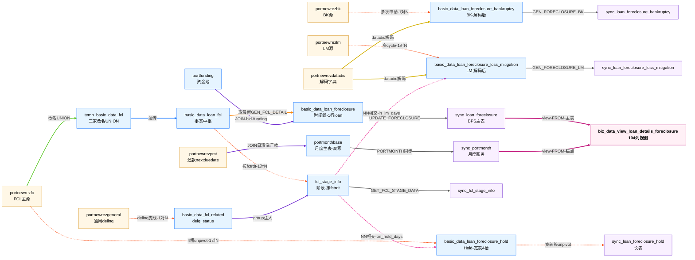
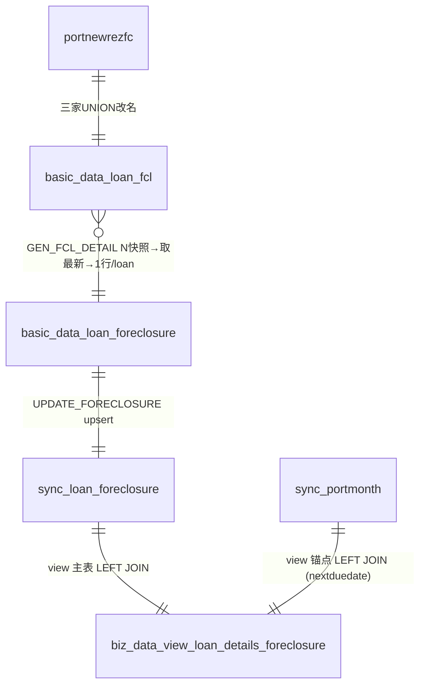
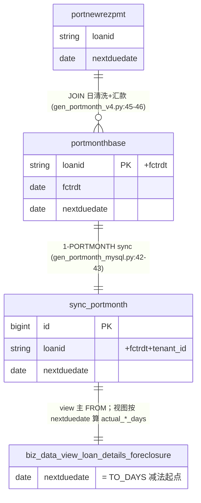
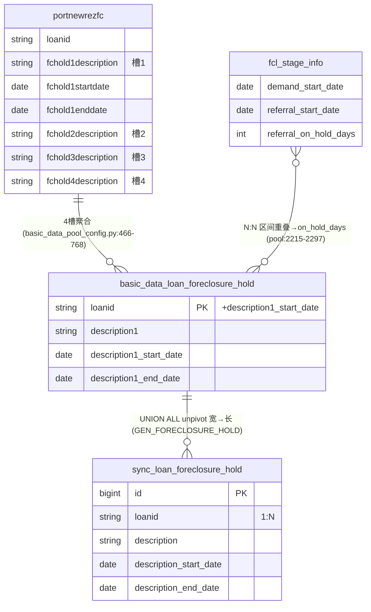
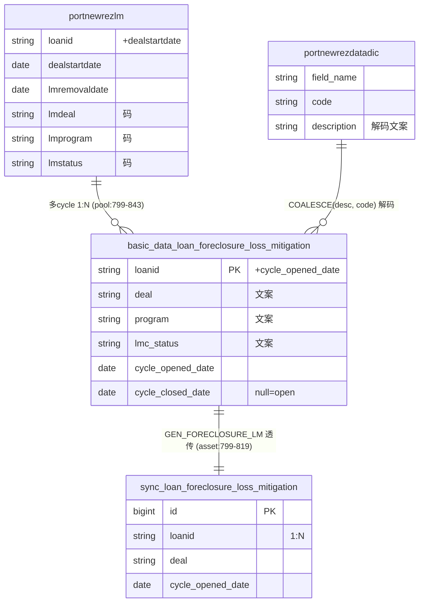
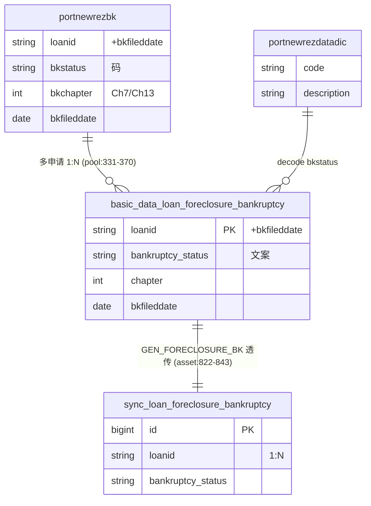

# doc 33 — FCL 表实体关系图（ERD：主键 / 粒度键 / 1:N / 多对多）

## 文档目的（Document Purpose）

- **为什么存在**：FCL 相关的表分布在 3 个数据库 schema（`newrez.*` L1 源 · `port.*` L4 Redshift 业务族 · `bpms.*` L5 BPS 同步层 + 1 张视图），共 **~22 张表**。它们之间的**实体关系**（PK / FK / 一对多 / 多对多）此前散落在 doc 02（管道图）、doc 19（样例 dump 图）、doc 21 §0.5（已归档的 ERD），没有单一入口。排查"为什么 sync_loan_foreclosure_hold 一笔贷款多行"、"sync_portmonth 和 sync_loan_foreclosure 怎么 join"、"FCL 视图实际只接哪几张表"等问题，**ER 图最直观**。
- **解决什么问题**：用一篇集中文档（含 1 张总图 + 5 张分支图 + PK 速查表 + 常见 JOIN 速查 + 粒度说明）回答"表之间怎么关联"——和 doc 25-30 的"字段怎么流"互补。
- **范围（Scope）**：
  - **包含**：FCL 业务族所有相关表（L1 源 5 张 + Newrez 还款源 1 张 + L4 Redshift 8 张 + L4 portmonth 1 张 + L5 BPS sync 6 张 + L5 BPS 视图 1 张 = 共 ~22 张）的 PK / 粒度键 / 一对多关系；常见 join 模板；1:N 业务原因。
  - **不包含**：每个字段的逐跳 lineage（去 doc 25-30）；阶段窗口公式（去 doc 31）；BPS UI 映射（去 doc 13/16）；ETL 时序与 flow 编排（去 doc 02/12）。
- **系统位置**：表级关系的**唯一入口**；与 doc 02（管道/层级）、doc 25-30（字段血缘）、doc 31（阶段窗口）正交互补。

## 目标读者

数据工程师 · 业务分析师 · 验证人员 · 接入工程师 · 新成员 · 未来 AI 会话

## 修订历史

| 日期 | 作者 | 版本 | 变更 | 关联 |
|------|------|------|------|------|
| 2026-06-11 | AI Agent (Claude Opus 4.7 1M) | v1 | 初稿——整合 doc 21 §0.5 ERD + 补 portmonth 锚点链（sync_portmonth/portmonthbase/portnewrezpmt）+ 显式画 BPS 视图节点（仅 2 张表喂入）+ 5 张分支图 + PK 速查 + 常见 join 速查 | doc 21 §0.5 (已归档) · doc 19 mermaid · doc 02 |
| 2026-06-11 | AI Agent (Claude Opus 4.7 1M) | v2 | §2 cardinality 校准 `}o--||`（fcl→foreclosure 多快照→1 行）+ 加 mermaid 排版伪影提示；**新增 §2.5 数据流彩色图**（mermaid flowchart + linkStyle 9 类配色：UNION/透传/取最新/1:N/JOIN/解码/N:N/sync/view FROM），与 §2 erDiagram 互补 | mermaid linkStyle |
| 2026-06-11 | AI Agent (Claude Opus 4.7 1M) | v3 | mermaid 11.13 兼容修复（pipe-form 边标签去引号 + 去空格 + 节点标签去 `()`）；**新增 §2.5.1**「取最新 vs 首见追踪」橙色边两套规则的展开说明，附 Loan 7727003984（12 次改期，MCP 实证）+ 三日期对比表（projected 2026-06-30 / set 2026-05-22 / last_step_completed 2025-07-16） | MCP 实证 prod 2026-06-11 |
| 2026-06-11 | AI Agent (Claude Opus 4.7 1M) | v4 | §2.5.1 Code-First 校正：直接读本地 PrefectFlow `basic_data_pool_config.py` L253-305 实证，`last_step_completed_date` 实际是 pool:284 **直接透传** Newrez `lastfcstepcompleteddate`（不是 v3 误判的"首事件追踪"机制），改期不算"完成"故字段不更新；§2.5.1 末尾加 Code-First SQL 实证块（4 条规则各贴真 SQL） | PrefectFlow 本地代码（CLAUDE.md 已记） |
| 2026-06-11 | AI Agent (Claude Opus 4.7 1M) | v5 | §2.5.1 `last_step_completed_date` 含义再校正：v4 把 7727003984 的 last_step 误说成"首次排定拍卖那天"——MCP 实测显示配对字段 `lastfcstepcompleted = "NOS Sent for Recording"`（NOS 拍卖通告递交事件，**与拍卖排定日独立、碰巧同日**）；新增「多 loan 实测分布」子节 — 7 笔实测 + 21+ 种 distinct sub-step 值清单 + 粒度对比表（Newrez 自定义 21 种子步骤 vs BPS 6-stage 正交）+ 业务用法 3 条 | MCP 实测 prod 2026-06-11 |

## 依赖（Dependencies）

- `port.*` 表实际**不强制 PK 约束**（Redshift 通常不声明 PK）；本图中标 `PK` 的是**业务/逻辑主键**（决定"一行代表什么"的粒度键），靠 ETL 保证唯一。
- MySQL（newrez / bpms）表 PK = 代理键 `id`；业务粒度键另注。
- 视图 `bpms.biz_data_view_loan_details_foreclosure` 的实际 FROM 经 MCP 实证（2026-06-10）：**只 LEFT JOIN `sync_loan_foreclosure` + `sync_portmonth`**——doc 19 旧版 mermaid 标"5 张 sync 表→视图"是错的。

## 已知局限（Known Limitations）

- `port.*` 无强制 PK，"逻辑主键"靠 ETL 保证；如同一 loan + dataasof 上游写两行会导致下游异常，本图不能预防。
- Hold 4 槽（fchold1..4）在 `basic_data_loan_foreclosure_hold` 经 unpivot 拆成长表前，1 条 loan 行同时持有 4 个 Hold 描述列；图中标 "1:N" 是 unpivot 之**后**的形态。

---

## 1. 总览：4 条支线 + 1 个锚点

```
                                                ┌─────────────────────────────────────┐
                                                │ BPS 法拍详情页（5 面板）              │
                                                │ Foreclosure / Hold / LM / BK / Stage │
                                                └─────────────────────────────────────┘
                                                          ▲   ▲  ▲  ▲  ▲
                                  ┌─────────────────────┐ │   │  │  │  │
                                  │  biz_data_view_*    │─┘   │  │  │  │
                                  │   (104列视图)        │     │  │  │  │
                                  └─────────────────────┘     │  │  │  │
                                  ▲ (JOIN 2 张)               │  │  │  │
              ┌───────────────────┤                           │  │  │  │
              │                   │                           │  │  │  │
   ┌──────────┴──────┐    ┌───────┴────────┐    ┌─────────────┴──┴──┴──┴────────────┐
   │ sync_portmonth  │    │ sync_loan_     │    │ sync_*  (hold / lm / bk / stage)  │
   │  (月度账务)      │    │  foreclosure   │    │  ←─ 直接喂各自面板，不经视图        │
   │  ┌nextduedate┐  │    │   (主表)        │    │                                   │
   └──────▲──────────┘    └───────▲────────┘    └─────────────▲─────────────────────┘
          │                       │                            │
          │ L5 同步                │ L5 同步                     │ L5 同步
          │                       │                            │
   ┌──────┴──────────┐    ┌───────┴─────────────────┐  ┌───────┴─────────────────────┐
   │ port.portmonth- │    │ port.basic_data_loan_   │  │ port.basic_data_loan_       │
   │  base (月度主表) │    │  foreclosure (时间线)    │  │  foreclosure_{hold,lm,bk}   │
   └──────▲──────────┘    └───────▲─────────────────┘  │  port.fcl_stage_info         │
          │                       │                    └───────▲─────────────────────┘
          │                       │ port.basic_data_loan_fcl(L4 事实中枢)
          │                       │ ◀ 三家 UNION 自 tempfc.temp_basic_data_fcl ◀ L1 源
          │
   ┌──────┴──────────┐
   │ newrez.port-    │
   │  newrezpmt (还款) │
   └─────────────────┘
```

**4 条支线（业务族）**：
1. **FCL 主线**：`portnewrezfc` → `temp_basic_data_fcl`（UNION 三家）→ `basic_data_loan_fcl`（**事实中枢**）→ { `basic_data_loan_foreclosure` / `fcl_stage_info` / `_hold` / `_lm` / `_bk` / `fcl_related` }
2. **portmonth 锚点链**（视图日期差需要）：`newrez.portnewrezpmt` → `port.portmonthbase` → `bpms.sync_portmonth`（**仅供视图 nextduedate 用**）
3. **delq 逾期支线**：`portnewrezgeneral` → `daily_loan_common` → `..._clean` → `basic_data_fcl_related.delq_status` → 注入 `fcl_stage_info.group`
4. **解码字典**：`portnewrezdatadic` → 提供 LM cycle / BK status / hold 编码的文本

**关键纠错（vs 旧 doc）**：
- ⚠️ BPS 视图 `biz_data_view_loan_details_foreclosure` 实际**只 LEFT JOIN `sync_loan_foreclosure` + `sync_portmonth`**——doc 19 v9 之前的 mermaid 标"5 张 sync 表→视图"是错的（MCP 实证 information_schema.views.view_definition）。其他 4 张 sync_*（hold / lm / bk / fcl_stage_info）**不喂视图**，直接喂各自 BPS 面板。

---

## 2. 总图（Master ERD · Mermaid erDiagram）

> 一张图看全 ~22 张表关系。每个表盒列**主键 + 粒度键 + 关键业务字段 + 关键转换字段**。关系标签 = 该跳的转换 SQL 或 ETL 函数。
>
> 图例：`||--||` = 1:1；`||--o{` = 1:N；`}o--o{` = N:N（区间重叠类）；`}o--||` = N:1（多快照→取最新）。
>
> ⚠️ **mermaid 排版伪影提示**：当 2 张表挨得很近且各自有多条出入边时，**第三方的边可能从这对表中间穿过**，看起来像它们之间多了一条关系——**两表之间始终只有 1 个关系声明**。如有歧义，按表名+边的两端追端点即可识别真实关系（不是看线条数量）。例：`basic_data_loan_fcl ↔ basic_data_loan_foreclosure` 之间渲染时常被 `portfunding → basic_data_loan_foreclosure` 边路过，看起来像 2 条，其实只有 GEN_FCL_DETAIL 这 1 条。

```mermaid
erDiagram
    %% ===== L1 来源 (MySQL newrez) =====
    portnewrezfc {
        bigint id PK
        string loanid "粒度键(+dataasof)"
        date   dataasof "快照日"
        int    activefcflag "状态/阶段过滤"
        date   demandsentdate "→demand_start"
        date   demandexpirationdate "→demand_end"
        date   fcreferraldate "→referral_start"
        date   firstlegaldate "→first_legal_start"
        date   servicecompletedate "→service_start ⚠反直觉"
        date   fcjudgmenthearingscheduled "→judgement_start"
        date   fcscheduledsaledate "→sale_start"
        string fcremovaldesc "退出原因→status"
        string judicial "司法标志"
        string fchold1description "Hold(4槽)"
    }
    portnewrezlm {
        bigint id PK
        string loanid "粒度键(+dealstartdate)"
        date   dataasof "快照日"
        string lmdeal "datadic→deal"
        string lmprogram "datadic→program"
        string lmstatus "datadic→lmc_status"
        date   dealstartdate "cycle起"
        date   lmremovaldate "cycle止"
    }
    portnewrezbk {
        bigint id PK
        string loanid "粒度键(+bkfileddate)"
        date   dataasof "快照日"
        string bkstatus "datadic→bankruptcy_status"
        int    bkchapter "Ch7/Ch13"
        date   bkfileddate "申请日"
    }
    portnewrezgeneral {
        bigint id PK
        string loanid "粒度键(+dataasof)"
        string delinquency_status_mba "→delinq"
        string legalstatus
    }
    portnewrezpmt {
        bigint id PK
        string loanid "粒度键(+dataasof)"
        date   nextduedate "⚠视图日期差锚点"
    }
    portnewrezdatadic {
        string field_name "逻辑键"
        string code "join用(+'.0')"
        string description "解码文案"
    }

    %% ===== L4 业务 (Redshift port) =====
    temp_basic_data_fcl {
        string loanid "粒度键(+dataasof)"
        date   dataasof
        string servicer_tag "Newrez/Carrington/Capecodfive"
    }
    basic_data_loan_fcl {
        string loanid PK "逻辑(+dataasof)"
        date   dataasof PK
        date   referral_start_date
        date   legal_start_date
        date   service_start_date
        date   fcscheduled_sale_date
        int    activefcflag
        string judicial
        string fcremovaldesc
    }
    basic_data_loan_foreclosure {
        string loanid PK "1行/loan,最新快照"
        date   timeline_referred_to_foreclosure_date
        date   timeline_first_legal_date
        date   timeline_judgement_date
        string summary_foreclosure_status "CASE on removaldesc"
        int    summary_judicial_foreclosure
    }
    fcl_stage_info {
        string loanid PK "逻辑(+fctrdt)"
        date   fctrdt PK "报告日"
        date   demand_start_date
        date   referral_start_date
        date   service_start_date
        int    referral_stage_days
        int    service_in_lm_days
        int    service_on_hold_days
        string group "=delq_status"
        string judicial
    }
    basic_data_loan_foreclosure_hold {
        string loanid PK "逻辑(+description1_start_date)"
        string description1 "Hold原因(4槽)"
        date   description1_start_date
        date   description1_end_date
    }
    basic_data_loan_foreclosure_loss_mitigation {
        string loanid PK "逻辑(+cycle_opened_date)"
        string deal "解码后"
        string program
        string lmc_status
        date   cycle_opened_date "周期起"
        date   cycle_closed_date "null=open"
    }
    basic_data_loan_foreclosure_bankruptcy {
        string loanid PK "逻辑(+bkfileddate)"
        string bankruptcy_status "解码后"
        int    chapter
        date   bkfileddate
    }
    basic_data_fcl_related {
        string loanid PK "+dataasof"
        string delq_status "→stage.group"
        string propertystate "→judicial州兜底"
    }
    portmonthbase {
        string loanid PK "+fctrdt"
        date   fctrdt PK
        date   nextduedate "锚点源"
    }
    portfunding {
        string loanid PK "1:1/loan"
        string dealid "=bid_id"
        string fundingid
    }

    %% ===== L5 BPS (MySQL bpms) =====
    sync_loan_foreclosure {
        bigint id PK
        string loanid "1行/loan"
        int    tenant_id
        date   timeline_referred_to_foreclosure_date
        string summary_foreclosure_status
        int    summary_judicial_foreclosure
    }
    sync_fcl_stage_info {
        bigint id PK
        string loanid "+fctrdt"
        date   fctrdt
        date   referral_start_date
        int    service_in_lm_days
    }
    sync_loan_foreclosure_hold {
        bigint id PK
        string loanid "1:N"
        string description
        date   description_start_date
        date   description_end_date
    }
    sync_loan_foreclosure_loss_mitigation {
        bigint id PK
        string loanid "1:N"
        string deal
        date   cycle_opened_date
    }
    sync_loan_foreclosure_bankruptcy {
        bigint id PK
        string loanid "1:N"
        string bankruptcy_status
        date   bkfileddate
    }
    sync_portmonth {
        bigint id PK
        string loanid "+fctrdt"
        int    tenant_id
        date   fctrdt
        date   nextduedate "⚠视图锚点"
    }
    biz_data_view_loan_details_foreclosure {
        string loanid "+tenant_id"
        date   nextduedate "from sync_portmonth"
        date   timeline_first_legal_date "from sync_loan_foreclosure"
        int    actual_first_legal_days "=TO_DAYS差"
        int    var_first_legal_days "=actual−Σtarget"
    }

    %% ===== 关系 =====
    portnewrezfc      ||--|| temp_basic_data_fcl    : "三家UNION改名 (CREATE_BASIC_FCL pool:1531-1654)"
    temp_basic_data_fcl ||--|| basic_data_loan_fcl   : "保真透传"
    basic_data_loan_fcl }o--|| basic_data_loan_foreclosure : "GEN_FCL_DETAIL pool:253-305 N快照→取最新→1行/loan"
    basic_data_loan_fcl ||--o{ fcl_stage_info        : "GEN_FCL_STAGE pool:1774-2440 按fctrdt"
    portnewrezfc      ||--o{ basic_data_loan_foreclosure_hold : "fchold1..4 unpivot 1:N"
    portnewrezlm      ||--o{ basic_data_loan_foreclosure_loss_mitigation : "多cycle 1:N"
    portnewrezbk      ||--o{ basic_data_loan_foreclosure_bankruptcy : "多申请 1:N"
    portnewrezgeneral ||--o{ basic_data_fcl_related  : "delinq支线"
    portnewrezpmt     ||--o{ portmonthbase           : "JOIN 日清洗+汇款 (gen_portmonth_v4.py)"
    portnewrezdatadic ||--o{ basic_data_loan_foreclosure_loss_mitigation : "decode deal/program/status"
    portnewrezdatadic ||--o{ basic_data_loan_foreclosure_bankruptcy : "decode bkstatus"
    basic_data_fcl_related ||--o{ fcl_stage_info     : "group=delq_status"
    portfunding       ||--|| basic_data_loan_foreclosure : "JOIN 补bid/funding_id 1:1"

    fcl_stage_info }o--o{ basic_data_loan_foreclosure_loss_mitigation : "N:N 区间重叠→in_lm_days (rnk=1取最近open)"
    fcl_stage_info }o--o{ basic_data_loan_foreclosure_hold : "N:N 区间重叠→on_hold_days (rnk=1)"

    basic_data_loan_foreclosure ||--|| sync_loan_foreclosure : "UPDATE_FORECLOSURE upsert 1:1"
    fcl_stage_info    ||--|| sync_fcl_stage_info    : "GET_FCL_STAGE_DATA sync 1:1"
    basic_data_loan_foreclosure_hold ||--o{ sync_loan_foreclosure_hold : "宽→长 unpivot 1:N"
    basic_data_loan_foreclosure_loss_mitigation ||--|| sync_loan_foreclosure_loss_mitigation : "GEN_FORECLOSURE_LM"
    basic_data_loan_foreclosure_bankruptcy ||--|| sync_loan_foreclosure_bankruptcy : "GEN_FORECLOSURE_BK"
    portmonthbase     ||--|| sync_portmonth         : "1-PORTMONTH sync"

    sync_loan_foreclosure ||--|| biz_data_view_loan_details_foreclosure : "view FROM (loan_fcl)"
    sync_portmonth    ||--|| biz_data_view_loan_details_foreclosure : "view FROM (monthly, ⚠nextduedate锚点)"
```



> **一句话读图**：箭头方向 = 数据流向；`||--o{` 一对多 = 子表 = 长表（Hold/LM/BK）；`}o--o{` 多对多 = 区间相交（Stage 窗口 × LM/Hold 区间）→ 推出 `in_lm_days/on_hold_days`；视图节点只接 2 张表（实证），不是 5 张。

---

## 2.5 数据流彩色图（按转换类型配色）

§2 的 erDiagram 把 22 张表的 cardinality（PK / 粒度 / 1:1·1:N·N:N）画清楚了，但 mermaid `erDiagram` **不支持每条边自定义颜色**——当 23 条边在表之间交叉时，"哪条边是哪种转换"只能靠 hover 看 label。本节追加一张**同 22 张表 + 23 条边的 mermaid `flowchart`**，按**转换类型**给边配 9 类颜色，与 §2 互补：

- **§2 erDiagram**：cardinality 形式化标准（重在 PK / 粒度 / 多重性的严谨标记）
- **§2.5 flowchart**：转换语义可视化（重在"这条边是 UNION / 透传 / 取最新 / 1:N / JOIN / 解码 / N:N / sync / view FROM"哪一类）

### 配色图例（9 类）

| 颜色 | 线型 | 关系类型 | 典型例子 |
|---|---|---|---|
| 🟢 绿 `#52c41a` | 实线 | **UNION 改名**（3 家 servicer 合并入事实表） | `portnewrezfc → temp_basic_data_fcl`（CREATE_BASIC_FCL pool:1531-1654）|
| 🔵 蓝 `#1677ff` | 实线 | **保真透传**（一一映射，无转换） | `temp → basic_data_loan_fcl` |
| 🟠 橙 `#fa8c16` | 实线 | **取最新派生**（多快照 → 1 行/loan） | `fcl → basic_data_loan_foreclosure`（GEN_FCL_DETAIL，取 dataasof=MAX）|
| 🔴 红 `#fa541c` | 虚线 | **1:N 多行子表**（unpivot / 多 cycle / 多次申请 / 多 fctrdt 快照） | `portnewrezfc → _hold` · `lm → lm4` · `bk → bk4` · `fcl → fcl_stage_info` · `gen → fcl_related` · `_hold → sync_hold` |
| 🟣 紫 `#722ed1` | 实线 | **JOIN 拼接**（不同实体按 key 横向 join） | `portnewrezpmt → portmonthbase`（JOIN 日清洗+汇款）· `portfunding → foreclosure`（JOIN bid/funding_id）· `fcl_related → fcl_stage_info`（group 注入）|
| 🟡 暗黄 `#d4b106` | 粗实线 | **datadic 解码**（编码 → 文本） | `portnewrezdatadic → lm4` · `→ bk4` |
| 🩷 粉 `#eb2f96` | 虚线 | **N:N 区间相交**（Stage 窗口 × LM/Hold 区间求重叠天数） | `fcl_stage_info × loss_mitigation`（→ `in_lm_days`）· `× hold`（→ `on_hold_days`）|
| ⬛ 灰 `#595959` | 实线 | **BPS sync 跨库**（L4 Redshift → L5 MySQL，仅传输无业务转换）| `fclo → sync_loan_foreclosure`（UPDATE_FORECLOSURE upsert）· `stage → sync_stage` · `lm4 → sync_lm` · `bk4 → sync_bk` · `portmonthbase → sync_portmonth` |
| 🟪 深粉 `#c41d7f` | 粗实线 | **视图 FROM**（最终消费 · 视图的 2 张 FROM 表） | `sync_loan_foreclosure → biz_data_view`（主表 LEFT JOIN）· `sync_portmonth → biz_data_view`（⚠ nextduedate 锚点 LEFT JOIN）|

### 配色版数据流图



> **怎么读这张图**：先扫**颜色**——同色 = 同种转换类型，相隔再远也能一眼把同类边归到一起；**虚线** = 1:N 或 N:N（多行 / 区间相交），**实线** = 单行映射或 sync 传输；交叉时**追边的两端节点**而非数线条。**§2 + §2.5 配合用法**：先看 §2.5 找到关心的颜色族（如想知道哪些是 sync？只看灰色），再回 §2 看那条边的精确 cardinality 标记。

### 2.5.1 「取最新」橙色边的两套规则——并不是所有字段都纯粹取最新

§2.5 把 `fcl → basic_data_loan_foreclosure` 标为🟠 橙色"取最新 GEN_FCL_DETAIL"，但这条边**实际含两套不同语义**——大多数字段确实"只取最新一行"，但少数 `*_set_date` 类"**首见追踪**"字段需要扫**全部 dataasof 历史**才能算出来。

#### 两类规则

| 类别 | 字段示例 | 取值规则 | Code-First |
|---|---|---|---|
| **a. 取最新（默认，约 95% 字段）** | `timeline_*_date`（包括 sale_date_projected）· `summary_*` · `target_*` 等绝大多数 | `value = max-fctrdt 行的字段值`（snapshot 维度的"当前态"） | pool:253-305 |
| **b. 首见追踪（特例，2 个字段）** | `timeline_sale_date_set_date` · `timeline_judgement_hearing_set_date` | `value = min(dataasof WHERE 上游 = max-fctrdt 行的值)`（在 fcl 全历史扫，找"当前值是哪天首次出现的"） | [pool:300-303 sale_set](https://gitlab.bridgerinvestment.com/jli/prefectflow/-/blob/32a750a39c7eda989de991c47467979043e3d209/flow/basic_data/basic_data_config/basic_data_pool_config.py#L300-303) · [pool:295-298 judgement_set](https://gitlab.bridgerinvestment.com/jli/prefectflow/-/blob/32a750a39c7eda989de991c47467979043e3d209/flow/basic_data/basic_data_config/basic_data_pool_config.py#L295-298) |

#### 工作例：Loan 7727003984（12 次改期 · MCP 实证 2026-06-11）

这笔贷款的拍卖日**被推迟 12 次**——MCP 跑 `port.basic_data_loan_fcl` 按 distinct `fcscheduled_sale_date` 聚合 + 取 min(dataasof) 得到全部 12 个值（首次首次排定 2025-07-16，最后改到 2026-06-30）：

| 序号 | dataasof（这天起改成新值） | fcscheduled_sale_date（新拍卖日） | 持有天数 |
|---|---|---|---|
| 1 | 2025-07-16 | 2025-08-13（**首次排定**） | 27 |
| 2 | 2025-08-12 | 2025-09-17 | 29 |
| 3 | 2025-09-10 | 2025-10-17 | 36 |
| 4 | 2025-10-17 | 2025-10-24 | 3 |
| 5 | 2025-10-20 | 2025-11-25 | 30 |
| 6 | 2025-11-19 | 2025-12-30 | 37 |
| 7 | 2025-12-26 | 2026-01-30 | 31 |
| 8 | 2026-01-26 | 2026-02-27 | 32 |
| 9 | 2026-02-27 | 2026-03-27 | 20 |
| 10 | 2026-03-20 | 2026-04-28 | 34 |
| 11 | 2026-04-23 | 2026-05-29 | 29 |
| **12** | **2026-05-22** | **2026-06-30（当前值，最后一次改期）** | 18 |

ETL 在最新快照（dataasof=MAX）按两套规则各算一次，得到（MCP 查 `port.basic_data_loan_foreclosure` 实证）：

- **a. 取最新 →** `timeline_sale_date_projected_date = `**`2026-06-30`** ← max-fctrdt 行的 `fcscheduled_sale_date` 值
- **b. 首见追踪 →** `timeline_sale_date_set_date = `**`2026-05-22`** ← 在 fcl 全历史里扫"value=2026-06-30"最早出现日 = 序号 12 行的 dataasof

BPS sync 表 `bpms.sync_loan_foreclosure` MCP 实测：`timeline_sale_date_projected_date=2026-06-30 / timeline_sale_date_set_date=2026-05-22`——一字不差对上。**BPS UI 的 Sale Date Projected/Set 显示这两个值**。

#### 同一概念的 3 个不同日期（MCP 全实证）

光在这一笔 loan 上，"拍卖被排定"就生出 3 个不同的日期字段——读图时千万别混：

| BPS 字段 | 值 | 含义 | 规则 |
|---|---|---|---|
| `timeline_sale_date_projected_date` | **2026-06-30** | **当前**排定的拍卖日（值本身） | **a 取最新** |
| `timeline_sale_date_set_date` | **2026-05-22** | **当前**拍卖日是哪天**首次出现**的（最后一次改期那天） | **b 首见追踪** |
| `summary_last_step_completed_date` | **2025-07-16** | servicer 上报的"最后完成 FCL **子步骤**事件日"——本例 `lastfcstepcompleted = "NOS Sent for Recording"`（NOS 拍卖通告递交，碰巧 2025-07-16 也是首次排定拍卖日）。**非"首次排定拍卖那天"语义**（旧 doc 误读已纠正，见下方"多 loan 实测分布"小节） | **c 直接透传**（pool:284，无转换）`fc.lastfcstepcompleteddate AS summary_last_step_completed_date` |

⚠️ 三个值都是真实数据的不同侧面，**不可互换**：
- 想答"现在排哪天拍卖？" → projected 2026-06-30
- 想答"这个拍卖日是新设的还是已经排好几个月了？" → set 2026-05-22（离今天 2026-06-09 只差 18 天，说明刚刚改完）
- 想答"servicer 报的最后完成**子步骤**是哪天？" → last_step_completed 2025-07-16（**子步骤名 = `lastfcstepcompleted` 配对字段 = "NOS Sent for Recording"** 拍卖通告递交日；与首次排定拍卖**碰巧同日**但语义独立——见下方"多 loan 实测分布"小节看 21 种细粒度子步骤）

#### `last_step_completed_date` 多 loan 实测分布（澄清非 bug · 用户疑问回应）

**用户疑问回应**：
1. **是 Prefect bug 吗？——非 bug**。pool:284 是**直接透传** Newrez 自己上报的 `lastfcstepcompleteddate`，零转换；ETL 不参与决策。
2. **是某个 stage（NOI / Demand / Referral / First Legal / Service / Publication / Judgement / Sale）的完成时间吗？——不是**。`lastfcstepcompleted` 是 Newrez **自定义的文书级子步骤事件文本**（MCP 实测 21+ 种 distinct 值），与 BPS 的 6-stage 模型（DEMAND/REFERRAL/FIRST_LEGAL/SERVICE/JUDGEMENT/SALE）是**两个正交维度**：
   - `fcstage` = "**现在** loan 处在哪个阶段"（也来自 Newrez 自己的 fcstage 列）
   - `lastfcstepcompleted` + `_date` = "loan 已完成的**最近一个** servicer-定义的细粒度子步骤名 + 那天"
3. **7727003984 旧表述错了**：旧 doc 把它说成"首次排定拍卖那天"。实际配对字段 `lastfcstepcompleted = "NOS Sent for Recording"`（NOS 拍卖通告**递交日** ≠ 拍卖**排定日**）。后续 12 次改的是**拍卖排定日** `fcscheduledsaledate`，但"NOS 递交"事件只发生过 1 次（2025-07-16），所以这条不更新。**碰巧同日**是因为 servicer 当日两件事一起做；语义上是两个独立字段。

**MCP 实测 7 笔 loan 分布**（latest dataasof，2026-06-11）：

| loanid | `lastfcstepcompleted`（servicer 自定义子步骤） | `lastfcstepcompleteddate` | `fcstage`（当前阶段） |
|---|---|---|---|
| 7727000088 | Post Sale Review (SCRA and PACER Check) | 2026-05-26 | Post Sale Review (SCRA and PACER Check) |
| 7727000131 | NOS Recorded | 2025-12-23 | Pre-Sale Review 1 (SCRA and PACER Check) |
| 7727000357 | Presale Redemption Will Expire On | 2026-04-07 | Sale Scheduled For |
| 7727000569 | Answer Period Will Expire On | 2025-04-13 | Order Of Reference Sent |
| **7727003984** | **NOS Sent for Recording** | **2025-07-16** | Pre-Sale Review 1 (SCRA and PACER Check) |
| 7727004200 | Sale Scheduled For | 2026-05-19 | Pre-Sale Review 1 (SCRA and PACER Check) |
| 7727004408 | Motion for Judgment Sent to Court | 2026-05-13 | Judgment Hearing Scheduled For |

**21+ 种 distinct `lastfcstepcompleted` 值（部分）**：NOS Recorded · NOS Sent for Recording · NOTS Recorded · NOS Sent for Recording · Complaint Sent for Filing · Complaint Submitted for Service · Complaint Sent For Service · Submitted for Service · Service Complete · Answer Period Will Expire On · Order Of Reference Sent · Motion for Judgment Sent to Court · Are We Proceeding with a Consent Judgment · Order Authorizing Sale Received · Sale Scheduled For · Presale Redemption Will Expire On · Post Sale Review · First Publication · NOD Filed · Praecipe Filed · Preliminary Title Clear · Title Report Received · 10 Day Letter Sent · File Received By Attorney …

**粒度对比 — 这是关键**：

| 维度 | 字段 | 取值数量 | 粒度 |
|---|---|---|---|
| BPS 6-stage | `port.fcl_stage_info.stage` | 6 | **业务大段**：DEMAND / REFERRAL / FIRST_LEGAL / SERVICE / JUDGEMENT / SALE |
| Newrez 自定义子步骤 | `lastfcstepcompleted` | **21+** | **法律文书级事件**：每个 stage 下可能有 3-5 个细粒度子步骤 |

举例：**FIRST_LEGAL stage** 内部可能依次经历这些子步骤（each 都会刷新 last_step_completed）：
`Complaint Sent for Filing` → `Complaint Sent For Service` → `Answer Period Will Expire On` → `Order Of Reference Sent` → `Motion for Judgment Sent to Court` → … → 进入 JUDGEMENT stage 之前。

**业务用法**：
- ① 看 servicer 当前处置的**最细粒度时间点**（"上一步具体什么时候完成的"）—— BPS 6-stage 答不了这个问题，它只能答"这个 loan 现在在 FIRST_LEGAL 阶段"。
- ② 与 `fcstage` 配合判断 "**该阶段已走到多深**"。例 7727004408：fcstage = "Judgment Hearing Scheduled For"（即将进入 JUDGEMENT 阶段），last step = "Motion for Judgment Sent to Court"（已递交判决动议）→ 解读：刚把动议提交给法院，等开庭。
- ③ ⚠️ servicer 自定义文本，**跨 servicer 不可直接比较**（Newrez 这套术语对 Carrington / Capecodfive 不一定适用，CREATE_BASIC_FCL pool:1602-1644 实际 carrington/capecodfive 给 `lastfcstepcompleted` 多为 `null` 或 `most_recent_foreclosure_stage` 填，与 Newrez 不同）。

#### Code-First 实证（已读本地 PrefectFlow `basic_data_pool_config.py`）

```sql
-- pool:266 取最新 (默认规则 a)：
fc.fcscheduled_sale_date AS timeline_sale_date_projected_date
  -- fc = port.basic_data_loan_fcl WHERE dataasof = MAX(dataasof) per servicer (pool:288-293)

-- pool:267 + pool:300-303 首见追踪 (规则 b)：
sa.sa_set_date AS timeline_sale_date_set_date
  -- sa = LEFT JOIN (
  --   select loanid, fcscheduled_sale_date, min(dataasof) as sa_set_date
  --   from port.basic_data_loan_fcl where fcscheduled_sale_date is not null
  --   group by loanid, fcscheduled_sale_date) sa
  -- on fc.loanid=sa.loanid AND fc.fcscheduled_sale_date=sa.fcscheduled_sale_date
  -- 等价于：取最新行的 fcscheduled_sale_date 的值，去全历史里找该值首次出现的 dataasof

-- pool:264 + pool:295-298 同样模式给 timeline_judgement_hearing_set_date：
ju.jd_set_date AS timeline_judgement_hearing_set_date
  -- 子查询按 fcjudgment_hearing_scheduled 做同样的 min(dataasof) GROUP BY 值

-- pool:284 直接透传 (规则 c)：
fc.lastfcstepcompleteddate AS summary_last_step_completed_date
  -- 无任何聚合/计算；纯粹是 fc.lastfcstepcompleteddate（来自 Newrez raw）的当前快照值
```

#### 关键洞察

1. **`set_date` 不是"最初排定日"**：本例最初首次排定是 2025-07-16，但 set_date = 2026-05-22。原因是中间被改期 12 次，每次新值出现就刷新"首见日" → 当前 2026-06-30 这个值的首见日是 2026-05-22（最后一次改期那天）。
2. **`set_date` 也不是"latest projected"**：projected = 2026-06-30、set = 2026-05-22，两者**不同日期**。
3. **单天快照算不出 b 类**：只取 max-fctrdt 一行能算 projected = 2026-06-30、但**算不出** set = 2026-05-22；只有 fcl 表保留全部 dataasof 历史（每贷款多行）才能扫出来。**这就是 fcl 必须按 (loanid, dataasof) 留全历史的原因之一**。
4. **业务侧关心两个问题**：① "**现在排的拍卖日是哪天？**" → projected_date（取最新）；② "**这个拍卖日是哪天被排上的？是新设的还是已经排好几个月了？**" → set_date（首见追踪）。后者帮 servicer 判断"是不是又被推后了"——set_date 离 dataasof 越近，说明刚改完。

#### 与 §2 erDiagram 的关系

§2 把 `basic_data_loan_fcl }o--|| basic_data_loan_foreclosure` 标成 N:1（多快照→1 行），这个 cardinality 标对了——但"如何从 N 个 dataasof 行算出 1 行"实际有两种算法：
- **N → 1（取最新）**：N 行排序取 max，丢弃其他 → 1 行
- **N → 1（首见追踪）**：N 行先按"value=max-fctrdt 行的值"过滤再取 min(dataasof) → 1 行

两套都符合 N:1 关系标记，但实际计算路径不同。读者需要看具体字段才能确定走哪条。

#### 同类字段一览

| BPS 字段 | 上游 fcl 字段 | 类别 | 含义 |
|---|---|---|---|
| `timeline_sale_date_projected_date` | `fcscheduled_sale_date` 当前值 | a 取最新 | 当前排定的拍卖日 |
| **`timeline_sale_date_set_date`** | `fcscheduled_sale_date` 首见 | **b 首见追踪** | 当前拍卖日是哪天排定的 |
| `timeline_judgement_date` | `fcjudgmenthearingscheduled` 当前值 | a 取最新 | 当前听证日 |
| **`timeline_judgement_hearing_set_date`** | `fcjudgmenthearingscheduled` 首见 | **b 首见追踪** | 当前听证日是哪天排定的 |
| `first_legal_date_history`（doc 27 §18） | `firstlegaldate` 首见 | b 同机制 | 首次法律行动日的 ETL 追踪（prod 实测全 NULL，仅设计存在）|

---

## 3. 分支图（聚焦小图）

### 3.1 FCL 主线（事实表 → 时间线 → BPS 主表 → 视图）



**要点**：FCL 主线 5 跳；视图节点**只接 sync_loan_foreclosure 和 sync_portmonth 两张**（**不是 5 张**，doc 19 旧 mermaid 错过）。

### 3.2 portmonth 锚点链（视图日期差需要）



**要点**：portmonth 是**独立支线**（不在 FCL 业务族），但视图 `actual_*_days` 公式 `TO_DAYS(timeline_*_date) − TO_DAYS(nextduedate)` 离不开它。详 [doc 31 §5](31_fcl_stage_window_rules.md)。

### 3.3 Hold（宽→长 unpivot · 一笔 loan 多 Hold）



**要点**：Newrez `portnewrezfc` 用 4 个"槽位"（fchold1..4）平铺 Hold；ETL 经 2 跳变成长表（1 Hold 一行）。

### 3.4 LM 周期（编码 → 文本解码 · 一笔 loan 多 cycle）



**要点**：LM 字段在 Newrez 是**编码值**（如 `lmstatus='03'`），经 `portnewrezdatadic` JOIN 解码为业务文本（如 'Approved'）。一笔 loan 多 cycle 是常态（多次申请 + 多次决定）。

### 3.5 BK 破产（编码 → 文本解码 · 一笔 loan 多申请）



**要点**：同一笔 loan 可申请多次 BK（Ch.7 dismissed 后再 Ch.13 等）；每次一行，`bkfileddate` 是逻辑键。

---

## 4. PK / 粒度键速查表

| 层 | 表 | 物理 PK | 业务/逻辑粒度键（一行=什么） | 量级（prod 实测）|
|---|---|---|---|---|
| L1 | `newrez.portnewrezfc` | `id`（代理键）| `loanid` + `dataasof` | ~6,200 / loan-day |
| L1 | `newrez.portnewrezlm` | `id` | `loanid` + `dealstartdate` | 多 cycle/loan |
| L1 | `newrez.portnewrezbk` | `id` | `loanid` + `bkfileddate` | 多次/loan |
| L1 | `newrez.portnewrezgeneral` | `id` | `loanid` + `dataasof` | ~6,200 / loan-day |
| L1 | `newrez.portnewrezpmt` | `id` | `loanid` + `dataasof` | ~6,200 / loan-day |
| L1 | `newrez.portnewrezdatadic` | (none) | `field_name` + `code` | 解码字典 |
| L4 | `port.basic_data_loan_fcl` | (无) | `loanid` + `dataasof` | 多快照 |
| L4 | `port.basic_data_loan_foreclosure` | (无) | `loanid`（最新快照，1 行/loan） | ~6,152 |
| L4 | `port.fcl_stage_info` | (无) | `loanid` + `fctrdt` | 多快照（302 个 fctrdt，~9,587 行累计）|
| L4 | `port.basic_data_loan_foreclosure_hold` | (无) | `loanid` + `description1_start_date` | 1 行/loan（宽表 4 槽）|
| L4 | `port.basic_data_loan_foreclosure_loss_mitigation` | (无) | `loanid` + `cycle_opened_date` | 多 cycle/loan |
| L4 | `port.basic_data_loan_foreclosure_bankruptcy` | (无) | `loanid` + `bkfileddate` | 多次/loan |
| L4 | `port.basic_data_fcl_related` | (无) | `loanid` + `dataasof` | 多快照 |
| L4 | `port.portmonthbase` | (无) | `loanid` + `fctrdt` | 多月快照 |
| L4 | `port.portfunding` | (无) | `loanid`（1:1）| 1 行/loan |
| L5 | `bpms.sync_loan_foreclosure` | `id` | `loanid` + `tenant_id`（1 行/loan）| ~89 当前态 |
| L5 | `bpms.sync_fcl_stage_info` | `id` | `loanid` + `fctrdt`（多月快照）| 累积 |
| L5 | `bpms.sync_loan_foreclosure_hold` | `id` | `loanid` + 明细键（1:N 长表）| 多 Hold/loan |
| L5 | `bpms.sync_loan_foreclosure_loss_mitigation` | `id` | `loanid` + `cycle_opened_date`（1:N）| 多 cycle/loan |
| L5 | `bpms.sync_loan_foreclosure_bankruptcy` | `id` | `loanid` + `bkfileddate`（1:N）| 多次/loan |
| L5 | `bpms.sync_portmonth` | `id` | `loanid` + `fctrdt` + `tenant_id` | 多月快照 |
| L5 view | `bpms.biz_data_view_loan_details_foreclosure` | (视图) | `loanid` + `tenant_id`（1 行/loan/最新 fctrdt） | ~89 |

---

## 5. 常见 JOIN 速查（典型对账场景）

### 5.1 最常用：把 sync 主表 + 视图字段拼一起看一笔 loan

```sql
-- BPS 应用层视角：1 行 = 1 loan，含 timeline / actual_days / var_days
SELECT v.loanid, v.tenant_id,
       v.timeline_first_legal_date, v.actual_first_legal_days, v.var_first_legal_days,
       v.summary_foreclosure_status
FROM bpms.biz_data_view_loan_details_foreclosure v
WHERE v.loanid = '7727000357';
-- 注：视图内部已 LEFT JOIN sync_loan_foreclosure + sync_portmonth；外部 JOIN 这两张就重复
```

### 5.2 排查"一笔 loan 多 Hold"

```sql
SELECT loanid, description, description_start_date, description_end_date
FROM bpms.sync_loan_foreclosure_hold
WHERE loanid = '7727000088'
ORDER BY description_start_date;
-- 多行：每个 Hold 一行
```

### 5.3 排查"一笔 loan 多 LM cycle"

```sql
SELECT loanid, deal, program, lmc_status, cycle_opened_date, cycle_closed_date
FROM bpms.sync_loan_foreclosure_loss_mitigation
WHERE loanid = '7727000131'
ORDER BY cycle_opened_date;
-- 多行：每个 cycle 一行；cycle_closed_date IS NULL 为 OPEN
```

### 5.4 视图 nextduedate 锚点的完整溯源链

```sql
-- 当前态 (BPS 视图所用)
SELECT loanid, fctrdt, nextduedate
FROM bpms.sync_portmonth
WHERE loanid = '7727000131'
ORDER BY fctrdt DESC LIMIT 1;
-- L4 上游
SELECT loanid, fctrdt, nextduedate
FROM port.portmonthbase
WHERE loanid = '7727000131'
ORDER BY fctrdt DESC LIMIT 1;
-- L1 Newrez 源
SELECT loanid, dataasof, nextduedate
FROM newrez.portnewrezpmt
WHERE loanid = '7727000131'
ORDER BY dataasof DESC LIMIT 1;
```

### 5.5 fcl_stage_info 与 sync_loan_foreclosure 一起看（同一 loan）

```sql
SELECT f.loanid, f.fctrdt, f.referral_start_date, f.first_legal_start_date, f.service_start_date,
       s.summary_foreclosure_status, s.timeline_referred_to_foreclosure_date
FROM bpms.sync_fcl_stage_info f
LEFT JOIN bpms.sync_loan_foreclosure s ON s.loanid = f.loanid AND s.tenant_id = f.tenant_id
WHERE f.loanid = '7727000357'
  AND f.fctrdt = (SELECT MAX(fctrdt) FROM bpms.sync_fcl_stage_info WHERE loanid = f.loanid);
```

### 5.6 视图实际 FROM（Code-First MCP 实证 information_schema）

```sql
SELECT view_definition
FROM information_schema.views
WHERE table_schema='bpms' AND table_name='biz_data_view_loan_details_foreclosure';
-- 输出确认：FROM bpms.sync_portmonth monthly LEFT JOIN bpms.sync_loan_foreclosure loan_fcl
--           ON loan_fcl.loanid = monthly.loanid AND loan_fcl.tenant_id = monthly.tenant_id
--           LEFT JOIN (subquery for MAX fctrdt) max_fctdt ...
-- 只 2 张表（不是 5 张）
```

---

## 6. 粒度与 1:N 关系（业务原因 + 数据形态）

| 关系 | 业务原因 | 数据形态 |
|---|---|---|
| **portnewrezfc → basic_data_loan_foreclosure_hold (1:N)** | 一笔 loan 在 FCL 流程中可能多次进入 Hold（BK / LM / 律师沟通等暂停事件叠加）；Newrez 上限 4 槽（fchold1..4），ETL 经 unpivot 拆长表后无上限 | Newrez 端：1 loan × 4 槽（最多 4 Hold 同时显示）。Redshift 端：长表，1 Hold = 1 行 |
| **portnewrezlm → basic_data_loan_foreclosure_loss_mitigation (1:N)** | 一笔 loan 可能多次申请 LM（被拒后再申请、不同方案多次试）；每次 = 一个 cycle | 1 cycle = 1 行；`cycle_opened_date` 为业务键；`cycle_closed_date IS NULL` 表示当前还在协商 |
| **portnewrezbk → basic_data_loan_foreclosure_bankruptcy (1:N)** | 一笔 loan 可能多次申请破产（Ch.7 dismissed 后再 Ch.13；reaffirm 失败再 file）；每次 = 一条记录 | 1 申请 = 1 行；`bkfileddate` 为业务键 |
| **basic_data_loan_fcl → fcl_stage_info (1:N)** | 同一 loan 每个 fctrdt（月度报告日）都生成一行 stage 信息，便于历史回溯 | 1 loan × N 个 fctrdt（prod 实测 ~302 快照覆盖 2025-06 到 2026-06）|
| **fcl_stage_info × LM/Hold (N:N，区间相交)** | 计算 in_lm_days / on_hold_days 时，Stage 窗口要与 LM/Hold 区间求重叠 | 不存物理 join 列，是**计算关系**——rnk=1 取最近 OPEN（详 doc 31 §5）|
| **deal_pool ↔ portfunding (N:1)** | 一个资产池（deal）含多笔 loan | `dealid` 为 key |
| **sync_loan_foreclosure → biz_data_view (1:1)** | 视图按 loanid+tenant_id LEFT JOIN | 一行 loan 进、一行 loan 出 |

**为什么 sync_portmonth 是 N:1 接入视图？** —— 视图按 `loanid + tenant_id` JOIN，月度表里每 loan 有多个 fctrdt 历史行；视图通过 `max_fctdt` 子查询取**最大 fctrdt**那行 → 实际进入视图的 sync_portmonth 行数 = 1 行/loan。

---

## 7. Code-First 引用

| 主题 | 代码位置 |
|---|---|
| `temp_basic_data_fcl` UNION 构造 | [pool:1531-1654](https://gitlab.bridgerinvestment.com/jli/prefectflow/-/blob/32a750a39c7eda989de991c47467979043e3d209/flow/basic_data/basic_data_config/basic_data_pool_config.py#L1531-1654) (CREATE_BASIC_FCL) |
| `basic_data_loan_foreclosure` 构建 | [pool:253-305](https://gitlab.bridgerinvestment.com/jli/prefectflow/-/blob/32a750a39c7eda989de991c47467979043e3d209/flow/basic_data/basic_data_config/basic_data_pool_config.py#L253-305) (GEN_FCL_DETAIL) |
| `fcl_stage_info` 构建 | [pool:1774-2440](https://gitlab.bridgerinvestment.com/jli/prefectflow/-/blob/32a750a39c7eda989de991c47467979043e3d209/flow/basic_data/basic_data_config/basic_data_pool_config.py#L1774-2440) (GEN_FCL_STAGE) |
| Hold 拆槽 | [pool:466-768](https://gitlab.bridgerinvestment.com/jli/prefectflow/-/blob/32a750a39c7eda989de991c47467979043e3d209/flow/basic_data/basic_data_config/basic_data_pool_config.py#L466-768) |
| LM INSERT + datadic 解码 | [pool:799-843](https://gitlab.bridgerinvestment.com/jli/prefectflow/-/blob/32a750a39c7eda989de991c47467979043e3d209/flow/basic_data/basic_data_config/basic_data_pool_config.py#L799-843) |
| BK INSERT + datadic 解码 | [pool:331-370](https://gitlab.bridgerinvestment.com/jli/prefectflow/-/blob/32a750a39c7eda989de991c47467979043e3d209/flow/basic_data/basic_data_config/basic_data_pool_config.py#L331-370) |
| in_lm/on_hold N:N 区间重叠计算 | [pool:2215-2330](https://gitlab.bridgerinvestment.com/jli/prefectflow/-/blob/32a750a39c7eda989de991c47467979043e3d209/flow/basic_data/basic_data_config/basic_data_pool_config.py#L2215-2330) |
| BPS sync upsert（UPDATE_FORECLOSURE / GEN_FORECLOSURE_* / GET_FCL_STAGE_DATA / 1-PORTMONTH） | [asset_managment_config.py](https://gitlab.bridgerinvestment.com/jli/prefectflow/-/blob/32a750a39c7eda989de991c47467979043e3d209/flow/bps/bps_config/asset_managment_config.py) |
| portmonth 双写 | `gen_portmonth_v4.py:45-46` (Redshift) + `gen_portmonth_mysql.py:42-43` (MySQL) |
| 视图 `biz_data_view_loan_details_foreclosure` | MySQL VIEW（`SHOW CREATE VIEW bpms.biz_data_view_loan_details_foreclosure`）—— 实证 FROM `sync_portmonth monthly` LEFT JOIN `sync_loan_foreclosure loan_fcl` |

---

## 8. 已知 Open Questions

- **`portfunding` 是否仍在线**：doc 21 §0.5 标了 deal_pool ↔ portfunding ↔ basic_data_loan_foreclosure 的 join，本图保留但未 MCP 复核 portfunding 是否仍在 prod 活跃。
- **`fcl_related` 的 `propertystate` 是否还是 `portnewrezprop.propertystate` 的派生**：本图标 portnewrezgeneral → fcl_related；如果 prop 单独贡献需再核。
- **JUDGEMENT / PUBLICATION / SALE 阶段是否完全无独立表**：均落在 `fcl_stage_info` 行内（null_in_build），无独立明细表（详 doc 27/31）。

---

## 9. 相关文档

- **[doc 02 — ETL 管道](02_etl_pipeline.md)**：表级管道 5 层流向（横向）；本文档是**表关系**（纵向）。
- **[doc 25 — FCL 字段血缘 hub](25_fcl_lineage_overview.md)** + **doc 26-30**：字段级血缘（每跳哪列、什么规则）。
- **[doc 31 — FCL 阶段窗口规则](31_fcl_stage_window_rules.md)**：stage_days / in_lm / on_hold 公式（依赖本图 N:N 区间相交关系）。
- **[doc 13 — Newrez FCL BPS 展示映射](13_newrez_fcl_bps_display_mapping.md)**：BPS UI → Newrez 源（5 面板）。
- **[doc 19 — FCL 样例 loan 全量 dump](19_fcl_sample_loan_raw_dump.md)**：含本图所有表的样例数据（5 笔 loan × 23 张表）。
- **[doc 20 §A.6 — 数据为什么这样处理](20_end_to_end_walkthrough.md)**：业务理由（含"为什么一笔 loan 多条 Hold/LM/BK"的业务解释）。
